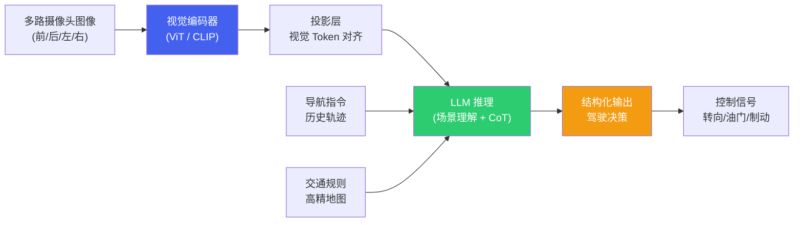
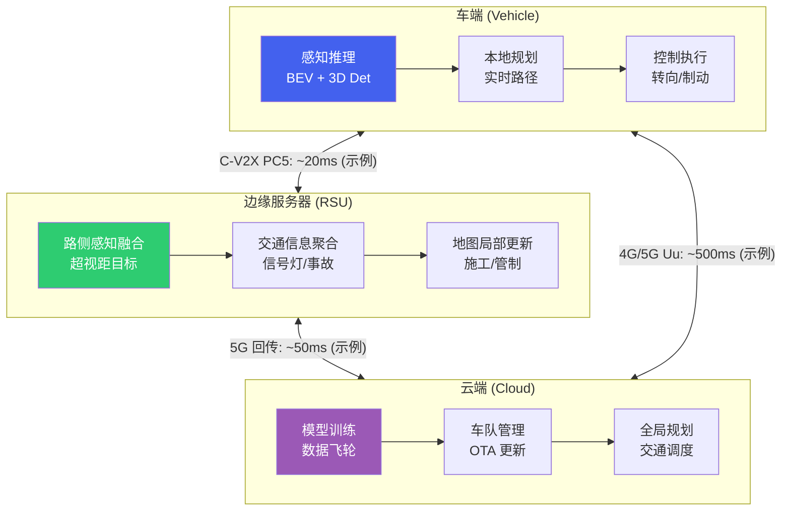
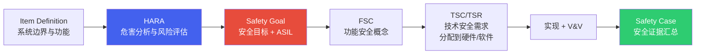
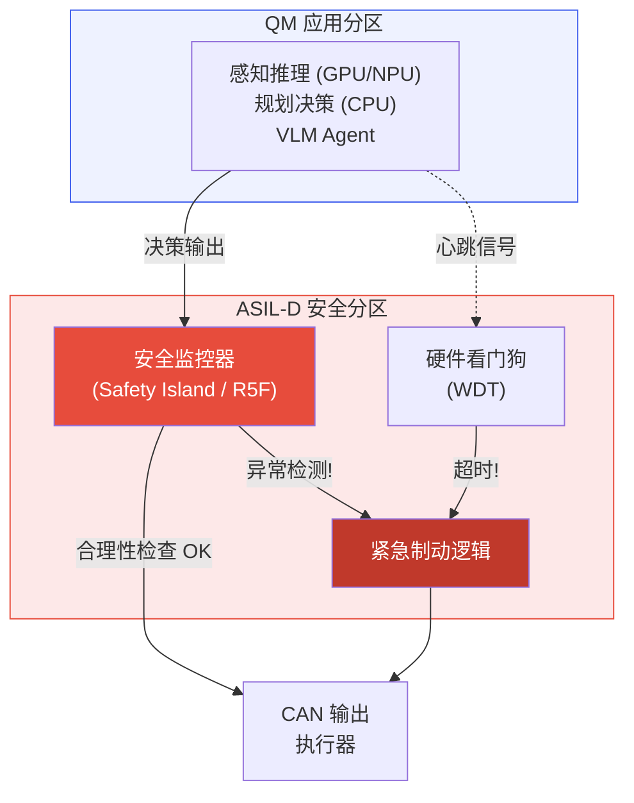
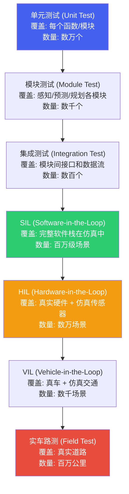

# 4. 驾驶 Agent 与安全

*VLM 驾驶 Agent、端侧部署、V2X 云端协同、功能安全与仿真验证*

> [!TIP]
> **本篇讲什么**
>
> 自动驾驶的「智能体」与「安全兜底」两端，五部分：
>
> - **驾驶 Agent 架构**：VLM 驾驶范式、它与传统感知-预测-规划 pipeline 的取舍
> - **端侧驾驶 Agent 部署**：用带宽/roofline 方法推导 VLM 推理延迟与可行性（不给矛盾的"标准答案"数字）
> - **V2X 与云端协同**：车-边-云的功能分配与断网降级
> - **功能安全 (ASIL)**：ASIL 等级与 PMHF/SPFM/LFM 硬件概率指标、HARA→安全目标→ASIL 分解、安全架构与双系统冗余
> - **仿真验证与测试**：SOTIF 与 ISO 26262 的互补关系、测试金字塔、场景化测试、SIL/HIL、端到端/VLM 的安全论证
>
> 本篇遵循全站「只讲方法不给数」原则：保留 ISO 26262 / SOTIF 等公开标准事实，把端侧 VLM 的性能数字改为**可代入自己平台的推导公式**，文中个别数值一律标注为**示例参数**。

## 1. 驾驶 Agent 架构

### 1.1 VLM 驾驶范式

以 DriveGPT、LMDrive、DriveVLM 为代表的**视觉语言模型 (VLM) 驾驶范式**将自动驾驶重构为一个"看图说话 + 推理决策"的过程：VLM 接收多路摄像头图像，生成场景描述和驾驶推理链 (Chain-of-Thought)，最终输出驾驶决策或控制信号。



一个典型的 VLM 驾驶推理过程：

```text
[Input] 前方摄像头图像 + "请分析当前驾驶场景并给出决策"

[VLM Output]
场景描述: 前方 30m 处有一辆白色轿车正在减速，右侧车道有一辆卡车匀速行驶。
当前车道前方约 100m 处有红灯。路面干燥，天气晴朗。
推理: 前车减速可能是因为看到了远处的红灯。右侧车道被卡车占据，不宜变道。
应当跟随前车减速，保持安全车距。
决策: { "action": "follow", "target_speed": 25, "steering": 0, "reason": "前车减速，红灯在前" }
```

VLM 驾驶范式在工程上有两种落地形态（实际方案常混合使用）：

- **VLM 作为"慢思考系统"**：VLM 负责场景理解与决策建议（秒级），实时控制仍由传统快系统承担——DriveVLM (2024) 的 Dual 形态（VLM 慢系统 + 快驾驶网络）是代表。这种形态与 §4.4 的双系统冗余架构天然衔接，是量产上更稳妥的路线。
- **VLM/多模态大模型直接输出轨迹或控制量**：端到端形态，早期代表如 Waymo EMMA（基于 Gemini）与 Wayve LINGO 系列（均 2024）；2025 年起这条线演化为 **VLA (Vision-Language-Action)** 范式并走向量产——多家车企陆续发布自研 VLA 驾驶大模型（如理想的 MindVLA、小鹏的 VLA，均 2025），NVIDIA 也推出 Cosmos Reason（2025 起）等开源物理 AI 推理模型。能力上限更高，但安全论证难度也最大（见 §5.5）。

### 1.2 VLM 驾驶 vs 传统 Pipeline

| 维度 | VLM 驾驶 Agent | 传统感知-预测-规划 Pipeline |
| :--- | :--- | :--- |
| **可解释性** | 表面高 — 生成自然语言推理过程（但忠实性存疑，见下方 CAUTION） | 低 — 各模块输出数值，人难以理解决策逻辑 |
| **泛化能力** | 强 — 预训练知识覆盖 open-world 场景 | 弱 — 仅能处理训练集中见过的场景 |
| **推理延迟** | 高 — 自回归生成 token 逐个输出 | 低 — 前向传播一次性输出 |
| **安全认证** | 极难 — LLM 输出不确定性高 | 相对可控 — 模块可独立验证（但其中的 DNN 模块同样面临 SOTIF 问题） |
| **长尾场景** | 潜力大 — 常识推理处理未见场景 | 差 — 完全依赖训练数据覆盖 |
| **开发效率** | 高 — prompt engineering 快速迭代 | 低 — 需要大量标注和训练 |
| **硬件需求** | 高 — 7B+ 模型需要强大的 NPU | 中 — 轻量模型即可 |

> [!NOTE]
> **驾驶 Agent 面临"安全长尾"问题**
>
> VLM 驾驶 Agent 的最大挑战不是常规场景的表现 (这方面 LLM 的常识推理能力非常强)，而是**极罕见的安全关键场景**的可靠性。LLM 本质上是一个概率模型，无法提供 100% 的输出保证。一个 0.01% 的错误率在 10 亿次推理中意味着 10 万次错误——对于驾驶场景这是不可接受的。当前的务实方案是将 VLM 作为**辅助决策系统** (Advisory)，而非主控系统。

> [!CAUTION]
> **自然语言推理 ≠ 可信的可解释性**
>
> VLM 输出的 CoT 推理链更像一种"事后叙述"，不保证忠实反映模型真实的决策路径：同一个决策可以配上不同的理由，理由还会被 prompt 措辞引导。因此安全验证**不能把"模型给出了看起来合理的解释"当作决策正确的证据**——最终仍要靠闭环行为测试与统计证据（见 §5）。这是 VLM 驾驶安全论证的核心难题之一。

## 2. 端侧驾驶 Agent 部署

### 2.1 端侧 VLM 推理

将 VLM 部署到车端面临严峻的算力与内存带宽限制。与其记住"某模型在某芯片上多少 tok/s"，不如掌握推导方法——**自回归 decode 的瓶颈通常是内存带宽，而不是算力**。

**Decode 吞吐的带宽模型 (roofline 式推导)**：自回归 decode 每生成 1 个 token，都要把模型权重（外加不断增长的 KV Cache）从内存读一遍。batch=1 时 decode 通常 memory-bound：

```text
单流 decode 吞吐上限 ≈ 内存带宽 (GB/s) ÷ 每 token 需读取的字节数 (GB/token)
每 token 读取字节 ≈ 模型权重字节 + 该步 KV Cache 字节
模型权重字节 ≈ 参数量 × 每参数字节 (FP16=2, INT8=1, INT4=0.5)
```

示例参数（仅演示方法、非实测）：设平台内存带宽 ~200 GB/s，跑一个 7B INT4 模型（权重 ≈ 7×10⁹ × 0.5 B ≈ 3.5 GB），忽略 KV Cache 与调度损失，则单流 decode 上限 ≈ 200 ÷ 3.5 ≈ 57 tok/s。实际再扣除 KV Cache 读取、kernel 启动/调度、prefill 阶段的算力瓶颈，有效吞吐会明显低于该上限。请代入你自己的平台带宽与模型配置计算。

> [!NOTE]
> **Prefill 算力受限、Decode 带宽受限**
>
> - **Prefill**（一次性处理 prompt + 视觉 token）：compute-bound，延迟 ≈ 输入 token 总数 × 每 token FLOPs ÷ 有效算力。
> - **Decode**（逐 token 自回归生成）：memory-bound，每 token 延迟 ≈ 每 token 读取字节 ÷ 内存带宽。
>
> 两段瓶颈不同，延迟预算要分开估，不能混为一谈。

**模型尺寸缩减策略**（本质都是减小"每 token 读取字节"或"token 总数"）：

- **知识蒸馏**：用 70B 模型蒸馏出 3B/1.5B 的驾驶专用模型，保留驾驶场景的推理能力——参数量小，每步读取的权重字节就少
- **INT4 量化**：将 7B 模型从 FP16 (~14 GB) 压缩到 INT4 (~3.5 GB)，每步读取的权重字节降到 1/4，decode 吞吐通常显著提升
- **视觉 Token 压缩**：6 路摄像头的视觉 Token 数量巨大 (如每路 256 tokens = 1536 total)，通过 Perceiver Resampler 压缩到 64 tokens——直接缩短 prefill 长度
- **Speculative Decoding**：用小模型 (1B) 草拟多个 token，大模型 (7B) 并行验证，提升有效吞吐 (代价是额外的验证算力)

### 2.2 场景描述生成

VLM 驾驶 Agent 的输出格式直接影响下游模块的对接效率。两种主要方案：

**结构化输出 (JSON)**：VLM 输出固定格式的 JSON，包含场景元素列表和驾驶决策。优点是下游解析方便、延迟确定；缺点是限制了模型的推理深度和灵活性。

**自然语言输出**：VLM 自由生成场景描述和推理链。优点是推理更深入、更灵活；缺点是需要额外的 NLP 解析步骤，且输出长度不确定。

### 2.3 延迟预算

一次 VLM 驾驶推理可拆成若干**串联阶段**，总延迟是各阶段之和。下表给出每个阶段"由什么决定、怎么估"，而不是填死的数字：

**驾驶 Agent 单次推理延迟分解（方法）**

| 阶段 | 做什么 | 延迟主因 | 估算方法 |
| :--- | :--- | :--- | :--- |
| **视觉编码** | ViT/CLIP 把多路图像编码为视觉特征 | 图像分辨率 × 路数、ViT 规模 | compute-bound：≈ 视觉 token 数 × 每 token FLOPs ÷ 有效算力 |
| **视觉 token 压缩** | Perceiver Resampler 压缩视觉 token | 压缩前/后 token 数 | compute-bound，通常远小于视觉编码 |
| **Prefill** | 一次性处理 prompt + 视觉 token，建立 KV Cache | 输入 token 总数 | compute-bound：≈ 输入 token 数 × 每 token FLOPs ÷ 有效算力 |
| **Decode** | 自回归逐 token 生成输出 | 输出 token 数、内存带宽 | memory-bound：≈ 输出 token 数 × (每 token 读取字节 ÷ 内存带宽) |
| **结构化解析** | 把输出解析为 JSON/决策 | 输出长度、解析方式 | CPU 侧，通常可忽略 (ms 级) |

总延迟 ≈ 视觉编码 + token 压缩 + prefill + decode + 解析。其中 **decode 往往是最大头**（随输出 token 数线性增长），所以压延迟要先压输出长度、再提 decode 吞吐。

VLM 驾驶 Agent 的延迟预算取决于其在系统中的角色。**所需 decode 吞吐 = 输出 token 数 ÷ 延迟预算**，再拿它和 §2.1 带宽模型算出的平台可达吞吐对比，即可判断可行性：

| 角色 | 延迟预算 (示例) | 典型输出长度 | 所需 decode 吞吐 (= token ÷ 预算) | 与端侧带宽上限对比 |
| :--- | :--- | :--- | :--- | :--- |
| **L2+ 辅助 (Advisory)** | <500ms | ~100 tokens | ~200 tok/s | 接近/超过 Orin 级平台 3B INT4 的 decode 上限；需把预算放宽到秒级或缩短输出才稳妥 |
| **L3 决策参与** | <100ms | ~50 tokens (JSON) | ~500 tok/s | 远超当前端侧带宽上限，不可行 |
| **L4 主控决策** | <50ms | ~20 tokens | ~400 tok/s | 远超当前端侧带宽上限，不可行 |

> [!NOTE]
> **端侧硬件可以支持 VLM 辅助决策，但无法支持实时主控**
>
> 判断依据是上面的推导，而不是记结论：**可行输出长度 ≈ decode 吞吐 × 延迟预算**。若你的平台代入带宽与模型尺寸后 decode 吞吐在几十 tok/s 量级，那么 500ms 预算内只能生成十几到几十个 token——足够输出一句简短建议 (如"前方施工，建议变道")，但不足以支撑需要 <100ms 的实时决策长推理链。
>
> 实时主控 (L3+) 与端侧自回归 VLM 之间还差一个数量级。务实路线是：把辅助角色的延迟预算放宽到秒级、缩短输出，等待更高内存带宽的新平台（如 NVIDIA Drive Thor，2025 年起已量产上车），或改用非自回归/结构化一次性输出的方案。

## 3. V2X 与云端协同

### 3.1 车-边-云架构

自动驾驶不是单车智能就能完全解决的——**V2X (Vehicle-to-Everything)** 和云端协同为车端智能提供了超视距感知、全局规划和持续进化的能力。



C-V2X 定义了两种互补的通信模式：**PC5 直连通信**（车-车/车-路/车-人直连，不依赖蜂窝网络覆盖，低时延，承载安全预警类消息）与 **Uu 蜂窝模式**（经基站接入网络/云端，覆盖广、带宽大，承载地图更新与云服务）。这个区分直接影响断网降级设计：蜂窝覆盖丢失时 PC5 直连仍可在邻近车辆与 RSU 之间工作——§3.3 的"断网"要区分"与云端断开"和"蜂窝覆盖丢失"，PC5 安全预警不一定同时失效。

### 3.2 通信延迟与功能分配

不同功能对通信延迟有不同的容忍度，这决定了该功能应部署在车端、边缘还是云端：

| 功能 | 延迟容忍 | 部署位置 | 通信方式 | 断网后果 |
| :--- | :--- | :--- | :--- | :--- |
| **紧急避障** | <10ms | 车端 (Safety Island) | 无需通信 | 无影响 |
| **实时路径规划** | <50ms | 车端 (CPU) | 无需通信 | 无影响 |
| **V2X 安全预警** | <20ms | 边缘 (RSU) | C-V2X PC5 | 丧失超视距预警 |
| **信号灯状态** | <100ms | 边缘 (RSU) | C-V2X / 5G | 回退到视觉识别 |
| **高精地图更新** | <500ms | 边缘/云端 | 5G | 使用缓存地图 |
| **模型 OTA 更新** | 分钟级 | 云端 | 4G/5G/WiFi | 延迟更新 |
| **车队数据回传** | 小时级 | 云端 | WiFi (充电时) | 缓存后补传 |

表中延迟容忍与通信方式为**示例口径**（用于说明功能分配方法），实际指标应由安全目标的 FTTI（可容忍故障时间间隔，见 §4.2）与端到端时序预算推导。

> [!NOTE]
> **OTA 与数据回传不只是工程问题，还是合规问题**
>
> - **网络安全与 OTA**：UNECE **R155**（网络安全管理体系，CSMS）与 **R156**（软件升级管理体系，SUMS）已在欧盟等市场强制实施——表中的"模型 OTA 更新"必须走 R156 要求的版本管理、验证与回滚流程。中国对应的强制性国家标准 **GB 44495-2024**（汽车整车信息安全技术要求）与 **GB 44496-2024**（汽车软件升级通用技术要求）已于 **2026-01-01 起正式实施**。
> - **AI 监管**：欧盟《人工智能法案》(EU AI Act) 2024 年生效、2025–2027 年分阶段适用（通用目的模型义务自 2025 年 8 月起）；车载 AI 主要经由既有车辆型式认证框架（法案附件 I）监管，对车辆这类受监管产品的高风险义务自 2027 年 8 月起适用。
> - **数据回传**：车队数据回传与数据飞轮涉及地图测绘、个人信息与重要数据，在中国需符合《汽车数据安全管理若干规定（试行）》（2021 年施行）等要求，遵循"车内处理、默认不收集、脱敏处理"等原则。

### 3.3 断网降级策略

车端系统必须在**完全断网**情况下仍能安全运行。降级策略：

- **感知**：回退到纯车载传感器模式，丧失超视距感知但保留本地感知能力
- **地图**：使用本地缓存的高精地图 (通常缓存当前路线 + 周边 50km 的地图)，但地图可能不是最新的
- **规划**：切换到保守驾驶模式——降低速度、增加安全距离、避免复杂路口
- **VLM Agent**：完全在本地运行 (使用端侧量化模型)，不依赖云端大模型

> [!NOTE]
> **V2X 是增强而非依赖**
>
> V2X 提供的能力 (超视距感知、交通信号、地图更新) 是对车端智能的**增强**，而非替代。任何依赖 V2X 通信的功能都必须有本地 fallback 方案。这是自动驾驶安全设计的基本原则：**单车智能保底，V2X 锦上添花**。

## 4. 功能安全 (ASIL)

### 4.1 ASIL 等级体系

ISO 26262 定义的 **ASIL (Automotive Safety Integrity Level)** 等级从 A 到 D，D 为最严格。ASIL 等级由三个因素的组合决定：**严重度 (Severity)**、**暴露度 (Exposure)**、**可控性 (Controllability)**。

| ASIL 等级 | 典型场景 | PMHF 失效率要求 | 开发要求 | 代表功能 |
| :--- | :--- | :--- | :--- | :--- |
| **QM** | 非安全功能 | 无要求 | 标准质量管理 | HMI 显示、娱乐系统 |
| **ASIL-A** | 低伤害风险 | <1000 FIT (10⁻⁶/h) | 基本安全流程 | 后车灯控制、雨刷 |
| **ASIL-B** | 中等伤害风险 | <100 FIT (10⁻⁷/h) | 较严格验证 | 座椅加热/热管理、BMS 电池监控 |
| **ASIL-C** | 严重伤害风险 | <100 FIT (10⁻⁷/h) | 严格验证+测试 | EPS 电动转向、AEB 自动紧急制动 |
| **ASIL-D** | 危及生命 | <10 FIT (10⁻⁸/h) | 最严格全流程 | 线控制动/线控转向、安全气囊起爆、自动驾驶安全监控 |

其中 FIT = Failure In Time，1 FIT = 10⁻⁹ 故障/小时。ASIL-D 的 PMHF <10 FIT (即 10⁻⁸/h) 意味着系统平均**连续运行约 1.14 万年** (10⁸ 小时) 才发生 1 次危险硬件故障。

表中代表功能只是行业常见的**示例口径**，不是认证结论：同一功能在不同车型/不同 ODD 下定级可能不同，一切以具体 item 的 HARA 为准（见 §4.2）。两个常见误定级要注意——**ESC 稳定控制与安全气囊起爆通常定为 ASIL D**（稳定性失控与气囊异常起爆都属危及生命的危害），不宜随手放进 ASIL B。

> [!NOTE]
> **ASIL-B 与 ASIL-C 的 PMHF 目标相同，区别在 SPFM/LFM 与开发严格度**
>
> ISO 26262 给 B 和 C 的 PMHF 目标都是 <10⁻⁷/h (<100 FIT)，它们的差异体现在单点故障指标 SPFM、潜伏故障指标 LFM 以及开发/验证流程的严格程度上：
>
> | 硬件概率指标 | ASIL-B | ASIL-C | ASIL-D |
> | :--- | :--- | :--- | :--- |
> | **SPFM** (单点故障指标) | ≥90% | ≥97% | ≥99% |
> | **LFM** (潜伏故障指标) | ≥60% | ≥80% | ≥90% |
> | **PMHF** (随机硬件失效概率) | <10⁻⁷/h | <10⁻⁷/h | <10⁻⁸/h |
>
> 把 ASIL-C 误写成 <10 FIT、ASIL-D 误写成 <1 FIT，是常见的"整体左移一档"错误——记住锚点：**D 是 10⁻⁸/h = 10 FIT，C/B 是 10⁻⁷/h = 100 FIT，A 是 10⁻⁶/h = 1000 FIT**。
>
> 另一个易被忽略的版本差异：**ISO 26262-5:2018 版已不再为 ASIL A 规定 PMHF/SPFM/LFM 目标值**——"A 是 10⁻⁶/h = 1000 FIT"出自 **2011 版**，工程文档中仍常作参考引用，但引用时要注明版本。

### 4.2 从 HARA 到安全需求：推导链与 ASIL 分解

ISO 26262 的安全需求不是拍脑袋定的，而是沿 V 模型逐层推导，ASIL 只是这条链上每一层需求的"风险等级标签"：



- **HARA**：对 item 的每个"功能危害"（如非预期加速、错误转向干预、制动迟滞）按三个维度评估——**严重度 S (S0–S3)**、**暴露度 E (E0–E4)**、**可控性 C (C0–C3)**——经 ISO 26262-3 的风险矩阵映射为 QM / ASIL A–D。§4.1 的三因素即来源于此。
- **Safety Goal（安全目标）**：由危害推导出的顶层安全需求（如"系统不得产生持续的非预期加速"），带 ASIL 等级，并定义安全状态与 **FTTI（可容忍故障时间间隔）**——从故障发生到必须进入安全状态的最大时间窗。
- **FSC → TSC**：功能安全概念回答"需要哪些安全功能"（如扭矩监控、驾驶员超驰优先）；技术安全需求回答"系统如何实现"——分配到具体硬件/软件组件，带诊断覆盖率、响应时间等量化要求。

**ASIL 分解 (ASIL Decomposition)** 是让高 ASIL 需求工程可落地的关键机制：一条 ASIL D 需求可以拆到两条（或多条）**足够独立**的冗余路径上共同满足，例如：

```text
ASIL D = ASIL C(D) + ASIL A(D)
ASIL D = ASIL B(D) + ASIL B(D)
ASIL D = ASIL D(D) + QM(D)
```

括号里的 "(D)" 表示这些路径都源自同一个 ASIL D 安全目标。分解有两个硬性前提：其一，**独立性必须论证**——需要做相关失效分析 (DFA) 排除共因失效（共用电源、时钟、软件库、温度环境都可能是共因源）；其二，**分解不降低安全目标**——它只发生在需求分配层面，安全目标本身的 ASIL 不变。

§4.4 的"QM 主系统 + ASIL-D 安全监控"双系统架构，正是 `ASIL D(D) + QM(D)` 这条分解的工程化体现：性能路径可以 QM，安全目标由独立的监控路径兜底。

### 4.3 安全架构



安全架构的核心设计原则：**ASIL-D 安全监控器独立于 QM 应用**，即使 GPU 死机、操作系统崩溃、DNN 输出异常，安全监控器仍能独立执行紧急制动。这种分区的硬件基础（Safety Island、lockstep CPU 与 SoC 选型）见[自动驾驶算力平台](soc-platform.html)。

### 4.4 双系统冗余

**主系统 (Primary)**：高性能 GPU/NPU，运行完整的感知-预测-规划 pipeline，提供最优驾驶体验。安全等级 QM。

**备用系统 (Backup)**：低功耗安全 MCU (如 Cortex-R5F)，运行简化的安全算法 (如基于传统 CV 的障碍物检测 + 紧急制动)。安全等级 ASIL-D。备用系统的算力有限 (示例参数：<1 TOPS)，但响应确定 (示例参数：<5ms) 且通过完整的安全认证。

双系统冗余的核心难点不是"有两套系统"，而是**仲裁：谁有控制权、何时切换、如何避免争抢**：

- **监控器不复刻完整驾驶功能**：它对主系统输出做合理性检查 (范围/变化率/一致性) 与超时监控，异常时触发接管；
- **接管判据必须确定且带迟滞/去抖**，避免主备在临界条件下来回震荡；
- **接管后执行 MRM (最小风险策略)**，把车带入 MRC (最小风险状态)——如本车道内受控减速停车或靠边停车，而不是简单"断电"。

另一对易混淆的概念：**Fail-safe** 指故障后系统告警并把控制权交还驾驶员（L2 可接受）；**Fail-operational** 指单点故障后系统仍能继续运行并完成 MRM（L3+ 必须——不能假设驾驶员能瞬间接管）。这是 L3+ 系统的冗余设计要求远高于 L2 的根本原因。

### 4.5 Watchdog 机制

| 看门狗类型 | 监控对象 | 超时时间 | 触发动作 |
| :--- | :--- | :--- | :--- |
| **软件 WDT** | 应用进程心跳 | 50-200ms | 进程重启 / 降级 |
| **硬件 WDT** | CPU/OS 存活 | 100-500ms | 系统复位 / 安全停车 |
| **Flow Monitor** | 数据流完整性 | 帧级 (33-100ms) | 丢帧告警 / 切换备用源 |
| **Deadline Monitor** | 任务完成时间 | 按任务定义 | 跳过当前帧 / 使用上帧结果 |

表中超时时间为**示例区间**，实际标定的上限是对应安全需求的 FTTI（§4.2），下限是任务周期。这套监控与 AUTOSAR 看门狗框架的三种监督模式对应：**Alive Supervision**（存活，即软/硬件 WDT）、**Deadline Supervision**（时限，即 Deadline Monitor）、**Logical Supervision**（逻辑顺序，即 Flow Monitor 这类跨步骤的数据流/程序流检查），三者组合才构成完整的程序流监控。

> [!CAUTION]
> **ASIL-D 不只是一个数字，而是全流程安全管理**
>
> 达到 ASIL-D 不仅仅是写好代码——它要求**全流程**的安全管理：危害分析与风险评估 (HARA)、安全概念 (Safety Concept)、技术安全要求 (TSR)、软件/硬件安全需求、相关失效与硬件安全分析 (FMEA/FTA/DFA)、安全验证 (V&V)，最终把所有安全证据汇总成 **Safety Case（安全论证）**，并经过独立的确认措施评审与第三方认证。§4.1 的 PMHF <10 FIT (10⁻⁸/h) 只是这条链上的一个硬件指标。这是为什么自动驾驶安全认证的成本远超算法开发本身。

## 5. 仿真验证与测试

### 5.1 SOTIF (ISO 21448)

**SOTIF (Safety Of The Intended Functionality)** 关注的不是传统功能安全中的"硬件/软件故障"，而是**在没有故障的情况下，系统功能本身的局限性导致的安全风险**。这对 AI 驱动的自动驾驶尤为重要——DNN 模型在训练分布外的场景可能产生错误输出，即使硬件和软件都在正常工作。ISO 21448 于 2019 年首次发布，现行版本为 **ISO 21448:2022**。

SOTIF 与 ISO 26262 的分工是功能安全里最容易混淆的一点，两者**互补而不替代**——一个系统必须同时满足二者：

| | ISO 26262 (功能安全) | ISO 21448 (SOTIF) |
| :--- | :--- | :--- |
| **管什么** | **E/E 系统失效**导致的不合理风险 | **无失效时功能不足/性能局限**导致的危害事件 |
| **典型触发** | 硬件随机失效、软件系统性缺陷、供电丢失 | AI 感知局限 (误检/漏检)、传感器物理极限 (眩光/暴雨)、ODD 边界、可预见的误用 |
| **核心方法** | HARA → ASIL → 安全需求 → 硬件概率指标 (SPFM/LFM/PMHF) | 场景空间四象限分析 (见下) → 验证覆盖度 + 残余风险论证 |
| **对 AI 的适用性** | 流程与指标不为数据驱动模型设计——ML 组件的"失效"表现为性能不足，难以套用传统故障模型 | 天然面向 AI/感知的性能局限 |

针对 AI/ML 组件，两者之间还有一层桥接标准：**ISO/PAS 8800《道路车辆 — 安全与人工智能》**（2024 年以 PAS 形式发布），就 AI 特有危害、数据安全需求与学习过程的安全管理给出专门指南，是目前对端到端/大模型驾驶系统做安全论证时最直接的 AI 安全标准依据；ISO/TC 22/SC 32 的相关标准化工作在 2025–2026 年仍在持续推进（后续修订与配套标准动态**需核实**）。通用功能安全侧还有 **ISO/IEC TR 5469:2024《功能安全与 AI 系统》**，按安全影响把 AI 组件分为三类 (SI/SCII/SIII)，可与 8800 对照使用。

SOTIF 分析的核心框架将场景空间划分为四个区域：

| 区域 | 已知? | 安全? | 描述 | 应对策略 |
| :--- | :--- | :--- | :--- | :--- |
| **Area 1** | 已知 | 安全 | 系统能正确处理的常规场景 | 标准测试覆盖 |
| **Area 2** | 已知 | 不安全 | 已知的系统局限性 (如大雾时感知失效) | 设计限制 (ODD) + 降级策略 |
| **Area 3** | 未知 | 不安全 | 未知的不安全场景 (最危险) | 持续测试发现 + 数据飞轮 |
| **Area 4** | 未知 | 安全 | 未测试但实际安全的场景 | 无需特别关注 |

SOTIF 的目标是**同时缩小 Area 2 (已知不安全) 和 Area 3 (未知不安全)**：Area 2 靠设计限制 (ODD) 与降级策略压缩，Area 3 靠系统性场景分析、大规模仿真、实车路测和数据飞轮持续发现来压缩。只盯着 Area 3 是不完整的——Area 2 同样是必须收敛的不安全场景。

### 5.2 测试金字塔



### 5.3 场景化测试

自动驾驶的测试不是简单的"跑多少公里"，而是**场景化测试 (Scenario-based Testing)**——构建覆盖各种交通场景的测试库，系统性验证系统在每种场景下的表现。

**场景库构建**：

- **标准场景库**：基于 Euro NCAP、C-NCAP、ISO 34502 等标准定义的测试场景 (如 AEB 行人横穿、LKA 弯道保持)
- **数据驱动场景**：从实车数据中提取的真实交通场景，参数化后生成大量变体 (改变车速、距离、角度等)
- **对抗场景**：使用对抗生成方法自动搜索系统最容易失效的场景参数组合
- **世界模型与神经重建**：用世界模型与神经场景重建 (NeRF/3DGS) 做场景生成——把真实 corner case 重建成可编辑的仿真资产，或用生成式模型直接合成新的场景变体，缓解"长尾场景测不完"的问题。2025 年起进入规模化应用：NVIDIA Cosmos (2025) 提供开放的世界基础模型平台，Wayve GAIA-2 (2025) 面向驾驶做可控多视角场景生成（世界模型原理见 [BEV 感知与端到端](perception.html)）
- **组合爆炸**：天气 (晴/雨/雪/雾) x 光照 (白天/黄昏/夜晚) x 道路 (直线/弯道/路口) x 目标 (车辆/行人/自行车) = 海量组合

场景要能在不同仿真工具间可执行、可比较，需要统一的描述格式：ASAM **OpenSCENARIO**（动态场景：交通参与者的行为与交互）与 **OpenDRIVE**（静态路网）是行业事实标准；ISO 34503 则规范了运行设计域 (ODD) 的描述方法。

**覆盖度指标**：

| 覆盖维度 | 指标 | 目标 |
| :--- | :--- | :--- |
| **场景类型覆盖** | 覆盖的标准场景数 / 总标准场景数 | >95% |
| **参数空间覆盖** | 测试过的参数组合 / 总参数空间 | >80% (关键区域 100%) |
| **ODD 边界覆盖** | 测试过的 ODD 边界条件 / 总边界条件 | 100% |
| **代码覆盖** | 被测试执行的代码行数 / 总代码行数 | >90% (安全关键 100%) |

表中目标值为**示例口径**——覆盖度没有放之四海皆准的"及格线"，实际验收标准应按项目定义，并在 Safety Case 中论证其充分性。

### 5.4 HIL/SIL 测试架构

**SIL (Software-in-the-Loop)**：完整的自动驾驶软件栈运行在 PC/服务器上，传感器数据完全由仿真器 (如 CARLA、51Sim 等；曾经常用的 LGSVL/SVL 已停止维护) 生成。优势是可以大规模并行运行 (数百个实例)，一天内跑完数百万个场景。

**HIL (Hardware-in-the-Loop)**：自动驾驶软件栈运行在真实的域控制器硬件上，传感器数据由仿真器通过高速接口注入。验证的是**真实硬件上的性能和时序**——SIL 中可能不出问题的延迟/内存/调度问题，在 HIL 中会暴露。

| 测试级别 | 验证内容 | 典型覆盖场景数 | 执行时间 | 成本 |
| :--- | :--- | :--- | :--- | :--- |
| **Unit Test** | 函数正确性 | 数万 | 分钟级 | 极低 |
| **Module Test** | 模块功能和性能 | 数千 | 小时级 | 低 |
| **Integration Test** | 模块间接口一致性 | 数百 | 小时级 | 中 |
| **SIL** | 软件栈完整功能 | 百万级 | 天级 (并行) | 中 |
| **HIL** | 硬件时序和资源 | 数万 | 天级 | 高 |
| **VIL** | 真车动力学响应 | 数千 | 周级 | 很高 |
| **Field Test** | 真实世界表现 | 百万公里 | 月级 | 极高 |

> [!TIP]
> **仿真测试是自动驾驶安全验证的基石**
>
> RAND Corporation 的研究表明，要以 95% 的置信度证明自动驾驶系统比人类驾驶安全 20%，需要**约 110 亿英里**的实车测试——这在实际中不可行。因此，仿真测试 (SIL/HIL) 是唯一可行的大规模验证手段。关键是确保仿真的**保真度 (Fidelity)**——仿真中通过的场景在真实世界中也必须通过。仿真保真度验证本身也是一个重要的研究课题。

### 5.5 端到端 / VLM 模型的安全论证

传统 pipeline 可以逐模块分解验证，端到端 / VLM 模型切断了这条路——输入到输出之间没有可独立验证的中间接口，生成式模型的行为也无法穷举。行业目前的务实策略不是"证明模型永远正确"，而是**四层证据的组合**：

1. **分层兜底 (containment)**：把模型当 QM 组件，输出由 ASIL 等级的安全监控器/安全包络把关（§4.3、§4.4）——"模型可以错，但错误到不了执行器"；
2. **ODD 限定与降级**：明确运行设计域，边界条件（暴雨、超出区域、传感器退化）下受控降级或退出，压缩 SOTIF 的 Area 2/3（§5.1）；
3. **统计证据**：场景化仿真 + 影子模式 + 数据飞轮（见 [BEV 感知与端到端](perception.html)）提供大规模行为证据，用"统计置信"替代"模块级证明"；
4. **结构化 Safety Case**：把上述证据组织成可审计的论证结构（如面向自主产品的 UL 4600 安全案例方法），AI 组件的开发过程参考 ISO/PAS 8800 的指南。

一句话：**端到端 / VLM 的安全不是被"证明"出来的，而是被"兜住 + 验证 + 论证"出来的**——这也解释了 §1.2 的结论：当前 VLM 的务实定位是辅助决策系统，而非主控。
