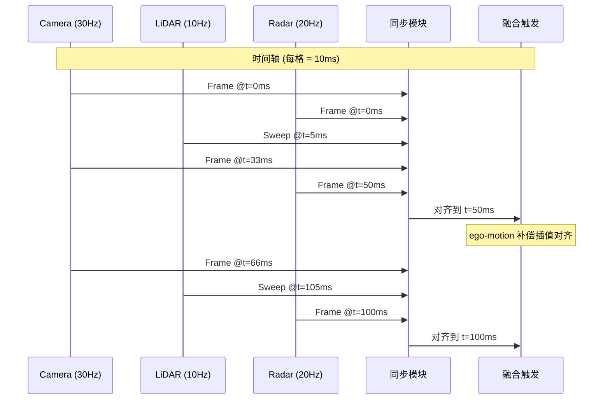
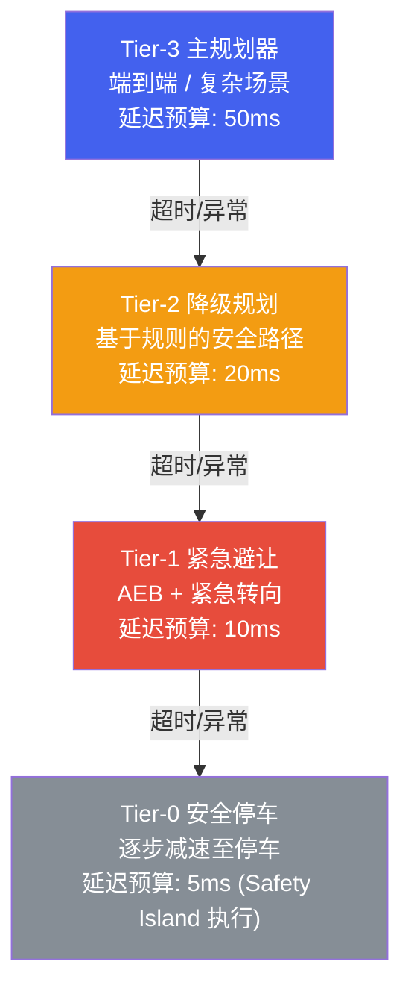

# 3. 端侧部署

*BEV 感知、多传感器融合与规划控制的端侧落地 | 量化 · 时序缓存 · 时间同步 · Fallback*

> [!TIP]
> **本篇讲什么**
>
> 把训练好的自动驾驶模型真正压进车端算力预算，三部分：
>
> - **BEV 模型端侧部署**：部署流水线、BEV 特有算子的量化难点、时序特征缓存的显存推导、量化友好/不友好算子清单
> - **多传感器融合部署**：传感器帧率与时间/空间同步、同步误差如何换算成位置误差
> - **规划与控制部署**：轻量化规划模型、实时安全约束检查、多级 Fallback 降级架构
>
> 本篇遵循全站「只讲方法不给数」原则：保留公开的算子/协议事实，把性能与显存数字改为**可代入自己平台的推导公式**，文中个别数值一律标注为**示例参数**。

## 1. BEV 模型端侧部署

### 1.1 部署流水线

BEV 感知模型从 PyTorch 训练到端侧部署的完整流水线涉及多个关键步骤，其中最大的挑战在于 **BEV 特有算子的量化**和**时序特征的高效缓存**。


### 1.2 BEV 特有的量化挑战

BEV 模型相比传统检测模型有特殊的量化难点：

**Deformable Attention 量化困难**：BEVFormer 的核心算子 Deformable Attention 包含动态偏移量 (offset) 的采样过程。偏移量的微小量化误差会被放大为采样位置的显著偏移，导致注意力机制"看错位置"。解决方案：将 offset 计算保持 FP16 精度，仅对 value projection 做 INT8 量化。

**空间变换层精度敏感**：View Transform (将 2D 特征投影到 3D BEV 空间) 涉及大量的坐标变换和插值运算，对数值精度极为敏感。LSS 中的深度分布估计 (softmax + outer product) 在 INT8 下会出现明显精度下降。建议对 View Transform 模块整体使用 FP16 或 INT16。

### 1.3 时序特征缓存

BEV 模型的时序融合需要缓存前帧的 BEV 特征。显存占用可直接由特征尺寸推导，不必记"标准答案"：

```text
单帧 BEV 特征显存 = H × W × C × 每元素字节数
示例：200 × 200 × 256，FP16 (2 B/元素)
     = 200 × 200 × 256 × 2 B
     = 20,480,000 B ≈ 20 MB
缓存 N 帧 → 显存 ≈ N × 20 MB（FP32 则翻倍，约 40 MB/帧）
```

> [!NOTE]
> **常见口径错误：FP16 不是 FP32**
>
> 200×200×256 的 BEV 特征，**FP16 约 20 MB**（×2 字节），**FP32 才约 40 MB**（×4 字节）。把 FP16 写成 40 MB 是把 FP32 的数字误挂到了 FP16 标签上。缓存多帧时按帧数线性放大即可。

在端侧部署中的优化策略：

- **特征压缩**：通过 1x1 Conv 将 BEV 特征从 256 维压缩到 64 维再缓存，减少 75% 内存占用
- **选择性缓存**：只缓存前 1 帧 (而非论文中的多帧)，在精度损失可接受的前提下大幅减少内存
- **环形缓冲区**：使用固定大小的环形缓冲区管理多帧特征，避免动态内存分配
- **异步写入**：当前帧推理与上一帧特征写入并行执行，隐藏内存带宽延迟

### 1.4 量化友好/不友好算子

| 算子类型 | 量化友好度 | 推荐精度 | 说明 |
| :--- | :--- | :--- | :--- |
| **标准卷积 (Conv2D)** | 高 | INT8 | 权重分布均匀，量化损失小 |
| **Batch Normalization** | 高 | 融合到 Conv | 推理时折叠到卷积，无额外开销 |
| **标准注意力 (MHA)** | 中 | INT8 (Q/K/V) + FP16 (Softmax) | Softmax 对量化敏感 |
| **Deformable Attention** | 低 | FP16 (offset) + INT8 (value) | 偏移量量化会导致采样位置偏移 |
| **View Transform (LSS)** | 低 | FP16 / INT16 | 深度分布和空间变换精度敏感 |
| **Grid Sample** | 低 | FP16 | 双线性插值对量化误差放大 |
| **检测头 (bbox regression)** | 中 | INT16 | 回归输出精度要求高于分类 |
| **FPN (特征金字塔)** | 高 | INT8 | 特征融合对量化鲁棒 |

## 2. 多传感器融合部署

### 2.1 传感器帧率与同步

自动驾驶系统中，不同传感器的帧率和触发时刻不同：摄像头通常 30Hz，LiDAR 10-20Hz，毫米波雷达 20Hz。融合系统必须解决**时间同步**和**空间对齐**两个关键问题。



### 2.2 时间同步策略

时间同步的精度直接影响融合质量。三种常见策略按精度从高到低排列：

**硬件 PTP (IEEE 1588)**：通过专用硬件时钟同步协议，各传感器共享同一高精度时钟源。同步精度可达 **<1 微秒**，是量产系统的首选。需要传感器支持 PTP 协议和专用网络接口。

**软件插值**：当硬件 PTP 不可用时，通过记录各传感器的时间戳，在融合时对数据做线性/样条插值对齐到统一时刻。同步精度约 **1-5 毫秒**。需要精确的自车运动估计 (来自 IMU 或里程计) 来补偿时间差内的车辆运动。

**NTP fallback**：使用网络时间协议做粗同步，精度约 **10-50 毫秒**。仅作为兜底方案，不适合高速场景。

### 2.3 空间对齐 (标定与补偿)

**外参标定 (Extrinsic Calibration)**：确定各传感器之间的相对位姿 (旋转+平移)。初始标定在工厂完成，运行时需要在线标定维护 (Online Calibration) 来补偿安装位置的微小漂移 (由振动、温度变化引起)。

**Ego-motion 补偿**：不同传感器在不同时刻采集数据，而车辆在此期间发生了运动。必须利用高频 IMU 数据 (100-400Hz) 将所有传感器数据变换到同一时刻的同一坐标系下。

> [!WARNING]
> **同步误差按相对速度换算成位置误差**
>
> 位置误差 ≈ 相对速度 × 同步误差。1ms 同步误差在 100km/h (≈27.8 m/s) 下对应 **≈2.8cm** 位置偏移；若两车对向接近、相对速度达 200km/h，同样 1ms 误差翻倍到 **≈5.6cm**。
>
> 这个偏移是否致命，取决于**关联门限 (association gate) 的松紧**：对近距离、高相对速度目标 (对向来车、切入车辆)，厘米到分米级的偏移就可能让 Camera 与 LiDAR 的检测框无法正确关联 (IoU 下降)，造成**融合退化**——甚至差于单传感器。因此高相对速度场景对时间同步精度是硬性要求 (通常 <1ms)；远距离、低相对速度目标的容忍度稍高 (<5ms)。

## 3. 规划与控制部署

### 3.1 轻量化规划模型

传统规划模块基于优化方法 (如 EM Planner、Lattice Planner)，计算量大但可解释性强。近年来，基于**模仿学习 (Imitation Learning)** 的轻量化规划模型逐渐进入量产视野，通过学习人类驾驶行为直接输出轨迹。

部署模仿学习规划模型的关键挑战：

- **分布偏移 (Distribution Shift)**：模型只见过专家驾驶数据，遇到未见场景时可能输出异常轨迹。需要通过 DAgger (Dataset Aggregation) 或对抗样本训练缓解
- **安全约束注入**：纯数据驱动的模型无法保证满足物理约束 (最大加速度、最小转弯半径)。通常在模型输出后增加一个**运动学可行性检查**层，强制裁剪不可行的轨迹
- **延迟与确定性**：规划模块需要固定周期输出 (通常 10-20Hz)，推理延迟必须严格确定性 (无抖动)。对模型架构有限制——不能使用动态计算图

### 3.2 实时安全约束检查

无论规划模型如何生成轨迹，最终执行前都必须通过一系列安全约束检查（下表时间预算为**示例值**，需按平台实测标定）：

| 检查项 | 方法 | 时间预算 | 失败处理 |
| :--- | :--- | :--- | :--- |
| **碰撞检测** | 轨迹沿线的 BEV 占据检查、膨胀障碍物 | <2ms | 触发重规划或紧急制动 |
| **运动学可行性** | 检查曲率、加速度、jerk 是否超出车辆能力 | <1ms | 裁剪到可行范围 |
| **道路边界约束** | 轨迹点是否在可行驶区域内 | <1ms | 向道路内侧偏移 |
| **时序一致性** | 当前轨迹与上一帧轨迹的跳变是否过大 | <0.5ms | 平滑插值到上一帧 |

### 3.3 Fallback 层级架构

自动驾驶规划系统采用**多级降级 (Fallback)** 架构，确保在高级规划失效时能安全过渡到低级安全模式。

> [!NOTE]
> **这里的 Tier 不是 SAE 自动化等级**
>
> 下文的 Tier-3/2/1/0 指**规划降级层级**（主规划 → 安全停车），与 SAE J3016 的 L0-L5 自动驾驶等级是两回事，不要混淆。之所以不用 "L4/L3" 命名，正是为了避免和 SAE 等级撞名。



| 降级层级 | 运行位置 | 延迟预算 (示例) | 安全等级 | 安全保证 |
| :--- | :--- | :--- | :--- | :--- |
| **Tier-3 主规划器** | GPU / CPU (主系统) | 50ms | QM | 最优轨迹但无安全保证 |
| **Tier-2 降级规划** | CPU (lockstep) | 20ms | ASIL-B | 保守但安全的车道保持 |
| **Tier-1 紧急避让** | CPU (lockstep) | 10ms | ASIL-C | 碰撞前的最后避让 |
| **Tier-0 安全停车** | Safety Island (MCU) | 5ms | ASIL-D | 无条件安全停车 |
