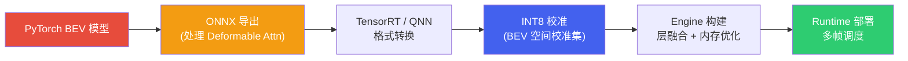
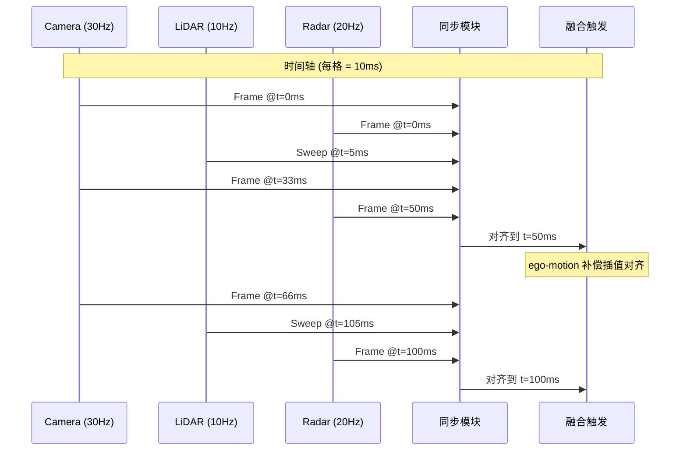
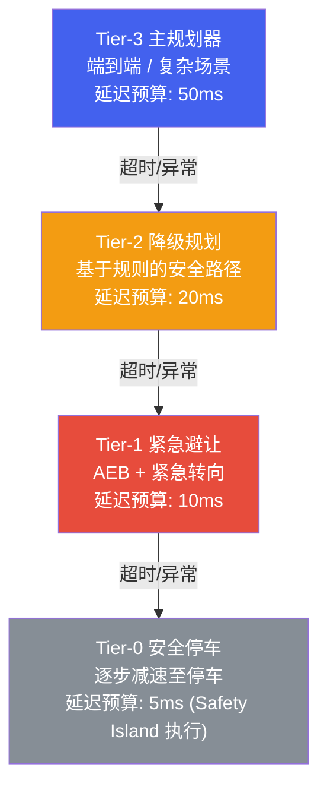

# 端侧部署

*BEV 感知、多传感器融合与规划控制的端侧落地 | 量化 · 时序缓存 · 时间同步 · Fallback*

> [!TIP]
> **本篇讲什么**
>
> 把训练好的自动驾驶模型真正压进车端算力预算，三部分：
>
> - **BEV 模型端侧部署**：部署流水线、BEV 特有算子的量化难点、时序特征缓存的显存/带宽推导、量化友好/不友好算子清单、Occupancy 与端到端部署、INT8/FP8 车规落地
> - **多传感器融合部署**：传感器帧率与时间/空间同步（时钟同步 PTP/gPTP vs 采集同步硬件触发）、时间戳语义、同步误差如何换算成位置误差
> - **规划与控制部署**：轻量化规划模型（优化 vs 学习取舍）、实时安全约束检查、控制层部署、多级 Fallback 降级架构
>
> 本篇遵循全站「只讲方法不给数」原则：保留公开的算子/协议事实，把性能与显存数字改为**可代入自己平台的推导公式**，文中个别数值一律标注为**示例参数**。

## 1. BEV 模型端侧部署

### 1.1 部署流水线

BEV 感知模型从 PyTorch 训练到端侧部署的完整流水线涉及多个关键步骤，其中最大的挑战在于 **BEV 特有算子的量化**和**时序特征的高效缓存**。



> [!NOTE]
> **流水线里三个容易踩的口径**
> - **校准发生在 engine build 内**：TensorRT 的 INT8 是 PTQ——先用校准集跑一遍生成 calibration table（每层 scale），build engine 时消费这张表，所以"INT8 校准"与"Engine 构建"不是两个独立交付物。若走 **QAT**，量化伪节点在 PyTorch 侧训练完成、导出时已带 scale，engine build 直接读取。
> - **时序模型必须把"状态"显式化为图 I/O**：BEV 时序融合依赖上一帧 BEV 特征与自车位姿，ONNX 导出时不能留在图内部当常量，必须暴露成**运行时输入/输出**（prev BEV feature、prev→cur 位姿变换矩阵）由 runtime 在帧间传递；否则要么导出失败，要么把某一帧的位姿/特征"烧死"进权重，换场景即失效。
> - **精度对齐要逐层看，不能只看端到端**：转换后先对比 PyTorch / ONNX / Engine 的逐层输出（cosine / max abs diff），把量化或算子替换引入的误差定位到具体层，再决定混合精度；只盯最终 mAP/NDS 会把问题拖到最后才暴露。

> [!NOTE]
> **工具链口径（2025-2026）**
> - **TensorRT 已进入 10.x 世代**：相比 8.x/9.x 清理了大量旧 API，并强化了 FP8（Blackwell 世代）与 Transformer 类算子支持。注意 DRIVE 平台随 DRIVE OS SDK 交付的是 **TensorRT for DRIVE**，版本节奏与桌面/开源版不同且通常滞后——部署时不要直接套桌面版教程与特性（具体版本对应关系以 DRIVE OS release notes 为准，**需核实**）。
> - **导出路径两条并存**：传统「PyTorch → ONNX → engine」仍是 BEV 特有算子（依赖自定义算子/plugin）的主流；新路径是 **torch.compile + TensorRT 后端（Torch-TensorRT）**，跳过 ONNX 中间层直接编译子图，减少「导出-改图-再对齐」的往返。无论哪条路，deformable attention、voxel pooling 这类引擎不原生支持的算子都要单独处理。
> - **plugin 是长期工程成本**：BEV 特有算子常需自定义 TensorRT plugin / QNN 自定义算子，且随引擎大版本升级要重新验证与维护。因此算子选型时「引擎是否原生支持」要与「量化是否友好」同权重考虑（呼应 §1.4 的 NOTE）。

### 1.2 BEV 特有的量化挑战

BEV 模型相比传统检测模型有特殊的量化难点：

**Deformable Attention 量化困难**：BEVFormer 的核心算子 Deformable Attention 包含动态偏移量 (offset) 的采样过程。偏移量的微小量化误差会被放大为采样位置的显著偏移，导致注意力机制"看错位置"。解决方案：将 offset 计算保持 FP16 精度，仅对 value projection 做 INT8 量化。

**空间变换层精度敏感**：View Transform (将 2D 特征投影到 3D BEV 空间) 涉及大量的坐标变换和插值运算，对数值精度极为敏感。LSS 中的深度分布估计 (softmax + outer product) 在 INT8 下会出现明显精度下降。建议对 View Transform 模块整体使用 FP16 或 INT16。

**为什么"几何/视角变换类算子"量化难（机理）**：它们的误差不是普通数值误差，而是**位置误差**，且无法靠重新校准 scale 修复：

- **概率分布动态范围极小**：LSS 的 depth softmax 输出是概率，绝大多数值接近 0、少数接近 1。INT8 per-tensor 的 scale 被少数大值拉大后，大量小概率被量化成 0 → 深度分布"塌缩"，特征投到错误体素。
- **乘法放大误差**：depth × image feature 的 outer product 是乘法，两路量化误差近似相加；且 depth 与 feature 的动态范围差异大，难以共用一个 scale。
- **累加项数不定**：voxel pooling (splat / scatter-add) 把不定数量的点累加进同一体素，累加结果的动态范围不可预知，per-tensor scale 难定。
- **坐标量化是离散跳变**：采样坐标需要亚像素精度，量化到 INT8 会让采样点跳到相邻像素/体素，产生错位与鬼影——这是"看错位置"，不是"算得不准"。

**时序误差会随帧累积**：时序融合把上一帧（已量化）的 BEV 特征作为输入，量化误差经 temporal attention 传入当前帧并被放大、逐帧累积。由此推出两条工程结论：(a) 时序分支（temporal self-attention、prev-feature 对齐）通常保 FP16；(b) **校准集必须是连续多帧序列**（含自车位姿变化），因为时序分支的输入是模型自己上一帧的输出、分布自洽——用孤立单帧校准会让 prev-feature 的量化 range 失配。

**离群值与校准粒度**：attention score 常出现极端值 (outlier / attention sink)，per-tensor 量化会被它拉大 scale、截断有效信息；需用 per-channel / per-token 校准，或 KL / percentile 校准策略。

**INT8 不够时的选项**：敏感层可退到 INT16（部分车规 NPU 支持）或 FP16；新一代车规平台（如 NVIDIA DRIVE AGX Thor，Blackwell 架构）在公开规格中提供 **FP8**（E4M3 / E5M2）支持——浮点指数位带来更大动态范围，对 outlier 密集的 attention/BEV 比 INT8 更友好，但能否落地取决于工具链（引擎对 FP8 的支持与校准方式），具体算力数值以厂商规格书为准。FP8/FP4 的格式机理与 block scaling（MXFP4/NVFP4）见[端侧模型量化与压缩](../../cockpit/general/quantization.html) §4.3——同口径：FP8/FP4 目前主要是 NVIDIA 车规平台（Thor 世代）的能力，高通 HTP 仍是整数 + FP16 通路。整体上，**纯 PTQ INT8 通常掉点明显，量产多用"混合精度 + QAT"**；QAT 对 attention 与时序分支尤其有效，但需要多帧序列训练、成本更高。

### 1.3 时序特征缓存

BEV 模型的时序融合需要缓存前帧的 BEV 特征。显存占用可直接由特征尺寸推导，不必记"标准答案"：

```text
单帧 BEV 特征显存 = H × W × C × 每元素字节数
示例：200 × 200 × 256，FP16 (2 B/元素)
     = 200 × 200 × 256 × 2 B
     = 20,480,000 B ≈ 20 MB
缓存 N 帧 → 显存 ≈ N × 20 MB（FP32 则翻倍，约 40 MB/帧）
```

> [!NOTE]
> **常见口径错误：FP16 不是 FP32**
>
> 200×200×256 的 BEV 特征，**FP16 约 20 MB**（×2 字节），**FP32 才约 40 MB**（×4 字节）。把 FP16 写成 40 MB 是把 FP32 的数字误挂到了 FP16 标签上。缓存多帧时按帧数线性放大即可。

在端侧部署中的优化策略：

- **特征压缩**：通过 1x1 Conv 将 BEV 特征从 256 维压缩到 64 维再缓存，减少 75% 内存占用
- **选择性缓存**：只缓存前 1 帧 (而非论文中的多帧)，在精度损失可接受的前提下大幅减少内存
- **环形缓冲区**：使用固定大小的环形缓冲区管理多帧特征，避免动态内存分配
- **异步写入**：当前帧推理与上一帧特征写入并行执行，隐藏内存带宽延迟

**带宽账（缓存不只是"占显存"，还要"读回来"）**：缓存 N 帧，每帧推理都要读回这 N 帧特征做融合。以 200×200×256 FP16（≈20 MB/帧，示例参数）、10 Hz、缓存 1 帧为例：每帧读+写 ≈ 2×20 MB，10 Hz 下 ≈ 0.4 GB/s。相对 Orin 级 ~200 GB/s 的内存带宽（示例参数）占比很小——**时序缓存的真正瓶颈通常是显存容量与"对齐变换"的计算，而非带宽本身**（除非缓存帧数很多或特征很大）。但要注意：这部分带宽与图像输入、权重读取、其他模型共享，且非对齐/随机访问的实际有效带宽远低于峰值；若把缓存放到统一内存/系统内存（走总线）而非 GPU 本地，代价会显著上升。

**稀疏 query 缓存比 dense BEV 便宜 1-2 个数量级**：StreamPETR 类方案只缓存上一帧 object query（示例：900×256，FP16 ≈ 0.46 MB / FP32 ≈ 0.92 MB），相比 dense BEV 特征（≈20 MB/帧）节省一两个数量级——这是"稀疏化更易端侧部署"在内存维度的直接体现（呼应 [BEV 感知与端到端](perception.html) §6 的稀疏化端到端）。

**缓存的失效条件与冷启动**：

- **首帧无历史**：系统启动时缓存为空，需零初始化或跑几帧 warm-up，且首帧输出置信度应相应降低。
- **缓存必须可丢弃**：自车位姿跳变（定位丢失/隧道重定位）、传感器丢帧、场景切换时，旧特征已不可对齐，必须**清空缓存**而非硬融，否则把错误特征融进来比没有更糟。
- **对齐 warp 本身量化不友好**：prev BEV 特征要按位姿差做 gather + 双线性插值（呼应 §1.4 的 Grid Sample），且位姿变换矩阵必须作为**运行时输入**，不能固化进权重。

### 1.4 量化友好/不友好算子

| 算子类型 | 量化友好度 | 推荐精度 | 说明 |
| :--- | :--- | :--- | :--- |
| **标准卷积 (Conv2D)** | 高 | INT8 | 权重分布均匀，量化损失小 |
| **Batch Normalization** | 高 | 融合到 Conv | 推理时折叠进卷积；注意 fold 可能放大权重 range，QAT 需与部署一致地 fold |
| **标准注意力 (MHA)** | 中 | INT8 (Q/K/V) + FP16 (Softmax) | Softmax 对量化敏感 |
| **Deformable Attention** | 低 | FP16 (offset) + INT8 (value) | 偏移量量化会导致采样位置偏移 |
| **View Transform (LSS)** | 低 | FP16 / INT16 | 深度分布和空间变换精度敏感 |
| **Grid Sample** | 低 | FP16 | 双线性插值对量化误差放大 |
| **检测头 (bbox regression)** | 中 | INT16 | 回归输出精度要求高于分类 |
| **FPN (特征金字塔)** | 高 | INT8 | 特征融合对量化鲁棒 |
| **Softmax** | 低-中 | FP16（或 INT8 + 查表） | exp 动态范围大、输出分布尖锐，per-tensor 易失真 |
| **LayerNorm / GroupNorm** | 低-中 | FP16 / INT16 | 需 reduction 求均值/方差，中间量动态范围大；**不能像 BN 那样折叠**（依赖输入统计量） |
| **MatMul (QKᵀ / PV)** | 中 | INT8 + 关注 outlier | INT8 可行，但 attention score 离群值需 per-token 校准 |
| **残差 Add / Concat** | 中-高 | INT8 | 数值近无损，但要求多路输入 scale 一致，否则需额外 requantize |
| **Sigmoid / GELU / SiLU** | 中 | INT8（查表） | 通常查表实现，量化可行 |
| **Interpolate / Resize** | 低 | FP16 | 坐标计算 + 加权易失真；任意 scale/align_corners 组合常不被 NPU 支持 → fallback |
| **Scatter / Voxel Pooling (splat)** | 低 | FP16 + plugin | 动态索引 + 累加，多数引擎不支持需自定义 plugin，难量化 |

> [!NOTE]
> **量化友好 ≠ 部署友好：两个维度要分开看**
> - **数值敏感度**（上表主体）：量化后数值误差是否可接受。
> - **引擎支持 / 布局代价**：有些算子数值上无损，却因引擎不支持或需要 layout 转换而成为性能杀手——例如 Interpolate/Resize 的任意 scale、Scatter、自定义采样，常导致**整图被切分、引入 CPU fallback 与 H2D/D2H 拷贝**；Transpose/Reshape 本身无量化问题，但在 NPU 上触发昂贵的内存重排。端侧 profiling 时要同时看"这层量化掉点多少"和"这层是否被引擎原生支持"。

### 1.5 从 BEV 到 Occupancy 与端到端：部署难点如何变化

BEV 检测的部署经验不能直接平移到 Occupancy 与端到端模型，难点会迁移。以下按 **2025-2026** 的进展口径描述（2024 年的稀疏化端到端等视为已铺开的既有方向，不再当"最新"）：

**Occupancy 的端侧难点**（呼应 [BEV 感知与端到端](perception.html) §3）：

- 输出是稠密 3D 体素，显存/算力随分辨率**立方增长**——这是它比 BEV 检测更难上端侧的根本原因。
- 主要减负手段与训练侧一致：**TPV（三视角平面）近似**、**稀疏占据**（只预测近表面体素）、稀疏卷积/稀疏 query；2025 年起**占据-流 (occupancy-flow)** 与稀疏占据进一步成为端侧减负的主流路线。
- 量化上，occupancy 概率输出是 sigmoid 的小概率值，per-tensor 量化易把"弱占据"抹平，通常对输出头保更高精度。
- 端侧常把 occupancy 降分辨率/降帧率运行，与框检测并行：occupancy 兜底未知障碍，检测提供带 ID/速度的实例。

**端到端模型的部署挑战**（呼应 [BEV 感知与端到端](perception.html) §6）：

- **单模型更大、显存更紧**：感知-预测-规划合一，权重 + 中间特征都驻留端侧；多任务共享 backbone 意味着无法"只跑感知"，调度粒度变粗。
- **黑盒不可分模块降级**：模块化方案某模块退化可单独降级，端到端只能整体降级或整体切换，Fallback 设计更依赖外部安全层（见 §3）。
- **量化敏感面更宽**：除 BEV 的难点外，规划输出头、扩散去噪（若用扩散规划）都对精度敏感；扩散多步去噪端侧需蒸馏成少步/单步。
- **稀疏化端到端（如 SparseDrive，2024 年代表工作）已是既有方向**：用稀疏 query 取代稠密 BEV 栅格，计算与内存显著下降；2025-2026 在此基础上进一步稀疏化/向量化，仍是端到端上端侧的减负主线。
- **2025-2026 的新前沿：一段式端到端与 VLA 上车**：量产方案从"两段式/模块化+端到端训练"走向**一段式端到端**，并开始引入 **VLA（视觉-语言-动作）** 大模型。这类模型把部署瓶颈从"算子量化"推向"**大模型本身能否塞进车端 + 自回归 decode 延迟能否达标**"——后者正是 [驾驶 Agent 与安全](agent-safety.html) §2 用带宽/roofline 推导的核心问题（decode 通常 memory-bound），端侧可行性取决于内存带宽与模型尺寸，而非单纯的 INT8 算力。

**INT8 / FP8 在车规芯片的落地现状（2025-2026 口径）**：

- 量产基线仍是 **INT8**：NVIDIA DRIVE Orin（车规 254 TOPS INT8，见 [自动驾驶算力平台](soc-platform.html) §1）、Qualcomm SA8650P、地平线征程6 等均以 INT8 为主要推理精度，敏感层配 FP16/INT16。
- **FP8 于 2025 年进入车规、FP4 开始探索**：NVIDIA DRIVE AGX Thor（Blackwell 架构，2025 年起陆续可用/量产）公开规格提供 FP8/FP4 支持，AI 算力较 Orin 显著提升（具体数值以厂商规格书为准）。FP8 的浮点动态范围对 outlier 密集的 Transformer/BEV/VLA 更友好，但车规落地取决于工具链成熟度。
- 选型口径：**精度格式跟着工具链与算子支持走**，不是"越新越好"；先用 INT8 + 混合精度打基线，再评估 FP8/INT16 是否值得。

> [!IMPORTANT]
> **大模型时代的部署范式转变：从"算子量化"到"带宽、量化格式与调度"**
>
> BEV/CNN 时代的端侧部署三主线是**算子级混合精度量化（W8A8）、延迟预算、显存容量**；VLA/驾驶大模型上车后，三主线全部迁移：
>
> - **量化对象变了**：大模型的主战场是 **weight-only 量化（W4A16/W8A16）**——自回归 decode 是 memory-bound，压权重直接减少每 token 读取字节；激活压 INT8 几乎没有带宽收益、outlier 风险却大。这与 BEV 的 W8A8 混合精度是**两条不同路线，口径不要混用**（W4A16 机理与 group size 取舍见[端侧模型量化与压缩](../../cockpit/general/quantization.html) §3）。
> - **瓶颈变了**：从"INT8 算力 (TOPS)"变成"**内存带宽 + 显存容量**"——可行性由 roofline（带宽 ÷ 每步读取字节）决定，推导见[驾驶 Agent 与安全](agent-safety.html) §2。
> - **状态变了**：**KV Cache** 成为显存/带宽的一等公民——连续视频流下视觉 token 的 KV 体积可迅速超过权重本身，KV 的管理与量化进入部署清单。
> - **调度变了**：从"单模型固定帧率"变成"**快慢系统分频**"——慢系统（VLA）低频给意图/轨迹，快系统（轻量端到端或优化规划器）高频出控制，两者异步衔接（规划侧形态见 §3.1）。

## 2. 多传感器融合部署

### 2.1 传感器帧率与同步

自动驾驶系统中，不同传感器的帧率和触发时刻不同：摄像头通常 30Hz，LiDAR 10-20Hz，毫米波雷达 20Hz，IMU 100-400Hz，GNSS 10-20Hz。融合系统必须解决**时间同步**和**空间对齐**两个关键问题。



> [!NOTE]
> **时间戳的"语义"比"精度"更容易出错**
> - **采集时刻 ≠ 接收时刻**：一帧数据的时间戳应指**采集时刻**（相机用曝光中点，LiDAR 用每个点的打点时刻），而不是驱动收到它的时刻。用接收时间戳当采集时间戳是经典错误——传输（GMSL/以太网）、ISP、驱动缓冲会引入几 ms 到几十 ms 的偏差，且**抖动不定**：固定偏差可标定补偿，抖动不可。
> - **相机 rolling shutter**：卷帘快门下同一帧不同行的实际曝光时刻相差一个读出周期，高速运动产生几何畸变（果冻效应）；严格做法是按行做位姿补偿，或选用 global shutter。
> - **LiDAR 是扫描式采集**：一圈约 100ms，每个点有独立时间戳，必须做运动补偿（deskew）统一到参考时刻，不能整帧套一个时间戳。
> - **时钟同步精度 ≠ 端到端时间戳精度**：PTP 把时钟对齐到微秒级，但数据时间戳仍受曝光/读出/传输/驱动打戳影响，端到端可能仍是 ms 级——瓶颈往往在采集语义与驱动，不在时钟协议。

### 2.2 时间同步策略

时间同步的精度直接影响融合质量。先区分两个**正交的层次**，量产系统两者都要有：

- **时钟同步**：把各节点的时钟对齐，使不同节点打出的时间戳**可比较**；
- **采集同步**：把各传感器的**采集/曝光时刻**对齐，使数据在源头就是同一时刻的。

**时钟同步：三种常见策略按精度从高到低排列**：

**硬件 PTP (IEEE 1588 / 车载 gPTP)**：通过硬件时间戳的时钟同步协议，各节点共享同一高精度时钟源，同步精度可达 **<1 微秒**，是量产系统的首选。车载以太网实际多采用 **gPTP (IEEE 802.1AS)**——PTP 的车载 profile，常配合 TSN 使用，需要选举 grandmaster（通常由 GNSS PPS 提供绝对时间基准）并依赖支持硬件时间戳的交换机/网卡。注意它保证的是**时钟对齐**，端到端时间戳精度还受 §2.1 的采集语义影响。

**软件插值**：当硬件 PTP 不可用时，通过记录各传感器的时间戳，在融合时对数据做线性/样条插值对齐到统一时刻。同步精度约 **1-5 毫秒**（典型量级，示例口径，随实现与运动强度而异）。需要精确的自车运动估计 (来自 IMU 或里程计) 来补偿时间差内的车辆运动。

**NTP fallback**：使用网络时间协议做粗同步，精度约 **10-50 毫秒**（典型量级）。仅作为兜底方案，不适合高速场景。

**采集同步：硬件触发 (hardware trigger)**：时钟同步解决"时间戳可比较"，但不解决"采集时刻对齐"——即使各相机时钟都对齐到微秒，若各自自由运行 (free-run)，6 路相机的曝光起点仍会散布在一个帧周期内，多视角 BEV 特征等于在"不同时刻"采集，运动目标上产生错位与鬼影。量产做法是**触发线同步**：用同一 PPS/GPIO 脉冲同时触发多路相机曝光（曝光起点对齐到 μs 级），LiDAR/雷达则通过 PTP 时标或外部触发接口对齐到触发边沿；相机触发频率常主动降档以对齐 LiDAR（如 30Hz 器件按 10Hz 触发），用帧率换同步。**只有 PTP 没有触发**，采集时刻仍散布、只能靠插值 + ego-motion 事后补偿；**只有触发没有 PTP**，采集对齐了但跨节点时间戳不可比，融合照样出错——两层必须组合使用。

> [!NOTE]
> **两个容易被忽略的坑**
> - **硬件时间戳 vs 接收时间戳**：务必确认传感器/驱动打的是硬件采集时间戳（带硬件时标），而非软件收到数据后才补的接收时间戳；后者把传输与调度抖动算进了"采集时刻"，且不可事后补偿。
> - **时钟漂移与 GNSS 失锁**：本地晶振有 ppm 级漂移，漂移量 ≈ ppm × 时间（示例：10 ppm 晶振 1 秒累积约 10 μs）。隧道/地库 GNSS 失锁后靠晶振 holdover，漂移随时间累积；需监控累积偏差、设定重同步/降级阈值，并评估廉价晶振 + 长时间失锁 + 温度变化对 <1ms 同步预算的侵蚀。

### 2.3 空间对齐 (标定与补偿)

**内参与畸变 (Intrinsic & Distortion)**：相机内参（焦距、主点）与畸变模型（径向/切向）是 BEV 投影的基础，去畸变通常在 ISP/预处理完成；内参误差会直接传导为 BEV 位置误差。

**外参标定 (Extrinsic Calibration)**：确定各传感器之间的相对位姿 (旋转+平移)。初始标定在工厂完成，运行时需要在线标定维护 (Online Calibration) 来补偿安装位置的微小漂移 (由振动、温度变化引起)。在线标定的工程要点：

- **观测量**：常用自然场景自标定（车道线/消失点/地面平面约束）、Camera-LiDAR 互信息最大化、或目标级对齐（同一目标在多传感器检测框的偏差）。
- **平滑 + 限幅 + 置信度**：外参估计要滤波平滑并限制单步更新幅度，避免误标定导致 BEV 特征突然错位——**外参突变比不标定更危险**。
- **可观测性**：某些自由度在特定运动下不可观测（如纯直行时沿光轴的平移），需要充分的运动激励；静止场景无法标定平移分量。
- **警惕"同步误差被误标定为外参误差"**：用运动目标做标定时，时间同步误差会表现为空间错位、污染外参估计——标定前应先确认时间同步达标。

**坐标系约定**：车体坐标系有 ISO 8855（X 前 / Y 左 / Z 上）与 SAE J670（X 前 / Y 右 / Z 下）两套常见约定，混用会导致左右镜像/符号错误，是标定与融合的经典 bug 来源，接口处必须显式约定。

**Ego-motion 补偿**：不同传感器在不同时刻采集数据，而车辆在此期间发生了运动。必须利用高频 IMU 数据 (100-400Hz) 将所有传感器数据变换到同一时刻的同一坐标系下。

> [!WARNING]
> **同步误差按相对速度换算成位置误差**
>
> 位置误差 ≈ 相对速度 × 同步误差。1ms 同步误差在 100km/h (≈27.8 m/s) 下对应 **≈2.8cm** 位置偏移；若两车对向接近、相对速度达 200km/h，同样 1ms 误差翻倍到 **≈5.6cm**。
>
> 这个偏移是否致命，取决于**关联门限 (association gate) 的松紧**：对近距离、高相对速度目标 (对向来车、切入车辆)，厘米到分米级的偏移就可能让 Camera 与 LiDAR 的检测框无法正确关联 (IoU 下降)，造成**融合退化**——甚至差于单传感器。因此高相对速度场景对时间同步精度是硬性要求 (通常 <1ms)；远距离、低相对速度目标的容忍度稍高 (<5ms)。

## 3. 规划与控制部署

### 3.1 轻量化规划模型

传统规划模块基于优化方法 (如 EM Planner、Lattice Planner)，计算量大但可解释性强。近年来，基于**模仿学习 (Imitation Learning)** 的轻量化规划模型逐渐进入量产视野，通过学习人类驾驶行为直接输出轨迹。

**两条路线的取舍**：

| 维度 | 传统优化规划 (EM/Lattice/QP/MPC) | 学习型规划 (IL/RL/扩散) |
| :--- | :--- | :--- |
| **可解释 / 可认证** | 高——约束显式、可分析 | 低——黑盒，难 ASIL 认证 |
| **约束保证** | 有（求解收敛即满足） | 无——需外部安全层兜底 |
| **长尾场景** | 靠手写规则堆叠（规则爆炸） | 数据驱动，泛化潜力大 |
| **延迟特性** | 求解时间不确定（依赖初值/场景） | 前向一次，延迟固定 |
| **cost 设计** | 需人工调权重 | 从数据学习 |
| **数据需求** | 低 | 高（海量专家驾驶数据） |

**量产主流的务实折中**：不是二选一，而是分工——

- **学习型提议 + 优化器精修**：学习模型生成候选轨迹/行为，优化器在其上做硬约束精修，兼顾拟人化与可行性保证；
- **安全过滤器 (Safety Filter / CBF)**：学习模型输出后接一个可验证的安全层，强制裁剪不可行轨迹（呼应 §3.2）；
- **学习型 cost**：用学习模型估计 cost/参数，仍由优化器求解，保留可解释性。

**大模型时代规划的部署形态（2025-2026）**：扩散规划与 VLA 进入规划后，部署侧新增两条硬约束——

- **扩散规划的少步蒸馏**：多步去噪无法满足 10-20Hz 的规划周期，端侧必须蒸馏到 1-4 步甚至单步（呼应 [BEV 感知与端到端](perception.html) §6.4）；蒸馏后计算图固定、单次前向延迟确定，反而契合下文"不能使用动态计算图"的约束。
- **VLA 的快慢分频**：VLA 大模型无法按规划周期出轨迹（自回归 decode 延迟的带宽推导见[驾驶 Agent 与安全](agent-safety.html) §2），量产形态是**慢系统（VLA，1-2Hz 量级，示例）给意图/粗轨迹，快系统（轻量端到端或优化规划器，10-20Hz）在其约束下精修执行**——本质仍是上面"学习型提议 + 优化器精修"的分工，只是提议者换成了大模型；安全兜底层（§3.2）不因此改变。

部署模仿学习规划模型的关键挑战：

- **分布偏移 (Distribution Shift)**：模型只见过专家驾驶数据，遇到未见场景时可能输出异常轨迹。需要通过 DAgger (Dataset Aggregation) 或对抗样本训练缓解
- **安全约束注入**：纯数据驱动的模型无法保证满足物理约束 (最大加速度、最小转弯半径)。通常在模型输出后增加一个**运动学可行性检查**层，强制裁剪不可行的轨迹
- **延迟与确定性**：规划模块需要固定周期输出 (通常 10-20Hz)，推理延迟必须严格确定性 (无抖动)。对模型架构有限制——不能使用动态计算图

**优化规划端侧化的实时性难点**：优化求解的耗时**不确定**（迭代次数依赖初值与场景复杂度），而实时系统需要 WCET（最坏执行时间）保证。常用手段：**固定迭代次数 + 提前终止**（用上一帧解做 warm start 热启动）、**显式 MPC**（把 QP 解离线参数化为分段仿射函数，在线只查表）、以及把求解放在确定性强的 CPU 核上并隔离。

### 3.2 实时安全约束检查

无论规划模型如何生成轨迹，最终执行前都必须通过一系列安全约束检查（下表时间预算为**示例值**，需按平台实测标定）：

| 检查项 | 方法 | 时间预算 | 失败处理 |
| :--- | :--- | :--- | :--- |
| **碰撞检测** | 轨迹沿线的 BEV 占据检查、膨胀障碍物 | <2ms | 触发重规划或紧急制动 |
| **运动学可行性** | 检查曲率、加速度、jerk 是否超出车辆能力 | <1ms | 裁剪到可行范围 |
| **道路边界约束** | 轨迹点是否在可行驶区域内 | <1ms | 向道路内侧偏移 |
| **时序一致性** | 当前轨迹与上一帧轨迹的跳变是否过大 | <0.5ms | 平滑插值到上一帧 |
| **动力学可行性** | 摩擦圆（侧/纵向加速度耦合）、载荷/坡度/低附着修正 | <1ms | 降速或收紧轨迹 |
| **ODD / 法规约束** | 是否超出设计运行域、限速/禁行区 | <0.5ms | 触发降级（见 §3.4） |

> [!NOTE]
> **安全检查要"确定性"优先**
> - **固定规模**：轨迹离散点数、占据栅格分辨率、膨胀半径都要固定，避免动态循环——检查必须在最坏时间预算内完成。用距离场 (ESDF)/占据栅格做 O(1) 占用查询，避免逐障碍物几何相交。
> - **膨胀随不确定性变化**：感知不确定性大（远距离、低置信度）时膨胀半径应加大，而非固定膨胀。
> - **重规划要有上限**：检查失败触发重规划时必须限制重试次数与总超时，否则会陷入"重规划→再失败"的死循环，最终要能落到紧急制动/降级。
> - **越野/低附着场景**：运动学可行不等于动力学可行——沙地/泥地的摩擦圆远小于铺装路面，动力学检查需按路面附着系数修正（呼应 [越野与非结构化场景](../projects/offroad/offroad-scenarios.html) §5 的端侧落地考量）。

### 3.3 控制层的部署约束

标题写了"规划与控制"，控制层的部署口径同样关键（且常被并入规划讨论而忽略）：

- **频率更高、抖动更敏感**：控制回路通常 50-100Hz（比规划 10-20Hz 高一个量级），直接驱动转向/制动/油门，对延迟抖动极敏感——控制周期不稳会直接体现为车辆抖动。
- **运行位置**：控制算法（PID / LQR / MPC）算力需求低，运行在 CPU（常为 lockstep 安全核）甚至 MCU 上，不依赖 GPU/NPU。
- **执行器延迟必须建模**：转向/制动执行有几十到上百 ms 的响应延迟，规划与控制都必须把它计入（前馈/预测），否则会"慢半拍"导致超调振荡。
- **确定性优先**：控制线程用实时调度（SCHED_FIFO）、绑核隔离，禁止被低优先级任务抢占；控制输出要有速率/幅度限幅，防止异常指令直接打到执行器。

### 3.4 Fallback 层级架构

自动驾驶规划系统采用**多级降级 (Fallback)** 架构，确保在高级规划失效时能安全过渡到低级安全模式。

> [!NOTE]
> **这里的 Tier 不是 SAE 自动化等级**
>
> 下文的 Tier-3/2/1/0 指**规划降级层级**（主规划 → 安全停车），与 SAE J3016 的 L0-L5 自动驾驶等级是两回事，不要混淆。之所以不用 "L4/L3" 命名，正是为了避免和 SAE 等级撞名。



| 降级层级 | 运行位置 | 延迟预算 (示例) | 安全等级 | 安全保证 |
| :--- | :--- | :--- | :--- | :--- |
| **Tier-3 主规划器** | GPU / CPU (主系统) | 50ms | QM | 最优轨迹但无安全保证 |
| **Tier-2 降级规划** | CPU (lockstep) | 20ms | ASIL-B | 保守但安全的车道保持 |
| **Tier-1 紧急避让** | CPU (lockstep) | 10ms | ASIL-C | 碰撞前的最后避让 |
| **Tier-0 安全停车** | Safety Island (MCU) | 5ms | ASIL-D | 无条件安全停车 |

> [!NOTE]
> **Fallback 与功能安全的关系（几个关键口径）**
> - **术语**：SAE J3016 把"主系统失效后退回安全状态"称为 **DDT fallback**，目标是达到 **MRC（Minimal Risk Condition，最小风险状态）**——Tier-0 安全停车就是典型的 MRC / MRM（Minimum Risk Maneuver）。
> - **QM 主规划器为何能存在**：靠 **ASIL 分解 + 独立监控**（freedom from interference）。QM 的主规划器不保证安全，但独立的 ASIL 监控层持续校验其输出并兜底；ASIL-D 不能由 QM 组件"叠加"得到，必须靠独立冗余（如 ASIL-D = ASIL-B(D) + ASIL-B(D) 分解）。
> - **降级链不能是纯串联**：图中箭头是"降级路径"，但若逐层"超时才降"，50+20+10+5ms 串联累加会超出 **FTTI**（可容忍故障时间间隔，见 [驾驶 Agent 与安全](agent-safety.html) §4.2）。实际是**并行监控**——Safety Island 不等主规划器超时，持续独立监控，一旦越界立即抢占。
> - **降级触发源不止"规划超时"**：硬件故障、软件超时、数据质量（传感器健康/丢帧）、ODD 越界、模型置信度低都应触发降级；感知退化（如某相机失效）要联动规划降级（缩小 ODD），而不是等规划自己出错。
> - **降级触发分"故障"与"性能局限"两类**：硬件/软件**故障**归 ISO 26262 管；**无故障的性能局限**——模型置信度低、分布外场景、传感器性能退化（污损/暴雨）、ODD 越界——归 SOTIF (ISO 21448) 管（两者分工见[驾驶 Agent 与安全](agent-safety.html) §5.1）。端到端/大模型时代后者占降级事件的大头：系统没有"坏"，只是"能力不够了"。只监控故障、不监控性能局限，等于把 SOTIF 的 Area 2/3 交给运气。
> - **恢复要防抖动**：从低 Tier 恢复到高 Tier 需要**滞回（hysteresis）+ 冷却时间 + 条件持续满足**，否则会在两级之间来回震荡。
> - **表中"安全等级"为示例分配**：具体 ASIL 由各 OEM 的 HARA（危害分析与风险评估）决定，不是"层级越低 ASIL 越高"的固定映射。
