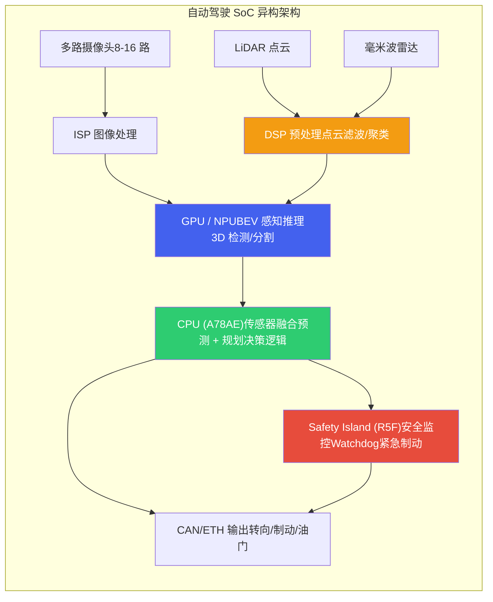
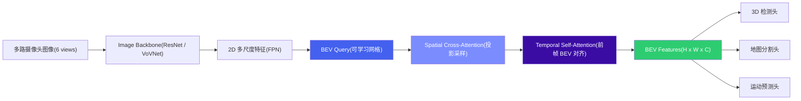
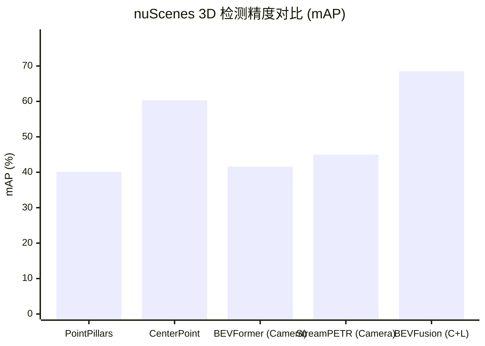
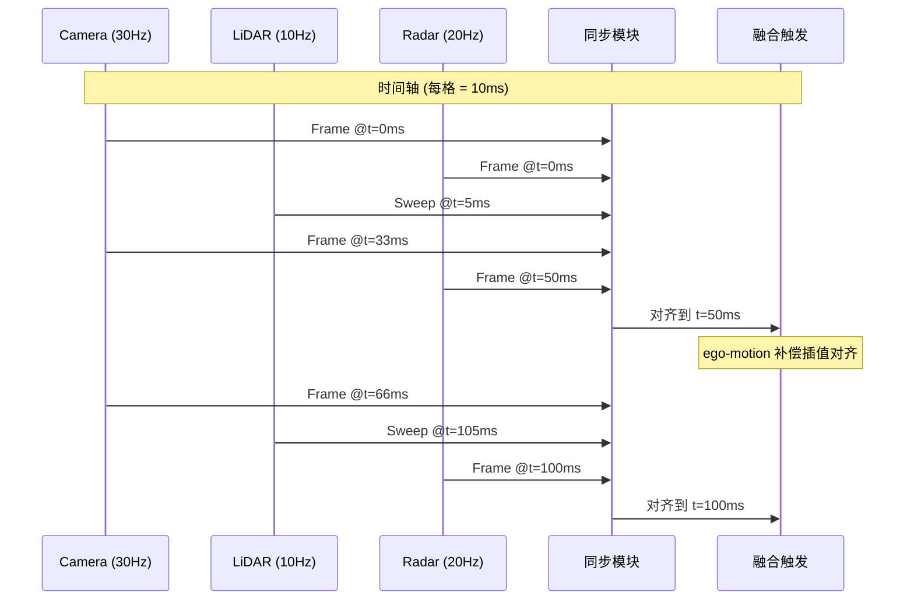
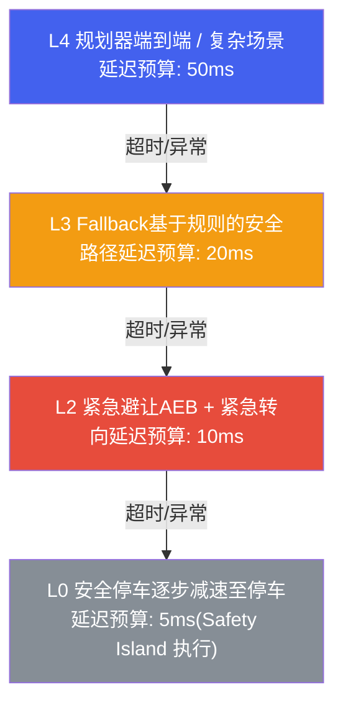
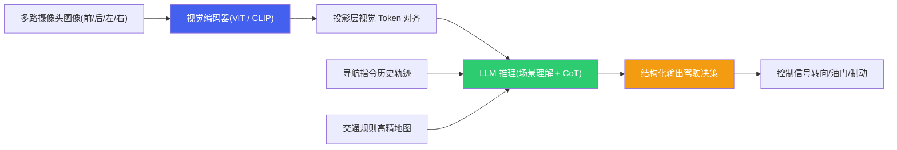
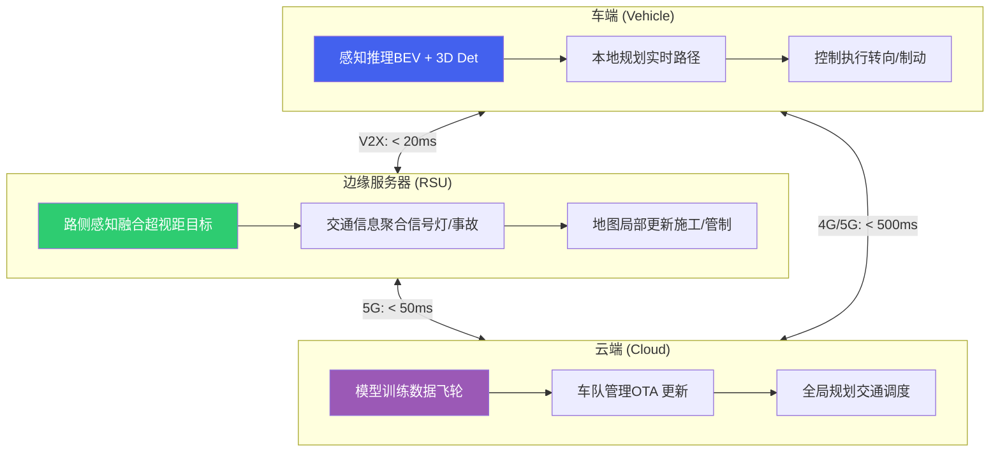
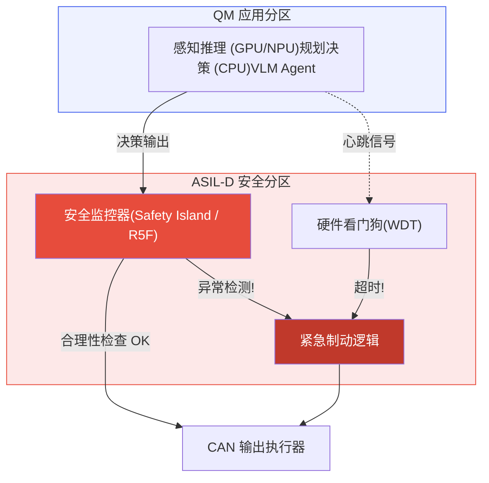
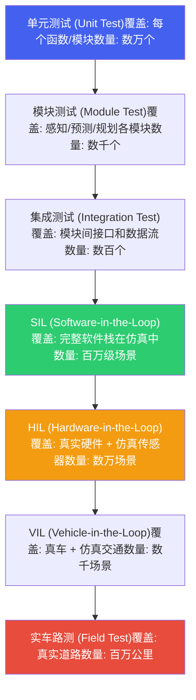

# 自动驾驶 — 学习文档

*端侧 AI 视角下的自动驾驶全栈技术  |  算力平台 · 感知训练 · 端侧部署 · 驾驶 Agent · 功能安全*

> [!TIP]
> **本篇讲什么**
>
> 端侧 AI 视角下的自动驾驶全栈技术学习文档，15 章分 4 部分：
>
> - **第一部分 · 自动驾驶算力平台**（第 1~2 章）：SoC 全景、异构计算架构
> - **第二部分 · 感知算法训练**（第 3~7 章）：BEV 感知、3D 检测分割、端到端模型、越野场景、持续学习与数据飞轮
> - **第三部分 · 端侧部署**（第 8~10 章）：BEV 端侧部署、多传感器融合部署、规划控制部署
> - **第四部分 · 自动驾驶 Agent**（第 11~15 章）：驾驶 Agent 架构、端侧部署、V2X 云端协同、功能安全、仿真验证

**第一部分 · 自动驾驶算力平台**（第 1~2 章）

## 1. 自动驾驶 SoC 全景

### 1.1 主流 SoC 概览

自动驾驶对计算芯片的要求远超智能座舱：需要更高的算力 (TOPS)、更严格的功能安全认证 (ASIL)、更低的推理延迟以及更稳健的热设计。目前主流 SoC 形成了四大阵营，各有侧重。

**Qualcomm SA8650P (Ride Flex)**：Qualcomm 面向 L2+/L3 自动驾驶推出的高性能 SoC。综合算力约 **100 TOPS**，采用 CPU+GPU+NSP (Neural Signal Processor) 异构架构，支持多路摄像头输入和传感器融合。其优势在于同时覆盖座舱和驾驶域 (Ride Flex)，可实现座舱驾驶一芯方案，降低 BOM 成本。支持 QNN SDK 开发，生态与座舱 Snapdragon 系列高度统一。

**NVIDIA Orin (AGX Orin)**：目前高阶自动驾驶领域最广泛使用的 SoC，提供 **254 TOPS** (INT8) 算力，基于 Ampere GPU 架构和 12 核 ARM Cortex-A78AE CPU。CUDA/TensorRT 生态极其成熟，开发效率最高。适合 L3/L4 级别的高算力需求场景，但功耗较高 (典型 45-60W)，且功能安全认证进度相对较慢 (支持 ASIL-D via lockstep CPU)。

**TI TDA4VM**：德州仪器面向 L2/L2+ 前视 ADAS 的高能效 SoC，内置专用深度学习加速器 C7x-MMA，提供约 **8 TOPS** 算力。功耗极低 (典型 5-15W)，是唯一真正达到 **ASIL-D 全系统认证**的主流 AD SoC。非常适合前装量产 ADAS 方案，但算力有限，无法支撑大规模 BEV 模型。

**Mobileye EyeQ6**：Mobileye 采用固定管线 (Fixed Pipeline) + 可编程加速器的混合架构，面向大规模前装量产。其封闭生态限制了灵活性，但成熟的感知算法栈和极高的量产可靠性使其在传统 OEM 中广受欢迎。EyeQ6H 提供约 **34 TOPS**，EyeQ6L 为低成本 L2 方案。

### 1.2 SoC 能力雷达图

**自动驾驶 SoC 能力雷达图**

| 指标 | SA8650P | Orin | TDA4VM | EyeQ6H |
| :--- | :--- | :--- | :--- | :--- |
| AI 算力 (TOPS) | 7 | 10 | 2 | 4 |
| 能效比 | 7 | 5 | 10 | 7 |
| 开发生态 | 7 | 10 | 5 | 3 |
| 安全认证 | 5 | 6 | 10 | 8 |
| BOM 成本 | 8 | 4 | 9 | 7 |
| 灵活性 | 8 | 9 | 4 | 2 |

### 1.3 详细规格对比

| 指标 | Qualcomm SA8650P | NVIDIA Orin | TI TDA4VM | Mobileye EyeQ6H |
| :--- | :--- | :--- | :--- | :--- |
| **AI 算力** | ~100 TOPS (INT8) | 254 TOPS (INT8) | 8 TOPS (INT8) | ~34 TOPS |
| **CPU** | Kryo 685 (8 核) | 12x Cortex-A78AE | 2x Cortex-A72 + 6x Cortex-R5F | 多核 MIPS (封闭) |
| **GPU** | Adreno 730 | 2048-core Ampere | 无独立 GPU | 无 (固定管线) |
| **AI 加速器** | Hexagon NSP | 2x NVDLA + GPU | C7x-MMA DSP | XNN / CVP |
| **功耗** | 25-35W | 45-60W | 5-15W | 12-18W |
| **安全认证** | ASIL-B (向 D 推进) | ASIL-D (lockstep CPU) | ASIL-D (全系统) | ASIL-B/D (量产验证) |
| **摄像头支持** | 最多 18 路 | 最多 16 路 | 最多 8 路 | 最多 12 路 |
| **开发生态** | QNN / SNPE | CUDA / TensorRT | TI TIDL / Edge AI | 封闭 SDK |
| **典型应用** | L2+/L3，座舱驾驶一芯 | L3/L4 高阶智驾 | L2 前视 ADAS | L2/L2+ 前装量产 |

> [!NOTE]
> **没有"最佳" SoC — 选型取决于场景**
>
> 自动驾驶 SoC 的选择必须综合考虑多个维度：
>
> * **L2 vs L4**：L2 ADAS 优先考虑 TDA4VM (低成本、ASIL-D)；L4 Robotaxi 需要 Orin 的高算力
> * **成本 vs 性能**：SA8650P 的座舱驾驶一芯方案可大幅降低 BOM；Orin 性能最强但 BOM 成本最高
> * **开发速度 vs 认证**：Orin 的 CUDA 生态开发最快；TDA4VM 的 ASIL-D 认证最完整
> * **开放 vs 封闭**：Mobileye 交钥匙方案省心但灵活性差；Orin/SA8650P 开放生态适合自研

## 2. 异构计算架构

### 2.1 CPU+GPU+DSP+NPU 协同

自动驾驶域控制器中的异构 SoC 将不同类型的计算任务分配给最适合的计算单元。感知类任务 (卷积、Transformer) 交给 **GPU/NPU**，规划与决策逻辑运行在 **CPU** 上，信号处理和传感器预处理交给 **DSP**，而安全监控则在独立的 **Safety Island (安全岛)** 上运行，确保即使主系统崩溃也能触发安全停车。



### 2.2 算力预算分配

在一个典型的 L3/L4 自动驾驶系统中，算力预算分配大致如下：

| 模块 | 占比 | 运行单元 | 典型任务 |
| :--- | :--- | :--- | :--- |
| **感知** | 60% | GPU / NPU | BEV 特征提取、3D 目标检测、语义分割、车道线识别、交通标志检测 |
| **预测** | 15% | GPU / CPU | 轨迹预测 (其他交通参与者未来运动)、意图识别、交互建模 |
| **规划** | 15% | CPU | 路径规划、行为决策、运动规划、轨迹优化 |
| **系统开销** | 10% | CPU / Safety Island | 传感器同步、数据传输、安全监控、日志记录、OTA 通信 |

### 2.3 功能安全分区

异构 SoC 的功能安全设计核心是**分区隔离**：高性能但不保证安全的应用分区 (QM) 和保证安全的安全分区 (ASIL-D) 独立运行，通过硬件隔离保证一方故障不会影响另一方。

| 分区 | 安全等级 | 运行内容 | 故障后果 |
| :--- | :--- | :--- | :--- |
| **应用分区 (QM)** | QM (无安全要求) | GPU 上的 DNN 推理、高精地图渲染、座舱 HMI | 感知性能降级，触发 fallback |
| **安全分区 (ASIL-D)** | ASIL-D | Safety Island 上的安全监控、Watchdog、紧急制动逻辑 | 不允许故障 (<10 FIT) |
| **安全相关分区 (ASIL-B)** | ASIL-B | CPU lockstep 上的规划验证、碰撞检测 | 触发降级到更低自动化等级 |

> [!WARNING]
> **GPU/NPU 推理通常为 QM 等级**
>
> 当前主流的 DNN 推理引擎 (TensorRT、QNN) 本身**不具备功能安全认证**。因此，感知模块的输出必须由独立的安全监控模块 (运行在 ASIL-D Safety Island 上) 进行合理性检查 (plausibility check)。例如：目标突然消失、检测框面积异常变化等情况需要触发告警。这是当前自动驾驶安全架构的核心设计原则之一。

**第二部分 · 感知算法训练**（第 3~7 章）

## 3. BEV 感知训练

### 3.1 BEVFormer 架构

BEV (Bird's Eye View) 感知是当前自动驾驶感知的主流范式。其核心思想是将多路摄像头的 2D 图像特征统一投影到一个 BEV 平面上，形成**以自车为中心的俯瞰视角特征表示**。在这个统一的 BEV 空间中，3D 目标检测、语义分割、车道线检测等下游任务都可以共享同一套特征，极大简化了多任务架构。

**BEVFormer** 是最具代表性的 Transformer-based BEV 方案。它通过可学习的 BEV Query 与多视角图像特征做空间交叉注意力 (Spatial Cross-Attention)，同时引入时序自注意力 (Temporal Self-Attention) 融合前帧的 BEV 特征，实现时空联合建模。



### 3.2 主流 BEV 方案对比

| 方案 | 核心方法 | 时序融合 | nuScenes NDS | 延迟 (Orin) | 优势 | 劣势 |
| :--- | :--- | :--- | :--- | :--- | :--- | :--- |
| **BEVDet** | LSS 显式深度估计 + Voxel Pooling | BEVDet4D 帧拼接 | ~51.7 | ~45ms | 结构简洁，量化友好 | 深度估计误差较大 |
| **BEVFormer** | Deformable Attention + BEV Query | Temporal Self-Attention | ~56.9 | ~90ms | 精度高，时序建模优雅 | Deformable Attention 量化困难 |
| **StreamPETR** | Sparse Query + Motion-aware | Query 传播 | ~55.0 | ~65ms | 稀疏查询，计算效率高 | 遮挡场景性能受限 |
| **BEVFusion** | Camera BEV + LiDAR BEV 特征级融合 | 可选 | ~69.2 (含 LiDAR) | ~100ms | 多模态融合精度最高 | 依赖 LiDAR，成本高 |

### 3.3 BEV 训练实用技巧

**数据增强 (BEV 空间增强)**：不同于传统的 2D 图像增强，BEV 模型需要在 BEV 空间中做增强，包括 BEV 平面随机旋转、缩放、平移。同时需要保持 2D 增强 (颜色抖动、随机裁剪) 和 BEV 增强之间的空间一致性。

**学习率调度**：BEV 模型通常采用 cosine annealing + linear warmup 策略。Backbone 使用较小的学习率 (1/10 of head)，BEV Query 和 Attention 层使用更高学习率。总训练通常 24 个 epoch (nuScenes) 或 6 个 epoch (大规模私有数据)。

**多任务训练**：3D 检测、地图分割、运动预测等任务共享 BEV Backbone，各自有独立的 Task Head。任务间权重需仔细调整 (通常检测 : 分割 : 预测 = 1.0 : 0.5 : 0.5)，可使用 Uncertainty Weighting 或 GradNorm 自动平衡。

> [!NOTE]
> **BEV 是当前主流范式**
>
> BEV 之所以成为主导方案，关键在于它提供了**统一的表征空间**：3D 检测、语义地图、运动预测都在同一个 BEV 空间中完成，避免了传统方案中各模块使用不同坐标系带来的对齐误差。几乎所有主流量产方案 (Tesla BEV、华为 GOD、小鹏 XNet) 都采用了 BEV 范式。

## 4. 3D 检测与分割

### 4.1 PointPillars (LiDAR-only)

**PointPillars** 是 LiDAR 3D 检测的经典 baseline。它将点云划分为柱状体 (Pillars)，每个 Pillar 内的点通过 PointNet 编码为固定维度的特征向量，然后将所有 Pillar 特征排列成伪图像 (Pseudo-Image)，接入 2D 检测骨干 (如 SSD) 完成检测。其推理速度极快 (~10ms on GPU)，非常适合对延迟敏感的 ADAS 场景。

### 4.2 CenterPoint

**CenterPoint** 采用 center-based 检测范式，无需预定义 anchor。它首先将 LiDAR 点云体素化 (voxelization)，通过 3D Sparse Convolution 提取 BEV 特征，然后用热图 (heatmap) 预测目标中心点，回归 3D bounding box 的尺寸、朝向和速度。CenterPoint 还支持两阶段精化 (second-stage refinement)，进一步提升检测精度。

### 4.3 Camera-LiDAR 联合训练

纯视觉 3D 检测的精度瓶颈在于**深度估计**。Camera-LiDAR 联合训练的核心策略：

- **深度监督**：用 LiDAR 点云投影到图像平面生成深度 GT，对 Camera 分支的深度估计头做监督，显著提升深度估计准确度
- **特征级融合**：Camera BEV 特征和 LiDAR BEV 特征在 BEV 空间做 concatenation 或 attention-based 融合 (如 BEVFusion)
- **训练策略**：先预训练 Camera-only 分支 (用 LiDAR 深度监督)，再联合微调融合模型，效果优于从零开始联合训练

### 4.4 nuScenes 检测精度对比

**nuScenes 3D 检测精度对比 (mAP)**



### 4.5 方法综合对比

| 方法 | 输入模态 | nuScenes mAP | 延迟 (Orin, ms) | 硬件要求 | 量产适用性 |
| :--- | :--- | :--- | :--- | :--- | :--- |
| **PointPillars** | LiDAR | ~40.1 | ~10 | GPU (Sparse Conv) | 高 (成熟稳定) |
| **CenterPoint** | LiDAR | ~60.3 | ~25 | GPU (3D Sparse Conv) | 高 |
| **BEVFormer** | Camera | ~41.6 | ~90 | GPU (Deformable Attn) | 中 (量化挑战) |
| **StreamPETR** | Camera | ~45.0 | ~65 | GPU (Standard Attn) | 中高 |
| **BEVFusion** | Camera + LiDAR | ~68.5 | ~100 | GPU (双模态) | 中 (依赖 LiDAR) |

## 5. 端到端自动驾驶模型

### 5.1 UniAD 架构

端到端自动驾驶 (End-to-End AD) 的核心理念是**用一个统一模型完成从感知到规划的全部任务**，取代传统的模块化 pipeline。**UniAD** (Unified Autonomous Driving) 是这一方向的标志性工作。


UniAD 的关键设计：所有模块共享 BEV 特征，通过 Query 传递的方式进行信息流动——跟踪 Query 传给预测模块，预测结果传给规划模块。这种级联设计使得规划能够感知到完整的场景语义，而不仅仅是检测框列表。

### 5.2 VAD: 向量化场景表示

**VAD** (Vectorized Autonomous Driving) 进一步简化了端到端架构。它将场景中的所有元素 (车辆轨迹、道路边界、车道线) 统一表示为**向量化的折线 (polyline)**，避免了栅格化表示的信息冗余。规划模块直接在向量空间中生成未来轨迹，并通过向量化约束 (与道路边界的距离、与其他车辆的碰撞检查) 确保轨迹安全性。

### 5.3 端到端 vs 模块化对比

| 维度 | 端到端 (E2E) | 模块化 (Modular) |
| :--- | :--- | :--- |
| **灵活性** | 低 — 模型是黑盒，难以单独替换某个模块 | 高 — 感知/预测/规划可独立迭代 |
| **可解释性** | 低 — 决策过程不透明 | 高 — 每个模块有明确的输入输出 |
| **训练数据** | 需要完整的感知+规划标注 (成本极高) | 各模块可独立标注和训练 |
| **部署复杂度** | 低 — 一个模型搞定 | 高 — 多个模型的调度和数据流管理 |
| **性能上限** | 更高 — 梯度可以端到端优化 | 存在模块间信息损失 |
| **安全认证** | 极难 — 无法对黑盒进行 ASIL 认证 | 可分模块认证 |
| **Debug 效率** | 低 — 问题难以定位到具体模块 | 高 — 可逐模块排查 |
| **代表工作** | UniAD, VAD, GenAD | Apollo, Autoware, Tesla (早期) |

> [!WARNING]
> **端到端是研究趋势，但模块化仍主导量产**
>
> 端到端模型在学术 benchmark 上展现了优越的性能，但在量产落地中面临严峻挑战：**功能安全认证**要求系统的每个环节都是可分析、可验证的，而端到端模型的黑盒特性与此根本矛盾。当前的务实路线是 "模块化架构 + 端到端训练"，即保持模块化的架构但允许梯度跨模块传播 (如 Tesla 的 FSD v12 架构)。

## 6. 越野/非结构化场景

### 6.1 越野自动驾驶概述

越野自动驾驶 (Off-road Autonomous Driving) 面对的是与结构化道路完全不同的环境：**没有车道线、没有交通标志、没有明确的道路边界**，取而代之的是复杂多变的自然地形——沙地、泥地、碎石、草地、水坑、树根、灌木等。这使得传统的结构化道路感知算法几乎完全失效，需要从根本上重新设计感知和规划策略。

越野自动驾驶的典型应用场景包括：

- **军事无人车辆**：战场巡逻、物资运输、侦察
- **农业自动化**：田间作业、果园巡检、牧场管理
- **矿山运输**：露天矿自动驾驶卡车、矿区物流
- **灾难救援**：地震、洪水后的搜救机器人
- **星球探测**：火星/月球巡视器的自主导航

### 6.2 地形分类 (Terrain Classification)

越野感知的首要任务是**地形分类**——判断每个像素/区域属于什么类型的地形。与结构化道路的语义分割不同，越野地形分类需要区分的类别更加细粒度，且类别之间的边界更加模糊。

**典型地形类别体系**：

| 大类 | 子类 | 可通行性 | 感知难点 |
| :--- | :--- | :--- | :--- |
| **硬质地面** | 干燥沥青、砾石路、岩石面 | 高通行性 | 与未铺装道路的边界模糊 |
| **松软地面** | 干沙、湿沙、淤泥、松土 | 中/低 (依赖含水量) | 视觉外观相似但物理性质差异巨大 |
| **植被覆盖** | 短草、高草、灌木、落叶堆 | 短草可通行，高草/灌木可能不可通行 | 高度和密度难以从单帧图像判断 |
| **水体** | 浅水坑、深水区、泥水混合 | 浅水可通行，深水危险 | 水深无法从视觉直接判断，反射干扰 |
| **不可通行** | 悬崖、深沟、大型岩石、倒木 | 不可通行 | 几何障碍需要 3D 感知 |

**地形分类模型设计要点**：

- **多尺度特征融合**：地形纹理在不同尺度下有不同的区分度 (沙地的细粒度纹理 vs 岩石的粗糙纹理)，FPN 或 HRNet 类架构更适合
- **时序信息**：单帧图像难以判断地面硬度和含水量，结合连续帧的振动信号 (IMU) 可以推断地面物理性质
- **自监督信号**：车辆实际通过某个区域后的 IMU 振动、车轮打滑率等信号可以作为自监督标签，自动构建地形属性标注

### 6.3 可通行性分析 (Traversability Analysis)

可通行性分析是越野自动驾驶的核心问题，需要综合**几何信息**和**语义信息**来评估每个区域的通行风险。

**几何分析**：利用 LiDAR 点云或双目视觉生成高度图 (Height Map)，计算每个网格的高度、坡度 (Slope)、粗糙度 (Roughness)、阶跃高度 (Step Height)。典型判断规则：

```python
# 几何可通行性分析伪代码
def geometric_traversability(height_map, vehicle_params):
    slope = compute_slope(height_map)          # 坡度 (度)
    roughness = compute_roughness(height_map)   # 粗糙度 (高度方差)
    step = compute_step_height(height_map)      # 阶跃高度 (m)

    # 可通行性评分 (0-1, 1 为完全可通行)
    score = 1.0
    score -= clip(slope / vehicle_params.max_slope, 0, 1) * 0.4
    score -= clip(roughness / vehicle_params.max_roughness, 0, 1) * 0.3
    score -= clip(step / vehicle_params.max_step, 0, 1) * 0.3

    return clip(score, 0, 1)
```

**语义分析**：不同地形类型对应不同的物理属性 (摩擦系数、陷入风险、对车辆的损伤)，需要将地形分类结果映射为可通行性评分：

| 地形类型 | 摩擦系数 | 陷入风险 | 通行性评分 | 推荐速度 |
| :--- | :--- | :--- | :--- | :--- |
| 干燥砾石路 | 0.6-0.8 | 极低 | 0.9 | 30-50 km/h |
| 干沙 | 0.3-0.5 | 中 | 0.5 | 10-20 km/h |
| 湿泥 | 0.1-0.3 | 高 | 0.2 | 5-10 km/h |
| 短草 | 0.4-0.6 | 低 | 0.7 | 15-30 km/h |
| 高草/灌木 | 0.3-0.5 | 中 (隐藏障碍) | 0.3 | 5-10 km/h |
| 浅水坑 (<20cm) | 0.2-0.4 | 中 | 0.4 | 5-15 km/h |
| 岩石面 | 0.7-0.9 | 极低 | 0.6 (颠簸) | 10-20 km/h |

### 6.4 结构化道路 vs 越野：核心差异

越野自动驾驶与结构化道路自动驾驶在几乎每个维度上都存在根本性差异：

| 维度 | 结构化道路 | 越野/非结构化 |
| :--- | :--- | :--- |
| **道路边界** | 车道线、路沿、护栏，边界清晰 | 无明确边界，可通行区域需推断 |
| **交通规则** | 交通法规、红绿灯、标志牌 | 无交通规则，纯物理约束 |
| **目标类别** | 车辆、行人、自行车等有限类别 | 岩石、树木、动物、坑洞等开放类别 |
| **感知核心** | 检测已知类别的目标 | 理解地形物理属性 |
| **规划逻辑** | 遵循车道、保持车距、让行 | 选择可通行路径、避开风险区域 |
| **速度控制** | 限速标志、交通流 | 地形适应性速度 (地形越复杂速度越低) |
| **失败模式** | 碰撞、违规 | 陷车、侧翻、悬挂损坏 |
| **数据可用性** | 海量 (nuScenes, Waymo, KITTI) | 极度稀缺 (RUGD, RELLIS-3D) |

**结构化道路 vs 越野场景对比**

| 指标 | 结构化道路 | 越野/非结构化 |
| :--- | :--- | :--- |
| 数据可用性 | 9 | 3 |
| 模型精度 | 8 | 4 |
| 规划复杂度 | 5 | 9 |
| 安全标准成熟度 | 8 | 2 |
| 传感器依赖度 | 6 | 9 |
| 环境变化性 | 3 | 9 |

### 6.5 数据稀缺问题与解决方案

越野自动驾驶面临的最大困难之一是**数据严重不足**。与结构化道路的海量标注数据 (nuScenes 140万帧、Waymo 1200万帧) 相比，越野数据集规模小了 1-2 个数量级，且场景覆盖不全。

**合成数据生成**：使用 Unreal Engine 5 或 Unity 构建高保真越野场景，程序化生成多种地形 (随机地形高度图 + 材质贴图 + 光照变化)。关键挑战是**Sim-to-Real Gap**——合成数据的纹理、光照、物理行为与真实世界存在差距。

**域适应 (Domain Adaptation)**策略：

- **对抗训练**：DANN (Domain-Adversarial Neural Network) 风格的特征对齐，使模型无法区分合成和真实数据的特征分布
- **风格迁移**：CycleGAN / UNIT 将合成图像的风格转换为真实图像风格，保留语义标签
- **自训练 (Self-training)**：用合成数据预训练模型，在真实无标注数据上生成伪标签，迭代提升
- **对比学习**：使用 MoCo/SimCLR 在大量无标注越野图像上做自监督预训练，学习越野场景的通用特征表示

**少样本学习 (Few-shot Learning)**：针对罕见地形 (如沼泽、冰面)，使用 Prototypical Network 或 MAML 实现仅用 5-10 张标注图像就能识别新地形类别。

### 6.6 越野感知的前沿方向

**自监督可通行性学习**：车辆在实际行驶中，IMU 的振动模式、车轮滑移率、悬挂行程等信号可以自动推断已通过区域的可通行性。将这些信号回溯标注到对应的摄像头帧上，形成自监督训练数据。这种方法无需人工标注，可以在部署中持续积累数据。

**多模态感知融合**：越野场景中单一传感器严重不可靠 (摄像头受尘土遮挡、LiDAR 被草地干扰)，多传感器融合 (Camera + LiDAR + Radar + IMU) 是必须的。特别是 **Radar** 对穿透烟尘、大雨有独特优势，在越野中的价值远高于结构化道路。

**基础模型迁移**：利用 SAM (Segment Anything)、DINOv2 等视觉基础模型在越野场景中做 zero-shot 分割或特征提取，再用少量越野数据微调分类头。初步研究表明 DINOv2 特征在越野地形分类上表现优异，即使不微调也能达到较好的分割效果。

> [!NOTE]
> **越野自动驾驶需要根本不同的感知范式**
>
> 结构化道路的感知是 "检测已知目标" (detect objects)，核心是分类和定位；越野感知是 "理解地形属性" (understand terrain properties)，核心是从外观推断物理性质。这要求模型不仅能区分 "这是沙地还是泥地"，还要推断 "这块沙地的含水量和承载力如何"。这种**从语义分类到物理属性推理**的转变，是越野自动驾驶感知的核心挑战。

## 7. 持续学习与数据飞轮

### 7.1 数据飞轮架构

自动驾驶的核心竞争力不在于单个模型的精度，而在于**数据飞轮 (Data Flywheel)** 的运转效率。数据飞轮是一个闭环系统：车辆部署后持续收集数据，自动发现困难场景 (Corner Case)，触发数据标注和模型重训练，再通过 OTA 更新部署到车队，形成正向循环。


### 7.2 Shadow Mode (影子模式)

**Shadow Mode** 是数据飞轮的入口。在量产车辆上，当前生产模型正常控制车辆，同时一个实验性新模型在后台并行运行但**不控制车辆**。两个模型的输出持续对比：

- **一致性分析**：两模型输出一致的场景说明是 "简单场景"，不需要额外关注
- **分歧检测**：两模型输出不一致的场景是 "有价值场景"——可能是新模型的提升，也可能是新模型的退化
- **触发上传**：分歧场景自动触发数据片段上传 (前后各 10 秒的视频 + 传感器数据)，供后续分析

### 7.3 Corner Case 自动发现

Corner Case 是模型容易犯错的长尾场景。自动发现策略包括：

**模型不确定性**：使用 MC Dropout 或 Deep Ensemble 估计模型输出的不确定性。不确定性高的帧大概率是 corner case (如罕见的遮挡模式、异常天气)。

**预测误差**：将模型的预测结果与实际结果 (通过后续帧回溯验证) 对比。例如：模型预测前方无障碍物，但车辆随后做了急刹车——这说明模型漏检了。

**硬件事件触发**：急刹车 (加速度 > 0.5g)、急转向、ABS 触发、人类接管等事件自动标记为 corner case 候选。

### 7.4 主动学习

从海量的候选 corner case 中选择最有价值的样本进行标注，是主动学习 (Active Learning) 的核心问题。选样策略：

| 策略 | 原理 | 优点 | 缺点 |
| :--- | :--- | :--- | :--- |
| **不确定性采样** | 选择模型最不确定的样本 | 直接针对模型弱点 | 可能选择大量相似场景 |
| **多样性采样** | 在特征空间中做 K-Means 聚类，每类选代表 | 保证场景多样性 | 可能忽略真正困难的场景 |
| **混合策略** | 先不确定性筛选 Top-K，再多样性聚类选子集 | 兼顾困难性和多样性 | 实现复杂，超参敏感 |
| **代表性采样** | 选择与未标注池分布最接近的样本 | 减少数据偏差 | 计算成本高 |

> [!TIP]
> **数据飞轮是自动驾驶的真正竞争壁垒**
>
> 模型架构是公开的，算力是可购买的，但**高质量的 corner case 数据**只能通过大规模车队运营积累。这就是为什么 Tesla (数百万辆车)、Waymo (数十亿英里仿真) 具有难以复制的竞争优势。对于初创公司和新进入者，建立高效的数据飞轮——尤其是自动化的 corner case 挖掘和标注流程——是最关键的基础设施投入。

**第三部分 · 端侧部署**（第 8~10 章）

## 8. BEV 模型端侧部署

### 8.1 部署流水线

BEV 感知模型从 PyTorch 训练到端侧部署的完整流水线涉及多个关键步骤，其中最大的挑战在于 **BEV 特有算子的量化**和**时序特征的高效缓存**。


### 8.2 BEV 特有的量化挑战

BEV 模型相比传统检测模型有特殊的量化难点：

**Deformable Attention 量化困难**：BEVFormer 的核心算子 Deformable Attention 包含动态偏移量 (offset) 的采样过程。偏移量的微小量化误差会被放大为采样位置的显著偏移，导致注意力机制"看错位置"。解决方案：将 offset 计算保持 FP16 精度，仅对 value projection 做 INT8 量化。

**空间变换层精度敏感**：View Transform (将 2D 特征投影到 3D BEV 空间) 涉及大量的坐标变换和插值运算，对数值精度极为敏感。LSS 中的深度分布估计 (softmax + outer product) 在 INT8 下会出现明显精度下降。建议对 View Transform 模块整体使用 FP16 或 INT16。

### 8.3 时序特征缓存

BEV 模型的时序融合需要存储前帧的 BEV 特征 (通常 200x200x256，约 40MB FP16)。在端侧部署中的优化策略：

- **特征压缩**：通过 1x1 Conv 将 BEV 特征从 256 维压缩到 64 维再缓存，减少 75% 内存占用
- **选择性缓存**：只缓存前 1 帧 (而非论文中的 4 帧)，在精度损失 <0.5 NDS 的前提下大幅减少内存
- **环形缓冲区**：使用固定大小的环形缓冲区管理多帧特征，避免动态内存分配
- **异步写入**：当前帧推理与上一帧特征写入并行执行，隐藏内存带宽延迟

### 8.4 量化友好/不友好算子

| 算子类型 | 量化友好度 | 推荐精度 | 说明 |
| :--- | :--- | :--- | :--- |
| **标准卷积 (Conv2D)** | 高 | INT8 | 权重分布均匀，量化损失小 |
| **Batch Normalization** | 高 | 融合到 Conv | 推理时折叠到卷积，无额外开销 |
| **标准注意力 (MHA)** | 中 | INT8 (Q/K/V) + FP16 (Softmax) | Softmax 对量化敏感 |
| **Deformable Attention** | 低 | FP16 (offset) + INT8 (value) | 偏移量量化会导致采样位置偏移 |
| **View Transform (LSS)** | 低 | FP16 / INT16 | 深度分布和空间变换精度敏感 |
| **Grid Sample** | 低 | FP16 | 双线性插值对量化误差放大 |
| **检测头 (bbox regression)** | 中 | INT16 | 回归输出精度要求高于分类 |
| **FPN (特征金字塔)** | 高 | INT8 | 特征融合对量化鲁棒 |

## 9. 多传感器融合部署

### 9.1 传感器帧率与同步

自动驾驶系统中，不同传感器的帧率和触发时刻不同：摄像头通常 30Hz，LiDAR 10-20Hz，毫米波雷达 20Hz。融合系统必须解决**时间同步**和**空间对齐**两个关键问题。



### 9.2 时间同步策略

时间同步的精度直接影响融合质量。三种常见策略按精度从高到低排列：

**硬件 PTP (IEEE 1588)**：通过专用硬件时钟同步协议，各传感器共享同一高精度时钟源。同步精度可达 **<1 微秒**，是量产系统的首选。需要传感器支持 PTP 协议和专用网络接口。

**软件插值**：当硬件 PTP 不可用时，通过记录各传感器的时间戳，在融合时对数据做线性/样条插值对齐到统一时刻。同步精度约 **1-5 毫秒**。需要精确的自车运动估计 (来自 IMU 或里程计) 来补偿时间差内的车辆运动。

**NTP fallback**：使用网络时间协议做粗同步，精度约 **10-50 毫秒**。仅作为兜底方案，不适合高速场景。

### 9.3 空间对齐 (标定与补偿)

**外参标定 (Extrinsic Calibration)**：确定各传感器之间的相对位姿 (旋转+平移)。初始标定在工厂完成，运行时需要在线标定维护 (Online Calibration) 来补偿安装位置的微小漂移 (由振动、温度变化引起)。

**Ego-motion 补偿**：不同传感器在不同时刻采集数据，而车辆在此期间发生了运动。必须利用高频 IMU 数据 (100-400Hz) 将所有传感器数据变换到同一时刻的同一坐标系下。

> [!WARNING]
> **1ms 同步误差在 100km/h 下 = 2.8cm 位置误差**
>
> 这个误差看似微小，但在近距离场景下影响巨大：当目标距离 <5m 时，2.8cm 的位置误差可能导致 Camera 和 LiDAR 的检测框无法正确关联 (IoU 下降)，造成**融合失败**——比单传感器更差。因此，时间同步精度在近距离融合中是硬性要求 (<1ms)。远距离场景 (>50m) 对同步精度的容忍度稍高 (<5ms)。

## 10. 规划与控制部署

### 10.1 轻量化规划模型

传统规划模块基于优化方法 (如 EM Planner、Lattice Planner)，计算量大但可解释性强。近年来，基于**模仿学习 (Imitation Learning)** 的轻量化规划模型逐渐进入量产视野，通过学习人类驾驶行为直接输出轨迹。

部署模仿学习规划模型的关键挑战：

- **分布偏移 (Distribution Shift)**：模型只见过专家驾驶数据，遇到未见场景时可能输出异常轨迹。需要通过 DAgger (Dataset Aggregation) 或对抗样本训练缓解
- **安全约束注入**：纯数据驱动的模型无法保证满足物理约束 (最大加速度、最小转弯半径)。通常在模型输出后增加一个**运动学可行性检查**层，强制裁剪不可行的轨迹
- **延迟与确定性**：规划模块需要固定周期输出 (通常 10-20Hz)，推理延迟必须严格确定性 (无抖动)。对模型架构有限制——不能使用动态计算图

### 10.2 实时安全约束检查

无论规划模型如何生成轨迹，最终执行前都必须通过一系列安全约束检查：

| 检查项 | 方法 | 时间预算 | 失败处理 |
| :--- | :--- | :--- | :--- |
| **碰撞检测** | 轨迹沿线的 BEV 占据检查、膨胀障碍物 | <2ms | 触发重规划或紧急制动 |
| **运动学可行性** | 检查曲率、加速度、jerk 是否超出车辆能力 | <1ms | 裁剪到可行范围 |
| **道路边界约束** | 轨迹点是否在可行驶区域内 | <1ms | 向道路内侧偏移 |
| **时序一致性** | 当前轨迹与上一帧轨迹的跳变是否过大 | <0.5ms | 平滑插值到上一帧 |

### 10.3 Fallback 层级架构

自动驾驶规划系统采用**多级降级 (Fallback)** 架构，确保在高级规划失效时能安全过渡到低级安全模式：



| 规划级别 | 运行位置 | 延迟预算 | 安全等级 | 安全保证 |
| :--- | :--- | :--- | :--- | :--- |
| **L4 规划器** | GPU / CPU (主系统) | 50ms | QM | 最优轨迹但无安全保证 |
| **L3 Fallback** | CPU (lockstep) | 20ms | ASIL-B | 保守但安全的车道保持 |
| **L2 紧急避让** | CPU (lockstep) | 10ms | ASIL-C | 碰撞前的最后避让 |
| **L0 安全停车** | Safety Island (MCU) | 5ms | ASIL-D | 无条件安全停车 |

**第四部分 · 自动驾驶 Agent**（第 11~15 章）

## 11. 驾驶 Agent 架构

### 11.1 VLM 驾驶范式

以 DriveGPT、LMDrive、DriveVLM 为代表的**视觉语言模型 (VLM) 驾驶范式**将自动驾驶重构为一个"看图说话 + 推理决策"的过程：VLM 接收多路摄像头图像，生成场景描述和驾驶推理链 (Chain-of-Thought)，最终输出驾驶决策或控制信号。



一个典型的 VLM 驾驶推理过程：

```text
[Input] 前方摄像头图像 + "请分析当前驾驶场景并给出决策"

[VLM Output]
场景描述: 前方 30m 处有一辆白色轿车正在减速，右侧车道有一辆卡车匀速行驶。
当前车道前方约 100m 处有红灯。路面干燥，天气晴朗。
推理: 前车减速可能是因为看到了远处的红灯。右侧车道被卡车占据，不宜变道。
应当跟随前车减速，保持安全车距。
决策: { "action": "follow", "target_speed": 25, "steering": 0, "reason": "前车减速，红灯在前" }
```

### 11.2 VLM 驾驶 vs 传统 Pipeline

| 维度 | VLM 驾驶 Agent | 传统感知-预测-规划 Pipeline |
| :--- | :--- | :--- |
| **可解释性** | 高 — 生成自然语言推理过程 | 低 — 各模块输出数值，人难以理解决策逻辑 |
| **泛化能力** | 强 — 预训练知识覆盖 open-world 场景 | 弱 — 仅能处理训练集中见过的场景 |
| **推理延迟** | 高 — 自回归生成 token 逐个输出 | 低 — 前向传播一次性输出 |
| **安全认证** | 极难 — LLM 输出不确定性高 | 较易 — 每个模块可独立验证 |
| **长尾场景** | 潜力大 — 常识推理处理未见场景 | 差 — 完全依赖训练数据覆盖 |
| **开发效率** | 高 — prompt engineering 快速迭代 | 低 — 需要大量标注和训练 |
| **硬件需求** | 高 — 7B+ 模型需要强大的 NPU | 中 — 轻量模型即可 |

> [!NOTE]
> **驾驶 Agent 面临"安全长尾"问题**
>
> VLM 驾驶 Agent 的最大挑战不是常规场景的表现 (这方面 LLM 的常识推理能力非常强)，而是**极罕见的安全关键场景**的可靠性。LLM 本质上是一个概率模型，无法提供 100% 的输出保证。一个 0.01% 的错误率在 10 亿次推理中意味着 10 万次错误——对于驾驶场景这是不可接受的。当前的务实方案是将 VLM 作为**辅助决策系统** (Advisory)，而非主控系统。

## 12. 端侧驾驶 Agent 部署

### 12.1 端侧 VLM 推理

将 VLM 部署到车端面临严峻的算力限制。当前端侧硬件 (如 Orin 254 TOPS、SA8650P 100 TOPS) 运行 7B 级 VLM 的推理速度约为 **3-5 tokens/s**，这决定了 VLM 只能用于**非实时的辅助决策**，而非实时的控制回路。

**模型尺寸缩减策略**：

- **知识蒸馏**：用 70B 模型蒸馏出 3B/1.5B 的驾驶专用模型，保留驾驶场景的推理能力
- **INT4 量化**：将 7B 模型从 FP16 (~14GB) 压缩到 INT4 (~4GB)，推理速度提升 2-3 倍
- **视觉 Token 压缩**：6 路摄像头的视觉 Token 数量巨大 (每路 256 tokens = 1536 total)，通过 Perceiver Resampler 压缩到 64 tokens
- **Speculative Decoding**：用小模型 (1B) 草拟多个 token，大模型 (7B) 验证，提升有效吞吐

### 12.2 场景描述生成

VLM 驾驶 Agent 的输出格式直接影响下游模块的对接效率。两种主要方案：

**结构化输出 (JSON)**：VLM 输出固定格式的 JSON，包含场景元素列表和驾驶决策。优点是下游解析方便、延迟确定；缺点是限制了模型的推理深度和灵活性。

**自然语言输出**：VLM 自由生成场景描述和推理链。优点是推理更深入、更灵活；缺点是需要额外的 NLP 解析步骤，且输出长度不确定。

### 12.3 延迟预算

**驾驶 Agent 推理延迟分解 (7B VLM, Orin INT4)**

| 类别 | 处理时间 | 总延迟 |
| :--- | :--- | :--- |
| #1 | 5 | 0 |
| #2 | 35 | 0 |
| #3 | 3 | 0 |
| #4 | 120 | 0 |
| #5 | 450 | 0 |
| #6 | 7 | 0 |
| #7 | 0 | 620 |

VLM 驾驶 Agent 的延迟预算取决于其在系统中的角色：

| 角色 | VLM 延迟预算 | 典型输出长度 | 所需推理速度 | 当前可行性 |
| :--- | :--- | :--- | :--- | :--- |
| **L2+ 辅助 (Advisory)** | <500ms | ~100 tokens | >200 tok/s | 勉强可行 (INT4 + 3B) |
| **L3 决策参与** | <100ms | ~50 tokens (JSON) | >500 tok/s | 当前不可行 |
| **L4 主控决策** | <50ms | ~20 tokens | >400 tok/s | 当前不可行 |

> [!NOTE]
> **端侧硬件可以支持 VLM 辅助决策，但无法支持实时主控**
>
> 当前 Orin 级别的硬件运行 INT4 量化的 3B VLM 约可达 10-15 tok/s，7B 模型约 3-5 tok/s。这足以在 500ms 内生成 50-75 个 token 的简短场景分析，用于 L2+ 级别的辅助建议 (如"前方施工，建议变道")。但距离 L3+ 的实时决策 (<100ms) 还有 5-10 倍的差距，需要等待下一代硬件 (如 NVIDIA Thor、Qualcomm Ride 2.0)。

## 13. V2X 与云端协同

### 13.1 车-边-云架构

自动驾驶不是单车智能就能完全解决的——**V2X (Vehicle-to-Everything)** 和云端协同为车端智能提供了超视距感知、全局规划和持续进化的能力。



### 13.2 通信延迟与功能分配

不同功能对通信延迟有不同的容忍度，这决定了该功能应部署在车端、边缘还是云端：

| 功能 | 延迟容忍 | 部署位置 | 通信方式 | 断网后果 |
| :--- | :--- | :--- | :--- | :--- |
| **紧急避障** | <10ms | 车端 (Safety Island) | 无需通信 | 无影响 |
| **实时路径规划** | <50ms | 车端 (CPU) | 无需通信 | 无影响 |
| **V2X 安全预警** | <20ms | 边缘 (RSU) | C-V2X PC5 | 丧失超视距预警 |
| **信号灯状态** | <100ms | 边缘 (RSU) | C-V2X / 5G | 回退到视觉识别 |
| **高精地图更新** | <500ms | 边缘/云端 | 5G | 使用缓存地图 |
| **模型 OTA 更新** | 分钟级 | 云端 | 4G/5G/WiFi | 延迟更新 |
| **车队数据回传** | 小时级 | 云端 | WiFi (充电时) | 缓存后补传 |

### 13.3 断网降级策略

车端系统必须在**完全断网**情况下仍能安全运行。降级策略：

- **感知**：回退到纯车载传感器模式，丧失超视距感知但保留本地感知能力
- **地图**：使用本地缓存的高精地图 (通常缓存当前路线 + 周边 50km 的地图)，但地图可能不是最新的
- **规划**：切换到保守驾驶模式——降低速度、增加安全距离、避免复杂路口
- **VLM Agent**：完全在本地运行 (使用端侧量化模型)，不依赖云端大模型

> [!NOTE]
> **V2X 是增强而非依赖**
>
> V2X 提供的能力 (超视距感知、交通信号、地图更新) 是对车端智能的**增强**，而非替代。任何依赖 V2X 通信的功能都必须有本地 fallback 方案。这是自动驾驶安全设计的基本原则：**单车智能保底，V2X 锦上添花**。

Part E: 安全与合规

## 14. 功能安全 (ASIL)

### 14.1 ASIL 等级体系

ISO 26262 定义的 **ASIL (Automotive Safety Integrity Level)** 等级从 A 到 D，D 为最严格。ASIL 等级由三个因素的组合决定：**严重度 (Severity)**、**暴露度 (Exposure)**、**可控性 (Controllability)**。

| ASIL 等级 | 典型场景 | 失效率要求 (FIT) | 开发要求 | 代表功能 |
| :--- | :--- | :--- | :--- | :--- |
| **QM** | 非安全功能 | 无要求 | 标准质量管理 | HMI 显示、娱乐系统 |
| **ASIL-A** | 低伤害风险 | <1000 FIT | 基本安全流程 | 后车灯控制、雨刷 |
| **ASIL-B** | 中等伤害风险 | <100 FIT | 较严格验证 | ESC 稳定控制、安全气囊非关键 |
| **ASIL-C** | 严重伤害风险 | <10 FIT | 严格验证+测试 | EPS 电动转向、AEB 辅助制动 |
| **ASIL-D** | 危及生命 | <1 FIT (10^-8/h) | 最严格全流程 | 线控制动、自动驾驶安全监控 |

其中 FIT = Failure In Time，1 FIT = 10^-9 故障/小时。ASIL-D 的 <1 FIT 意味着**系统在连续运行约 1.14 万年期间最多发生 1 次危险故障**。

### 14.2 安全架构



安全架构的核心设计原则：**ASIL-D 安全监控器独立于 QM 应用**，即使 GPU 死机、操作系统崩溃、DNN 输出异常，安全监控器仍能独立执行紧急制动。

### 14.3 双系统冗余

**主系统 (Primary)**：高性能 GPU/NPU，运行完整的感知-预测-规划 pipeline，提供最优驾驶体验。安全等级 QM。

**备用系统 (Backup)**：低功耗安全 MCU (如 Cortex-R5F)，运行简化的安全算法 (如基于传统 CV 的障碍物检测 + 紧急制动)。安全等级 ASIL-D。备用系统的算力有限 (通常 <1 TOPS)，但响应确定 (<5ms) 且通过完整的安全认证。

### 14.4 Watchdog 机制

| 看门狗类型 | 监控对象 | 超时时间 | 触发动作 |
| :--- | :--- | :--- | :--- |
| **软件 WDT** | 应用进程心跳 | 50-200ms | 进程重启 / 降级 |
| **硬件 WDT** | CPU/OS 存活 | 100-500ms | 系统复位 / 安全停车 |
| **Flow Monitor** | 数据流完整性 | 帧级 (33-100ms) | 丢帧告警 / 切换备用源 |
| **Deadline Monitor** | 任务完成时间 | 按任务定义 | 跳过当前帧 / 使用上帧结果 |

> [!CAUTION]
> **ASIL-D 意味着 <10 FIT (10^-8 故障/小时)**
>
> 达到 ASIL-D 不仅仅是写好代码——它要求**全流程**的安全管理：需求分析 (HARA)、安全概念 (Safety Concept)、技术安全要求 (TSR)、软件安全要求 (SSR)、硬件安全分析 (FMEA/FTA)、安全验证 (V&V)、安全评审 (Safety Case)。整个开发过程需要大量的安全文档、独立评审和第三方认证。这是为什么自动驾驶安全认证的成本远超算法开发本身。

## 15. 仿真验证与测试

### 15.1 SOTIF (ISO 21448)

**SOTIF (Safety Of The Intended Functionality)** 关注的不是传统功能安全中的"硬件/软件故障"，而是**在没有故障的情况下，系统功能本身的局限性导致的安全风险**。这对 AI 驱动的自动驾驶尤为重要——DNN 模型在训练分布外的场景可能产生错误输出，即使硬件和软件都在正常工作。

SOTIF 分析的核心框架将场景空间划分为四个区域：

| 区域 | 已知? | 安全? | 描述 | 应对策略 |
| :--- | :--- | :--- | :--- | :--- |
| **Area 1** | 已知 | 安全 | 系统能正确处理的常规场景 | 标准测试覆盖 |
| **Area 2** | 已知 | 不安全 | 已知的系统局限性 (如大雾时感知失效) | 设计限制 (ODD) + 降级策略 |
| **Area 3** | 未知 | 不安全 | 未知的不安全场景 (最危险) | 持续测试发现 + 数据飞轮 |
| **Area 4** | 未知 | 安全 | 未测试但实际安全的场景 | 无需特别关注 |

SOTIF 的目标是**将 Area 3 (未知不安全场景) 缩小到可接受的水平**。方法包括：系统性场景分析、大规模仿真测试、实车道路测试、以及通过数据飞轮持续发现新的 corner case。

### 15.2 测试金字塔



### 15.3 场景化测试

自动驾驶的测试不是简单的"跑多少公里"，而是**场景化测试 (Scenario-based Testing)**——构建覆盖各种交通场景的测试库，系统性验证系统在每种场景下的表现。

**场景库构建**：

- **标准场景库**：基于 Euro NCAP、C-NCAP、ISO 34502 等标准定义的测试场景 (如 AEB 行人横穿、LKA 弯道保持)
- **数据驱动场景**：从实车数据中提取的真实交通场景，参数化后生成大量变体 (改变车速、距离、角度等)
- **对抗场景**：使用对抗生成方法自动搜索系统最容易失效的场景参数组合
- **组合爆炸**：天气 (晴/雨/雪/雾) x 光照 (白天/黄昏/夜晚) x 道路 (直线/弯道/路口) x 目标 (车辆/行人/自行车) = 海量组合

**覆盖度指标**：

| 覆盖维度 | 指标 | 目标 |
| :--- | :--- | :--- |
| **场景类型覆盖** | 覆盖的标准场景数 / 总标准场景数 | >95% |
| **参数空间覆盖** | 测试过的参数组合 / 总参数空间 | >80% (关键区域 100%) |
| **ODD 边界覆盖** | 测试过的 ODD 边界条件 / 总边界条件 | 100% |
| **代码覆盖** | 被测试执行的代码行数 / 总代码行数 | >90% (安全关键 100%) |

### 15.4 HIL/SIL 测试架构

**SIL (Software-in-the-Loop)**：完整的自动驾驶软件栈运行在 PC/服务器上，传感器数据完全由仿真器 (如 CARLA、LGSVL、51Sim) 生成。优势是可以大规模并行运行 (数百个实例)，一天内跑完数百万个场景。

**HIL (Hardware-in-the-Loop)**：自动驾驶软件栈运行在真实的域控制器硬件上，传感器数据由仿真器通过高速接口注入。验证的是**真实硬件上的性能和时序**——SIL 中可能不出问题的延迟/内存/调度问题，在 HIL 中会暴露。

| 测试级别 | 验证内容 | 典型覆盖场景数 | 执行时间 | 成本 |
| :--- | :--- | :--- | :--- | :--- |
| **Unit Test** | 函数正确性 | 数万 | 分钟级 | 极低 |
| **Module Test** | 模块功能和性能 | 数千 | 小时级 | 低 |
| **Integration Test** | 模块间接口一致性 | 数百 | 小时级 | 中 |
| **SIL** | 软件栈完整功能 | 百万级 | 天级 (并行) | 中 |
| **HIL** | 硬件时序和资源 | 数万 | 天级 | 高 |
| **VIL** | 真车动力学响应 | 数千 | 周级 | 很高 |
| **Field Test** | 真实世界表现 | 百万公里 | 月级 | 极高 |

> [!TIP]
> **仿真测试是自动驾驶安全验证的基石**
>
> RAND Corporation 的研究表明，要以 95% 的置信度证明自动驾驶系统比人类驾驶安全 20%，需要**约 110 亿英里**的实车测试——这在实际中不可行。因此，仿真测试 (SIL/HIL) 是唯一可行的大规模验证手段。关键是确保仿真的**保真度 (Fidelity)**——仿真中通过的场景在真实世界中也必须通过。仿真保真度验证本身也是一个重要的研究课题。
