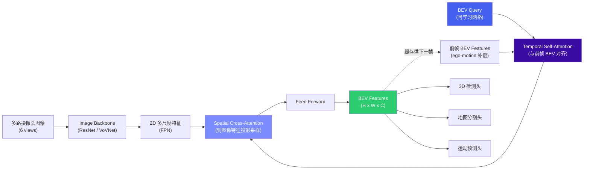

# 2. BEV 感知与端到端

*从 BEV 感知、3D 检测分割、占据预测到端到端与世界模型 | 自动驾驶感知算法全景*

> [!TIP]
> **本篇讲什么**
>
> 自动驾驶感知与决策的算法主线，十部分（本篇是领域知识层篇幅最大的一篇，重点补齐了 Occupancy、4D 成像雷达、世界模型、Mapless 等通识缺口）：
>
> - **BEV 感知训练 / 3D 检测与分割**：两条视角变换路线（LSS 前向投影 vs BEVFormer 后向查询）、PointPillars/CenterPoint、Camera-LiDAR 联合
> - **占据预测 (Occupancy) / 4D 成像雷达 / 轨迹预测**：开放集兜底、新模态、感知到规划的桥梁
> - **端到端模型 / 世界模型 / Mapless**：UniAD/VAD、2024-2026 新范式与量产落地、生成式驾驶、轻图化与定位
> - **持续学习与数据飞轮**：Shadow Mode、主动学习、4D 自动标注（越野/非结构化场景已拆为[专项文档](../projects/offroad/offroad-scenarios.html)）
>
> 本篇遵循全站口径：**保留公开的基准事实**（nuScenes NDS/mAP 等论文/数据集数字，并标注 backbone 配置**与 val/test split**），把部署延迟等估算数字标注为**示例参数**。

## 1. BEV 感知训练

### 1.1 两条视角变换路线与 BEVFormer 架构

BEV (Bird's Eye View) 感知是当前自动驾驶感知的主流范式。其核心思想是将多路摄像头的 2D 图像特征统一投影到一个 BEV 平面上，形成**以自车为中心的俯瞰视角特征表示**。在这个统一的 BEV 空间中，3D 目标检测、语义分割、车道线检测等下游任务都可以共享同一套特征，极大简化了多任务架构。

整个范式的**技术分水岭在于"2D→3D 怎么做"**，两条路线的取舍贯穿选型、训练与端侧部署：

| 路线 | 方向 | 核心机制 | 代表方法 | 特点 |
| :--- | :--- | :--- | :--- | :--- |
| **前向投影 (Lift)** | 图像 → BEV | 每像素预测**深度分布** (D 个 depth bin)，把 2D 特征沿射线"提升"成 frustum，再 splat 累加到 BEV 网格 | LSS、BEVDet、BEVDepth、BEVDet4D | 几何可解释、算子朴素；**深度估不准 → 特征错位**，需深度监督 |
| **后向查询 (Query)** | BEV → 图像 | 在 BEV 平面放可学习 query，按相机内外参算出投影位置，用 cross-attention 到图像特征上**采样** | BEVFormer、PETR/StreamPETR | 不需显式深度、端到端更灵活；**计算量大、Deformable Attention 量化难** |

> [!NOTE]
> **两条路线正在合流**
>
> FB-BEV / FB-OCC 一类工作同时使用前向深度投影与后向 query，取两者之长。另需注意 **SOLOFusion 常被误归为"深度路线的新变体"**，它其实是**长/短时序融合**方法，解决的是时序而非视角变换问题。

**BEVFormer** 是后向查询路线最具代表性的 Transformer-based BEV 方案。它通过可学习的 BEV Query 与多视角图像特征做空间交叉注意力 (Spatial Cross-Attention)，同时引入时序自注意力 (Temporal Self-Attention) 融合前帧的 BEV 特征，实现时空联合建模。



> [!WARNING]
> **层内顺序是 TSA → SCA → FFN，不要画反**
>
> BEVFormer 的每个 encoder layer 内部顺序是**先时序自注意力 (Temporal Self-Attention)、再空间交叉注意力 (Spatial Cross-Attention)、最后 FFN**，多层堆叠。直觉上"先看图再融合历史"似乎更自然，但论文的设计是**先让当前 BEV Query 与对齐后的历史 BEV 融合**（继承上一帧已经聚合好的时空信息），**再去图像上采样新证据**。
>
> 这个顺序在面试与复现中都是高频错点。另外两个易被忽略的实现细节：(1) 前帧 BEV 需按 **ego-motion 做坐标对齐**（warp）后才能与当前 query 做注意力，否则自车运动会把历史特征"错位"进来；(2) BEVFormer-S 是把 TSA 换成**不含历史特征的 vanilla self-attention** 的静态变体，精度明显低于带时序的完整版——时序建模的收益是真实的，不是摆设。

### 1.2 主流 BEV 方案对比

| 方案 | 核心方法 | 时序融合 | nuScenes NDS | 延迟 (Orin, 示例) | 优势 | 劣势 |
| :--- | :--- | :--- | :--- | :--- | :--- | :--- |
| **BEVDet4D** | LSS 显式深度估计 + Voxel Pooling | 帧拼接 | ~51.7 | ~45ms | 结构简洁，量化友好 | 深度估计误差较大 |
| **BEVFormer (V2-99, test)** | Deformable Attention + BEV Query | Temporal Self-Attention | ~56.9 | ~90ms | 精度高，时序建模优雅 | Deformable Attention 量化困难 |
| **StreamPETR (V2-99)** | Sparse Query + Motion-aware | Query 传播 | ~55.0 | ~65ms | 稀疏查询，计算效率高 | 遮挡场景性能受限 |
| **BEVFusion (C+L)** | Camera BEV + LiDAR BEV 特征级融合 | 可选 | ~71.4 | ~100ms | 多模态融合精度最高 | 依赖 LiDAR，成本高 |

> [!NOTE]
> **NDS/mAP 必须同时绑定 backbone 与 val/test split 看，跨配置比较无意义**
>
> 表中 NDS 为 nuScenes 公开结果，但**同一方法换 backbone、或换 val/test split，数字都会差好几个点**，比较时两个变量都要对齐：
>
> - **BEVFormer**（原论文 Table 1 = test、Table 2 = val）：
>   - R101-DCN：**val NDS 51.7 / mAP 41.6**，**test NDS 53.5 / mAP 44.5**
>   - V2-99（DD3D 深度预训练）：**test NDS 56.9 / mAP 48.1** ← 论文摘要的 headline 数字
>   - 所以 **51.7 → 56.9 的差距里同时含"backbone"与"val→test"两个变量**，不能全记在 backbone 头上；同 split（test）下换 backbone 的净增益是 **53.5 → 56.9（约 +3.4 NDS）**。论文未公布 V2-99 的 val 结果，因此"R101 val vs V2-99 test"这种混搭本身就不成立。
>   - 本表 BEVFormer 行取 **V2-99 / test** 口径，与 §2 的 mAP 48.1 一致，避免"NDS 用 V2-99、mAP 用 base"的混搭。
> - **StreamPETR / BEVDet4D / BEVFusion**：同样各自存在 R50 vs V2-99、val vs test 的多套公开数字。本表为便于横向比较做了统一取舍，**不是各方法的唯一正确值**；引用到方案文档或对外材料前，请回到原论文核对具体是哪一行。
> - **BEVFusion**：Camera+LiDAR 融合，约 **mAP 68.5 / NDS 71.4**（NDS 比 mAP 高约 3 点属正常——NDS 由 mAP 与 5 项 TP 误差共同构成，量纲不同；若看到 NDS 只比 mAP 高 0.7 点，多半是配置抄错）。
> - **延迟列**为依赖 backbone/分辨率/部署方式的**示例估算**，非实测标准值，请代入自己的引擎实测。

### 1.3 BEV 训练实用技巧

**数据增强 (BEV 空间增强)**：不同于传统的 2D 图像增强，BEV 模型需要在 BEV 空间中做增强，包括 BEV 平面随机旋转、缩放、平移。同时需要保持 2D 增强 (颜色抖动、随机裁剪) 和 BEV 增强之间的空间一致性。

**学习率调度**：BEV 模型通常采用 cosine annealing + linear warmup 策略。Backbone 使用较小的学习率 (约 head 的 1/10)，BEV Query 和 Attention 层使用更高学习率。总训练通常 24 个 epoch (nuScenes) 或 6 个 epoch (大规模私有数据)。

**多任务训练**：3D 检测、地图分割、运动预测等任务共享 BEV Backbone，各自有独立的 Task Head。任务间权重需仔细调整 (一个常见起点是检测 : 分割 : 预测 = 1.0 : 0.5 : 0.5)，可使用 Uncertainty Weighting 或 GradNorm 自动平衡。

> [!NOTE]
> **BEV 是当前主流范式**
>
> BEV 之所以成为主导方案，关键在于它提供了**统一的表征空间**：3D 检测、语义地图、运动预测都在同一个 BEV 空间中完成，避免了传统方案中各模块使用不同坐标系带来的对齐误差。几乎所有主流量产方案 (Tesla BEV、华为 GOD、小鹏 XNet 等) 都采用了 BEV 范式。

> [!TIP]
> **视角变换的端侧代价：算法选型时就要算进去**
>
> §1.1 的两条路线在端侧的"量化友好度"差别很大，这是选型时容易被忽略、但直接决定能否上车的因素：
>
> - **LSS 前向投影**：核心是 depth softmax + outer product + voxel pooling (splat)。算子朴素、以卷积为主，**INT8 相对友好**；但 splat 是**散射写入 (scatter)**，部分 NPU 缺乏高效原语，且**深度分布的量化误差会直接变成特征错位**。
> - **BEVFormer 后向查询**：核心是 Deformable Attention，**offset 的动态采样对量化极敏感**——offset 的微小量化误差被放大成"看错位置"，通常要把 offset 计算保 FP16、只对 value 做 INT8。
>
> 换句话说：**BEV 的精度收益和它的端侧部署难度，都来自同一个视角变换模块**。完整的算子级量化清单、时序 BEV 特征的显存推导与缓存策略，见 [端侧部署](deployment.html) §1.2–§1.4。

## 2. 3D 检测与分割

### 2.1 PointPillars (LiDAR-only)

**PointPillars** 是 LiDAR 3D 检测的经典 baseline。它将点云划分为柱状体 (Pillars)，每个 Pillar 内的点通过 PointNet 编码为固定维度的特征向量，然后将所有 Pillar 特征排列成伪图像 (Pseudo-Image)，接入 2D 检测骨干 (如 SSD) 完成检测。其关键在于**用 2D 卷积处理伪图像、避开了 3D 稀疏卷积**，因此推理速度极快，非常适合对延迟敏感的 ADAS 场景。

### 2.2 CenterPoint

**CenterPoint** 采用 center-based 检测范式，无需预定义 anchor。它首先将 LiDAR 点云体素化 (voxelization)，通过 3D Sparse Convolution 提取 BEV 特征，然后用热图 (heatmap) 预测目标中心点，回归 3D bounding box 的尺寸、朝向和速度。CenterPoint 还支持两阶段精化 (second-stage refinement)，进一步提升检测精度。

### 2.3 Camera-LiDAR 联合训练

纯视觉 3D 检测的精度瓶颈在于**深度估计**。Camera-LiDAR 联合训练的核心策略：

- **深度监督**：用 LiDAR 点云投影到图像平面生成深度 GT，对 Camera 分支的深度估计头做监督，显著提升深度估计准确度
- **特征级融合**：Camera BEV 特征和 LiDAR BEV 特征在 BEV 空间做 concatenation 或 attention-based 融合 (如 BEVFusion)
- **训练策略**：先预训练 Camera-only 分支 (用 LiDAR 深度监督)，再联合微调融合模型，效果优于从零开始联合训练

### 2.4 方法综合对比

| 方法 | 输入模态 | nuScenes mAP | 延迟 (Orin, 示例) | 硬件要求 | 量产适用性 |
| :--- | :--- | :--- | :--- | :--- | :--- |
| **PointPillars** | LiDAR | ~40.1 | ~10 | GPU (2D Conv on 伪图像) | 高 (成熟稳定) |
| **CenterPoint** | LiDAR | ~58.0 | ~25 | GPU (3D Sparse Conv) | 高 |
| **BEVFormer (V2-99, test)** | Camera | ~48.1 | ~90 | GPU (Deformable Attn) | 中 (量化挑战) |
| **StreamPETR (V2-99)** | Camera | ~45.0 | ~65 | GPU (Standard Attn) | 中高 |
| **BEVFusion (C+L)** | Camera + LiDAR | ~68.5 | ~100 | GPU (双模态) | 中 (依赖 LiDAR) |

> [!NOTE]
> **三个易错点**
>
> - **PointPillars 不用 3D 稀疏卷积**：它把点云编码成伪图像后跑 **2D 卷积**，这正是它快的原因；用 3D Sparse Conv 的是 CenterPoint/SECOND 这类体素方法。
> - **mAP 同样要绑定 backbone 与 val/test split**：本表为横向比较做了统一取舍（与 §1.2 同口径），不是各方法的唯一正确值——尤其 LiDAR 方法的 mAP 随 backbone/训练时长变化不小，引用前请回原论文核对。
> - **跨模态 mAP 不可直接比**：本表混合了 LiDAR-only / Camera-only / Camera+LiDAR，Camera-only 的 mAP 低于 LiDAR-only **不代表"视觉方案更差"**——两者成本、全天候能力与失效模式完全不同，量产选型看的是「每单位 BOM 成本的安全收益」，不是单看 mAP。
> - **CenterPoint 取单模型值**：本表 CenterPoint ~58.0 是**单模型 voxel（test）**的 mAP；常被引用的 60.3 是 **5 模型 ensemble + TTA** 的结果（pillar 变体则是 mAP ~50.7 / NDS ~60.3），横向对比单模型方法时不要用 ensemble 值。
> - **延迟为示例估算**：实际延迟强依赖 backbone、输入分辨率、是否真正用 TensorRT/QNN 部署，需以目标平台实测为准。

## 3. 占据预测 (Occupancy)

### 3.1 从检测框到 3D 占据

3D 检测只能输出**预定义类别** (车、人、骑行者……) 的包围盒，对开放场景里的"未知类别障碍物" (掉落货物、异形工程车、路边杂物) 无能为力。**3D 占据预测 (Occupancy Prediction)** 补上了这个缺口：它把车辆周围空间体素化 (voxel)，预测**每个体素是否被占据**，以及 (可选的) **语义类别**和**流动/速度**。

Occupancy 的本质是**对场景的稠密 3D 表征**，它把"障碍物检测"从"类别识别"里解耦出来——即使认不出这是什么，也能知道"这里有一坨东西，别撞上去"。Tesla 在 2022 年 AI Day 上把 Occupancy Networks 推到台前，使其成为感知的一等公民。

### 3.2 代表方法

| 方法 | 核心思想 | 特点 |
| :--- | :--- | :--- |
| **MonoScene** | 首个单目 3D 语义占据预测 | 单相机从 2D 特征重建 3D 体素语义，开创性但精度较粗 |
| **TPVFormer** | Tri-Perspective View (TPV) 表示 | 用 XY/XZ/YZ 三个正交平面近似 3D 体素，大幅降低计算量同时保持精度 |
| **SurroundOcc** | 多相机稠密占据 | 环视相机生成稠密占据栅格，3D 结构完整 |
| **OccNet / Occ3D / OpenOccupancy** | 大规模占据基准与 baseline | 推动占据任务的标准化与评测 |
| **FlashOcc** | Channel-to-Height 变换 | 把 3D 占据"拍平"成 2D 通道，**全程 2D 卷积、无 3D 算子**，端侧友好 |
| **GaussianFormer** | 3D Gaussian 稀疏表示 | 用稀疏高斯椭球替代稠密体素，显著降算力，开启并延续至今的效率主线 |
| **SelfOcc** | 自监督占据 | 不依赖昂贵占据 GT，用重建/一致性自监督，缓解标注瓶颈 |
| **OccWorld** | 占据世界模型 | 同时预测未来占据 + 自车位姿，把占据从"感知"推向"预测" |

UniAD 的 OccFormer (见 §6.1) 同样把占据作为中间表征喂给规划。

> [!NOTE]
> **时间分层：2023-2024 是方法爆发期，2025-2026 是落地与融合期**
>
> 上表的代表方法多集中在 2023-2024（占据任务的"从无到有"）。**2025-2026 的主线已不是再造一个新占据网络**，而是三件事：
>
> - **效率化持续深化**：稀疏化（GaussianFormer 一脉）、2D 化（FlashOcc 一脉）成为端侧上车的默认前提，而非可选优化。
> - **与端到端/世界模型融合**：占据从"独立感知任务"变成端到端栈的中间表征（OccFormer）与世界模型的预测目标（OccWorld 一脉），并支撑 §6.3 的闭环评测。
> - **量产落地**：华为 **GOD 网络**一类"通用障碍检测"就是占据思想的量产形态，已在多款车型上车。
>
> 换句话说，2026 年谈 Occupancy，重点已从"精度刷分"转到"**能不能在端侧算力/带宽预算内稳定兜底**"。

> [!NOTE]
> **Occupancy 与检测是"并行兜底"，不是"替代"**
>
> 量产里常见的正确姿势是**两者并行**：检测头提供**带 ID / 速度 / 类别的实例**（预测、交互、合规都需要），占据头提供**通用几何兜底**（未知/异形障碍）。用占据完全取代检测会丢掉实例语义；只用检测又会漏开放集障碍。华为的 **GOD 网络 (General Obstacle Detection)** 本质就是占据式通用障碍检测，与框检测并存的典型工程形态。

### 3.3 开放集障碍兜底价值

Occupancy 的核心价值在于**安全兜底**：

- **未知障碍物**：任何占据空间的物体都会被标为 occupied，无论它是否在训练类别里——直接提升长尾场景安全性。
- **不规则形状**：包围盒对细长/不规则障碍 (货物、护栏残片) 拟合差，体素能天然表达。
- **可行驶空间**：结合 flow 预测可区分"静态占据"与"动态障碍"，为规划提供更细的约束。

### 3.4 表征与部署挑战：算力/带宽代价 vs 兜底价值

**代价随分辨率立方增长，且感知距离直接放大它。** 体素总数可按下面公式代入自己的配置估算（示例参数）：

```text
体素数 ≈ (2·R_x / dx) × (2·R_y / dy) × (H / dz)
示例：前后各 50 m、左右各 25 m、高 4 m
  dx=dy=dz=0.4 m → 250 × 125 × 10 ≈ 31 万体素
  dx=dy=dz=0.2 m → 500 × 250 × 20 ≈ 250 万体素（体素边长减半 → 体素数 ×8）
```

由此引出端侧的四条真实约束：

- **计算与显存**：稠密 3D 体素随分辨率立方增长，端侧计算/显存压力大。TPV (三视角平面)、稀疏占据 (只预测靠近表面的体素)、GaussianFormer 式稀疏高斯、FlashOcc 式 2D 化，是主要的效率优化方向。
- **带宽**：占据特征往往要在 GPU/NPU 与 DDR 间**整块读写**，稠密体素的带宽开销有时比算力更早成为瓶颈——这也是"稀疏化"不只是省 FLOPs、也是省带宽的原因。
- **稀疏性**：场景中绝大多数体素是空的，用稀疏卷积/稀疏 query 只处理"可能占据"的区域能大幅省算。
- **标注成本**：3D 占据 GT 昂贵——通常靠多帧 LiDAR 聚合 + 离线重建生成 (见 §9.5 的 4D 自动标注)，或借助仿真；SelfOcc 一类自监督方法试图绕开 GT。

> [!TIP]
> **"要不要上 Occupancy"的决策框架**
>
> 别把它当免费的安全加成，按三问决策：(1) **场景开放集风险高吗**——城区长尾障碍、越野/施工区收益大，高速结构化场景收益递减；(2) **算力/带宽预算够吗**——稠密占据的代价是立方级的，预算紧就先上稀疏/2D 化变体或降分辨率；(3) **GT 从哪来**——没有 4D 自动标注管线，占据的监督信号本身就是瓶颈（呼应 §9.5）。三问都成立才值得，否则先用检测 + 可行驶空间兜底。

## 4. 4D 成像雷达

### 4.1 什么是 4D 成像雷达

传统车载毫米波雷达测**距离、方位角、径向速度 (多普勒)**，但角分辨率低、点云稀疏，难以刻画目标轮廓。**4D 成像雷达**在此基础上增加了**俯仰角 (高度)** 维度，输出带高度信息的点云——"4D"通常指三个空间维 (距离/方位/俯仰) + 速度 (多普勒) 这四个维度。

### 4.2 与传统雷达 / LiDAR 对比

| 维度 | 传统雷达 | 4D 成像雷达 | LiDAR |
| :--- | :--- | :--- | :--- |
| **角分辨率** | 低 | 中高 (接近粗 LiDAR) | 高 |
| **点云密度** | 稀疏 | 中等 | 稠密 |
| **直接测速** | 能 (多普勒) | 能 (多普勒) | 不能 (需多帧估计) |
| **全天候** | 强 (穿雨雾尘烟) | 强 | 弱 (雨雾尘衰减) |
| **探测距离** | 远 | 远 | 中 |
| **成本** | 低 | 中 | 高 |

4D 成像雷达的独特优势：**全天候** (毫米波穿透雨、雾、尘、烟，远优于摄像头/LiDAR) 和**直接测速** (多普勒无需多帧估计)。

### 4.3 融合价值与挑战

- **融合价值**：作为 Camera+LiDAR 的冗余模态，提升恶劣天气、夜间的安全性；其直接测速对运动目标检测与预测有帮助。在越野/烟尘场景中价值尤其高（见 [越野与非结构化场景](../projects/offroad/offroad-scenarios.html)）。
- **挑战**：点云仍比 LiDAR 稀疏、噪声大，存在多径反射 (护栏、隧道)；标注数据集稀缺；如何在 BEV 空间与相机/LiDAR 高效融合是活跃研究方向 (如 radar-camera 融合的 4D 检测)。

### 4.4 量产落地与生态

4D 成像雷达正从"研究模态"走向"量产冗余/降本模态"，几条主线：

- **代表产品**：大陆 ARS540（较早量产的前向 4D 成像雷达）、采埃孚 FRGen21、Arbe Phoenix（芯片组级联）、以及多家国产厂商的 4D 雷达方案。
- **级联架构**：单芯片角分辨率有限，量产常通过**多芯片级联 (cascade)** 扩大虚拟孔径、提升角分辨率——这是 4D 雷达区别于传统雷达的关键硬件手段，也带来体积/功耗/标定的代价。
- **定位**：在 L2+/L3 里，4D 雷达常被用作 **LiDAR 的降本替代或冗余**——保留全天候与直接测速，牺牲点云密度换取成本与可靠性；前向 4D 雷达 + 环视相机是常见的"去 LiDAR"组合。
- **数据集**：公开基准仍远少于 LiDAR——RadarScenes、View-of-Delft (VoD)、TJ4DRadSet、K-Radar、nuScenes-radar 等，是算法评测的主要依托。
- **端侧价值**：4D 雷达点云处理的算力开销远低于 LiDAR 点云处理，且全天候鲁棒——在端侧传感器预算紧张时，它是"性价比最高"的冗余模态之一（越野场景尤其如此，见越野专项文档）。

> [!NOTE]
> **4D 雷达的短板要如实看**
>
> 点云比 LiDAR 稀疏约一个数量级（量级示意，非精确值）、鬼影/多径在金属密集环境（隧道、护栏、桥下）明显、且**缺乏像 LiDAR 那样成熟的 BEV 融合范式与大规模标注**。因此它目前的角色是"高价值冗余"而非"主传感器"；把它当 LiDAR 的平替会高估其单独感知能力。

## 5. 轨迹预测

### 5.1 问题定义与评估

**轨迹预测 (Trajectory Prediction)** 预测其他交通参与者 (车辆、行人、骑行者) 的未来运动轨迹，是连接感知与规划的关键一环。它回答的不是"现在在哪"(检测)，而是"未来几秒会到哪"。

常用评估指标：

- **ADE (Average Displacement Error)**：所有时间步上预测与真值轨迹的平均距离误差。
- **FDE (Final Displacement Error)**：预测轨迹终点与真值终点的距离误差。
- **Miss Rate**：预测误差超过阈值的比例。
- **minADE / minFDE**：在多条预测轨迹中取最优，衡量多模态预测能力。

> [!WARNING]
> **ADE/FDE 是开环指标，衡量"像不像人"而非"开得好不好"**
>
> 这些指标都是**开环 (open-loop)** 的：拿模型输出与数据集里 recorded 的真值轨迹比距离。它有两个结构性缺陷：
>
> - **奖励模仿、不奖励安全**：真值只是"某个司机的某一次选择"，不是唯一正确答案。路口可直行可左转，预测出合理的另一条反而被罚。
> - **无反馈闭环**：开环里自车动作不影响他车，而真实驾驶是博弈——你加速对方会让，你犹豫对方会抢。开环指标测不出这种交互能力。
>
> 因此**预测/规划的严肃评测要走闭环仿真**（nuPlan、CARLA、Bench2Drive、Waymax 一类），让模型的动作真正改变后续场景。这个缺陷在端到端规划上被放大成"刷分陷阱"，详见 §6.3 的 WARNING。

### 5.2 主流方法

- **传统方法**：匀速/匀转向模型、卡尔曼滤波、社会力模型——简单但难以刻画复杂交互。
- **向量化表示 (VectorNet)**：把地图 (车道) 和 agent 历史轨迹统一编码为折线 (polyline)，避免栅格冗余，是现在的主流表示。
- **交互建模 (GNN / Attention)**：用图神经网络或注意力建模 agent 之间的相互影响 (让行、跟驰、汇入)。
- **多模态预测**：输出多条可能未来及其概率 (如 TNT、DenseTNT、MTR、QCNet)，对应真实驾驶的不确定性 (路口可直行可转弯)。
- **地图感知**：结合高精地图/在线建图，约束轨迹符合可行驶区域。

### 5.3 与端到端的融合

在模块化方案里，预测是独立模块；在端到端方案 (如 UniAD 的 MotionFormer、VAD) 里，预测被并入统一模型，作为中间任务与检测/建图/规划共享特征、梯度端到端传播。好处是信息不被人为割裂，挑战是预测误差会直接传导到规划。

## 6. 端到端自动驾驶模型

### 6.1 UniAD 架构

端到端自动驾驶 (End-to-End AD) 的核心理念是**用一个统一模型完成从感知到规划的全部任务**，取代传统的模块化 pipeline。**UniAD** (Unified Autonomous Driving) 是这一方向的标志性工作。


UniAD 的关键设计：所有模块共享 BEV 特征，通过 Query 传递的方式进行信息流动——跟踪 Query 传给预测模块，预测结果传给规划模块。这种级联设计使得规划能够感知到完整的场景语义，而不仅仅是检测框列表。

### 6.2 VAD: 向量化场景表示

**VAD** (Vectorized Autonomous Driving) 进一步简化了端到端架构。它将场景中的所有元素 (车辆轨迹、道路边界、车道线) 统一表示为**向量化的折线 (polyline)**，避免了栅格化表示的信息冗余。规划模块直接在向量空间中生成未来轨迹，并通过向量化约束 (与道路边界的距离、与其他车辆的碰撞检查) 确保轨迹安全性。

### 6.3 端到端 vs 模块化对比

| 维度 | 端到端 (E2E) | 模块化 (Modular) |
| :--- | :--- | :--- |
| **灵活性** | 低 — 模型是黑盒，难以单独替换某个模块 | 高 — 感知/预测/规划可独立迭代 |
| **可解释性** | 低 — 决策过程不透明 | 高 — 每个模块有明确的输入输出 |
| **训练数据** | 需要完整的感知+规划标注 (成本极高) | 各模块可独立标注和训练 |
| **部署复杂度** | 低 — 一个模型搞定 | 高 — 多个模型的调度和数据流管理 |
| **性能上限** | 更高 — 梯度可以端到端优化 | 存在模块间信息损失 |
| **安全认证** | 极难 — 无法对黑盒进行 ASIL 认证 | 可分模块认证 |
| **Debug 效率** | 低 — 问题难以定位到具体模块 | 高 — 可逐模块排查 |
| **代表工作** | UniAD, VAD, GenAD, SparseDrive, Tesla FSD v12+ | Apollo, Autoware, Waymo Driver, Tesla (早期) |

> [!WARNING]
> **端到端已走进量产，但黑盒仍不能独自负责安全**
>
> 端到端早已不只是"学术 benchmark 上性能更优"——2025-2026 已有多家量产落地（见 §6.4）。但根本矛盾没有消失：**功能安全认证**要求系统的每个环节都是可分析、可验证的，而端到端模型的黑盒特性与此冲突。
>
> 要区分两条不同路线：一条是 **"模块化架构 + 端到端训练"**——保留显式的模块边界 (感知/预测/规划) 但允许梯度跨模块传播，兼顾可解释与联合优化；另一条是 **真·端到端 (photon-to-control)**——用单一网络直接从传感器输入映射到轨迹/控制。**Tesla FSD v12 属于后者**（用神经网络取代了大量手写 C++ 规划代码），不应被归为"模块化+端到端训练"。真·端到端性能上限更高，但安全认证与 debug 难度也更大。
>
> **截至 2026 年的实际格局**：真·端到端/一段式已不再是"少数玩家的实验"，而是多家量产车的落地架构（见 §6.4 玩家表）；但**没有任何一家把安全兜底层交给黑盒**——规则安全检查层、运动学裁剪、独立安全监控（见 [驾驶 Agent 与安全](agent-safety.html)）仍是全行业共识。所以"端到端 vs 模块化"在 2026 年已不是二选一，而是**"端到端做主策略 + 可验证的规则层做兜底"的分层结构**。

> [!CAUTION]
> **开环 benchmark 刷分 ≠ 会开车：nuScenes planning 指标已被证明可被平凡解刷高**
>
> UniAD/VAD 一类工作用 **开环 L2 误差 + 碰撞率** 在 nuScenes 上评测规划，这套指标存在已被多篇工作证实的结构性缺陷：
>
> - **Ego status 捷径**：**AD-MLP**（"Rethinking the Open-Loop Evaluation…"）与 **BEV-Planner**（"Is Ego Status All You Need for Open-Loop End-to-End Autonomous Driving?"）都指出——一个**只吃自车状态 (速度/加速度/朝向)、几乎不看场景**的平凡模型，就能在 nuScenes 开环规划上拿到接近 SOTA 的 L2。原因是 nuScenes 片段短、自车运动高度可外推，L2 被"惯性外推"主导。
> - **推论**：开环 L2 的改善**不能**证明模型真的理解了场景。看到"某端到端方法 L2 又降了 0.1 m"时，先问它是否做了 ego-status 消融、是否在闭环上验证过。
> - **正确做法**：(1) 报告**去掉 ego status 输入**后的性能；(2) 走**闭环仿真评测**（nuPlan、CARLA、Bench2Drive、Waymax），让自车动作真正改变后续场景；(3) 关注**碰撞率/越界率/舒适度**等结果性指标，而非单纯轨迹距离。
>
> 这是端到端方向最常见的"看起来在进步、实际在刷指标"的陷阱，也是 §5.1 开环指标缺陷在规划侧的放大版。

### 6.4 2024-2026 新范式与量产落地

UniAD/VAD 在 2023 年确立了"统一模型"范式，**2024 年完成方法铺垫，2025-2026 才真正进入量产与范式收敛期**。下面按时间分层，避免把 2024 的方法误当成"当前最新"：

**一段式 vs 两段式（贯穿 2024-2026、量产最重要的工程分野）**：
- **两段式**：感知端到端（传感器 → BEV/占据/矢量元素）+ 规控端到端（中间表征 → 轨迹）分开训练再拼接，中间保留**显式接口**。可分工、可分别迭代与认证、可解释，但接口处有信息瓶颈。
- **一段式**：单一网络 sensor → trajectory，无显式中间接口。信息无损、上限高，但难 debug、难认证、难分工。
- 量产现实是**从两段式起步、逐步向一段式演进**，且无论哪种都**保留规则安全兜底层**（safety checker / 运动学裁剪，见 [端侧部署](deployment.html) §3.2）。

**2024 年的方法铺垫**（如今是基础设施，不再是前沿）：

- **扩散规划 (Diffusion Planning)**：把轨迹生成建模为条件扩散/去噪过程 (Diffusion Planner 2024、DiffusionDrive 2025)，天然处理轨迹的多模态性，也便于把碰撞/舒适度写成可微约束。挑战是扩散多步去噪慢，端侧需蒸馏成少步 (1-4 step) 甚至单步版本——**少步蒸馏正是 2025-2026 的端侧落地关键**。
- **生成式端到端 (GenAD)**：把生成式建模引入驾驶，将"场景理解 + 未来预测 + 轨迹生成"统一在一个生成式框架里，常与世界模型 (见 §7) 结合。
- **稀疏化端到端 (SparseDrive 等)**：用稀疏 query 取代稠密 BEV 栅格，显著降低计算量与带宽，更易端侧部署（与 §1.1 后向查询路线、§3.4 稀疏占据同源）。

**2025-2026 的当前主线**：

- **VLA 上车 (Vision-Language-Action)**：把视觉语言模型的常识与推理注入驾驶，直接输出动作或轨迹。2024 年还多是研究形态（如 Waymo 的 **EMMA**，基于 Gemini，未量产）；**2025-2026 已有多家把 VLA/双系统真正推上量产车**——典型是"VLM 慢系统 + 端到端快系统"的组合，并进一步收敛到统一 VLA 架构。VLA 的价值在**长尾场景泛化与可语言化解释**，代价是**推理延迟与算力**，端侧落地必须做快慢系统分频（慢系统低频给语义/意图，快系统高频出轨迹）。与 [驾驶 Agent 与安全](agent-safety.html) 的 VLM 驾驶范式相通。
- **世界模型驱动的端到端**：用世界模型（见 §7）做**闭环数据生成与闭环评测**，甚至直接在"想象"中做规划（imagination-based planning）。这是把 §6.3 CAUTION 里"开环刷分"问题从根上解决的方向，也是 2025-2026 投入最重的方向之一。
- **一段式端到端的量产收敛**：从"学术 demo"变成"多家量产车的默认架构"，但安全兜底层始终保留（见下表）。

| 玩家 | 公开形态（截至 2026） | 路线归属 |
| :--- | :--- | :--- |
| **Tesla FSD v12/v13** | photon-to-control，神经网络取代大量手写规划代码 | 真·一段式端到端 |
| **华为 ADS 3.0/4.0** | GOD 通用障碍网络 + PDP 预测决策规划 | 模块化 + 端到端训练 |
| **小鹏 XNGP** | 端到端大模型量产，逐步走向一段式 | 两段式 → 一段式 |
| **理想 AD Max** | 端到端 + VLM 双系统，演进到 VLA 架构 | 两段式 + 双系统 → VLA |
| **Waymo Driver** | 模块化感知 + ML 规划为主，EMMA 等为研究探索 | 模块化为主 |
| **Wayve** | LINGO / GAIA 系列，语言 + 世界模型驱动 | 端到端 + 世界模型 |

> [!NOTE]
> **趋势：从"模块拼接"到"统一表征 + 生成式 + 语言"**
>
> 端到端的演进有一条主线：表征从稠密栅格走向稀疏/向量化，输出从判别式走向生成式 (扩散/世界模型)，语义层从纯几何走向 VLM/VLA 的常识推理，评测从开环刷分走向闭环仿真。但无论范式如何变，**功能安全认证**与**端侧实时部署**仍是能否量产的试金石——上表的"路线归属"列也说明：**没有玩家真的把安全兜底层交给黑盒**。
>
> 表中厂商形态为公开信息的**定性归纳**，各家版本迭代很快，具体以官方最新发布为准；本表不含任何性能数字。

## 7. 世界模型与生成式驾驶

### 7.1 什么是驾驶世界模型

**世界模型 (World Model)** 学习一个能"预测场景未来状态"的生成式模型：给定当前场景 (和可选的动作/条件)，生成接下来会发生什么。在自动驾驶里，世界模型常表现为**可控制的驾驶视频生成**——不仅能预测未来，还能合成逼真的驾驶画面。

### 7.2 代表工作

| 工作 | 核心 |
| :--- | :--- |
| **GAIA-1 / GAIA-2 (Wayve)** | 生成式世界模型，可用文本/动作条件生成未来驾驶视频；GAIA-2 支持多视角、可控场景，面向闭环评测与数据生成 |
| **UniSim (Waabi)** | 神经闭环传感器仿真器，用真实数据重建可交互场景，支持闭环评测 |
| **DriveDreamer / DriveDreamer-2** | 面向驾驶的世界模型，生成逼真视频 + 结构化输出 (如轨迹)，可用于数据增强与预测 |
| **Vista** | 高保真、长时程、动作可控的驾驶世界模型 |
| **GenAD** | 生成式端到端驾驶，把场景理解与轨迹生成统一到生成式框架 |
| **NVIDIA Cosmos** | 世界基础模型平台 (Predict / Transfer / Reason)，面向物理 AI 的生成式仿真与推理 |
| **Genie 系列 (DeepMind)** | 通用可交互世界模型，从单图/视频生成可操作环境，是"世界模型 = 可交互仿真"路线的代表 |
| **视频扩散模型** | 用扩散模型合成驾驶场景，做仿真与 corner case 生成 |

> [!NOTE]
> **时间分层：2023-2024 是"能生成"，2025-2026 是"可控 + 闭环 + 物理一致"**
>
> 上表里 GAIA-1、DriveDreamer、UniSim 属 2023-2024 的"能生成逼真驾驶视频"阶段；**2025-2026 的主线**是把世界模型推向可用：
>
> - **可控性**：GAIA-2、Cosmos 一类支持多视角、动作/文本可控的场景生成，不再是"随机好看的视频"。
> - **闭环评测**：世界模型成为回应 §6.3 开环刷分陷阱的核心工具——在"想象"中滚动评测端到端策略。
> - **物理一致性**：从"像不像真视频"转向"符不符合物理"，这是 2025-2026 公认的核心瓶颈（见 §7.4）。
>
> 因此 2026 年评估一个驾驶世界模型，看的不是 FVD 刷了多高，而是**可控性、闭环可用性与物理一致性**。

### 7.3 用途

- **数据生成/增强**：合成逼真但罕见的场景 (恶劣天气、事故、长尾目标)，缓解数据稀缺——对 corner case 尤其有价值，与 §9 数据飞轮直接打通（世界模型是数据飞轮的"生成引擎"）。
- **神经仿真器**：作为"可学习的仿真器"滚动推演未来，用于闭环评测或规划 (在世界模型里想象不同动作的后果)——这是回应 §6.3 开环刷分陷阱的关键工具。
- **预测与规划**：世界模型天然包含"场景如何演化"，可直接服务于运动预测与决策。

### 7.4 挑战

- **计算成本**：视频生成 (尤其扩散) 计算量大，端侧实时困难，多用于离线数据生成/云端仿真。
- **物理一致性瓶颈**：这是世界模型能否被信任的**核心瓶颈**，具体表现为：
  - **长时程漂移**：生成超过数秒后，几何、身份、布局逐渐失真，难以支撑长 horizon 规划。
  - **多视角不一致**：环视多相机同时生成时可能违反跨相机几何约束 (epipolar/重叠区不一致)，导致重建的 3D 场景自相矛盾。
  - **动作可控性弱**：给定转向/油门，生成画面未必按真实车辆动力学响应——"可控"往往停留在外观条件，而非物理响应。
  - **物体恒常性差**：目标被遮挡后重新出现时，身份/外观可能改变。
  - **评测缺失**：FVD 一类指标只测"像不像真视频"，测不出"符不符合物理"；目前缺乏公认的物理一致性指标。
  - **缓解方向**：用显式 3D/几何条件 (深度、占据、BEV layout、3DGS 重建) 约束生成，把"自由生成"变成"几何条件下的补全"。
- **幻觉**：生成模型可能"编造"不存在的内容，需要额外约束与验证；用作训练数据时尤其危险 (把幻觉当真值会污染下游模型)。
- **扩散加速**：多步去噪慢，端侧/实时场景需蒸馏成少步 (1-4 step) 版本。

## 8. Mapless 与轻图化

### 8.1 为什么要去高精地图

高精地图 (HD Map) 厘米级精确，但**制作昂贵、更新慢、覆盖难**——需要持续采集维护，路况变化 (施工、改道) 时容易过时，且有资质成本。因此业界转向"**重感知、轻地图**"甚至 mapless：更多依赖实时感知，减少对先验地图的依赖。Tesla 是"无图"的代表性主张者，国内华为、小鹏等也推动了轻图化的城市方案。

### 8.2 在线建图 (Online Mapping)

Mapless 的核心是**在线建图**——用车载传感器实时构建局部矢量化地图 (车道线、道路边界、路口、人行横道)，替代离线高精地图。代表方法：

- **HDMapNet**：早期在线矢量化高精地图构建。
- **MapTR / MapTRv2**：把地图元素建模为有序点集，端到端预测矢量化地图结构，精度与速度兼顾。
- **StreamMapNet**：引入时序信息，提升在线建图的稳定性与一致性。

在线地图通常在 BEV 空间中直接构建，与 BEV 感知 (§1) 共享特征。

上述代表方法集中在 2022-2024（在线建图的"从无到有"）。**2025-2026 的主线**已不是再刷地图元素的 mAP，而是：(1) **拓扑推理**——把路口的车道连接关系建对（下面 WARNING 详述）；(2) **时序一致性**——tracker 化/流式建图，消除帧间抖动；(3) **量产轻图**——与 SD 图、云端众包图组合落地（见 §8.3 NOTE）。换言之，2026 年在线建图的竞争力在"稳、连得上、能量产"，而非单帧精度。

> [!WARNING]
> **在线建图的工程难点不在"建出来"，而在"稳得住、连得上"**
>
> 学术指标 (mAP over 地图元素) 掩盖了三个量产级的真实难题：
>
> - **时序抖动**：单帧预测的地图元素帧间会跳变（车道线"抖"、元素"闪"），规划器对这种抖动极其敏感——它会被当成真实的路况变化。必须做**时序滤波/一致性约束**（StreamMapNet、以及各类 tracker 化的在线建图），否则"建得出"但"用不了"。
> - **拓扑推理**：车道的**几何**好预测，但路口的**连接关系**（哪条进车道连哪条出车道、可变车道指向）是离散拓扑，远比几何难，复杂路口上仍不稳定——而规划恰恰最依赖路口拓扑。
> - **遮挡与视距**：在线建图只能看到传感器视野内的地图，远处/被遮挡的车道结构靠"猜"；高精地图则提供超视距先验（提前知道前方有匝道/施工）。这是 mapless 在高速、复杂路口的真实能力差距。
>
> 因此**在线建图不是高精地图的无损替代，而是"覆盖/成本"与"先验/稳定性"之间的取舍**。

### 8.3 定位与 SLAM

去掉高精地图后，**定位 (Localization)** 更加关键：车辆要知道"我在哪"。

- **基于高精地图的定位**：用点云/视觉特征与先验地图匹配，得到高精定位 (传统方案)。
- **无图定位**：依赖视觉里程计 (VO)、视觉惯性里程计 (VIO)、LiDAR SLAM 等，在没有先验地图时增量估计自车位姿。
- **SLAM (同时定位与建图)**：边估计位姿边构建地图，是无图场景的核心技术；视觉 SLAM 与 LiDAR SLAM 各有优劣 (LiDAR 精确但贵，视觉便宜但对光照/纹理敏感)。

> [!NOTE]
> **"无图"不等于完全没有地图**
>
> 工程上的"无图"通常指**不依赖厘米级高精地图**，仍可能使用 SD 地图 (道路级导航图) 或在线构建的局部地图。本质是把"地图负担"从离线先验转移到在线感知。
>
> 更准确地说，量产"轻图"往往是**三层组合**：**SD 地图**（道路级拓扑，做全局路由）+ **云端众包聚合的轻量车道图**（比高精地图更新快、精度略低，做中观先验）+ **车端在线局部图**（实时感知，做微观兜底）。三者互为冗余与交叉校验——完全砍掉前两层、只靠车端在线建图的"纯无图"，在长尾路口会付出稳定性代价。

## 9. 持续学习与数据飞轮

### 9.1 数据飞轮架构

自动驾驶的核心竞争力不在于单个模型的精度，而在于**数据飞轮 (Data Flywheel)** 的运转效率。数据飞轮是一个闭环系统：车辆部署后持续收集数据，自动发现困难场景 (Corner Case)，触发数据标注和模型重训练，再通过 OTA 更新部署到车队，形成正向循环。


### 9.2 Shadow Mode (影子模式)

**Shadow Mode** 是数据飞轮的入口。在量产车辆上，当前生产模型正常控制车辆，同时一个实验性新模型在后台并行运行但**不控制车辆**。两个模型的输出持续对比：

- **一致性分析**：两模型输出一致的场景说明是 "简单场景"，不需要额外关注
- **分歧检测**：两模型输出不一致的场景是 "有价值场景"——可能是新模型的提升，也可能是新模型的退化
- **触发上传**：分歧场景自动触发数据片段上传 (前后各 10 秒的视频 + 传感器数据)，供后续分析

### 9.3 Corner Case 自动发现

Corner Case 是模型容易犯错的长尾场景。自动发现策略包括：

**模型不确定性**：使用 MC Dropout 或 Deep Ensemble 估计模型输出的不确定性。不确定性高的帧大概率是 corner case (如罕见的遮挡模式、异常天气)。

**预测误差**：将模型的预测结果与实际结果 (通过后续帧回溯验证) 对比。例如：模型预测前方无障碍物，但车辆随后做了急刹车——这说明模型漏检了。

**硬件事件触发**：急刹车 (加速度 > 0.5g)、急转向、ABS 触发、人类接管等事件自动标记为 corner case 候选。

### 9.4 主动学习

从海量的候选 corner case 中选择最有价值的样本进行标注，是主动学习 (Active Learning) 的核心问题。选样策略：

| 策略 | 原理 | 优点 | 缺点 |
| :--- | :--- | :--- | :--- |
| **不确定性采样** | 选择模型最不确定的样本 | 直接针对模型弱点 | 可能选择大量相似场景 |
| **多样性采样** | 在特征空间中做 K-Means 聚类，每类选代表 | 保证场景多样性 | 可能忽略真正困难的场景 |
| **混合策略** | 先不确定性筛选 Top-K，再多样性聚类选子集 | 兼顾困难性和多样性 | 实现复杂，超参敏感 |
| **代表性采样** | 选择与未标注池分布最接近的样本 | 减少数据偏差 | 计算成本高 |

### 9.5 4D 自动标注

数据飞轮的瓶颈常在**标注成本**——3D 框、占据、轨迹的人工标注昂贵且慢。现代解法是 **4D 自动标注 (4D Auto-labeling)**：用**离线大模型**对采集的多帧数据做 4D (3D 空间 + 时间) 重建，自动生成标签。

为什么离线可以比在线强：

- **可用未来帧**：离线标注能利用整段序列 (含未来帧)，而在线感知只能用当前/过去帧。
- **可用大模型**：离线不受车端算力/延迟约束，可跑大模型、ensemble、TTA (测试时增强)。
- **多传感器聚合**：把多帧 LiDAR 点云 + 多相机图像聚合，通过离线重建 (点云聚合 / NeRF / 3DGS) 得到一致的 4D 场景。

典型流程：**离线感知 (大模型) → 多目标跟踪 → 4D 场景重建 → 标签反向传播/传递 → 质量校验**。4D 重建保证标签在多帧间时序一致 (同一目标的框跨帧平滑)，并能生成占据等稠密 GT (呼应 §3)。这是支撑大规模数据闭环的核心引擎。

> [!NOTE]
> **自动标注的真正瓶颈是"质量校验"，不是"生成"**
>
> 4D 自动标注能批量产出标签，但**错误标签比没有标签更危险**——它会以规模化的方式把系统性偏差灌进模型（例如重建漂移导致所有框整体偏移几厘米，模型会"学会"这个偏移）。因此管线里最该投入的是**质量校验环节**：跨帧一致性检查、与人工抽检的偏差监控、按场景/类别统计的标签置信度、以及"低置信度样本回流人工"的闭环。
>
> 另外，§7 的**世界模型正在成为数据飞轮的"生成引擎"**：4D 自动标注解决"把采到的数据标好"，世界模型解决"造出采不到的数据"（长尾 corner case 合成）。两者互补——但用生成数据训练时，§7.4 的物理一致性与幻觉问题会直接变成标签污染风险，必须做真实性校验。

> [!TIP]
> **数据飞轮是自动驾驶的真正竞争壁垒**
>
> 模型架构是公开的，算力是可购买的，但**高质量的 corner case 数据**只能通过大规模车队运营积累。这就是为什么 Tesla (数百万辆车)、Waymo (数十亿英里仿真) 具有难以复制的竞争优势。对于初创公司和新进入者，建立高效的数据飞轮——尤其是自动化的 corner case 挖掘、4D 自动标注流程——是最关键的基础设施投入。
