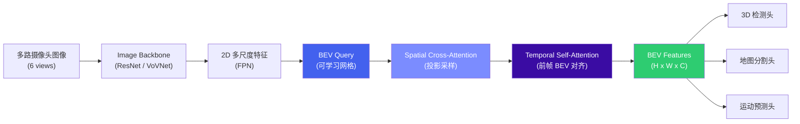
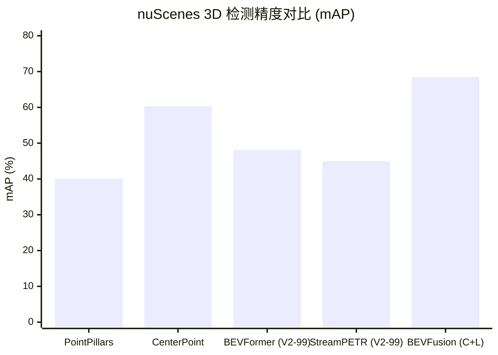

# 2. BEV 感知与端到端

*从 BEV 感知、3D 检测分割、占据预测到端到端与世界模型 | 自动驾驶感知算法全景*

> [!TIP]
> **本篇讲什么**
>
> 自动驾驶感知与决策的算法主线，十部分（本篇是四篇中最大的一篇，重点补齐了 Occupancy、4D 成像雷达、世界模型、Mapless 等通识缺口）：
>
> - **BEV 感知训练 / 3D 检测与分割**：BEVFormer 等主流范式、PointPillars/CenterPoint、Camera-LiDAR 联合
> - **占据预测 (Occupancy) / 4D 成像雷达 / 轨迹预测**：开放集兜底、新模态、感知到规划的桥梁
> - **端到端模型 / 世界模型 / Mapless**：UniAD/VAD、2024-2025 新范式、生成式驾驶、轻图化与定位
> - **越野场景 / 持续学习与数据飞轮**：非结构化道路、Shadow Mode、主动学习、4D 自动标注
>
> 本篇遵循全站口径：**保留公开的基准事实**（nuScenes NDS/mAP 等论文/数据集数字，并标注 backbone 配置），把部署延迟等估算数字标注为**示例参数**。

## 1. BEV 感知训练

### 1.1 BEVFormer 架构

BEV (Bird's Eye View) 感知是当前自动驾驶感知的主流范式。其核心思想是将多路摄像头的 2D 图像特征统一投影到一个 BEV 平面上，形成**以自车为中心的俯瞰视角特征表示**。在这个统一的 BEV 空间中，3D 目标检测、语义分割、车道线检测等下游任务都可以共享同一套特征，极大简化了多任务架构。

**BEVFormer** 是最具代表性的 Transformer-based BEV 方案。它通过可学习的 BEV Query 与多视角图像特征做空间交叉注意力 (Spatial Cross-Attention)，同时引入时序自注意力 (Temporal Self-Attention) 融合前帧的 BEV 特征，实现时空联合建模。



### 1.2 主流 BEV 方案对比

| 方案 | 核心方法 | 时序融合 | nuScenes NDS | 延迟 (Orin, 示例) | 优势 | 劣势 |
| :--- | :--- | :--- | :--- | :--- | :--- | :--- |
| **BEVDet4D** | LSS 显式深度估计 + Voxel Pooling | 帧拼接 | ~51.7 | ~45ms | 结构简洁，量化友好 | 深度估计误差较大 |
| **BEVFormer (V2-99)** | Deformable Attention + BEV Query | Temporal Self-Attention | ~56.9 | ~90ms | 精度高，时序建模优雅 | Deformable Attention 量化困难 |
| **StreamPETR (V2-99)** | Sparse Query + Motion-aware | Query 传播 | ~55.0 | ~65ms | 稀疏查询，计算效率高 | 遮挡场景性能受限 |
| **BEVFusion (C+L)** | Camera BEV + LiDAR BEV 特征级融合 | 可选 | ~71.4 | ~100ms | 多模态融合精度最高 | 依赖 LiDAR，成本高 |

> [!NOTE]
> **NDS/mAP 必须绑定 backbone 看，跨配置比较无意义**
>
> 表中 NDS 为 nuScenes 公开结果，但**同一方法换 backbone 数字差很多**，比较时务必对齐配置：
>
> - **BEVFormer**：base（R101-DCN）约 **NDS 51.7 / mAP 41.6**；换 V2-99 backbone 才到 **NDS 56.9 / mAP 48.1**。本表与 §2 的 mAP 统一采用 **V2-99** 口径，避免"NDS 用 V2-99、mAP 用 base"的混搭。
> - **StreamPETR**：这里同样用 V2-99（R50 版本要低若干个点）。
> - **BEVFusion**：Camera+LiDAR 融合，nuScenes val 约 **mAP 68.5 / NDS 71.4**（NDS 比 mAP 高约 3 点属正常；若看到 NDS 只比 mAP 高 0.7 点，多半是配置抄错）。
> - **延迟列**为依赖 backbone/分辨率/部署方式的**示例估算**，非实测标准值，请代入自己的引擎实测。

### 1.3 BEV 训练实用技巧

**数据增强 (BEV 空间增强)**：不同于传统的 2D 图像增强，BEV 模型需要在 BEV 空间中做增强，包括 BEV 平面随机旋转、缩放、平移。同时需要保持 2D 增强 (颜色抖动、随机裁剪) 和 BEV 增强之间的空间一致性。

**学习率调度**：BEV 模型通常采用 cosine annealing + linear warmup 策略。Backbone 使用较小的学习率 (约 head 的 1/10)，BEV Query 和 Attention 层使用更高学习率。总训练通常 24 个 epoch (nuScenes) 或 6 个 epoch (大规模私有数据)。

**多任务训练**：3D 检测、地图分割、运动预测等任务共享 BEV Backbone，各自有独立的 Task Head。任务间权重需仔细调整 (一个常见起点是检测 : 分割 : 预测 = 1.0 : 0.5 : 0.5)，可使用 Uncertainty Weighting 或 GradNorm 自动平衡。

> [!NOTE]
> **BEV 是当前主流范式**
>
> BEV 之所以成为主导方案，关键在于它提供了**统一的表征空间**：3D 检测、语义地图、运动预测都在同一个 BEV 空间中完成，避免了传统方案中各模块使用不同坐标系带来的对齐误差。几乎所有主流量产方案 (Tesla BEV、华为 GOD、小鹏 XNet 等) 都采用了 BEV 范式。

## 2. 3D 检测与分割

### 2.1 PointPillars (LiDAR-only)

**PointPillars** 是 LiDAR 3D 检测的经典 baseline。它将点云划分为柱状体 (Pillars)，每个 Pillar 内的点通过 PointNet 编码为固定维度的特征向量，然后将所有 Pillar 特征排列成伪图像 (Pseudo-Image)，接入 2D 检测骨干 (如 SSD) 完成检测。其关键在于**用 2D 卷积处理伪图像、避开了 3D 稀疏卷积**，因此推理速度极快，非常适合对延迟敏感的 ADAS 场景。

### 2.2 CenterPoint

**CenterPoint** 采用 center-based 检测范式，无需预定义 anchor。它首先将 LiDAR 点云体素化 (voxelization)，通过 3D Sparse Convolution 提取 BEV 特征，然后用热图 (heatmap) 预测目标中心点，回归 3D bounding box 的尺寸、朝向和速度。CenterPoint 还支持两阶段精化 (second-stage refinement)，进一步提升检测精度。

### 2.3 Camera-LiDAR 联合训练

纯视觉 3D 检测的精度瓶颈在于**深度估计**。Camera-LiDAR 联合训练的核心策略：

- **深度监督**：用 LiDAR 点云投影到图像平面生成深度 GT，对 Camera 分支的深度估计头做监督，显著提升深度估计准确度
- **特征级融合**：Camera BEV 特征和 LiDAR BEV 特征在 BEV 空间做 concatenation 或 attention-based 融合 (如 BEVFusion)
- **训练策略**：先预训练 Camera-only 分支 (用 LiDAR 深度监督)，再联合微调融合模型，效果优于从零开始联合训练

### 2.4 nuScenes 检测精度对比

**nuScenes 3D 检测精度对比 (mAP)**



> 注：图中混合了 LiDAR-only、Camera-only 与 Camera+LiDAR 方法，backbone 与 val/test 口径也不尽相同，仅作**数量级参考**；严格比较请对齐模态与 backbone（见 §1.2 的 NOTE）。

### 2.5 方法综合对比

| 方法 | 输入模态 | nuScenes mAP | 延迟 (Orin, 示例) | 硬件要求 | 量产适用性 |
| :--- | :--- | :--- | :--- | :--- | :--- |
| **PointPillars** | LiDAR | ~40.1 | ~10 | GPU (2D Conv on 伪图像) | 高 (成熟稳定) |
| **CenterPoint** | LiDAR | ~60.3 | ~25 | GPU (3D Sparse Conv) | 高 |
| **BEVFormer (V2-99)** | Camera | ~48.1 | ~90 | GPU (Deformable Attn) | 中 (量化挑战) |
| **StreamPETR (V2-99)** | Camera | ~45.0 | ~65 | GPU (Standard Attn) | 中高 |
| **BEVFusion (C+L)** | Camera + LiDAR | ~68.5 | ~100 | GPU (双模态) | 中 (依赖 LiDAR) |

> [!NOTE]
> **两个易错点**
>
> - **PointPillars 不用 3D 稀疏卷积**：它把点云编码成伪图像后跑 **2D 卷积**，这正是它快的原因；用 3D Sparse Conv 的是 CenterPoint/SECOND 这类体素方法。
> - **延迟为示例估算**：实际延迟强依赖 backbone、输入分辨率、是否真正用 TensorRT/QNN 部署，需以目标平台实测为准。

## 3. 占据预测 (Occupancy)

### 3.1 从检测框到 3D 占据

3D 检测只能输出**预定义类别** (车、人、骑行者……) 的包围盒，对开放场景里的"未知类别障碍物" (掉落货物、异形工程车、路边杂物) 无能为力。**3D 占据预测 (Occupancy Prediction)** 补上了这个缺口：它把车辆周围空间体素化 (voxel)，预测**每个体素是否被占据**，以及 (可选的) **语义类别**和**流动/速度**。

Occupancy 的本质是**对场景的稠密 3D 表征**，它把"障碍物检测"从"类别识别"里解耦出来——即使认不出这是什么，也能知道"这里有一坨东西，别撞上去"。Tesla 在 2022 年 AI Day 上把 Occupancy Networks 推到台前，使其成为感知的一等公民。

### 3.2 代表方法

| 方法 | 核心思想 | 特点 |
| :--- | :--- | :--- |
| **MonoScene** | 首个单目 3D 语义占据预测 | 单相机从 2D 特征重建 3D 体素语义，开创性但精度较粗 |
| **TPVFormer** | Tri-Perspective View (TPV) 表示 | 用 XY/XZ/YZ 三个正交平面近似 3D 体素，大幅降低计算量同时保持精度 |
| **SurroundOcc** | 多相机稠密占据 | 环视相机生成稠密占据栅格，3D 结构完整 |
| **OccNet / Occ3D / OpenOccupancy** | 大规模占据基准与 baseline | 推动占据任务的标准化与评测 |

UniAD 的 OccFormer (见 §6.1) 同样把占据作为中间表征喂给规划。

### 3.3 开放集障碍兜底价值

Occupancy 的核心价值在于**安全兜底**：

- **未知障碍物**：任何占据空间的物体都会被标为 occupied，无论它是否在训练类别里——直接提升长尾场景安全性。
- **不规则形状**：包围盒对细长/不规则障碍 (货物、护栏残片) 拟合差，体素能天然表达。
- **可行驶空间**：结合 flow 预测可区分"静态占据"与"动态障碍"，为规划提供更细的约束。

### 3.4 表征与部署挑战

- **计算与显存**：稠密 3D 体素随分辨率立方增长，端侧计算/显存压力大。TPV (三视角平面) 和稀疏占据 (只预测靠近表面的体素) 是主要的效率优化方向。
- **稀疏性**：场景中绝大多数体素是空的，用稀疏卷积/稀疏 query 只处理"可能占据"的区域能大幅省算。
- **标注成本**：3D 占据 GT 昂贵——通常靠多帧 LiDAR 聚合 + 离线重建生成 (见 §10.5 的 4D 自动标注)，或借助仿真。

## 4. 4D 成像雷达

### 4.1 什么是 4D 成像雷达

传统车载毫米波雷达测**距离、方位角、径向速度 (多普勒)**，但角分辨率低、点云稀疏，难以刻画目标轮廓。**4D 成像雷达**在此基础上增加了**俯仰角 (高度)** 维度，输出带高度信息的点云——"4D"通常指三个空间维 (距离/方位/俯仰) + 速度 (多普勒) 这四个维度。

### 4.2 与传统雷达 / LiDAR 对比

| 维度 | 传统雷达 | 4D 成像雷达 | LiDAR |
| :--- | :--- | :--- | :--- |
| **角分辨率** | 低 | 中高 (接近粗 LiDAR) | 高 |
| **点云密度** | 稀疏 | 中等 | 稠密 |
| **直接测速** | 能 (多普勒) | 能 (多普勒) | 不能 (需多帧估计) |
| **全天候** | 强 (穿雨雾尘烟) | 强 | 弱 (雨雾尘衰减) |
| **探测距离** | 远 | 远 | 中 |
| **成本** | 低 | 中 | 高 |

4D 成像雷达的独特优势：**全天候** (毫米波穿透雨、雾、尘、烟，远优于摄像头/LiDAR) 和**直接测速** (多普勒无需多帧估计)。

### 4.3 融合价值与挑战

- **融合价值**：作为 Camera+LiDAR 的冗余模态，提升恶劣天气、夜间的安全性；其直接测速对运动目标检测与预测有帮助。在越野/烟尘场景中价值尤其高 (见 §9)。
- **挑战**：点云仍比 LiDAR 稀疏、噪声大，存在多径反射 (护栏、隧道)；标注数据集稀缺；如何在 BEV 空间与相机/LiDAR 高效融合是活跃研究方向 (如 radar-camera 融合的 4D 检测)。

## 5. 轨迹预测

### 5.1 问题定义与评估

**轨迹预测 (Trajectory Prediction)** 预测其他交通参与者 (车辆、行人、骑行者) 的未来运动轨迹，是连接感知与规划的关键一环。它回答的不是"现在在哪"(检测)，而是"未来几秒会到哪"。

常用评估指标：

- **ADE (Average Displacement Error)**：所有时间步上预测与真值轨迹的平均距离误差。
- **FDE (Final Displacement Error)**：预测轨迹终点与真值终点的距离误差。
- **Miss Rate**：预测误差超过阈值的比例。
- **minADE / minFDE**：在多条预测轨迹中取最优，衡量多模态预测能力。

### 5.2 主流方法

- **传统方法**：匀速/匀转向模型、卡尔曼滤波、社会力模型——简单但难以刻画复杂交互。
- **向量化表示 (VectorNet)**：把地图 (车道) 和 agent 历史轨迹统一编码为折线 (polyline)，避免栅格冗余，是现在的主流表示。
- **交互建模 (GNN / Attention)**：用图神经网络或注意力建模 agent 之间的相互影响 (让行、跟驰、汇入)。
- **多模态预测**：输出多条可能未来及其概率 (如 TNT、DenseTNT、MTR、QCNet)，对应真实驾驶的不确定性 (路口可直行可转弯)。
- **地图感知**：结合高精地图/在线建图，约束轨迹符合可行驶区域。

### 5.3 与端到端的融合

在模块化方案里，预测是独立模块；在端到端方案 (如 UniAD 的 MotionFormer、VAD) 里，预测被并入统一模型，作为中间任务与检测/建图/规划共享特征、梯度端到端传播。好处是信息不被人为割裂，挑战是预测误差会直接传导到规划。

## 6. 端到端自动驾驶模型

### 6.1 UniAD 架构

端到端自动驾驶 (End-to-End AD) 的核心理念是**用一个统一模型完成从感知到规划的全部任务**，取代传统的模块化 pipeline。**UniAD** (Unified Autonomous Driving) 是这一方向的标志性工作。


UniAD 的关键设计：所有模块共享 BEV 特征，通过 Query 传递的方式进行信息流动——跟踪 Query 传给预测模块，预测结果传给规划模块。这种级联设计使得规划能够感知到完整的场景语义，而不仅仅是检测框列表。

### 6.2 VAD: 向量化场景表示

**VAD** (Vectorized Autonomous Driving) 进一步简化了端到端架构。它将场景中的所有元素 (车辆轨迹、道路边界、车道线) 统一表示为**向量化的折线 (polyline)**，避免了栅格化表示的信息冗余。规划模块直接在向量空间中生成未来轨迹，并通过向量化约束 (与道路边界的距离、与其他车辆的碰撞检查) 确保轨迹安全性。

### 6.3 端到端 vs 模块化对比

| 维度 | 端到端 (E2E) | 模块化 (Modular) |
| :--- | :--- | :--- |
| **灵活性** | 低 — 模型是黑盒，难以单独替换某个模块 | 高 — 感知/预测/规划可独立迭代 |
| **可解释性** | 低 — 决策过程不透明 | 高 — 每个模块有明确的输入输出 |
| **训练数据** | 需要完整的感知+规划标注 (成本极高) | 各模块可独立标注和训练 |
| **部署复杂度** | 低 — 一个模型搞定 | 高 — 多个模型的调度和数据流管理 |
| **性能上限** | 更高 — 梯度可以端到端优化 | 存在模块间信息损失 |
| **安全认证** | 极难 — 无法对黑盒进行 ASIL 认证 | 可分模块认证 |
| **Debug 效率** | 低 — 问题难以定位到具体模块 | 高 — 可逐模块排查 |
| **代表工作** | UniAD, VAD, GenAD, Tesla FSD v12 | Apollo, Autoware, Tesla (早期) |

> [!WARNING]
> **端到端是研究趋势，但模块化仍主导量产**
>
> 端到端模型在学术 benchmark 上展现了优越的性能，但在量产落地中面临严峻挑战：**功能安全认证**要求系统的每个环节都是可分析、可验证的，而端到端模型的黑盒特性与此根本矛盾。
>
> 要区分两条不同路线：一条是 **"模块化架构 + 端到端训练"**——保留显式的模块边界 (感知/预测/规划) 但允许梯度跨模块传播，兼顾可解释与联合优化；另一条是 **真·端到端 (photon-to-control)**——用单一网络直接从传感器输入映射到轨迹/控制。**Tesla FSD v12 属于后者**（用神经网络取代了大量手写 C++ 规划代码），不应被归为"模块化+端到端训练"。真·端到端性能上限更高，但安全认证与 debug 难度也更大；当前多数量产方案仍以模块化或"模块化+端到端训练"为主，真·端到端在少数玩家上快速演进。

### 6.4 2024-2025 新范式

UniAD/VAD 在 2023 年确立了"统一模型"的范式，2024-2025 端到端沿几个方向快速演进：

**扩散规划 (Diffusion Planning)**：把轨迹生成建模为条件扩散/去噪过程 (如 Diffusion Planner、DiffusionDrive)，天然处理轨迹的多模态性 (同一场景有多种合理未来)。挑战是扩散多步去噪慢，端侧需蒸馏成少步 (1-4 step) 甚至单步版本。

**生成式端到端 (GenAD)**：把生成式建模引入驾驶，将"场景理解 + 未来预测 + 轨迹生成"统一在一个生成式框架里，常与世界模型 (见 §7) 结合。

**稀疏化端到端 (如 SparseDrive)**：用稀疏 query 取代稠密 BEV 栅格，显著降低计算量，更易端侧部署，是端到端走向量产的重要分支。

**VLA (Vision-Language-Action)**：把视觉语言模型的常识与推理注入驾驶，直接输出动作或轨迹，与第 4 篇的驾驶 Agent 相通，是探索"长尾场景泛化"的前沿方向。

> [!NOTE]
> **趋势：从"模块拼接"到"统一表征 + 生成式"**
>
> 端到端的演进有一条主线：表征从稠密栅格走向稀疏/向量化，输出从判别式走向生成式 (扩散/世界模型)，与 VLM/VLA 的边界逐渐模糊。但无论范式如何变，**功能安全认证**与**端侧实时部署**仍是能否量产的试金石。

## 7. 世界模型与生成式驾驶

### 7.1 什么是驾驶世界模型

**世界模型 (World Model)** 学习一个能"预测场景未来状态"的生成式模型：给定当前场景 (和可选的动作/条件)，生成接下来会发生什么。在自动驾驶里，世界模型常表现为**可控制的驾驶视频生成**——不仅能预测未来，还能合成逼真的驾驶画面。

### 7.2 代表工作

| 工作 | 核心 |
| :--- | :--- |
| **GAIA-1 (Wayve)** | 生成式世界模型，可用文本/动作条件生成未来驾驶视频，大规模无监督学习 |
| **DriveDreamer** | 面向驾驶的世界模型，生成逼真视频 + 结构化输出 (如轨迹)，可用于数据增强与预测 |
| **GenAD** | 生成式端到端驾驶，把场景理解与轨迹生成统一到生成式框架 |
| **视频扩散模型** | 用扩散模型合成驾驶场景，做仿真与 corner case 生成 |

### 7.3 用途

- **数据生成/增强**：合成逼真但罕见的场景 (恶劣天气、事故、长尾目标)，缓解数据稀缺——对 corner case 尤其有价值。
- **神经仿真器**：作为"可学习的仿真器"滚动推演未来，用于闭环评测或规划 (在世界模型里想象不同动作的后果)。
- **预测与规划**：世界模型天然包含"场景如何演化"，可直接服务于运动预测与决策。

### 7.4 挑战

- **计算成本**：视频生成 (尤其扩散) 计算量大，端侧实时困难，多用于离线数据生成/云端仿真。
- **物理一致性**：生成的视频可能违反物理/几何 (物体穿模、运动不合理)，影响其作为训练数据或仿真的可信度。
- **幻觉**：生成模型可能"编造"不存在的内容，需要额外约束与验证。
- **扩散加速**：多步去噪慢，端侧/实时场景需蒸馏成少步 (1-4 step) 版本。

## 8. Mapless 与轻图化

### 8.1 为什么要去高精地图

高精地图 (HD Map) 厘米级精确，但**制作昂贵、更新慢、覆盖难**——需要持续采集维护，路况变化 (施工、改道) 时容易过时，且有资质成本。因此业界转向"**重感知、轻地图**"甚至 mapless：更多依赖实时感知，减少对先验地图的依赖。Tesla 是"无图"的代表性主张者，国内华为、小鹏等也推动了轻图化的城市方案。

### 8.2 在线建图 (Online Mapping)

Mapless 的核心是**在线建图**——用车载传感器实时构建局部矢量化地图 (车道线、道路边界、路口、人行横道)，替代离线高精地图。代表方法：

- **HDMapNet**：早期在线矢量化高精地图构建。
- **MapTR / MapTRv2**：把地图元素建模为有序点集，端到端预测矢量化地图结构，精度与速度兼顾。
- **StreamMapNet**：引入时序信息，提升在线建图的稳定性与一致性。

在线地图通常在 BEV 空间中直接构建，与 BEV 感知 (§1) 共享特征。

### 8.3 定位与 SLAM

去掉高精地图后，**定位 (Localization)** 更加关键：车辆要知道"我在哪"。

- **基于高精地图的定位**：用点云/视觉特征与先验地图匹配，得到高精定位 (传统方案)。
- **无图定位**：依赖视觉里程计 (VO)、视觉惯性里程计 (VIO)、LiDAR SLAM 等，在没有先验地图时增量估计自车位姿。
- **SLAM (同时定位与建图)**：边估计位姿边构建地图，是无图场景的核心技术；视觉 SLAM 与 LiDAR SLAM 各有优劣 (LiDAR 精确但贵，视觉便宜但对光照/纹理敏感)。

> [!NOTE]
> **"无图"不等于完全没有地图**
>
> 工程上的"无图"通常指**不依赖厘米级高精地图**，仍可能使用 SD 地图 (道路级导航图) 或在线构建的局部地图。本质是把"地图负担"从离线先验转移到在线感知。

## 9. 越野/非结构化场景

### 9.1 概述与应用场景

越野自动驾驶 (Off-road Autonomous Driving) 面对的是与结构化道路完全不同的环境：**没有车道线、没有交通标志、没有明确的道路边界**，取而代之的是复杂多变的自然地形——沙地、泥地、碎石、草地、水坑、树根、灌木等。传统结构化道路感知算法几乎完全失效。其核心转变是：从"**检测已知目标**"变为"**理解地形物理属性**"(从外观推断含水量、承载力等)。

典型应用：军事无人车辆、农业自动化、矿山运输、灾难救援、星球探测 (火星/月球巡视器)。

### 9.2 地形分类与可通行性分析

**地形分类**判断每个像素/区域属于什么地形，类别比结构化道路语义分割更细粒度、边界更模糊：

| 大类 | 子类 | 可通行性 | 感知难点 |
| :--- | :--- | :--- | :--- |
| **硬质地面** | 干燥沥青、砾石路、岩石面 | 高通行性 | 与未铺装道路的边界模糊 |
| **松软地面** | 干沙、湿沙、淤泥、松土 | 中/低 (依赖含水量) | 视觉外观相似但物理性质差异巨大 |
| **植被覆盖** | 短草、高草、灌木、落叶堆 | 短草可通行，高草/灌木可能不可 | 高度和密度难以从单帧图像判断 |
| **水体** | 浅水坑、深水区、泥水混合 | 浅水可通行，深水危险 | 水深无法从视觉直接判断，反射干扰 |
| **不可通行** | 悬崖、深沟、大型岩石、倒木 | 不可通行 | 几何障碍需要 3D 感知 |

**可通行性分析 (Traversability Analysis)** 综合几何信息 (LiDAR/双目生成高度图，计算坡度/粗糙度/阶跃高度) 与语义信息 (地形类型 → 摩擦系数/陷入风险)：

```python
# 几何可通行性分析伪代码
def geometric_traversability(height_map, vehicle_params):
    slope = compute_slope(height_map)          # 坡度 (度)
    roughness = compute_roughness(height_map)   # 粗糙度 (高度方差)
    step = compute_step_height(height_map)      # 阶跃高度 (m)

    score = 1.0                                  # 可通行性评分 (0-1, 1 为完全可通行)
    score -= clip(slope / vehicle_params.max_slope, 0, 1) * 0.4
    score -= clip(roughness / vehicle_params.max_roughness, 0, 1) * 0.3
    score -= clip(step / vehicle_params.max_step, 0, 1) * 0.3
    return clip(score, 0, 1)
```

语义可通行性把地形类型映射为评分与推荐速度，例如：干燥砾石路 ~0.9 / 30-50 km/h，干沙 ~0.5 / 10-20 km/h，湿泥 ~0.2 / 5-10 km/h，短草 ~0.7 / 15-30 km/h，浅水坑 (<20cm) ~0.4 / 5-15 km/h，岩石面 ~0.6 (颠簸) / 10-20 km/h。

### 9.3 结构化道路 vs 越野：核心差异

| 维度 | 结构化道路 | 越野/非结构化 |
| :--- | :--- | :--- |
| **道路边界** | 车道线、路沿、护栏，边界清晰 | 无明确边界，可通行区域需推断 |
| **交通规则** | 交通法规、红绿灯、标志牌 | 无交通规则，纯物理约束 |
| **目标类别** | 车辆、行人、自行车等有限类别 | 岩石、树木、动物、坑洞等开放类别 |
| **感知核心** | 检测已知类别的目标 | 理解地形物理属性 |
| **规划逻辑** | 遵循车道、保持车距、让行 | 选择可通行路径、避开风险区域 |
| **失败模式** | 碰撞、违规 | 陷车、侧翻、悬挂损坏 |
| **数据可用性** | 海量 (nuScenes, Waymo, KITTI) | 极度稀缺 (RUGD, RELLIS-3D) |

### 9.4 数据稀缺与前沿方向

越野数据集 (RUGD、RELLIS-3D) 规模比结构化道路小 1-2 个数量级，且场景覆盖不全。缓解路径：

- **合成数据**：用 Unreal Engine 5 / Unity 程序化生成地形 (随机高度图 + 材质 + 光照)，核心挑战是 **Sim-to-Real Gap**。
- **域适应**：DANN 对抗特征对齐、CycleGAN/UNIT 风格迁移、自训练伪标签、MoCo/SimCLR 自监督预训练。
- **少样本学习**：Prototypical Network / MAML，仅用 5-10 张标注图识别罕见地形 (沼泽、冰面)。

前沿方向：

- **自监督可通行性**：用行驶中的 IMU 振动、车轮滑移率、悬挂行程回溯标注相机帧，无需人工标注持续积累数据。
- **多模态融合**：越野中单一传感器严重不可靠 (摄像头受尘土遮挡、LiDAR 被草地干扰)，必须 Camera+LiDAR+Radar+IMU 融合；**Radar** 对穿透烟尘、大雨有独特优势，价值远高于结构化道路 (呼应 §4 的 4D 成像雷达)。
- **基础模型迁移**：用 SAM、DINOv2 做 zero-shot 分割/特征提取，再用少量越野数据微调分类头；DINOv2 特征即使不微调，在越野地形分类上也表现优异。

> [!NOTE]
> **越野需要根本不同的感知范式**
>
> 结构化道路感知是"检测已知目标"(分类 + 定位)；越野感知是"理解地形属性"(从外观推断物理性质)。这种**从语义分类到物理属性推理**的转变，是越野感知的核心挑战。

## 10. 持续学习与数据飞轮

### 10.1 数据飞轮架构

自动驾驶的核心竞争力不在于单个模型的精度，而在于**数据飞轮 (Data Flywheel)** 的运转效率。数据飞轮是一个闭环系统：车辆部署后持续收集数据，自动发现困难场景 (Corner Case)，触发数据标注和模型重训练，再通过 OTA 更新部署到车队，形成正向循环。


### 10.2 Shadow Mode (影子模式)

**Shadow Mode** 是数据飞轮的入口。在量产车辆上，当前生产模型正常控制车辆，同时一个实验性新模型在后台并行运行但**不控制车辆**。两个模型的输出持续对比：

- **一致性分析**：两模型输出一致的场景说明是 "简单场景"，不需要额外关注
- **分歧检测**：两模型输出不一致的场景是 "有价值场景"——可能是新模型的提升，也可能是新模型的退化
- **触发上传**：分歧场景自动触发数据片段上传 (前后各 10 秒的视频 + 传感器数据)，供后续分析

### 10.3 Corner Case 自动发现

Corner Case 是模型容易犯错的长尾场景。自动发现策略包括：

**模型不确定性**：使用 MC Dropout 或 Deep Ensemble 估计模型输出的不确定性。不确定性高的帧大概率是 corner case (如罕见的遮挡模式、异常天气)。

**预测误差**：将模型的预测结果与实际结果 (通过后续帧回溯验证) 对比。例如：模型预测前方无障碍物，但车辆随后做了急刹车——这说明模型漏检了。

**硬件事件触发**：急刹车 (加速度 > 0.5g)、急转向、ABS 触发、人类接管等事件自动标记为 corner case 候选。

### 10.4 主动学习

从海量的候选 corner case 中选择最有价值的样本进行标注，是主动学习 (Active Learning) 的核心问题。选样策略：

| 策略 | 原理 | 优点 | 缺点 |
| :--- | :--- | :--- | :--- |
| **不确定性采样** | 选择模型最不确定的样本 | 直接针对模型弱点 | 可能选择大量相似场景 |
| **多样性采样** | 在特征空间中做 K-Means 聚类，每类选代表 | 保证场景多样性 | 可能忽略真正困难的场景 |
| **混合策略** | 先不确定性筛选 Top-K，再多样性聚类选子集 | 兼顾困难性和多样性 | 实现复杂，超参敏感 |
| **代表性采样** | 选择与未标注池分布最接近的样本 | 减少数据偏差 | 计算成本高 |

### 10.5 4D 自动标注

数据飞轮的瓶颈常在**标注成本**——3D 框、占据、轨迹的人工标注昂贵且慢。现代解法是 **4D 自动标注 (4D Auto-labeling)**：用**离线大模型**对采集的多帧数据做 4D (3D 空间 + 时间) 重建，自动生成标签。

为什么离线可以比在线强：

- **可用未来帧**：离线标注能利用整段序列 (含未来帧)，而在线感知只能用当前/过去帧。
- **可用大模型**：离线不受车端算力/延迟约束，可跑大模型、ensemble、TTA (测试时增强)。
- **多传感器聚合**：把多帧 LiDAR 点云 + 多相机图像聚合，通过离线重建 (点云聚合 / NeRF / 3DGS) 得到一致的 4D 场景。

典型流程：**离线感知 (大模型) → 多目标跟踪 → 4D 场景重建 → 标签反向传播/传递 → 质量校验**。4D 重建保证标签在多帧间时序一致 (同一目标的框跨帧平滑)，并能生成占据等稠密 GT (呼应 §3)。这是支撑大规模数据闭环的核心引擎。

> [!TIP]
> **数据飞轮是自动驾驶的真正竞争壁垒**
>
> 模型架构是公开的，算力是可购买的，但**高质量的 corner case 数据**只能通过大规模车队运营积累。这就是为什么 Tesla (数百万辆车)、Waymo (数十亿英里仿真) 具有难以复制的竞争优势。对于初创公司和新进入者，建立高效的数据飞轮——尤其是自动化的 corner case 挖掘、4D 自动标注流程——是最关键的基础设施投入。
