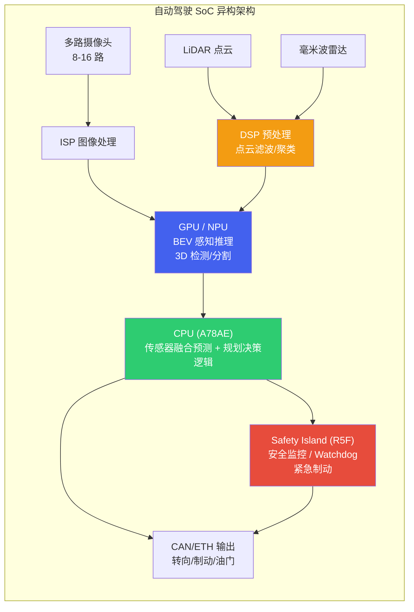

# 1. 自动驾驶算力平台

*自动驾驶 SoC 全景与异构计算架构 | 算力 · 功能安全 · 能效 · 开发生态*

> [!TIP]
> **本篇讲什么**
>
> 自动驾驶域控制器的算力底座，两部分：
>
> - **SoC 全景**：四大主流自动驾驶 SoC 阵营（Qualcomm / NVIDIA / TI / Mobileye）的能力对比与选型逻辑
> - **异构计算架构**：CPU+GPU+DSP+NPU 的任务分工、算力预算分配与功能安全分区
>
> 读完能回答：给定一个自动驾驶场景（L2 ADAS 还是 L4 Robotaxi），如何选择合适的 SoC，以及算力如何在各计算单元之间分配、安全如何分区兜底。

## 1. 自动驾驶 SoC 全景

### 1.1 主流 SoC 概览

自动驾驶对计算芯片的要求远超智能座舱：需要更高的算力 (TOPS)、更严格的功能安全认证 (ASIL)、更低的推理延迟以及更稳健的热设计。目前主流 SoC 形成了四大阵营（本文聚焦这四家全球主力，各有侧重）；2025 起的新一代平台与中国厂商进展见本节末尾的时效性提示。

**Qualcomm SA8650P (Snapdragon Ride)**：Qualcomm 面向 L2+/L3 自动驾驶推出的高性能 SoC。综合算力约 **100 TOPS**（厂商口径，随配置而异），采用 CPU+GPU+NSP (Neural Signal Processor) 异构架构，支持多路摄像头输入和传感器融合。Snapdragon Ride 平台的方向是座舱 + 驾驶「一芯多域」融合 (Ride Flex)，用一颗芯片同时覆盖两个域以降低 BOM 成本（一芯多域的旗舰定位更多对应 SA8775P 一线，SA8650P 偏 ADAS 计算，具体以高通产品矩阵为准）。支持 QNN SDK 开发，生态与座舱 Snapdragon 系列高度统一。

**NVIDIA DRIVE Orin**：目前高阶自动驾驶领域最广泛使用的车规 SoC。车规版 **DRIVE Orin 提供 254 TOPS** (INT8) 算力，基于 Ampere GPU 架构和 12 核 ARM Cortex-A78AE CPU。CUDA/TensorRT 生态极其成熟，开发效率最高。适合 L3/L4 级别的高算力需求场景，功耗较高（高配 45-60W，功耗可配置、可下探至 ~15W），功能安全上通过 lockstep CPU 与安全岛支持 ASIL-D。**口径提醒**：注意区分同代 Jetson 模组——**Jetson AGX Orin 为 275 TOPS、Jetson Orin NX 为 100 TOPS**；车规 DRIVE Orin (254) 与 Jetson 模组 (275/100) 是同一 Orin die 的不同产品形态/配置，引用 TOPS 时务必写清是哪一款，「AGX Orin = 254」是最常见的口径混用。

**TI TDA4VM**：德州仪器面向 L2/L2+ 前视 ADAS 的高能效 SoC，内置专用深度学习加速器 C7x-MMA，提供约 **8 TOPS** 算力。功耗极低 (典型 5-15W)。片上集成 R5F lockstep 安全岛，TI 提供较完整的功能安全文档包，是前装量产 ADAS 中安全认证成熟度较高的主流 AD SoC 之一。非常适合前装量产 ADAS 方案，但算力有限，无法支撑大规模 BEV 模型。

**Mobileye EyeQ6**：Mobileye 采用固定管线 (Fixed Pipeline) + 可编程加速器的混合架构，面向大规模前装量产。其封闭生态限制了灵活性，但成熟的感知算法栈和极高的量产可靠性使其在传统 OEM 中广受欢迎。EyeQ6H 提供约 **34 TOPS**，EyeQ6L 为低成本 L2 方案。

> [!NOTE]
> **2025-2026 进展：新一代平台已开始量产（时效性提示）**
>
> 上面四款多为 **2022-2024 平台**，仍是当前量产主力；但**新一代平台自 2025 起已陆续发布并进入量产爬坡**，算力量级又上了一个台阶。选型方法与约束（TOPS 口径、内存带宽、功耗墙、安全分区）不变，只是数字要按新平台重估：
>
> - **NVIDIA DRIVE Thor / Jetson Thor（2025 起量产爬坡）**：Blackwell GPU 架构，面向 L4 与「物理 AI / 具身智能」，AI 算力较 Orin 提升近一个数量级（官方口径约 **2000 TOPS (FP8) 量级**），内存带宽大幅提升——这正是端侧大模型 decode 最需要的改善（见 [驾驶 Agent 与安全](agent-safety.html) 的带宽 roofline 推导）。Jetson AGX Thor 开发套件已于 2025 年推出，是 Orin 的明确继任者。
> - **Qualcomm Snapdragon Ride Elite（2024 发布、2025-2026 上车）**：采用 Qualcomm Oryon CPU，是 SA8650P 与「一芯多域」Ride Flex 旗舰（SA8775P，座舱 + 驾驶融合）之上的新旗舰，AI 算力继续上探。
> - **Mobileye EyeQ Ultra**：面向 L4（Chauffeur/Drive）的旗舰，官方口径约 **176 TOPS**，量产时间窗落在 2025-2026，是 EyeQ6 High 的下一代。
> - **中国厂商加速量产（2025）**：地平线征程 6 系列（高阶版达数百 TOPS 量级）、华为 MDC/昇腾、黑芝麻智能等已大规模上车，是 L2+/高阶智驾市场不可忽视的力量（具体规格以厂商为准）。
> - **TI**：TDA4 家族向更高算力变体（如 TDA4VH）扩展，覆盖更复杂的感知负载。
>
> 本文给出的 TOPS/功耗均为撰写时的公开口径，**请以厂商最新规格书为准**，不要把本文数字当作最新值。

### 1.2 SoC 能力雷达图

**自动驾驶 SoC 能力雷达图**（1-10 为相对评分，非实测）

| 指标 | SA8650P | Orin | TDA4VM | EyeQ6H |
| :--- | :--- | :--- | :--- | :--- |
| AI 算力 (TOPS) | 7 | 10 | 2 | 4 |
| 能效比 | 7 | 5 | 10 | 7 |
| 开发生态 | 7 | 10 | 5 | 3 |
| 安全认证 | 5 | 6 | 10 | 8 |
| BOM 成本 | 8 | 4 | 9 | 7 |
| 灵活性 | 8 | 9 | 4 | 2 |

### 1.3 详细规格对比

| 指标 | Qualcomm SA8650P | NVIDIA DRIVE Orin | TI TDA4VM | Mobileye EyeQ6H |
| :--- | :--- | :--- | :--- | :--- |
| **AI 算力** | ~100 TOPS (INT8) | 254 TOPS (INT8, 车规) | 8 TOPS (INT8) | ~34 TOPS |
| **CPU** | Kryo 车规 CPU (8 核) | 12x Cortex-A78AE | 2x Cortex-A72 + 6x Cortex-R5F | 多核 (封闭) |
| **GPU** | Adreno 车规 GPU | 2048-core Ampere | 无独立 GPU | 无 (固定管线) |
| **AI 加速器** | Hexagon NSP | 2x NVDLA + GPU | C7x-MMA DSP | XNN / CVP |
| **功耗** | 25-35W | 45-60W | 5-15W | 12-18W |
| **安全认证** | ASIL-B (向 D 推进) | ASIL-D (lockstep CPU) | ASIL-D (含安全岛) | ASIL-B/D (量产验证) |
| **摄像头支持** | 最多 18 路 | 最多 16 路 | 最多 8 路 | 最多 12 路 |
| **开发生态** | QNN / SNPE | CUDA / TensorRT | TI TIDL / Edge AI | 封闭 SDK |
| **典型应用** | L2+/L3，Ride 一芯多域 | L3/L4 高阶智驾 | L2 前视 ADAS | L2/L2+ 前装量产 |

> [!NOTE]
> **车规 SoC 的具体 IP 配置以厂商规格为准**
>
> 上表中 CPU/GPU 的具体微架构型号，厂商在车规产品上往往不对外详细披露（或随版本演进），直接套用同代手机芯片的型号容易张冠李戴。这里只给出架构族（Kryo / Adreno / Cortex / Ampere）层面的口径，选型时以厂商正式规格书为准。**TOPS 口径同理**：表中 NVIDIA 一列是车规 DRIVE Orin (254 TOPS)，不要与 Jetson AGX Orin (275) / Orin NX (100) 的模组口径混用（见 §1.1 口径提醒）。

> [!NOTE]
> **没有"最佳" SoC — 选型取决于场景**
>
> 自动驾驶 SoC 的选择必须综合考虑多个维度：
>
> * **L2 vs L4**：L2 ADAS 优先考虑 TDA4VM (低成本、功能安全成熟)；L4 Robotaxi 需要 Orin 的高算力
> * **成本 vs 性能**：Snapdragon Ride 的座舱驾驶一芯方案可大幅降低 BOM；Orin 性能最强但 BOM 成本最高
> * **开发速度 vs 认证**：Orin 的 CUDA 生态开发最快；TDA4VM 的功能安全文档最完整
> * **开放 vs 封闭**：Mobileye 交钥匙方案省心但灵活性差；Orin/SA8650P 开放生态适合自研

### 1.4 选型常见误区（资深视角）

拿到规格表后，真正决定选型成败的往往是下面这几个容易被忽略的点：

> [!WARNING]
> **标称 TOPS ≠ 实测可用算力**
>
> 厂商 TOPS 通常是**最理想口径**（INT8 甚至 INT4、稀疏 (sparse) 加速、峰值频率），而真实模型能跑出的**有效算力常常只有标称的 10%~30%**（经验量级，随模型结构、编译器与调度差异很大）。原因包括：稀疏度不达标、非卷积算子落到 GPU/CPU、内存搬运开销、量化精度回退到 FP16 等。比较两颗芯片时，**拿同一个目标模型在两边实测的帧率/延迟**，远比比 TOPS 数字可靠。

> [!NOTE]
> **端侧大模型的瓶颈是内存带宽，不是 TOPS**
>
> 对 BEV/Transformer 这类大模型，尤其是自回归 decode，瓶颈往往从「算力」转移到「内存带宽」——每步都要把权重从内存读一遍，吞吐 ≈ 带宽 ÷ 每步读取字节（roofline 推导见 [驾驶 Agent 与安全](agent-safety.html)）。Orin 级平台内存带宽约 200 GB/s 量级，这正是端侧跑大 VLM 吃力的根因，也是 Thor 等新一代平台重点提升带宽的原因。**选型大模型负载时先看内存带宽与显存容量，再看 TOPS。**

> [!NOTE]
> **功耗墙才是车规的真实约束**
>
> 车规域控通常**被动散热或有限风冷**，且要在 -40~85°C 环温下长期工作——能持续散掉多少瓦，比芯片能跑多快更先成为硬约束。峰值算力往往只在短时 boost 下可达，持续负载会因热降频。因此要看**功耗墙内的持续算力 (TOPS/W)**，而不是峰值 TOPS；这也是 TDA4VM 这类低功耗 SoC 在前装 ADAS 大量上车的原因。

> [!NOTE]
> **车规级 ≠ 消费级：AEC-Q100 与功能安全认证**
>
> 同一颗「算力很强」的芯片，消费级与车规级是两回事。车规芯片要过 **AEC-Q100** 可靠性认证（温度等级、寿命、失效率）、满足 **ISO 26262** 功能安全流程、支持更宽工作温度、并承诺 **10~15 年** 的供货与生命周期。这些是「能不能量产上车」的门槛，也解释了为何车规 SoC 的纸面算力通常落后消费旗舰一到两代——**为可靠性和长周期让路**。

## 2. 异构计算架构

### 2.1 CPU+GPU+DSP+NPU 协同

自动驾驶域控制器中的异构 SoC 将不同类型的计算任务分配给最适合的计算单元。感知类任务 (卷积、Transformer) 交给 **GPU/NPU**，规划与决策逻辑运行在 **CPU** 上，信号处理和传感器预处理交给 **DSP**，而安全监控则在独立的 **Safety Island (安全岛)** 上运行，确保即使主系统崩溃也能触发安全停车。

### 2.2 算力预算分配

算力预算的核心方法是**先按模块拆任务、再按运行单元归位、最后留安全余量**。下表给出一个 L3/L4 系统的分配**示例（示例参数，仅演示拆分方法，不代表任何实测/标准答案**；实际占比随传感器数量、模型规模与方案差异很大，需按自己平台实测标定）：

| 模块 | 占比 (示例) | 运行单元 | 典型任务 |
| :--- | :--- | :--- | :--- |
| **感知** | 60% | GPU / NPU | BEV 特征提取、3D 目标检测、语义分割、车道线识别、交通标志检测 |
| **预测** | 15% | GPU / CPU | 轨迹预测 (其他交通参与者未来运动)、意图识别、交互建模 |
| **规划** | 15% | CPU | 路径规划、行为决策、运动规划、轨迹优化 |
| **系统开销** | 10% | CPU / Safety Island | 传感器同步、数据传输、安全监控、日志记录、OTA 通信 |

> [!NOTE]
> **预算要留余量，且按「持续算力」而非「峰值算力」估**
>
> 上表是「理想满载」的拆分。实际预算还要：给**热降频留余量**（功耗墙内持续算力 < 峰值，见 §1.4）、给**峰值帧/长尾场景留突发余量**、给**安全监控与 OTA 等系统开销**单独预留。把 100% 算力排满的方案在真实热约束下几乎必然超时。

### 2.3 功能安全分区

异构 SoC 的功能安全设计核心是**分区隔离**：高性能但不保证安全的应用分区 (QM) 和保证安全的安全分区 (ASIL-D) 独立运行，通过硬件隔离保证一方故障不会影响另一方。

| 分区 | 安全等级 | 运行内容 | 故障后果 |
| :--- | :--- | :--- | :--- |
| **应用分区 (QM)** | QM (无安全要求) | GPU 上的 DNN 推理、高精地图渲染、座舱 HMI | 感知性能降级，触发 fallback |
| **安全分区 (ASIL-D)** | ASIL-D | Safety Island 上的安全监控、Watchdog、紧急制动逻辑 | 危险故障率须 <10 FIT (PMHF 10⁻⁸/h)；此分区失效即丧失最后安全屏障 |
| **安全相关分区 (ASIL-B)** | ASIL-B | CPU lockstep 上的规划验证、碰撞检测 | 触发降级到更低自动化等级 |

> [!WARNING]
> **GPU/NPU 推理通常为 QM 等级**
>
> 当前主流的 DNN 推理引擎 (TensorRT、QNN) 本身**不具备功能安全认证**。因此，感知模块的输出必须由独立的安全监控模块 (运行在 ASIL-D Safety Island 上) 进行合理性检查 (plausibility check)。例如：目标突然消失、检测框面积异常变化等情况需要触发告警。这是当前自动驾驶安全架构的核心设计原则之一。

> [!NOTE]
> **lockstep、安全岛、ASIL 分解是三个不同机制，别混为一谈**
>
> 回答「这块芯片怎么做到 ASIL-D」时，常把下面三者当成同一件事，其实层次不同：
>
> - **Lockstep（锁步核）**：两个 CPU 核执行同一指令流、互相比对结果，用硬件冗余检出瞬态故障——本质是「同一个核跑两遍」，提升的是 CPU 自身的**诊断覆盖率**（如 Cortex-R5F、A78AE 的 split-lock 模式）。
> - **安全岛 (Safety Island)**：一颗**独立、低功耗、通常 ASIL-D** 的核/MCU（如 R5F lockstep），与主 SoC 物理隔离，跑看门狗、安全监控与紧急停车。主系统崩了它仍能兜底——提供的是**独立性**。
> - **ASIL 分解 (ASIL Decomposition)**：ISO 26262 的**需求分配**手段——把一个高 ASIL 需求拆到多个**相互独立**的元素上（如 ASIL-D = ASIL-B(D) + ASIL-B(D)），前提是独立性可论证。它是需求层面的拆分，不是某个硬件特性。
>
> 三者常一起用：lockstep 提升单核覆盖 → 安全岛提供独立兜底 → ASIL 分解把需求合理分配到冗余元素上。但它们是**互补的三层**，不能互相替代。
