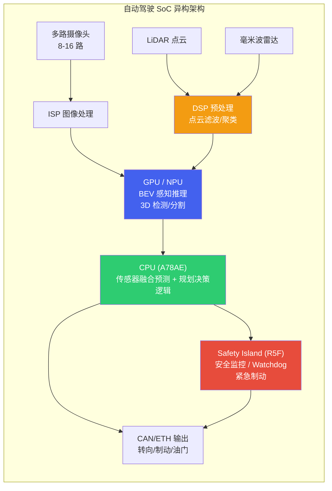

# 自动驾驶算力平台

*自动驾驶 SoC 全景与异构计算架构 | 算力 · 功能安全 · 能效 · 开发生态*

> [!TIP]
> **本篇讲什么**
>
> 自动驾驶域控制器的算力底座（聚焦能承载端侧大模型的高算力平台），两部分：
>
> - **SoC 全景**：大模型级算力平台（NVIDIA Orin/Thor、Qualcomm Ride、地平线征程6、华为昇腾）的能力对比与选型逻辑；传统低算力 ADAS（TI/Mobileye）仅作对照
> - **异构计算架构**：CPU+GPU+DSP+NPU 的任务分工、算力预算分配与功能安全分区
>
> 读完能回答：要跑 BEV/端到端/VLA/世界模型，如何选择合适的 SoC（算力/内存带宽/显存怎么权衡），算力如何在各计算单元之间分配、安全如何分区兜底。

## 1. 自动驾驶 SoC 全景

### 1.1 大模型级算力平台（端侧 AI 的核心载体）

> [!IMPORTANT]
> **本篇聚焦「能承载端侧大模型」的高算力平台**
>
> 本板块的「端侧 AI」指近两年的 **BEV/Occupancy 大模型、端到端、VLA、世界模型、驾驶 LLM/VLM Agent**——这些负载需要**高算力（百 TOPS 起）+ 高内存带宽 + 大显存**，只有新一代车规 SoC 才能承载。传统低算力 ADAS 芯片（如 TI TDA4VM ~8 TOPS、Mobileye EyeQ6 ~34 TOPS）面向 L2 前视感知，**跑不动端侧大模型**，虽在前装量产 ADAS 中仍大量使用，但不是本篇（端侧大模型算力底座）的重点，仅在本节末尾的对照 NOTE 中说明。

能承载端侧大模型的主流平台与代表芯片（按算力量级）：

**NVIDIA DRIVE Orin（当前量产主力）**：高阶智驾部署最广泛的车规 SoC，**254 TOPS INT8（稀疏）**，Ampere GPU（2048 CUDA core）+ 12 核 Cortex-A78AE + DLA，32GB LPDDR5。CUDA/TensorRT 生态最成熟，是 BEV/端到端/驾驶 VLM 的主流落地平台，功能安全上以 lockstep CPU + 安全岛支持 ASIL-D。**口径提醒**：车规 DRIVE Orin（254 TOPS）与同 die 的 Jetson 模组（AGX Orin 275 / Orin NX 100）是不同产品形态，引用 TOPS 务必写清是哪一款，「AGX Orin = 254」是最常见的口径混用。

**NVIDIA DRIVE Thor（2025 新一代旗舰）**：Blackwell GPU（2560 CUDA core）+ 14 核 Neoverse-V3AE + 128GB LPDDR5X，单 SoC AI 算力达**千 TOPS 量级（FP8 稀疏约 1000、稠密约 500；NVIDIA 宣传口径有「2000 TOPS」说法，含 FP4/不同配置，以官方规格书为准）**，内存带宽较 Orin 大幅提升——这正是端侧大模型自回归 decode 最需要的改善（带宽 roofline 见 [驾驶 Agent 与安全](agent-safety.html)）。2025 年起量产上车（首发车型如领克 900，比亚迪/小鹏/理想/极氪等跟进），是 Orin 的明确继任者，面向 L4 与「物理 AI」。

**Qualcomm Snapdragon Ride（SA8650P / Ride Elite）**：SA8650P 综合算力约 **100 TOPS**（厂商口径，随配置而异），CPU+GPU+Hexagon NSP 异构，支持 QNN SDK，与座舱 Snapdragon 生态统一；方向是座舱 + 驾驶「一芯多域」（Ride Flex，旗舰更多对应 SA8775P）。**Snapdragon Ride Elite**（2024 发布、2025-2026 上车）采用 Qualcomm Oryon CPU，是 Ride 系列新旗舰，AI 算力继续上探（具体以高通官方为准）。

**地平线征程 6（中国高阶主力，2025 量产）**：征程 6P 达 **560 TOPS**（4 颗 Nash BPU 3.0），18 核 Cortex-A78AE（410k DMIPS）、192-bit LPDDR5x-8533（**204 GB/s 带宽**）、<50W、TSMC 7nm，2025 Q3 起量产；Nash BPU 专门面向**高参数 Transformer 与端到端架构**优化。系列覆盖 6B（10+ TOPS，主动安全）到 6P（560 TOPS，全场景 NOA），已大规模上车（理想/比亚迪/广汽/大众等）；后续征程 7P 目标 ~1000+ TOPS（预计 2027）。

**华为 MDC / 昇腾（中国高阶）**：华为 MDC 智能驾驶计算平台（基于昇腾 AI 芯片）驱动问界/阿维塔等高阶智驾车型，算力量级与 Orin/征程 6P 同级或更高（具体规格以华为官方为准，封闭生态细节本板块不展开）。国产大算力 AD 平台目前以地平线（征程 6P）与华为（昇腾/MDC）为量产主力，黑芝麻智能等玩家也在推进高阶方案（具体型号/规格以厂商官方为准）。

> [!NOTE]
> **传统低算力 ADAS 平台（对照，非端侧大模型重点）**
>
> 以下平台在 L2 前装量产 ADAS 中仍占很大份额，但算力不足以承载 BEV 大模型/VLA/世界模型，**不属于本板块「端侧大模型」的核心载体**，列出仅作选型对照：
>
> - **TI TDA4VM**：~8 TOPS（C7x-MMA），5-15W，R5F lockstep 安全岛，功能安全文档成熟——面向 L2 前视 ADAS，无法支撑大规模 BEV/大模型。
> - **Mobileye EyeQ6**：固定管线 + 可编程加速器混合架构，封闭生态、量产可靠性高；EyeQ6 High ~34 TOPS（2025）、EyeQ6 Lite ~5 TOPS，下一代 EyeQ7 ~67 TOPS（2027）——算力量级仍偏低，走「成熟感知栈 + 交钥匙」路线而非端侧大模型路线。
>
> **选型提醒**：若目标是跑端侧大模型/VLA/世界模型，应在 Orin / Thor / 征程 6P / Ride Elite 这一档（百 TOPS 起、高带宽、大显存）里选，而不是传统低算力 ADAS 芯片。本文 TOPS/功耗均为撰写时公开口径，**以厂商最新规格书为准**。

### 1.2 详细规格对比（大模型级平台）

| 指标 | NVIDIA DRIVE Orin | NVIDIA DRIVE Thor | Qualcomm SA8650P | 地平线征程6P |
| :--- | :--- | :--- | :--- | :--- |
| **AI 算力** | 254 TOPS INT8 (稀疏) | ~1000 TOPS FP8 (稀疏) / 500 (稠密) | ~100 TOPS (厂商口径) | 560 TOPS |
| **CPU** | 12× Cortex-A78AE | 14× Neoverse-V3AE | Kryo 车规 (8 核) | 18× Cortex-A78AE (410k DMIPS) |
| **GPU / AI 加速器** | 2048-core Ampere + DLA | Blackwell (2560 CUDA) | Adreno + Hexagon NSP | 4× Nash BPU 3.0 |
| **内存** | 32GB LPDDR5 | 128GB LPDDR5X | LPDDR5 (随配置) | LPDDR5x-8533 |
| **内存带宽** | ~205 GB/s | LPDDR5X, 较 Orin 提升 (以官方规格书为准) | 以官方规格书为准 | ~204 GB/s |
| **功耗** | 可配置 (模组 15-60W 量级) | 百瓦级 (以官方为准) | 25-35W | <50W |
| **安全认证** | ASIL-D (lockstep + 安全岛) | ASIL-D | ASIL-B (向 D 推进) | ASIL-D (系列, 按型号) |
| **开发生态** | CUDA / TensorRT | CUDA / TensorRT | QNN / SNPE | 地平线工具链 |
| **量产状态** | 2022 起, 当前主力 | 2025 起 (领克 900 首发) | 量产中 | 2025 Q3 起 |
| **大模型定位** | BEV/端到端/驾驶 VLM 主流 | L4/物理 AI/大 VLA | L2+/L3 | 全场景 NOA/端到端 |

> 传统低算力 ADAS（TI TDA4VM ~8 TOPS、Mobileye EyeQ6 High ~34 TOPS / EyeQ7 ~67 TOPS）规格见 §1.1 末尾对照 NOTE——它们面向 L2 前视，不在本表（大模型级）之列。

> [!NOTE]
> **车规 SoC 的具体 IP 配置以厂商规格为准**
>
> 上表中 CPU/GPU 的具体微架构型号，厂商在车规产品上往往不对外详细披露（或随版本演进），直接套用同代手机芯片的型号容易张冠李戴。这里只给出架构族（Kryo / Adreno / Cortex / Ampere）层面的口径，选型时以厂商正式规格书为准。**TOPS 口径同理**：表中 NVIDIA 一列是车规 DRIVE Orin (254 TOPS)，不要与 Jetson AGX Orin (275) / Orin NX (100) 的模组口径混用（见 §1.1 口径提醒）。

> [!NOTE]
> **没有"最佳" SoC — 选型取决于负载与场景**
>
> 大模型级平台的选择要综合多个维度：
>
> * **负载类型**：跑 BEV/端到端/驾驶 VLM，看算力 + 内存带宽 + 显存——大 VLA/世界模型上 Thor/征程6P，当前主流 BEV/端到端用 Orin 即可
> * **成本 vs 性能**：Orin/Thor 性能最强但 BOM 高；SA8650P/征程6 在算力与成本间更均衡，Snapdragon Ride 一芯多域可进一步降 BOM
> * **开发速度 vs 认证**：NVIDIA CUDA/TensorRT 生态开发最快；地平线/华为本土工具链与量产支持在国内有优势
> * **开放 vs 封闭**：NVIDIA/Qualcomm/地平线开放生态适合自研大模型栈；封闭交钥匙方案（如 Mobileye）省心但灵活性差、算力量级也偏低，不适合端侧大模型自研

> [!NOTE]
> **2025-2026 架构趋势：从分域控制器到跨域中央计算**
>
> 早期电子电气架构是**分域**的——智驾域、座舱域、车身域各自独立 ECU/SoC。2025-2026 的主线是**舱驾一体 / 跨域中央计算 (central compute)**：用一颗大算力 SoC（如 Thor，定位「跨域中央计算」）或一个中央计算平台，靠硬件虚拟化 + 分区隔离同时承载智驾、座舱乃至车身功能。
>
> - **驱动力**：大模型需要集中的算力与显存、减少跨 ECU 的数据搬运与线束、摊薄 BOM 成本。
> - **代价**：单点失效影响面更大，对功能安全分区（§2.3 的 QM/ASIL 隔离）与热设计（§1.3 功耗墙）要求更高——一颗芯片同时跑智驾大模型与座舱渲染，热与带宽争抢是真实约束。
> - **两条路线**：NVIDIA Thor（智驾为主、向跨域扩展）与 Qualcomm Ride Flex（座舱 + 驾驶「一芯多域」，见 §1.1）是同一方向的不同切入点。

### 1.3 选型常见误区（资深视角）

拿到规格表后，真正决定选型成败的往往是下面这几个容易被忽略的点。但在此之前，先建立一张「负载 → 指标」的映射——**不同大模型负载阶段看的 SoC 指标完全不同**，这是下面所有误区的前提：

| 负载阶段 | 主要受限资源 | 选型重点看 | 推导 / 依据 |
| :--- | :--- | :--- | :--- |
| **prefill / 视觉编码 / BEV 前向** | 算力 (compute-bound) | 有效 TOPS（同一目标模型实测帧率/延迟，非标称） | 标称 TOPS 常大幅打折，见下方 WARNING |
| **decode（自回归逐 token）** | 内存带宽 (memory-bound) | 内存带宽 (GB/s) | 吞吐 ≈ 带宽 ÷ 每 token 读取字节（roofline 推导见 [驾驶 Agent 与安全](agent-safety.html)） |
| **权重 / KV Cache 常驻** | 显存容量 | 内存 (GB) | 决定能塞多大模型、能否多模型并发常驻 |

> 一句话：**prefill 看算力、decode 看带宽、能塞多大看显存**。三者门槛不同，不能用单一 TOPS 数字概括一颗芯片对大模型的适配度——这也是 §1.2 表把「内存带宽」「内存」单列的原因。

> [!WARNING]
> **标称 TOPS ≠ 实测可用算力**
>
> 厂商 TOPS 通常是**最理想口径**（INT8 甚至 INT4、稀疏 (sparse) 加速、峰值频率），而真实模型能跑出的**有效算力常常只有标称的 10%~30%**（经验量级，随模型结构、编译器与调度差异很大）。原因包括：稀疏度不达标、非卷积算子落到 GPU/CPU、内存搬运开销、量化精度回退到 FP16 等。比较两颗芯片时，**拿同一个目标模型在两边实测的帧率/延迟**，远比比 TOPS 数字可靠。

> [!NOTE]
> **端侧大模型的瓶颈是内存带宽，不是 TOPS**
>
> 对 BEV/Transformer 这类大模型，尤其是自回归 decode，瓶颈往往从「算力」转移到「内存带宽」——每步都要把权重从内存读一遍，吞吐 ≈ 带宽 ÷ 每步读取字节（roofline 推导见 [驾驶 Agent 与安全](agent-safety.html)）。Orin 级平台内存带宽约 200 GB/s 量级，这正是端侧跑大 VLM 吃力的根因，也是 Thor 等新一代平台重点提升带宽的原因。**选型大模型负载时先看内存带宽与显存容量，再看 TOPS。**
>
> 一个反直觉的对照：征程 6P 标称 560 TOPS 是 Orin (254) 的两倍多，但两者内存带宽几乎同级（~204 vs ~205 GB/s）——对 decode 这类带宽受限负载，算力翻倍并不直接换来吞吐翻倍。这正是「TOPS 与带宽要分开看」的典型例子：TOPS 决定 prefill/感知前向能跑多快，带宽才决定大模型 decode 能跑多快。

> [!NOTE]
> **功耗墙才是车规的真实约束**
>
> 车规域控通常**被动散热或有限风冷**，且要在 -40~85°C 环温下长期工作——能持续散掉多少瓦，比芯片能跑多快更先成为硬约束。峰值算力往往只在短时 boost 下可达，持续负载会因热降频。因此要看**功耗墙内的持续算力 (TOPS/W)**，而不是峰值 TOPS——这正是低功耗传统 ADAS SoC 在前装大量上车、而 Thor/征程6P 这类大模型平台必须配套认真热设计（液冷/强风冷）的原因。

> [!NOTE]
> **车规级 ≠ 消费级：AEC-Q100 与功能安全认证**
>
> 同一颗「算力很强」的芯片，消费级与车规级是两回事。车规芯片要过 **AEC-Q100** 可靠性认证（温度等级、寿命、失效率）、满足 **ISO 26262** 功能安全流程、支持更宽工作温度、并承诺 **10~15 年** 的供货与生命周期。这些是「能不能量产上车」的门槛，也解释了为何车规 SoC 的纸面算力通常落后消费旗舰一到两代——**为可靠性和长周期让路**。

## 2. 异构计算架构

### 2.1 CPU+GPU+DSP+NPU 协同

自动驾驶域控制器中的异构 SoC 将不同类型的计算任务分配给最适合的计算单元。感知类任务 (卷积、Transformer) 交给 **GPU/NPU**，规划与决策逻辑运行在 **CPU** 上，信号处理和传感器预处理交给 **DSP**，而安全监控则在独立的 **Safety Island (安全岛)** 上运行，确保即使主系统崩溃也能触发安全停车。

### 2.2 算力预算分配

算力预算的核心方法是**先按模块拆任务、再按运行单元归位、最后留安全余量**。下表给出一个 L3/L4 系统的分配**示例（示例参数，仅演示拆分方法，不代表任何实测/标准答案**；实际占比随传感器数量、模型规模与方案差异很大，需按自己平台实测标定）：

| 模块 | 占比 (示例) | 运行单元 | 典型任务 |
| :--- | :--- | :--- | :--- |
| **感知** | 60% | GPU / NPU | BEV 特征提取、3D 目标检测、语义分割、车道线识别、交通标志检测 |
| **预测** | 15% | GPU / CPU | 轨迹预测 (其他交通参与者未来运动)、意图识别、交互建模 |
| **规划** | 15% | CPU | 路径规划、行为决策、运动规划、轨迹优化 |
| **系统开销** | 10% | CPU / Safety Island | 传感器同步、数据传输、安全监控、日志记录、OTA 通信 |

> [!NOTE]
> **预算要留余量，且按「持续算力」而非「峰值算力」估**
>
> 上表是「理想满载」的拆分。实际预算还要：给**热降频留余量**（功耗墙内持续算力 < 峰值，见 §1.3）、给**峰值帧/长尾场景留突发余量**、给**安全监控与 OTA 等系统开销**单独预留。把 100% 算力排满的方案在真实热约束下几乎必然超时。

### 2.3 功能安全分区

异构 SoC 的功能安全设计核心是**分区隔离**：高性能但不保证安全的应用分区 (QM) 和保证安全的安全分区 (ASIL-D) 独立运行，通过硬件隔离保证一方故障不会影响另一方。

| 分区 | 安全等级 | 运行内容 | 故障后果 |
| :--- | :--- | :--- | :--- |
| **应用分区 (QM)** | QM (无安全要求) | GPU 上的 DNN 推理、高精地图渲染、座舱 HMI | 感知性能降级，触发 fallback |
| **安全分区 (ASIL-D)** | ASIL-D | Safety Island 上的安全监控、Watchdog、紧急制动逻辑 | 危险故障率须 <10 FIT (PMHF 10⁻⁸/h)；此分区失效即丧失最后安全屏障 |
| **安全相关分区 (ASIL-B)** | ASIL-B | CPU lockstep 上的规划验证、碰撞检测 | 触发降级到更低自动化等级 |

> [!WARNING]
> **GPU/NPU 推理通常为 QM 等级**
>
> 当前主流的 DNN 推理引擎 (TensorRT、QNN) 本身**不具备功能安全认证**。因此，感知模块的输出必须由独立的安全监控模块 (运行在 ASIL-D Safety Island 上) 进行合理性检查 (plausibility check)。例如：目标突然消失、检测框面积异常变化等情况需要触发告警。这是当前自动驾驶安全架构的核心设计原则之一。

> [!WARNING]
> **大模型时代的新挑战：LLM/VLA 输出怎么做安全监控**
>
> 上面的 plausibility check 针对的是**结构化感知输出**（检测框、轨迹点，可用阈值/规则校验）。当主系统引入 LLM/VLA（自由文本、语义意图、生成的动作/轨迹），安全监控面临三个新难点：
>
> - **输出非确定、开放集**：同一输入可能给出不同输出，自然语言/轨迹的「合理性」难以用固定阈值形式化——传统 plausibility check 直接套用会失效或误报。
> - **认证口径不同**：LLM/VLA 的失效模式（幻觉、长尾误判、过度自信）属 **SOTIF (ISO 21448)** 的「功能不足/误用」范畴，而非 ISO 26262 的随机硬件失效——需要 runtime monitoring、ODD 边界约束与置信度监控，而不是 SPFM/PMHF 那套硬件度量。
> - **兜底架构**：量产务实路线是**快慢系统分频**——慢系统（VLM，低频）给语义/意图，快系统（端到端/规则，高频）出轨迹并做运动学/RSS 合理性校验；独立 ASIL-D 安全监控层（安全 MCU）对**最终下发轨迹**做约束检查，异常即降级/MRC。
>
> 一句话：**大模型可以参与决策，但不能成为唯一的安全屏障**——最终动作必须经过可认证的独立监控层兜底（三层安全防护与 [面试篇](interview.html) 系统设计一致；VLA 快慢系统分频见 [BEV 感知与端到端](perception.html)）。

> [!NOTE]
> **lockstep、安全岛、ASIL 分解是三个不同机制，别混为一谈**
>
> 回答「这块芯片怎么做到 ASIL-D」时，常把下面三者当成同一件事，其实层次不同：
>
> - **Lockstep（锁步核）**：两个 CPU 核执行同一指令流、互相比对结果，用硬件冗余检出瞬态故障——本质是「同一个核跑两遍」，提升的是 CPU 自身的**诊断覆盖率**（如 Cortex-R5F、A78AE 的 split-lock 模式）。
> - **安全岛 (Safety Island)**：一颗**独立、低功耗、通常 ASIL-D** 的核/MCU（如 R5F lockstep），与主 SoC 物理隔离，跑看门狗、安全监控与紧急停车。主系统崩了它仍能兜底——提供的是**独立性**。
> - **ASIL 分解 (ASIL Decomposition)**：ISO 26262 的**需求分配**手段——把一个高 ASIL 需求拆到多个**相互独立**的元素上（如 ASIL-D = ASIL-B(D) + ASIL-B(D)），前提是独立性可论证。它是需求层面的拆分，不是某个硬件特性。
>
> 三者常一起用：lockstep 提升单核覆盖 → 安全岛提供独立兜底 → ASIL 分解把需求合理分配到冗余元素上。但它们是**互补的三层**，不能互相替代。
