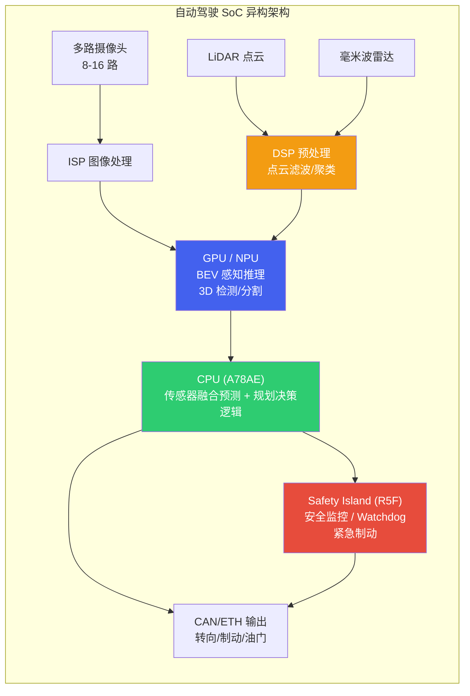

# 1. 自动驾驶算力平台

*自动驾驶 SoC 全景与异构计算架构 | 算力 · 功能安全 · 能效 · 开发生态*

> [!TIP]
> **本篇讲什么**
>
> 自动驾驶域控制器的算力底座，两部分：
>
> - **SoC 全景**：四大主流自动驾驶 SoC 阵营（Qualcomm / NVIDIA / TI / Mobileye）的能力对比与选型逻辑
> - **异构计算架构**：CPU+GPU+DSP+NPU 的任务分工、算力预算分配与功能安全分区
>
> 读完能回答：给定一个自动驾驶场景（L2 ADAS 还是 L4 Robotaxi），如何选择合适的 SoC，以及算力如何在各计算单元之间分配、安全如何分区兜底。

## 1. 自动驾驶 SoC 全景

### 1.1 主流 SoC 概览

自动驾驶对计算芯片的要求远超智能座舱：需要更高的算力 (TOPS)、更严格的功能安全认证 (ASIL)、更低的推理延迟以及更稳健的热设计。目前主流 SoC 形成了四大阵营，各有侧重。

**Qualcomm SA8650P (Ride Flex)**：Qualcomm 面向 L2+/L3 自动驾驶推出的高性能 SoC。综合算力约 **100 TOPS**，采用 CPU+GPU+NSP (Neural Signal Processor) 异构架构，支持多路摄像头输入和传感器融合。其优势在于同时覆盖座舱和驾驶域 (Ride Flex)，可实现座舱驾驶一芯方案，降低 BOM 成本。支持 QNN SDK 开发，生态与座舱 Snapdragon 系列高度统一。

**NVIDIA Orin (AGX Orin)**：目前高阶自动驾驶领域最广泛使用的 SoC，提供 **254 TOPS** (INT8) 算力，基于 Ampere GPU 架构和 12 核 ARM Cortex-A78AE CPU。CUDA/TensorRT 生态极其成熟，开发效率最高。适合 L3/L4 级别的高算力需求场景，但功耗较高 (典型 45-60W)，功能安全上通过 lockstep CPU 与安全岛支持 ASIL-D。

**TI TDA4VM**：德州仪器面向 L2/L2+ 前视 ADAS 的高能效 SoC，内置专用深度学习加速器 C7x-MMA，提供约 **8 TOPS** 算力。功耗极低 (典型 5-15W)。片上集成 R5F lockstep 安全岛，TI 提供较完整的功能安全文档包，是前装量产 ADAS 中安全认证成熟度较高的主流 AD SoC 之一。非常适合前装量产 ADAS 方案，但算力有限，无法支撑大规模 BEV 模型。

**Mobileye EyeQ6**：Mobileye 采用固定管线 (Fixed Pipeline) + 可编程加速器的混合架构，面向大规模前装量产。其封闭生态限制了灵活性，但成熟的感知算法栈和极高的量产可靠性使其在传统 OEM 中广受欢迎。EyeQ6H 提供约 **34 TOPS**，EyeQ6L 为低成本 L2 方案。

### 1.2 SoC 能力雷达图

**自动驾驶 SoC 能力雷达图**（1-10 为相对评分，非实测）

| 指标 | SA8650P | Orin | TDA4VM | EyeQ6H |
| :--- | :--- | :--- | :--- | :--- |
| AI 算力 (TOPS) | 7 | 10 | 2 | 4 |
| 能效比 | 7 | 5 | 10 | 7 |
| 开发生态 | 7 | 10 | 5 | 3 |
| 安全认证 | 5 | 6 | 10 | 8 |
| BOM 成本 | 8 | 4 | 9 | 7 |
| 灵活性 | 8 | 9 | 4 | 2 |

### 1.3 详细规格对比

| 指标 | Qualcomm SA8650P | NVIDIA Orin | TI TDA4VM | Mobileye EyeQ6H |
| :--- | :--- | :--- | :--- | :--- |
| **AI 算力** | ~100 TOPS (INT8) | 254 TOPS (INT8) | 8 TOPS (INT8) | ~34 TOPS |
| **CPU** | Kryo 车规 CPU (8 核) | 12x Cortex-A78AE | 2x Cortex-A72 + 6x Cortex-R5F | 多核 (封闭) |
| **GPU** | Adreno 车规 GPU | 2048-core Ampere | 无独立 GPU | 无 (固定管线) |
| **AI 加速器** | Hexagon NSP | 2x NVDLA + GPU | C7x-MMA DSP | XNN / CVP |
| **功耗** | 25-35W | 45-60W | 5-15W | 12-18W |
| **安全认证** | ASIL-B (向 D 推进) | ASIL-D (lockstep CPU) | ASIL-D (含安全岛) | ASIL-B/D (量产验证) |
| **摄像头支持** | 最多 18 路 | 最多 16 路 | 最多 8 路 | 最多 12 路 |
| **开发生态** | QNN / SNPE | CUDA / TensorRT | TI TIDL / Edge AI | 封闭 SDK |
| **典型应用** | L2+/L3，座舱驾驶一芯 | L3/L4 高阶智驾 | L2 前视 ADAS | L2/L2+ 前装量产 |

> [!NOTE]
> **车规 SoC 的具体 IP 配置以厂商规格为准**
>
> 上表中 CPU/GPU 的具体微架构型号，厂商在车规产品上往往不对外详细披露（或随版本演进），直接套用同代手机芯片的型号容易张冠李戴。这里只给出架构族（Kryo / Adreno / Cortex / Ampere）层面的口径，选型时以厂商正式规格书为准。

> [!NOTE]
> **没有"最佳" SoC — 选型取决于场景**
>
> 自动驾驶 SoC 的选择必须综合考虑多个维度：
>
> * **L2 vs L4**：L2 ADAS 优先考虑 TDA4VM (低成本、功能安全成熟)；L4 Robotaxi 需要 Orin 的高算力
> * **成本 vs 性能**：SA8650P 的座舱驾驶一芯方案可大幅降低 BOM；Orin 性能最强但 BOM 成本最高
> * **开发速度 vs 认证**：Orin 的 CUDA 生态开发最快；TDA4VM 的功能安全文档最完整
> * **开放 vs 封闭**：Mobileye 交钥匙方案省心但灵活性差；Orin/SA8650P 开放生态适合自研

## 2. 异构计算架构

### 2.1 CPU+GPU+DSP+NPU 协同

自动驾驶域控制器中的异构 SoC 将不同类型的计算任务分配给最适合的计算单元。感知类任务 (卷积、Transformer) 交给 **GPU/NPU**，规划与决策逻辑运行在 **CPU** 上，信号处理和传感器预处理交给 **DSP**，而安全监控则在独立的 **Safety Island (安全岛)** 上运行，确保即使主系统崩溃也能触发安全停车。

### 2.2 算力预算分配

在一个典型的 L3/L4 自动驾驶系统中，算力预算分配大致如下（典型口径，随方案而异）：

| 模块 | 占比 | 运行单元 | 典型任务 |
| :--- | :--- | :--- | :--- |
| **感知** | 60% | GPU / NPU | BEV 特征提取、3D 目标检测、语义分割、车道线识别、交通标志检测 |
| **预测** | 15% | GPU / CPU | 轨迹预测 (其他交通参与者未来运动)、意图识别、交互建模 |
| **规划** | 15% | CPU | 路径规划、行为决策、运动规划、轨迹优化 |
| **系统开销** | 10% | CPU / Safety Island | 传感器同步、数据传输、安全监控、日志记录、OTA 通信 |

### 2.3 功能安全分区

异构 SoC 的功能安全设计核心是**分区隔离**：高性能但不保证安全的应用分区 (QM) 和保证安全的安全分区 (ASIL-D) 独立运行，通过硬件隔离保证一方故障不会影响另一方。

| 分区 | 安全等级 | 运行内容 | 故障后果 |
| :--- | :--- | :--- | :--- |
| **应用分区 (QM)** | QM (无安全要求) | GPU 上的 DNN 推理、高精地图渲染、座舱 HMI | 感知性能降级，触发 fallback |
| **安全分区 (ASIL-D)** | ASIL-D | Safety Island 上的安全监控、Watchdog、紧急制动逻辑 | 危险故障率须 <10 FIT (PMHF 10⁻⁸/h)；此分区失效即丧失最后安全屏障 |
| **安全相关分区 (ASIL-B)** | ASIL-B | CPU lockstep 上的规划验证、碰撞检测 | 触发降级到更低自动化等级 |

> [!WARNING]
> **GPU/NPU 推理通常为 QM 等级**
>
> 当前主流的 DNN 推理引擎 (TensorRT、QNN) 本身**不具备功能安全认证**。因此，感知模块的输出必须由独立的安全监控模块 (运行在 ASIL-D Safety Island 上) 进行合理性检查 (plausibility check)。例如：目标突然消失、检测框面积异常变化等情况需要触发告警。这是当前自动驾驶安全架构的核心设计原则之一。
