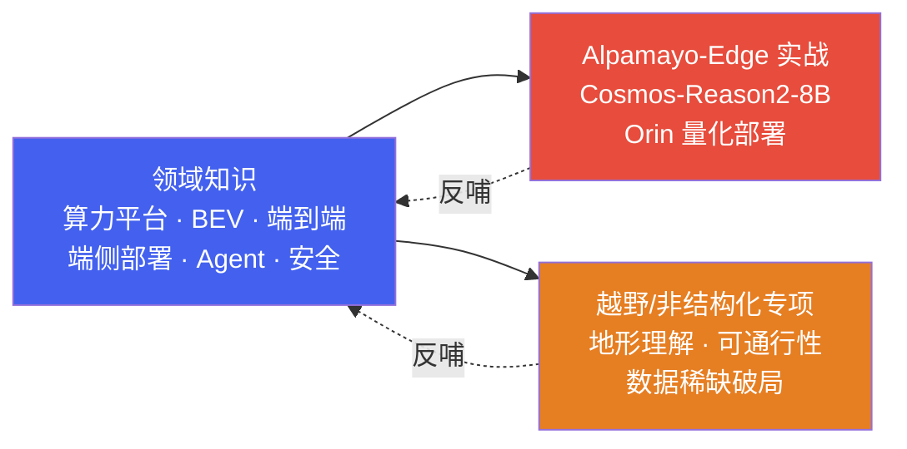

# 自动驾驶端侧 AI：从领域知识到边缘实战

*一条「领域知识 → 边缘实战」的完整主线*

> [!TIP]
> **本篇讲什么**
>
> 这是自动驾驶板块的**总导读**，把两层内容串成一个完整故事：先打**领域知识**地基（算力平台 / BEV 感知 / 端到端 / 端侧部署 / 驾驶 Agent / 功能安全），再在**项目/专项层**落地——**Alpamayo-Edge** 把一个 8B 驾驶 VLM（Cosmos-Reason2-8B）真正量化部署到 Jetson Orin 边缘端，**越野/非结构化场景专项**深潜结构化道路之外的地形理解与可通行性分析。
>
> 建议按「通识 → 实战/专项」的顺序阅读；读完能完整理解「端侧大模型如何在自动驾驶里从知识走到边缘落地、从结构化道路拓展到越野非结构化场景」。

## 1. 故事主线

- **第一层 · 领域知识**：理解自动驾驶端侧的完整技术栈——算力平台（Orin/SA8650P/TDA4）、BEV 感知与端到端模型、端侧部署（量化/多传感器融合/规划控制）、驾驶 Agent 与功能安全。
- **第二层 · 边缘实战与专项场景**：把领域知识落到具体项目/专项上——**Alpamayo-Edge** 将 Cosmos-Reason2-8B 驾驶 VLM 做 INT4/INT8 量化，跑通 Jetson Orin 端到端推理，完成延迟/吞吐/显存/功耗/能效的完整权衡；**越野/非结构化场景专项**深潜结构化道路之外的地形理解、可通行性分析与数据稀缺破局。

## 2. 两层结构与阅读路径

### 2.1 第一层 · 领域知识（通用部分）

| 文档 | 讲什么 |
| :--- | :--- |
| [自动驾驶算力平台](general/soc-platform.html) | SoC 全景（Orin/SA8650P/TDA4/EyeQ6）、异构计算架构、算力预算、功能安全分区 |
| [BEV 感知与端到端](general/perception.html) | BEV 感知、3D 检测分割、Occupancy、4D 成像雷达、端到端、轨迹预测、世界模型、数据飞轮、Mapless |
| [端侧部署](general/deployment.html) | BEV 端侧部署、量化挑战、时序缓存、多传感器融合、规划与控制部署 |
| [驾驶 Agent 与安全](general/agent-safety.html) | VLM 驾驶 Agent、端侧推理、V2X 云端协同、功能安全（ISO 26262/ASIL/SOTIF）、仿真验证 |
| [自动驾驶面试指南](general/interview.html) | 34 道精选题，覆盖 BEV 感知、端到端、数据训练、部署优化、驾驶 Agent 与系统设计 |

### 2.2 第二层 · 边缘实战与专项场景

| 文档 | 讲什么 |
| :--- | :--- |
| [Cosmos-Reason2-8B · Orin 量化部署实战](https://ranpin.github.io/qwen-trajectory-prediction/) | INT4/INT8 量化 → Jetson Orin 端到端跑通推理 → 延迟/吞吐/显存/功耗/能效完整权衡；定位并修复 sm_87 FMHA 崩溃（独立站点，点击直达） |
| [越野与非结构化场景](projects/offroad/offroad-scenarios.html) | 越野地形理解与可通行性分析：地形分类、几何+语义双通道、结构化 vs 越野核心差异、数据稀缺破局、端侧落地考量（专项场景深潜） |

## 3. 一条完整的落地链路

把两层串起来，一个驾驶大模型上边缘端的完整链路是：

1. **懂底座**（领域知识）：理解 Orin/SA8650P 等 SoC 的算力、内存带宽与功耗约束，知道端侧推理的瓶颈在哪。
2. **懂算法**（领域知识）：理解 BEV 感知、端到端模型与驾驶 VLM 的原理，以及量化、多传感器融合等端侧部署手段。
3. **做量化**（Alpamayo-Edge）：把 Cosmos-Reason2-8B 做 INT4/INT8 量化，控制精度损失。
4. **跑通推理**（Alpamayo-Edge）：在 Jetson Orin 上端到端跑通推理，定位并修复 sm_87 FMHA 崩溃。
5. **验权衡**（Alpamayo-Edge）：系统测延迟/吞吐/显存/功耗/能效，给出量化方案与部署配置的取舍结论。

另一条**专项深潜**路径：越野/非结构化场景不走「大模型量化上边缘」的链路，而是把领域知识向**结构化道路之外**拓展——理解地形物理属性、做几何+语义双通道可通行性分析、在数据极度稀缺下用合成数据/域适应/自监督破局（见 [越野与非结构化场景](projects/offroad/offroad-scenarios.html)）。

> [!NOTE]
> **为什么这样分层**
>
> 领域知识是可迁移的地基，项目/专项层把它落到具体场景：Alpamayo-Edge 是「大模型量化上边缘」的实战，越野/非结构化场景是「感知范式向非结构化拓展」的专项深潜。与座舱板块不同，自动驾驶这里没有自研的 Agent 框架层——驾驶侧的工作直接落在「领域知识 + 具体部署项目/专项」两层上：先建立对算力平台与算法的完整认知，再在可复现的实战与专项里把知识用出来。
