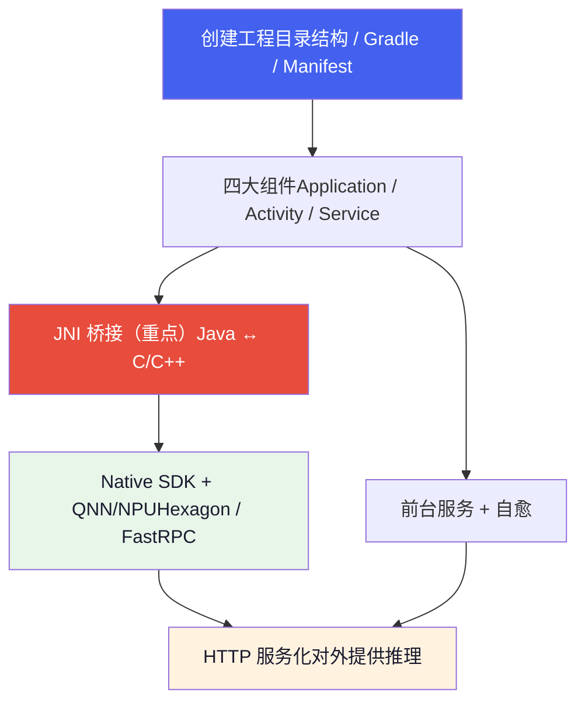
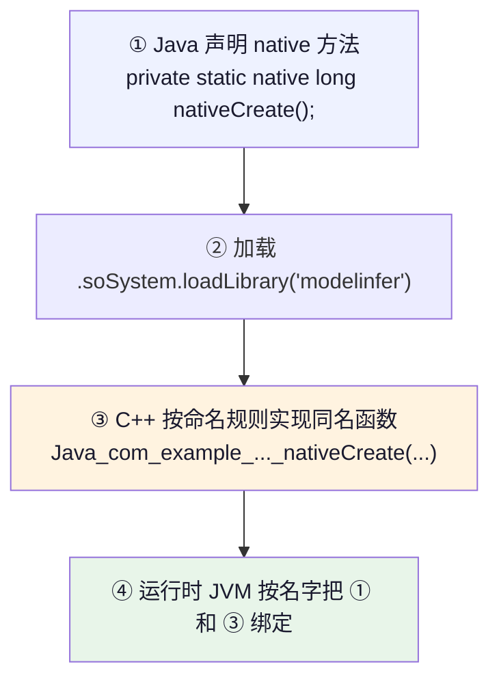
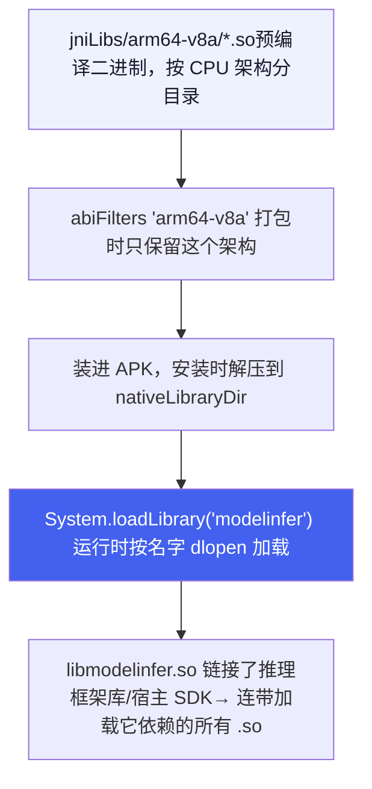
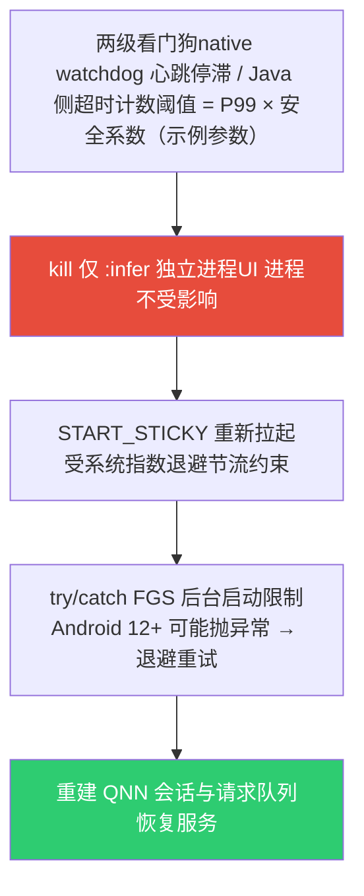

# Android 开发 & JNI 基础

*从创建工程到 JNI 桥接的完整学习路径  |  以座舱端侧大模型示例工程 `CockpitInferDemo` 为教材*

> [!TIP]
> **本篇定位**
>
> 这是一篇**从零开始的教程**，讲 Android 工程结构与 JNI 的基础知识。贯穿全篇的示例工程 `CockpitInferDemo` 是一个「在高通 SA8397P 座舱上跑端侧大模型的宿主 APK」的**中性教学示例**——从典型端侧推理 APK 中提炼泛化而来，**不绑定任何具体量产项目**。本篇属通识层，只讲通用方法与范式；具体项目的宿主 APK 实战，应由项目层文档反向链接本篇。想懂底层芯片/DSP/FastRPC，请读 [硬件与系统底层](hardware.html)。
>
> 数字口径：文中个别性能/超时数值一律为**示例参数**，仅用于演示方法；平台与锚点模型的统一口径见硬件篇开头的「全站数据基准」NOTE。

## 1. 学习路线总览

`CockpitInferDemo` 几乎覆盖了「Android + JNI + 端侧 NPU」的完整知识栈，所以它是极好的教材。整条链路如下，本篇按此顺序展开：



## 2. Android 工程结构

### 2.1 目录结构

一个标准 Android 工程：

```
CockpitInferDemo/
├── settings.gradle          # ① 工程「目录」：有哪些模块、去哪下依赖
├── build.gradle             # ② 根构建脚本（工程级公共配置）
├── gradle.properties        # ③ Gradle 运行参数
├── gradlew / gradlew.bat    # ④ Gradle Wrapper：锁定 Gradle 版本，免装
├── local.properties         # ⑤ 本机 SDK 路径（不提交 git）
└── app/                     # ⑥ 唯一的业务模块（Android Application）
    ├── build.gradle         # ⑦ 模块构建脚本（最常改的文件）
    └── src/main/
        ├── AndroidManifest.xml   # ⑧ 组件清单 + 权限
        ├── java/...              # ⑨ Java 源码
        ├── cpp/                  # ⑩ C++ 源码 + CMakeLists.txt
        ├── jniLibs/arm64-v8a/    # ⑪ 预编译 .so（按 CPU 架构分目录）
        └── res/                  # ⑫ 资源（布局/图标/字符串）
```

Android 工程是「多模块」结构，`settings.gradle` 用 `include ':app'` 声明模块；本示例只有一个 `app` 模块。

### 2.2 Gradle 构建系统

Gradle 是 Android 的构建工具（类比前端的 npm/webpack，或 C++ 的 CMake），用 DSL 描述「怎么把源码 + 资源 + 依赖打成 APK」。

**`settings.gradle`** —— 工程入口，两件事：声明依赖仓库 + 声明模块。

```
dependencyResolutionManagement {
    repositories {
        maven { url 'https://maven.aliyun.com/repository/google' }  // 阿里云镜像，国内快
        google()        // 官方 Google 仓库（androidx 等）
        mavenCentral()  // 中央仓库
        flatDir { dirs "app/libs" }   // 本地 .aar/.jar 目录
    }
}
rootProject.name = "CockpitInferDemo"
include ':app'        // 👈 声明 app 模块
```

**`app/build.gradle`** —— 最核心，逐段讲。以下片段均为 **Groovy DSL**（`build.gradle`）写法；若你的工程用 **Kotlin DSL**（`build.gradle.kts`），语法略有差异（赋值用 `=`/`+=`、字符串统一双引号、方法调用带括号），复制时按工程实际 DSL 换算：

```
android {
    namespace 'com.example.cockpitinfer'   // R 类与包命名空间
    compileSdk 35                          // 用 API 35（Android 15）编译；本篇用到的前台服务新 API 要求 ≥ 34

    defaultConfig {
        applicationId "com.example.cockpitinfer"  // 安装包唯一 ID
        minSdk 33        // 最低支持 Android 13（跟随座舱车机系统版本）
        targetSdk 35     // 目标行为版本
        ndk {
            abiFilters "arm64-v8a"   // 👈 只打包 64 位 ARM 的 .so
        }
    }

    sourceSets.getByName("main") { jniLibs.srcDirs("src/main/jniLibs") }

    // 👈 接入 CMake：把 cpp/ 下的 C++ 编成 libmodelinfer.so
    externalNativeBuild {
        cmake { version="3.22.1"; path = file("src/main/cpp/CMakeLists.txt") }
    }

    packaging {
        jniLibs {
            useLegacyPackaging true                        // .so 压缩打包、安装时解压（取舍见下）
            keepDebugSymbols += "**/libQnnHtpV*Skel.so"    // 👈 关键：DSP 侧 Skel 库不能被裁剪符号
        }
    }
}
```

> [!NOTE]
> **三个 SDK 版本的区别（高频面试题）**
>
> **compileSdk**：编译时「看得见」的最高 API，纯编译期概念。
> **minSdk**：能安装的最低系统版本。
> **targetSdk**：你「声称适配到」的版本，系统据此决定是否启用新的兼容性限制。
>
> 三者通常**不相等**：minSdk 跟随你要支持的最老系统（车机量产平台多冻结在某个 Android 版本，如 13）；compileSdk / targetSdk 则应尽量新——否则新 API 根本编不过。一个典型反例：`FOREGROUND_SERVICE_SPECIAL_USE` 权限是 **API 34** 才引入的，若 compileSdk 停在 33，§2.3 的清单就写不出来。

> [!WARNING]
> **keepDebugSymbols（旧写法 doNotStrip）：Skel 库不能被 strip**
>
> 打包时 Android 默认会 `strip` 掉 .so 里「没被引用」的符号以减小体积。但 `libQnnHtpV*Skel.so`（V68/V73/V75/V79 等，后缀随 HTP 架构版本变化）跑在 **DSP 侧**，它的符号在 APK（CPU 侧）看来「没人用」，一旦被 strip，DSP 加载时就找不到符号直接崩。所以必须显式排除。这是 APK 集成 QNN 最典型的坑。
>
> **DSL 有版本差异，按 AGP 版本核实**：`doNotStrip` 是旧版 `PackagingOptions` 的方法；AGP 8+ 的 `packaging { jniLibs { ... } }` 块（`JniLibsPackaging`）对应的属性是 **`keepDebugSymbols`**。把旧方法写进新块里大概率编译失败——原理不变，写法要跟工具链走。
>
> 顺带说 `useLegacyPackaging` 的取舍：`true` = .so 压缩进 APK、安装时解压落盘（下载小、安装占用大且首装慢）；`false` = .so 不压缩存放、运行时直接从 APK 内加载。对几十上百 MB 的 QNN 库集合，这个选择对安装时间与磁盘占用的影响是可感知的。AGP 会根据这个标志**自动在清单里写 `android:extractNativeLibs`**，不需要手动改清单。另注意：`false` 还附带一个新的对齐要求（16KB page size，见 §5.4 的 WARNING）。

### 2.3 AndroidManifest.xml

每个 APK 必须有清单文件，声明「我是谁、要什么权限、有哪些组件」：

```
<manifest>
    <uses-permission android:name="android.permission.FOREGROUND_SERVICE" />
    <uses-permission android:name="android.permission.INTERNET"/>
    <!-- API 34+：前台服务必须再声明与 foregroundServiceType 匹配的子权限 -->
    <uses-permission android:name="android.permission.FOREGROUND_SERVICE_SPECIAL_USE" />
    <!-- API 33+：通知是运行时权限。未授予时前台服务的通知不显示，但服务本身仍会运行
         （本示例 minSdk 33，直接相关） -->
    <uses-permission android:name="android.permission.POST_NOTIFICATIONS" />

    <application android:name=".MyApplication" ...>   <!-- 指定自定义 Application 类 -->

        <activity android:name=".MainActivity" android:exported="true">
            <intent-filter>                <!-- 这两行让它成为「桌面图标入口」 -->
                <action android:name="android.intent.action.MAIN" />
                <category android:name="android.intent.category.LAUNCHER" />
            </intent-filter>
        </activity>

        <!-- 推理服务：exported=false（仅本应用可拉起，安全论证见 §6.5）
             process=":infer"（独立进程，自愈设计见 §6.3） -->
        <service android:name=".InferService"
                 android:exported="false"
                 android:process=":infer"
                 android:foregroundServiceType="specialUse">
            <property android:name="android.app.PROPERTY_SPECIAL_USE_FGS_SUBTYPE"
                      android:value="on-device AI inference" />
        </service>

        <uses-native-library android:name="libcdsprpc.so"
                             android:required="false" />
    </application>
</manifest>
```

**要点**：所有四大组件都必须在这里注册，否则运行时找不到。`android:name=".MyApplication"` 里的 `.` 是 `namespace` 的简写。

> [!WARNING]
> **前台服务类型：常驻推理服务用 `specialUse`，不要用 `dataSync`**
>
> 很多教程顺手写 `foregroundServiceType="dataSync"`——对一个**常驻推理守护服务**来说这已经行不通了：**Android 15 对 `dataSync` 类型的前台服务施加了运行时限（每 24 小时累计约 6 小时）**，超时会被系统直接停掉。座舱语音助手不能因为「额度用完」而罢工。
>
> 正确做法是 **`specialUse`**，并在 `<service>` 内用 `PROPERTY_SPECIAL_USE_FGS_SUBTYPE` 属性声明具体用途（如 `on-device AI inference`）。若走 Google Play 分发，`specialUse` 需要在商店审核中说明用途（车机预装应用通常不涉及）。
>
> 注意版本前提：`specialUse` 类型与 `FOREGROUND_SERVICE_SPECIAL_USE` 子权限都是 **API 34（Android 14）引入**的——这正是 compileSdk 必须 ≥ 34 的原因；「compileSdk 33 + 声明 API 34 权限」是自相矛盾的组合。在 API 34 以下的系统上，这些声明会被无害忽略（`dataSync` 时限本身也是 Android 15 才有的行为），不影响安装运行。

> [!NOTE]
> **`<uses-native-library>` 的生效前提：库必须在系统「白名单」里**
>
> app 的 linker namespace 隔离（禁止应用随意 `dlopen` NDK 之外的 vendor 库，如 FastRPC 的 `libcdsprpc.so`）**自 Android 7/8 就有**；**Android 12（API 31）**新增的是**声明要求**——要使用这类库，必须在清单里声明 `<uses-native-library>`。**但声明只是必要条件**：目标库还必须被整机厂列进 **`/vendor/etc/public.libraries.txt`**（或 `public.libraries-<company>.txt`）对外导出，否则依然 `dlopen failed: library "libcdsprpc.so" is not accessible for the namespace ...`。
>
> 排查命令：
>
> ```
> adb shell cat /vendor/etc/public.libraries.txt | grep cdsprpc
> adb shell ls /vendor/etc/public.libraries*
> adb logcat | grep -iE "linker|dlopen"    # 看 namespace 拒绝的具体日志
> ```
>
> `android:required="false"` 表示系统上没有该库时应用仍可安装运行（降级到非 NPU 路径）；写 `true` 则缺库直接装不上。

## 3. 四大组件

Android 应用由「组件」构成，系统按生命周期管理它们。本示例用到三类。四大组件本身是通用 Android 知识，本节只展开**与端侧推理直接相关**的部分。

### 3.1 Application —— 进程级入口（MyApplication）

`Application` 是整个进程**最先**创建的对象，早于任何 Activity/Service，其 `onCreate()` 是「进程只执行一次」的初始化点。

```
public class MyApplication extends Application {
    /** native 栈是否就绪。false 时走降级路径——这是让 §2.3 required="false" 的承诺真正成立的地方 */
    public static volatile boolean nativeReady = false;

    @Override
    public void onCreate() {
        super.onCreate();

        // 0. 按进程 gating：onCreate() 在每个进程里都会跑一遍。
        //    native 栈只有跑推理的 :infer 进程（§6.3）需要；
        //    不做裁剪的话，UI 进程也会 dlopen 几十 MB 的 native 库，纯浪费内存与启动时间
        String process = Application.getProcessName();   // API 28+；更低版本可读 /proc/self/cmdline
        if (!(getPackageName() + ":infer").equals(process)) return;
        // 若不拆进程（全部逻辑跑在主进程），把条件改为 getPackageName().equals(process)；
        // 若 UI 进程也要直接调 JNI（如 §3.2 的简化示例），把主进程名一并放进放行条件

        try {
            System.loadLibrary("cdsprpc");     // 1. 先底层 FastRPC
            System.loadLibrary("modelinfer");  // 2. 再 JNI 桥接库
            nativeReady = true;
        } catch (UnsatisfiedLinkError e) {
            // 库没打包 / ABI 不匹配 / linker namespace 拒绝（§2.3）都会抛这个错。
            // 接住它、nativeReady 保持 false，走非 NPU 降级路径——而不是让进程崩在这里
            Log.e("MyApplication", "native load failed, degraded", e);
            return;
        }

        // 3. ADSP_LIBRARY_PATH：告诉 FastRPC 去哪些目录找 DSP 侧 Skel 库
        //    注意分隔符是分号 ";"，不是冒号
        String adspPath = getApplicationInfo().nativeLibraryDir
                + ";/vendor/lib/rfsa/adsp"
                + ";/vendor/dsp/cdsp"
                + ";/dsp";
        Os.setenv("ADSP_LIBRARY_PATH", adspPath, true);   // true = 覆盖已有值
    }
}
```

> [!NOTE]
> **为什么把 native 库加载放这里？——但结论是「放这里 + 按进程裁剪 + 可失败降级」**
>
> 进程有两种拉起方式：用户点图标（走 `MainActivity`），或系统因 `START_STICKY` 单独重启服务（走 `InferService`，不经过 Activity）。放在 `Application.onCreate()` 能保证**无论哪种路径，底层环境都已就绪**。这是重要的工程思维：把「进程级依赖」放到「进程级入口」。独立进程（`:infer`，§6.3）启动时也会重新执行一遍 `Application.onCreate()`，库加载与环境变量在新进程里天然就绪。
>
> 但要注意另一面：**`onCreate()` 是每个进程都跑的**。无条件 `loadLibrary` 意味着 UI 进程也会把只有 `:infer` 用得上的几十 MB native 库 dlopen 进来——内存和启动时间白白浪费。所以完整结论是三件套：**放这里**（进程级入口）+ **按进程名裁剪**（只在需要的进程加载）+ **可失败降级**（`try/catch(UnsatisfiedLinkError)` + `nativeReady` 标志）。第三件尤其重要：§2.3 的 `required="false"` 只保证「系统上没有该库时**能安装**」，若代码里不接住 `UnsatisfiedLinkError`，第一次 `loadLibrary` 就会让进程当场崩溃——「可降级」必须在代码里成立，不能只在清单里成立。

> [!WARNING]
> **`ADSP_LIBRARY_PATH` 的两个易错点**
>
> **① 取值**：至少要覆盖 app 自己的 `nativeLibraryDir`（APK 里的 Skel 库安装后解压到这里）+ 系统 DSP 库目录 `/vendor/lib/rfsa/adsp`、`/vendor/dsp/cdsp`、`/dsp`。哪些目录实际存在、是否可读随 BSP 与平台变化，全列上无害；分隔符用**分号**。
> **② 时机**：必须在**第一次 `remote_handle_open` 之前**设置——即任何会触达 DSP 的 QNN/SDK 初始化之前。FastRPC 在建立 DSP 会话时读取该变量，事后再设对已建立的会话无效。这就是它紧跟 `loadLibrary`、放在 `Application.onCreate()` 里的原因。
>
> 设错的典型现象：初始化报 Skel 库找不到（如 `libQnnHtpV79Skel.so not found` / `remote_handle_open failed`），但文件明明就在 `nativeLibraryDir` 里。

### 3.2 Activity —— 界面（MainActivity）

Activity 是「一屏界面」，生命周期为 `onCreate → onStart → onResume →（可见可交互）→ onPause → onStop → onDestroy`。本示例界面很简单，真正的活在 Service 里干：

```
public class MainActivity extends AppCompatActivity {
    @Override
    protected void onCreate(Bundle savedInstanceState) {
        super.onCreate(savedInstanceState);
        setContentView(R.layout.activity_main);       // 加载布局 XML
        infer = new ModelInference();                 // 创建 JNI 封装对象
        infer.init("/data/models", nativeLibraryDir); // 模型文件所在目录
        startInferService();                          // 拉起前台服务
    }
    @Override
    protected void onDestroy() {
        super.onDestroy();
        if (infer != null) { infer.close(); infer = null; }  // 释放 native 资源
    }
}
```

> [!CAUTION]
> **`/data/models` 不是拿来就能读的路径**
>
> 普通应用（SELinux `untrusted_app` 域）默认**无权读取**这类非标准根目录，`open()` 会直接 EACCES——这是端侧模型 APK 上机的头号坑，详见 §6.2。

### 3.3 Service —— 后台常驻（InferService，本示例主体）

Service 没有界面、长期后台运行。大模型推理要「常驻 + 被杀后自动恢复」，所以放 Service。

**① 前台服务**：Android 8.0 后后台 Service 会被快速杀死，要常驻必须升级为「前台服务」——显示常驻通知：

```
private void startForegroundService() {
    createNotificationChannel();                    // Android 8+ 通知必须走渠道
    // API 34+ 用三参重载显式传类型，与清单的 foregroundServiceType 保持一致
    startForeground(NOTIFICATION_ID, createNotification(),
            ServiceInfo.FOREGROUND_SERVICE_TYPE_SPECIAL_USE);
}
```

前台服务**类型**的选择（为什么是 `specialUse` 而不是 `dataSync`）见 §2.3 的 WARNING——这是 2026 年做常驻服务最实用的一条 Android 知识。此外还有两条硬性要求：

- **5 秒时限**：调用 `startForegroundService()` 之后，服务必须**尽快**（约 5 秒内）调用 `startForeground()`，否则系统按无响应处理、直接打死服务（`ForegroundServiceDidNotStartInTimeException`）。所以「加载模型」这类重活不要排在 `startForeground()` 之前——先升级前台，再慢慢初始化。
- **API 34+ 显式传类型**：两参 `startForeground(id, notification)` 依赖清单声明隐式匹配类型；更稳的写法是如上代码用三参重载显式传 `FOREGROUND_SERVICE_TYPE_SPECIAL_USE`，两处保持一致，避免系统校验时类型对不上。

**② START\_STICKY 自愈**：

```
@Override
public int onStartCommand(Intent intent, int flags, int startId) {
    return START_STICKY;   // 👈 被系统杀死后，系统会重新创建这个服务
}
```

`START_STICKY` 是「粘性」标志：服务被杀后系统会重新 `onStartCommand()` 它。这是后面「native 卡死 → 杀进程重启」自愈机制能成立的**系统级前提**——但它**不是无条件可靠**的：系统对频繁重启有指数退避节流，Android 12+ 还限制后台启动前台服务。完整讨论见 §6.3。

> [!WARNING]
> **`START_STICKY` 的 null-intent 陷阱**
>
> 系统重启 `START_STICKY` 服务时，`onStartCommand` 收到的 `intent` 参数是 **null**——不是当初的启动 Intent。若启动 Intent 携带了配置（模型路径、运行开关等），重启后这些配置**全部丢失**，服务会带着默认值「看似正常」地跑起来。两种写法：改用 **`START_REDELIVER_INTENT`**（系统重投递最后一次的 Intent），或把配置持久化、并在代码里显式处理 `intent == null` 分支。对「启动时带参数」的推理服务，这个陷阱比节流问题更隐蔽。

**组件如何启动**：通过 `Intent`（意图）：

```
Intent intent = new Intent(this, InferService.class);
startForegroundService(intent);   // Android 8+ 必须用这个启动前台服务
```

## 4. JNI 基础

### 4.1 为什么需要 JNI

JNI（Java Native Interface）是 Java 调用 C/C++ 代码的桥梁。本示例必须用它：

- **性能**：大模型推理是重计算，必须 C++。
- **复用**：QNN/推理引擎（`libQnnHtp.so`、厂商 runtime 等）都是 C++ 库。
- **硬件**：访问 Hexagon NPU 只能走 C/C++（FastRPC）。

Java 负责「服务化、协议、生命周期」，C++ 负责「推理」，JNI 是中间的翻译官。

### 4.2 完整链路与命名规则

用 `nativeCreate` 串一遍，这是理解 JNI 的主线：



C++ 函数名 = `Java_` + 包名（`.`→`_`）+ `_类名_` + `方法名`：

```
Java_com_example_cockpitinfer_ModelInference_nativeCreate
     └────────── 包名 ──────────┘ └──── 类名 ────┘ └─方法名─┘
```

这就是为什么 Java 侧包名一改，C++ 函数名就得跟着改——而这个痛点正是下一节 `RegisterNatives` 要解决的。

### 4.3 RegisterNatives：运行时注册（生产级标配）

名字拼接（静态注册）适合入门理解绑定原理，但**生产级 JNI 几乎都用 `RegisterNatives` 运行时注册**：`System.loadLibrary` 时 JVM 会回调 `JNI_OnLoad`，你在那里用一张表把「Java native 方法 ↔ C++ 函数指针」显式绑定：

```
// C++ 函数名从此可以随便起，不再需要 Java_com_example_... 前缀
static jlong createInfer(JNIEnv* env, jclass) { /* ... */ return 0; }
static jboolean initInfer(JNIEnv* env, jclass, jlong handle, jstring path, jstring libDir) { /* ... */ return JNI_TRUE; }
static void destroyInfer(JNIEnv* env, jclass, jlong handle) { /* ... */ }

static const JNINativeMethod gMethods[] = {
    // { Java 方法名, 方法签名, C++ 函数指针 }
    {"nativeCreate",  "()J",                                      (void*)createInfer},
    {"nativeInit",    "(JLjava/lang/String;Ljava/lang/String;)Z", (void*)initInfer},
    {"nativeDestroy", "(J)V",                                     (void*)destroyInfer},
};

extern "C" JNIEXPORT jint JNI_OnLoad(JavaVM* vm, void*) {
    JNIEnv* env = nullptr;
    if (vm->GetEnv((void**)&env, JNI_VERSION_1_6) != JNI_OK) return JNI_ERR;

    // 此刻在调用 loadLibrary 的 Java 线程上，FindClass 能正常找到 app 类
    jclass cls = env->FindClass("com/example/cockpitinfer/ModelInference");
    if (!cls) return JNI_ERR;

    if (env->RegisterNatives(cls, gMethods,
                             sizeof(gMethods) / sizeof(gMethods[0])) < 0)
        return JNI_ERR;
    return JNI_VERSION_1_6;
}
```

三个好处：

| 好处 | 说明 |
| :--- | :--- |
| **解耦包名/类名** | Java 侧重构包名，C++ 不再需要跟着改一堆符号名，只改 `FindClass` 的一个路径字符串 |
| **符号可隐藏** | 配合 `-fvisibility=hidden` 编译，native 方法不再导出 `Java_...` 符号——挡的是 `nm`/`readelf` 的**静态符号枚举**与体积（反射不依赖导出符号，别把它当成防反射手段） |
| **失败前置** | 签名写错在 `loadLibrary` 当场报错，而不是等到第一次调用才抛 `UnsatisfiedLinkError` |

> [!TIP]
> `JNI_OnLoad` 还有一个重要用途：**趁在 Java 线程上，预先缓存回调要用的 `jclass` / `jmethodID`**——这正是 §5.3 native 线程 `FindClass` 陷阱的标准解法。

> [!NOTE]
> **为什么 §5.1–5.3 的示例仍用 `Java_...` 前缀？** 只为可读性——静态注册命名让「C++ 函数 ↔ Java 方法」的对应关系一目了然，便于教学。实际生产代码按本节用 `RegisterNatives` 注册，C++ 函数名任意。

### 4.4 JNIEnv 与类型映射

每个 JNI 函数前两个参数固定：

```
JNIEXPORT jlong JNICALL
Java_..._nativeCreate(JNIEnv* env, jclass clazz) { ... }
//                    └─环境指针─┘  └─调用者─┘
```

- **`JNIEnv* env`**：JNI 环境指针，所有 JNI 操作（转字符串、调方法、抛异常）都通过它。它是「线程局部」的——每个线程有自己的 `JNIEnv`（回调时至关重要，见 5.3）。
- **`jclass`**：native 方法是 `static` 时第二个参数是类（`jclass`）；非 static 时是实例（`jobject`）。本示例 native 方法全是 static。

| Java | JNI | C/C++ |
| :--- | :--- | :--- |
| `boolean` | `jboolean` | `unsigned char`（JNI\_TRUE/FALSE） |
| `byte` | `jbyte` | `int8_t`（**有符号**！图像/像素处理须 `& 0xFF`） |
| `int` | `jint` | `int32_t` |
| `long` | `jlong` | `int64_t` |
| `String` | `jstring` | 需转换 |
| `byte[]` | `jbyteArray` | 需 `GetByteArrayElements` |
| `Object` | `jobject` | 不透明句柄 |

三个补充：

- **`jbyte` 是有符号的**（-128~127）。处理图像/像素数据时要先 `& 0xFF` 转成无符号再用，否则所有 ≥128 的值都变负数。
- **指针 / `size_t` ↔ `jlong`**：arm64 上指针是 8 字节，装进 `jlong`（int64）不会溢出——这是 §5.1 句柄模式成立的基础。
- **JNI 签名字母表**（§4.3 的方法表、§5.3 的方法描述符都靠它）：`Z`=boolean、`B`=byte、`C`=char、`S`=short、`I`=int、`J`=long、`F`=float、`D`=double、`L<类名>;`=对象、`[`=数组、`V`=void（仅返回值）。例如 `(JLjava/lang/String;Z)V` 即 `void f(long, String, boolean)`。

## 5. JNI 进阶

### 5.1 句柄模式（本示例的核心设计）

C++ 对象活在堆上，Java 没法直接持有它。办法：把 C++ 指针转成 `long` 交给 Java 保管，每次调用再传回来。

```
// 统一错误传播：把 errno / 结构化错误码抛成 Java 异常，让 Java 侧看得到「为什么失败」
// （ThrowInferError 是个小工具：FindClass 自己的异常类 + ThrowNew，错误码拼进消息）
static void ThrowInferError(JNIEnv* env, int code, const char* msg) {
    jclass ex = env->FindClass("com/example/cockpitinfer/InferException");
    if (ex) env->ThrowNew(ex, (std::string(msg) + " (code=" + std::to_string(code) + ")").c_str());
}

// 创建：new 一个 C++ 对象，把指针当 long 返回
JNIEXPORT jlong JNICALL Java_..._nativeCreate(JNIEnv* env, jclass) {
    auto* p = new (std::nothrow) cockpit::ModelInference();
    // 分配失败时 p==0。返回 0 是「合法」的，但 Java 侧必须校验（见下）——不能装作没事
    return reinterpret_cast<jlong>(p);   // 指针 → long
}

// 使用：先校验句柄，再把 long 转回指针
JNIEXPORT jboolean JNICALL Java_..._nativeInit(JNIEnv* env, jclass, jlong handle, ...) {
    auto* p = reinterpret_cast<cockpit::ModelInference*>(handle);  // long → 指针
    if (!p) {   // handle==0 说明创建已失败；不校验直接解引用就是当场 SIGSEGV
        ThrowInferError(env, ERR_NULL_HANDLE, "init on null handle");
        return JNI_FALSE;
    }
    int rc = p->init(path);
    if (rc != 0) {
        ThrowInferError(env, rc, "init failed");   // 👈 带上错误码，别只返回 false（见下方 WARNING）
        return JNI_FALSE;
    }
    return JNI_TRUE;
}

// 销毁：delete nullptr 在 C++ 里是安全的无操作；风险在 Java 侧的并发 close（见下方 WARNING）
JNIEXPORT void JNICALL Java_..._nativeDestroy(JNIEnv* env, jclass, jlong handle) {
    delete reinterpret_cast<cockpit::ModelInference*>(handle);
}
```

Java 侧用 `nativeHandle` 字段保管这个 long，并实现 `AutoCloseable` 确保释放：

```
public class ModelInference implements AutoCloseable {
    private long nativeHandle = 0;

    public ModelInference() {
        nativeHandle = nativeCreate();
        if (nativeHandle == 0)   // new(nothrow) 失败返回 0：必须校验，否则后续调用全是空指针解引用
            throw new IllegalStateException("native create failed (OOM?)");
    }

    @Override public void close() {
        long h;
        synchronized (this) { h = nativeHandle; nativeHandle = 0; }  // 锁内「夺走」句柄
        if (h != 0) nativeDestroy(h);
        // 其余调 native 的方法同样要先在锁内取句柄并判 0，才能与 close 互斥（见下方 WARNING）
    }
}
```

> [!TIP]
> **务必掌握**
>
> 「Java 持 long 句柄 ↔ C++ 持对象」是 JNI 封装有状态对象的标准范式。

> [!WARNING]
> **句柄模式的四个坑与防御（上方代码已按此加固）**
>
> **① 创建失败返回 0，Java 侧不校验。** `new (std::nothrow)` 失败返回 `nullptr`，`reinterpret_cast<jlong>` 后恰好是 0——Java 构造函数若不查 `nativeHandle == 0`，后续每次调用都是空指针解引用。防御：构造函数当场抛异常（如上）。
>
> **② native 入口不校验句柄。** `nativeInit` 拿到句柄直接 `reinterpret_cast` 解引用，Java 侧传 0（或过期句柄）时就是当场 SIGSEGV。防御：每个 native 方法第一行 `if (!handle)`——抛异常或返回错误，绝不直接解引用。
>
> **③ `close()` 无同步 → use-after-free。** 一个线程正在推理、另一个线程调 `close()`：native 对象被 delete，推理线程手里就是悬垂指针。防御：在锁内把句柄置 0（或 `AtomicLong.getAndSet(0)`），与所有 native 调用路径互斥；再加一道 **`java.lang.ref.Cleaner`** 兜底——即使忘了 `close()`，对象被 GC 时最终也会释放 native 资源（注意清理 action 不得捕获 `this`，否则对象永远无法回收）。Cleaner 是「不及时但好过泄漏」，不能替代显式 `close()`。
>
> **④ `long` 句柄不是类型安全的。** 把 A 类的句柄传给 B 类的 native 方法，编译毫无报错，运行时才崩。严格场景用 **handle map + generation 号**：native 维护槽位表，Java 持有「槽位 + 代数」编码值；槽位被复用后旧句柄因代数不符被当场拒绝——把「随机崩溃」变成「确定性报错」。
>
> **还有一条：错误要传播。** `nativeInit` 只返回 `true/false` 的话，Java 侧只能看到「init failed」——§6.2 的 SELinux EACCES 就是这种信息丢失的经典受害者。正确做法是 `ThrowNew` 自己的异常类并**带上 errno 或结构化错误码**（上方 `ThrowInferError` 即为此），让 Java 侧能区分「模型文件读不到」和「NPU 会话建立失败」。

### 5.2 字符串与数组：转换、编码陷阱与零拷贝

**字符串转换**。Java `String`（UTF-16）和 C++ `std::string`（UTF-8）不能直接用，必须转换：

```
static std::string JStringToStdString(JNIEnv* env, jstring js) {
    if (!js) return {};
    const char* utf = env->GetStringUTFChars(js, nullptr);  // 取 UTF-8 指针
    std::string s = utf ? utf : "";
    env->ReleaseStringUTFChars(js, utf);                    // 👈 必须配对释放
    return s;
}
```

> [!CAUTION]
> **铁律**
>
> `GetXxxChars` 必须配对 `ReleaseXxxChars`。这是 JNI 内存泄漏的头号来源。

> [!WARNING]
> **Modified UTF-8 陷阱：`GetStringUTFChars` 返回的不是标准 UTF-8**
>
> JNI 的「UTF-8」实际是 **Modified UTF-8**——可以理解为 **CESU-8**（增补平面按 UTF-16 代理对编码）**再把 NUL 编成 `0xC0 0x80`**，与标准 UTF-8 有两处关键差异：
>
> - **NUL（U+0000）** 被编码成两字节 `0xC0 0x80`（标准 UTF-8 明确禁止这种 overlong 编码）；
> - **增补平面字符（emoji、部分生僻汉字，码点 > U+FFFF）** 按 UTF-16 代理对编码——每个代理项各 3 字节（共 6 字节），而不是标准的单个 4 字节序列。
>
> 后果：把结果直接塞进 `std::string` 交给按标准 UTF-8 处理的 **tokenizer / JSON 解析器 / 日志系统**，会解析失败或产出乱码；反方向更危险——把含 emoji 的**标准** UTF-8 字符串（模型生成结果、网络文本）传给 `NewStringUTF`，等于把非法 Modified UTF-8 喂给 ART：**开了 CheckJNI（§6.7）会当场 abort**（`input is not valid Modified UTF-8`）；**release 构建未开 CheckJNI 时，更常见的是静默产出错乱字符串**——不崩、但结果是错的，比崩更难查。对「端侧大模型对话」场景，聊天文本几乎必然含 emoji，这是绕不开的坑。
>
> **正确做法**：绕开 Modified UTF-8——用 `GetStringChars` 取 UTF-16，自己编码成标准 UTF-8：

```
// Java String → 标准 UTF-8：取 UTF-16 自行编码（正确处理代理对）
static std::string JStringToUtf8(JNIEnv* env, jstring js) {
    if (!js) return {};
    jsize len = env->GetStringLength(js);
    const jchar* chars = env->GetStringChars(js, nullptr);   // UTF-16，不是 UTF-8
    std::string out;
    out.reserve(len * 2);
    for (jsize i = 0; i < len; ) {
        uint32_t cp = chars[i];
        if (cp >= 0xD800 && cp <= 0xDBFF && i + 1 < len) {   // 高代理：与低代理合成码点
            cp = 0x10000 + ((cp - 0xD800) << 10) + (chars[i + 1] - 0xDC00);
            i += 2;
        } else {
            i += 1;
        }
        if (cp < 0x80)         { out.push_back((char)cp); }
        else if (cp < 0x800)   { out.push_back((char)(0xC0 | (cp >> 6)));
                                 out.push_back((char)(0x80 | (cp & 0x3F))); }
        else if (cp < 0x10000) { out.push_back((char)(0xE0 | (cp >> 12)));
                                 out.push_back((char)(0x80 | ((cp >> 6) & 0x3F)));
                                 out.push_back((char)(0x80 | (cp & 0x3F))); }
        else                   { out.push_back((char)(0xF0 | (cp >> 18)));   // emoji 走这支：4 字节
                                 out.push_back((char)(0x80 | ((cp >> 12) & 0x3F)));
                                 out.push_back((char)(0x80 | ((cp >> 6) & 0x3F)));
                                 out.push_back((char)(0x80 | (cp & 0x3F))); }
    }
    env->ReleaseStringChars(js, chars);                      // 👈 同样配对释放
    return out;
}
```

反方向（C++ → Java）对称处理：把标准 UTF-8 解码回 UTF-16（增补平面码点拆成代理对），再用 `env->NewString(reinterpret_cast<const jchar*>(u16.data()), u16.size())`，**不要图省事用 `NewStringUTF`**。生产中两个方向都建议交给成熟转换库（如 utf8cpp）；这里手写是为了让你看清「JNI 的 UTF-8 ≠ 标准 UTF-8」到底差在哪。

**传图片等大块 `byte[]` 给 C++**：

```
jsize dataSize = env->GetArrayLength(imageData);
jbyte* dataBytes = env->GetByteArrayElements(imageData, nullptr);  // 取指针
if (dataBytes) {
    msg.image_info.image_data.assign(
        reinterpret_cast<uint8_t*>(dataBytes),
        reinterpret_cast<uint8_t*>(dataBytes) + dataSize);         // 拷进 std::vector
    env->ReleaseByteArrayElements(imageData, dataBytes, JNI_ABORT); // 👈 释放
}
```

`JNI_ABORT` 表示「释放但不把改动写回 Java 数组」（只读不写，省一次回写）。

> [!WARNING]
> **`GetByteArrayElements` 不是真零拷贝**
>
> ART **不保证**返回的是 pinned 指针——GC 无法原地固定数组时，运行时会**先拷贝一份**再给你副本；`JNI_ABORT` 只省了「回写」，省不掉「拷入」。对 1080p 图像（约 6 MB）这类大块数据，这次拷贝是实打实的浪费。真零拷贝有三条路：
>
> **① `GetPrimitiveArrayCritical`**（数据已在 Java `byte[]` 里，改动最小）：
>
> ```
> jbyte* p = (jbyte*)env->GetPrimitiveArrayCritical(imageData, nullptr);
> // 临界区：直接用 p（真 pin，无拷贝）
> env->ReleasePrimitiveArrayCritical(imageData, p, JNI_ABORT);
> ```
>
> 这是**真 pin**：临界区内 GC 不会移动这个数组。代价是纪律严格——**临界区内不得再调用任何其他 JNI 函数**（不能 `CallXxxMethod`、不能分配对象，任何可能触发 GC 或阻塞的操作都不行），且持有时间要短（期间 GC 被卡住，跨线程长期持有甚至可能死锁）。只适合「拿到指针立刻喂给下游」的短临界区。
>
> **② DirectByteBuffer**（纯 CPU 数据，最简单）：
>
> ```
> // Java 侧：分配在 GC 堆外
> ByteBuffer buf = ByteBuffer.allocateDirect(size);
>
> // C++ 侧：直接拿裸指针，JNI 层零拷贝
> void* addr = env->GetDirectBufferAddress(buf);
> jlong  cap = env->GetDirectBufferCapacity(buf);
> ```
>
> 代价是生命周期要自己约定：Java 侧 buffer 被 GC 回收后，native 不得再触碰这块指针。
>
> **③ AHardwareBuffer / HardwareBuffer**（跨硬件数据，相机 → NPU 的正解）：底层就是 **DMA-BUF**（已废弃的 ION 的继任者）。`AHardwareBuffer_lock()` 拿 CPU 映射指针，同一块内存还能被 GPU/ISP/DSP 直接导入；配合 FastRPC 的缓冲共享能力，可以打通「相机 → ISP → NPU」全链路零拷贝。这正是硬件篇 ION/DMA-BUF 零拷贝链路在 app 侧的落点，见 [硬件与系统底层](hardware.html)。
>
> 三选一决策表：
>
> | 路径 | 适用 | 代价 / 纪律 |
> | :--- | :--- | :--- |
> | `GetPrimitiveArrayCritical` | 数据已在 Java `byte[]`，只想省掉一次拷贝 | 真 pin；临界区内禁止任何其他 JNI 调用、阻塞 GC，必须短 |
> | `DirectByteBuffer` | 纯 CPU 读写、缓冲区长期复用 | 堆外分配；生命周期自己约定（Java 侧回收后 native 不得再碰） |
> | `AHardwareBuffer` | 数据要跨硬件共享（相机 → GPU/NPU） | DMA-BUF 机制最复杂，但唯一能打通全链路零拷贝 |

> [!TIP]
> **循环里别撑爆 Local Reference Table**
>
> 局部引用表默认上限 512。在 native 里循环处理帧/元素、不断产生 `jstring`/`jbyteArray` 时，要及时 `DeleteLocalRef`，或用 `PushLocalFrame(n)` / `PopLocalFrame(nullptr)` 包住循环体——否则 `local reference table overflow` 直接 abort。

### 5.3 C++ 回调 Java（最难的部分）

推理是异步的：C++ 工作线程算出结果后，要反过来调用 Java 的 `onReply`。先看一版**正确**的实现（三个最常见的错误写法随后对照给出）：

```
// 准备阶段（必须在 Java 线程里做，如 JNI_OnLoad 或某个 native 方法内）：
jobject   gHandler    = env->NewGlobalRef(handler);  // ① 回调目标升级成全局引用
jclass    gCls        = (jclass)env->NewGlobalRef(cls);  // ② jclass 也要缓存成全局引用（见下方 FindClass 陷阱）
jmethodID onReplyMid  = env->GetMethodID(cls, "onReply", "(Ljava/lang/String;Z)V");  // ③ 缓存方法 ID
// 三者都可能失败（返回 null/0，且此刻线程上已有 pending exception）：
// 必须判空并就此返回——带着 pending exception 继续走，下一次 JNI 调用当场 abort
if (!gHandler || !gCls || !onReplyMid) return JNI_FALSE;

// 每线程一次的 attach 守卫：首次回调时 attach，之后复用；线程退出时自动 detach
struct JniThreadGuard {
    JavaVM* vm; JNIEnv* env = nullptr; bool attached = false;
    explicit JniThreadGuard(JavaVM* v) : vm(v) {
        jint rc = vm->GetEnv((void**)&env, JNI_VERSION_1_6);
        if (rc == JNI_OK) return;                    // 已 attach，直接复用
        if (rc != JNI_EDETACHED) {                   // JNI_EVERSION 等：env 留空
            // 必须打日志！否则回调从此静默 no-op——比崩更难查（见下方 WARNING）
            env = nullptr; return;
        }
        if (vm->AttachCurrentThread(&env, nullptr) != JNI_OK) env = nullptr;
        else attached = true;
    }
    ~JniThreadGuard() { if (attached) vm->DetachCurrentThread(); }
};

// 回调 lambda（将来在 C++ 工作线程里执行）：
std::function<void(const std::string&, bool)> cb =
    [jvm, gHandler, onReplyMid](const std::string& result, bool finished) {
        static thread_local JniThreadGuard guard(jvm);   // ④ 每线程只 attach 一次
        JNIEnv* envCb = guard.env;
        if (!envCb) return;

        // ⑤ 标准 UTF-8 → UTF-16 → NewString（见 §5.2，不要直接 NewStringUTF）
        jstring jres = Utf8ToJString(envCb, result);
        envCb->CallVoidMethod(gHandler, onReplyMid, jres, (jboolean)finished);
        envCb->DeleteLocalRef(jres);

        if (envCb->ExceptionCheck()) {          // ⑥ Java 侧可能抛异常，必须检查并处理
            envCb->ExceptionDescribe();         //    先落日志（生产用 __android_log_print）
            envCb->ExceptionClear();            //    再清除，否则下一次 JNI 调用直接 abort
        }
        // 注意：这里【不要】DeleteGlobalRef(gHandler)——释放由持有者单点完成，见 Bug②
};
```

四个必须理解的点：

**① 为什么 `NewGlobalRef`？** JNI 引用分两种：

- **局部引用（Local Ref）**：默认就是。只在**当前线程、当前方法**内有效，方法返回即失效。
- **全局引用（Global Ref）**：跨线程、跨方法长期有效，需手动 `NewGlobalRef` 创建、`DeleteGlobalRef` 释放。

回调发生在**另一个线程、未来的某个时刻**，局部引用早就失效，所以必须升级成全局引用。不升级 = 回调时崩溃。

**② 方法签名 `"(Ljava/lang/String;Z)V"`**：JNI 方法描述符——`(参数)返回值`。`Ljava/lang/String;` 是 String，`Z` 是 boolean，`V` 是 void。即 `void onReply(String, boolean)`。

**③ `AttachCurrentThread`**：`JNIEnv` 是线程局部的。C++ 工作线程不是 Java 创建的，没有 `JNIEnv`，直接用会崩。必须先 Attach 把线程「挂到 JVM」上拿到 `JNIEnv`——但**每线程 attach 一次就够**，不要每次回调都 attach/detach（见下方 Bug①）。对**常驻** native 工作线程可用 `AttachCurrentThreadAsDaemon`：以 daemon 身份 attach 的线程不会阻止 VM 退出（普通 attach 的线程不 detach 会一直挂住 VM）。

**④ `jvm` 哪来的**：`env->GetJavaVM(&jvm)`。`JNIEnv` 线程局部不能跨线程用，但 `JavaVM*` 是进程唯一的，可以安全捕获进 lambda 跨线程使用。

> [!CAUTION]
> **三个经典回调 bug（拿旧写法对照）**
>
> **Bug① 每次回调都 Attach/Detach。** 旧写法在回调开头 `AttachCurrentThread`、结尾 `DetachCurrentThread`。Detach 会销毁该线程**全部**局部引用并解绑 JVM；若这是长期存在、还会再次回调的工作线程，反复 attach/detach 就是典型的 JNI 性能陷阱，还可能让缓存的引用悄悄失效。正确做法：**每线程 attach 一次**——`thread_local` RAII 守卫（如上），线程真正退出时才 detach。
>
> **Bug② 在回调里 `DeleteGlobalRef`。** 旧写法 `if (finished) envCb->DeleteGlobalRef(gHandler)`，想「末帧顺手释放」。但「末帧」不可信：乱序、重入、末帧重发，任何一次多余回调都是 **use-after-free**——全局引用槽位已被回收，甚至已被新对象复用，崩得毫无规律。正确做法：**释放由持有者单点完成**——native 对象析构、或 Java 侧显式 `close()`（与 §5.1 句柄模式的 `nativeDestroy` 走同一条路）；回调 lambda 只用、不释放。
>
> **Bug③ `CallVoidMethod` 之后不查异常。** 若 Java 的 `onReply` 抛了异常，异常会 pending 在当前线程上，**下一次 JNI 调用直接 abort 进程**。凡是可能进入 Java 代码的调用（`CallXxxMethod` 家族），之后都要 `ExceptionCheck()`；有异常就记日志后 `ExceptionClear()`（或有意向上抛）。Get/Release 配对的「铁律」只管内存，这一条管生死。

> [!WARNING]
> **两个更隐蔽的坑：回调生命周期与静默失败**
>
> **回调对象已析构，工作线程还持有 lambda。** 回调 lambda 捕获了 `gHandler` 等全局引用（甚至捕获了 `this`/成员状态），若持有回调的对象先析构、而工作线程的队列里还有未执行的回调——执行时捕获已全部悬垂，经典 use-after-free。防御：析构时**先注销回调并等工作线程静默**（join 或确认队列排空），**再** `DeleteGlobalRef`——顺序不可颠倒（这正是 Bug②「释放由持有者单点完成」的完整版：单点、且在所有可能的调用方停手之后）。
>
> **`GetEnv` 返回 `JNI_EVERSION` → `env` 留空 → 回调静默 no-op。** 上方守卫特意区分了 `JNI_EDETACHED`（可 attach 补救）与其他错误码：后者若不落日志，现象就是「Java 侧永远收不到回调、native 侧一个错都没有」——比崩溃难查得多。凡是「回调没触发」的故障，先查 attach 是否真的成功。

> [!WARNING]
> **native 线程上的 `FindClass` 陷阱**
>
> `FindClass` 靠「当前线程最近的 Java 栈帧」定位正确的 classloader。native 线程（`std::thread`/`pthread_create` 创建）上**没有 Java 栈帧**，即使 Attach 之后，`FindClass` 也只会用**系统 classloader**——`java/lang/String` 找得到，你的 `com/example/cockpitinfer/...` 找不到，抛 `ClassNotFoundException`；再叠加 Bug③（没查异常），下一步就是 abort。
>
> 这是回调场景的高频故障，且极具迷惑性：同样的代码在准备阶段（Java 线程）跑得好好的，挪进回调 lambda 就炸。**标准解法**：在 Java 线程上（`JNI_OnLoad` 是天然时机，见 §4.3）预先 `FindClass` 并 `NewGlobalRef` 缓存 `jclass`，回调侧只用缓存的全局 `jclass`。`jmethodID`/`jfieldID` 不是引用、与类同生命周期，可以安全长期缓存。

### 5.4 CMake 与 .so

`cpp/CMakeLists.txt` 描述怎么把 `modelinfer.cpp` 编成 `libmodelinfer.so`：

```
cmake_minimum_required(VERSION 3.22.1)
project("modelinfer")

set(CMAKE_CXX_STANDARD 17)          # 推理 SDK 头文件普遍要求 C++17
set(CMAKE_CXX_STANDARD_REQUIRED ON)

# 默认隐藏全部符号：减小 .so 体积、不暴露内部实现（呼应 §4.3）。
# 注意：JNI_OnLoad 必须保留 JNIEXPORT（默认 visibility），否则 JVM 找不到注册入口
set(CMAKE_C_VISIBILITY_PRESET hidden)
set(CMAKE_CXX_VISIBILITY_PRESET hidden)
set(CMAKE_VISIBILITY_INLINES_HIDDEN ON)

add_library(modelinfer SHARED modelinfer.cpp)   # SHARED = 动态库 .so

target_include_directories(modelinfer PUBLIC     # 头文件搜索路径
    ${CMAKE_SOURCE_DIR}/include
    ${CMAKE_SOURCE_DIR}/../../infer_sdk/include) # <your_sdk>：预编译推理 SDK 的头文件（占位路径）

target_link_directories(modelinfer PUBLIC ${CMAKE_SOURCE_DIR}/../jniLibs/arm64-v8a)

# inference_core / android_sdk 均为占位名：前者代指你的推理引擎库，
# 后者代指厂商宿主侧 SDK（注意它不是 Android/NDK 系统库）；log 才是 NDK 日志库
target_link_libraries(modelinfer inference_core log android_sdk)   # 链接依赖
```

> [!NOTE]
> **库名约定**
>
> `add_library(... SHARED ...)` 的库名 `modelinfer` 决定产物叫 `libmodelinfer.so`，也决定 Java 侧 `System.loadLibrary("modelinfer")` 要填的名字（去掉 `lib` 前缀和 `.so` 后缀）。

> [!WARNING]
> **`ANDROID_STL=c++_shared`：全进程只能有一份 STL**
>
> NDK 默认 `c++_static`（STL 静态编进每个 .so）。对**有预编译厂商库**的工程这是高危默认值：若厂商 .so 是按 `c++_shared` 编的，而你的 JNI 库用 `c++_static`，进程里就同时存在两份 STL——重复的全局对象、`typeinfo` 不一致（**跨 .so 抛异常直接失效**）、`std::string`/容器内存布局不匹配（跨界传 STL 对象是未定义行为）。在 Gradle 里统一指定：
>
> ```
> android {
>     externalNativeBuild {
>         cmake {
>             arguments "-DANDROID_STL=c++_shared"
>         }
>     }
> }
> ```
>
> 方法论比结论重要：**用 `llvm-readelf -d` 逐个核查每个预编译库依赖哪份 STL**（看 `NEEDED` 里是 `libc++_shared.so` 还是没有 STL 依赖），全进程统一成一份；选 `c++_shared` 后要**确认 `libc++_shared.so` 被打进了 APK**（它在 NDK 的 sysroot 里，AGP 通常会自动带上，但手动拼装 jniLibs 时容易漏）。

把 `.so / abiFilters / jniLibs / loadLibrary` 串成一条线：



> [!WARNING]
> **16KB page size 对齐：预编译厂商 .so 是重灾区**
>
> Android 15 开始支持 **16KB 内存页**的设备，Google Play 也已给出硬性期限（**2025-11-01**）：targeting Android 15+ 的新应用与更新必须 16KB 兼容。在 16KB 页设备上，按旧 4KB 对齐的 .so 会**直接加载失败**——对本篇这种大量使用预编译厂商库的工程，这是发布阻断级问题。要分三层检查与修复：
>
> **① ELF 层（自己编译的库）**：链接期加 `-Wl,-z,max-page-size=16384`，让 LOAD 段按 16KB 对齐。**NDK r28+ 已默认开启；r27 及以前必须显式加**（CMake 写法：`target_link_options(modelinfer PRIVATE "-Wl,-z,max-page-size=16384")`）。
>
> **② 预编译库层（厂商 .so）**：逐个验证——
>
> ```
> llvm-readelf -l libX.so | grep LOAD    # 看 Align 列是否为 2**14（16384）
> ```
>
> 若是 `2**12`（4096）即不兼容，且**你自己修不了**（对齐在链接期就定死了），必须要求供应商出重编版本。这也应写进引入 SDK 时的硬指标：「所有交付 .so 须 16KB 对齐（max-page-size=16384）」。
>
> **③ 打包层（APK 组装）**：`useLegacyPackaging=false`（§2.2）时 .so 运行时直接从 APK 内加载，必须在 ZIP 里**未压缩存放 + 按 16KB 对齐**——`zipalign -P 16`（AGP 8.5.1+ 自动处理；手动重打包要自己做）。`useLegacyPackaging=true` 因安装时 .so 已解压落盘，只绕开**打包对齐**这一层，**绕不开 ELF 层的 max-page-size**——①② 对两种取值都不可豁免。
>
> 手动重打包时还要记住顺序：**`zipalign` 必须在签名之前**——先签名再对齐会破坏签名（v2/v3 签名覆盖 ZIP 内容，对齐挪动字节即失效）。

## 6. 端侧进阶主题

### 6.1 NPU / Hexagon / QNN / FastRPC

这是「端侧 AI」的灵魂，概念链：

- **Hexagon NPU**：高通芯片里的 AI 加速器（张量算力口径见[硬件篇](hardware.html)开头的全站数据基准 NOTE），大模型推理靠它。
- **QNN**：高通统一推理框架，`libQnnHtp.so` 是 HTP（Hexagon Tensor Processor）后端。
- **FastRPC**：CPU（跑 Android/APK）和 DSP（跑 NPU 计算）是**不同处理器**，通信靠 FastRPC，`libcdsprpc.so` 就是 cDSP 的 FastRPC 库。
- **Skel/Stub 模式**：FastRPC 把一次跨处理器调用拆成两半——CPU 侧叫 **Stub**（桩），DSP 侧叫 **Skel**（骨架）。

这解释了三件 otherwise 很怪的事：

| 现象 | 原因 |
| :--- | :--- |
| 加载顺序先 `cdsprpc` 后 `modelinfer` | SDK 初始化就要经 FastRPC 跟 DSP 握手，FastRPC 库没加载就握不上 |
| `Skel.so` 不能 strip | 它在 DSP 侧运行，CPU 链接器看不到它「被用」，strip 掉 DSP 就加载不了（§2.2） |
| 要设 `ADSP_LIBRARY_PATH` | DSP 侧 Skel 库不在标准路径，得靠这个环境变量告诉 FastRPC 去哪找（取值与时机见 §3.1） |

更底层的芯片/DSP/SSR 细节见 [硬件与系统底层](hardware.html)。

### 6.2 SELinux 与模型文件访问（上机头号坑）

比「模型怎么加载」更早到来的问题是：**模型文件你到底读不读得到**。

Android 的 SELinux 是强制模式（Enforcing）的。普通安装的应用跑在 **`untrusted_app`** 域里，默认只能访问自己的沙箱（`/data/data/<包名>/`、经 FUSE 的外部存储等）和少数打标放行的公共路径。像 `/data/models` 这种**非标准根目录**，默认标签（如 `system_data_file`）对 `untrusted_app` 不开放，`open()` 直接返回 **EACCES**——Java 侧只能看到一句 `init failed`，真正的原因在内核审计日志里：

```
avc: denied { read open } for comm="...infer" path="/data/models/model.bin"
     scontext=u:r:untrusted_app:s0 tcontext=u:object_r:system_data_file:s0
     tclass=file permissive=0
```

**两条正路**：

| 方案 | 做法 | 适用 |
| :--- | :--- | :--- |
| **① 模型放应用沙箱** | 模型下发到 `getFilesDir()` / `getCodeCacheDir()`（随 APK 内置，或运行时下载） | 普通应用、快速原型。零 sepolicy 工作；代价是模型与应用绑定、多应用难共享、大模型挤占应用配额 |
| **② 共享系统目录 + 平台策略** | 整机厂在 `file_contexts` 给目录定专属标签（如 `/data/models(/.*)?  u:object_r:vendor_model_file:s0`），再在 sepolicy 里放行目标域（`untrusted_app`，或给平台签名应用划专属域）`search/read/open/getattr` | 量产车机。推理服务通常是**平台签名的系统应用**，模型目录由系统服务在首启时初始化并打标 |

**四个决定成败的细节**：

- **先确认进程在哪个域，再写策略**。应用的 SELinux 域由**签名、安装位置、`sharedUserId` 共同决定**：普通安装的应用是 `untrusted_app`（32 位为 `untrusted_app_32`），平台签名装进 /system/app 是 `platform_app`，/system/priv-app 是 `priv_app`，整机厂还可能划专属域。同一个 APK 换一种安装方式，域就完全不同——**先用 `adb shell ps -Z` 确认目标进程实际跑在哪个域**，再决定给哪个域写放行，而不是照着代码想当然。
- **标签放行了，还有 DAC 这道门**。SELinux（MAC）与传统 Unix 权限（DAC）是**两道独立的门**：sepolicy 放行了 `read/open`，但文件 owner/mode 不让应用的 uid 读，照样 EACCES。排查时两个都看：`ls -Z` 看标签，`ls -l` 看属主与权限位。
- **别撞 neverallow：要新建专属 type**。直接给 app 域放行 `system_data_file` 这类通用标签，会撞上 AOSP 的 **`neverallow`** 规则——sepolicy **编译期就过不去**，根本轮不到运行时。正解就是上表方案②：给模型目录新建专属 type（如 `vendor_model_file`）再放行。vendor 侧策略还要注意 Treble 的 system/vendor **策略分区**与 **mapping 兼容**约束（vendor 策略只能引用系统侧经 mapping 导出的类型）。
- **标签取决于「谁创建」，错了要 `restorecon`**。`file_contexts` 里定义的标签在「有正确 transition 规则的进程在该目录创建文件」时自动生效；用脚本/adb 拷进去的文件可能带着原目录或创建进程的默认标签。发现标签不对，用 `restorecon -R /data/models` 重新打标。另外 avc 日志里的 `comm=` 字段**被截断到 15 字符**（内核任务名上限），定位进程要靠 `pid=` 再反查 `ps`，别盯着 `comm=` 猜。

**排查命令**：

```
adb shell ls -Z /data/models            # 看文件实际的 SELinux 标签
adb shell ps -Z | grep cockpitinfer     # 看应用进程跑在哪个域
adb logcat | grep avc                   # 或 adb shell dmesg | grep avc
adb shell getenforce                    # 确认 Enforcing（user 版恒为 Enforcing）
```

> [!TIP]
> 三条经验：**①** 日志里 `permissive=0` 表示真拦截，不是警告；**②** user 版上不能靠 `setenforce 0`「先跑通再说」——userdebug 版验证通过不代表 user 版能过；**③** 凡是「文件明明在、就是打不开、应用层没有详细报错」，第一反应查 SELinux，而不是怀疑路径写错。

### 6.3 前台服务 + 自愈（稳定性设计）

端侧大模型 + NPU 是独占资源，native 层偶发卡死时，跑 JNI 的 Java 线程**无法被 `interrupt` 打断**（JNI 调用不响应中断），会永久占着 C++ 串行锁。**核心洞察：进程内无法安全解开卡死的 native 锁，唯一可靠的恢复是「重启进程」。**

但「重启」要设计过才能用。朴素的「Java 侧 60 s 超时 × 连续 2 次 → `Process.killProcess(myPid())`」有四个问题，逐个升级；此外还要补一条与自愈互斥的**取证设计**（⑤）：

**① 推理放独立进程（`android:process=":infer"`）**。直接杀当前进程会连带杀掉 Activity 和整个 UI。给推理 Service 单独声明进程后，native 卡死只重启 `:infer` 进程，**UI 进程无感**。代价是 Activity 与 Service 不再共享内存对象，要走 `bindService` + AIDL（或 Messenger）通信——对推理服务这是值得的交换。新进程启动时会重新执行 `Application.onCreate()`，库加载与 `ADSP_LIBRARY_PATH` 天然就绪（§3.1 的设计在这里第二次兑现价值）。

但「拆进程」不是免费的，**三笔账**要算清：

- **一切 static 的东西每进程一份**：`Application` 实例、所有 static 字段、单例，在 UI 进程和 `:infer` 进程里各有一份，互不共享。`SharedPreferences` 与普通文件也**不是跨进程安全的**（`MODE_MULTI_PROCESS` 早已废弃、且从来不可靠）——跨进程同步状态请走 AIDL 接口或 ContentProvider，不要用 SP/文件。
- **UI 进程如何感知 `:infer` 死亡**：标准做法是 **`IBinder.linkToDeath` + `DeathRecipient`**——`bindService` 拿到 binder 后注册，`:infer` 进程死亡时系统当场回调 `binderDied()`，可立即重连或提示用户。不要用超时轮询去猜「服务还活着吗」。
- **Binder 单事务约 1MB 上限**：AIDL 传数据走 Binder 缓冲，单次事务超过约 1MB 会抛 `TransactionTooLargeException`。§5.2 那张 6MB 的图像若用 `byte[]` 跨进程传，必炸。正解是 **`ParcelFileDescriptor`（传 fd，内核层面零拷贝）/ 共享内存 / `HardwareBuffer`**——后者可 Parcelable，底层正是 §5.2 的 DMA-BUF：**大数据永远不过 Binder，只传「凭证」**。§5.2 与 §6.3 在这里串成一条线。

**② 两级看门狗，超时尽量短**。「60 s × 连续 2 次」意味着服务实际死亡最长 ~120 s 才恢复——对语音交互不可接受。改进：

- 阈值按口径推导：**正常 P99 推理耗时 × 安全系数（如 3×）**——示例参数，请代入你自己模型的实测值；
- 再加一级 **native watchdog**：C++ 线程监控推理心跳（每个 decode step 更新一个原子时间戳），心跳停滞超阈值就在 native 侧直接 `kill(getpid(), SIGKILL)`。它不依赖任何 Java 线程还活着——JNI 层整个卡死时，这是唯一还能动手的地方。

**③ 对 `START_STICKY` 的可靠性要诚实**。系统对频繁重启的服务有**指数退避节流**。「崩溃（SIGABRT）≠ 可靠自愈，因为系统对崩溃有节流」这句话是对的——但 **`START_STICKY` 的重启受同一套节流约束**，不能把它当成绕过节流的旁路。真正能做的是：用 native watchdog 把「反复卡死」变成「单次卡死 + 修根因」，不把可用性押在重启速度上。

**④ Android 12+ 的 FGS 后台启动限制**。被系统重启的 Service 再调 `startForeground` 时，可能抛 `ForegroundServiceStartNotAllowedException`。要 `try/catch` 并降级（记录 + 退避重试）；量产车机的推理服务通常是系统应用、不受此限，但按公开 SDK 规则写的代码必须处理它。

**⑤ 取证与自愈是两种互斥模式，要可切换**。`SIGKILL` **不可捕获、也不生成 tombstone**——进程当场消失，什么现场都不留。如果只有生产态的「卡死 → SIGKILL → 拉起」，会得到最被动的局面：**反复卡死、反复自愈、没有任何证据**，根因永远查不到。两种模式要显式设计、用构建变体或系统属性切换：

- **诊断态**：超时后先抓现场再决定生死——`kill -3 <pid>`（Java 全线程栈落日志）或 `debuggerd -b <pid>`（native 全线程回溯），或直接发 **`SIGABRT`** 让 debuggerd 落完整 tombstone；**抓完不自动拉起**，保留现场供人工分析。
- **生产态**：`SIGKILL` + `START_STICKY` 拉起，可用性优先。

**还要把两笔代价记进设计**：

- **重启不是免费的**。冷启 `:infer` 进程 + 重建 QNN 会话 + 重新加载模型权重，是**秒级到数十秒级**的窗口。这期间客户端应当 **fast-fail**（立即返回「服务恢复中」）而不是排队——排队只会把重启窗口变成一批集中超时。对可用性要求高的场景，考虑预热（开机/低负载时提前建会话）。
- **重启要有上限与熔断**。`SIGKILL` 下 native 析构完全不执行：fd/内存靠内核回收，但**驱动侧资源（如 DSP 会话）可能泄漏**——反复重启会逐渐耗尽 DSP 资源，最终触发硬件级 SSR（子系统重启，见[硬件篇](hardware.html)），「自愈」本身反而成了故障放大器。所以要设**重启预算**（如 N 分钟内超过 M 次即停自愈、上报故障，阈值为示例参数），交给上层运维策略处理——不要用无限重启掩盖硬件/驱动级问题。



### 6.4 HTTP 服务化（为什么是 HTTP）

`InferHttpServer` 用 NanoHTTPD 在应用内起一个 HTTP 服务。座舱里调用方五花八门（Android App、Linux 服务、Python 评测脚本），HTTP+JSON 是最大公约数：跨语言、无需共享接口定义、`curl` 直接联调。相对大模型几百毫秒~几秒的推理耗时，HTTP 的序列化开销可忽略。

**绑定地址默认 `127.0.0.1`**（回环，只有本机进程可达）。调试期为了从 PC `curl` 联调而临时绑 `0.0.0.0`，是**仅限调试窗口**的行为——为什么，见下一节。但要挑明一点：**绑回环只挡「外部主机」，不挡「同设备的其他 App」**——普通 Android App 共享同一个网络命名空间，任何 App 都能访问你的 `127.0.0.1` 端口。所以即便绑了回环，**调用方鉴权也不能省**（见 §6.5）。

还有一个协议层话题：LLM 服务化应支持**流式输出**（chunked 编码 / SSE），把生成结果逐段推给客户端，而不是等全部生成完一次性返回——这正好与 §5.3 回调的 `finished` 标志呼应（native 每生成一段回调一次，末段 `finished=true`）。服务化的完整设计见 [端侧解码与服务化优化](infer-serving.html)。

### 6.5 安全边界（车规必修）

上面两处「顺手」的写法，在车规场景下是两个敞开的攻击面。

**① Service `exported="true"` 且不带 permission** = 设备上**任意 App** 都能 start/bind 你的推理服务。白嫖推理算力是小事；若服务背后还挂着车控 Function Calling 通道，就是提权入口。规则：

- 只被本应用调用 → **`exported="false"`**（默认且首选，§2.3 已这么写）；
- 确需跨应用调用 → 声明 **`signature` 级自定义权限**（只有与你同证书签名的应用能调），或 AIDL 内校验调用方身份（`Binder.getCallingUid()` 对照白名单）。

**② HTTP 绑 `0.0.0.0` 且无鉴权** = 把 LLM 推理能力（以及它背后的车控通道）暴露给**同网段任意主机**。车机不是网络孤岛：Wi-Fi 热点、OTA 通道、诊断口，都可能让攻击者进入同一网段。规则：

- 量产形态：**绑 `127.0.0.1`**，跨进程调用走回环 + 调用方鉴权（回环不挡同设备其他 App，鉴权是必选项，见 §6.4）；
- 确需网络访问：最低限度加 **token 鉴权**（token 不硬编码进 APK），再往上加 TLS；
- `0.0.0.0` **仅在调试期开放**，并用构建变体/系统属性保证 release 构建物理上关得掉——而不是靠「上线前记得改回来」。

> [!CAUTION]
> **这不是可选项。** 汽车网络安全法规——**UNECE R155**（CSMS，网络安全管理体系）及其配套工程标准 **ISO/SAE 21434**（道路车辆网络安全工程）——对车载通信服务的要求就是「默认拒绝 + 最小暴露面」。一个无鉴权、对全网段开放的推理端口，在整车厂安全评审里几乎必然被打回。写 demo 时就把 `exported` 和绑定地址写对，是肌肉记忆问题。（别与 ISO 21448 SOTIF 混淆——那是预期功能安全，管「功能本身不够好」，不管「接口没设防」；若涉及 OTA 升级，另有 R156。）

### 6.6 线程模型

- **NanoHTTPD** 自己起线程收 HTTP 请求（per-connection 线程模型）。
- 推理请求用全局互斥锁串行化（NPU 独占，同时只能跑一个）。
- SDK 回调在 **native 工作线程**，经 `AttachCurrentThread` 回到 JVM（用 §5.3 的 `thread_local` 守卫，每线程一次）。
- 异步线程池 + 单线程调度器负责超时监控、心跳等辅助任务。

> [!WARNING]
> **per-connection 线程 + 全局互斥锁 = 队头阻塞**
>
> 这两条组合起来有隐患：NanoHTTPD 每个连接起一个线程，而所有推理请求都排在同一把全局互斥锁上——一个慢请求（长 prompt、卡死的推理）会**挡住后面所有请求**，连接线程越积越多。且 **LLM 推理不可取消**：请求一旦进入 NPU 只能等它跑完，无法中断。所以正确策略是「**只能拒新，不能断旧**」：把等待队列改成**有界队列**，队满时对新请求立即返回 **429/503**（快速失败），让客户端重试或降级——而不是让请求在锁上无限堆积。
>
> 另外，NanoHTTPD 的**维护状态需要评估**：它是一个轻量库，已多年不活跃（具体最后版本与停更时间需作者核实）；生产级服务化应评估更活跃的嵌入式 HTTP 框架，或把这一层下沉到独立 native 服务（见 [端侧解码与服务化优化](infer-serving.html)）。

### 6.7 native 崩溃与 JNI 误用排障

前面几节讲「怎么设计对」，本节讲「出了事怎么查」。native 问题与 Java 问题的最大区别是**崩溃现场默认信息极少**，要有一套固定动作。

**① `loadLibrary` 失败三分类（先用日志定界）**。`UnsatisfiedLinkError` 的消息本身就是定界线，三类原因、三种修法：

| 日志关键字 | 含义 | 常见原因 |
| :--- | :--- | :--- |
| `library "libX.so" not found` | linker 根本没找到这个文件 | 没打进 APK（jniLibs 目录放错）、被 `abiFilters` 过滤掉、`loadLibrary` 名字写错（不要带 `lib` 前缀和 `.so` 后缀） |
| `cannot locate symbol "..."` | 库找到了，加载/链接时缺符号 | 依赖闭包缺失（见②）、STL 不一致（§5.4）、NDK/工具链版本不匹配（新 NDK 编的库引用了旧系统没有的符号） |
| `not accessible for the namespace` | 库在，但 linker namespace 不放行 | vendor 库不在 `public.libraries.txt` 白名单 / 清单没声明 `<uses-native-library>`（§2.3） |

**② 依赖闭包审计（Android 上没有 `ldd`）**。一个 .so 运行时依赖哪些库，写在 ELF 的 `NEEDED` 项里，逐个核对：

```
llvm-readelf -d libX.so | grep NEEDED     # 列出全部直接依赖
ls app/src/main/jniLibs/arm64-v8a/        # 对照：每个 NEEDED 在这里或系统里有对应
```

每个 `NEEDED` 库要么在你自己的 jniLibs（随 APK 打包）、要么是系统/NDK 公共库（如 `libc++_shared.so`、`liblog.so`）、要么在 §2.3 的白名单里。缺任何一个，运行时就是 `cannot locate symbol` 或 `library not found`。对依赖树很深的厂商 SDK，**发布前把闭包逐层审计一遍**（NEEDED 的 NEEDED），别等上机才发现。

**③ 符号化：把地址还原成函数名**。native 崩溃的现场在两处：`adb logcat -b crash`（crash 缓冲区，即时）和 `/data/tombstones/`（完整 tombstone，需 root 或 userdebug 版）。日志里的调用栈都是 `#00 pc 0000000000123abc libmodelinfer.so` 这样的裸地址，符号化需要**未 strip 的 .so**：

```
# 方式一：把整段 logcat 喂给 ndk-stack
adb logcat | ndk-stack -sym app/build/intermediates/cmake/debug/obj/arm64-v8a/

# 方式二：单个地址定位到文件行号
llvm-addr2line -Cfe app/build/intermediates/cmake/debug/obj/arm64-v8a/libmodelinfer.so 0x123abc
```

注意：**未 strip 的 .so 在构建输出目录**（如 `build/intermediates/cmake/.../obj/`），打进 APK 的是 strip 后的版本——这与 §2.2 的 `keepDebugSymbols`（控制打包时哪些库不 strip）是**两件事**：符号化用的是构建期留在本机的「原件」，不要去 APK 里找符号。

**④ CheckJNI：把「随机崩溃」变成「当场带原因 abort」**。JNI 误用类问题（用错引用、pending exception 没清就继续调、方法签名不匹配、给 `NewStringUTF` 传非法 Modified UTF-8——见 §5.2/§5.3）在未开校验时往往**不在犯错处崩**，而是把运行时状态弄坏、在之后某个无关位置崩，极难排查。CheckJNI 是 ART 的 JNI 参数/状态校验器：

```
adb shell setprop debug.checkjni 1      # 对之后启动的 app 生效（设置后重启目标应用）
```

开启后每次 JNI 调用都做校验，误用会**当场 abort**，日志直接写明哪个调用、哪个参数错了（如 `JNI DETECTED ERROR: use of deleted local reference`）。开发期常开，release 关闭（校验有开销）。§5.2 的「静默产出错乱字符串」、§5.3 的「回调静默 no-op」，在 CheckJNI 下大多会变成有名有姓的显式报错。

## 7. 动手练习路径

光读不够，建议按这个阶梯亲手做一遍，每一步都可运行验证：

| 阶段 | 目标 | 关键动作 |
| :--- | :--- | :--- |
| **1. 纯 Android** | 熟悉工程与生命周期 | New Project（Empty Views，Java，minSdk 33）→ 改 `MainActivity` 加按钮改文字 → 新建 Service 看 Logcat 生命周期 |
| **2. Hello JNI** | 最小桥接 | New Project 勾选 **Include C++ support** → 读懂自动生成的 `stringFromJNI()` → 自己加 `native int add(int,int)` |
| **3. 句柄模式** | 有状态对象 | C++ 写 `class Counter`，用 `nativeCreate/Increment/Destroy` + `jlong` 句柄暴露——**复刻本示例核心范式**；再改成 `RegisterNatives` 注册（§4.3） |
| **4. C++ 回调 Java** | 异步回调（最难） | 传 Java 回调接口，C++ 里 `NewGlobalRef` + `GetMethodID`，开 `std::thread` 延迟 1 秒后回调；再改造成 `thread_local` attach 守卫 + `ExceptionCheck`（对照 §5.3 的三个 bug） |
| **5. 读懂 CockpitInferDemo** | 融会贯通 | 重读 `ModelInference.java` + `modelinfer.cpp`，此时每行都应能说出「为什么」 |

> [!TIP]
> **小结**
>
> 阶段 2–4 是 JNI 的全部核心，`CockpitInferDemo` 只是在这之上叠加了 NPU/QNN/服务化。把这三阶段做扎实，这类项目的 JNI 部分就没有秘密了。本篇是通识层：它给出的范式足以支撑你读懂**任何一个**端侧推理宿主 APK；具体量产项目的架构与实现细节，属于项目层文档的范畴（并应由项目层反向链接回本篇）。
