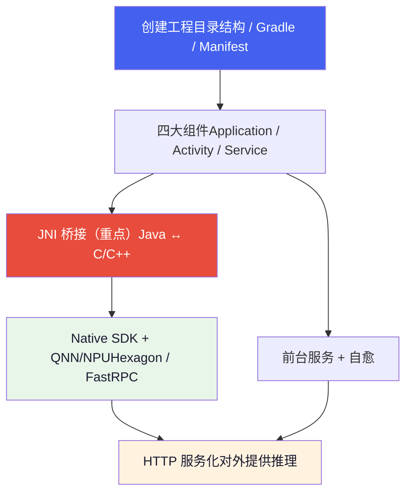
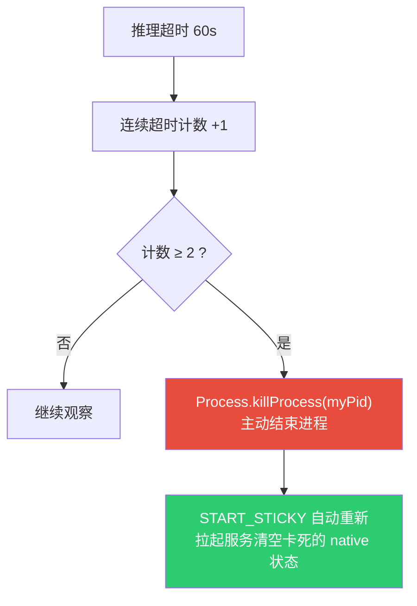

# Android 开发 & JNI 基础

*从创建工程到 JNI 桥接的完整学习路径  |  以座舱端侧大模型 APK `lantu_demo` 为教材*

> [!TIP]
> **本篇定位**
>
> 这是一篇**从零开始的教程**，讲 Android 工程结构与 JNI 的基础知识，所有例子都取自真实项目 `lantu_demo`（一个在高通 SA8397P 座舱上跑端侧大模型的宿主 APK）。想直接看这个 APK 的**架构与实现细节**，请读 [APK 集成与端侧服务化](../projects/lantu/apk-integration.html)；想懂底层芯片/DSP/FastRPC，请读 [硬件与系统底层](hardware.html)。本篇是「打基础」，那篇是「看实战」。

## 1. 学习路线总览

`lantu_demo` 几乎覆盖了「Android + JNI + 端侧 NPU」的完整知识栈，所以它是极好的教材。整条链路如下，本篇按此顺序展开：



## 2. Android 工程结构

### 2.1 目录结构

一个标准 Android 工程（对照 `lantu_demo`）：

```
lantu_demo/
├── settings.gradle          # ① 工程「目录」：有哪些模块、去哪下依赖
├── build.gradle             # ② 根构建脚本（工程级公共配置）
├── gradle.properties        # ③ Gradle 运行参数
├── gradlew / gradlew.bat    # ④ Gradle Wrapper：锁定 Gradle 版本，免装
├── local.properties         # ⑤ 本机 SDK 路径（不提交 git）
└── app/                     # ⑥ 唯一的业务模块（Android Application）
    ├── build.gradle         # ⑦ 模块构建脚本（最常改的文件）
    └── src/main/
        ├── AndroidManifest.xml   # ⑧ 组件清单 + 权限
        ├── java/...              # ⑨ Java 源码
        ├── cpp/                  # ⑩ C++ 源码 + CMakeLists.txt
        ├── jniLibs/arm64-v8a/    # ⑪ 预编译 .so（按 CPU 架构分目录）
        └── res/                  # ⑫ 资源（布局/图标/字符串）
```

**关键心智模型**：Android 工程是「多模块」结构，`settings.gradle` 用 `include ':app'` 声明模块。本项目只有一个 `app` 模块。

### 2.2 Gradle 构建系统

Gradle 是 Android 的构建工具（类比前端的 npm/webpack，或 C++ 的 CMake），用 DSL 描述「怎么把源码 + 资源 + 依赖打成 APK」。

**`settings.gradle`** —— 工程入口，两件事：声明依赖仓库 + 声明模块。

```
dependencyResolutionManagement {
    repositories {
        maven { url 'https://maven.aliyun.com/repository/google' }  // 阿里云镜像，国内快
        google()        // 官方 Google 仓库（androidx 等）
        mavenCentral()  // 中央仓库
        flatDir { dirs "app/libs" }   // 本地 .aar/.jar 目录
    }
}
rootProject.name = "My Application"
include ':app'        // 👈 声明 app 模块
```

**`app/build.gradle`** —— 最核心，逐段讲（项目真实文件）：

```
android {
    namespace 'com.example.myapplication'   // R 类与包命名空间
    compileSdk 33                            // 用 API 33 编译（决定能用哪些新 API）

    defaultConfig {
        applicationId "com.example.myapplication"  // 安装包唯一 ID
        minSdk 33        // 最低支持 Android 13
        targetSdk 33     // 目标行为版本
        ndk {
            abiFilters "arm64-v8a"   // 👈 只打包 64 位 ARM 的 .so
        }
    }

    sourceSets.getByName("main") { jniLibs.srcDirs("src/main/jniLibs") }

    // 👈 接入 CMake：把 cpp/ 下的 C++ 编成 libmodelinfer.so
    externalNativeBuild {
        cmake { version="3.22.1"; path = file("src/main/cpp/CMakeLists.txt") }
    }

    packagingOptions {
        jniLibs {
            useLegacyPackaging true
            doNotStrip "**/libQnnHtpV81Skel.so"   // 👈 关键：这个 .so 不能被裁剪符号
        }
    }
}
```

> [!NOTE]
> **三个 SDK 版本的区别（高频面试题）**
>
> **compileSdk**：编译时「看得见」的最高 API，纯编译期概念。  
> **minSdk**：能安装的最低系统版本。  
> **targetSdk**：你「声称适配到」的版本，系统据此决定是否启用新的兼容性限制。

> [!WARNING]
> **doNotStrip 是什么**
>
> 打包时 Android 默认会 `strip` 掉 .so 里「没被引用」的符号以减小体积。但 `libQnnHtpV81Skel.so` 跑在 DSP 侧，它的符号在 APK（CPU 侧）看来「没人用」，一旦被 strip，DSP 加载时就找不到符号直接崩。所以必须显式排除。这是 APK 集成 QNN 最典型的坑。

### 2.3 AndroidManifest.xml

每个 APK 必须有清单文件，声明「我是谁、要什么权限、有哪些组件」：

```
<manifest>
    <uses-permission android:name="android.permission.FOREGROUND_SERVICE" />
    <uses-permission android:name="android.permission.INTERNET"/>
    <uses-permission android:name="android.permission.FOREGROUND_SERVICE_DATA_SYNC" />

    <application android:name=".MyApplication" ...>   <!-- 指定自定义 Application 类 -->

        <activity android:name=".MainActivity" android:exported="true">
            <intent-filter>                <!-- 这两行让它成为「桌面图标入口」 -->
                <action android:name="android.intent.action.MAIN" />
                <category android:name="android.intent.category.LAUNCHER" />
            </intent-filter>
        </activity>

        <service android:name=".TestInjectService"
                 android:exported="true"
                 android:foregroundServiceType="dataSync" />

        <uses-native-library android:name="libcdsprpc.so"
                             android:required="false" />
    </application>
</manifest>
```

**要点**：所有四大组件都必须在这里注册，否则运行时找不到。`android:name=".MyApplication"` 里的 `.` 是 `namespace` 的简写。

## 3. 四大组件

Android 应用由「组件」构成，系统按生命周期管理它们。本项目用到三类。

### 3.1 Application —— 进程级入口（MyApplication）

`Application` 是整个进程**最先**创建的对象，早于任何 Activity/Service，其 `onCreate()` 是「进程只执行一次」的初始化点。

```
public class MyApplication extends Application {
    @Override
    public void onCreate() {
        super.onCreate();
        System.loadLibrary("cdsprpc");     // 1. 先底层 FastRPC
        System.loadLibrary("modelinfer");  // 2. 再 JNI 桥接库
        Os.setenv("ADSP_LIBRARY_PATH", NativeEnv.buildAdspLibraryPath(...), true);
    }
}
```

> [!NOTE]
> **为什么把 native 库加载放这里而不是 Activity？**
>
> 进程有两种拉起方式：用户点图标（走 `MainActivity`），或系统因 `START_STICKY` 单独重启服务（走 `TestInjectService`，不经过 Activity）。放在 `Application.onCreate()` 能保证**无论哪种路径，底层环境都已就绪**。这是重要的工程思维：把「进程级依赖」放到「进程级入口」。

### 3.2 Activity —— 界面（MainActivity）

Activity 是「一屏界面」，核心是生命周期回调：

```
public class MainActivity extends AppCompatActivity {
    @Override
    protected void onCreate(Bundle savedInstanceState) {
        super.onCreate(savedInstanceState);
        setContentView(R.layout.activity_main);      // 加载布局 XML
        infer = new BanmaModelInference();           // 创建 JNI 封装对象
        infer.init("/AI/vllm_sdk/models", nativeLibraryDir);
        startMyService();                            // 拉起前台服务
    }
    @Override
    protected void onDestroy() {
        super.onDestroy();
        if (infer != null) { infer.close(); infer = null; }  // 释放 native 资源
    }
}
```

完整生命周期：`onCreate → onStart → onResume →（可见可交互）→ onPause → onStop → onDestroy`。本项目界面很简单，真正的活在 Service 里干。

### 3.3 Service —— 后台常驻（TestInjectService，本项目主体）

Service 没有界面、长期后台运行。大模型推理要「常驻 + 被杀后自动恢复」，所以放 Service。

**① 前台服务**：Android 8.0 后后台 Service 会被快速杀死，要常驻必须升级为「前台服务」——显示常驻通知：

```
private void startForegroundService() {
    createNotificationChannel();                    // Android 8+ 通知必须走渠道
    startForeground(NOTIFICATION_ID, createNotification());  // 升级为前台
}
```

**② START\_STICKY 自愈**：

```
@Override
public int onStartCommand(Intent intent, int flags, int startId) {
    return START_STICKY;   // 👈 被系统杀死后，系统会重新创建这个服务
}
```

`START_STICKY` 是「粘性」标志：服务被杀后系统会重新 `onCreate()` 它。这是后面「native 卡死 → killProcess 重启」自愈机制能成立的**系统级前提**。

**组件如何启动**：通过 `Intent`（意图）：

```
Intent intent = new Intent(this, TestInjectService.class);
startForegroundService(intent);   // Android 8+ 必须用这个启动前台服务
```

## 4. JNI 基础

### 4.1 为什么需要 JNI

JNI（Java Native Interface）是 Java 调用 C/C++ 代码的桥梁。本项目必须用它：

- **性能**：大模型推理是重计算，必须 C++。
- **复用**：QNN/LLM 引擎（`libllms.so` 等）都是 C++ 库。
- **硬件**：访问 Hexagon NPU 只能走 C/C++（FastRPC）。

Java 负责「服务化、协议、生命周期」，C++ 负责「推理」，JNI 是中间的翻译官。

### 4.2 完整链路与命名规则

用本项目的 `nativeCreate` 串一遍，这是理解 JNI 的主线：

```mermaid
flowchart TB
    A["① Java 声明 native 方法private static native long nativeCreate();"] --> B["② 加载 .soSystem.loadLibrary("modelinfer")"]
    B --> C["③ C++ 按命名规则实现同名函数Java_com_example_..._nativeCreate(...)"]
    C --> D["④ 运行时 JVM 按名字把 ① 和 ③ 绑定"]
    style A fill:#eef2ff,color:#1a1a2e
    style C fill:#fff3e0,color:#1a1a2e
    style D fill:#e8f5e9,color:#1a1a2e
```

C++ 函数名 = `Java_` + 包名（`.`→`_`）+ `_类名_` + `方法名`：

```
Java_com_example_myapplication_BanmaModelInference_nativeCreate
     └────────── 包名 ──────────────┘ └──── 类名 ────┘ └─方法名─┘
```

这就是为什么 Java 侧包名一改，C++ 函数名就得跟着改。

### 4.3 JNIEnv 与类型映射

每个 JNI 函数前两个参数固定：

```
JNIEXPORT jlong JNICALL
Java_..._nativeCreate(JNIEnv* env, jclass clazz) { ... }
//                    └─环境指针─┘  └─调用者─┘
```

- **`JNIEnv* env`**：JNI 环境指针，所有 JNI 操作（转字符串、调方法、抛异常）都通过它。它是「线程局部」的——每个线程有自己的 `JNIEnv`（回调时至关重要，见 5.3）。
- **`jclass`**：native 方法是 `static` 时第二个参数是类（`jclass`）；非 static 时是实例（`jobject`）。本项目 native 方法全是 static。

| Java | JNI | C/C++ |
| :--- | :--- | :--- |
| `boolean` | `jboolean` | `unsigned char`（JNI\_TRUE/FALSE） |
| `int` | `jint` | `int32_t` |
| `long` | `jlong` | `int64_t` |
| `String` | `jstring` | 需转换 |
| `byte[]` | `jbyteArray` | 需 `GetByteArrayElements` |
| `Object` | `jobject` | 不透明句柄 |

## 5. JNI 进阶

### 5.1 句柄模式（本项目的核心设计）

C++ 对象活在堆上，Java 没法直接持有它。办法：把 C++ 指针转成 `long` 交给 Java 保管，每次调用再传回来。

```
// 创建：new 一个 C++ 对象，把指针当 long 返回
JNIEXPORT jlong JNICALL Java_..._nativeCreate(JNIEnv* env, jclass) {
    auto* p = new (std::nothrow) banma::ModelInference();
    return reinterpret_cast<jlong>(p);   // 指针 → long
}

// 使用：把 long 转回指针
JNIEXPORT jboolean JNICALL Java_..._nativeInit(JNIEnv* env, jclass, jlong handle, ...) {
    auto* p = reinterpret_cast<banma::ModelInference*>(handle);  // long → 指针
    bool ok = p->init(path);
    return ok ? JNI_TRUE : JNI_FALSE;
}

// 销毁：delete
JNIEXPORT void JNICALL Java_..._nativeDestroy(JNIEnv* env, jclass, jlong handle) {
    delete reinterpret_cast<banma::ModelInference*>(handle);
}
```

Java 侧用 `nativeHandle` 字段保管这个 long，并实现 `AutoCloseable` 确保释放：

```
public class BanmaModelInference implements AutoCloseable {
    private long nativeHandle = 0;
    public BanmaModelInference() { nativeHandle = nativeCreate(); }
    @Override public void close() {
        if (nativeHandle != 0) { nativeDestroy(nativeHandle); nativeHandle = 0; }
    }
}
```

> [!TIP]
> **务必掌握**
>
> 「Java 持 long 句柄 ↔ C++ 持对象」是 JNI 封装有状态对象的标准范式。

### 5.2 数组与字符串

Java `String`（UTF-16）和 C++ `std::string`（UTF-8）不能直接用，必须转换：

```
static std::string JStringToStdString(JNIEnv* env, jstring js) {
    if (!js) return {};
    const char* utf = env->GetStringUTFChars(js, nullptr);  // 取 UTF-8 指针
    std::string s = utf ? utf : "";
    env->ReleaseStringUTFChars(js, utf);                    // 👈 必须配对释放
    return s;
}
```

> [!CAUTION]
> **铁律**
>
> `GetXxxChars` 必须配对 `ReleaseXxxChars`。这是 JNI 内存泄漏的头号来源。

传图片 `byte[]` 给 C++：

```
jsize dataSize = env->GetArrayLength(imageData);
jbyte* dataBytes = env->GetByteArrayElements(imageData, nullptr);  // 取指针
if (dataBytes) {
    msg.image_info.image_data.assign(
        reinterpret_cast<uint8_t*>(dataBytes),
        reinterpret_cast<uint8_t*>(dataBytes) + dataSize);         // 拷进 std::vector
    env->ReleaseByteArrayElements(imageData, dataBytes, JNI_ABORT); // 👈 释放
}
```

`JNI_ABORT` 表示「释放但不把改动写回 Java 数组」（只读不写，省一次拷贝）。

### 5.3 C++ 回调 Java（最难的部分）

推理是异步的：C++ 工作线程算出结果后，要反过来调用 Java 的 `onReply`。看项目实现：

```
// 准备阶段（在 Java 线程里）：
jobject gHandler = env->NewGlobalRef(handler);   // ① 升级成全局引用
jmethodID onReplyMid = env->GetMethodID(cls, "onReply", "(Ljava/lang/String;Z)V");  // ② 缓存方法 ID

// 回调 lambda（将来在 C++ 工作线程里执行）：
banma::ScenarioReplyHandler cb = [jvm, gHandler, onReplyMid](const std::string& result, bool finished){
    JNIEnv* envCb = nullptr;
    // ③ 当前是 native 线程，没有 JNIEnv，必须先 Attach
    if (jvm->GetEnv((void**)&envCb, JNI_VERSION_1_6) == JNI_EDETACHED)
        jvm->AttachCurrentThread(&envCb, nullptr);

    // ④ 真正回调 Java
    jstring jres = envCb->NewStringUTF(result.c_str());
    envCb->CallVoidMethod(gHandler, onReplyMid, jres, (jboolean)finished);

    if (finished) envCb->DeleteGlobalRef(gHandler);  // ⑤ 末帧释放全局引用
    jvm->DetachCurrentThread();                       // ⑥ 解绑线程
};
```

四个必须理解的点：

**① 为什么 `NewGlobalRef`？** JNI 引用分两种：

- **局部引用（Local Ref）**：默认就是。只在**当前线程、当前方法**内有效，方法返回即失效。
- **全局引用（Global Ref）**：跨线程、跨方法长期有效，需手动 `NewGlobalRef` 创建、`DeleteGlobalRef` 释放。

回调发生在**另一个线程、未来的某个时刻**，局部引用早就失效，所以必须升级成全局引用。不升级 = 回调时崩溃。

**② 方法签名 `"(Ljava/lang/String;Z)V"`**：JNI 方法描述符——`(参数)返回值`。`Ljava/lang/String;` 是 String，`Z` 是 boolean，`V` 是 void。即 `void onReply(String, boolean)`。

**③ `AttachCurrentThread`**：`JNIEnv` 是线程局部的。C++ 工作线程不是 Java 创建的，没有 `JNIEnv`，直接用会崩。必须先 Attach 把线程「挂到 JVM」上拿到 `JNIEnv`，用完 `DetachCurrentThread`。

**④ `jvm` 哪来的**：`env->GetJavaVM(&jvm)`。`JNIEnv` 线程局部不能跨线程用，但 `JavaVM*` 是进程唯一的，可以安全捕获进 lambda 跨线程使用。

### 5.4 CMake 与 .so

`cpp/CMakeLists.txt` 描述怎么把 `modelinfer.cpp` 编成 `libmodelinfer.so`：

```
cmake_minimum_required(VERSION 3.22.1)
project("modelinfer")

add_library(modelinfer SHARED modelinfer.cpp)   # SHARED = 动态库 .so

target_include_directories(modelinfer PUBLIC     # 头文件搜索路径
    ${CMAKE_SOURCE_DIR}/include
    ${CMAKE_SOURCE_DIR}/../../vllm_sdk/vllm_sdk/include)

target_link_directories(modelinfer PUBLIC ${CMAKE_SOURCE_DIR}/../jniLibs/arm64-v8a)

target_link_libraries(modelinfer aadkcore log android_sdk)   # 链接依赖
```

> [!NOTE]
> **库名约定**
>
> `add_library(... SHARED ...)` 的库名 `modelinfer` 决定产物叫 `libmodelinfer.so`，也决定 Java 侧 `System.loadLibrary("modelinfer")` 要填的名字（去掉 `lib` 前缀和 `.so` 后缀）。

把 `.so / abiFilters / jniLibs / loadLibrary` 串成一条线：

```mermaid
flowchart TB
    A["jniLibs/arm64-v8a/*.so预编译二进制，按 CPU 架构分目录"] --> B["abiFilters "arm64-v8a"打包时只保留这个架构"]
    B --> C["装进 APK，安装时解压到 nativeLibraryDir"]
    C --> D["System.loadLibrary("modelinfer")运行时按名字 dlopen 加载"]
    D --> E["libmodelinfer.so 链接了 aadkcore/android_sdk→ 连带加载它依赖的所有 .so"]
    style A fill:#eef2ff,color:#1a1a2e
    style D fill:#4361ee,color:#fff
```

## 6. 端侧进阶主题

### 6.1 NPU / Hexagon / QNN / FastRPC

这是本项目「端侧 AI」的灵魂，概念链：

- **Hexagon NPU**：高通芯片里的 AI 加速器（张量算力 ~70 TOPS），大模型推理靠它。
- **QNN**：高通统一推理框架，`libQnnHtp.so` 是 HTP（Hexagon Tensor Processor）后端。
- **FastRPC**：CPU（跑 Android/APK）和 DSP（跑 NPU 计算）是**不同处理器**，通信靠 FastRPC，`libcdsprpc.so` 就是 cDSP 的 FastRPC 库。
- **Skel/Stub 模式**：FastRPC 把一次跨处理器调用拆成两半——CPU 侧叫 **Stub**（桩），DSP 侧叫 **Skel**（骨架）。

这解释了三件 otherwise 很怪的事：

| 现象 | 原因 |
| :--- | :--- |
| 加载顺序先 `cdsprpc` 后 `modelinfer` | SDK 初始化就要经 FastRPC 跟 DSP 握手，FastRPC 库没加载就握不上 |
| `Skel.so` 不能 strip | 它在 DSP 侧运行，CPU 链接器看不到它「被用」，strip 掉 DSP 就加载不了 |
| 要设 `ADSP_LIBRARY_PATH` | DSP 侧 Skel 库不在标准路径，得靠这个环境变量告诉 FastRPC 去哪找 |

更底层的芯片/DSP/SSR 细节见 [硬件与系统底层](hardware.html)。

### 6.2 前台服务 + 自愈（稳定性设计）

端侧大模型 + NPU 是独占资源，native 层偶发卡死时，跑 JNI 的 Java 线程**无法被 `interrupt` 打断**（JNI 调用不响应中断），会永久占着 C++ 串行锁。分层兜底：



核心洞察：**进程内无法安全解开卡死的 native 锁，唯一可靠的恢复是「重启进程」**，而 `START_STICKY` 让重启后服务能自动回来。代码里专门强调「崩溃（SIGABRT）≠ 可靠自愈」，因为系统对崩溃有节流，真正可靠的是主动 `killProcess`。

### 6.3 HTTP 服务化（为什么是 HTTP）

`TestHttpEndpoint` 用 NanoHTTPD 在 `0.0.0.0:8080` 起服务。座舱里调用方五花八门（Android App、Linux 服务、Python 评测脚本），HTTP+JSON 是最大公约数：跨语言、无需共享接口定义、`curl` 直接联调。相对大模型几百毫秒~几秒的推理耗时，HTTP 的序列化开销可忽略。

### 6.4 线程模型

- **NanoHTTPD** 自己起线程收 HTTP 请求。
- 推理用全局 `requestProcessingLock` 串行化（NPU 独占，同时只能跑一个）。
- SDK 回调在 **native 工作线程**，经 `AttachCurrentThread` 回到 JVM。
- `TaskScheduler` 提供 8 线程异步池 + 单线程调度池。

## 7. 动手练习路径

光读不够，建议按这个阶梯亲手做一遍，每一步都可运行验证：

| 阶段 | 目标 | 关键动作 |
| :--- | :--- | :--- |
| **1. 纯 Android** | 熟悉工程与生命周期 | New Project（Empty Views，Java，minSdk 33）→ 改 `MainActivity` 加按钮改文字 → 新建 Service 看 Logcat 生命周期 |
| **2. Hello JNI** | 最小桥接 | New Project 勾选 **Include C++ support** → 读懂自动生成的 `stringFromJNI()` → 自己加 `native int add(int,int)` |
| **3. 句柄模式** | 有状态对象 | C++ 写 `class Counter`，用 `nativeCreate/Increment/Destroy` + `jlong` 句柄暴露——**复刻本项目核心范式** |
| **4. C++ 回调 Java** | 异步回调（最难） | 传 Java 回调接口，C++ 里 `NewGlobalRef` + `GetMethodID`，开 `std::thread` 延迟 1 秒后 `AttachCurrentThread` + `CallVoidMethod` |
| **5. 读懂 lantu\_demo** | 融会贯通 | 重读 `BanmaModelInference.java` + `modelinfer.cpp`，此时每行都应能说出「为什么」 |

> [!TIP]
> **小结**
>
> 阶段 2–4 是 JNI 的全部核心，`lantu_demo` 只是在这之上叠加了 NPU/QNN/服务化。把这三阶段做扎实，这个项目的 JNI 部分就没有秘密了。完整架构与实现细节见 [APK 集成与端侧服务化](../projects/lantu/apk-integration.html)。

// Theme toggle
var b=document.getElementById('themeBtn');
b.onclick=function(){var h=document.documentElement;h.dataset.theme=h.dataset.theme==='dark'?'light':'dark';try{localStorage.setItem('theme',h.dataset.theme)}catch(e){}};
try{var s=localStorage.getItem('theme');if(s)document.documentElement.dataset.theme=s}catch(e){}
// Sidebar scroll spy
var obs=new IntersectionObserver(function(entries){entries.forEach(function(e){if(e.isIntersecting){document.querySelectorAll('.sidebar a').forEach(function(a){a.classList.remove('active')});var l=document.querySelector('.sidebar a[href="#'+e.target.id+'"]');if(l)l.classList.add('active')}})},{rootMargin:'-60px 0px -70% 0px'});
document.querySelectorAll('h2[id],h3[id]').forEach(function(h){obs.observe(h)});
// Mermaid init (wait for script to load)
window.addEventListener('load',function(){
try{
if(typeof mermaid!=='undefined'){mermaid.initialize({startOnLoad:true,theme:document.documentElement.dataset.theme==='dark'?'dark':'default',securityLevel:'loose',flowchart:{useMaxWidth:true}})}
}catch(e){console.warn('Mermaid init failed:',e)}
});
