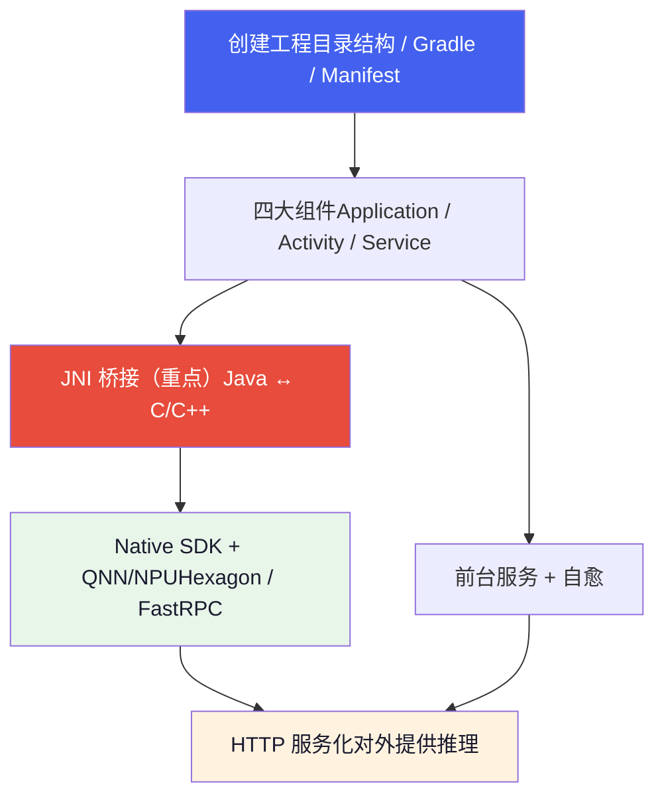
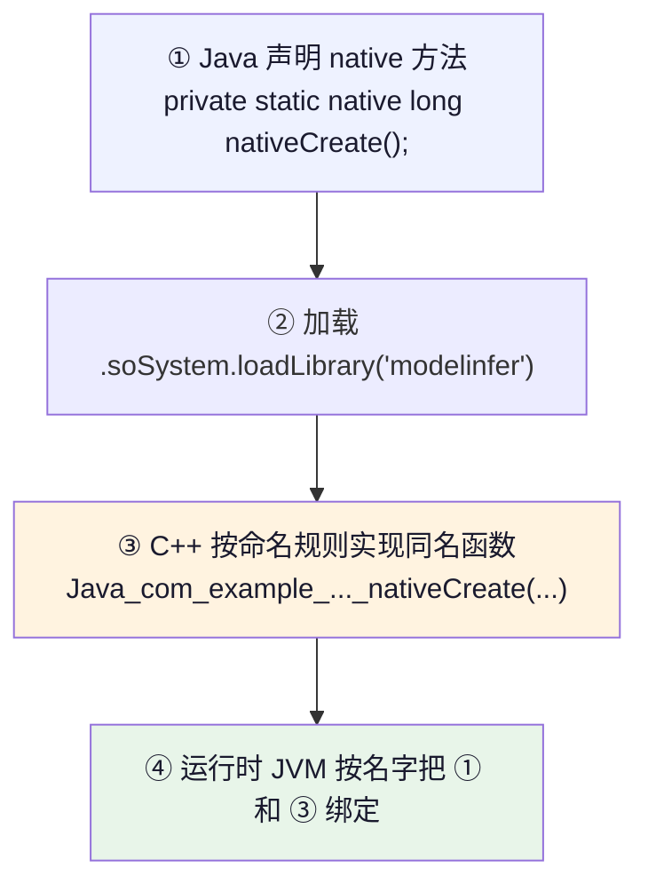
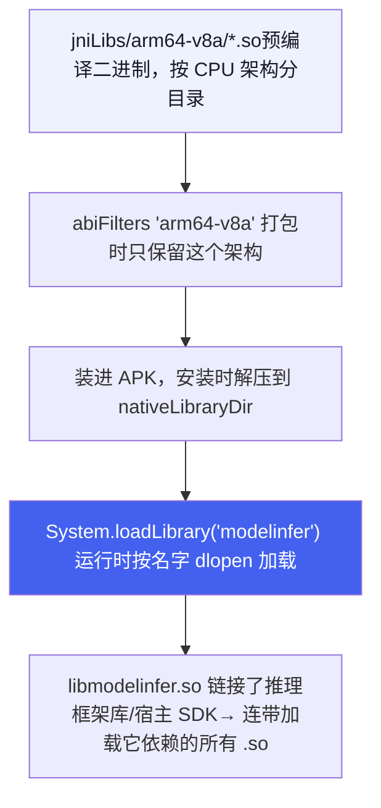
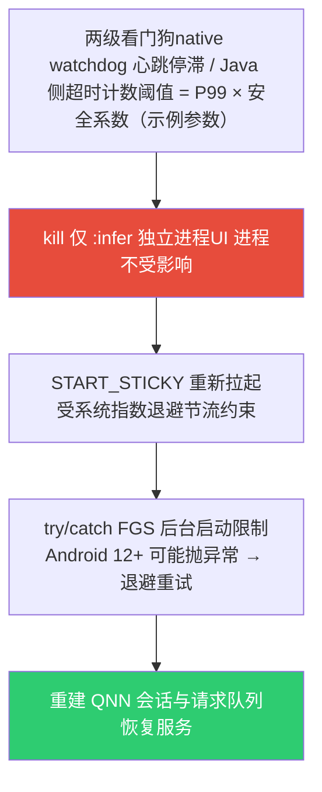

# Android 开发 & JNI 基础

*从创建工程到 JNI 桥接的完整学习路径  |  以座舱端侧大模型示例工程 `CockpitInferDemo` 为教材*

> [!TIP]
> **本篇定位**
>
> 这是一篇**从零开始的教程**，讲 Android 工程结构与 JNI 的基础知识。贯穿全篇的示例工程 `CockpitInferDemo` 是一个「在高通 SA8397P 座舱上跑端侧大模型的宿主 APK」的**中性教学示例**——从典型端侧推理 APK 中提炼泛化而来，**不绑定任何具体量产项目**。本篇属通识层，只讲通用方法与范式；具体项目的宿主 APK 实战，应由项目层文档反向链接本篇。想懂底层芯片/DSP/FastRPC，请读 [硬件与系统底层](hardware.html)。
>
> 数字口径：文中个别性能/超时数值一律为**示例参数**，仅用于演示方法；平台与锚点模型的统一口径见硬件篇开头的「全站数据基准」NOTE。

## 1. 学习路线总览

`CockpitInferDemo` 几乎覆盖了「Android + JNI + 端侧 NPU」的完整知识栈，所以它是极好的教材。整条链路如下，本篇按此顺序展开：



## 2. Android 工程结构

### 2.1 目录结构

一个标准 Android 工程：

```
CockpitInferDemo/
├── settings.gradle          # ① 工程「目录」：有哪些模块、去哪下依赖
├── build.gradle             # ② 根构建脚本（工程级公共配置）
├── gradle.properties        # ③ Gradle 运行参数
├── gradlew / gradlew.bat    # ④ Gradle Wrapper：锁定 Gradle 版本，免装
├── local.properties         # ⑤ 本机 SDK 路径（不提交 git）
└── app/                     # ⑥ 唯一的业务模块（Android Application）
    ├── build.gradle         # ⑦ 模块构建脚本（最常改的文件）
    └── src/main/
        ├── AndroidManifest.xml   # ⑧ 组件清单 + 权限
        ├── java/...              # ⑨ Java 源码
        ├── cpp/                  # ⑩ C++ 源码 + CMakeLists.txt
        ├── jniLibs/arm64-v8a/    # ⑪ 预编译 .so（按 CPU 架构分目录）
        └── res/                  # ⑫ 资源（布局/图标/字符串）
```

Android 工程是「多模块」结构，`settings.gradle` 用 `include ':app'` 声明模块；本示例只有一个 `app` 模块。

### 2.2 Gradle 构建系统

Gradle 是 Android 的构建工具（类比前端的 npm/webpack，或 C++ 的 CMake），用 DSL 描述「怎么把源码 + 资源 + 依赖打成 APK」。

**`settings.gradle`** —— 工程入口，两件事：声明依赖仓库 + 声明模块。

```
dependencyResolutionManagement {
    repositories {
        maven { url 'https://maven.aliyun.com/repository/google' }  // 阿里云镜像，国内快
        google()        // 官方 Google 仓库（androidx 等）
        mavenCentral()  // 中央仓库
        flatDir { dirs "app/libs" }   // 本地 .aar/.jar 目录
    }
}
rootProject.name = "CockpitInferDemo"
include ':app'        // 👈 声明 app 模块
```

**`app/build.gradle`** —— 最核心，逐段讲：

```
android {
    namespace 'com.example.cockpitinfer'   // R 类与包命名空间
    compileSdk 35                          // 用 API 35（Android 15）编译；本篇用到的前台服务新 API 要求 ≥ 34

    defaultConfig {
        applicationId "com.example.cockpitinfer"  // 安装包唯一 ID
        minSdk 33        // 最低支持 Android 13（跟随座舱车机系统版本）
        targetSdk 35     // 目标行为版本
        ndk {
            abiFilters "arm64-v8a"   // 👈 只打包 64 位 ARM 的 .so
        }
    }

    sourceSets.getByName("main") { jniLibs.srcDirs("src/main/jniLibs") }

    // 👈 接入 CMake：把 cpp/ 下的 C++ 编成 libmodelinfer.so
    externalNativeBuild {
        cmake { version="3.22.1"; path = file("src/main/cpp/CMakeLists.txt") }
    }

    packaging {
        jniLibs {
            useLegacyPackaging true                        // .so 压缩打包、安装时解压（取舍见下）
            keepDebugSymbols += "**/libQnnHtpV*Skel.so"    // 👈 关键：DSP 侧 Skel 库不能被裁剪符号
        }
    }
}
```

> [!NOTE]
> **三个 SDK 版本的区别（高频面试题）**
>
> **compileSdk**：编译时「看得见」的最高 API，纯编译期概念。
> **minSdk**：能安装的最低系统版本。
> **targetSdk**：你「声称适配到」的版本，系统据此决定是否启用新的兼容性限制。
>
> 三者通常**不相等**：minSdk 跟随你要支持的最老系统（车机量产平台多冻结在某个 Android 版本，如 13）；compileSdk / targetSdk 则应尽量新——否则新 API 根本编不过。一个典型反例：`FOREGROUND_SERVICE_SPECIAL_USE` 权限是 **API 34** 才引入的，若 compileSdk 停在 33，§2.3 的清单就写不出来。

> [!WARNING]
> **keepDebugSymbols（旧写法 doNotStrip）：Skel 库不能被 strip**
>
> 打包时 Android 默认会 `strip` 掉 .so 里「没被引用」的符号以减小体积。但 `libQnnHtpV*Skel.so`（V68/V73/V75/V79 等，后缀随 HTP 架构版本变化）跑在 **DSP 侧**，它的符号在 APK（CPU 侧）看来「没人用」，一旦被 strip，DSP 加载时就找不到符号直接崩。所以必须显式排除。这是 APK 集成 QNN 最典型的坑。
>
> **DSL 有版本差异，按 AGP 版本核实**：`doNotStrip` 是旧版 `PackagingOptions` 的方法；AGP 8+ 的 `packaging { jniLibs { ... } }` 块（`JniLibsPackaging`）对应的属性是 **`keepDebugSymbols`**。把旧方法写进新块里大概率编译失败——原理不变，写法要跟工具链走。
>
> 顺带说 `useLegacyPackaging` 的取舍：`true` = .so 压缩进 APK、安装时解压落盘（下载小、安装占用大且首装慢）；`false` = .so 不压缩存放、运行时直接从 APK 内加载。对几十上百 MB 的 QNN 库集合，这个选择对安装时间与磁盘占用的影响是可感知的。

### 2.3 AndroidManifest.xml

每个 APK 必须有清单文件，声明「我是谁、要什么权限、有哪些组件」：

```
<manifest>
    <uses-permission android:name="android.permission.FOREGROUND_SERVICE" />
    <uses-permission android:name="android.permission.INTERNET"/>
    <!-- API 34+：前台服务必须再声明与 foregroundServiceType 匹配的子权限 -->
    <uses-permission android:name="android.permission.FOREGROUND_SERVICE_SPECIAL_USE" />

    <application android:name=".MyApplication" ...>   <!-- 指定自定义 Application 类 -->

        <activity android:name=".MainActivity" android:exported="true">
            <intent-filter>                <!-- 这两行让它成为「桌面图标入口」 -->
                <action android:name="android.intent.action.MAIN" />
                <category android:name="android.intent.category.LAUNCHER" />
            </intent-filter>
        </activity>

        <!-- 推理服务：exported=false（仅本应用可拉起，安全论证见 §6.5）
             process=":infer"（独立进程，自愈设计见 §6.3） -->
        <service android:name=".InferService"
                 android:exported="false"
                 android:process=":infer"
                 android:foregroundServiceType="specialUse">
            <property android:name="android.app.PROPERTY_SPECIAL_USE_FGS_SUBTYPE"
                      android:value="on-device AI inference" />
        </service>

        <uses-native-library android:name="libcdsprpc.so"
                             android:required="false" />
    </application>
</manifest>
```

**要点**：所有四大组件都必须在这里注册，否则运行时找不到。`android:name=".MyApplication"` 里的 `.` 是 `namespace` 的简写。

> [!WARNING]
> **前台服务类型：常驻推理服务用 `specialUse`，不要用 `dataSync`**
>
> 很多教程顺手写 `foregroundServiceType="dataSync"`——对一个**常驻推理守护服务**来说这已经行不通了：**Android 15 对 `dataSync` 类型的前台服务施加了运行时限（每 24 小时累计约 6 小时）**，超时会被系统直接停掉。座舱语音助手不能因为「额度用完」而罢工。
>
> 正确做法是 **`specialUse`**，并在 `<service>` 内用 `PROPERTY_SPECIAL_USE_FGS_SUBTYPE` 属性声明具体用途（如 `on-device AI inference`）。若走 Google Play 分发，`specialUse` 需要在商店审核中说明用途（车机预装应用通常不涉及）。
>
> 注意版本前提：`specialUse` 类型与 `FOREGROUND_SERVICE_SPECIAL_USE` 子权限都是 **API 34（Android 14）引入**的——这正是 compileSdk 必须 ≥ 34 的原因；「compileSdk 33 + 声明 API 34 权限」是自相矛盾的组合。在 API 34 以下的系统上，这些声明会被无害忽略（`dataSync` 时限本身也是 Android 15 才有的行为），不影响安装运行。

> [!NOTE]
> **`<uses-native-library>` 的生效前提：库必须在系统「白名单」里**
>
> Android 12（API 31）起，app 的 linker namespace 默认隔离，直接 `dlopen` NDK 之外的 vendor 库（如 FastRPC 的 `libcdsprpc.so`）会失败，需要在清单里声明 `<uses-native-library>`。**但声明只是必要条件**：目标库还必须被整机厂列进 **`/vendor/etc/public.libraries.txt`**（或 `public.libraries-<company>.txt`）对外导出，否则依然 `dlopen failed: library "libcdsprpc.so" is not accessible for the namespace ...`。
>
> 排查命令：
>
> ```
> adb shell cat /vendor/etc/public.libraries.txt | grep cdsprpc
> adb shell ls /vendor/etc/public.libraries*
> adb logcat | grep -iE "linker|dlopen"    # 看 namespace 拒绝的具体日志
> ```
>
> `android:required="false"` 表示系统上没有该库时应用仍可安装运行（降级到非 NPU 路径）；写 `true` 则缺库直接装不上。

## 3. 四大组件

Android 应用由「组件」构成，系统按生命周期管理它们。本示例用到三类。四大组件本身是通用 Android 知识，本节只展开**与端侧推理直接相关**的部分。

### 3.1 Application —— 进程级入口（MyApplication）

`Application` 是整个进程**最先**创建的对象，早于任何 Activity/Service，其 `onCreate()` 是「进程只执行一次」的初始化点。

```
public class MyApplication extends Application {
    @Override
    public void onCreate() {
        super.onCreate();
        System.loadLibrary("cdsprpc");     // 1. 先底层 FastRPC
        System.loadLibrary("modelinfer");  // 2. 再 JNI 桥接库

        // 3. ADSP_LIBRARY_PATH：告诉 FastRPC 去哪些目录找 DSP 侧 Skel 库
        //    注意分隔符是分号 ";"，不是冒号
        String adspPath = getApplicationInfo().nativeLibraryDir
                + ";/vendor/lib/rfsa/adsp"
                + ";/vendor/dsp/cdsp"
                + ";/dsp";
        Os.setenv("ADSP_LIBRARY_PATH", adspPath, true);   // true = 覆盖已有值
    }
}
```

> [!NOTE]
> **为什么把 native 库加载放这里而不是 Activity？**
>
> 进程有两种拉起方式：用户点图标（走 `MainActivity`），或系统因 `START_STICKY` 单独重启服务（走 `InferService`，不经过 Activity）。放在 `Application.onCreate()` 能保证**无论哪种路径，底层环境都已就绪**。这是重要的工程思维：把「进程级依赖」放到「进程级入口」。独立进程场景（§6.3）同样受益：`:infer` 进程启动时会重新执行一遍 `Application.onCreate()`，库加载与环境变量在新进程里天然就绪。

> [!WARNING]
> **`ADSP_LIBRARY_PATH` 的两个易错点**
>
> **① 取值**：至少要覆盖 app 自己的 `nativeLibraryDir`（APK 里的 Skel 库安装后解压到这里）+ 系统 DSP 库目录 `/vendor/lib/rfsa/adsp`、`/vendor/dsp/cdsp`、`/dsp`。哪些目录实际存在、是否可读随 BSP 与平台变化，全列上无害；分隔符用**分号**。
> **② 时机**：必须在**第一次 `remote_handle_open` 之前**设置——即任何会触达 DSP 的 QNN/SDK 初始化之前。FastRPC 在建立 DSP 会话时读取该变量，事后再设对已建立的会话无效。这就是它紧跟 `loadLibrary`、放在 `Application.onCreate()` 里的原因。
>
> 设错的典型现象：初始化报 Skel 库找不到（如 `libQnnHtpV79Skel.so not found` / `remote_handle_open failed`），但文件明明就在 `nativeLibraryDir` 里。

### 3.2 Activity —— 界面（MainActivity）

Activity 是「一屏界面」，生命周期为 `onCreate → onStart → onResume →（可见可交互）→ onPause → onStop → onDestroy`。本示例界面很简单，真正的活在 Service 里干：

```
public class MainActivity extends AppCompatActivity {
    @Override
    protected void onCreate(Bundle savedInstanceState) {
        super.onCreate(savedInstanceState);
        setContentView(R.layout.activity_main);       // 加载布局 XML
        infer = new ModelInference();                 // 创建 JNI 封装对象
        infer.init("/data/models", nativeLibraryDir); // 模型文件所在目录
        startInferService();                          // 拉起前台服务
    }
    @Override
    protected void onDestroy() {
        super.onDestroy();
        if (infer != null) { infer.close(); infer = null; }  // 释放 native 资源
    }
}
```

> [!CAUTION]
> **`/data/models` 不是拿来就能读的路径**
>
> 普通应用（SELinux `untrusted_app` 域）默认**无权读取**这类非标准根目录，`open()` 会直接 EACCES——这是端侧模型 APK 上机的头号坑，详见 §6.2。

### 3.3 Service —— 后台常驻（InferService，本示例主体）

Service 没有界面、长期后台运行。大模型推理要「常驻 + 被杀后自动恢复」，所以放 Service。

**① 前台服务**：Android 8.0 后后台 Service 会被快速杀死，要常驻必须升级为「前台服务」——显示常驻通知：

```
private void startForegroundService() {
    createNotificationChannel();                    // Android 8+ 通知必须走渠道
    startForeground(NOTIFICATION_ID, createNotification());  // 升级为前台
}
```

前台服务**类型**的选择（为什么是 `specialUse` 而不是 `dataSync`）见 §2.3 的 WARNING——这是 2026 年做常驻服务最实用的一条 Android 知识。

**② START\_STICKY 自愈**：

```
@Override
public int onStartCommand(Intent intent, int flags, int startId) {
    return START_STICKY;   // 👈 被系统杀死后，系统会重新创建这个服务
}
```

`START_STICKY` 是「粘性」标志：服务被杀后系统会重新 `onCreate()` 它。这是后面「native 卡死 → 杀进程重启」自愈机制能成立的**系统级前提**——但它**不是无条件可靠**的：系统对频繁重启有指数退避节流，Android 12+ 还限制后台启动前台服务。完整讨论见 §6.3。

**组件如何启动**：通过 `Intent`（意图）：

```
Intent intent = new Intent(this, InferService.class);
startForegroundService(intent);   // Android 8+ 必须用这个启动前台服务
```

## 4. JNI 基础

### 4.1 为什么需要 JNI

JNI（Java Native Interface）是 Java 调用 C/C++ 代码的桥梁。本示例必须用它：

- **性能**：大模型推理是重计算，必须 C++。
- **复用**：QNN/推理引擎（`libQnnHtp.so`、厂商 runtime 等）都是 C++ 库。
- **硬件**：访问 Hexagon NPU 只能走 C/C++（FastRPC）。

Java 负责「服务化、协议、生命周期」，C++ 负责「推理」，JNI 是中间的翻译官。

### 4.2 完整链路与命名规则

用 `nativeCreate` 串一遍，这是理解 JNI 的主线：



C++ 函数名 = `Java_` + 包名（`.`→`_`）+ `_类名_` + `方法名`：

```
Java_com_example_cockpitinfer_ModelInference_nativeCreate
     └────────── 包名 ──────────┘ └──── 类名 ────┘ └─方法名─┘
```

这就是为什么 Java 侧包名一改，C++ 函数名就得跟着改——而这个痛点正是下一节 `RegisterNatives` 要解决的。

### 4.3 RegisterNatives：运行时注册（生产级标配）

名字拼接（静态注册）适合入门理解绑定原理，但**生产级 JNI 几乎都用 `RegisterNatives` 运行时注册**：`System.loadLibrary` 时 JVM 会回调 `JNI_OnLoad`，你在那里用一张表把「Java native 方法 ↔ C++ 函数指针」显式绑定：

```
// C++ 函数名从此可以随便起，不再需要 Java_com_example_... 前缀
static jlong createInfer(JNIEnv* env, jclass) { /* ... */ return 0; }
static jboolean initInfer(JNIEnv* env, jclass, jlong handle, jstring path, jstring libDir) { /* ... */ return JNI_TRUE; }
static void destroyInfer(JNIEnv* env, jclass, jlong handle) { /* ... */ }

static const JNINativeMethod gMethods[] = {
    // { Java 方法名, 方法签名, C++ 函数指针 }
    {"nativeCreate",  "()J",                                      (void*)createInfer},
    {"nativeInit",    "(JLjava/lang/String;Ljava/lang/String;)Z", (void*)initInfer},
    {"nativeDestroy", "(J)V",                                     (void*)destroyInfer},
};

extern "C" JNIEXPORT jint JNI_OnLoad(JavaVM* vm, void*) {
    JNIEnv* env = nullptr;
    if (vm->GetEnv((void**)&env, JNI_VERSION_1_6) != JNI_OK) return JNI_ERR;

    // 此刻在调用 loadLibrary 的 Java 线程上，FindClass 能正常找到 app 类
    jclass cls = env->FindClass("com/example/cockpitinfer/ModelInference");
    if (!cls) return JNI_ERR;

    if (env->RegisterNatives(cls, gMethods,
                             sizeof(gMethods) / sizeof(gMethods[0])) < 0)
        return JNI_ERR;
    return JNI_VERSION_1_6;
}
```

三个好处：

| 好处 | 说明 |
| :--- | :--- |
| **解耦包名/类名** | Java 侧重构包名，C++ 不再需要跟着改一堆符号名，只改 `FindClass` 的一个路径字符串 |
| **符号可隐藏** | 配合 `-fvisibility=hidden` 编译，native 方法不再导出 `Java_...` 符号——减小体积，也更难被反射/逆向枚举 |
| **失败前置** | 签名写错在 `loadLibrary` 当场报错，而不是等到第一次调用才抛 `UnsatisfiedLinkError` |

> [!TIP]
> `JNI_OnLoad` 还有一个重要用途：**趁在 Java 线程上，预先缓存回调要用的 `jclass` / `jmethodID`**——这正是 §5.3 native 线程 `FindClass` 陷阱的标准解法。

### 4.4 JNIEnv 与类型映射

每个 JNI 函数前两个参数固定：

```
JNIEXPORT jlong JNICALL
Java_..._nativeCreate(JNIEnv* env, jclass clazz) { ... }
//                    └─环境指针─┘  └─调用者─┘
```

- **`JNIEnv* env`**：JNI 环境指针，所有 JNI 操作（转字符串、调方法、抛异常）都通过它。它是「线程局部」的——每个线程有自己的 `JNIEnv`（回调时至关重要，见 5.3）。
- **`jclass`**：native 方法是 `static` 时第二个参数是类（`jclass`）；非 static 时是实例（`jobject`）。本示例 native 方法全是 static。

| Java | JNI | C/C++ |
| :--- | :--- | :--- |
| `boolean` | `jboolean` | `unsigned char`（JNI\_TRUE/FALSE） |
| `int` | `jint` | `int32_t` |
| `long` | `jlong` | `int64_t` |
| `String` | `jstring` | 需转换 |
| `byte[]` | `jbyteArray` | 需 `GetByteArrayElements` |
| `Object` | `jobject` | 不透明句柄 |

## 5. JNI 进阶

### 5.1 句柄模式（本示例的核心设计）

C++ 对象活在堆上，Java 没法直接持有它。办法：把 C++ 指针转成 `long` 交给 Java 保管，每次调用再传回来。

```
// 创建：new 一个 C++ 对象，把指针当 long 返回
JNIEXPORT jlong JNICALL Java_..._nativeCreate(JNIEnv* env, jclass) {
    auto* p = new (std::nothrow) edgeai::ModelInference();
    return reinterpret_cast<jlong>(p);   // 指针 → long
}

// 使用：把 long 转回指针
JNIEXPORT jboolean JNICALL Java_..._nativeInit(JNIEnv* env, jclass, jlong handle, ...) {
    auto* p = reinterpret_cast<edgeai::ModelInference*>(handle);  // long → 指针
    bool ok = p->init(path);
    return ok ? JNI_TRUE : JNI_FALSE;
}

// 销毁：delete
JNIEXPORT void JNICALL Java_..._nativeDestroy(JNIEnv* env, jclass, jlong handle) {
    delete reinterpret_cast<edgeai::ModelInference*>(handle);
}
```

Java 侧用 `nativeHandle` 字段保管这个 long，并实现 `AutoCloseable` 确保释放：

```
public class ModelInference implements AutoCloseable {
    private long nativeHandle = 0;
    public ModelInference() { nativeHandle = nativeCreate(); }
    @Override public void close() {
        if (nativeHandle != 0) { nativeDestroy(nativeHandle); nativeHandle = 0; }
    }
}
```

> [!TIP]
> **务必掌握**
>
> 「Java 持 long 句柄 ↔ C++ 持对象」是 JNI 封装有状态对象的标准范式。

### 5.2 字符串与数组：转换、编码陷阱与零拷贝

**字符串转换**。Java `String`（UTF-16）和 C++ `std::string`（UTF-8）不能直接用，必须转换：

```
static std::string JStringToStdString(JNIEnv* env, jstring js) {
    if (!js) return {};
    const char* utf = env->GetStringUTFChars(js, nullptr);  // 取 UTF-8 指针
    std::string s = utf ? utf : "";
    env->ReleaseStringUTFChars(js, utf);                    // 👈 必须配对释放
    return s;
}
```

> [!CAUTION]
> **铁律**
>
> `GetXxxChars` 必须配对 `ReleaseXxxChars`。这是 JNI 内存泄漏的头号来源。

> [!WARNING]
> **Modified UTF-8 陷阱：`GetStringUTFChars` 返回的不是标准 UTF-8**
>
> JNI 的「UTF-8」实际是 **Modified UTF-8（CESU-8）**，与标准 UTF-8 有两处关键差异：
>
> - **NUL（U+0000）** 被编码成两字节 `0xC0 0x80`（标准 UTF-8 明确禁止这种 overlong 编码）；
> - **增补平面字符（emoji、部分生僻汉字，码点 > U+FFFF）** 按 UTF-16 代理对编码——每个代理项各 3 字节（共 6 字节），而不是标准的单个 4 字节序列。
>
> 后果：把结果直接塞进 `std::string` 交给按标准 UTF-8 处理的 **tokenizer / JSON 解析器 / 日志系统**，会解析失败或产出乱码；反方向更危险——把含 emoji 的**标准** UTF-8 字符串（模型生成结果、网络文本）传给 `NewStringUTF`，较新版本的 ART 会因「input is not valid Modified UTF-8」**直接 abort**。对「端侧大模型对话」场景，聊天文本几乎必然含 emoji，这是绕不开的坑。
>
> **正确做法**：绕开 Modified UTF-8——用 `GetStringChars` 取 UTF-16，自己编码成标准 UTF-8：

```
// Java String → 标准 UTF-8：取 UTF-16 自行编码（正确处理代理对）
static std::string JStringToUtf8(JNIEnv* env, jstring js) {
    if (!js) return {};
    jsize len = env->GetStringLength(js);
    const jchar* chars = env->GetStringChars(js, nullptr);   // UTF-16，不是 UTF-8
    std::string out;
    out.reserve(len * 2);
    for (jsize i = 0; i < len; ) {
        uint32_t cp = chars[i];
        if (cp >= 0xD800 && cp <= 0xDBFF && i + 1 < len) {   // 高代理：与低代理合成码点
            cp = 0x10000 + ((cp - 0xD800) << 10) + (chars[i + 1] - 0xDC00);
            i += 2;
        } else {
            i += 1;
        }
        if (cp < 0x80)         { out.push_back((char)cp); }
        else if (cp < 0x800)   { out.push_back((char)(0xC0 | (cp >> 6)));
                                 out.push_back((char)(0x80 | (cp & 0x3F))); }
        else if (cp < 0x10000) { out.push_back((char)(0xE0 | (cp >> 12)));
                                 out.push_back((char)(0x80 | ((cp >> 6) & 0x3F)));
                                 out.push_back((char)(0x80 | (cp & 0x3F))); }
        else                   { out.push_back((char)(0xF0 | (cp >> 18)));   // emoji 走这支：4 字节
                                 out.push_back((char)(0x80 | ((cp >> 12) & 0x3F)));
                                 out.push_back((char)(0x80 | ((cp >> 6) & 0x3F)));
                                 out.push_back((char)(0x80 | (cp & 0x3F))); }
    }
    env->ReleaseStringChars(js, chars);                      // 👈 同样配对释放
    return out;
}
```

反方向（C++ → Java）对称处理：把标准 UTF-8 解码回 UTF-16（增补平面码点拆成代理对），再用 `env->NewString(reinterpret_cast<const jchar*>(u16.data()), u16.size())`，**不要图省事用 `NewStringUTF`**。生产中两个方向都建议交给成熟转换库（如 utf8cpp）；这里手写是为了让你看清「JNI 的 UTF-8 ≠ 标准 UTF-8」到底差在哪。

**传图片等大块 `byte[]` 给 C++**：

```
jsize dataSize = env->GetArrayLength(imageData);
jbyte* dataBytes = env->GetByteArrayElements(imageData, nullptr);  // 取指针
if (dataBytes) {
    msg.image_info.image_data.assign(
        reinterpret_cast<uint8_t*>(dataBytes),
        reinterpret_cast<uint8_t*>(dataBytes) + dataSize);         // 拷进 std::vector
    env->ReleaseByteArrayElements(imageData, dataBytes, JNI_ABORT); // 👈 释放
}
```

`JNI_ABORT` 表示「释放但不把改动写回 Java 数组」（只读不写，省一次回写）。

> [!WARNING]
> **`GetByteArrayElements` 不是真零拷贝**
>
> ART **不保证**返回的是 pinned 指针——GC 无法原地固定数组时，运行时会**先拷贝一份**再给你副本；`JNI_ABORT` 只省了「回写」，省不掉「拷入」。对 1080p 图像（约 6 MB）这类大块数据，这次拷贝是实打实的浪费。真零拷贝有两条路：
>
> **① DirectByteBuffer**（纯 CPU 数据，最简单）：
>
> ```
> // Java 侧：分配在 GC 堆外
> ByteBuffer buf = ByteBuffer.allocateDirect(size);
>
> // C++ 侧：直接拿裸指针，JNI 层零拷贝
> void* addr = env->GetDirectBufferAddress(buf);
> jlong  cap = env->GetDirectBufferCapacity(buf);
> ```
>
> 代价是生命周期要自己约定：Java 侧 buffer 被 GC 回收后，native 不得再触碰这块指针。
>
> **② AHardwareBuffer / HardwareBuffer**（跨硬件数据，相机 → NPU 的正解）：底层就是 **DMA-BUF**（已废弃的 ION 的继任者）。`AHardwareBuffer_lock()` 拿 CPU 映射指针，同一块内存还能被 GPU/ISP/DSP 直接导入；配合 FastRPC 的缓冲共享能力，可以打通「相机 → ISP → NPU」全链路零拷贝。这正是硬件篇 ION/DMA-BUF 零拷贝链路在 app 侧的落点，见 [硬件与系统底层](hardware.html)。

> [!TIP]
> **循环里别撑爆 Local Reference Table**
>
> 局部引用表默认上限 512。在 native 里循环处理帧/元素、不断产生 `jstring`/`jbyteArray` 时，要及时 `DeleteLocalRef`，或用 `PushLocalFrame(n)` / `PopLocalFrame(nullptr)` 包住循环体——否则 `local reference table overflow` 直接 abort。

### 5.3 C++ 回调 Java（最难的部分）

推理是异步的：C++ 工作线程算出结果后，要反过来调用 Java 的 `onReply`。先看一版**正确**的实现（三个最常见的错误写法随后对照给出）：

```
// 准备阶段（必须在 Java 线程里做，如 JNI_OnLoad 或某个 native 方法内）：
jobject   gHandler    = env->NewGlobalRef(handler);  // ① 回调目标升级成全局引用
jclass    gCls        = (jclass)env->NewGlobalRef(cls);  // ② jclass 也要缓存成全局引用（见下方 FindClass 陷阱）
jmethodID onReplyMid  = env->GetMethodID(cls, "onReply", "(Ljava/lang/String;Z)V");  // ③ 缓存方法 ID

// 每线程一次的 attach 守卫：首次回调时 attach，之后复用；线程退出时自动 detach
struct JniThreadGuard {
    JavaVM* vm; JNIEnv* env = nullptr; bool attached = false;
    explicit JniThreadGuard(JavaVM* v) : vm(v) {
        if (vm->GetEnv((void**)&env, JNI_VERSION_1_6) == JNI_EDETACHED) {
            if (vm->AttachCurrentThread(&env, nullptr) != JNI_OK) env = nullptr;
            else attached = true;
        }
    }
    ~JniThreadGuard() { if (attached) vm->DetachCurrentThread(); }
};

// 回调 lambda（将来在 C++ 工作线程里执行）：
std::function<void(const std::string&, bool)> cb =
    [jvm, gHandler, onReplyMid](const std::string& result, bool finished) {
        static thread_local JniThreadGuard guard(jvm);   // ④ 每线程只 attach 一次
        JNIEnv* envCb = guard.env;
        if (!envCb) return;

        // ⑤ 标准 UTF-8 → UTF-16 → NewString（见 §5.2，不要直接 NewStringUTF）
        jstring jres = Utf8ToJString(envCb, result);
        envCb->CallVoidMethod(gHandler, onReplyMid, jres, (jboolean)finished);
        envCb->DeleteLocalRef(jres);

        if (envCb->ExceptionCheck()) {          // ⑥ Java 侧可能抛异常，必须检查并处理
            envCb->ExceptionDescribe();         //    先落日志（生产用 __android_log_print）
            envCb->ExceptionClear();            //    再清除，否则下一次 JNI 调用直接 abort
        }
        // 注意：这里【不要】DeleteGlobalRef(gHandler)——释放由持有者单点完成，见 Bug②
};
```

四个必须理解的点：

**① 为什么 `NewGlobalRef`？** JNI 引用分两种：

- **局部引用（Local Ref）**：默认就是。只在**当前线程、当前方法**内有效，方法返回即失效。
- **全局引用（Global Ref）**：跨线程、跨方法长期有效，需手动 `NewGlobalRef` 创建、`DeleteGlobalRef` 释放。

回调发生在**另一个线程、未来的某个时刻**，局部引用早就失效，所以必须升级成全局引用。不升级 = 回调时崩溃。

**② 方法签名 `"(Ljava/lang/String;Z)V"`**：JNI 方法描述符——`(参数)返回值`。`Ljava/lang/String;` 是 String，`Z` 是 boolean，`V` 是 void。即 `void onReply(String, boolean)`。

**③ `AttachCurrentThread`**：`JNIEnv` 是线程局部的。C++ 工作线程不是 Java 创建的，没有 `JNIEnv`，直接用会崩。必须先 Attach 把线程「挂到 JVM」上拿到 `JNIEnv`——但**每线程 attach 一次就够**，不要每次回调都 attach/detach（见下方 Bug①）。

**④ `jvm` 哪来的**：`env->GetJavaVM(&jvm)`。`JNIEnv` 线程局部不能跨线程用，但 `JavaVM*` 是进程唯一的，可以安全捕获进 lambda 跨线程使用。

> [!CAUTION]
> **三个经典回调 bug（拿旧写法对照）**
>
> **Bug① 每次回调都 Attach/Detach。** 旧写法在回调开头 `AttachCurrentThread`、结尾 `DetachCurrentThread`。Detach 会销毁该线程**全部**局部引用并解绑 JVM；若这是长期存在、还会再次回调的工作线程，反复 attach/detach 就是典型的 JNI 性能陷阱，还可能让缓存的引用悄悄失效。正确做法：**每线程 attach 一次**——`thread_local` RAII 守卫（如上），线程真正退出时才 detach。
>
> **Bug② 在回调里 `DeleteGlobalRef`。** 旧写法 `if (finished) envCb->DeleteGlobalRef(gHandler)`，想「末帧顺手释放」。但「末帧」不可信：乱序、重入、末帧重发，任何一次多余回调都是 **use-after-free**——全局引用槽位已被回收，甚至已被新对象复用，崩得毫无规律。正确做法：**释放由持有者单点完成**——native 对象析构、或 Java 侧显式 `close()`（与 §5.1 句柄模式的 `nativeDestroy` 走同一条路）；回调 lambda 只用、不释放。
>
> **Bug③ `CallVoidMethod` 之后不查异常。** 若 Java 的 `onReply` 抛了异常，异常会 pending 在当前线程上，**下一次 JNI 调用直接 abort 进程**。凡是可能进入 Java 代码的调用（`CallXxxMethod` 家族），之后都要 `ExceptionCheck()`；有异常就记日志后 `ExceptionClear()`（或有意向上抛）。Get/Release 配对的「铁律」只管内存，这一条管生死。

> [!WARNING]
> **native 线程上的 `FindClass` 陷阱**
>
> `FindClass` 靠「当前线程最近的 Java 栈帧」定位正确的 classloader。native 线程（`std::thread`/`pthread_create` 创建）上**没有 Java 栈帧**，即使 Attach 之后，`FindClass` 也只会用**系统 classloader**——`java/lang/String` 找得到，你的 `com/example/cockpitinfer/...` 找不到，抛 `ClassNotFoundException`；再叠加 Bug③（没查异常），下一步就是 abort。
>
> 这是回调场景的高频故障，且极具迷惑性：同样的代码在准备阶段（Java 线程）跑得好好的，挪进回调 lambda 就炸。**标准解法**：在 Java 线程上（`JNI_OnLoad` 是天然时机，见 §4.3）预先 `FindClass` 并 `NewGlobalRef` 缓存 `jclass`，回调侧只用缓存的全局 `jclass`。`jmethodID`/`jfieldID` 不是引用、与类同生命周期，可以安全长期缓存。

### 5.4 CMake 与 .so

`cpp/CMakeLists.txt` 描述怎么把 `modelinfer.cpp` 编成 `libmodelinfer.so`：

```
cmake_minimum_required(VERSION 3.22.1)
project("modelinfer")

set(CMAKE_CXX_STANDARD 17)          # 推理 SDK 头文件普遍要求 C++17
set(CMAKE_CXX_STANDARD_REQUIRED ON)

add_library(modelinfer SHARED modelinfer.cpp)   # SHARED = 动态库 .so

target_include_directories(modelinfer PUBLIC     # 头文件搜索路径
    ${CMAKE_SOURCE_DIR}/include
    ${CMAKE_SOURCE_DIR}/../../infer_sdk/include) # 预编译推理 SDK 的头文件

target_link_directories(modelinfer PUBLIC ${CMAKE_SOURCE_DIR}/../jniLibs/arm64-v8a)

target_link_libraries(modelinfer inference_core log android_sdk)   # 链接依赖
```

> [!NOTE]
> **库名约定**
>
> `add_library(... SHARED ...)` 的库名 `modelinfer` 决定产物叫 `libmodelinfer.so`，也决定 Java 侧 `System.loadLibrary("modelinfer")` 要填的名字（去掉 `lib` 前缀和 `.so` 后缀）。

把 `.so / abiFilters / jniLibs / loadLibrary` 串成一条线：



## 6. 端侧进阶主题

### 6.1 NPU / Hexagon / QNN / FastRPC

这是「端侧 AI」的灵魂，概念链：

- **Hexagon NPU**：高通芯片里的 AI 加速器（张量算力约 70 TOPS INT8，估算口径——见[硬件篇](hardware.html)开头的全站数据基准 NOTE），大模型推理靠它。
- **QNN**：高通统一推理框架，`libQnnHtp.so` 是 HTP（Hexagon Tensor Processor）后端。
- **FastRPC**：CPU（跑 Android/APK）和 DSP（跑 NPU 计算）是**不同处理器**，通信靠 FastRPC，`libcdsprpc.so` 就是 cDSP 的 FastRPC 库。
- **Skel/Stub 模式**：FastRPC 把一次跨处理器调用拆成两半——CPU 侧叫 **Stub**（桩），DSP 侧叫 **Skel**（骨架）。

这解释了三件 otherwise 很怪的事：

| 现象 | 原因 |
| :--- | :--- |
| 加载顺序先 `cdsprpc` 后 `modelinfer` | SDK 初始化就要经 FastRPC 跟 DSP 握手，FastRPC 库没加载就握不上 |
| `Skel.so` 不能 strip | 它在 DSP 侧运行，CPU 链接器看不到它「被用」，strip 掉 DSP 就加载不了（§2.2） |
| 要设 `ADSP_LIBRARY_PATH` | DSP 侧 Skel 库不在标准路径，得靠这个环境变量告诉 FastRPC 去哪找（取值与时机见 §3.1） |

更底层的芯片/DSP/SSR 细节见 [硬件与系统底层](hardware.html)。

### 6.2 SELinux 与模型文件访问（上机头号坑）

比「模型怎么加载」更早到来的问题是：**模型文件你到底读不读得到**。

Android 的 SELinux 是强制模式（Enforcing）的。普通安装的应用跑在 **`untrusted_app`** 域里，默认只能访问自己的沙箱（`/data/data/<包名>/`、经 FUSE 的外部存储等）和少数打标放行的公共路径。像 `/data/models` 这种**非标准根目录**，默认标签（如 `system_data_file`）对 `untrusted_app` 不开放，`open()` 直接返回 **EACCES**——Java 侧只能看到一句 `init failed`，真正的原因在内核审计日志里：

```
avc: denied { read open } for comm="...infer" path="/data/models/model.bin"
     scontext=u:r:untrusted_app:s0 tcontext=u:object_r:system_data_file:s0
     tclass=file permissive=0
```

**两条正路**：

| 方案 | 做法 | 适用 |
| :--- | :--- | :--- |
| **① 模型放应用沙箱** | 模型下发到 `getFilesDir()` / `getCodeCacheDir()`（随 APK 内置，或运行时下载） | 普通应用、快速原型。零 sepolicy 工作；代价是模型与应用绑定、多应用难共享、大模型挤占应用配额 |
| **② 共享系统目录 + 平台策略** | 整机厂在 `file_contexts` 给目录定专属标签（如 `/data/models(/.*)?  u:object_r:vendor_model_file:s0`），再在 sepolicy 里放行目标域（`untrusted_app`，或给平台签名应用划专属域）`search/read/open/getattr` | 量产车机。推理服务通常是**平台签名的系统应用**，模型目录由系统服务在首启时初始化并打标 |

**排查命令**：

```
adb shell ls -Z /data/models            # 看文件实际的 SELinux 标签
adb shell ps -Z | grep cockpitinfer     # 看应用进程跑在哪个域
adb logcat | grep avc                   # 或 adb shell dmesg | grep avc
adb shell getenforce                    # 确认 Enforcing（user 版恒为 Enforcing）
```

> [!TIP]
> 三条经验：**①** 日志里 `permissive=0` 表示真拦截，不是警告；**②** user 版上不能靠 `setenforce 0`「先跑通再说」——userdebug 版验证通过不代表 user 版能过；**③** 凡是「文件明明在、就是打不开、应用层没有详细报错」，第一反应查 SELinux，而不是怀疑路径写错。

### 6.3 前台服务 + 自愈（稳定性设计）

端侧大模型 + NPU 是独占资源，native 层偶发卡死时，跑 JNI 的 Java 线程**无法被 `interrupt` 打断**（JNI 调用不响应中断），会永久占着 C++ 串行锁。**核心洞察：进程内无法安全解开卡死的 native 锁，唯一可靠的恢复是「重启进程」。**

但「重启」要设计过才能用。朴素的「Java 侧 60 s 超时 × 连续 2 次 → `Process.killProcess(myPid())`」有四个问题，逐个升级：

**① 推理放独立进程（`android:process=":infer"`）**。直接杀当前进程会连带杀掉 Activity 和整个 UI。给推理 Service 单独声明进程后，native 卡死只重启 `:infer` 进程，**UI 进程无感**。代价是 Activity 与 Service 不再共享内存对象，要走 `bindService` + AIDL（或 Messenger）通信——对推理服务这是值得的交换。新进程启动时会重新执行 `Application.onCreate()`，库加载与 `ADSP_LIBRARY_PATH` 天然就绪（§3.1 的设计在这里第二次兑现价值）。

**② 两级看门狗，超时尽量短**。「60 s × 连续 2 次」意味着服务实际死亡最长 ~120 s 才恢复——对语音交互不可接受。改进：

- 阈值按口径推导：**正常 P99 推理耗时 × 安全系数（如 3×）**——示例参数，请代入你自己模型的实测值；
- 再加一级 **native watchdog**：C++ 线程监控推理心跳（每个 decode step 更新一个原子时间戳），心跳停滞超阈值就在 native 侧直接 `kill(getpid(), SIGKILL)`。它不依赖任何 Java 线程还活着——JNI 层整个卡死时，这是唯一还能动手的地方。

**③ 对 `START_STICKY` 的可靠性要诚实**。系统对频繁重启的服务有**指数退避节流**。「崩溃（SIGABRT）≠ 可靠自愈，因为系统对崩溃有节流」这句话是对的——但 **`START_STICKY` 的重启受同一套节流约束**，不能把它当成绕过节流的旁路。真正能做的是：用 native watchdog 把「反复卡死」变成「单次卡死 + 修根因」，不把可用性押在重启速度上。

**④ Android 12+ 的 FGS 后台启动限制**。被系统重启的 Service 再调 `startForeground` 时，可能抛 `ForegroundServiceStartNotAllowedException`。要 `try/catch` 并降级（记录 + 退避重试）；量产车机的推理服务通常是系统应用、不受此限，但按公开 SDK 规则写的代码必须处理它。



### 6.4 HTTP 服务化（为什么是 HTTP）

`InferHttpServer` 用 NanoHTTPD 在应用内起一个 HTTP 服务。座舱里调用方五花八门（Android App、Linux 服务、Python 评测脚本），HTTP+JSON 是最大公约数：跨语言、无需共享接口定义、`curl` 直接联调。相对大模型几百毫秒~几秒的推理耗时，HTTP 的序列化开销可忽略。

**绑定地址默认 `127.0.0.1`**（回环，只有本机进程可达）。调试期为了从 PC `curl` 联调而临时绑 `0.0.0.0`，是**仅限调试窗口**的行为——为什么，见下一节。

### 6.5 安全边界（车规必修）

上面两处「顺手」的写法，在车规场景下是两个敞开的攻击面。

**① Service `exported="true"` 且不带 permission** = 设备上**任意 App** 都能 start/bind 你的推理服务。白嫖推理算力是小事；若服务背后还挂着车控 Function Calling 通道，就是提权入口。规则：

- 只被本应用调用 → **`exported="false"`**（默认且首选，§2.3 已这么写）；
- 确需跨应用调用 → 声明 **`signature` 级自定义权限**（只有与你同证书签名的应用能调），或 AIDL 内校验调用方身份（`Binder.getCallingUid()` 对照白名单）。

**② HTTP 绑 `0.0.0.0` 且无鉴权** = 把 LLM 推理能力（以及它背后的车控通道）暴露给**同网段任意主机**。车机不是网络孤岛：Wi-Fi 热点、OTA 通道、诊断口，都可能让攻击者进入同一网段。规则：

- 量产形态：**绑 `127.0.0.1`**，跨进程调用走回环 + 调用方鉴权；
- 确需网络访问：最低限度加 **token 鉴权**（token 不硬编码进 APK），再往上加 TLS；
- `0.0.0.0` **仅在调试期开放**，并用构建变体/系统属性保证 release 构建物理上关得掉——而不是靠「上线前记得改回来」。

> [!CAUTION]
> **这不是可选项。** 汽车网络安全法规（UNECE R155 / ISO 21448 SOTIF 体系）对车载通信服务的要求就是「默认拒绝 + 最小暴露面」。一个无鉴权、对全网段开放的推理端口，在整车厂安全评审里几乎必然被打回。写 demo 时就把 `exported` 和绑定地址写对，是肌肉记忆问题。

### 6.6 线程模型

- **NanoHTTPD** 自己起线程收 HTTP 请求。
- 推理请求用全局互斥锁串行化（NPU 独占，同时只能跑一个）。
- SDK 回调在 **native 工作线程**，经 `AttachCurrentThread` 回到 JVM（用 §5.3 的 `thread_local` 守卫，每线程一次）。
- 异步线程池 + 单线程调度器负责超时监控、心跳等辅助任务。

## 7. 动手练习路径

光读不够，建议按这个阶梯亲手做一遍，每一步都可运行验证：

| 阶段 | 目标 | 关键动作 |
| :--- | :--- | :--- |
| **1. 纯 Android** | 熟悉工程与生命周期 | New Project（Empty Views，Java，minSdk 33）→ 改 `MainActivity` 加按钮改文字 → 新建 Service 看 Logcat 生命周期 |
| **2. Hello JNI** | 最小桥接 | New Project 勾选 **Include C++ support** → 读懂自动生成的 `stringFromJNI()` → 自己加 `native int add(int,int)` |
| **3. 句柄模式** | 有状态对象 | C++ 写 `class Counter`，用 `nativeCreate/Increment/Destroy` + `jlong` 句柄暴露——**复刻本示例核心范式**；再改成 `RegisterNatives` 注册（§4.3） |
| **4. C++ 回调 Java** | 异步回调（最难） | 传 Java 回调接口，C++ 里 `NewGlobalRef` + `GetMethodID`，开 `std::thread` 延迟 1 秒后回调；再改造成 `thread_local` attach 守卫 + `ExceptionCheck`（对照 §5.3 的三个 bug） |
| **5. 读懂 CockpitInferDemo** | 融会贯通 | 重读 `ModelInference.java` + `modelinfer.cpp`，此时每行都应能说出「为什么」 |

> [!TIP]
> **小结**
>
> 阶段 2–4 是 JNI 的全部核心，`CockpitInferDemo` 只是在这之上叠加了 NPU/QNN/服务化。把这三阶段做扎实，这类项目的 JNI 部分就没有秘密了。本篇是通识层：它给出的范式足以支撑你读懂**任何一个**端侧推理宿主 APK；具体量产项目的架构与实现细节，属于项目层文档的范畴（并应由项目层反向链接回本篇）。
