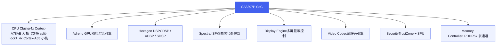
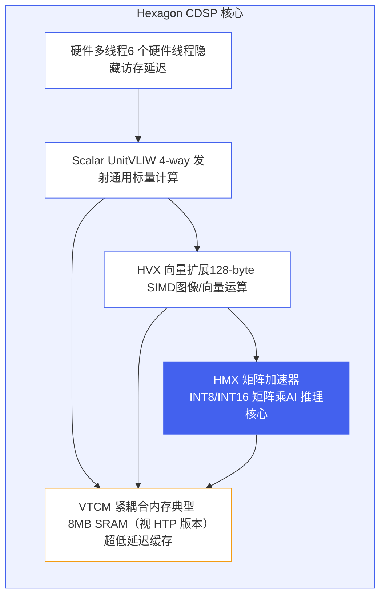
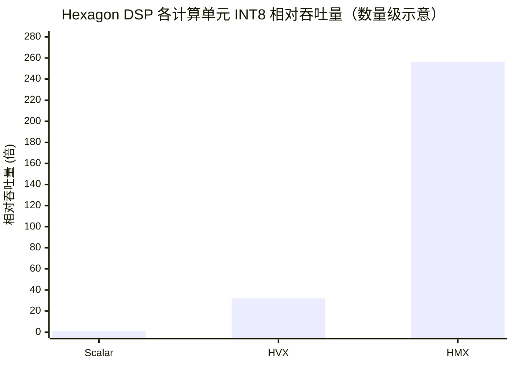
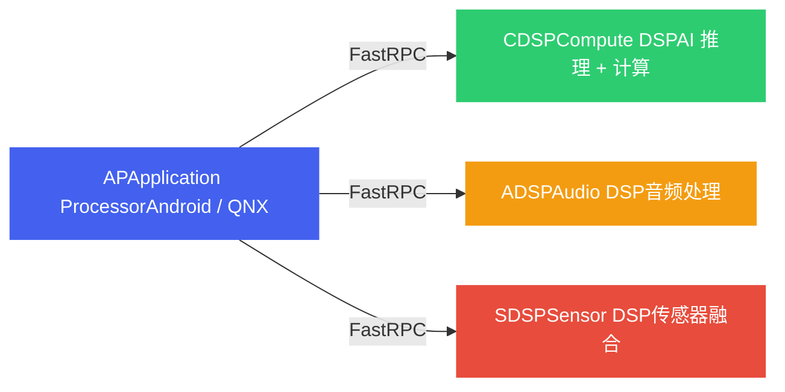
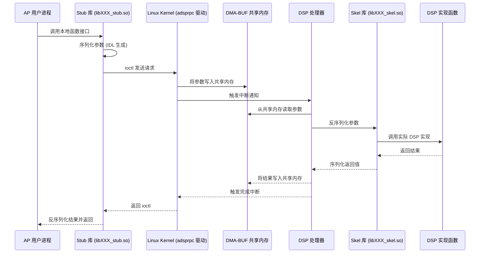
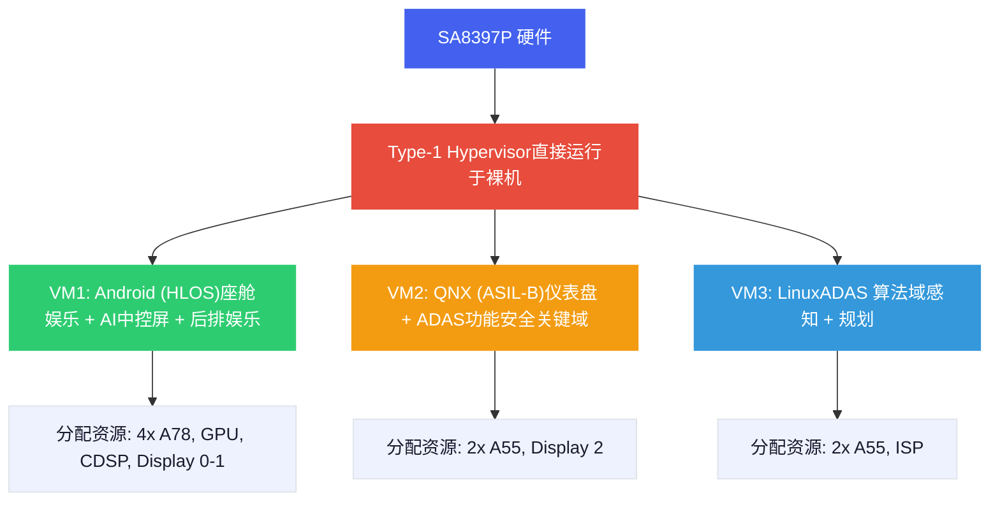
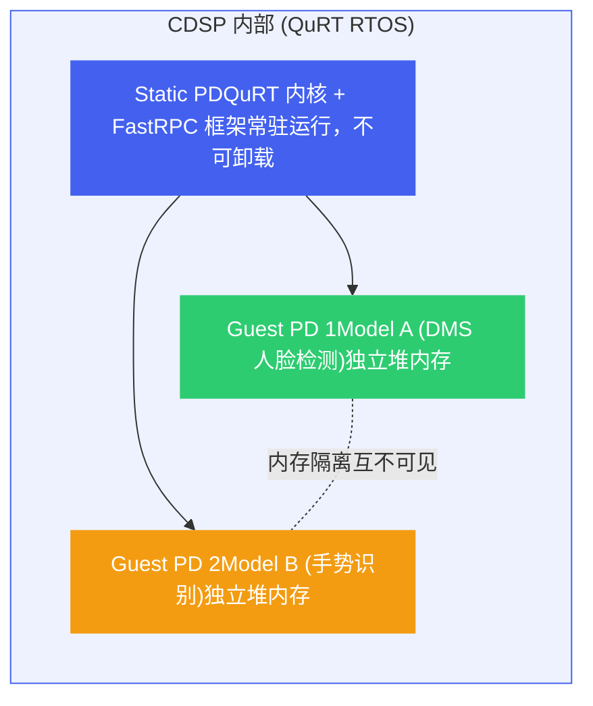
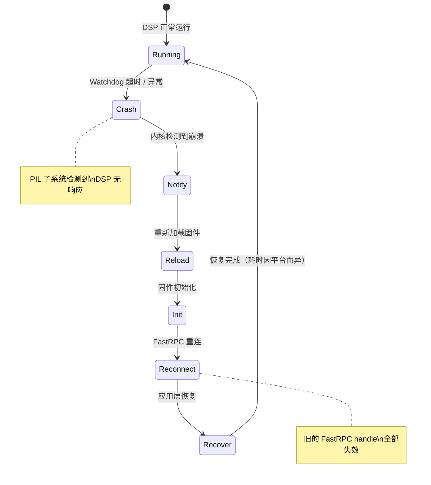
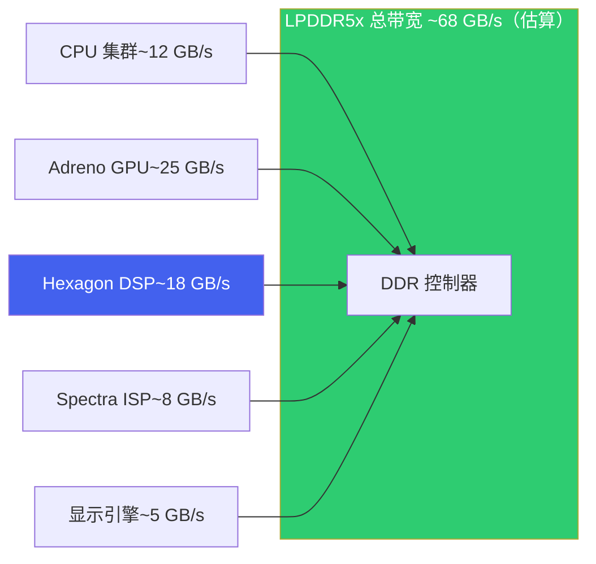

# 1. SA8397P 硬件架构

*Qualcomm Snapdragon Digital Chassis 系列座舱 SoC 硬件全景与 DSP 深度解析*

> [!TIP]
> **本篇讲什么**
>
> 高通 SA8397P 座舱 SoC 的硬件全景与 DSP 深度解析：
>
> - SoC 全景、Hexagon DSP 微架构、三大 DSP 子系统（CDSP/ADSP/SDSP）对比
> - FastRPC 跨处理器通信、Hypervisor 与系统可靠性（PD/SSR）
> - 内存带宽瓶颈、功耗与热管理、竞品芯片横向对比

> [!NOTE]
> **全站数据口径与锚点模型（唯一基准）**
>
> 座舱通识各篇的推导统一基于以下锚点与基准，均在本处定义一次、其余各篇引用：
>
> **锚点模型 · Qwen3-Omni-4B**：项目内部定制的 4B 级全模态模型（**非**公开发布的 Qwen3-Omni 系列——公开版为 30B-A3B MoE）。结构按 4B 级稠密模型的典型配置：36 层、32 个 Q head、8 个 KV head（GQA）、head\_dim 128、hidden 2560、约 4B 参数。
>
> **平台基准 · SA8397P**：内存带宽约 68 GB/s（LPDDR5x，估算）、算力约 70 TOPS INT8（估算）、1 个 cDSP（HTP 计算资源在多个 graph 间时分复用）、VTCM 视 HTP 架构版本而定（典型 8 MB，以 `QnnHtpDevice` 实际查询为准）。车规芯片规格多在 NDA 之下，以上均为估算口径。
>
> **数据口径声明**：本板块各篇**只讲推导方法**（roofline / 带宽模型 / KV Cache 公式），不给"标准答案"式的性能数字。文中出现的个别数值一律为**示例参数**，仅用于演示方法本身、不代表实测；请代入你自己的平台带宽与模型配置计算。

## 1. SA8397P SoC 全景

SA8397P 是高通 Snapdragon Digital Chassis（骁龙数字底盘）系列的高端旗舰 SoC，定位在 SA8295P 之上，目标是实现**座舱（Cockpit）与 ADAS 融合**。它将传统分立的座舱娱乐芯片和 ADAS 处理芯片整合到一颗 SoC 上，降低 BOM 成本、减少线束复杂度，同时通过 Hypervisor 实现功能安全隔离。

> [!NOTE]
> **关于"第几代"的口径**
>
> 各家资料对 Snapdragon Digital Chassis 的代次划分并不统一（如 SA8155P 常被称为"第三代座舱平台"），直接套用代次编号容易误导。本篇不使用代次表述，只描述平台间的相对定位。

### 1.1 SoC 功能模块总览



### 1.2 各模块功能与典型用途

| 模块 | 核心规格 | 主要职责 | 典型用例 |
| :--- | :--- | :--- | :--- |
| **CPU** | 4x A78AE + 4x A55（车规 AE 核，主频为估算） | 通用计算、OS 调度 | Android 座舱 UI、应用运行 |
| **Adreno GPU** | 车规 Adreno（估算） | 3D 渲染、图形合成 | 仪表盘渲染、AR-HUD、游戏 |
| **Hexagon DSP (CDSP)** | HMX + HVX + Scalar | AI 推理加速 | DMS 驾驶员监控、语音降噪 |
| **Hexagon DSP (ADSP)** | HVX + Scalar | 音频处理 | ANC 主动降噪、语音前端 |
| **Hexagon DSP (SDSP)** | Scalar（低功耗） | 传感器融合 | Always-On 碰撞检测 |
| **Spectra ISP** | 三路 ISP，支持 8 路摄像头 | 图像信号处理 | 环视拼接、HDR 合成 |
| **Display Engine** | 最多 4 个显示输出 | 多屏驱动 | 中控屏+仪表+HUD+后排 |
| **Video Codec** | 8K@30fps 解码，4K@60fps 编码 | 视频编解码 | 行车记录仪编码、视频流播放 |
| **Security** | TrustZone + SPU | 安全启动、密钥管理 | DRM、安全 OTA、V2X 签名 |
| **Memory** | LPDDR5x 4266MHz 多通道 | 统一内存访问 | 所有模块共享带宽 |

> [!NOTE]
> **车规 AE 核与 split-lock**
>
> 与消费级 SoC 不同，车规 SoC 的 CPU 采用 ARM 车规增强核（带 **AE** 后缀，如 Cortex-A78AE）。AE 核支持 **split-lock** 配置：split 模式下各核独立运行、性能最大；lock 模式下两个核锁步执行同一指令流并比对结果，可实时检出硬件随机故障。这是 CPU 侧通过 ISO 26262 ASIL 认证的硬件基础，也是 §5 讨论 Hypervisor 与 ASIL-B 时的前提。

> [!NOTE]
> **为什么选择融合 SoC？**
>
> 传统方案使用独立的座舱芯片 + ADAS 芯片（如 SA8155P + SA8540P），需要两套供电、两套散热、以太网互联，BOM 成本高。SA8397P 通过 Hypervisor 在一颗芯片上隔离多个域（Android 座舱 + QNX ADAS），**硬件成本降低约 30%**，同时数据在片内共享，座舱与 ADAS 之间的通信延迟从毫秒级降至微秒级。面试中常见的对比题：一芯多域 vs 多芯方案的 trade-off。

## 2. Hexagon DSP 微架构

Hexagon DSP 是 SA8397P 上运行 AI 推理的核心单元。理解其内部微架构对于模型优化至关重要。以 CDSP（Compute DSP）为例，其内部由多个计算单元协同工作。

### 2.1 内部架构总览



### 2.2 HTP = 品牌名，不是独立硬件

面试高频考点：**HTP（Hexagon Tensor Processor）不是一个独立的硬件模块**，而是高通的品牌命名，指 HMX + HVX + Scalar + VTCM 协同工作时的整体能力。当 QNN 编译器将一个模型 graph 映射到 CDSP 上执行时，矩阵乘法走 HMX、激活函数走 HVX、控制流走 Scalar、数据缓存在 VTCM，这个协同整体就叫 HTP。

- **Scalar Unit**：VLIW 4-way 发射，处理分支、循环控制、地址计算等标量操作
- **HVX**：128-byte 宽 SIMD 向量引擎，适合逐元素运算（ReLU、Add、Sigmoid）和图像处理
- **HMX**：矩阵乘加速器，一拍完成大规模 INT8/INT16 矩阵乘，是 Conv2D/MatMul 的主力
- **VTCM**：紧耦合 SRAM，带宽极高、延迟极低，是性能瓶颈的关键。容量由 HTP 架构版本决定（本平台典型 8MB，见 §2.4/§2.5）
- **硬件多线程**：6 个硬件线程上下文，一个线程等内存时其他线程继续执行，隐藏访存延迟

### 2.3 各计算单元吞吐量对比

以 INT8 推理为基准，不同计算单元的相对吞吐量差异巨大。注意 **HTP 不是独立单元**（见 §2.2），因此只有三根柱；以下数值为**数量级示意（非实测）**：

**Hexagon DSP 各计算单元 INT8 相对吞吐量（数量级示意）**



| 计算单元 | 相对吞吐量 (INT8，数量级示意) | 估算依据 |
| --- | --- | --- |
| Scalar | 1x（基准） | VLIW 4-way 发射，每拍约数个 INT8 运算 |
| HVX | ~32x | 每拍 128 字节 ≈ 128 个 INT8 运算 |
| HMX | ~256x（示例参数） | 矩阵阵列规模随 HTP 版本而异 |

> [!NOTE]
> **自己估算的方法**
>
> 相对吞吐量 ≈ 每拍处理的数据字节数 ÷ 标量每拍运算数。HVX 一拍处理 128 字节（128 个 INT8），HMX 的矩阵阵列比 HVX 再高约一个数量级（示例参数，阵列规模取决于 HTP 架构版本，见 §2.5）。实际项目请以 profiler 实测为准，不要照搬示意值。

### 2.4 存储层级与延迟

Hexagon DSP 的存储层级统一如下表（§6.2 讨论 LLM 推理时沿用同一口径，不再重复列表）。延迟统一用**周期数**作口径：

| 存储层级 | 容量 | 访问延迟 | 带宽 | 说明与 LLM 推理用途 |
| :--- | :--- | :--- | :--- | :--- |
| **HVX 向量寄存器** | 32×128B = 4 KB/线程（double 模式 8 KB） | < 1 周期 | — | 向量计算操作数，最快的存储层 |
| **VTCM** | 典型 8 MB（视 HTP 版本，见 §2.5） | 1-2 周期 | 远高于 DDR（片上直连） | 紧耦合 SRAM，HMX/HVX 直接读写；FlashAttention 分块、权重预取、KV Cache 热数据 |
| **L2 Cache** | ~1-2 MB（估算） | ~10 周期 | ~100-200 GB/s（估算） | DSP 本地缓存 |
| **DDR (LPDDR5x)** | 8-16 GB（共享） | ~100 周期 | 总量 ~68 GB/s（估算）；DSP 实际份额取决于仲裁，见 §6.1 | 模型权重、KV Cache、激活值 |

> 表中延迟为数量级示意，容量与带宽为估算值；以各自平台的实测与 `QnnHtpDevice` 查询为准。

> [!WARNING]
> **VTCM 是性能瓶颈的核心**
>
> VTCM 容量有限（本平台典型 8MB，且随 HTP 版本而异，见 §2.5），而一个大模型层的权重+激活可能远超 VTCM 容量。QNN 编译器会自动进行 **Tiling（分块）**：将大张量切成小块，分批加载到 VTCM 中计算，再写回 DDR。Tiling 策略直接决定了 DDR 访问次数和性能。面试建议：能画出 Tiling 的数据流动图（DDR → VTCM → 计算 → VTCM → DDR）是加分项。

### 2.5 HTP 架构版本对照表

VTCM 容量、HMX 能力等关键参数由 **HTP 架构版本**决定，而不是由芯片市场名决定——这是不同资料中 VTCM 数字互相矛盾的根源。下表为常见移动/座舱平台的对照（**容量为典型配置估算，对应关系为量级参考**）：

| HTP 版本 | 代表平台（估算） | VTCM（典型，估算） | HMX 能力要点 |
| :--- | :--- | :--- | :--- |
| v65 / v66 | 骁龙 855 / 865 时期 | ~1 MB | INT8 为主 |
| v68 | 骁龙 888 (SM8350) | ~4 MB | INT8 / INT16 |
| v69 | 8 Gen 1 (SM8450) | ~4 MB | INT8 / INT16 |
| v73 | 8+ Gen 1 (SM8475) | ~4 MB | INT8 / INT16 |
| v75 | 8 Gen 2 (SM8550) | ~8 MB | INT8 / INT16，FP16 通路增强 |
| v79 | 8 Gen 3 (SM8650) | ~8 MB | 更大 MAC 阵列，FP16 增强 |

> [!NOTE]
> **本平台如何确认**
>
> SA8397P 的 HTP 版本与实际 VTCM 以运行时 `QnnHtpDevice` 查询为准（本站按典型 **8 MB** 作为示例参数）。车规平台的 HTP 版本与移动平台的对应关系未完全公开，上表仅用于建立量级概念。

## 3. DSP 子系统对比

SA8397P 内部有三个独立的 Hexagon DSP 子系统，各自有独立的固件、时钟域和供电域。AP（Application Processor，即 CPU）通过 FastRPC 与它们通信。

### 3.1 三大 DSP 子系统架构



### 3.2 CDSP vs ADSP vs SDSP 详细对比

| 维度 | CDSP | ADSP | SDSP |
| :--- | :--- | :--- | :--- |
| **核心功能** | AI 推理、通用计算 | 音频前端处理、ANC | 传感器融合、低功耗监控 |
| **关键硬件** | HMX + HVX + Scalar + VTCM | HVX + Scalar（无 HMX） | Scalar only（极简） |
| **功耗模式** | 高性能，按需开关 | 中等，常驻运行 | 超低功耗（<5mW） |
| **延迟要求** | 10~100ms（推理帧级） | <1ms（音频实时） | 100ms~1s（传感器采样） |
| **AP 休眠时** | 通常随 AP 关闭 | 可独立运行（低功耗音频） | 完全独立运行（Always-On） |
| **固件格式** | .mbn / .so（签名动态库） | .mbn / .so | .mbn / .so |
| **FastRPC 库** | libcdsprpc.so | libadsprpc.so | libsdsprpc.so |

> [!TIP]
> **SDSP Always-On 场景**
>
> SDSP 最经典的用例是**碰撞检测**：车辆熄火后（AP 进入深度睡眠），SDSP 持续以 <5mW 功耗监听加速度传感器。当检测到异常加速度（碰撞）时，SDSP 唤醒 AP，AP 启动摄像头录像并发送紧急通知。整个唤醒链路通常在百毫秒级（示例参数，取决于固件与存储启动速度）。面试中被问到 "Always-On 传感器" 时，SDSP 是标准答案。

## 4. FastRPC 通信机制

FastRPC（Fast Remote Procedure Call）是高通自研的**跨处理器调用框架**，让 AP 上的用户态进程可以像调用本地函数一样调用 DSP 上的函数。理解 FastRPC 是调试 DSP 部署问题的基础。

### 4.1 调用流程



### 4.2 核心概念对照表

| FastRPC 概念 | 作用说明 | 类比 |
| :--- | :--- | :--- |
| **Stub** | AP 端代理库，封装序列化和 ioctl 调用 | gRPC Client Stub |
| **Skel** | DSP 端骨架库，接收请求并调用实现 | gRPC Server Skeleton |
| **IDL** | 接口定义语言，编译器自动生成 Stub/Skel 代码 | Protobuf / .proto 文件 |
| **共享内存（DMA-BUF / ION）** | AP 与 DSP 共享的物理连续内存区域；Android 13+ 使用 DMA-BUF heap | mmap 共享内存 |
| **Domain** | 目标 DSP 标识（0=ADSP, 3=CDSP, 2=SDSP） | gRPC 的 target endpoint |

### 4.3 共享内存分配示例（DMA-BUF heap）

> [!WARNING]
> **ION 已废弃，Android 13+ 请用 DMA-BUF heap**
>
> `/dev/ion` 自 Android 13 起已从内核移除，由 **DMA-BUF heap**（`/dev/dma_heap/*`）取代。旧 ION 代码迁移要点：`ION_IOC_ALLOC` → `DMA_HEAP_IOCTL_ALLOC`；`heap_id_mask` → 按 `/dev/dma_heap/` 下的堆节点选堆。旧代码中两个高频错误也要一并修掉：① `open("/dev/ion", O_RDONLY)` 应为 `O_RDWR`；② `ION_HEAP_ID_QCOM_SECURE_DISPLAY` 是 DRM 安全显示堆，**应用无法 mmap 读写**，不能拿来做 DSP 共享缓冲，应使用系统堆（system）或 CMA 堆。

```c
/* DMA-BUF heap 共享内存分配 - AP 端 C 代码（Android 13+） */
#include <linux/dma-buf.h>
#include <linux/dma-heap.h>
#include <sys/ioctl.h>
#include <fcntl.h>
#include <sys/mman.h>

int alloc_dmabuf_buffer(size_t size) {
    /* 堆节点名以 ls /dev/dma_heap/ 为准，常见为 system */
    int heap_fd = open("/dev/dma_heap/system", O_RDWR);
    if (heap_fd < 0) {
        perror("open /dev/dma_heap/system failed");
        return -1;
    }

    struct dma_heap_allocation_data alloc_data = {
        .len      = size,
        .fd_flags = O_RDWR | O_CLOEXEC,
    };

    /* 1. 分配物理连续内存，得到 DMA-BUF fd */
    int ret = ioctl(heap_fd, DMA_HEAP_IOCTL_ALLOC, &alloc_data);
    if (ret < 0) {
        perror("DMA_HEAP_IOCTL_ALLOC failed");
        close(heap_fd);
        return -1;
    }

    int buf_fd = alloc_data.fd;

    /* 2. 映射到用户空间虚拟地址（可选，也可以只传 fd 做零拷贝） */
    void *vaddr = mmap(NULL, size,
                       PROT_READ | PROT_WRITE,
                       MAP_SHARED, buf_fd, 0);

    /* 3. 将 buf_fd 传给 FastRPC，DSP 端经 SMMU 映射同一物理内存 */
    /* remote_handle_invoke(..., buf_fd, ...); */

    close(heap_fd);
    return buf_fd;
}
```

> [!WARNING]
> **零拷贝的前提：Cache 一致性**
>
> DMA-BUF 让 AP 与 DSP 共享同一块物理内存，但两侧各有 cache，**不维护一致性就会读到旧数据**——这是零拷贝最隐蔽的 bug（表现为间歇性结果错误，而非崩溃）。规则：
>
> - **CPU 写 → DSP 读**：CPU 写完必须 **flush（clean）** cache line，把脏数据写回内存，DSP 才看得到。
> - **DSP 写 → CPU 读**：DSP 写回内存后，CPU 读前必须 **invalidate** 自己的 cache line，否则会命中旧的缓存副本。
> - 用 `DMA_BUF_IOCTL_SYNC`（`START`/`END` 配对）显式声明访问窗口，内核据此做 sync；或把 buffer 映射为 uncached/write-combine（省 sync 但 CPU 侧访问变慢）。
> - 经 SMMU 映射给 DSP 的是**物理/IOVA 地址**，与 CPU 的虚拟地址指向同一物理页——这正是零拷贝省掉一次内存搬运的原因，但也意味着一致性必须由软件显式维护。

> [!NOTE]
> **FastRPC vs Android Binder**
>
> **Binder** 是 Android 的进程间通信（IPC）机制，用于同一 CPU 上不同进程之间的调用。**FastRPC** 是跨处理器通信（IPC），用于 AP CPU 与 DSP 之间的调用。两者的关键区别：
>
> * Binder 通过内核拷贝传递数据（一次拷贝优化）；FastRPC 通过 DMA-BUF / ION 共享内存实现**零拷贝**
> * Binder 的目标是同一 OS 内核中的进程；FastRPC 的目标是运行不同 RTOS（QuRT）的独立处理器
> * FastRPC 有额外的中断和缓存一致性开销，单次调用延迟通常在几十到几百 µs 量级（示例参数，取决于消息大小与系统负载）

### 4.4 DSP 签名与 testsig

DSP 上运行的代码（skel 库、模型 context binary）在量产设备上**必须经过签名**才能被加载——这是「模型/skel 推不上 DSP」的头号原因，比路径、依赖问题都更常见。

- **PD 归属**：skel 与模型跑在 §5.2 的 Guest（User）PD 中，加载由 Static PD 的 FastRPC 框架校验。
- **开发期 — testsig**：高通允许用 **testsig**（基于目标设备 UID 生成的临时签名）让未正式签名的 skel 在**特定设备**上运行，便于调试；testsig 与设备绑定，换设备需重新生成。
- **量产期 — 正式签名**：走 OEM 的签名链（与 secure boot 信任衔接），testsig 在量产固件上不可用。
- **典型报错**：签名不匹配时 `remote_handle_open` 失败（常见 `AEE_ECONNREFUSED` 或加载直接拒绝），且 logcat 往往只有一句笼统错误。
- **排查顺序**：确认 skel 是否已签名 → testsig 是否匹配当前设备 UID → fastrpc 域权限（shell 能加载、app 不能，多半是 SELinux/域问题而非签名，见岚图篇 SELinux 对比）。

### 4.5 DSP 侧日志：mini-dm

DSP（Hexagon）上的 `printf`/日志不走 Android logcat，**mini-dm 是 DSP 侧日志的唯一出口**。排障 DSP 加载失败、推理异常、skel 崩溃时必看：

- 用法：`adb shell` 里跑高通提供的 `mini-dm`（可用 `-mask` 控制输出级别），把 DSP 侧日志流拉出来。
- skel 里的 `LOG_I`/`printf` 输出、FastRPC 错误码、HTP 加载信息都在这里。
- 经验：`remote_handle_open` 失败、模型加载卡住时，先开 mini-dm 看 DSP 侧到底报什么，再判断是签名、依赖还是内存问题——比在 AP 侧盲猜高效得多。

## 5. Hypervisor 与系统可靠性

SA8397P 通过 Hypervisor 和 Protection Domain 实现多层次的隔离与容错，这是车规级芯片与消费级芯片的核心区别。

### 5.1 Hypervisor 多域架构

SA8397P 采用 Type-1 Hypervisor（直接运行在裸机上），将 SoC 资源划分给多个虚拟机（VM），每个 VM 运行独立的操作系统。



关键特性：

- **硬件级隔离**：每个 VM 有独立的内存空间（SMMU 保护），一个 VM 崩溃不会影响其他 VM
- **资源静态分配**：CPU 核心、GPU 时间片、显示通道在启动时固定分配，避免运行时争抢
- **CDSP 归属**：本站假设 **CDSP 由 HLOS（Android）VM 直接持有**，DMS/OMS/LLM 推理等负载直接跑在其上；其他 VM 如需 DSP 算力，经跨域服务（Hypervisor 共享内存通道上的代理调用）访问。不同 OEM 的划分可能不同（例如把 CDSP 划给功能安全域），讨论时应先声明前提
- **ASIL-B 认证**：QNX 域满足 ISO 26262 ASIL-B 功能安全等级，可运行仪表盘等安全关键功能
- **跨域通信**：VM 之间通过 Hypervisor 提供的共享内存通道通信，延迟通常在微秒级（示例参数，取决于 Hypervisor 实现与消息大小）

### 5.2 Protection Domain（PD）

Protection Domain 是 DSP 内部（QuRT RTOS 上）的隔离机制，类似于 OS 中的进程隔离。每个用户进程在 DSP 上对应一个 Guest PD，彼此之间内存隔离。



PD 隔离的意义：

- **故障隔离**：Guest PD 1 中的模型崩溃不会影响 Guest PD 2 中的模型
- **独立生命周期**：可以单独加载/卸载某个 PD 中的模型，无需重启整个 DSP
- **资源保护**：每个 Guest PD 有独立的堆内存，防止野指针跨域破坏
- **Static PD 常驻**：FastRPC 框架和 QuRT 内核运行在 Static PD 中，是所有 Guest PD 的"管理者"

### 5.3 SSR（Subsystem Restart，子系统重启）

当 DSP 子系统发生不可恢复的错误（如 Watchdog 超时、非法内存访问）时，SSR 机制会自动重启该子系统，而不需要重启整个 SoC。



SSR 恢复没有一个"标准耗时"——它取决于固件大小、模型文件大小、存储读取速度等，应实测并区分**两个时间点**：

1. **固件重载完成**：内核收到 `after_powerup` 事件，DSP 子系统重新可用、FastRPC 通道可以重建。这一阶段以固件加载与 QuRT 初始化为主。
2. **应用层推理恢复**：重新加载模型、重建 QNN Context / graph，直到第一次推理返回结果。这一阶段以模型文件读取和 graph 初始化为主，通常显著长于第一阶段。

面试被问"SSR 要多久"时，先给出这两个阶段与实测方法（分别计时、纳入故障演练验收），而不是背一个数字。

> [!CAUTION]
> **开发者必须处理 SSR 事件！**
>
> SSR 发生后，**所有旧的 FastRPC handle 和 QNN Context 全部失效**。如果应用层不处理 SSR 事件，继续使用旧 handle 调用 DSP 会直接返回错误。正确的处理流程：
>
> 1. 监听 SSR 事件（通过 `/dev/subsys_XXX` 或 rpmsg 通知）
> 2. 收到 "after\_shutdown" 事件后，**清理所有旧的 FastRPC handle**
> 3. 收到 "after\_powerup" 事件后，**重新初始化 QNN Context**（重新加载模型、重建 graph）
> 4. 恢复推理流水线
>
> 常见 Bug：开发者忘记处理 SSR，导致 DSP 重启后推理永久失败，只能重启整机。面试中被问到 "DSP 崩溃了怎么办"，SSR + handle 清理是标准答案。

## 6. 内存带宽瓶颈分析

### 6.1 DDR 带宽共享问题

SA8397P 的 LPDDR5x 提供约 **~68 GB/s** 理论峰值带宽（估算）。这个数字可以用位宽自行推导：`8533 MT/s × 64-bit ÷ 8 ≈ 68.3 GB/s`（示例推导，请代入你自己平台的内存规格）。但这一带宽由 SoC 内的多个模块共享：



图中是各模块的**峰值带宽申请示意**（总和 ≤ 68 GB/s，均为示例估算）；某一时刻的**实际份额**取决于 NoC 仲裁与各模块瞬时负载——例如纯 LLM 推理时 DSP 拿到的份额会远高于图中所示（见下表）。

LLM 推理（Decode 阶段）高度依赖 DDR 带宽。当多个模块同时活跃时，DSP 实际可用带宽可能远低于理论峰值：

| 运行场景 | 活跃模块 | DSP 可用带宽（估算） | LLM Decode 影响 |
| :--- | :--- | :--- | :--- |
| **纯 LLM 推理** | DSP + CPU（少量） | ~50-55 GB/s | 最优：接近带宽 roofline 上限 |
| **LLM + 摄像头** | DSP + ISP + CPU | ~40-45 GB/s | 轻微下降 |
| **LLM + 摄像头 + 渲染** | DSP + ISP + GPU + CPU | ~25-35 GB/s | 明显下降 |
| **多路摄像头 + LLM + 3D 渲染** | 全部模块高负载 | ~15-25 GB/s | 严重下降 |

Decode 上限的定量推导：`tok/s ≈ DSP 可用带宽 × 带宽效率 ÷ 每 token 读取字节数（权重 + KV + 激活）`，推导细节见推理篇；本表只给带宽侧的估算输入，不给实测速度。

> [!WARNING]
> **带宽争抢是端侧 LLM 的隐性杀手**
>
> 实验室环境下的 LLM 推理速度（单独跑模型）与量产环境（多路摄像头 + 3D 仪表盘 + 导航渲染同时运行）可能有 **30-50% 的性能差距**（示例估算，取决于具体负载组合）。性能基准测试必须在**全系统负载**下进行，否则上车后会出现严重的延迟回退。解决方案包括：QoS 带宽优先级配置、LLM 推理与 GPU 渲染时间错开、ISP 数据直通 DSP 减少 DDR 搬运。

### 6.2 VTCM — 片上高速缓存

VTCM（Vector Tightly Coupled Memory）是 Hexagon DSP 的片上 SRAM，本平台典型容量 **8 MB**（视 HTP 架构版本而定，对照表见 §2.5，以 `QnnHtpDevice` 实际查询为准），带宽远高于 DDR（片上访问延迟仅 1-2 个周期）。VTCM 是端侧 LLM 推理优化的关键资源；完整存储层级对照见 §2.4（全站统一口径，此处不再重复列表）。

VTCM 的 8 MB 容量虽然有限，但对 LLM 推理至关重要：FlashAttention 的分块计算、权重预取（double buffering）、以及 HMX 矩阵乘法的 tiling 都依赖 VTCM 作为高速中间缓冲。当 VTCM 不足导致数据溢出到 DDR 时（称为 **VTCM spill**），性能可能下降数倍——具体幅度取决于 spill 频率与 DDR 仲裁情况，请在自己的平台上实测，不要照搬任何"标准倍数"。

## 7. 功耗与热管理

### 7.1 座舱芯片功耗约束

汽车座舱环境的功耗和散热约束远比手机或服务器严格：

| 约束维度 | 座舱要求 | 对比（手机 / 服务器） |
| :--- | :--- | :--- |
| **TDP** | ~20-25W（整个 SoC，估算） | 手机 ~5-8W / 服务器 GPU ~300-400W |
| **散热方式** | 被动散热为主（无风扇），部分车型有散热片 + 导热硅脂 | 手机被动 / 服务器液冷或主动风扇 |
| **工作温度** | -40°C ~ +85°C（车规级） | 手机 0~35°C / 服务器 10~35°C |
| **持续运行** | 需在高温下持续稳定运行（夏季暴晒后启动） | 手机可降频 / 服务器恒温机房 |

### 7.2 功耗模式与 LLM 推理影响

SA8397P 支持动态电压频率调节（DVFS），DSP 频率根据负载自动调节。不同功耗模式对 LLM 推理性能有直接影响（功耗为估算值）：

| 功耗模式 | DSP 频率 | LLM 生成速度 | 功耗（估算） | 适用场景 |
| :--- | :--- | :--- | :--- | :--- |
| **高性能 (Turbo)** | 最高频 | 最高（prefill 提升明显，decode 接近带宽上限） | ~20-25W | 用户主动交互时（说话/触控） |
| **均衡 (Normal)** | 中等频 | 中等 | ~12-15W | 日常运行，主动推荐等后台任务 |
| **省电 (Low Power)** | 低频 | 最低 | ~6-8W | 停车等待、后台待机 |

定量估算方法：decode 上限 ≈ 可用带宽 ÷ 每 token 读取字节数（见 §6.1）。注意 decode 主要是 memory-bound，DSP 锁频对 decode 的影响小于对 prefill/TTFT 的影响；本表不给实测速度。

### 7.3 热降频问题

在高温环境下（如夏季暴晒后），芯片温度可能迅速达到热保护阈值（~100°C 结温，典型值，以平台为准），触发**热降频（Thermal Throttling）**：

```bash
# 节点名随 BSP 版本变化（如 soc:qcom,cdsp 或 soc:qcom,cdsp-cdsp-l3-lat），先确认
ls /sys/class/devfreq/

# 查看当前 DSP 温度和频率
cat /sys/class/thermal/thermal_zone*/temp   # 各区域温度 (milliCelsius)
cat /sys/class/devfreq/<cdsp节点名>/cur_freq  # 当前 CDSP 频率

# 查看是否触发热降频
dmesg | grep -i "thermal\|throttl"

# 锁定高频 (仅开发调试使用，勿在量产环境使用)
echo performance > /sys/class/devfreq/<cdsp节点名>/governor
```

> [!NOTE]
> **热管理最佳实践**
>
> 端侧 LLM 的热管理策略：(1) **按需加载**：用户未交互时将 DSP 降至低频，检测到唤醒词后快速升频；(2) **时间预算分配**：限制连续高负载推理时间（如 Prefill 后插入短暂冷却间隔）；(3) **温度感知调度**：当温度接近阈值时主动降低 batch size 或切换到更小的模型（Qwen3-1.7B）；(4) **避免 GPU 和 DSP 同时满载**：3D 渲染和 LLM 推理交替执行。

### 7.4 DCVS 与主动频率投票

§7.2 讲的是 DVFS 的**被动**现象（系统按负载自动调频）。量产性能调优更需要**主动**控制 DSP 频率——高通的机制是 **DCVS（Dynamic Clock and Voltage Scaling）+ 频率投票**：

- **QnnHtpPerfInfrastructure**：QNN 提供的性能基础设施接口，可对 HTP 做 RPC latency 投票 / power 配置。注意它是**电源/性能投票**接口，不是设任务优先级（任务优先级走 graph/context 配置，见框架篇）。
- **HAP_power_request**（Hexagon power API）：skel 侧可请求电压/频率档位。
- **典型用法**：进入推理（尤其 prefill）前投票升频以缩短延迟；空闲或后台时撤销投票，让 DCVS 降频省电。
- **与热管理联动**：持续投票高频会更快逼近热降频阈值（§7.3），所以升频通常只在交互窗口内短时启用。
- 调试时可用 `/sys/class/devfreq/<cdsp节点名>/` 观察投票前后的频率变化（节点名随 BSP 变化，见 §7.3）。

## 8. 竞品芯片对比

### 8.1 座舱/智驾芯片横向对比

以下对比涵盖当前主流座舱和跨域计算芯片。**数据截至 2026-09，来源为各厂商公开资料；车规芯片规格多为估算，请以厂商官方发布为准**：

| 芯片 | 厂商 | NPU 算力 | 工艺 | 内存 | TDP | 定位 |
| :--- | :--- | :--- | :--- | :--- | :--- | :--- |
| **SA8397P** | Qualcomm | ~70 TOPS (INT8，估算) | 4nm | LPDDR5x, ~68 GB/s（估算） | ~20-25W | 高端座舱，支持端侧 LLM |
| **SA8295P** | Qualcomm | ~30 TOPS (INT8) | 5nm | LPDDR5, ~51 GB/s | ~15-20W | 主流座舱，支持轻量模型 |
| **Drive Orin** | NVIDIA | 254 TOPS (INT8 稀疏, DLA+GPU) | 8nm (Samsung 8N) | LPDDR5, ~205 GB/s | ~45-60W | 智驾 + 座舱跨域 |
| **Thor** | NVIDIA | ~1000 TOPS (FP8 稀疏, GPU) | 4nm | LPDDR5X | ~100W+ | 新一代跨域中央计算（2025 起量产）|
| **Journey 6 系列** | 地平线 | J6B ~10 / J6M ~128 / J6P ~560 TOPS (INT8) | 7nm | LPDDR5 | 因变体而异（估算） | 智驾为主，变体覆盖低中高档 |

> [!NOTE]
> **NVIDIA TOPS 口径**：表中 Drive Orin 254 TOPS 是**车规 DRIVE Orin（INT8 稀疏）**，勿与同 die 的 Jetson AGX Orin（275 TOPS）混用；Thor ~1000 TOPS 是 **FP8 稀疏、单 SoC** 口径（NVIDIA 早期宣传有「2000 TOPS」说法，含 FP4/不同配置，以官方规格书为准），且 FP8 与 Orin/HTP 的 INT8 TOPS **不可直接比大小**。详见 [自动驾驶算力平台](../../ad/general/soc-platform.html) §1。

### 8.2 端侧 LLM 可行性对比

从端侧 LLM 部署的角度，各芯片的关键差异在于 **NPU 算力**、**内存带宽** 和 **功耗预算**：

| 芯片 | 可运行最大 LLM（示例） | Decode 上限（带宽视角，定性） | 关键瓶颈 |
| :--- | :--- | :--- | :--- |
| **SA8397P** | 4B (INT4) — Qwen3-Omni-4B（本站锚点） | 高（68 GB/s 口径） | 带宽 ~68 GB/s 限制 decode 吞吐；算力限制 prefill/TTFT |
| **SA8295P** | 1.7B (INT4) — Qwen3-1.7B | 较低（~51 GB/s 口径） | 带宽 ~51 GB/s 限制 decode 吞吐；算力 30 TOPS 限制 prefill/TTFT |
| **Drive Orin** | 7-8B (INT4) — Qwen3-8B | 较高（~205 GB/s 口径） | 高功耗 (~50W)，被动散热困难 |
| **Thor** | 70B+ (FP8) | 最高（以量产内存配置为准） | 功耗和成本；量产进度取决于车型 SOP |
| **Journey 6（以 J6M 为例）** | 4B (INT8) — 需适配 BPU | 中等（LPDDR5 口径） | LLM 软件栈成熟度（BPU 主要面向 CNN） |

Decode 上限的估算方法：`tok/s ≈ 可用带宽 × 带宽效率 ÷ 每 token 读取字节数（权重 + KV + 激活）`，代入各芯片带宽与自己的模型配置即可得到估计值；本表不给实测速度。"可运行最大 LLM"按"权重装得下 + 带宽可接受"估计，非实测调优结论。

> [!TIP]
> **SA8397P 的竞争优势**
>
> 在座舱端侧 LLM 场景中，SA8397P 的优势在于：(1) **Hexagon DSP 的 LLM 软件栈最成熟**（QNN SDK + Genie Runtime 已量产验证）；(2) **功耗/算力比最优**（~70 TOPS / ~20W，Orin 需要 275 TOPS / ~50W，均为估算口径）；(3) **4nm 工艺**带来更好的能效比和热表现。劣势是**内存带宽偏低**（68 GB/s vs Orin 的 205 GB/s），限制了 Decode 吞吐量上限。后续新平台预计会在内存带宽上有显著提升（以厂商官方路线图为准）。
