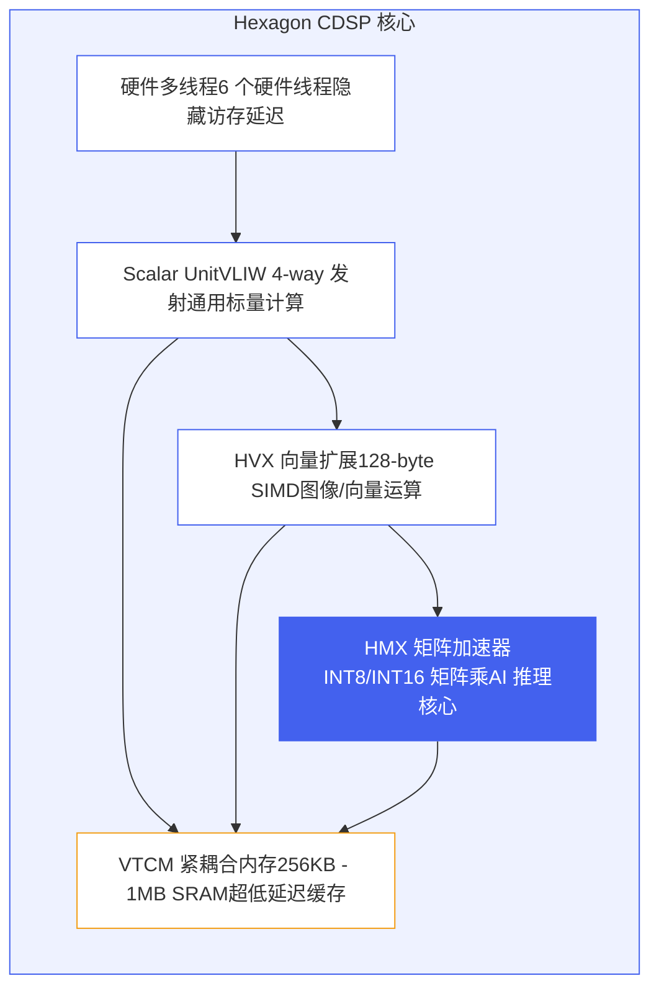
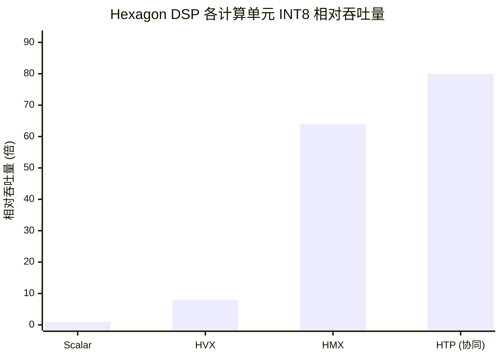
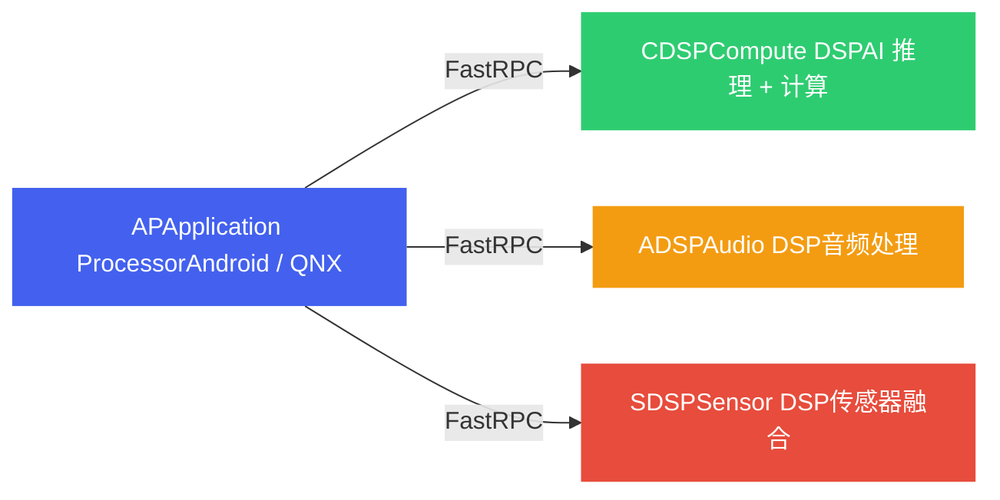
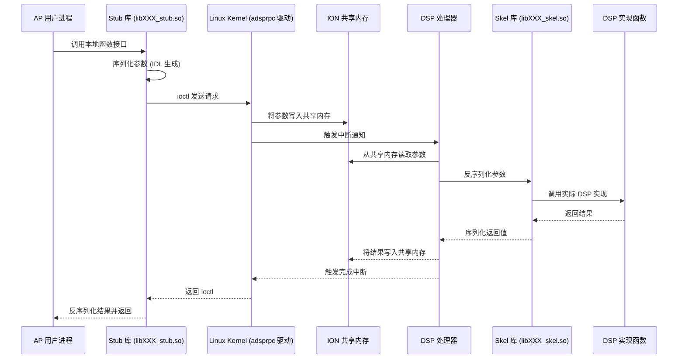
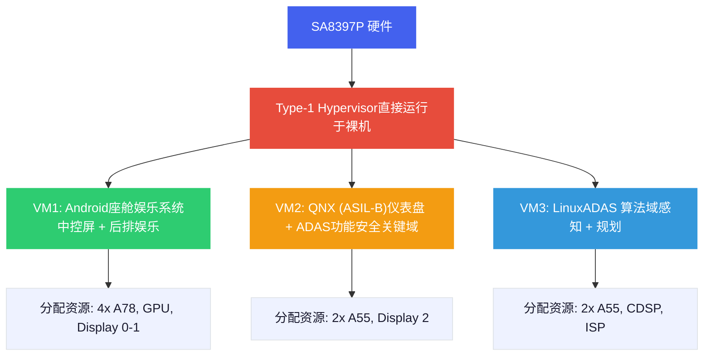
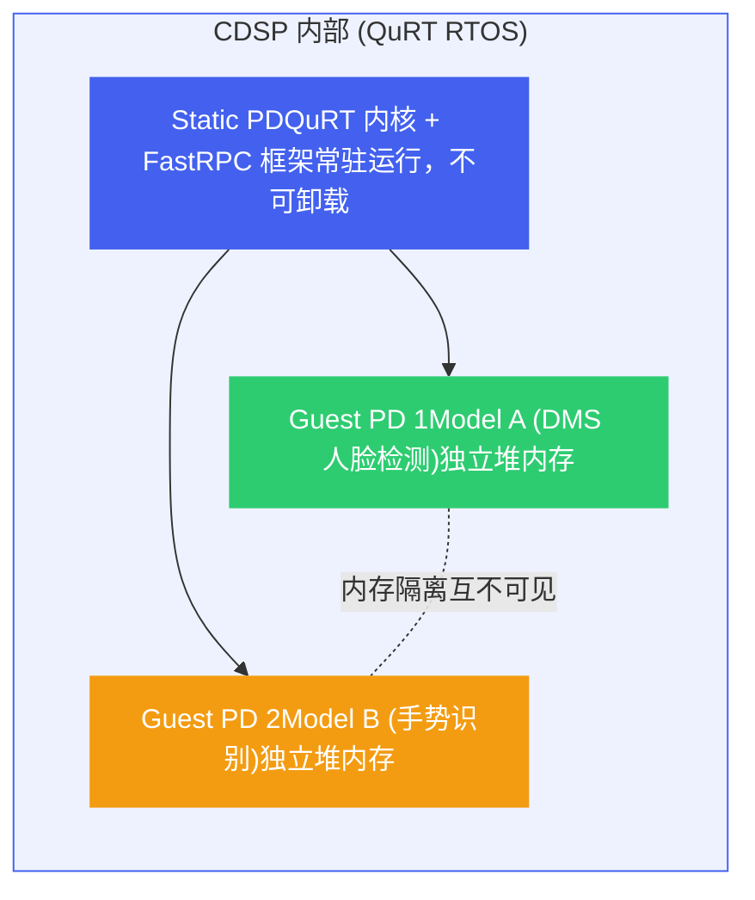
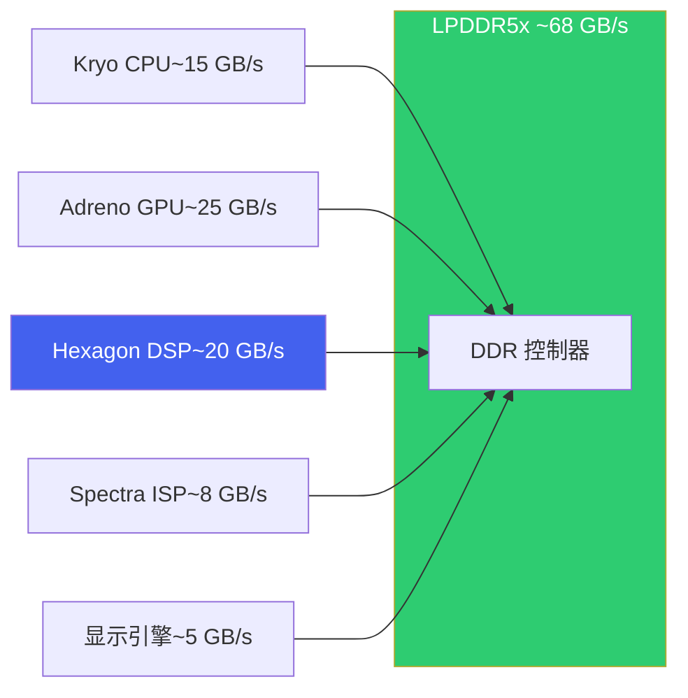

# 1. SA8397P 硬件架构

*Qualcomm 第三代 Snapdragon Digital Chassis 座舱 SoC 硬件全景与 DSP 深度解析*

## 1. SA8397P SoC 全景

SA8397P 是高通第三代 Snapdragon Digital Chassis 平台的旗舰 SoC，目标是实现**座舱（Cockpit）与 ADAS 融合**。它将传统分立的座舱娱乐芯片和 ADAS 处理芯片整合到一颗 SoC 上，降低 BOM 成本、减少线束复杂度，同时通过 Hypervisor 实现功能安全隔离。

### 1.1 SoC 功能模块总览

```mermaid
graph TB
    SOC["SA8397P SoC"]
    SOC --> CPU["CPU Cluster4x Cortex-A78 大核4x Cortex-A55 小核"]
    SOC --> GPU["Adreno GPU图形渲染引擎"]
    SOC --> DSP["Hexagon DSPCDSP / ADSP / SDSP"]
    SOC --> ISP["Spectra ISP图像信号处理器"]
    SOC --> DISP["Display Engine多屏显示控制"]
    SOC --> VIDEO["Video Codec编解码引擎"]
    SOC --> SEC["SecurityTrustZone + SPU"]
    SOC --> MEM["Memory ControllerLPDDR5x 多通道"]

    style SOC fill:#4361ee,color:#fff,stroke:none
    style CPU fill:#eef2ff,color:#1a1a2e,stroke:#4361ee
    style GPU fill:#eef2ff,color:#1a1a2e,stroke:#4361ee
    style DSP fill:#eef2ff,color:#1a1a2e,stroke:#4361ee
    style ISP fill:#eef2ff,color:#1a1a2e,stroke:#4361ee
    style DISP fill:#eef2ff,color:#1a1a2e,stroke:#4361ee
    style VIDEO fill:#eef2ff,color:#1a1a2e,stroke:#4361ee
    style SEC fill:#eef2ff,color:#1a1a2e,stroke:#4361ee
    style MEM fill:#eef2ff,color:#1a1a2e,stroke:#4361ee
```



### 1.2 各模块功能与典型用途

| 模块 | 核心规格 | 主要职责 | 典型用例 |
| :--- | :--- | :--- | :--- |
| **CPU** | 4x A78 @2.5GHz + 4x A55 @1.8GHz | 通用计算、OS 调度 | Android 座舱 UI、应用运行 |
| **Adreno GPU** | Adreno 730 级别 | 3D 渲染、图形合成 | 仪表盘渲染、AR-HUD、游戏 |
| **Hexagon DSP (CDSP)** | HMX + HVX + Scalar | AI 推理加速 | DMS 驾驶员监控、语音降噪 |
| **Hexagon DSP (ADSP)** | HVX + Scalar | 音频处理 | ANC 主动降噪、语音前端 |
| **Hexagon DSP (SDSP)** | Scalar（低功耗） | 传感器融合 | Always-On 碰撞检测 |
| **Spectra ISP** | 三路 ISP，支持 8 路摄像头 | 图像信号处理 | 环视拼接、HDR 合成 |
| **Display Engine** | 最多 4 个显示输出 | 多屏驱动 | 中控屏+仪表+HUD+后排 |
| **Video Codec** | 8K@30fps 解码，4K@60fps 编码 | 视频编解码 | 行车记录仪编码、视频流播放 |
| **Security** | TrustZone + SPU | 安全启动、密钥管理 | DRM、安全 OTA、V2X 签名 |
| **Memory** | LPDDR5x 4266MHz 多通道 | 统一内存访问 | 所有模块共享带宽 |

> [!NOTE]
> **为什么选择融合 SoC？**
>
> 传统方案使用独立的座舱芯片 + ADAS 芯片（如 SA8155P + SA8540P），需要两套供电、两套散热、以太网互联，BOM 成本高。SA8397P 通过 Hypervisor 在一颗芯片上隔离多个域（Android 座舱 + QNX ADAS），**硬件成本降低约 30%**，同时数据在片内共享，座舱与 ADAS 之间的通信延迟从毫秒级降至微秒级。面试中常见的对比题：一芯多域 vs 多芯方案的 trade-off。

## 2. Hexagon DSP 微架构

Hexagon DSP 是 SA8397P 上运行 AI 推理的核心单元。理解其内部微架构对于模型优化至关重要。以 CDSP（Compute DSP）为例，其内部由多个计算单元协同工作。

### 2.1 内部架构总览



### 2.2 HTP = 品牌名，不是独立硬件

面试高频考点：**HTP（Hexagon Tensor Processor）不是一个独立的硬件模块**，而是高通的品牌命名，指 HMX + HVX + Scalar + VTCM 协同工作时的整体能力。当 QNN 编译器将一个模型 graph 映射到 CDSP 上执行时，矩阵乘法走 HMX、激活函数走 HVX、控制流走 Scalar、数据缓存在 VTCM，这个协同整体就叫 HTP。

- **Scalar Unit**：VLIW 4-way 发射，处理分支、循环控制、地址计算等标量操作
- **HVX**：128-byte 宽 SIMD 向量引擎，适合逐元素运算（ReLU、Add、Sigmoid）和图像处理
- **HMX**：矩阵乘加速器，一拍完成大规模 INT8/INT16 矩阵乘，是 Conv2D/MatMul 的主力
- **VTCM**：256KB~1MB 的紧耦合 SRAM，带宽极高、延迟极低，是性能瓶颈的关键
- **硬件多线程**：6 个硬件线程上下文，一个线程等内存时其他线程继续执行，隐藏访存延迟

### 2.3 各计算单元吞吐量对比

以 INT8 推理为基准，不同计算单元的相对吞吐量差异巨大：

**Hexagon DSP 各计算单元 INT8 相对吞吐量**



| 计算单元 | 相对吞吐量 (INT8) |
| --- | --- |
| Scalar | 1x |
| HVX | 8x |
| HMX | 64x |
| HTP (协同) | 80x |

### 2.4 存储层级与延迟

| 存储层级 | 容量 | 带宽 | 典型延迟 | 说明 |
| :--- | :--- | :--- | :--- | :--- |
| **VTCM** | 256KB ~ 1MB | ~200 GB/s | ~1 ns | 紧耦合 SRAM，HMX/HVX 直接读写 |
| **L2 Cache** | ~1MB | ~100 GB/s | ~10 ns | DSP 本地 L2 缓存 |
| **DDR (LPDDR5x)** | 8~16 GB（共享） | ~30 GB/s（DSP 份额） | ~100 ns | 与 CPU/GPU 共享，需要仲裁 |

> [!WARNING]
> **VTCM 是性能瓶颈的核心**
>
> VTCM 容量有限（通常 1MB），而一个 Conv2D 层的权重+激活可能远超 1MB。QNN 编译器会自动进行 **Tiling（分块）**：将大张量切成小块，分批加载到 VTCM 中计算，再写回 DDR。Tiling 策略直接决定了 DDR 访问次数和性能。面试建议：能画出 Tiling 的数据流动图（DDR → VTCM → 计算 → VTCM → DDR）是加分项。

## 3. DSP 子系统对比

SA8397P 内部有三个独立的 Hexagon DSP 子系统，各自有独立的固件、时钟域和供电域。AP（Application Processor，即 CPU）通过 FastRPC 与它们通信。

### 3.1 三大 DSP 子系统架构



### 3.2 CDSP vs ADSP vs SDSP 详细对比

| 维度 | CDSP | ADSP | SDSP |
| :--- | :--- | :--- | :--- |
| **核心功能** | AI 推理、通用计算 | 音频前端处理、ANC | 传感器融合、低功耗监控 |
| **关键硬件** | HMX + HVX + Scalar + VTCM | HVX + Scalar（无 HMX） | Scalar only（极简） |
| **功耗模式** | 高性能，按需开关 | 中等，常驻运行 | 超低功耗（<5mW） |
| **延迟要求** | 10~100ms（推理帧级） | <1ms（音频实时） | 100ms~1s（传感器采样） |
| **AP 休眠时** | 通常随 AP 关闭 | 可独立运行（低功耗音频） | 完全独立运行（Always-On） |
| **固件格式** | .mbn / .so（签名动态库） | .mbn / .so | .mbn / .so |
| **FastRPC 库** | libcdsprpc.so | libadsprpc.so | libsdsprpc.so |

> [!TIP]
> **SDSP Always-On 场景**
>
> SDSP 最经典的用例是**碰撞检测**：车辆熄火后（AP 进入深度睡眠），SDSP 持续以 <5mW 功耗监听加速度传感器。当检测到异常加速度（碰撞）时，SDSP 唤醒 AP，AP 启动摄像头录像并发送紧急通知。整个唤醒链路约 200ms。面试中被问到 "Always-On 传感器" 时，SDSP 是标准答案。

## 4. FastRPC 通信机制

FastRPC（Fast Remote Procedure Call）是高通自研的**跨处理器调用框架**，让 AP 上的用户态进程可以像调用本地函数一样调用 DSP 上的函数。理解 FastRPC 是调试 DSP 部署问题的基础。

### 4.1 调用流程



### 4.2 核心概念对照表

| FastRPC 概念 | 作用说明 | 类比 |
| :--- | :--- | :--- |
| **Stub** | AP 端代理库，封装序列化和 ioctl 调用 | gRPC Client Stub |
| **Skel** | DSP 端骨架库，接收请求并调用实现 | gRPC Server Skeleton |
| **IDL** | 接口定义语言，编译器自动生成 Stub/Skel 代码 | Protobuf / .proto 文件 |
| **ION 共享内存** | AP 与 DSP 共享的物理连续内存区域 | mmap 共享内存 |
| **Domain** | 目标 DSP 标识（0=ADSP, 3=CDSP, 2=SDSP） | gRPC 的 target endpoint |

### 4.3 ION 共享内存分配示例

```
/* ION 共享内存分配 - AP 端 C 代码 */
#include <linux/ion.h>
#include <sys/ioctl.h>
#include <fcntl.h>

int alloc_ion_buffer(int size) {
    int ion_fd = open("/dev/ion", O_RDONLY);
    if (ion_fd < 0) {
        perror("open /dev/ion failed");
        return -1;
    }

    struct ion_allocation_data alloc_data = {
        .len       = size,
        .heap_id_mask = ION_HEAP_ID_QCOM_SECURE_DISPLAY,  /* 安全堆 */
        .flags     = ION_FLAG_CACHED,
    };

    /* 1. 分配物理连续内存 */
    int ret = ioctl(ion_fd, ION_IOC_ALLOC, &alloc_data);
    if (ret < 0) {
        perror("ION_IOC_ALLOC failed");
        close(ion_fd);
        return -1;
    }

    /* 2. 获取文件描述符用于 mmap */
    int map_fd = alloc_data.fd;

    /* 3. 映射到用户空间虚拟地址 */
    void *vaddr = mmap(NULL, size,
                       PROT_READ | PROT_WRITE,
                       MAP_SHARED, map_fd, 0);

    /* 4. 将 map_fd 传给 FastRPC，DSP 端可直接访问同一物理内存 */
    /* remote_handle_invoke(..., map_fd, ...); */

    close(ion_fd);
    return map_fd;
}
```

> [!NOTE]
> **FastRPC vs Android Binder**
>
> **Binder** 是 Android 的进程间通信（IPC）机制，用于同一 CPU 上不同进程之间的调用。**FastRPC** 是跨处理器通信（IPC），用于 AP CPU 与 DSP 之间的调用。两者的关键区别：
>
> * Binder 通过内核拷贝传递数据（一次拷贝优化）；FastRPC 通过 ION 共享内存实现**零拷贝**
> * Binder 的目标是同一 OS 内核中的进程；FastRPC 的目标是运行不同 RTOS（QuRT）的独立处理器
> * FastRPC 有额外的中断和缓存一致性开销，单次调用延迟约 50~200us

## 5. Hypervisor 与系统可靠性

SA8397P 通过 Hypervisor 和 Protection Domain 实现多层次的隔离与容错，这是车规级芯片与消费级芯片的核心区别。

### 5.1 Hypervisor 多域架构

SA8397P 采用 Type-1 Hypervisor（直接运行在裸机上），将 SoC 资源划分给多个虚拟机（VM），每个 VM 运行独立的操作系统。



关键特性：

- **硬件级隔离**：每个 VM 有独立的内存空间（SMMU 保护），一个 VM 崩溃不会影响其他 VM
- **资源静态分配**：CPU 核心、GPU 时间片、显示通道在启动时固定分配，避免运行时争抢
- **ASIL-B 认证**：QNX 域满足 ISO 26262 ASIL-B 功能安全等级，可运行仪表盘等安全关键功能
- **跨域通信**：VM 之间通过 Hypervisor 提供的共享内存通道通信，延迟 <100us

### 5.2 Protection Domain（PD）

Protection Domain 是 DSP 内部（QuRT RTOS 上）的隔离机制，类似于 OS 中的进程隔离。每个用户进程在 DSP 上对应一个 Guest PD，彼此之间内存隔离。



PD 隔离的意义：

- **故障隔离**：Guest PD 1 中的模型崩溃不会影响 Guest PD 2 中的模型
- **独立生命周期**：可以单独加载/卸载某个 PD 中的模型，无需重启整个 DSP
- **资源保护**：每个 Guest PD 有独立的堆内存，防止野指针跨域破坏
- **Static PD 常驻**：FastRPC 框架和 QuRT 内核运行在 Static PD 中，是所有 Guest PD 的"管理者"

### 5.3 SSR（Subsystem Restart，子系统重启）

当 DSP 子系统发生不可恢复的错误（如 Watchdog 超时、非法内存访问）时，SSR 机制会自动重启该子系统，而不需要重启整个 SoC。

```mermaid
stateDiagram-v2
    [*] --> Running : DSP 正常运行
    Running --> Crash : Watchdog 超时 / 异常
    Crash --> Notify : 内核检测到崩溃
    Notify --> Reload : 重新加载固件
    Reload --> Init : 固件初始化
    Init --> Reconnect : FastRPC 重连
    Reconnect --> Recover : 应用层恢复
    Recover --> Running : 恢复完成 (~1-3s)

    note right of Crash : PIL 子系统检测到\nDSP 无响应
    note right of Reconnect : 旧的 FastRPC handle\n全部失效
```



SSR 恢复流程耗时约 **1~3 秒**，包括固件重新加载、QuRT 初始化、FastRPC 通道重建等步骤。

> [!CAUTION]
> **开发者必须处理 SSR 事件！**
>
> SSR 发生后，**所有旧的 FastRPC handle 和 QNN Context 全部失效**。如果应用层不处理 SSR 事件，继续使用旧 handle 调用 DSP 会直接返回错误。正确的处理流程：
>
> 1. 监听 SSR 事件（通过 `/dev/subsys_XXX` 或 rpmsg 通知）
> 2. 收到 "after\_shutdown" 事件后，**清理所有旧的 FastRPC handle**
> 3. 收到 "after\_powerup" 事件后，**重新初始化 QNN Context**（重新加载模型、重建 graph）
> 4. 恢复推理流水线
>
> 常见 Bug：开发者忘记处理 SSR，导致 DSP 重启后推理永久失败，只能重启整机。面试中被问到 "DSP 崩溃了怎么办"，SSR + handle 清理是标准答案。

## 6. 内存带宽瓶颈分析

### 6.1 DDR 带宽共享问题

SA8397P 的 LPDDR5x 提供约 **~68 GB/s** 理论峰值带宽，但这一带宽由 SoC 内的多个模块共享：



LLM 推理（Decode 阶段）高度依赖 DDR 带宽。当多个模块同时活跃时，DSP 实际可用带宽可能远低于理论峰值：

| 运行场景 | 活跃模块 | DSP 可用带宽（估算） | LLM Decode 影响 |
| :--- | :--- | :--- | :--- |
| **纯 LLM 推理** | DSP + CPU（少量） | ~50-55 GB/s | 最优：~14 tok/s |
| **LLM + 摄像头** | DSP + ISP + CPU | ~40-45 GB/s | 轻微下降：~12 tok/s |
| **LLM + 摄像头 + 渲染** | DSP + ISP + GPU + CPU | ~25-35 GB/s | 明显下降：~8-10 tok/s |
| **多路摄像头 + LLM + 3D 渲染** | 全部模块高负载 | ~15-25 GB/s | 严重下降：~5-7 tok/s |

> [!WARNING]
> **带宽争抢是端侧 LLM 的隐性杀手**
>
> 实验室环境下的 LLM 推理速度（单独跑模型）与量产环境（多路摄像头 + 3D 仪表盘 + 导航渲染同时运行）可能有 **30-50% 的性能差距**。性能基准测试必须在**全系统负载**下进行，否则上车后会出现严重的延迟回退。解决方案包括：QoS 带宽优先级配置、LLM 推理与 GPU 渲染时间错开、ISP 数据直通 DSP 减少 DDR 搬运。

### 6.2 VTCM — 片上高速缓存

VTCM（Vector Tightly Coupled Memory）是 Hexagon DSP 的片上 SRAM，容量约 **4MB**，带宽远高于 DDR（片上访问延迟仅 1-2 个周期）。VTCM 是端侧 LLM 推理优化的关键资源：

| 存储层级 | 容量 | 访问延迟 | 带宽 | LLM 推理用途 |
| :--- | :--- | :--- | :--- | :--- |
| **HVX 寄存器** | ~32 KB | < 1 周期 | — | 向量计算操作数 |
| **VTCM** | ~4 MB | 1-2 周期 | 远高于 DDR | FlashAttention 分块、权重预取、KV Cache 热数据 |
| **L2 Cache** | ~1-2 MB | ~10 周期 | ~200 GB/s | 通用缓存 |
| **DDR (LPDDR5x)** | 8-16 GB | ~100 周期 | ~68 GB/s | 模型权重、KV Cache、激活值 |

VTCM 的 4MB 容量虽然有限，但对 LLM 推理至关重要：FlashAttention 的分块计算、权重预取（double buffering）、以及 HMX 矩阵乘法的 tiling 都依赖 VTCM 作为高速中间缓冲。当 VTCM 不足导致数据溢出到 DDR 时（称为 **VTCM spill**），性能可能下降 3-5 倍。

## 7. 功耗与热管理

### 7.1 座舱芯片功耗约束

汽车座舱环境的功耗和散热约束远比手机或服务器严格：

| 约束维度 | 座舱要求 | 对比（手机 / 服务器） |
| :--- | :--- | :--- |
| **TDP** | ~20-25W（整个 SoC） | 手机 ~5-8W / 服务器 GPU ~300-400W |
| **散热方式** | 被动散热为主（无风扇），部分车型有散热片 + 导热硅脂 | 手机被动 / 服务器液冷或主动风扇 |
| **工作温度** | -40°C ~ +85°C（车规级） | 手机 0~35°C / 服务器 10~35°C |
| **持续运行** | 需在高温下持续稳定运行（夏季暴晒后启动） | 手机可降频 / 服务器恒温机房 |

### 7.2 功耗模式与 LLM 推理影响

SA8397P 支持动态电压频率调节（DVFS），DSP 频率根据负载自动调节。不同功耗模式对 LLM 推理性能有直接影响：

| 功耗模式 | DSP 频率 | LLM 生成速度 | 功耗 | 适用场景 |
| :--- | :--- | :--- | :--- | :--- |
| **高性能 (Turbo)** | 最高频 | ~12-14 tok/s | ~20-25W | 用户主动交互时（说话/触控） |
| **均衡 (Normal)** | 中等频 | ~8-10 tok/s | ~12-15W | 日常运行，主动推荐等后台任务 |
| **省电 (Low Power)** | 低频 | ~4-6 tok/s | ~6-8W | 停车等待、后台待机 |

### 7.3 热降频问题

在高温环境下（如夏季暴晒后），芯片温度可能迅速达到热保护阈值（~100°C 结温），触发**热降频（Thermal Throttling）**：

```
# 查看当前 DSP 温度和频率
cat /sys/class/thermal/thermal_zone*/temp   # 各区域温度 (milliCelsius)
cat /sys/class/devfreq/soc:qcom,cdsp/cur_freq  # 当前 CDSP 频率

# 查看是否触发热降频
dmesg | grep -i "thermal\|throttl"

# 锁定高频 (仅开发调试使用，勿在量产环境使用)
echo performance > /sys/class/devfreq/soc:qcom,cdsp/governor
```

> [!NOTE]
> **热管理最佳实践**
>
> 端侧 LLM 的热管理策略：(1) **按需加载**：用户未交互时将 DSP 降至低频，检测到唤醒词后快速升频；(2) **时间预算分配**：限制连续高负载推理时间（如 Prefill 后插入短暂冷却间隔）；(3) **温度感知调度**：当温度接近阈值时主动降低 batch size 或切换到更小的模型（Qwen3-1.7B）；(4) **避免 GPU 和 DSP 同时满载**：3D 渲染和 LLM 推理交替执行。

## 8. 竞品芯片对比

### 8.1 座舱/智驾芯片横向对比

以下对比涵盖当前主流座舱和跨域计算芯片，数据来源于各厂商公开资料：

| 芯片 | 厂商 | NPU 算力 | 工艺 | 内存 | TDP | 定位 |
| :--- | :--- | :--- | :--- | :--- | :--- | :--- |
| **SA8397P** | Qualcomm | ~70 TOPS (INT8) | 4nm | LPDDR5x, ~68 GB/s | ~20-25W | 高端座舱，支持端侧 LLM |
| **SA8295P** | Qualcomm | ~30 TOPS (INT8) | 5nm | LPDDR5, ~51 GB/s | ~15-20W | 主流座舱，支持轻量模型 |
| **Drive Orin** | NVIDIA | 275 TOPS (INT8, DLA+GPU) | 7nm (Samsung) | LPDDR5, ~205 GB/s | ~45-60W | 智驾 + 座舱跨域 |
| **Thor** | NVIDIA | ~2000 TOPS (FP8, GPU) | 4nm | HBM/LPDDR5x | ~100W+ | 下一代跨域中央计算 |
| **Journey 6** | 地平线 | ~128 TOPS (INT8, BPU Nash) | 7nm | LPDDR5 | ~25-35W | 智驾为主，可扩展座舱 |
| **CT-X1** | 联发科 | ~46 TOPS (APU) | 4nm | LPDDR5x | ~15-20W | 座舱娱乐 + AI 助手 |

### 8.2 端侧 LLM 可行性对比

从端侧 LLM 部署的角度，各芯片的关键差异在于 **NPU 算力**、**内存带宽** 和 **功耗预算**：

| 芯片 | 可运行最大 LLM | Decode 速度估算 | 关键瓶颈 |
| :--- | :--- | :--- | :--- |
| **SA8397P** | 4B (INT4) — Qwen3-Omni-4B | ~10-14 tok/s | DDR 带宽 68 GB/s 限制 Decode |
| **SA8295P** | 1.7B (INT4) — Qwen3-1.7B | ~15-20 tok/s | 算力 30 TOPS 限制可承载模型大小 |
| **Drive Orin** | 7-8B (INT4) — Qwen3-8B | ~20-30 tok/s | 高功耗 (~50W)，被动散热困难 |
| **Thor** | 70B+ (FP8) | ~50-100+ tok/s | 功耗和成本，预计 2025+ 量产 |
| **Journey 6** | 4B (INT8) — 需适配 BPU | ~8-12 tok/s | LLM 软件栈成熟度（BPU 主要面向 CNN） |
| **CT-X1** | 1.7-3B (INT4) | ~10-15 tok/s | NPU 算力较低，适合轻量 LLM |

> [!TIP]
> **SA8397P 的竞争优势**
>
> 在座舱端侧 LLM 场景中，SA8397P 的优势在于：(1) **Hexagon DSP 的 LLM 软件栈最成熟**（QNN SDK + Genie Runtime 已量产验证）；(2) **功耗/算力比最优**（~70 TOPS / ~20W，Orin 需要 275 TOPS / ~50W）；(3) **4nm 工艺**带来更好的能效比和热表现。劣势是**内存带宽偏低**（68 GB/s vs Orin 的 205 GB/s），限制了 Decode 吞吐量上限。未来 SA8797P 等新一代芯片预计会在带宽上有显著提升。
