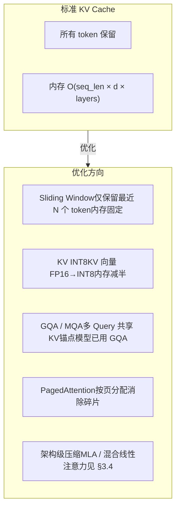
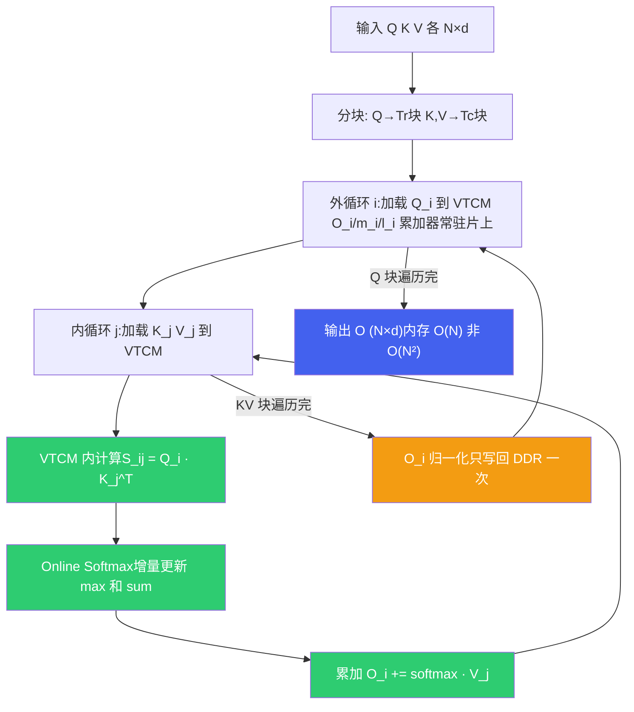
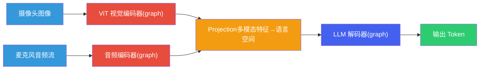

# LLM 推理原理与性能模型

*基于 Qualcomm SA8397P 平台  |  Prefill/Decode · Roofline · KV Cache · FlashAttention · Genie/QAIRT*

> [!TIP]
> **本篇讲什么**
>
> 座舱端侧 LLM 推理的**理论主干**——从原《推理优化》拆出的核心，另两篇（量化、解码服务化）都建立在这里之上：
>
> - Prefill / Decode 两阶段的本质差异与算术强度
> - Roofline 性能模型：如何判断一个任务是算力瓶颈还是带宽瓶颈
> - KV Cache 内存公式、FlashAttention 的 VTCM 分块
> - 单 cDSP 上 ViT 与 LLM 的多 graph 并发与 HTP 时分复用
> - 推理运行时选型（Genie / QAIRT）、端侧 Tokenizer / Detokenizer
>
> 量化方法见 [端侧模型量化与压缩](quantization.html)；前缀缓存、投机采样、约束解码、端到端延迟见 [端侧解码与服务化优化](infer-serving.html)。

> [!NOTE]
> **锚点模型与数据口径（与全站一致）**
>
> 本篇以 **Qwen3-Omni-4B** 为锚点模型——**项目内部定制的 4B 级全模态模型**（并非公开发布的 Qwen3-Omni 系列，公开版为 30B-A3B MoE）。唯一配置基准：**36 层、32 个 Q head、8 个 KV head（GQA）、head\_dim 128、hidden 2560、约 4B 参数，INT4 权重约 2.5 GB**。
>
> **平台基准 · SA8397P**：内存带宽约 68 GB/s（估算）、算力约 70 TOPS INT8（估算）、**1 个 cDSP**（HTP 计算资源在多个 graph 间时分复用）、VTCM 典型 8 MB（估算，以 `QnnHtpDevice` 实际查询为准）。完整口径见 [硬件架构](hardware.html) 顶部「全站数据口径与锚点模型」NOTE。
>
> 本篇遵循全站「**只讲方法不给数**」约定：文中出现的个别数值一律为**示例参数**，仅用于演示推导方法、不代表实测，请代入你自己的平台与模型配置计算。

## 1. Prefill / Decode 两阶段

### 1.1 两阶段本质差异

LLM 自回归推理分为两个计算特性截然不同的阶段。理解这一区分是所有推理优化的基础：

| 维度 | Prefill（预填充） | Decode（解码） |
| :--- | :--- | :--- |
| **处理方式** | 并行处理 S 个输入 token | 逐个生成 token（自回归） |
| **每步计算量** | ~2N × S FLOPs（N=参数量） | ~2N FLOPs / token |
| **权重读取** | 读全部权重 1 次，服务 S 个 token | 每生成 1 个 token 都要读全部权重 |
| **算术强度（W4A16）** | ~4×S OPs/Byte | ~4×B OPs/Byte（B=1 时 ~4） |
| **瓶颈类型** | Compute-bound（S 足够大时） | Memory-bound（B=1 时，见 §2.2） |
| **核心指标** | TTFT（Time To First Token） | TPOT（Time Per Output Token） |
| **输出** | 首 token + 完整 KV Cache | 每步 1 个 token + 追加 KV |

> [!NOTE]
> **TTFT 与 TPOT 是两条不同的优化路径**
>
> 两阶段的瓶颈类型不同，决定了优化手段各归一边：
>
> - **TTFT（Prefill 侧，算力受限）**：靠前缀缓存、降低视觉 token 数、提升 prefill MFU、调度降排队——**权重量化对 TTFT 基本无用**（prefill 已 compute-bound，matmul 仍走 FP16 通路）。
> - **TPOT（Decode 侧，带宽受限）**：靠减少每 token 读取字节——W4A16 权重、GQA/MLA、KV INT8、词表/LM head 优化，以及 batching 抬 AI。
>
> 把某个手段说成"既降 TTFT 又降 TPOT"之前，先判它作用在哪个阶段。两路径的完整归位表见 [端侧解码与服务化优化 · TTFT 优化 / 端到端优化](infer-serving.html)。

### 1.2 算术强度：别只算权重字节

**算术强度**（Arithmetic Intensity, AI = FLOPs ÷ Bytes）是判断瓶颈类型的关键量。以线性层 `y = x·W` 为例：

```text
FLOPs = 2 × batch × H_in × H_out

每步从 DDR 搬运的字节并不只有权重，完整写法是:
  Bytes = W_bytes + KV_bytes(seq_len) + act_bytes

  AI = FLOPs / Bytes
```

> [!WARNING]
> **常见误用：AI 只除权重字节**
>
> 简化式 `AI ≈ 2×batch / bytes_per_weight` 只在"权重读取占绝对主导"时成立。**长上下文 decode 时，KV Cache 的读取量会随 seq\_len 线性增长，甚至反超权重成为主导**——此时必须把 `KV_bytes(seq_len)` 算进分母，否则会高估算术强度、误判 bound 类型。权重 INT4 时：Prefill `AI ≈ 4S`，Decode（短上下文）`AI ≈ 4`。
>
> **把"反超点"量化**（示例参数）：权重读取约 2.5 GB/token 趟（§2.3），KV 读取 144 KB/token（FP16，§3.1），则 KV 读取追平权重读取需要 `2.5 GB ÷ 144 KB ≈ 1.7 万 token` 的上下文；INT8 KV（72 KB/token）则约 3.4 万 token。座舱典型上下文远小于此——**权重仍主导、简化式成立**；但方法上必须保留 `KV_bytes(seq_len)` 项：一旦进入长上下文场景，该项会成为主导项。

> [!IMPORTANT]
> **同一句话对 Prefill 也成立：别只算权重字节（漏掉的是激活）**
>
> Decode 漏的是 KV，**Prefill 漏的是激活**。`AI ≈ 4S` 只把权重放进分母，但 prefill 时 S 个 token 的中间激活（hidden、QKV、MLP intermediate 等）也要在 DDR 与片上之间往返，其字节数同样随 S 线性增长。完整写法：
>
> ```text
> AI_prefill(S) = 2·N·S / (W_bytes + A·S)
>   W_bytes : 权重，读一次，与 S 无关
>   A       : 每 token 的激活 DDR 往返字节（示例：锚点约 MB 量级/token）
> ```
>
> 关键结论：**AI_prefill 不会随 S 无限增长，而是趋于饱和值 `2N/A`**（示例参数下约数千 OPs/Byte）。饱和值仍远高于 Knee（§2.2 的 250~515），所以"prefill 在 S 较大时 compute-bound"的结论不变；但**不能拿 `4S` 外推到很大 S 去声称算力强度无限攀升**——激活项给它封了顶。§2.2 的 compute-bound 阈值用的是只含权重的简化式，量级与完整式一致（都在 S 百级），结论稳健。

## 2. Roofline 性能模型

### 2.1 Roofline 与 Knee Point

Roofline 模型（Williams et al., 2009）把硬件的峰值算力与内存带宽统一在一张图上：任务的算术强度低于 **Knee Point**（计算/带宽比）就是 Memory-bound，高于则 Compute-bound。

```text
Knee Point = 峰值算力 ÷ 内存带宽
任务 AI < Knee Point → Memory-bound（速度由带宽决定）
任务 AI > Knee Point → Compute-bound（速度由算力决定）
```

### 2.2 关键修正：Knee Point 要用"执行模式"的峰值算力

> [!IMPORTANT]
> **量纲必须对齐：W4A16 负载不能用 INT8 TOPS 去判 bound。**
>
> 锚点 LLM 在 HTP 上以 **W4A16** 执行——权重 INT4、激活 FP16，matmul 走 **FP16 通路、FP32 累加**（见 [量化 · W4A16](quantization.html)）。HMX 的 FP16 峰值算力**低于** INT8 TOPS（同口径下常见约为其 1/2，见下方示例）。若拿 INT8 的 ~70 TOPS 去除以带宽算 Knee Point，再拿去判一个 W4A16 负载，得到的 bound 阈值就是错配的产物，不可信。
>
> **正确做法**：先声明执行模式，再用**该模式下的峰值算力**算 Knee Point。

```text
示例参数（非实测，代入你的平台实际峰值）:
  INT8 峰值 (CNN/W8A8):  ~70 TOPS
  W4A16 的 FP16 峰值:    以 HTP 手册为准，常见约为 INT8 的 1/2（同口径）
                        → ~35 TFLOPS；保守估算可再取低（~17 TFLOPS）
  带宽:                  ~68 GB/s

  Knee(W4A16) = FP16 峰值 ÷ 68 GB/s ≈ 250~515 OPs/Byte（随 FP16 峰值取值）
```

> 口径说明：INT8 TOPS 与 FP16 TFLOPS **都按 1 次 MAC 记 2 ops**，所以"FP16 约为 INT8 的 1/2"已是同口径比较。若见到"÷4"式的折算（70 TOPS → 17 TFLOPS），通常是把"FP16 速率折半"与"TOPS→TFLOPS 按 2 ops/MAC 再折半"**叠了两次折扣**——后者是量纲误用，TFLOPS 并不比 TOPS 少记 ops。

由此判断锚点模型的 bound 类型：

- **Decode（B=1）Memory-bound**：AI ≈ 4，远低于 Knee ≈ 250~515，生成速度完全由带宽决定。注意 decode 的算术强度是 **AI ≈ 4·B**（B = batch size）：batching 把 AI 线性抬高，是**把 decode 从 memory-bound 推向 compute-bound 的唯一手段**——"decode 永远 memory-bound"只在 B=1 时成立。端侧并发少（B 通常为个位数），decode 几乎总是带宽受限，但概念上不能说死。
- **Prefill 在 S 较大时转 Compute-bound**：AI ≈ 4S，当 `4S > Knee` 即 **S > ~60~130**（示例，随 FP16 峰值取值：250÷4≈62，515÷4≈129）时转入算力受限。座舱典型 prompt（System + 用户输入 + 视觉 token）远超此区间，故 Prefill 通常是 Compute-bound。
- 对比：若错误地用 INT8 峰值算出 Knee ≈ 1029，会把 Compute-bound 阈值推到 S ≈ 258——这正是量纲错配导致的偏差。

> [!NOTE]
> **执行模式的 2025-2026 演进：FP8 / FP4 与微缩放格式**
>
> §2.2 的核心原则——"先声明执行模式，再用该模式的峰值算力算 Knee"——在低精度快速演进的当下更要坚持。近两年的格局：
>
> - **数据中心 / 车规 GPU**：Hopper 起 **FP8（E4M3/E5M2）** 成为训练与推理主流；Blackwell 进一步引入 **FP4（NVFP4）** 与 OCP **微缩放格式（MXFP8/MXFP6/MXFP4，32 元素共享一个 E8M0 scale）**。NVIDIA **Thor**（Blackwell 架构，车规跨域计算）把 FP4 带到边缘 GPU 一侧（具体 TOPS 与 FP4 支持以厂商量产口径为准，**需核实**）。
> - **端侧 Hexagon / HTP**：LLM 主链路目前仍以 **W4A16 / W8A16** 为主（HMX 数据通路 + 片上 dequant，见 [量化 · W4A16](quantization.html)）。**FP8 在 HTP 上是否可用，取决于 HTP 架构版本与所用 QAIRT 版本的算子/精度支持矩阵——不能默认有，需核实。**
>
> **对 roofline 的影响**：FP8/FP4 同时改变**峰值算力**（新数据通路）与**每权重量节**，所以换执行模式必须**重算 Knee**，不能沿用旧模式的阈值。
>
> **为什么锚点仍是 W4A16 而非 FP8**：decode 是带宽受限，INT4 每权重 0.5 字节，已压到任何 8-bit 格式（FP8 每权重 1 字节，无论 W8A8 还是 weight-only）的一半——FP8 对 decode 的权重读取没有额外收益，W8A8 形态还引入激活量化的精度风险。FP4 的吸引力在于**4-bit 下的精度**（浮点格式更抗 outlier）与**硬件原生通路**（免 dequant），而非比 INT4 更少的字节——它与 W4A16 是"同为 4-bit、不同数值格式"的关系。

### 2.3 Decode 带宽模型：速度的推导链

Decode 每生成一个 token 都要读取全部权重，速度上限可精确推导：

```text
decode 理论上限 = 有效带宽 ÷ 每 token 读取字节

每 token 读取字节 (W4A16, 锚点模型):
  ① 权重:     INT4 transformer 权重 + 保留 FP16 的 embedding/LM head
              ≈ 2.5 GB   (主导，即全站"INT4 权重 ~2.5 GB"口径)
  ② KV Cache: 2×36层×8 KV头×128×seq_len×dtype
              (INT8 KV, seq_len=512 时约 36 MB)
  ③ 激活等:   数 MB (相对可忽略)

推导（示例效率系数，非实测）:
  理想上限  = 68 GB/s ÷ ~2.5 GB ≈ 27 tok/s
  × 内存效率 × 带宽共享折扣 × 调度折扣 → 落到实际可用区间
```

> [!IMPORTANT]
> **LM head 是每 token 带宽读取里占比最大的单块**
>
> 2.5 GB 不是均匀的 INT4：transformer 权重是 INT4，**embedding / LM head 保留 FP16**（对精度敏感，见 §8.1）。其中 LM head = vocab × hidden × 2B ≈ 150K × 2560 × 2 ≈ **768 MB**（示例参数），decode 时**每个 token 都要全量读一遍**、做稠密 GEMV——单块约占每 token 带宽读取的 **30%**。这就是端侧常做 **LM head 量化、tied embedding（embedding 与 LM head 共享权重）、词表裁剪**的原因：LM head 量化与词表裁剪直接压低每 token 带宽读取，tied embedding 主要省一份权重内存（GEMV 读取本身不变）。

> [!WARNING]
> **"每 token 读 2.5 GB" 与 "总内存 2.5 GB" 不是一回事——别混用**
>
> 这两个口径都常被引用，但成立条件不同：
>
> - **每 token 带宽读取 ≈ INT4 transformer 权重 + 一份 FP16 词表（LM head）≈ 2.5 GB**——与 embedding/LM head 是否共享**无关**（输入 embedding 是 gather，decode 每 token 只取 1 行，可忽略）。§2.3 的带宽账用的是这个，恒成立。
> - **"总权重内存 ≈ 2.5 GB"** 则**隐含 tied embedding**：embedding 与 LM head 共享同一张 FP16 表，只计一份。若两者是**独立**的两张表，总占用 ≈ INT4 transformer + 2×768 MB ≈ **3.3 GB**（示例参数），比 2.5 GB 多出近一份词表。
>
> 所以 §6.1 说"总内存不可能低于 2.5 GB"时，其下限对应 **tied embedding** 的锚点口径；若模型未 tied，下限要抬到 ~3.3 GB。锚点模型是否 tied 需按实际配置核实（同规模 Qwen3 稠密系默认 tied，但定制版以配置为准，**需核实**）。

> [!NOTE]
> **为什么端侧 Decode 远慢于云端？**
>
> 根本原因是**内存带宽差距**——数据中心 GPU 的 HBM 带宽是车机 DDR 的一个数量级以上。端侧优化的本质是**减少每 token 读取的数据量**：INT4 量化把权重减半、GQA 把 KV 头数从 32 降到 8（KV 读取降至 1/4）、KV INT8 再减半。这些叠加后端侧可用的生成速度才成为可能。

## 3. KV Cache

### 3.1 KV Cache 内存公式

KV Cache 是**端侧长上下文的头号内存瓶颈**——权重内存是固定的，KV 却随上下文线性增长，多模态下更是按"帧"膨胀（§3.2）。**每 token 的 KV 字节数**由模型结构唯一决定：

```text
KV_bytes/token = 2(K,V) × n_layers × n_kv_heads × head_dim × bytes_per_elem

锚点模型 (36 层, 8 KV head, head_dim 128):
  FP16 (2B): 2 × 36 × 8 × 128 × 2 = 147456 B = 144 KB/token
  INT8 (1B): 2 × 36 × 8 × 128 × 1 =  73728 B =  72 KB/token
```

> [!NOTE]
> **GQA 已经体现在公式里**
>
> 锚点模型是 GQA（32 Q head 共享 8 KV head），所以公式用 **8 个 KV head** 而非 32。若误用 32 会把 KV 内存高估 4 倍。

### 3.2 随上下文长度的内存估算（示例）

| 上下文长度 | FP16 KV Cache | INT8 KV Cache |
| :--- | :--- | :--- |
| 512 tokens | ~72 MB | ~36 MB |
| 1024 tokens | ~144 MB | ~72 MB |
| **2048 tokens** | **~288 MB** | **~144 MB** |
| 4096 tokens | ~576 MB | ~288 MB |

> 上表由 §3.1 公式直接推出（144 KB/token × 长度），是**示例口径**，不是实测。代入你的层数 / KV head / head\_dim 即可得到自己的数。

> [!IMPORTANT]
> **多模态口径：视觉 token 是 KV 的大头**
>
> 上表是纯文本视角。对全模态锚点模型，**每帧画面 ≈ 576 个视觉 token**（口径见 [解码服务化 §1.3](infer-serving.html)），单帧 KV 占用 ≈ 576 × 144 KB ≈ **81 MB（FP16）/ 41 MB（INT8）**（示例参数）。换句话说，**2048 token 的上下文只装得下 ≈ 3.5 帧画面**——多模态场景做 KV 容量规划必须按"帧"数，而不是按"对话轮数"。

> [!NOTE]
> **位置外推（RoPE scaling / YaRN）解决的是"质量"，不是"内存"**
>
> 长上下文常提到 RoPE 外推 / YaRN（见 [训练 · 长上下文扩展](training.html)）——它们修复的是**模型在超出训练长度后注意力质量掉点**的问题，让模型"敢"用更长的上下文。但它们**不减少 KV 内存**：序列到多长，KV 就存多长，§3.1 的线性增长一个字节都不少。所以"端侧要上长上下文"是两件正交的事：① 用位置外推保住长序列的**效果**；② 用 KV 压缩（GQA/MLA、INT8、驱逐、或混合线性注意力，§3.3）把**内存**压进预算。只做 ① 不做 ②，内存先爆。

### 3.3 KV Cache 优化策略



| 优化方法 | 原理 | 内存效果 | 精度影响 | 适用场景 |
| :--- | :--- | :--- | :--- | :--- |
| **Sliding Window** | 只保留最近 W 个 token 的 KV | 固定上限 | 长距离依赖丢失 | 单轮对话、实时车控 |
| **KV INT8 量化** | KV 从 FP16 量化到 INT8 | 减半 | 损失很小 | 多轮对话、内存受限 |
| **GQA / MQA** | 多 Query 共享 KV head | 减至 1/4~1/8 | 几乎无损 | 新一代模型原生支持 |
| **PagedAttention** | 按页分配 KV，类似虚拟内存 | 消除碎片 | 无损 | 多并发、长序列 |

> [!NOTE]
> **服务侧的演进（与本篇的分工）**：PagedAttention 与连续批处理（Continuous Batching）在 2025 年的主流推理引擎（vLLM V1 一代）里已成为**默认路径**，并与前缀缓存、chunked prefill 深度耦合（具体默认项以引擎版本为准，**需核实**）。但那是**服务化/调度层**的话题——本篇只讲它作为 KV 内存管理手段的定位；端侧单 cDSP 上它到底做不做得起来（两套静态图、kernel 是否支持按 page table 取 KV），见 [端侧解码与服务化优化 · Continuous Batching](infer-serving.html)。

> [!TIP]
> **端侧推荐组合**
>
> 在 SA8397P 上部署锚点模型，推荐 **GQA（原生）+ KV INT8 + Sliding Window**。这套组合能把 KV Cache 控制在百 MB 级，为权重和运行时留出内存。
>
> **全模态补充**：由 §3.2，视觉 token 是 KV 大头——连续视频流下必须对视觉 token 施加更激进的策略：**驱逐最旧帧的 KV、视觉 KV 不入缓存（用完即弃）、或只对视觉 token 做滑窗**，否则几帧画面就能把 KV 预算吃光。

### 3.4 架构级 KV 压缩（2024-2026 进展）

§3.3 的策略都在"给定结构下省 KV"。近两年更根本的方向是**改注意力结构本身**，让每 token 要存的 KV 从源头变小——这对把 KV 当头号内存瓶颈的端侧（§3.1）尤其关键。

**① MLA（Multi-head Latent Attention，DeepSeek-V2/V3 系）**

标准 GQA 每 token 每层要存 `2 × n_kv_heads × head_dim`。MLA 把 K、V 联合压成一个低秩隐向量 `c_kv`（维 `d_c`），另存一个解耦的小 RoPE key `k_R`（维 `d_h^R`）保位置信息——缓存里只存 `(c_kv, k_R)`，与 KV 头数、head_dim 解耦：

```text
MLA 每 token 每层 KV = d_c + d_h^R   （vs GQA 的 2 × n_kv_heads × head_dim）

示例参数（DeepSeek-V3 口径 d_c=512, d_h^R=64，需核实）:
  MLA 风格:  (512 + 64) × 36 层 = 576 × 36 = 20736 elem/token
    FP16 ≈ 40.5 KB/token,  INT8 ≈ 20 KB/token
  锚点 GQA: FP16 = 144 KB/token（§3.1）
  → MLA 风格约为锚点 GQA 的 1/3.6
```

| 结构 | 每 token KV（FP16） | 相对锚点 GQA |
| :--- | :--- | :--- |
| 锚点 GQA（8 KV head, head_dim 128） | 144 KB | 1× |
| MLA 风格（d_c=512 + d_h^R=64，示例） | ~40 KB | ~1/3.6 |

> [!IMPORTANT]
> **MLA 是"用权重/算力换 KV 内存"的交易，端侧要算清两头**
>
> - **省的一头**：KV 缓存大幅缩小（上表 ~3.6×，公开论文报告较同规模 MHA 基线压缩约九成量级——具体比例**需核实**），且可与 KV 量化叠加（DeepSeek 把 c_kv 存 FP8）。对带宽/内存受限的端侧长上下文，这是直接红利。
> - **花的一头**：为不在每步把 c_kv 展开成完整 K/V，实现通常把上投影权重**吸收**进 W_Q/W_O，**权重参数与 matmul FLOPs 反而变大**。decode 带宽受限场景下这笔交易通常划算（KV 省下的读取 > 多读的权重），但**权重内存会涨**，要重新核 §2.3 的账。
> - **端侧落地前提**：QAIRT/Genie 能否把 MLA 的吸收式结构编成静态 graph、attention kernel 是否支持，**不能默认，需核实**。

**② 混合线性注意力 / SSM（2025 年端侧最值得盯的方向）**

线性注意力与状态空间模型（SSM）把"随序列增长的 KV"换成**固定大小的循环状态**——只有少数保留的全注意力层还存增长型 KV。2025 年的代表是**混合架构**：大多数层用线性注意力/SSM，按固定比例插入全注意力层做检索兜底，如 **Qwen3-Next**（Gated DeltaNet + Gated Attention 混合）、**Kimi Linear**（KDA）、**MiniMax-01**（lightning attention）、**Nemotron-H**、以及 **Mamba-2** 一脉（各模型层间比例与结构**需核实**）。

对端侧的意义：**KV 不再是随上下文线性增长的项**，长上下文的头号内存瓶颈被结构性消除。代价是：scan/SSM 算子在 HTP 静态图上的支持、以及这类模型多为大参数量/MoE，端侧可得性**需核实**。

**③ 稀疏注意力（NSA / MoBA / DeepSeek DSA，2025）**

用轻量 indexer 每步只选 top-k 相关 token 参与注意力，把长上下文的注意力**算力**压到近常数（如 DeepSeek-V3.2-Exp 的稀疏注意力）。注意它**省的是注意力计算，不省 KV 存储**（KV 仍要全量留着供选择）——所以与 ①② 互补：稀疏注意力治 prefill/注意力的算力，MLA/线性注意力治 KV 内存。

> [!TIP]
> **端侧视角的一句话排序**
>
> 给定锚点这类 GQA 稠密模型，先吃满 §3.3 的 GQA + KV INT8 + 驱逐；结构级红利里，**MLA 与混合线性注意力对端侧长上下文的吸引力最大**（直接砍 KV 内存），但都以"运行时能在 HTP 上编出来"为前提——选型时把"结构 KV 压缩比"和"QAIRT 支持度"两栏一起看，别只看前者。

## 4. FlashAttention

### 4.1 标准 Attention 的内存瓶颈

标准 Self-Attention `Attention(Q,K,V) = softmax(QK^T/√d)·V` 的中间结果 `QK^T` 是 **N×N** 矩阵（N=序列长度），必须完整存储后才能 softmax：

| 序列长度 N | 单头注意力矩阵 (FP16) | 32 个 Q 头总量 | 能否放入 VTCM (~8MB)? |
| :--- | :--- | :--- | :--- |
| 256 | 128 KB | ~4 MB | 勉强 |
| 512 | 512 KB | ~16 MB | 不能 |
| 1024 | 2 MB | ~64 MB | 远不能 |
| 2048 | 8 MB | ~256 MB | 远不能 |

> 锚点模型是 **32 个 Q head**（GQA 下共享 8 组 KV）。当 N×N 矩阵放不进 VTCM，就必须写回 DDR 再读回——Prefill 的大量带宽被注意力矩阵读写吃掉。这正是 FlashAttention 要解决的。

### 4.2 FlashAttention 分块计算原理

FlashAttention（Dao et al., 2022；FA2：Dao et al., 2023）把 Q、K、V 分块（tiling），每次只加载一小块到片上（端侧即 VTCM），在片上完成 `QK^T → softmax → ×V` 全流程，**避免把 N×N 矩阵写回 DDR**。下图按 **FA2 的循环顺序**画：



**循环顺序是 FA1/FA2 的分水岭**：上图是**外 Q、内 KV**（FA2 顺序）——当前 Q 块的 O/m/l 累加器**全程常驻片上**，KV 块遍历完后 O 才归一化并**只写回 DDR 一次**。**FA1→FA2 的关键改进正是把外循环从 KV 换成 Q**：FA1 外循环遍历 KV 块，O 要随每趟 KV 块反复读写 DDR；FA2 让每个 O 块一生只写回一次，省掉这部分反复搬运（GPU 上是 HBM，端侧即 DDR，同理）——高频面试点。

**Online Softmax** 是关键：标准 softmax 要看到全部 N 个元素才能算归一化分母，但通过维护 running max 和 running sum，可以逐块增量更新，无需存完整 N×N 矩阵。

### 4.3 VTCM 分块大小计算（按 INT32/FP32 累加重算）

> [!WARNING]
> **别把注意力得分按 1 Byte/元素算**
>
> HMX 是 INT8×INT8→**INT32 累加**；W4A16 下 S 与 O 走 **FP32 累加**，Online Softmax 的 max/sum 与归一化也必须在 **FP32** 上做。所以 `S_block` 和 `O_block` 要按 **4 Byte/元素** 计，而不是 1 Byte——这一项差 4 倍，直接决定分块上限。

```text
每次迭代 VTCM 占用 (d=128, Br=Bc=128, Q/K/V 为 FP16, S/O 为 FP32):
  Q_block:  Br×d×2B  = 128×128×2 = 32 KB
  K_block:  Bc×d×2B  = 128×128×2 = 32 KB
  V_block:  Bc×d×2B  = 128×128×2 = 32 KB
  S_block:  Br×Bc×4B = 128×128×4 = 64 KB   ← FP32 累加
  O_block:  Br×d×4B  = 128×128×4 = 64 KB   ← FP32 累加器（常驻，不双份）
  m, l:     Br×2×4B  = 128×2×4   =  1 KB   ← Online Softmax 状态（常驻）
  合计 ≈ 225 KB / 单次迭代
  双缓冲只加在流式搬运的操作数（K/V，必要时 Q）上，
  O/S/m/l 等累加器单份常驻、不复制:
  ≈ 225 KB + (K+V+Q ≈ 96 KB) ≈ 0.3 MB
```

GQA 下 1 个 KV head 服务 4 个 Q head（32/8），可按 KV 组并行。**8 MB VTCM（估算）** 能容纳双缓冲分块 + 若干头并行 + HVX 寄存器余量，但**余量比"按 1 Byte 估算"要紧**——结论不是"VTCM 充裕"，而是"**VTCM 容量是 FlashAttention 分块尺寸的实际上限约束**"，分块尺寸要按实际查询到的 VTCM 调。

### 4.4 FlashAttention vs 标准 Attention

| 维度 | 标准 Attention | FlashAttention |
| :--- | :--- | :--- |
| **内存复杂度** | O(N²) | O(N) |
| **DDR 读写量** | 高（QK^T 反复读写） | 低（只读 Q/K/V 块、写 O） |
| **VTCM 利用** | 低（可能溢出到 DDR） | 高（分块适配 VTCM） |
| **数值精度** | 标准 softmax | Online Softmax（数值等价） |
| **计算量** | 相同 | 相同 |
| **实现复杂度** | 低 | 高（分块调度 + Online Softmax + 双缓冲） |

### 4.5 端侧实践

FlashAttention kernel 通常以**针对 HVX/HMX 指令集优化的库**形式随推理运行时提供，在 HTP 上执行分块注意力。

| 适用场景 | 收益 | 说明 |
| :--- | :--- | :--- |
| **Prefill 长序列** | 高 | 序列越长收益越大 |
| **Prefill 短序列** | 低，可能反而变慢 | 分块调度开销 > 带宽节省 |
| **Decode** | 中 | Q 只有 1 行，瓶颈是**读 KV**（带宽）而非写 N×N；分块仍避免长得分向量落 DDR，但收益远小于 prefill |
| **多模态 Prefill** | 高 | ViT 输出大量视觉 token → 长序列 |

> [!WARNING]
> **端侧 FlashAttention 不是无条件优于标准 Attention**
>
> 输入序列很短时，分块调度和 Online Softmax 的开销可能超过节省的带宽。实际部署通常设一个**序列长度阈值**：短序列走标准 Attention，长序列走 FlashAttention。

> [!NOTE]
> **Decode 阶段的注意力：瓶颈换了，别套 prefill 的直觉**
>
> Prefill 的注意力痛点是 **N×N 得分矩阵写回 DDR**（§4.1），FlashAttention 治的就是它。Decode 时 Q 只有 1 行，得分向量只有 N 个元素、根本撑不爆 VTCM——**真正的瓶颈变成"每步把全部历史 KV 读一遍"的带宽**（正是 §1.2 里随 seq_len 增长、长上下文下反超权重的那一项）。所以 decode 的注意力优化方向不是"分块省写回"，而是**减少 KV 读取量**：GQA/MLA、KV INT8、驱逐（§3.3/§3.4）。
>
> GPU 上的 **Flash-Decoding**（沿 KV 维切分并行，提升 SM 占用）是另一回事——它解决的是 GPU 并行度，**在单 cDSP 的 HTP 上没有对应的并行红利**（§5.1），别把云端 decode 优化直接搬过来。

## 5. 执行与调度：单 cDSP 上的多 graph 时分复用

### 5.1 多模态架构与"只有一个 cDSP"

锚点模型是原生多模态模型，包含**视觉编码器（ViT）**、**音频编码器**与 **LLM 语言解码器**等计算模块，都以 graph 形式跑在 HTP 上。本篇以视觉链路为例展开；音频支路结构与视觉同构（编码器 graph → projection 进语言空间 → 同一个 LLM），音频侧细节本篇不展开：



> [!IMPORTANT]
> **平台事实：SA8397P 是 1 个 cDSP。**
>
> HTP 计算资源在**多个 graph 之间时分复用**，宏观上接近串行、算子级可流水。**不存在"两个可分别绑定的 HTP 核心"**，因此也没有"把 ViT 绑 Core 0、LLM 绑 Core 1"这回事。任何基于"双核绑定"的优化前提都不成立。

### 5.2 时分复用，而非并行

ViT graph 与 LLM graph 共享同一个 HTP，按时间片交替执行。下图是**单 cDSP 时分**的正确时序（而非双核并行）：

```mermaid
gantt
    title 单 cDSP 上 ViT 与 LLM 的时分复用（示意）
    dateFormat X
    axisFormat %Lms

    section HTP 时间片
    ViT 编码 Frame 1         :done, v1, 0, 8
    LLM Prefill Frame 1      :active, l1, 8, 20
    LLM Decode (Token 1-3)   :d1, 20, 26
    ViT 编码 Frame 2         :v2, 26, 34
    LLM Decode (Token 4-6)   :d2, 34, 40
```



要点：

- **同一时刻 HTP 只在推进一个 graph 的算子**；"并发"体现在多个 graph 已加载、按调度交替推进，而非物理并行。
- **graph 优先级**决定时间片分配：活跃的 LLM decode（正在回复语音）优先级高，ViT 帧可被推迟。优先级通过 graph/context 的 priority 配置表达，而不是"绑核"。
- 性能/延迟投票（DCVS、总线频率）走 `QnnHtpPerfInfrastructure` 一类的基础设施接口，与"优先级"是两回事。

### 5.3 graph 间数据传递：走 DDR，不走 VTCM

> [!WARNING]
> **VTCM 是 core-private 的紧耦合 SRAM，物理上无法被另一个 graph/核访问。**
>
> ViT 输出交给 LLM，只能通过 **DDR 上的共享缓冲（ION / DMA-BUF）**，不存在"共享 VTCM 传数据"。零拷贝的前提是 SMMU 映射下的 DMA-BUF 共享内存（见 [硬件架构](hardware.html)）。

### 5.4 吞吐 vs 单请求延迟（别混为一谈）

让"第 N+1 帧的 ViT"与"第 N 帧的 LLM decode"在时间上重叠，提升的是**连续帧吞吐（FPS）**，**不是单请求延迟**——单帧从 ViT 到首 token 的耗时在单 cDSP 上基本不变（除非该帧此前在排队）。

| 指标 | 时分重叠的影响 |
| :--- | :--- |
| **连续帧吞吐 (FPS)** | 提升（重叠掉了空闲时间片） |
| **单请求 ViT→首 token 延迟** | 基本不变 |
| **HTP 利用率** | 提升（减少空转） |

> 面试若被问"多模态怎么提速"，先分清对方问的是**吞吐**还是**单请求延迟**，再答时分复用 / 优先级调度——把吞吐收益说成延迟下降是概念错误。

### 5.5 混批干扰与 chunked prefill（TPOT 抖动）

座舱多模态最典型的延迟问题：在途 decode（正在流式输出语音回复）时，**一帧 ViT 编码或一段长 prompt 的 prefill 插进来，会直接抬高 decode 的 TPOT**——用户感知为"回答突然卡顿"。这是 §5.2 时分复用的必然代价：decode 单步很短，但 ViT / prefill 单次执行长，一旦插入，decode 步只能整段等待。

缓解手段两板斧：

| 手段 | 原理 | 效果 |
| :--- | :--- | :--- |
| **chunked prefill** | 把 prompt 切成 128/256 token 的块（示例块大小），与 decode 步交错执行 | 长 prefill 化整为零，decode 不再整段等待，TPOT 抖动幅度降到块级 |
| **优先级调度** | 在途 decode 给高优先级，ViT 帧 / 新请求排队或让出时间片 | 保住进行中对话的 TPOT，代价是新请求的 TTFT |

> [!TIP]
> **chunked prefill 是 TTFT 与 TPOT 抖动的权衡旋钮**：块越小，decode 越平滑；但 prefill 被切得越碎，权重就要多读几趟（每个 chunk 各读一遍全部权重），prefill 的 compute-bound 优势被稀释、TTFT 变长。语音交互优先保 TPOT 稳定（小块），纯文本批处理优先保 TTFT（大块）。

## 6. 推理引擎与运行时选型

### 6.1 选型维度（而不是背速度表）

端侧 LLM 运行时选型应看以下维度，**而不是记一张"谁多少 tok/s"的表**——同一模型同一芯片的速度由带宽模型决定（§2.3），引擎之间真正的差异在能力与工程面：

| 选型维度 | 关注点 |
| :--- | :--- |
| **后端覆盖** | 能否用满 NPU（HTP），还是大量算子 fallback 到 CPU |
| **量化格式支持** | 是否支持 W4A16 分组量化（HTP 跑 LLM 的前提） |
| **算子支持与 fallback 行为** | 缺算子时是报错、还是悄悄掉到慢后端（fallback 是头号性能杀手） |
| **工具链成熟度** | 量化、图编译、profile、调试链路是否完整 |
| **内存模型** | Context Binary 离线编译、KV Cache 管理、多模型共存 |
| **生态与集成** | 对话状态管理、流式输出、与上层框架的衔接 |

> [!NOTE]
> **内存占用的物理下限**
>
> 任何引擎跑 INT4 锚点模型，总内存都 **不可能低于"权重 2.5 GB + KV Cache + 激活 + runtime"**——其中 2.5 GB = INT4 transformer 权重 + 保留 FP16 的 embedding/LM head（口径见 §2.3）。看到"INT4 模型总占用 1.6 GB"这类数字可以直接判定为错——权重本身就装不下。

### 6.2 Genie 与 QAIRT：高通端侧 LLM 的正解

高通端侧 LLM 的运行时叫 **Genie**（属 QAIRT）。全组文档应当用它，而不是杜撰"QNN-LLM"这样的名字。

**品牌演进**（面试时效性考点）：

```text
SNPE (早期 DSP 推理) → QNN (统一神经网络 SDK) → QAIRT (统一品牌)
  Qualcomm AI Runtime (QAIRT) 统一了 SNPE 与 QNN，
  QNN 是其 SDK/API 层；Genie 是面向端侧 LLM 对话的运行时。
```

> [!NOTE]
> **时效口径（截至 2026-09）**：QAIRT 自 2024 年作为统一品牌推出后，到 2025-2026 已是高通端侧推理的**现行出货品牌**，按版本迭代发布；面试与文档里别再把"2024 刚统一"当作最新状态来讲——应表述为"QAIRT 是现行品牌、QNN 为其 SDK 层、Genie 为 LLM 运行时"。具体到某能力（如某算子/精度支持）落在哪个 QAIRT 版本，**以随附版本文档为准，需核实**。

Genie 最初面向移动 Snapdragon 平台，**车规 SA8397P 的 QAIRT 组件集与支持范围未必与移动端完全相同**——整图（含 embedding / attention / LM head）能否全部落在 HTP 上，应以**随附 QAIRT 版本文档与实际 profile 为准**，不要默认断言"Genie 在移动端怎么做、这里就怎么做"。一般性结论仍然成立：把 embedding 或 LM head 单独切到 GPU/CPU 通常不划算——那意味着每步都要跨器件搬张量，代价大于收益（除非有明确 profiling 证据）。

## 7. Genie / QAIRT 的 LLM 部署流程

端侧 LLM 从训练产物到上机对话的完整链路：


1. **模型导出**：微调后的模型导出为运行时可消费的图（CNN 走 ONNX；LLM 走 QAIRT/Genie 的 W4A16 导出流程，见 [量化 · AIMET](quantization.html)）。
2. **context binary 生成**：`qnn-context-binary-generator` 一类工具把图 + 量化权重 + HTP 侧编译产物（指令排布、tiling、内存规划）**离线**打包成 context binary。收益是**消除运行时图编译**——加载即可推理，显著改善首次响应。
3. **Genie 加载与对话**：Genie 加载 context binary，通过 **GenieDialog** 一类的对话 API 管理多轮状态（会话内的 KV Cache 复用、上下文拼接），并以流式回调逐 token 输出。

> [!NOTE]
> **为什么 LLM 路径与 CNN 路径不同**
>
> CNN 小模型走 `ONNX → qnn-onnx-converter → context binary`；**LLM 走 Genie + W4A16 导出**，且多了对话状态与 KV 管理。把 CNN 的转换链路直接套到 LLM 上是常见误区。

> [!IMPORTANT]
> **端侧基本事实：prefill 与 decode 是两套编译图**
>
> prefill（固定 chunk 形状，如 128/256 token 一块，配合 §5.5 的 chunked prefill）与 decode（seq=1）的张量 shape 不同，是**两套分别编译的 graph / context binary**，由运行时按需加载与调度——不是"一张图通吃任意长度"。**KV Cache 以 graph I/O 的形式表达**：每步执行读入历史 KV、把新 token 的 KV 写到**环形缓冲（ring buffer）**的尾部，容量按上下文上限一次性划定、写满回绕。理解这一点，就能理解为什么运行时不能随意改序列长度、为什么 KV 管理是运行时（Genie）层的事而不是图内的事。

## 8. 端侧 Tokenizer / Detokenizer

推理链路的两端——把文本变 token、把 token 变回文本——常被忽略，但它们真实占用内存并贡献延迟。

### 8.1 词表与内存

embedding 表和 LM head 的大小由词表决定：

```text
embedding / LM_head ≈ vocab_size × hidden × bytes_per_elem

示例（非实测）: vocab ~150K, hidden 2560, FP16
  → 单表 150000 × 2560 × 2 B ≈ 768 MB
```

二者的执行形态完全不同，别笼统归为"gather/scatter"：

- **输入 embedding = gather**：只从表里取当前 token 对应的行，读取量与 token 数成正比，开销可忽略；
- **LM head = 稠密 GEMV/GEMM**：decode 每个 token 都要**全量**读一遍 vocab×hidden 做稠密矩阵-向量乘，是**每 token 带宽读取里占比最大的单块**（约 30%，与 §2.3 的带宽账打通）。

两层都对精度敏感、**一般保留 FP16 而不做 INT4**——因此它们是权重内存预算里不可忽视的一块。词表越大，这块越重；这也是端侧做"LM head 量化 / tied embedding / 词表裁剪"的动机（§2.3）。

### 8.2 BPE 耗时与 TTFT

tokenize（BPE 合并）在 **CPU** 上执行。对几百个文本 token，耗时通常在亚毫秒到数毫秒量级——**小，但对 TTFT 有真实贡献**，长 prompt 下要计入预算。注意：**视觉 token 是程序化插入的，不走 BPE**，所以图像不会增加 tokenize 负担。

### 8.3 流式 detokenize 的 UTF-8 边界

一个多字节 UTF-8 字符（中文、emoji）可能被**拆在多个 token 上**。流式输出时若逐 token 直接转字符串，会在字符中间截断，产生乱码。正确做法：**detokenizer 维护一个字节缓冲，遇到不完整的 UTF-8 序列就暂存，凑齐完整字符再交给 UI**。座舱聊天内容必然含 emoji，这个边界问题绕不开。

> 至此理论主干完备：量化决定权重读取量（[量化篇](quantization.html)），本节给出带宽/算力/KV 的推导框架，工程手段（前缀缓存、投机采样、约束解码、batching）如何作用在 Prefill/Decode 上，见 [端侧解码与服务化优化](infer-serving.html)。
