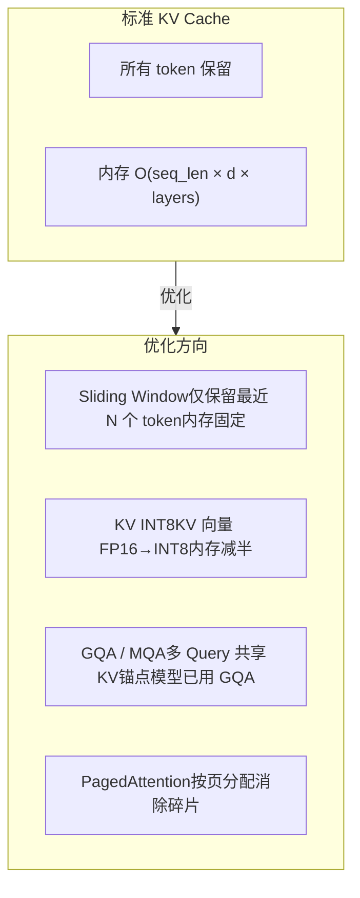
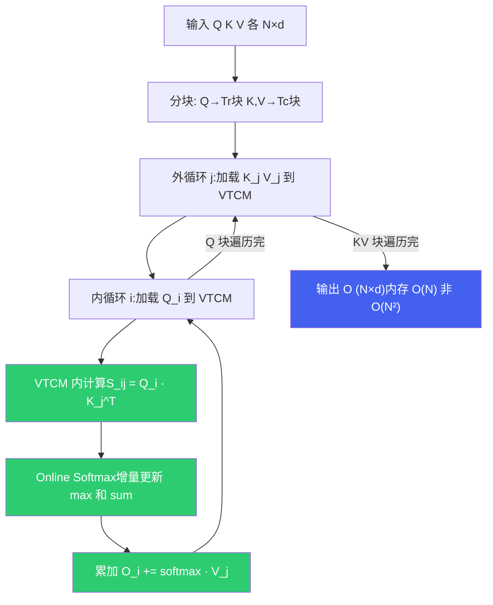

# 5. LLM 推理原理与性能模型

*基于 Qualcomm SA8397P 平台  |  Prefill/Decode · Roofline · KV Cache · FlashAttention · Genie/QAIRT*

> [!TIP]
> **本篇讲什么**
>
> 座舱端侧 LLM 推理的**理论主干**——从原《推理优化》拆出的核心，另两篇（量化、解码服务化）都建立在这里之上：
>
> - Prefill / Decode 两阶段的本质差异与算术强度
> - Roofline 性能模型：如何判断一个任务是算力瓶颈还是带宽瓶颈
> - KV Cache 内存公式、FlashAttention 的 VTCM 分块
> - 单 cDSP 上 ViT 与 LLM 的多 graph 并发与 HTP 时分复用
> - 推理运行时选型（Genie / QAIRT）、端侧 Tokenizer / Detokenizer
>
> 量化方法见 [端侧模型量化与压缩](quantization.html)；前缀缓存、投机采样、约束解码、端到端延迟见 [端侧解码与服务化优化](infer-serving.html)。

> [!NOTE]
> **锚点模型与数据口径（与全站一致）**
>
> 本篇以 **Qwen3-Omni-4B** 为锚点模型——**项目内部定制的 4B 级全模态模型**（并非公开发布的 Qwen3-Omni 系列，公开版为 30B-A3B MoE）。唯一配置基准：**36 层、32 个 Q head、8 个 KV head（GQA）、head\_dim 128、hidden 2560、约 4B 参数，INT4 权重约 2.5 GB**。
>
> **平台基准 · SA8397P**：内存带宽约 68 GB/s（估算）、算力约 70 TOPS INT8（估算）、**1 个 cDSP**（HTP 计算资源在多个 graph 间时分复用）、VTCM 典型 8 MB（估算，以 `QnnHtpDevice` 实际查询为准）。完整口径见 [硬件架构](hardware.html) 顶部「全站数据口径与锚点模型」NOTE。
>
> 本篇遵循全站「**只讲方法不给数**」约定：文中出现的个别数值一律为**示例参数**，仅用于演示推导方法、不代表实测，请代入你自己的平台与模型配置计算。

## 1. Prefill / Decode 两阶段

### 1.1 两阶段本质差异

LLM 自回归推理分为两个计算特性截然不同的阶段。理解这一区分是所有推理优化的基础：

| 维度 | Prefill（预填充） | Decode（解码） |
| :--- | :--- | :--- |
| **处理方式** | 并行处理 S 个输入 token | 逐个生成 token（自回归） |
| **每步计算量** | ~2N × S FLOPs（N=参数量） | ~2N FLOPs / token |
| **权重读取** | 读全部权重 1 次，服务 S 个 token | 每生成 1 个 token 都要读全部权重 |
| **算术强度（W4A16）** | ~4×S OPs/Byte | ~4 OPs/Byte |
| **瓶颈类型** | Compute-bound（S 足够大时） | Memory-bound（始终） |
| **核心指标** | TTFT（Time To First Token） | TPOT（Time Per Output Token） |
| **输出** | 首 token + 完整 KV Cache | 每步 1 个 token + 追加 KV |

### 1.2 算术强度：别只算权重字节

**算术强度**（Arithmetic Intensity, AI = FLOPs ÷ Bytes）是判断瓶颈类型的关键量。以线性层 `y = x·W` 为例：

```text
FLOPs = 2 × batch × H_in × H_out

每步从 DDR 搬运的字节并不只有权重，完整写法是:
  Bytes = W_bytes + KV_bytes(seq_len) + act_bytes

  AI = FLOPs / Bytes
```

> [!WARNING]
> **常见误用：AI 只除权重字节**
>
> 简化式 `AI ≈ 2×batch / bytes_per_weight` 只在"权重读取占绝对主导"时成立。**长上下文 decode 时，KV Cache 的读取量会随 seq\_len 线性增长，甚至反超权重成为主导**——此时必须把 `KV_bytes(seq_len)` 算进分母，否则会高估算术强度、误判 bound 类型。权重 INT4 时：Prefill `AI ≈ 4S`，Decode（短上下文）`AI ≈ 4`。

## 2. Roofline 性能模型

### 2.1 Roofline 与 Knee Point

Roofline 模型（Williams et al., 2009）把硬件的峰值算力与内存带宽统一在一张图上：任务的算术强度低于 **Knee Point**（计算/带宽比）就是 Memory-bound，高于则 Compute-bound。

```text
Knee Point = 峰值算力 ÷ 内存带宽
任务 AI < Knee Point → Memory-bound（速度由带宽决定）
任务 AI > Knee Point → Compute-bound（速度由算力决定）
```

### 2.2 关键修正：Knee Point 要用"执行模式"的峰值算力

> [!IMPORTANT]
> **量纲必须对齐：W4A16 负载不能用 INT8 TOPS 去判 bound。**
>
> 锚点 LLM 在 HTP 上以 **W4A16** 执行——权重 INT4、激活 FP16，matmul 走 **FP16 通路、FP32 累加**（见 [量化 · W4A16](quantization.html)）。HMX 的 FP16 峰值算力**远低于** INT8 TOPS（量级上约为其几分之一）。若拿 INT8 的 ~70 TOPS 去除以带宽算 Knee Point，再拿去判一个 W4A16 负载，得到的 bound 阈值就是错配的产物，不可信。
>
> **正确做法**：先声明执行模式，再用**该模式下的峰值算力**算 Knee Point。

```text
示例参数（非实测，代入你的平台实际峰值）:
  INT8 峰值 (CNN/W8A8):  ~70 TOPS
  W4A16 的 FP16 峰值:    ~70/4 ≈ 17 TFLOPS   ← LLM 实际走的通路
  带宽:                  ~68 GB/s

  Knee(W4A16) = 17e12 / 68e9 ≈ 250 OPs/Byte
```

由此判断锚点模型的 bound 类型：

- **Decode 永远 Memory-bound**：AI ≈ 4，远低于 Knee ≈ 250，生成速度完全由带宽决定。
- **Prefill 在 S 较大时转 Compute-bound**：AI ≈ 4S，当 `4S > 250` 即 **S > ~60**（示例）时转入算力受限。座舱典型 prompt（System + 用户输入 + 视觉 token）远超此值，故 Prefill 通常是 Compute-bound。
- 对比：若错误地用 INT8 峰值算出 Knee ≈ 1029，会把 Compute-bound 阈值推到 S ≈ 258——这正是量纲错配导致的偏差。

### 2.3 Decode 带宽模型：速度的推导链

Decode 每生成一个 token 都要读取全部权重，速度上限可精确推导：

```text
decode 理论上限 = 有效带宽 ÷ 每 token 读取字节

每 token 读取字节 (W4A16, 锚点模型):
  ① 权重:     ~4B × 0.5 Byte      ≈ 2.0 GB   (主导)
  ② KV Cache: 2×36层×8 KV头×128×seq_len×dtype
              (INT8 KV, seq_len=512 时约 36 MB)
  ③ 激活等:   数 MB (相对可忽略)

推导（示例效率系数，非实测）:
  理想上限  = 68 GB/s ÷ ~2.0 GB ≈ 34 tok/s
  × 内存效率 × 带宽共享折扣 × 调度折扣 → 落到实际可用区间
```

> [!NOTE]
> **为什么端侧 Decode 远慢于云端？**
>
> 根本原因是**内存带宽差距**——数据中心 GPU 的 HBM 带宽是车机 DDR 的一个数量级以上。端侧优化的本质是**减少每 token 读取的数据量**：INT4 量化把权重减半、GQA 把 KV 头数从 32 降到 8（KV 读取降至 1/4）、KV INT8 再减半。这些叠加后端侧可用的生成速度才成为可能。

## 3. KV Cache

### 3.1 KV Cache 内存公式

KV Cache 是 LLM 推理内存的主要来源。**每 token 的 KV 字节数**由模型结构唯一决定：

```text
KV_bytes/token = 2(K,V) × n_layers × n_kv_heads × head_dim × bytes_per_elem

锚点模型 (36 层, 8 KV head, head_dim 128):
  FP16 (2B): 2 × 36 × 8 × 128 × 2 = 147456 B = 144 KB/token
  INT8 (1B): 2 × 36 × 8 × 128 × 1 =  73728 B =  72 KB/token
```

> [!NOTE]
> **GQA 已经体现在公式里**
>
> 锚点模型是 GQA（32 Q head 共享 8 KV head），所以公式用 **8 个 KV head** 而非 32。若误用 32 会把 KV 内存高估 4 倍。

### 3.2 随上下文长度的内存估算（示例）

| 上下文长度 | FP16 KV Cache | INT8 KV Cache |
| :--- | :--- | :--- |
| 512 tokens | ~72 MB | ~36 MB |
| 1024 tokens | ~144 MB | ~72 MB |
| **2048 tokens** | **~288 MB** | **~144 MB** |
| 4096 tokens | ~576 MB | ~288 MB |

> 上表由 §3.1 公式直接推出（144 KB/token × 长度），是**示例口径**，不是实测。代入你的层数 / KV head / head\_dim 即可得到自己的数。

### 3.3 KV Cache 优化策略



| 优化方法 | 原理 | 内存效果 | 精度影响 | 适用场景 |
| :--- | :--- | :--- | :--- | :--- |
| **Sliding Window** | 只保留最近 W 个 token 的 KV | 固定上限 | 长距离依赖丢失 | 单轮对话、实时车控 |
| **KV INT8 量化** | KV 从 FP16 量化到 INT8 | 减半 | 损失很小 | 多轮对话、内存受限 |
| **GQA / MQA** | 多 Query 共享 KV head | 减至 1/4~1/8 | 几乎无损 | 新一代模型原生支持 |
| **PagedAttention** | 按页分配 KV，类似虚拟内存 | 消除碎片 | 无损 | 多并发、长序列 |

> [!TIP]
> **端侧推荐组合**
>
> 在 SA8397P 上部署锚点模型，推荐 **GQA（原生）+ KV INT8 + Sliding Window**。这套组合能把 KV Cache 控制在百 MB 级，为权重和运行时留出内存。

## 4. FlashAttention

### 4.1 标准 Attention 的内存瓶颈

标准 Self-Attention `Attention(Q,K,V) = softmax(QK^T/√d)·V` 的中间结果 `QK^T` 是 **N×N** 矩阵（N=序列长度），必须完整存储后才能 softmax：

| 序列长度 N | 单头注意力矩阵 (FP16) | 32 个 Q 头总量 | 能否放入 VTCM (~8MB)? |
| :--- | :--- | :--- | :--- |
| 256 | 128 KB | ~4 MB | 勉强 |
| 512 | 512 KB | ~16 MB | 不能 |
| 1024 | 2 MB | ~64 MB | 远不能 |
| 2048 | 8 MB | ~256 MB | 远不能 |

> 锚点模型是 **32 个 Q head**（GQA 下共享 8 组 KV）。当 N×N 矩阵放不进 VTCM，就必须写回 DDR 再读回——Prefill 的大量带宽被注意力矩阵读写吃掉。这正是 FlashAttention 要解决的。

### 4.2 FlashAttention 分块计算原理

FlashAttention（Dao et al., 2022）把 Q、K、V 分块（tiling），每次只加载一小块到片上（端侧即 VTCM），在片上完成 `QK^T → softmax → ×V` 全流程，**避免把 N×N 矩阵写回 DDR**：



**Online Softmax** 是关键：标准 softmax 要看到全部 N 个元素才能算归一化分母，但通过维护 running max 和 running sum，可以逐块增量更新，无需存完整 N×N 矩阵。

### 4.3 VTCM 分块大小计算（按 INT32/FP32 累加重算）

> [!WARNING]
> **别把注意力得分按 1 Byte/元素算**
>
> HMX 是 INT8×INT8→**INT32 累加**；W4A16 下 S 与 O 走 **FP32 累加**，Online Softmax 的 max/sum 与归一化也必须在 **FP32** 上做。所以 `S_block` 和 `O_block` 要按 **4 Byte/元素** 计，而不是 1 Byte——这一项差 4 倍，直接决定分块上限。

```text
每次迭代 VTCM 占用 (d=128, Br=Bc=128, Q/K/V 为 FP16, S/O 为 FP32):
  Q_block:  Br×d×2B  = 128×128×2 = 32 KB
  K_block:  Bc×d×2B  = 128×128×2 = 32 KB
  V_block:  Bc×d×2B  = 128×128×2 = 32 KB
  S_block:  Br×Bc×4B = 128×128×4 = 64 KB   ← FP32 累加
  O_block:  Br×d×4B  = 128×128×4 = 64 KB   ← FP32 累加器
  m, l:     Br×2×4B  = 128×2×4   =  1 KB   ← Online Softmax 状态
  合计 ≈ 225 KB / 单次迭代
  双缓冲 (隐藏 DDR 加载) ≈ 450 KB
```

GQA 下 1 个 KV head 服务 4 个 Q head（32/8），可按 KV 组并行。**8 MB VTCM（估算）** 能容纳双缓冲分块 + 若干头并行 + HVX 寄存器余量，但**余量比"按 1 Byte 估算"要紧**——结论不是"VTCM 充裕"，而是"**VTCM 容量是 FlashAttention 分块尺寸的实际上限约束**"，分块尺寸要按实际查询到的 VTCM 调。

### 4.4 FlashAttention vs 标准 Attention

| 维度 | 标准 Attention | FlashAttention |
| :--- | :--- | :--- |
| **内存复杂度** | O(N²) | O(N) |
| **DDR 读写量** | 高（QK^T 反复读写） | 低（只读 Q/K/V 块、写 O） |
| **VTCM 利用** | 低（可能溢出到 DDR） | 高（分块适配 VTCM） |
| **数值精度** | 标准 softmax | Online Softmax（数值等价） |
| **计算量** | 相同 | 相同 |
| **实现复杂度** | 低 | 高（分块调度 + Online Softmax + 双缓冲） |

### 4.5 端侧实践

FlashAttention kernel 通常以**针对 HVX/HMX 指令集优化的库**形式随推理运行时提供，在 HTP 上执行分块注意力。

| 适用场景 | 收益 | 说明 |
| :--- | :--- | :--- |
| **Prefill 长序列** | 高 | 序列越长收益越大 |
| **Prefill 短序列** | 低，可能反而变慢 | 分块调度开销 > 带宽节省 |
| **Decode** | 中 | Q 只有 1 行，分块意义有限 |
| **多模态 Prefill** | 高 | ViT 输出大量视觉 token → 长序列 |

> [!WARNING]
> **端侧 FlashAttention 不是无条件优于标准 Attention**
>
> 输入序列很短时，分块调度和 Online Softmax 的开销可能超过节省的带宽。实际部署通常设一个**序列长度阈值**：短序列走标准 Attention，长序列走 FlashAttention。

## 5. 执行与调度：单 cDSP 上的多 graph 时分复用

### 5.1 多模态架构与"只有一个 cDSP"

锚点模型是原生多模态模型，包含 **ViT 视觉编码器** 与 **LLM 语言解码器** 两个主要计算模块，二者都以 graph 形式跑在 HTP 上：


> [!IMPORTANT]
> **平台事实：SA8397P 是 1 个 cDSP。**
>
> HTP 计算资源在**多个 graph 之间时分复用**，宏观上接近串行、算子级可流水。**不存在"两个可分别绑定的 HTP 核心"**，因此也没有"把 ViT 绑 Core 0、LLM 绑 Core 1"这回事。任何基于"双核绑定"的优化前提都不成立。

### 5.2 时分复用，而非并行

ViT graph 与 LLM graph 共享同一个 HTP，按时间片交替执行。下图是**单 cDSP 时分**的正确时序（而非双核并行）：

```mermaid
gantt
    title 单 cDSP 上 ViT 与 LLM 的时分复用（示意）
    dateFormat X
    axisFormat %Lms

    section HTP 时间片
    ViT 编码 Frame 1         :done, v1, 0, 8
    LLM Prefill Frame 1      :active, l1, 8, 20
    LLM Decode (Token 1-3)   :d1, 20, 26
    ViT 编码 Frame 2         :v2, 26, 34
    LLM Decode (Token 4-6)   :d2, 34, 40
```



要点：

- **同一时刻 HTP 只在推进一个 graph 的算子**；"并发"体现在多个 graph 已加载、按调度交替推进，而非物理并行。
- **graph 优先级**决定时间片分配：活跃的 LLM decode（正在回复语音）优先级高，ViT 帧可被推迟。优先级通过 graph/context 的 priority 配置表达，而不是"绑核"。
- 性能/延迟投票（DCVS、总线频率）走 `QnnHtpPerfInfrastructure` 一类的基础设施接口，与"优先级"是两回事。

### 5.3 graph 间数据传递：走 DDR，不走 VTCM

> [!WARNING]
> **VTCM 是 core-private 的紧耦合 SRAM，物理上无法被另一个 graph/核访问。**
>
> ViT 输出交给 LLM，只能通过 **DDR 上的共享缓冲（ION / DMA-BUF）**，不存在"共享 VTCM 传数据"。零拷贝的前提是 SMMU 映射下的 DMA-BUF 共享内存（见 [硬件架构](hardware.html)）。

### 5.4 吞吐 vs 单请求延迟（别混为一谈）

让"第 N+1 帧的 ViT"与"第 N 帧的 LLM decode"在时间上重叠，提升的是**连续帧吞吐（FPS）**，**不是单请求延迟**——单帧从 ViT 到首 token 的耗时在单 cDSP 上基本不变（除非该帧此前在排队）。

| 指标 | 时分重叠的影响 |
| :--- | :--- |
| **连续帧吞吐 (FPS)** | 提升（重叠掉了空闲时间片） |
| **单请求 ViT→首 token 延迟** | 基本不变 |
| **HTP 利用率** | 提升（减少空转） |

> 面试若被问"多模态怎么提速"，先分清对方问的是**吞吐**还是**单请求延迟**，再答时分复用 / 优先级调度——把吞吐收益说成延迟下降是概念错误。

## 6. 推理引擎与运行时选型

### 6.1 选型维度（而不是背速度表）

端侧 LLM 运行时选型应看以下维度，**而不是记一张"谁多少 tok/s"的表**——同一模型同一芯片的速度由带宽模型决定（§2.3），引擎之间真正的差异在能力与工程面：

| 选型维度 | 关注点 |
| :--- | :--- |
| **后端覆盖** | 能否用满 NPU（HTP），还是大量算子 fallback 到 CPU |
| **量化格式支持** | 是否支持 W4A16 分组量化（HTP 跑 LLM 的前提） |
| **算子支持与 fallback 行为** | 缺算子时是报错、还是悄悄掉到慢后端（fallback 是头号性能杀手） |
| **工具链成熟度** | 量化、图编译、profile、调试链路是否完整 |
| **内存模型** | Context Binary 离线编译、KV Cache 管理、多模型共存 |
| **生态与集成** | 对话状态管理、流式输出、与上层框架的衔接 |

> [!NOTE]
> **内存占用的物理下限**
>
> 任何引擎跑 INT4 锚点模型，总内存都 **不可能低于"权重 2.5 GB + KV Cache + 激活 + runtime"**。看到"INT4 模型总占用 1.6 GB"这类数字可以直接判定为错——权重本身就装不下。

### 6.2 Genie 与 QAIRT：高通端侧 LLM 的正解

高通端侧 LLM 的运行时叫 **Genie**（属 QAIRT）。全组文档应当用它，而不是杜撰"QNN-LLM"这样的名字。

**品牌演进**（面试时效性考点）：

```text
SNPE (早期 DSP 推理) → QNN (统一神经网络 SDK) → QAIRT (2024 起统一品牌)
  Qualcomm AI Runtime (QAIRT) 统一了 SNPE 与 QNN，
  QNN 是其 SDK/API 层；Genie 是面向端侧 LLM 对话的运行时。
```

在 SA8397P 上，**整图（含 embedding / attention / LM head）跑在 HTP** 是 Genie 的默认部署形态。把 embedding 或 LM head 单独切到 GPU/CPU 通常不划算——那意味着每步都要跨器件搬张量，代价大于收益（除非有明确 profiling 证据）。

## 7. Genie / QAIRT 的 LLM 部署流程

端侧 LLM 从训练产物到上机对话的完整链路：


1. **模型导出**：微调后的模型导出为运行时可消费的图（CNN 走 ONNX；LLM 走 QAIRT/Genie 的 W4A16 导出流程，见 [量化 · AIMET](quantization.html)）。
2. **context binary 生成**：`qnn-context-binary-generator` 一类工具把图 + 量化权重 + HTP 侧编译产物（指令排布、tiling、内存规划）**离线**打包成 context binary。收益是**消除运行时图编译**——加载即可推理，显著改善首次响应。
3. **Genie 加载与对话**：Genie 加载 context binary，通过 **GenieDialog** 一类的对话 API 管理多轮状态（会话内的 KV Cache 复用、上下文拼接），并以流式回调逐 token 输出。

> [!NOTE]
> **为什么 LLM 路径与 CNN 路径不同**
>
> CNN 小模型走 `ONNX → qnn-onnx-converter → context binary`；**LLM 走 Genie + W4A16 导出**，且多了对话状态与 KV 管理。把 CNN 的转换链路直接套到 LLM 上是常见误区。

## 8. 端侧 Tokenizer / Detokenizer

推理链路的两端——把文本变 token、把 token 变回文本——常被忽略，但它们真实占用内存并贡献延迟。

### 8.1 词表与内存

embedding 表和 LM head 的大小由词表决定：

```text
embedding / LM_head ≈ vocab_size × hidden × bytes_per_elem

示例（非实测）: vocab ~150K, hidden 2560, FP16
  → 单层 ~150000 × 2560 × 2 B ≈ 数百 MB
```

这两层通常是 **gather/scatter** 操作、且对精度敏感，**一般保留 FP16 而不做 INT4**——因此它们是权重内存预算里不可忽视的一块。词表越大，这块越重。

### 8.2 BPE 耗时与 TTFT

tokenize（BPE 合并）在 **CPU** 上执行。对几百个文本 token，耗时通常在亚毫秒到数毫秒量级——**小，但对 TTFT 有真实贡献**，长 prompt 下要计入预算。注意：**视觉 token 是程序化插入的，不走 BPE**，所以图像不会增加 tokenize 负担。

### 8.3 流式 detokenize 的 UTF-8 边界

一个多字节 UTF-8 字符（中文、emoji）可能被**拆在多个 token 上**。流式输出时若逐 token 直接转字符串，会在字符中间截断，产生乱码。正确做法：**detokenizer 维护一个字节缓冲，遇到不完整的 UTF-8 序列就暂存，凑齐完整字符再交给 UI**。座舱聊天内容必然含 emoji，这个边界问题绕不开。

> 至此理论主干完备：量化决定权重读取量（[量化篇](quantization.html)），本节给出带宽/算力/KV 的推导框架，工程手段（前缀缓存、投机采样、约束解码、batching）如何作用在 Prefill/Decode 上，见 [端侧解码与服务化优化](infer-serving.html)。
