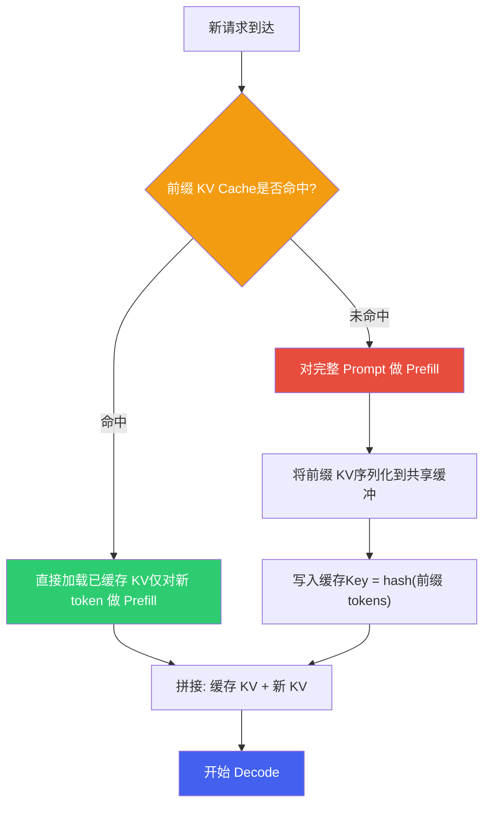
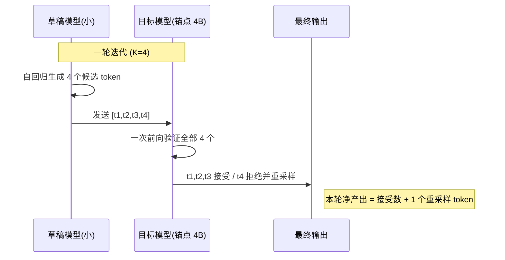
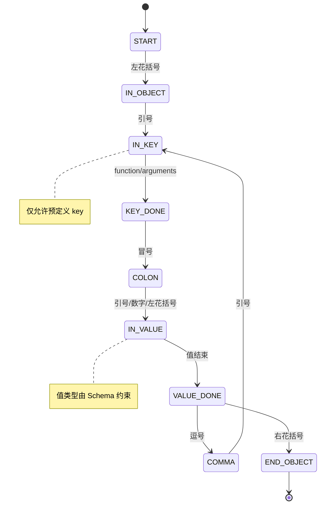
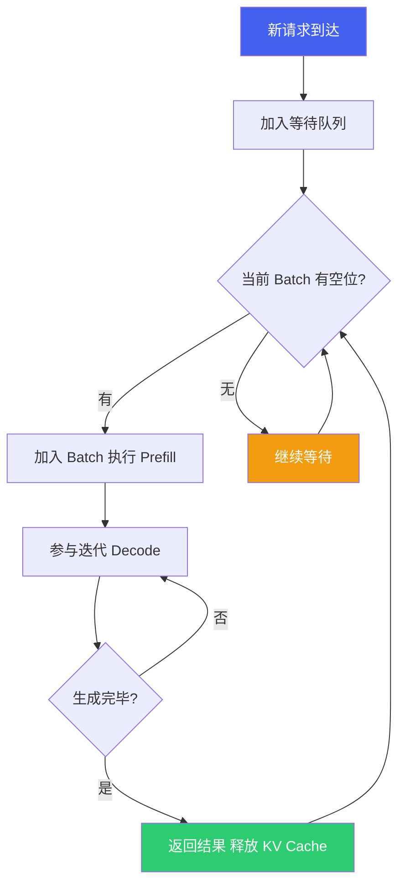
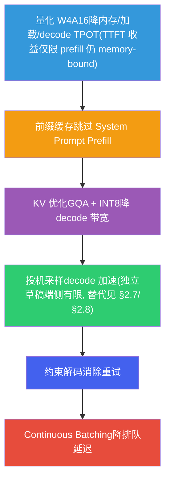

# 端侧解码与服务化优化

*基于 Qualcomm SA8397P 平台  |  前缀缓存 · 投机采样 · 约束解码 · Continuous Batching · 端到端延迟*

> [!TIP]
> **本篇讲什么**
>
> 座舱端侧 LLM 的**工程加速手段**——从原《推理优化》拆出的实战部分，面试最常问：
>
> - 前缀缓存（Prefix Caching）：System Prompt / 多轮对话的 KV 复用，含 break-even 与换出代价
> - 投机采样（Speculative Decoding）：标准加速比公式，以及"端侧到底划不划算"；Medusa / EAGLE / Lookahead 等变体在端侧的真实账
> - 约束解码（Constrained Decoding）：语法约束 vs 取值域约束，含 grammar 编译成本
> - Continuous Batching：迭代级调度与 KV 动态管理，含 prefill/decode 分离的端侧对照
> - 端到端延迟优化：把 TTFT 和端到端首屏响应拆成两个指标分别优化
>
> 贯穿全篇的一条端侧主线：**decode 深度 memory-bound，所以"一次前向多算几个位置"几乎免费，但有上限**——投机采样的 K、batching 的 B、Lookahead 的池子大小抢的是同一份算力余量（§2.3、§4.5）。
>
> 这些手段都建立在 [LLM 推理原理与性能模型](infer-principles.html) 的 Prefill/Decode 与 Roofline 框架之上；量化方法见 [端侧模型量化与压缩](quantization.html)。

> [!NOTE]
> **锚点模型与数据口径（与全站一致）**
>
> 本篇以 **Qwen3-Omni-4B** 为锚点模型（项目内部定制的 4B 级全模态模型，非公开 Qwen3-Omni 30B-A3B MoE），结构 36 层 / 32 Q head / 8 KV head（GQA）/ head\_dim 128 / 约 4B 参数。平台为 SA8397P：带宽约 68 GB/s、**1 个 cDSP**（HTP 多 graph 时分复用）。完整口径见 [硬件架构](hardware.html) 顶部 NOTE。
>
> 本篇遵循全站「**只讲方法不给数**」约定：文中出现的个别数值一律为**示例参数**，仅用于演示方法、不代表实测，请代入你自己的平台与模型配置计算。

## 1. 前缀缓存 (Prefix Caching)

### 1.1 问题背景

座舱 Agent 每次请求都携带固定的 **System Prompt**（工具定义、人设、安全规则），标准流程中这段相同前缀每次都重新做 Prefill 计算 KV Cache，造成重复计算：

```text
[System Prompt: 固定前缀] + [对话历史] + [视觉 token] + [用户输入]
        ↑ 每次重算 KV = 浪费          ↑ 真正变化的部分
```

### 1.2 前缀缓存原理



### 1.3 节省比例：给推导，不给"60~80%"

> [!IMPORTANT]
> **前缀缓存的节省比例 = 缓存命中的前缀 token 数 ÷ 总 Prefill token 数。**
>
> 这个比例**高度依赖 prompt 结构**，不能拍一个"60~80%"。尤其多模态场景下，总 Prefill token 里含大量**视觉 token**，而文本前缀缓存覆盖不到它们：

```text
示例（非实测）:
  System Prompt 前缀 = 300 文本 token（可缓存）
  视觉 token        = 576（每帧，不可被文本前缀缓存覆盖）
  用户输入          = 50
  总 Prefill token  = 300 + 576 + 50 = 926

  命中时节省比例 = 300 / 926 ≈ 32%   ← 远达不到 80%
```

**结论**：视觉 token 占比越高，文本前缀缓存的收益越低。要真正省 Prefill，得连视觉侧一起想办法（如视觉 token 的缓存/复用、降低单帧视觉 token 数）。

### 1.4 实现方案

```python
import hashlib
import numpy as np

class PrefixKVCache:
    """前缀 KV Cache 管理器：按字节预算淘汰（条目大小由原理篇 KV 公式推出）"""
    def __init__(self, memory_budget_bytes=512 * 1024 * 1024,
                 kv_bytes_per_token=144 * 1024):
        self.cache = {}          # key -> (kv_data, size_bytes)
        self.lru_order = []
        self.memory_budget = memory_budget_bytes
        # 每条目大小 = prefix_len × 每 token KV 字节
        # （原理篇 §3.1：2×n_layers×n_kv_heads×head_dim×bytes_per_elem，
        #   锚点 FP16 = 144 KB/token，INT8 = 72 KB/token）
        self.kv_bytes_per_token = kv_bytes_per_token
        self.used_bytes = 0

    def compute_key(self, token_ids, model_id, quant, lora_id,
                    position_offset, kv_dtype):
        # key 必须包含所有"会改变 KV 内容"的因素：
        #   前缀 tokens + 模型/量化（权重不同 KV 不同）+ LoRA id
        #   （adapter 改 k/v 投影）+ position offset（位置编码相位）+ KV dtype
        payload = np.array(token_ids, dtype=np.int32).tobytes() + \
            f"|{model_id}|{quant}|{lora_id}|{position_offset}|{kv_dtype}".encode()
        return hashlib.sha256(payload).hexdigest()[:16]

    def get(self, key):
        if key in self.cache:
            self.lru_order.remove(key)
            self.lru_order.append(key)
            return self.cache[key][0]
        return None

    def put(self, key, kv_data, prefix_len):
        size = prefix_len * self.kv_bytes_per_token
        if size > self.memory_budget:      # 单条目超预算：不缓存
            return
        while self.used_bytes + size > self.memory_budget and self.lru_order:
            old_key = self.lru_order.pop(0)              # LRU 淘汰
            self.used_bytes -= self.cache[old_key][1]
            del self.cache[old_key]
        self.cache[key] = (kv_data, size)
        self.lru_order.append(key)
        self.used_bytes += size

    def prefill_with_cache(self, model, full_prompt_tokens, prefix_len, key_ctx):
        prefix = full_prompt_tokens[:prefix_len]
        suffix = full_prompt_tokens[prefix_len:]
        key = self.compute_key(prefix, **key_ctx)
        cached_kv = self.get(key)
        if cached_kv is not None:
            return model.prefill(suffix, past_kv=cached_kv)   # 命中：只 prefill 后缀
        kv = model.prefill(full_prompt_tokens)                # 未命中：全量 + 缓存前缀
        self.put(key, kv.slice(0, prefix_len), prefix_len)
        return kv
```

两个实现要点：

- **按字节预算淘汰，而不是按条目数**：每条缓存的大小 = `prefix_len × 每 token KV 字节`（[KV Cache 公式](infer-principles.html)），长短前缀混存时按条目数限容会让内存占用不可控。
- **key 不只含前缀 tokens**：KV 是特定权重对特定前缀的 prefill 产物，凡改变 KV 内容的因素都要进 key——模型版本、量化、LoRA id、position offset（KV 与绝对位置绑定）、KV dtype。漏掉任何一项，命中的就是"长得像但内容错"的 KV。

> [!NOTE]
> **这套 hash-key LRU 在方法谱系上的位置**
>
> 云端主流前缀缓存有两支演进，上面的实现是它们的简化版：
>
> - **vLLM 的 Automatic Prefix Caching（APC）**：把 KV 按 block 存、用 block 内容的 hash 建索引，命中即复用——即本节 `compute_key` 的思路。
> - **SGLang 的 RadixAttention（Zheng et al., 2024）**：把所有缓存 KV 组织成一棵 **radix tree（基数树）**，按 token 序列做**最长公共前缀匹配**，配 LRU 淘汰与 cache-aware 调度。
>
> 端侧要不要上 radix tree，取决于前缀是否**天然成树**：§1.5 的 L1/L2/L3 正是——共享 System Prompt 是公共根，往下分出场景工具定义、再往下分会话历史。前缀只有寥寥几条且互不共享时，flat hash map 足够；一旦"公共根 + 多级分支"成立，radix tree 才能吃到跨层级的部分命中（命中到"System + 工具定义"这一层，即使会话历史没命中）。
>
> **一个能显著提高命中率的实现选项**：若运行时缓存的是 **pre-RoPE 的 K**（旋转位置编码在 attention 时才施加），同一段前缀就能在**不同 position offset** 下复用，position offset 便不必进 key；反之（缓存 post-RoPE 的 K，即本节 §1.4 的做法）offset 必须进 key，多轮里前缀整体后移就会整段 miss。所用运行时属于哪种，以实现为准（需核实）。

### 1.5 多轮对话的分层缓存

| 缓存层级 | 缓存内容 | 缓存时机 |
| :--- | :--- | :--- |
| **L1: System Prompt** | 工具定义 + 人设 + 安全规则 | 应用启动时预计算，常驻内存 |
| **L2: 对话历史** | 前 N 轮对话的 KV | 每轮结束后更新 |
| **L3: 高频模板** | "导航到XX""调空调XX度"等模式 | 统计频率后预计算 |

> [!TIP]
> **Best Practice: Prompt 模板设计**
>
> 为最大化命中率，遵循**"静态在前、动态在后"**：前缀（固定）= System 人设 → 工具定义 → 安全规则 → 输出格式；后缀（变化）= 对话历史 → 车辆状态 → 用户输入。工具集合动态变化时，把稳定的本地工具放前面、动态工具放后面。缓存的前缀 KV 占用可由 [KV Cache 公式](infer-principles.html) 直接算出，据此决定常驻多少。

> [!WARNING]
> **"L1 常驻"与 ring buffer 回绕冲突**
>
> 端侧 KV Cache 以 graph I/O 形式表达，是每套编译图自己的**环形缓冲（ring buffer）**，容量按上下文上限一次性划定、写满回绕（[原理篇 §7](infer-principles.html)）。长多模态对话下（视觉 token 是 KV 大头，每帧 ≈576 token），回绕会**最先覆盖最旧的 System Prompt KV**——恰恰是 L1 最想常驻的那段。两个对策：① System Prompt KV 单独存一份，回绕后重新拼回；② 按轮数/帧数主动截断历史，让总长度不进回绕区。
>
> 另注意：**多轮对话应增量追加**——每轮只对新 token 做 prefill、把新 KV 追加到 ring buffer 尾部，**不要重算历史**。重算历史正是前缀缓存要消除的浪费。

### 1.6 成本侧：break-even、换出与多 LoRA

前缀缓存不是"白省"，先给 break-even 推导（示例参数）：

```text
重算一个已缓存 token 的成本（prefill 已 compute-bound，见 §5.2）:
  ≈ 2N ÷ (FP16 峰值 × MFU)
  = 2×4e9 ÷ (35e12 × 0.3) ≈ 0.76 ms    （保守峰值 17e12 × 0.3 → ≈ 1.57 ms）

读回一个 token 的缓存 KV 的成本（memory-bound）:
  ≈ 每 token KV 字节 ÷ 带宽 = 144 KB ÷ 68 GB/s ≈ 2 µs

→ 读回比重算便宜约 360~750×：只要 KV 留在 DDR 里，前缀缓存几乎总是划算。
```

> [!WARNING]
> **KV 换出 DDR 后 break-even 会大幅收窄——但"一定翻转"是错的，要给判据。**
>
> 上面的结论前提是缓存 KV **常驻内存**。若为省内存把 KV 换出到 flash，读回带宽从 68 GB/s 掉到 flash 量级，收益被吃掉多少要**算**，不能一句"宁可重算"了事：
>
> ```text
> 换出后仍然划算的条件：flash 有效读带宽 > 每 token KV 字节 ÷ 每 token 重算成本
>   FP16 KV (144 KB/token): > 144 KB ÷ 0.76 ms ≈ 190 MB/s   （保守重算 1.57 ms → > 95 MB/s）
>   INT8  KV ( 72 KB/token): >  72 KB ÷ 0.76 ms ≈  95 MB/s   （保守重算 1.57 ms → > 47 MB/s）
> ```
>
> 也就是说：**只要 flash 顺序读能稳定跑到 ~200 MB/s 以上，换出仍然比重算便宜**（UFS 顺序读通常远高于此），只是收益从 DDR 常驻时的 ~350× 缩到个位数倍。真正让换出变成坏主意的不是带宽，而是这三条：
>
> - **粒度错配**：按 token 随机读 144 KB 小块会被 IO 开销主导，必须**整段前缀连续读**（如 300 token ≈ 43 MB 一次读完），否则上面的带宽假设不成立。
> - **抖动与竞争**：flash 带宽与日志、地图、OTA 等子系统共享，尾延迟不可控——车控这类有界延迟请求承受不起。
> - **寿命**：反复换入换出是写放大，flash 有擦写寿命。
>
> 结论仍是**缓存容量按"内存里能常驻多少 KV"规划，而不是"flash 上能存多少"**；但把 flash 当"冷前缀的兜底层"（连续读、只在启动或场景切换时载入）在算清上面判据后是可行的，不必一刀切禁止。

> [!NOTE]
> **端侧还有一笔常被漏掉的搬运费：命中 ≠ 零成本**
>
> 端侧 KV 以 graph I/O 的 **ring buffer** 形式表达（[原理篇 §7](infer-principles.html)），缓存条目通常不在图自己的缓冲里。命中后要把 KV **拷进 ring buffer**——这是一次 DDR→DDR 搬运，读写各一遍，有效带宽约为单向的一半（示例：68 GB/s → ~34 GB/s），即 ≈ 4 µs/token，仍比重算（0.76~1.57 ms/token）便宜两个数量级，所以不改变结论；但在做**首 token 延迟预算**时要把它计进 TTFT，别把"命中"当成 0 ms。若运行时支持让缓存直接落在图的 KV 缓冲里（免拷贝），这笔费用可省。

**多 LoRA 注意**：LoRA adapter 会修改 k/v 投影，同一段前缀在不同 adapter 下 prefill 出的 KV **不同**——前缀 KV **不可跨 adapter 共享**，每个 (prefix, adapter) 组合各存一份，缓存条目数 = prefix 数 × adapter 数。本站岚图项目即 11 个 prefix × 5 个 adapter（对应关系见 [GenAI 架构 §3.1](../projects/lantu/genai-architecture.html)），做缓存内存预算时按组合数而不是 prefix 数算。

## 2. 投机采样 (Speculative Decoding)

### 2.1 核心思想

标准自回归解码每个 token 都要等前一个生成完，严格串行、受带宽限制。**投机采样**用一个小的"草稿模型"快速生成 K 个候选 token，再由大的"目标模型"在一次前向中并行验证，把多步串行解码压成一步验证：



### 2.2 验证与接受机制

投机采样是**无损采样**——最终输出分布与直接用目标模型采样一致。对草稿 token `t_i`：

- 接受概率 `min(1, p_target(t_i)/p_draft(t_i))`；随机数 < 接受概率则**接受**，继续验证下一个。
- 否则**拒绝**，从修正分布 `norm(max(0, p_target − p_draft))` 重采样（`norm` = 归一化：逐点取差后非负但不再求和为 1，须重新归一化才是合法分布）；拒绝后后续草稿 token 全部丢弃。

### 2.3 加速比：用标准公式，别用错版

> [!IMPORTANT]
> **标准加速比公式**
>
> ```text
> Speedup = E[每轮产出 token 数] / E[每轮成本(以目标单步为单位)]
>         = [(1 - α^(K+1)) / (1 - α)] / (1 + K·c)
>
>   α = 单 token 接受率
>   K = 每轮草稿 token 数
>   c = 草稿单步耗时 / 目标单步耗时
> ```
>
> 分子 `(1-α^(K+1))/(1-α)` 是每轮期望产出（含拒绝后白送的 1 个 token，α→1 时趋于 K+1）；分母 `1+K·c` 是每轮成本（1 次目标验证 + K 次草稿生成）。**忽略草稿开销（c）的公式会严重高估加速比。**

> [!IMPORTANT]
> **分母里"验证记为 1 单位"是有前提的——而这个前提在端侧恰好成立，且有上限**
>
> 公式默认"目标模型一次前向验证 K 个 token"的成本 ≈ 单 token decode 的 1 倍。这**不是恒等式**，它成立的条件是：验证 K 个位置时权重只读一遍、多出来的只是 FLOPs，而 decode 本就 memory-bound，多算的 FLOPs 被空闲算力吸收。用 [Roofline](infer-principles.html) 写成判据：
>
> ```text
> 一次前向处理 P 个位置（W4A16）: AI ≈ 4·P OPs/Byte（原理篇 §1.1）
> 仍 memory-bound 的条件:        4·P < Knee ≈ 250~515（原理篇 §2.2）
> → P 的免费预算 ≈ 60~130 个位置
> ```
>
> 所以 **K ≤ 数十时验证成本确实 ≈ 1 单位**，公式可用；K 一旦逼近这个预算，验证本身开始变贵，分母的"1"要写成 `1 + 超出部分的算力代价`，加速比见顶回落。
>
> **这条预算是全篇的公共约束**：投机采样的 K、Continuous Batching 的 B（§4.5，AI ≈ 4·B）、Lookahead 的 Jacobi 池大小（§2.8）抢的是**同一份算力余量**——它们都是"用空闲 FLOPs 换带宽"。这带来一个反直觉但重要的推论：**已经在做 batching 的系统，投机采样的边际收益会下降**，因为 batch 已经把 AI 抬上去了、余量被占用。端侧 B 通常只有 2~4（AI ≈ 8~16，离预算很远），所以余量充足、投机采样在原理上有空间——真正的拦路虎是 c（§2.4、§2.7），不是算力。

### 2.4 端侧的诚实结论：单 HTP 上收益有限

> [!WARNING]
> **在单个 cDSP 上，草稿与目标只能串行：α 在现实区间 0.7~0.9 时收益仅约 1.1~1.6×（理论上界 (K+1)/(1+K·c)，α→1 时 ≈1.92×），加上独立草稿权重很可能净亏损。**
>
> 云端可让草稿与目标**并发**（不同器件），c 趋近 0，加速比 ≈ 分子（α=0.85、K=4 时约 3.7×）。但端侧只有 **1 个 cDSP**，draft 与 target 时分串行，**c 由权重比决定**（草稿 ~1.0 GB / 目标 ~2.5 GB → c ≈ 0.4；且这还是下界，见 §2.7 的 LM head 论证），分母被显著抬高。

```text
示例推导（非实测，c=0.4, K=4 → 每轮成本 = 1 + 4×0.4 = 2.6）:
  α=0.6 → 分子 2.31 → Speedup ≈ 0.89×  (反而更慢)
  α=0.7 → 分子 2.77 → Speedup ≈ 1.07×
  α=0.8 → 分子 3.36 → Speedup ≈ 1.29×
  α=0.85→ 分子 3.71 → Speedup ≈ 1.43×
  α=0.9 → 分子 4.10 → Speedup ≈ 1.58×
```

**K 也不是越大越好：最优 K\* 由 (α, c) 共同决定。** K 越大，分母 (1+K·c) 线性变贵，而草稿 token 的边际期望产出按 α 的幂衰减，两者平衡处才是 K\*。端侧 c 大 → K\* 偏小：示例参数 c=0.4、α=0.8 时 **K\*=2 优于 K=4**（≈1.36× vs ≈1.29×）。别默认 K=4——把加速比公式写出来，对 (α, c) 数值扫描一阶条件，取你平台上的最优 K。

即便接受率很高，端侧加速也就 **~1.1~1.6×**；而代价是草稿模型 ~1.0 GB 权重 + 它自己的 KV Cache 常驻内存。**在内存紧张、又要与 DMS 等模型共存的车机上，"独立草稿模型"这笔账很可能是负的。** 注意该结论限定**独立草稿模型**这一种方案——端侧真正可行的替代见 §2.7。这个"独立草稿不划算"的判断，比一个乐观的加速比数字有价值得多。

### 2.5 两条容易忽略的限制

- **草稿模型必须与目标模型共享 tokenizer / 词表**——否则拒绝采样无从对齐 token，机制直接失效。
- **多模态场景下草稿模型看不到图像**：锚点是全模态模型，但小草稿模型通常只处理文本。涉及视觉 grounding 的 token，草稿与目标分布差异大，**接受率会崩塌**——而这恰恰是座舱多模态请求的常态。

### 2.6 Token Tree Verification

进阶方案让草稿生成一棵 **Token 树**（每位置扩 2~3 个分支），目标一次前向验证整棵树、取最长有效路径。同等接受率下每轮产出更高——但端侧仍受 §2.4 的串行成本约束，收益上限不变。

两个端侧约束要注意：

- **树的总节点数就是 §2.3 的位置预算 P**：验证一棵 N 节点的树 = 一次前向处理 N 个位置，N 超过 ~60~130 后验证本身变贵。树不是越宽越深越好，节点数要压在预算内。
- **端侧是静态 shape 编译图**（[原理篇 §7](infer-principles.html)）：树的形状必须编译期固定，做不了"按草稿置信度动态裁剪/扩展"（那正是 EAGLE-2 在云端的收益来源，见 §2.8）——端侧只能用一个固定形状的树。

> [!WARNING]
> **何时不适合投机采样**
>
> * 输出很短（分类仅 1~3 token）：草稿 + 验证开销反而增加延迟
> * 内存极度紧张：两模型共存挤占其他子系统
> * 接受率过低（< 50%）：频繁拒绝，加速不明显甚至变慢
> * 高创造性任务（高 temperature）：草稿与目标分布差异大，接受率下降

### 2.7 端侧可行的替代方案与草稿成本的硬下界

§2.4 的"不划算"限定**独立草稿模型**。端侧真正可行的替代都绕开了它的两个痛点——草稿权重常驻内存、c 太大：

| 方案 | 原理 | 为什么适合端侧 | 端侧真实代价 |
| :--- | :--- | :--- | :--- |
| **Medusa 头**（并行多头） | 在目标模型最后一层接 K 个轻量预测头，**并行**提议后续 K 个位置的 token，仍由目标模型一次前向验证 | **复用 target 的权重与 KV**，无独立草稿模型 | **内存陷阱见下方 WARNING**：原版每个头自带 vocab 级输出投影，锚点词表 ~150K 时单头就 ≈768 MB，K 个头直接超过模型本身 |
| **EAGLE 头**（特征级自回归草稿） | 用一个轻量解码层在**特征层**（倒数第二层 hidden state）做自回归外推，**复用 target 的 LM head 与 KV** 产出草稿 token | 额外权重只有那一层（锚点量级 ≈ 数十 MB），内存上真正可行 | 草稿是**自回归**的，K 步就要读 K 次 LM head → **c ≈ 0.3 量级**（见下方 IMPORTANT），不是 0 |
| **n-gram / prompt-lookup decoding** | 零草稿模型：从上下文与高频模板里检索候选续写（n-gram 匹配），交给目标模型验证 | 草稿成本 ≈ 0（CPU 侧检索）、零额外内存；座舱车控话术高度模板化（"导航到XX""空调调到XX度"），n-gram 命中率天然高 | 检索在 CPU 侧、与 HTP 天然重叠；命中率低时退化为纯开销 |
| **jump-forward decoding** | grammar 约束解码（§3）进入确定段（固定 key、标点、枚举值）时，直接把这些 token 写进结果，不做模型前向 | 零接受率风险、零草稿成本；与 Function Calling 的 grammar 天然协同 | 只在 grammar 确定段有效，自由文本段无收益 |

> [!WARNING]
> **"加几个轻量头"在大词表模型上不轻量——先算头的输出投影**
>
> 解码头的内存与带宽成本由它的**输出投影维度**决定，而输出投影必须覆盖词表：
>
> ```text
> 单个 vocab 级头 = vocab × hidden × 2B ≈ 150K × 2560 × 2 ≈ 768 MB（示例参数，与 LM head 同量级）
> K=4 个独立头 ≈ 3 GB  >  锚点模型本身（~2.5 GB）
> ```
>
> 所以"Medusa/EAGLE 头额外内存只有几个头本身"这句话**只在词表远小于模型权重时成立**（云端 7B/32K 词表下每头 ~260 MB，可接受）。锚点这类**小模型 + 大词表**组合下，结论要改写：
>
> - **原版 Medusa（每头独立 vocab 投影）在端侧不可行**——内存直接爆。
> - **可行的只有"共享 target LM head"的设计**：头只做到 hidden→hidden 的小适配（锚点量级 2560×2560×2B ≈ 13 MB/头），再由**共享的** LM head 出分布。EAGLE 正是这一类。
> - 代价是：共享 LM head 意味着**每次要用它出分布就得读一遍 768 MB**。并行头（K 个 hidden state 拼成一次 GEMM）只读一遍 → 边际成本 ≈ 0；自回归草稿（EAGLE）K 步读 K 遍 → c ≈ 0.3。**内存可行的方案，c 反而降不下来**——这是端侧投机采样绕不开的两难。

> [!IMPORTANT]
> **c 有硬下界：任何输出全词表 logits 的草稿，每步都必须读一遍 LM head**
>
> §2.4 用权重比（草稿权重 ÷ 目标权重）估 c，这会**系统性低估**草稿成本。锚点模型 LM head = vocab × hidden × 2B ≈ 150K × 2560 × 2 ≈ **768 MB**（示例参数，[原理篇 §2.3](infer-principles.html)），任何要输出全词表分布的草稿每步都要对它做全量 GEMV——单块就占每 token 带宽读取的 **~30%**。所以哪怕草稿"权重为零"，c 也有 **~0.3 的硬下界**；再叠加每步固定开销（graph launch、sampling、detokenize、同步），实际 c 只会更高。**端侧结论比权重比推算更悲观**——这既是否定独立草稿的另一条理由，也解释了上表替代为何可行：jump-forward 根本不读 LM head；n-gram 的提议在 CPU 侧完成、验证复用目标模型本来就要做的那次前向；并行头方案把 K 个位置融进一次 LM head 读取。
>
> **把 c ≈ 0.3 代回标准公式看端侧上限**（示例参数，α=0.8）：
>
> ```text
> K=4: (1-0.8^5)/(1-0.8) ÷ (1+4×0.3) = 3.36 / 2.2 ≈ 1.53×
> K=2: (1-0.8^3)/(1-0.8) ÷ (1+2×0.3) = 2.44 / 1.6 ≈ 1.53×
> ```
>
> 即**自回归特征级草稿（EAGLE 类）在锚点上的天花板也就 ~1.5×**，且 K 的选择不敏感——因为 c 的下界由 LM head 决定，与草稿层本身多轻无关。要突破它，只有两条路：让 LM head 本身变便宜（**LM head 量化 / 词表裁剪 / tied embedding**，见 [原理篇 §2.3](infer-principles.html)），或走**根本不读 LM head** 的 jump-forward / n-gram 路线。

### 2.8 2025-2026 变体演进与端侧可迁移性

投机采样近两年的演进主要沿三条线，**但它们的收益口径都是 GPU + 大 batch + 小词表模型**，迁移到端侧要逐条打折：

| 变体 | 关键机制 | 云端收益来源 | 端侧可迁移性 |
| :--- | :--- | :--- | :--- |
| **Medusa**（2024） | K 个并行头一次提议多位置，配 tree attention 验证 | 头很轻、GPU 上并行验证几乎免费 | **差**：vocab 级头在锚点上内存爆（§2.7 WARNING）；除非改共享 LM head |
| **EAGLE / EAGLE-2 / EAGLE-3**（2024-2025） | 在**特征层**做自回归外推（比 token 层更可预测）；EAGLE-2 用草稿置信度**动态**裁剪/扩展草稿树；EAGLE-3 去掉特征预测损失约束、融合多层特征，使接受率随训练数据扩展 | 接受率显著高于 token 层草稿，配合树验证拿到更高每轮产出 | **中**：内存可行（共享 LM head + 一层），但 c ≈ 0.3 的硬下界仍在（§2.7）；**动态树**在端侧还要求运行时支持可变 shape 的验证前向，而端侧是静态 shape 编译图（[原理篇 §7](infer-principles.html)）——树大小必须编译期固定，动态裁剪的收益拿不到 |
| **Lookahead Decoding**（2024） | 基于 **Jacobi 迭代**并行解码，维护 lookahead 池与 verification 池，**无需草稿模型也无需额外头** | 用空闲 FLOPs 换 token，零额外权重 | **中偏好**：零额外内存正是端侧最缺的；但要求运行时支持"一次前向 P 个位置"的 shape，且 P 受 §2.3 的 60~130 位置预算约束；Jacobi 收敛速度依任务而定，不收敛时纯烧算力 |

> [!NOTE]
> **怎么读论文里的加速比数字（口径对齐，别直接搬）**
>
> 公开变体报告的加速比普遍在 2~6× 区间（具体数值随模型/任务/batch 变化，**需核实**各论文口径），但那些数字的成立条件与端侧几乎全不相同：
>
> - **c ≈ 0**：GPU 上草稿模型/头相对目标模型极小，且可与目标并发；端侧单 cDSP 串行，c ≥ 0.3（§2.7）。
> - **词表/模型比小**：云端 7B+32K 词表下 LM head 只占每 token 读取的 ~2%；锚点 4B+150K 词表下占 ~30%——**这一项就足以把端侧上限压到 ~1.5×**。
> - **batch > 1**：论文常在 batch 场景报告吞吐加速；端侧 B=1~4，且 batch 与投机抢同一份算力余量（§2.3）。
>
> 所以端侧评估投机采样的正确姿势不是"查论文加速比"，而是：**测你自己平台上的 α，用 §2.3 公式代入实测 c，再按 §5.1 的 Amdahl 打折到端到端**。三个数都得自己测。

> [!TIP]
> **端侧优先级建议（按"内存代价 / 预期收益"排序）**
>
> 1. **jump-forward + n-gram**：零额外内存、零 LM head 读取，且与座舱模板化话术、Function Calling grammar 天然契合——**先做这两个**。
> 2. **EAGLE 类共享头方案**：内存可行（数十 MB），但要先接受 ~1.5× 的天花板（§2.7），且需要运行时支持固定 shape 的树/多位置验证。
> 3. **Lookahead**：零权重是优点，但依赖运行时支持多位置前向与 Jacobi 池管理，端侧运行时通常不具备，**先确认能力再评估**。
> 4. **独立草稿模型 / 原版 Medusa**：端侧**不推荐**（§2.4、§2.7 WARNING）。
>
> 另一条被低估的路：**先把 LM head 变便宜**（量化 / 词表裁剪 / tied embedding）。它同时降低 c 的硬下界**和**目标模型自己的 TPOT，是唯一对"草稿"与"目标"两侧都有收益的手段。

## 3. 约束解码 (Constrained Decoding)

### 3.1 问题背景

座舱 Agent 需要 LLM 输出结构化 JSON 调用 Function Calling：

```json
{"function": "set_ac_temperature", "arguments": {"temp": 24}}
```

但 LLM 是自由生成，可能产出格式错误（缺引号、括号不匹配、字段名拼错），每次错误都意味着一次失败交互和重试成本。

### 3.2 约束解码原理

核心思想：每步生成时，根据已生成内容和目标格式规则，**遮蔽 (mask) 所有不合法 token**，只允许生成合法 token：



### 3.3 三种主要方法

| 方法 | 原理 | 表达能力 | 典型实现 |
| :--- | :--- | :--- | :--- |
| **JSON Schema 引导** | 按 Schema 的类型/枚举/必选字段过滤不合法 token | 中，覆盖标准 JSON | vLLM structured output, Outlines |
| **有限状态机 (FSM)** | 预定义状态转移图，仅允许合法转移的 token | 中，适合正则可描述格式 | Outlines FSM, lm-format-enforcer |
| **上下文无关文法 (CFG)** | BNF/GBNF 定义语法，下推自动机跟踪解析栈 | 最强，支持递归嵌套 | llama.cpp GBNF, guidance |

> [!NOTE]
> **2025-2026 的实现格局：三种方法在工程上已收敛到"专用 grammar 引擎"**
>
> 上表按**表达能力**分类，但落地时三者通常都交给同一个底层引擎——因为 JSON Schema 与正则最终都要编译成 token 级的状态机/trie 才能逐步 mask：
>
> - **xgrammar**：把 grammar 编译成**压缩 token trie** + 持久化执行上下文，专门为"大词表 + 大 schema 下降低每步 mask 与一次性编译开销"设计，已被主流推理框架用作 structured output 后端（具体默认后端归属**需核实**）。
> - **llguidance**（guidance 的 Rust 引擎）：以库形式被多个运行时（含 llama.cpp 生态）调用，替代早期手写 GBNF 解析。
> - **Outlines**：早期以 FSM/正则索引著称，现也支持 CFG/JSON Schema 多条路径。
>
> 对端侧的实际含义：**别自己写 mask 循环**。选一个能离线预编译、产物可缓存、每步只做 bitmask 查表的引擎；§3.6 的"代价二/代价三"正是这类引擎在优化的两件事。

### 3.4 座舱 Function Calling 约束示例

```text
# GBNF: 座舱 Function Calling 输出约束（按函数分支，函数与参数绑定）
root        ::= ac-call | nav-call | music-call | window-call | seat-call | vol-call

# 每个函数一条独立分支：函数名字面量 + 它自己的 arguments 规则
ac-call     ::= "{" ws "\"function\"" ws ":" ws "\"set_ac_temperature\"" ws "," ws "\"arguments\"" ws ":" ws ac-args ws "}"
nav-call    ::= "{" ws "\"function\"" ws ":" ws "\"navigate_to\"" ws "," ws "\"arguments\"" ws ":" ws nav-args ws "}"
music-call  ::= "{" ws "\"function\"" ws ":" ws "\"play_music\"" ws "," ws "\"arguments\"" ws ":" ws music-args ws "}"
window-call ::= "{" ws "\"function\"" ws ":" ws "\"window_control\"" ws "," ws "\"arguments\"" ws ":" ws window-args ws "}"
seat-call   ::= "{" ws "\"function\"" ws ":" ws "\"seat_heater\"" ws "," ws "\"arguments\"" ws ":" ws seat-args ws "}"
vol-call    ::= "{" ws "\"function\"" ws ":" ws "\"set_volume\"" ws "," ws "\"arguments\"" ws ":" ws vol-args ws "}"

# 各函数的 arguments：key 用字面量枚举，取值域直接写进各自分支
ac-args     ::= "{" ws "\"temp\"" ws ":" ws ac-temp ws "}"
ac-temp     ::= [0-9] | [1-3] [0-9]                       # 空调温度 0~39℃
nav-args    ::= "{" ws "\"destination\"" ws ":" ws string ws "}"
music-args  ::= "{" ws "\"song\"" ws ":" ws string ws "}"
window-args ::= "{" ws "\"position\"" ws ":" ws win-pos ws "," ws "\"action\"" ws ":" ws win-action ws "}"
win-pos     ::= "\"driver\"" | "\"passenger\"" | "\"rear_left\"" | "\"rear_right\"" | "\"all\""
win-action  ::= "\"open\"" | "\"close\""
seat-args   ::= "{" ws "\"level\"" ws ":" ws [0-3] ws "}"  # 座椅加热 0~3 档
vol-args    ::= "{" ws "\"volume\"" ws ":" ws vol-num ws "}"
vol-num     ::= [0-9] | [1-9] [0-9] | "100"                # 音量 0~100

# string：补全 JSON 转义序列，并排除控制字符
string      ::= "\"" char* "\""
char        ::= [^"\\\x00-\x1F] | "\\" (["\\bfnrt] | "u" hex hex hex hex)
hex         ::= [0-9a-fA-F]
ws          ::= [ \t\n]*
```

此语法从 `root` 就按函数分支：函数名只能是 6 个字面量之一（杜绝拼错或幻觉调用不存在的工具），且每个分支绑定**自己的** arguments 规则——参数 key 是字面量枚举、取值域写进分支，杜绝"函数与参数串线"。`string` 规则补上了 JSON 转义（`\"` `\\` `\b\f\n\r\t` `\uXXXX`）并排除控制字符——朴素写法 `[^"\\]*` 会放行裸换行等 JSON 非法字符，埋下解析雷。

> [!NOTE]
> 分支里的取值域写法（如 `ac-temp ::= [0-9] | [1-3][0-9]`）只是演示 grammar 的表达力——把数值范围写死进 grammar 有实打实的工程代价，更稳的做法见 §3.5。

### 3.5 语法约束 ≠ 取值域约束

> [!IMPORTANT]
> **区分两类约束——这是专家级的关键认知。**
>
> - **语法约束（grammar/FSM 可做到 100%）**：输出一定符合 JSON 结构、函数名一定在枚举内、括号一定匹配。GBNF 能严格保证这一层。
> - **取值域约束（grammar 本身保证不了）**：`{"temp": -5}` **语法完全合法**，但语义非法（空调温度不该为负）。若参数值用通用数字规则（如 `number ::= "-"? [0-9]+`），它恰恰**允许负温度**——§3.4 示例为此把每个参数的取值域写进了各自分支，但这又有自己的工程代价（见下方 WARNING）。
>
> 要约束取值域，有两条路：① **在 grammar 里把范围写死**（如 `temp ::= [0-9] | [1-3][0-9]` 限定 0~39，§3.4 示例即此写法）；② **交给执行器校验**，非法值拒绝并重试。把"格式有效率 100%"当成"参数一定正确"是范畴错误。

> [!WARNING]
> **范围写死进 grammar 的工程代价**
>
> - **粒度错配**：mask 是 **token 级**的，范围是**字符级**的——同一个数字有多种 BPE 切分（"24" 可能是一个 token，也可能是 "2"+"4" 两个），enforcer 必须对每个候选 token 逐一模拟 FSM 转移才能判断合法性。
> - **扭曲数值分布**：不同切分路径的概率质量被重新分配，最终生成的数值分布会偏离模型先验（模型"想输出 24"与"grammar 允许哪条切分路径走到 24"是两回事）。
> - **截断风险**："3" 本身就是 "35" 的合法前缀——若 grammar 在该位置也允许收尾（如 `[0-9]` 分支已满足），模型可能提前终止在 "3"，产出一个"合法但错误"的值。
>
> 所以更稳的做法是：**枚举合法值字面量**（如温度 0~39 直接枚举 40 个字面量让模型选，没有切分歧义），或**把数值级校验交给执行器**——grammar 只保证"这是个数字"，范围由执行器校验、越界重试或兜底。

### 3.6 约束解码的权衡

> [!WARNING]
> **上线前必须做的两项验证：grammar 真的生效了 + 内容质量没有劣化**
>
> - **确认运行时真实现了约束解码**。本站项目实测：QNN 后端未实现约束解码，缺 EBNF 时仅 warn 一条日志后**静默降级**继续生成——你以为输出有约束，其实没有（[岚图 AI Service 集成 · 难点 5.5](../projects/lantu/aiservice-integration.html)）。验证方法：故意构造会被 grammar 拦截的输入，确认输出真的被约束住了，而不是只检查"配置里挂了 EBNF"。
> - **A/B 验证内容质量**。grammar 与模型先验冲突时会显著劣化输出：本站项目实测，一个只约束外壳 `{"nlg": ...}`、不约束内容的 grammar，使完整句输出仅 **2/17**；去掉该 grammar 后 **17/17** 干净。grammar 的收益是"格式合法"，不自动等于"内容更好"——两者冲突时必须用 A/B 数据决定去留。

> [!NOTE]
> **权衡**
>
> **好处**：消除语法错误、消除因格式失败的重试、降低端到端延迟；工具名枚举防幻觉调用。
>
> **代价一（内容）**：对自由文本回复（闲聊、解释）不适用——过度约束降低自然性，甚至与模型先验冲突劣化输出（见上方 WARNING）。
>
> **代价二（每 token CPU 开销）**：mask 是 **host 侧 CPU** 的工作——每个 decode step 要对全词表（示例 ~150K）写一遍 allowed-token mask、并推进 FSM 状态，这部分**直接叠加进 TPOT**；端侧 CPU 弱、词表大时更显著。优化手段：预编译 token→FSM 转移表、按状态缓存 allowed-token bitmask（同一状态不重算）、用 trie 前缀剪枝避免全词表扫描。
>
> **代价三（一次性编译开销，落在首请求 TTFT 上）**：grammar/schema 要先**编译**成 token 级的状态机/trie 才能逐步 mask——schema 越大、词表越大，编译越重（大工具集 JSON Schema 在 150K 词表下，编译耗时与内存都不可忽略，具体量级**需实测**）。若编译发生在**首个请求**到来时，这笔开销会**直接打进那次请求的 TTFT**。对策与 Context Binary 同理：**离线预编译 + 缓存编译产物**，运行时只加载（见 §5.3 对"Context Binary 限冷启动"的同款处理）。
>
> **推荐策略**：LLM 先生成一个 `action_type` token 判断是 `tool_call` 还是 `text_reply`；前者启用 GBNF 约束，后者关闭约束自由生成。
>
> **注意**：约束解码省的是"重试"，作用在**端到端延迟**，对**稳态 TTFT 零影响**——但**首次编译 grammar** 的那一次例外，它会落在首请求 TTFT 上（代价三），离线预编译后即消除。

## 4. Continuous Batching

### 4.1 静态批处理的局限

传统静态批处理要求同 batch 内所有请求同时开始、同时结束。由于生成长度不固定，短请求必须等最长请求完成才能释放资源：

| 时刻 | 静态批处理行为 | 问题 |
| :--- | :--- | :--- |
| t=0 | 请求 A（长回复）进入 NPU | — |
| t=0.5 | 请求 B（短回复）到达 | 必须排队等 A |
| t=2.0 | A 完成，释放 NPU | B 白等了 1.5s |
| t=3.2 | B 完成 | B 端到端延迟被 A 拖长 |

座舱多音区场景中，驾驶员/副驾可能在不同时刻发起指令，静态批处理要么串行（延迟高）、要么整 batch 等待（利用率低）。

### 4.2 Continuous Batching 原理

Continuous Batching（Yu et al., 2022, Orca）把调度粒度从**请求级**细化到**迭代级**：每完成一次 Decode 迭代就重新调度——已完成的请求立即释放 KV Cache，新请求可插入当前 batch 做 Prefill。



| 对比维度 | 静态批处理 | Continuous Batching |
| :--- | :--- | :--- |
| **调度粒度** | 请求级（同进同出） | 迭代级（逐 token 调度） |
| **新请求** | 等当前 batch 全部完成 | 下一迭代即可加入 |
| **完成请求** | 等最慢请求 | 立即释放 KV |
| **NPU 利用率** | 低（padding 浪费） | 高（接近持续满载） |
| **平均延迟** | 短请求被拖慢 | 各请求独立完成 |
| **实现复杂度** | 低 | 高（需动态 KV 管理） |

### 4.3 座舱多音区调度

端侧推理框架由**调度器**负责多请求调度。座舱场景的特殊性：

| 座舱特点 | 对调度的影响 | 应对策略 |
| :--- | :--- | :--- |
| **多音区并发** | 驾驶员/副驾/后排可能同时说话 | 按请求来源/会话区分，支持同 batch 内多音区共存 |
| **优先级差异** | 安全告警 > 车控指令 > 闲聊 | 分级优先级调度，高优先级可抢占 |
| **延迟敏感** | 车控指令要求端到端有界 | 高优先级请求跳过等待队列，立即加入 batch |
| **KV 受限** | 端侧内存需多模型共享 | 动态 KV 分配 + 按优先级淘汰低优先级缓存 |
| **请求长度差异大** | 车控短 vs 闲聊长 | 短请求快速释放，避免阻塞后续 |

> [!NOTE]
> **端侧 vs 云端 Batching 差异**
>
> 云端 vLLM 面对数百并发，重点是**吞吐最大化**。端侧座舱通常同时只有 2~4 个请求，Continuous Batching 的核心价值不在吞吐，而在**降低短请求排队延迟**和**支持优先级抢占**——例如副驾闲聊时驾驶员发出紧急车控，车控请求能在下一迭代立即加入，而非等闲聊生成完。
>
> **注意这个判断有前提**：所用运行时不支持编译期 batch 维、只能多 graph 时分。若运行时支持真 batching，吞吐 ≈ ×B，"核心价值不在吞吐"就不成立——分支与判据见 §4.5。

### 4.4 KV Cache 动态管理

Continuous Batching 的核心挑战是 KV 的动态分配与回收。PagedAttention（Kwon et al., 2023, vLLM）把 KV 按固定大小的**页**分配，类似操作系统虚拟内存：

| KV 管理方式 | 内存分配 | 利用率 | 适用场景 |
| :--- | :--- | :--- | :--- |
| **静态预分配** | 按 max\_seq\_len 预留 | 低（大量 padding） | 单请求、固定长度 |
| **动态连续分配** | 按实际长度申请 | 中（碎片化） | 请求数少 |
| **PagedAttention** | 按页（如 16 token/页）分配 | 高（页级管理） | 高并发、变长序列 |

端座舱并发少（2~4 个），动态连续分配通常够用；但引入前缀缓存（多请求共享 System Prompt KV）时，PagedAttention 的页级共享能显著减少重复存储。

### 4.5 端侧可行性：不是所有运行时都做得了 Orca 式 batching

> [!IMPORTANT]
> **先看两条端侧事实**（[原理篇 §7](infer-principles.html)）：
>
> - prefill 与 decode 是**两套静态 shape 的编译图**（prefill 按固定 chunk、decode seq=1），张量 shape 不同；
> - KV Cache 以 graph I/O 表达，每套图有自己的 **ring buffer**，容量编译期划定。
>
> 所以 Orca 式"把新请求的 prefill 插入当前 decode batch"在端侧**做不到**——两套图 shape 不同，混不进同一个 batch。PagedAttention 同理有前提：attention kernel 必须支持**按 page table 间接寻址取 KV**，HTP 上的 kernel 是否支持，以所用运行时为准，不能默认有。

于是端侧"batching"按运行时能力分成两条分支：

| 运行时能力 | 实际形态 | 性能后果 |
| :--- | :--- | :--- |
| **支持 batch 维**（编译期固定 B + 多请求共享 KV 池） | B 个请求进同一套 decode graph 并行 | B=2~4 时 decode AI = 4·B = 8~16，仍远低于 Knee（[原理篇 §2.2](infer-principles.html)）→ **每步 decode 时间几乎不变、吞吐 ≈ ×B**，batching 优于时分 |
| **不支持 batch 维** | 多请求在多套 graph 间时分复用 | 每请求 TPOT 随并发数**线性恶化**——这是时分，不是 batching |

> [!TIP]
> **一条判据分清两条分支**：分别 profile"单请求 TPOT"与"并发 2 的每请求 TPOT"。并发 2 时 TPOT ≈ 不变 → 真 batch，吞吐收益成立；TPOT ≈ 2× → 时分，§4.3 的"核心价值不在吞吐"成立、且每请求延迟随并发恶化。端侧谈 Continuous Batching，先确认运行时落在哪条分支，再谈收益。

### 4.6 prefill/decode 分离（Disaggregated Serving）：云端特性，端侧只有半个

2024-2025 云端服务化的一条主线是**把 prefill 与 decode 拆到不同的资源池**（DistServe、Splitwise、Mooncake 一类系统，具体归属**需核实**）。动机正是本篇反复用到的两阶段差异：

| 维度 | Prefill | Decode |
| :--- | :--- | :--- |
| 瓶颈 | Compute-bound（AI ≈ 4S） | Memory-bound（AI ≈ 4B） |
| 对延迟的贡献 | TTFT | TPOT × N_out |
| 混跑的代价 | 一次长 prefill 插进来，在途 decode 整段等待 → **TPOT 抖动** | 占着带宽，prefill 拿不满算力 |

分离后两侧可各自扩缩容、各自选并行策略，**消除混跑干扰**——这比 chunked prefill 的"化整为零"更彻底。代价是 **KV Cache 必须从 prefill 节点搬到 decode 节点**，于是系统瓶颈变成**节点间互联带宽**（NVLink / RDMA 级），KV 传输时间成了新的关键项。

> [!IMPORTANT]
> **端侧对照：shape 级分离"天生就有"，资源级分离"根本做不到"**
>
> - **已有的半个**：端侧 prefill 与 decode 本就是**两套独立编译图**（[原理篇 §7](infer-principles.html)），shape 不混、不会互相 padding——这相当于云端的"shape 级分离"白送。
> - **缺的半个**：只有 **1 个 cDSP**，两套图仍**时分复用同一份算力与带宽**，拿不到"资源隔离"。所以云端分离要解决的**混跑干扰**，端侧依然存在，且只能用 [原理篇 §5.5](infer-principles.html) 的 **chunked prefill + 优先级调度**缓解，不能靠"拆机器"消除。
> - **KV 传输成本反而为零**：端侧 prefill 与 decode 共用同一块 DDR，KV 不需要跨节点搬运——云端分离最大的代价在端侧不存在。但这也意味着端侧**没有"分离"可买**：省下的传输费换不来资源隔离。
>
> 一句话：**端侧的正确问法不是"要不要 disaggregate"，而是"chunked prefill 的块大小怎么定"**——块小保 TPOT 平稳、块大保 TTFT，这是个纯端侧旋钮（[原理篇 §5.5](infer-principles.html)）。

### 4.7 2025-2026 调度演进与端侧可迁移性

| 云端调度演进 | 机制 | 端侧可迁移性 |
| :--- | :--- | :--- |
| **KV-aware / cache-aware 调度** | 多副本场景下把请求**路由到已持有该前缀 KV 的副本**，把前缀缓存命中率从"被动"变"主动" | **部分可迁移**：端侧只有一个加速器、无路由可言，但同款思想是——**让共享前缀的请求排在一起跑**，使 §1 的前缀 KV 在被淘汰前被复用；多音区同时发指令时，按 prefix/adapter 分组调度而非按到达顺序 |
| **SLO 感知调度**（区分 TTFT SLO 与 TPOT SLO） | 按两类 SLO 分别排队与准入，避免"保 TTFT 就牺牲 TPOT" | **直接可迁移且应该做**：座舱天然有两类 SLO——车控指令要**端到端有界**（偏 TTFT + 短 N_out），语音闲聊要**流式不卡**（偏 TPOT 平稳）。§5.1 的分解式正是按这两类 SLO 分别归因的工具 |
| **分层 KV（HBM→DRAM→SSD/远端）** | 热 KV 留显存、冷 KV 下沉，配 KV 传输调度 | **谨慎**：端侧的对应物是 §1.6 的 flash 换出——判据已给（有效读带宽 > ~95~190 MB/s 才划算），且抖动与寿命是主要顾虑 |
| **prefill/decode 分离** | 见 §4.6 | 见 §4.6（端侧只有 shape 级） |

> [!NOTE]
> **端侧与云端服务化的本质差异（一张表收口）**
>
> | 维度 | 云端 | 端侧（锚点平台） | 后果 |
> | :--- | :--- | :--- | :--- |
> | 并发 batch | 数十~数百 | **2~4** | 端侧 decode 始终深度 memory-bound，算力余量小但够用（§2.3） |
> | 加速器数量 | 多卡/多节点 | **1 个 cDSP** | 草稿与目标只能串行 → c 降不到 0（§2.4） |
> | 优化目标 | **吞吐**（tokens/s/GPU） | **单请求延迟**（TTFT / TPOT） | 云端手段多以吞吐为纲，搬到端侧常无效甚至有害 |
> | 词表/模型比 | 小（LM head 占每 token 读取 ~2%） | **大（~30%）** | 所有"读 LM head"的方案在端侧都贵（§2.7） |
> | KV 搬运 | 跨节点，互联带宽是瓶颈 | 同一块 DDR，**搬运成本≈0** | 云端分离的代价端侧没有，但端侧也买不到资源隔离（§4.6） |
> | 内存弹性 | 可扩容 | **与 DMS 等子系统硬共享** | 任何"多驻留一份权重/KV"的方案都要先过内存账（§1.6、§2.4） |

## 5. 端到端延迟优化

### 5.1 先分清两个指标，再给统一分解式

> [!IMPORTANT]
> **TTFT ≠ 端到端首屏响应。把"生成剩余 token"算进 TTFT 是定义错误。**
>
> - **TTFT（Time To First Token）= tokenize + ViT 编码 + Prefill 前向（末位 logits 即首 token）+ 采样/detokenize**。它是"用户多久看到第一个字"。注意首 token 由 Prefill 前向的**末位 logits** 产出——"Prefill + 首 token 生成"不是一次额外的前向，别重复计数。
> - **端到端首屏响应 = TTFT + 生成完整首屏回复的剩余 decode**（如一条完整 Function Call JSON）。
>
> 二者优化手段不同，必须分开列。

统一分解式——本篇所有优化手段都归位到其中某一项：

```text
E2E = T_queue + TTFT + (N_out − 1) · T_POT + T_tail

  T_queue : 请求排队等待（端侧单 cDSP、多 graph 时分，忙时排队不可免）
  TTFT    = T_tokenize + T_vit + T_prefill (+ 首 token 采样/detokenize)
  T_POT   : 即 TPOT（Time Per Output Token），decode 阶段每 token 耗时
            ≈ 每 token 读取字节 ÷ 有效带宽（原理篇 §2.3）
            锚点理想值 ≈ 2.5 GB ÷ 68 GB/s ≈ 37 ms/token（示例参数）
  T_tail  : 末段 detokenize / 回调等收尾
```

三个容易被忽略的点：

- **排队项归入用户感知的"首 token 延迟"**：T_queue 在 TTFT 之前，用户视角都是"等第一个字"。所以 Continuous Batching / 优先级调度降排队，也是 TTFT 侧的优化（见 §5.3）。
- **N_out 是端侧最被低估的杠杆**：TPOT ~37 ms × N_out 往往远大于 TTFT——把输出从 200 token 压到 30 token，decode 段就从 ≈7.4 s 降到 ≈1.1 s（示例参数），比任何 decode 加速手段都有效。在不伤体验的前提下用 prompt 约束与 max_tokens 压输出长度。
- **decode 加速要按 Amdahl 定律打折**：投机采样的 1.43×（§2.4 示例）只作用在 decode 项。设 f = decode 段占 E2E 的比例，端到端收益 = 1/((1−f) + f/1.43)。示例：N_out=30、decode 段 ≈1.1 s、TTFT ≈0.5 s → f ≈ 0.68，端到端收益 ≈ **1.25×** 而非 1.43×。

### 5.2 TTFT 的推导（方法，不是拍数字）

TTFT 的两段主要耗时都用 [Roofline](infer-principles.html) 推：

```text
① Prefill 时间 ≈ Prefill FLOPs ÷ (FP16 峰值 × MFU)
   Prefill FLOPs ≈ 2 × N_params × S_total
   示例（非实测）: N=4B
     纯文本短 prompt S=350 → 2×4e9×350 = 2.8 TFLOP
       峰值 ~35 TFLOPS(常见) × MFU 0.3 → ≈ 2.8/(35×0.3) ≈ 267 ms
       峰值 ~17 TFLOPS(保守) × MFU 0.3 → ≈ 2.8/(17×0.3) ≈ 549 ms
       区间 (峰值 17~35 × MFU 0.2~0.4) → ≈ 200~824 ms
     含单帧视觉的真实请求 S=926（对齐 §1.3：300 文本 + 576 视觉 + 50 输入）
       → 2×4e9×926 ≈ 7.4 TFLOP，同法 → ≈ 530~2180 ms

② ViT 编码时间 ≈ ViT FLOPs ÷ (峰值算力 × MFU)
   推导骨架: ViT FLOPs ≈ 2 × N_vit × S_patch（再加每层 S_patch² 注意力项）
     N_vit = ViT 参数量, S_patch = 每帧视觉 patch 数（= 视觉 token 数，锚点 576/帧）
   单帧纯计算通常在数十 ms 量级（示例）
```

**TTFT 的不确定度主要由 MFU 与峰值取值决定，所以给区间、不给点值**——面试与文档里写"TTFT ≈ X ms"而不声明 MFU/峰值假设，等于拍数字。

> [!WARNING]
> **两个常见数字陷阱**
>
> - **Prefill 别拍一个与 Roofline 差好几倍的值**（如凭空写 1500ms）。要么给推导（含视觉 token 数、MFU 假设），要么落到与 Roofline 自洽的量级。
> - **ViT 耗时区分"纯计算"与"含排队"**：单帧 ViT 纯计算是数十 ms 量级；若看到数百 ms，多半是**含在单 cDSP 上排队等待**的端到端数字（见 [多 graph 时分复用](infer-principles.html)），必须标注清楚，否则会和纯计算值差出一个数量级。

### 5.3 TTFT 优化（只列真正影响 TTFT 的手段）

| 优化手段 | 对 TTFT 的作用 | 原理 |
| :--- | :--- | :--- |
| **前缀缓存** | 降低 | 跳过 System Prompt 的 Prefill（节省比例见 §1.3）；注意命中后仍有一笔 KV 拷进 ring buffer 的搬运费（§1.6 NOTE），别当 0 ms |
| **降低视觉 token 数** | 降低 | 直接缩短 Prefill 序列 S |
| **Continuous Batching / 优先级调度** | 降低 TTFT 的排队分量 (T_queue) | 排队是用户感知"首 token 延迟"的一部分（§5.1） |
| **ViT 优先级调度** | 降低排队部分 | 让活跃请求的 ViT 少排队（§5.2 陷阱②） |
| **Context Binary** | 降低（限冷启动首次请求） | 离线编译，消除运行时图编译；后续请求图已加载，不再重复受益 |
| **grammar 离线预编译** | 降低（限首个约束请求） | 与 Context Binary 同理：把 grammar→token 状态机的编译挪到离线，消除首请求 TTFT 里的一次性编译开销（§3.6 代价三） |
| ~~权重量化 (W4A16)~~ | **基本无影响**（典型 prompt 已 compute-bound） | W4A16 的 matmul 仍走 FP16 通路、峰值不变，dequant 反加开销；TTFT 收益仅在 prefill 仍 memory-bound（S 低于 Knee）时成立。它真正降的是**内存占用、首次加载时间、decode TPOT**（见 §5.4） |
| ~~投机采样~~ | **无影响** | 只加速 decode，对 Prefill/TTFT 零作用 |
| ~~约束解码（稳态）~~ | **无影响** | 省的是重试，属端到端，不属稳态 TTFT；唯一例外是首次 grammar 编译，见上"grammar 离线预编译"行 |

### 5.4 端到端首屏响应优化

| 优化手段 | 对端到端的作用 | 原理 |
| :--- | :--- | :--- |
| **压缩输出长度 N_out** | 降低（端侧最大杠杆） | decode 段 = (N_out−1)·TPOT，常远大于 TTFT（§5.1） |
| **投机采样及其变体** | 降低（独立草稿 α 0.7~0.9 时 ~1.1~1.6×；共享头方案受 LM head 硬下界压到 ~1.5×；且只作用 decode 项、按 Amdahl 打折，见 §2.4/§2.7/§5.1） | 一次验证 K 个 token，加速 decode；端侧优先 jump-forward / n-gram，其次 EAGLE 类共享头（§2.7/§2.8） |
| **权重量化 (W4A16)** | 降低 decode 段 | 减每 token 权重读取 → 降 TPOT；同时降内存占用与首次加载时间 |
| **LM head 优化（量化/词表裁剪/tied embedding）** | 降低 decode 段，且同时压低投机采样的 c 下界 | LM head 占每 token 带宽读取 ~30%（[原理篇 §2.3](infer-principles.html)）；是唯一对"目标"与"草稿"两侧都收益的手段（§2.7） |
| **约束解码** | 降低 | 消除格式失败的重试 |
| **Continuous Batching** | 降低排队 | 短请求不被长请求拖慢；真 batch 还提吞吐（见 §4.5） |
| **decode 带宽优化** | 降低 | KV INT8 / GQA 减少每 token 读取（见 [原理篇](infer-principles.html)） |
| **时分重叠（多 graph）** | 提升吞吐，**不降单请求延迟** | 见 [原理篇 §5.4](infer-principles.html) |

### 5.5 优化技术栈总览



> [!TIP]
> **实战部署建议（按性价比）**
>
> * **必做**：W4A16 量化 + Context Binary——成本最低；量化降内存占用、首次加载时间与 decode TPOT（TTFT 收益仅在 prefill 仍 memory-bound 时成立，见 §5.3），Context Binary 消除冷启动编译。
> * **强烈推荐**：前缀缓存 + KV INT8/GQA——直接砍 Prefill 与 decode 带宽；再叠加 §5.1 的 N_out 控制（端侧最大杠杆）。前缀缓存的容量与换出策略按 §1.6 的 break-even 判据规划。
> * **被低估的一项**：**LM head 优化**（量化 / 词表裁剪 / tied embedding）——它同时降 TPOT 与投机采样的 c 下界（§2.7），在大词表锚点上收益比常规权重量化更集中。
> * **谨慎评估**：投机采样——独立草稿在端侧单 cDSP 上收益有限且吃内存（§2.4）；共享头方案受 LM head 硬下界压到 ~1.5×（§2.7）。**先做零成本的 jump-forward / n-gram，再考虑 EAGLE 类共享头**（§2.8 优先级）；原版 Medusa 与独立草稿在 150K 词表下**不推荐**。
> * **按场景**：约束解码——Function Calling 场景收益明确，自由对话场景关闭；上线前按 §3.6 验证 grammar 真生效且内容质量未劣化，并把 grammar 编译挪到离线（§5.3）。
> * **先确认运行时能力再谈收益**：Continuous Batching 落在"真 batch"还是"时分"分支（§4.5 判据）、prefill/decode 混跑干扰只能靠 chunked prefill 缓解（§4.6）——这两条决定了上面多项手段的实际天花板。
>
> 所有具体延迟值请用 §5.2 的推导链代入你自己的平台参数得出，不要照搬任何"标准答案"。
