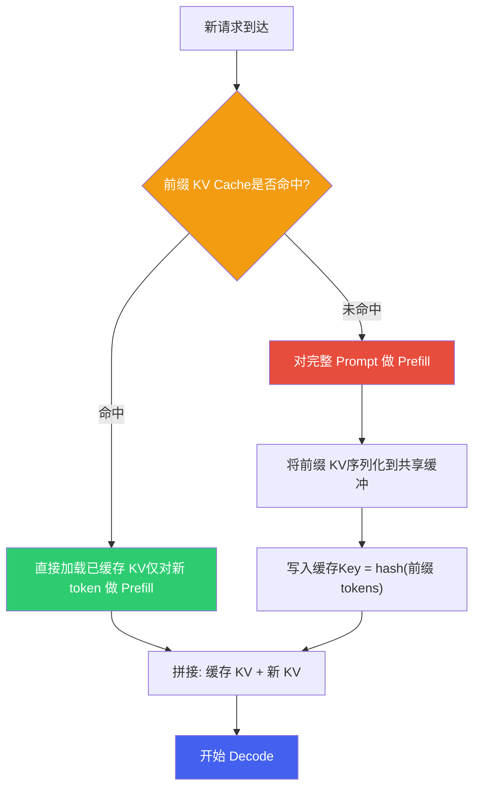
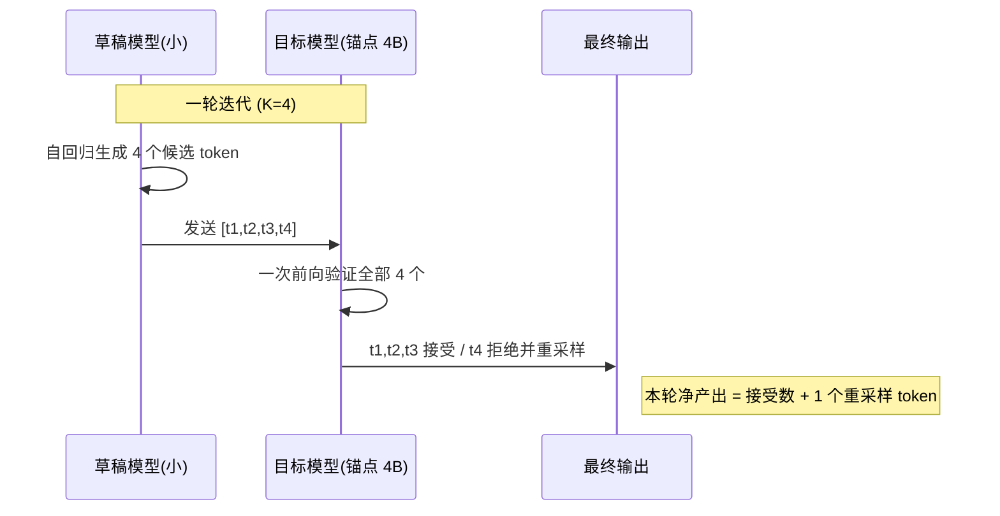
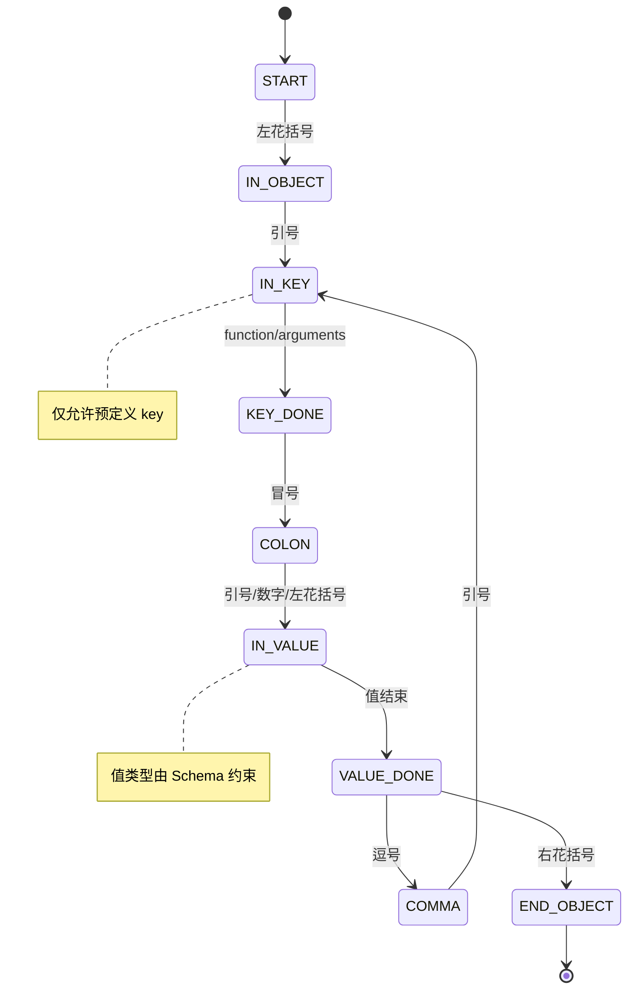
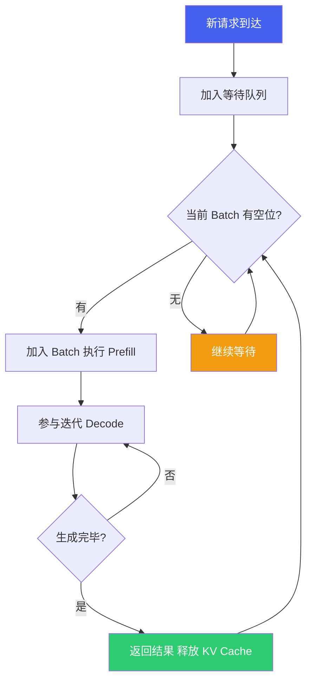
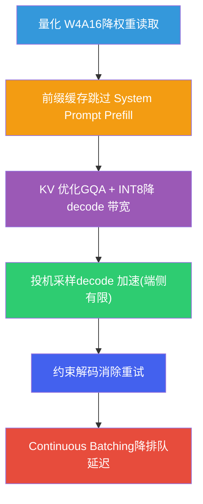

# 6. 端侧解码与服务化优化

*基于 Qualcomm SA8397P 平台  |  前缀缓存 · 投机采样 · 约束解码 · Continuous Batching · 端到端延迟*

> [!TIP]
> **本篇讲什么**
>
> 座舱端侧 LLM 的**工程加速手段**——从原《推理优化》拆出的实战部分，面试最常问：
>
> - 前缀缓存（Prefix Caching）：System Prompt / 多轮对话的 KV 复用
> - 投机采样（Speculative Decoding）：标准加速比公式，以及"端侧到底划不划算"
> - 约束解码（Constrained Decoding）：语法约束 vs 取值域约束
> - Continuous Batching：迭代级调度与 KV 动态管理
> - 端到端延迟优化：把 TTFT 和端到端首屏响应拆成两个指标分别优化
>
> 这些手段都建立在 [LLM 推理原理与性能模型](infer-principles.html) 的 Prefill/Decode 与 Roofline 框架之上；量化方法见 [端侧模型量化与压缩](quantization.html)。

> [!NOTE]
> **锚点模型与数据口径（与全站一致）**
>
> 本篇以 **Qwen3-Omni-4B** 为锚点模型（项目内部定制的 4B 级全模态模型，非公开 Qwen3-Omni 30B-A3B MoE），结构 36 层 / 32 Q head / 8 KV head（GQA）/ head\_dim 128 / 约 4B 参数。平台为 SA8397P：带宽约 68 GB/s、**1 个 cDSP**（HTP 多 graph 时分复用）。完整口径见 [硬件架构](hardware.html) 顶部 NOTE。
>
> 本篇遵循全站「**只讲方法不给数**」约定：文中出现的个别数值一律为**示例参数**，仅用于演示方法、不代表实测，请代入你自己的平台与模型配置计算。

## 1. 前缀缓存 (Prefix Caching)

### 1.1 问题背景

座舱 Agent 每次请求都携带固定的 **System Prompt**（工具定义、人设、安全规则），标准流程中这段相同前缀每次都重新做 Prefill 计算 KV Cache，造成重复计算：

```text
[System Prompt: 固定前缀] + [对话历史] + [视觉 token] + [用户输入]
        ↑ 每次重算 KV = 浪费          ↑ 真正变化的部分
```

### 1.2 前缀缓存原理



### 1.3 节省比例：给推导，不给"60~80%"

> [!IMPORTANT]
> **前缀缓存的节省比例 = 缓存命中的前缀 token 数 ÷ 总 Prefill token 数。**
>
> 这个比例**高度依赖 prompt 结构**，不能拍一个"60~80%"。尤其多模态场景下，总 Prefill token 里含大量**视觉 token**，而文本前缀缓存覆盖不到它们：

```text
示例（非实测）:
  System Prompt 前缀 = 300 文本 token（可缓存）
  视觉 token        = 576（每帧，不可被文本前缀缓存覆盖）
  用户输入          = 50
  总 Prefill token  = 300 + 576 + 50 = 926

  命中时节省比例 = 300 / 926 ≈ 32%   ← 远达不到 80%
```

**结论**：视觉 token 占比越高，文本前缀缓存的收益越低。要真正省 Prefill，得连视觉侧一起想办法（如视觉 token 的缓存/复用、降低单帧视觉 token 数）。

### 1.4 实现方案

```python
import hashlib
import numpy as np

class PrefixKVCache:
    """前缀 KV Cache 管理器"""
    def __init__(self, max_entries=4, max_memory_mb=512):
        self.cache = {}
        self.lru_order = []
        self.max_entries = max_entries
        self.max_memory = max_memory_mb * 1024 * 1024

    def compute_key(self, token_ids):
        return hashlib.sha256(
            np.array(token_ids, dtype=np.int32).tobytes()
        ).hexdigest()[:16]

    def get(self, prefix_tokens):
        key = self.compute_key(prefix_tokens)
        if key in self.cache:
            self.lru_order.remove(key)
            self.lru_order.append(key)
            return self.cache[key]
        return None

    def put(self, prefix_tokens, kv_data):
        key = self.compute_key(prefix_tokens)
        while len(self.cache) >= self.max_entries:
            old_key = self.lru_order.pop(0)
            del self.cache[old_key]
        self.cache[key] = kv_data
        self.lru_order.append(key)

    def prefill_with_cache(self, model, full_prompt_tokens, prefix_len):
        prefix = full_prompt_tokens[:prefix_len]
        suffix = full_prompt_tokens[prefix_len:]
        cached_kv = self.get(prefix)
        if cached_kv is not None:
            return model.prefill(suffix, past_kv=cached_kv)   # 命中：只 prefill 后缀
        kv = model.prefill(full_prompt_tokens)                # 未命中：全量 + 缓存前缀
        self.put(prefix, kv.slice(0, prefix_len))
        return kv
```

### 1.5 多轮对话的分层缓存

| 缓存层级 | 缓存内容 | 缓存时机 |
| :--- | :--- | :--- |
| **L1: System Prompt** | 工具定义 + 人设 + 安全规则 | 应用启动时预计算，常驻内存 |
| **L2: 对话历史** | 前 N 轮对话的 KV | 每轮结束后更新 |
| **L3: 高频模板** | "导航到XX""调空调XX度"等模式 | 统计频率后预计算 |

> [!TIP]
> **Best Practice: Prompt 模板设计**
>
> 为最大化命中率，遵循**"静态在前、动态在后"**：前缀（固定）= System 人设 → 工具定义 → 安全规则 → 输出格式；后缀（变化）= 对话历史 → 车辆状态 → 用户输入。工具集合动态变化时，把稳定的本地工具放前面、动态工具放后面。缓存的前缀 KV 占用可由 [KV Cache 公式](infer-principles.html) 直接算出，据此决定常驻多少。

## 2. 投机采样 (Speculative Decoding)

### 2.1 核心思想

标准自回归解码每个 token 都要等前一个生成完，严格串行、受带宽限制。**投机采样**用一个小的"草稿模型"快速生成 K 个候选 token，再由大的"目标模型"在一次前向中并行验证，把多步串行解码压成一步验证：



### 2.2 验证与接受机制

投机采样是**无损采样**——最终输出分布与直接用目标模型采样一致。对草稿 token `t_i`：

- 接受概率 `min(1, p_target(t_i)/p_draft(t_i))`；随机数 < 接受概率则**接受**，继续验证下一个。
- 否则**拒绝**，从修正分布 `max(0, p_target - p_draft)` 重采样；拒绝后后续草稿 token 全部丢弃。

### 2.3 加速比：用标准公式，别用错版

> [!IMPORTANT]
> **标准加速比公式**
>
> ```text
> Speedup = E[每轮产出 token 数] / E[每轮成本(以目标单步为单位)]
>         = [(1 - α^(K+1)) / (1 - α)] / (1 + K·c)
>
>   α = 单 token 接受率
>   K = 每轮草稿 token 数
>   c = 草稿单步耗时 / 目标单步耗时
> ```
>
> 分子 `(1-α^(K+1))/(1-α)` 是每轮期望产出（含拒绝后白送的 1 个 token，α→1 时趋于 K+1）；分母 `1+K·c` 是每轮成本（1 次目标验证 + K 次草稿生成）。**忽略草稿开销（c）的公式会严重高估加速比。**

### 2.4 端侧的诚实结论：单 HTP 上收益有限

> [!WARNING]
> **在单个 cDSP 上，草稿与目标只能串行，投机采样收益上限约 1.5×，加上草稿权重很可能净亏损。**
>
> 云端可让草稿与目标**并发**（不同器件），c 趋近 0，加速比 ≈ 分子（α=0.85、K=4 时约 3.7×）。但端侧只有 **1 个 cDSP**，draft 与 target 时分串行，**c 由权重比决定**（草稿 ~1.0 GB / 目标 ~2.5 GB → c ≈ 0.4），分母被显著抬高。

```text
示例推导（非实测，c=0.4, K=4 → 每轮成本 = 1 + 4×0.4 = 2.6）:
  α=0.6 → 分子 2.31 → Speedup ≈ 0.89×  (反而更慢)
  α=0.7 → 分子 2.77 → Speedup ≈ 1.07×
  α=0.8 → 分子 3.36 → Speedup ≈ 1.29×
  α=0.85→ 分子 3.71 → Speedup ≈ 1.43×
  α=0.9 → 分子 4.10 → Speedup ≈ 1.58×
```

即便接受率很高，端侧加速也就 **1.4~1.6×**；而代价是草稿模型 ~1.2 GB 权重 + 它自己的 KV Cache 常驻内存。**在内存紧张、又要与 DMS 等模型共存的车机上，这笔账很可能是负的。** 这个"端侧不划算"的判断，比一个乐观的加速比数字有价值得多。

### 2.5 两条容易忽略的限制

- **草稿模型必须与目标模型共享 tokenizer / 词表**——否则拒绝采样无从对齐 token，机制直接失效。
- **多模态场景下草稿模型看不到图像**：锚点是全模态模型，但小草稿模型通常只处理文本。涉及视觉 grounding 的 token，草稿与目标分布差异大，**接受率会崩塌**——而这恰恰是座舱多模态请求的常态。

### 2.6 Token Tree Verification

进阶方案让草稿生成一棵 **Token 树**（每位置扩 2~3 个分支），目标一次前向验证整棵树、取最长有效路径。同等接受率下每轮产出更高——但端侧仍受 §2.4 的串行成本约束，收益上限不变。

> [!WARNING]
> **何时不适合投机采样**
>
> * 输出很短（分类仅 1~3 token）：草稿 + 验证开销反而增加延迟
> * 内存极度紧张：两模型共存挤占其他子系统
> * 接受率过低（< 50%）：频繁拒绝，加速不明显甚至变慢
> * 高创造性任务（高 temperature）：草稿与目标分布差异大，接受率下降

## 3. 约束解码 (Constrained Decoding)

### 3.1 问题背景

座舱 Agent 需要 LLM 输出结构化 JSON 调用 Function Calling：

```json
{"function": "set_ac_temperature", "arguments": {"temp": 24}}
```

但 LLM 是自由生成，可能产出格式错误（缺引号、括号不匹配、字段名拼错），每次错误都意味着一次失败交互和重试成本。

### 3.2 约束解码原理

核心思想：每步生成时，根据已生成内容和目标格式规则，**遮蔽 (mask) 所有不合法 token**，只允许生成合法 token：



### 3.3 三种主要方法

| 方法 | 原理 | 表达能力 | 典型实现 |
| :--- | :--- | :--- | :--- |
| **JSON Schema 引导** | 按 Schema 的类型/枚举/必选字段过滤不合法 token | 中，覆盖标准 JSON | vLLM structured output, Outlines |
| **有限状态机 (FSM)** | 预定义状态转移图，仅允许合法转移的 token | 中，适合正则可描述格式 | Outlines FSM, lm-format-enforcer |
| **上下文无关文法 (CFG)** | BNF/GBNF 定义语法，下推自动机跟踪解析栈 | 最强，支持递归嵌套 | llama.cpp GBNF, guidance |

### 3.4 座舱 Function Calling 约束示例

```text
# GBNF: 座舱 Function Calling 输出约束
root        ::= "{" ws "\"function\"" ws ":" ws func-name ws "," ws "\"arguments\"" ws ":" ws arguments ws "}"
func-name   ::= "\"set_ac_temperature\"" | "\"navigate_to\"" | "\"play_music\"" | "\"window_control\"" | "\"seat_heater\"" | "\"set_volume\""
arguments   ::= "{" ws arg-pair (ws "," ws arg-pair)* ws "}"
arg-pair    ::= "\"" arg-key "\"" ws ":" ws arg-value
arg-key     ::= [a-z_]+
arg-value   ::= number | string | boolean
number      ::= "-"? [0-9]+ ("." [0-9]+)?
string      ::= "\"" [^"\\]* "\""
boolean     ::= "true" | "false"
ws          ::= [ \t\n]*
```

此语法保证 `func-name` 位置只能生成预定义的 6 个函数名之一，杜绝函数名拼错或幻觉调用不存在的工具。

### 3.5 语法约束 ≠ 取值域约束

> [!IMPORTANT]
> **区分两类约束——这是专家级的关键认知。**
>
> - **语法约束（grammar/FSM 可做到 100%）**：输出一定符合 JSON 结构、函数名一定在枚举内、括号一定匹配。GBNF 能严格保证这一层。
> - **取值域约束（grammar 本身保证不了）**：`{"temp": -5}` **语法完全合法**，但语义非法（空调温度不该为负）。上面的 `number ::= "-"? [0-9]+` 恰恰**允许负温度**。
>
> 要约束取值域，有两条路：① **在 grammar 里把范围写死**（如 `temp ::= [0-9] | [1-3][0-9]` 限定 0~39）；② **交给执行器校验**，非法值拒绝并重试。把"格式有效率 100%"当成"参数一定正确"是范畴错误。

### 3.6 约束解码的权衡

> [!NOTE]
> **权衡**
>
> **好处**：消除语法错误、消除因格式失败的重试、降低端到端延迟；工具名枚举防幻觉调用。
>
> **代价**：对自由文本回复（闲聊、解释）不适用——过度约束降低自然性。
>
> **推荐策略**：LLM 先生成一个 `action_type` token 判断是 `tool_call` 还是 `text_reply`；前者启用 GBNF 约束，后者关闭约束自由生成。
>
> **注意**：约束解码省的是"重试"，作用在**端到端延迟**，对 **TTFT 零影响**（见 §5）。

## 4. Continuous Batching

### 4.1 静态批处理的局限

传统静态批处理要求同 batch 内所有请求同时开始、同时结束。由于生成长度不固定，短请求必须等最长请求完成才能释放资源：

| 时刻 | 静态批处理行为 | 问题 |
| :--- | :--- | :--- |
| t=0 | 请求 A（长回复）进入 NPU | — |
| t=0.5 | 请求 B（短回复）到达 | 必须排队等 A |
| t=2.0 | A 完成，释放 NPU | B 白等了 1.5s |
| t=3.2 | B 完成 | B 端到端延迟被 A 拖长 |

座舱多音区场景中，驾驶员/副驾可能在不同时刻发起指令，静态批处理要么串行（延迟高）、要么整 batch 等待（利用率低）。

### 4.2 Continuous Batching 原理

Continuous Batching（Yu et al., 2022, Orca）把调度粒度从**请求级**细化到**迭代级**：每完成一次 Decode 迭代就重新调度——已完成的请求立即释放 KV Cache，新请求可插入当前 batch 做 Prefill。



| 对比维度 | 静态批处理 | Continuous Batching |
| :--- | :--- | :--- |
| **调度粒度** | 请求级（同进同出） | 迭代级（逐 token 调度） |
| **新请求** | 等当前 batch 全部完成 | 下一迭代即可加入 |
| **完成请求** | 等最慢请求 | 立即释放 KV |
| **NPU 利用率** | 低（padding 浪费） | 高（接近持续满载） |
| **平均延迟** | 短请求被拖慢 | 各请求独立完成 |
| **实现复杂度** | 低 | 高（需动态 KV 管理） |

### 4.3 座舱多音区调度

端侧推理框架由**调度器**负责多请求调度。座舱场景的特殊性：

| 座舱特点 | 对调度的影响 | 应对策略 |
| :--- | :--- | :--- |
| **多音区并发** | 驾驶员/副驾/后排可能同时说话 | 按请求来源/会话区分，支持同 batch 内多音区共存 |
| **优先级差异** | 安全告警 > 车控指令 > 闲聊 | 分级优先级调度，高优先级可抢占 |
| **延迟敏感** | 车控指令要求端到端有界 | 高优先级请求跳过等待队列，立即加入 batch |
| **KV 受限** | 端侧内存需多模型共享 | 动态 KV 分配 + 按优先级淘汰低优先级缓存 |
| **请求长度差异大** | 车控短 vs 闲聊长 | 短请求快速释放，避免阻塞后续 |

> [!NOTE]
> **端侧 vs 云端 Batching 差异**
>
> 云端 vLLM 面对数百并发，重点是**吞吐最大化**。端侧座舱通常同时只有 2~4 个请求，Continuous Batching 的核心价值不在吞吐，而在**降低短请求排队延迟**和**支持优先级抢占**——例如副驾闲聊时驾驶员发出紧急车控，车控请求能在下一迭代立即加入，而非等闲聊生成完。

### 4.4 KV Cache 动态管理

Continuous Batching 的核心挑战是 KV 的动态分配与回收。PagedAttention（Kwon et al., 2023, vLLM）把 KV 按固定大小的**页**分配，类似操作系统虚拟内存：

| KV 管理方式 | 内存分配 | 利用率 | 适用场景 |
| :--- | :--- | :--- | :--- |
| **静态预分配** | 按 max\_seq\_len 预留 | 低（大量 padding） | 单请求、固定长度 |
| **动态连续分配** | 按实际长度申请 | 中（碎片化） | 请求数少 |
| **PagedAttention** | 按页（如 16 token/页）分配 | 高（页级管理） | 高并发、变长序列 |

端座舱并发少（2~4 个），动态连续分配通常够用；但引入前缀缓存（多请求共享 System Prompt KV）时，PagedAttention 的页级共享能显著减少重复存储。

## 5. 端到端延迟优化

### 5.1 先分清两个指标

> [!IMPORTANT]
> **TTFT ≠ 端到端首屏响应。把"生成剩余 token"算进 TTFT 是定义错误。**
>
> - **TTFT（Time To First Token）= ViT 编码 + Prefill + 首 token 生成**。它是"用户多久看到第一个字"。
> - **端到端首屏响应 = TTFT + 生成完整首屏回复的剩余 decode**（如一条完整 Function Call JSON）。
>
> 二者优化手段不同，必须分开列。

### 5.2 TTFT 的推导（方法，不是拍数字）

TTFT 的两段主要耗时都用 [Roofline](infer-principles.html) 推：

```text
① Prefill 时间 ≈ Prefill FLOPs ÷ (峰值算力 × MFU)
   Prefill FLOPs ≈ 2 × N_params × S_total
   示例（非实测）: N=4B, S=350 → 2×4e9×350 = 2.8 TFLOP
     W4A16 FP16 峰值 ~17 TFLOPS, MFU ~30% → ≈ 2.8/(17×0.3) ≈ 550 ms

② ViT 编码时间 ≈ ViT FLOPs ÷ (峰值算力 × MFU)
   ViT FLOPs 随视觉 token 数（patch 数）增长，含 N² 注意力项
   单帧纯计算通常在数十 ms 量级（示例）
```

> [!WARNING]
> **两个常见数字陷阱**
>
> - **Prefill 别拍一个与 Roofline 差好几倍的值**（如凭空写 1500ms）。要么给推导（含视觉 token 数、MFU 假设），要么落到与 Roofline 自洽的量级。
> - **ViT 耗时区分"纯计算"与"含排队"**：单帧 ViT 纯计算是数十 ms 量级；若看到数百 ms，多半是**含在单 cDSP 上排队等待**的端到端数字（见 [多 graph 时分复用](infer-principles.html)），必须标注清楚，否则会和纯计算值差出一个数量级。

### 5.3 TTFT 优化（只列真正影响 TTFT 的手段）

| 优化手段 | 对 TTFT 的作用 | 原理 |
| :--- | :--- | :--- |
| **权重量化 (W4A16)** | 降低 | 减少 Prefill 权重加载字节 |
| **前缀缓存** | 降低 | 跳过 System Prompt 的 Prefill（节省比例见 §1.3） |
| **Context Binary** | 降低 | 离线编译，消除运行时图编译 |
| **降低视觉 token 数** | 降低 | 直接缩短 Prefill 序列 S |
| **ViT 优先级调度** | 降低排队部分 | 让活跃请求的 ViT 少排队（§5.2 陷阱②） |
| ~~投机采样~~ | **无影响** | 只加速 decode，对 Prefill/TTFT 零作用 |
| ~~约束解码~~ | **无影响** | 省的是重试，属端到端，不属 TTFT |

### 5.4 端到端首屏响应优化

| 优化手段 | 对端到端的作用 | 原理 |
| :--- | :--- | :--- |
| **投机采样** | 降低（端侧上限 ~1.5×，见 §2.4） | 一次验证 K 个 token，加速 decode |
| **约束解码** | 降低 | 消除格式失败的重试 |
| **Continuous Batching** | 降低排队 | 短请求不被长请求拖慢 |
| **decode 带宽优化** | 降低 | KV INT8 / GQA 减少每 token 读取（见 [原理篇](infer-principles.html)） |
| **时分重叠（多 graph）** | 提升吞吐，**不降单请求延迟** | 见 [原理篇 §5.4](infer-principles.html) |

### 5.5 优化技术栈总览



> [!TIP]
> **实战部署建议（按性价比）**
>
> * **必做**：W4A16 量化 + Context Binary——成本最低、对 TTFT 和 decode 都有收益。
> * **强烈推荐**：前缀缓存 + KV INT8/GQA——直接砍 Prefill 与 decode 带宽。
> * **谨慎评估**：投机采样——端侧单 cDSP 上收益有限且吃内存（§2.4），先算账再上。
> * **按场景**：约束解码——Function Calling 场景收益明确，自由对话场景关闭。
>
> 所有具体延迟值请用 §5.2 的推导链代入你自己的平台参数得出，不要照搬任何"标准答案"。
