# 3. 推理优化

*以 Qwen3-Omni-4B 为例  |  量化 · AIMET · KV Cache · 多核绑定 · 前缀缓存 · 投机采样 · 约束解码*

## 1. 模型量化基础

### 1.1 PTQ 与 QAT 流程

模型量化是端侧部署的关键步骤，将 FP32 模型转换为低精度 (INT8/INT4) 以加速推理。两种主要方法是 **训练后量化 (PTQ)** 和 **量化感知训练 (QAT)**：

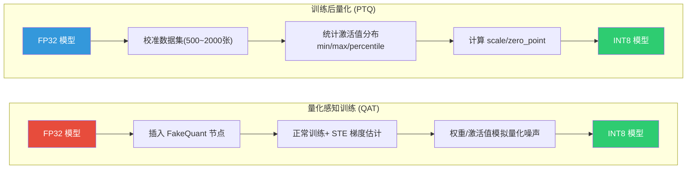

### 1.2 PTQ 与 QAT 对比

| 维度 | PTQ (训练后量化) | QAT (量化感知训练) |
| :--- | :--- | :--- |
| **开发成本** | 低，无需重新训练 | 高，需要完整训练流程 |
| **精度损失** | 较大 (0.5~2.0%) | 较小 (0.1~0.5%) |
| **校准数据需求** | 500~2000 张代表性数据 | 完整训练集 |
| **训练时间** | 分钟级 | 小时~天级 (原始训练的 10~30%) |
| **适用场景** | 模型精度冗余大、对精度要求不高 | 精度敏感任务、安全关键应用 |
| **QNN 工具** | qnn-onnx-converter + 校准参数 | AIMET (AI Model Efficiency Toolkit) |
| **推荐优先级** | 优先尝试，快速验证 | PTQ 精度不达标时使用 |

### 1.3 混合精度策略

> [!TIP]
> **Best Practice: 混合精度量化策略**
>
> 在实际部署中，模型不同层对量化的敏感度不同。推荐的混合精度策略：
>
> | 模型组件 | 推荐精度 | 原因 |
> | --- | --- | --- |
> | **Backbone (骨干网络)** | INT8 | 特征提取层对量化鲁棒，且计算量最大，INT8 加速收益最高 |
> | **FPN (特征金字塔)** | INT8 | 多尺度融合层对量化相对鲁棒 |
> | **Detection Head (检测头)** | INT16 | 分类和回归输出对精度敏感，INT16 避免量化误差累积 |
> | **Keypoint Regression (关键点回归)** | INT16 | 亚像素级精度要求高，INT8 会导致关键点抖动 |
>
> 使用 QNN 的 `--input_list` 和 `--param_quantizer` 选项可以为不同算子指定不同的量化精度。AIMET 也支持通过敏感度分析自动推荐混合精度配置。

## 2. AIMET 量化工具

### 2.1 AIMET 概述

**AIMET (AI Model Efficiency Toolkit)** 是高通创新中心 (Qualcomm Innovation Center) 开源的模型优化工具包，专注于**模型量化与压缩**。在端侧 AI 项目中，AIMET 是连接训练框架（PyTorch/TensorFlow）与 QNN 部署的关键桥梁——它提供了比通用量化工具更精细的量化控制能力，特别适合**精度敏感的安全关键场景**（如 DMS 疲劳检测）。

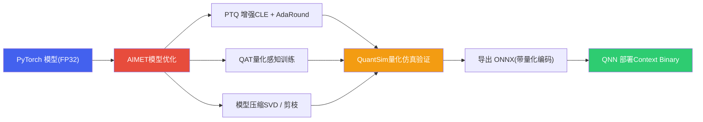

### 2.2 AIMET 核心技术

| 技术 | 原理 | 适用场景 | 精度收益 |
| :--- | :--- | :--- | :--- |
| **CLE (Cross-Layer Equalization)** | 利用 ReLU 的缩放不变性，均衡相邻层的权重范围，减少量化截断误差。无需训练数据，纯数学变换。 | PTQ 前的预处理，对 MobileNet/EfficientNet 等 Depthwise Conv 结构效果显著 | PTQ 精度提升 1~3% |
| **Bias Correction** | 补偿量化引入的系统性偏差：计算 FP32 和量化输出的均值差异，修正 bias 参数 | CLE 之后配合使用，进一步消除量化偏差 | 额外提升 0.3~0.8% |
| **AdaRound (Adaptive Rounding)** | 传统量化使用最近邻取整 (round-to-nearest)，AdaRound 通过优化每个权重的取整方向，最小化量化后的输出误差 | PTQ 场景下的精度恢复，需要少量校准数据 (200~1000 张) | 接近 QAT 精度，但无需重训 |
| **QuantSim (Quantization Simulation)** | 在 FP32 环境中模拟量化行为，插入 FakeQuant 节点，允许在 GPU 上验证量化精度而无需真实硬件 | 快速验证量化方案可行性，调试量化敏感层 | —（验证工具） |
| **Mixed Precision (自动混合精度)** | 基于敏感度分析，自动为每一层选择最优量化位宽 (INT8/INT16/FP16)，在精度和性能之间取最优平衡 | 复杂模型中不同层量化敏感度差异大的场景 | 比均匀 INT8 精度提升 0.5~2% |
| **QAT (量化感知训练)** | 在训练中插入 FakeQuant 节点，使用 STE (Straight-Through Estimator) 估计梯度，让模型学习适应量化噪声 | PTQ 精度不达标时的最终手段，需要完整训练集和训练时间 | 精度损失通常 < 0.5% |
| **模型压缩 (SVD / Channel Pruning)** | SVD 分解大权重矩阵为低秩近似；通道剪枝移除不重要的卷积通道 | 模型参数量过大，需要结构性压缩 | 压缩 2~4x，精度损失 0.5~1.5% |

### 2.3 AIMET 量化工作流

以 DMS 人脸关键点模型的 PTQ 优化为例，展示 AIMET 的典型工作流：

```python
import torch
from aimet_torch.model_preparer import prepare_model
from aimet_torch.cross_layer_equalization import equalize_model
from aimet_torch.adaround.adaround_weight import Adaround, AdaroundParameters
from aimet_torch.quantsim import QuantizationSimModel

# 1. 加载 FP32 模型
model = load_dms_model("mobilenetv3_face_landmarks.pth")
model.eval()

# 2. 准备模型 (自动替换不兼容层)
model = prepare_model(model)

# 3. Cross-Layer Equalization — 均衡权重范围
equalize_model(model, input_shapes=(1, 3, 224, 224))

# 4. AdaRound — 自适应取整优化
params = AdaroundParameters(
    data_loader=calib_loader,        # 校准数据 (500~1000 张)
    num_batches=50,
    default_num_iterations=10000,
    default_reg_param=0.01
)
model = Adaround.apply_adaround(
    model,
    dummy_input=torch.randn(1, 3, 224, 224),
    params=params,
    path="./adaround_output",
    filename_prefix="dms_model"
)

# 5. QuantSim — 量化仿真验证
quantsim = QuantizationSimModel(
    model,
    dummy_input=torch.randn(1, 3, 224, 224),
    quant_scheme='tf_enhanced',     # 高通推荐的量化方案
    default_output_bw=8,            # 激活值 INT8
    default_param_bw=8              # 权重 INT8
)

# 6. 在 QuantSim 上计算校准编码
quantsim.compute_encodings(
    forward_pass_callback=calibration_forward,
    forward_pass_callback_args=calib_loader
)

# 7. 验证量化精度
quant_accuracy = evaluate(quantsim.model, val_loader)
print(f"FP32 精度: 95.2% → 量化后精度: {quant_accuracy:.1f}%")

# 8. 导出量化模型 (ONNX + 量化编码)
quantsim.export(
    path="./export_output",
    filename_prefix="dms_model_int8",
    dummy_input=torch.randn(1, 3, 224, 224)
)
# 输出: dms_model_int8.onnx + dms_model_int8.encodings
# → 下一步: qnn-onnx-converter 转换为 QNN 模型
```

### 2.4 AIMET 敏感度分析与混合精度

AIMET 支持逐层敏感度分析，自动识别量化敏感层并推荐混合精度配置：

```python
from aimet_torch.quant_analyzer import QuantAnalyzer

# 敏感度分析
analyzer = QuantAnalyzer(model, dummy_input=torch.randn(1, 3, 224, 224))
analyzer.enable_per_layer_mse_loss(
    unlabeled_dataset_iterable=calib_loader,
    num_batches=20
)
# 生成每层量化 MSE 分析报告
analyzer.analyze(
    quant_scheme='tf_enhanced',
    default_param_bw=8,
    default_output_bw=8,
    config_file=None,
    results_dir="./sensitivity_results"
)
# 输出: HTML 报告 + 每层 MSE 柱状图
# → 高 MSE 的层建议保持 INT16/FP16
```

> [!TIP]
> **Best Practice: AIMET 在座舱量化项目中的推荐流程**
>
> **标准路径**：CLE → Bias Correction → AdaRound → QuantSim 验证 → 导出 ONNX → QNN 转换。80% 的模型用这条 PTQ 增强路径即可达标，无需进入 QAT。
>
> **关键经验**：
>
> * **CLE 对 Depthwise Conv 效果最好**：MobileNet 系列模型在 CLE 后 PTQ 精度通常可提升 1~3 个百分点
> * **AdaRound 校准数据不需要标注**：只需代表性图片，500 张通常足够
> * **quant\_scheme 选择**：高通平台推荐 `tf_enhanced`（对称量化 + 分位数校准），比 `tf`（min-max）精度更好
> * **导出格式**：AIMET 导出的 ONNX + .encodings 文件可被 `qnn-onnx-converter` 直接识别，量化参数无缝传递
> * **敏感度分析报告**：对精度损失超过 0.5% 的层，优先尝试 INT16 而非 QAT，开发成本更低

### 2.5 AIMET vs 其他量化工具对比

| 维度 | AIMET | QNN Converter 内置量化 | PyTorch 原生量化 | ONNX Runtime 量化 |
| :--- | :--- | :--- | :--- | :--- |
| **CLE / AdaRound** | 内置 | 不支持 | 不支持 | 不支持 |
| **敏感度分析** | 逐层 MSE 分析 + HTML 报告 | 不支持 | 不支持 | 不支持 |
| **QAT 支持** | 完整 QAT + Range Learning | 仅 PTQ | FakeQuant QAT | 仅 PTQ |
| **混合精度** | 自动推荐 + 手动配置 | 手动指定 | 手动指定 | 不支持 |
| **QNN 集成** | 导出 .encodings 无缝衔接 | 原生 | 需转 ONNX 再转 QNN | 需再转 QNN |
| **模型压缩** | SVD + Channel Pruning | 不支持 | Pruning API | 不支持 |
| **推荐场景** | 高通平台精度敏感的量化优化 | 快速 PTQ 验证 | 非高通平台 QAT | ONNX 模型快速量化 |

> [!WARNING]
> **AIMET 与 QNN 的配合关系**
>
> AIMET 和 QNN 不是竞争关系，而是上下游配合：
>
> * **AIMET**：在训练侧（PyTorch/TF）做量化优化、精度调试、敏感度分析，输出量化编码后的 ONNX
> * **QNN Converter**：接收 AIMET 的量化 ONNX，转换为 QNN 模型格式，编译为 Context Binary
> * **典型链路**：PyTorch → AIMET (CLE+AdaRound) → ONNX+encodings → qnn-onnx-converter → Context Binary → HTP 推理
>
> 如果 QNN Converter 内置的 PTQ 精度已达标（精度损失 < 1%），可以跳过 AIMET 直接部署。AIMET 是精度不够时的"精准手术刀"。

## 3. KV Cache 优化

### 3.1 KV Cache 优化策略

KV Cache 是 LLM 推理中内存占用的主要来源。标准 Transformer 每个 token 都需要保存 Key 和 Value 向量，内存随序列长度线性增长。以下是主要优化策略：

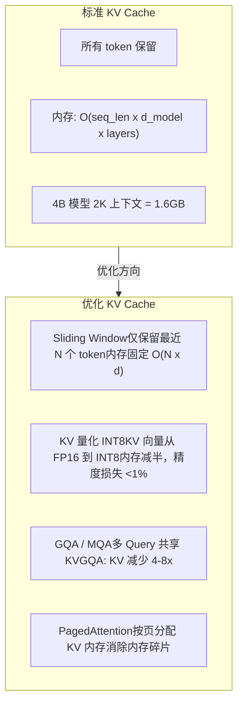

| 优化方法 | 原理 | 内存节省 | 精度影响 | 适用场景 |
| :--- | :--- | :--- | :--- | :--- |
| **Sliding Window** | 只保留最近 W 个 token 的 KV，超出窗口的丢弃 | 固定上限，不随长度增长 | 长距离依赖丢失 | 单轮对话、实时车控指令 |
| **KV Quantization INT8** | KV 向量从 FP16 量化到 INT8 存储 | 减少约 50% | 损失 < 1% | 多轮对话、内存受限场景 |
| **GQA / MQA** | 多个 Query Head 共享一组 KV Head | GQA 减少 4-8 倍 | 几乎无损 | 新一代模型原生支持 |
| **PagedAttention** | 按页（block）分配 KV 内存，类似操作系统虚拟内存 | 减少碎片，提高利用率 | 无损 | 多并发请求、长序列 |

### 3.2 Qwen3-Omni-4B KV Cache 内存估算

以 Qwen3-Omni-4B 为例，KV Cache 内存随上下文长度的增长：

| 上下文长度 | FP16 KV Cache | INT8 KV Cache | GQA + INT8 |
| :--- | :--- | :--- | :--- |
| 512 tokens | ~400 MB | ~200 MB | ~50 MB |
| 1024 tokens | ~800 MB | ~400 MB | ~100 MB |
| 2048 tokens | ~1.6 GB | ~800 MB | ~200 MB |
| 4096 tokens | ~3.2 GB | ~1.6 GB | ~400 MB |

> [!TIP]
> **端侧推荐配置**
>
> 在 SA8397P 上部署 Qwen3-Omni-4B，推荐组合：**GQA (原生支持) + KV INT8 量化 + Sliding Window (1024)**。这套组合可以将 KV Cache 内存控制在 100~200 MB 以内，为模型权重和其他运行时数据留出充足内存空间。

## 4. 推理引擎对比

### 4.1 LLM 推理引擎性能对比

在端侧部署 Qwen3-Omni-4B INT4 模型时，不同推理引擎的性能差异显著：

**Qwen3-Omni-4B INT4 推理引擎对比**

| 类别 | 生成速度 (tok/s) | TTFT (ms/10) | 内存占用 (GB*10) |
| :--- | :--- | :--- | :--- |
| llama.cpp | 12 | 80 | 21 |
| MLC-LLM | 15 | 65 | 18 |
| ExecuTorch | 11 | 90 | 23 |
| QNN-LLM | 18 | 50 | 16 |

| 推理引擎 | 生成速度 (tok/s) | TTFT (ms) | 内存占用 (GB) | 平台支持 | 特点 |
| :--- | :--- | :--- | :--- | :--- | :--- |
| **llama.cpp** | 12 | 800 | 2.1 | CPU/GPU/NPU（有限） | 跨平台，社区活跃，INT4/INT8 支持好 |
| **MLC-LLM** | 15 | 650 | 1.8 | CPU/GPU/NPU | TVM 编译优化，自动算子调优 |
| **ExecuTorch** | 11 | 900 | 2.3 | CPU/GPU/XNNPACK | PyTorch 生态，移动端优先 |
| **QNN-LLM** | 18 | 500 | 1.6 | Hexagon NPU 原生 | 高通原生引擎，NPU 算子最优，TTFT 最低 |

> [!TIP]
> **选型建议**
>
> 在 SA8397P 平台上，**QNN-LLM** 是性能最优选择：生成速度最快（18 tok/s）、TTFT 最低（500ms）、内存最省（1.6 GB）。其核心优势来自 Hexagon NPU 原生算子优化和 Context Binary 编译加速。如需跨平台兼容性，**MLC-LLM** 是次优选择。

## 5. ViT+LLM 多核绑定

### 5.1 Qwen3-Omni 多模态架构

Qwen3-Omni-4B 是一个原生多模态模型，其架构包含 **ViT 视觉编码器**（Vision Transformer）和 **LLM 语言解码器** 两个主要计算模块。在标准部署中，两者共享同一个 HTP 核心，导致计算资源无法充分利用：


### 5.2 单核串行 vs 多核并行

在标准的单核串行执行中，ViT 编码和 LLM 解码必须依次完成，导致 HTP 利用率不足。通过将 ViT 和 LLM 分别绑定到不同的 HTP 核心，可以实现流水线并行执行：

```mermaid
gantt
    title 单核串行 vs 多核并行执行时序
    dateFormat X
    axisFormat %Lms

    section 单核串行 (HTP Core 0)
    ViT 编码 Frame 1         :done, v1, 0, 8
    LLM Prefill Frame 1      :active, l1, 8, 20
    LLM Decode (Token 1-5)   :d1, 20, 30
    ViT 编码 Frame 2         :v2, 30, 38

    section 多核并行 Core 0 - ViT
    ViT 编码 Frame 1         :done, mv1, 0, 8
    ViT 编码 Frame 2         :active, mv2, 12, 20
    ViT 编码 Frame 3         :mv3, 24, 32

    section 多核并行 Core 1 - LLM
    等待 ViT 结果             :crit, wait, 0, 8
    LLM Prefill Frame 1      :active, ml1, 8, 20
    LLM Decode (Token 1-5)   :md1, 20, 30
```

### 5.3 多核绑定实现

SA8397P 的 Hexagon NPU 包含多个 HTP 核心。通过 QNN 的 `core_affinity` 参数，可以将不同模型绑定到指定核心：

```c
// QNN 多核绑定配置示例
#include "QnnContext.h"
#include "QnnDevice.h"

// 为 ViT 编码器创建 Context，绑定到 HTP Core 0
QnnContext_Config_t vit_config;
vit_config.option = QNN_CONTEXT_CONFIG_OPTION_CORE_AFFINITY;
vit_config.coreAffinity = 0;  // HTP Core 0
Qnn_ContextHandle_t vit_context;
qnn_interface.contextCreate(backend, device, &vit_config, &vit_context);

// 为 LLM 解码器创建 Context，绑定到 HTP Core 1
QnnContext_Config_t llm_config;
llm_config.option = QNN_CONTEXT_CONFIG_OPTION_CORE_AFFINITY;
llm_config.coreAffinity = 1;  // HTP Core 1
Qnn_ContextHandle_t llm_context;
qnn_interface.contextCreate(backend, device, &llm_config, &llm_context);

// 核间数据传递：使用共享 ION Buffer
// ViT 输出 → ION Buffer → LLM 输入
ion_alloc_data_t ion_buf;
ion_buf.len = VIT_OUTPUT_SIZE;  // 视觉特征向量大小
ion_buf.flags = ION_FLAG_CACHED;
ioctl(ion_fd, ION_IOC_ALLOC, &ion_buf);
```

### 5.4 流水线优化细节

多核绑定的核心收益在于 **Prefill 阶段的重叠执行**：当 LLM 在对第 N 帧的视觉 token 做 KV 计算时，ViT 可以同时预处理第 N+1 帧的图像。核间通信通过 **共享 VTCM（Vector Tightly-Coupled Memory）或 ION Buffer** 实现，延迟极低（< 0.1ms）。

| 指标 | 单核串行 | 双核并行 | 提升 |
| :--- | :--- | :--- | :--- |
| **多模态 Prefill 延迟** | ~1500 ms | ~900 ms | 约 40% 降低 |
| **连续帧处理吞吐** | ~0.67 FPS | ~1.1 FPS | 约 60% 提升 |
| **HTP 利用率** | ~50% | ~85% | +35 百分点 |
| **ViT 编码延迟** | ~800 ms (排队等待) | ~400 ms (立即执行) | 约 50% 降低 |
| **核间通信开销** | — (无需) | < 0.1 ms | 可忽略 |

> [!NOTE]
> **注意事项**
>
> 多核绑定需要确认目标平台的 HTP 核心数量。SA8397P 通常具备 2 个 HTP 核心，支持上述双核方案。部分低端平台可能仅有 1 个 HTP 核心，此时无法使用此优化。此外，两个模型同时运行会增加总内存占用和功耗，需根据散热预算评估可行性。

## 6. 前缀缓存 (Prefix Caching)

### 6.1 问题背景

在座舱 Agent 场景中，每次用户请求都携带一段固定的 **System Prompt**（包含工具定义、人设描述、安全规则等），通常占 200~500 个 token。标准推理流程中，这段相同的前缀每次都要重新做 Prefill 计算 KV Cache，造成大量重复计算：

```text
[System Prompt: 200~500 tokens] + [用户输入: 20~100 tokens]
         ↑                                ↑
   每次都重新计算 KV Cache          真正变化的部分
   = 浪费 60~80% 的 Prefill 时间
```

### 6.2 前缀缓存原理

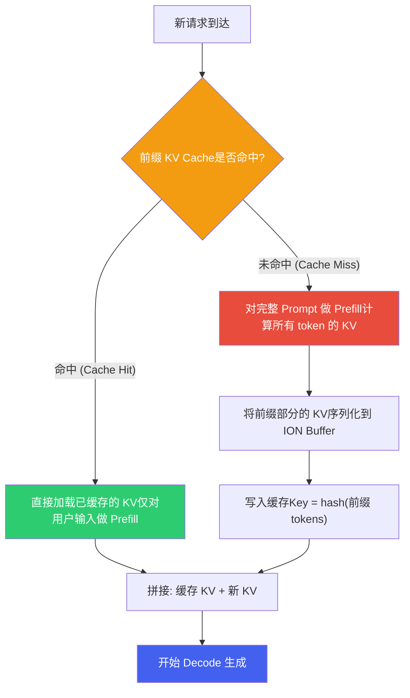

### 6.3 实现方案

```python
import hashlib
import numpy as np

class PrefixKVCache:
    """前缀 KV Cache 管理器"""
    def __init__(self, max_entries=4, max_memory_mb=512):
        self.cache = {}           # {hash -> kv_data}
        self.lru_order = []       # LRU 淘汰队列
        self.max_entries = max_entries
        self.max_memory = max_memory_mb * 1024 * 1024

    def compute_key(self, token_ids):
        """根据 token 序列计算缓存 key"""
        return hashlib.sha256(
            np.array(token_ids, dtype=np.int32).tobytes()
        ).hexdigest()[:16]

    def get(self, prefix_tokens):
        """查找前缀 KV Cache"""
        key = self.compute_key(prefix_tokens)
        if key in self.cache:
            # 更新 LRU 顺序
            self.lru_order.remove(key)
            self.lru_order.append(key)
            return self.cache[key]  # Cache Hit
        return None  # Cache Miss

    def put(self, prefix_tokens, kv_data):
        """存入前缀 KV Cache"""
        key = self.compute_key(prefix_tokens)
        # LRU 淘汰
        while len(self.cache) >= self.max_entries:
            old_key = self.lru_order.pop(0)
            del self.cache[old_key]
        self.cache[key] = kv_data
        self.lru_order.append(key)

    def prefill_with_cache(self, model, full_prompt_tokens, prefix_len):
        """带缓存的 Prefill"""
        prefix = full_prompt_tokens[:prefix_len]
        suffix = full_prompt_tokens[prefix_len:]

        cached_kv = self.get(prefix)
        if cached_kv is not None:
            # Cache Hit: 仅对 suffix 做 Prefill
            kv = model.prefill(suffix, past_kv=cached_kv)
        else:
            # Cache Miss: 完整 Prefill + 缓存前缀
            kv = model.prefill(full_prompt_tokens)
            prefix_kv = kv.slice(0, prefix_len)
            self.put(prefix, prefix_kv)
        return kv
```

### 6.4 多轮对话的前缀缓存

前缀缓存不仅适用于 System Prompt，还可以扩展到多轮对话中——前几轮对话的 KV Cache 也可以缓存复用：

| 缓存层级 | 缓存内容 | 缓存频率 | TTFT 节省 |
| :--- | :--- | :--- | :--- |
| **L1: System Prompt** | 工具定义 + 人设 + 安全规则 (200~500 tokens) | 应用启动时预计算，常驻内存 | 60~80% |
| **L2: 对话历史** | 前 N 轮对话的 KV Cache | 每轮对话结束后更新 | 30~50% (增量部分) |
| **L3: 常用查询模板** | "导航到XX"、"调空调XX度" 等高频模式 | 统计频率后预计算 | 20~40% |

> [!TIP]
> **Best Practice: Prompt 模板设计**
>
> 为了最大化前缀缓存命中率，Prompt 模板应遵循**"静态在前，动态在后"**的原则：
>
> * **前缀部分（固定）**：System 人设 → 工具定义（JSON Schema）→ 安全规则 → 输出格式要求
> * **后缀部分（变化）**：对话历史 → 当前车辆状态 → 用户最新输入
> * 如果工具集合动态变化（如联网后新增云端工具），应将稳定的本地工具放在前面，动态工具放在后面
> * 在 SA8397P 上，缓存 500 token 前缀的 KV Cache 约占用 50~80 MB 内存（INT8 量化 + GQA），可以常驻

## 7. 投机采样 (Speculative Decoding)

### 7.1 核心思想

标准自回归解码中，每个 token 必须等前一个 token 生成完毕才能开始——Decode 阶段是严格串行的，受限于内存带宽。**投机采样**利用一个小型"草稿模型"(Draft Model) 快速生成 K 个候选 token，然后由大型"目标模型"(Target Model) 在一次前向传播中并行验证这 K 个 token，从而将多步串行解码压缩为一步并行验证：

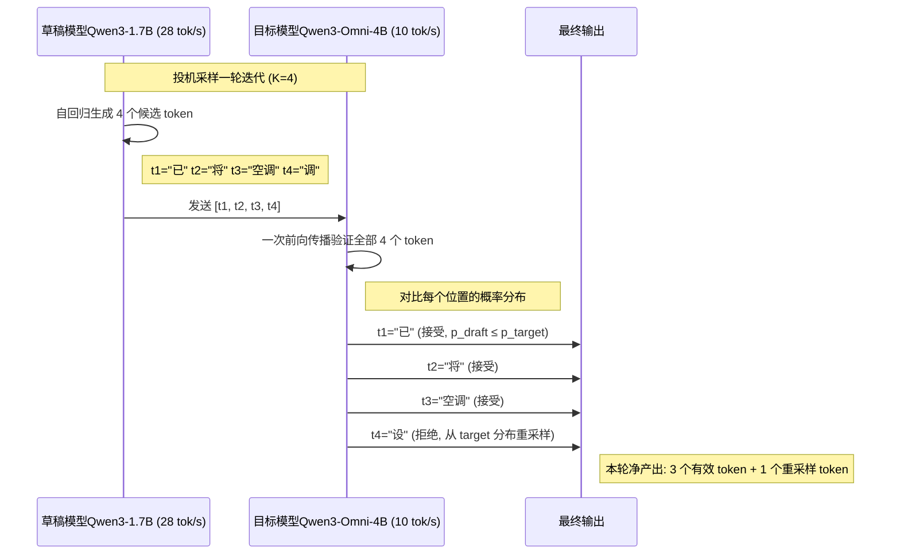

### 7.2 验证与接受机制

投机采样的数学保证：最终输出的分布与直接使用目标模型采样完全一致（无损采样）。验证过程如下：

对于草稿模型在位置 i 生成的 token `t_i`：

- 计算接受概率 `min(1, p_target(t_i) / p_draft(t_i))`
- 若随机数 < 接受概率 → **接受**该 token，继续验证下一个
- 若随机数 ≥ 接受概率 → **拒绝**该 token，从修正分布 `max(0, p_target - p_draft)` 重新采样
- 拒绝后，后续草稿 token 全部丢弃

### 7.3 端侧配置方案

| 参数 | 端侧推荐 (SA8397P) | 云端推荐 | 说明 |
| :--- | :--- | :--- | :--- |
| **草稿模型** | Qwen3-1.7B INT4 | Qwen3-4B INT8 | 端侧选最小可用模型，降低内存压力 |
| **目标模型** | Qwen3-Omni-4B INT4 | Qwen3-Omni-4B FP16 | 端侧用 INT4 量化版本 |
| **猜测长度 K** | 3~5 | 8~16 | 端侧内存有限，K 不宜过大 |
| **草稿模型内存** | ~1.2 GB | ~4 GB | Qwen3-1.7B INT4 约 1.2 GB |
| **目标模型内存** | ~2.5 GB | ~8 GB | Qwen3-Omni-4B INT4 约 2.5 GB |
| **总内存** | ~3.7 GB | ~12 GB | SA8397P LPDDR5 可承载 |
| **典型接受率** | 70~85% | 75~90% | 同族模型接受率更高 |

### 7.4 加速效果分析

理论加速比公式：`Speedup = K / (1 + K * (1 - alpha))`，其中 alpha 为接受率。实际加速效果受草稿模型推理速度、验证开销等因素影响：

**投机采样加速比 (K=4, 不同接受率)**（理论加速比 · 端侧实测 (K=4)）

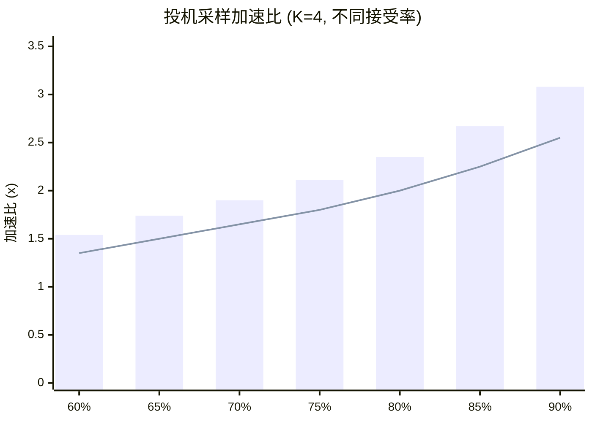

### 7.5 Token Tree Verification

进阶方案中，草稿模型不是生成单一序列，而是生成一棵 **Token 树**（Tree-structured Speculation）。每个位置扩展 2~3 个候选分支，目标模型通过一次前向传播验证整棵树，选取最长的有效路径。这种方法在同等接受率下，可以进一步提升每轮迭代的有效 token 产出。

> [!WARNING]
> **何时不适合使用投机采样**
>
> * **输出很短时**（如分类任务仅输出 1~3 个 token），投机采样的草稿生成和验证开销反而增加延迟
> * **内存极度紧张时**，两个模型同时驻留可能挤占其他子系统（如 DMS 模型）的内存
> * **草稿-目标接受率过低时**（< 50%），频繁拒绝导致加速效果不明显甚至变慢
> * **高创造性任务时**（高 temperature），草稿模型和目标模型的分布差异增大，接受率下降
>
> 座舱场景中，Function Calling 输出格式固定、可预测性强，接受率通常较高（>80%），非常适合投机采样。

## 8. 约束解码 (Constrained Decoding)

### 8.1 问题背景

座舱 Agent 需要 LLM 输出结构化的 JSON 来调用 Function Calling API，例如：

```json
{"function": "set_ac_temperature", "arguments": {"temp": 24}}
```

然而 LLM 本质是基于概率的自由生成，可能产出格式错误的输出——缺少引号、括号不匹配、字段名拼写错误等。每次输出格式错误都意味着一次失败的交互和额外的重试成本（20~30% 的请求可能需要重试）。

### 8.2 约束解码原理

约束解码的核心思想：在每一步 token 生成时，根据已生成的内容和目标格式规则，**遮蔽 (mask) 所有不合法的 token**，只允许生成合法的 token。这确保了输出一定符合预定格式。

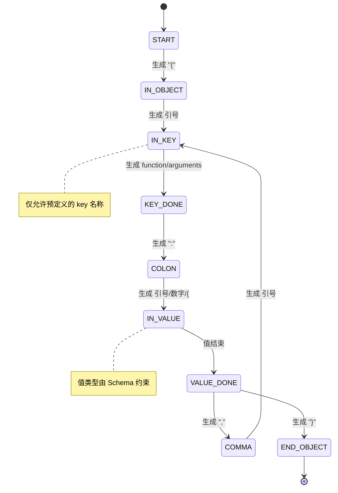

### 8.3 三种主要方法

| 方法 | 原理 | 表达能力 | 性能开销 | 典型实现 |
| :--- | :--- | :--- | :--- | :--- |
| **JSON Schema 引导** | 根据 JSON Schema 的类型、枚举、必选字段等规则，在每步生成时过滤不合法 token | 中等，覆盖标准 JSON 格式 | ~5% 推理开销 | vLLM structured output, Outlines |
| **有限状态机 (FSM)** | 预定义状态转移图（如上图），跟踪当前解码位置处于哪个状态，仅允许合法转移对应的 token | 中等，适合正则可描述的格式 | ~8% 推理开销 | Outlines FSM, lm-format-enforcer |
| **上下文无关文法 (CFG)** | 用 BNF/GBNF 定义完整语法规则，使用下推自动机跟踪解析栈，精确控制每一步可生成的 token | 最强，支持递归嵌套结构 | ~10~15% 推理开销 | llama.cpp GBNF, guidance |

### 8.4 座舱 Function Calling 约束示例

以下 GBNF 语法定义了座舱 Function Calling 的输出格式约束：

```text
# GBNF 语法: 座舱 Function Calling 输出约束
root        ::= "{" ws "\"function\"" ws ":" ws func-name ws "," ws "\"arguments\"" ws ":" ws arguments ws "}"
func-name   ::= "\"set_ac_temperature\"" | "\"navigate_to\"" | "\"play_music\"" | "\"window_control\"" | "\"seat_heater\"" | "\"set_volume\""
arguments   ::= "{" ws arg-pair (ws "," ws arg-pair)* ws "}"
arg-pair    ::= "\"" arg-key "\"" ws ":" ws arg-value
arg-key     ::= [a-z_]+
arg-value   ::= number | string | boolean
number      ::= "-"? [0-9]+ ("." [0-9]+)?
string      ::= "\"" [^"\\]* "\""
boolean     ::= "true" | "false"
ws          ::= [ \t\n]*
```

使用此语法约束后，LLM 在 `func-name` 位置只能生成预定义的 6 个函数名之一，杜绝了函数名拼错或幻觉生成不存在工具的问题。

### 8.5 约束解码效果评估

| 指标 | 无约束 | JSON Schema 引导 | FSM | GBNF 语法 |
| :--- | :--- | :--- | :--- | :--- |
| **格式有效率** | 72~85% | 99.5% | 99.8% | 100% |
| **函数名准确率** | 88% | 95% | 100% | 100% |
| **参数类型正确率** | 90% | 98% | 99% | 100% |
| **推理速度开销** | 基准 | ~5% | ~8% | ~12% |
| **重试成本节省** | 基准 | ~25% | ~28% | ~30% |

> [!NOTE]
> **约束解码的权衡**
>
> **严格约束的好处**：100% 格式正确，消除重试，降低端到端延迟；工具名枚举约束防止幻觉调用不存在的 API。
>
> **严格约束的代价**：对自由文本回复（如闲聊、解释说明）不适用——过度约束会降低回复的自然性和多样性。
>
> **推荐策略**：LLM 先生成一个 `action_type` token 判断是 "tool\_call" 还是 "text\_reply"。若为 tool\_call，启用 GBNF 约束；若为 text\_reply，关闭约束自由生成。

## 9. TTFT 端到端优化

### 9.1 TTFT 延迟分解

Time-To-First-Token (TTFT) 是用户感知延迟的核心指标。以 Qwen3-Omni-4B 在 SA8397P 上的多模态 Function Calling 场景为例，TTFT 可分解为以下阶段：

| 阶段 | 基线延迟 | 说明 |
| :--- | :--- | :--- |
| **ViT 视觉编码** | ~800 ms | 图像 patch 化 + ViT Transformer 编码 + Projection |
| **Prefill (KV 计算)** | ~1500 ms | System Prompt + 对话历史 + 视觉 token 的 KV 计算 |
| **首 Token 解码** | ~200 ms | 第一个输出 token 的概率计算 + 采样 |
| **输出格式化** | ~500 ms | 生成结构化 JSON (Function Call) 的剩余 token |
| **总计 (基线)** | **~3000 ms** | 从输入到第一个有效输出 |

### 9.2 优化技术栈

前文介绍的各项优化技术，可以按层级组合形成完整的优化栈：

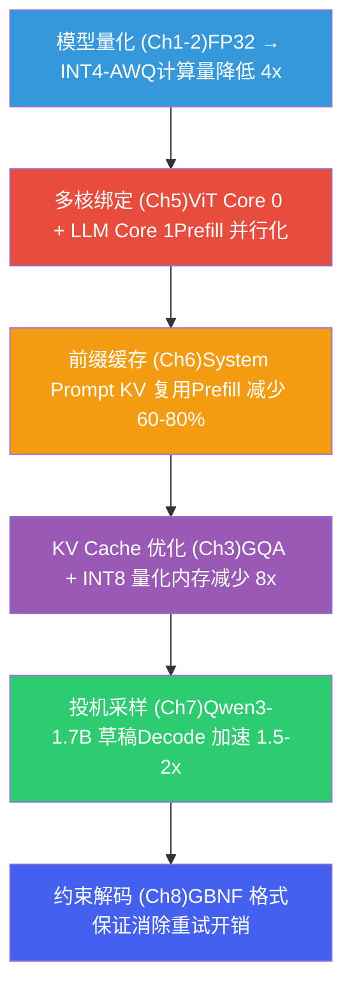

### 9.3 优化前后 TTFT 对比

**Qwen3-Omni-4B TTFT 优化瀑布 (SA8397P)**（TTFT）

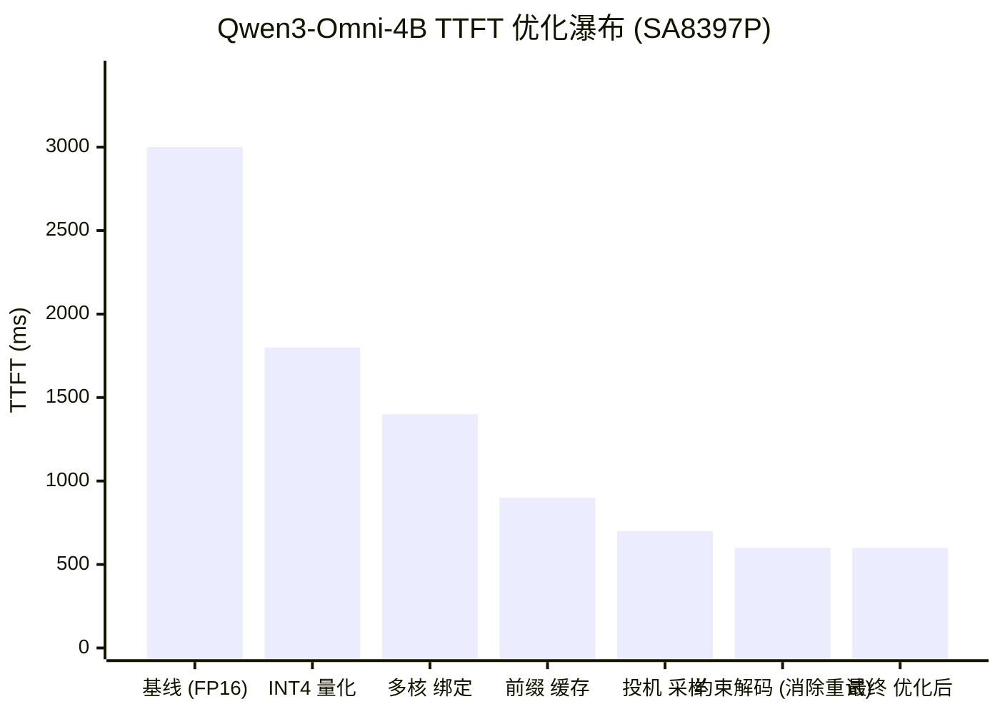

### 9.4 优化路线图

| 优化阶段 | 技术 | TTFT 效果 | 累计 TTFT | 实施成本 |
| :--- | :--- | :--- | :--- | :--- |
| **阶段 0: 基线** | Qwen3-Omni-4B FP16, 无优化 | 3000 ms | 3000 ms | — |
| **阶段 1: 量化** | INT4-AWQ 量化 | -1200 ms | 1800 ms | 低 |
| **阶段 2: 多核绑定** | ViT/LLM 分核并行 | -400 ms | 1400 ms | 中 |
| **阶段 3: 前缀缓存** | System Prompt KV 常驻 | -500 ms | 900 ms | 中 |
| **阶段 4: 投机采样** | Qwen3-1.7B 草稿模型 | -200 ms | 700 ms | 高 |
| **阶段 5: 约束解码** | GBNF 格式保证 (消除重试) | -100 ms | 600 ms | 中 |

> [!TIP]
> **实战部署建议**
>
> 在 SA8397P 上部署 Qwen3-Omni-4B 的推荐优化组合（按性价比排序）：
>
> * **必做**（阶段 1）：INT4 量化——成本最低、收益最大，TTFT 从 3000ms 降至 1800ms
> * **强烈推荐**（阶段 2-3）：多核绑定 + 前缀缓存——配合 QNN Context Binary，TTFT 降至 ~900ms
> * **锦上添花**（阶段 4-5）：投机采样 + 约束解码——适合有充足内存预算且对延迟极度敏感的场景
>
> **注意**：以上 TTFT 数据为典型 Function Calling 场景估算值（System Prompt 300 tokens + 用户输入 50 tokens + 图像 1 帧）。实际数值因模型版本、Prompt 长度、硬件温度等因素有所浮动。

## 10. 量化方案对比

### 10.1 Qwen3-Omni-4B 量化精度-速度分布

不同量化精度方案在 SA8397P 平台上的推理性能与质量损失关系。选择量化方案时需要综合考虑生成速度、精度损失和内存占用三个维度。散点图中气泡大小表示推荐程度：

**Qwen3-Omni-4B 量化方案: 生成速度 vs 质量损失 (SA8397P)**

| x | y | size | label | 备注 |
| :--- | :--- | :--- | :--- | :--- |
| 1.5 | 0 | 5 | FP16 (基准) | ~8GB |
| 3 | 0.2 | 6 | INT8 (W8A8) | ~4GB |
| 6 | 0.8 | 7 | INT8-W INT4-KV | ~3.5GB |
| 10 | 1.5 | 9 | INT4-AWQ | ~2.5GB |
| 14 | 2.2 | 8 | INT4-GPTQ | ~2.5GB |
| 18 | 5 | 4 | INT3-GPTQ | ~1.8GB |

### 10.2 量化方案选型指南

| 量化方案 | 生成速度 | Perplexity 增幅 | 内存占用 | 推荐场景 |
| :--- | :--- | :--- | :--- | :--- |
| **FP16 (基准)** | ~1.5 tok/s | 0% | ~8 GB | 精度基准测试、开发调试 |
| **INT8 (W8A8)** | ~3 tok/s | +0.2% | ~4 GB | 精度优先、内存充裕 |
| **INT8-W INT4-KV** | ~6 tok/s | +0.8% | ~3.5 GB | 平衡速度与精度 |
| **INT4-AWQ** | ~10 tok/s | +1.5% | ~2.5 GB | 端侧量产部署首选 |
| **INT4-GPTQ** | ~14 tok/s | +2.2% | ~2.5 GB | 追求极致速度 |
| **INT3-GPTQ** | ~18 tok/s | +5.0% | ~1.8 GB | 速度极致、精度可接受 |

> [!NOTE]
> **量化方案推荐**
>
> 座舱 Function Calling 场景推荐 **INT4-AWQ**：生成速度 ~10 tok/s 满足实时交互需求（用户感知 < 2 秒），Perplexity 增幅仅 1.5% 对工具调用准确率影响极小，内存占用 2.5 GB 在 SA8397P 上可承载。INT4-AWQ 相比 INT4-GPTQ 在质量上略优（AWQ 针对重要权重保留更多精度），是目前端侧 LLM 部署的最佳平衡点。

## 11. Prefill/Decode 阶段分析

### 11.1 两阶段本质差异

LLM 自回归推理分为两个计算特性截然不同的阶段。理解这一区分是所有推理优化的基础：

| 维度 | Prefill（预填充） | Decode（解码） |
| :--- | :--- | :--- |
| **处理方式** | 并行处理 S 个输入 token | 逐个生成 token（自回归） |
| **每步计算量** | ~2N × S FLOPs（N=参数量） | ~2N FLOPs / token |
| **权重读取** | 读取全部权重 1 次，服务 S 个 token | 每生成 1 个 token 需读取全部权重 |
| **算术强度（INT4）** | ~4×S OPs/Byte | ~4 OPs/Byte |
| **瓶颈类型** | Compute-bound（S 足够大时） | Memory-bound（始终） |
| **核心指标** | TTFT（Time To First Token） | TPOT（Time Per Output Token） |
| **输出** | 第一个输出 token + 完整 KV Cache | 每步 1 个 token + 追加 KV Cache |

其中 N 为模型参数量（Qwen3-Omni-4B 约 4×10⁹），S 为输入序列长度。**算术强度**（Arithmetic Intensity, AI = FLOPs ÷ Bytes）是判断瓶颈类型的关键量：

```
算术强度推导（以线性层 y = x·W 为例）:

  FLOPs = 2 × batch × H_in × H_out
  Bytes  ≈ H_in × H_out × bytes_per_weight  (权重访问占主导)
  AI     = 2 × batch / bytes_per_weight

对于 INT4 (0.5 Byte/参数):
  Prefill: batch ≈ S (序列长度)  → AI = 4S
  Decode:  batch = 1             → AI = 4
```

### 11.2 Roofline 模型分析

Roofline 模型（Williams et al., 2009）将硬件的峰值算力和内存带宽统一在一张图上。通过对比任务的算术强度与硬件的 **Knee Point**（计算/带宽比），可判断任务是 Compute-bound 还是 Memory-bound。

| SA8397P HTP 参数 | 数值 | 说明 |
| :--- | :--- | :--- |
| **峰值算力** | ~70 TOPS (INT8) | Hexagon NPU 标称算力 |
| **DDR 峰值带宽** | ~68 GB/s | LPDDR5x 四通道理论峰值 |
| **Knee Point** | ~1029 OPs/Byte | 70 TOPS ÷ 68 GB/s；AI 高于此值为 Compute-bound |

**SA8397P HTP Roofline Model (Qwen3-Omni-4B INT4)**

| 系列 | x | y |
| :--- | :--- | :--- |
| DDR Bandwidth (68 GB/s) | 1 | 68 |
| DDR Bandwidth (68 GB/s) | 10 | 680 |
| DDR Bandwidth (68 GB/s) | 100 | 6800 |
| DDR Bandwidth (68 GB/s) | 1029 | 69972 |
| Peak Compute (70 TOPS) | 1029 | 70000 |
| Peak Compute (70 TOPS) | 5000 | 70000 |
| Operating Points | 4 | 272 |
| Operating Points | 200 | 13600 |
| Operating Points | 1400 | 70000 |

**核心结论**：

- **Decode 永远是 Memory-bound**：AI=4，远低于 Knee Point 1029，生成速度完全由 DDR 带宽决定
- **Prefill 在 S > ~258 时转为 Compute-bound**：4×258=1032 ≈ Knee Point
- 座舱典型场景 System Prompt ~300 tokens + 用户输入 ~50 tokens → S≈350，Prefill 为 Compute-bound
- 短 Prompt 场景（S < 258）Prefill 也是 Memory-bound，此时前缀缓存的带宽节省更为关键

### 11.3 Decode 带宽瓶颈量化分析

Decode 阶段每生成一个 token 都必须读取全部模型权重，因此生成速度的理论上限可以精确推算：

```
Decode 理论上限 = DDR 有效带宽 ÷ 每 token 读取数据量

每 token 读取数据量 (Qwen3-Omni-4B INT4):
  ① 模型权重:  4B × 0.5 Byte/param        ≈ 2.0 GB
  ② KV Cache:  每层 2 × n_kv_heads × head_dim × seq_len × dtype
               ≈ 36层 × 2 × 4 × 128 × 512 × 1B (INT8 KV)
               ≈ 19 MB  (seq_len=512 时)
  ③ 激活值等:  ≈ 数 MB (相对可忽略)
  总计 ≈ 2.02 GB/token

理论推导:
  理想上限:   68 GB/s ÷ 2.02 GB     ≈ 33.7 tok/s
  内存效率:   × ~85%  (控制器效率)   ≈ 28.6 tok/s
  带宽共享:   × ~70%  (ISP/GPU 共用)  ≈ 20.0 tok/s
  调度开销:   × ~65%  (实测折扣)      ≈ 13.0 tok/s
  实测范围:   10 ~ 14 tok/s
```

> [!NOTE]
> **为什么端侧 Decode 远慢于云端？**
>
> 根本原因是**内存带宽差距**。A100 GPU 拥有 ~2 TB/s HBM 带宽，是 SA8397P DDR 的约 30 倍。端侧优化的本质是**减少每 token 读取的数据量**——INT4 量化将权重减半、GQA 将 KV 头数从 28 减至 4（读取量降至 1/7）、KV Cache INT8 量化再减半。这些技术叠加后端侧 ~10 tok/s 的生成速度才成为可能。

### 11.4 Prefill / Decode 分阶段优化策略

| 优化手段 | Prefill 收益 | Decode 收益 | 原理说明 |
| :--- | :--- | :--- | :--- |
| **INT4 量化** | 中 — 减少权重加载 | 高 — 权重减半，带宽利用翻倍 | 每 token 读取字节数减半 |
| **GQA** | 低 — Prefill 并行效率已高 | 高 — KV 头数 28→4 | KV Cache 读写带宽大幅降低 |
| **FlashAttention** | 高 — 避免 N²中间结果写 DDR | 中 — Decode 时 N=1 | 利用 VTCM 分块计算 Attention |
| **前缀缓存** | 高 — 跳过公共 System Prompt | 无 | 复用已缓存的 KV Cache |
| **投机采样** | 无 | 高 — 一次验证 K 个 token | 小模型起草 + 大模型并行验证 |
| **Context Binary** | 高 — 消除运行时图编译 | 无 | 离线完成图优化和内存规划 |
| **多核绑定** | 高 — ViT/LLM 并行不抢占 | 中 — LLM 独占 NPU 核心 | 避免 ViT 和 LLM 争抢 HTP 资源 |

> [!TIP]
> **面试高频考点**
>
> "Prefill 是 Compute-bound，Decode 是 Memory-bound"几乎是 LLM 推理优化面试的必问题。回答时需要：(1) 从算术强度角度定量分析；(2) 结合具体硬件参数推算 Knee Point；(3) 说明不同优化技术分别解决哪个阶段的瓶颈。避免只说结论不给推导。

## 12. Continuous Batching

### 12.1 静态批处理的局限

传统静态批处理（Static Batching）要求同一 batch 内所有请求同时开始、同时结束。由于 LLM 生成长度不固定，短请求必须等待最长请求完成才能释放资源：

| 时刻 | 静态批处理行为 | 问题 |
| :--- | :--- | :--- |
| t=0s | 请求 A（导航，预计生成 50 tokens）进入 NPU | — |
| t=0.5s | 请求 B（播放音乐，仅需 10 tokens）到达 | 必须排队等待 A 完成 |
| t=2.0s | A 完成 Decode，释放 NPU | B 等待了 1.5s 才开始处理 |
| t=3.2s | B 完成 | B 端到端延迟 2.7s（实际推理仅需 1.2s） |

在座舱多音区场景中，驾驶员和副驾可能在不同时刻发起语音指令。静态批处理要么串行处理（延迟高），要么整 batch 等待（NPU 利用率低，短请求被拖慢）。

### 12.2 Continuous Batching 原理

Continuous Batching（Yu et al., 2022, Orca）将调度粒度从**请求级别**细化到**迭代级别**：每完成一次 Decode 迭代后重新调度——已完成的请求立即释放 KV Cache，新到达的请求可以插入当前 batch 执行 Prefill。

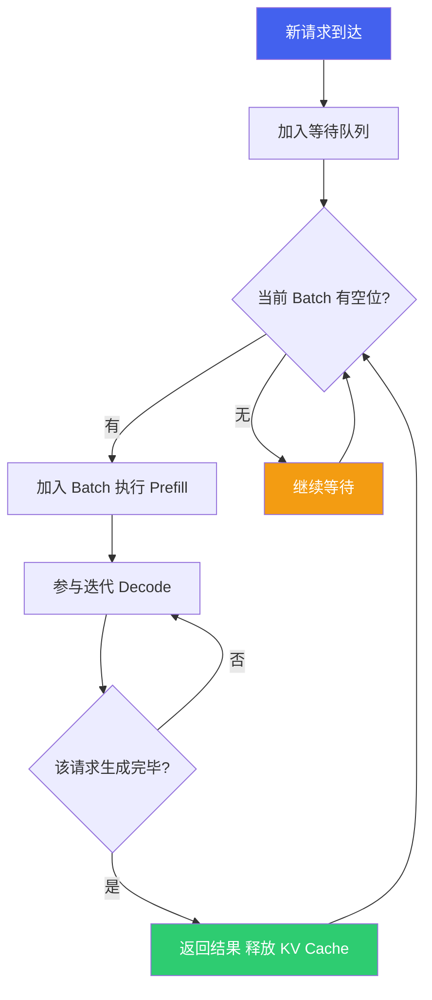

| 对比维度 | 静态批处理 | Continuous Batching |
| :--- | :--- | :--- |
| **调度粒度** | 请求级（整 batch 同进同出） | 迭代级（逐 token 调度） |
| **新请求** | 等当前 batch 全部完成 | 下一迭代即可加入 |
| **完成请求** | 等最慢请求完成 | 立即释放 KV Cache |
| **NPU 利用率** | 低（padding 浪费 40-60%） | 高（接近持续满载） |
| **平均延迟** | 短请求被长请求拖慢 | 各请求独立完成 |
| **实现复杂度** | 低 | 高（需动态 KV Cache 管理） |
| **适合场景** | 离线 batch 推理 | 在线实时服务 |

### 12.3 座舱多音区调度

在 aadkcore 框架中，`ModelScheduler` 负责多请求的调度。座舱场景的 Continuous Batching 有其特殊性：

| 座舱特点 | 对调度的影响 | 应对策略 |
| :--- | :--- | :--- |
| **多音区并发** | 驾驶员/副驾/后排可能同时说话 | 按 `scenario_id` 区分请求来源，支持同 batch 内多音区共存 |
| **优先级差异** | 安全告警 > 车控指令 > 闲聊 | 四级优先级调度（HIGHEST/HIGH/NORMAL/LOW），高优先级可抢占 |
| **延迟敏感** | 车控指令要求 < 2s 端到端 | 高优先级请求跳过等待队列，立即加入 batch |
| **KV Cache 受限** | 端侧内存 ~16GB 需多模型共享 | 动态 KV Cache 分配 + 按优先级淘汰低优先级请求的缓存 |
| **请求长度差异大** | 车控 ~20 tokens vs 闲聊 ~200 tokens | 短请求快速释放，避免阻塞后续请求 |

> [!NOTE]
> **端侧 vs 云端 Batching 差异**
>
> 云端 vLLM 的 Continuous Batching 面对数百并发请求，重点是**吞吐量最大化**。端侧座舱通常同时只有 2-4 个请求，Continuous Batching 的核心价值不在吞吐量，而在**降低短请求的排队延迟**和**支持优先级抢占**。例如，副驾正在闲聊时驾驶员发出紧急车控指令，Continuous Batching 允许车控请求在下一迭代立即加入，而非等闲聊生成完毕。

### 12.4 KV Cache 动态管理

Continuous Batching 的核心挑战是 KV Cache 的动态分配与回收。传统方式按最大序列长度预分配 KV Cache，导致严重的内存浪费。PagedAttention（Kwon et al., 2023, vLLM）将 KV Cache 按固定大小的**页（Page）**分配，类似操作系统的虚拟内存管理：

| KV Cache 管理方式 | 内存分配 | 内存利用率 | 适用场景 |
| :--- | :--- | :--- | :--- |
| **静态预分配** | 按 max\_seq\_len 预留 | 低（~50%，大量 padding） | 单请求、固定长度 |
| **动态连续分配** | 按实际长度动态申请 | 中（碎片化问题） | 请求数少的场景 |
| **PagedAttention** | 按页（如 16 tokens/页）分配 | 高（> 95%，页级管理） | 高并发、变长序列 |

在端侧座舱场景中，由于并发请求数少（2-4 个），动态连续分配通常已能满足需求。但当引入前缀缓存（多请求共享 System Prompt 的 KV Cache）时，PagedAttention 的页级共享机制可以显著减少 KV Cache 的重复存储。

## 13. FlashAttention 端侧适配

### 13.1 标准 Attention 的内存瓶颈

标准 Self-Attention 的计算公式为 `Attention(Q,K,V) = softmax(QK^T / √d) · V`。其中间结果 `QK^T` 是一个 **N×N** 的注意力得分矩阵（N=序列长度），必须完整存储后才能进行 softmax：

| 序列长度 N | 注意力矩阵大小（单头, FP16） | 28 个 Q 头总量 | 能否放入 VTCM (~4MB)? |
| :--- | :--- | :--- | :--- |
| 256 | 256×256×2 = 128 KB | 3.5 MB | 勉强 |
| 512 | 512×512×2 = 512 KB | 14 MB | 不能 |
| 1024 | 1024×1024×2 = 2 MB | 56 MB | 远不能 |
| 2048 | 2048×2048×2 = 8 MB | 224 MB | 远不能 |

当 N×N 注意力矩阵无法放入片上高速缓存（VTCM）时，必须写回 DDR 再读回——Prefill 阶段的大量带宽被注意力矩阵的读写消耗，而非用于有效计算。这正是 FlashAttention 要解决的问题。

### 13.2 FlashAttention 分块计算原理

FlashAttention（Dao et al., 2022）的核心思想：将 Q、K、V 分块（tiling），每次只加载一小块到片上 SRAM（端侧即 VTCM），在片上完成 `QK^T → softmax → ×V` 的全流程，**避免将 N×N 注意力矩阵写回 DDR**。

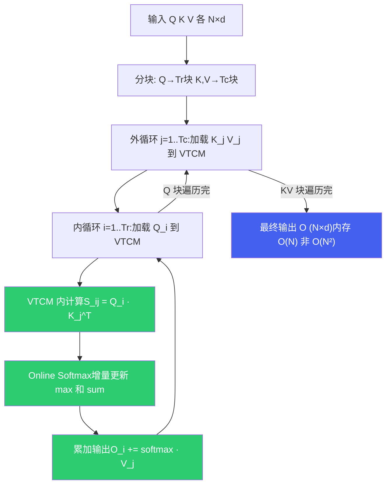

**Online Softmax** 是 FlashAttention 的关键技术：标准 softmax 需要看到所有 N 个元素才能计算归一化分母，但通过维护 running max 和 running sum，可以在逐块处理时增量更新 softmax 结果，无需存储完整的 N×N 矩阵。

### 13.3 VTCM 分块大小计算

SA8397P Hexagon DSP 的 VTCM 约 4MB。FlashAttention 每次迭代需要在 VTCM 中同时存放以下数据（以 INT8 计算为例）：

```
每次迭代 VTCM 占用:
  Q_block:   Br × d × 1B    (Br 行 Q 向量)
  K_block:   Bc × d × 1B    (Bc 行 K 向量)
  V_block:   Bc × d × 1B    (Bc 行 V 向量)
  S_block:   Br × Bc × 1B   (注意力得分子矩阵)
  O_block:   Br × d × 1B    (输出累加器)
  m, l:      Br × 2 × 4B    (Online Softmax 状态, FP32)

  总计 = Br×d + 2×Bc×d + Br×Bc + Br×d + 8×Br  (Bytes)

以 d=128 (head_dim), Br=Bc=256 为例:
  = 256×128 + 2×256×128 + 256×256 + 256×128 + 8×256
  = 32768 + 65536 + 65536 + 32768 + 2048
  ≈ 194 KB  (单次迭代)

考虑双缓冲 (Double Buffering, 隐藏 DDR 加载延迟):
  ≈ 388 KB

4 个 KV 头并行处理:
  ≈ 388 KB × 4 = 1.55 MB  ← 远小于 4MB VTCM
```

> [!TIP]
> **VTCM 容量充裕**
>
> 上述计算表明，即使采用 Br=Bc=256 的较大分块 + 双缓冲 + 4 头并行，VTCM 占用仅 ~1.5MB，4MB VTCM 完全可以承载。实际实现中可以进一步增大分块尺寸以提高计算效率，或留出空间给 HVX 向量寄存器和临时变量。

### 13.4 FlashAttention vs 标准 Attention 对比

| 维度 | 标准 Attention | FlashAttention |
| :--- | :--- | :--- |
| **内存复杂度** | O(N²) — 存储完整注意力矩阵 | O(N) — 只存当前分块 |
| **DDR 读写量** | 高 — QK^T 和 softmax 结果反复读写 DDR | 低 — 仅读入 Q/K/V 块，写出最终 O |
| **VTCM 利用** | 低 — 可能溢出到 DDR | 高 — 分块大小适配 VTCM 容量 |
| **数值精度** | 标准 softmax | Online Softmax（数值等价，无精度损失） |
| **计算量** | 相同 | 相同（额外 m/l 更新可忽略） |
| **Prefill 加速比** | — | N=512 约 1.5-2x，N=2048 约 2-4x |
| **实现复杂度** | 低（标准矩阵乘法） | 高（分块调度 + Online Softmax + 双缓冲） |

### 13.5 端侧实践

在 aadkcore 的 vllm\_sdk 构建产物中，`libflash_attn.so`（约 31MB）即为 FlashAttention 的端侧实现库。该库针对 Hexagon HVX/HMX 指令集优化，在 HTP 上执行分块注意力计算。

| 适用场景 | FlashAttention 收益 | 说明 |
| :--- | :--- | :--- |
| **Prefill 长序列** | 高 — 加速 1.5-4x | 序列越长收益越大，N=2048 时最为显著 |
| **Prefill 短序列** | 低 — 可能反而变慢 | N < 128 时分块调度开销大于收益 |
| **Decode** | 中 — 减少 KV Cache 读写 | Decode 时 Q 只有 1 行，分块意义有限 |
| **多模态 Prefill** | 高 — 图像 token 数大 | ViT 输出 576+ tokens + 文本 Prompt → 长序列 |

> [!WARNING]
> **端侧 FlashAttention 的权衡**
>
> FlashAttention 在端侧并非"无条件优于"标准 Attention。当输入序列很短（如纯车控指令 < 50 tokens 且无前缀缓存时），分块调度和 Online Softmax 的额外开销可能超过节省的 DDR 带宽。实际部署中通常设置一个**序列长度阈值**：短序列走标准 Attention，长序列走 FlashAttention。
