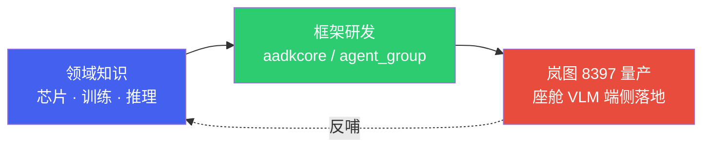

---

# 智能座舱面试指南

*基于 Qualcomm SA8397P 平台 · 62 道精选题 · 覆盖硬件/训练/部署/Agent/系统设计/功能安全/面试方法论*

> [!TIP]
> **本篇讲什么**
>
> 基于 Qualcomm SA8397P 平台的智能座舱面试指南，62 道精选题（每题**点击展开**参考答案）：
>
> - 硬件与系统、算法与训练、部署与优化、Agent 与大模型、综合系统设计
> - 系统设计答题框架、项目经验包装、行为面试准备

> [!NOTE]
> **本篇的作答方式：要点 + 链接**
>
> 每题只给**答题骨架（3-5 条要点）+ 关键公式/方法**，完整推导放在对应的详解篇里，用链接指过去。这样做的目的有两个：一是面试场景下读者要的是"能背下来、能讲出口"的骨架，不是论文；二是**避免同一个事实被复述 2-4 遍而互相打架**——数字口径只在一处定义。
>
> **数据口径**：本篇遵循全站唯一基准（定义在 [硬件架构](hardware.html) 顶部「全站数据口径与锚点模型」NOTE）。锚点模型 **Qwen3-Omni-4B** 是项目内部定制的 4B 级全模态模型（**非**公开的 30B-A3B MoE），配置为 36 层 / 32 Q head / 8 KV head（GQA）/ head\_dim 128 / INT4 权重约 2.5 GB。平台 SA8397P：带宽约 68 GB/s、算力约 70 TOPS INT8、**1 个 cDSP**（HTP 在多 graph 间时分复用）、VTCM 典型 8 MB（均为估算）。
>
> **只讲方法不给数**：本篇**不给"标准答案"式的性能数字**（tok/s、TTFT ms、SSR 耗时、KV Cache GB 等），而是给**推导方法/公式**。文中出现的个别数值一律标注为**示例参数**，仅用于演示方法，请代入你自己的平台带宽与模型配置计算。

## 导读 · 从领域知识到量产实践

*一条「领域知识 → 框架研发 → 量产项目」的完整主线*

智能座舱板块把三层内容串成一个完整故事：先打**领域知识**地基（芯片/训练/推理），再研发可复用的**端侧 Agent 框架**（aadkcore / agent_group），最后在**岚图 8397 座舱 VLM 量产项目**里把框架真正落地装车。建议按「通识 → 框架 → 岚图」的顺序阅读；每一层都引用下一层，读完能完整理解「端侧大模型如何从知识走到量产」。

### 故事主线

- **第一层 · 领域知识**：理解座舱端侧的硬件底座（SA8397P SoC / Hexagon DSP）、模型训练与微调、推理优化——这是一切的地基。
- **第二层 · 框架研发**：基于领域知识研发可复用的端侧 Agent 框架——aadkcore 统一模型接口与调度，agent_group 以插件承载各场景 Agent。
- **第三层 · 岚图量产**：把框架部署到岚图 8397 座舱，跑通 GenAI 与 AIService 两套推理后端，完成效果/性能验证与运维。

### 三层结构与阅读路径

**第一层 · 领域知识（通用部分）**

| 文档 | 讲什么 |
| :--- | :--- |
| [硬件与系统底层](hardware.html) | SA8397P SoC、Hexagon DSP、FastRPC、Hypervisor、内存带宽、功耗热管理、HTP 架构版本 |
| [模型训练与微调](training.html) | DMS/OMS 训练、LoRA/QLoRA、知识蒸馏、端侧微调可行性、SWIFT 工具链 |
| [座舱数据合规、评估与数据飞轮](data-pipeline.html) | 数据分类与隐私合规（PIPL/R155/R156）、模型评估体系、数据飞轮 |
| [端侧模型量化与压缩](quantization.html) | PTQ/QAT、AIMET、W4A16 机制、量化方案对比 |
| [LLM 推理原理与性能模型](infer-principles.html) | Prefill/Decode、Roofline、KV Cache、FlashAttention、Genie/QAIRT、Tokenizer |
| [端侧解码与服务化优化](infer-serving.html) | 前缀缓存、投机采样、约束解码、Continuous Batching、TTFT/端到端延迟 |
| [Android 开发 & JNI 基础](android-jni.html) | Android 工程结构、JNI 桥接、SELinux、RegisterNatives、端侧服务化与安全 |

**第二层 · 框架研发（aadkcore / agent_group）**

| 文档 | 讲什么 |
| :--- | :--- |
| [项目简介 · 大模型 Agent 框架](../projects/agent-framework/overview.html) | 框架整体架构与模块划分（项目主页式简介） |
| [设备部署](../projects/agent-framework/deploy.html) | QNN 推理框架、多平台构建矩阵、Service 量产部署 |
| [aadkcore 核心框架](../projects/agent-framework/agent-core.html) | 架构总览、统一模型接口、模型调度、多音区对话管理、RAG |
| [协议与运行时执行](../projects/agent-framework/agent-protocols.html) | MCP/A2A 协议、运行时与插件机制、LLM Flow 与 Tool Use、端云协同与安全沙箱 |
| [场景 Agent 应用](../projects/agent-framework/agent-group.html) | 场景 Agent 插件机制（车控/主动视觉/闲聊/GUI 等） |
| [调试与工具链](../projects/agent-framework/debug.html) | 精度/内存/Crash 排障、日志与监控 |

**第三层 · 岚图 8397 量产项目**

| 文档 | 讲什么 |
| :--- | :--- |
| [项目简介 · 岚图 8397 座舱 VLM 端侧量产](../projects/lantu/overview.html) | 摘要 · 演示 · 方法总览 · 实验方案总览（项目主页式简介） |
| [GenAI 方案架构总览](../projects/lantu/genai-architecture.html) | 模型制备链路、多 VIT、LoRA/prefix 映射、三阶段推理 |
| [AIService 后端集成与重构](../projects/lantu/aiservice-integration.html) | 岚图自研 AIService 推理后端的集成与验证 |
| [APK 集成与端侧服务化](../projects/lantu/apk-integration.html) | 宿主 APK 内部结构、JNI 与 ModelInference API、HTTP 服务化、安全暴露面 |
| [设备部署与上车流程](../projects/lantu/device-deployment.html) | SDK 构建 → 设备目录 → adb push → 运行 → 部署验证、两个模型根目录 |
| [效果、性能与稳定性](../projects/lantu/effect-perf-stability.html) | 效果指标、性能指标、优化量化贡献、热/内存/稳定性 |
| [两方案选型决策与端到端对比](../projects/lantu/genai-vs-aiservice.html) | GenAI vs AIService 选型决策表 + 端到端对比 |
| [运维、安全与功能安全](../projects/lantu/ops-security.html) | 运维排查、SELinux、功能安全、数据隐私、OTA、模型加密与密钥管理 |

### 一条完整的落地链路

把三层串起来，一个端侧大模型上车的完整链路是：

1. **懂底座**（领域知识）：理解 SA8397P 的 DSP/NPU、内存带宽与功耗约束，知道端侧推理的瓶颈在哪。
2. **造框架**（框架研发）：用 aadkcore 统一模型接口与调度、agent_group 承载场景 Agent，支持多平台构建与 Service 量产部署。
3. **做集成**（岚图项目）：把框架部署到岚图 8397——GenAI 方案直跑 QNN，AIService 方案经岚图自研推理服务；宿主 APK 经 JNI 调用 SDK 并对外提供 HTTP 服务。
4. **验效果**（岚图项目）：效果/性能/稳定性测试，GenAI 与 AIService 两套后端对比，持续优化。
5. **保运行**（岚图项目）：设备部署上车、运维与安全（OTA、模型加密设计）。

> [!NOTE]
> **为什么这样分层**
>
> 领域知识是可迁移的地基，框架是可复用的资产，岚图项目是框架的一次具体落地。框架研发时不绑定具体项目（主线 `agent_core_dev` 多平台通用），岚图项目则基于岚图分支（`lantu_sdk_dev` / `lantu_aiservice_dev`）做具体实现——这正是「框架可复用、项目可落地」的工程实践。

## 1. 硬件与系统 — 概念辨析题

**Q1: DSP 和 CPU 在 AI 推理中的核心区别是什么？为什么座舱场景优先选择 DSP？** · `初级`

**答题要点：**

- **CPU** 是通用处理器，擅长复杂控制流与低延迟单线程，但 SIMD 宽度有限（如 NEON 128-bit），大规模矩阵运算吞吐不足。
- **DSP** 面向高吞吐并行数据流：CDSP 上有 HVX（宽 SIMD 向量）+ HMX（矩阵加速），能在更低功耗下完成大量 MAC。
- **座舱场景**要并发跑 DMS/OMS/手势等多个模型，对吞吐和功耗都严格；DSP 不占 CPU、不抢 HMI 渲染资源。
- **VTCM** 提供低延迟片上缓存，减少频繁访问 DDR。
- **口径提醒**：功耗/吞吐"几倍"这类结论给方法（对比 SIMD 宽度、MAC/周期、每瓦吞吐），别背死数。

> 详解见 [硬件架构 · Hexagon DSP 微架构](hardware.html)。

**Q2: 请解释 HVX、HMX、HTP 三者之间的关系。** · `中级`

**答题要点：**

- **HTP 是品牌抽象，不是独立硬件**——指 HMX + HVX + Scalar + VTCM 协同工作时的整体能力。
- **HVX**：宽 SIMD 向量单元，擅长逐元素操作（ReLU/Softmax/归一化/Resize）。
- **HMX**：矩阵乘加速器，高效执行 INT8/INT16 GEMM，是 Conv/FC 主力。
- **QNN Runtime** 把不同算子分配到最合适单元；某算子不被 HMX 支持时会 fallback 到 HVX 甚至 CPU，导致性能骤降——这是调试算子 fallback 的关键认知。

> 详解见 [硬件架构 · HTP = 品牌名，不是独立硬件](hardware.html)。

**Q3: FastRPC 和 Android Binder 有什么区别？为什么 DSP 通信不用 Binder？** · `中级`

**答题要点：**

- **Binder** 是 Android 的 IPC 机制，关键设计恰恰是**单次拷贝**——内核用一次 `copy_from_user` 把数据写入接收进程 mmap 映射的缓冲区，接收方直接读，无需第二次拷贝（已优于管道/socket 的两次拷贝）；但它仍需序列化/反序列化，且只在 CPU 侧进程间工作。
- **Binder 无法跨处理器域访问 DSP**。
- **FastRPC** 是 Qualcomm 跨处理器 RPC 框架（CPU HLOS ↔ DSP），最大优势是**零拷贝**：通过 DMA-BUF/ION 分配共享内存，CPU 和 DSP 直接访问同一块物理内存。
- FastRPC 内建 DSP 侧 **PD 管理、签名校验、异常恢复**。
- 座舱每帧 30fps 图像推理，零拷贝特性直接决定端到端延迟能否满足实时性。

> 详解见 [硬件架构 · FastRPC 跨处理器通信](hardware.html)。

**Q4: QNN 和 SNPE 的关系是什么？QAIRT 又是什么？新项目应该选哪个？** · `初级`

**答题要点：**

- **品牌演进线**：SNPE（Snapdragon Neural Processing Engine，早期，DLC 格式）→ QNN（Qualcomm AI Engine Direct，图级 API、Context Binary、多后端统一）→ **QAIRT（Qualcomm AI Runtime，2024 起把 QNN + SNPE 统一的运行时品牌，QNN 是其 SDK/API 层，工具随之改名如 `qairt-converter`）**。
- SNPE 已进入维护模式，新芯片/新算子只在 QNN/QAIRT 深度优化；**新项目选 QNN/QAIRT**。
- **迁移要点**：DLC → Context Binary；SNPE 的 UserBuffer → QNN 的 Tensor；后端选择方式不同。
- **端侧 LLM** 走 QAIRT 里的 **Genie** 运行时（见 Q43/Q44 专题），不是普通 QNN graph。

> 详解见 [硬件架构](hardware.html) 与 [推理原理 · 引擎与运行时](infer-principles.html)。

**Q5: SDSP 和 CDSP 的区别是什么？AI 推理为什么不能用 SDSP？** · `初级`

**答题要点：**

- **CDSP**（Compute DSP）：配 HVX + HMX + 大容量 VTCM，是 AI 推理主力。
- **SDSP**（Sensor DSP）：面向低功耗传感器处理（Always-On 唤醒、传感器融合），通常只有标量核 + 有限 HVX，**没有 HMX**。
- 把推理提交到 SDSP → 缺 HMX 导致大量算子 fallback 标量执行、极度缓慢，还可能因 VTCM 不足直接报错。
- QNN 初始化时指定 backend 为 `libQnnHtp.so` 并确认走 CDSP，可避免此类问题。

> 详解见 [硬件架构 · 三大 DSP 子系统对比](hardware.html)。

**Q6: Protection Domain (PD) 和 Virtual Machine (VM) 在系统隔离中有什么区别？** · `高级`

**答题要点：**

- **VM**：Type-1 Hypervisor（SA8397P 上为 Gunyah）在硬件层面实现的完整 OS 隔离，独立内存/调度/外设，由 MMU + Stage-2 页表保证，一个 VM 崩溃不影响其他 VM。
- **PD**：DSP 侧软件级进程隔离（QuRT 管理），运行在同一 DSP 核上，有独立地址空间，粒度小于 VM。
- **关键区分（易错点）**：
  - **PD 级失败** → 该会话失效、客户端重建会话（重新 `remote_handle_open`），**其他 PD 不受影响**；
  - **子系统级**致命异常 → 触发 **SSR，整个 DSP 子系统重启，所有 PD 与 handle 全部失效**。
- 不要说"单个 PD 崩溃通过 SSR 重启而不影响其他 PD"——SSR 重启的是整个子系统，不是单个 PD。

> 详解见 [硬件架构 · PD 隔离与 SSR](hardware.html)。

**Q7: VTCM 在 DSP 推理中扮演什么角色？容量不足时会有什么后果？** · `中级`

**答题要点：**

- **VTCM**（Vector Tightly Coupled Memory）是与 HVX/HMX 直连的片上 SRAM，访问延迟约 1-2 周期，远低于 DDR 的数百周期。
- 用于存权重分片、中间激活、临时缓冲；QNN 编译 Context Binary 时按 VTCM 容量做 **tiling** 决策。
- **容量口径**：**典型约 8 MB（估算，视 HTP 架构版本而定，以 `QnnHtpDevice` 实际查询为准）**——不要背成固定值。
- **不足后果**：回退到 DDR 直接访问（TCM fallback），单层延迟显著上升；多模型并发时 VTCM 需分时复用。
- 用 QNN Profile 观察每层 VTCM 使用，对密集层做针对性 tiling。

> 详解见 [硬件架构 · 存储层级与 VTCM](hardware.html)。

**Q8: ION 共享内存在座舱推理管线中如何实现零拷贝？** · `中级`

**答题要点：**

- **ION**（新内核逐步被 DMA-BUF Heap 取代）分配物理连续或 IOMMU 映射的内存，通过 fd 跨处理器/进程共享。
- **零拷贝路径**：Camera HAL 写 ION buffer → 应用以 fd 注册给 QNN 输入 Tensor → FastRPC 把 fd 传给 DSP → DSP 的 SMMU 把同一块物理内存映射到自己地址空间；全程无拷贝。
- **Cache 一致性（必讲）**：CPU 写入后做 cache flush，DSP 读取前做 invalidate，否则 DSP 读到脏数据；QNN 的 `MemHandle` API 封装了这些，自定义预处理管线需手动管理。
- **收益给方法**：省的是帧大小的拷贝时间——1080p 约 6 MB（示例），按存储带宽折算约 0.5-1 ms（示例参数）。

> 详解见 [硬件架构 · ION/DMA-BUF 与 Cache 一致性](hardware.html)。

**Q9: 为什么座舱平台使用 Type-1 Hypervisor 而非 Type-2？对 AI 推理有什么影响？** · `高级`

**答题要点：**

- **Type-1**（裸机型，如 Gunyah/QNX Hypervisor）直接运行在硬件上；**Type-2**（托管型）运行在宿主 OS 之上。
- 座舱选 Type-1 三理由：**安全隔离**（硬件保证，符合 ISO 26262）、**确定性延迟**（VM 切换微秒级，不受宿主 OS 调度抖动）、**攻击面小**。
- **对 AI 的影响**：Hypervisor 把 DSP/GPU 等外设静态分配给特定 VM，推理只能用所在 VM 分到的资源；跨 VM 共享 DSP 需 passthrough/virtio，增加延迟。
- **口径提醒**：CDSP 归属哪种 VM 划分（HLOS/Android 持有 vs 静态分给 ADAS VM）依平台配置而定，答题先声明假设。

> 详解见 [硬件架构 · Hypervisor 与资源分配](hardware.html)。

**Q10: SSR（Subsystem Restart）机制是什么？DSP 崩溃后系统如何恢复？** · `高级`

**答题要点：**

- **SSR** 是子系统故障恢复机制：DSP（或 Modem/ADSP）发生不可恢复异常（非法访存、看门狗超时）时重启该子系统，不影响主系统（CPU/Android）。
- **流程给方法**：异常 → 硬件看门狗触发 → PIL 收集 crashdump → 重载固件并重启。
- **耗时不给死数**：区分"固件重载完成"与"应用层推理恢复"两个时间点，量级示例为几百 ms ~ 秒级，取决于固件大小与恢复策略。
- **应用层必须做 SSR 感知恢复**：监听 SSR 事件、重建 QNN context、重载 Context Binary、恢复管线；否则一次崩溃就导致 DMS 等安全功能永久失效。
- 把 Context Binary 预加载到内存可加速恢复。

> 详解见 [硬件架构 · SSR 恢复流程](hardware.html)。

## 2. 算法与训练题

**Q11: 为座舱端侧部署选择 AI 模型时，核心评估指标有哪些？** · `初级`

**答题要点：**

- **五个维度**：算子兼容性 / 量化友好性 / 推理延迟 / 模型大小 / 精度。
- **算子兼容性**：全图算子须被 QNN HTP 原生支持，否则 fallback CPU 延迟剧增；选型期用 `qnn-net-run --backend libQnnHtp.so` 验证全图能否上 HTP。
- **量化友好性（易错，别讲反）**：含大量 **depthwise conv / hard-swish** 的模型（如 MobileNetV3）是**公认的量化难点，掉点严重**，需 CLE + Bias Correction + AdaRound 补救——**不是"量化后损失小"**。
- **推理延迟**：给方法（MACs 与内存带宽需求匹配 CDSP 能力），DMS 要满足帧率预算。
- **模型大小**：本题讨论的是 **CNN 类小模型（MB 级）**；LLM 是 GB 级，另论（见 Q34）。

> 详解见 [量化 · AIMET 核心技术（CLE/BC/AdaRound）与 Depthwise Conv 难点](quantization.html) 与 [训练微调 · 端侧模型选型](training.html)。

**Q12: 如何用知识蒸馏提升座舱端侧小模型的精度？请描述具体策略。** · `中级`

**答题要点：**

- 用大模型（Teacher）的"软标签"指导小模型（Student），学到暗知识。
- **蒸馏 loss** = 软标签 KL 散度（温度 T）+ 硬标签交叉熵，加权组合。
- **公式口径**：KL 散度是 **KL(student ‖ teacher)**，且软标签项要带 **T² 缩放因子**（prose 与代码常写漏，注意对齐）。
- 检测任务可加**特征蒸馏**（让 Student 中间特征图在 L2 距离上逼近 Teacher）。
- 数据要用座舱真实数据（IR 夜视、不同光照），非仅 ImageNet；蒸馏后仍需 **QAT** 保证 INT8 精度。

> 详解见 [训练微调 · 知识蒸馏](training.html)。

**Q13: DMS 数据集中驾驶员分心/疲劳样本严重不平衡，如何处理？** · `中级`

**答题要点：**

- **类别不平衡**：正常驾驶样本占绝对多数，分心/疲劳是少数类。
- **比例口径**：区分"**原始路采分布**"（正常占比极高）与"**入库训练集分布**"（经增强/合成/采样调整后），答题先说明指哪一个，别给一个孤立百分比。
- **数据级**：少数类数据增强、合成数据（3D 人脸渲染）、过采样/欠采样。
- **算法级**：Focal Loss、手动 class weight。
- **评估**：不能只看 overall accuracy，必须关注每类 **Recall/F1**，尤其漏检率——漏检一次分心驾驶比误报十次后果严重。

> 详解见 [数据合规与评估 · 类别不平衡](data-pipeline.html) 与 [训练微调](training.html)。

**Q14: PTQ 和 QAT 分别适用于什么场景？如何决策？** · `初级`

**答题要点：**

- **PTQ**（训练后量化）：无需重训，用小批标定数据统计激活范围；快，但对某些模型（深层、含 Concat/Add 分支）掉点可能较大。
- **QAT**（量化感知训练）：训练中插 fake quantize 节点，让模型适应量化误差；需额外训练但掉点小。
- **决策流程**：先 PTQ 验证精度 → 掉点在可接受阈值内用 PTQ；超阈值上 QAT；**安全相关模型（如 DMS 疲劳检测）建议无论 PTQ 精度如何都做 QAT**（边界样本漏检风险）。
- **校准集（PTQ 质量关键）**：**无需标注**（只前向统计激活分布）、**数百~数千条**即可（边际收益递减）、**多样性优先于数量**、须**覆盖真实输入分布**（座舱场景：不同光照/肤色/姿态、不同长度/领域的指令）、并与**评测集隔离**（防量化参数对评测分布过拟合）。
- 工具：`torch.ao.quantization` 或 Qualcomm **AIMET**。

> 详解见 [量化 · PTQ vs QAT 与校准集选择](quantization.html)。

**Q15: LoRA 能否用于端侧视觉模型的微调？有什么限制？** · `高级`

**答题要点：**

- LoRA 可用于任何线性层（CNN 的 1x1 Conv、FC），可训练参数量大幅减少，适合有限 GPU 上做领域适配。
- **三个关键限制**：
  - **部署前需合并权重** `W' = W + BA`，否则多一次 matmul 增加推理延迟；
  - **depthwise conv 不适用**（权重形状不适合低秩分解，而 MobileNet 系列大量使用）；
  - 参数量已很少的分类/检测头，LoRA 收益不如全量微调。
- **实践**：对 backbone 的 pointwise conv（1x1）+ 最终 FC 施加 LoRA，检测头全量微调，导出合并后的完整模型再量化部署。

> 详解见 [训练微调 · LoRA](training.html)。

**Q16: Mixed Precision（混合精度）量化策略如何设计？哪些层不适合 INT8？** · `中级`

**答题要点：**

- 混合精度 = 不同层用不同位宽（部分 INT8、部分 INT16/FP16），平衡精度与性能。
- **识别量化敏感层**：第一个卷积层（输入动态范围大）、含 Softmax/LayerNorm 的层、SE Module 的 Sigmoid 通道注意力、多尺度 Concat 节点。
- **实操流程**：全模型 INT8 PTQ → 逐层灵敏度分析（AIMET `QuantAnalyzer`）→ 把 top 敏感层提升为 INT16。
- INT16 层延迟高于 INT8，只用在真正敏感的层（控制在总层数的小比例）。

> 详解见 [量化 · 混合精度与敏感层](quantization.html)。

**Q17: IR 红外模型和 RGB 模型之间能否做迁移学习？有哪些注意事项？** · `中级`

**答题要点：**

- 可迁移：IR 与 RGB 在低层特征（边缘、纹理）上有共性，RGB 预训练 backbone 可作 IR 初始化。
- **四个注意事项**：
  - **输入通道适配**：IR 通常单通道，把 3 通道权重取平均合并为 1 通道（优于把 IR 复制成 3 通道，后者增加输入带宽和首层计算）；
  - **数据分布差异**：IR 需独立归一化统计，不能直接用 ImageNet 的 mean/std；
  - **微调策略**：先冻结 backbone 前段只微调后段+检测头，再解冻全部以较低学习率全量微调；
  - **覆盖 IR 特有边界场景**：IR 透光墨镜、完全黑暗、面部红外反射等。

> 详解见 [训练微调 · IR/RGB 迁移](training.html)。

**Q18: 在端侧设备上做 On-device Fine-tuning 是否可行？有哪些方案？** · `高级`

**答题要点：**

- 技术上可行但受限，仅适用于特定场景。
- **关键事实**：**DSP 上的 QNN 只支持前向推理，不支持反向传播**；训练只能在 CPU/GPU 上做，而 SA8397P 的 GPU 面向图形渲染、训练效率低。
- **挑战（内存口径修正，别再说"3-4 倍"）**：训练内存按**字节/参数法**估——全参混合精度 ≈ **16 B/param**（params 2 + grads 2 + Adam master/m/v 各 4），而推理只需权重本身（fp16 2 B、INT4 0.5 B），即全参训练显存约是 fp16 推理的 **8×**、INT4 推理的 **32×**（4B 模型对应**数十 GB**，远超车机共享内存预算）；再叠加端侧缺标注数据。**这正是端侧只能做最末层微调 / LoRA 增量更新（4B LLM 的 LoRA 差量约数十 MB、OTA 推送；CNN 级 adapter 才是 200KB~2MB 量级）的根本原因**。
- **可行方案**：仅微调最后 1-2 个 FC 层（个性化适配）、特征提取 + 在线 SVM/KNN、联邦学习。
- **最佳实践**：云端训练、端侧推理，仅在需要个性化时做最末层轻量微调。

> 详解见 [训练微调 · 端侧微调可行性与训练资源估算](training.html)。

**Q19: 4B 模型微调显存怎么估？单卡够不够？** · `中级`

**答题要点：**

- **先给字节/参数法**：全参混合精度 ≈ **16 B/param**（params 2 + grads 2 + Adam master/m/v 各 4）——4B 全参对应数十 GB，单卡放不下，这是默认不做全参的直接原因。
- **QLoRA 是端侧模型微调的主力**：基座量化到 4-bit（0.5 B/param）冻结、只训 LoRA 适配器——4B 基座约 **2 GB**，加上 LoRA 梯度/优化器与激活，**单张 24 GB 卡即可跑**。
- **Gradient Checkpointing**：用重算换显存，激活内存从 O(层数) 降到 O(√层数)，代价约 **20-30% 额外计算**。
- **多卡才需要的并行**：更大模型或全参用 DeepSpeed **ZeRO**（分片优化器状态/梯度/参数）或 PyTorch **FSDP**；4B 级 QLoRA 通常单卡即可。
- **batch 不够就梯度累积**：显存受限时用 gradient accumulation 等效大 batch。

> 详解见 [训练微调 · 训练资源与并行策略](training.html)。

**Q20: VLM/Omni 微调与纯文本 LLM 有何不同？** · `中级`

**答题要点：**

- **图像 token 预算与动态分辨率**：VLM 把图像切 patch（如 14×14），视觉 token 数 ≈ (H/patch)×(W/patch) 再经 patch merge 下采样；分辨率越高 token 越多，直接撑大 prefill 长度与显存——训练与推理都要按「图像 token 预算」约束输入分辨率（座舱常用 448×448 舱内 / 1024×768 舱外两档）。
- **视觉编码器默认冻结**：常见做法是**冻结 vision encoder、只训 projector + LLM 侧 LoRA**（数据少时防过拟合、省显存）；只有视觉域差异大（如 IR 红外）才解冻视觉编码器微调。
- **图文对齐数据质量是瓶颈**：多模态微调的瓶颈往往在数据——图像与指令/答案的对齐质量、OCR/grounding 标注精度，比模型结构更影响最终效果。
- **Omni 的音频模态**：若用原生音频输入，需处理音频特征编码器与文本/视觉 token 的对齐与时长配比，训练数据的**音-文-图同步**质量是关键。

> 详解见 [训练微调 · VLM/Omni 多模态微调要点](training.html)。

**Q21: ms-swift（SWIFT）在座舱 Qwen 系列模型微调中扮演什么角色？与 LoRA/蒸馏是什么关系？** · `中级`

**答题要点：**

- SWIFT（modelscope/ms-swift）是一体化训练框架，支持大量 LLM/多模态模型的 SFT、LoRA/QLoRA、DPO/RLHF、量化与导出。
- **模型覆盖数口径**：说"数百个"并注明"截至 ms-swift 某版本"，**不背死数**（不同版本文档给的数不一致）。
- **角色**：把蒸馏/LoRA/QAT 串起来的**工程载体**——统一数据格式、一键切换微调方式、对齐、导出衔接部署。
- **关系**：LoRA/蒸馏/QAT 是"方法"，SWIFT 是"框架"。
- **选型理由**：对 Qwen 系列一等公民支持、训练→量化→导出链路完整，减少自研胶水代码。

> 详解见 [训练微调 · SWIFT 框架](training.html)。

## 3. 部署与优化题

**Q22: 请完整描述一个模型从训练到在 SA8397P 上运行的部署流水线（CNN 与 LLM 分别说）。** · `中级`

**答题要点：**

- **CNN/小模型路径**：ONNX 导出 → `qnn-onnx-converter` 转 QNN IR → **转换时量化**（`--input_list` 标定 + `--act_bw/--weight_bw` 生成 encoding）→ `qnn-context-binary-generator` 编译 Context Binary → 上板 `QnnContext_createFromBinary()` + `QnnGraph_execute()`。
- **澄清（保留，常被混淆）**：`qnn-net-run` 是执行/验证工具，**不负责生成量化 encoding**。
- **LLM 路径完全不同（重点）**：不走 `qnn-onnx-converter`，走 **QAIRT/Genie 的 W4A16 导出**——微调后导出 FP32/BF16 ONNX → AIMET/`qairt-converter` 做 W4A16 量化 → context binary → **Genie** 运行。**走不通的是 HF 打包格式，不是算法思想**：GPTQ/AWQ 模型是 packed qweight 自定义算子格式，QNN converter 吃不下；但 AIMET/QAIRT 的 W4A16 校准**可选用类 AWQ（activation-aware）/类 GPTQ（逐层重建）的思想**——两者同为 weight-only INT4，**decode 速度相同、只差精度**（速度由每 token 读取的权重字节决定，与量化算法无关）。
- 部署后用 `qnn-profile-viewer` 分析每层耗时、验证无算子 fallback。

> 详解见 [推理原理 · 部署流水线与 Genie](infer-principles.html) 与 [量化 · W4A16 导出与量化算法选型](quantization.html)。

**Q23: Context Binary 预编译和动态加载（JIT 编译）有什么区别？各有什么优劣？** · `中级`

**答题要点：**

- **Context Binary**（离线预编译）：跳过图编译，加载快；**JIT**（设备端实时编译）：慢但灵活（支持动态 shape）。
- **优化程度**：Context Binary 编译期可做芯片级深度优化（VTCM tiling、指令排布）；JIT 受设备端编译时间预算限制。
- **体积口径（修正）**：Context Binary 含序列化图 + 权重 + HTP 侧编译产物，体积与源模型**相当甚至更大**——它的优势在**加载速度**，不在体积。
- **生产必须用 Context Binary**（冷启动体验）；JIT 仅用于开发调试快速验证。

> 详解见 [推理原理 · Context Binary](infer-principles.html)。

**Q24: 如何设计一条从摄像头到推理结果的零拷贝数据路径？** · `高级`

**答题要点：**

- **目标**：Camera 采集到 DSP 推理完成，全程不经过 CPU 内存拷贝。
- **四步**：① Camera HAL 经 V4L2（`V4L2_MEMORY_DMABUF` 模式）写共享缓冲；② 预处理用 GPU/DPU 硬件 scaler，避免 CPU 软件处理；③ `QnnMem_register()` 注册 fd，FastRPC 传给 DSP，SMMU 映射；④ 结果在共享内存，CPU 直读。
- **Cache coherency**：CPU 写后 flush（DMA-BUF 的 `begin_cpu_access/end_cpu_access`）。
- **收益口径统一**：省的是帧大小拷贝时间，1080p 约 6 MB（示例）折算约 **0.5-1 ms**（示例参数）——与 Q8 一致，不要写成 2-3 ms。

> 详解见 [硬件架构 · 零拷贝数据路径](hardware.html)。

**Q25: 座舱中多个 AI 模型（DMS/OMS/手势/语音）如何调度以共享 CDSP？** · `高级`

**答题要点：**

- **优先级分层**：DMS（安全）> OMS > 手势/语音。
- **API 用对（修正）**：
  - **优先级** → 通过 **graph/context 的 priority 配置项**设置；
  - **性能/延迟投票**（DCVS 配置、RPC latency、总线频率）→ **`QnnHtpPerfInfrastructure`**（它是电源/性能基础设施接口，**不是用来设优先级的**）。
- **HTP 多 graph（修正）**：HTP 计算资源在多个 graph 间**时分复用**，宏观上接近串行——不要说"同一时刻只能执行一个 graph"。
- **错峰调度**：不同模型不同帧率/触发时机；VTCM 用编译期 `vtcm_mb` 控制每模型上限。
- **高级方案**：**同模态**多任务模型（共享 backbone + 多头）减少切换开销。

> 详解见 [硬件架构 · DCVS 与频率投票](hardware.html) 与 [服务化优化 · 多模型调度](infer-serving.html)。

**Q26: 座舱 AI 系统的冷启动优化有哪些关键措施？** · `中级`

**答题要点：**

- **冷启动** = 上电到第一帧推理结果输出；座舱要求 DMS 快速可用。
- **措施**：用 Context Binary（跳过 JIT）、early init 阶段预加载、DSP 预热（dummy 推理触发资源分配）、Camera 管线并行启动、减少依赖链（Native daemon 独立启动）、persistent mapping 避免重配 SMMU 页表。
- **Flash 加载口径（修正）**：按存储器件实际吞吐折算——UFS 顺序读约 1-2 GB/s（示例），GB 级权重冷读是**秒级而非十秒级**；并区分"读 Flash"与"建图/加载 context"两段耗时。
- 建冷启动 CI 回归测试，防新功能导致启动退化。

> 详解见 [推理原理 · 冷启动与加载](infer-principles.html)。

**Q27: 请设计一个完整的 DMS 推理管线，从传感器到决策输出。** · `高级`

**答题要点：**

- **采集层**：IR 摄像头（940nm 近红外 + 主动补光）→ ISP（去噪/自动增益）→ ION buffer。
- **预处理层**：GPU/DPU 硬件 scaler resize + 归一化，零拷贝。
- **推理层**：QNN 在 CDSP 执行 Context Binary；多任务架构（共享 backbone + 关键点/头部姿态/眼部状态多头）。
- **后处理层**：CPU 计算 **PERCLOS**——**标准定义是 P80（眼睑遮盖瞳孔 ≥80% 的时间占比），疲劳判定阈值常用约 0.15，部分标准用约 0.25，不同厂商/标准有差异（不是 0.4）**；加哈欠次数、头部偏转，时序滤波（滑动窗口）消瞬间误判。
- **决策层**：状态机综合多指标输出疲劳/分心等级，分级告警（语音提醒 → 仪表警告 → 上报车身控制器）。

> 详解见 [训练微调 · DMS 管线](training.html) 与 [数据合规与评估](data-pipeline.html)。

**Q28: 如何对端侧推理进行延迟 Profiling？常见瓶颈有哪些？** · `初级`

**答题要点：**

- **工具**：`QnnProfile_create()` / `QnnProfile_getEvents()`；或 `qnn-net-run --profiling_level detailed` 生成报告 + `qnn-profile-viewer` 可视化。DSP 侧异常另用 **mini-dm** 拉日志——DSP 的 `printf` 不进 logcat，mini-dm 是唯一出口（见 Q29）。
- **瓶颈四类**：① **算子 fallback**（HTP 不支持回退 CPU，单层延迟从微秒级跳到毫秒级）；② **数据搬运**（没用共享内存，每帧经 FastRPC 拷贝）；③ **VTCM 溢出**（大 feature map 频繁访 DDR）；④ **混合精度转换开销**（INT8↔INT16）。
- **针对优化**：替换 fallback 算子、改零拷贝、VTCM 溢出层做 tiling。

> 详解见 [推理原理 · Profiling 与瓶颈定位](infer-principles.html)。

**Q29: FastRPC 调用超时如何排查和解决？** · `中级`

**答题要点：**

- **排查步骤**：① 检查 DSP 状态（FastRPC 通道是否 ready、是否已 SSR）；② 看日志——**AP 侧 `logcat -s adsprpc`（关注 invoke failed/timeout）+ DSP 侧 `mini-dm`（`-mask` 控级别）**；DSP 的 `printf` 不进 logcat，**mini-dm 是 DSP 侧日志的唯一出口**；③ 检查 PD 签名（testsig/正式签名）；④ 检查内存映射（fd 须注册到 FastRPC）；⑤ 检查 DSP 负载（是否被打满）。
- **路径口径（修正）**：sysfs devfreq 节点名**随 BSP 版本变化**，用 `ls /sys/class/devfreq/` 确认；ipc_logging 通常在 `/d/ipc_logging/<subsys>/log`；超时错误码以实际 FastRPC 版本为准（别硬背某个码名）。
- **解决**：签名问题装 testsig；负载问题降并发/提频；映射问题确保 buffer 正确注册。

> 详解见 [硬件架构 · FastRPC 调试、DSP 签名(testsig) 与 mini-dm](hardware.html)。

**Q30: PTQ 精度不达标时，AIMET 有哪些"救精度"手段？per-channel / 对称量化为什么关键？** · `高级`

**答题要点：**

- 朴素 PTQ 掉点**不必立刻上 QAT**——AIMET 提供几种低成本 PTQ 增强：
  - **CLE（Cross-Layer Equalization，跨层权重均衡）**：利用 ReLU 的正尺度不变性在相邻 Conv 间重新缩放权重，压平各通道动态范围的悬殊，对 depthwise-heavy 的 MobileNet 尤其有效；
  - **Bias Correction（偏置校正）**：量化引入激活均值偏移，用校准集统计该偏移并补进 bias；
  - **AdaRound（自适应舍入）**：不简单四舍五入，而是用少量校准数据为每个权重学习向上/向下取整的最优选择。
- **量化粒度是最重要的实操杠杆**：**per-channel**（逐输出通道各自 scale）远优于 per-tensor，权重尤甚；HTP 对权重偏好 **per-channel + 对称**（zero\_point=0，省零点补偿、更快），激活则常用 per-tensor 非对称。
- **实践顺序**：per-channel 对称权重 → CLE → Bias Correction → AdaRound，仍不达标再上 QAT。

> 详解见 [量化 · AIMET 救精度组合拳与量化粒度（per-tensor/per-channel）](quantization.html)。

**Q31: 如何设计一次可信的端侧推理性能测量（benchmark 方法学）？** · `高级`

**答题要点：**

- **热稳态 vs 冷机**：冷机短时跑分偏高（未触发 thermal throttling）；要在**热稳态**（持续负载到温度稳定）下测，才反映量产真实表现。
- **锁频 vs 不锁频**：锁频（固定 CPU/DSP/DDR 频率）可排除 DVFS 干扰、结果可复现，但偏离真实调度；**报告时必须注明口径**。量产口径应在不锁频 + 真实热状态下测。
- **多轮统计**：跑足够多轮，报告 **P50/P95**（不是单次最优、也不是简单均值），并剔除冷启动首轮。
- **控制变量**：固定输入 shape/序列长度、固定后台负载、记录环境温度与器件频率。
- **一句话总结**：可信的端侧 benchmark = 热稳态 + 明确锁频口径 + 多轮 P50/P95 + 全系统负载（见 Q32）。

> 详解见 [推理原理 · 性能测量方法学](infer-principles.html) 与 [硬件架构 · 功耗与热管理](hardware.html)。

**Q32: 为什么端侧性能必须在「全系统负载 + 热稳态」下测？只测单模型空载会错在哪？** · `高级`

**答题要点：**

- **只测单模型空载会高估**：真实场景 DMS/OMS/渲染/LLM 并发，抢带宽和算力。
- **带宽是共享的**：DDR 总带宽要在 CPU/GPU/DSP/ISP/DPU 间分配，单模型空载测不出争用——而 decode 是 memory-bound，带宽争用直接拉低吞吐。
- **热稳态**：持续负载触发 DVFS 降频，冷机数据不可持续。
- **方法**：构造代表性并发负载（或直接跑真实业务场景），测目标模型**在其中**的帧率/延迟；空载与满载的差值就是"集成税"。
- 这也解释了为什么"实验室跑分"和"上车实测"经常对不上。

> 详解见 [硬件架构 · 内存带宽与全系统负载](hardware.html) 与 [推理原理](infer-principles.html)。

**Q33: 端侧大模型 APK 上机，模型放在非标准路径（如 /data/models）加载失败，最常见的根因是什么？怎么排查？** · `高级`

**答题要点：**

- **头号根因是 SELinux**：`untrusted_app` 域默认无权读取自定义根目录，`open()` 直接 EACCES，logcat 里只有 `avc: denied`。
- **两条正路**：① 模型放应用沙箱内（context 天然可读）；② 自定义路径需 `file_contexts` 打标 + sepolicy 放行该域对 file 类的读权限。
- **排查**：`dmesg | grep avc` / logcat 抓 denied，先确认是 SELinux 而非路径拼写；务必在 enforcing（permissive=0）下验证，别只在 userdebug 宽松态测。
- **经验**：「文件在但打不开」先查 SELinux；JNI 侧还要区分 native 线程 `FindClass` 陷阱与 `RegisterNatives` 的解耦做法。

> 详解见 [Android 开发 & JNI 基础 · SELinux 与模型文件访问](android-jni.html)。

## 4. Agent 与大模型题

**Q34: 如何为座舱选择合适的端侧大语言模型？评估标准是什么？** · `初级`

**答题要点：**

- **三硬约束**：内存/算力/延迟；参数量控制在 1B-4B 级，INT4 权重 GB 级。
- **首选锚点 Qwen3-Omni-4B**（项目内部定制的 4B 级全模态模型，**非**公开 30B-A3B MoE）：原生支持文本/图像/音频/视频输入 + 音频输出，INT4 约 2.5 GB（示例），单模型替代传统 ASR + LLM + TTS 三段式。
- **TTFT 给方法**：取决于 prefill 速度；目标按体验定，**口径要区分 P50/P95 与冷/热启动并全文统一**，别一处一个数。
- **decode 吞吐给方法**：用带宽模型反推（见 Q55 估算题），匹配中文语音播报速度。
- **Function Calling 能力**：能把自然语言转结构化 API 调用。
- **部署口径（修正）**：**整图在 HTP（Genie）上运行**；不要说"embedding 在 GPU、attention 在 CDSP"——embedding 是一次 gather、LM head 要全词表 logits，跨器件每步搬张量的代价远大于收益。

> 详解见 [推理原理 · 端侧 LLM 选型与部署](infer-principles.html)。

**Q35: 端侧 Function Calling 如何设计？与云端方案有什么区别？** · `中级`

**答题要点：**

- **工具集规模**：端侧 context window 有限，工具描述需精简；分核心工具集（空调/导航/音乐/电话）与扩展工具集，每次只注入意图相关子集。
- **输出格式**：端侧模型 JSON 生成稳定性弱，用**约束解码**（logits mask 强制合法 JSON）或更简单的格式。
- **上线前必须验证 grammar 真生效**：故意构造会被 grammar 拦截的输入，确认输出真被约束住，而非只检查"配置里挂了 EBNF"——本站实测 QNN 后端缺 EBNF 时仅 warn 一条日志后**静默降级**继续生成（你以为有约束，其实没有）。
- **语法约束 ≠ 取值域约束**：`{"temp": -5}` 语法完全合法但语义非法；取值域要么在 grammar 里**枚举合法字面量**，要么**交执行器校验**（与 Q36 的工具安全分级呼应）——把"格式有效率 100%"当成"参数一定正确"是范畴错误。
- **grammar 与模型先验冲突会劣化质量**：本站实测一个只约束外壳 `{"nlg": ...}`、不约束内容的 grammar 使完整句输出仅 **2/17**，去掉后 **17/17**——收益是"格式合法"，不自动等于"内容更好"，冲突时用 A/B 数据决定去留。
- **代价与定位**：mask 是 **host 侧 CPU 每 token 开销**（对全词表写 allowed-mask + 推进 FSM），直接抬高 **TPOT**；约束解码省的是"重试"、作用在**端到端延迟**，对 **TTFT 零影响**。
- **延迟**：端侧要快速完成意图识别 + 参数提取，不做多轮 chain-of-thought。
- **fallback**：解析失败退回基于规则的 NLU（正则 + 槽位填充）。
- **两阶段架构**：小意图分类器快速路由 + 仅在需要复杂理解时调 LLM。

> 详解见 [服务化优化 · 语法约束≠取值域约束与约束解码权衡](infer-serving.html)。

**Q36: 端侧 Agent 的 Tool Use 需要哪些安全沙箱级别？如何设计？** · `高级`

**答题要点：**

- 分层设计，不同工具风险等级差异大。
- **分级口径要与全站统一**（数据/训练篇用 L0-L3 四级，答题时对齐同一套，别一处三级一处四级）：
  - **只读查询**（天气/车辆状态/音乐）→ 无需额外授权；
  - **环境控制**（空调/车窗/座椅）→ **参数范围校验，由工具执行器而非 LLM 完成**；
  - **安全关键**（解锁车门/启动发动机/改导航目的地）→ **用户二次确认 + 行驶状态约束**（如行驶中禁止解锁）。
- 工具注册时声明安全级别，Agent 调用前检查车辆状态（车速/挡位/门锁）决定执行/确认/拒绝。
- **速率限制**防 LLM 幻觉高频调用；所有操作记**审计日志**（时间戳/调用者/参数/结果）。

> 详解见 [数据合规与评估 · 工具安全分级](data-pipeline.html)。

**Q37: 端侧 LLM 的 KV Cache 管理有哪些策略？内存不够时怎么办？** · `中级`

**答题要点：**

- **KV Cache 公式**：`2(K,V) × 层数 × KV头数 × head_dim × 字节数 × seq_len`。
- **代入锚点（示例参数）**：36 层 / **8 个 KV head（GQA）** / head_dim 128 / FP16 → 单 token ≈ **144 KB**，2048 token ≈ **288 MB**；INT8 减半 ≈ 144 MB。**注意用 8 个 KV head 而非 32**（GQA），误用 32 会高估 4 倍。
- **管理策略**：① 滑动窗口注意力（只留最近 N token）；② KV Cache 量化（FP16→INT8/INT4）；③ PagedAttention（分页按需分配，避免碎片）；④ 重要性驱动淘汰（按 attention score）。
- **多模态口径（视觉 token 是 KV 大头）**：每帧画面 ≈ **576 个视觉 token**，单帧 KV ≈ 576 × 144 KB ≈ **81 MB（FP16）/ 41 MB（INT8）**（示例参数）——**2048 token 的上下文只装得下 ≈ 3.5 帧画面**。连续视频流必须对视觉 KV 更激进：**驱逐最旧帧的 KV、视觉 KV 用完即弃（不入缓存）、或只对视觉 token 做滑窗**，否则几帧就吃光预算。
- 组合"滑动窗口 + KV INT8 量化"：**纯文本短对话够用，一旦进图像/视频必须按"帧"数算 KV，而不是按"对话轮数"**。

> 详解见 [推理原理 · KV Cache 内存估算与优化策略](infer-principles.html)。

**Q38: 如何优化端侧 LLM 的 TTFT（首 Token 延迟）？** · `中级`

**答题要点：**

- **先分清指标**：**TTFT ≠ 端到端首屏响应**。TTFT = tokenize + ViT 编码 + Prefill 前向（末位 logits 即首 token）+ 采样/detokenize；把"生成剩余 token"算进 TTFT 是定义错误。统一分解式：`E2E = T_queue + TTFT + (N_out − 1)·T_POT + T_tail`。
- **TTFT 由 prefill 决定**——处理完整个 prompt（system prompt + 工具描述 + 用户输入）才出首 token。
- **排队也算用户感知首 token 延迟**：**T_queue 在 TTFT 之前**，端侧单 cDSP 多 graph 时分、忙时排队不可免——Continuous Batching / 优先级调度降排队，也是 TTFT 侧优化。
- **Prompt 层**：缩短 system prompt；**前缀缓存**（system prompt 的 KV 预计算并复用，跳过其 prefill）。
- **降低视觉 token 数是真实 TTFT 杠杆**：直接缩短 Prefill 序列 S（多模态请求里视觉 token 常占大头）。
- **计算层**：**分块 prefill（Chunked Prefill）**，长 prompt 分 chunk 与 decode 步交错，降低对在途 decode 的 TPOT 抖动。
- **W4A16 对 TTFT 基本无影响**：典型 prompt 已 compute-bound、matmul 仍走 FP16 峰值不变、dequant 反加开销——它真正降的是**内存占用、首次加载时间、decode TPOT**（TTFT 收益仅在 prefill 仍 memory-bound、S 低于 Knee 时成立）。
- **GQA 口径（修正）**：GQA 主要省 **KV Cache 容量与 decode 带宽**；对 prefill 的收益**仅限 KV projection 那一小部分 FLOPs**（Q head 数没变）——别把 GQA 当 TTFT 优化主力。
- **N_out 是端侧最被低估的杠杆**：TPOT ~37 ms × N_out 往往远大于 TTFT——压缩输出长度比任何 decode 加速都有效；且 decode 加速要**按 Amdahl 打折**（投机采样 1.43× 只作用 decode 项，f≈0.68 时端到端 ≈ **1.25×** 而非 1.43×）。
- **TTFT 目标给口径**（区分 P50/P95、冷/热启动），不给单一死数。

> 详解见 [服务化优化 · 端到端延迟分解与 TTFT 优化](infer-serving.html) 与 [推理原理 · 混批干扰与 chunked prefill](infer-principles.html)。

**Q39: Speculative Decoding（投机解码）的原理是什么？端侧能用吗？** · `高级`

**答题要点：**

- **原理**：小 draft 模型快速生成 K 个候选 token，大 target 模型一次并行验证，用 rejection sampling 接受/拒绝；接受率高时加速 decode，且**输出分布与 target 完全一致，不损质量**。
- **标准加速比公式（别用错版）**：`Speedup = [(1 − α^(K+1))/(1 − α)] / (1 + K·c)`——α 为单 token 接受率、K 为每轮草稿数、c 为草稿单步/目标单步耗时比；分子是每轮期望产出，分母是每轮成本。**忽略草稿开销 c 会严重高估加速比**。
- **三方案分类**：① **自回归 draft**（同架构更小模型，需双模型内存）；② **Self-Speculative**（target 自身浅层输出作 draft）；③ **草稿头（Medusa / EAGLE）**——在最后一层接轻量预测头，但两者内存代价天差地别：原版 **Medusa** 头是 **vocab 级线性层**，150K 词表下单头 ≈768 MB、K 个头可能超过模型本身，端侧大词表下**不可行**；**EAGLE** 共享 target 的 LM head（只多一层特征外推），内存可行，但自回归 K 步要读 K 次 LM head → c≈0.3、加速封顶 ~1.5×。端侧若走草稿头路线应选 **EAGLE 式（共享 LM head）** 而非原版 Medusa，且收益仍受下方 c≈0.3 硬下界限制。
- **端侧诚实上限**：单 cDSP 上 draft 与 target **只能串行**，c 由权重比决定（草稿 ~1 GB / 目标 ~2.5 GB → c≈0.4），α 在 0.7~0.9 时收益仅 **~1.1~1.6×**（理论上界 (K+1)/(1+K·c)，α→1 时 ≈ **1.92×**）；而独立草稿 ~1 GB 权重 + 自己的 KV 常驻内存，在内存紧张、要与 DMS 共存的车机上**很可能净亏损**。
- **c 有 ~0.3 硬下界**：任何要输出全词表 logits 的草稿每步都得读一遍 LM head（锚点 ≈ **768 MB**，占每 token 带宽读取 ~30%）——哪怕草稿"权重为零" c 也降不到 0，端侧结论比权重比推算更悲观。
- **K\* 由 (α, c) 决定、端侧偏小**：K 越大分母 (1+K·c) 线性变贵、草稿 token 边际产出按 α 幂衰减，平衡处才是 K\*；端侧 c 大 → K\* 偏小（示例 c=0.4、α=0.8 时 K\*=2 优于 K=4）。
- **两个零草稿替代**：① **n-gram / prompt-lookup decoding**——从上下文与高频模板检索候选续写，草稿成本≈0、零额外内存，座舱车控话术高度模板化、命中率天然高；② **jump-forward decoding**——grammar 约束进入确定段（固定 key/标点/枚举值）时直接写入 token、不做前向，与 Function Calling 天然协同。
- **其他限制**：多模态场景 draft 看不到图像、视觉 token 接受率会降；draft 必须与 target **共享 tokenizer/词表**。

> 详解见 [服务化优化 · 投机采样加速比与端侧替代方案](infer-serving.html)。

**Q40: 端云混合推理架构如何设计？如何决定哪些请求走端侧、哪些走云端？** · `中级`

**答题要点：**

- 核心：简单请求端侧快速处理，复杂请求上云，兼顾延迟与能力。
- **路由维度**：意图复杂度（单步端侧/多步上云，可用轻量分类器预测）、网络状态（离线全端侧）、隐私等级（隐私数据强制端侧）。
- **架构**：Router + Endpoint 模式，两端共享统一 Function Calling 协议和工具定义，上层无感切换。
- **降级策略**：云端超时降端侧；端侧 DSP 忙时排队或上云。

> 详解见 [服务化优化 · 端云混合](infer-serving.html)。

**Q41: 座舱端侧 Agent 的 Memory（记忆系统）如何设计？** · `高级`

**答题要点：**

- **三层记忆**：
  - **短期**（当前对话上下文，存 KV Cache，随对话清除；多轮做摘要压缩防溢出）；
  - **中期**（用户偏好习惯，本地 SQLite，RAG 检索注入 prompt）；
  - **长期**（座舱领域知识库，本地向量库，embedding 检索 top-k 注入）。
- **存储介质不同**：短期在 DRAM（KV Cache），中长期在 Flash/eMMC。
- **隐私保护**：中期用户数据加密存储，车辆转让时支持一键清除。

> 详解见 [服务化优化 · 记忆系统与端侧 RAG](infer-serving.html)。

**Q42: MCP 与 A2A 有什么区别？座舱多 Agent 如何协作？** · `中级`

**答题要点：**

- **MCP（Model Context Protocol）**：解决 **Agent ↔ 工具/数据** 的连接——把车控/导航/媒体/车辆状态封装成标准化 tool/resource，LLM 通过统一接口发现与调用（相当于"AI 的 USB-C"）。
- **A2A（Agent-to-Agent）**：解决 **Agent ↔ Agent** 的协作（任务委派、能力发现、状态同步）。
- **互补关系**：MCP 管"用工具"，A2A 管"多 Agent 分工"。
- **座舱落地**：主控 Agent 经 MCP 调车控/导航工具；多个场景 Agent 之间经 A2A 协作。

> 详解见 [服务化优化 · MCP 与 A2A](infer-serving.html)。

**Q43: QAIRT 与 Genie 是什么？端侧 LLM 运行时怎么选？** · `中级`

**答题要点：**

- **QAIRT（Qualcomm AI Runtime）**：2024 起高通把 QNN + SNPE 统一的运行时品牌；QNN 是其 SDK/API 层。2026 年的面试不提 QAIRT 会被问住。
- **Genie**：QAIRT 里专门跑**端侧 LLM** 的运行时/引擎，封装了 LLM 的 KV Cache 管理、解码循环、多轮对话状态（`GenieDialog` 等 API）。
- **为什么不自建 QNN graph 跑 LLM**：动态 seq_len、KV Cache 复用、解码调度这些 Genie 已封装，自建等于重造轮子。
- **选型**：CNN/小模型用 QNN graph；**LLM 用 Genie**。

> 详解见 [推理原理 · Genie 与 QAIRT](infer-principles.html)。

**Q44: 用 Genie 部署端侧 LLM 的完整流程是怎样的？** · `高级`

**答题要点：**

- **流程**：微调后模型 → 导出 **FP32/BF16 ONNX** → AIMET/`qairt-converter` 做 **W4A16** 量化 → 生成 context binary → **Genie** 加载运行。
- **关键坑（措辞要准）**：走不通的是 **HF 的打包格式**，不是算法思想——`AWQ/GPTQ INT4 → ONNX → QNN` 这条路吃不下 packed qweight（导出后是自定义算子），QNN/QAIRT converter 是从 FP32 ONNX 自己做量化；AWQ/GPTQ 的打包模型只适用于 llama.cpp/vLLM 路线。但 AIMET/QAIRT 的 W4A16 校准**可选用类 AWQ（activation-aware）/类 GPTQ（逐层重建）的思想**——两者同为 weight-only INT4，**decode 速度相同、只差精度**（速度由每 token 读取的权重字节决定）。
- **多轮对话**：Genie 管理对话状态与 KV Cache 复用。
- **部署后**：用 Q31/Q32 的 benchmark 方法学测 TTFT 与 decode（热稳态 + 全系统负载 + P50/P95）。

> 详解见 [推理原理 · Genie 部署流程](infer-principles.html) 与 [量化 · W4A16 导出与量化算法选型](quantization.html)。

**Q45: W4A16 vs W8A8：HTP 上 LLM 的真实执行模式是什么？为什么激活留 16-bit？** · `高级`

**答题要点：**

- **HTP 上 LLM 实际是 W4A16 / W8A16**（权重低比特、激活 16-bit），**不是 W8A8**。
- **为什么激活留 16-bit**：LLM 激活有显著 **outlier**（少数通道幅值极大），A8 量化会严重掉点；而权重分布相对均匀，可压到 INT4。
- **W4A16 机制**：权重 INT4 分组打包（group size 32/64/128），计算前反量化到 16-bit，走 HMX/HVX 的 16-bit 通路（FP16 matmul、FP32 累加）；group size 越小精度越好，但反量化开销与存储越大。
- **decode 是 memory-bound**：W4 省的是**权重字节 → 带宽**；激活 16-bit 对 decode 带宽影响小（每 token 激活量小）。
- **W4A16 不降 compute-bound 的 prefill/TTFT**：matmul 仍走 FP16 峰值、dequant 反加开销，典型 prompt 已 compute-bound——收益在**内存占用 + 首次加载时间 + decode TPOT**（TTFT 收益仅在 prefill 仍 memory-bound、S 低于 Knee 时成立）。
- **与 CNN 对比**：CNN 激活 outlier 不显著，常用 W8A8；**LLM 与 CNN 的量化策略不同**，别混用。

> 详解见 [量化 · W4A16 与位宽组合](quantization.html)。

## 5. 综合系统设计题

**Q46: 请设计一个完整的 DMS 系统，从传感器选型到量产部署。** · `高级`

**答题要点：**

- **传感器选型**：940nm 近红外摄像头 + 主动 IR 补光，广角 FOV 覆盖不同体型驾驶员，保证全天候成像。
- **数据与标注**：覆盖多种族/年龄/佩戴物，标注关键点/眼部/嘴部/头部姿态；疲劳分心样本占比靠增强 + 合成补足。
- **模型**：多任务 backbone + 多头；蒸馏（Teacher 大模型）+ QAT；**关键点用 NME（Normalized Mean Error），不是 mAP**（mAP 是检测/分类指标）。
- **部署**：QNN Context Binary on CDSP，零拷贝数据路径。
- **后处理决策**：时序滤波，**PERCLOS P80 + 阈值约 0.15-0.25**，哈欠/偏头触发分级告警。
- **可靠性**：SSR 感知恢复、watchdog、crash 自动重启。
- **量产验证**：按 Euro NCAP DMS 评估规程测标准场景（夜间/戴墨镜/光照变化）。

> 详解见 [数据合规与评估](data-pipeline.html) 与 [训练微调 · DMS](training.html)。

**Q47: 设计一个支持多模态输入的座舱 Agent 架构。** · `高级`

**答题要点：**

- 处理**语音、手势、视觉（注视）、触屏**四种输入模态，各模态有独立感知模块。
- **语音架构口径（修正，二选一并说明取舍）**：
  - **Omni 原生音频路线**——Qwen3-Omni-4B 直接吃音频流、出音频，省去独立 ASR/TTS；
  - **传统路线**——独立 ASR（如 Whisper 类）转文本再进 LLM。
  - 答题明确选哪条及理由，**别同一答案里两套语音架构打架**。
- **视觉编码器口径（修正）**：用 **ViT/SigLIP 类** vision encoder，或**直接复用多模态模型自带的视觉编码器**——MobileViT 是分类/检测 backbone，**不是 VLM 的 vision encoder**。
- **视觉 token 预算（决定 prefill 长度与 KV）**：视觉 token 数 ≈ (H/patch)×(W/patch) 再经 patch merge 下采样——座舱常用 **448×448 舱内 / 1024×768 舱外**两档；分辨率越高 token 越多，直接撑大 prefill 序列与 KV Cache（视觉 token 是 KV 大头，见 Q37），须按「图像 token 预算」约束输入分辨率。
- **融合层**：早期融合（文本序列拼接）+ 晚期融合（图像特征作 visual token）。
- **冲突消解**：模态优先级（语音 > 手势 > 注视 > 触屏）；按驾驶状态调模态权重（高速强化语音、停车开放全部）。
- **Session Manager** 维护多轮对话状态与模态历史。

> 详解见 [推理原理 · 多模态架构](infer-principles.html)。

**Q48: 设计座舱多模型调度系统，同时管理 DMS、OMS、手势识别和语音模型。** · `高级`

**答题要点：**

- **资源口径（修正）**：SA8397P 有 **1 个 cDSP**（HTP 计算资源在多 graph 间时分复用），**不是 2 个核**。
- **模型到硬件映射**：CNN 类（DMS/OMS/手势）在 HTP；LLM（Genie）在 HTP；语音关键词检测可在低功耗核/CPU。
- **调度**：优先级抢占（DMS P0 > OMS P1 > 手势 P2 > LLM P3）；**时间片按各模型实际帧率分配**（OMS 帧率低于 DMS，不该占满每个 33ms 周期）。
- **动态降级**：利用率高时降非安全模型帧率、暂停可延后任务、延迟 LLM。
- **监控保护**：每模型 watchdog、热保护降频。
- **backbone 共享口径（修正）**：共享 backbone 的多任务优化适用于**同模态**多任务；DMS（IR）与 OMS（RGB）模态/摄像头/帧率不同，**跨模态共享 backbone 需说明前提**，别默认共享。
- 调度系统作独立 Native daemon，经 Binder 向上层暴露结果。

> 详解见 [硬件架构 · CDSP 资源](hardware.html) 与 [服务化优化 · 多模型调度](infer-serving.html)。

**Q49: 设计 DSP SSR 故障恢复策略，确保生产环境中 DMS 功能持续可用。** · `高级`

**答题要点：**

- 覆盖**检测 / 恢复 / 降级 / 预防**四方面。
- **检测**：主动（推理线程 watchdog，连续 N 帧无结果判异常）+ 被动（监听内核 subsys 通知 `BEFORE_SHUTDOWN`/`AFTER_POWERUP`）。
- **恢复阶段顺序（修正）**：旧 QNN Context/Tensor 资源应在 **shutdown 阶段**就释放（此时 DSP 侧已消失，CPU 侧持有的是悬空引用）；**after_powerup** 再重建 backend/device/context、加载预缓存的 Context Binary、重注册 buffer、提交首帧验证——**别等到 after_powerup 才清旧资源**（中间任何误调用都会拿到失效 handle）。
- **恢复耗时给方法**：区分固件重载与应用恢复两时间点，目标控制在亚秒~秒级（Context Binary 预加载加速）。
- **降级**：恢复窗口内 DMS 切 CPU fallback 轻量人脸检测；连续 SSR 超阈值判硬件故障、上报 DTC、仪表提示"功能受限"。
- **预防**：User PD 隔离、输入边界检查防 NaN/Inf、监控温度频率。

> 详解见 [硬件架构 · SSR 恢复策略](hardware.html)。

**Q50: ISO 21448 SOTIF 与 ISO/PAS 8800 是什么？AI 功能安全和传统功能安全有何不同？** · `高级`

**答题要点：**

- **核心区别**：ISO 26262 管**系统性硬件/软件失效**（有故障）；而 AI 的核心风险是**没有故障也会出错**（感知误判、ODD 外失效）——这是 SOTIF 的领域。
- **ISO 21448 SOTIF（预期功能安全）**：关注**功能不足/误用**导致的危害，核心是"触发条件 + 功能不足"分析，划定 **ODD（运行设计域）**、验证残余风险可接受。DMS 漏检疲劳驾驶就是典型 SOTIF 场景。
- **ISO/PAS 8800（道路车辆 AI 安全）**：把安全生命周期方法扩展到 AI，覆盖 AI 特有的**数据质量、模型不确定性、持续学习、OTA 更新**的安全论证。
- **座舱 AI 答题落点**：DMS 这类安全相关 AI 功能要做 SOTIF 分析（漏检/误报危害、ODD、验证策略），并按 8800 论证 AI 安全性。这是座舱 AI 岗位区别于互联网 AI 岗位的核心考点。

> 详解见 [数据合规与评估 · 功能安全法规](data-pipeline.html)。

**Q51: ISO 26262 与 AI：ASIL 分解如何落到一个 AI 功能上？** · `高级`

**答题要点：**

- ISO 26262 用 **ASIL（A-D）** 按严重度/暴露度/可控性定安全等级。
- **核心矛盾**：纯神经网络本身**难以直接达到高 ASIL**（无法穷举验证、缺乏确定性）——这是 AI 上车认证的根本难题。
- **ASIL 分解**：把高 ASIL 安全目标分解到多个冗余/独立要素——如"AI 感知 + 独立规则校验 + 驾驶员兜底"，用**冗余架构**让整体满足安全目标，而非要求单个 NN 达到 ASIL。
- **座舱例子**：DMS 告警不能只靠 NN 输出，可加规则后处理（时序滤波、置信度门限）、多级告警让驾驶员确认，从而降低对单一模型的 ASIL 要求。
- **三者配合**：26262 管失效、SOTIF 管无失效出错、ISO/PAS 8800 管 AI 特有安全——答题时把三者串起来。

> 详解见 [数据合规与评估 · ASIL 与 AI 安全](data-pipeline.html)。

**Q52: 如何评测座舱端侧 LLM/Agent？怎么保证评测可信？** · `高级`

**答题要点：**

- **多维评估**：功能准确性（Function Calling 准确率/意图识别/多轮连贯/多模态理解）+ 推理性能（TTFT/生成速度/端到端延迟/内存）+ 安全合规（危险操作拒绝率/幻觉率/隐私）——三维缺一不可。
- **Function Calling 评测拆四层**：工具选择 / 参数提取（完全匹配率）/ 多工具编排 / 拒绝能力（拒绝准确率单独以"应拒绝样本数"为分母，而不是总样本数）。
- **评测集可信的前提**：**分层抽样**（按场景/难度/表达多样性，防只测高频简单场景导致分数虚高）、**污染检查**（数据飞轮回流易把评测集或其近重复混进训练集——评测集**版本冻结** + 近重复去重）、**统计显著性**（小评测集上 1-2 个点可能是噪声，需足够样本/置信区间才能下结论）。
- **上线两道验证**：**OTA 前回归测试**（冻结评测集全场景跑，确认无能力退化——典型坑是新 LoRA 修好 A 却坏了 B）；**OTA 后 A/B 测试**（真实流量对比任务完成率/手动覆盖率/满意度）+ **灰度发布**（按车型/比例放量，设回滚判据、跌破阈值自动回滚）。
- **漂移监控闭环**：上线后对意图/置信度/输入长度等算 **PSI**（>0.2 视为显著漂移），漂移时段样本优先纳入主动学习选样，形成「监控 → 选样 → 增量训练」闭环。

> 详解见 [数据合规与评估 · 模型评估体系与数据飞轮](data-pipeline.html)。

## 6. 系统设计答题框架

**Q53: 面试中遇到系统设计题，应该用怎样的结构化思路作答？** · `中级`

**答题要点：**

- **RASCEF 是本文提出的作答框架（助记符），不是业界标准**——答题/引用时先声明这点，避免读者误以为是通用规范。
- **R — Requirements（需求澄清）**：端侧设计高度依赖硬件约束（算力/内存/延迟/并发/安全等级），**不要跳过**。
- **A — Architecture（顶层架构）**：画 3-5 个模块的架构图（采集 → 预处理 → 推理引擎 → 后处理决策 → 输出）。
- **S — Scale & Storage（规模与存储）**：端侧的"规模"是**资源预算**而非 QPS（模型大小、KV Cache、带宽分配）。
- **C — Core Algorithm（核心算法选型）**：模型大小、量化方案、注意力优化的选型依据。
- **E — Engineering Details（工程细节）**：深入 1-2 个子系统展示深度（调度、Batching、KV 管理、SSR 恢复）。**谈端侧 Batching 先判运行时分支**——支持 batch 维（编译期固定 B + 共享 KV 池）才有真吞吐收益（B=2~4 时 TPOT 几乎不变、吞吐≈×B）；不支持就只是多 graph 时分（每请求 TPOT 随并发线性恶化，那是时分不是 batching），判据与展开见 Q54。
- **F — Failure Handling（容错降级）**：端侧必谈——超时降级、崩溃恢复、离线退化、OTA 回滚。
- 给时间分配建议，留几分钟给面试官追问。

**Q54: 用 RASCEF 框架回答：设计一个车载端侧多模态大模型交互系统。** · `高级`

**答题要点：**

- **R**：平台约束（1 cDSP、带宽/内存估算口径）、功能需求（语音对话/图像理解/主动推荐）、合规（PIPL、《汽车数据安全管理若干规定》）。
- **A**：五层（感知/预处理/推理引擎/Agent 决策/输出）。**去项目化**：用"消息分发模块""数据透传通道""主控加载场景插件"等**通用术语**，不用 `MsgDeliver`/`Fusion DataTransport` 等具体框架专名。
- **S**：权重/KV Cache/带宽预算给**推导方法**。**decode 带宽口径（修正）**：`带宽 = 权重字节 × tok/s`（示例：2.5 GB × 10 tok/s ≈ **25 GB/s**，不是 5 GB/s）；总带宽与各单元分配用 roofline 方法推，别给互相矛盾的死数。
- **C**：选 Omni 单模型替代三段式；**W4A16** 量化；FlashAttention 在 VTCM（约 8 MB 估算）上分 tile 计算。
- **E**：**Batching 先判运行时分支**——① 运行时支持 batch 维（编译期固定 B + 多请求共享 KV 池）：B=2~4 时 decode AI = 4·B 仍远低于 Knee、每步 TPOT 几乎不变、吞吐≈×B，这才是真 batching；② 不支持 batch 维：只能多 graph 时分，每请求 TPOT 随并发线性恶化——那是时分不是 batching。**判据**：profile 单请求 TPOT vs 并发 2 的每请求 TPOT（≈不变→真 batch；≈2×→时分）。Orca 式 prefill/decode 混批在端侧做不到（prefill/decode 是两套静态 shape 编译图），PagedAttention 也要看 attention kernel 是否支持按 page table 取 KV。
- **F**：超时降级、SSR 恢复、离线、OTA A/B 回滚、热保护。

> 详解见 [服务化优化 · 端侧 Batching 可行性](infer-serving.html) 与 [推理原理 · Roofline](infer-principles.html)。

**Q55: 系统设计题中如何做好「估算」环节？以 LLM 推理资源估算为例说明。** · `中级`

**答题要点：**

- **三类核心估算**：内存 / 延迟 / 带宽。
- **内存**：权重 = 参数量 × 位宽 / 8；**KV Cache = 2 × 层数 × KV头数 × head_dim × 字节 × seq_len**。代入锚点（36 层 / **8 个 KV head** / 128 / FP16）：单 token ≈ **144 KB**，2048 token ≈ **288 MB**（示例参数）。**注意：用 GQA 的 8 个 KV head，不是 32**——误用 32 会把结果高估约 4 倍（原"32 层/32 KV/512KB/1GB"是错误示范）。**多模态提醒**：视觉 token 是 KV 大头，1 帧 ≈ 576 token ≈ **81 MB（FP16）/ 41 MB（INT8）**，2048 token 只装 ≈ **3.5 帧**——按"帧"数算，不是按"对话轮数"。
- **延迟（先声明执行模式再算）**：Prefill = 输入 token × 每 token FLOPs / 算力（compute-bound）；**算力要用执行模式的 FP16 峰值（W4A16 常见 ~35 TFLOPS、保守 ~17 TFLOPS），不是 INT8 的 ~70 TOPS**——先声明执行模式，再用该模式峰值算 Knee（W4A16 ≈ **250~515** OPs/Byte）。Decode = 权重加载时间 = 模型大小 / 有效带宽（memory-bound）。给方法 + 示例参数，并说明 MFU/利用率假设。
- **decode 的 AI ≈ 4·B**：「decode 永远 memory-bound」**只在 B=1 成立**——batching 把算术强度线性抬高（AI≈4·B），是把 decode 推向 compute-bound 的唯一手段；端侧并发少（B 个位数）才几乎总是带宽受限。
- **带宽**：DDR 总带宽在多单元间分配，留给 DSP 的有效带宽按 roofline 推；"先算理论值再打折给工程预估"。
- **估算技巧**：数量级正确即可、记锚点数字推导、给结论后主动说明假设与误差范围。

> 详解见 [推理原理 · 资源估算与 Roofline](infer-principles.html)。

## 7. 项目经验包装

**Q56: 如何在面试中介绍「端侧 AI Agent 框架」项目经验？** · `中级`

**答题要点：**

- 用 **STAR+I** 结构（Situation-Task-Action-Result + Impact），2-3 分钟讲完核心。
- **S 背景** / **T 挑战**（用数字量化难度）/ **A 行动**（调度器、Continuous Batching、插件化架构、多部署模式）/ **R 成果**（可量化指标）/ **I 影响**（业务价值）。
- **TTFT/decode 成果口径**：用**方法 + 区间**表述，区分 P50/P95 与测量条件（热稳态/全系统负载），别给孤立死数。
- 提前准备 3 个可深挖技术点，每个配一个"问题 → 分析 → 方案 → 验证"小故事。

> 详解见 [服务化优化](infer-serving.html)。

**Q57: 如何包装「模型量化与部署优化」相关的项目经验？** · `中级`

**答题要点：**

- **项目描述模板** + 可深挖技术亮点。
- **亮点示例**：ONNX→QNN 转换陷阱（动态 shape、NCHW→NHWC 布局）、量化精度调优（逐层定位敏感层 + mixed precision）、FlashAttention 端侧适配（**VTCM 约 8 MB 估算**约束下的 tile size 计算）。
- **包装原则**：① "问题→分析→方案→效果"四段式；② 每个亮点附数字；③ 强调端侧与云端的差异（差异化优势）；④ 能讲 Roofline 与 prefill/decode 的 compute-bound vs memory-bound 特性。

> 详解见 [量化](quantization.html) 与 [推理原理 · Roofline](infer-principles.html)。

**Q58: 技术面试中如何讲述「调试排障」经历才能加分？** · `初级`

**答题要点：**

- 面试官关注**排查思路**而非最终答案。用「**现象 → 假设 → 验证 → 根因 → 修复 → 复盘**」六步讲述。
- **示例 1（KV Cache 内存泄漏）**：OOM 现象 → 追踪内存曲线发现稳定增长 → 定位到请求异常退出时 pages 未释放 → RAII 风格释放保证 → 加总量监控告警。
- **示例 2（DSP 间歇超时）**：周期性延迟飙升 → 日志发现 CDSP 降频 → 根因是 thermal throttling → 温度接近阈值时主动降帧率平滑热量曲线。
- **讲述技巧**：60% 时间花在"假设→验证"、主动提走过的弯路、复盘说明如何防重犯（监控/测试/审查项）。

## 8. 行为面试准备

**Q59: 「请介绍一个你主导的技术方案，说说你是如何推动落地的。」** · `中级`

**答题思路：**

- 考察**技术领导力 + 推动执行力**，用 STAR，重点放 Action 和 Result。
- **参考方向**：先做 MVP 验证打消性能顾虑 → 写文档/示例降低接入门槛 → 跨平台团队协作确保多部署模式。
- **关键要点**：面试官想听的不只是方案本身，更是你如何**识别问题、说服他人、分阶段落地**；"先 MVP 验证再推广"比"直接设计完美架构"更有说服力。

**Q60: 「说说你和同事在技术方案上产生分歧时是如何解决的。」** · `初级`

**答题思路：**

- 考察**协作能力 + 沟通技巧**；核心原则：尊重不同意见、用数据说话、以项目目标为导向。
- **参考方向**：提议做数据驱动对比（如 Edge-First vs Cloud-Primary 在正常/弱网/离线三场景下测端到端响应与满意度）→ 用测试数据达成共识 → 综合双方思路（默认 Edge-First 但保留云端选项）。
- **雷区**：别把对方描述成"不懂技术/固执"、别说"最后领导拍板"、结尾强调双赢而非一方妥协。

**Q61: 「描述一次你犯的技术错误以及你从中学到了什么。」** · `中级`

**答题思路：**

- 考察**自省能力 + 成长心态**；选一个真实、有一定严重性的错误，重点放在学到了什么和如何防重犯。
- **参考方向**：KV Cache 用简单预分配（每请求按最大上下文分配）→ 多并发时 OOM → 改 PagedAttention 动态分配 → Learning（不跳过资源估算、端侧资源效率必须从第一版考虑、推行"资源预算审查"code review checklist）。
- **讲述要点**：不回避责任（用"我"）、错误要有实际后果、Learning 要具体到可操作的行为改变。

**Q62: 行为面试通用准备清单与高频问题分类。** · `初级`

**答题要点：**

- 行为面试题归为**五大类**，每类至少准备一个与端侧 AI/座舱项目相关的故事：

| 类别 | 高频问题示例 | 考察重点 | 可用素材方向（中性表述） |
| --- | --- | --- | --- |
| 技术领导力 | 主导过什么技术方案？如何推动落地？ | 识别问题、方案设计、影响他人 | 一个端侧框架/子系统从 0 到 1 的设计与推广 |
| 协作沟通 | 技术分歧如何解决？跨团队合作经历？ | 尊重、数据驱动、共赢 | 端云协同方案选型、跨平台团队协作 |
| 失败复盘 | 犯过什么错？项目失败经历？ | 自省、改进、成长 | 资源预分配导致 OOM、量化精度问题排查 |
| 压力应对 | deadline 紧张时怎么处理？紧急线上问题？ | 优先级判断、冷静决策 | 线上崩溃的紧急定位与修复 |
| 学习成长 | 如何快速学习新技术？转型经历？ | 学习方法、适应能力 | 跨技术栈/跨领域的快速上手经历 |

- **准备方法**：每类写 2 个 STAR 故事大纲、录音回放检查、准备 1-2 个追问应对、回答中自然融入技术深度。
- **通用原则**：用「我」而非「我们」、每个回答有量化 Result、失败故事以正面 Learning 结尾、**不编造**（追问会暴露虚构细节）。

