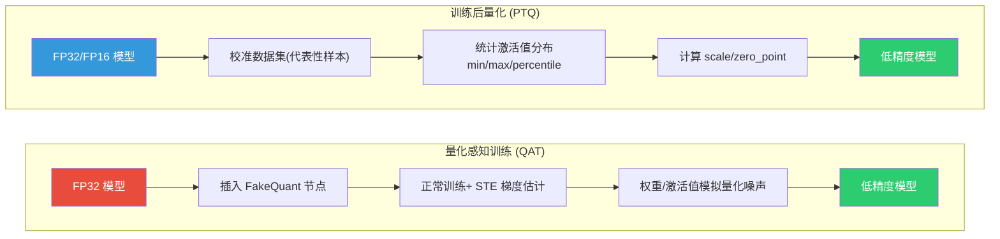
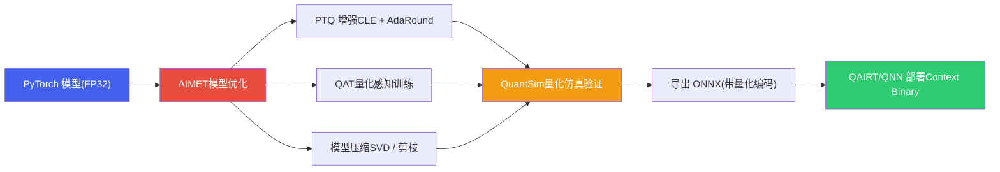
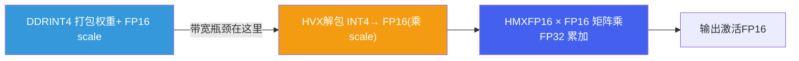

# 4. 端侧模型量化与压缩

*基于 Qualcomm SA8397P 平台  |  PTQ/QAT · AIMET · W4A16 · 量化方案选型*

> [!TIP]
> **本篇讲什么**
>
> 座舱端侧模型的**量化与压缩方法**——从原《推理优化》拆出的主题之一：
>
> - 量化基础：PTQ / QAT 流程、混合精度策略、校准集、量化粒度，以及**为什么 LLM 量化比 CNN 难**
> - AIMET 量化工具：CLE / Bias Correction / AdaRound / QuantSim / 敏感度分析
> - **W4A16：HTP 上跑 LLM 的真实主战场**——权重 INT4 分组打包、反量化在哪一级做、group size 取舍
> - **2025-2026 方法版图**：weight-only 算法谱系（GPTQ/AWQ/SmoothQuant）、旋转类 W4A4（QuaRot/SpinQuant）、FP8/FP4、KV Cache 量化、LLM QAT 回潮——以及**哪些能上车、哪些还在云端/研究**
> - 量化方案对比与选型：用带宽模型推导 decode 速度，而不是背"标准答案"
>
> 推理原理（Prefill/Decode、Roofline、KV Cache）见 [LLM 推理原理与性能模型](infer-principles.html)；解码与服务化优化见 [端侧解码与服务化优化](infer-serving.html)。

> [!NOTE]
> **锚点模型与数据口径（与全站一致）**
>
> 本篇以 **Qwen3-Omni-4B** 为锚点模型——**项目内部定制的 4B 级全模态模型**（并非公开发布的 Qwen3-Omni 系列，公开版为 30B-A3B MoE）。结构按 4B 级稠密模型的典型配置：36 层、32 个 Q head、8 个 KV head（GQA）、head\_dim 128、hidden 2560、约 4B 参数，INT4 权重约 2.5 GB。完整口径定义见 [硬件架构](hardware.html) 顶部「全站数据口径与锚点模型」NOTE。
>
> 本篇遵循全站「**只讲方法不给数**」约定：文中出现的个别数值一律为**示例参数**，仅用于演示方法本身、不代表实测，请代入你自己的平台带宽与模型配置计算。

## 1. 量化基础

### 1.1 PTQ 与 QAT 流程

模型量化是端侧部署的关键步骤，将 FP32/FP16 模型转换为低精度（INT8/INT4）以降低内存占用与带宽压力。两种主要方法是 **训练后量化 (PTQ)** 和 **量化感知训练 (QAT)**：



> [!NOTE]
> **上图是「激活也要量化」的范式；weight-only 量化的校准用法不同**
>
> 流程图里 `统计激活值分布 → 计算 scale/zero_point` 描述的是 **W8A8 这类激活也量化的路径**（CNN 主战场）。**LLM 的 weight-only 路径（W4A16）里，激活根本不量化，也就没有"激活 scale"要统计**——校准数据在那条路上是另一种用途：
>
> - **估计激活的相对幅值**，用来判断哪些权重通道"重要"（AWQ 式 activation-aware 缩放的依据）；
> - **估计逐层 Hessian / 二阶信息**，用来求解"量化后输出误差最小"的权重（GPTQ 式逐层重建、AdaRound 的依据）。
>
> 两者都**只用输入、不用标签**，但目标函数从"覆盖激活动态范围"变成了"最小化输出重建误差"。混淆这两种校准语义，是 LLM 量化调参时最常见的方向性错误（详见 §1.4、§4.1）。

### 1.2 PTQ 与 QAT 对比

| 维度 | PTQ (训练后量化) | QAT (量化感知训练) |
| :--- | :--- | :--- |
| **开发成本** | 低，无需重新训练 | 高，需要完整训练流程 |
| **精度损失** | 较大 | 较小 |
| **数据需求** | 数百~数千个代表性样本（只需输入） | CNN：完整训练集；**LLM：小规模精选语料即可**（见下方 NOTE） |
| **训练时间** | 分钟级 | 小时~天级 |
| **适用场景** | 模型精度冗余大、快速验证 | 精度敏感、安全关键应用 |
| **推荐优先级** | 优先尝试 | PTQ 精度不达标时使用 |

> [!NOTE]
> **「QAT 要完整训练集」是 CNN 时代的口径，LLM 上已不成立**
>
> 对 LLM，QAT 的目标不是"重新学会任务"，而是**让权重适应量化噪声**——因此不需要预训练级别的数据量。2024 年以来的低成本 LLM QAT 路线（如 **EfficientQAT** 一类分块训练方法）把网络按 block 切开、逐块做量化感知优化，只需**数千~数万条精选语料**、单卡到少量卡即可完成，成本比全量 QAT 低一到两个数量级。
>
> 实践含义：**W4 及以下位宽 PTQ 掉点无法接受时，"上 QAT"不再是"要重训一遍"的代名词**——分块 QAT / 量化感知 LoRA 微调是端侧团队实际可负担的选项。这也是 §4.5 要讲的「LLM QAT 回潮」的成本基础。
>
> （具体方法名与数据量级请以原论文为准，此处只给方法定位。）

> [!NOTE]
> **CNN 与 LLM 的量化路径不同**
>
> 上表描述的是通用流程。具体到高通平台：**CNN 类小模型**（DMS/OMS）走 `qnn-onnx-converter` + 校准参数的 W8A8 路径；**LLM** 则走 **W4A16** 的 weight-only 路径（见 §3），两者在位宽组合、工具链上都不一样，不能混用。

### 1.3 混合精度策略

> [!TIP]
> **Best Practice: 混合精度量化策略**
>
> 模型不同层对量化的敏感度不同。以 CNN 检测模型为例的混合精度策略：
>
> | 模型组件 | 推荐精度 | 原因 |
> | --- | --- | --- |
> | **Backbone (骨干网络)** | INT8 | 特征提取层对量化鲁棒，计算量最大，INT8 收益最高 |
> | **FPN (特征金字塔)** | INT8 | 多尺度融合层相对鲁棒 |
> | **Detection Head (检测头)** | INT16 | 分类/回归输出对精度敏感 |
> | **Keypoint Regression (关键点回归)** | INT16 | 亚像素精度要求高，INT8 会导致关键点抖动 |
>
> AIMET 支持通过敏感度分析自动推荐混合精度配置（见 §2.4）。

> [!NOTE]
> **LLM 的混合精度：保哪些层，与 CNN 不同**
>
> 上表是 CNN 视角。LLM 的 W4A16 混合精度，经验上的"高敏感层"是：
>
> - **embedding 与 LM head**：词表投影对量化误差极敏感，且参数量占比小，**通常保留 FP16 不量化**（这也是 §3.2 里"2.5 GB vs 2 GB"差额的来源之一）；
> - **首层与末层**：误差在入口被放大、在出口无处摊薄，敏感度分析常把它们排到前列；
> - **attention 的 QKV / output 投影**：部分模型里这些投影层对量化敏感，可用更小 group size 或更高位宽；
> - **norm 层（LayerNorm/RMSNorm）**：参数量极小、且输出直接进残差流，**一律保留高精度**。
>
> 判定方法不变：敏感度分析排候选 → 逐层提位宽 → 端到端评测确认（§2.4 的 WARNING）。

### 1.4 校准集选择（PTQ 质量的关键）

PTQ 的量化参数（scale/zero-point）由校准数据集统计得出，**校准集质量直接决定量化精度**：

- **代表性**：校准数据必须覆盖真实输入分布（座舱场景：不同光照/肤色/姿态的 DMS 图像、不同长度/领域的指令文本）；分布偏差会让量化参数失真、上线后掉点。
- **规模**：通常数百~数千样本即可（边际收益递减）；LLM 的 W4A16 校准一般几百条代表性 prompt。
- **多样性优先于数量**：宁可用 500 条覆盖广的样本，也不用 5000 条同质样本。
- **无需标注**：PTQ 校准只需输入（前向统计激活分布），不需要标签。
- **与评测集隔离**：校准集不要与评测集重叠，避免对评测分布过拟合量化参数（见 data-pipeline 篇评测集污染）。

> [!WARNING]
> **端侧 LLM 校准集的四个陷阱（比 CNN 更隐蔽）**
>
> LLM 的校准目标是"最小化输出重建误差"（§1.1 NOTE），对输入分布更敏感，因此 CNN 时代"随便抓一批语料就能校准"的经验会失效：
>
> 1. **序列长度失配**：用短 prompt 校准、上线却跑长上下文——attention 的激活幅值、RoPE 影响下的分布都会随长度变化，激活统计量失真。校准序列长度应贴近部署的典型上下文。
> 2. **领域失配**：用通用网页语料校准、部署却做**座舱车控 / Function Calling**——AWQ 式缩放因子、GPTQ 式 Hessian 都按"哪些权重重要"来定，重要通道由输入分布决定。领域不同，被保护的通道就不同，掉点集中在工具调用这类结构化输出上。
> 3. **模态失配**（对全模态锚点模型尤其致命）：只用文本校准、上线却输入图像/音频——视觉/音频编码器与跨模态投影层的激活统计完全没被覆盖，这些层的量化参数等于瞎猜。**全模态模型的校准集必须按模态配比**。
> 4. **样本太少导致二阶估计病态**：GPTQ/AdaRound 类方法依赖逐层 Hessian，样本过少会让 Hessian 估计病态、重建误差爆炸。宁可减位宽前先加校准样本，也别反过来。
>
> 另注意：校准样本少（几百条）时，activation-aware 缩放因子容易**过拟合校准集**——务必在留出的验证集上确认掉点，而不是只看校准集上的重建误差。

### 1.5 量化粒度：per-tensor vs per-channel

- **per-tensor**：整个张量共用一个 scale（+zero-point）。开销最小，但若各通道权重动态范围差异大，会被最大范围「绑架」、精度损失大。
- **per-channel**：每个输出通道一个 scale，能贴合各通道分布、精度更好，是 CNN 权重化的默认推荐；代价是编码元数据略多、部分硬件/算子支持有限。
- **对称 vs 非对称**：对称量化（zero-point=0）计算简单、适合权重与以 0 为中心的分布；非对称（带 zero-point）能更好利用位宽、适合激活。高通平台权重量化常用**对称 + per-channel**。
- **LLM 的分组量化**是更细的粒度（每 g 个权重一个 scale，见 §3.2），因为 LLM 权重 outlier 分布更不均匀。

### 1.6 为什么 LLM 量化比 CNN 难

CNN 的 W8A8 PTQ 基本是"工程常规操作"，而 LLM 在同样位宽下常常直接崩。差异不来自模型大小，而来自**四个结构性原因**：

**① 激活 outlier：少数通道的幅值比其余通道大一两个数量级**

LLM 的激活不是均匀分布的——在 Transformer 规模超过约 6.7B 后，会出现**系统性的、固定在少数特征维度上的大幅值激活**（Dettmers et al., *LLM.int8()*, 2022 的核心发现）。这些 outlier 通道：

- 幅值可达典型激活的数十倍甚至上百倍；
- **位置固定**（跨 token、跨样本都出现在同几个维度），因此不能靠"多取几个样本平均"消掉；
- 承载了相当比例的模型能力——把它们截断，掉点是非线性的。

per-tensor INT8 的量化区间由**最大幅值**决定，于是 outlier 把整个区间的分辨率"绑架"了：其余 99% 的正常激活被压到极少数量化格点上，信息几乎全丢。这正是 **SmoothQuant（把量化难度从激活迁移到权重）** 和 **旋转类方法（把 outlier 能量摊平到所有通道，见 §4.2）** 存在的根本原因。

**② 分布重尾，均匀格点是错的度量**

INT 量化在数值轴上**等间距**铺格点，隐含假设是"误差代价对幅值一视同仁"。但 LLM 的激活/权重分布是**重尾（high-kurtosis）**的：绝大多数值挤在 0 附近，极少数值拖到很远。等间距格点把大量分辨率浪费在几乎没有数据的中间区域，又对尾部覆盖不足。**浮点格式（FP8/FP4）的非等间距格点（近零密、远端疏）天然匹配重尾分布**——这是 §4.3 的核心动机。

**③ 误差沿深度与自回归双重累积**

CNN 前向一次，36 层的误差累积一遍就结束。LLM 要累积**两遍**：

- **深度方向**：残差流把每层的量化误差一路带到最后一层；
- **时间方向**：自回归 decode 中，第 t 步的输出（带误差）成为第 t+1 步的输入。误差不仅累积，还会**改变后续 token 的分布**，一旦某个 token 采样偏了，整段生成都跑偏。

所以 LLM 对"每层一点点误差"的容忍度远低于 CNN——CNN 掉 0.5% top-1 无感，LLM 掉同样的量级可能让多步推理链直接断掉。

**④ 评测指标非线性，ppl 掩盖真实退化**

CNN 看 top-1 accuracy，是个**饱和、平滑**的指标。LLM 看 perplexity，但 **ppl 只涨 1-2% 时，下游任务（尤其多步推理、Function Calling 的参数正确率）可能掉十几个百分点**——因为 ppl 是对所有 token 的平均，而工具调用只要错一个字段就整条失败。

> [!CAUTION]
> **端侧量产的评测口径：不能只看 ppl**
>
> 座舱 Function Calling 场景下，量化方案选型必须**同时看 ppl 和任务级指标**（工具名正确率、参数 JSON 合法率、端到端任务成功率）。只报 ppl 的量化对比表，在结构化输出任务上会给出过于乐观的结论。评测集设计见 [数据与评测](data-pipeline.html)。

### 1.7 量化误差如何随位宽与 group size 传播

位宽和 group size 的取舍不该靠"经验值"，可以直接从均匀量化器的噪声模型推出来。

**均匀量化器的 RMS 误差**

设量化区间长度为 `R_q`（即 max−min，下标 q 表示 quantization range，与 §4.2 的旋转矩阵 R 区分），位宽 `b`，则量化步长：

```text
Δ = R_q / (2^b − 1)
```

在"量化误差在 [−Δ/2, +Δ/2] 上均匀分布"的假设下（Bennett 条件，高分辨率近似），均方量化噪声为：

```text
σ_q² = Δ² / 12      →      σ_q = Δ / √12
```

由此得到两条可直接用的结论：

- **每加 1 bit，Δ 减半，σ_q 减半**（信噪比 +6.02 dB/bit，经典结果）。反过来，**8→4 bit 让量化噪声放大约 16 倍**（2⁴）——这就是 W4 必须配合分组量化 / activation-aware 缩放 / 逐层重建才能用的原因。
- **误差正比于区间长度 R_q**。所以一切"救精度"的手段，本质都是**在不加 bit 的前提下缩小 R_q**：

| 手段 | 如何缩小有效 R_q |
| :--- | :--- |
| **per-channel** | 每个输出通道按自己的范围定 R_q，而不是被全张量最大值绑架 |
| **group quant（g 越小越好）** | 每 g 个权重按局部范围定 R_q；局部范围通常远小于整行范围 |
| **CLE** | 均衡相邻层权重范围，压掉个别通道的极端 R_q |
| **AWQ 式 activation-aware 缩放** | 把重要通道的权重放大、其余缩小，让 R_q 的分配对齐"误差代价" |
| **旋转类（QuaRot/SpinQuant）** | 正交旋转把 outlier 能量摊到所有通道，**直接压掉重尾**，R_q 整体收窄（§4.2） |
| **AdaRound / GPTQ** | 不改 R_q，而是**优化落在哪个格点**——把"最近邻取整"换成"输出误差最小取整" |

**group size 的定量效果（示例推导）**

分组量化把每组的 R_q 从"整行范围"降到"局部范围"。若局部范围平均是整行范围的 `ρ` 倍（ρ<1），则 σ_q 也按 ρ 缩小。g 越小，ρ 通常越小（局部越同质），但 scale 元数据开销按 `1/g` 增长——**精度收益递减、开销线性增长**，这就是 §3.4 取舍曲线的来源。

**误差跨层传播**

若各层量化误差近似独立、零均值，L 层网络输出的误差幅度按**随机游走**增长，约 `√L` 倍单层误差；若误差相关（残差流方向一致），则接近线性 `L` 倍。锚点模型 36 层，意味着单层误差在输出端被放大数倍——**这解释了为什么"逐层 MSE 看着都不大"的量化方案，端到端 ppl 却明显退化**，也是 §2.4 敏感度分析必须做端到端验证、而不能只信逐层 MSE 的原因。

> [!TIP]
> **自回归的额外放大**
>
> 上面的 √L / L 只是**单次前向**的放大。decode 还要再乘上"生成步数"这一维：误差进入 KV Cache 后被后续每一步反复读取，且采样出的 token 会改变后续分布。因此**长输出任务对量化的敏感度显著高于短输出任务**——座舱里"一句话车控"和"多轮长对话"应该用不同的量化验收标准。

## 2. AIMET 量化工具

### 2.1 AIMET 概述

**AIMET (AI Model Efficiency Toolkit)** 是高通创新中心 (Qualcomm Innovation Center) 开源的模型优化工具包，专注于**模型量化与压缩**。它是连接训练框架（PyTorch/TensorFlow）与高通部署运行时的关键桥梁——提供比通用量化工具更精细的量化控制能力，特别适合**精度敏感的安全关键场景**（如 DMS 疲劳检测）。



### 2.2 AIMET 核心技术

| 技术 | 原理 | 适用场景 |
| :--- | :--- | :--- |
| **CLE (Cross-Layer Equalization)** | 利用 ReLU 的缩放不变性，均衡相邻层的权重范围，减少量化截断误差。无需训练数据，纯数学变换。 | PTQ 前预处理，对 MobileNet/EfficientNet 等 Depthwise Conv 结构效果显著 |
| **Bias Correction** | 补偿量化引入的系统性偏差：计算 FP32 与量化输出的均值差异，修正 bias。**需少量校准数据**（前向统计均值偏移） | CLE 之后配合使用 |
| **AdaRound (Adaptive Rounding)** | 传统量化用最近邻取整，AdaRound 优化每个权重的取整方向以最小化输出误差 | PTQ 精度恢复，需少量校准数据 |
| **QuantSim (Quantization Simulation)** | 在 FP32 环境模拟量化行为，插入 FakeQuant 节点，无需真实硬件即可验证精度 | 快速验证量化方案、调试敏感层 |
| **Mixed Precision (自动混合精度)** | 基于敏感度分析，自动为每层选择最优位宽 | 不同层量化敏感度差异大的场景 |
| **QAT (量化感知训练)** | 训练中插入 FakeQuant，用 STE 估计梯度，让模型适应量化噪声 | PTQ 不达标时的最终手段 |
| **模型压缩 (SVD / Channel Pruning)** | SVD 低秩分解大权重矩阵；通道剪枝移除不重要通道 | 参数量过大需结构性压缩 |

> [!NOTE]
> **数据需求分三档，别混为一谈**
>
> - **CLE：完全 data-free**——纯权重变换，不碰数据；
> - **Bias Correction / AdaRound：需少量校准数据**（几十~几百 batch 的输入，无需标签）；
> - **QAT：需训练流程**（LLM 上可用小规模精选语料，见 §1.2）。
>
> 另注意 **CLE 的适用边界**：它依赖 **ReLU 的缩放不变性**（`ReLU(s·x)/s = ReLU(x)`）。LLM 用的是 **GELU / SiLU**，不具备这一不变性，**CLE 不能直接搬到 LLM 上**——LLM 的"范围均衡"由 activation-aware 缩放（AWQ 式）或旋转（QuaRot 式）承担（见 §4）。

> [!NOTE]
> **为什么 Depthwise Conv 难量化**
>
> 含大量 depthwise conv、hard-swish 的模型（如 MobileNetV3）是**公认的量化难点**——depthwise conv 每通道独立、权重动态范围差异大，量化后掉点严重。这正是 CLE + Bias Correction + AdaRound 组合拳存在的原因：它们就是为补救这类结构的 PTQ 精度而设计的。

### 2.3 AIMET 量化工作流（CNN 示例）

以 DMS 人脸关键点模型的 PTQ 优化为例：

```python
import torch
from aimet_torch.model_preparer import prepare_model
from aimet_torch.cross_layer_equalization import equalize_model
from aimet_torch.adaround.adaround_weight import Adaround, AdaroundParameters
from aimet_torch.quantsim import QuantizationSimModel

# 1. 加载 FP32 模型
model = load_dms_model("mobilenetv3_face_landmarks.pth")
model.eval()

# 2. 准备模型 (自动替换不兼容层)
model = prepare_model(model)

# 3. Cross-Layer Equalization — 均衡权重范围
equalize_model(model, input_shapes=(1, 3, 224, 224))

# 4. AdaRound — 自适应取整优化
params = AdaroundParameters(
    data_loader=calib_loader,        # 校准数据 (无需标注)
    num_batches=50,
    default_num_iterations=10000,
    default_reg_param=0.01
)
model = Adaround.apply_adaround(
    model,
    dummy_input=torch.randn(1, 3, 224, 224),
    params=params,
    path="./adaround_output",
    filename_prefix="dms_model"
)

# 5. QuantSim — 量化仿真验证
quantsim = QuantizationSimModel(
    model,
    dummy_input=torch.randn(1, 3, 224, 224),
    quant_scheme='tf_enhanced',     # 高通推荐的量化方案
    default_output_bw=8,            # 激活值 INT8
    default_param_bw=8              # 权重 INT8
)

# 6. 计算校准编码
quantsim.compute_encodings(
    forward_pass_callback=calibration_forward,
    forward_pass_callback_args=calib_loader
)

# 7. 验证量化精度
quant_accuracy = evaluate(quantsim.model, val_loader)

# 8. 导出量化模型 (ONNX + 量化编码)
quantsim.export(
    path="./export_output",
    filename_prefix="dms_model_int8",
    dummy_input=torch.randn(1, 3, 224, 224)
)
# 输出: .onnx + .encodings → qnn-onnx-converter 转换为 QNN 模型
```

### 2.4 AIMET 敏感度分析与混合精度

```python
from aimet_torch.quant_analyzer import QuantAnalyzer

analyzer = QuantAnalyzer(model, dummy_input=torch.randn(1, 3, 224, 224))
analyzer.enable_per_layer_mse_loss(
    unlabeled_dataset_iterable=calib_loader,
    num_batches=20
)
analyzer.analyze(
    quant_scheme='tf_enhanced',
    default_param_bw=8,
    default_output_bw=8,
    config_file=None,
    results_dir="./sensitivity_results"
)
# 输出: HTML 报告 + 每层 MSE 柱状图
# → 高 MSE 的层建议保持 INT16/FP16
```

> [!WARNING]
> **逐层 MSE 只是"嫌疑名单"，不是判决**
>
> `QuantAnalyzer` 的 per-layer MSE 衡量的是**单层输出重建误差**，但由 §1.7，端到端误差是跨层累积（√L~L 倍）且**层间不独立**的——残差流会让某些"单层 MSE 不高"的层在端到端上影响很大，反之亦然。正确用法是：**用逐层 MSE 排出候选敏感层 → 逐个提升位宽 → 每步都跑端到端评测确认**。只看 MSE 柱状图就定混合精度配置，是常见的假阳性/假阴性来源。

> [!TIP]
> **Best Practice: AIMET 推荐流程**
>
> **CNN 标准路径**：CLE → Bias Correction → AdaRound → QuantSim 验证 → 导出 ONNX → QAIRT/QNN 转换。多数模型用这条 PTQ 增强路径即可达标，无需进入 QAT。
>
> **关键经验**：
>
> * **CLE 对 Depthwise Conv 效果最好**（但依赖 ReLU 不变性，**不适用于 GELU/SiLU 的 LLM**，见 §2.2）
> * **AdaRound 校准数据不需要标注**，只需代表性样本
> * **quant\_scheme 选择**：高通平台推荐 `tf_enhanced`。它的机制是**在候选截断电平上做网格搜索、以最小化量化 MSE 为目标**选取量化区间（AIMET 的 "enhanced" 即指此），**不是简单的 min/max，也不是分位数校准**；对称/非对称由 config 与张量类型决定，不由 scheme 决定。（机制细节以 AIMET 官方文档为准。）
> * **导出格式**：AIMET 导出的 ONNX + `.encodings` 可被 QAIRT/QNN converter 直接识别
> * **敏感度分析**：对精度损失明显的层，优先尝试 INT16 而非 QAT，开发成本更低

### 2.5 AIMET 与 LLM 的 W4A16 导出

§2.3 的 CNN 路径输出 W8A8。**LLM 不走这条路**——LLM 的量化导出目标是 **W4A16**（权重 INT4、激活 FP16），工具链是 AIMET 的 LLM 量化能力（weight-only 分组量化）或 QAIRT 自带的转换/量化器。典型链路：

```text
微调后的 LLM (FP16/BF16)
  → AIMET / QAIRT 做 W4A16 分组量化（选 group size、跑校准）
  → 导出量化权重 + 量化编码
  → 生成 context binary（离线图编译 + 内存规划）
  → Genie 运行时加载
```

> [!WARNING]
> **一条走不通的路：AWQ/GPTQ 打包权重直接喂给 QNN**
>
> HuggingFace 上常见的 `AWQ`/`GPTQ` 量化模型是 **`quantize_config` + packed qweight** 的私有格式，导出 ONNX 后是自定义算子。**QAIRT/QNN 的 converter 从 FP32 ONNX 自己做量化，吃不下这种打包好的 INT4 权重**。AWQ/GPTQ 只适用于 llama.cpp / vLLM 路线；高通平台的正解是 **AIMET / QAIRT 的 W4A16 导出流程**。W4A16 的机制见 §3，Genie 运行时见 [LLM 推理原理与性能模型 · Genie/QAIRT](infer-principles.html)。

## 3. W4A16：HTP 上 LLM 量化的真实主战场

### 3.1 为什么是 W4A16/W8A16，而不是 W8A8

一个常见误解是把 LLM 也按 CNN 的 W8A8 思路量化。**HTP 上跑 LLM 的实际模式是 W4A16 / W8A16（weight-only），激活保持 16-bit**，原因有三：

1. **LLM 激活存在显著 outlier**（机理见 §1.6①）。LLM 的激活值在少数通道上出现大幅值离群点，把激活压到 INT8（A8）会让这些通道的信息严重失真，精度掉点明显。保持激活 FP16 可规避这一问题。
2. **decode 是带宽瓶颈，压权重就够了**。由 [Roofline 分析](infer-principles.html) 可知，decode 每生成一个 token 都要把全部权重从 DDR 读一遍，是 memory-bound。**压缩权重直接减少每 token 的读取字节数**，这正是提速的关键；而激活在 decode 时只有 1 个 token 的向量，读取量可忽略，量化它收益极小、风险却大。
3. **A8 还会引入额外的 requant 开销**。激活量化不是"免费"的：每层输出都要 quantize、下层输入又要对齐 scale，这些 requant 操作在 batch=1 的 decode 里占比不小，而换来的带宽收益几乎为零（激活读取量本就可忽略）。**净效果是变慢**。

所以：**权重压到 INT4/INT8 省带宽，激活留 FP16 保精度**——这就是 W4A16/W8A16 的由来。

> [!NOTE]
> **那什么时候激活量化（A8/A4）才真的有价值？**
>
> 当负载从 memory-bound 翻到 **compute-bound** 时。端侧 LLM 里主要是 **prefill**：长 prompt、多模态大量视觉 token、或 batch>1 的并发场景，算术强度升高、瓶颈转到算力（判据见 [Roofline · Knee Point](infer-principles.html)）。此时若硬件的 INT8/INT4 整数通路峰值高于 FP16 通路，激活量化才能把 prefill/TTFT 也拉下来。
>
> **这正是 §4.2 旋转类方法（QuaRot/SpinQuant）要解决的问题**：它们先把 outlier 摊平，让 W4A4 在精度上可行，从而让 matmul 能走整数通路。但截至 2025-2026，这条路的成熟 kernel 主要在云端 GPU，**车规 NPU 上尚未成为量产选项**（落地判定见 §4.6）。

### 3.2 权重 INT4 分组打包

INT4 量化不是给整个权重张量一个 scale，而是**分组 (group quantization)**：

```text
权重矩阵某输出通道的一行 (H_in 个权重):
  ┌─────────────── group 0 ───────────────┬─────────────── group 1 ───────────────┐
  [ w0 w1 ... w(g-1) ]  scale0(FP16)      [ w(g) ... w(2g-1) ]  scale1(FP16)
        g 个 INT4 共享一个 scale

打包: 8 个 INT4 → 1 个 INT32 字 (或 2 个 INT4 → 1 byte)
```

- **group size `g`** 常见取 32 / 64 / 128，每组共享一个 scale（部分实现再加 zero-point）。
- **分组方向是「归约轴」**：group 沿权重的**输入维度**（`H_in`，即 matmul 的归约轴）切分，每个输出通道各自分组。所以 group quantization 是 **per-channel 的进一步细分**——per-channel 是"每行一个 scale"，group quant 是"每行再切成 `H_in/g` 段、每段一个 scale"。沿归约轴分组是必要的：matmul 的累加发生在这一维，scale 必须能在累加前提取出来。
- **每参数有效字节** ≈ 0.5 Byte（INT4）+ scale 摊销 + zero-point 摊销。以 scale 为 FP16 为例：

| group size `g` | scale 摊销 (Byte/param) | 含 4-bit zero-point 的摊销 | 有效 Byte/param（对称） | 相对 INT4 的开销 |
| :--- | :--- | :--- | :--- | :--- |
| **32** | 2/32 = 0.0625 | (2+0.5)/32 ≈ 0.078 | 0.5625 | **+12.5%** |
| **64** | 2/64 ≈ 0.031 | (2+0.5)/64 ≈ 0.039 | 0.531 | **+6.3%** |
| **128** | 2/128 ≈ 0.016 | (2+0.5)/128 ≈ 0.020 | 0.516 | **+3.1%** |

> 上表是**公式直接算出的元数据开销**（非实测、非性能数字）：`摊销 = scale 字节 / g`。注意两点——① **g=32 时元数据已占 12.5%**，"INT4 = 0.5 Byte/param"的粗算会明显低估实际权重体积；② **非对称量化要再算 zero-point**，很多实现把 zero-point 也按 4-bit 打包，故摊销是 `(2 + 0.5)/g` 而非 `2/g`。
>
> 这也解释了 §5.2 里"4B × 0.5 = 2 GB"与锚点口径"INT4 权重约 2.5 GB"的差额来源：scale/zero-point 元数据、未量化的 embedding 与 LM head、norm 层参数、以及容器/对齐开销。

### 3.3 反量化在哪一级做

权重以 INT4 存于 DDR，但 HMX 矩阵乘不吃 INT4×FP16 的混合输入，所以**反量化 (dequant) 必须在片上、matmul 之前完成**：



关键点：

- **从 DDR 读的始终是压缩后的 INT4 权重**——带宽收益在"读"这一步就拿到了。
- **dequant 是片上计算**（HVX 向量指令做解包 + 乘 scale），相对省下的带宽开销很小，**不是瓶颈**。
- **反量化后的 FP16 权重不回写 DDR**：解包产物只活在片上（供 HMX 消费），用完即弃。若把 FP16 权重再落回 DDR，带宽收益就全没了——这是判断一条 W4A16 实现是否正确的关键标志。
- **片上暂存（VTCM）决定 tile 大小**：INT4 权重块先搬进片上 SRAM（HTP 的 VTCM）再解包、再喂 HMX。VTCM 容量（典型 8 MB 估算，见 [硬件架构](hardware.html)）决定了单次能解包多大的权重 tile——**VTCM 越小，权重块越要切得碎、搬运越频繁**，这也是 W4A16 与 FlashAttention 分块共享同一块 VTCM 时要做内存规划的原因。
- matmul 走 **FP16 × FP16、FP32 累加** 通路（因为激活是 FP16）。这也意味着：**W4A16 的实际峰值算力由 FP16 通路决定，远低于 INT8 TOPS**——这一点在 [Roofline 的 Knee Point 计算](infer-principles.html) 里必须用对，否则 bound 类型判断会错。

### 3.4 group size 对精度与带宽的影响

| group size | 精度 | scale 元数据开销 | dequant 计算 | 典型用途 |
| :--- | :--- | :--- | :--- | :--- |
| **32** | 最好（scale 粒度细，最贴合局部分布） | 较高（+12.5%） | 略多 | 精度敏感层 / 低 bit 场景 |
| **64** | 好 | 中（+6.3%） | 中 | 常见折中 |
| **128** | **良好（de-facto 标准，多数模型掉点很小）** | 最低（+3.1%） | 最少 | 默认档 / 追求极致带宽 |

> 元数据开销列引自 §3.2 的公式推导（对称、FP16 scale）。

**取舍逻辑**：g 越小，每组 scale 越能贴合局部权重分布、量化误差越小（§1.7 的 ρ 因子），但 scale 元数据和 dequant 操作随之增多；g 越大则相反。注意 **g=128 不是"精度差"，而是 GPTQ/AWQ 的默认档、绝大多数模型掉点可忽略**——从 128 降到 32 的精度增益通常**有限**（个位数百分比的误差差量），而元数据开销却从 +3.1% 涨到 +12.5%。端侧 LLM 量产常见 g=64 或 128，对个别敏感层（如首尾层、attention 投影）单独用更小的 g 或保留更高位宽。

> [!WARNING]
> **group size 不是自由参数：受运行时支持的粒度约束**
>
> 理论上的 g 可以任意取，但 **QAIRT/Genie 的 W4A16 kernel 只支持特定 group size**（常见为 32/64/128 的固定档位，具体以工具链文档为准）。选一个运行时不支持的 g，要么报错、要么被强制 padding 到最近的档位——**元数据开销和精度都要按"实际落到的档位"算**。调参时先查工具链支持的合法档位，再在合法档位里做精度/带宽取舍。

## 4. 2025-2026 量化方法版图：从 weight-only 到 W4A4

§3 讲的 W4A16 是**端侧 HTP 当下的量产主战场**，但它不是量化研究的全部。这一节把近两年的方法谱系摆清楚，并给出**端侧落地判定**——哪些已能上车、哪些还在云端 GPU、哪些还在论文阶段。

### 4.1 weight-only PTQ 算法谱系与现状定位

端侧 LLM 的 W4A16 背后，校准算法主要出自四个家族。理解它们的**机制差异**比记名字重要——因为机制决定了它能不能解决 §1.6 里的哪个难点：

| 方法 | 核心机制 | 解决的难点 | 位宽组合 | 现状定位（2025-2026） |
| :--- | :--- | :--- | :--- | :--- |
| **GPTQ** (Frantar et al., 2022) | 逐层重建：用近似二阶（Hessian）信息，求解"量化后该层输出 MSE 最小"的权重；OBQ/OBS 谱系 | 取整误差（§1.7 表末行） | weight-only W4/W3 | 仍是 W4 PTQ 的两大主力之一，工具链普遍内置 |
| **AWQ** (Lin et al., 2023) | activation-aware：用校准激活找出"对应大幅值激活"的少数权重通道，量化前按通道放大保护它们；**不用 Hessian、不用反传** | 权重侧的重要通道被截断 | weight-only W4 | 与 GPTQ 并列的主力；实现更轻、校准更快 |
| **SmoothQuant** (Xiao et al., 2022) | 等价变换：把量化难度从激活**迁移**到权重（per-channel 平滑因子 α），让激活也能进 INT8 | **激活 outlier**（§1.6①） | **W8A8** | 激活量化的经典解；在有 INT8 激活通路的 GPU/NPU 上仍是主流，**HTP 的 LLM 路径用不上**（A16 是默认） |
| **OmniQuant** (Shao et al., 2023) | 可学习权重截断 + 等价变换，介于 PTQ 与 QAT 之间 | 截断电平选得不好 | W4/W3、W6A6 等 | 学术影响大，工程上多被 GPTQ/AWQ + 小 g 覆盖 |

> [!IMPORTANT]
> **GPTQ 与 AWQ 的 decode 速度相同——这是 §5.1 那条认知的算法层依据**
>
> 两者都是 weight-only INT4，产物都是"打包 INT4 权重 + per-group scale"，**推理 kernel 完全一样**（解包 → 反量化 → GEMM）。它们只在**校准阶段**用不同的目标函数选权重值，不影响运行时读多少字节。所以速度差异只能来自 group size 不同带来的元数据/dequant 开销差量，量级很小。

**SmoothQuant 为什么在 HTP 的 LLM 路径上用不上**：它的价值是让 **A8** 可行，而 §3.1 已论证 HTP 上 LLM 的 decode 是 memory-bound、A8 既无带宽收益又有 requant 开销。SmoothQuant 在端侧的适用面是**有 INT8 激活整数通路的 CNN/小模型**，不是 LLM。

### 4.2 旋转类方法：QuaRot / SpinQuant 如何让 W4A4 可行

这是 2024-2026 量化领域**最重要的方法论突破**，因为它第一次让"激活也压到 4-bit"在精度上站得住。

**核心思想：用正交旋转把 outlier 摊平**

§1.6① 的问题是激活 outlier **集中在少数通道**，导致 per-tensor/per-channel 的量化区间被绑架。旋转类方法的解法不是"更细的分组"，而是**换一个基**：

```text
设 R 为正交矩阵（Rᵀ R = I）。对残差流 x 做变换 x' = x·R：

  · 输出不变性：下游权重同步改为 W' = Rᵀ·W，则 x'·W' = x·R·Rᵀ·W = x·W
    → 网络数学等价，精度不因旋转本身损失
  · 分布变化：R 把集中在少数通道的能量"打散"到所有通道
    → x' 的分布接近各向同性的高斯，重尾被压平
    → 量化区间 R_q（§1.7）整体收窄，A4 变得可行
```

| 方法 | 旋转矩阵怎么来 | 特点 |
| :--- | :--- | :--- |
| **QuaRot** (Ashkboos et al., 2024) | **固定的 Hadamard 矩阵**（元素 ±1/√n，正交） | 无需训练；Hadamard 变换可用快速算法（类 FFT）在线执行，开销低；实现 **W4A4** |
| **SpinQuant** (Liu et al., 2024) | **学习**旋转矩阵（在正交流形上做 Cayley/随机优化） | 比固定 Hadamard 更贴合具体模型，精度更好；需要一轮训练，成本更高 |

**为什么这对端侧有意义**：W4A4 让 matmul 能走**整数通路**而不是 FP16 通路。由 §3.3，W4A16 的峰值算力被 FP16 通路锁死；若 A4 可行，**prefill（compute-bound）也能提速**，而不只是 decode。这是 W4A16 拿不到的收益。

> [!CAUTION]
> **端侧落地判定：旋转类方法目前主要在云端 GPU**
>
> 截至 2025-2026，QuaRot/SpinQuant 的成熟实现依赖 **CUDA 上的融合 kernel**（在线 Hadamard 变换 + INT4 matmul 融合）。要在车规 NPU 上落地，需要三件事同时成立：① 工具链支持把 Hadamard 旋转**吸收进权重**（离线部分可做）；② 运行时对**在线旋转**（attention/MLP 输入侧）有高效算子支持；③ HMX 有可用的 INT4×INT4 通路。**这三条在座舱 HTP 上均未成为量产选项**——所以 §3 的 W4A16 仍是主战场。（各厂商 NPU 对旋转算子/INT4 激活通路的支持情况需以最新工具链文档核实。）

### 4.3 浮点量化：FP8 / FP4 与 block scaling

**为什么浮点格式更适合 Transformer/LLM**：§1.6② 指出 LLM 分布重尾，而 INT 的**等间距**格点与之错配。浮点格式的格点是**非等间距**的（指数位决定量级、尾数位决定精度）——**近零处密、远端疏**，天然贴合重尾分布。同样的位宽下，浮点对 outlier 的容忍度显著高于整数。

| 格式 | 位分配 | 动态范围特性 | 典型用途 |
| :--- | :--- | :--- | :--- |
| **FP8 E4M3** | 1 符号 + 4 指数 + 3 尾数 | 范围较小、精度较高 | 前向激活、权重 |
| **FP8 E5M2** | 1 符号 + 5 指数 + 2 尾数 | 范围大、精度较低 | 梯度（训练） |
| **FP4 E2M1** | 1 符号 + 2 指数 + 1 尾数 | 范围极小，**必须配 block scaling** | 权重（Blackwell 世代） |

**block scaling = 分组量化搬到浮点上**：FP4 自身动态范围太窄，单独用会大量溢出/下溢。解法与 §3.2 的 group quantization **同构**——把张量切成小块（block），每块配一个更高精度的 scale：

- **MXFP4**（OCP Microscaling 标准）：block size 32，scale 为 **E8M0**（8 位纯指数，即 2 的幂次）；
- **NVFP4**（NVIDIA Blackwell）：block size 16，scale 为 **FP8 E4M3**（粒度更细、精度更好）。

> [!NOTE]
> **端侧落地判定：FP8/FP4 是「NVIDIA 车规平台」的事，不是「高通 HTP」的事**
>
> - **NVIDIA DRIVE AGX Thor**（Blackwell 架构，2025 年起陆续量产）公开规格提供 **FP8/FP4** 支持，AI 算力较 Orin 显著提升（具体数值以厂商规格书为准）。这与 [自动驾驶 · 端侧部署](../../ad/general/deployment.html) 的口径一致。
> - **高通 HTP（SA8397P 这一代）本质是整数机 + FP16 通路**：HMX 主力是 INT8/INT16，LLM 走 W4A16（INT4 权重 + FP16 激活）。**座舱 HTP 路径上不存在 FP8/FP4 的 LLM 部署档**。
> - 选型口径：**精度格式跟着工具链与算子支持走，不是"越新越好"**。跨平台比较算力时务必注意口径——Thor 的 FP8 TOPS 与 Orin/HTP 的 INT8 TOPS **不可直接比大小**（见 [硬件架构 · 竞品对比](hardware.html)）。

### 4.4 KV Cache 量化：K 与 V 的 outlier 结构不对称

权重之外，**KV Cache 是端侧 LLM 的第二大内存/带宽项**（内存公式与带宽推导见 [推理原理 §3](infer-principles.html)）。本节只讲**量化方法论**，不重复内存数学。

**为什么 KV 量化在端侧比在云端更值得做**：座舱锚点模型是全模态的，**视觉 token 是 KV 的大头**（每帧 ≈ 576 token，见 [推理原理 §3.2](infer-principles.html)）。连续视频流下 KV 体积可以迅速超过权重本身——此时压 KV 的收益比再压权重更大。

> [!IMPORTANT]
> **K 和 V 必须用不同的量化粒度——这是 KV 量化最容易做错的一点**
>
> - **Key 有强烈的 per-channel outlier**：K 的少数通道幅值显著偏大（与 RoPE 及 attention 的打分机制相关）。**K 必须 per-channel（沿 head_dim）量化**，用 per-token 会被 outlier 通道绑架、精度崩。
> - **Value 分布相对均匀**：V 没有 K 那种固定的通道级 outlier，**per-token 量化即可**，且 per-token 更省元数据。
>
> 这套"K per-channel + V per-token"的非对称设计是 **KIVI** 等 2-bit KV 量化工作的核心，也是工程上的默认起点。**对 K 和 V 用同一粒度是常见错误**。

**位宽选择的实践口径**：

| KV 位宽 | 精度影响 | 端侧建议 |
| :--- | :--- | :--- |
| **INT8** | 损失很小，接近无损 | **端侧默认档**——内存减半、风险低 |
| **INT4** | 需配合 K per-channel + 细致校准；长上下文/多模态下退化更明显 | 内存极紧时评估，**必须做任务级评测**（不只看 ppl，见 §1.6④） |
| **≤2-bit** | 研究阶段（KIVI 一类），对校准与粒度设计极敏感 | 端侧量产暂不建议 |

> [!WARNING]
> **KV 量化与权重量化是两个独立决策，别打包验收**
>
> 权重 W4A16 + KV INT8 是端侧常见组合，但两者的掉点来源不同（权重掉点来自取整/截断误差，KV 掉点来自**历史信息丢失**，且会随生成长度累积）。**必须分别做消融**：先固定 KV=FP16 验权重方案，再固定权重验 KV 方案。一起改再一起测，出了问题无法归因。项目侧的一个真实教训见 [Agent 框架 · 调试](../projects/agent-framework/debug.html)（KV INT4 导致多轮对话失忆，回退 INT8 + 关键层保 FP16）。

### 4.5 LLM QAT 回潮

PTQ 在 W4 上已经相当成熟，但**再往下（W3/W2、或激活也压到 4-bit 以下）PTQ 就撞墙了**——§1.7 的 6 dB/bit 规律决定了位宽每降 1 bit 噪声翻倍，靠校准算法补不回来。这带来了 2024-2026 的 **QAT 回潮**：

- **成本壁垒被打破**：分块 QAT（EfficientQAT 一类）把网络按 block 切开逐块优化，只需小规模精选语料、单卡到少量卡即可完成（§1.2 NOTE）。QAT 从"要重训一遍"变成端侧团队可负担的选项。
- **量化感知 LoRA 微调**：冻结量化基座、只训 LoRA 适配器来补偿量化误差，显存需求与 QLoRA 同量级——这是端侧团队最现实的 QAT 入口（微调链路见 [训练与微调](training.html)）。
- **极低比特的训练侧方案**：BitNet b1.58 一类工作证明**从头训练**的 1.58-bit（三值）LLM 可行，但那是"为量化而设计模型"，不是"把现有模型量化"——对已有座舱模型不适用，属于长期路线。

**端侧决策口径**：W4A16 PTQ（GPTQ/AWQ 式校准 + 合适 group size）能达标就**不要上 QAT**；只有在 W4 掉点不可接受、或要往 W3/更低比特走时，才评估分块 QAT / 量化感知 LoRA。

### 4.6 端侧落地判定：能上车 / 在云端 / 在研究

把上面的方法按"2025-2026 在车规 NPU 上的成熟度"归位——**这是选型时最该看的一张表**：

| 方法 | 位宽组合 | 座舱 HTP（SA8397P 世代） | NVIDIA 车规（Thor 世代） | 判定依据 |
| :--- | :--- | :--- | :--- | :--- |
| **W4A16 weight-only**（GPTQ/AWQ 式校准） | W4A16 | ✅ **量产主战场** | ✅ 支持（TensorRT-LLM 路线） | 工具链成熟、kernel 齐备 |
| **W8A16** | W8A16 | ✅ 量产可用 | ✅ | 同上，精度更稳 |
| **W8A8**（CNN/小模型） | W8A8 | ✅ CNN 路径成熟 | ✅ | 整数通路是 NPU 主力 |
| **SmoothQuant W8A8**（LLM） | W8A8 | ⚠️ 不适用（LLM 走 A16） | ⚠️ 视引擎支持 | §3.1：A8 对 decode 无收益 |
| **KV Cache INT8** | — | ✅ 可用 | ✅ | 粒度设计正确即接近无损 |
| **KV Cache INT4** | — | ⚠️ 需实测验证 | ⚠️ | 对粒度/校准敏感 |
| **FP8** | W8A8 浮点 | ❌ 无此通路 | ✅ 公开规格支持 | HTP 是整数机 + FP16 |
| **FP4 + block scaling** | W4A4 浮点 | ❌ | ⚠️ 规格支持、工具链待成熟 | Blackwell 世代新特性 |
| **QuaRot / SpinQuant（W4A4）** | W4A4 | ❌ 无融合 kernel | ⚠️ 研究/云端为主 | 需在线 Hadamard + INT4 通路 |
| **分块 QAT / 量化感知 LoRA** | W4 及以下 | ✅ 离线可做（产物仍走 W4A16 导出） | ✅ | 训练侧手段，不依赖运行时新特性 |
| **≤3-bit 权重（W3/W2）** | W3A16 | ❌ 无 INT3 通路（§5.3） | ⚠️ | 硬件数据通路缺失 |

> [!TIP]
> **怎么用这张表**
>
> 表里的 ✅/⚠️/ 是**方法层面的成熟度判定**，不是某个具体工具版本的特性清单——**落地前必须查你手上工具链版本的实际支持列表**（QAIRT/Genie 的算子与位宽支持、TensorRT-LLM 的精度格式支持）。判定为 ⚠️ 的项意味着"原理可行、但需要你自己实测验证精度与性能"，不是"不能用"。
>
> 一条稳定的选型原则：**先在最成熟的档位（W4A16 + KV INT8）把基线打扎实，再逐项评估更激进的方法**——每引入一项非主流方法，都要能回答"它解决了 §1.6 里的哪个具体难点"。

## 5. 量化方案对比与选型

### 5.1 选型的三个维度，以及一个关键认知

选量化方案要综合 **速度 / 精度 / 内存** 三维。但在此之前必须建立一个关键认知：

> [!IMPORTANT]
> **decode 速度由"每 token 读取的权重字节数"决定，量化*算法*（AWQ vs GPTQ）只影响精度，不影响速度。**
>
> AWQ 与 GPTQ 都是 weight-only INT4，推理 kernel 完全相同（反量化 + GEMM），权重字节数也一样。decode 是 memory-bound，速度只取决于权重读取量——**所以两者的 decode 速度应当相同**，差异只在精度。任何声称"同一位宽、不同量化算法导致 decode 速度差几十个百分点"的说法都站不住脚（差异至多来自 group size 不同的反量化开销，量级很小）。算法机制见 §4.1。

### 5.2 用带宽模型推导 decode 速度（方法）

decode 速度的推导链（详见 [LLM 推理原理与性能模型 · Roofline](infer-principles.html)）：

```text
decode 速度 ≈ 有效带宽 ÷ 每 token 读取字节数

每 token 读取字节 ≈ 权重字节 (主导) + KV Cache 字节 + 激活字节
权重字节       ≈ 参数量 × 位宽/8

示例参数（非实测，代入你的平台带宽 B 与模型参数量 N 自行计算）:
  设 B = 68 GB/s，综合效率 η ≈ 0.35（内存效率 × 带宽共享 × 调度折扣），N = 4B
  FP16 (16-bit):  N×2 = 8 GB  → B·η / 8 ≈ 3  tok/s
  W8A16 (8-bit):  N×1 = 4 GB  → B·η / 4 ≈ 6  tok/s
  W4A16 (4-bit):  N×0.5 = 2 GB→ B·η / 2 ≈ 12 tok/s
```

**这才是"同一张表"的正确来源**——用同一个带宽模型把各档速度一起推出来，而不是各拍一个互相矛盾的数字。

> [!NOTE]
> **口径澄清：这里的 2 GB 与锚点的「INT4 约 2.5 GB」不矛盾**
>
> `N × 0.5 = 2 GB` 算的是**纯 INT4 权重载荷**，用于带宽推导（decode 每 token 真正要从 DDR 读的量化权重字节）。锚点口径的 **2.5 GB 是设备上的实际占用**，差额来自：per-group scale / zero-point 元数据（§3.2 表：g=128 时 +3.1%、g=32 时 +12.5%）、未量化的 embedding 与 LM head、norm 层参数、以及容器/对齐开销。
>
> **两个数各有各的用途，别混用**：算 decode 带宽用载荷字节（2 GB 量级），算内存预算/能否装下用实际占用（2.5 GB 量级）。把 2.5 GB 代进带宽公式会低估速度，把 2 GB 代进内存预算会低估占用。

### 5.3 量化方案对比表

> 下表速度列为 §5.2 带宽模型的**示例推导值（非实测）**，精度列为量级示意。HTP 上 LLM 的位宽组合是 **WxA16**（激活 FP16），不存在 W8A8 的 LLM 部署档。
>
> **关于「AWQ/GPTQ」的澄清**：HTP 上的 W4A16 由 **AIMET/QAIRT 工具链产出**，校准算法可选 activation-aware（思想类似 AWQ）或逐层重建（思想类似 GPTQ）——但**不是**去加载 HuggingFace 上打包好的 AWQ/GPTQ 模型（那种 packed qweight 格式喂不进 QNN，见 §2.5）。两种校准算法的 decode 速度相同、只有精度差异。

| 量化方案 | 位宽组合 | 权重大小 (示例) | decode 速度 (示例推导) | 精度影响 | HTP 支持 |
| :--- | :--- | :--- | :--- | :--- | :--- |
| **FP16 (基准)** | W16A16 | ~8 GB | 最低 | 基准 | 是（开发调试） |
| **W8A16** | INT8 权重 / FP16 激活 | ~4 GB | ≈ FP16 的 2 倍 | 小 | 是 |
| **W4A16（AIMET/QAIRT · activation-aware 校准）** | INT4 权重 / FP16 激活 | ~2.5 GB | ≈ W8A16 的 2 倍 | ppl 小幅上升（量级示意） | **是（量产首选）** |
| **W4A16（AIMET/QAIRT · 逐层重建校准）** | INT4 权重 / FP16 激活 | ~2.5 GB | 与上相同 | ppl 小幅上升（量级示意，通常略高于 activation-aware） | 是 |
| **INT3** | — | ~1.8 GB | **NPU 上无收益** | 大 | **否** |

> [!WARNING]
> **INT3 在 HTP 上不成立**
>
> HMX/HVX **没有 INT3 数据通路**——INT3 权重必须先解包到 INT4/INT8 才能计算，带宽收益拿不满，且 QAIRT/Genie 不支持 W3。INT3 只在 llama.cpp 等 CPU 后端有意义，**NPU 部署请直接排除**。

> [!CAUTION]
> **精度列不要当验收标准**
>
> 上表精度列是**量级示意**，不是可引用的指标。由 §1.6④，**ppl 的小幅上升可能对应 Function Calling 准确率的大幅下降**——量产验收必须用**你自己的模型 + 你自己的任务集**实测，且同时看 ppl 与任务级指标（工具名正确率、参数 JSON 合法率、端到端成功率）。任何"某方案 ppl 只涨 X%"的通用结论都不能直接搬到你的模型上。

### 5.4 选型建议

- **座舱 Function Calling 量产**：**W4A16（经 AIMET/QAIRT 导出）+ KV Cache INT8**——decode 带宽减半、内存 ~2.5 GB 可承载，是 2025-2026 端侧最成熟的组合（落地判定见 §4.6）。
- **精度优先、内存充裕**：W8A16。
- **开发调试 / 精度基准**：FP16。
- **W4A16 掉点不可接受时**：先调 group size（§3.4）与校准集（§1.4 的四个陷阱），再考虑分块 QAT / 量化感知 LoRA（§4.5）——**不要**直接跳到 W3。
- **不要**：在 NPU 上选 INT3；也不要为了"看起来更快"在不同 W4A16 校准算法之间纠结速度——同位宽下速度相同，按精度和校准成本选即可。
- **暂不要指望**：QuaRot/SpinQuant 的 W4A4、FP8/FP4 在座舱 HTP 上落地（§4.2、§4.3）——这些是 NVIDIA 车规平台与云端 GPU 的路线，选型时别把它们的收益算进 HTP 方案。

> 量化决定了权重读取量，是 decode 提速的第一杠杆；但 KV Cache、prefill 算力、调度手段同样影响端到端体验，见 [LLM 推理原理与性能模型](infer-principles.html) 与 [端侧解码与服务化优化](infer-serving.html)。
