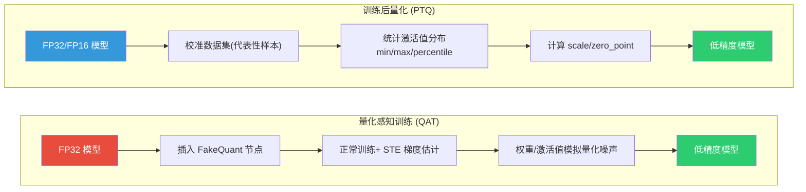
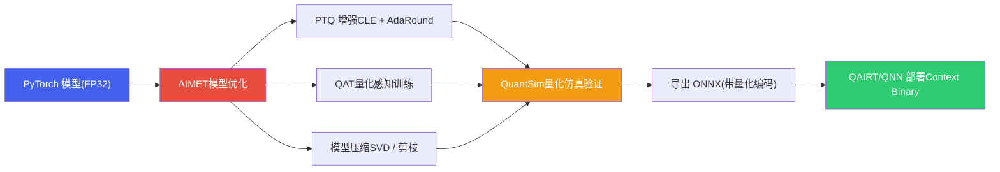
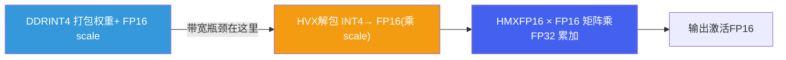

# 4. 端侧模型量化与压缩

*基于 Qualcomm SA8397P 平台  |  PTQ/QAT · AIMET · W4A16 · 量化方案选型*

> [!TIP]
> **本篇讲什么**
>
> 座舱端侧模型的**量化与压缩方法**——从原《推理优化》拆出的主题之一：
>
> - 量化基础：PTQ / QAT 流程、混合精度策略
> - AIMET 量化工具：CLE / Bias Correction / AdaRound / QuantSim / 敏感度分析
> - **W4A16：HTP 上跑 LLM 的真实主战场**——权重 INT4 分组打包、反量化在哪一级做、group size 取舍
> - 量化方案对比与选型：用带宽模型推导 decode 速度，而不是背"标准答案"
>
> 推理原理（Prefill/Decode、Roofline、KV Cache）见 [LLM 推理原理与性能模型](infer-principles.html)；解码与服务化优化见 [端侧解码与服务化优化](infer-serving.html)。

> [!NOTE]
> **锚点模型与数据口径（与全站一致）**
>
> 本篇以 **Qwen3-Omni-4B** 为锚点模型——**项目内部定制的 4B 级全模态模型**（并非公开发布的 Qwen3-Omni 系列，公开版为 30B-A3B MoE）。结构按 4B 级稠密模型的典型配置：36 层、32 个 Q head、8 个 KV head（GQA）、head\_dim 128、hidden 2560、约 4B 参数，INT4 权重约 2.5 GB。完整口径定义见 [硬件架构](hardware.html) 顶部「全站数据口径与锚点模型」NOTE。
>
> 本篇遵循全站「**只讲方法不给数**」约定：文中出现的个别数值一律为**示例参数**，仅用于演示方法本身、不代表实测，请代入你自己的平台带宽与模型配置计算。

## 1. 量化基础

### 1.1 PTQ 与 QAT 流程

模型量化是端侧部署的关键步骤，将 FP32/FP16 模型转换为低精度（INT8/INT4）以降低内存占用与带宽压力。两种主要方法是 **训练后量化 (PTQ)** 和 **量化感知训练 (QAT)**：



### 1.2 PTQ 与 QAT 对比

| 维度 | PTQ (训练后量化) | QAT (量化感知训练) |
| :--- | :--- | :--- |
| **开发成本** | 低，无需重新训练 | 高，需要完整训练流程 |
| **精度损失** | 较大 | 较小 |
| **校准数据需求** | 数百~数千个代表性样本 | 完整训练集 |
| **训练时间** | 分钟级 | 小时~天级 |
| **适用场景** | 模型精度冗余大、快速验证 | 精度敏感、安全关键应用 |
| **推荐优先级** | 优先尝试 | PTQ 精度不达标时使用 |

> [!NOTE]
> **CNN 与 LLM 的量化路径不同**
>
> 上表描述的是通用流程。具体到高通平台：**CNN 类小模型**（DMS/OMS）走 `qnn-onnx-converter` + 校准参数的 W8A8 路径；**LLM** 则走 **W4A16** 的 weight-only 路径（见 §3），两者在位宽组合、工具链上都不一样，不能混用。

### 1.3 混合精度策略

> [!TIP]
> **Best Practice: 混合精度量化策略**
>
> 模型不同层对量化的敏感度不同。以 CNN 检测模型为例的混合精度策略：
>
> | 模型组件 | 推荐精度 | 原因 |
> | --- | --- | --- |
> | **Backbone (骨干网络)** | INT8 | 特征提取层对量化鲁棒，计算量最大，INT8 收益最高 |
> | **FPN (特征金字塔)** | INT8 | 多尺度融合层相对鲁棒 |
> | **Detection Head (检测头)** | INT16 | 分类/回归输出对精度敏感 |
> | **Keypoint Regression (关键点回归)** | INT16 | 亚像素精度要求高，INT8 会导致关键点抖动 |
>
> AIMET 支持通过敏感度分析自动推荐混合精度配置（见 §2.4）。

## 2. AIMET 量化工具

### 2.1 AIMET 概述

**AIMET (AI Model Efficiency Toolkit)** 是高通创新中心 (Qualcomm Innovation Center) 开源的模型优化工具包，专注于**模型量化与压缩**。它是连接训练框架（PyTorch/TensorFlow）与高通部署运行时的关键桥梁——提供比通用量化工具更精细的量化控制能力，特别适合**精度敏感的安全关键场景**（如 DMS 疲劳检测）。



### 2.2 AIMET 核心技术

| 技术 | 原理 | 适用场景 |
| :--- | :--- | :--- |
| **CLE (Cross-Layer Equalization)** | 利用 ReLU 的缩放不变性，均衡相邻层的权重范围，减少量化截断误差。无需训练数据，纯数学变换。 | PTQ 前预处理，对 MobileNet/EfficientNet 等 Depthwise Conv 结构效果显著 |
| **Bias Correction** | 补偿量化引入的系统性偏差：计算 FP32 与量化输出的均值差异，修正 bias | CLE 之后配合使用 |
| **AdaRound (Adaptive Rounding)** | 传统量化用最近邻取整，AdaRound 优化每个权重的取整方向以最小化输出误差 | PTQ 精度恢复，需少量校准数据 |
| **QuantSim (Quantization Simulation)** | 在 FP32 环境模拟量化行为，插入 FakeQuant 节点，无需真实硬件即可验证精度 | 快速验证量化方案、调试敏感层 |
| **Mixed Precision (自动混合精度)** | 基于敏感度分析，自动为每层选择最优位宽 | 不同层量化敏感度差异大的场景 |
| **QAT (量化感知训练)** | 训练中插入 FakeQuant，用 STE 估计梯度，让模型适应量化噪声 | PTQ 不达标时的最终手段 |
| **模型压缩 (SVD / Channel Pruning)** | SVD 低秩分解大权重矩阵；通道剪枝移除不重要通道 | 参数量过大需结构性压缩 |

> [!NOTE]
> **为什么 Depthwise Conv 难量化**
>
> 含大量 depthwise conv、hard-swish 的模型（如 MobileNetV3）是**公认的量化难点**——depthwise conv 每通道独立、权重动态范围差异大，量化后掉点严重。这正是 CLE + Bias Correction + AdaRound 组合拳存在的原因：它们就是为补救这类结构的 PTQ 精度而设计的。

### 2.3 AIMET 量化工作流（CNN 示例）

以 DMS 人脸关键点模型的 PTQ 优化为例：

```python
import torch
from aimet_torch.model_preparer import prepare_model
from aimet_torch.cross_layer_equalization import equalize_model
from aimet_torch.adaround.adaround_weight import Adaround, AdaroundParameters
from aimet_torch.quantsim import QuantizationSimModel

# 1. 加载 FP32 模型
model = load_dms_model("mobilenetv3_face_landmarks.pth")
model.eval()

# 2. 准备模型 (自动替换不兼容层)
model = prepare_model(model)

# 3. Cross-Layer Equalization — 均衡权重范围
equalize_model(model, input_shapes=(1, 3, 224, 224))

# 4. AdaRound — 自适应取整优化
params = AdaroundParameters(
    data_loader=calib_loader,        # 校准数据 (无需标注)
    num_batches=50,
    default_num_iterations=10000,
    default_reg_param=0.01
)
model = Adaround.apply_adaround(
    model,
    dummy_input=torch.randn(1, 3, 224, 224),
    params=params,
    path="./adaround_output",
    filename_prefix="dms_model"
)

# 5. QuantSim — 量化仿真验证
quantsim = QuantizationSimModel(
    model,
    dummy_input=torch.randn(1, 3, 224, 224),
    quant_scheme='tf_enhanced',     # 高通推荐的量化方案
    default_output_bw=8,            # 激活值 INT8
    default_param_bw=8              # 权重 INT8
)

# 6. 计算校准编码
quantsim.compute_encodings(
    forward_pass_callback=calibration_forward,
    forward_pass_callback_args=calib_loader
)

# 7. 验证量化精度
quant_accuracy = evaluate(quantsim.model, val_loader)

# 8. 导出量化模型 (ONNX + 量化编码)
quantsim.export(
    path="./export_output",
    filename_prefix="dms_model_int8",
    dummy_input=torch.randn(1, 3, 224, 224)
)
# 输出: .onnx + .encodings → qnn-onnx-converter 转换为 QNN 模型
```

### 2.4 AIMET 敏感度分析与混合精度

```python
from aimet_torch.quant_analyzer import QuantAnalyzer

analyzer = QuantAnalyzer(model, dummy_input=torch.randn(1, 3, 224, 224))
analyzer.enable_per_layer_mse_loss(
    unlabeled_dataset_iterable=calib_loader,
    num_batches=20
)
analyzer.analyze(
    quant_scheme='tf_enhanced',
    default_param_bw=8,
    default_output_bw=8,
    config_file=None,
    results_dir="./sensitivity_results"
)
# 输出: HTML 报告 + 每层 MSE 柱状图
# → 高 MSE 的层建议保持 INT16/FP16
```

> [!TIP]
> **Best Practice: AIMET 推荐流程**
>
> **CNN 标准路径**：CLE → Bias Correction → AdaRound → QuantSim 验证 → 导出 ONNX → QAIRT/QNN 转换。多数模型用这条 PTQ 增强路径即可达标，无需进入 QAT。
>
> **关键经验**：
>
> * **CLE 对 Depthwise Conv 效果最好**
> * **AdaRound 校准数据不需要标注**，只需代表性样本
> * **quant\_scheme 选择**：高通平台推荐 `tf_enhanced`（对称量化 + 分位数校准）
> * **导出格式**：AIMET 导出的 ONNX + `.encodings` 可被 QAIRT/QNN converter 直接识别
> * **敏感度分析**：对精度损失明显的层，优先尝试 INT16 而非 QAT，开发成本更低

### 2.5 AIMET 与 LLM 的 W4A16 导出

§2.3 的 CNN 路径输出 W8A8。**LLM 不走这条路**——LLM 的量化导出目标是 **W4A16**（权重 INT4、激活 FP16），工具链是 AIMET 的 LLM 量化能力（weight-only 分组量化）或 QAIRT 自带的转换/量化器。典型链路：

```text
微调后的 LLM (FP16/BF16)
  → AIMET / QAIRT 做 W4A16 分组量化（选 group size、跑校准）
  → 导出量化权重 + 量化编码
  → 生成 context binary（离线图编译 + 内存规划）
  → Genie 运行时加载
```

> [!WARNING]
> **一条走不通的路：AWQ/GPTQ 打包权重直接喂给 QNN**
>
> HuggingFace 上常见的 `AWQ`/`GPTQ` 量化模型是 **`quantize_config` + packed qweight** 的私有格式，导出 ONNX 后是自定义算子。**QAIRT/QNN 的 converter 从 FP32 ONNX 自己做量化，吃不下这种打包好的 INT4 权重**。AWQ/GPTQ 只适用于 llama.cpp / vLLM 路线；高通平台的正解是 **AIMET / QAIRT 的 W4A16 导出流程**。W4A16 的机制见 §3，Genie 运行时见 [LLM 推理原理与性能模型 · Genie/QAIRT](infer-principles.html)。

## 3. W4A16：HTP 上 LLM 量化的真实主战场

### 3.1 为什么是 W4A16/W8A16，而不是 W8A8

一个常见误解是把 LLM 也按 CNN 的 W8A8 思路量化。**HTP 上跑 LLM 的实际模式是 W4A16 / W8A16（weight-only），激活保持 16-bit**，原因有二：

1. **LLM 激活存在显著 outlier**。LLM 的激活值在少数通道上出现大幅值离群点，把激活压到 INT8（A8）会让这些通道的信息严重失真，精度掉点明显。保持激活 FP16 可规避这一问题。
2. **decode 是带宽瓶颈，压权重就够了**。由 [Roofline 分析](infer-principles.html) 可知，decode 每生成一个 token 都要把全部权重从 DDR 读一遍，是 memory-bound。**压缩权重直接减少每 token 的读取字节数**，这正是提速的关键；而激活在 decode 时只有 1 个 token 的向量，读取量可忽略，量化它收益极小、风险却大。

所以：**权重压到 INT4/INT8 省带宽，激活留 FP16 保精度**——这就是 W4A16/W8A16 的由来。

### 3.2 权重 INT4 分组打包

INT4 量化不是给整个权重张量一个 scale，而是**分组 (group quantization)**：

```text
权重矩阵某输出通道的一行 (H_in 个权重):
  ┌─────────────── group 0 ───────────────┬─────────────── group 1 ───────────────┐
  [ w0 w1 ... w(g-1) ]  scale0(FP16)      [ w(g) ... w(2g-1) ]  scale1(FP16)
        g 个 INT4 共享一个 scale

打包: 8 个 INT4 → 1 个 INT32 字 (或 2 个 INT4 → 1 byte)
```

- **group size `g`** 常见取 32 / 64 / 128，每组共享一个 scale（部分实现再加 zero-point）。
- **每参数有效字节** ≈ 0.5 Byte（INT4）+ scale 摊销。以 g=128、scale 为 FP16 为例，scale 摊销 = 2 Byte / 128 ≈ 0.016 Byte/param，可忽略；g 越小摊销越大。

### 3.3 反量化在哪一级做

权重以 INT4 存于 DDR，但 HMX 矩阵乘不吃 INT4×FP16 的混合输入，所以**反量化 (dequant) 必须在片上、matmul 之前完成**：



关键点：

- **从 DDR 读的始终是压缩后的 INT4 权重**——带宽收益在"读"这一步就拿到了。
- **dequant 是片上计算**（HVX 向量指令做解包 + 乘 scale），相对省下的带宽开销很小，**不是瓶颈**。
- matmul 走 **FP16 × FP16、FP32 累加** 通路（因为激活是 FP16）。这也意味着：**W4A16 的实际峰值算力由 FP16 通路决定，远低于 INT8 TOPS**——这一点在 [Roofline 的 Knee Point 计算](infer-principles.html) 里必须用对，否则 bound 类型判断会错。

### 3.4 group size 对精度与带宽的影响

| group size | 精度 | scale 元数据开销 | dequant 计算 | 典型用途 |
| :--- | :--- | :--- | :--- | :--- |
| **32** | 最好（scale 粒度细，适应局部分布） | 较高 | 略多 | 精度敏感层 / 低 bit 场景 |
| **64** | 好 | 中 | 中 | 常见折中 |
| **128** | 一般（scale 粒度粗，outlier 拉高量化误差） | 最低 | 最少 | 追求极致带宽 / 权重较平滑的层 |

**取舍逻辑**：g 越小，每组 scale 越能贴合局部权重分布、量化误差越小，但 scale 元数据和 dequant 操作随之增多；g 越大则相反。端侧 LLM 量产常见 g=64 或 128，对个别敏感层（如首尾层、attention 投影）单独用更小的 g 或保留更高位宽。

## 4. 量化方案对比与选型

### 4.1 选型的三个维度，以及一个关键认知

选量化方案要综合 **速度 / 精度 / 内存** 三维。但在此之前必须建立一个关键认知：

> [!IMPORTANT]
> **decode 速度由"每 token 读取的权重字节数"决定，量化*算法*（AWQ vs GPTQ）只影响精度，不影响速度。**
>
> AWQ 与 GPTQ 都是 weight-only INT4，推理 kernel 完全相同（反量化 + GEMM），权重字节数也一样。decode 是 memory-bound，速度只取决于权重读取量——**所以两者的 decode 速度应当相同**，差异只在精度。任何声称"同一位宽、不同量化算法导致 decode 速度差几十个百分点"的说法都站不住脚（差异至多来自 group size 不同的反量化开销，量级很小）。

### 4.2 用带宽模型推导 decode 速度（方法）

decode 速度的推导链（详见 [LLM 推理原理与性能模型 · Roofline](infer-principles.html)）：

```text
decode 速度 ≈ 有效带宽 ÷ 每 token 读取字节数

每 token 读取字节 ≈ 权重字节 (主导) + KV Cache 字节 + 激活字节
权重字节       ≈ 参数量 × 位宽/8

示例参数（非实测，代入你的平台带宽 B 与模型参数量 N 自行计算）:
  设 B = 68 GB/s，综合效率 η ≈ 0.35（内存效率 × 带宽共享 × 调度折扣），N = 4B
  FP16 (16-bit):  N×2 = 8 GB  → B·η / 8 ≈ 3  tok/s
  W8A16 (8-bit):  N×1 = 4 GB  → B·η / 4 ≈ 6  tok/s
  W4A16 (4-bit):  N×0.5 = 2 GB→ B·η / 2 ≈ 12 tok/s
```

**这才是"同一张表"的正确来源**——用同一个带宽模型把各档速度一起推出来，而不是各拍一个互相矛盾的数字。

### 4.3 量化方案对比表

> 下表速度列为 §4.2 带宽模型的**示例推导值（非实测）**，精度列为量级示意。HTP 上 LLM 的位宽组合是 **WxA16**（激活 FP16），不存在 W8A8 的 LLM 部署档。

| 量化方案 | 位宽组合 | 权重大小 (示例) | decode 速度 (示例推导) | 精度影响 | HTP 支持 |
| :--- | :--- | :--- | :--- | :--- | :--- |
| **FP16 (基准)** | W16A16 | ~8 GB | 最低 | 基准 | 是（开发调试） |
| **W8A16** | INT8 权重 / FP16 激活 | ~4 GB | ≈ FP16 的 2 倍 | 小 | 是 |
| **W4A16 (AWQ)** | INT4 权重 / FP16 激活 | ~2.5 GB | ≈ W8A16 的 2 倍 | ppl +1~2% | **是（量产首选）** |
| **W4A16 (GPTQ)** | INT4 权重 / FP16 激活 | ~2.5 GB | **与 AWQ 相同** | ppl +1~3% | 是 |
| **INT3 (GPTQ)** | — | ~1.8 GB | **NPU 上无收益** | 大 | **否** |

> [!WARNING]
> **INT3 在 HTP 上不成立**
>
> HMX/HVX **没有 INT3 数据通路**——INT3 权重必须先解包到 INT4/INT8 才能计算，带宽收益拿不满，且 QAIRT/Genie 不支持 W3。INT3 只在 llama.cpp 等 CPU 后端有意义，**NPU 部署请直接排除**。

### 4.4 选型建议

- **座舱 Function Calling 量产**：**W4A16（AWQ）**——decode 带宽减半、内存 ~2.5 GB 可承载，ppl 增幅对工具调用准确率影响很小。
- **精度优先、内存充裕**：W8A16。
- **开发调试 / 精度基准**：FP16。
- **不要**：在 NPU 上选 INT3；也不要为了"看起来更快"在 AWQ/GPTQ 之间纠结速度——它们速度相同，按精度和校准成本选即可。

> 量化决定了权重读取量，是 decode 提速的第一杠杆；但 KV Cache、prefill 算力、调度手段同样影响端到端体验，见 [LLM 推理原理与性能模型](infer-principles.html) 与 [端侧解码与服务化优化](infer-serving.html)。
