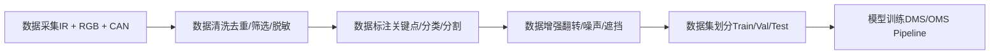
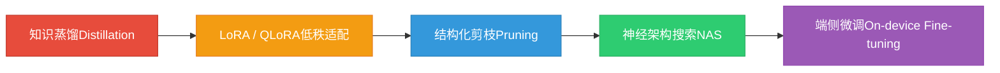
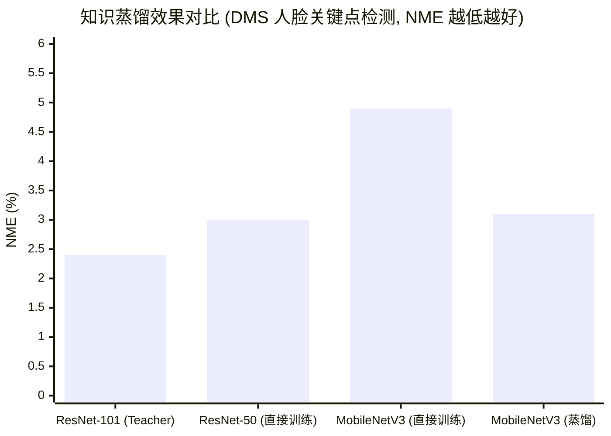

# 2. 模型训练与微调

*基于 Qualcomm SA8397P 平台  |  DMS/OMS 训练 · 知识蒸馏 · LoRA 微调*

> [!TIP]
> **本篇讲什么**
>
> 座舱端侧模型的**训练与微调方法**：
>
> - 座舱场景模型训练（DMS/OMS 数据策略、IR/RGB 差异、长尾分布应对）
> - 端侧微调技术（知识蒸馏、LoRA/QLoRA、端侧微调可行性）
> - LLM 知识蒸馏与模型压缩（蒸馏策略、Qwen3 家族蒸馏路径、蒸馏数据生成）
> - 工具附录：SWIFT 训练框架与「微调 → 端侧部署」的正确链路
>
> 数据合规、评估体系与数据飞轮已拆为独立一篇 → [座舱数据合规、评估与数据飞轮](data-pipeline.html)

> [!NOTE]
> **锚点模型与数据口径（与全站一致）**
>
> 本篇以 **Qwen3-Omni-4B** 为锚点模型——这是**项目内部定制的 4B 级全模态模型**（并非公开发布的 Qwen3-Omni 系列，公开版为 30B-A3B MoE）。结构按 4B 级稠密模型的典型配置：36 层、32 个 Q head、8 个 KV head（GQA）、head\_dim 128、约 4B 参数。完整口径定义见 [硬件架构](hardware.html) 顶部「全站数据口径与锚点模型」NOTE。
>
> 本篇遵循全站「**只讲方法不给数**」约定：文中出现的个别数值一律为**示例参数**，仅用于演示方法本身、不代表实测，请代入你自己的模型配置计算。

## 1. 座舱场景模型训练

### 1.1 DMS/OMS 数据采集策略

智能座舱中的核心 AI 任务——驾驶员监控系统 (DMS) 和乘员监控系统 (OMS)——对训练数据有独特的要求。DMS 主要使用 **IR (红外) 摄像头**，因为需要在夜间和强光环境下稳定工作；OMS 则以 **RGB 摄像头** 为主，用于识别乘员行为、手势和姿态。此外，还需采集 **车辆信号**（车速、方向盘转角、灯光状态等）作为辅助判断依据。

数据采集的完整流程如下：



### 1.2 IR 与 RGB 训练差异

由于 DMS 使用 IR 摄像头，OMS 使用 RGB 摄像头，两者在训练流程上存在显著差异：

| 维度 | IR (DMS) | RGB (OMS) |
| :--- | :--- | :--- |
| **预训练模型可用性** | 较少，公开 IR 人脸数据集有限 | 丰富，ImageNet/COCO/VGGFace2 等 |
| **迁移学习策略** | RGB 预训练 + IR 微调，或用 Domain Adaptation | 直接使用预训练权重微调 |
| **数据增强重点** | IR 噪声模拟、亮度抖动、红外反射模拟 | 色彩抖动、光照变化、背景替换 |
| **输入通道** | 单通道 (灰度 IR) 或伪三通道 | 三通道 RGB |
| **标注要求** | 人脸关键点 (68/98点)、眼睛开合度、嘴巴状态 | 人体骨骼关键点、手势类别、物体检测 |
| **常见模型** | 轻量化 CNN (MobileNet 变体)、RetinaFace | YOLOv8-Pose、MediaPipe、HRNet |

### 1.3 长尾分布问题与应对

> [!WARNING]
> **Warning: 长尾分布是座舱 AI 的核心挑战**
>
> 在实际驾驶数据中，**正常驾驶样本通常占 80% 以上**（原始路采数据中这一比例往往更高，可达 95%+，入库训练集经筛选后会下降），而疲劳、分心、打电话等异常行为极为罕见。这种严重的类别不平衡导致模型倾向于将所有样本预测为"正常"，对关键安全场景的召回率极低。
>
> **解决方案：**
>
> * **过采样 (Oversampling)**：对少数类样本进行重复采样或 SMOTE 插值，但需注意过拟合风险
> * **Focal Loss**：在交叉熵基础上增加调制因子 (1-p\_t)^gamma，降低易分类样本的权重，使模型聚焦于困难样本
> * **合成数据 (GAN/Diffusion)**：使用 StyleGAN 或 Stable Diffusion 生成逼真的疲劳/分心样本，需配合判别器确保质量
> * **OHEM (Online Hard Example Mining)**：在每个 batch 中自动选择 loss 最大的样本参与反向传播，提升对困难样本的学习效率
>
> 评估上不能只看 overall accuracy，必须关注**每类的 Recall 与 F1**——漏检一次分心驾驶比误报十次的后果严重得多。

## 2. 端侧微调技术

### 2.1 微调技术谱系

从云端大模型到端侧小模型的适配，涉及一系列模型压缩与微调技术。以下展示了这些技术从"重量级"到"轻量级"的谱系：



### 2.2 知识蒸馏在座舱中的应用

知识蒸馏是将大模型 (Teacher) 的知识迁移到小模型 (Student) 的核心技术。在座舱场景中，Teacher 通常是精度较高的大模型 (如 ResNet-101)，Student 是需要部署到端侧的轻量模型 (如 MobileNetV3)。

蒸馏损失函数定义为（KL 散度方向为 **KL(student ‖ teacher)**，并带 **T²** 温度缩放补偿，与下方代码一致）：

`Loss = alpha * T² * KL( softmax(S_logits/T) ‖ softmax(T_logits/T) ) + (1-alpha) * CrossEntropy(S_logits, labels)`

其中 `T` 为温度参数 (通常 4~20)，`alpha` 为平衡系数 (通常 0.5~0.9)。T² 用于补偿软标签梯度因温度缩放而被压小的量级。

```python
# 知识蒸馏损失函数 (PyTorch 伪代码)
import torch
import torch.nn as nn
import torch.nn.functional as F

class DistillationLoss(nn.Module):
    def __init__(self, alpha=0.7, temperature=8.0):
        super().__init__()
        self.alpha = alpha
        self.T = temperature
        self.ce_loss = nn.CrossEntropyLoss()

    def forward(self, student_logits, teacher_logits, labels):
        # 软标签蒸馏损失: KL 散度
        soft_student = F.log_softmax(student_logits / self.T, dim=1)
        soft_teacher = F.softmax(teacher_logits / self.T, dim=1)
        kl_loss = F.kl_div(soft_student, soft_teacher, reduction='batchmean')
        kl_loss = kl_loss * (self.T ** 2)  # 温度缩放补偿

        # 硬标签分类损失
        ce_loss = self.ce_loss(student_logits, labels)

        # 组合损失
        total_loss = self.alpha * kl_loss + (1 - self.alpha) * ce_loss
        return total_loss

# 训练循环
teacher_model.eval()
for images, labels in dataloader:
    with torch.no_grad():
        teacher_logits = teacher_model(images)
    student_logits = student_model(images)
    loss = distill_loss(student_logits, teacher_logits, labels)
    optimizer.zero_grad()  # 每步先清零梯度，否则会梯度累积
    loss.backward()
    optimizer.step()
```

### 2.3 蒸馏效果对比

以下图表展示了不同模型策略在 DMS 人脸关键点检测任务上的精度对比。关键点回归任务的标准指标是 **NME（Normalized Mean Error，归一化平均误差，越低越好）**，而非检测/分类用的 mAP：



> 参数量对比（独立量纲，不画进上图）：ResNet-101 ~44.5M / ResNet-50 ~25.6M / MobileNetV3 ~5.4M；蒸馏**不改变 Student 的参数量**，只改变其权重。以上均为**示例参数**，仅示意"蒸馏让 5.4M 的 MobileNetV3 逼近大模型精度"这一方法效果。

### 2.4 LoRA 在座舱中的应用

LoRA (Low-Rank Adaptation) 通过在预训练权重旁注入低秩分解矩阵，以极小的参数量实现高效微调：

| 应用场景 | 基础模型 | LoRA 目标 | 秩 (r) | 可训练参数 | 效果（示例） |
| :--- | :--- | :--- | :--- | :--- | :--- |
| **DMS 新车型适配** | MobileNetV3-DMS | 适配新 IR 摄像头/安装角度 | 4~8 | ~50K (0.9%) | 关键点 NME ↓0.4pp vs 冻结骨干 |
| **OMS 新场景** | YOLOv8s-Pose | 适配后排/儿童检测 | 8~16 | ~200K (1.8%) | 后排检测率 +8.3% |
| **座舱多模态 Agent** | Qwen3-Omni-4B | Function Calling / 品牌话术 / 多模态理解 | 16~64 | ~33M~132M (0.8%~3.3%) | 工具调用准确率 +12% |

> [!NOTE]
> **LoRA 可训练参数怎么估**
>
> 可训练参数 = `r × Σ_层 (in_features + out_features)`（每个被注入的线性层贡献一对 `r×in` 与 `r×out` 的低秩矩阵）。以锚点 4B 模型（36 层、hidden 2560、GQA）为例，逐层累加 `Σ(in+out) ≈ 57K`，36 层 ≈ 2.06M，于是 **r=16 → ~33M（0.83%）、r=32 → ~66M（1.65%）、r=64 → ~132M（3.3%）**。可见可训练参数随秩**线性增长**——秩翻倍，显存占用与 checkpoint 体积也大致翻倍，需相应上调预算。（示例参数，请按你的实际模型配置代入计算。）

### 2.5 端侧微调可行性

> [!NOTE]
> **端侧微调 (On-device Fine-tuning) 可行性分析**
>
> 在 SA8397P 平台上，端侧微调的核心约束是 **QNN/HTP 只支持前向推理、不支持反向传播**——训练（梯度计算与优化器更新）无法落在 DSP 上，只能走 CPU/GPU：
>
> * **算力载体**：端侧训练只能用 CPU 或 Adreno GPU（OpenCL）。但 SA8397P 的 GPU 主要面向图形渲染，训练效率低，实际只适合极轻量场景
> * **可行场景**：参数量极小的末层适配（如分类头 LoRA、最后 1~2 个全连接层），配合梯度检查点 (Gradient Checkpointing) 压缩激活内存
> * **不可行场景**：全参数微调 (Full Fine-tuning)，受限于 LPDDR5x 带宽与共享内存容量，无法承载完整的梯度和优化器状态（训练内存约为推理的 3~4 倍）
> * **实际策略**：云端完成主要训练，端侧仅做 LoRA 适配器的增量更新，每次更新约 200KB~2MB 的权重差量，通过 OTA 推送
> * **一句话结论**：当前座舱的最佳实践是**云端训练、端侧推理**，端侧只在个性化适配时做最末层的轻量微调

## 3. LLM 知识蒸馏与模型压缩

### 3.1 LLM 蒸馏 vs CNN 蒸馏

前文（第 2 章）介绍的知识蒸馏以 CNN 分类模型为例（Teacher: ResNet-101 → Student: MobileNetV3），蒸馏目标是分类 logits 的 KL 散度。LLM 蒸馏面临本质不同的挑战：

| 维度 | CNN 蒸馏 | LLM 蒸馏 |
| :--- | :--- | :--- |
| **输出空间** | 固定类别数（如 1000 类） | 词表大小（32K-150K），每个 token 位置都有分布 |
| **蒸馏粒度** | 单次前向的 logits | 自回归序列，每个 token 的分布都依赖前文 |
| **Teacher 成本** | 前向推理即可获取 logits | 长序列生成成本极高，存储全序列 logits 占用巨大 |
| **能力维度** | 单一任务（分类/检测） | 多维能力：语言理解、推理、Function Calling、多模态 |
| **评估复杂度** | NME/Accuracy 即可衡量 | 需多维评估：Perplexity + 任务准确率 + 安全性 |

### 3.2 LLM 蒸馏策略

LLM 蒸馏主要有三类策略，适用于不同场景：

| 策略 | 原理 | 优点 | 缺点 | 代表工作 |
| :--- | :--- | :--- | :--- | :--- |
| **Token-level KD** | 逐 token 对齐 Student 和 Teacher 的输出分布（KL 散度） | 最细粒度的知识传递，保留 Teacher 的概率分布信息 | 需要存储 Teacher 的全序列 logits，存储和计算成本高 | 标准 KD (Hinton et al., 2015) |
| **Sequence-level KD** | 用 Teacher 生成回复作为训练数据，Student 在 Teacher 生成的文本上做 SFT | 实现简单，无需访问 Teacher logits，可用 API 模型做 Teacher | 丢失了 Teacher 的概率分布信息，只保留了 argmax 结果 | SeqKD (Kim & Rush, 2016) |
| **On-policy KD** | Student 自己生成文本，然后用 Teacher 评分/纠正，最小化反向 KL 散度 | 避免训练-推理分布不匹配（exposure bias），生成质量更好 | 训练过程需要反复采样和评估，计算成本最高 | MiniLLM (Gu et al., 2024), GKD (Agarwal et al., 2024) |

> [!NOTE]
> **座舱场景推荐策略**
>
> 座舱 LLM 蒸馏的实用路径是 **Sequence-level KD**：用云端大模型（如 Qwen3-32B / Qwen3-235B-A22B 或 GPT-4）生成高质量的座舱 Function Calling 训练数据，然后在端侧目标模型（Qwen3-Omni-4B）上做 SFT。原因：(1) 云端 Teacher 通常只提供 API 接口，无法获取 logits；(2) 实现简单，SWIFT 框架直接支持；(3) 数据可以人工审核质量。

### 3.3 Qwen3 模型家族蒸馏路径

Qwen3 提供了从 0.6B 到 235B 的完整模型家族（dense：0.6B / 1.7B / 4B / 8B / 14B / 32B；MoE：30B-A3B / 235B-A22B），为端侧蒸馏提供了自然的模型梯度：


| 蒸馏路径 | Teacher → Student | 蒸馏方式 | 座舱应用 |
| :--- | :--- | :--- | :--- |
| **大→中** | Qwen3-32B → Qwen3-4B | Sequence-level KD：大模型生成 Function Calling 训练数据 | 端侧 Agent 核心模型 |
| **中→小** | Qwen3-4B → Qwen3-1.7B | Token-level KD：同架构蒸馏，可获取 logits | 意图识别前端（低 TTFT） |
| **跨模态** | Qwen3-Omni-4B → 专用视觉模型 | 特征蒸馏：对齐中间层特征表示 | DMS 视觉模型增强 |

### 3.4 蒸馏数据生成实践

使用云端大模型批量生成座舱 Function Calling 训练数据的典型流程：

```python
# 使用 Qwen3-235B-A22B API 批量生成 Function Calling 训练数据
import json
from openai import OpenAI

client = OpenAI(
    base_url="https://dashscope.aliyuncs.com/compatible-mode/v1",
    api_key="your-api-key"
)

TOOL_SCHEMA = [
    {"type": "function", "function": {
        "name": "set_ac_temperature",
        "description": "设置空调温度",
        "parameters": {"type": "object", "properties": {
            "temp": {"type": "integer", "description": "目标温度(16-32)"}
        }, "required": ["temp"]}
    }},
    # ... 更多工具定义
]

# 批量生成不同表述方式的指令
SEED_PROMPTS = [
    "太热了，调低点温度", "空调调到22度", "帮我把温度设到25度",
    "冷气开大一点", "我想凉快一些", "把空调温度往下调3度",
]

training_data = []
for prompt in SEED_PROMPTS:
    response = client.chat.completions.create(
        model="qwen3-235b-a22b",
        messages=[
            {"role": "system", "content": "你是座舱智能助手"},
            {"role": "user", "content": prompt}
        ],
        tools=TOOL_SCHEMA,
        tool_choice="auto"
    )
    # 将 API 响应转换为 SWIFT 训练格式
    training_data.append({
        "messages": [
            {"role": "system", "content": "你是座舱智能助手"},
            {"role": "user", "content": prompt},
            {"role": "assistant", "content": response.choices[0].message.content,
             "tool_calls": [...]}  # 从 response 提取
        ]
    })

with open("cockpit_distill_data.json", "w") as f:
    json.dump(training_data, f, ensure_ascii=False, indent=2)
```

> [!WARNING]
> **蒸馏数据质量把控**
>
> 云端生成的数据**必须经过人工审核**。常见问题：(1) 大模型幻觉导致工具参数不合法（如温度设为 -5 度）；(2) 多义指令的工具选择错误；(3) 安全指令被错误执行（如"帮我打开车门"在行驶中应拒绝）。建议每批次随机抽检 10-20%，确保准确率 > 95% 再用于训练。

## 4. 工具附录：SWIFT 训练框架

> [!NOTE]
> 本节为**工具附录**。SWIFT 是具体开源框架，其实战细节（CLI 参数、Python API、数据集模板）以 [ms-swift 官方文档](https://github.com/modelscope/ms-swift) 为准；这里只保留与座舱**部署链路**直接相关的关键结论。

**ms-swift**（ModelScope SWIFT）是魔搭社区开源的大模型与多模态模型训练框架，封装数据处理、训练、评估、导出全流程，**支持 300+ 模型开箱即用**（数量随版本增长，以官方仓库为准），对 Qwen 系列为一等公民，原生支持 Omni 多模态（文本+图像+音频+视频）微调，是国内座舱多模态大模型微调的主流选择之一。

### 4.1 微调 → 端侧部署的正确链路

> [!WARNING]
> **常见误区：`AWQ/GPTQ INT4 → ONNX → QNN` 这条路走不通。**
>
> QNN/QAIRT 的 converter 是从 **FP32 ONNX 自己做量化**（配合校准集），**无法吃进 GPTQ/AWQ 打包好的 INT4 权重**——那是 HF `quantize_config` + packed qweight 格式，导出 ONNX 后是自定义算子。AWQ/GPTQ 只适用于 llama.cpp / vLLM 路线。

HTP 上跑 LLM 的正确路径是 **QAIRT/Genie 的 W4A16 导出流程**：


量化方法（PTQ/QAT/AIMET、W4A16 机制）的细节 → [端侧模型量化与压缩](quantization.html)；Genie/QAIRT 运行时与推理原理 → [LLM 推理原理与性能模型](infer-principles.html)。

> [!TIP]
> **Best Practice: 座舱 SWIFT 微调要点（示例参数）**
>
> * **lora\_rank**：多模态 Function Calling 场景建议 32~64；`lora_target_modules='ALL'` 对所有线性层注入 LoRA（含视觉编码器与语言模型），通常比仅微调语言部分效果更好
> * **数据量**：Tool Use 微调通常 500~2000 条高质量数据即可收敛；多模态数据（图片+语音+文本）需保持格式一致
> * **显存**：4B 多模态模型 QLoRA，单卡 A100-80G 建议 batch\_size=2 + gradient\_accumulation=8（示例配置，按实际显存调整）
> * **评估**：用 `swift eval` 在 ToolBench 等数据集上评测 Tool Calling 准确率
> * **部署**：按上方 **W4A16 链路**导出，**不要**走 AWQ/GPTQ → QNN

---

> **延伸阅读**
>
> 数据采集与隐私合规、模型评估体系、数据飞轮 → [**座舱数据合规、评估与数据飞轮**](data-pipeline.html)
> 模型量化（PTQ/QAT/AIMET/W4A16）→ [**端侧模型量化与压缩**](quantization.html)；KV Cache、Roofline、Genie 运行时 → [**LLM 推理原理与性能模型**](infer-principles.html)；前缀缓存、投机采样、约束解码、服务化 → [**端侧解码与服务化优化**](infer-serving.html)
