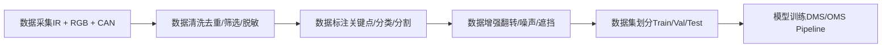
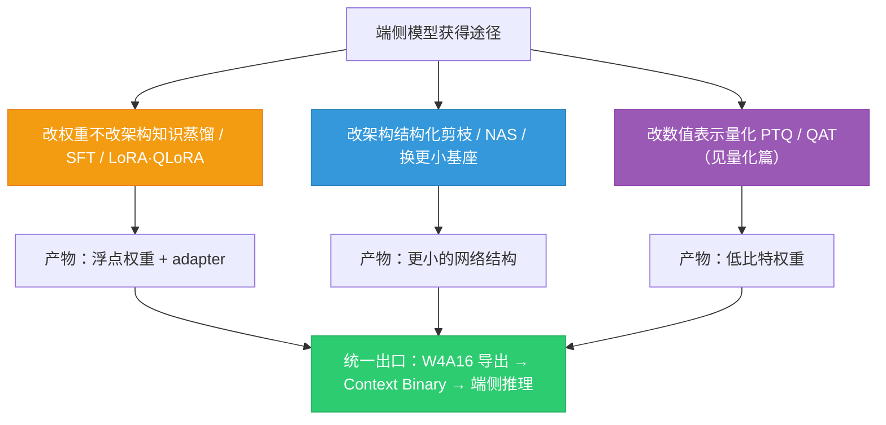
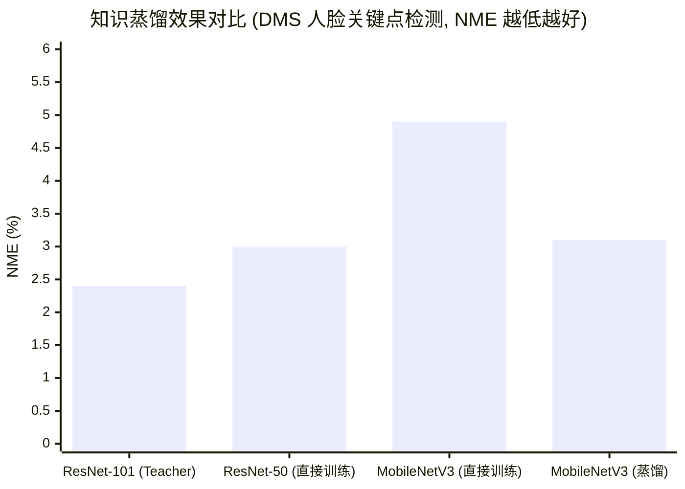

# 模型训练与微调

*基于 Qualcomm SA8397P 平台  |  DMS/OMS 训练 · 知识蒸馏 · LoRA 微调*

> [!TIP]
> **本篇讲什么**
>
> 座舱端侧模型的**训练与微调方法**：
>
> - 座舱场景模型训练（DMS/OMS 数据策略、IR/RGB 差异、长尾分布应对）
> - 端侧微调技术（知识蒸馏、LoRA/QLoRA、**端侧微调的诚实边界**、PEFT 变体谱系、偏好对齐）
> - LLM 知识蒸馏与模型压缩（蒸馏策略与深坑、Qwen3 家族蒸馏路径、蒸馏/合成数据生成与质量陷阱）
> - 工具附录：SWIFT 训练框架与「微调 → 端侧部署」的正确链路
>
> 数据合规、评估体系与数据飞轮已拆为独立一篇 → [座舱数据合规、评估与数据飞轮](data-pipeline.html)

> [!NOTE]
> **锚点模型与数据口径（与全站一致）**
>
> 本篇以 **Qwen3-Omni-4B** 为锚点模型——这是**项目内部定制的 4B 级全模态模型**（并非公开发布的 Qwen3-Omni 系列，公开版为 30B-A3B MoE）。结构按 4B 级稠密模型的典型配置：36 层、32 个 Q head、8 个 KV head（GQA）、head\_dim 128、约 4B 参数。完整口径定义见 [硬件架构](hardware.html) 顶部「全站数据口径与锚点模型」NOTE。
>
> 本篇遵循全站「**只讲方法不给数**」约定：文中出现的个别数值一律为**示例参数**，仅用于演示方法本身、不代表实测，请代入你自己的模型配置计算。

## 1. 座舱场景模型训练

### 1.1 DMS/OMS 数据采集策略

智能座舱中的核心 AI 任务——驾驶员监控系统 (DMS) 和乘员监控系统 (OMS)——对训练数据有独特的要求。DMS 主要使用 **IR (红外) 摄像头**，因为需要在夜间和强光环境下稳定工作；OMS 则以 **RGB 摄像头** 为主，用于识别乘员行为、手势和姿态。此外，还需采集 **车辆信号**（车速、方向盘转角、灯光状态等）作为辅助判断依据。

数据采集的完整流程如下：



### 1.2 IR 与 RGB 训练差异

由于 DMS 使用 IR 摄像头，OMS 使用 RGB 摄像头，两者在训练流程上存在显著差异：

| 维度 | IR (DMS) | RGB (OMS) |
| :--- | :--- | :--- |
| **预训练模型可用性** | 较少，公开 IR 人脸数据集有限 | 丰富，ImageNet/COCO/VGGFace2 等 |
| **迁移学习策略** | RGB 预训练 + IR 微调，或用 Domain Adaptation | 直接使用预训练权重微调 |
| **数据增强重点** | IR 噪声模拟、亮度抖动、红外反射模拟 | 色彩抖动、光照变化、背景替换 |
| **输入通道** | 单通道 (灰度 IR) 或伪三通道 | 三通道 RGB |
| **标注要求** | 人脸关键点 (68/98点)、眼睛开合度、嘴巴状态 | 人体骨骼关键点、手势类别、物体检测 |
| **常见模型（2025-2026）** | 轻量化 CNN（MobileNet 变体）+ 关键点头；RetinaFace 类人脸检测 | YOLO11-Pose / RTMPose / RT-DETR（YOLOv8 仍多见于存量项目）；MediaPipe 是**端侧推理管线框架**，非单一模型 |

> [!NOTE]
> **2025-2026 舱内感知的两条主线**
>
> - **安全功能仍以专用小模型为主**：疲劳/分心检测是法规驱动的确定性任务——欧盟 GSR（2019/2144）已把驾驶员分心/疲劳预警（DDAW/ADDW）列为新车型强制项，Euro NCAP 也把 DMS 纳入评分（具体条款与时间表以官方文本为准）。这类功能要求**低时延、可解释、可认证**，因此继续用轻量 CNN/检测-关键点模型，而不是大模型。
> - **VLM/Omni 做补充语义理解**：舱内场景描述、遗留物/乘员状态理解、手势语义等**非安全**任务，正从「多个专用小模型」向「VLM/Omni 统一理解 + 小模型兜底」演进（锚点 Qwen3-Omni-4B 即此定位）。**两者不是替代关系**：安全小模型保证确定性下限，VLM 提供语义上限。
> - **IR 域差异是真实痛点**：不同 IR 波长（常见 850nm vs 940nm）与补光方案会导致明显域差，跨车型/跨供应商迁移时需按 §1.2 的 Domain Adaptation 处理。

### 1.3 长尾分布问题与应对

> [!WARNING]
> **Warning: 长尾分布是座舱 AI 的核心挑战**
>
> 在实际驾驶数据中，**正常驾驶样本通常占 80% 以上**（原始路采数据中这一比例往往更高，可达 95%+，入库训练集经筛选后会下降），而疲劳、分心、打电话等异常行为极为罕见。这种严重的类别不平衡导致模型倾向于将所有样本预测为"正常"，对关键安全场景的召回率极低。
>
> **解决方案：**
>
> * **过采样 (Oversampling)**：对少数类样本重复采样；SMOTE 类插值**用在特征/嵌入空间**而非像素空间（对原始图像做 SMOTE 没有物理意义），且需警惕过拟合
> * **Focal Loss**：在交叉熵基础上增加调制因子 (1-p\_t)^gamma，降低易分类样本的权重，使模型聚焦于困难样本
> * **合成数据（2025-2026 以扩散模型为主）**：用 Stable Diffusion / SDXL + ControlNet 生成疲劳/分心样本，**关键是保持身份一致性与 IR 域特性**（姿态、关键点、红外反射由 ControlNet/条件图约束），否则学生模型会学到生成器伪影而非真实疲劳特征；GAN（StyleGAN）已边缘化。安全相关功能的合成数据**必须用真实数据验证**，不能只在合成集上自证
> * **OHEM (Online Hard Example Mining)**：在每个 batch 中自动选择 loss 最大的样本参与反向传播，提升对困难样本的学习效率
> * **覆盖度与公平性（量产真实痛点）**：DMS 必须覆盖不同人种/年龄、戴眼镜/墨镜/口罩、逆光/夜间/补光失效等组合——这些维度在原始路采里天然长尾，需**按维度分层配额采集**，而不是只按「正常 vs 异常」两类平衡
>
> 评估上不能只看 overall accuracy，必须关注**每类的 Recall 与 F1**——漏检一次分心驾驶比误报十次的后果严重得多。分层 Recall（按人种/光照/遮挡分组）同样要报，避免「平均达标、某子群体系统性漏检」。

## 2. 端侧微调技术

### 2.1 微调技术谱系

从云端大模型到端侧小模型的适配，涉及一系列模型压缩与微调技术。这些技术**不是一条流水线**，而是按「改什么」正交分类——可以叠加使用（如：蒸馏得到小模型 → 剪枝 → 量化 → 端侧 LoRA 适配）：



> [!NOTE]
> **关于 NAS 的时效性说明**
>
> 神经架构搜索（NAS）是 CNN 时代端侧小模型（MobileNetV3、EfficientNet 均出自搜索）的主力手段。但在 2025-2026 的**端侧 LLM/VLM** 语境下，NAS 已基本不是现实选项——大模型架构搜索的算力成本极高，端侧团队的实际做法是**直接选公开模型家族里尺寸合适的成员（如 Qwen3 0.6B/1.7B/4B），再用蒸馏/微调适配座舱任务**（见 §3.3）。NAS 在 LLM 时代主要退居为 kernel/编译级搜索与小规模架构变体探索。

### 2.2 知识蒸馏在座舱中的应用

知识蒸馏是将大模型 (Teacher) 的知识迁移到小模型 (Student) 的核心技术。在座舱场景中，Teacher 通常是精度较高的大模型 (如 ResNet-101)，Student 是需要部署到端侧的轻量模型 (如 MobileNetV3)。

蒸馏损失函数定义为（KL 散度方向为 **KL(teacher ‖ student)**，即 teacher 分布作参考分布 P、student 作被逼近分布 Q，并带 **T²** 温度缩放补偿，与下方代码一致）：

`Loss = alpha * T² * KL( softmax(T_logits/T) ‖ softmax(S_logits/T) ) + (1-alpha) * CrossEntropy(S_logits, labels)`

其中 `T` 为温度参数 (常见 2~20，分类任务多用 2~8)，`alpha` 为平衡系数 (通常 0.5~0.9)。T² 用于补偿软标签梯度因温度缩放而被压小的量级（Hinton et al., 2015 的推导：软标签损失对 logits 的梯度量级约为 1/T²，乘 T² 后才能与硬标签损失在同一量级上加权）。`T` 与 `alpha` 需联合调：T 越大软标签越平滑、KL 项贡献的绝对值越小，通常要相应上调 alpha。

> [!WARNING]
> **KL 方向别写反——这是蒸馏里最常见的概念错误**
>
> PyTorch 的 `F.kl_div(input, target)` 计算的是 `Σ target·(log target − input)`，即 **KL(target ‖ exp(input))**。所以代码里 `input=log_softmax(student/T)`、`target=softmax(teacher/T)` 得到的是 **KL(teacher ‖ student)**（前向 KL），这正是 Hinton 标准 KD 的方向，**不是** KL(student ‖ teacher)。
>
> 两个方向的性质完全不同，选错会直接改变蒸馏行为：
>
> | 方向 | 性质 | Student 学到什么 | 典型用法 |
> | :--- | :--- | :--- | :--- |
> | **KL(teacher ‖ student)**（前向） | mass-covering（求全） | 覆盖 teacher 的**整个**分布，包括低概率 token/类 | 标准 KD（本节）、token-level KD |
> | **KL(student ‖ teacher)**（反向） | mode-seeking（求准） | 只抓住 teacher 的**主峰**，忽略长尾 | On-policy KD / MiniLLM / GKD（§3.2） |
>
> 前向 KL 的代价是 student 容量不足时会被迫「摊平」去覆盖 teacher 的长尾，导致生成质量下降；反向 KL 的代价是可能丢失多样性。LLM 蒸馏里这个取舍是真实的设计决策，不是实现细节。

```python
# 知识蒸馏损失函数 (PyTorch 伪代码)
import torch
import torch.nn as nn
import torch.nn.functional as F

class DistillationLoss(nn.Module):
    def __init__(self, alpha=0.7, temperature=8.0):
        super().__init__()
        self.alpha = alpha
        self.T = temperature
        self.ce_loss = nn.CrossEntropyLoss()

    def forward(self, student_logits, teacher_logits, labels):
        # 软标签蒸馏损失: KL(teacher || student)
        # 注意 F.kl_div 的 input 必须是 log 概率、target 是概率，
        # 它算的是 KL(target || exp(input))，故 input=student、target=teacher
        soft_student = F.log_softmax(student_logits / self.T, dim=1)
        soft_teacher = F.softmax(teacher_logits / self.T, dim=1)
        kl_loss = F.kl_div(soft_student, soft_teacher, reduction='batchmean')
        kl_loss = kl_loss * (self.T ** 2)  # 温度缩放补偿

        # 硬标签分类损失
        ce_loss = self.ce_loss(student_logits, labels)

        # 组合损失
        total_loss = self.alpha * kl_loss + (1 - self.alpha) * ce_loss
        return total_loss

# 训练循环
teacher_model.eval()      # teacher 冻结，关 dropout/BN 更新
student_model.train()     # student 必须 train()，否则 BN/dropout 行为错误
for images, labels in dataloader:
    with torch.no_grad():
        teacher_logits = teacher_model(images)
    student_logits = student_model(images)
    loss = distill_loss(student_logits, teacher_logits, labels)
    optimizer.zero_grad()  # 每步先清零梯度，否则会梯度累积
    loss.backward()
    torch.nn.utils.clip_grad_norm_(student_model.parameters(), max_norm=1.0)  # 防梯度爆炸
    optimizer.step()
```

### 2.3 蒸馏效果对比

以下图表展示了不同模型策略在 DMS 人脸关键点检测任务上的精度对比。关键点回归任务的标准指标是 **NME（Normalized Mean Error，归一化平均误差，越低越好）**，而非检测/分类用的 mAP：



> 参数量对比（独立量纲，不画进上图）：ResNet-101 ~44.5M / ResNet-50 ~25.6M / MobileNetV3 ~5.4M；蒸馏**不改变 Student 的参数量**，只改变其权重。
>
> **上图是方法示意，不是实测**：四个 NME 数值均为**示例参数**，唯一要传达的是**排序关系**——「Teacher 最优 > 同尺寸直接训练 > 小模型直接训练，而小模型经蒸馏可逼近大模型」。真实幅度取决于任务、数据量与 teacher/student 容量差（容量差陷阱见 §3.2），请用自己的数据实测，不要引用这些数字。

### 2.4 LoRA 在座舱中的应用

LoRA (Low-Rank Adaptation) 通过在预训练权重旁注入低秩分解矩阵（`W' = W + (alpha/r)·B·A`，`A∈R^{r×in}`、`B∈R^{out×r}`），冻结原权重、只训低秩增量，以极小的参数量实现高效微调：

| 应用场景 | 基础模型 | LoRA 目标 | 秩 (r) | 可训练参数 | 典型收益方向（示例，非实测） |
| :--- | :--- | :--- | :--- | :--- | :--- |
| **DMS 新车型适配** | MobileNetV3-DMS | 适配新 IR 摄像头/安装角度 | 4~8 | ~50K (0.9%) | 关键点误差下降；幅度取决于新旧摄像头的域差大小 |
| **OMS 新场景** | YOLO-Pose 类（v8/11） | 适配后排/儿童检测 | 8~16 | ~200K (1.8%) | 稀有目标（后排/儿童）召回提升；小数据下易过拟合，需配增强与早停 |
| **座舱多模态 Agent** | Qwen3-Omni-4B | Function Calling / 品牌话术 / 多模态理解 | 16~64 | ~33M~132M (0.8%~3.3%) | 工具选择/参数提取准确率提升；**同时必须防通用能力退化**（§4.1） |

> [!NOTE]
> **LoRA 可训练参数怎么估**
>
> 可训练参数 = `r × Σ_层 (in_features + out_features)`（每个被注入的线性层贡献一对 `r×in` 与 `r×out` 的低秩矩阵）。以锚点 4B 模型（36 层、hidden 2560、GQA）为例，逐层累加 `Σ(in+out) ≈ 57K`，36 层 ≈ 2.06M，于是 **r=16 → ~33M（0.83%）、r=32 → ~66M（1.65%）、r=64 → ~132M（3.3%）**。可见可训练参数随秩**线性增长**——秩翻倍，显存占用与 checkpoint 体积也大致翻倍，需相应上调预算。（示例参数，请按你的实际模型配置代入计算。）

> [!TIP]
> **秩（r）与目标模块怎么选——经验法则（示例起点，需按实测调）**
>
> - **秩不是越大越好**：任务与基座分布差异小（品牌话术风格、固定模板）→ 小秩（8~16）通常够；差异大（全新工具集、新模态对齐、跨语种）→ 才需要 32~64。过大秩在小数据上**过拟合**，且 adapter 体积/显存线性上涨。
> - **缩放系数**：常见起点 `alpha = 2r`（实际缩放为 `alpha/r`），与秩联合调；只调秩不调 alpha 会让有效学习率随之漂移。
> - **目标模块**：默认对**所有线性层**注入（attention 的 q/k/v/o + MLP 的 gate/up/down），比早期论文只注入 q/v 效果更好——这是 2023 年后的共识做法。
> - **CNN 上的 LoRA**：注入对象是 1×1（pointwise）卷积与全连接层；参数量本就很少的检测/关键点**头**部，LoRA 收益常不如直接全量微调该头（见 [面试指南 Q15](interview.html)）。
> - **合并推理**：部署前把 `B·A` 合并回 `W`（`W += (alpha/r)·B·A`），推理时**零额外时延、零额外显存**——这是 LoRA 相对 adapter/prefix-tuning 的关键工程优势。但合并后权重分布变了，**必须重新走量化导出与校准**（§4.1、[量化篇](quantization.html)）。

### 2.5 端侧微调可行性：诚实边界

「端侧微调」是座舱里最容易被过度承诺的词。先把结论摆清楚：**对 4B 级 LLM/VLM，2025-2026 端侧反向传播训练不可行；端侧能做的是「推理 + 加载/切换云端训好的 adapter」**。下面逐条给依据。

> [!NOTE]
> **端侧微调 (On-device Fine-tuning) 可行性分析**
>
> 在 SA8397P 平台上，端侧微调的核心约束是 **QNN/HTP 只支持前向推理、不支持反向传播**——训练（梯度计算与优化器更新）无法落在 DSP 上，只能走 CPU/GPU：
>
> * **算力载体**：端侧训练只能用 CPU 或 Adreno GPU（OpenCL）。但 SA8397P 的 GPU 主要面向图形渲染，训练效率低，实际只适合极轻量场景
> * **可行场景**：参数量极小的末层适配（如分类头 LoRA、最后 1~2 个全连接层），配合梯度检查点 (Gradient Checkpointing) 压缩激活内存
> * **不可行场景**：全参数微调 (Full Fine-tuning)，受限于 LPDDR5x 带宽与共享内存容量，无法承载完整的梯度和优化器状态。显存量级按**字节/参数**估：混合精度全参训练 ≈ params(2) + grads(2) + Adam master/m/v(各 4) = **16 字节/参数**，而推理只需权重本身（fp16 2 字节、INT4 0.5 字节）——即全参训练显存约是 fp16 推理的 **8 倍**、INT4 推理的 **32 倍**（4B 模型对应数十 GB，远超车机共享内存预算）
> * **别忘了激活内存**：上面 16 B/param 只是**模型状态**，不含激活。激活内存随 `batch × 序列长度 × hidden × 层数` 增长，长序列（多轮对话 + 视觉 token）下**激活可能超过模型状态本身**——这是端侧训练的第二道墙，梯度检查点也只能缓解、不能消除
> * **实际策略**：云端完成主要训练，端侧只**加载/切换**云端训好的 LoRA adapter（注意：这是「端侧部署」，不是「端侧训练」），通过 OTA 推送差量包
> * **一句话结论**：当前座舱的最佳实践是**云端训练、端侧推理**，端侧只在个性化适配时做最末层的轻量微调

> [!WARNING]
> **adapter OTA 包大小：别把 CNN 量级套到 LLM 上**
>
> 常见资料里「LoRA 热更新包 200KB~2MB」的说法**只适用于 CNN 级小模型**，套到 4B LLM 上会差 1~2 个数量级。按 `体积 = 可训练参数 × 字节/参数` 算：
>
> | adapter 规模 | 可训练参数 | fp16 体积 | INT8 体积 | INT4 体积 |
> | :--- | :--- | :--- | :--- | :--- |
> | CNN 级（DMS/OMS，r=4~16） | ~50K~200K | ~0.1~0.4 MB | ~50~200 KB | ~25~100 KB |
> | 4B LLM（r=16，§2.4 估算） | ~33M | **~66 MB** | ~33 MB | ~17 MB |
> | 4B LLM（r=64） | ~132M | **~264 MB** | ~132 MB | ~66 MB |
>
> 所以 LLM adapter 的 OTA 要按**数十~上百 MB** 设计：带宽成本、A/B 双槽存储、灰度与回滚（见 [数据飞轮 §3.4](data-pipeline.html)、[运维安全](../projects/lantu/ops-security.html)）都要按这个量级算。「200KB~2MB」那个数字留给 CNN 小模型 adapter。（示例参数，按你的秩与量化格式代入。）

> [!NOTE]
> **端侧训练/适配的落地判定（2025-2026）**
>
> | 方式 | 在哪做 | 座舱现实性 | 判定依据 |
> | :--- | :--- | :--- | :--- |
> | 全参 SFT（4B+） | 云端 GPU 集群 | ✅ 主战场 | 16 B/param + 激活，数十~上百 GB 显存 |
> | LoRA / QLoRA（4B） | 云端单卡~少量卡 | ✅ 主战场 | 基座冻结/4-bit，24GB 卡可跑（§4.2） |
> | 偏好对齐 DPO / GRPO | 云端 | ✅ 可用，成本高 | 需采样 + 奖励，算力数倍于 SFT（§2.10） |
> | 蒸馏数据合成 | 云端 API | ✅ 主力路径 | teacher 只给 API → sequence-level KD（§3.2） |
> | 端侧 adapter 热切换 / OTA | 端侧（**仅推理**） | ✅ 量产可用 | 不训练，只加载云端产物 |
> | 端侧个性化（记忆库 / RAG / 用户画像注入） | 端侧（推理态） | ✅ **推荐** | 不动权重，成本/合规/可回滚都更优 |
> | 端侧末层轻量微调（CNN 分类头） | 端侧 CPU/GPU | ⚠️ 原理可行、量产少见 | 参数量小，但缺标注数据 + 热/功耗/安全约束 |
> | 端侧 4B LLM 反向传播训练 | 端侧 | ❌ 不可行 | HTP 不支持反传；GPU 面向渲染；显存/带宽不足 |
>
> **为什么「端侧个性化」推荐走推理态而非权重更新**：车端做权重级个性化要同时跨过四道坎——算力（反传）、数据（端侧缺标注）、合规（个人数据车内处理与出境，见 [数据合规](data-pipeline.html)）、工程（热/功耗预算被渲染与 ADAS 占用，且训练任务不能抢占功能安全资源）。而**记忆库 + 检索注入 + 用户画像 prompt** 能在不动权重的前提下拿到大部分个性化收益，且可即时回滚、可审计。2025-2026 量产座舱的个性化主流是后者。
>
> 表里 ⚠️ 表示「原理可行、需你自己实测验证」，❌ 表示「当前硬件/工具链下不成立」——与 [量化篇 §4.6 落地判定表](quantization.html) 同一口径。

### 2.6 VLM/Omni 多模态微调要点

锚点是全模态模型，其微调与纯文本 LLM 有几个关键差异：

- **动态分辨率与图像 token 预算**：VLM 把图像切成 patch（如 14×14），图像 token 数 ≈ (H/patch)×(W/patch) 再经 patch merge 下采样。分辨率越高、视觉 token 越多，直接撑大 prefill 长度与显存——训练与推理都要按「图像 token 预算」约束输入分辨率。座舱常用两档 VIT（如 448×448 / 1024×768），**选档按任务而非「舱内/舱外」一刀切**——例如舱内遗留物检测需要大档、衣着描述用小档即可（选档逻辑与 Context Binary 组织见 [岚图篇多 VIT](../projects/lantu/genai-architecture.html)）。
- **视觉编码器是否冻结**：常见做法是**冻结 vision encoder、只训 projector + LLM 侧 LoRA**（数据少时防过拟合、省显存）；只有视觉域差异大（如 IR 红外）才解冻视觉编码器微调。
- **图文对齐数据质量**：多模态微调的瓶颈往往在数据——图像与指令/答案的对齐质量、OCR/grounding 标注精度，比模型结构更影响最终效果。
- **音频模态（Omni）**：若用原生音频输入，需处理音频特征编码器与文本/视觉 token 的对齐与时长配比，训练数据的音-文-图同步质量是关键。

### 2.7 多 LoRA 适配器的合并（多 SKU 场景）

端侧常为不同车型/语种/品牌话术训练多个 LoRA 适配器。全部驻留会占显存、运行时切换有开销，可考虑**模型合并**：

- **合并的前提**：所有待合并 LoRA 必须基于**同一基座、同一 tokenizer/词表、同一量化前浮点权重**——不同基座或不同词表的 adapter 无法合并。
- **Model Soup / 权重平均**：对同源、同任务、训练轨迹相近的多个 LoRA 直接平均权重，简单但要求微调起点一致。
- **TIES-Merging**：合并前做 trim（剪掉小幅 delta）、elect sign（解决符号冲突）、disjoint merge，减少任务间干扰。
- **DARE**：随机丢弃大部分 delta 并按 `1/(1-drop_rate)` 放大保留项再合并，降低任务冲突。
- **取舍**：合并省显存/省切换，但会损失各适配器的专精度，冲突大时合并后精度下降。座舱多场景（车控/主动视觉/闲聊）差异大时，更适合**运行时按 scene 切换 LoRA**（见 [岚图篇多 LoRA 路由](../projects/lantu/genai-architecture.html)）而非合并。
- **合并后必须重新量化导出**：合并改变了权重分布，原 W4A16 校准集/量化编码不再适用——合并产物要**重新走 AIMET/QAIRT 量化 + 校准**再导出 Context Binary（§4.1、[量化篇](quantization.html)），不能沿用合并前的量化产物。

### 2.8 长上下文扩展（RoPE scaling / YaRN）

座舱多轮对话 + 视觉 token 很容易撑爆原生上下文：

- **位置编码外推**：RoPE 在原生训练长度外直接外推会掉点，需 RoPE scaling（线性 / NTK-aware）或 **YaRN**（分频段缩放 + 注意力温度补偿）在更长序列上继续训练/微调。2025-2026 的公开模型多已原生支持 32K+ 上下文并内置 YaRN 类外推（通过 `rope_scaling` 配置），端侧团队通常**直接用模型自带的长上下文能力**，而非自己重训位置编码。
- **代价**：扩上下文会增大 KV Cache（与序列长度线性相关，公式见 [推理篇](infer-principles.html)），端侧显存敏感，需在「上下文长度 vs KV 显存」间权衡。
- **长上下文 ≠ 长上下文有效**：即使窗口够大，模型对中段信息的利用率仍会下降（"lost in the middle" 现象），且 prefill 时延随长度增长。端侧不要靠「把窗口拉满」解决多轮记忆。
- **端侧实务**：优先用滑动窗口 / 对话历史裁剪（ChatHistory 管理）+ 关键信息检索注入控制实际序列长度，而非一味扩 RoPE——端侧 KV 显存与 TTFT 都是硬约束（前缀缓存/TTFT 优化见 [解码服务化篇](infer-serving.html)）。

### 2.9 高效微调（PEFT）变体谱系（2024-2026）

LoRA 之后两年涌现了一批变体，核心都在解决「LoRA 的秩/初始化/学习率不够自适应」或「想逼近全参效果但省显存」。按机制归类：

| 变体 | 核心机制 | 相对 LoRA 的改动 | 定位 |
| :--- | :--- | :--- | :--- |
| **QLoRA**（2023） | 基座量化到 4-bit（NF4）冻结 + LoRA，配 double quantization 与 paged optimizer | 大幅省显存，**不省算力**（每次前向需反量化到 bf16 计算，通常比 LoRA 慢） | ✅ 云端微调 4B 的主力 |
| **DoRA**（2024） | 把权重分解为 magnitude + direction，LoRA 只更新 direction、magnitude 单独学 | 收敛更稳、同秩下精度略高，代价是额外开销 | 云端可选 |
| **LoRA+**（2024） | A/B 矩阵分组学习率（B 用更大 lr） | 收敛更快 | 云端可选 |
| **rsLoRA**（2023） | 缩放因子用 `r/√r` 替代 `r`，高秩下更稳 | 大秩（≥32）时更可靠 | 云端可选 |
| **AdaLoRA**（2023） | 训练中按重要性动态分配各层秩 | 自适应预算分配 | 云端可选 |
| **PiSSA**（2024） | 用 SVD 主成分初始化 LoRA（而非随机） | 收敛更快 | 云端可选 |
| **VeRA**（2024） | 共享随机冻结矩阵、只训两个对角向量 | 参数比 LoRA 更少 | 多任务共享基座场景 |
| **GaLore**（2024） | 梯度低秩投影，做「全参级」更新但省显存 | 介于 LoRA 与全参之间 | 云端大模型 |
| **LISA**（2024） | 按层重要性采样、冻结大部分层 | 省显存 | 云端大模型 |

> [!NOTE]
> **怎么看待这张表**
>
> - **这些都是云端训练侧技术**：它们改变「怎么训」，不改变「端侧怎么部署」——产物仍是合并后的浮点权重，统一走 W4A16 导出（§4.1）。端侧团队**不必追逐最新变体**：QLoRA + all-linear 已是 2025-2026 的稳健默认，其余变体是「在默认不够好时」的调优选项。
> - **工程加速器与方法正交**：Unsloth、Liger-Kernel（fused kernels）、Flash-Attention、样本 packing、sequence parallel 等是**省显存/提速**手段，不改变方法本质，能开就开（SWIFT 均已集成，见 §4）。
> - 各变体的确切机制与超参以原论文/框架文档为准；上表只给选型视角，不给「谁一定更好」的结论——收益高度依赖任务与数据。

### 2.10 偏好对齐与安全微调（DPO / GRPO）

SFT 只能「教对的」，偏好对齐进一步「压错的」——对座舱尤其重要，因为**安全拒答、品牌话术风格、减少幻觉工具调用**都是「有明确好坏偏好」而非「唯一标准答案」的能力。

| 方法 | 数据形式 | 机制要点 | 座舱适用 |
| :--- | :--- | :--- | :--- |
| **DPO**（2023） | 成对偏好 (chosen / rejected) | 直接优化偏好，无需训奖励模型 | ✅ 安全拒答、话术风格 |
| **IPO / KTO / SimPO / ORPO**（2024） | 偏好对或单条好/坏标注 | DPO 的稳定性/数据格式变体 | 视数据形态选 |
| **GRPO**（2025，随 DeepSeek-R1 普及） | prompt + 多条采样 + 奖励 | 组内相对优势估计，无需 critic | 有**可验证奖励**的子任务 |

> [!NOTE]
> **座舱落地要点**
>
> - **Function Calling 天然适合可验证奖励**：工具名是否存在、参数是否命中 JSON Schema、是否越权，都是可程序化判定的奖励信号——这类子任务用 GRPO / RLVR 有真实收益。而开放式闲聊没有可验证奖励，别硬上 RL。
> - **成本现实**：GRPO 需要 rollout（每个 prompt 采样多条）+ 奖励计算，算力数倍于 SFT；DPO 的瓶颈在**偏好对构造**（标注成本）。先用 SFT + 规则过滤把基线打扎实，再用 DPO 修「安全拒答/话术」这类明确偏好，是更省的顺序。
> - **安全红线不能只靠对齐**：对齐是**概率性**的，行驶安全的硬拒绝必须叠加 System Prompt + Tool Schema 校验 + 后处理规则的**纵深防御**（见 [数据合规 · 安全评测](data-pipeline.html)）——把安全寄托在「模型学会了拒绝」上是危险的。
> - 方法细节与超参以原论文/框架文档为准；本节只给「何时该用哪类」的选型视角。

## 3. LLM 知识蒸馏与模型压缩

### 3.1 LLM 蒸馏 vs CNN 蒸馏

前文（第 2 章）介绍的知识蒸馏以 CNN 分类模型为例（Teacher: ResNet-101 → Student: MobileNetV3），蒸馏目标是分类 logits 的 KL 散度。LLM 蒸馏面临本质不同的挑战：

| 维度 | CNN 蒸馏 | LLM 蒸馏 |
| :--- | :--- | :--- |
| **输出空间** | 固定类别数（如 1000 类） | 词表大小（32K-150K，Qwen3 约 152K），每个 token 位置都有分布 |
| **蒸馏粒度** | 单次前向的 logits | 自回归序列，每个 token 的分布都依赖前文 |
| **Teacher 成本** | 前向推理即可获取 logits | 长序列生成成本极高，存储全序列 logits 占用巨大 |
| **能力维度** | 单一任务（分类/检测） | 多维能力：语言理解、推理、Function Calling、多模态 |
| **评估复杂度** | NME/Accuracy 即可衡量 | 需多维评估：Perplexity + 任务准确率 + 安全性 |

> [!WARNING]
> **LLM 蒸馏独有的前置约束：tokenizer / 词表**
>
> Token-level KD 要求 teacher 与 student **共享同一 tokenizer 与词表**——否则同一文本被切成不同 token 序列，逐 token 的 KL 无从对齐。这是 CNN 蒸馏完全没有的约束，直接决定了蒸馏路径的可行性：
>
> - **同家族同词表**（如 Qwen3-4B → Qwen3-1.7B）→ token-level KD 可行；
> - **跨词表**（不同家族，或 API teacher 不暴露词表）→ token-level KD 不可直接做，要么退化为 sequence-level KD（§3.2），要么用跨词表蒸馏方案（在共享文本上对齐 logits/特征，如 ULD、DSKD 一类工作，具体以原论文为准）。
>
> 选 teacher 时把「词表是否一致」当作和「容量是否够」同等重要的判据。

### 3.2 LLM 蒸馏策略

LLM 蒸馏主要有三类策略，适用于不同场景：

| 策略 | 原理 | 优点 | 缺点 | 代表工作 |
| :--- | :--- | :--- | :--- | :--- |
| **Token-level KD** | 逐 token 对齐 Student 和 Teacher 的输出分布（KL 散度） | 最细粒度的知识传递，保留 Teacher 的概率分布信息 | 需要存储 Teacher 的全序列 logits，存储和计算成本高 | 标准 KD (Hinton et al., 2015) |
| **Sequence-level KD** | 用 Teacher 生成回复作为训练数据，Student 在 Teacher 生成的文本上做 SFT | 实现简单，无需访问 Teacher logits，可用 API 模型做 Teacher | 丢失了 Teacher 的概率分布信息，只保留了 argmax 结果 | SeqKD (Kim & Rush, 2016) |
| **On-policy KD** | Student 自己采样生成文本，Teacher 在这些自采样序列上提供 token 级分布/logprob 监督，最小化反向 KL 散度 | 避免训练-推理分布不匹配（exposure bias），生成质量更好 | 需反复采样 + teacher 逐 token 打分，计算成本最高 | MiniLLM (Gu et al., 2024), GKD (Agarwal et al., 2024) |

> [!NOTE]
> **座舱场景推荐策略**
>
> 座舱 LLM 蒸馏的实用路径是 **Sequence-level KD**：用云端大模型（如 Qwen3-32B / Qwen3-235B-A22B 或 GPT-4）生成高质量的座舱 Function Calling 训练数据，然后在端侧目标模型（Qwen3-Omni-4B）上做 SFT。原因：(1) 云端 Teacher 通常只提供 API 接口，无法获取 logits；(2) 实现简单，SWIFT 框架直接支持；(3) 数据可以人工审核质量。

> [!WARNING]
> **蒸馏的三个深坑（资深视角）**
>
> 1. **容量差陷阱（capacity gap）**：teacher 不是越大越好。当 teacher 远强于 student 时，其分布过尖、过复杂，小 student 学不动，蒸馏效果反而下降（「小模型难以从强 teacher 学习」是 2024-2025 的反复观察）。对策：选**同家族中等尺寸** teacher，或用 **teacher assistant** 逐级蒸馏（大→中→小）。§3.3 的级联图应这样理解，而不是「必须一级一级蒸」。
> 2. **推理型 teacher 的 CoT 蒸馏**：把强推理 teacher 的长思维链蒸给小模型，小模型常**学到 CoT 的形式却学不到推理**，甚至因输出变长、格式污染而掉点。蒸推理能力要配合可验证奖励（§2.10 GRPO/RLVR），而不是单纯模仿 CoT 文本。
> 3. **On-policy KD 的现实门槛**：它需要 teacher 能对 student 的自采样序列给出逐 token logprob——纯 API teacher 若只暴露 top-k logprob 或不暴露 logprob，就做不了完整的 on-policy KD。2025 年起 on-policy 蒸馏被重新推广（把逐 token 反向 KL 当作 dense reward），但落地前提仍是「拿得到 teacher logprob」（具体工作以公开资料核实）。

### 3.3 Qwen3 模型家族蒸馏路径

Qwen3 提供了从 0.6B 到 235B 的完整模型家族（dense：0.6B / 1.7B / 4B / 8B / 14B / 32B；MoE：30B-A3B / 235B-A22B），为端侧蒸馏提供了自然的模型梯度：


> [!NOTE]
> **这张图是「能力梯度」示意，不是「必须逐级蒸」的流程**
>
> 实践中通常**直接从最强 teacher 蒸到目标 student**（如 235B → 4B）；只有当容量差太大、student 学不动时（§3.2 容量差陷阱），才引入中间尺寸做 teacher assistant 逐级蒸。箭头表示「尺寸/能力递减」，不表示「数据必须流过每一级」。

| 蒸馏路径 | Teacher → Student | 蒸馏方式 | 座舱应用 |
| :--- | :--- | :--- | :--- |
| **大→中** | Qwen3-32B / 235B-A22B → Qwen3-4B | Sequence-level KD：大模型生成 Function Calling 训练数据 | 端侧 Agent 核心模型 |
| **中→小** | Qwen3-4B → Qwen3-1.7B | Token-level KD：**同家族同词表**，可获取 logits（前提见 §3.1） | 意图识别前端（低 TTFT） |
| **跨模态** | Qwen3-Omni-4B → 专用视觉模型 | 特征蒸馏：对齐中间层特征表示（需 projection 层做维度对齐，且输入分布要一致） | DMS 视觉模型增强 |

> [!NOTE]
> **2025-2026 Qwen3 家族的蒸馏相关更新（需以官方发布核实）**
>
> Qwen3 自 2025 年发布后持续扩充，对端侧蒸馏有意义的方向包括：
> - **2507 系列**：Qwen3-235B-A22B 与 30B-A3B 推出 Instruct/Thinking-2507 版本，长上下文与推理能力增强——做 teacher 时可按「要不要推理链」选 Instruct 或 Thinking 版（注意 §3.2 的 CoT 蒸馏陷阱）。
> - **Qwen3-Omni（30B-A3B）**：公开版全模态模型，可作为多模态 teacher 蒸到端侧 4B 锚点。
> - **Qwen3-Next / Qwen3-Max / Qwen3-Coder / Qwen3-VL**：更大或更专的云端模型，适合作特定能力（代码/视觉/长文）的 teacher。
>
> 以上型号与发布时间请以 Qwen 官方仓库/博客为准；本篇只强调「**旗舰 MoE 当 teacher、端侧 dense 小模型当 student**」这条 2025-2026 的主流蒸馏路径，不绑定具体版本号。

### 3.4 蒸馏数据生成实践

使用云端大模型批量生成座舱 Function Calling 训练数据的典型流程。**注意：真实管线不是「拿 seed 调一次 API」，而是「扩指令 → 采样 → 校验 → 组装多轮 → 去重」**：

```python
# 使用 Qwen3-235B-A22B API 批量生成 Function Calling 训练数据（方法示意）
import json, hashlib
from openai import OpenAI

client = OpenAI(
    base_url="https://dashscope.aliyuncs.com/compatible-mode/v1",
    api_key="your-api-key"
)

TOOL_SCHEMA = [
    {"type": "function", "function": {
        "name": "set_ac_temperature",
        "description": "设置空调温度",
        "parameters": {"type": "object", "properties": {
            "temp": {"type": "integer", "description": "目标温度(16-32)"}
        }, "required": ["temp"]}
    }},
    # ... 更多工具定义
]

SEED_PROMPTS = ["太热了，调低点温度", "空调调到22度", "帮我把温度设到25度"]

def gen_instructions(seed, n=8):
    """第 1 步：用 teacher 把一条 seed 扩写成 n 条不同表述（Self-Instruct 思路），
    而不是只用原始几条 seed——否则表达多样性严重不足。"""
    resp = client.chat.completions.create(
        model="qwen3-235b-a22b",
        messages=[{"role": "user", "content":
            f"把下面这条车机指令改写成 {n} 条语义相同但说法不同的口语化表述，"
            f"逐行输出，不要编号：\n{seed}"}],
        temperature=0.9,  # 扩写要多样性，温度调高
    )
    return [l.strip() for l in resp.choices[0].message.content.splitlines() if l.strip()]

def call_teacher(instr):
    """第 2 步：让 teacher 产出 tool_calls。"""
    return client.chat.completions.create(
        model="qwen3-235b-a22b",
        messages=[{"role": "system", "content": "你是座舱智能助手"},
                  {"role": "user", "content": instr}],
        tools=TOOL_SCHEMA,
        tool_choice="auto",
        temperature=0.2,  # 生成标注要稳定，温度调低
    )

def valid_tool_call(tc):
    """第 3 步：规则校验——工具名存在、参数命中 JSON Schema、取值在合法域内。
    全量过一遍，不合法的直接丢弃（这是防幻觉参数的第一道闸）。"""
    import jsonschema
    fn = next((t["function"] for t in TOOL_SCHEMA
               if t["function"]["name"] == tc.function.name), None)
    if fn is None:
        return False
    try:
        args = json.loads(tc.function.arguments)
        jsonschema.validate(args, fn["parameters"])
    except Exception:
        return False
    # 业务域校验：温度必须 16~32
    if tc.function.name == "set_ac_temperature" and not (16 <= args.get("temp", -1) <= 32):
        return False
    return True

training_data, seen = [], set()
for seed in SEED_PROMPTS:
    for instr in gen_instructions(seed):
        key = hashlib.md5(instr.encode()).hexdigest()
        if key in seen:          # 第 4 步：近重复去重
            continue
        seen.add(key)
        resp = call_teacher(instr)
        msg = resp.choices[0].message
        if not msg.tool_calls or not all(valid_tool_call(tc) for tc in msg.tool_calls):
            continue
        # 第 5 步：组装完整多轮——必须包含 tool 结果 turn 与 assistant 收尾，
        # 否则模型学不会「消费工具返回值」
        messages = [
            {"role": "system", "content": "你是座舱智能助手"},
            {"role": "user", "content": instr},
            {"role": "assistant", "content": msg.content,
             "tool_calls": [{"id": tc.id, "type": "function",
                              "function": {"name": tc.function.name,
                                           "arguments": tc.function.arguments}}
                             for tc in msg.tool_calls]},
            # 真实管线还要追加 role="tool" 的执行结果 turn + assistant 最终回复
        ]
        training_data.append({"messages": messages, "tools": TOOL_SCHEMA})

# 第 6 步：必须混入负样本——「无对应工具应拒答」「行驶中危险操作应拒绝」，
# 否则 student 会学成「永远调用工具」（分布偏置，见下方 WARNING）
with open("cockpit_distill_data.json", "w") as f:
    json.dump(training_data, f, ensure_ascii=False, indent=2)
```

> [!WARNING]
> **蒸馏/合成数据的质量陷阱（比「抽检」重要得多）**
>
> 1. **分布偏置（最隐蔽）**：如果训练数据几乎全是「指令 → 成功调用工具」的正样本，student 会学成**逢指令必调工具**，拒答能力崩塌。必须按比例混入**负样本**：无对应工具（应拒答）、行驶中危险操作（应拒绝）、参数不全（应追问）。正负比例按产品安全要求定。
> 2. **幻觉指令与幻觉参数**：teacher 会编造不存在的工具名、越界参数（如温度 -5 度）。**全量规则校验**（工具名存在性 + JSON Schema + 业务域）是第一道闸，人工/模型抽检只是第二道。
> 3. **随机抽检不够**：「随机抽 10-20%」发现不了长尾问题。应**分层抽检**（按工具/意图/难度/正负样本分组），并叠加 **LLM-as-judge 全量评审**；抽检比例与阈值按量产门槛自定（示例：分层抽检 + 全量规则校验 + 模型评审，人工只复核 judge 低置信样本）。
> 4. **训练-推理格式必须一致**：合成数据的 chat template、tool schema 注入位置、tool_call 序列化格式，必须与端侧推理时**完全一致**——否则模型在训练集上表现好、上车就工具调用崩坏。这是 FC 微调最常见的「离线好、在线崩」根因。
> 5. **合成数据占比过高会退化**：递归用模型生成数据训模型存在 model collapse 风险（Shumailov et al., 2024, Nature）。合成数据应与**真实交互数据**（数据飞轮回流，见 [data-pipeline](data-pipeline.html)）混合，并监控评测集是否被合成数据污染（评测集去重见 [data-pipeline §2.4](data-pipeline.html)）。

### 3.5 合成数据与自我改进：Function Calling 数据规模化

§3.4 是「teacher 标注」一条路。2025-2026 把 Function Calling 数据做大规模，通常组合以下几类方法：

| 方法 | 思路 | 座舱适用 |
| :--- | :--- | :--- |
| **Self-Instruct**（2022） | 用少量 seed 让模型自举生成新指令 | ✅ 扩表达多样性（§3.4 第 1 步） |
| **Evol-Instruct**（WizardLM, 2023） | 对指令做「进化」（加约束、复杂化、多步化） | ✅ 构造多工具编排/复合指令 |
| **Magpie**（2024） | 从对齐模型直接抽取「指令-回复」对，免人工 seed | ⚠️ 依赖强对齐模型，需过滤 |
| **拒绝采样微调 RFT / STaR** | 采样多条 → 只保留通过校验的 → 再训 | ✅ 与可验证奖励天然契合 |
| **Self-Rewarding / RLAIF** | 模型自己当 judge 打分迭代 | ⚠️ judge 偏置会累积，慎用 |

> [!NOTE]
> **规模化的正确姿势**
>
> - **可验证奖励是 Function Calling 规模化的关键**：工具调用结果可程序化判定（schema 命中、参数合法、不越权），因此「采样 N 条 → 只留通过校验的 → SFT/RFT」这条拒绝采样路线性价比最高，比纯靠 teacher 标注更可控。
> - **质量过滤 > 数量堆砌**：500~2000 条高质量、覆盖正负样本与多工具编排的数据，通常优于数万条未过滤数据（数据量口径见 §4.1）。
> - **闭环靠数据飞轮**：合成数据解决冷启动，长期提升靠真实交互数据回流（失败案例、低置信度、新意图，见 [data-pipeline §3.2](data-pipeline.html)）——合成与回流两条腿走路。

## 4. 工具附录：SWIFT 与训练工程

> [!NOTE]
> 本节为**工具附录**。SWIFT 是具体开源框架，其实战细节（CLI 参数、Python API、数据集模板）以 [ms-swift 官方文档](https://github.com/modelscope/ms-swift) 为准；这里只保留与座舱**部署链路**直接相关的关键结论。

**ms-swift**（ModelScope SWIFT）是魔搭社区开源的大模型与多模态模型训练框架，封装数据处理、训练、评估、导出全流程，**支持数百个模型开箱即用**（数量随版本快速增长，以官方仓库为准），对 Qwen 系列为一等公民，原生支持 Omni 多模态（文本+图像+音频+视频）微调，是国内座舱多模态大模型微调的主流选择之一。核心命令族：`swift sft`（微调）/ `swift pt`（继续预训练）/ `swift rlhf`（DPO/GRPO 等对齐）/ `swift eval`（评测）/ `swift export`（合并与量化导出）/ `swift deploy`。

### 4.1 微调 → 端侧部署的正确链路

> [!WARNING]
> **常见误区：`AWQ/GPTQ INT4 → ONNX → QNN` 这条路走不通。**
>
> QNN/QAIRT 的 converter 是从 **FP32 ONNX 自己做量化**（配合校准集），**无法吃进 GPTQ/AWQ 打包好的 INT4 权重**——那是 HF `quantize_config` + packed qweight 格式，导出 ONNX 后是自定义算子。AWQ/GPTQ 只适用于 llama.cpp / vLLM 路线。

HTP 上跑 LLM 的正确路径是 **QAIRT/Genie 的 W4A16 导出流程**：


量化方法（PTQ/QAT/AIMET、W4A16 机制）的细节 → [端侧模型量化与压缩](quantization.html)；Genie/QAIRT 运行时与推理原理 → [LLM 推理原理与性能模型](infer-principles.html)。

> [!TIP]
> **Best Practice: 座舱 SWIFT 微调要点（示例参数，按实测调）**
>
> * **lora\_rank**：多模态 Function Calling 场景建议 32~64（选择依据见 §2.4）；`--target_modules all-linear` 对语言模型所有线性层注入 LoRA
> * **视觉编码器默认冻结**：`--freeze_vit true`、只训 projector + LLM 侧 LoRA，与 §2.6 一致；**不要**默认给视觉编码器也注入 LoRA——只有视觉域差异大（如 IR）或数据量很大时才解冻/注入 ViT。`lora_target_modules='ALL' 含视觉编码器通常更好` 是常见误解
> * **学习率与轮数**：LoRA 常用 lr 1e-4~2e-4、全参 1e-5~2e-5，epochs 2~3 + warmup + cosine 衰减（示例起点）；FC 任务 lr 过大会破坏通用能力
> * **数据量**：Tool Use 微调通常 500~2000 条高质量数据即可收敛（须覆盖正负样本与多工具编排，见 §3.4）；多模态数据（图片+语音+文本）需保持格式一致
> * **loss mask**：只对 assistant / tool\_call 段计 loss，system/user/tool 结果段 mask 掉——否则模型会去「背」用户输入与工具 schema
> * **防灾难性遗忘**：FC 微调后通用对话/安全能力可能退化——混入一定比例通用数据（replay）、控制 lr 与 epoch、优先 LoRA 而非全参；上线前跑「新能力 + 回归」双轨评测（呼应 [data-pipeline §3.5](data-pipeline.html)）
> * **显存**：4B 多模态模型 QLoRA，单卡 A100-80G 建议 batch\_size=2 + gradient\_accumulation=8（示例配置，按实际显存调整）
> * **评估**：`swift eval`（集成 EvalScope）可跑通用基准；工具调用更常用 BFCL / ToolBench 类评测（以 EvalScope 当前支持为准）。**公开 benchmark 与自家 tool schema 分布差异大，量产前必须补自建评测集**（见 [data-pipeline §2.4](data-pipeline.html)）
> * **导出**：`swift export --merge_lora` 合并后导出浮点 ONNX 走 **W4A16 链路**；`swift export` 的 AWQ/GPTQ 产物是给 vLLM/llama.cpp 的，**不是**给 QNN 的——**不要**走 AWQ/GPTQ → QNN

### 4.2 训练资源与并行策略（云端）

端侧模型的主要训练在云端完成，资源估算与并行策略：

- **显存估算（字节/参数法）**：全参微调 ≈ 16 字节/参数（见 §2.5）；**QLoRA** 把基座量化到 4-bit（0.5 字节/参数）冻结、只训 LoRA 适配器，显存大幅下降——4B 模型 QLoRA 基座约 2GB，加上 LoRA 梯度/优化器与激活，单张 24GB 卡即可跑。
- **QLoRA 的机制与代价**：QLoRA 的三个关键件是 **NF4（NormalFloat4）量化 + double quantization + paged optimizer**。注意它**省显存不省算力**——4-bit 基座每次前向都要反量化到 bf16 参与计算，因此 QLoRA 通常比同配置 LoRA **更慢**。显存紧张选 QLoRA，算力充足选 LoRA。
- **QLoRA 的 4-bit ≠ 端侧 W4A16**：训练侧的 NF4（bitsandbytes 格式）与部署侧的 INT4 分组量化（AIMET/QAIRT）**是两套不同的量化格式**。QLoRA 训完的 adapter 合并回浮点基座后，**必须重新走 W4A16 量化导出与校准**（§4.1），不能把训练时的 4-bit 权重直接搬上车。
- **Gradient Checkpointing**：用重算换显存，激活内存从 O(层数) 降到 O(√层数)，代价是约 20-30% 额外计算。
- **数据/模型并行**：多卡用 DeepSpeed **ZeRO**（分片优化器状态/梯度/参数，ZeRO-1/2/3 逐级省显存）或 PyTorch **FSDP**；4B 级 QLoRA 通常单卡即可，更大模型或全参才需多卡分片。
- **batch 与梯度累积**：显存不够时用 gradient accumulation 等效大 batch（§4.1 的 batch=2 + ga=8 即此意）。
- **变体选择**：默认 QLoRA + all-linear 即可；需要更稳收敛/更高精度再评估 DoRA、LoRA+ 等（谱系与选型见 §2.9）。

---

> **延伸阅读**
>
> 数据采集与隐私合规、模型评估体系、数据飞轮 → [**座舱数据合规、评估与数据飞轮**](data-pipeline.html)
> 模型量化（PTQ/QAT/AIMET/W4A16）→ [**端侧模型量化与压缩**](quantization.html)；KV Cache、Roofline、Genie 运行时 → [**LLM 推理原理与性能模型**](infer-principles.html)；前缀缓存、投机采样、约束解码、服务化 → [**端侧解码与服务化优化**](infer-serving.html)
