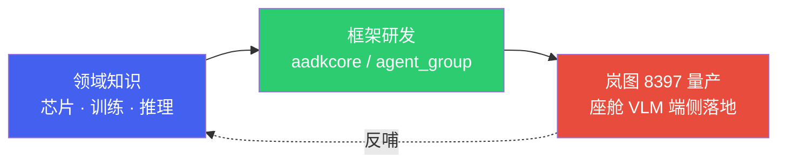

# 智能座舱端侧大模型：从领域知识到量产实践

*一条「领域知识 → 框架研发 → 量产项目」的完整主线*

> [!TIP]
> **本篇讲什么**
>
> 这是智能座舱板块的**总导读**，把三层内容串成一个完整故事：先打**领域知识**地基（芯片/训练/推理），再研发可复用的**端侧 Agent 框架**（aadkcore / agent_group），最后在**岚图 8397 座舱 VLM 量产项目**里把框架真正落地装车。
>
> 建议按「通识 → 框架 → 岚图」的顺序阅读；每一层都引用下一层，读完能完整理解「端侧大模型如何从知识走到量产」。

## 1. 故事主线

- **第一层 · 领域知识**：理解座舱端侧的硬件底座（SA8397P SoC / Hexagon DSP）、模型训练与微调、推理优化——这是一切的地基。
- **第二层 · 框架研发**：基于领域知识研发可复用的端侧 Agent 框架——aadkcore 统一模型接口与调度，agent_group 以插件承载各场景 Agent。
- **第三层 · 岚图量产**：把框架部署到岚图 8397 座舱，跑通 GenAI 与 AIService 两套推理后端，完成效果/性能验证与运维。

## 2. 三层结构与阅读路径

### 2.1 第一层 · 领域知识（通用部分）

| 文档 | 讲什么 |
| :--- | :--- |
| [硬件与系统底层](general/hardware.html) | SA8397P SoC、Hexagon DSP、FastRPC、Hypervisor、内存带宽、功耗热管理 |
| [模型训练与微调](general/training.html) | DMS/OMS 训练、LoRA/QLoRA、SWIFT、知识蒸馏、数据合规 |
| [推理优化](general/infer.html) | 量化、AIMET、KV Cache、多核绑定、前缀缓存、投机采样、约束解码 |
| [Android 开发 & JNI 基础](general/android-jni.html) | Android 工程结构、JNI 桥接、端侧 NPU 调用 |
| [面试指南](general/interview.html) | 51 道精选题，覆盖上述领域知识 |

### 2.2 第二层 · 框架研发（aadkcore / agent_group）

| 文档 | 讲什么 |
| :--- | :--- |
| [座舱端侧 Agent 总览](projects/agent-framework/overview.html) | 框架整体架构与模块划分 |
| [设备部署](projects/agent-framework/deploy.html) | QNN 推理框架、多平台构建矩阵、Service 量产部署 |
| [aadkcore 核心框架](projects/agent-framework/agent-core.html) | 统一模型接口、模型调度、对话管理、RAG/MCP/A2A |
| [场景 Agent 应用](projects/agent-framework/agent-group.html) | 场景 Agent 插件机制（车控/主动视觉/闲聊/GUI 等） |
| [调试与工具链](projects/agent-framework/debug.html) | 精度/内存/Crash 排障、日志与监控 |

### 2.3 第三层 · 岚图 8397 量产项目

| 文档 | 讲什么 |
| :--- | :--- |
| [GenAI 方案架构总览](projects/lantu/genai-architecture.html) | GenAI 方案的系统架构与优化 |
| [AIService 后端集成与重构](projects/lantu/aiservice-integration.html) | 岚图自研 AIService 推理后端的集成 |
| [APK 集成与端侧服务化](projects/lantu/apk-integration.html) | 宿主 APK 内部结构、JNI、HTTP 服务化 |
| [设备部署与上车流程](projects/lantu/device-deployment.html) | SDK 构建 → 设备目录 → adb push → 运行 |
| [效果及性能测试](projects/lantu/effect-performance.html) | 效果指标、性能指标、系统监控 |
| [性能优化与稳定性](projects/lantu/perf-optimization.html) | 优化细节、存储、稳定性 |
| [GenAI vs AIService 对比](projects/lantu/genai-vs-aiservice.html) | 两套推理后端端到端耗时对比 |
| [运维及安全](projects/lantu/ops-security.html) | 设备安装、系统升级、OTA/模型加密设计 |

## 3. 一条完整的落地链路

把三层串起来，一个端侧大模型上车的完整链路是：

1. **懂底座**（领域知识）：理解 SA8397P 的 DSP/NPU、内存带宽与功耗约束，知道端侧推理的瓶颈在哪。
2. **造框架**（框架研发）：用 aadkcore 统一模型接口与调度、agent_group 承载场景 Agent，支持多平台构建与 Service 量产部署。
3. **做集成**（岚图项目）：把框架部署到岚图 8397——GenAI 方案直跑 QNN，AIService 方案经岚图自研推理服务；宿主 APK 经 JNI 调用 SDK 并对外提供 HTTP 服务。
4. **验效果**（岚图项目）：效果/性能/稳定性测试，GenAI 与 AIService 两套后端对比，持续优化。
5. **保运行**（岚图项目）：设备部署上车、运维与安全（OTA、模型加密设计）。

> [!NOTE]
> **为什么这样分层**
>
> 领域知识是可迁移的地基，框架是可复用的资产，岚图项目是框架的一次具体落地。框架研发时不绑定具体项目（主线 `agent_core_dev` 多平台通用），岚图项目则基于岚图分支（`lantu_sdk_dev` / `lantu_aiservice_dev`）做具体实现——这正是「框架可复用、项目可落地」的工程实践。
