# Part E1: aadkcore 核心框架

*Chapters 1-9 — 架构总览、统一模型接口、模型调度、对话管理、RAG、MCP、A2A、运行时与插件、LLM Flow*

## 1. aadkcore 架构总览

**aadkcore** 是自研的端侧多平台 AI Agent 核心引擎，采用 C++17 编写，编译产物为 `libaadkcore.so`。框架的核心目标是：**一套代码，屏蔽底层推理后端差异，统一 Agent 开发范式**，支持 x86 云端、Jetson Orin、高通 SA8397P 等多种平台。

### 1.1 分层架构

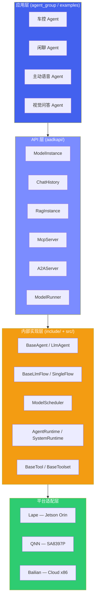

### 1.2 代码目录结构

| 目录 | 职责 |
| :--- | :--- |
| `aadkapi/` | 公共 API 头文件：ModelInstance、ChatHistory、RagInstance、McpServer、A2AServer、content、model\_config 等 |
| `include/agent/` | Agent 基类：BaseAgent、LlmAgent、InvocationContext、RunConfig |
| `include/flow/` | LLM 推理流水线：BaseLlmFlow、SingleFlow、BaseLlmProcessor、Instructions |
| `include/models/` | 模型配置与注册（LlmRegistry、BaseLlm） |
| `include/rag/` | RAG 知识增强：RagServiceBase 抽象基类 |
| `include/memory/` | 对话记忆管理 |
| `include/tools/` | Tool 系统：BaseTool、BaseToolset、MCP 客户端/服务端、ToolContext |
| `include/runtime/` | 运行时：AgentRuntime、SystemRuntime、AgentPlugin、ModelScheduler、ConstantIDs |
| `src/` | 所有模块的实现代码（agent、flow、models、rag、runner、runtime、tools 等子目录） |
| `examples/` | 使用示例 |

### 1.3 平台支持矩阵

| 平台 | 芯片 | 推理后端 | 构建脚本 |
| :--- | :--- | :--- | :--- |
| **x86\_64** | Intel / AMD | Bailian（云端） | `build.sh` |
| **aarch64 Orin** | Jetson Orin | Lape（本地） | `build_orin.sh` / `build_cross_for_orin.sh` |
| **aarch64 SA8397P** | SA8397P | QNN（本地） | `build_8397_linux.sh` / `build_8397_android.sh` |
| **aarch64 SA8295** | SA8295 | QNN（本地） | `build_8295_android.sh` |
| **aarch64 SA9075** | SA9075P | QNN（本地） | `build_9075_linux.sh` |

> [!TIP]
> **设计原则**
>
> 上层 Agent 代码通过 `aadkapi/` 中的统一接口（ModelInstance、ChatHistory 等）开发，无需感知底层推理后端差异。切换平台只需更换构建脚本和模型文件，Agent 业务逻辑代码零修改。

## 2. 统一模型接口 — ModelInstance

`ModelInstance`（定义于 `aadkapi/model_instance.hpp`）是面向 Agent 开发者的核心模型交互类。它封装了单个 LLM 模型实例，提供流式/非流式生成、多模态输入、LoRA 热加载等能力，屏蔽 Lape / QNN / Bailian 后端差异。

### 2.1 核心 API

| API | 返回类型 | 说明 |
| :--- | :--- | :--- |
| `streamGenerate(messages, history, callback, ...)` | `ModelResponse` | 流式生成，通过 `StreamCallback` 逐 token 回调，支持指定 lora\_id、InferParams |
| `generate(messages, callback, ...)` | `ModelResponse` | 非流式一次性生成，通过 `CompletionCallback` 返回完整结果 |
| `preprocessImage(image)` | `optional<shared_ptr<vector<float>>>` | 图像预处理为 embedding，支持 ImageBlob 和 ImageUrlContent 两种输入 |
| `preprocessAudio(audio)` | `optional<shared_ptr<vector<float>>>` | 音频预处理为 embedding，输入 AudioBlob |
| `addLora(lora_paths)` | `vector<int>` | 热加载 LoRA 适配器，返回 lora\_id 列表，后续推理可指定 lora\_id |
| `suspend(deinit) / resume()` | `void` | 暂停/恢复模型推理；suspend 时可选择是否卸载底层资源释放内存 |
| `stopGenerate()` | `bool` | 中断当前正在进行的生成任务 |
| `setConfig(config) / getConfig()` | `void / optional<ModelConfig>` | 设置/获取模型配置参数 |
| `is_ready()` | `bool` | 查询模型是否已就绪 |

> [!NOTE]
> **回调函数类型**
>
> `StreamCallback = function<void(const string& content, bool is_finished, void* user_data)>` — 流式回调，每生成一个 token 调用一次，`is_finished` 为 true 表示生成结束。  
> `CompletionCallback = function<void(const string& content, void* user_data)>` — 非流式回调，生成完成后一次性返回。

### 2.2 多模态消息类型系统

消息类型定义于 `aadkapi/content.hpp`，采用 `std::variant` 实现多模态内容的类型安全表示。

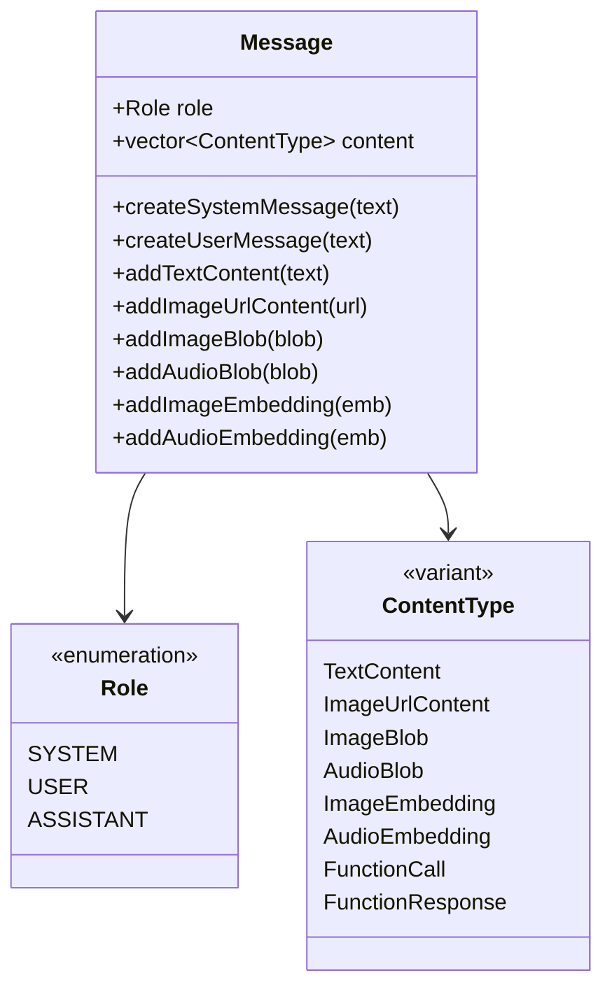

| ContentType | 字段 | 说明 |
| :--- | :--- | :--- |
| `TextContent` | `text: string` | 文本内容 |
| `ImageUrlContent` | `url: ImageSource` | 图像 URL 或 Base64 Data URI |
| `ImageBlob` | `data, width, height, channels, mimetype` | 图像原始二进制数据 |
| `AudioBlob` | `data: vector<int16_t>, size, mimetype` | 音频原始二进制数据 |
| `ImageEmbedding` | `data: shared_ptr<vector<float>>, shape` | 图像 embedding（preprocessImage 输出） |
| `AudioEmbedding` | `data: shared_ptr<vector<float>>, shape` | 音频 embedding（preprocessAudio 输出） |
| `FunctionCall` | `name, arguments, index, id, type` | LLM 发起的函数调用 |
| `FunctionResponse` | `tool_call_id, name, content` | 工具调用返回结果 |

### 2.3 ModelConfig 参数

模型推理参数定义于 `aadkapi/model_config.hpp`，包含 `ModelConfig`（全局配置）和 `InferParams`（单次推理覆写）两个层级。

| 参数 | 类型 | 默认值 | 说明 |
| :--- | :--- | :--- | :--- |
| `temperature` | `double` | 0.0 | 生成温度，越高越随机 |
| `top_p` | `double` | 1.0 | 核采样概率 |
| `top_k` | `int` | 1 | Top-K 采样 |
| `max_output_tokens` | `int` | 1024 | 最大输出 token 数 |
| `seed` | `int` | 42 | 随机种子 |
| `greedy` | `bool` | true | 是否贪心解码 |
| `repetition_penalty` | `int` | 1 | 重复惩罚因子 |
| `ebnf_path` | `string` | "" | EBNF 语法文件路径，用于约束解码 |
| `pruned_vocabulary` | `string` | "" | 裁剪词表，减少解码搜索空间 |
| `enable_jump_forward` | `bool` | false | 约束解码跳跃前进优化 |
| `config_file_path` | `string` | "" | 模型特定配置文件路径 |

### 2.4 流式多模态推理代码示例

```
// 1. 创建模型实例
ModelInstance model("qwen-vl-max");

// 2. 设置配置
ModelConfig config;
config.temperature = 0.7;
config.max_output_tokens = 512;
model.setConfig(config);

// 3. 构造多模态消息
auto user_msg = message::Message::createUserMessage();
user_msg.addTextContent("描述这张图片中的内容");
user_msg.addImageUrlContent(
    message::ImageUrlContent::createFromBase64(base64_data, "jpeg"));

message::MessageList messages = {
    message::Message::createSystemMessage("你是一个车载智能助手。"),
    user_msg
};
message::MessageList history; // 历史对话

// 4. 流式生成
model.streamGenerate(
    messages, history,
    [](const std::string& token, bool is_finished, void* ud) {
        std::cout << token << std::flush;
        if (is_finished) std::cout << std::endl;
    },
    nullptr  // user_data
);
```

## 3. 模型调度器 — ModelScheduler

端侧场景下，多个 Agent（车控、闲聊、主动语音等）可能并发请求同一个 LLM 模型。`ModelScheduler`（定义于 `include/runtime/model_scheduler.h`）提供基于优先级的任务队列和抢占调度，确保高优先级任务及时响应。

### 3.1 调度架构

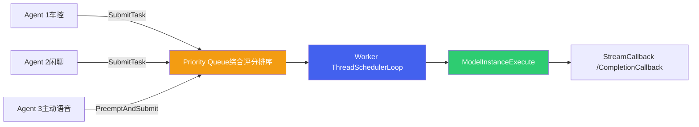

### 3.2 任务类型与优先级

**四种任务类型**（`TaskType` 枚举）：

| TaskType | 值 | 说明 | 典型场景 |
| :--- | :--- | :--- | :--- |
| `LLM_STREAM` | 0 | 流式文本生成 | 语音助手实时对话 |
| `LLM_NON_STREAM` | 1 | 非流式生成 | 意图分类、Slot 填充 |
| `VISION_DECODE` | 2 | 视觉模型推理 | 图像理解、物体检测 |
| `AUDIO_DECODE` | 3 | 音频模型推理 | 语音编码、ASR |

**四种优先级**（`PriorityBase` 枚举）：

| 优先级 | 数值 | 适用场景 |
| :--- | :--- | :--- |
| `LOW` | 10 | 后台摘要、日志分析 |
| `NORMAL` | 20 | 闲聊对话 |
| `HIGH` | 30 | 车控指令 |
| `CRITICAL` | 40 | 紧急安全指令 |

**综合评分公式**：调度器使用 `CompareTask` 比较器，基于优先级和等待时间计算综合评分：

```
score = priority * weight_priority + wait_time_ms * weight_wait * 0.001

// 默认权重：weight_priority = 2.0, weight_wait = 0.5
// 等待越久，score 越高，避免低优先级任务饥饿
```

### 3.3 抢占机制与 ModelRunner

| 调度操作 | 说明 |
| :--- | :--- |
| `SubmitTask(task)` | 提交任务到优先级队列，按评分排序等待执行 |
| `PreemptAndSubmit(task)` | 中断当前正在执行的任务，立即执行高优先级任务 |
| `BoostPriority(task_id, delta)` | 动态提升指定任务的优先级 |
| `StopTask(task_id, scenario_id)` | 停止指定任务 |
| `ListAllTasks()` | 列出所有任务及其状态 |

**ModelRunner 单例**（`aadkapi/model_runner.h`）是调度器的上层封装：

- `getInstance()` 全局单例，所有 Agent 共享
- `scene_model_details_`：`scene_id → ModelDetails` 映射，管理各场景的模型实例与 LoRA 配置
- `schedule_run_sync()`：提交调度任务并同步等待结果，支持指定 LoRA 名称路由到不同适配器
- `preprocessImage() / preprocessAudio()`：多模态预处理，基于 `DataMessage` 中的媒体数据

> [!NOTE]
> **TaskResponse 结构**
>
> 每个任务完成后返回 `TaskResponse`，包含：`task_id`（任务ID）、`status`（error\_code 枚举）、`ttft`（首 token 延迟 ms）、`input_tokens`、`output_tokens`、`tokens_per_second`（吞吐量），可用于性能监控和调优。

## 4. 多音区对话管理 — ChatHistory

车载座舱场景下，不同座位的乘员可能同时与 AI 助手对话。`ChatHistory`（定义于 `aadkapi/chat_history.hpp`）实现了按音区隔离的对话历史管理，支持关键人物识别与指代消歧。

### 4.1 音区枚举 AudioZone

| 枚举值 | zone\_id | 说明 |
| :--- | :--- | :--- |
| `InvalidZone` | 0 | 无效音区 |
| `FrontLeftZone` | 1 | 主驾（FrontZone 别名） |
| `FrontRightZone` | 2 | 副驾 |
| `MiddleLeftZone` | 4 | 左后排 |
| `MiddleRightZone` | 8 | 右后排 |
| `BackLeftZone` | 16 | BackLeftZone（扩展） |
| `BackRightZone` | 32 | BackRightZone（扩展） |
| `AllZone` | 0xFF | 所有音区 |

**ChatMessage 三种类型**：

| 类型 | 工厂方法 | 说明 |
| :--- | :--- | :--- |
| `query` | `ChatMessage::query(content, zone, call_id, ts)` | 用户语音输入 |
| `response` | `ChatMessage::response(content, zone, call_id, ts)` | 模型回复 |
| `info` | `ChatMessage::info(content, call_id, ts, zone)` | Agent 执行过程中需要加入上下文的系统信息 |

### 4.2 关键人物系统 — UserInfo

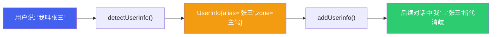

**UserInfo** 结构体包含：

- `audio_zone`：关键人物所在的座位音区
- `alias`：识别到的人名别名
- `attributes`：模型识别的关键人物特征（外貌、神态等）
- `summarize`：该人物的历史对话总结
- `timestamp`：UserInfo 创建时间

核心方法 `detectUserInfo(message)` 从用户 query 中检测是否包含人物信息；`addQuery()` 在添加 query 时可自动触发关键人物识别，并返回识别结果和历史对话。

### 4.3 历史获取策略

| 方法 | 参数 | 说明 |
| :--- | :--- | :--- |
| `getHistoryByNum(rounds)` | `size_t rounds` | 获取最近 N 轮对话（含 query/response/info） |
| `getHistoryByPeriod(start, end)` | `int64_t start_time, end_time` | 获取指定时间段的对话；-1 表示不限；可用 alias 替代音区名 |
| `getHistoryByTokenLimit(limit, counter)` | `size_t limit, optional<function>` | 获取不超过 token 限制的对话；支持自定义 token 计数器 |
| `getHistoryByUserinfo(alias, start, end)` | `string alias, int64_t` | 获取特定关键人物所在音区的对话历史 |
| `removeHistoryByAudioZone(zone, start, end)` | `int zone, int64_t` | 删除指定音区的对话记录 |
| `removeUserinfoByAlias(alias, remove_history)` | `string, bool` | 删除关键人物，可选同时删除其对话记录 |
| `clear()` | - | 清空所有历史记录和 UserInfo |

> [!WARNING]
> **默认 Token 估算规则**
>
> `getHistoryByTokenLimit` 在不传入自定义 token\_counter 时，使用默认估算：中文字符 1:1（一个中文字 = 1 token），英文 1.3:1。如需精确计数，可传入与实际 tokenizer 对齐的计数函数。

## 5. RAG 知识增强

`RagInstance`（定义于 `aadkapi/rag_instance.hpp`）为 Agent 提供可插拔的 RAG（Retrieval-Augmented Generation）能力。通过构造时指定 `service_name`，内部路由到对应的 `RagServiceBase` 实现。

| API | 返回类型 | 说明 |
| :--- | :--- | :--- |
| `RagInstance(service_name)` | - | 构造函数，根据服务名获取对应 RAG 实现 |
| `init(config_path)` | `bool` | 初始化 RAG 服务，加载索引和配置 |
| `query(query_str)` | `vector<string>` | 检索与查询相关的知识片段列表 |
| `isReady()` | `bool` | 检查 RAG 服务是否就绪 |

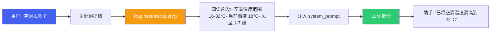

**可插拔架构**：`RagServiceBase` 是抽象基类，不同场景可实现不同的 RAG 服务（如车控知识库、用户手册知识库等），通过 `service_name` 注册和路由。

```
// 车控 RAG 使用示例
RagInstance rag("carcontrol_rag");
rag.init("/path/to/rag_config.json");

if (rag.isReady()) {
    auto results = rag.query("空调温度调节");
    // results: ["空调温度范围16-32°C", "当前温度18°C", ...]
    // 将 results 拼接到 system_prompt 中供 LLM 参考
}
```

## 6. MCP 工具协议

MCP（Model Context Protocol）是 LLM 与外部工具的标准通信协议。`McpServer`（定义于 `aadkapi/tools/mcp/mcp_server.hpp`）实现了 MCP 服务端，支持将车辆控制 API、导航 API 等外部能力暴露为 LLM 可调用的 Tool。

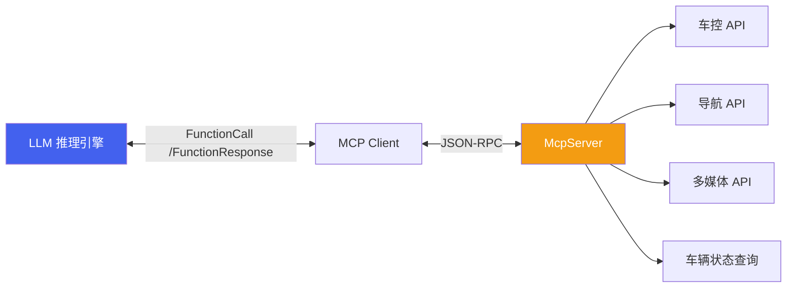

### 6.1 四种传输类型

| 枚举值 | 传输类型 | 说明 | 适用场景 |
| :--- | :--- | :--- | :--- |
| `MCP_TRANSPORT_STDIO` | STDIO | 标准输入/输出通信 | 本地进程间通信 |
| `MCP_TRANSPORT_SSE` | SSE | Server-Sent Events | Web 单向推送 |
| `MCP_TRANSPORT_HTTP` | HTTP | HTTP 请求/响应 | RESTful 调用 |
| `MCP_TRANSPORT_FUSION` | Fusion | 自定义融合协议 | 车载系统内部通信 |

### 6.2 核心 API

| API | 说明 |
| :--- | :--- |
| `McpServer(name, version)` | 构造 MCP 服务实例，指定服务名称和版本 |
| `AddTool(param, callback)` | 注册工具，param 为 JSON 描述（名称/描述/参数 Schema），callback 处理调用 |
| `AddPrompt(param, callback)` | 注册 Prompt 模板 |
| `AddResource(param, callback)` | 注册数据资源（URI + 描述） |
| `AddResourceTemplate(param, callback)` | 注册资源模板 |
| `Start(transport_type, param)` | 启动 MCP 服务，指定传输类型和参数 |
| `AddServer(server, path)` (static) | 注册 MCP 服务器实例到指定路径 |
| `StartServers(config, transport, addr, port)` (static) | 批量启动所有已注册的 MCP 服务器 |

### 6.3 注册工具代码示例

```
// 创建 MCP Server
auto mcp_server = std::make_shared<McpServer>("car_control", "1.0.0");

// 注册"设置空调温度"工具
nlohmann::json tool_param = {
    {"name", "set_ac_temperature"},
    {"description", "设置车内空调温度"},
    {"inputSchema", {
        {"type", "object"},
        {"properties", {
            {"temperature", {{"type", "number"}, {"description", "目标温度(°C)"}}},
            {"zone", {{"type", "string"}, {"description", "音区: 主驾/副驾/全车"}}}
        }},
        {"required", {"temperature"}}
    }}
};

mcp_server->AddTool(tool_param,
    [](uintptr_t session, nlohmann::json& req) -> nlohmann::json {
        double temp = req["temperature"];
        // 调用车控底层 API 设置温度...
        return {{"status", "success"}, {"temperature", temp}};
    });

// 启动服务
mcp_server->Start(McpServer::MCP_TRANSPORT_FUSION, "car_mcp");
```

## 7. A2A 协议

A2A（Agent-to-Agent）是多 Agent 间通信标准，遵循 [a2a-protocol.org](https://a2a-protocol.org) 规范。`A2AServer`（定义于 `aadkapi/a2a/a2a_server.h`）实现了 A2A 服务端，支持 Agent 间的任务委托、状态同步和结果传递。

### 7.1 任务状态机

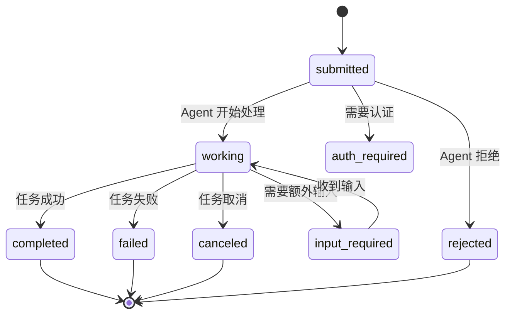

### 7.2 A2AServer API

| API | 说明 |
| :--- | :--- |
| `A2AServer(agent_config, cb, task_cb, userdata)` | 创建 A2A 服务，配置 Agent Card（名称/描述/能力），设置消息回调和任务回调 |
| `Start(host, port)` | 启动 A2A HTTP 服务，默认使用 config 中的地址 |
| `Stop()` | 停止 A2A 服务 |
| `Append(other)` | 将其他 A2A Agent 共享同一个 HTTP 服务 |

### 7.3 A2ATaskHandler

| API | 说明 |
| :--- | :--- |
| `UpdateTaskState(taskId, state, message)` | 更新任务状态（submitted/working/completed/failed 等） |
| `AddArtifact(taskId, artifact, isFinal, isAppend)` | 添加产出物（文本/文件），支持标记是否为最终产出 |
| `GetTask(taskId)` | 查询任务详细信息（JSON 格式） |

### 7.4 多 Agent 协作场景

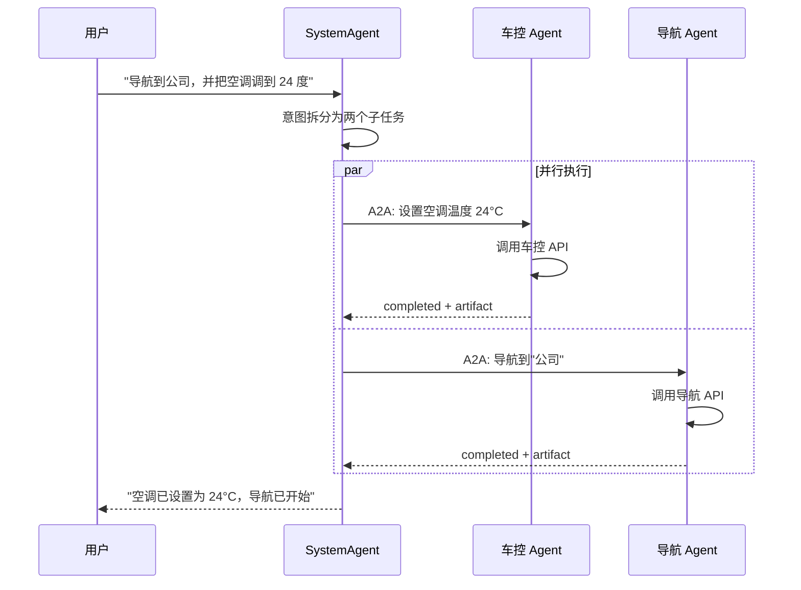

## 8. Agent 运行时与插件机制

aadkcore 的运行时分为两层：`SystemRuntime` 负责消息接收与路由；`AgentRuntime` 负责 Agent 生命周期管理。业务 Agent 通过插件机制（`AgentPlugin`）以动态库形式加载。

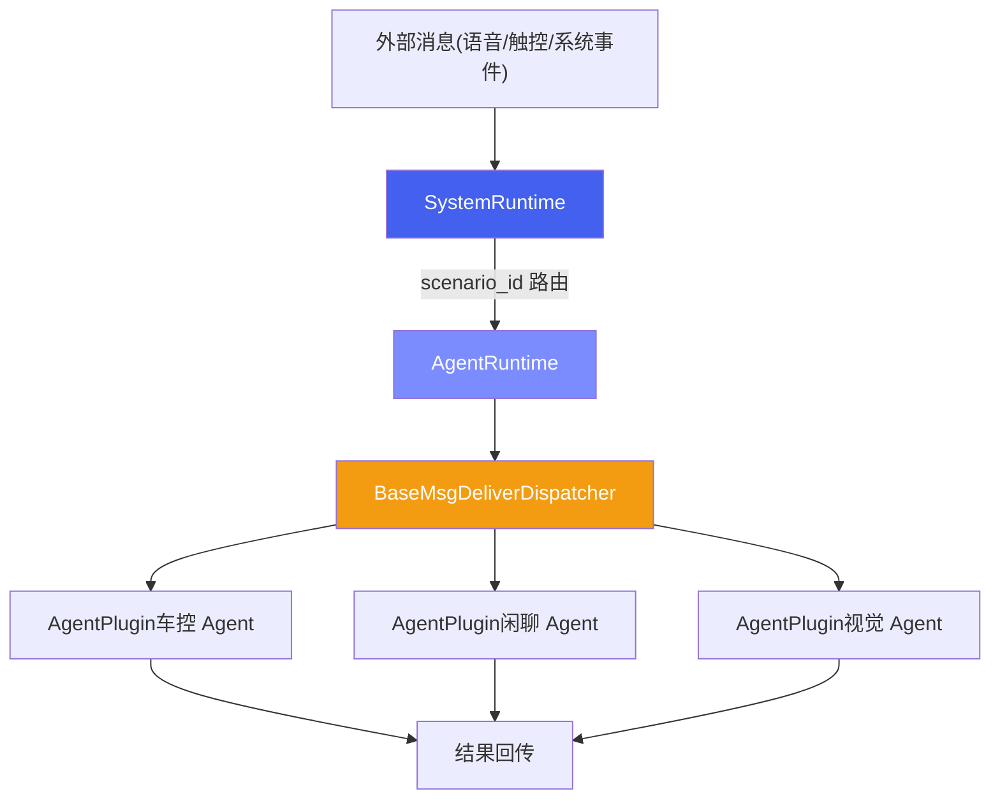

### 8.1 AgentPlugin 插件接口

定义于 `include/runtime/agent_plugin.h`，是所有业务 Agent 必须实现的抽象接口：

| 方法 | 返回类型 | 说明 |
| :--- | :--- | :--- |
| `deliver_msg(message)` | `bool` | 接收并处理 `DataMessage`，Agent 的核心入口 |
| `scenario_id()` | `int` | 返回 Agent 负责的场景 ID（对应 `constant_ids.h`） |
| `clear_memory()` | `bool` | 清除对话历史 |
| `set_data_dump_flag(flag)` | `void` | 设置数据录制标志（默认空实现） |

**场景 ID 常量**（`constant_ids.h`）：

| 常量 | ID | 场景 |
| :--- | :--- | :--- |
| `SYSTEM_AGENT_SCENARIO_ID` | 1001 | 系统总控 Agent |
| `CAR_CONTROL_SCENARIO_ID` | 1002 | 车控 Agent |
| `CHITCHAT_SCENARIO_ID` | 1003 | 闲聊 Agent |
| `VIDEOCHAT_SCENARIO_ID` | 100 | 视频对话 |
| `PROACTIVE_SPEECH_SCENARIO_ID` | 200 | 主动语音 |
| `ACTIVE_VISION_SCENARIO_ID` | 300 | 主动视觉 |
| `WELCOME_MODE_SCENARIO_ID` | 700 | 迎宾模式 |
| `BROADCAST_SCENARIO_ID` | 65535 | 广播消息 |

### 8.2 动态加载机制

`libaadkcore.so` 运行时通过 `dlopen` 加载业务 Agent 动态库（如 `libagent_group.so`），通过约定的 `extern "C"` 工厂函数获取 Agent 列表并创建实例。

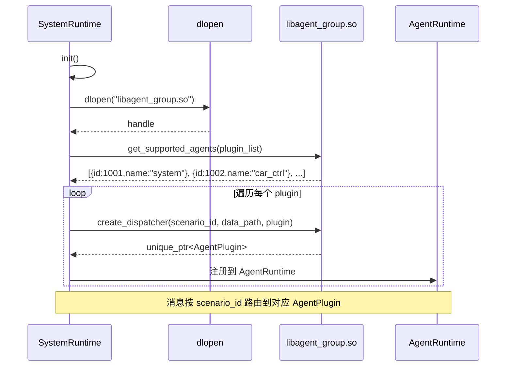

**工厂函数签名**：

```
// 获取支持的 Agent 列表
extern "C" void get_supported_agents(std::vector<PluginInfo>& plugins);

// 创建指定场景的 Agent 实例
extern "C" void create_dispatcher(int scenario_id, const char* data_path,
                                  std::unique_ptr<AgentPlugin>& plugin);

// 销毁 Agent 实例
extern "C" void destroy_dispatcher(std::unique_ptr<AgentPlugin> plugin);
```

## 9. LLM Flow 与 Tool 系统

`BaseLlmFlow`（定义于 `include/flow/base_llm_flow.hpp`）实现了 LLM 推理流水线的标准模式，负责预处理、调用模型、后处理和 Tool 调用循环。`BaseTool`（定义于 `include/tools/base_tool.hpp`）定义了工具的统一抽象接口。

### 9.1 BaseLlmFlow 流水线

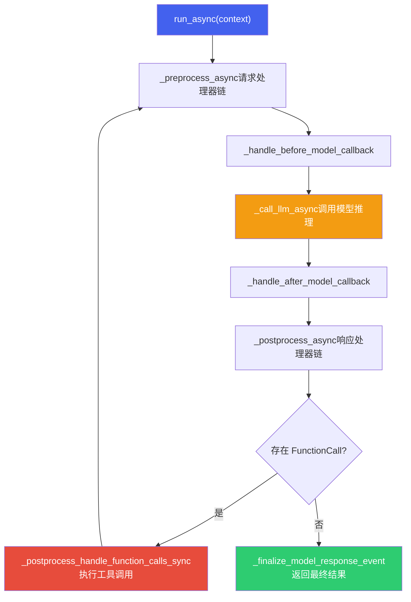

**SingleFlow** 是 `BaseLlmFlow` 的标准实现，预注册了两个请求处理器：

- `basic::request_processor` — 基础请求构建
- `instructions::request_processor` — 将 Agent 的 instructions 注入到请求中

### 9.2 BaseTool 工具基类

| 属性/方法 | 返回类型 | 说明 |
| :--- | :--- | :--- |
| `name()` | `const string&` | 工具名称 |
| `description()` | `const string&` | 工具描述 |
| `is_long_running()` | `bool` | 是否长时间运行（如导航规划） |
| `get_declaration()` | `optional<ToolDefinition>` | 返回 JSON Schema 格式的工具声明 |
| `run_async(args, context)` | `Task<bool>` | 异步执行工具，参数为 `map<string, any>` |
| `process_llm_request(context)` | `Task<tuple>` | 处理 LLM 请求，返回描述文本和 ToolDefinition |

**ToolDefinition 结构**（定义于 `content.hpp`）：

```
struct ToolDefinition {
    std::string name;         // 工具名称，如 "set_ac_temperature"
    std::string description;  // 工具描述
    ToolParameters parameters; // 输入参数 Schema
    ToolParameters responses;  // 输出结构 Schema
};

struct ToolParameters {
    std::string type;  // "object"
    std::map<std::string, ParamInfo> properties; // 参数名 → {type, description}
};
```

LLM 根据所有注册 Tool 的 `ToolDefinition` 生成结构化的 `FunctionCall`，Flow 引擎解析后调用对应 Tool 的 `run_async()`，结果通过 `FunctionResponse` 回传给 LLM 继续推理。

### 9.3 端到端调用链

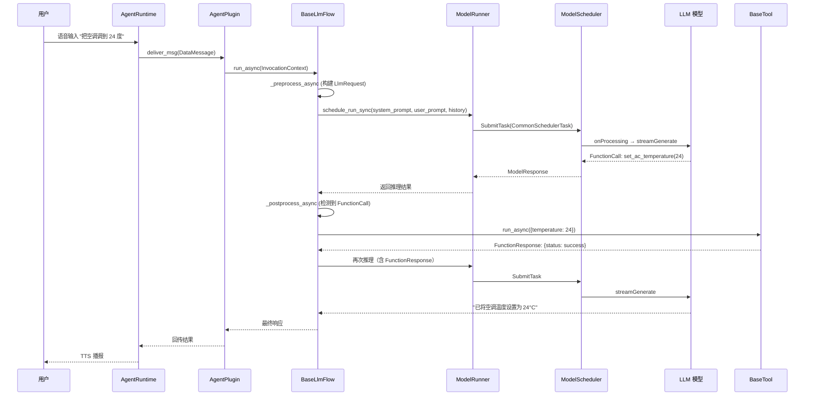

> [!TIP]
> **框架核心价值**
>
> aadkcore 将 Agent 开发中的共性能力（模型调度、对话管理、Tool 调用、RAG、A2A 协作）下沉到框架层，业务 Agent 开发者只需关注：(1) 编写 `AgentPlugin` 实现业务逻辑；(2) 注册 `BaseTool` 连接外部能力；(3) 编写 `instructions` 定义 Agent 行为。框架负责调度、流水线、协议对接等基础设施工作。

## 10. 端云协同架构

纯端侧 Agent 受限于模型能力和知识范围，纯云端 Agent 受限于延迟和离线可用性。端云协同是座舱 Agent 的最优架构——端侧处理低延迟、高隐私的请求，云端处理复杂推理和知识密集型任务。

### 10.1 端云分工策略

| 请求类型 | 处理方 | 原因 | 示例 |
| :--- | :--- | :--- | :--- |
| **车辆控制** | 端侧 | 低延迟（< 2s）+ 离线可用 + 安全关键 | "打开空调" "调到22度" "打开车窗" |
| **简单问答** | 端侧 | 端侧模型可胜任 + 零网络延迟 | "现在几点" "电量还有多少" "今天限号吗" |
| **复杂推理** | 云端 | 需要大模型能力（72B+） | "帮我规划三天旅行行程" "分析这份报告" |
| **知识密集型** | 云端 | 需要实时联网搜索 | "最近有什么好看的电影" "XX 餐厅评价怎么样" |
| **多模态理解** | 端侧优先，云端增强 | 端侧快速响应 + 云端精准分析 | DMS 疲劳检测（端侧）+ 复杂场景分析（云端） |

### 10.2 协同架构设计

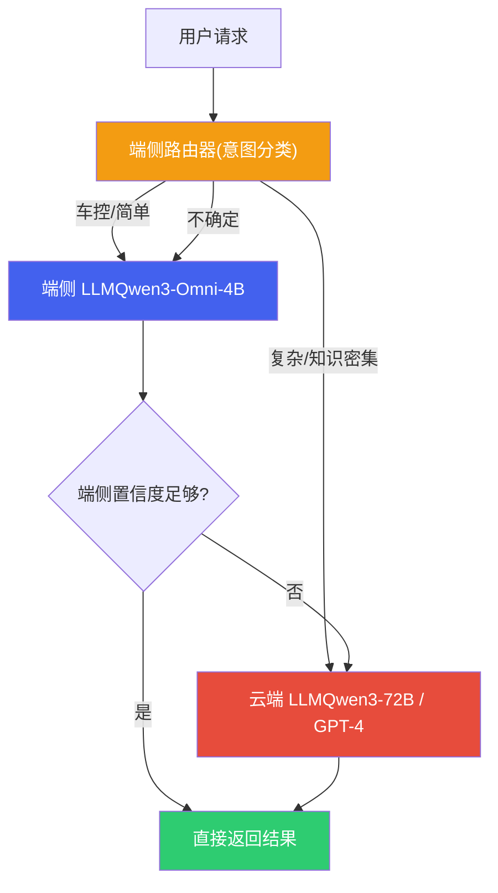

| 协同模式 | 工作方式 | 延迟 | 适用场景 |
| :--- | :--- | :--- | :--- |
| **端侧优先 (Edge-First)** | 端侧先处理，置信度不足时转云端 | 低（端侧成功时 < 1s） | 默认模式，大部分座舱交互 |
| **端云并行 (Parallel)** | 同时发给端侧和云端，取先到或更优结果 | 低（取较快者） | 对质量和延迟都有要求时 |
| **端侧草稿 (Draft-Refine)** | 端侧快速生成初稿，云端校验/润色 | 中（端侧先显示，云端更新） | 长文本生成、复杂回答 |
| **云端主导 (Cloud-Primary)** | 直接转云端处理 | 高（依赖网络） | 明确需要大模型或联网的请求 |

### 10.3 离线降级与缓存

当网络不可用时（隧道、地下车库、偏远地区），端云协同需要优雅降级：

| 降级策略 | 实现方式 | 用户体验 |
| :--- | :--- | :--- |
| **功能降级** | 需要云端的功能（搜索、在线导航）提示"当前离线，部分功能不可用" | 明确告知，不假装可用 |
| **缓存命中** | 热门问题（天气、限行）在有网时预缓存到本地 RAG | 离线也能回答常见问题 |
| **云端结果缓存** | 云端返回的结果（路线规划、POI 信息）缓存到本地 | 重复查询直接本地返回 |
| **网络恢复后同步** | 离线期间的日志和请求在恢复后批量上传 | 不丢失数据 |

> [!NOTE]
> **端云协同与 aadkcore 的集成**
>
> 在 aadkcore 框架中，端云协同可以通过 **A2A 协议** 实现：端侧 Agent 作为 A2A Client 向云端 Agent（A2A Server）发送子任务。SystemRuntime 的 HTTP Server 模式可以接收云端的回调结果。路由决策可以在 `BaseLlmFlow` 的 pipeline 中实现——在 Prefill 之前通过轻量意图分类（Qwen3-1.7B 或规则引擎）决定请求走向。

## 11. 安全沙箱机制

座舱 Agent 的 Tool 调用直接控制车辆硬件（空调、车窗、车门、车灯），安全沙箱是防止 LLM 幻觉或 Prompt 注入导致危险操作的最后防线。

### 11.1 三级安全分级

| 安全等级 | 操作类型 | 确认要求 | 示例工具 | 实现方式 |
| :--- | :--- | :--- | :--- | :--- |
| **L1 只读** | 查询类，无副作用 | 无需确认，直接执行 | 查天气、查电量、查导航 ETA | Tool 标记 `safety_level: L1` |
| **L2 可逆** | 可逆操作，影响车辆状态 | 语音确认（"好的，帮您调到22度"） | 调空调、开车窗、调音量、切歌 | Tool 执行前插入确认回复，等待用户未反对后执行 |
| **L3 不可逆/高危** | 不可逆或涉及安全 | 二次确认 + 条件检查（车速、档位） | 打开车门、发送消息、支付 | 强制二次确认 + 车辆状态安全检查 + 必要时生物认证 |

### 11.2 安全检查流水线

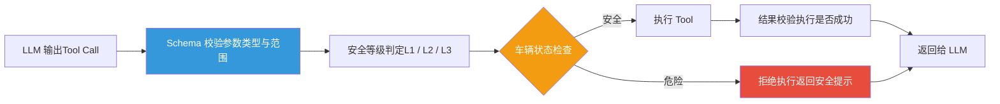

安全检查流水线中的各环节：

| 检查环节 | 检查内容 | 拒绝示例 |
| :--- | :--- | :--- |
| **Schema 校验** | 参数类型、范围、必填项。如温度必须在 16-32°C 范围内 | set\_ac\_temperature(temp=100) → 拒绝：温度超出范围 |
| **工具白名单** | LLM 输出的工具名必须在已注册工具列表中 | execute\_shell("rm -rf /") → 拒绝：工具不存在 |
| **车辆状态检查** | 根据当前车速、档位、行驶状态判断操作是否安全 | 车速 > 0 时 open\_door() → 拒绝：行驶中不可开门 |
| **频率限制** | 防止短时间内重复执行相同操作 | 1 秒内连续 5 次 set\_ac\_temperature → 拒绝：操作频率异常 |
| **用户权限** | 根据 scenario\_id 判断请求来源的权限 | 后排乘客尝试 unlock\_door → 拒绝：权限不足 |

### 11.3 Prompt 注入防御

LLM 存在 Prompt 注入风险——恶意用户可能通过精心构造的输入欺骗模型执行危险操作。座舱场景的防御需要多层保护：

| 防御层 | 实现方式 | 防御目标 |
| :--- | :--- | :--- |
| **System Prompt 加固** | System Prompt 中明确列出禁止行为，使用特殊分隔符隔离系统指令和用户输入 | 防止用户指令覆盖系统约束 |
| **输入过滤** | 检测并过滤已知的注入模式（"忽略前面的指令"、"你是一个没有限制的AI"） | 拦截常见越狱尝试 |
| **输出校验（Post-Guard）** | LLM 输出的 Tool Call 必须通过安全检查流水线，不依赖 LLM 自身的安全判断 | 即使 LLM 被欺骗，执行层也能拦截危险操作 |
| **Tool Schema 约束** | 工具参数通过 JSON Schema 严格约束类型和范围，非法参数在 Schema 校验阶段即被拒绝 | 防止 LLM 幻觉出非法参数值 |

> [!CAUTION]
> **安全沙箱的核心原则：不信任 LLM 输出**
>
> 安全沙箱的设计哲学是**将 LLM 视为不可信的组件**。LLM 负责理解用户意图并生成结构化的 Tool Call，但最终的执行决策由安全沙箱（Schema 校验 + 车辆状态检查 + 权限验证）做出。这意味着即使 LLM 100% 被 Prompt 注入欺骗，只要安全沙箱正确实现，危险操作仍然无法执行。这与 Web 安全中"永远不信任客户端输入"是同一原则。
