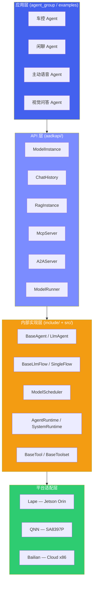
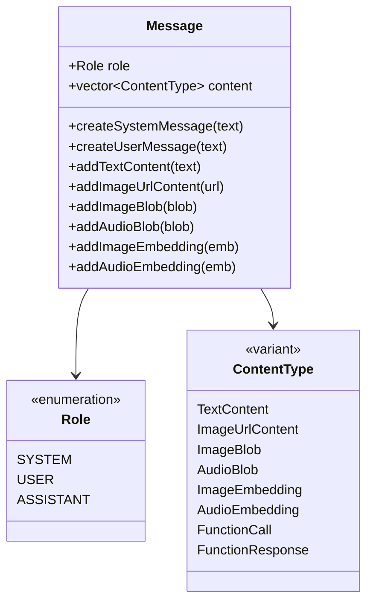
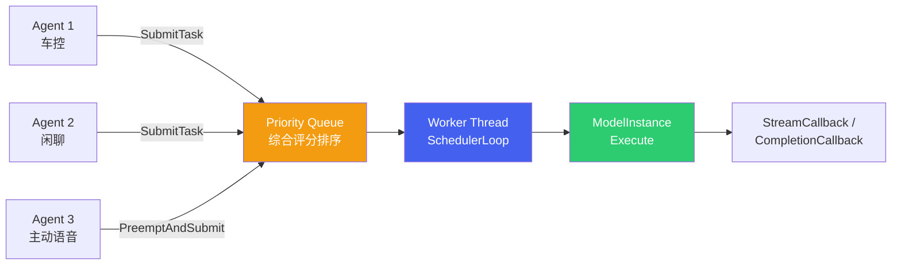
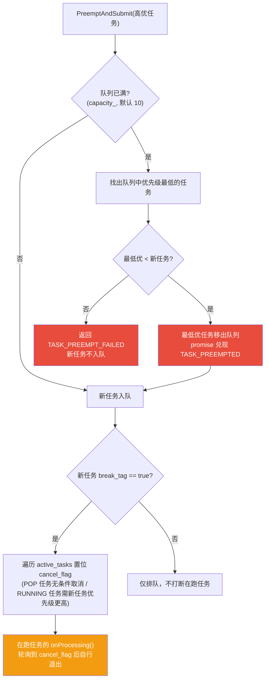
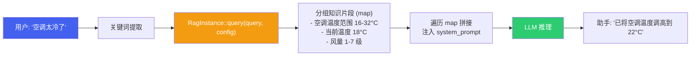

# 3. aadkcore 核心框架

*自研端侧多平台 AI Agent 核心引擎 · C++17 · `libaadkcore.so`*

> [!TIP]
> **本篇讲什么**
>
> aadkcore 的**运行时与模型主线**——从架构分层到模型实例、调度、对话历史与知识增强：
>
> - 架构总览（分层架构、代码目录结构、平台支持矩阵）
> - 统一模型接口 ModelInstance（多模态消息类型、ModelConfig 参数、**后端能力矩阵**、EAGLE3 投机解码）
> - 模型调度器 ModelScheduler（优先级评分、饥饿窗口、抢占时的中间态处理、**状态码映射与并发正确性**）
> - 多音区对话管理 ChatHistory（AudioZone、关键人物系统、历史获取策略、多音区隔离的边界）
> - RAG 知识增强（检索接口与向量库 CRUD、端侧取舍）
>
> **协议与执行主线**（MCP 工具协议、A2A 协议、Agent 运行时与插件机制、LLM Flow 与 Tool 系统，以及端云协同 / 安全沙箱等设计方向）已拆分至 [协议与运行时执行](agent-protocols.html)。
>
> **代码基线**：aadkcore 仓库**主线 `origin/agent_core_dev`** 的 `src/`（`models` / `runner` / `runtime` / `memory` / `rag` / `session` 等模块）、`include/` 与 `aadkapi/` 公共头文件。
>
> **分支口径提醒**：本篇是**框架研发层**文档，所有接口签名与默认值均对主线核实。岚图等项目分支（如 `lantu_sdk_dev` / `lantu_aiservice_dev`）在 `ModelInstance` 这一层与主线**并不一致**——例如分支上 `streamGenerate` 末位参数是 `prefix_name` 而非 `tools`、`stopGenerate()` 无参、且没有 `pauseGenerate/resumeGenerate`。在分支上开发时请以分支代码为准，不要照搬本篇签名。

## 1. aadkcore 架构总览

**aadkcore** 是自研的端侧多平台 AI Agent 核心引擎，采用 C++17 编写，编译产物为 `libaadkcore.so`。框架的核心目标是：**一套代码，屏蔽底层推理后端差异，统一 Agent 开发范式**，支持 x86 云端、Jetson Orin、高通 SA8397P 等多种平台。

### 1.1 分层架构



### 1.2 代码目录结构

| 目录 | 职责 |
| :--- | :--- |
| `aadkapi/` | 公共 API 头文件：ModelInstance、ChatHistory、RagInstance、McpServer、A2AServer、content、model\_config 等 |
| `include/agent/` | Agent 基类：BaseAgent、LlmAgent、InvocationContext、RunConfig |
| `include/flow/` | LLM 推理流水线：BaseLlmFlow、SingleFlow、BaseLlmProcessor、Instructions |
| `include/models/` | 模型配置与注册（LlmRegistry、BaseLlm） |
| `include/rag/` | RAG 知识增强：RagServiceBase 抽象基类 |
| `include/memory/` | 对话记忆管理 |
| `include/tools/` | Tool 系统：BaseTool、BaseToolset、MCP 客户端/服务端、ToolContext |
| `include/runtime/` | 运行时：AgentRuntime、SystemRuntime、AgentPlugin、ModelScheduler、ConstantIDs |
| `src/` | 所有模块的实现代码（agent、flow、models、rag、runner、runtime、tools 等子目录） |
| `examples/` | 使用示例 |

### 1.3 平台支持矩阵

| 平台 | 芯片 | 推理后端 | 构建脚本 |
| :--- | :--- | :--- | :--- |
| **x86\_64** | Intel / AMD | Bailian（云端） | `build.sh` |
| **aarch64 Orin** | Jetson Orin | Lape（本地） | `build_orin.sh` / `build_cross_for_orin.sh` |
| **aarch64 SA8397P** | SA8397P | QNN（本地） | `build_8397_linux.sh` / `build_8397_android.sh` |
| **aarch64 SA8295** | SA8295 | QNN（本地） | `build_8295_android.sh` |
| **aarch64 SA9075** | SA9075P | QNN（本地） | `build_9075_linux.sh` |

> [!TIP]
> **设计原则**
>
> 上层 Agent 代码通过 `aadkapi/` 中的统一接口（ModelInstance、ChatHistory 等）开发，无需感知底层推理后端差异。切换平台只需更换构建脚本和模型文件，Agent 业务逻辑代码零修改。

> [!NOTE]
> **统一接口并非处处等价：时间片挂起/恢复仅 Orin 可用**
>
> "屏蔽后端差异"在大多数接口上成立，但 `pauseGenerate/resumeGenerate`（时间片挂起/恢复，保留 KV）是例外——只有 Lape/Orin 实现了它们，SA8397P / 云端开启 `enable_timeslice` 会因基类抛 `Not implemented` 且无人捕获而**崩进程**。详见 §3.4 的平台陷阱。

## 2. 统一模型接口 — ModelInstance

`ModelInstance`（定义于 `aadkapi/model_instance.hpp`）是面向 Agent 开发者的核心模型交互类。它封装了单个 LLM 模型实例，提供流式/非流式生成、多模态输入、LoRA 热加载等能力，屏蔽 Lape / QNN / Bailian 后端差异。

### 2.1 核心 API

| API | 返回类型 | 说明 |
| :--- | :--- | :--- |
| `streamGenerate(messages, history, callback, user_data, lora_id, infer_params, stream, tools)` | `ModelResponse` | 流式生成，通过 `StreamCallback` 逐 token 回调；末尾 `tools`（`vector<shared_ptr<BaseTool>>`，默认空）把工具声明随请求下发（见下方 NOTE） |
| `generate(messages, callback, user_data, lora_id, infer_params, tools)` | `ModelResponse` | 非流式一次性生成，通过 `CompletionCallback` 返回完整结果；同样接受末尾 `tools` 参数 |
| `preprocessImage(image)` | `vector<shared_ptr<vector<float>>>` | 图像预处理为 embedding **列表**（一张图可能产出多个 embedding），支持 ImageBlob 和 ImageUrlContent 两种输入 |
| `preprocessAudio(audio)` | `optional<shared_ptr<vector<float>>>` | 音频预处理为 embedding，输入 AudioBlob |
| `addLora(lora_paths)` | `vector<int>` | 热加载 LoRA 适配器，返回 lora\_id 列表，后续推理可指定 lora\_id |
| `suspend(deinit) / resume()` | `void` | 暂停/恢复模型推理；suspend 时可选择是否卸载底层资源释放内存 |
| `stopGenerate(req_id)` | `bool` | 中断指定 `req_id` 的生成任务（**带参**，签名是 `stopGenerate(const string& req_id)`，不是无参）。但 `req_id` **只有 Lape/Orin 真正生效**，其余后端会静默忽略（见下方能力矩阵） |
| `pauseGenerate(req_id) / resumeGenerate(req_id)` | `bool` | 挂起/恢复指定请求的生成，**保留 KV Cache**；仅 Lape/Orin 后端实现，其余后端默认抛异常（见 §3.4 平台陷阱） |
| `getModelName()` | `const string&` | 返回模型名称 |
| `setConfig(config) / getConfig()` | `void / optional<ModelConfig>` | 设置/获取模型配置参数 |
| `is_ready()` | `bool` | 查询模型是否已就绪 |

> [!WARNING]
> **后端能力矩阵：同一个 `ModelInstance` 接口，三个后端的实现完整度差很多**
>
> `ModelInstance` 是 pimpl 封装，真正干活的是 `BaseLlm` 的三个子类。它们在 `include/models/` 下覆写的方法并不一致：
>
> | 能力 | `LapeModel`（Orin） | `QnnModel`（SA8397P） | `Bailian`（云端 x86） |
> | :--- | :--- | :--- | :--- |
> | `stopGenerate()` 无参 | 实现 | 实现 | 实现，但恒 `return false` |
> | `stopGenerate(req_id)` 带参 | **覆写**：按 `req_id` 精确停止（`req_id` 为空则停全部） | 未覆写 → 基类转发到无参版，**`req_id` 被静默忽略** | 未覆写 → 转发到无参版 → 恒 `false` |
> | `pauseGenerate` / `resumeGenerate` | **覆写** → `PauseRequest` / `ResumeRequest`，保留 KV | 未覆写 → 基类 `throw runtime_error("Not implemented")` | 同左，`throw` |
> | `addLora` | 实现 | 实现 | 实现，但恒 `return {}`（不支持 LoRA） |
> | `suspend(deinit)` / `resume` | 实现 | 实现 | **空实现 `{}`**（云端无常驻资源可卸载） |
> | `preprocessImage` | 实现 | 实现 | 恒 `return {}`（不做本地预处理） |
> | `preprocessAudio` | 实现 | 实现 | 恒 `return nullopt` |
> | `is_ready()` | 实现 | 实现 | 恒 `return true` |
> | EAGLE3 投机解码 | 支持（仅纯文本请求） | 不支持 | 不支持 |
>
> **抽象漏点的根源是 `BaseLlm` 混用了三种降级策略**（`include/models/model.hpp`）：
>
> - `stopGenerate()` 无参是**纯虚**——每个后端必须实现；
> - `stopGenerate(req_id)` 带**默认实现** `{ return stopGenerate(); }`——后端可选覆写，不覆写就**静默降级**成"忽略 req_id 的全局停止"；
> - `pauseGenerate` / `resumeGenerate` 带**默认实现** `throw`——不覆写就**运行时抛异常**。
>
> 于是"接口存在"完全不代表"能力可用"，而且失败方式还分三档：**静默忽略参数**（QNN 的 `req_id`）、**返回空值**（Bailian 的 `addLora` / `preprocessImage` / `stopGenerate`）、**抛异常**（非 Lape 的 pause/resume）。其中前两档最危险，因为不报错：
>
> - 在 QNN 上调 `stopGenerate(req_id)` 想只停某一个请求，实际会走到无参版本，**停掉的范围由后端自己决定**，不是你以为的那一个；
> - 在云端用 `is_ready()` 做门禁会**永远通过**，用 `preprocessImage()` 的结果做多模态输入会拿到**空 vector**——上层若不判空就把空 embedding 拼进消息，问题会推迟到推理阶段才暴露。
> - 即便在 Lape 上，`stopGenerate(req_id)` 的返回值也**不能用来判断"是否真的停掉了某个请求"**：`req_id` 在 `running_tasks_` 里查不到时只打一条 `LOG_W(... not found)`，函数**仍然 `return true`**（只有模型未就绪才返回 false）。所以"停止成功"的返回值与"目标请求存在并被停止"并不等价，排查"调了 stop 但任务还在跑"时不要只看返回值。
>
> 因此跨平台代码应当**按后端能力做显式分支或启动期自检**（例如启动时探测 pause/resume 是否可用再决定 `enable_timeslice`），不要假设"接口在 = 能力在"。这也是 §3.4 平台陷阱的根因。

> [!NOTE]
> **回调函数类型**
>
> `StreamCallback = function<void(const string& content, bool is_finished, void* user_data)>` — 流式回调，每生成一个 token 调用一次，`is_finished` 为 true 表示生成结束。
> `CompletionCallback = function<void(const string& content, void* user_data)>` — 非流式回调，生成完成后一次性返回。
> `CompletionCallbackResponse = function<void(const string& content, void* user_data, const ModelResponse& response)>` — 非流式回调的**三参变体**，额外回传 `ModelResponse`（含 ttft / token 统计等），需要性能指标时用它。
>
> **关于 `tools` 参数**：`streamGenerate` / `generate` 末尾的 `tools` 只负责把工具**声明**下发给后端（Lape 会以 `<tools>` XML 注入 system prompt，让模型"看到"函数签名）。但"解析模型输出的 `FunctionCall` → 执行工具 → 回灌再推理"这条闭环**不是自动的**，受 `USE_TOOL` 门控且默认未启用，详见 [协议与运行时执行 · §4.1](agent-protocols.html#sec-19)。

### 2.2 多模态消息类型系统

消息类型定义于 `aadkapi/content.hpp`，采用 `std::variant` 实现多模态内容的类型安全表示。



| ContentType | 字段 | 说明 |
| :--- | :--- | :--- |
| `TextContent` | `text: string` | 文本内容 |
| `ImageUrlContent` | `url: ImageSource` | 图像 URL 或 Base64 Data URI |
| `ImageBlob` | `data, width, height, channels, mimetype` | 图像原始二进制数据 |
| `AudioBlob` | `data: vector<int16_t>, size, mimetype` | 音频原始二进制数据 |
| `ImageEmbedding` | `data: shared_ptr<vector<float>>, shape` | 图像 embedding（preprocessImage 输出） |
| `AudioEmbedding` | `data: shared_ptr<vector<float>>, shape` | 音频 embedding（preprocessAudio 输出） |
| `FunctionCall` | `name, arguments, index, id, type` | LLM 发起的函数调用 |
| `FunctionResponse` | `tool_call_id, name, content` | 工具调用返回结果 |

### 2.3 ModelConfig 参数

模型推理参数定义于 `aadkapi/model_config.hpp`，包含 `ModelConfig`（全局配置）和 `InferParams`（单次推理覆写）两个层级。

| 参数 | 类型 | 默认值 | 说明 |
| :--- | :--- | :--- | :--- |
| `temperature` | `double` | 0.0 | 生成温度，越高越随机 |
| `top_p` | `double` | 1.0 | 核采样概率 |
| `top_k` | `int` | 1 | Top-K 采样 |
| `max_output_tokens` | `int` | 1024 | 最大输出 token 数 |
| `seed` | `int` | 42 | 随机种子 |
| `greedy` | `bool` | true | 是否贪心解码 |
| `repetition_penalty` | `int` | 1 | 重复惩罚因子（见下方 NOTE） |
| `stop_sequences` | `vector<int>` | 空 | 停止序列（token id 列表） |
| `ebnf_path` | `string` | "" | EBNF 语法文件路径，用于约束解码 |
| `pruned_vocabulary` | `string` | "" | 裁剪词表，减少解码搜索空间 |
| `enable_jump_forward` | `bool` | false | 约束解码跳跃前进优化 |
| `eagle3_model_path` | `string` | "" | **EAGLE3 投机解码**草稿模型路径；非空即启用（见下方 NOTE） |
| `draft_token_num` | `int` | 3 | 投机解码每轮草稿 token 数 |
| `config_file_path` | `string` | "" | 模型特定配置文件路径 |

> [!NOTE]
> **EAGLE3 投机解码：端侧解码加速，但仅 Lape/Orin 且仅纯文本请求生效**
>
> `eagle3_model_path` + `draft_token_num` 是框架的**投机解码（speculative decoding）**开关：用一个小的 EAGLE3 草稿模型一次猜 `draft_token_num`（默认 3）个 token，再由主模型批量校验，从而在**不改变输出分布**的前提下提高端侧解码吞吐。这是端侧 LLM 落地里性价比很高的一类加速手段。
>
> 但生效条件有两条硬限制（`src/models/lape/lape_model.cpp`）：
>
> 1. **只有 Lape/Orin 后端实现**。判断逻辑写在 `lape_model.cpp` 里，命中时把 `sampling_params->decode_method` 设为 `{"eagle3_decode_process"}` 并填入 `eagle3_config`。QNN（SA8397P）与 Bailian（云端）路径不读这两个字段，配了也**静默无效**。
> 2. **多模态请求会被跳过**。启用条件是 `!eagle3_model_path.empty() && llm_inputs.audio_paths.empty() && llm_inputs.image_paths.empty()`——即**只要本轮带图像或音频输入，就不走投机解码**，回退普通解码。
>
> 实践含义：视觉问答、语音输入这类多模态轮次拿不到 EAGLE3 收益，做端侧延迟预算时**不要按"全程投机解码"估算**；收益主要体现在纯文本长输出轮次（闲聊、长回复、约束解码后的文本生成）。`draft_token_num` 调大能提高接受率上限，但草稿模型自身开销与显存占用也随之上升，需按实测取舍（本篇不给具体数值）。

> [!NOTE]
> **`InferParams` 的覆写语义：`optional` + `merge()`，另有两个非 optional 字段**
>
> `InferParams` 把上述每个参数都包成 `std::optional`，**只有 `has_value()` 的字段才会在 `merge()` 时覆盖 `ModelConfig` 的全局值**，未设置的保持全局配置。这就是"单次推理覆写"的实现机制——想只改本轮温度，就只设 `temperature`，其余留空。
>
> 但有两个字段**不是 optional**，属于每次请求的元信息而非采样参数：
>
> - `request_id`（`string`）：请求标识，贯穿日志与 `ModelResponse::request_id`，是排查"哪一轮慢/哪一轮被抢占"的主键。
> - `request_priority`（`int`，默认 **1**）：请求级优先级。注意它与 §3 调度器的 `PriorityBase`（10/20/30/40）是**两套独立的优先级**，不要混用——`PriorityBase` 决定任务在调度队列里的出队顺序，`request_priority` 是随请求下发给后端的字段。
>
> 另：`InferParams::empty()` 用于判断"是否完全没设覆写"，它检查全部 optional 采样字段，但**不检查** `request_id` / `request_priority`。所以一个只设了 `request_id` 的 `InferParams` 仍会被判为 `empty()`。

> [!NOTE]
> **`repetition_penalty` 在本框架中是 `int`，不是惯例的 `float`**
>
> `model_config.hpp` 中的声明是 `int repetition_penalty = 1;`（`InferParams` 中为 `std::optional<int>`）。**默认值 1 表示"不惩罚"**，与主流推理引擎（vLLM / llama.cpp / transformers）的语义一致。
>
> 但需要注意口径差异：业界惯例把该参数定义为 `float`，常用取值是 **1.05 ~ 1.2** 这类略大于 1 的小数。`int` 类型**无法表达这一档位的微调**——可取值只有 1（不惩罚）、2（强惩罚）等整数。因此：
>
> - 从其他引擎迁移 prompt/采样配置时，**不要把 `1.05` 直接抄过来**，它会被截断为 `1`（等价于关闭惩罚）。
> - 若确实需要小数级重复惩罚，应在后端适配层（Lape / QNN / Bailian）扩展该字段类型，而不是在业务侧调这个 `int`。
> - 端侧约束解码场景下，重复问题更多依靠 `ebnf_path` / `pruned_vocabulary` 收敛输出空间，而非依赖重复惩罚。

### 2.4 流式多模态推理代码示例

```
// 1. 创建模型实例
ModelInstance model("qwen-vl-max");

// 2. 设置配置
ModelConfig config;
config.temperature = 0.7;
config.max_output_tokens = 512;
model.setConfig(config);

// 3. 构造多模态消息
auto user_msg = message::Message::createUserMessage();
user_msg.addTextContent("描述这张图片中的内容");
user_msg.addImageUrlContent(
    message::ImageUrlContent::createFromBase64(base64_data, "jpeg"));

message::MessageList messages = {
    message::Message::createSystemMessage("你是一个车载智能助手。"),
    user_msg
};
message::MessageList history; // 历史对话

// 4. 流式生成
model.streamGenerate(
    messages, history,
    [](const std::string& token, bool is_finished, void* ud) {
        std::cout << token << std::flush;
        if (is_finished) std::cout << std::endl;
    },
    nullptr  // user_data
);
```

### 2.5 2025–2026 演进

`ModelInstance` 这一层近一年变化较快，以下几项是主线 `origin/agent_core_dev` 的近期能力，阅读旧代码时注意口径：

- **`tools` 参数（2026-07，提交 `119c6818`）**：`streamGenerate` / `generate` 末尾新增 `vector<shared_ptr<BaseTool>> tools`，把工具声明随请求下发（见 §2.1 NOTE）。在此之前接口没有这个参数，旧代码的调用签名更短。
- **`preprocessImage` 返回类型从 `optional` 改为 `vector`（2026-05，提交 `df54f75f`）**：提交说明是 "Support deepstack"。**一张图返回多个 embedding** 正是为了支持 **DeepStack** 这类需要多层/多尺度视觉特征注入的模型结构——旧口径"一张图一个 embedding"已不成立。`ModelRunner::preprocessImage` 与 `BaseLlm::preprocessImage` 的签名也随之同步。
- **EAGLE3 投机解码**（见 §2.3 NOTE）：`eagle3_model_path` / `draft_token_num` 进入 `ModelConfig` 与 `InferParams`，Lape 后端接入 `eagle3_decode_process`。
- **LoRA 名未命中回落 base model（2026-07，提交 `5ef57580`）**：`getModelDetailsByScene(scene_id, lora_name)` 查不到指定 LoRA 时不再报错，而是打日志后回落到 base model（见 §3.3 NOTE）。这条行为是**近期才定下来的**，依赖"查不到就报错"的旧假设已经失效。
- **调度器接入 cprobe 链路追踪（2026-06，提交 `a8e9f993`）**：见 §3.5。

## 3. 模型调度器 — ModelScheduler

端侧场景下，多个 Agent（车控、闲聊、主动语音等）可能并发请求同一个 LLM 模型。`ModelScheduler`（定义于 `include/runtime/model_scheduler.h`）提供基于优先级的任务队列和抢占调度，确保高优先级任务及时响应。

### 3.1 调度架构



### 3.2 任务类型与优先级

**四种任务类型**（`TaskType` 枚举）：

| TaskType | 值 | 说明 | 典型场景 |
| :--- | :--- | :--- | :--- |
| `LLM_STREAM` | 0 | 流式文本生成 | 语音助手实时对话 |
| `LLM_NON_STREAM` | 1 | 非流式生成 | 意图分类、Slot 填充 |
| `VISION_DECODE` | 2 | 视觉模型推理 | 图像理解、物体检测 |
| `AUDIO_DECODE` | 3 | 音频模型推理 | 语音编码、ASR |

**四种优先级**（`PriorityBase` 枚举）：

| 优先级 | 数值 | 适用场景 |
| :--- | :--- | :--- |
| `LOW` | 10 | 后台摘要、日志分析 |
| `NORMAL` | 20 | 闲聊对话 |
| `HIGH` | 30 | 车控指令 |
| `CRITICAL` | 40 | 紧急安全指令 |

**综合评分公式**：调度器使用 `CompareTask` 比较器，基于优先级和等待时间计算综合评分，`score` 越大越先出队：

```
score = priority * weight_priority + wait_time_ms * weight_wait * 0.001
```

`CompareTask` 有一个默认构造器（`weight_priority = 2.0`、`weight_wait = 0.5`、`weight_type = 1.0`），但**它从未被使用**——`ModelScheduler` 构造时显式传入 `CompareTask(2, 0.1, 0.5)`（`model_scheduler.cpp`），因此本分支实际生效的是 `weight_priority = 2`、`weight_wait = 0.1`（`weight_type` 槽位当前未参与评分公式）。**不同分支/配置的构造实参可能不同**，调优前请先确认自己分支上传给优先队列的 `CompareTask(wp, ww, wt)` 实参，不要照搬默认构造器的值。

> [!WARNING]
> **"避免饥饿"需要限定条件：本分支实参下的饥饿窗口是 10 分钟级**
>
> 等待项确实会随时间抬高 `score`，但它的增长速率很慢。按本分支构造实参 `weight_priority = 2`、`weight_wait = 0.1` 推导，一个 `LOW` 任务追平一个**刚入队**（等待时间为 0）的 `CRITICAL` 任务所需的等待时长为：
>
> ```
> 优先级分差 = (40 - 10) * 2              = 60 分
> 等待项速率 = 0.1 * 0.001                = 0.0001 分/ms
> 追平所需时间 = 60 / 0.0001              = 600000 ms = 600 s ≈ 10 分钟
> ```
>
> 也就是说：只要高优先级任务持续到达，`LOW` 任务最坏要等约 **10 分钟**才有机会出队。（注意：若误用从未生效的默认构造器 `weight_wait = 0.5` 推导，会得到 `60 / 0.0005 = 120 s` 这个**偏小 5 倍**的错误结论——这正是"先确认构造实参"的原因。）
>
> **结论**：评分公式只能保证低优先级任务**最终不会永久饿死**，不能当作"防饥饿"机制来依赖。上面这个算式应当作为**推导模板**使用——代入你自己分支的 `weight_priority` / `weight_wait` 与业务能容忍的最大等待时长，反解出需要的权重，而不是照抄 600 s 这个数字。若业务对后台任务（日志摘要、离线分析）的时效有要求，正确做法是调大 `weight_wait`（或调小 `weight_priority`）把窗口压到可接受范围。
>
> 框架实际提供的兜底是另外两条路径，而非评分公式本身：
>
> - **超时自动提权**：`SubmitTask` 同步等待结果，超过 `timeout_s`（配置项，默认 100 s）未返回时自动调用 `BoostPriority(task_id, +10)`；再等一个 `timeout_s` 仍未完成则 `StopTask` 并返回 `TASK_TIMEOUT`。
> - **提权有上限**：`BoostPriority` 会拒绝把优先级抬到 **30 以上**的请求（`p_value > 30` 直接 return），因此无法通过 boost 把任务提到 `CRITICAL` 档；且它只扫描**等待队列**，对已在执行的任务无效。**这条拒绝路径本身有严重副作用，见下方 WARNING。**

> [!WARNING]
> **`BoostPriority` 的拒绝路径会把已出队的任务静默丢弃（含队列里优先级最高的那些）**
>
> `BoostPriority` 的实现是"把整个优先队列倒出来、改值、再压回去"：
>
> ```
> lock(mtx);
> vector<shared_ptr<TaskEntry>> tmp;
> while (!task_queue.empty()) {
>     auto e = task_queue.top();  task_queue.pop();
>     if (e->task->getTaskId() == task_id) {
>         auto p_value = (int)e->task->getPriority() + delta;
>         if (p_value > 30) { LOG_E(...); return; }   // ← 直接 return
>         e->task->setPriority(PriorityBase(p_value));
>     }
>     tmp.push_back(e);
> }
> for (auto e : tmp) task_queue.push(e);   // ← 只有走到这里才会压回
> ```
>
> 问题在 `return` 那一行：它发生在**已经把若干任务 pop 进局部 `tmp` 之后、压回之前**。`tmp` 是栈上局部变量，函数返回即销毁，于是这些任务**永久离开队列**——既不会被执行，其 `promise` 也永远不会被兑现。
>
> 更糟的是丢的是哪些任务：`std::priority_queue` 的 `top()` 是**评分最高**的元素，循环从高分到低分依次 pop。所以命中拒绝条件时，`tmp` 里装的正是**队列中优先级最高、最该先跑的那批任务**。
>
> **这条路径在生产中是可达的，不是理论问题**：`SubmitTask` 超时后会自动调 `BoostPriority(task_id, +10)`。对 `NORMAL(20)` 任务，`20+10=30` 不触发拒绝；但对 **`HIGH(30)` 任务 `30+10=40 > 30`**、对 **`CRITICAL(40)` 任务 `40+10=50 > 30`**，都会命中拒绝分支。也就是说：**一个高优先级任务只要超时一次，就可能连带把队列顶部的一批任务一起丢掉**——而高优先级任务恰恰是最容易在拥塞时超时的。
>
> 被丢弃任务的外部表现：
>
> - 调用方的 `SubmitTask` 卡在 `result_future.wait_for` 上，直到自己的 `timeout_s` 到期，再走一次 boost（可能再次丢弃更多任务），最终返回 `TASK_TIMEOUT`；
> - 这些任务的 `TaskEntry` 仍留在 `active_tasks` 里（状态停在 `QUEUED`），`ListAllTasks()` 会一直报告它们存在，但永远不会完成——表现为"任务列表里有僵尸任务"。
>
> **规避建议**：不要让 `HIGH` / `CRITICAL` 任务依赖超时自动提权这条兜底路径。要么把 `timeout_s` 配得足够大以避免触发 boost，要么在业务侧对 `TASK_TIMEOUT` 做重提；若要根治，应把 `return` 改为"先压回 `tmp` 与剩余队列、再返回"（即拒绝时也要完成队列复原）。排查现场若看到"队列莫名变短 + 一批任务 TASK_TIMEOUT + active_tasks 有僵尸"，优先怀疑这里。

**ModelScheduler 运行时配置项**（构造入参 `config` 是一个 **JSON 文件路径**，内部用 `std::ifstream` 打开解析；括号内为代码默认值）：

| 配置项 | 默认值 | 说明 |
| :--- | :--- | :--- |
| `capacity` | 10 | 等待队列容量；满时 `SubmitTask` 阻塞等待（**最多等 `timeout_s`**，超时返回 `TASK_TIMEOUT`，不是无限阻塞）、`PreemptAndSubmit` 触发挤占 |
| `worker_count` | 8 | `SchedulerLoop` 工作线程数；`generate_concurrent` 为 true 时这些线程可**并发**跑 `onProcessing`（未被钳到 `hardware_concurrency()`，对应 `assert` 已注释） |
| `batch_count` | 8 | 时间片轮转每轮允许并发执行的任务数（仅 `enable_timeslice` 为 true 时生效）。**注意它是"非 CRITICAL 任务"的额度**，CRITICAL 任务会额外扣减它（见 §3.4） |
| `timeout_s` | 100 | `SubmitTask` 同步等待超时；超时触发 `BoostPriority(+10)`，再超时则 `StopTask` |
| `generate_concurrent` | true | 是否允许并发执行；true 时 `SchedulerLoop` **不取** `generate_mutex_`（见 §3.4） |
| `enable_timeslice` | false | 是否启动 `TimeSliceLoop` 做 pause/resume 时间片轮转（**仅 Orin/Lape 可安全开启**，见 §3.4 平台陷阱） |
| `timeslice_ms` | 200 | 时间片轮转周期（ms） |

> [!WARNING]
> **配置文件读不到不会报错，会静默全量回落到默认值；且单例只认第一次的 config**
>
> 两个与"配置生效"有关的坑：
>
> 1. **加载失败是静默的**。构造函数里 `std::ifstream ifs(config)` 打不开时只打一条 `LOG_E("Task Could not open file: {}")`，**不返回失败**；随后 `ifs >> j` 抛 `parse_error` 被 catch 掉，`j.value("capacity", 10)` 这类读取再抛异常也被 catch 掉，最终结果是**所有配置项都用代码默认值**。也就是说：路径写错、文件没打进镜像、JSON 有语法错误，调度器照样正常启动，只是你以为配了的 `worker_count` / `enable_timeslice` / `capacity` **一个都没生效**。上线前务必核对启动日志里那条 `ModelScheduler config: capacity: ..., worker_count: ..., ...`——它是唯一能证明配置真的被读到的地方。
> 2. **`Gethandle` 是单例，只有第一次调用的 `config` 有意义**。`Gethandle(config, runner)` 内部用函数级 `static shared_ptr` 缓存实例，非空即直接返回。因此后续任何调用方传入的 `config` / `runner` **都会被忽略**。多模块各自 `Gethandle` 时，实际生效的是**最先初始化的那一方**的配置——这会让"我在自己的模块里改了调度配置却不生效"变得很难排查。同理，`runner_` 也被固定为首次传入的那个。
>
> 另外 `worker_count` 的默认值有两处且不一致：头文件成员初始化是 `int worker_count{4}`，但构造函数里 `j.value("worker_count", 8)` 会覆盖成 **8**。由于构造函数总会执行，**实际默认是 8**（`batch_count` 同理，头文件 `{4}`、实际默认 8；`timeslice_ms` 头文件 `500`、实际默认 200）。读头文件推默认值会得出错误结论，以 `model_scheduler.cpp` 的 `j.value(...)` 为准。

### 3.3 抢占机制与 ModelRunner

| 调度操作 | 说明 |
| :--- | :--- |
| `Gethandle(config, runner)` (static) | 获取 `ModelScheduler` 单例（首次调用时按 `config` JSON 构造） |
| `Start() / Stop()` | 启动 / 停止调度器；`Start` 拉起 `worker_count` 个 `SchedulerLoop`，`enable_timeslice` 为 true 时再拉起一个 `TimeSliceLoop`；`Stop` 置位 `stop_all`、取消 RUNNING 任务并清空队列 |
| `SubmitTask(task)` | 提交任务到优先级队列，**同步阻塞**等待结果（超时触发提权/停止，见 §3.2） |
| `PreemptAndSubmit(task)` | 挤占式提交：队列满时把最低优任务移出队列，再按 `break_tag` 决定是否打断在跑任务；**末尾 `result_future.get()` 同步阻塞**直到新任务完成，并非"提交后立即返回" |
| `BoostPriority(task_id, delta)` | 动态提升指定任务的优先级（上限 30，仅作用于等待队列） |
| `StopTask(task_id, scenario_id)` | 停止指定任务；对 RUNNING 任务还会调 `runner_->stopGenerate(scenario_id, task_id)` |
| `GetTaskStatus(task_id)` | 查询单个任务状态（返回 `TaskResponse`，`status` 为 `TASK_ALREADY_EXISTS` / `TASK_NOT_FOUND`） |
| `ListAllTasks()` | 列出所有任务及其状态（返回 `vector<TaskUpdate>`） |

**ModelRunner 单例**（`aadkapi/model_runner.h`）是调度器的上层封装：

- `getInstance()` 全局单例，所有 Agent 共享
- `scene_model_details_`：`scene_id → ModelDetails` 映射，管理各场景的模型实例与 LoRA 配置
- `schedule_run_sync()`：提交调度任务并同步等待结果，支持指定 LoRA 名称路由到不同适配器
- `preprocessImage() / preprocessAudio()`：多模态预处理，基于 `DataMessage` 中的媒体数据

> [!NOTE]
> **`scene_id` 与 `scenario_id` 是两套 ID，不要混用**
>
> 框架里有两个长得很像但职责不同的整型 ID：
>
> | ID | 职责 | 出现位置 |
> | :--- | :--- | :--- |
> | **`scene_id`** | **模型 / LoRA 路由键**——决定某个场景用哪个基座模型、哪个 LoRA 适配器 | `ModelRunner::scene_model_details_`、`scene_named_lora_details_`、`BaseTask::scene_id`、模型配置里的 `multi_lora` 条目 |
> | **`scenario_id`** | **Agent 消息路由键**——决定 `DataMessage` 投递给哪个业务插件 | `AgentPlugin::scenario_id()`、`constant_ids.h`（`CAR_CONTROL_SCENARIO_ID` 等）、`SystemRuntime` / `msg_deliver` 分发 |
>
> 两者在 `ModelRunner` 内部会被**桥接**：推理时把 `data_message.scenario_id` 当作 `scene_id` 去查 `scene_model_details_`。由此产生一个容易踩的静默失败：
>
> - 命中 → 使用该 `scene_id` 对应的模型 / LoRA；
> - **未命中 → `getModelDetailsByScene()` 回落到 `scene_model_details_.begin()->second`**——即 `std::map` 中 **`scene_id` 最小**的那条 `ModelDetails`（与 `CHITCHAT` 无关，纯粹取决于配置里谁的 `scene_id` 最小），而不是报错。
>
> 回落时还会**同时重置两项**：`lora_id = -1`（退回 base model）、`infer_params = InferParams()`（把该场景配置的温度 / `ebnf_path` / 采样参数**一并静默丢掉**）。所以新增 Agent 时，`constant_ids.h` 里的 `scenario_id` 与模型配置里的 `scene_id` **必须对齐**，否则会出现"消息路由正确、但模型/LoRA/采样参数悄悄走了最小 `scene_id` 的默认配置"的问题——现象是回答风格/能力不对，日志里却没有明显错误。（`constant_ids.h` 的完整 `scenario_id` 常量表见 [协议与运行时执行 · §3.1 AgentPlugin 插件接口](agent-protocols.html#sec-14)。）
>
> 两个重载的实际行为还有三处与直觉相反，务必注意：
>
> - **带 LoRA 名的重载同样回落，而非返回 `nullopt`**：`getModelDetailsByScene(scene_id, lora_name)` 查不到指定名字的 LoRA 时，打一条 `LOG_E("... use base model")` 后**也回落到 `begin()->second` 的 base model**（同样 `lora_id = -1` + 重置 `infer_params`），**从不返回 `nullopt`**。
> - **两个重载实际永不返回 `nullopt`**：未命中分支总是构造一个 `ModelDetails` 返回，因此调用方的 `if (!model_details)` 判空是**死代码**，不要依赖它来发现"场景没配模型"。
> - **空 map → UB**：若 `scene_model_details_` 为空，`begin()` 等于 `end()`，`begin()->second` 是对尾后迭代器解引用，属**未定义行为**（通常直接崩溃）。框架没有对"一个模型都没注册"做任何保护。

### 3.4 抢占时的任务状态与中间态处理

抢占是端侧调度里最容易误解的一环：**它不是强制 kill**；取消（cancel）路径不支持断点续算，但框架另有一条**保留 KV 的时间片挂起/恢复**路径（仅 Orin/Lape 可用，见下方 CAUTION）。



**关键语义**：

| 机制 | 实际行为 |
| :--- | :--- |
| **协作式取消** | `PreemptAndSubmit` / `StopTask` 只是把目标 `TaskEntry::cancel_flag` 置位（`StopTask` 对 RUNNING 任务还会调 `runner_->stopGenerate(scenario_id, task_id)`）。真正停止依赖任务的 `onProcessing(stop_all, cancel_flag)` **主动轮询**这两个原子标志并退出。**任务实现若不轮询，抢占就不会生效**。 |
| **`break_tag` 是打断开关** | 只有构造 `CommonSchedulerTask` 时传入 `break_tag = true` 的新任务，才会去遍历 `active_tasks` 置位 `cancel_flag` 打断在跑任务；否则新任务只是插队，等待当前任务自然结束。打断判定按目标状态分两档（见上方流程图 CANCEL 节点）：对 `POP`（已出队、尚未进入 RUNNING）的任务**无条件取消**，不比较优先级；对 `RUNNING` 的任务则要求**新任务优先级严格更高**才取消。 |
| **被抢占任务不会自动重排** | 队列满时被选中的最低优任务**直接从队列移除**，其 promise 以 `error_code::TASK_PREEMPTED` 兑现。调度器不会把它重新入队，也不会自动重试——**是否重新 `SubmitTask` 由调用方决定**。 |
| **执行权默认是并发的，不是串行的** | 由配置项 `generate_concurrent`（**默认 true**）决定：为 true 时 `SchedulerLoop` **不取** `generate_mutex_`，`worker_count`（默认 8）个 worker 可**同时**跑各自任务的 `onProcessing`，即同一时刻可以有多个任务真正在跑模型；只有显式配置 `generate_concurrent: false` 才退化为"取锁串行、其余 worker 阻塞在 `generate_mutex_` 上"。注意 `worker_count` 并**没有**被钳到 `hardware_concurrency()` 上限（对应 `assert` 已注释），配置多大就起多少线程。**这一项直接改变抢占语义**：并发执行下，新任务无法靠"抢执行权"挤掉在跑任务（大家本来就在并行跑），真正能打断在跑任务的只有 `break_tag` 触发的 `cancel_flag`；只有串行模式（`generate_concurrent: false`）下才存在"抢执行权"这回事。 |

> [!WARNING]
> **主线与岚图分支在"并发 vs 串行"上行为相反，跨篇阅读时以分支为准**
>
> 上表"执行权默认并发"是**主线 `origin/agent_core_dev`** 的行为。岚图分支 `lantu_sdk_dev` 的 `SchedulerLoop` **没有 `generate_concurrent_` 这个分支判断**，而是无条件 `std::lock_guard<std::mutex> generate_lock(generate_mutex_)` 后再 `onProcessing`——即**始终串行**。同一条主线配置项在两个分支上的效果完全相反。
>
> 两个分支的 `ModelScheduler` 构造函数差异（均已对代码核实）：
>
> | 项 | 主线 `agent_core_dev` | 岚图 `lantu_sdk_dev` |
> | :--- | :--- | :--- |
> | `worker_count` 默认值 | **8** | **4** |
> | 是否钳到硬件并发 | **否**（`assert` 已注释） | **是**，`std::min(wc, hardware_concurrency())`，且 `assert` **生效** |
> | `batch_count` / `generate_concurrent` / `enable_timeslice` / `timeslice_ms` | 构造函数**读取** | 字段**不存在**，配置里写了也没人读 |
> | `TimeSliceLoop` | 有 | 无 |
> | `onProcessing` 执行 | 默认**并发** | 恒**串行**（取 `generate_mutex_`） |
>
> 因此：[部署与运行时配置](deploy.html) §3.4 / §4.3 里"`generate_mutex_` 串行化推理""`generate_concurrent` 等字段没有任何读取点""`worker_count` 实际取 `min(配置值, 硬件并发数)`"这些说法，**对岚图分支是准确的**，但与本篇（主线）相反。这不是文档笔误，而是**真实的分支分叉**——判断某条结论适用哪一边，先确认你跑的是哪个分支。

> [!CAUTION]
> **中间态有两条路径：抢占(cancel)=丢弃重跑，时间片(pause/resume)=保留 KV 的挂起恢复（仅 Lape/Orin）**
>
> 调度器层**不做检查点（checkpoint）**，但"挂起后恢复"并非完全不存在——取决于走哪条路径：
>
> **路径一：抢占 / 取消（`cancel_flag`）= 丢弃重跑。** 被抢占/取消的任务，其已生成的部分输出与底层推理引擎为该请求建立的 KV Cache 会随任务结束一并释放。恢复它的唯一方式是调用方重新 `SubmitTask`，等于**从 prefill 完整重跑**：
>
> - 代价 ≈ 一次完整 prefill。对长 prompt 任务（多模态输入、长对话历史、RAG 注入）尤其昂贵——在端侧带宽受限平台上，prefill 往往就是整个请求的延迟大头。
> - 已经流式回调给上层（如已播报给用户的 TTS 片段）的内容**不会被撤回**，重跑会产生重复输出。业务侧需要自己按 `request_id` 做幂等/去重。
> - 这正是 `break_tag` 默认关闭、只让真正紧急的任务（如安全类指令）开启打断的原因：**打断不是免费的**。
>
> **路径二：时间片轮转（`enable_timeslice` + `TimeSliceLoop`）= 保留 KV 的挂起/恢复。** 开启后，`TimeSliceLoop` 每 `timeslice_ms` 检查一次 RUNNING 任务：当并发数超过 `batch_count` 时，按"已暂停优先 → 暂停次数多优先 → 入队早优先"排序，对超出额度的任务调 `runner_->pauseGenerate(scene_id, task_id)`、对回到额度内的调 `resumeGenerate(...)`。这条链路最终落到 `ModelInstance::pauseGenerate/resumeGenerate` → `LapeModel::PauseRequest/ResumeRequest`，**保留 KV Cache**，是真正的"挂起后恢复"，无需重跑 prefill。
>
> **但 `batch_count` 不是"总并发上限"，而是"非 CRITICAL 任务的额度"**——这是最容易配错的一点。`TimeSliceLoop` 在统计 RUNNING 任务时：
>
> ```
> int cur_batch_count = batch_count;
> for (auto &[id, e] : active_tasks) {
>     if (e->status == RUNNING) {
>         if (e->task->getPriority() == PriorityBase::CRITICAL) {
>             cur_batch_count--;      // CRITICAL 占额度
>             continue;               // 但绝不进入待暂停候选集
>         }
>         tasks.push_back(e);         // 只有非 CRITICAL 才可能被暂停
>     }
> }
> if (tasks.size() > cur_batch_count) { ...排序并暂停超出部分... }
> ```
>
> 由此得到三条实际语义：
>
> - **CRITICAL 任务永不被时间片暂停**。安全类指令不会因为并发高而被挂起，这是正确的默认。
> - **每个在跑的 CRITICAL 任务会把可用额度减 1**，挤压非 CRITICAL 任务。若同时在跑的 CRITICAL 数 ≥ `batch_count`，`cur_batch_count` 会 ≤ 0，于是**所有非 CRITICAL 的 RUNNING 任务全部被暂停**——包括闲聊这种本应继续出字的任务。配 `batch_count` 时要按"峰值 CRITICAL 并发 + 期望并行的普通任务数"来定，而不是按硬件并发数。
> - **新任务会继承平均暂停次数**（`if (e->paused_cnt < 0) e->paused_cnt = avg_paused_cnt;`）。这是为了公平：否则新入场的任务 `paused_cnt` 恒为 0，排序时永远排在"被暂停过"的任务后面，导致老任务反复被暂停、新任务一直占着跑。理解这一点才能解释日志里"刚 RUNNING 的任务 paused_cnt 不是 0"的现象。
>
> 另需注意一个实现层面的代价：`TimeSliceLoop` 是在**持有 `active_tasks_mutex` 共享锁的情况下**调用 `runner_->pauseGenerate/resumeGenerate` 的，而这两个调用会一路走到模型后端、是**阻塞式**的。锁被占用期间，需要独占锁的 `FinishTask` / `StopTask` / `SubmitTask`（写 `active_tasks`）都会被挡住。因此若后端 pause/resume 偶发变慢，表现会是"任务完成了但状态迟迟不更新、新任务提交卡住"，排查时不要只盯推理侧。
>
> 设计建议：把可打断性当作任务属性来显式声明，而不是全局打开。长任务（视觉解码、长文本生成）应保持 `break_tag = false` 靠排队解决；只有延迟敏感且 prompt 短的任务才适合开启打断。需要"挂起不丢 KV"的并发复用，只在 Orin 上开 `enable_timeslice`，并确认 `batch_count` 与显存预算匹配。

> [!WARNING]
> **平台陷阱：时间片目前只有 Orin/Lape 能安全开启，8397P / 云端开启会崩进程**
>
> `pauseGenerate/resumeGenerate` 在基类 `BaseLlm`（`include/models/model.hpp`）里的默认实现是 **`throw std::runtime_error("Not implemented")`**，只有 `LapeModel` 覆写了它们：
>
> - `QnnModel`（SA8397P）只实现了 `stopGenerate()`，**没有** pause/resume；
> - `Bailian`（云端 x86）连 `stopGenerate()` 都直接 `return false`，pause/resume 同样走基类的 throw。
>
> 而 `ModelRunner::pauseGenerate/resumeGenerate` 与 `TimeSliceLoop` **都不捕获异常**。因此在 8397P / 云端把 `enable_timeslice` 配成 `true`，一旦触发轮转就会在 `TimeSliceLoop` 线程抛出未捕获异常 → `std::terminate` **崩掉整个进程**。
>
> 结论：**`enable_timeslice: true` 仅在 Orin/Lape 后端可用**；其他平台保持默认 `false`，靠路径一的排队 + `break_tag` 解决并发。

> [!NOTE]
> **TaskResponse 结构：性能指标在嵌套的 `model_response` 里**
>
> 每个任务完成后返回 `TaskResponse`，它**只有四个成员**：`task_id`（任务ID）、`status`（`error_code` 枚举）、`info`（描述字符串）、`model_response`（嵌套的 `ModelResponse`）。
>
> `ttft`（首 token 延迟 ms）、`input_tokens`、`output_tokens`、`tokens_per_second`（吞吐量）这些性能指标**不在 `TaskResponse` 顶层**，而是经 `model_response` 暴露——读取时要走 `resp.model_response.ttft` 这样的路径。`ModelResponse` 除上述四项外还含 `ts_start` / `ts_vit` / `ts_first_token` / `ts_end`（各阶段时间戳）、`request_id`、`priority`、`lora_path`，可用于性能监控和调优。
>
> `error_code` 中与调度相关的取值：`SUCCESS(0)`、`TASK_CANCELED(1)`、`TASK_NOT_FOUND(2)`、`TASK_STOP(3)`、`TASK_ALREADY_EXISTS(4)`、`TASK_PREEMPT_FAILED(5)`、`TASK_PREEMPTED(6)`、`TASK_TIMEOUT(7)`、`TASK_UNKNOWN_ERROR(8)`，以及模型侧的 `MODEL_NOT_FOUND(-1)`、`MODEL_NOT_READY(-2)`、`MODEL_SUSPENDED(-3)`、`MODEL_GEN_STOPPED(-4)`。**调用方必须区分 `TASK_PREEMPTED` 与 `TASK_CANCELED`**：前者意味着"被更高优任务挤掉、可考虑重提"，后者意味着"被显式停止、通常不应重提"。

### 3.5 状态码映射、并发正确性与可观测性

**`error_code` 的实际来源比枚举名更容易误读**。同一个码会被多条路径复用，排查时必须结合 `info` 字符串与 `TaskStatus` 一起看：

| 返回码 | 触发路径 | `info` 特征 | `TaskStatus` |
| :--- | :--- | :--- | :--- |
| `TASK_CANCELED(1)` | 显式 `StopTask`；或出队前/执行后发现 `cancel_flag`、`stop_all` 已置位 | `"Task stop by user"` / `"Task was canceled in streamGenerate progress"` | `CANCELED` |
| `TASK_PREEMPTED(6)` | `PreemptAndSubmit` 队列满时被选为最低优而移出队列 | `"Task was preempted by higher-priority task"` | —（promise 直接兑现） |
| `TASK_PREEMPT_FAILED(5)` | `PreemptAndSubmit` 时新任务优先级不高于队列最低优，**新任务未入队** | `"Task priority too low and queue is full..."` | — |
| `TASK_STOP(3)` | **任务 `onProcessing` 抛异常**；`runner_` 为空；`Stop()` 清空队列 | 异常时是 `e.what()`，其余是固定文案 | 异常时 `FAILED` |
| `TASK_TIMEOUT(7)` | `SubmitTask` 入队等待超时，或两轮 `timeout_s` 均未拿到结果 | `"Task is time out in SubmitTask"` 等 | — |

> [!WARNING]
> **任务内部抛异常返回的是 `TASK_STOP`，不是 `TASK_UNKNOWN_ERROR`**
>
> `SchedulerLoop` 用 `try { onProcessing(...) } catch (const std::exception& e)` 包住执行，捕获后调 `FinishTask(taskEntry, TaskStatus::FAILED, {task_id, error_code::TASK_STOP, e.what()})`。也就是说：
>
> - **业务任务的异常不会让进程崩**（这点是好的），但对外表现为 `TASK_STOP` + `TaskStatus::FAILED`；
> - `TASK_STOP` 同时被"调度器关闭""runner 为空"复用，**光看返回码无法区分"我的任务抛异常了"和"调度器在关停"**，必须读 `info`（异常路径是 `e.what()`）或看 `TaskStatus` 是否为 `FAILED`；
> - 枚举里的 `TASK_UNKNOWN_ERROR(8)` 在整个框架中**只有声明、没有任何产生点**（全仓库仅 `model_scheduler.h` 的枚举定义处出现一次），不要指望靠它识别"未知异常"。
>
> 另外 `catch` 只接 `std::exception`。若任务抛出非 `std::exception` 派生的异常（或后端在 `noexcept` 上下文里出错），仍会逃出 `SchedulerLoop` 线程函数 → `std::terminate`。这与 §3.4 的 pause/resume 崩进程是同一类风险：**worker 线程里没有兜底的 `catch(...)`**。

> [!CAUTION]
> **`active_tasks` 的锁口径不一致，`PreemptAndSubmit` 的打断遍历存在数据竞争**
>
> 调度器有两把锁：`mtx`（保护 `task_queue`）与 `active_tasks_mutex`（`shared_mutex`，保护 `active_tasks`）。问题在于**并非所有访问 `active_tasks` 的路径都持有 `active_tasks_mutex`**：
>
> - `FinishTask` 只取 `active_tasks_mutex`（独占）做 `active_tasks.erase()`，**不取 `mtx`**；而 `SchedulerLoop` 调它时早已释放 `mtx`。
> - `PreemptAndSubmit` 末尾的 `break_tag` 打断遍历 `for (auto &[id, entry] : active_tasks)` 是在**只持有 `mtx`、未持有 `active_tasks_mutex`** 的情况下进行的（前面那个 `active_lock` 已经 `unlock()`）。
>
> 两者可以真正并发：一个 worker 线程正在 `FinishTask` 里 `erase`，另一个调用方线程正在 `PreemptAndSubmit` 里遍历同一个 `std::unordered_map`。这是**未定义行为**——`erase` 可能触发 rehash 使遍历中的迭代器失效，现场表现为偶发崩溃、死循环或打断到错误的任务，且**只在"队列满 + break_tag=true + 有任务恰好完成"三者同时命中时才复现**，属于典型的难查并发 bug。
>
> 实践建议：
>
> - `break_tag = true` 的抢占式提交**本身就走在这条有竞争的路径上**。在修复前，越是高频使用 `PreemptAndSubmit` + `break_tag` 的场景（例如安全类指令频繁打断），越容易撞上；能改用 `SubmitTask` 排队解决的就不要走抢占。
> - 若现场出现"开了打断之后偶发崩溃/卡死，关掉打断就正常"，应优先怀疑这里，而不是模型后端。
> - 根治方式是把打断遍历纳入 `active_tasks_mutex` 的共享锁保护（注意不要与 `mtx` 形成反向嵌套导致死锁——现有代码的加锁顺序是 `mtx` → `active_tasks_mutex`，补锁时要沿用同一顺序）。

**可观测性：调度器已接入 cprobe 链路追踪（2026-06 起）**。`SchedulerLoop` 在每次任务执行前后打点：

```
CPROBE_START_SPAN(model_infer_span, "AgentCore/model_infer", task_id);   // SpanKind::SERVER, sessionId = task_id
... onProcessing ...
CPROBE_SPAN_ATTR(model_infer_span, "error_code", reponse.error_code);
CPROBE_SPAN_ATTR(model_infer_span, "gen_ai.usage.input_tokens",  reponse.input_tokens);
CPROBE_SPAN_ATTR(model_infer_span, "gen_ai.usage.output_tokens", reponse.output_tokens);
CPROBE_END_SPAN(model_infer_span);
```

- 由编译宏 **`ENABLE_CPROBE_TRACER`** 控制（`include/utils/cprobe_tracer.hpp`）；宏未开启时所有 `CPROBE_*` 展开为空，**零运行时开销**。
- 属性名 `gen_ai.usage.input_tokens` / `output_tokens` 遵循 **OpenTelemetry GenAI 语义约定**，因此可以直接对接标准 GenAI 观测面板，不必自造字段。
- span 的 `sessionId` 用的是 `task_id`，异常路径还会 `recordException(e.what())`。配合 `ModelResponse` 的 `ts_start` / `ts_vit` / `ts_first_token` / `ts_end` 四个时间戳，可以把一次请求拆成"排队 → ViT → 首 token → 结束"四段来定位延迟来源——**这是排查端侧 TTFT 抖动的首选手段**，比只看总耗时有效得多。

> [!NOTE]
> **调度器的设计权衡（读代码时应有的预期）**
>
> 把前面几节的机制串起来看，这套调度器的取舍是清晰的，也解释了它为什么长成这样：
>
> - **优先级压过公平**。评分公式里 `weight_priority = 2` 对 `weight_wait = 0.1`，优先级项的量级远高于等待项（§3.2 推出饥饿窗口约 10 分钟）。这是**车规场景的合理选择**——车控/安全指令的响应确定性比后台任务的吞吐更重要。但代价是框架**没有真正的公平性保证**，`LOW` 档任务不能承载有时效要求的业务。
> - **抢占是协作式的，因此"抢占能力"取决于任务实现**。调度器只能置 `cancel_flag`，真正退出要靠 `onProcessing` 主动轮询。这意味着**一个不轮询的任务实现会让抢占完全失效**，而调度器无法强制。评估某个 Agent 能否被安全打断，要看它的 `onProcessing` 实现，不能只看调度器配置。
> - **打断的代价被刻意做高，以抑制滥用**。取消即丢弃 KV、需从 prefill 完整重跑（§3.4 路径一），所以 `break_tag` 默认关闭。框架把"是否值得打断"这个判断交给业务，而不是自己猜——这是对的，因为只有业务知道 prompt 有多长、已播报了多少内容。
> - **多音区并发靠"共享队列 + 优先级"，不靠"音区配额"**。所有音区的请求进同一个队列竞争同一批 worker（§4.2 NOTE）。好处是实现简单、资源利用率高；代价是**没有按音区的隔离或配额**，一个音区的长任务会挤占其他音区。若产品要求"每个座位都有保底响应能力"，需要在业务层按音区映射到不同 `PriorityBase`，或自行做准入控制——框架不提供。
> - **并发执行是默认（`generate_concurrent = true`）**，这与"端侧算力有限、串行更省内存"的直觉相反。默认并发的收益是多个短任务不必互相等待，但**它同时让"抢执行权"这条抢占语义失效**（§3.4），只剩 `cancel_flag` 一条打断路径。调这个开关等于在"吞吐"和"抢占可控性"之间做选择，改动前要想清楚业务依赖的是哪一种。

## 4. 多音区对话管理 — ChatHistory

车载座舱场景下，不同座位的乘员可能同时与 AI 助手对话。`ChatHistory`（定义于 `aadkapi/chat_history.hpp`）实现了按音区隔离的对话历史管理，支持关键人物识别与指代消歧。

### 4.1 音区枚举 AudioZone

| 枚举值 | zone\_id | 说明 |
| :--- | :--- | :--- |
| `InvalidZone` | 0 | 无效音区 |
| `FrontLeftZone` | 1 | 主驾（`FrontZone` 是其别名，同等于 1） |
| `FrontRightZone` | 2 | 副驾 |
| `MiddleLeftZone` | 4 | 左后排 |
| `MiddleRightZone` | 8 | 右后排 |
| `BackLeftZone` | 16 | 左后（扩展音区） |
| `BackRightZone` | 32 | 右后（扩展音区） |
| `AllZone` | 0xFF | 所有音区 |

> [!NOTE]
> **这是音区 ID 的权威定义**
>
> 上表逐值对应 `aadkapi/chat_history.hpp` 中的 `enum AudioZone`，是全站音区 ID 的**唯一权威来源**。取值是**位掩码风格**（1/2/4/8/16/32），因此可以按位或组合表达"多个音区"，`AllZone = 0xFF` 是全音区掩码。
>
> 其他文档（如 [场景 Agent 应用](agent-group.html) 的 `voice_zone_map_`）若出现音区映射，**以本表为准**；不一致时应视为待修正的文档缺陷，而不是两套并存的口径。
>
> 另需注意：`MiddleLeftZone(4)` / `MiddleRightZone(8)` 对应的是**左后/右后**排，而 `BackLeftZone(16)` / `BackRightZone(32)` 是更靠后的扩展音区。字符串与 ID 的互转由 `audioZoneToString()` / `stringToAudioZoneId()` 提供，后者目前只识别 `"主驾"/"副驾"/"左后"/"右后"/"ALL"` 五个字面量，**未覆盖 16/32 两个扩展音区**——传入其他字符串会落到 `InvalidZone`。

**ChatMessage 五种类型**（`aadkapi/chat_history.hpp` 中各有一个同名静态工厂方法）：

| 类型 | 工厂方法（含默认值） | 说明 |
| :--- | :--- | :--- |
| `query` | `query(content, audio_zone, call_id="", timestamp=0)` | 用户语音输入 |
| `response` | `response(content, audio_zone, call_id="", timestamp=0, intent="")` | 模型回复；可带本轮意图 |
| `info` | `info(content, call_id="", timestamp=0, audio_zone=InvalidZone, intent="")` | Agent 执行过程中需要加入上下文的系统信息 |
| `system` | `system(content, call_id="", timestamp=0)` | Agent **主动发起**的消息；音区固定为 `InvalidZone`，不可指定 |
| `rag` | `rag(content, audio_zone, call_id="", timestamp=0)` | RAG 注入的知识片段（见 §5） |

> [!WARNING]
> **工厂方法的参数顺序不一致，且 `audio_zone` 存的是字符串**
>
> 两处容易踩的实现细节：
>
> 1. **参数顺序分两派**：`query` / `response` / `rag` 是 `(content, audio_zone, call_id, timestamp)`——音区在**第 2 位**；而 `info` / `system` 是 `(content, call_id, timestamp, audio_zone)`——音区被挪到**第 4 位**（`system` 甚至没有音区参数）。由于 `call_id` 是 `std::string`、`audio_zone` 是 `int`，把音区误填到 `call_id` 位置**不会编译报错**（`int` 无法隐式转 `string`，但反过来传 `0`/`""` 这类值时极易写错默认值语义），更常见的是漏传音区导致落到 `InvalidZone`，后续按音区检索/删除时这条记录就"消失"了。
> 2. **`ChatMessage::audio_zone` 字段是 `std::string`，不是枚举/整型**。构造函数会用 `get_audio_zone_name(audio_zone)` 把传入的 int 转成名字再存。因此 `BackLeftZone(16)` / `BackRightZone(32)` 存下来的是英文字面量 `"BackLeftZone"` / `"BackRightZone"`（`audioZoneToString` 对这两个扩展音区**没有中文映射**），而 1/2/4/8 存的是 `"主驾"/"副驾"/"左后"/"右后"`。做字符串比较或日志排查时要按这个口径。
>
> 另：`ChatMessage` 还有一个 `intent` 字段（该轮对话对应的意图），供导航等下游 Agent 拼接 history 时使用，可为空。

### 4.2 关键人物系统 — UserInfo


**UserInfo** 结构体包含：

- `audio_zone`：关键人物所在的座位音区
- `alias`：识别到的人名别名
- `attributes`：模型识别的关键人物特征（外貌、神态等）
- `summarize`：该人物的历史对话总结
- `timestamp`：UserInfo 创建时间

核心方法 `detectUserInfo(message)` 从用户 query 中检测是否包含人物信息，检测到则**顺带调用 `addUserinfo` 落库**并返回 `optional<UserInfo>`。

`addQuery()` 的完整签名是：

```
std::pair<std::optional<UserInfo>, std::vector<ChatMessage>>
addQuery(ChatMessage message, bool need_history = true, int32_t round = 3, bool need_userinfo = false);
```

> [!WARNING]
> **关键人物识别默认是关闭的（`need_userinfo = false`）**
>
> `addQuery` 只有在显式传 `need_userinfo = true` 时才会走 `extractUserInfo` 做关键人物识别；**默认调用不会识别**。因此"加了 query 就自动认出张三"是不成立的——要么显式传 `true`，要么单独调 `detectUserInfo(message)`。
>
> 另外三个默认值也值得注意：`need_history = true` + `round = 3`，即**默认会顺带返回添加前的最近 3 轮历史**（内部就是调 `getHistoryByNum(round)`）。如果调用方自己另外取历史，这里就重复取了一次；不需要时应显式传 `need_history = false` 省掉这次遍历。
>
> 返回的 `UserInfo` 是**本轮新识别到的**人物，不是历史累积的 `UserInfo`；要拿全量请用 `getUserinfos()`。

> [!NOTE]
> **多音区隔离的边界：隔离的是"历史检索"，不是"模型实例"**
>
> `ChatHistory` 的音区隔离体现在**存储与检索维度**——每条 `ChatMessage` 带音区，`getHistoryByUserinfo` / `removeHistoryByAudioZone` / `getHistoryByPeriod(use_alias=true)` 都按音区过滤，`UserInfo` 也按音区归属。这让"主驾问的事"不会串进"副驾的上下文"。
>
> 但要清楚它**不提供**什么：
>
> - **不隔离模型实例**。多音区并发请求最终仍汇聚到同一个 `ModelScheduler` / `ModelInstance`（§3），音区之间是**抢占与排队**关系，不是并行独立推理。真正的并发度由 `worker_count` / `generate_concurrent` 决定，与音区数无关。
> - **`addResponse` 会把回复的音区改写成上一条 query 的音区**（便于后续按音区检索/删除）。这在单音区轮替下没问题，但**多音区全双工**（两个座位同时说话）时，"上一条 query"可能来自另一个音区，回复就会被挂到错误的音区上。代码里对此留有 `TODO：多音区全双工是否适用` 的注释——即这是**已知未解决**的边界，全双工场景需要业务侧自己用 `call_id` 对齐 query/response，不要依赖音区自动继承。
> - **关键人物没有自动过期**。`getUserinfos()` 的注释明确写了"目前 PRD 要求人工操作（下车后删除历史）保证关键人物信息的有效性"，`addUserinfo` 对同一音区是**覆盖**语义。也就是说换人上车若没触发删除/覆盖，上一位乘客的 `alias` / `summarize` 仍会留在上下文里参与指代消歧——这是隐私与正确性双重风险点，业务侧必须接上下车/清场事件调 `removeUserinfoByAlias` 或 `clear()`。

### 4.3 历史获取策略

| 方法 | 参数 | 说明 |
| :--- | :--- | :--- |
| `getHistoryByNum(rounds, filter_types)` | `size_t rounds, const vector<string>& filter_types = {}` | 获取最近 N 条对话。`filter_types` 为空时取全部类型；传 `{"query","response"}` 等可**按类型过滤**（2026-07 新增，见 §4.4） |
| `getHistoryByPeriod(start, end, use_alias)` | `int64_t start_time, end_time, bool use_alias = false` | 获取指定时间段的对话；`-1` 表示不限；`use_alias=true` 时用关键人物 alias 替代音区名 |
| `getHistoryByTokenLimit(limit, counter)` | `size_t limit, optional<function>` | 获取不超过 token 限制的对话；支持自定义 token 计数器。**只遍历 `messages_`，不含 UserInfo**——返回的历史里不会带关键人物条目。返回顺序是**从新到旧**（内部从尾部反向遍历） |
| `getHistoryByUserinfo(alias, start, end)` | `string alias, int64_t start=-1, end=-1` | 获取特定关键人物所在音区的对话历史（只含 query/response，不含 info/system） |
| `getUserinfos()` | - | 返回全部关键人物 `vector<UserInfo>`（const 引用） |
| `getTotalHistory()` | - | 返回全部音区的完整历史（const 引用） |
| `addResponse(msg)` / `addRag(msg)` / `addInfo(msg)` / `addSystem(content, ...)` | `ChatMessage` / 字符串 | 分类写入历史；`addResponse` 会把音区改写成上一条 query 的音区（见 §4.2 NOTE） |
| `removeHistoryByAudioZone(zone, start, end)` | `int zone, int64_t start=-1, end=-1` | 删除指定音区的对话记录 |
| `removeHistoryByTime(start, end)` | `int64_t` | 按时间段删除**所有音区**的对话记录 |
| `removeUserinfoByAlias(alias, remove_history)` | `string, bool remove_history = true` | 删除关键人物，可选同时删除其对话记录。**存在多个同名 alias 时只删除最近添加的一个**（从后往前找到第一个匹配即 `break`），不会批量清理同名人物 |
| `clear()` | - | 清空所有历史记录和 UserInfo |

> [!WARNING]
> **默认 Token 估算是字符级启发式，不是真 tokenizer**
>
> `getHistoryByTokenLimit` 在不传入自定义 `token_counter` 时，回落到 `src/memory/chat_history.cpp` 中的 `estimate_tokens()`。它先按 UTF-8 把文本分成三类字符，再分别加权求和：
>
> ```
> estimated = 中文字符数 * 1.8      // U+4E00 ~ U+9FFF，每个汉字 ≈ 1.8 token
>           + 英文字母数 / 4.0      // 每 4 个 ASCII 字母 ≈ 1 token
>           + 其他字符数 / 2.0      // 数字、标点、emoji 等，每 2 个 ≈ 1 token
> 返回 round(estimated)
> ```
>
> 三点需要注意：
>
> 1. **中文是 1.8 token/字，不是 1:1**。这个系数偏保守（高估），用它裁剪历史会**比实际更早截断**——好处是不会超模型上下文，代价是可用轮数变少。
> 2. **英文是"4 个字母 ≈ 1 token"**（即 0.25 token/字符），方向与主流 BPE 分词器一致。注意它只统计 `isalpha` 的 ASCII 字母，数字和标点被归入"其他"按 2:1 计。
> 3. **多字节解析只完整支持 3 字节 UTF-8**（即基本汉字区）。emoji、4 字节字符会被整体归为"其他"并按首字节粗略跳过，计数不精确。
>
> 因此这个估算**只适合做"别超上下文"的粗裁剪**。若业务对 token 预算敏感（例如要在固定预算内尽量多塞历史、或要与后端 KV Cache 占用对齐），**必须传入与实际 tokenizer 对齐的 `token_counter`**，不要依赖默认值。
>
> 顺带提醒：`chat_history.hpp` 里 `getHistoryByTokenLimit` 的**头注释是过时的**——它写的是"中文 1:1，英文 1.3:1"，与实现的 `1.8` / `0.25` 系数**都不一致**。以 `src/memory/chat_history.cpp` 的 `estimate_tokens()` 实现为准，别被头注释误导。

### 4.4 2025–2026 演进

本篇覆盖的 ChatHistory 能力以主线 `origin/agent_core_dev` 为准，近一年仍在活跃演进，阅读旧代码/旧文档时注意口径：

- **按类型过滤历史（2026-07）**：`getHistoryByNum` 增加 `filter_types` 参数（提交 `d20e6557`），支持只取 `{"query","response"}` 等子集，避免把 info/system 塞进不需要它们的下游 prompt。
- **意图字段贯穿对话（2026 上半年）**：`ChatMessage` 增加 `intent` 字段并在 `response` / `info` 工厂方法中开放，供导航等下游 Agent 拼接 history 时按意图对齐轮次。
- **记忆从"对话历史"扩展到"结构化状态"**：主线在 2026-06 引入座舱状态服务与数据库管理（`feat(memory): add cabin state service and database manager`），并配套"基于记忆的召回"（memory-based recall，导航/POI/媒体）能力。这意味着"记忆"不再只有 `ChatHistory` 这一条线性对话流，还叠加了可查询的结构化事件——`ChatHistory` 负责对话上下文，结构化状态走独立的记忆/数据库通道，两者在 Agent 侧汇合。

## 5. RAG 知识增强

`RagInstance`（定义于 `aadkapi/rag_instance.hpp`）为 Agent 提供可插拔的 RAG（Retrieval-Augmented Generation）能力。通过构造时指定 `service_name`，内部路由到对应的 `RagServiceBase` 实现。

| API | 返回类型 | 说明 |
| :--- | :--- | :--- |
| `RagInstance(service_name)` | - | 构造函数，根据服务名获取对应 RAG 实现（pimpl 隐藏 `Impl`） |
| `init(config_path = "")` | `bool` | 初始化 RAG 服务，加载索引和配置；`config_path` **有默认空值** |
| `query(query_str, config)` | `map<string, vector<string>>` | 检索知识片段。**两个参数**：`config` 是传给 RAG 服务的 JSON 字符串配置（无默认值，必须显式传，可传 `""`）。返回的是**按 key 分组的 map**，不是扁平 `vector<string>` |
| `isReady()` | `bool` | 检查 RAG 服务是否就绪 |
| `searchData(data)` | `string` | 在向量库中检索，`data` 为 JSON 请求，返回 JSON 结果字符串 |
| `insertData(data)` | `string` | 向向量库插入数据（JSON in / JSON out） |
| `deleteData(data)` | `string` | 按 JSON 条件从向量库删除数据 |
| `updateContextData(data)` | `string` | 更新向量库中的上下文数据 |

> [!WARNING]
> **`query()` 的返回类型是 map（分组结果），不是扁平的字符串 vector**
>
> 这是本篇最容易写错的一处接口。`aadkapi/rag_instance.hpp` 与 `include/rag/rag_service_base.hpp` 中的声明都是：
>
> ```
> std::map<std::string, std::vector<std::string>> query(const std::string& query_str,
>                                                       const std::string& config);
> ```
>
> 因此调用方拿到的是**分组结果**（key 由具体 RAG 服务实现决定，例如按知识来源/文档/字段分组），需要遍历 map 再拼接，不能直接当作片段列表塞进 prompt。同时 `config` 参数**没有默认值**，漏传会编译失败。
>
> 另需注意：`searchData` / `insertData` / `deleteData` / `updateContextData` 这四个向量库 CRUD 接口在 `RagServiceBase` 里是**带默认实现的虚函数**（默认 `return "";`），只有 `query` / `init` / `isReady` 是纯虚函数。也就是说一个最小 RAG 服务**可以不实现 CRUD**，此时调用这些接口会静默返回空字符串——上层若用返回值是否为空来判断"操作成功"，会把"未实现"误判为"成功但无结果"。



**可插拔架构**：`RagServiceBase` 是抽象基类，不同场景可实现不同的 RAG 服务（如车控知识库、用户手册知识库等），通过 `service_name` 注册和路由。

```
// 车控 RAG 使用示例
RagInstance rag("carcontrol_rag");
rag.init("/path/to/rag_config.json");

if (rag.isReady()) {
    // 注意：query 需要两个参数，返回的是 map<string, vector<string>>
    auto grouped = rag.query("空调温度调节", /*config=*/"");

    std::string knowledge;
    for (const auto& [key, fragments] : grouped) {
        for (const auto& frag : fragments) {
            knowledge += frag + "\n";   // 例如 "空调温度范围16-32°C"、"当前温度18°C"
        }
    }
    // 将 knowledge 拼接到 system_prompt 中供 LLM 参考
}
```

> [!TIP]
> **端侧 RAG 的取舍：接口是"检索服务客户端"，不是"本地向量库"**
>
> 从接口形态可以反推这套 RAG 的定位——`query` 带一个 JSON `config`、CRUD 全部是 JSON in / JSON out 的字符串接口、实现通过 `service_name` 路由。这说明 `RagInstance` 本质是**检索服务的客户端抽象**，检索本身可以在本地进程内，也可以由独立服务承载，框架层不约束。
>
> 对端侧的实际影响有三点：
>
> - **知识更新与模型解耦**。车控规则、用户手册这类知识变更频繁，走 RAG 注入就不必为每次知识更新重训/重量化模型，也避开了端侧 LoRA 重训的成本。这是端侧 RAG 相对"把知识塞进权重"的主要收益。
> - **上下文预算是硬约束**。检索片段最终要拼进 prompt，而端侧模型的上下文窗口和 KV Cache 显存都远小于云端。因此 `query` 的返回**必须在上层做截断/排序**，不能把 map 里所有片段全量注入——否则挤占的正是对话历史（§4.3 的 `getHistoryByTokenLimit`）的预算。建议与历史裁剪共用同一套 token 计数口径。
> - **检索延迟串在首 token 之前**。RAG 检索发生在 prefill 之前，其耗时直接叠加到 TTFT 上。端侧若要控制首字延迟，应把检索与多模态预处理（`preprocessImage` / `preprocessAudio`）并行，而不是串行等待。
>
> 另外，`ChatHistory` 侧有配套的 `ChatMessage::rag(...)` 消息类型与 `addRag()` 方法（见 §4.1），用于把注入过的知识片段**回写进对话历史**，便于后续轮次复用与审计——是否回写由业务决定，框架不自动做。

> [!TIP]
> **下一篇：协议与运行时执行**
>
> 本篇覆盖的是"模型 / 对话 / 调度"主线。模型能力如何对外暴露为工具、多个 Agent 之间如何协作、业务插件如何被加载与卸载、一次请求在 Flow 流水线里如何走完 Tool 调用循环——见 [协议与运行时执行](agent-protocols.html)（MCP、A2A、AgentRuntime / AgentPlugin、BaseLlmFlow / BaseTool，以及端云协同与安全沙箱的设计方向）。
