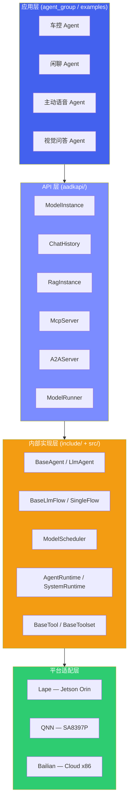
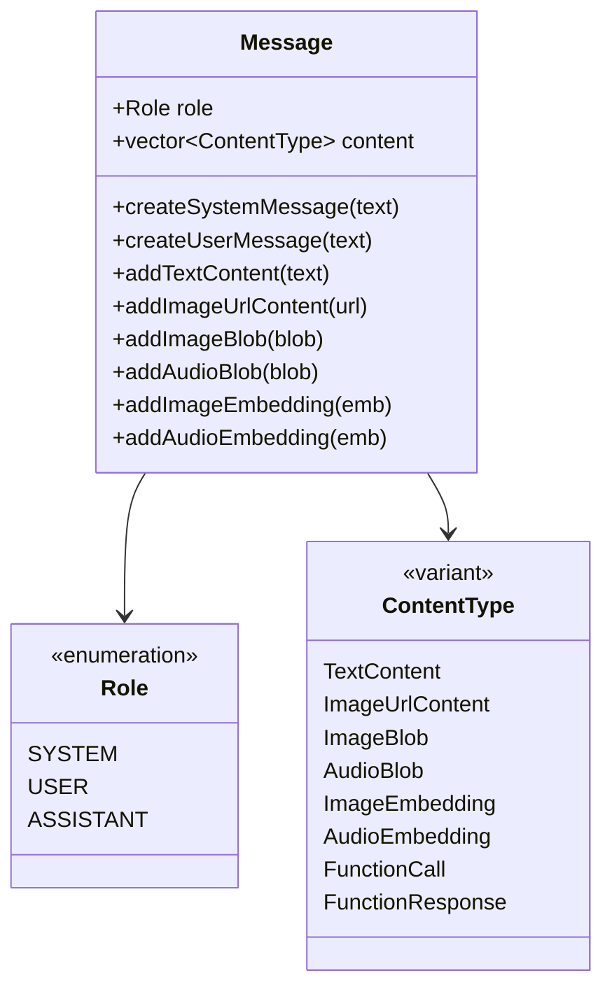
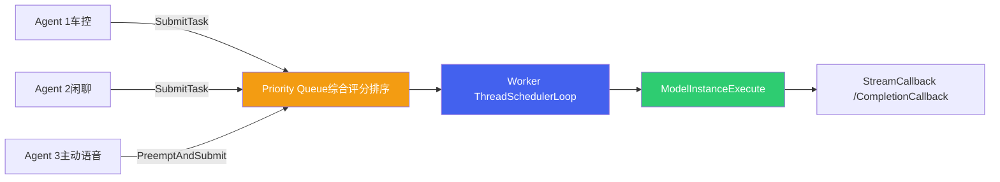
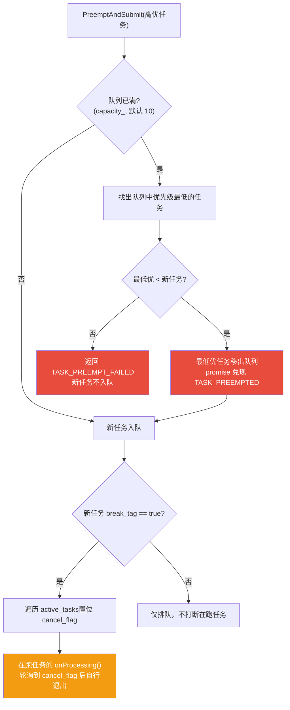
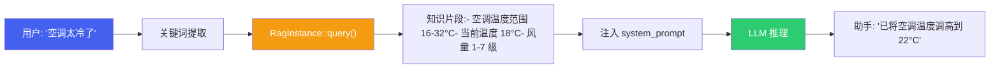

# 3. aadkcore 核心框架

*自研端侧多平台 AI Agent 核心引擎 · C++17 · `libaadkcore.so`*

> [!TIP]
> **本篇讲什么**
>
> aadkcore 的**运行时与模型主线**——从架构分层到模型实例、调度、对话历史与知识增强：
>
> - 架构总览（分层架构、代码目录结构、平台支持矩阵）
> - 统一模型接口 ModelInstance（多模态消息类型、ModelConfig 参数）
> - 模型调度器 ModelScheduler（优先级评分、饥饿窗口、抢占时的中间态处理）
> - 多音区对话管理 ChatHistory（AudioZone、关键人物系统、历史获取策略）
> - RAG 知识增强
>
> **协议与执行主线**（MCP 工具协议、A2A 协议、Agent 运行时与插件机制、LLM Flow 与 Tool 系统，以及端云协同 / 安全沙箱等设计方向）已拆分至 [协议与运行时执行](agent-protocols.html)。
>
> **代码基线**：aadkcore 仓库 `src/`（`models` / `runner` / `runtime` / `memory` / `rag` / `session` 等模块）与 `aadkapi/` 公共头文件。

## 1. aadkcore 架构总览

**aadkcore** 是自研的端侧多平台 AI Agent 核心引擎，采用 C++17 编写，编译产物为 `libaadkcore.so`。框架的核心目标是：**一套代码，屏蔽底层推理后端差异，统一 Agent 开发范式**，支持 x86 云端、Jetson Orin、高通 SA8397P 等多种平台。

### 1.1 分层架构



### 1.2 代码目录结构

| 目录 | 职责 |
| :--- | :--- |
| `aadkapi/` | 公共 API 头文件：ModelInstance、ChatHistory、RagInstance、McpServer、A2AServer、content、model\_config 等 |
| `include/agent/` | Agent 基类：BaseAgent、LlmAgent、InvocationContext、RunConfig |
| `include/flow/` | LLM 推理流水线：BaseLlmFlow、SingleFlow、BaseLlmProcessor、Instructions |
| `include/models/` | 模型配置与注册（LlmRegistry、BaseLlm） |
| `include/rag/` | RAG 知识增强：RagServiceBase 抽象基类 |
| `include/memory/` | 对话记忆管理 |
| `include/tools/` | Tool 系统：BaseTool、BaseToolset、MCP 客户端/服务端、ToolContext |
| `include/runtime/` | 运行时：AgentRuntime、SystemRuntime、AgentPlugin、ModelScheduler、ConstantIDs |
| `src/` | 所有模块的实现代码（agent、flow、models、rag、runner、runtime、tools 等子目录） |
| `examples/` | 使用示例 |

### 1.3 平台支持矩阵

| 平台 | 芯片 | 推理后端 | 构建脚本 |
| :--- | :--- | :--- | :--- |
| **x86\_64** | Intel / AMD | Bailian（云端） | `build.sh` |
| **aarch64 Orin** | Jetson Orin | Lape（本地） | `build_orin.sh` / `build_cross_for_orin.sh` |
| **aarch64 SA8397P** | SA8397P | QNN（本地） | `build_8397_linux.sh` / `build_8397_android.sh` |
| **aarch64 SA8295** | SA8295 | QNN（本地） | `build_8295_android.sh` |
| **aarch64 SA9075** | SA9075P | QNN（本地） | `build_9075_linux.sh` |

> [!TIP]
> **设计原则**
>
> 上层 Agent 代码通过 `aadkapi/` 中的统一接口（ModelInstance、ChatHistory 等）开发，无需感知底层推理后端差异。切换平台只需更换构建脚本和模型文件，Agent 业务逻辑代码零修改。

## 2. 统一模型接口 — ModelInstance

`ModelInstance`（定义于 `aadkapi/model_instance.hpp`）是面向 Agent 开发者的核心模型交互类。它封装了单个 LLM 模型实例，提供流式/非流式生成、多模态输入、LoRA 热加载等能力，屏蔽 Lape / QNN / Bailian 后端差异。

### 2.1 核心 API

| API | 返回类型 | 说明 |
| :--- | :--- | :--- |
| `streamGenerate(messages, history, callback, ...)` | `ModelResponse` | 流式生成，通过 `StreamCallback` 逐 token 回调，支持指定 lora\_id、InferParams |
| `generate(messages, callback, ...)` | `ModelResponse` | 非流式一次性生成，通过 `CompletionCallback` 返回完整结果 |
| `preprocessImage(image)` | `optional<shared_ptr<vector<float>>>` | 图像预处理为 embedding，支持 ImageBlob 和 ImageUrlContent 两种输入 |
| `preprocessAudio(audio)` | `optional<shared_ptr<vector<float>>>` | 音频预处理为 embedding，输入 AudioBlob |
| `addLora(lora_paths)` | `vector<int>` | 热加载 LoRA 适配器，返回 lora\_id 列表，后续推理可指定 lora\_id |
| `suspend(deinit) / resume()` | `void` | 暂停/恢复模型推理；suspend 时可选择是否卸载底层资源释放内存 |
| `stopGenerate()` | `bool` | 中断当前正在进行的生成任务 |
| `setConfig(config) / getConfig()` | `void / optional<ModelConfig>` | 设置/获取模型配置参数 |
| `is_ready()` | `bool` | 查询模型是否已就绪 |

> [!NOTE]
> **回调函数类型**
>
> `StreamCallback = function<void(const string& content, bool is_finished, void* user_data)>` — 流式回调，每生成一个 token 调用一次，`is_finished` 为 true 表示生成结束。
> `CompletionCallback = function<void(const string& content, void* user_data)>` — 非流式回调，生成完成后一次性返回。

### 2.2 多模态消息类型系统

消息类型定义于 `aadkapi/content.hpp`，采用 `std::variant` 实现多模态内容的类型安全表示。



| ContentType | 字段 | 说明 |
| :--- | :--- | :--- |
| `TextContent` | `text: string` | 文本内容 |
| `ImageUrlContent` | `url: ImageSource` | 图像 URL 或 Base64 Data URI |
| `ImageBlob` | `data, width, height, channels, mimetype` | 图像原始二进制数据 |
| `AudioBlob` | `data: vector<int16_t>, size, mimetype` | 音频原始二进制数据 |
| `ImageEmbedding` | `data: shared_ptr<vector<float>>, shape` | 图像 embedding（preprocessImage 输出） |
| `AudioEmbedding` | `data: shared_ptr<vector<float>>, shape` | 音频 embedding（preprocessAudio 输出） |
| `FunctionCall` | `name, arguments, index, id, type` | LLM 发起的函数调用 |
| `FunctionResponse` | `tool_call_id, name, content` | 工具调用返回结果 |

### 2.3 ModelConfig 参数

模型推理参数定义于 `aadkapi/model_config.hpp`，包含 `ModelConfig`（全局配置）和 `InferParams`（单次推理覆写）两个层级。

| 参数 | 类型 | 默认值 | 说明 |
| :--- | :--- | :--- | :--- |
| `temperature` | `double` | 0.0 | 生成温度，越高越随机 |
| `top_p` | `double` | 1.0 | 核采样概率 |
| `top_k` | `int` | 1 | Top-K 采样 |
| `max_output_tokens` | `int` | 1024 | 最大输出 token 数 |
| `seed` | `int` | 42 | 随机种子 |
| `greedy` | `bool` | true | 是否贪心解码 |
| `repetition_penalty` | `int` | 1 | 重复惩罚因子（见下方 NOTE） |
| `ebnf_path` | `string` | "" | EBNF 语法文件路径，用于约束解码 |
| `pruned_vocabulary` | `string` | "" | 裁剪词表，减少解码搜索空间 |
| `enable_jump_forward` | `bool` | false | 约束解码跳跃前进优化 |
| `config_file_path` | `string` | "" | 模型特定配置文件路径 |

> [!NOTE]
> **`repetition_penalty` 在本框架中是 `int`，不是惯例的 `float`**
>
> `model_config.hpp` 中的声明是 `int repetition_penalty = 1;`（`InferParams` 中为 `std::optional<int>`）。**默认值 1 表示"不惩罚"**，与主流推理引擎（vLLM / llama.cpp / transformers）的语义一致。
>
> 但需要注意口径差异：业界惯例把该参数定义为 `float`，常用取值是 **1.05 ~ 1.2** 这类略大于 1 的小数。`int` 类型**无法表达这一档位的微调**——可取值只有 1（不惩罚）、2（强惩罚）等整数。因此：
>
> - 从其他引擎迁移 prompt/采样配置时，**不要把 `1.05` 直接抄过来**，它会被截断为 `1`（等价于关闭惩罚）。
> - 若确实需要小数级重复惩罚，应在后端适配层（Lape / QNN / Bailian）扩展该字段类型，而不是在业务侧调这个 `int`。
> - 端侧约束解码场景下，重复问题更多依靠 `ebnf_path` / `pruned_vocabulary` 收敛输出空间，而非依赖重复惩罚。

### 2.4 流式多模态推理代码示例

```
// 1. 创建模型实例
ModelInstance model("qwen-vl-max");

// 2. 设置配置
ModelConfig config;
config.temperature = 0.7;
config.max_output_tokens = 512;
model.setConfig(config);

// 3. 构造多模态消息
auto user_msg = message::Message::createUserMessage();
user_msg.addTextContent("描述这张图片中的内容");
user_msg.addImageUrlContent(
    message::ImageUrlContent::createFromBase64(base64_data, "jpeg"));

message::MessageList messages = {
    message::Message::createSystemMessage("你是一个车载智能助手。"),
    user_msg
};
message::MessageList history; // 历史对话

// 4. 流式生成
model.streamGenerate(
    messages, history,
    [](const std::string& token, bool is_finished, void* ud) {
        std::cout << token << std::flush;
        if (is_finished) std::cout << std::endl;
    },
    nullptr  // user_data
);
```

## 3. 模型调度器 — ModelScheduler

端侧场景下，多个 Agent（车控、闲聊、主动语音等）可能并发请求同一个 LLM 模型。`ModelScheduler`（定义于 `include/runtime/model_scheduler.h`）提供基于优先级的任务队列和抢占调度，确保高优先级任务及时响应。

### 3.1 调度架构



### 3.2 任务类型与优先级

**四种任务类型**（`TaskType` 枚举）：

| TaskType | 值 | 说明 | 典型场景 |
| :--- | :--- | :--- | :--- |
| `LLM_STREAM` | 0 | 流式文本生成 | 语音助手实时对话 |
| `LLM_NON_STREAM` | 1 | 非流式生成 | 意图分类、Slot 填充 |
| `VISION_DECODE` | 2 | 视觉模型推理 | 图像理解、物体检测 |
| `AUDIO_DECODE` | 3 | 音频模型推理 | 语音编码、ASR |

**四种优先级**（`PriorityBase` 枚举）：

| 优先级 | 数值 | 适用场景 |
| :--- | :--- | :--- |
| `LOW` | 10 | 后台摘要、日志分析 |
| `NORMAL` | 20 | 闲聊对话 |
| `HIGH` | 30 | 车控指令 |
| `CRITICAL` | 40 | 紧急安全指令 |

**综合评分公式**：调度器使用 `CompareTask` 比较器，基于优先级和等待时间计算综合评分，`score` 越大越先出队：

```
score = priority * weight_priority + wait_time_ms * weight_wait * 0.001
```

`CompareTask` 的默认构造给出 `weight_priority = 2.0`、`weight_wait = 0.5`（另有一个 `weight_type` 槽位用于按任务类型加权，当前评分公式中未参与计算）。实际生效的权重取决于 `ModelScheduler` 构造时传给优先队列的 `CompareTask(wp, ww, wt)` 实参，**不同分支/配置可能不同**，调优前请先确认自己分支上的构造实参。

> [!WARNING]
> **"避免饥饿"需要限定条件：默认权重下的饥饿窗口是分钟级**
>
> 等待项确实会随时间抬高 `score`，但它的增长速率很慢。按 `weight_priority = 2.0`、`weight_wait = 0.5` 推导，一个 `LOW` 任务追平一个**刚入队**（等待时间为 0）的 `CRITICAL` 任务所需的等待时长为：
>
> ```
> 优先级分差 = (40 - 10) * 2.0            = 60 分
> 等待项速率 = 0.5 * 0.001                = 0.0005 分/ms
> 追平所需时间 = 60 / 0.0005              = 120000 ms ≈ 120 s
> ```
>
> 也就是说：只要高优先级任务持续到达，`LOW` 任务最坏要等约 **2 分钟**才有机会出队。若把 `weight_wait` 调小到 0.1（部分分支的构造实参），同一推导给出 `60 / 0.0001 = 600 s ≈ 10 分钟`。
>
> **结论**：评分公式只能保证低优先级任务**最终不会永久饿死**，不能当作"防饥饿"机制来依赖。上面这个算式应当作为**推导模板**使用——代入你自己分支的 `weight_priority` / `weight_wait` 与业务能容忍的最大等待时长，反解出需要的权重，而不是照抄 120 s 这个数字。若业务对后台任务（日志摘要、离线分析）的时效有要求，正确做法是调大 `weight_wait`（或调小 `weight_priority`）把窗口压到可接受范围。
>
> 框架实际提供的兜底是另外两条路径，而非评分公式本身：
>
> - **超时自动提权**：`SubmitTask` 同步等待结果，超过 `timeout_s`（配置项，默认 100 s）未返回时自动调用 `BoostPriority(task_id, +10)`；再等一个 `timeout_s` 仍未完成则 `StopTask` 并返回 `TASK_TIMEOUT`。
> - **提权有上限**：`BoostPriority` 会拒绝把优先级抬到 **30 以上**的请求（`p_value > 30` 直接 return），因此无法通过 boost 把任务提到 `CRITICAL` 档；且它只扫描**等待队列**，对已在执行的任务无效。

### 3.3 抢占机制与 ModelRunner

| 调度操作 | 说明 |
| :--- | :--- |
| `SubmitTask(task)` | 提交任务到优先级队列，按评分排序等待执行 |
| `PreemptAndSubmit(task)` | 中断当前正在执行的任务，立即执行高优先级任务 |
| `BoostPriority(task_id, delta)` | 动态提升指定任务的优先级（上限 30，仅作用于等待队列） |
| `StopTask(task_id, scenario_id)` | 停止指定任务 |
| `ListAllTasks()` | 列出所有任务及其状态 |

**ModelRunner 单例**（`aadkapi/model_runner.h`）是调度器的上层封装：

- `getInstance()` 全局单例，所有 Agent 共享
- `scene_model_details_`：`scene_id → ModelDetails` 映射，管理各场景的模型实例与 LoRA 配置
- `schedule_run_sync()`：提交调度任务并同步等待结果，支持指定 LoRA 名称路由到不同适配器
- `preprocessImage() / preprocessAudio()`：多模态预处理，基于 `DataMessage` 中的媒体数据

> [!NOTE]
> **`scene_id` 与 `scenario_id` 是两套 ID，不要混用**
>
> 框架里有两个长得很像但职责不同的整型 ID：
>
> | ID | 职责 | 出现位置 |
> | :--- | :--- | :--- |
> | **`scene_id`** | **模型 / LoRA 路由键**——决定某个场景用哪个基座模型、哪个 LoRA 适配器 | `ModelRunner::scene_model_details_`、`scene_named_lora_details_`、`BaseTask::scene_id`、模型配置里的 `multi_lora` 条目 |
> | **`scenario_id`** | **Agent 消息路由键**——决定 `DataMessage` 投递给哪个业务插件 | `AgentPlugin::scenario_id()`、`constant_ids.h`（`CAR_CONTROL_SCENARIO_ID` 等）、`SystemRuntime` / `msg_deliver` 分发 |
>
> 两者在 `ModelRunner` 内部会被**桥接**：推理时把 `data_message.scenario_id` 当作 `scene_id` 去查 `scene_model_details_`。由此产生一个容易踩的静默失败：
>
> - 命中 → 使用该 `scene_id` 对应的模型 / LoRA；
> - **未命中 → `getModelDetailsByScene()` 回落到 `CHITCHAT_SCENARIO_ID` 的 `ModelDetails`**（而不是报错）。
>
> 所以新增 Agent 时，`constant_ids.h` 里的 `scenario_id` 与模型配置里的 `scene_id` **必须对齐**，否则会出现"消息路由正确、但模型/LoRA 悄悄走了闲聊默认配置"的问题——现象是回答风格/能力不对，日志里却没有明显错误。
>
> 另需注意：带 LoRA 名的重载 `getModelDetailsByScene(scene_id, lora_name)` **没有这层回落**，查不到指定名字的 LoRA 时直接返回 `nullopt` 并打 `LOG_E`。

### 3.4 抢占时的任务状态与中间态处理

抢占是端侧调度里最容易误解的一环：**它不是强制 kill，也不支持断点续算**。



**关键语义**：

| 机制 | 实际行为 |
| :--- | :--- |
| **协作式取消** | `PreemptAndSubmit` / `StopTask` 只是把目标 `TaskEntry::cancel_flag` 置位（`StopTask` 对 RUNNING 任务还会调 `runner_->stopGenerate(scenario_id)`）。真正停止依赖任务的 `onProcessing(stop_all, cancel_flag)` **主动轮询**这两个原子标志并退出。**任务实现若不轮询，抢占就不会生效**。 |
| **`break_tag` 是打断开关** | 只有构造 `CommonSchedulerTask` 时传入 `break_tag = true` 的新任务，才会去遍历 `active_tasks` 置位 `cancel_flag` 打断在跑任务；否则新任务只是插队，等待当前任务自然结束。 |
| **被抢占任务不会自动重排** | 队列满时被选中的最低优任务**直接从队列移除**，其 promise 以 `error_code::TASK_PREEMPTED` 兑现。调度器不会把它重新入队，也不会自动重试——**是否重新 `SubmitTask` 由调用方决定**。 |
| **执行权是串行的** | 模型执行由 `generate_mutex_` 保护：即使 `worker_count` > 1（上限为 `hardware_concurrency()`），同一时刻也只有一个任务真正在跑模型，其余 worker 阻塞在锁上。所以抢占抢的是**队列位置与执行权**，不是并行计算资源。 |

> [!CAUTION]
> **KV Cache 与中间态：抢占即丢弃，恢复等于重跑 prefill**
>
> 调度器层**不做任何检查点（checkpoint）**。被抢占/取消的任务，其已生成的部分输出与底层推理引擎为该请求建立的 KV Cache 会随任务结束一并释放，**没有"挂起后恢复"的路径**。
>
> 因此恢复一个被抢占的任务，唯一方式是调用方重新 `SubmitTask`，而这等于**从 prefill 完整重跑**：
>
> - 代价 ≈ 一次完整 prefill。对长 prompt 任务（多模态输入、长对话历史、RAG 注入）尤其昂贵——在端侧带宽受限平台上，prefill 往往就是整个请求的延迟大头。
> - 已经流式回调给上层（如已播报给用户的 TTS 片段）的内容**不会被撤回**，重跑会产生重复输出。业务侧需要自己按 `request_id` 做幂等/去重。
> - 这正是 `break_tag` 默认关闭、只让真正紧急的任务（如安全类指令）开启打断的原因：**打断不是免费的**。
>
> 设计建议：把可打断性当作任务属性来显式声明，而不是全局打开。长任务（视觉解码、长文本生成）应保持 `break_tag = false` 靠排队解决；只有延迟敏感且 prompt 短的任务才适合开启打断。

> [!NOTE]
> **TaskResponse 结构**
>
> 每个任务完成后返回 `TaskResponse`，包含：`task_id`（任务ID）、`status`（error\_code 枚举）、`ttft`（首 token 延迟 ms）、`input_tokens`、`output_tokens`、`tokens_per_second`（吞吐量），可用于性能监控和调优。
>
> `error_code` 中与调度相关的取值：`SUCCESS(0)`、`TASK_CANCELED(1)`、`TASK_NOT_FOUND(2)`、`TASK_STOP(3)`、`TASK_ALREADY_EXISTS(4)`、`TASK_PREEMPT_FAILED(5)`、`TASK_PREEMPTED(6)`、`TASK_TIMEOUT(7)`、`TASK_UNKNOWN_ERROR(8)`，以及模型侧的 `MODEL_NOT_FOUND(-1)`、`MODEL_NOT_READY(-2)`、`MODEL_SUSPENDED(-3)`、`MODEL_GEN_STOPPED(-4)`。**调用方必须区分 `TASK_PREEMPTED` 与 `TASK_CANCELED`**：前者意味着"被更高优任务挤掉、可考虑重提"，后者意味着"被显式停止、通常不应重提"。

## 4. 多音区对话管理 — ChatHistory

车载座舱场景下，不同座位的乘员可能同时与 AI 助手对话。`ChatHistory`（定义于 `aadkapi/chat_history.hpp`）实现了按音区隔离的对话历史管理，支持关键人物识别与指代消歧。

### 4.1 音区枚举 AudioZone

| 枚举值 | zone\_id | 说明 |
| :--- | :--- | :--- |
| `InvalidZone` | 0 | 无效音区 |
| `FrontLeftZone` | 1 | 主驾（`FrontZone` 是其别名，同等于 1） |
| `FrontRightZone` | 2 | 副驾 |
| `MiddleLeftZone` | 4 | 左后排 |
| `MiddleRightZone` | 8 | 右后排 |
| `BackLeftZone` | 16 | 左后（扩展音区） |
| `BackRightZone` | 32 | 右后（扩展音区） |
| `AllZone` | 0xFF | 所有音区 |

> [!NOTE]
> **这是音区 ID 的权威定义**
>
> 上表逐值对应 `aadkapi/chat_history.hpp` 中的 `enum AudioZone`，是全站音区 ID 的**唯一权威来源**。取值是**位掩码风格**（1/2/4/8/16/32），因此可以按位或组合表达"多个音区"，`AllZone = 0xFF` 是全音区掩码。
>
> 其他文档（如 [场景 Agent 应用](agent-group.html) 的 `voice_zone_map_`）若出现音区映射，**以本表为准**；不一致时应视为待修正的文档缺陷，而不是两套并存的口径。
>
> 另需注意：`MiddleLeftZone(4)` / `MiddleRightZone(8)` 对应的是**左后/右后**排，而 `BackLeftZone(16)` / `BackRightZone(32)` 是更靠后的扩展音区。字符串与 ID 的互转由 `audioZoneToString()` / `stringToAudioZoneId()` 提供，后者目前只识别 `"主驾"/"副驾"/"左后"/"右后"/"ALL"` 五个字面量，**未覆盖 16/32 两个扩展音区**——传入其他字符串会落到 `InvalidZone`。

**ChatMessage 三种类型**：

| 类型 | 工厂方法 | 说明 |
| :--- | :--- | :--- |
| `query` | `ChatMessage::query(content, zone, call_id, ts)` | 用户语音输入 |
| `response` | `ChatMessage::response(content, zone, call_id, ts)` | 模型回复 |
| `info` | `ChatMessage::info(content, call_id, ts, zone)` | Agent 执行过程中需要加入上下文的系统信息 |

### 4.2 关键人物系统 — UserInfo


**UserInfo** 结构体包含：

- `audio_zone`：关键人物所在的座位音区
- `alias`：识别到的人名别名
- `attributes`：模型识别的关键人物特征（外貌、神态等）
- `summarize`：该人物的历史对话总结
- `timestamp`：UserInfo 创建时间

核心方法 `detectUserInfo(message)` 从用户 query 中检测是否包含人物信息；`addQuery()` 在添加 query 时可自动触发关键人物识别，并返回识别结果和历史对话。

### 4.3 历史获取策略

| 方法 | 参数 | 说明 |
| :--- | :--- | :--- |
| `getHistoryByNum(rounds)` | `size_t rounds` | 获取最近 N 轮对话（含 query/response/info） |
| `getHistoryByPeriod(start, end)` | `int64_t start_time, end_time` | 获取指定时间段的对话；-1 表示不限；可用 alias 替代音区名 |
| `getHistoryByTokenLimit(limit, counter)` | `size_t limit, optional<function>` | 获取不超过 token 限制的对话；支持自定义 token 计数器 |
| `getHistoryByUserinfo(alias, start, end)` | `string alias, int64_t` | 获取特定关键人物所在音区的对话历史 |
| `removeHistoryByAudioZone(zone, start, end)` | `int zone, int64_t` | 删除指定音区的对话记录 |
| `removeUserinfoByAlias(alias, remove_history)` | `string, bool` | 删除关键人物，可选同时删除其对话记录 |
| `clear()` | - | 清空所有历史记录和 UserInfo |

> [!WARNING]
> **默认 Token 估算是字符级启发式，不是真 tokenizer**
>
> `getHistoryByTokenLimit` 在不传入自定义 `token_counter` 时，回落到 `src/memory/chat_history.cpp` 中的 `estimate_tokens()`。它先按 UTF-8 把文本分成三类字符，再分别加权求和：
>
> ```
> estimated = 中文字符数 * 1.8      // U+4E00 ~ U+9FFF，每个汉字 ≈ 1.8 token
>           + 英文字母数 / 4.0      // 每 4 个 ASCII 字母 ≈ 1 token
>           + 其他字符数 / 2.0      // 数字、标点、emoji 等，每 2 个 ≈ 1 token
> 返回 round(estimated)
> ```
>
> 三点需要注意：
>
> 1. **中文是 1.8 token/字，不是 1:1**。这个系数偏保守（高估），用它裁剪历史会**比实际更早截断**——好处是不会超模型上下文，代价是可用轮数变少。
> 2. **英文是"4 个字母 ≈ 1 token"**（即 0.25 token/字符），方向与主流 BPE 分词器一致。注意它只统计 `isalpha` 的 ASCII 字母，数字和标点被归入"其他"按 2:1 计。
> 3. **多字节解析只完整支持 3 字节 UTF-8**（即基本汉字区）。emoji、4 字节字符会被整体归为"其他"并按首字节粗略跳过，计数不精确。
>
> 因此这个估算**只适合做"别超上下文"的粗裁剪**。若业务对 token 预算敏感（例如要在固定预算内尽量多塞历史、或要与后端 KV Cache 占用对齐），**必须传入与实际 tokenizer 对齐的 `token_counter`**，不要依赖默认值。

## 5. RAG 知识增强

`RagInstance`（定义于 `aadkapi/rag_instance.hpp`）为 Agent 提供可插拔的 RAG（Retrieval-Augmented Generation）能力。通过构造时指定 `service_name`，内部路由到对应的 `RagServiceBase` 实现。

| API | 返回类型 | 说明 |
| :--- | :--- | :--- |
| `RagInstance(service_name)` | - | 构造函数，根据服务名获取对应 RAG 实现 |
| `init(config_path)` | `bool` | 初始化 RAG 服务，加载索引和配置 |
| `query(query_str)` | `vector<string>` | 检索与查询相关的知识片段列表 |
| `isReady()` | `bool` | 检查 RAG 服务是否就绪 |



**可插拔架构**：`RagServiceBase` 是抽象基类，不同场景可实现不同的 RAG 服务（如车控知识库、用户手册知识库等），通过 `service_name` 注册和路由。

```
// 车控 RAG 使用示例
RagInstance rag("carcontrol_rag");
rag.init("/path/to/rag_config.json");

if (rag.isReady()) {
    auto results = rag.query("空调温度调节");
    // results: ["空调温度范围16-32°C", "当前温度18°C", ...]
    // 将 results 拼接到 system_prompt 中供 LLM 参考
}
```

> [!TIP]
> **下一篇：协议与运行时执行**
>
> 本篇覆盖的是"模型 / 对话 / 调度"主线。模型能力如何对外暴露为工具、多个 Agent 之间如何协作、业务插件如何被加载与卸载、一次请求在 Flow 流水线里如何走完 Tool 调用循环——见 [协议与运行时执行](agent-protocols.html)（MCP、A2A、AgentRuntime / AgentPlugin、BaseLlmFlow / BaseTool，以及端云协同与安全沙箱的设计方向）。
