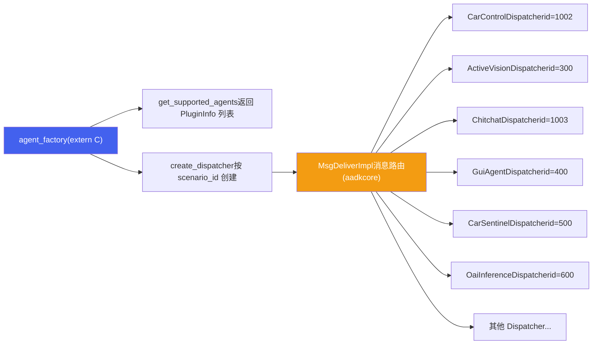
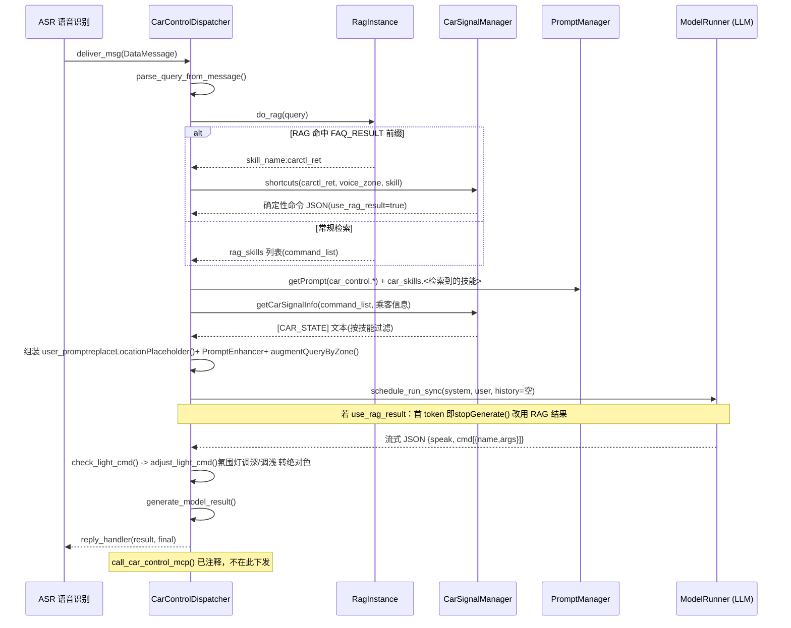
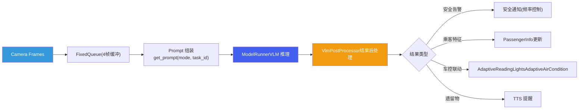
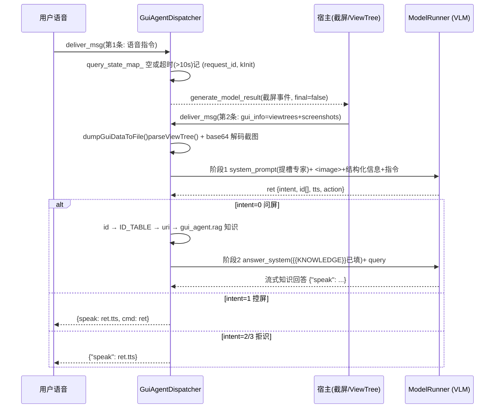
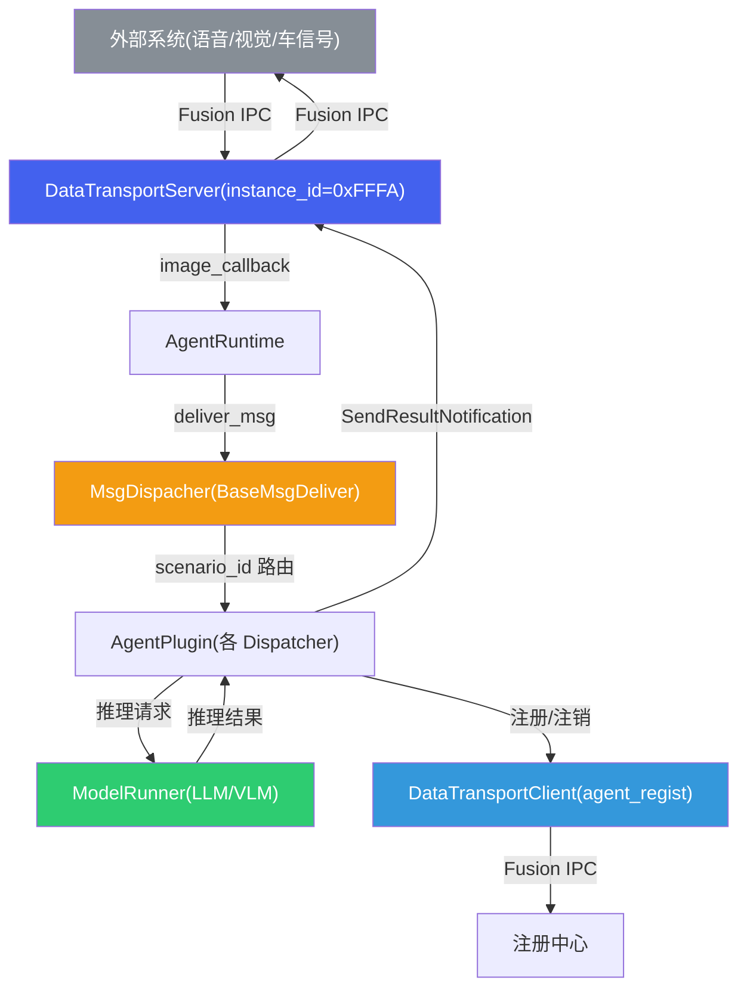

# 场景 Agent 应用

*agent\_group 场景 Agent 插件库 · 基于 aadkcore AgentPlugin 接口 · `libagent_group.so`*

> [!TIP]
> **本篇讲什么**
>
> agent\_group（基于 aadkcore `AgentPlugin` 接口的场景 Agent 插件库，编译为 `libagent_group.so`、运行时动态加载）的各场景实现：
>
> - 架构总览（插件定位、Scenario ID 分配、条件编译体系、runtime\_config）
> - 车辆控制 Agent、主动视觉 Agent、闲聊 Agent、GUI Agent、其他场景 Agent
> - Prompt 模板工程、数据通路与 Fusion 通信
>
> **代码基线**：agent\_group 仓库 `src/`（`car_control_agent` / `active_vision_agent` / `chit_chat_agent` / `gui_agent` / `agent_factory` / `fusion` / `common` 等）。

## 1. agent\_group 架构总览

### 1.1 插件集合定位

`agent_group` 是基于 aadkcore `AgentPlugin` 接口实现的场景 Agent 插件库，编译产物为 `libagent_group.so`。它通过 `extern "C"` 导出工厂函数 `get_supported_agents` 和 `create_dispatcher`，供宿主在运行时动态加载和实例化各场景 Agent。每个 Agent 对应一个唯一的 `scenario_id`，由宿主侧的消息路由器按 scenario\_id 分发到对应 Dispatcher 实例。



> [!WARNING]
> **代码里有两套并行的消息路由器，能力不对等（勿混为一谈）**
>
> | | `MsgDeliverImpl`（aadkcore `runtime/src/system_agent/msg_deliver_impl.cpp`） | `MsgDispacher`（agent\_group `src/common/msg_dispatcher.cpp`） |
> | :--- | :--- | :--- |
> | Dispatcher 来源 | `dlopen` 插件 → `get_supported_agents` 列表 → 逐个 `create_dispatcher` 建 `dispatchers_` map | 构造函数里**直接 `make_unique` 硬编码 4 个**（ActiveVision / CarControl / Chitchat / CarSentinel），**不走工厂** |
> | 可路由的 scenario | 工厂注册表里的全部 | 仅 if-else 硬编码的 300 / 1002 / 1003 / 字面量 500；VideoChat、ProactiveSpeech 分支被 `#if 0` 掉；**GUI(400)、OAI(600)、岚图三 Agent(1100/1200/1300) 无分支** |
> | 线程模型 | `critical_thread_worker_`（队列上限 3）+ `main_thread_worker_` 两级，`is_high_priority_task()` 分流（见 §8.2） | 单个 `main_thread_worker_`（名 `"dispatcher_thread_worker"`），无优先级分流 |
> | 使用方 | SystemAgent / android\_sdk 形态（插件式，主线） | `agent_runtime_main` 独立进程形态（见 §8.1） |
>
> 因此「插件工厂 + 动态注册」这条链路只在 `MsgDeliverImpl` 侧成立；`MsgDispacher` 是一条**绕过插件机制的旁路**，新增 Agent 时若只加工厂 case、忘了在 `MsgDispacher::deliver_msg` 里加 if 分支，独立进程形态下该 Agent 收不到消息。`MsgDispacher` 另有两处不一致值得注意：`set_data_dump_flag()` 只把开关传给 `active_vision_dispatcher_`（CarControl / Chitchat / CarSentinel 不受控）；`scenario_ids()` 返回 `{100, 200, 300, 1002, 1003}`，其中 100(VideoChat)、200(ProactiveSpeech) 既未构造也无路由分支——**对外声明了服务不了的 scenario**。`regist_to_server()` / `unregist_from_server()` 目前是 `// TODO` 空实现直接 `return true`。

> [!NOTE]
> **插件加载失败与降级**
>
> AgentRuntime 启动时动态加载 `libagent_group.so` 并调用工厂函数 `get_supported_agents` / `create_dispatcher`。若 .so 缺失、导出符号缺失，或某 scenario\_id 的 `create_dispatcher` 返回空，AgentRuntime 记录错误并**跳过该插件，不影响其余插件加载**——按项目编译开关裁剪本就是常态，缺哪个 Agent 就少哪个 scenario。运行期某 Dispatcher 处理异常时，该条消息被丢弃并记日志，不会拖垮整个 AgentRuntime；对应 scenario 退化为不可用，其余 scenario 正常服务。

> [!WARNING]
> **插件与宿主必须同工具链 / 同 STL ABI（`extern "C"` 不解决 ABI）**
>
> 工厂函数虽以 `extern "C"` 导出（解决符号名修饰），但接口本身**跨 .so 边界传递 STL 与多态 C++ 类型**：`PluginInfo` 含 `std::string name`；`GetSupportedAgentsFunc = void(*)(std::vector<PluginInfo>&)`、`CreateDispatcherFunc = void(*)(int, const char*, std::unique_ptr<AgentPlugin>&)` 直接传 `std::vector` / `std::unique_ptr` 引用；`AgentPlugin` 是带虚函数的多态类。这些类型的内存布局由 **libstdc++ ABI 与编译选项**决定，`extern "C"` 只固定符号名、**不保证 ABI 兼容**。因此 `libagent_group.so` 与 `libaadkcore.so`（宿主）**必须用同一工具链、同一 libstdc++ ABI（`_GLIBCXX_USE_CXX11_ABI` 取值一致）、同一组编译选项**构建，否则会出现 `std::string` 布局错位、虚表偏移不一致、跨 .so 释放崩溃等隐蔽问题。这也是 [部署](deploy.html) §4.1 强调「核心库源码平台无关、但产物按平台交叉编译（ABI/依赖绑定）」的原因。
>
> **生命周期**：头文件声明了 `DestroyDispatcherFunc = void(*)(std::unique_ptr<AgentPlugin>)`、插件侧也导出了 `destroy_dispatcher`，但**宿主侧未见调用**——Dispatcher 的 `unique_ptr` 实际由持有方（AgentRuntime/MsgDispacher）析构释放。由此推论：插件 .so 一旦加载并创建了带**后台线程**的 Dispatcher，就**不可 `dlclose`**（线程仍在执行 .so 内代码，卸载会导致崩溃）；需要「卸载插件」的场景应改为进程级重启，而非运行期 dlclose。

### 1.2 Scenario ID 分配表

所有 scenario\_id 统一定义在 `aadkcore/include/runtime/constant_ids.h` 中，保证跨模块一致性：

| 常量名 | scenario\_id | Agent 名称 | 说明 |
| :--- | :--- | :--- | :--- |
| `VIDEOCHAT_SCENARIO_ID` | 100 | VideoChat | 视频聊天 |
| `PROACTIVE_SPEECH_SCENARIO_ID` | 200 | ProactiveSpeech | 主动语音 |
| `ACTIVE_VISION_SCENARIO_ID` | 300 | ActiveVision | 主动视觉 |
| `RAIN_DECTION_SCENARIO_ID` | 400 | RainDection（某 OEM） | 雨天检测 / GUI Agent |
| `SPORT_MODE_SCENARIO_ID` | 500 | SportMode（某 OEM） | 运动模式 / 车辆哨兵 |
| `OAI_INFERENCE_SCENARIO_ID` | 600 | OaiInference | OpenAI 兼容推理接口 |
| `WELCOME_MODE_SCENARIO_ID` | 700 | WelcomeMode | 迎宾模式 |
| `SYSTEM_AGENT_SCENARIO_ID` | 1001 | SystemAgent | 系统 Agent |
| `CAR_CONTROL_SCENARIO_ID` | 1002 | CarControl | 车辆控制 |
| `CHITCHAT_SCENARIO_ID` | 1003 | Chitchat | 闲聊对话 |
| `INCAR_ITEM_DETECT_SCENARIO_ID` | 1100 | InCarItemDetect | 车内物品检测 |
| `DRESS_DETECT_SCENARIO_ID` | 1200 | DressDetect | 着装检测 |
| `OUTCAR_QA_SCENARIO_ID` | 1300 | OutCarQA | 车外问答 |
| `BROADCAST_SCENARIO_ID` | 65535 | Broadcast | 广播消息（特殊） |

> [!NOTE]
> **ID 复用说明**
>
> scenario\_id 400 和 500 存在条件编译复用：在 `ENABLE_PORSCHE` 模式下分别用于 RainDection 和 SportMode；在 `ENABLE_DEVICEAI_BASE` 模式下通过 `#define GUI_AGENT_SCENARIO_ID 400` 和 `#define CAR_SENTINEL_AGENT_SCENARIO_ID 500` 重新映射给 GuiAgent 和 CarSentinel。
>
> **拼写说明（sic）**：`RAIN_DECTION`（而非 DETECTION）、`FEATURE_SOPRT_MODE`（而非 SPORT）、`MsgDispacher`（而非 MsgDispatcher，真实类名）是代码中的**原始标识符拼写**，本文照抄代码、不作"纠正"，以便与源码一一对应。

> [!WARNING]
> **`runtime::CAR_SENTINEL_SCENARIO_ID` 并不存在——开 `FEATURE_CAR_SENTINEL` 会编译失败**
>
> `constant_ids.h` 里**没有** `CAR_SENTINEL_SCENARIO_ID`（只有 `SPORT_MODE_SCENARIO_ID = 500`）。但 `agent_factory.cpp` 的 `create_plugin()` 写的是 `case runtime::CAR_SENTINEL_SCENARIO_ID:`——该标识符在 `namespace runtime` 下无定义。全仓库唯一的同名定义是 aadkcore `system_agent_dispatcher.cpp` 里的**文件级** `#define CAR_SENTINEL_SCENARIO_ID 500`（不在 `runtime` 命名空间、也不对外可见），救不了工厂这一行。
>
> 而 `CMakeLists.txt` 的 `option(FEATURE_CAR_SENTINEL ... ON)` **默认是 ON**——即默认配置下 `agent_factory.cpp` 引用了一个不存在的枚举。当前能编过，是因为实际构建脚本显式传了 `-DFEATURE_CAR_SENTINEL=OFF`（见 §1.3）。这是一个**靠构建参数掩盖的潜在编译断裂**：任何人去掉那个 OFF 就会踩到。修法是把 500 补进 `constant_ids.h`（并解决与 `SPORT_MODE_SCENARIO_ID` 的撞车），或让工厂改用 `CAR_SENTINEL_AGENT_SCENARIO_ID` 宏——注意该宏只在 `#ifdef ENABLE_DEVICEAI_BASE` 内定义，而 `create_plugin` 的 sentinel case 在该 ifdef **之外**，两者作用域也对不上。
>
> 相关的还有：`GuiAgentDispatcher::scenario_id()` 直接 `return 400;`、`CarSentinelDispatcher::scenario_id()` 直接 `return 500;`——**都是硬编码字面量，不走常量也不走宏**（前者上方还留着 `//return runtime::ACTIVE_VISION_SCENARIO_ID;` 的复制残留）。于是「400/500 归谁」这件事在 `constant_ids.h`、`agent_factory.cpp` 的 `#define`、各 Dispatcher 的 `scenario_id()` 三处各写一遍，靠人工保持一致。

### 1.3 条件编译体系

agent\_factory.cpp 通过多级条件编译宏控制 Agent 的编译包含，实现不同车型和功能的灵活裁剪：

| 宏定义 | 控制范围 | 包含的 Agent |
| :--- | :--- | :--- |
| `ENABLE_DEVICEAI_BASE` | 基础 Agent 集合（仅非 Android 构建定义） | include 块内：ActiveVision, GuiAgent, CarControl, VideoChat；注册表内另含 Chitchat, OaiInference, CarSentinel（三者 include 在该块**之外**，但注册条目只在此分支） |
| `ENABLE_PORSCHE` | 某 OEM 定制（Android 非岚图） | RainDection, SportMode, WelcomeMode |
| `ENABLE_LANTU_SDK` | 岚图 OEM 定制（Android，见 [岚图项目](../lantu/genai-architecture.html)） | DressDetect, InCarItemDetect, OutCarQA |
| `FEATURE_CAR_CONTROL` | 车辆控制独立开关 | CarControlDispatcher |
| `FEATURE_ACTIVE_VISION` | 主动视觉独立开关 | ActiveVisionDispatcher |
| `FEATURE_CHIT_CHAT` | 闲聊独立开关 | ChitchatDispatcher |
| `FEATURE_GUI` | GUI Agent 独立开关 | GuiAgentDispatcher |
| `FEATURE_OAI_INFERENCE` | OAI 推理独立开关 | OaiInferenceDispatcher |
| `FEATURE_CAR_SENTINEL` | 车辆哨兵独立开关 | CarSentinelDispatcher |
| `FEATURE_RAIN_DECTION` | 雨天检测独立开关 | RainDectionDispatcher |
| `FEATURE_SOPRT_MODE` | 运动模式独立开关 | SportModeDispatcher |
| `FEATURE_WELCOME_MODE` | 迎宾模式独立开关 | WelcomeModeDispatcher |
| `FEATURE_VIDEO_CHAT` | 视频聊天独立开关 | VideoChatDispatcher |

> [!NOTE]
> **宏包含 = 编译期候选，≠ 实际注册，≠ 实际启用（三道闸门）**
>
> 上表「包含的 Agent」只表示该宏打开后**源码进入编译候选集**。一个 Agent 要真正能收消息，还得再过两道闸：
>
> 1. **`create_plugin()` 里有对应 `case`**——否则 `create_dispatcher` 返回空。
> 2. **`get_supported_types_impl()` 的返回列表里有对应条目**——`MsgDeliverImpl::init()` 是**遍历 `get_supported_agents` 的返回值**去逐个 `create_dispatcher` 的，不在列表里就永远不会被实例化，哪怕 case 存在。
>
> 判断某 Agent 是否真在跑，必须同时核对「宏候选 + FEATURE 开关 + create\_plugin case + supported\_types 条目」四者，只看宏包含表会得出错误结论。
>
> **典型反例 VideoChat**：它的 `include` 并**没有**被注释（`#ifdef FEATURE_VIDEO_CHAT` 正常包裹，且 CMake `option(FEATURE_VIDEO_CHAT ... ON)` 默认开），源码确实编进 .so；但 `create_plugin()` 里**没有 VideoChat 的 case**、`get_supported_types_impl()` 里**没有 video\_chat 条目**、`MsgDispacher::deliver_msg` 里的 VideoChat 分支还被 `#if 0` 掉——三处全断，所以它是**编进去但永远注册不上**的死代码。真正被注释掉 include 的是 ProactiveSpeech（`//#include "proactive_speech_agent/..."`，其 .cpp 也在 `add_library` 源列表里被注释）。

> [!WARNING]
> **三种产品形态在注册层互斥，不是叠加关系**
>
> `get_supported_types_impl()` 整体是一个 `#ifdef ENABLE_DEVICEAI_BASE ... #else ... #endif` 的**二选一**结构，而三个形态宏由 `CMakeLists.txt` 按构建目标互斥地定义：
>
> | 形态 | 触发条件（CMake） | `get_supported_agents` 实际返回 |
> | :--- | :--- | :--- |
> | DeviceAI 基线 | `if(NOT ENABLE_ANDROID_NDK)` → `-DENABLE_DEVICEAI_BASE=1` | active\_vision(300), car\_control(1002), chit\_chat(1003), oai\_inference(600), gui\_agent(400), car\_sentinel(500) |
> | 某 OEM（Android 非岚图） | `ENABLE_ANDROID_NDK AND NOT ENABLE_LANTU_SDK` → `-DENABLE_PORSCHE=1` | chit\_chat(1003), rain\_dection(400), sport\_mode(500), welcome\_mode(700), oai\_inference(600) |
> | 岚图 SDK（Android） | `ENABLE_ANDROID_NDK AND ENABLE_LANTU_SDK` → `-DENABLE_LANTU_SDK=1` | chit\_chat(1003), oai\_inference(600), dress\_detect(1200), incar\_item\_detect(1100), outcar\_qa(1300) |
>
> 两个容易踩的后果：
>
> - **`ENABLE_DEVICEAI_BASE` 关闭时，CarControl / ActiveVision / GUI 连 `create_plugin` 的 case 都编不出来**（这三个 case 被包在 `#ifdef ENABLE_DEVICEAI_BASE` 内），即使 `FEATURE_CAR_CONTROL` 等仍为 ON、源码仍在编译。岚图形态正是如此。
> - **岚图三 Agent 只在 `#else` 分支注册**。它们的 `create_plugin` case 挂在 `#ifdef ENABLE_LANTU_SDK` 下（不受 DEVICEAI\_BASE 约束），但注册条目只在非 DEVICEAI\_BASE 分支——若哪天同时打开两个宏，会出现「能创建、但不在 supported 列表、因而不被创建」的静默失效。
>
> 实际构建脚本还会再收一道。以岚图 8397 Android 构建为例，显式传入 `FEATURE_CAR_CONTROL=OFF`、`FEATURE_CHIT_CHAT=OFF`、`FEATURE_ACTIVE_VISION=OFF`、`FEATURE_GUI=OFF`、`FEATURE_CAR_SENTINEL=OFF`、`FEATURE_OAI_INFERENCE=ON`、`ENABLE_CARCONTROL_RAG=OFF`——最终 .so 里**只有 oai\_inference + 岚图三 Agent 四个 scenario 在册**，车控/闲聊/主动视觉/GUI 全部编出。这也解释了为何岚图形态的多模态能力集中在三个独立 Agent 上（见 [岚图项目](../lantu/genai-architecture.html)），而非复用主线的 CarControl/ActiveVision。
>
> 另注：`get_supported_agents()` 开头有 `if (!out_vec.empty()) return;` 的幂等保护——宿主若复用同一个 vector 多次调用，第二次起不会覆盖已有内容。

### 1.4 runtime\_config.json 配置

运行时配置**按平台目录组织**（`runtime/data/config/` 下 `8295/`、`8397/`、`9075/`、`orin/` 各一套），平台选择靠**选目录**而非配置文件内字段。模型角色由 `multi_lora_runtime_config.json` 的两套模型参数承载：`model_config`（**主对话模型**，CarControl / Chitchat 使用）与 `active_model_config`（**主动视觉模型**，ActiveVision 使用，可独立于主模型）；同目录的 `runtime_config.json` 只承载调度参数（worker\_count / capacity / timeout\_s 等）。

> [!NOTE]
> **以 deploy.md 为准**
>
> 完整字段说明、各平台取值、多 LoRA 配置（`multi_lora_runtime_config.json`）与 scene\_id ↔ Agent ↔ LoRA 映射见 [部署与运行时配置](deploy.html) §4.3（deploy 为主），本篇不再重复。模型口径（主对话模型 / 主动视觉模型 / 多 LoRA 基座）亦以该节为准。

## 2. 车辆控制 Agent -- CarControlDispatcher

`CarControlDispatcher`（scenario\_id=1002）是座舱中使用频率最高的 Agent，负责将用户的自然语言指令转化为结构化的车辆控制命令（`{speak, cmd[{name,args}]}`）。

> [!WARNING]
> **MCP 下发在当前树里是断开的**
>
> `call_car_control_mcp()` 函数**存在**（`carcontrol_dispatcher.cpp` 内实现，走 `McpSessionManager`），但流式回调里唯一的调用点被**注释掉了**（`// call_car_control_mcp(total_result);`）。也就是说：Dispatcher 产出结构化命令 JSON 后，**只把结果通过 `reply_handler` 回给宿主，并不自己下发车控**——实际执行由下游（宿主/车控服务）接手。
>
> 读代码或做端到端联调时别按「Agent 直接控车」建模。MCP 通道的传输形态与会话生命周期见 [Agent 协议](agent-protocols.html) §1；该节同时指出 Tool 执行循环受 `USE_TOOL` 门控，而该宏在仓库中从未定义——即「解析 FunctionCall → 执行 → 回灌再推理」这条自动闭环当前也不成立。

### 2.1 核心流程



> [!TIP]
> **RAG 不只是「检索技能喂 prompt」，它还是一条绕过 LLM 的确定性快路径（`RAG_BYPASS`）**
>
> `do_rag()` 有两种产出，代码里用 `#define RAG_BYPASS` 无条件打开第二种：
>
> 1. **常规检索**：返回技能名列表 `command_list`，用于**按需拼装 system prompt**（见 §2.4）与过滤车辆状态。
> 2. **FAQ 直达**：若首条结果以 `[FAQ_RESULT]:` 开头，则解析出 `skill_name:carctl_ret`，把 `ac_sync` 归一到 `air_condition`，再调 `car_signal_manager_->shortcuts(carctl_ret, voice_zone, skill_name)` **直接合成最终命令 JSON**，置 `use_rag_result = true`。
>
> 关键在第二步之后的处理：推理**仍然照常发起**，但在流式回调收到**第一个 token** 时立刻 `model_runner_->stopGenerate(scenario_id())` 中止生成，改发 RAG 合成的结果。这是一种「投机执行 + 提前中止」的时延优化——高频固定说法（如「打开车窗」「座椅加热」）不必等完整 prefill/decode 就能返回，同时保留了 LLM 兜底。
>
> `shortcuts()` 是**按技能分派的规则式槽位→命令转换器**（`prompt_convert.h`），当前覆盖 8 个技能：`car_demisting`、`rearview_mirror_heating`、`seat_heating`、`seat_ventilation`、`steering_wheel_heating`、`car_window`、`ambient_light`、`car_reading_light`；未命中的 feature 返回空串，自动退回 LLM 路径。
>
> **设计权衡**：这条快路径同时是**唯一一处真正绕过概率模型的确定性车控出口**——它读当前车辆状态、按规则算目标值，不存在幻觉技能名或越界参数的问题。代价是每加一个技能就要在 `prompt_convert.h` 里手写一套 `shortcuts()`，且规则与 prompt 里的技能描述**两处维护、容易漂移**。反过来看，这也说明 §2.2 WARNING 提的「确定性校验层」并非无从落地：`shortcuts()` 已经是一个可复用的范式，缺的是把它从「快路径特例」推广成「LLM 输出的统一后置闸口」。
>
> 注意 `ENABLE_CARCONTROL_RAG` 是独立构建开关，岚图 8397 Android 构建传的是 `OFF`（见 §1.3）——该形态下这条快路径整体不存在。

### 2.2 意图分类：声明的枚举 vs 实际的路由

`CarControlDispatcher`（以及 Chitchat / OutCarQA / RainDection / SportMode / WelcomeMode / VideoChat / CarSentinel 共 8 个 Dispatcher 的头文件）都声明了同一个 `TypeClass` 枚举：

| 枚举值 | 数值 | 语义 |
| :--- | :--- | :--- |
| `REJECTED` | 0 | 拒绝执行 |
| `CAR_CONTROL` | 1 | 车辆控制指令 |
| `ONLINE_SEARCH` | 2 | 联网搜索 |
| `SUMMARY` | 3 | 总结摘要 |
| `CHAT` | 4 | 普通闲聊 |

> [!WARNING]
> **`TypeClass` 是声明了但从未使用的「死枚举」，真实意图走的是另一套**
>
> 全仓库 grep 不到任何 `TypeClass::X` 的引用、也没有以 `TypeClass` 为类型的变量——它只是被复制粘贴进 8 个头文件的残留。真实链路用的是 aadkcore 的 `aadk::IntentionType` + `intention_map_ = aadk::get_intention_map()`：Dispatcher 把一个 `IntentionType` 经 `intention_map_` 映射成字符串，塞进响应 `data.intention` 字段回给宿主，**由宿主决定后续动作**。
>
> 更关键的是，在 `carcontrol_dispatcher.cpp` 里这个 `intention_type` 被**硬编码为 `aadk::INTENTION_CAR_CONTROL`**——原本「`is_cant_control()` 命中则置 `INTENTION_NOT_SUPPORT`」的分支整段被 `#if 0` 掉。也就是说：
>
> - 车控 Agent **不会**把请求分类成 `CHAT` 再转发给闲聊 Agent（所谓「意图路由闭环」在代码里不存在，见 §4.4）；
> - `is_cant_control()` 用 `total_result.find("\"name\":\"cant_control\"")` 做子串匹配——这个「多一个空格就漏判」的脆弱判断**确实存在，但它当前是死代码**，真正的现状是「无论模型输出什么都按车控意图上报」。后者比前者更值得警惕：连「不可控」这一档都被编译掉了。

> [!WARNING]
> **车控执行路径缺确定性校验层（安全相关，最重要）**
>
> 代码证实 `carcontrol_dispatcher.cpp` 对 LLM 输出**没有语义/安全级的确定性校验**：
>
> - 解析出 `cmd[{name,args}]` 后**没有技能名白名单**（LLM 编造一个不存在的技能名也会被透传）、**没有参数范围校验**（温度/风速/音量越界不拦）、**没有车辆状态前置条件硬校验**（如后备箱需 P 档、行驶中禁某些操作）；
> - 唯一的确定性后处理是 `check_light_cmd()` → `adjust_light_cmd()`：命中氛围灯「调深/调浅」时，用 `adjustColor()` 把相对指令换算成绝对颜色（分量 clamp 到 255）。它证明「LLM 输出后再过一层确定性逻辑」这条链路是通的，但**只覆盖氛围灯颜色这一个技能**，不构成安全闸口。
>
> 后果：§2.3 的安全规则（后备箱需 P 档、儿童/老人温度风速限制、行驶中禁某些操作）**全部写在 prompt 里、靠 LLM 自觉遵守**；§2.4 TIP 的 EBNF 约束只保证**输出格式合规**，而**格式合规 ≠ 语义/安全合规**。LLM 是概率系统，不能把安全前置条件托付给 prompt。
>
> **正确做法**：LLM 输出在回传宿主（或恢复 `call_car_control_mcp()` 下发）前，**必须经一层确定性校验**——(1) 技能名白名单（只放行 `car_skills` 已定义的技能）；(2) 参数范围/枚举校验（按技能 schema 卡 temperature、level、volume 等边界）；(3) 车辆状态前置条件硬校验（读 `CarSignalManager` 的档位/车速/儿童锁等信号，不满足即拒绝并回话术）。**安全前置条件必须由车控执行侧硬校验，不能只写 prompt**；prompt 规则可作为「软引导」减少无谓请求，但最后一道闸必须是确定性的。落地范式现成就有：§2.1 TIP 的 `shortcuts()` 规则转换器，以及 `adjust_light_cmd()` 的后置改写——把这类确定性逻辑从「个别技能特例」推广成「所有 LLM 输出的统一后置闸口」即可。若恢复 `is_cant_control` 一类判断，也应改为对解析后 JSON 的结构化比对（取 `cmd[].name` 字段），而非子串匹配。

### 2.3 车控技能精华表

技能定义在 `car_control.yaml` 的 `car_skills` 部分，共 **40 项**（39 个真实技能 + 兜底的 `cant_control`）。下表是核心技能摘要（代表性子集）；未列出的还有座椅调节簇（`seat_base_adjust` / `seat_backrest_adjust` / `driver_cushion_firmness_adjust` / `passenger_seat_zero_gravity_mode` / `seat_lounge_mode`）、外灯/显示簇（`exterior_headlight_control` / `rear_fog_light_control` / `night_eye_protection_mode` / `display_mode` / `screen_brightness_control`）、空调模式簇（`ac_auto_mode` / `ac_sync` / `ac_energy_saving_mode` / `cycle_mode_switching` / `car_demisting` / `rearview_mirror_heating`）与冰箱细节（`icebox_door` / `icebox_child_lock`）等：

| 技能名 | 功能 | 关键参数 | 规则要点 |
| :--- | :--- | :--- | :--- |
| `ac_toggle` | 空调开关 | position[前排/后排], state[开/关] | 后排无乘客时保持关闭 |
| `ac_temperature` | 空调温度 | position[主驾/副驾], temperature[17-33] | 步长 0.5，儿童老人不低于 22度 |
| `ac_wind_level` | 空调风速 | ac\_wind\_level[0-11] | 儿童老人 + 低温时不超 5 档 |
| `ac_wind_dir_control` | 空调风向 | front/foot/face[开启/关闭] | 儿童老人低温禁止吹脚 |
| `car_window` | 车窗控制 | position[4窗], open\_progress[0-100%] | 结合音区和指向信息定位 |
| `ambient_light_control` | 氛围灯 | color(50+色), brightness, breath, follow | 关闭状态自动先开灯 |
| `ambient_light_shade` | 灯色调深浅 | operation[调浅/调深] | 不改变颜色种类，只调浓淡 |
| `car_reading_light` | 阅读灯 | light\_position[4区], state | 结合指向信息控制 |
| `seat_heating` | 座椅加热 | seat\_position[4座], level[0-3] | 乘客感知联动，有人座位同步 |
| `seat_ventilation` | 座椅通风 | seat\_position[4座], level[0-3] | 成年女性强制 1 档 |
| `seat_massage` | 座椅按摩 | seat\_position, massage\_mode, level[0-3] | 主驾默认全身，副驾默认全背 |
| `steering_wheel_heating` | 方向盘加热 | state[关闭/自动/一档/二档/三档] | -- |
| `sunroof_control` | 天窗遮阳帘 | degree[0-100], action[运动/暂停] | 用户说太晒时完全关闭 |
| `icebox_power` | 冰箱电源 | state[开/关] | -- |
| `icebox_mode` | 冰箱模式 | mode[制冷/制热/关] | 保温模式 = 制热模式 |
| `icebox_temperature` | 冰箱温度 | temperature[-6~15, 35~50] | 制冷/制热双区间 |
| `driving_mode` | 驾驶模式 | state[舒适/节能/运动/雪地/个性化] | 联动动力/转向/悬架 |
| `media_volume_control` | 媒体音量 | volume[0-27], operation[调低/调高] | 超 27 时警告 |
| `rearview_mirror_control` | 后视镜折叠 | state[展开/折叠] | -- |
| `trunk_control` | 后备箱 | state[开/关] | 需确认 P 档 |
| `door_child_lock_control` | 儿童锁 | door\_position[后排左/右], state | 默认双侧锁定 |
| `cant_control` | 不可控 | args 为空 | 需求不在技能表内时触发 |

> [!NOTE]
> **技能规则为示例业务规则**
>
> 表中「规则要点」（如座椅通风对特定乘客的档位限制、儿童老人的温度/风速约束）来自某项目 prompt 的**示例业务规则**，用于展示技能规则的写法与注入方式，**并非框架通用默认**。各项目的实际规则随其 prompt 定制，可能与此处不同。注意这些规则目前**仅以 prompt 文本形式存在、靠 LLM 遵守**，执行侧并无对应的确定性校验——安全相关规则必须另加硬校验层，见 §2.2 WARNING。

### 2.4 Prompt 模板设计

CarControlDispatcher 的 Prompt 由 `car_control.yaml` 中的多段模板拼接而成。system prompt 的实际拼装顺序（`handle_default_request`）是：`system_prompt_prefix` + `system_prompt_passenger`（先过 `replaceSystemPlaceholder()`）+ `system_prompt_prefix_1` + **RAG 检索到的技能段** + `system_prompt_suffix`：

| 模板段 | 内容 | 关键要素 |
| :--- | :--- | :--- |
| `system_prompt_prefix` | 角色定义 + 回复格式 + 输入说明 | 角色: 智能语音助手；输出格式: {speak, cmd[{name,args}]}；特殊规则（指向信息、乘客感知） |
| `system_prompt_passenger` | 乘客信息注入 | 占位符 `{{PERSONGROUP}}`；经 `replaceSystemPlaceholder()` 展开 |
| `system_prompt_prefix_1` | 车辆座位关系 | 两排座位排布：主驾/副驾/左后/右后 |
| `car_skills.<name>` | **RAG 检索命中的技能子集** | 逐个 `getPrompt("car_skills." + item)` 取出、换行拼接；**不是全量 40 项** |
| `system_prompt_suffix` | cant\_control 兜底 | 不在技能表内的需求返回 cant\_control |
| `user_prompt` | 用户输入模板 | `<说话人位置:{{LOCATION}}> <指向:{{DIRECTION}}>{{VIPUSER}}`，再追加 query 或 `<audio>` |

> [!TIP]
> **技能段是 RAG 动态裁剪的，这是端侧 prompt 长度的关键取舍**
>
> 40 项技能的完整描述若全量塞进 system prompt，token 量会挤占本就紧张的端侧上下文预算、并抬高每次 prefill 的固定开销。这里的做法是：先用 `RagInstance` 按 query 检索出**相关技能名列表**，只把这几个技能的 `car_skills.<name>` 段拼进 system prompt。同一个列表还传给 `car_signal_manager_->getCarSignalInfo(command_list, 乘客信息)`，让注入的 `[CAR_STATE]` 也**按技能过滤**——问空调就不带车窗状态。
>
> 这是一条「检索决定 prompt 形状」的动态组装链路，收益是 prompt 长度与 query 相关而非与技能总数相关；风险是**检索漏召即能力丢失**：RAG 没检索到 `trunk_control`，模型就根本不知道有这个技能，只能落到 `cant_control`。因此 RAG 的召回率直接决定车控能力上限，调优时应把「技能召回率」当作独立指标看，而不是只看端到端成功率。
>
> user prompt 侧还有两个动态注入源：
> - **`PromptEnhancer`**（`#define USE_PROMPT_ENHANCER 1`，加载 `template/prompt_rules_1024.yaml`）：`get_prompt_by_keyword(query, 音区标签)` 按关键词 + 音区匹配规则，命中则把规则文本追加进 user prompt。它让「特定说法 → 特定补充约束」可以**改 YAML 上线、不动代码**，是 prompt 规则与技能定义解耦的一层。
> - **`augmentQueryByZone(query, 音区标签)`**：按说话人音区对 query 做增广（如把「打开车窗」补成带方位的说法），弥补纯文本 query 缺失的空间指代。
>
> 另需注意：`schedule_run_sync()` 传入的 `history` 是**空的 `MessageList`**——`process_history(chat_history)` 的调用点被注释掉了。即车控在当前树里是**单轮**的，多轮指代（「再高一点」）不靠 Dispatcher 组装的历史，而依赖 `[CAR_STATE]` 注入的当前值 + 下游/模型侧的上下文机制。

> [!TIP]
> **JSON Schema 输出约束**
>
> system\_prompt 严格要求输出格式为 `{"speak":"回复内容","cmd":[{"name":"技能名","args":{...}}]}`。这种约束使得 LLM 输出可以直接进行 JSON 解析，无需额外的后处理提取逻辑。配合端侧推理引擎的 EBNF 语法约束解码，可进一步保证输出格式的合规性。
>
> **但格式合规 ≠ 语义/安全合规**：EBNF 只能约束「输出是合法 JSON、字段名/类型正确」，无法约束「技能名在白名单内、参数在安全范围、车辆状态满足前置条件」。一个格式完全合规的 `{"name":"trunk_control","args":{"state":"开"}}` 在行驶中依然是危险指令。安全闸口必须是解析后的确定性校验层，见 §2.2 WARNING。

### 2.5 乘客感知规则

CarControlDispatcher 通过 `PassengerInfo` 结构体（含 pos/occupancy/gender/age 字段）实现精细化乘客感知。`parse_passenger_info()` 解析车辆上报的乘客信息，`get_passenger_infos()` 将其格式化注入 Prompt：

| 场景 | 规则 | 实现方式 |
| :--- | :--- | :--- |
| 儿童/老人在车 | 空调温度不低于 22度 | system\_prompt 特殊规则注入 |
| 儿童/老人 + 低温 | 风速不超 5 档，禁止吹脚 | system\_prompt 特殊规则注入 |
| 后排无人 | 后排空调保持关闭 | ac\_toggle 技能规则 |
| 座椅加热联动 | 有人座位同步加热档位 | seat\_heating 技能规则 |
| 座椅通风 + 成年女性 | 女性座位通风强制 1 档 | seat\_ventilation 技能规则 |

此外，`voice_zone_map_` 将音区编码映射到位置名称。aadkcore `AudioZone` 权威枚举（`chat_history.hpp`）的完整取值为：**InvalidZone=0（无效音区）、1=FrontLeftZone（主驾/前左）、2=FrontRightZone（副驾/前右）、4=MiddleLeftZone（中左）、8=MiddleRightZone（中右）、16=BackLeftZone（后左）、32=BackRightZone（后右）、FrontZone=FrontLeftZone（别名，等同主驾，非独立音区）、AllZone=0xFF**。注意 `AllZone=0xFF` 是**哨兵值**（表示「全部音区」），并非 6 个音区按位或的结果（按位或应为 0x3F）——判断「是否全选」应比对 0xFF 而非做位运算。

> [!WARNING]
> **音区标签两套不一致 + Back/Middle 语义倒挂（需统一）**
>
> 同一组音区编码在 aadkcore 与 agent\_group 里有**两套不一致的中文标签**，且存在语义倒挂：
>
> | 编码 | `AudioZone` 枚举名 | `audioZoneToString()` 返回 | `voice_zone_map_`（carcontrol） |
> | :--- | :--- | :--- | :--- |
> | 4 | MiddleLeftZone | 左后 | 左后 |
> | 8 | MiddleRightZone | 右后 | 右后 |
> | 16 | BackLeftZone | **"BackLeftZone"（未翻译）** | **中左** |
> | 32 | BackRightZone | **"BackRightZone"（未翻译）** | **中右** |
>
> 问题有二：(1) **不一致**——枚举名是 BackLeft/BackRight，`audioZoneToString` 对 16/32 直接返回未翻译的英文 `"BackLeftZone"`/`"BackRightZone"`，而 `voice_zone_map_` 却标成「中左/中右」，三处对不上；(2) **语义倒挂**——4/8 枚举名为 Middle（中）却译作「左后/右后」，16/32 枚举名为 Back（后）却标作「中左/中右」，「中」与「后」恰好互换。注入 prompt 的音区标签若用错套，会让 LLM 对「谁在说话/控制哪个座位」产生方位误解。量产前应统一一套权威映射（建议以 `AudioZone` 枚举名为准，补齐 `audioZoneToString` 的 16/32 翻译，并让 `voice_zone_map_` 与之对齐）。

指向信息用**两张表**分前后排解析，实现基于语音源和手势指向的精准控制：

| 映射表 | 取值 | 语义 |
| :--- | :--- | :--- |
| `direction_map_` | `right`→主驾、`left`→副驾、`up`→上方 | 前排说话人的指向 |
| `back_direction_map_` | `right`→左后、`left`→右后 | 后排说话人的指向（**左右与前排相反**） |

后排单独一张表是必要的：后排乘客面朝前，其「右手边」在车体坐标里是左侧，与前排恰好镜像。若前后排共用一张表，后排「打开我这边车窗」会被解析到错误的车体侧——这类方位错误在车控里是**静默执行错对象**，比报错更难发现。

## 3. 主动视觉 Agent -- ActiveVisionDispatcher

`ActiveVisionDispatcher`（scenario\_id=300）基于 VLM（Vision-Language Model）实现车内场景的主动感知与智能交互，覆盖上车到下车的全生命周期。

### 3.1 六大场景模式

| 模式 | mode 值 | 触发条件 | 核心功能 | 关键方法 |
| :--- | :--- | :--- | :--- | :--- |
| **迎宾 (welcome)** | 0 | 车门打开 / 上车 | 个性化问候（纪念日/天气/温度/穿着） | `handle_welcome_request()` |
| **送宾 (farewell)** | 1 | 熄火 / 下车 | 送宾祝福 + 遗留物检测提醒 | `handle_farewell_request()` |
| **行中监测 (monitoring)** | 2 | 行驶中 | 危险行为识别（手伸窗外等） | `handle_monitoring_request()` |
| **乘客特征提取** | -- | 上车 | 性别、年龄、穿着提取 | `handle_passenger_feature_request()` |
| **危险动作识别** | -- | 实时 | 吸烟、儿童站立、手伸窗外 | `handle_dangerous_action_request()` |
| **遗留物检测** | -- | 下车 | 座椅上独立物品检测 | `handle_left_object_request()` |

> [!WARNING]
> **mode 值口径：送宾与行中监测是互斥的，由同一个开关切换**
>
> 前三个场景由 `mode` 值（0/1/2）触发，后三个（乘客特征提取 / 危险动作识别 / 遗留物检测）由实时事件或 task\_id 驱动、**不按 `mode` 字段触发**，故 mode 值标为「--」。
>
> 但 mode 分派并不是三个独立分支，实际代码是：
>
> ```cpp
> if (mode == 0)                                     handle_welcome_request(...);
> else if (mode == 1 &&  is_exit_reminder_enabled_)  handle_farewell_request(...);
> else if (mode == 2 && !is_exit_reminder_enabled_) { /* 行中：仅 task_id == "xz_rear_dangerous_behavior"
>                                                        且过了 safety_notify_duration_ 间隔才推理 */ }
> ```
>
> 即 **`is_exit_reminder_enabled_` 一个布尔量同时决定了「送宾能不能跑」和「行中监测能不能跑」，两者不可能同时生效**：开关打开 → 只有 mode 1 送宾分支通，mode 2 整条被短路；开关关闭 → 反之。这不是「两个功能各自有开关」，而是**一个二选一的形态切换**。部署时若按「两个功能都想要」去配置，会发现其中一个静默不工作——且因为分支条件里带着 `&&`，日志上只是「没进分支」，不会报错。
>
> 行中分支还额外收窄了两层：只处理 `task_id == "xz_rear_dangerous_behavior"` 一种任务，且必须距上次通知超过 `safety_notify_duration_`（见 §3.4）。

此外，`handle_intelligent_cockpit_request()` 实现自动座舱场景，包括吃东西、睡觉、阅读、玩电子产品等行为检测，并联动阅读灯和空调等车控设备。

> [!NOTE]
> **task\_id 前缀是场景拼音缩写，不是项目前缀**
>
> `auto_cockpit_task_ids_` 的实际取值是 `{"xz_front_behavior", "xz_rear_behavior", "xz_front_temp", "xz_rear_dangerous_behavior"}`。三个前缀对应三大场景的中文拼音首字母，**与 OEM/项目无关**：
>
> | 前缀 | 含义 | 对应 mode | 代码中出现的 task\_id |
> | :--- | :--- | :--- | :--- |
> | `yb_` | 迎宾 | 0 | `yb_driver_anniv`（纪念日）、`yb_driver_hobby`（爱好）、`yb_driver_temp`（体感温度）、`yb_passenger_outfit`（乘客着装） |
> | `sb_` | 送宾 | 1 | `sb_passenger_things` / `sb_passenger_without_things`（遗留物有/无）、`sb_passenger_dest` / `sb_driver_dest`（目的地）、`sb_passenger_tohome` / `sb_driver_tohome`（到家）、`sb_passenger_weather` / `sb_driver_weather`（天气）、`sb_switch`（开关状态） |
> | `xz_` | 行中 | 2 | `xz_front_behavior` / `xz_rear_behavior`（前/后排行为）、`xz_front_temp`（前排体感温度）、`xz_rear_dangerous_behavior`（后排危险行为） |
>
> 另有一批**不带前缀的固定 task\_id**，由代码内部按功能直接指定、不经外部下发：`passenger_desc`（乘客特征提取）、`detect_left_things`（遗留物检测）、`dangerous_action_detect`（危险动作识别）、`adaptive_reading_light`（阅读灯自适应前缀）。
>
> `get_prompt(mode, task_id)` 就是用 **(mode, task\_id) 二元组**去 `active_vision.yaml` 里查对应 prompt 段——mode 决定大场景、task\_id 决定具体任务，这也是 §7.3 说主动视觉模板是「多 mode 多 task」的原因。
>
> **占座门控**：行为/温度类任务在推理前会先查占座状态——`(task_id == "xz_front_behavior" && is_front_occupied) || (task_id == "xz_rear_behavior" && is_rear_occupied)`，`xz_front_temp` 同样要求 `is_front_occupied`。空座位直接跳过推理，这是主动视觉高频周期场景下最直接的算力节省手段：**先用便宜的占座信号过滤，再决定要不要付一次 VLM 推理的钱**。

### 3.2 VLM 多模态推理流程



### 3.3 多 LoRA 架构

ActiveVisionDispatcher 通过 `use_multi_lora_` 标志支持同一基础 VLM 模型搭配不同场景 LoRA 适配器。这里的多 LoRA 基座即**主动视觉模型**（由 `multi_lora_runtime_config.json` 的 `active_model_config` 指定，可独立于 CarControl / Chitchat 使用的**主对话模型**，也可共用同一基座）；以全站锚点的 Qwen3-Omni-4B 内部定制型号为例，通过 `addLora` / `switchLora` 接口在同一基座上切换不同场景的微调权重，避免为每个场景单独加载完整模型。各 scene\_id 对应的 LoRA 路由、完整 scene\_id ↔ Agent ↔ LoRA 映射、以及 `--dual`（主动视觉是否独立成第二个模型实例）的取舍，见 [部署与运行时配置](deploy.html) §4.3 的映射表与 NOTE（deploy 为主参考，本篇不重复）。

> [!NOTE]
> **连续帧推理与丢帧策略**
>
> `front_behavior_images_` 和 `rear_behavior_images_` 各维护一个容量为 4 的 `FixedQueue`，缓存连续帧图像。VLM 推理时将多帧输入一起送入模型，利用时序信息提升行为识别的准确性（如区分短暂动作和持续行为）。`FixedQueue` 作为定长滑动窗口，**满帧时丢弃最旧帧、只保留最近 4 帧**——主动感知只关心最新时序上下文，丢旧帧既控制内存占用，又保证送入模型的帧始终是最新的。

> [!WARNING]
> **多帧输入的算力代价与有效帧率约束（勿只看「利用时序信息」）**
>
> 4 帧一起送 VLM 不是免费的，需连同成本一起评估：
>
> - **token / 算力线性增长**：每帧编码为数百个 vision token，4 帧使 prefill 的 token 数与计算量、以及 KV cache 占用近似**线性翻 4 倍**，直接抬高单次推理耗时与 TTFT。帧数不是越多越好，要在「时序信息收益」与「prefill 代价」间权衡。
> - **有效帧率由推理耗时决定，而非采集帧率**：主动视觉是高频周期推理。若**单次推理耗时 > 帧间隔**，`FixedQueue` 会持续丢帧，实际「有效帧率」被推理耗时钳制——采集再快也没用。估算有效帧率应按 `1 / 单次推理耗时`，而非摄像头帧率。
> - **与主对话抢占同一 cDSP**：默认（`--dual 0`）主动视觉与主对话**共用同一基座、同一 ModelInstance**，SA8397P 仅 1 个 cDSP，两者推理在 HTP 上**排队串行**。主动视觉的高频周期推理会挤占主对话的 HTP 时间片、抬高对话 TTFT。缓解手段：(1) 给交互式对话更高调度优先级（见 §8.2 两级 worker）；(2) 降低主动视觉推理频率 / 减少帧数；(3) 开 `--dual 1` 让主动视觉独立成第二个模型实例（代价是常驻内存翻倍，且仍时分复用同一 cDSP，见 deploy §4.3）。是否独立基座是「内存预算 vs 对话延迟」的取舍，见 deploy §4.3 的 `--dual` NOTE。

### 3.4 安全通知频率控制与自适应车控联动

为避免重复打扰用户，ActiveVisionDispatcher 通过 `safety_notify_duration_ = 8000`（8 秒）控制同类安全告警的最小通知间隔，`last_safety_notify_timestamp_` 记录上次通知时间戳。注意这个节流**精确挂在行中分支的 `xz_rear_dangerous_behavior` 任务上**（见 §3.1 的 mode 分派代码）——即「后排危险行为」告警 8 秒内不重复触发，而非对所有安全通知一刀切。

自适应车控联动通过两个控制器实现。它们不是「识别到就直接控」，而是一条**带门控 + 双实现**的决策链：

| 控制器 | 功能 | 触发场景 |
| :--- | :--- | :--- |
| `AdaptiveReadingLights` | 根据视觉识别结果自动调节阅读灯亮度和开关 | 检测到阅读行为时开灯，离开时关灯 |
| `AdaptiveAirCondition` | 根据乘客状态自动调节空调 | 检测到乘客体表温度偏差时调整空调 |

两者的处理管线一致：行为 VLM 推理结果先经 `vlm_postprocessor_.post_process()` / `parse_vlm_results()` 后处理，取出**分侧时长**（`get_last_reading_and_play3c_duration()` 返回左/右阅读时长）或体感信息，再过两道确定性门——`disabled(task_id, ...)`（该任务/该侧是否被禁用）与 `precondition(incar_info_, task_id, ...)`（结合当前舱内状态判断是否满足触发前提）——**门都过了才进入决策**。决策本身有**两套实现，由 `USE_MODEL_INFERENCE` 编译开关二选一**：

- **模型式**：控制器用 `get_prompt(incar_info_, prefix, task_id, ...)` 把「当前舱内状态 + 行为时长 + 穿着信息」拼成一段 prompt，再发起**第二次 VLM 推理**，由模型给出控制决策；
- **规则式**：`get_control(incar_info_, task_id, ...)` 直接返回确定性控制串，`do_trigger()` 触发，**不再过模型**。

这是「主动视觉 → 车控联动」里最值得借鉴的分层：**感知（VLM）与执行决策之间插了一层可读的确定性门控，且决策本身可在模型/规则间切换**——对时延和确定性要求高的联动走规则，对需要泛化的走模型。`xz_front_temp` 还有个 `force_trigger_front_temp` 旁路，可跳过 `disabled`/`precondition` 强制触发（用于调试或强需求场景）。

`is_exit_reminder_enabled_` 标志控制下车提醒功能的开关。**它的作用比「送宾时触发遗留物检测」更根本**：如 §3.1 WARNING 所述，它是送宾（mode 1）与行中监测（mode 2）之间的**二选一切换**——开启时送宾分支（含遗留物检测）才可达、行中分支被短路，关闭时反之。

## 4. 闲聊 Agent 与对话管理

`ChitchatDispatcher`（scenario\_id=1003）负责处理非车控类的自然语言对话，提供陪伴式聊天体验。

### 4.1 核心架构

ChitchatDispatcher 同样继承自 `AgentPlugin`，核心组件包括：

| 组件 | 类型 | 功能 |
| :--- | :--- | :--- |
| `model_runner_` | `shared_ptr<ModelRunner>` | 共享的 LLM 推理引擎 |
| `chat_history_` | `unique_ptr<ChatHistory>` | 多轮对话历史管理 |
| `prompt_manager_` | `shared_ptr<PromptManager>` | Prompt 模板加载与管理 |
| `data_dumper_` | `unique_ptr<DataDump>` | 推理数据录制 |

### 4.2 多轮对话上下文管理

`ChatHistory` 维护对话历史：`addQuery()` 写入用户轮并返回 `(user_info, chat_history)`，`addResponse()` 写入助手轮，`clear_memory()` 清空重新开始，`history_to_string()` 用于调试日志和数据录制。`process_history()` 负责把历史转换成模型输入的 `MessageList` 格式。

> [!WARNING]
> **`process_history()` 的调用点被注释掉了——当前树里模型收到的是空历史**
>
> ```cpp
> // auto history = process_history(chat_history);
>   message::MessageList history;          // 空
>   ... model_runner_->schedule_run_sync(..., system_prompt, user_prompt, history, ...);
> ```
>
> 也就是说：`ChatHistory` 仍在**记录和读取**（`addQuery` 拿到的 `chat_history` 甚至没被用上），但**没有被组装进模型请求**。闲聊在当前树里事实上是单轮的，多轮指代不靠 Dispatcher 侧的历史拼接。
>
> 这**不是闲聊独有的问题**：CarControl 的 `handle_default_request` 里同样是 `auto history = message::MessageList(); // process_history(chat_history);`（见 §2.4）。两个主力对话 Agent 用同一套写法把历史置空，说明这是当前形态下的**统一取舍**而非疏漏——多轮上下文改由别处承载（模型侧的 prefix/KV 缓存复用、或宿主在 `user_prompt` 里自带上下文）。
>
> 影响与核对建议：若发现「上一句说过的内容模型不记得」，先确认走的是哪条链路，不要默认 Dispatcher 会拼历史。要恢复多轮，取消这两处注释即可，但需同时评估历史 token 对端侧上下文预算与 prefill 时延的冲击（端侧上下文长度远小于云端，历史不能无限追加，必须配截断/摘要策略）。**本篇只陈述代码现状；「多轮上下文实际由哪个机制承载」需结合具体形态的模型配置核实。**

### 4.3 Prompt 特性

闲聊 Prompt（`chitchat.yaml`）的 system\_prompt 包含丰富的角色设定：

- 角色定义：车载智能助手，活泼开朗，善于倾听
- 环境信息注入：日期、时间、天气、地点（`{{date_info}}`, `{{time_info}}` 等占位符）
- 视觉能力：可看到中控台摄像头拍摄的车内场景，注意镜像关系（图片左=副驾，右=主驾）
- 功能边界：明确声明无法控制车辆、设定闹钟、联网搜索等
- VIP 用户识别：`system_prompt_vipuser` 段注入已注册乘客名称
- 说话人位置感知：`system_prompt_seat` 段注入当前说话人座位

### 4.4 与车控 Agent 的意图路由关系

`ChitchatDispatcher` 头文件里也声明了与 CarControlDispatcher 相同的 `TypeClass` 枚举（REJECTED / CAR\_CONTROL / ONLINE\_SEARCH / SUMMARY / CHAT），但如 §2.2 WARNING 所述，**这个枚举在两个 Agent 里都从未被使用**。

> [!WARNING]
> **车控 → 闲聊的「意图路由闭环」在代码里不存在**
>
> 早期版本文档曾描述「车控 Agent 把请求分类为 `CHAT` 后路由到闲聊 Agent」。**核对代码后确认没有这条链路**：
>
> - `carcontrol_dispatcher.cpp` 里没有任何指向 `ChitchatDispatcher` 或 scenario\_id 1003 的转发；`intention_type` 被硬编码为 `INTENTION_CAR_CONTROL`，连分类本身都没做（§2.2）；
> - 两个路由器都不做跨 Dispatcher 转发：`MsgDeliverImpl` 按消息自带的 `scenario_id` 查 `dispatchers_` map 一次性投递，`MsgDispacher` 是 if-else 硬编码分支——**都是「一条消息 → 一个 Dispatcher」，没有 Dispatcher 之间的二次路由**；
> - `intention_map_` 的产物只是响应 JSON 里的 `data.intention` **字符串标签**，供宿主消费，Agent 侧不据此改道。
>
> 真实的「车控还是闲聊」分流发生在**更上游**：由宿主/语音链路在发消息时就决定 `scenario_id`（1002 还是 1003），Agent 层只负责执行自己那一档。这与 §2.1 的 `RAG_BYPASS` 是两种不同的确定性分流——前者在 Agent 之外选 Agent，后者在 Agent 之内选「走规则还是走模型」。
>
> 若产品上确实需要「车控 Agent 判定为闲聊后转交」，当前架构下应由**宿主**读 `data.intention` 后重新投递一条 1003 消息，而不是指望 Agent 内部转发。

## 5. GUI Agent

`GuiAgentDispatcher`（scenario\_id=400，仅 `ENABLE_DEVICEAI_BASE` 模式）负责车机 UI 操作理解与自动化，将用户的语音指令映射到具体的 UI 控件操作。

### 5.1 核心数据结构

`GuiInfo` 结构体封装了 GUI 操作的完整上下文：

| 字段 | 类型 | 说明 |
| :--- | :--- | :--- |
| `query_id` | string | 查询唯一标识 |
| `query` | string | 用户语音指令 |
| `voice_zone` | int | 音区 |
| `viewtrees` | json | 当前界面 View Tree 结构化描述 |
| `screenshots` | string | 当前界面截图（Base64） |

### 5.2 id\_table.yaml 映射

`id_table.yaml` 定义了**数字 ID → 页面 URL** 的映射表（约 219 条），用于把 VLM 输出的控件 ID 还原成实际页面地址。文件结构是根键 `ID_TABLE` 下的 `数字: page://<domain>/<element_id>`（`<domain>` 为车机系统的应用域，随平台而异），覆盖 SystemUI、SmartCar、AirCondition 等多个应用域。代码侧按 `getPrompt("ID_TABLE." + std::to_string(id))` 取值，查不到时打 `URI not found for ID: {}` 并跳过该 ID（不中断整批）。

> [!WARNING]
> **仓库里有两份同名 `id_table.yaml`，键值方向相反，只有一份被加载**
>
> | 路径 | 方向 | 是否被 `GuiAgentDispatcher` 加载 |
> | :--- | :--- | :--- |
> | `data/template/id_table.yaml` | `ID_TABLE:` → `数字: page://...`（**ID → URL**） | **是**（构造函数里 `data_path_ + "/template/id_table.yaml"`） |
> | `data/assets/gui_agent/id_table.yaml` | `ID_TABLE:` → `page://...: 数字`（**URL → ID**，反向） | 否 |
>
> 两份条目内容对应、方向恰好互为逆映射。这是个典型的**静默踩坑点**：改错那一份，构建不报错、运行不报错，只是修改完全不生效（或按反向表查导致全部 miss、日志刷 `URI not found`）。建议要么删掉未使用的那份，要么改名以体现方向（如 `id_to_uri.yaml` / `uri_to_id.yaml`）。

同时 `gui_agent.yaml` 中的 `rag` 段定义了每个页面 URL 对应的知识描述，例如（域名为中性占位示例）：

```
page://systemui.example.com/systemui_epb_warning:
  电子驻车制动系统故障指示灯
  黄色常亮表示EPB系统故障
  ...
```

`gui_agent.yaml` 里还有两段 system prompt，对应 GUI Agent 的两种产出（见 §5.3）：`system_prompt`（「屏幕控件指令的提槽专家」，第一阶段提槽）与 `answer_system`（「资深汽车产品技术专家」，第二阶段知识问答，内含 `{{KNOWLEDGE}}` 占位符与「输出 ≤ 100 字符」「关键指标必须带单位」「禁止『可能』『大概』等模糊词」等硬约束）。

### 5.3 端到端流程

GUI Agent 的端到端流程是**与宿主的两轮消息握手**——Agent 自己截不了屏，第一轮先向宿主发「请截屏」事件，等宿主带着 viewtrees + screenshots 回来才进推理：



几个值得注意的实现细节：

- **握手状态机**：`query_state_map_` 以 `request_id` 为键记录 `(query, QueryState)`，`QueryState` 枚举为 `kInit` / `kFinished`。第一条消息若 `query_state_map_` 为空、或距 `last_query_start_` 超过 `QUERY_TIMEOUT = 10000`（10 秒），就当作新查询重启握手；否则进入「等宿主回传截屏」分支。**超时是全局的（看 `last_query_start_`），不是逐查询的**——若宿主的截屏回传丢了，10 秒后下一条消息会自动重置、重新发截屏请求，而不会永久卡死。
- **两次推理、两种 prompt**：阶段 1 用 `gui_agent.system_prompt`（提槽）产出 `intent + id[] + tts + action`；只有 `intent == 0`（问屏）才追加阶段 2——按 `id` 查 `id_table` 得 URI、再查 `gui_agent.rag` 得知识、填进 `answer_system` 的 `{{KNOWLEDGE}}` 做第二次推理。控屏/拒识分支**一次推理即出结果**。这是「能不过模型就不过」的成本意识在 GUI 场景的体现：真正需要大模型知识储备的只有「这个图标是啥意思」这类问屏。
- **截图走图像通道**：viewtrees 经 `UIAgent::UIParser::parseViewTree()` 转成结构化 JSON 拼进 user prompt（`<image>结构化信息:...`），截图经 `parseBase64Image()` + `xtl::base64decode()` 解成 JPEG 字节塞进 `image_info`——**文本结构 + 图像双通道**一起送 VLM。
- 两次 `schedule_run_sync` 传入的 `history` 同样是空 `MessageList`，GUI 场景天然单轮。

`GuiAgentDispatcher::scenario_id()` 直接 `return 400;`（硬编码字面量，见 §1.2 WARNING 的 ID 撞车说明）。

## 6. 其他场景 Agent

agent\_group 是**多项目共用**的场景 Agent 插件库：除框架通用 Agent 外，各项目通过编译开关（`ENABLE_<PROJECT>_SDK` / `FEATURE_*`）接入自己的定制 Agent。下表是当前树里的其他场景 Agent（含项目定制示例），体现框架的可扩展性；某个项目定制 Agent 的实现细节见对应项目文档（如岚图的着装/车内物品/车外问答见 [岚图项目](../lantu/genai-architecture.html)）。

| Agent 名称 | 类名 | scenario\_id | 编译条件 | 核心功能 |
| :--- | :--- | :--- | :--- | :--- |
| **车辆哨兵** | `CarSentinelDispatcher` | 500 | `FEATURE_CAR_SENTINEL` | 停车后环境监控，通过 sentry 库进行视频分段摘要与风险评级。支持动态加载 sentry .so 库，注入视频进行推理分析。 |
| **雨天检测** | `RainDectionDispatcher` | 400 | `ENABLE_PORSCHE` + `FEATURE_RAIN_DECTION` | 某 OEM 定制，雨天场景检测与自动雨刮控制。基于视觉模型检测雨量强度。 |
| **运动模式** | `SportModeDispatcher` | 500 | `ENABLE_PORSCHE` + `FEATURE_SOPRT_MODE` | 某 OEM 定制，运动驾驶场景感知，提供运动模式下的驾驶数据分析和车辆状态反馈。 |
| **迎宾模式** | `WelcomeModeDispatcher` | 700 | `ENABLE_PORSCHE` + `FEATURE_WELCOME_MODE` | 某 OEM 定制的上车迎宾交互，独立于 ActiveVision 的迎宾场景。 |
| **着装检测** | `DressDetectDispatcher` | 1200 | `ENABLE_LANTU_SDK` | 岚图 OEM 定制，基于车内摄像头识别乘客着装特征，用于个性化服务。 |
| **车内物品检测** | `InCarItemDetectDispatcher` | 1100 | `ENABLE_LANTU_SDK` | 岚图 OEM 定制，识别车内物品并提供相关服务建议。 |
| **车外问答** | `OutCarQADispatcher` | 1300 | `ENABLE_LANTU_SDK` | 岚图 OEM 定制，基于车外摄像头进行场景视觉问答。 |
| **OAI 推理** | `OaiInferenceDispatcher` | 600 | `FEATURE_OAI_INFERENCE` | OpenAI API 兼容推理接口，支持标准 chat/completions 格式的消息解析（system/user/history），支持 Base64 图片输入和流式输出。 |

> [!WARNING]
> **注意事项**
>
> CarSentinelDispatcher 在工厂里标注为未启用（`//lantu not use`），且其 `create_plugin` case 引用的 `runtime::CAR_SENTINEL_SCENARIO_ID` 并不存在（见 §1.2 WARNING）——实际构建均传 `FEATURE_CAR_SENTINEL=OFF` 绕开。
>
> 两个「看起来在、实际不在」的 Agent 要区分清楚（详见 §1.3 NOTE）：**ProactiveSpeech** 的 include 与 .cpp 都被注释掉，是真正停开发；**VideoChat** 的 include 正常、`FEATURE_VIDEO_CHAT` 默认 ON、源码编进 .so，但工厂无 case、注册表无条目、`MsgDispacher` 分支被 `#if 0`——是「编译进但永远注册不上」的死代码。两者都不是「include 被注释」这一种状态。

## 7. Prompt 模板工程

### 7.1 YAML 模板结构

所有 Agent 的 Prompt 模板存放在 `agent_group/data/template/` 目录下，采用 YAML 格式。典型的模板文件结构如下：

```
# car_control.yaml 结构示例
car_control:
  system_prompt_prefix: |       # 角色定义 + 回复格式 + 输入说明
    ...
  system_prompt_passenger: |    # 乘客信息段
    [车内乘客信息] {{PERSONGROUP}}
  system_prompt_prefix_1: |     # 座位关系 + 技能表引导
    ...
  system_prompt_suffix: |       # cant_control 兜底
    ...
  user_prompt: "..."            # 用户输入模板

car_skills:                     # 技能定义段
  ac_toggle: |
    ...
  ac_temperature: |
    ...
```

模板通过 `PromptManager` 加载，运行时通过字符串替换注入动态内容。`PromptManager` 用**点分路径**寻址嵌套键（如 `getPrompt("car_control.system_prompt_prefix")`、`getPrompt("car_skills.ac_toggle")`、`getPrompt("ID_TABLE.5")`、`getPrompt("gui_agent.rag.page://...")`），因此 YAML 的层级结构就是代码的取值 API——改键名等于改接口。

> [!WARNING]
> **模板靠「文件名后缀」做版本，且代码硬编码取哪一份——可维护性风险**
>
> `data/template/` 下同一业务存在多份带日期/序号后缀的变体，代码里写死加载哪一个：
>
> | 业务 | 仓库里的变体 | 代码实际加载 |
> | :--- | :--- | :--- |
> | 闲聊 | `chitchat.yaml`、`chitchat_1207.yaml` | **`chitchat.yaml`**（`chitchat_dispatcher.cpp`） |
> | 主动视觉 | `active_vision.yaml`、`active_vision_1230.yaml` | **`active_vision.yaml`**（`active_vision_dispatcher.cpp`） |
> | 车控规则增强 | `prompt_rules.yaml`、`prompt_rules_1010.yaml` | **都不是**——`CarControlDispatcher` 加载 `template/prompt_rules_1024.yaml` |
>
> 最后一行尤其要注意：`prompt_rules_1024.yaml` **不在 `agent_group/data/template/` 里**，而在 **aadkcore 的 `runtime/data/template/`** 下。也就是说车控的 PromptEnhancer 规则由**被依赖方仓库**提供，agent\_group 自己的两份 `prompt_rules*.yaml` 反而没人加载（`prompt_rules.yaml` 只被 VideoChat 的 PromptEnhancer 用）。
>
> 另有两处「复用」值得留意：`CarSentinelDispatcher` 加载的是 `template/chitchat.yaml`（借用闲聊模板）；ProactiveSpeech 与 VideoChat 都加载 `template/prompt_template.yaml`。改 `chitchat.yaml` 会**同时影响闲聊和哨兵**两个 Agent，这是隐式耦合。
>
> 三个后果：(1) 改 prompt 前必须先确认「代码到底读哪个文件」，否则改了不生效——这与 §5.2 的两份反向 `id_table.yaml` 是同一类陷阱；(2) 旧变体文件留在树里没有任何标记说明是否废弃，容易被误当成现行版本；(3) 模板跨仓库分布（agent\_group 与 aadkcore 各一份 `template/`），部署时两个 data 目录都得带齐，漏一个就是运行期 `getPrompt` 返回空串——而空串通常**不会报错**，只会让 prompt 静默缺一段。
>
> 建议：给废弃变体加显式标记或移出 template 目录；把「代码加载哪个模板文件」集中成一处常量/配置而非散在各 Dispatcher 构造函数里；对关键模板段加载失败改为**构建期或启动期硬失败**，而不是运行期静默空串。

### 7.2 占位符替换机制

| 占位符 | 说明 | 替换来源 | 示例 |
| :--- | :--- | :--- | :--- |
| `{{LOCATION}}` | 说话人音区位置 | `voice_zone_map_` 映射 | "主驾" |
| `{{DIRECTION}}` | 说话人指向方向 | `direction_map_` 映射 | "副驾方向" |
| `{{VIPUSER}}` | VIP 用户身份信息 | `get_vip_user_prompt()` | "张先生" |
| `{{PERSONGROUP}}` | 车内乘客群体描述 | `get_passenger_infos()` | "主驾: 成年男性, 副驾: 儿童" |
| `[CAR_STATE]` | 车辆当前状态 | `CarSignalManager` | "空调24度, 车窗关闭, 风速3档" |
| `{{date_info}}` | 当前日期 | 系统时间 | "2026-09-20"（示例） |
| `{{time_info}}` | 当前时间 | 系统时间 | "14:30" |
| `{{weather_info}}` | 当前天气 | 外部接口 | "晴, 28度" |
| `{{location_info}}` | 当前地点 | GPS | "上海市浦东新区" |
| `{{alias_info}}` | 已注册乘客信息 | 用户系统 | "主驾: 陈总, 副驾: 未注册" |
| `{{KNOWLEDGE}}` | RAG 知识库内容 | GUI Agent RAG 查询 | 控件描述文本 |

替换由 `replaceLocationPlaceholder()`、`replacePlaceholder()` 和 `replaceSystemPlaceholder()` 三个方法协作完成，按顺序替换不同类别的占位符。

### 7.3 多场景 Prompt 模板对比

| 维度 | 车辆控制 (car\_control.yaml) | 闲聊 (chitchat.yaml) | 主动视觉 (active\_vision.yaml) | GUI Agent (gui\_agent.yaml) |
| :--- | :--- | :--- | :--- | :--- |
| **角色定位** | 智能语音助手，执行车控 | 车载陪伴AI，朋友式交流 | 车载迎宾/安全助手 | 双角色：提槽专家（`system_prompt`）+ 汽车产品技术专家（`answer_system`） |
| **输出格式** | JSON: {speak, cmd} | 自由文本 (≤100字) | JSON: {speak, car\_control} | 阶段1 {intent, id[], tts, action}；阶段2 {"speak": ...} |
| **视觉输入** | 无 | 车内摄像头（镜像） | 前/后排连续帧 | 截图 + ViewTree |
| **车辆状态** | [CAR\_STATE]，**按 RAG 检索到的技能过滤后注入** | 不注入 | 温度/天气等部分注入 | 不注入 |
| **乘客感知** | PERSONGROUP 完整 | 座位信息 | PassengerInfo 结构化 | 无 |
| **推理次数** | 1（RAG 命中则提前中止） | 1 | 1～2（行为识别 + 自适应联动决策） | 1（控屏/拒识）或 2（问屏追加知识问答） |
| **模板文件数** | 2：car\_control.yaml + prompt\_rules\_1024.yaml（PromptEnhancer，在 aadkcore 侧） | 1 (多段拼接) | 1 (多 mode 多 task) | 2：gui\_agent.yaml（system\_prompt + answer\_system + rag）+ id\_table.yaml |

> [!TIP]
> **Prompt 工程 Best Practice**
>
> **约束解码友好设计**：车控 Agent 的 Prompt 严格定义 JSON 输出 Schema，配合端侧推理引擎的 EBNF 语法约束，可在解码阶段强制保证输出格式合规。关键要素包括：(1) 明确声明输出格式和字段类型；(2) 列举所有合法参数值范围；(3) 提供 cant\_control 兜底路径。这比自由文本 + 正则提取的方案可靠性高出一个量级。

## 8. 数据通路与 Fusion 通信

### 8.1 DataTransport 机制

`agent_runtime_main.cpp` 是 agent\_group 进程的入口，它创建 `DataTransportServer` 和 `DataTransportClient` 实例，封装到 `AgentRuntime` 中运行：

```
// agent_runtime_main.cpp 核心逻辑
auto server = make_unique<DataTransportServer>(agent_server_id);  // 0xFFFA
auto regist_client = make_unique<DataTransportClient>("agent_regist");
auto agent_runtime = make_unique<AgentRuntime>(move(server), move(regist_client));

auto msg_deliver = make_shared<MsgDispacher>(data_path);
agent_runtime->set_dispatcher(msg_deliver);
agent_runtime->start_server();
ProcessWait();  // 信号等待 (SIGINT/SIGTERM/SIGSEGV/SIGABRT)
```

| 组件 | 类 | 继承自 | 职责 |
| :--- | :--- | :--- | :--- |
| Transport Server | `DataTransportServer` | `BaseServer` | 接收外部消息（图像/音频/文本），通过 Fusion DataTransportService 实现 IPC |
| Transport Client | `DataTransportClient` | `BaseClient` | 向外部系统发送消息和注册信息，通过 DataTransportProxy 实现 |
| 消息路由 | `MsgDispacher` | `BaseMsgDeliver` | 根据 scenario\_id 将消息分发到对应的 Dispatcher（**独立进程形态的硬编码路由器**，与插件式的 `MsgDeliverImpl` 是两套实现，见 §1.1 WARNING） |
| 运行时 | `AgentRuntime` | aadkcore | 管理 Server/Client 生命周期，连接 Server 回调和 Dispatcher |

### 8.2 数据流全景



消息入站流程：外部系统通过 Fusion DataTransport 协议发送 `InputData`（含 ImageInfo/AudioInfo/文本），`DataTransportServer` 的 `image_callback` 将其封装为 `ServerMessage`，经 `AgentRuntime` 转发至 `MsgDispacher.deliver_msg()`，后者根据消息中的 `scenario_id` 路由到具体 Dispatcher。

消息出站流程：Dispatcher 处理完毕后，通过 `SendResultNotification()` 将结果回传给 `DataTransportServer`，再通过 Fusion IPC 返回外部系统。对于需要流式输出的场景（如 GUI Agent 和 ActiveVision），使用 `StreamProcessor` + `stream_callback_handler` 实现分段推送。

> [!NOTE]
> **Dispatcher 并发与线程模型（状态独立 ≠ 推理并行）**
>
> 多个外部消息（含多音区同时说话）经 Fusion IPC 并发到达 `DataTransportServer`。`MsgDispacher.deliver_msg()` 按 scenario\_id 路由后，**同一 Dispatcher 内的消息串行处理**（按到达顺序入队、逐一消费），以避免对 `chat_history_` 等共享状态的竞态；**不同 Dispatcher 之间状态相互独立**。
>
> 但「状态独立」**不等于「推理可并行」**：`model_runner_` 是跨 Dispatcher 共享的 `shared_ptr`，默认（`--dual 0`）所有 Dispatcher 共用**同一 ModelInstance**，而 SA8397P 仅 1 个 cDSP——因此不同 Dispatcher 的推理请求最终在**单 cDSP 上排队串行**，并非真并行。多音区同时投递到同一 Agent 时排队串行；投递到不同 Agent 时，Dispatcher 逻辑虽独立，推理仍在 HTP 上排队。
>
> **两级优先级调度（在 aadkcore 侧，不在 agent\_group）**：`MsgDeliverImpl`（aadkcore `runtime/src/system_agent/msg_deliver_impl.cpp`）持有两个 ThreadWorker——`critical_thread_worker_`（`setMaxQueueSize(3)`）与 `main_thread_worker_`。`deliver_msg` 先调 `is_high_priority_task()` 判定：命中则置 `data_message.priority = aadk::Priority::CRITICAL` 并推入 critical 队列，否则推入 main 队列。推理任务再统一提交 ModelScheduler，由其工作线程池（`runtime_config.json` 的 `worker_count`）执行、队列容量 `capacity`（见 [部署与运行时配置](deploy.html) §4.3）。
>
> **判定条件比注释写的宽**：`is_high_priority_task()` 解析消息 JSON，只要 `body.active_vision` 对象里**存在 `mode` 字段**就返回高优先级——函数体里是 `bool is_high = true;` 无条件置真，上方那行 `// dangerous action detect` 注释是残留。也就是说**迎宾(0)/送宾(1)/行中(2) 三类带 mode 的主动视觉消息全部进 critical 队列**，并非只有危险动作检测。而不带 `mode` 的主动视觉消息（task\_id 驱动的乘客特征提取、遗留物检测等）走 main 队列。
>
> **分支口径**：本节描述的是岚图 `lantu_sdk_dev` 分支的行为（双 ThreadWorker 分流、`is_high_priority_task()` 对带 mode 消息置真）。**主线 `origin/agent_core_dev` 与此分叉**——主线上 `use_thread_pool_` 默认 true 且从不改写、`is_high_priority_task()` 恒返回 false，两级优先级实际是「双重关掉的脚手架」。分支差异对照见 [协议与运行时执行](agent-protocols.html) §3.4。
>
> 另注：§1.1 WARNING 提到的另一个路由器 `MsgDispacher`（agent\_group 自带、`agent_runtime_main` 用）**没有这套两级队列**，只有单个 `main_thread_worker_`——独立进程形态下不存在优先级分流。
>
> **优先级策略须有意识选择**：交互式对话（用户在等回复、对 TTFT 敏感）与后台主动视觉（周期推理、危险动作检测对时延也敏感）在单 cDSP 上互相抢占。若让高频主动视觉长期占据 critical 队列，会抬高对话 TTFT；反之若对话优先，危险动作检测时延上升。量产应按业务安全等级明确「谁进 critical」，而非默认全给主动视觉；需要彻底隔离两者算力时考虑 `--dual 1` 独立模型实例（代价见 deploy §4.3）。

### 8.3 消息录制与回放

每个 Dispatcher 都内置了 `DataDump` 实例，通过 `set_data_dump_flag()` 控制数据录制开关。录制的内容包括：

| 录制内容 | 格式 | 用途 |
| :--- | :--- | :--- |
| 输入消息 | JSON + 二进制图像 | 重放时模拟外部输入 |
| Prompt (system + user) | 文本 | Prompt 调试和优化 |
| LLM 输出 | JSON | 精度验证和回归测试 |
| 推理耗时 | 时间戳 | 性能分析 |

启动时通过命令行参数 `-d/--dump` 控制录制行为（`cxxopts` 里 `default_value("1")`，即**默认开启**；与 [部署与运行时配置](deploy.html) 的命令行参数表一致）。录制的完整消息流可用于离线回放调试，避免依赖真实硬件环境。

> [!WARNING]
> **`-d/--dump` 在独立进程形态下是「解析了但没接线」的**
>
> `agent_runtime_main.cpp` 里 `opt_parse()` 确实解析了 `-d/--dump` 并写进 `opt.dump`、也打了日志，但 `main()` 之后**从未把 `opt.dump` 传给任何 `set_data_dump_flag()`**——`msg_deliver_` 建好后直接 `set_dispatcher` + `start_server`，中间没有这一步。所以独立进程形态下这个参数**改了没效果**，实际录制状态由各 Dispatcher 的编译期默认值决定，而这些默认值并不统一：`CarControlDispatcher` 是 `data_dump_flag_ {true}`（默认录），`ActiveVisionDispatcher` 是 `{false}`（默认不录）。
>
> 参数真正生效的是 **android\_sdk 形态**：`model_inference.cpp` 会调 `MsgDeliverImpl::set_data_dump_flag(dump_enabled, false)`，后者再遍历 `dispatchers_` 逐个下发（并打印「propagated to N dispatchers」）。
>
> 排查录制问题时先确认走的是哪个形态：独立进程下想开/关录制，得改 Dispatcher 的默认值或补上 `main()` 里缺失的 `set_data_dump_flag(opt.dump, ...)` 调用，光改命令行参数无效。另外即便参数接通，`MsgDispacher::set_data_dump_flag()` 也只转发给 `active_vision_dispatcher_`（见 §1.1 WARNING），其余三个 Dispatcher 仍不受控。

> [!NOTE]
> **与 aadkcore 的集成关系**
>
> `AgentRuntime`（来自 aadkcore）提供了 Server/Client 管理和消息分发的通用框架。`agent_group` 通过实现 `AgentPlugin` 接口并以 `libagent_group.so` 形式提供插件库，实现了框架与业务的解耦。AgentRuntime 可以动态加载不同的插件库，支持不同车型和项目的灵活配置。
