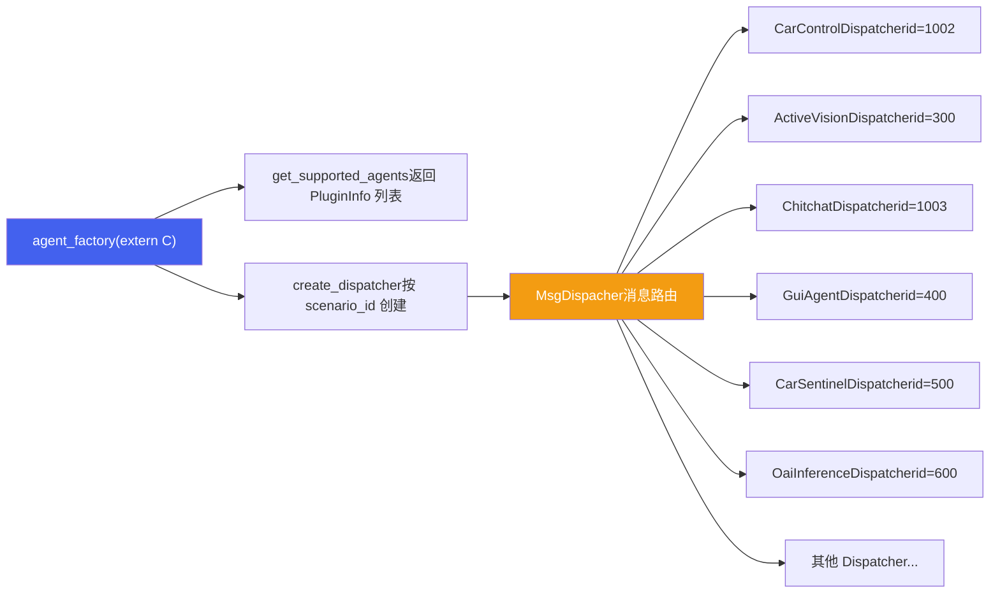
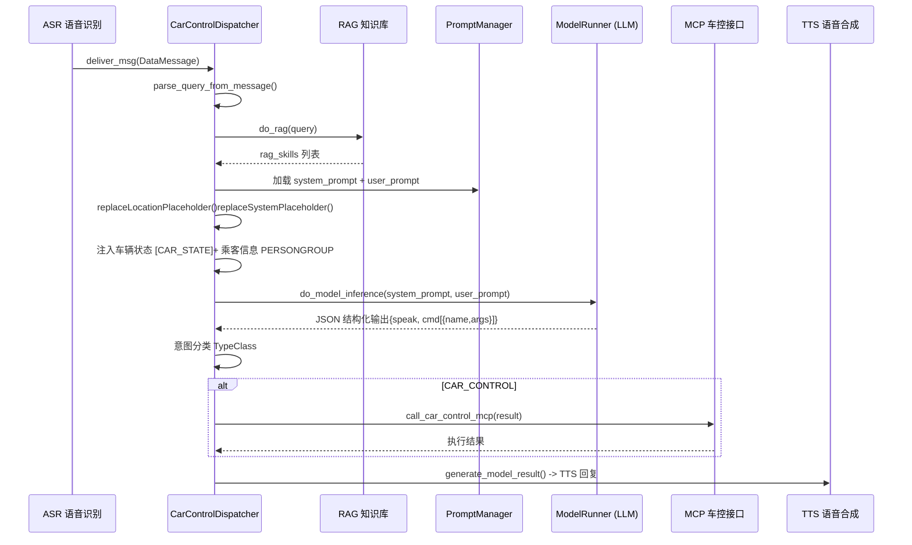
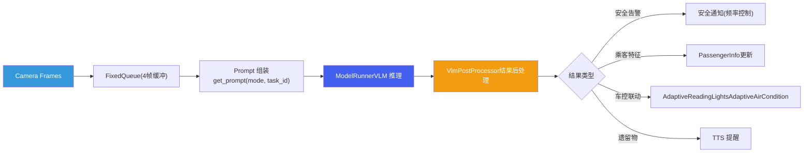
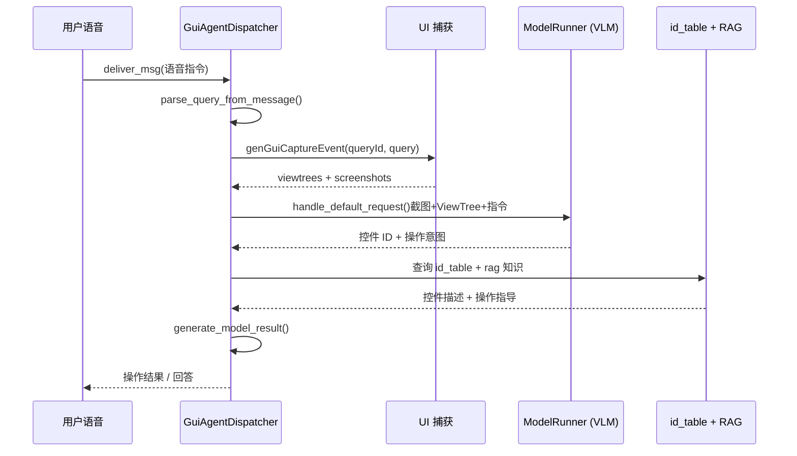
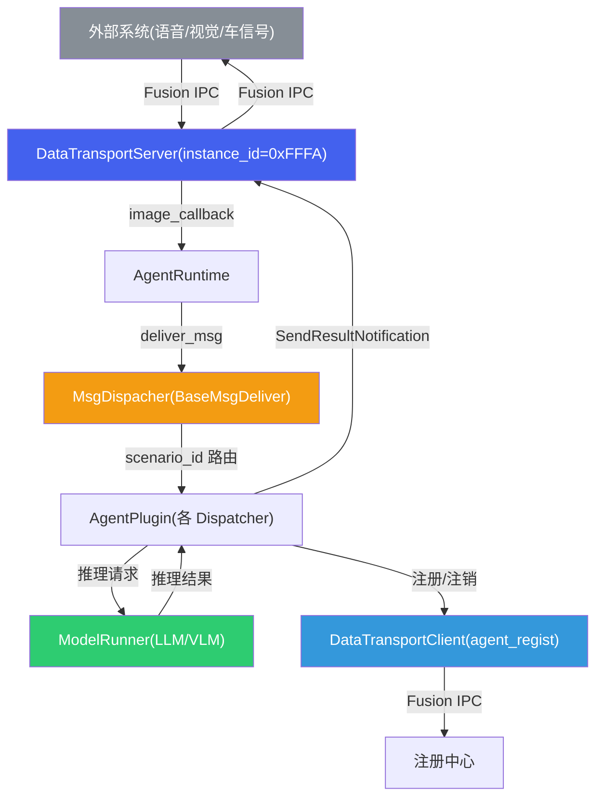

# Part E2: 场景 Agent 应用

*Chapters 1-8 — 架构总览、车辆控制 Agent、主动视觉 Agent、闲聊 Agent、GUI Agent、其他场景 Agent、Prompt 模板工程、数据通路*

## 1. agent\_group 架构总览

### 1.1 插件集合定位

`agent_group` 是基于 aadkcore `AgentPlugin` 接口实现的场景 Agent 插件库，编译产物为 `libagent_group.so`。它通过 `extern "C"` 导出工厂函数 `get_supported_agents` 和 `create_dispatcher`，供 AgentRuntime 在运行时动态加载和实例化各场景 Agent。每个 Agent 对应一个唯一的 `scenario_id`，由 MsgDispacher 根据消息中的 scenario\_id 路由到对应的 Dispatcher 实例。



### 1.2 Scenario ID 分配表

所有 scenario\_id 统一定义在 `aadkcore/include/runtime/constant_ids.h` 中，保证跨模块一致性：

| 常量名 | scenario\_id | Agent 名称 | 说明 |
| :--- | :--- | :--- | :--- |
| `VIDEOCHAT_SCENARIO_ID` | 100 | VideoChat | 视频聊天 |
| `PROACTIVE_SPEECH_SCENARIO_ID` | 200 | ProactiveSpeech | 主动语音 |
| `ACTIVE_VISION_SCENARIO_ID` | 300 | ActiveVision | 主动视觉 |
| `RAIN_DECTION_SCENARIO_ID` | 400 | RainDection (Porsche) | 雨天检测 / GUI Agent |
| `SPORT_MODE_SCENARIO_ID` | 500 | SportMode (Porsche) | 运动模式 / 车辆哨兵 |
| `OAI_INFERENCE_SCENARIO_ID` | 600 | OaiInference | OpenAI 兼容推理接口 |
| `WELCOME_MODE_SCENARIO_ID` | 700 | WelcomeMode | 迎宾模式 |
| `SYSTEM_AGENT_SCENARIO_ID` | 1001 | SystemAgent | 系统 Agent |
| `CAR_CONTROL_SCENARIO_ID` | 1002 | CarControl | 车辆控制 |
| `CHITCHAT_SCENARIO_ID` | 1003 | Chitchat | 闲聊对话 |
| `INCAR_ITEM_DETECT_SCENARIO_ID` | 1100 | InCarItemDetect | 车内物品检测 |
| `DRESS_DETECT_SCENARIO_ID` | 1200 | DressDetect | 着装检测 |
| `OUTCAR_QA_SCENARIO_ID` | 1300 | OutCarQA | 车外问答 |
| `BROADCAST_SCENARIO_ID` | 65535 | Broadcast | 广播消息（特殊） |

> [!NOTE]
> **ID 复用说明**
>
> scenario\_id 400 和 500 存在条件编译复用：在 `ENABLE_PORSCHE` 模式下分别用于 RainDection 和 SportMode；在 `ENABLE_DEVICEAI_BASE` 模式下通过 `#define GUI_AGENT_SCENARIO_ID 400` 和 `#define CAR_SENTINEL_AGENT_SCENARIO_ID 500` 重新映射给 GuiAgent 和 CarSentinel。

### 1.3 条件编译体系

agent\_factory.cpp 通过多级条件编译宏控制 Agent 的编译包含，实现不同车型和功能的灵活裁剪：

| 宏定义 | 控制范围 | 包含的 Agent |
| :--- | :--- | :--- |
| `ENABLE_DEVICEAI_BASE` | 基础 Agent 集合 | CarControl, ActiveVision, GuiAgent, VideoChat, CarSentinel |
| `ENABLE_PORSCHE` | 保时捷定制 | RainDection, SportMode, WelcomeMode |
| `ENABLE_LANTU_SDK` | 岚图定制 | DressDetect, InCarItemDetect, OutCarQA |
| `FEATURE_CAR_CONTROL` | 车辆控制独立开关 | CarControlDispatcher |
| `FEATURE_ACTIVE_VISION` | 主动视觉独立开关 | ActiveVisionDispatcher |
| `FEATURE_CHIT_CHAT` | 闲聊独立开关 | ChitchatDispatcher |
| `FEATURE_GUI` | GUI Agent 独立开关 | GuiAgentDispatcher |
| `FEATURE_OAI_INFERENCE` | OAI 推理独立开关 | OaiInferenceDispatcher |
| `FEATURE_CAR_SENTINEL` | 车辆哨兵独立开关 | CarSentinelDispatcher |
| `FEATURE_RAIN_DECTION` | 雨天检测独立开关 | RainDectionDispatcher |
| `FEATURE_SOPRT_MODE` | 运动模式独立开关 | SportModeDispatcher |
| `FEATURE_WELCOME_MODE` | 迎宾模式独立开关 | WelcomeModeDispatcher |
| `FEATURE_VIDEO_CHAT` | 视频聊天独立开关 | VideoChatDispatcher |

### 1.4 runtime\_config.json 配置

运行时通过 `runtime_config.json` 选择当前平台和模型配置，支持 Orin 和 8397 两套硬件：

| 平台 | model\_name | 推理后端 | 基础模型 |
| :--- | :--- | :--- | :--- |
| **orin**（默认） | `lape/Qwen2.5-Omni-7B` | Lape (llama.cpp) | Qwen2.5-Omni-7B |
| **8397** | `qnn/qwen2.5-vl` | QNN (Qualcomm) | Qwen2.5-VL-3B |

每个平台分别配置 `model_config`（基础推理）和 `active_model_config`（主动视觉推理）两套模型参数文件。`current_runtime` 字段决定当前激活的平台。

## 2. 车辆控制 Agent -- CarControlDispatcher

`CarControlDispatcher`（scenario\_id=1002）是座舱中使用频率最高的 Agent，负责将用户的自然语言指令转化为结构化的车辆控制命令，并通过 MCP 协议下发执行。

### 2.1 核心流程



### 2.2 意图分类枚举

CarControlDispatcher 定义了 `TypeClass` 枚举，LLM 输出解析后根据结果分类路由：

| 枚举值 | 数值 | 说明 | 处理方式 |
| :--- | :--- | :--- | :--- |
| `REJECTED` | 0 | 拒绝执行 | 安全或不合理请求，返回拒绝话术 |
| `CAR_CONTROL` | 1 | 车辆控制指令 | 解析 cmd 字段，通过 MCP 下发车控 |
| `ONLINE_SEARCH` | 2 | 联网搜索 | 标记需要联网，转发到搜索服务 |
| `SUMMARY` | 3 | 总结摘要 | 生成文本摘要 |
| `CHAT` | 4 | 普通闲聊 | 路由到 ChitchatDispatcher 处理 |

### 2.3 车控技能精华表

技能定义在 `car_control.yaml` 的 `car_skills` 部分，共 30+ 项技能。以下为核心技能摘要：

| 技能名 | 功能 | 关键参数 | 规则要点 |
| :--- | :--- | :--- | :--- |
| `ac_toggle` | 空调开关 | position[前排/后排], state[开/关] | 后排无乘客时保持关闭 |
| `ac_temperature` | 空调温度 | position[主驾/副驾], temperature[17-33] | 步长 0.5，儿童老人不低于 22度 |
| `ac_wind_level` | 空调风速 | ac\_wind\_level[0-11] | 儿童老人 + 低温时不超 5 档 |
| `ac_wind_dir_control` | 空调风向 | front/foot/face[开启/关闭] | 儿童老人低温禁止吹脚 |
| `car_window` | 车窗控制 | position[4窗], open\_progress[0-100%] | 结合音区和指向信息定位 |
| `ambient_light_control` | 氛围灯 | color(50+色), brightness, breath, follow | 关闭状态自动先开灯 |
| `ambient_light_shade` | 灯色调深浅 | operation[调浅/调深] | 不改变颜色种类，只调浓淡 |
| `car_reading_light` | 阅读灯 | light\_position[4区], state | 结合指向信息控制 |
| `seat_heating` | 座椅加热 | seat\_position[4座], level[0-3] | 乘客感知联动，有人座位同步 |
| `seat_ventilation` | 座椅通风 | seat\_position[4座], level[0-3] | 成年女性强制 1 档 |
| `seat_massage` | 座椅按摩 | seat\_position, massage\_mode, level[0-3] | 主驾默认全身，副驾默认全背 |
| `steering_wheel_heating` | 方向盘加热 | state[关闭/自动/一档/二档/三档] | -- |
| `sunroof_control` | 天窗遮阳帘 | degree[0-100], action[运动/暂停] | 用户说太晒时完全关闭 |
| `icebox_power` | 冰箱电源 | state[开/关] | -- |
| `icebox_mode` | 冰箱模式 | mode[制冷/制热/关] | 保温模式 = 制热模式 |
| `icebox_temperature` | 冰箱温度 | temperature[-6~15, 35~50] | 制冷/制热双区间 |
| `driving_mode` | 驾驶模式 | state[舒适/节能/运动/雪地/个性化] | 联动动力/转向/悬架 |
| `media_volume_control` | 媒体音量 | volume[0-27], operation[调低/调高] | 超 27 时警告 |
| `rearview_mirror_control` | 后视镜折叠 | state[展开/折叠] | -- |
| `trunk_control` | 后备箱 | state[开/关] | 需确认 P 档 |
| `door_child_lock_control` | 儿童锁 | door\_position[后排左/右], state | 默认双侧锁定 |
| `cant_control` | 不可控 | args 为空 | 需求不在技能表内时触发 |

### 2.4 Prompt 模板设计

CarControlDispatcher 的 Prompt 由 `car_control.yaml` 中的多段模板拼接而成：

| 模板段 | 内容 | 关键要素 |
| :--- | :--- | :--- |
| `system_prompt_prefix` | 角色定义 + 回复格式 + 输入说明 | 角色: 智能语音助手；输出格式: {speak, cmd[{name,args}]}；特殊规则（指向信息、乘客感知） |
| `system_prompt_prefix_1` | 车辆座位关系 | 两排座位排布：主驾/副驾/左后/右后 |
| `system_prompt_passenger` | 乘客信息注入 | 占位符 `{{PERSONGROUP}}` |
| `car_skills` 段 | 完整技能表 | 30+ 项技能的参数定义和控制规则 |
| `system_prompt_suffix` | cant\_control 兜底 | 不在技能表内的需求返回 cant\_control |
| `user_prompt` | 用户输入模板 | `<说话人位置:{{LOCATION}}> <指向:{{DIRECTION}}>{{VIPUSER}}` |

> [!TIP]
> **JSON Schema 输出约束**
>
> system\_prompt 严格要求输出格式为 `{"speak":"回复内容","cmd":[{"name":"技能名","args":{...}}]}`。这种约束使得 LLM 输出可以直接进行 JSON 解析，无需额外的后处理提取逻辑。配合端侧推理引擎的 EBNF 语法约束解码，可进一步保证输出格式的合规性。

### 2.5 乘客感知规则

CarControlDispatcher 通过 `PassengerInfo` 结构体（含 pos/occupancy/gender/age 字段）实现精细化乘客感知。`parse_passenger_info()` 解析车辆上报的乘客信息，`get_passenger_infos()` 将其格式化注入 Prompt：

| 场景 | 规则 | 实现方式 |
| :--- | :--- | :--- |
| 儿童/老人在车 | 空调温度不低于 22度 | system\_prompt 特殊规则注入 |
| 儿童/老人 + 低温 | 风速不超 5 档，禁止吹脚 | system\_prompt 特殊规则注入 |
| 后排无人 | 后排空调保持关闭 | ac\_toggle 技能规则 |
| 座椅加热联动 | 有人座位同步加热档位 | seat\_heating 技能规则 |
| 座椅通风 + 成年女性 | 女性座位通风强制 1 档 | seat\_ventilation 技能规则 |

此外，`voice_zone_map_` 将音区编码映射到位置名称（1=主驾, 2=副驾, 4=左后, 8=右后, 16=中左, 32=中右），`direction_map_` 将指向信息（right/left/up）映射到目标位置，实现基于语音源和手势指向的精准控制。

## 3. 主动视觉 Agent -- ActiveVisionDispatcher

`ActiveVisionDispatcher`（scenario\_id=300）基于 VLM（Vision-Language Model）实现车内场景的主动感知与智能交互，覆盖上车到下车的全生命周期。

### 3.1 六大场景模式

| 模式 | mode 值 | 触发条件 | 核心功能 | 关键方法 |
| :--- | :--- | :--- | :--- | :--- |
| **迎宾 (welcome)** | 0 | 车门打开 / 上车 | 个性化问候（纪念日/天气/温度/穿着） | `handle_welcome_request()` |
| **送宾 (farewell)** | 1 | 熄火 / 下车 | 送宾祝福 + 遗留物检测提醒 | `handle_farewell_request()` |
| **行中监测 (monitoring)** | 2 | 行驶中 | 危险行为识别（手伸窗外等） | `handle_monitoring_request()` |
| **乘客特征提取** | -- | 上车 | 性别、年龄、穿着提取 | `handle_passenger_feature_request()` |
| **危险动作识别** | -- | 实时 | 吸烟、儿童站立、手伸窗外 | `handle_dangerous_action_request()` |
| **遗留物检测** | -- | 下车 | 座椅上独立物品检测 | `handle_left_object_request()` |

此外，`handle_intelligent_cockpit_request()` 实现自动座舱场景，包括吃东西、睡觉、阅读、玩电子产品等行为检测，并联动阅读灯和空调等车控设备。对应的 task\_id 列表为：`xz_front_behavior`, `xz_rear_behavior`, `xz_front_temp`, `xz_rear_dangerous_behavior`。

### 3.2 VLM 多模态推理流程



### 3.3 多 LoRA 架构

ActiveVisionDispatcher 通过 `use_multi_lora_` 标志支持同一基础 VLM 模型搭配不同场景 LoRA 适配器。同一个 Qwen2.5-VL 基座模型通过 `addLora` / `switchLora` 接口切换不同场景的微调权重，避免为每个场景单独加载完整模型。

> [!NOTE]
> **连续帧推理**
>
> `front_behavior_images_` 和 `rear_behavior_images_` 各维护一个容量为 4 的 `FixedQueue`，缓存连续帧图像。VLM 推理时将多帧输入一起送入模型，利用时序信息提升行为识别的准确性（如区分短暂动作和持续行为）。

### 3.4 安全通知频率控制与自适应车控联动

为避免重复打扰用户，ActiveVisionDispatcher 通过 `safety_notify_duration_ = 8000`（8 秒）控制同类安全告警的最小通知间隔。`last_safety_notify_timestamp_` 记录上次通知时间戳。

自适应车控联动通过两个控制器实现：

| 控制器 | 功能 | 触发场景 |
| :--- | :--- | :--- |
| `AdaptiveReadingLights` | 根据视觉识别结果自动调节阅读灯亮度和开关 | 检测到阅读行为时开灯，离开时关灯 |
| `AdaptiveAirCondition` | 根据乘客状态自动调节空调 | 检测到乘客体表温度偏差时调整空调 |

`is_exit_reminder_enabled_` 标志控制下车提醒功能的开关，当启用时在送宾场景中触发遗留物检测。

## 4. 闲聊 Agent 与对话管理

`ChitchatDispatcher`（scenario\_id=1003）负责处理非车控类的自然语言对话，提供陪伴式聊天体验。

### 4.1 核心架构

ChitchatDispatcher 同样继承自 `AgentPlugin`，核心组件包括：

| 组件 | 类型 | 功能 |
| :--- | :--- | :--- |
| `model_runner_` | `shared_ptr<ModelRunner>` | 共享的 LLM 推理引擎 |
| `chat_history_` | `unique_ptr<ChatHistory>` | 多轮对话历史管理 |
| `prompt_manager_` | `shared_ptr<PromptManager>` | Prompt 模板加载与管理 |
| `data_dumper_` | `unique_ptr<DataDump>` | 推理数据录制 |

### 4.2 多轮对话上下文管理

`ChatHistory` 维护对话历史，`process_history()` 将历史记录转换为模型输入的 `MessageList` 格式。`history_to_string()` 用于调试日志和数据录制。`clear_memory()` 接口支持清空对话历史重新开始。

### 4.3 Prompt 特性

闲聊 Prompt（`chitchat.yaml`）的 system\_prompt 包含丰富的角色设定：

- 角色定义：车载智能助手，活泼开朗，善于倾听
- 环境信息注入：日期、时间、天气、地点（`{{date_info}}`, `{{time_info}}` 等占位符）
- 视觉能力：可看到中控台摄像头拍摄的车内场景，注意镜像关系（图片左=副驾，右=主驾）
- 功能边界：明确声明无法控制车辆、设定闹钟、联网搜索等
- VIP 用户识别：`system_prompt_vipuser` 段注入已注册乘客名称
- 说话人位置感知：`system_prompt_seat` 段注入当前说话人座位

### 4.4 与车控 Agent 的意图路由关系

ChitchatDispatcher 自身也定义了与 CarControlDispatcher 相同的 `TypeClass` 枚举（REJECTED/CAR\_CONTROL/ONLINE\_SEARCH/SUMMARY/CHAT）。当车控 Agent 将用户请求分类为 `CHAT` 类型时，消息会被路由到闲聊 Agent 进行处理，形成意图路由闭环。

## 5. GUI Agent

`GuiAgentDispatcher`（scenario\_id=400，仅 `ENABLE_DEVICEAI_BASE` 模式）负责车机 UI 操作理解与自动化，将用户的语音指令映射到具体的 UI 控件操作。

### 5.1 核心数据结构

`GuiInfo` 结构体封装了 GUI 操作的完整上下文：

| 字段 | 类型 | 说明 |
| :--- | :--- | :--- |
| `query_id` | string | 查询唯一标识 |
| `query` | string | 用户语音指令 |
| `voice_zone` | int | 音区 |
| `viewtrees` | json | 当前界面 View Tree 结构化描述 |
| `screenshots` | string | 当前界面截图（Base64） |

### 5.2 id\_table.yaml 映射

`id_table.yaml` 定义了数字 ID 到页面 URL 的映射表（共 200+ 条），用于将 VLM 识别的 UI 控件 ID 映射到实际的应用页面地址。映射格式为 `ID: page://domain/element_id`，覆盖 SystemUI、SmartCar、AirCondition 等多个应用域。

同时 `gui_agent.yaml` 中的 `rag` 段定义了每个页面 URL 对应的知识描述，例如：

```
page://systemui.alios.cn/systemui_TT34:
  电子驻车制动系统故障指示灯
  黄色常亮表示EPB系统故障
  ...
```

### 5.3 端到端流程



`QueryState` 枚举（kInit/kFinished）和 `query_state_map_` 用于追踪每个查询的生命周期，`QUERY_TIMEOUT = 10000`（10秒）为查询超时阈值。

## 6. 其他场景 Agent

| Agent 名称 | 类名 | scenario\_id | 编译条件 | 核心功能 |
| :--- | :--- | :--- | :--- | :--- |
| **车辆哨兵** | `CarSentinelDispatcher` | 500 | `FEATURE_CAR_SENTINEL` | 停车后环境监控，通过 sentry 库进行视频分段摘要与风险评级。支持动态加载 sentry .so 库，注入视频进行推理分析。 |
| **雨天检测** | `RainDectionDispatcher` | 400 | `ENABLE_PORSCHE` + `FEATURE_RAIN_DECTION` | 保时捷定制，雨天场景检测与自动雨刮控制。基于视觉模型检测雨量强度。 |
| **运动模式** | `SportModeDispatcher` | 500 | `ENABLE_PORSCHE` + `FEATURE_SOPRT_MODE` | 保时捷定制，运动驾驶场景感知，提供运动模式下的驾驶数据分析和车辆状态反馈。 |
| **迎宾模式** | `WelcomeModeDispatcher` | 700 | `ENABLE_PORSCHE` + `FEATURE_WELCOME_MODE` | 保时捷定制的上车迎宾交互，独立于 ActiveVision 的迎宾场景。 |
| **着装检测** | `DressDetectDispatcher` | 1200 | `ENABLE_LANTU_SDK` | 岚图定制，基于车内摄像头识别乘客着装特征，用于个性化服务。 |
| **车内物品检测** | `InCarItemDetectDispatcher` | 1100 | `ENABLE_LANTU_SDK` | 岚图定制，识别车内物品并提供相关服务建议。 |
| **车外问答** | `OutCarQADispatcher` | 1300 | `ENABLE_LANTU_SDK` | 岚图定制，基于车外摄像头进行场景视觉问答。 |
| **OAI 推理** | `OaiInferenceDispatcher` | 600 | `FEATURE_OAI_INFERENCE` | OpenAI API 兼容推理接口，支持标准 chat/completions 格式的消息解析（system/user/history），支持 Base64 图片输入和流式输出。 |

> [!WARNING]
> **注意事项**
>
> CarSentinelDispatcher 在岚图项目中标注为 "lantu not use"。部分 Agent（如 ProactiveSpeech、VideoChat）的 include 已被注释掉，处于暂停开发或未启用状态。

## 7. Prompt 模板工程

### 7.1 YAML 模板结构

所有 Agent 的 Prompt 模板存放在 `agent_group/data/template/` 目录下，采用 YAML 格式。典型的模板文件结构如下：

```
# car_control.yaml 结构示例
car_control:
  system_prompt_prefix: |       # 角色定义 + 回复格式 + 输入说明
    ...
  system_prompt_passenger: |    # 乘客信息段
    [车内乘客信息] {{PERSONGROUP}}
  system_prompt_prefix_1: |     # 座位关系 + 技能表引导
    ...
  system_prompt_suffix: |       # cant_control 兜底
    ...
  user_prompt: "..."            # 用户输入模板

car_skills:                     # 技能定义段
  ac_toggle: |
    ...
  ac_temperature: |
    ...
```

模板通过 `PromptManager` 加载，运行时通过字符串替换注入动态内容。

### 7.2 占位符替换机制

| 占位符 | 说明 | 替换来源 | 示例 |
| :--- | :--- | :--- | :--- |
| `{{LOCATION}}` | 说话人音区位置 | `voice_zone_map_` 映射 | "主驾" |
| `{{DIRECTION}}` | 说话人指向方向 | `direction_map_` 映射 | "副驾方向" |
| `{{VIPUSER}}` | VIP 用户身份信息 | `get_vip_user_prompt()` | "张先生" |
| `{{PERSONGROUP}}` | 车内乘客群体描述 | `get_passenger_infos()` | "主驾: 成年男性, 副驾: 儿童" |
| `[CAR_STATE]` | 车辆当前状态 | `CarSignalManager` | "空调24度, 车窗关闭, 风速3档" |
| `{{date_info}}` | 当前日期 | 系统时间 | "2025-05-27" |
| `{{time_info}}` | 当前时间 | 系统时间 | "14:30" |
| `{{weather_info}}` | 当前天气 | 外部接口 | "晴, 28度" |
| `{{location_info}}` | 当前地点 | GPS | "上海市浦东新区" |
| `{{alias_info}}` | 已注册乘客信息 | 用户系统 | "主驾: 陈总, 副驾: 未注册" |
| `{{KNOWLEDGE}}` | RAG 知识库内容 | GUI Agent RAG 查询 | 控件描述文本 |

替换由 `replaceLocationPlaceholder()`、`replacePlaceholder()` 和 `replaceSystemPlaceholder()` 三个方法协作完成，按顺序替换不同类别的占位符。

### 7.3 多场景 Prompt 模板对比

| 维度 | 车辆控制 (car\_control.yaml) | 闲聊 (chitchat.yaml) | 主动视觉 (active\_vision.yaml) | GUI Agent (gui\_agent.yaml) |
| :--- | :--- | :--- | :--- | :--- |
| **角色定位** | 智能语音助手，执行车控 | 车载陪伴AI，朋友式交流 | 车载迎宾/安全助手 | 屏幕控件提槽专家 |
| **输出格式** | JSON: {speak, cmd} | 自由文本 (≤100字) | JSON: {speak, car\_control} | 结构化控件操作 |
| **视觉输入** | 无 | 车内摄像头（镜像） | 前/后排连续帧 | 截图 + ViewTree |
| **车辆状态** | [CAR\_STATE] 完整注入 | 不注入 | 温度/天气等部分注入 | 不注入 |
| **乘客感知** | PERSONGROUP 完整 | 座位信息 | PassengerInfo 结构化 | 无 |
| **模板文件数** | 1 (多段拼接) | 1 (多段拼接) | 1 (多 mode 多 task) | 1 (system + rag) |

> [!TIP]
> **Prompt 工程 Best Practice**
>
> **约束解码友好设计**：车控 Agent 的 Prompt 严格定义 JSON 输出 Schema，配合端侧推理引擎的 EBNF 语法约束，可在解码阶段强制保证输出格式合规。关键要素包括：(1) 明确声明输出格式和字段类型；(2) 列举所有合法参数值范围；(3) 提供 cant\_control 兜底路径。这比自由文本 + 正则提取的方案可靠性高出一个量级。

## 8. 数据通路与 Fusion 通信

### 8.1 DataTransport 机制

`agent_runtime_main.cpp` 是 agent\_group 进程的入口，它创建 `DataTransportServer` 和 `DataTransportClient` 实例，封装到 `AgentRuntime` 中运行：

```
// agent_runtime_main.cpp 核心逻辑
auto server = make_unique<DataTransportServer>(agent_server_id);  // 0xFFFA
auto regist_client = make_unique<DataTransportClient>("agent_regist");
auto agent_runtime = make_unique<AgentRuntime>(move(server), move(regist_client));

auto msg_deliver = make_shared<MsgDispacher>(data_path);
agent_runtime->set_dispatcher(msg_deliver);
agent_runtime->start_server();
ProcessWait();  // 信号等待 (SIGINT/SIGTERM/SIGSEGV/SIGABRT)
```

| 组件 | 类 | 继承自 | 职责 |
| :--- | :--- | :--- | :--- |
| Transport Server | `DataTransportServer` | `BaseServer` | 接收外部消息（图像/音频/文本），通过 Fusion DataTransportService 实现 IPC |
| Transport Client | `DataTransportClient` | `BaseClient` | 向外部系统发送消息和注册信息，通过 DataTransportProxy 实现 |
| 消息路由 | `MsgDispacher` | `BaseMsgDeliver` | 根据 scenario\_id 将消息分发到对应的 Dispatcher |
| 运行时 | `AgentRuntime` | aadkcore | 管理 Server/Client 生命周期，连接 Server 回调和 Dispatcher |

### 8.2 数据流全景



消息入站流程：外部系统通过 Fusion DataTransport 协议发送 `InputData`（含 ImageInfo/AudioInfo/文本），`DataTransportServer` 的 `image_callback` 将其封装为 `ServerMessage`，经 `AgentRuntime` 转发至 `MsgDispacher.deliver_msg()`，后者根据消息中的 `scenario_id` 路由到具体 Dispatcher。

消息出站流程：Dispatcher 处理完毕后，通过 `SendResultNotification()` 将结果回传给 `DataTransportServer`，再通过 Fusion IPC 返回外部系统。对于需要流式输出的场景（如 GUI Agent 和 ActiveVision），使用 `StreamProcessor` + `stream_callback_handler` 实现分段推送。

### 8.3 消息录制与回放

每个 Dispatcher 都内置了 `DataDump` 实例，通过 `set_data_dump_flag()` 控制数据录制开关。录制的内容包括：

| 录制内容 | 格式 | 用途 |
| :--- | :--- | :--- |
| 输入消息 | JSON + 二进制图像 | 重放时模拟外部输入 |
| Prompt (system + user) | 文本 | Prompt 调试和优化 |
| LLM 输出 | JSON | 精度验证和回归测试 |
| 推理耗时 | 时间戳 | 性能分析 |

启动时通过命令行参数 `-d/--dump` 控制录制行为（默认值为 1，启用录制）。录制的完整消息流可用于离线回放调试，避免依赖真实硬件环境。

> [!NOTE]
> **与 aadkcore 的集成关系**
>
> `AgentRuntime`（来自 aadkcore）提供了 Server/Client 管理和消息分发的通用框架。`agent_group` 通过实现 `AgentPlugin` 接口并以 `libagent_group.so` 形式提供插件库，实现了框架与业务的解耦。AgentRuntime 可以动态加载不同的插件库，支持不同车型和项目的灵活配置。
