# 4. 协议与运行时执行

*MCP 工具协议 · A2A 协议 · Agent 运行时与插件机制 · LLM Flow 与 Tool 系统*

> [!TIP]
> **本篇讲什么**
>
> aadkcore 的**协议与执行主线**——模型能力如何对外暴露为工具、多 Agent 如何协作、业务插件如何被加载/卸载、一次请求如何在运行时里被路由并调到模型：
>
> - MCP 工具协议（四种传输、服务端/客户端生命周期、握手与能力发现、**MCP → `BaseTool` 桥接**）
> - A2A 协议（任务状态机、服务端与**客户端** API、Agent Card、多 Agent 协作）
> - Agent 运行时与插件机制（`SystemRuntime` / `AgentRuntime`、`AgentPlugin` 加载与卸载生命周期、**消息分发与线程模型**）
> - LLM Flow 与 Tool 系统（`BaseLlmFlow` 流水线、`BaseTool`、端到端调用链）
> - 扩展与设计方向：端云协同架构、安全沙箱机制（**均为设计目标，非已实现接口**，见 §5 / §6）
>
> **读前必看**：本篇严格区分"已实现"与"设计方向/脚手架"。尤其 §4 存在**两条并行的执行路径**——生产中实际在跑的 `AgentPlugin → ModelRunner` 路径，与尚未接线的 ADK 风格 `Runner → BaseLlmFlow` 脚手架；Tool Use 闭环、A2A 运行时编排、两级优先级线程、安全沙箱分级目前**都不是现有行为**。各节均有 callout 标明边界。
>
> 模型 / 对话 / 调度主线（ModelInstance、ModelScheduler、ChatHistory、RAG）见 [aadkcore 核心框架](agent-core.html)。
>
> **代码基线**：aadkcore 主线 `agent_core_dev`。涉及 `aadkapi/tools/mcp/`、`aadkapi/a2a/`、`aadkapi/content.hpp`、`aadkapi/model_runner.h`、`include/{runtime,tools,flow,agent,runner}/`、`src/{tools/mcp,a2a,flow,agent,runner}/`、`runtime/src/system_agent/`、`examples/{mcp_examples,a2a_examples}/`。

## 1. MCP 工具协议

MCP（Model Context Protocol）是 LLM 与外部工具的标准通信协议。`McpServer`（定义于 `aadkapi/tools/mcp/mcp_server.hpp`）实现了 MCP 服务端，支持将车辆控制 API、导航 API 等外部能力暴露为 LLM 可调用的 Tool。

aadkcore 的 MCP 模块不是单个类，而是一组分工明确的组件（均在 `aadkapi/tools/mcp/`，实现于 `src/tools/mcp/`）：

| 组件 | 角色 | 说明 |
| :--- | :--- | :--- |
| `McpServer` | 服务端 | 注册 Tool / Prompt / Resource，按传输类型监听 |
| `McpSessionManager` | 客户端 | 连接、能力发现（`ListTools` 等）、调用（`CallTool` 等） |
| `McpToolset` / `McpTool` | **客户端工具化桥接** | 把远端 MCP 工具适配成框架自己的 `BaseTool`，供 LLM Flow 使用（见 §1.5） |
| `McpProvider` | 服务端（Fusion 形态） | 带**每工具超时**的注册接口，`CreateFusionImpl(config)` 创建 |
| `McpServerFusion` / `McpServerIpcImpl` / `McpSessionManagerFusion` | Fusion 传输专用实现 | 车载 IPC 形态的服务端宿主与客户端会话（见 §1.1） |

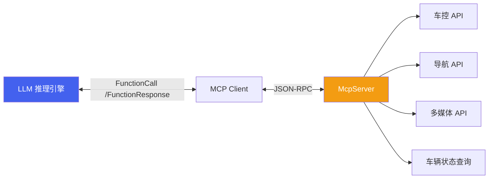

### 1.1 四种传输类型

| 枚举值 | 传输类型 | 说明 | 适用场景 |
| :--- | :--- | :--- | :--- |
| `MCP_TRANSPORT_STDIO` | STDIO | 标准输入/输出通信 | 本地进程间通信 |
| `MCP_TRANSPORT_SSE` | SSE | Server-Sent Events | Web 单向推送 |
| `MCP_TRANSPORT_HTTP` | HTTP | HTTP 请求/响应 | RESTful 调用 |
| `MCP_TRANSPORT_FUSION` | Fusion | 斑马（Banma）Fusion IPC（`banma::mcp` / `banma::mcpsvr` / `banma::mcpipc` 命名空间），有专用类层级而非复用通用 `Start` | 车载系统内部跨进程/跨域通信 |

> [!NOTE]
> **`param` 的含义随传输类型而变，且 FUSION 不走 `Start(transport, param)`**
>
> `McpServer::Start(transport_type, param)` 里的 `param` 是"传输参数"字符串，解释方式取决于传输类型：STDIO 下通常是子进程/命令标识，SSE / HTTP 下是监听地址（示例默认 `localhost:8000`）。但 **FUSION 是个例外**：示例代码里 Fusion 形态不是调 `Start(MCP_TRANSPORT_FUSION, param)`，而是先 `McpServer::AddServer(server, path)` 把服务注册到一个路径，再由 `McpServerFusion(config, instance_id)` 这个**宿主对象** `Start()` 统一拉起（见 `examples/mcp_examples/mcp_server_example_fusion.cpp`）。所以跨传输迁移时，既不能假设 `param` 语义一致，也不能假设启动路径一致。
>
> Fusion 形态还带来一个通用 `McpServer` 没有的能力：**每工具超时**。`McpServerIpcImpl::AddIpcTool(name, info, instance_id, timeout_msec)` 与 `McpProvider::AddTool(param, cb, timeout_msec)` 都显式接收 `timeout_msec`——这对端侧 Agent 很关键：车控/导航类工具调用必须有可配置的上限时间，否则一个卡死的工具会拖住整条推理链。

### 1.2 服务端核心 API

| API | 说明 |
| :--- | :--- |
| `McpServer(name, version)` | 构造 MCP 服务实例，指定服务名称和版本 |
| `AddTool(param, callback)` | 注册工具，param 为 JSON 描述（名称/描述/参数 Schema），callback 处理调用 |
| `AddPrompt(param, callback)` | 注册 Prompt 模板 |
| `AddResource(param, callback)` | 注册数据资源（URI + 描述） |
| `AddResourceTemplate(param, callback)` | 注册资源模板 |
| `Start(transport_type, param)` | 启动 MCP 服务，指定传输类型和参数 |
| `AddServer(server, path)` (static) | 注册 MCP 服务器实例到指定路径 |
| `StartServers(config, transport, addr, port)` (static) | 批量启动所有已注册的 MCP 服务器 |

### 1.3 传输握手与生命周期

MCP 的可用性依赖"先握手、再发现、后调用、终关闭"的完整生命周期。aadkcore 把服务端与客户端拆成两个类：服务端 `McpServer` 负责注册与监听，客户端 `McpSessionManager`（定义于 `aadkapi/tools/mcp/mcp_session_manager.hpp`）负责连接、能力发现与调用。

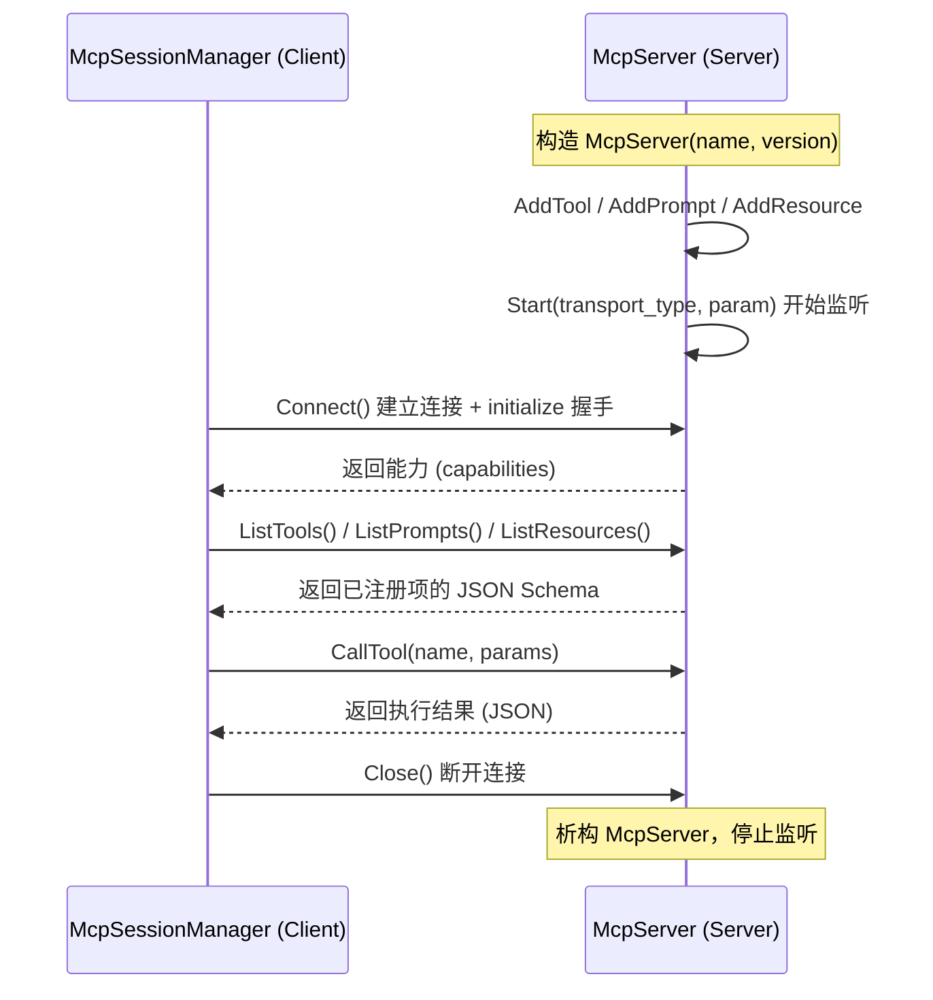

**服务端生命周期**（`McpServer`）：

| 阶段 | 动作 | 说明 |
| :--- | :--- | :--- |
| 1. 构造 | `McpServer(name, version)` | 声明服务名与版本，作为握手时上报的身份信息 |
| 2. 注册 | `AddTool / AddPrompt / AddResource / AddResourceTemplate` | 在 `Start` 之前完成注册；callback 以 `shared_ptr` 持有，生命周期随 server |
| 3. 启动 | `Start(transport_type, param)` | 按传输类型建立监听；多服务场景用 `AddServer` + `StartServers` 批量启动 |
| 4. 销毁 | 析构 `~McpServer()` | 释放 `handle_` 与注册的 callback |

**客户端生命周期**（`McpSessionManager`）：

| 阶段 | API | 说明 |
| :--- | :--- | :--- |
| 1. 构造 | `McpSessionManager(transport_type, param)` | 选定传输类型与目标参数，但**尚未连接** |
| 2. 握手 | `Connect()` | 建立连接并完成 initialize 握手，返回 false 表示连接失败 |
| 3. 能力发现 | `ListTools() / ListPrompts() / ListResources() / ListResourceTemplates()` | 拉取服务端注册项的 JSON Schema，供 LLM 生成合法 `FunctionCall` |
| 4. 调用 | `CallTool(tool_name, params) / GetPrompt(...) / ReadResource(uri)` | 按名字调用工具/模板/资源，返回 JSON 结果 |
| 5. 关闭 | `Close()` | 断开连接；析构时兜底释放 `handle_` |

> [!CAUTION]
> **客户端必须显式 `Close()`，且调用前要检查 `Connect()` 返回值**
>
> `McpSessionManager` 的 `Connect()` 返回 `bool`——连接失败时后续 `ListTools` / `CallTool` 的行为是未定义的（取决于底层传输实现），调用方必须先判 `Connect()` 成功再进入发现/调用阶段。同理，`Close()` 需要显式调用以释放会话资源；不要依赖析构来隐式断开。对长生命周期的 Tool 客户端（常驻进程），建议复用同一个 session 而不是每次调用都 `Connect`/`Close`，避免握手开销。

### 1.4 注册工具代码示例

> [!WARNING]
> **回调收到的是 MCP JSON-RPC 信封，不是裸参数；返回值也必须是 MCP 结果信封**
>
> 这是最容易写错的地方。`AddTool` 的 callback 第二个参数 `json_req` 是 `tools/call` 的**请求参数对象**，业务入参被包在 `arguments` 字段下——要写 `json_req["arguments"]["temperature"]`，而不是 `json_req["temperature"]`。返回值同样不能是自定义的 `{"status": ...}`，而必须是 MCP 规定的 `{"content": [{"type": "text", "text": "..."}]}` 结构（Prompt 回调返回 `{"description", "messages"}`，Resource 回调返回 `{"contents": [{"uri","mimeType","text"}]}`）。以下示例与 `examples/mcp_examples/mcp_server_example_fusion.cpp` 的真实写法一致。

```
// 创建 MCP Server
auto mcp_server = std::make_shared<McpServer>("car_control", "1.0.0");

// 注册"设置空调温度"工具
nlohmann::json tool_param = {
    {"name", "set_ac_temperature"},
    {"description", "设置车内空调温度"},
    {"inputSchema", {
        {"type", "object"},
        {"properties", {
            {"temperature", {{"type", "number"}, {"description", "目标温度(°C)"}}},
            {"zone", {{"type", "string"}, {"description", "音区: 主驾/副驾/全车"}}}
        }},
        {"required", {"temperature"}},
        {"additionalProperties", {{"not", nlohmann::json::object()}}}
    }}
};

mcp_server->AddTool(tool_param,
    [](uintptr_t session_ptr, nlohmann::json& json_req) -> nlohmann::json {
        // 注意：入参在 arguments 下，不在顶层
        double temp = json_req["arguments"]["temperature"];
        // 调用车控底层 API 设置温度...

        // 注意：返回值必须是 MCP 的 content 数组结构
        return nlohmann::json::parse(R"({
            "content": [{ "type": "text", "text": "ok" }]
        })");
    });

// 启动服务：STDIO / SSE / HTTP 走通用 Start
mcp_server->Start(McpServer::MCP_TRANSPORT_HTTP, "localhost:8000");

// 启动服务：FUSION 形态不走 Start，而是 AddServer + McpServerFusion 宿主
// McpServer::AddServer(mcp_server, "/carcontrol");
// McpServerFusion msf(/*config=*/"", /*instance_id=*/0xFFFF);
// msf.Start();   // ... msf.Stop();
```

### 1.5 MCP → BaseTool 桥接（客户端工具化）

§1.1–§1.4 讲的是"如何把能力暴露成 MCP 服务"。但 LLM Flow 消费的不是 MCP 对象，而是框架自己的 `BaseTool`（§4.2）。两者之间由 `McpToolset` / `McpTool` 这层适配器打通——**这是 MCP 协议与 Tool 系统真正的接缝**，也是判断"MCP 工具能否被模型用起来"的关键位置。

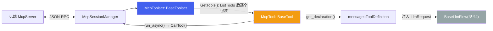

`McpToolset`（`aadkapi/tools/mcp/mcp_toolset.hpp`）继承 `BaseToolset`，`GetTools()` 的实现就是"拉一次 `ListTools()`，把每个 MCP 工具包成一个 `McpTool`"：

```
std::vector<std::shared_ptr<BaseTool>> McpToolset::GetTools() {
   nlohmann::json mcp_tools = session_manager_->ListTools();
   std::vector<std::shared_ptr<BaseTool>> tools;
   for (auto& tool : mcp_tools) {
        tools.push_back(std::make_shared<McpTool>(session_manager_, tool));
   }
   return tools;
}
```

`McpTool`（`aadkapi/tools/mcp/mcp_tool.hpp`）继承 `BaseTool`，构造时把 MCP 的 `inputSchema` 转成 OpenAI function 风格的 JSON，再反序列化成 `message::ToolDefinition`；`run_async()` 把 `map<string, any>` 入参转成 JSON 后调 `session_manager_->CallTool(name(), args)`。

> [!CAUTION]
> **这层桥接当前是"接得上但跑不通"，有三个代码级缺陷**
>
> 经代码核实（`src/tools/mcp/mcp_tool.cpp`、`include/utils/message.hpp`），把 MCP 工具真正喂给模型这条路上有三处硬伤，落地前必须先修：
>
> 1. **`ToolDefinition` 反序列化会抛异常**。`adl_serializer<message::ToolDefinition>::from_json` 用 `j.at("function").at("responses")` 读取 `responses` 字段（`.at()` 缺键即抛 `out_of_range`），而 `McpTool` 构造时只填了 `name` / `description` / `parameters`，**从不填 `responses`**——因为 MCP 的 `inputSchema` 本来就没有"输出 schema"这个概念。结果是：任何标准 MCP 工具在 `make_shared<McpTool>(...)` 这一步就会抛异常，`GetTools()` 拿不到工具。
> 2. **Schema 保真度严重丢失**。框架内部的 `ToolParameters` 只建模了 `{type, properties}`，`ParamInfo` 只有 `{type, description}`。MCP 的 `inputSchema` 是完整 JSON Schema，其中的 `required`、`additionalProperties`、`enum`、嵌套 `object`/`array` 在转换中**被静默丢弃**。也就是说即使修好第 1 条，模型看到的工具签名也比真实 MCP 声明弱得多，`required` 约束丢失会直接导致模型生成缺参的 `FunctionCall`。
> 3. **工具返回值被丢弃**。`McpTool::run_async()` 里 `nlohmann::json ret = session_manager_->CallTool(...)` 之后直接 `CO_RETURN true`——`ret` 从未被使用。即便 Tool 闭环启用（§4.1），MCP 工具的执行结果也**不会**变成 `FunctionResponse` 回灌给模型，模型永远只知道"调用成功了"，不知道"调用返回了什么"。
>
> 另有两个次级问题：`run_async()` 的入参转换只支持 `string` / `int` / `double` / `bool`，其它类型（含嵌套对象、数组）被替换成字面量字符串 `"<unsupported_type>"`；`CallTool(name, argsJsonStr)` 传的是 `std::string`，而形参是 `const nlohmann::json&`，会被隐式构造成一个 **JSON 字符串值**而非 JSON 对象，服务端收到的 `arguments` 因此是"被再编码了一层的字符串"。
>
> 还有一个与 §1.3 CAUTION 直接呼应的点：`McpToolset(transport_type, param)` 这个便捷构造在内部调 `session_manager_->Connect()` 但**不检查返回值**——框架自己的适配层就犯了"不判 `Connect()` 成败"的错。连接失败时 `GetTools()` 会拿着一个未连接的 session 去 `ListTools()`。

> [!NOTE]
> **协议选型权衡：什么时候用 MCP，什么时候直接写 `BaseTool`**
>
> 框架同时提供了两条接工具的路：MCP（跨进程/跨域，标准协议）与直接继承 `BaseTool`（进程内，如 `JsonTool`）。选型上的真实权衡是：
>
> | 维度 | MCP 工具 | 直接 `BaseTool` |
> | :--- | :--- | :--- |
> | 部署边界 | 跨进程/跨域，工具可由**别的团队/别的 ECU** 独立发布升级 | 必须编进同一进程，随框架一起发版 |
> | 能力发现 | 运行时 `ListTools()` 动态发现，加工具不用改 Agent 代码 | 编译期固定，加工具要改代码重编 |
> | 调用开销 | 一次 JSON-RPC 往返 + 两次 JSON 序列化 | 直接函数调用 |
> | 超时/隔离 | Fusion 形态有 `timeout_msec`，工具崩溃不拖垮 Agent 进程 | 工具崩溃即 Agent 崩溃 |
> | Schema 表达力 | 完整 JSON Schema（但经 §1.5 桥接后会退化） | 受 `ToolParameters` 模型限制 |
>
> 座舱场景下，**车控/导航这类由不同域控提供的能力适合走 MCP**（尤其是 Fusion IPC 形态，能拿到进程隔离和每工具超时）；**纯进程内的轻量工具直接写 `BaseTool` 更省事**。但要注意：选 MCP 就必须先解决 §1.5 的三个缺陷，否则"标准协议"带来的解耦收益拿不到。

> [!NOTE]
> **时效性：aadkcore 的传输集合对应 MCP 较早期的规范（需核实最新规范）**
>
> MCP 由 Anthropic 于 2024 年底开源，2025 年生态快速演进。其中与本篇直接相关的一点：MCP 规范在 2025 年的修订中引入了 **Streamable HTTP** 传输以取代早期的 HTTP+SSE 组合（SSE 被标记为过时）。而 aadkcore 的 `McpTransportType` 仍把 `SSE` 与 `HTTP` 作为**两个并列的独立传输**，说明其对接的是**较早版本的 MCP 规范**。
>
> 影响：对外与遵循新规范的 MCP 生态（第三方工具服务器、网关）互通时，SSE/HTTP 的握手与流式语义可能与对方预期不一致；对内的 STDIO/FUSION 不受影响。**具体以哪个规范版本为准、Streamable HTTP 的迁移要求，需联网核实 MCP 最新 spec 后确认**，此处不臆断版本号。

## 2. A2A 协议

A2A（Agent-to-Agent）是多 Agent 间通信标准，遵循 [a2a-protocol.org](https://a2a-protocol.org) 规范。aadkcore 同时实现了服务端 `A2AServer`（`aadkapi/a2a/a2a_server.h`）与客户端 `A2AClient`（`aadkapi/a2a/a2a_client.h`），支持 Agent 间的任务委托、状态同步、流式推送和结果传递。

> [!IMPORTANT]
> **A2A 协议栈不是 C++ 手写的，而是一个 Go 库经 cgo 桥接进来的**
>
> 这是理解 aadkcore A2A 实现的前提。`A2AServer` / `A2AClient` / `A2ATaskHandler` 这三个 C++ 类只是**薄封装**，真正的协议实现在 `src/a2a/*.go`（`a2a_c_lib.go`、`aadk_a2a_server.go`、`push_notification_sender.go`，`go.mod` 依赖 trpc-a2a-go），编译产物是**预编译动态库** `liba2a.so`，随 `aadk_lib/{aarch64,android}/lib/` 与 `aadk_lib_orin-y/aarch64/lib/` 分平台提供，C 侧接口是 cgo 自动生成的 `liba2a.h`（文件头即 `/* Code generated by cmd/cgo; DO NOT EDIT. */`）。
>
> 这个实现选择带来几个必须知道的工程后果：
>
> - **所有载荷以 JSON 字符串过边界**。C ABI 里没有结构体，只有 `char*`：`a2a_client_send_message(handle, char* params_json)` 返回 `A2AResult{char* ret; char* err;}`。C++ 侧的 `nlohmann::json` 入参/出参实际都经历了一次 `dump()` / `parse()`。
> - **跨运行时内存所有权**。`A2AResult*` 由 Go 侧分配，必须用 `a2a_client_free_result()` 显式释放，否则泄漏；句柄统一是 `uintptr_t`（与 `McpServer::handle_` 同一套风格）。
> - **进程里嵌了一个 Go runtime**。Go 的 GC 与 goroutine 调度器随 `liba2a.so` 一起进入 Agent 进程，与 C++ 侧的线程模型并存——在内存受限的端侧平台上，这部分常驻开销需要计入预算。
> - **升级路径是"换 .so"**。协议演进（A2A 规范本身在 2025 年迭代很快）主要落在 Go 侧，C++ 封装层相对稳定；但反过来，C++ 侧能用的能力受限于 `liba2a.h` 导出了什么——例如 C ABI 里有 `a2a_task_handler_clean_task`，而 C++ 的 `A2ATaskHandler` 并未暴露对应方法。

### 2.1 任务状态机

A2A 的任务状态在代码里是一组字符串常量（`aadkapi/a2a/a2a_server.h`）。**注意线上取值用的是连字符**（`input-required` / `auth-required`），不是下划线；另有一个 `unknown` 状态用于表示不确定/不可判定。

| 常量 | 线上取值 | 含义 |
| :--- | :--- | :--- |
| `TaskStateSubmitted` | `submitted` | 已收到、尚未处理 |
| `TaskStateWorking` | `working` | 正在处理 |
| `TaskStateInputRequired` | `input-required` | 需要补充输入（规范中语义仍在演进） |
| `TaskStateCompleted` | `completed` | 成功结束 |
| `TaskStateCanceled` | `canceled` | 完成前被取消 |
| `TaskStateFailed` | `failed` | 处理过程中失败 |
| `TaskStateRejected` | `rejected` | 被 Agent 拒绝 |
| `TaskStateAuthRequired` | `auth-required` | 需要先认证 |
| `TaskStateUnknown` | `unknown` | 未知/不可判定 |

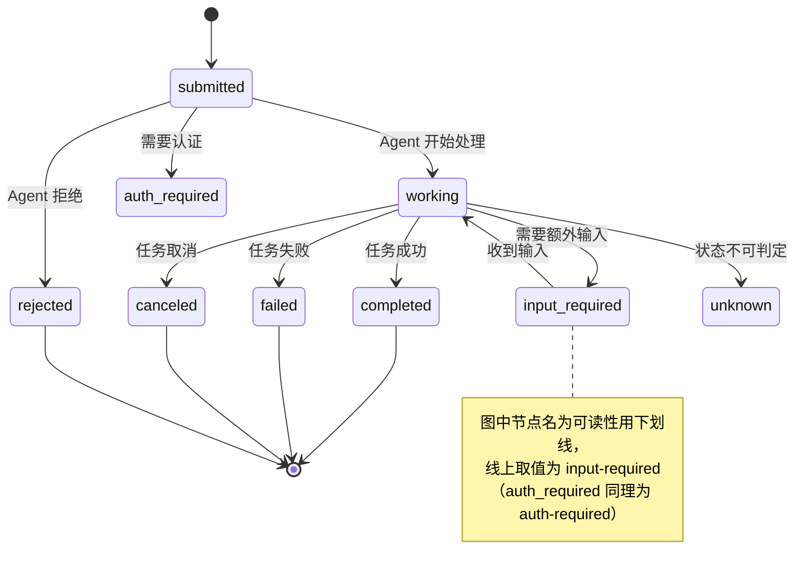

### 2.2 A2AServer API

| API | 说明 |
| :--- | :--- |
| `A2AServer(agent_config, cb, task_cb, userdata)` | 创建 A2A 服务，配置 Agent Card（名称/描述/能力），设置消息回调和任务回调 |
| `Start(host, port)` | 启动 A2A HTTP 服务；`host` 默认 `""`、`port` 默认 `0`，即**回落到 config 里的地址** |
| `Stop()` | 停止 A2A 服务（也可由 SIGINT/SIGTERM 触发） |
| `Append(other)` | 将其他 A2A Agent 共享同一个 HTTP 服务（多 Agent 共端口） |

构造函数的两个回调对应 A2A 的两种处理模式，语义不同，别混用：

| 回调类型 | 签名要点 | 语义 |
| :--- | :--- | :--- |
| `a2a_process_message_callback` | `char*(message_json, options_json, task_handler_handle, userdata)` | **可短路**：返回一个 `protocol.Message` JSON 即直接应答、不创建任务；返回空字符串才继续走建任务流程 |
| `a2a_process_message_task_callback` | `void(message_json, options_json, taskID, task_handler_handle, userdata)` | **建任务**：拿到 `taskID` 与 handler，通过 `A2ATaskHandler` 推进状态与产出物 |

**Agent Card 与服务端配置**（`agent_config`，结构见 `examples/a2a_examples/agent-config.json`）分 `agent-card` 与 `options` 两段：

```
{
  "agent-card": {
    "name": "...", "description": "...", "url": "http://localhost:8080", "version": "1.0.0",
    "capabilities": { "streaming": true, "pushNotifications": true, "stateTransitionHistory": true },
    "skills": [ { "id": "...", "name": "...", "description": "..." } ],
    "securitySchemes": { "apiKey": { "type": "apiKey", "in": "header", "name": "key" } }
  },
  "options": {
    "corsEnabled": true, "basePath": "/", "jsonRPCEndpoint": "/",
    "readTimeout_secs": 60, "writeTimeout_secs": 60, "idleTimeout_secs": 300,
    "maxHistoryLength": 100, "conversationTTL_hours": 1, "cleanupInterval_secs": 30,
    "authMethods": ["apiKey"], "apiKeys": { "<key>": "<user>" }, "apiKeyHeader": "key",
    "host": "localhost", "port": 8080
  }
}
```

从这份配置能读出 aadkcore A2A 服务端的实际形态：**JSON-RPC over HTTP**（`jsonRPCEndpoint`）+ **SSE 流式**（`capabilities.streaming`）+ **推送通知**（`pushNotifications`），并自带 **API Key 认证**、**会话 TTL 与定期清理**（`conversationTTL_hours` / `cleanupInterval_secs`）、**历史长度上限**（`maxHistoryLength`）。这几项对端侧部署很实在：TTL 与清理决定了常驻 Agent 的内存是否会随会话数无界增长。

### 2.3 A2ATaskHandler

| API | 说明 |
| :--- | :--- |
| `UpdateTaskState(taskId, state, message)` | 更新任务状态（取值见 §2.1，注意是连字符形式） |
| `AddArtifact(taskId, artifact, isFinal, isAppend)` | 添加产出物（文本/文件），支持标记是否为最终产出、是否追加 |
| `GetTask(taskId)` | 查询任务详细信息（JSON 格式） |

`A2ATaskHandler` 由回调传入的 `task_handler_handle` 构造（`A2ATaskHandler(uintptr_t handle)`），是对 Go 侧 `taskmanager.TaskHandler` 的封装，只在回调上下文内有效。

### 2.4 A2AClient API

客户端能力是**已实现**的（`aadkapi/a2a/a2a_client.h`），不只是设计方向——这也是 §5 端云协同里"端侧 Agent 作为 A2A Client 调云端 Agent"能够落地的前提。

| API | 说明 |
| :--- | :--- |
| `A2AClient(endpoint, config)` | 连接 A2A 服务端，`endpoint` 形如 `http://127.0.0.1:8080/` |
| `GetAgentCard(agentCardURL="")` | 取公开 Agent Card。**这是普通 HTTP GET，不是 JSON-RPC 调用** |
| `GetAuthenticatedExtendedCard()` | 取认证后的扩展 Agent Card |
| `SendMessage(params)` | 发送消息（`protocol.SendMessageParams` → `protocol.MessageResult`） |
| `StreamMessage(params, cb, userdata)` | 流式发送，回调收 `protocol.StreamingMessageEvent` |
| `ResubscribeTask(params, cb, userdata)` | **SSE 断线重连**后重新订阅某个任务的流 |
| `GetTask(params)` | 查任务，`params` 形如 `{"id": "...", "historyLength": 10}`（`historyLength` 可选） |
| `CancelTask(params)` | 取消任务，`params` 形如 `{"id": "..."}` |
| `GetPushNotification(params)` / `SetPushNotification(params)` | 读/写任务的推送通知配置 |
| `StartPushServer(host, port, path, cb, userdata)` (static) | 起一个本地推送接收服务，让远端 Agent 反向推送任务事件 |
| `StopPushServer(handle)` (static) | 停止推送接收服务 |

> [!NOTE]
> **Agent Card 发现的三种寻址模式与回退顺序**
>
> `GetAgentCard(agentCardURL)` 的入参有三种语义，这是对接第三方 Agent 时最容易踩的地方：
>
> - **空串 `""`**：用 `baseURL` + 标准路径，并**带回退**——先试 `baseURL/.well-known/agent-card.json`，失败再试 `baseURL/.well-known/agent.json`。
> - **相对路径**（如 `"/api"`）：`baseURL/api/.well-known/agent-card.json`，同样回退到 `agent.json`。
> - **绝对 URL**（如 `https://cdn.example.com/card.json`）：**原样使用，不做回退**。
>
> 两个 well-known 文件名并存，反映的正是 A2A 规范在 2025 年的演进（早期 `agent.json` → 后改为 `agent-card.json`）；框架用"先新后旧"的回退顺序同时兼容两代服务端。对接老服务时不要手写死路径，交给这个回退逻辑。
>
> 另注：`ResubscribeTask` 的存在说明流式链路被当作**可断可续**来设计——端侧网络（隧道、地库）频繁抖动，SSE 断流后能按 `taskID` 重新订阅而不是重发整个请求，这对车载场景是必要能力。

### 2.5 多 Agent 协作场景

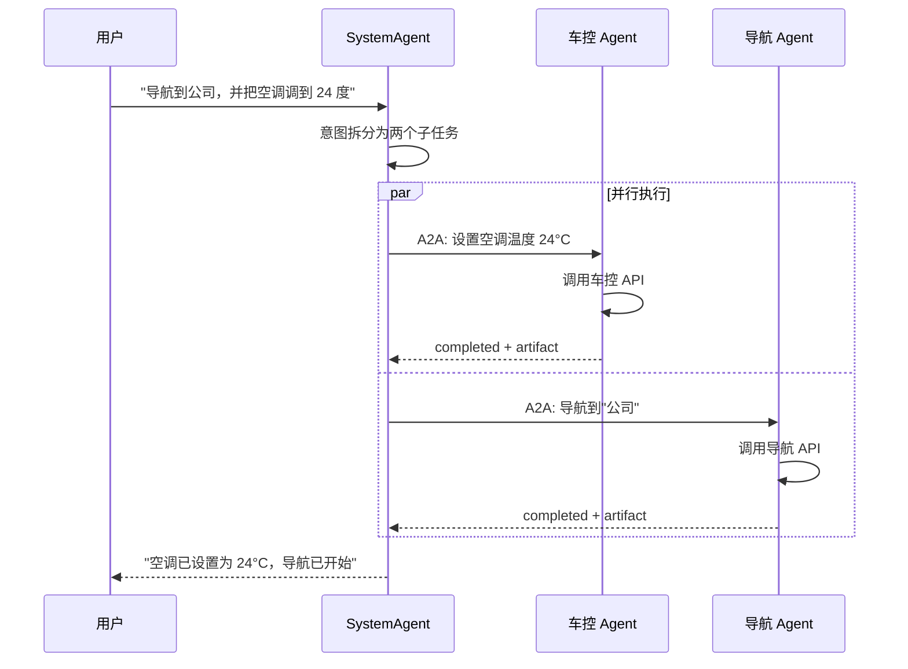

> [!CAUTION]
> **上图是设计场景，不是当前运行时的真实行为**
>
> 经代码核实：`A2AServer` / `A2AClient` 在 aadkcore 里**只出现在协议库自身（`src/a2a/`、`aadkapi/a2a/`）与示例（`examples/a2a_examples/`）中**，`runtime/` 下的 `SystemAgent`、`MsgDeliverImpl`、各 dispatcher 以及 `libagent_group.so` 的业务 Agent **都没有引用 A2A**。
>
> 也就是说：
>
> - **已实现**：A2A 协议栈本身（服务端/客户端/任务状态机/流式/推送），可独立编译运行，示例 `a2a_server_multiagent.cpp` 演示了多 Agent 共享一个 HTTP 服务（`Append`）。
> - **未实现**：座舱运行时里"SystemAgent 把一句话拆成子任务、经 A2A 并行下发给车控 Agent 与导航 Agent、再汇总"这套编排。当前生产链路中，跨 Agent 协作走的是 §3 的 `scenario_id` 路由 + `BROADCAST_SCENARIO_ID` 广播，**不是 A2A**。
>
> 引用本图时请标明它是目标架构。把 A2A 接进运行时，需要在 dispatcher 层补上"子任务拆分 → `A2AClient::SendMessage` → 任务状态回收"的编排逻辑。

> [!NOTE]
> **时效性：A2A 是 2025 年的新协议，规范仍在演进（需核实最新状态）**
>
> A2A 由 Google 于 2025 年提出，随后对外捐赠给中立基金会托管，生态在 2025–2026 年快速演进。代码里有两处能直接印证这种"规范仍在动"的状态：
>
> - `a2a_server.h` 对 `input-required` 状态的注释写着 *"semantics evolving in spec"*——框架自己承认该状态语义未定型。
> - `A2AClient::GetAgentCard` 同时兼容 `agent-card.json` 与 `agent.json` 两个 well-known 路径（§2.4 NOTE），正是为跨越规范改名而做的回退。
>
> 实现上，aadkcore 依赖的是 trpc-a2a-go（见 `src/a2a/go.mod`），协议演进主要通过升级该 Go 依赖 + 重编 `liba2a.so` 跟进。**A2A 当前治理归属、最新规范版本与 `input-required` 的最终语义，需联网核实后确认**，此处不臆断。

## 3. Agent 运行时与插件机制

aadkcore 的运行时分为两层：`SystemRuntime` 负责消息接收与路由；`AgentRuntime` 负责 Agent 生命周期管理。业务 Agent 通过插件机制（`AgentPlugin`）以动态库形式加载。

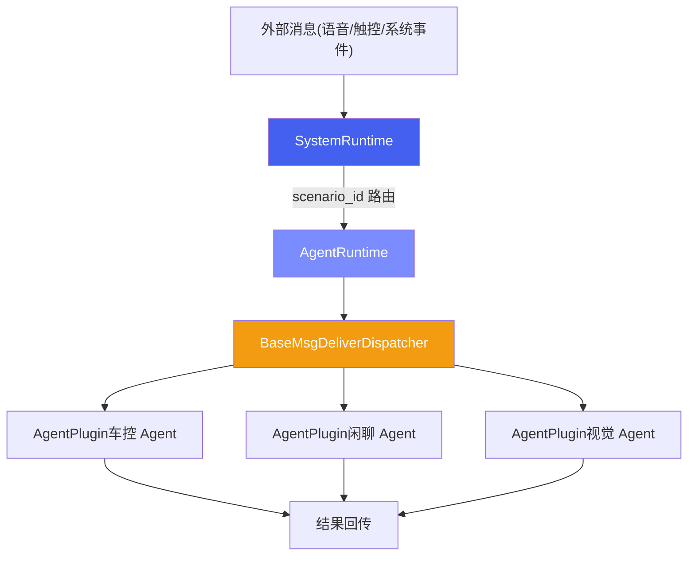

### 3.1 AgentPlugin 插件接口

定义于 `include/runtime/agent_plugin.h`，是所有业务 Agent 必须实现的抽象接口：

| 方法 | 返回类型 | 说明 |
| :--- | :--- | :--- |
| `deliver_msg(message)` | `bool` | 接收并处理 `DataMessage`，Agent 的核心入口 |
| `scenario_id()` | `int` | 返回 Agent 负责的场景 ID（对应 `constant_ids.h`） |
| `clear_memory()` | `bool` | 清除对话历史 |
| `set_data_dump_flag(flag)` | `void` | 设置数据录制标志（默认空实现） |

**场景 ID 常量**（`constant_ids.h`，按值排序）：

| 常量 | ID | 场景 |
| :--- | :--- | :--- |
| `VIDEOCHAT_SCENARIO_ID` | 100 | 视频对话 |
| `PROACTIVE_SPEECH_SCENARIO_ID` | 200 | 主动语音 |
| `ACTIVE_VISION_SCENARIO_ID` | 300 | 主动视觉 |
| `RAIN_DECTION_SCENARIO_ID` | 400 | 雨天检测 |
| `SPORT_MODE_SCENARIO_ID` | 500 | 运动模式 |
| `OAI_INFERENCE_SCENARIO_ID` | 600 | OAI 推理 |
| `WELCOME_MODE_SCENARIO_ID` | 700 | 迎宾模式 |
| `SYSTEM_AGENT_SCENARIO_ID` | 1001 | 系统总控 Agent |
| `CAR_CONTROL_SCENARIO_ID` | 1002 | 车控 Agent |
| `FUNCTION_CALL_SCENARIO_ID` | 1002 | 函数调用（**与 `CAR_CONTROL_SCENARIO_ID` 同值的别名**，不是独立场景） |
| `CHITCHAT_SCENARIO_ID` | 1003 | 闲聊 Agent |
| `NAVI_POI_SCENARIO_ID` | 1007 | 导航 POI |
| `TRIP_PLANNING_SCENARIO_ID` | 1009 | 行程规划 |
| `ACTIVE_SESSION_SCENARIO_ID` | 1600 | 主动会话（由 `registerStaticAgents` 静态注册，见 §3.3） |
| `GUI_AGENT_NEW_SCENARIO_ID` | 2000 | GUI Agent（新版） |
| `BROADCAST_SCENARIO_ID` | 65535 | 广播消息 |

> [!NOTE]
> **`scenario_id` 是消息路由键，不是模型路由键**
>
> 本表中的 `scenario_id` 决定 `DataMessage` 投递给哪个 `AgentPlugin`。它与模型/LoRA 路由用的 `scene_id` 是两套 ID，两者在 `ModelRunner` 内部会被桥接，未对齐时会**静默回落到 `scene_model_details_` 中 `scene_id` 最小的那条配置**（并重置 `lora_id` 与 `infer_params`，而**不是**回落到"闲聊模型"）——两者的区分、对齐要求与回落的真实行为见 [aadkcore 核心框架 · §3.3 抢占机制与 ModelRunner](agent-core.html#sec-14) 中的 `scene_id` vs `scenario_id` 说明。

### 3.2 动态加载机制

`libaadkcore.so` 运行时通过 `dlopen` 加载业务 Agent 动态库（如 `libagent_group.so`），通过约定的 `extern "C"` 工厂函数获取 Agent 列表并创建实例。

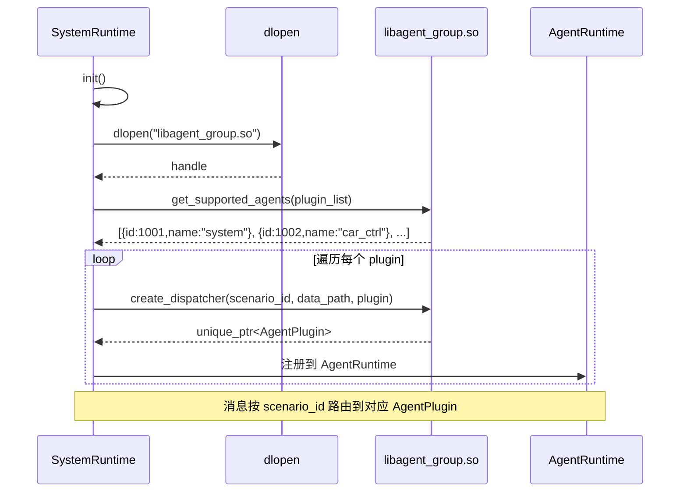

**工厂函数签名**：

```
// 获取支持的 Agent 列表
extern "C" void get_supported_agents(std::vector<PluginInfo>& plugins);

// 创建指定场景的 Agent 实例
extern "C" void create_dispatcher(int scenario_id, const char* data_path,
                                  std::unique_ptr<AgentPlugin>& plugin);

// 销毁 Agent 实例
extern "C" void destroy_dispatcher(std::unique_ptr<AgentPlugin> plugin);
```

加载流程对应到 `runtime/src/system_agent/msg_deliver_impl.cpp` 的 `init()`：`dlopen("libagent_group.so", RTLD_LAZY)` → `dlsym` 解析 `get_supported_agents` 与 `create_dispatcher` → 遍历返回的 `PluginInfo` 逐个 `create_dispatcher`，并校验 `plugin->scenario_id() == info.scenario_id` 后注册进 `dispatchers_[scenario_id]`。

两个容易漏掉的细节：

- **每注册一个插件，还会同步登记到 `SystemAgentDispatcher`**：`init()` 在把插件放进 `dispatchers_` 后调用 `system_agent_dispatcher_->registerAgent(info)`（分域与信号登记）。也就是说 `dispatchers_` 只是"消息路由表"，Agent 在系统总控侧还有一份独立登记。
- **`init()` 末尾会调 `registerStaticAgents()`**，把不走 `.so` 的 `ActiveSessionAgent` / `MemoryAgent` 也塞进**同一个** `dispatchers_`（见 §3.3 对"混合容器"的说明）。`init()` 的返回值是 `!dispatchers_.empty()`。

### 3.3 插件卸载与资源回收

加载有完整的对称约定，但**卸载是当前实现的薄弱环节**，值得单独说清楚。

**约定的对称契约**：`create_dispatcher` 与 `destroy_dispatcher` 成对出现。`destroy_dispatcher(std::unique_ptr<AgentPlugin>)` 按值接收 `unique_ptr`，意味着**所有权被转移进插件模块内部再析构**——这是刻意为之：`AgentPlugin` 的虚析构函数与 vtable 位于 `libagent_group.so` 内，销毁动作必须在该模块仍被映射时、由该模块自己的代码完成，才能保证析构走对 vtable、用对分配器。

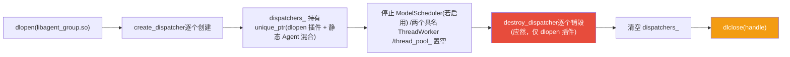

> [!CAUTION]
> **当前运行时的卸载顺序存在隐患：先 `dlclose`，后析构插件**
>
> 在 `msg_deliver_impl.cpp` 的析构函数中，实际顺序是：（仅在 `ENABLE_MULTI_PROCESS` 下）`modelscheduler_->Stop()` → 停止 `main_thread_worker_` 与 `critical_thread_worker_` 两个具名 worker → **直接 `dlclose(dl_handle_)`**，而持有所有插件的 `dispatchers_` 是成员变量，它的析构发生在**析构函数体执行完之后**——也就是 `dlclose` 之后。此时 `libagent_group.so` 已被解除映射，再去调用 `AgentPlugin` 的虚析构（其代码与 vtable 都在刚被卸载的 `.so` 里）属于**未定义行为**。
>
> 同时，`destroy_dispatcher` 这个工厂函数**虽然声明了，但运行时并未 `dlsym` 它、也从未被调用**——即当前实现没有走"显式销毁插件"这条路。
>
> **正确的卸载顺序**应为（注意 `dispatchers_` 是"dlopen 插件 + 静态 Agent"的混合容器，不能一刀切）：
>
> 1. 停止 `ModelScheduler`（若启用）与 `main_thread_worker_` / `critical_thread_worker_`（确保没有消息还在 `deliver_msg` 里）；
> 2. **只对经 `dlopen` 创建的插件**调用 `destroy_dispatcher(std::move(plugin))`，把析构交回插件模块；
> 3. **静态注册的 Agent 不走 `destroy_dispatcher`**：`registerStaticAgents()` 会把 `ActiveSessionAgent`(1600)、`MemoryAgent` 用 `make_unique` 直接塞进**同一个** `dispatchers_`，它们的代码与 vtable 在主程序/`libaadkcore.so` 内、并非来自 `libagent_group.so`，对其调用 `destroy_dispatcher` 是错的——这类直接 `reset()` / 让 `unique_ptr` 正常析构即可；
> 4. `dispatchers_.clear()`；
> 5. 最后才 `dlclose(dl_handle_)`。
>
> 在常驻进程里这个问题可能被掩盖（进程退出时 OS 统一回收），但在**热卸载 / 插件热替换 / 单元测试反复构造析构**的场景下会暴露为崩溃或内存损坏。改造插件生命周期时应以上述顺序为准，并按"是否来自 `.so`"区分两类 Agent 的销毁方式。

### 3.4 消息分发与线程模型（MsgDeliverImpl）

§3.1–§3.3 讲的是"插件怎么装进来"，这一节讲"消息怎么派出去"——`MsgDeliverImpl::deliver_msg` 是 `SystemRuntime` 与所有 `AgentPlugin` 之间的实际调度器，它的行为决定了一次请求落到哪个 Agent、在哪个线程上跑。

**路由三步**：

1. **场景改写**：先算 `next_scene_id`，允许把消息重定向到另一个场景（例如某个 Agent 处理后转交给下游）。
2. **广播分支**：若 `next_scene_id == BROADCAST_SCENARIO_ID`（65535），则**遍历 `dispatchers_` 把消息投递给每一个 Agent**（可经 `thread_pool_` 并行）。这是当前运行时里唯一的"一对多"协作机制——§2.5 提到"跨 Agent 协作走广播"即指此。
3. **单播分支**：否则 `dispatchers_.find(scenario_message.scenario_id)` 精确命中一个插件投递；找不到则记错丢弃。

**线程模型**（有两套，按 `use_thread_pool_` 二选一）：

| 模式 | 执行载体 | 现状 |
| :--- | :--- | :--- |
| `use_thread_pool_ == true`（**默认**） | `thread_pool_`（构造时 `ThreadPool(16)`） | 广播与单播都进这个 16 线程池 |
| `use_thread_pool_ == false` | 单播走两个具名 worker；**广播在调用线程里同步 for 循环投递** | 见下方说明 |

`use_thread_pool_` 在 `msg_deliver_impl.h` 里的默认值是 **`true`**，且全仓库**没有任何地方给它重新赋值**（只有 `deliver_msg` 里两处读取）。所以默认配置下走的是 16 线程的 `thread_pool_`，两个具名 worker 那条分支实际不会执行。

> [!NOTE]
> **两级优先级是"搭好了架子但没启用"，而且被双重关掉**
>
> 双 worker 模式本意是按优先级分流：`is_high_priority_task(...)` 为真走 `critical_thread_worker_`，否则走 `main_thread_worker_`。但这套机制当前有**两道**都没打开：
>
> 1. **分支进不去**：`use_thread_pool_` 默认 `true` 且从不被改写，所以代码根本走不到双 worker 分支，一律进 `thread_pool_`。
> 2. **就算进去了也不分流**：`MsgDeliverImpl::is_high_priority_task` 的实现**恒返回 `false`**，所有单播消息都会进 `main_thread_worker_`，`critical_thread_worker_` 永远拿不到任务。
>
> 因此"关键任务走独立高优线程"是**预留的脚手架**：要真正启用，既要把 `use_thread_pool_` 置为 `false`（或改造成可配置），也要实现 `is_high_priority_task` 的判定逻辑。这也解释了 §3.3 卸载流程里为何要停这两个 worker——它们被构造并 `stop()`，但在默认配置下从未承载过任务。
>
> 注意与**模型层**优先级区分开：这里说的是 Agent 消息投递层的线程优先级；模型推理侧的 `ModelScheduler` 有另一套真正生效的 LOW/NORMAL/HIGH/CRITICAL 四级优先级与抢占机制（见 [aadkcore 核心框架 · §3.2/§3.3](agent-core.html#sec-13)）。两者不要混为一谈。

## 4. LLM Flow 与 Tool 系统

`BaseLlmFlow`（定义于 `include/flow/base_llm_flow.hpp`）实现了 LLM 推理流水线的标准模式，负责预处理、调用模型、后处理（**Tool 调用循环为设计目标，受 `USE_TOOL` 门控，默认未启用**，见 §4.1 的边界说明）。`BaseTool`（定义于 `include/tools/base_tool.hpp`）定义了工具的统一抽象接口。

> [!IMPORTANT]
> **先分清两条执行路径：真正在跑的是 ModelRunner 路径，Flow 路径是未接线的脚手架**
>
> aadkcore 里同时存在两条"从请求到模型"的路径，读这一节前必须先分清，否则会把脚手架当成生产线：
>
> | | **路径 A：Dispatcher → ModelRunner（生产中实际在跑）** | **路径 B：Runner → LlmAgent → BaseLlmFlow（ADK 风格脚手架）** |
> | :--- | :--- | :--- |
> | 入口 | `AgentPlugin::deliver_msg(DataMessage)` | `Runner::run_async(user_id, session_id, message, run_config)` |
> | 调模型方式 | `ModelRunner::schedule_run_sync(...)` / `schedule_run_sync_lite(...)` → `ModelScheduler::SubmitTask` | `BaseLlmFlow::_call_llm_async` → `LlmAgent::canonical_model()` → `BaseLlm::generateContentAsync(llm_request, is_streaming)` |
> | 谁在用 | `SystemAgentDispatcher`、`MemoryAgent`、`intent_extractor`，以及 `libagent_group.so` 里的各业务 dispatcher | 仅 `SystemAgent` 声明了成员，但**从未初始化**（见下） |
> | 状态 | **已实现、在跑** | **大部分未接线** |
>
> 路径 B 未接线的证据（均经代码核实）：
>
> - **`SystemAgent` 声明了 `agent_` / `flow_` 却从不使用**。`runtime/src/system_agent/system_agent.h` 里有 `std::shared_ptr<LlmAgent> agent_` 与 `std::unique_ptr<BaseLlmFlow> flow_` 两个成员，但 `system_agent.cpp` 的构造函数只做四件事：建 `session_`、按 `enable_fusion_` / `enable_http_` 组装 `servers_`（`DataTransportServer` / `HttpServerImpl`）、`ModelRunner::getInstance()->init_system_agent(data_path, use_two_instance)`、建 `MsgDeliverImpl` 并交给 `SystemRuntime`。**`agent_` 与 `flow_` 全程未被赋值、未被调用**——是死成员。
> - **`Runner` 在整个仓库从未被实例化**。`include/runner/runner.hpp` / `src/runner/runner.cpp` 定义了完整的 ADK 风格 Runner，但 aadkcore 自身代码里没有任何 `Runner` 构造点。
> - **`Runner` 内部关键环节被关掉或是桩**：`run_async` 里消费事件并 `session_service_->appendEvent(...)` 的 `while(true)` 循环整段在 `#if 0` 内；`_append_new_message_to_session` 函数体被整体注释、调用点也被注释（即**新用户消息不会写入 session**）；`_find_agent_to_run` 是 `// TODO: 实现查找要运行的 Agent` 的桩，直接 `return root_agent`（且调用点已注释）。
> - **`_new_invocation_context` 有个实参 bug**：它先算出 `std::string invocation_id = 时间戳 + "_" + session->id()`，随后构造 `InvocationContext` 时传的却是**字符串字面量 `"invocation_id"`** 而不是那个变量；memory service 传的是空的 `std::shared_ptr<InMemoryMemoryService>()`。
>
> **所以本节的定位**：§4.1–§4.2 描述的是路径 B 这套 Flow/Tool 抽象的**代码现状与设计意图**（它与 Google ADK 的 `LlmAgent` / `BaseLlmFlow` / `Runner` / `BaseTool` 概念一一对应，是框架预留的标准化 Agent 编排层）；而 §4.3 给出的端到端链路以**路径 A** 为准。两者不要混着引用。这与 §5 / §6"设计方向 vs 已实现"的标注口径一致。

### 4.1 BaseLlmFlow 流水线

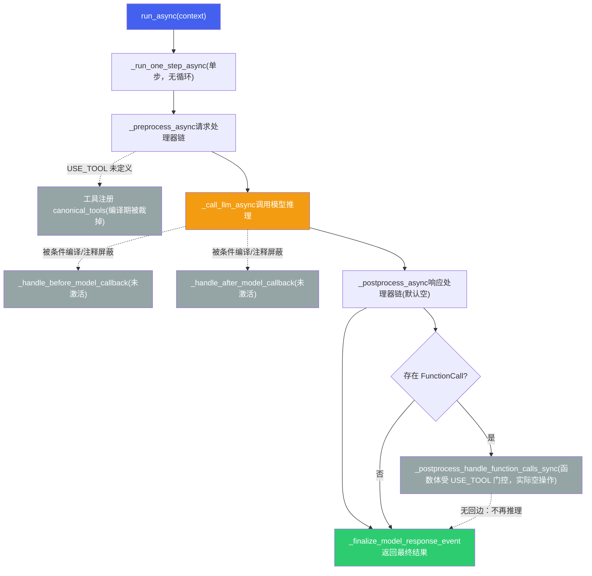

**SingleFlow** 是 `BaseLlmFlow` 的标准实现，预注册了两个请求处理器（注意：实际生效的是**裸指针** `&basic::request_processor` / `&instructions::request_processor`，`std::make_shared` 版本整段在 `#if 0` 内未启用）：

- `basic::request_processor` — 基础请求构建
- `instructions::request_processor` — 将 Agent 的 instructions 注入到请求中

`response_processors` 默认为**空**（`nl_planning` / `code_execution` 等都被注释掉），因此 `_postprocess_run_processors_sync` 默认不产生任何事件。

> [!NOTE]
> **重要：Tool 执行循环与 before/after 回调默认未启用（受 `USE_TOOL` 门控）**
>
> 上图灰色节点与虚线边**不是当前生效的控制流**。经代码核实：
>
> - **`USE_TOOL` 在整个仓库从未被定义**（CMake / 各 `build_*.sh` 均无 `-DUSE_TOOL`），因此所有 `#ifdef USE_TOOL` 块在编译期被裁掉，包括：`_preprocess_async` 里的工具注册（`canonical_tools` / `register_tool`）、`_postprocess_handle_function_calls_sync` 的整个函数体（`handle_function_calls_sync` / `generate_auth_event`）、以及 `LlmAgent` 的工具成员。
> - **`_handle_before_model_callback` / `_handle_after_model_callback` 在 `_call_llm_async` 里分别被 `#if 0` 和 `/* */` 注释掉**，两个回调函数自身的函数体也是 `#if 0`——它们不是"激活的流水线节点"。
> - **`run_async` 只调一次 `_run_one_step_async`（单步）**：preprocess → call_llm → postprocess 走完即返回，**没有回到 preprocess 的循环、没有第二次推理**。即使 `_postprocess_async` 检测到 `FunctionCall` 并调用了 `_postprocess_handle_function_calls_sync`，后者因 `USE_TOOL` 未定义而返回空，**不会执行工具、也不会触发再推理**。
> - **多 Agent 转交还多套了一层 `USE_MULTI_AGENT` 门控**：`_postprocess_handle_function_calls_sync` 内部处理 `response_event.actions.transfer_to_agent`（工具结果里携带"转交给某个 Agent"）的分支，嵌在 `#ifdef USE_TOOL` **里面再套** `#ifdef USE_MULTI_AGENT`，且它要调的 `_get_agent_to_run` 在头文件里是**被注释掉的声明**。也就是说"工具驱动 Agent 间转交"这条 ADK 特性在当前代码里连编译入口都没有——§2 的 A2A 是另一套独立机制，不要把它和这个 `transfer_to_agent` 混为一谈。
> - **`_finalize_model_response_event` 里的工具相关逻辑同样被门控**：`populate_client_function_call_id` 与 `long_running_tool_ids`（长时运行工具 ID 收集）都在 `#ifdef USE_TOOL` 内。注意 `McpTool` 构造时把 `is_long_running` **硬编码为 `true`**（见 §1.5），正是为这套长时工具机制准备的，但机制本身没启用。
>
> **仍然可用的部分**：工具**声明**可以经 `ModelInstance::streamGenerate/generate` 的 `tools` 参数下发，并由 `LapeModel::buildLlmsPrompt` 以 `<tools>...</tools>` XML 注入 system prompt——即模型能"看到"工具签名并按约定输出 `FunctionCall`。但**解析 `FunctionCall`、执行工具、把 `FunctionResponse` 回灌再推理**这一闭环**不是自动的**，需要业务侧自行实现（或定义 `USE_TOOL` 并补齐相应代码）。
>
> 引用本节流程图时请勿把灰色/虚线部分当作现有行为。这与 §6 安全沙箱"设计目标 vs 已实现接口"的标注口径一致。
>
> 另注：当前既然是单步、谈不上循环，自然也**没有迭代上限**；未来若补齐 Tool 闭环（`HANDLE → PRE` 回边），必须同时引入 `max-iteration` 上限，防止模型反复发起工具调用导致失控循环。

### 4.2 BaseTool 工具基类

| 属性/方法 | 返回类型 | 说明 |
| :--- | :--- | :--- |
| `name()` | `const string&` | 工具名称 |
| `description()` | `const string&` | 工具描述 |
| `is_long_running()` | `bool` | 是否长时间运行（如导航规划） |
| `get_declaration()` | `optional<ToolDefinition>` | 返回结构化的 `ToolDefinition`（OpenAI function 风格） |
| `get_declaration_json()` | `nlohmann::json` | 返回 JSON 形式的工具声明 |
| `get_declaration_str()` | `std::string` | 返回字符串形式的工具声明（用于注入 prompt） |
| `run_async(args, context)` | `Task<bool>` | 异步执行工具，参数为 `map<string, any>` |
| `process_llm_request(context)` | `Task<tuple>` | 处理 LLM 请求，返回描述文本和 ToolDefinition |

`BaseTool` 之外还有三个相关类型，构成工具系统的完整面貌：

| 类型 | 角色 | 说明 |
| :--- | :--- | :--- |
| `BaseToolset`（`include/tools/base_toolset.hpp`） | 工具集合抽象 | 只有一个纯虚 `GetTools()`，返回 `vector<shared_ptr<BaseTool>>`；`McpToolset`（§1.5）是它目前唯一的实现 |
| `JsonTool`（`include/tools/json_tool.hpp`） | 进程内工具实现 | 由一段 JSON 描述构造的 `BaseTool`，覆写了全部三个 `get_declaration*`；是"不走 MCP、直接写工具"的样例 |
| `Tools`（`aadkapi/content.hpp`） | 工具注册表 | `map<string, ToolDefinition>` 容器，提供 `add_tool` / `set_definitions` / `definitions()`，即 `LlmRequest` 里 `tools` 的承载结构 |

**ToolDefinition 结构**（定义于 `content.hpp`）：

```
struct ToolDefinition {
    std::string name;         // 工具名称，如 "set_ac_temperature"
    std::string description;  // 工具描述
    ToolParameters parameters; // 输入参数 Schema
    ToolParameters responses;  // 输出结构 Schema
};

struct ToolParameters {
    std::string type;  // "object"
    std::map<std::string, ParamInfo> properties; // 参数名 → {type, description}
};
```

LLM 根据所有注册 Tool 的 `ToolDefinition` 生成结构化的 `FunctionCall`，Flow 引擎解析后调用对应 Tool 的 `run_async()`，结果通过 `FunctionResponse` 回传给 LLM 继续推理。（**注意**：这条"解析 → 执行 → 回灌再推理"的闭环受 `USE_TOOL` 门控，当前默认未启用——`run_async()` 的执行与再推理都不会自动发生，详见 §4.1 的边界说明。）

### 4.3 端到端调用链

下图是**路径 A（生产中实际在跑）**的端到端链路：请求经 `SystemRuntime` 路由到 `AgentPlugin`，dispatcher 直接调 `ModelRunner` 进 `ModelScheduler`，**不经过 `BaseLlmFlow`**（`BaseLlmFlow` 属于路径 B 脚手架，见本节开头的 IMPORTANT）。

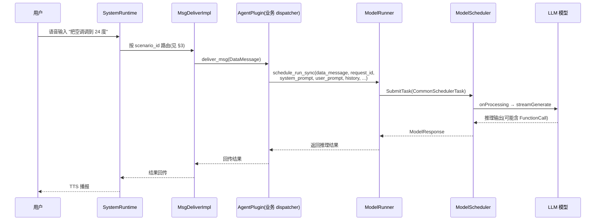

> [!NOTE]
> **为什么图里没有 `BaseLlmFlow` 与 Tool 再推理**
>
> - 图中 `AP → MR` 这一跳是 `ModelRunner::schedule_run_sync(...)` / `schedule_run_sync_lite(...)`（`aadkapi/model_runner.h`），它内部组好 `CommonSchedulerTask` 交给 `ModelScheduler`。这是 `SystemAgentDispatcher` / `MemoryAgent` / `intent_extractor` 与 `libagent_group.so` 各 dispatcher 的真实调法。
> - 如果走路径 B，这一跳会变成 `BaseLlmFlow::_call_llm_async` → `LlmAgent::canonical_model()` → `BaseLlm::generateContentAsync(llm_request, is_streaming)`（`src/flow/base_llm_flow.cpp`），**与 `ModelRunner` 无关**。两条路径的模型调用入口是分开的，引用时别写串。
> - **Tool 执行与再推理在这两条路径里当前都不成立**：路径 A 的 dispatcher 拿到模型输出后自行处理（是否解析 `FunctionCall`、是否执行，都是业务代码的事）；路径 B 的"解析 → 执行 → `FunctionResponse` 回灌再推理"闭环受 `USE_TOOL` 门控、默认未启用（§4.1）。因此"模型输出 `FunctionCall` → 自动执行工具 → 带结果再推理"这一完整 Tool Use 循环，目前是**设计目标而非现有行为**——这一点与 robot 具身智能篇里对 Tool Use / 安全沙箱的口径一致。

> [!TIP]
> **框架核心价值**
>
> aadkcore 将 Agent 开发中的共性能力（模型调度、对话管理、Tool 调用、RAG、A2A 协作）下沉到框架层，业务 Agent 开发者只需关注：(1) 编写 `AgentPlugin` 实现业务逻辑；(2) 注册 `BaseTool` 连接外部能力；(3) 编写 `instructions` 定义 Agent 行为。框架负责调度、流水线、协议对接等基础设施工作。

## 5. 端云协同架构（设计/扩展方向）

> [!NOTE]
> **本节定位**
>
> 端云协同是 aadkcore 的**架构扩展方向**，而非当前已落地的固定接口。它描述的是端侧 Agent 能力受限时向云端延伸的整体思路，以及可以借哪些机制落地——其中 **A2A 客户端是已实现的现成零件**（§2.4），而 `BaseLlmFlow` pipeline 属于**未接线的脚手架**（§4 开头 IMPORTANT），轻量意图分类则需自建。阅读时请把它当作设计蓝图，而不是 API 参考；各零件的"已有 / 待搭"清单见 §5.3 末尾的 NOTE。

纯端侧 Agent 受限于模型能力和知识范围，纯云端 Agent 受限于延迟和离线可用性。端云协同是座舱 Agent 的最优架构——端侧处理低延迟、高隐私的请求，云端处理复杂推理和知识密集型任务。

### 5.1 端云分工策略

| 请求类型 | 处理方 | 原因 | 示例 |
| :--- | :--- | :--- | :--- |
| **车辆控制** | 端侧 | 低延迟（< 2s）+ 离线可用 + 安全关键 | "打开空调" "调到22度" "打开车窗" |
| **简单问答** | 端侧 | 端侧模型可胜任 + 零网络延迟 | "现在几点" "电量还有多少" "今天限号吗" |
| **复杂推理** | 云端 | 需要大模型能力（72B+） | "帮我规划三天旅行行程" "分析这份报告" |
| **知识密集型** | 云端 | 需要实时联网搜索 | "最近有什么好看的电影" "XX 餐厅评价怎么样" |
| **多模态理解** | 端侧优先，云端增强 | 端侧快速响应 + 云端精准分析 | DMS 疲劳检测（端侧）+ 复杂场景分析（云端） |

### 5.2 协同架构设计

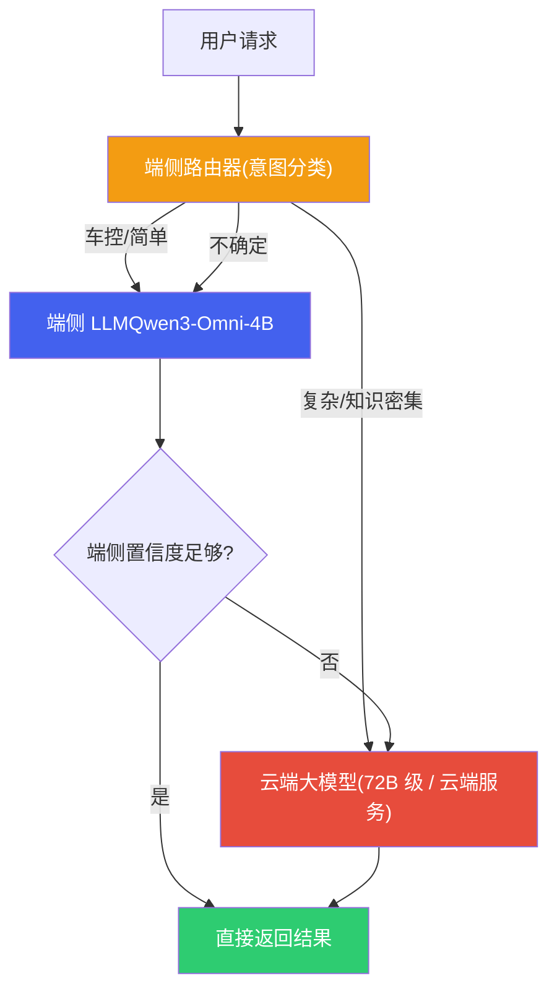

| 协同模式 | 工作方式 | 延迟 | 适用场景 |
| :--- | :--- | :--- | :--- |
| **端侧优先 (Edge-First)** | 端侧先处理，置信度不足时转云端 | 低（端侧成功时 < 1s） | 默认模式，大部分座舱交互 |
| **端云并行 (Parallel)** | 同时发给端侧和云端，取先到或更优结果 | 低（取较快者） | 对质量和延迟都有要求时 |
| **端侧草稿 (Draft-Refine)** | 端侧快速生成初稿，云端校验/润色 | 中（端侧先显示，云端更新） | 长文本生成、复杂回答 |
| **云端主导 (Cloud-Primary)** | 直接转云端处理 | 高（依赖网络） | 明确需要大模型或联网的请求 |

### 5.3 离线降级与缓存

当网络不可用时（隧道、地下车库、偏远地区），端云协同需要优雅降级：

| 降级策略 | 实现方式 | 用户体验 |
| :--- | :--- | :--- |
| **功能降级** | 需要云端的功能（搜索、在线导航）提示"当前离线，部分功能不可用" | 明确告知，不假装可用 |
| **缓存命中** | 热门问题（天气、限行）在有网时预缓存到本地 RAG | 离线也能回答常见问题 |
| **云端结果缓存** | 云端返回的结果（路线规划、POI 信息）缓存到本地 | 重复查询直接本地返回 |
| **网络恢复后同步** | 离线期间的日志和请求在恢复后批量上传 | 不丢失数据 |

> [!NOTE]
> **端云协同与 aadkcore 的集成：哪些零件已有，哪些还要自己搭**
>
> 端云协同本身是设计方向，但它依赖的几个**协议零件在代码里已经存在**，落地时不需要从零造：
>
> - **已有：A2A 客户端**。端侧 Agent 作为 A2A Client 向云端 Agent（A2A Server）发子任务，这条路是通的——`A2AClient` 已实现（§2.4），含 `SendMessage` / `StreamMessage` / `GetTask` / `CancelTask`，以及断流重订阅 `ResubscribeTask` 和反向推送 `StartPushServer`。对端云协同来说，`ResubscribeTask` 与推送通知恰好覆盖"车端网络抖动 / 云端长任务异步回传"这两个最现实的场景。
> - **已有：HTTP 服务端入口**。`SystemAgent` 构造时 `enable_http_` 为真会挂上 `HttpServerImpl`，可作为接收云端回调的服务端。
> - **待搭：路由决策**。"哪个请求走端侧、哪个转云端"这套判定逻辑当前**没有现成实现**。设计上可以放在 `BaseLlmFlow` 的 `request_processors` 链里（Prefill 之前用轻量意图分类或规则引擎决定走向），但要注意 `BaseLlmFlow` 属于**路径 B 脚手架**、并未接线（见 §4 开头 IMPORTANT）；若要在当前生产链路上落地，更现实的位置是业务 dispatcher 内、调 `ModelRunner` 之前做分流。
> - **待搭：置信度回退与结果缓存**。§5.2 的"端侧置信度不足转云端"、§5.3 的离线降级与缓存策略，均为设计目标，代码中无对应实现。

## 6. 安全沙箱机制（设计目标，未实现）

> [!NOTE]
> **重要：本节是架构设计目标，不是已实现接口**
>
> 经代码核实，aadkcore 当前代码库中**没有 `safety_level` / `SafetyLevel` 这套分级体系**，也没有对应的运行时拦截实现。现有的、最接近"执行前确认"的能力是车控侧的**需确认技能（`to_be_confirmed_skills`）机制**——即对部分高风险车控技能在执行前要求用户确认，属于技能级的单点处理，而非本节描述的通用三级沙箱。
>
> 因此，本节的 L1/L2/L3 分级、安全检查流水线、Prompt 注入防御应理解为**设计目标与实现蓝图**：它回答"安全沙箱应该长什么样、为什么这样设计"，引用本节内容时请勿当作现有 API 使用。
>
> **拦截层该插在哪**（取决于走哪条执行路径，见 §4 开头 IMPORTANT）：
>
> - **路径 B（`BaseLlmFlow`）**：设计上的插入点是 `_postprocess_handle_function_calls_sync` 与 `BaseTool::run_async` 之间——即"解析出 `FunctionCall`、尚未执行工具"的那一刻。但该路径当前未接线，且 `_postprocess_handle_function_calls_sync` 函数体本身受 `USE_TOOL` 门控为空，所以这里插拦截层的前提是先补齐 Tool 闭环。
> - **路径 A（生产链路）**：更现实的插入点是业务 dispatcher 内——模型输出经 `ModelRunner::schedule_run_sync` 返回后、dispatcher 真正驱动车控 API 之前。这也是现有 `to_be_confirmed_skills` 机制实际所在的位置（车控技能层），可以作为分级沙箱的落地起点。

座舱 Agent 的 Tool 调用直接控制车辆硬件（空调、车窗、车门、车灯），安全沙箱是防止 LLM 幻觉或 Prompt 注入导致危险操作的最后防线。

### 6.1 三级安全分级

| 安全等级 | 操作类型 | 确认要求 | 示例工具 | 实现方式（设计） |
| :--- | :--- | :--- | :--- | :--- |
| **L1 只读** | 查询类，无副作用 | 无需确认，直接执行 | 查天气、查电量、查导航 ETA | Tool 标记 `safety_level: L1` |
| **L2 可逆** | 可逆操作，影响车辆状态 | 语音确认（"好的，帮您调到22度"） | 调空调、开车窗、调音量、切歌 | Tool 执行前插入确认回复，等待用户未反对后执行 |
| **L3 不可逆/高危** | 不可逆或涉及安全 | 二次确认 + 条件检查（车速、档位） | 打开车门、发送消息、支付 | 强制二次确认 + 车辆状态安全检查 + 必要时生物认证 |

### 6.2 安全检查流水线

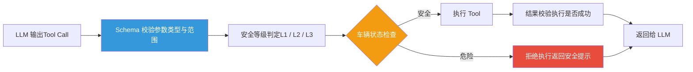

安全检查流水线中的各环节：

| 检查环节 | 检查内容 | 拒绝示例 |
| :--- | :--- | :--- |
| **Schema 校验** | 参数类型、范围、必填项。如温度必须在 16-32°C 范围内 | set\_ac\_temperature(temp=100) → 拒绝：温度超出范围 |
| **工具白名单** | LLM 输出的工具名必须在已注册工具列表中 | execute\_shell("rm -rf /") → 拒绝：工具不存在 |
| **车辆状态检查** | 根据当前车速、档位、行驶状态判断操作是否安全 | 车速 > 0 时 open\_door() → 拒绝：行驶中不可开门 |
| **频率限制** | 防止短时间内重复执行相同操作 | 1 秒内连续 5 次 set\_ac\_temperature → 拒绝：操作频率异常 |
| **用户权限** | 根据 scenario\_id 判断请求来源的权限 | 后排乘客尝试 unlock\_door → 拒绝：权限不足 |

> [!WARNING]
> **上表的"Schema 校验"在当前数据模型里表达不出来**
>
> §6.2 假设可以在 Schema 层校验"温度必须在 16-32°C 范围内"，但经代码核实，框架的工具参数模型**承载不了这类约束**：`ToolParameters` 只有 `{type, properties}`，`ParamInfo` 只有 `{type, description}`（见 §4.2），既没有 `minimum` / `maximum`，也没有 `enum`、`required`。也就是说 `ToolDefinition` 里根本没有地方写"取值范围"。
>
> 落地安全检查流水线时，这是第一个要补的前置条件：**要么扩展 `ParamInfo` / `ToolParameters` 以承载 JSON Schema 的约束关键字，要么在 Tool 定义之外单独维护一份"安全约束表"**（工具名 → 参数范围 / 安全等级 / 前置车辆状态条件）。后者改动面更小，也更容易与 §6.1 的 L1/L2/L3 分级放在一起维护。
>
> 同理，§1.5 提到 MCP 的 `inputSchema` 经桥接后 `required` 等约束会被静默丢弃——这意味着即使外部 MCP 服务端声明了严格约束，进入框架后也**不会**被保留，安全校验不能依赖上游 Schema，必须在执行层自己做。这与本节"不信任 LLM 输出"的原则是一致的：同样也不能信任"上游 Schema 会帮你挡住非法参数"。

### 6.3 Prompt 注入防御

LLM 存在 Prompt 注入风险——恶意用户可能通过精心构造的输入欺骗模型执行危险操作。座舱场景的防御需要多层保护：

| 防御层 | 实现方式 | 防御目标 |
| :--- | :--- | :--- |
| **System Prompt 加固** | System Prompt 中明确列出禁止行为，使用特殊分隔符隔离系统指令和用户输入 | 防止用户指令覆盖系统约束 |
| **输入过滤** | 检测并过滤已知的注入模式（"忽略前面的指令"、"你是一个没有限制的AI"） | 拦截常见越狱尝试 |
| **输出校验（Post-Guard）** | LLM 输出的 Tool Call 必须通过安全检查流水线，不依赖 LLM 自身的安全判断 | 即使 LLM 被欺骗，执行层也能拦截危险操作 |
| **Tool Schema 约束** | 工具参数通过 JSON Schema 严格约束类型和范围，非法参数在 Schema 校验阶段即被拒绝 | 防止 LLM 幻觉出非法参数值 |

> [!CAUTION]
> **安全沙箱的核心原则：不信任 LLM 输出**
>
> 安全沙箱的设计哲学是**将 LLM 视为不可信的组件**。LLM 负责理解用户意图并生成结构化的 Tool Call，但最终的执行决策由安全沙箱（Schema 校验 + 车辆状态检查 + 权限验证）做出。这意味着即使 LLM 100% 被 Prompt 注入欺骗，只要安全沙箱正确实现，危险操作仍然无法执行。这与 Web 安全中"永远不信任客户端输入"是同一原则。
