# 4. 协议与运行时执行

*MCP 工具协议 · A2A 协议 · Agent 运行时与插件机制 · LLM Flow 与 Tool 系统*

> [!TIP]
> **本篇讲什么**
>
> aadkcore 的**协议与执行主线**——模型能力如何对外暴露为工具、多 Agent 如何协作、业务插件如何被加载/卸载、一次请求如何在 Flow 流水线里走完 Tool 调用循环：
>
> - MCP 工具协议（四种传输、服务端/客户端生命周期、握手与能力发现）
> - A2A 协议（任务状态机、多 Agent 协作）
> - Agent 运行时与插件机制（SystemRuntime / AgentRuntime、AgentPlugin 加载与卸载生命周期）
> - LLM Flow 与 Tool 系统（BaseLlmFlow 流水线、BaseTool、端到端调用链）
> - 扩展与设计方向：端云协同架构、安全沙箱机制（**均为设计目标，非已实现接口**，见 §5 / §6）
>
> 模型 / 对话 / 调度主线（ModelInstance、ModelScheduler、ChatHistory、RAG）见 [aadkcore 核心框架](agent-core.html)。
>
> **代码基线**：aadkcore 仓库 `src/`（`runtime` / `agent` / `flow` / `tools` / `a2a` 等模块）、`aadkapi/tools/mcp/`、`include/runtime/`、`runtime/src/system_agent/`。

## 1. MCP 工具协议

MCP（Model Context Protocol）是 LLM 与外部工具的标准通信协议。`McpServer`（定义于 `aadkapi/tools/mcp/mcp_server.hpp`）实现了 MCP 服务端，支持将车辆控制 API、导航 API 等外部能力暴露为 LLM 可调用的 Tool。

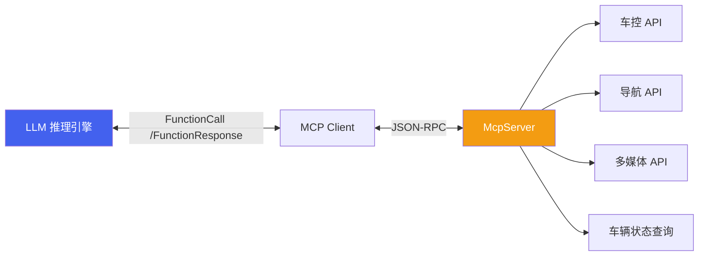

### 1.1 四种传输类型

| 枚举值 | 传输类型 | 说明 | 适用场景 |
| :--- | :--- | :--- | :--- |
| `MCP_TRANSPORT_STDIO` | STDIO | 标准输入/输出通信 | 本地进程间通信 |
| `MCP_TRANSPORT_SSE` | SSE | Server-Sent Events | Web 单向推送 |
| `MCP_TRANSPORT_HTTP` | HTTP | HTTP 请求/响应 | RESTful 调用 |
| `MCP_TRANSPORT_FUSION` | Fusion | 自定义融合协议 | 车载系统内部通信 |

> [!NOTE]
> **`param` 的含义随传输类型而变**
>
> `McpServer::Start(transport_type, param)` 与 `McpSessionManager` 构造里的 `param` 是同一个"传输参数"字符串，但解释方式取决于传输类型：STDIO 下通常是子进程/命令标识，SSE / HTTP 下是监听地址或路径，FUSION 下是车载 IPC 的服务名（如示例里的 `"car_mcp"`）。跨传输迁移时不要假设 `param` 语义一致。

### 1.2 服务端核心 API

| API | 说明 |
| :--- | :--- |
| `McpServer(name, version)` | 构造 MCP 服务实例，指定服务名称和版本 |
| `AddTool(param, callback)` | 注册工具，param 为 JSON 描述（名称/描述/参数 Schema），callback 处理调用 |
| `AddPrompt(param, callback)` | 注册 Prompt 模板 |
| `AddResource(param, callback)` | 注册数据资源（URI + 描述） |
| `AddResourceTemplate(param, callback)` | 注册资源模板 |
| `Start(transport_type, param)` | 启动 MCP 服务，指定传输类型和参数 |
| `AddServer(server, path)` (static) | 注册 MCP 服务器实例到指定路径 |
| `StartServers(config, transport, addr, port)` (static) | 批量启动所有已注册的 MCP 服务器 |

### 1.3 传输握手与生命周期

MCP 的可用性依赖"先握手、再发现、后调用、终关闭"的完整生命周期。aadkcore 把服务端与客户端拆成两个类：服务端 `McpServer` 负责注册与监听，客户端 `McpSessionManager`（定义于 `aadkapi/tools/mcp/mcp_session_manager.hpp`）负责连接、能力发现与调用。

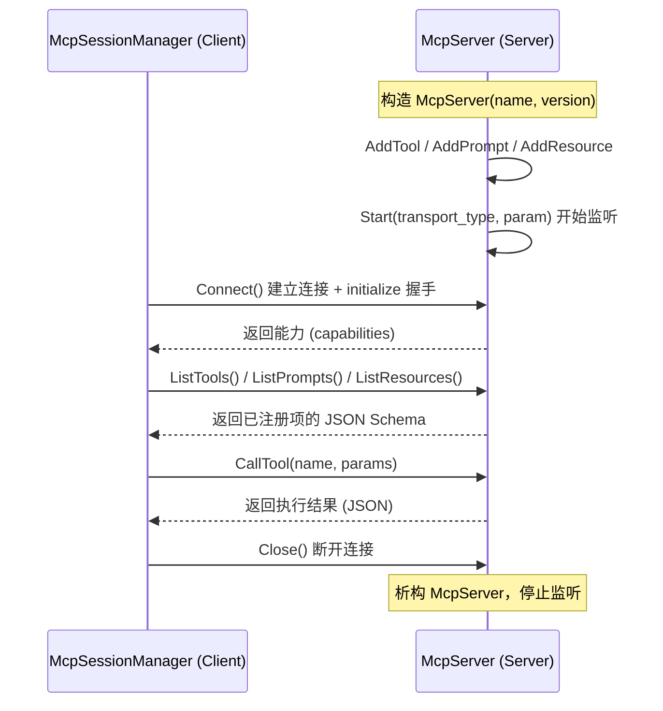

**服务端生命周期**（`McpServer`）：

| 阶段 | 动作 | 说明 |
| :--- | :--- | :--- |
| 1. 构造 | `McpServer(name, version)` | 声明服务名与版本，作为握手时上报的身份信息 |
| 2. 注册 | `AddTool / AddPrompt / AddResource / AddResourceTemplate` | 在 `Start` 之前完成注册；callback 以 `shared_ptr` 持有，生命周期随 server |
| 3. 启动 | `Start(transport_type, param)` | 按传输类型建立监听；多服务场景用 `AddServer` + `StartServers` 批量启动 |
| 4. 销毁 | 析构 `~McpServer()` | 释放 `handle_` 与注册的 callback |

**客户端生命周期**（`McpSessionManager`）：

| 阶段 | API | 说明 |
| :--- | :--- | :--- |
| 1. 构造 | `McpSessionManager(transport_type, param)` | 选定传输类型与目标参数，但**尚未连接** |
| 2. 握手 | `Connect()` | 建立连接并完成 initialize 握手，返回 false 表示连接失败 |
| 3. 能力发现 | `ListTools() / ListPrompts() / ListResources() / ListResourceTemplates()` | 拉取服务端注册项的 JSON Schema，供 LLM 生成合法 `FunctionCall` |
| 4. 调用 | `CallTool(tool_name, params) / GetPrompt(...) / ReadResource(uri)` | 按名字调用工具/模板/资源，返回 JSON 结果 |
| 5. 关闭 | `Close()` | 断开连接；析构时兜底释放 `handle_` |

> [!CAUTION]
> **客户端必须显式 `Close()`，且调用前要检查 `Connect()` 返回值**
>
> `McpSessionManager` 的 `Connect()` 返回 `bool`——连接失败时后续 `ListTools` / `CallTool` 的行为是未定义的（取决于底层传输实现），调用方必须先判 `Connect()` 成功再进入发现/调用阶段。同理，`Close()` 需要显式调用以释放会话资源；不要依赖析构来隐式断开。对长生命周期的 Tool 客户端（常驻进程），建议复用同一个 session 而不是每次调用都 `Connect`/`Close`，避免握手开销。

### 1.4 注册工具代码示例

```
// 创建 MCP Server
auto mcp_server = std::make_shared<McpServer>("car_control", "1.0.0");

// 注册"设置空调温度"工具
nlohmann::json tool_param = {
    {"name", "set_ac_temperature"},
    {"description", "设置车内空调温度"},
    {"inputSchema", {
        {"type", "object"},
        {"properties", {
            {"temperature", {{"type", "number"}, {"description", "目标温度(°C)"}}},
            {"zone", {{"type", "string"}, {"description", "音区: 主驾/副驾/全车"}}}
        }},
        {"required", {"temperature"}}
    }}
};

mcp_server->AddTool(tool_param,
    [](uintptr_t session, nlohmann::json& req) -> nlohmann::json {
        double temp = req["temperature"];
        // 调用车控底层 API 设置温度...
        return {{"status", "success"}, {"temperature", temp}};
    });

// 启动服务
mcp_server->Start(McpServer::MCP_TRANSPORT_FUSION, "car_mcp");
```

## 2. A2A 协议

A2A（Agent-to-Agent）是多 Agent 间通信标准，遵循 [a2a-protocol.org](https://a2a-protocol.org) 规范。`A2AServer`（定义于 `aadkapi/a2a/a2a_server.h`）实现了 A2A 服务端，支持 Agent 间的任务委托、状态同步和结果传递。

### 2.1 任务状态机

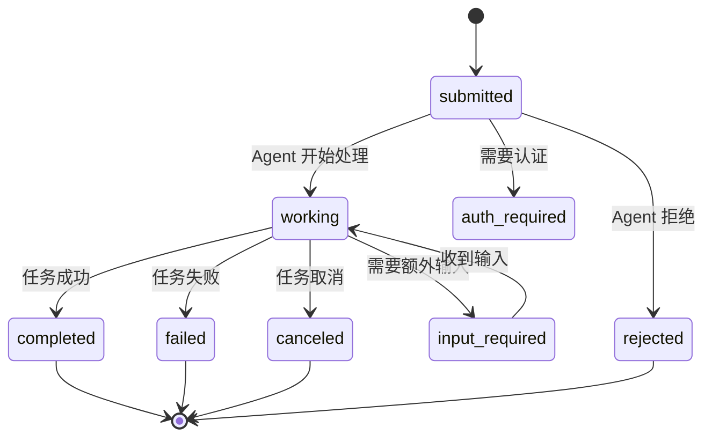

### 2.2 A2AServer API

| API | 说明 |
| :--- | :--- |
| `A2AServer(agent_config, cb, task_cb, userdata)` | 创建 A2A 服务，配置 Agent Card（名称/描述/能力），设置消息回调和任务回调 |
| `Start(host, port)` | 启动 A2A HTTP 服务，默认使用 config 中的地址 |
| `Stop()` | 停止 A2A 服务 |
| `Append(other)` | 将其他 A2A Agent 共享同一个 HTTP 服务 |

### 2.3 A2ATaskHandler

| API | 说明 |
| :--- | :--- |
| `UpdateTaskState(taskId, state, message)` | 更新任务状态（submitted/working/completed/failed 等） |
| `AddArtifact(taskId, artifact, isFinal, isAppend)` | 添加产出物（文本/文件），支持标记是否为最终产出 |
| `GetTask(taskId)` | 查询任务详细信息（JSON 格式） |

### 2.4 多 Agent 协作场景

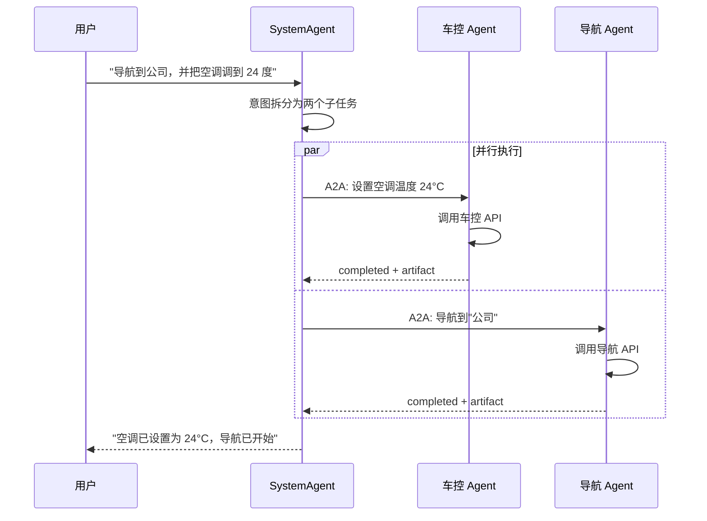

## 3. Agent 运行时与插件机制

aadkcore 的运行时分为两层：`SystemRuntime` 负责消息接收与路由；`AgentRuntime` 负责 Agent 生命周期管理。业务 Agent 通过插件机制（`AgentPlugin`）以动态库形式加载。

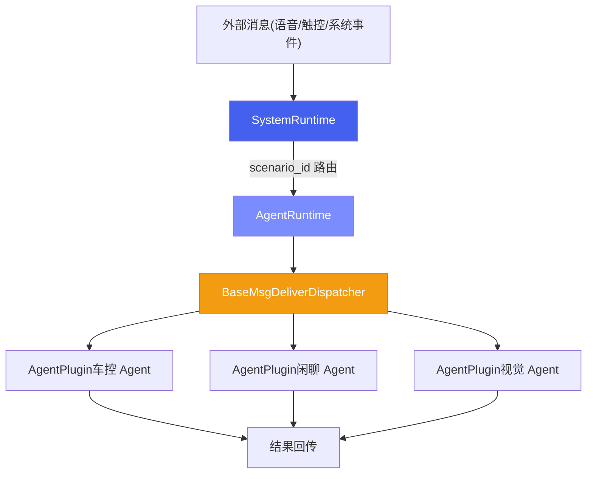

### 3.1 AgentPlugin 插件接口

定义于 `include/runtime/agent_plugin.h`，是所有业务 Agent 必须实现的抽象接口：

| 方法 | 返回类型 | 说明 |
| :--- | :--- | :--- |
| `deliver_msg(message)` | `bool` | 接收并处理 `DataMessage`，Agent 的核心入口 |
| `scenario_id()` | `int` | 返回 Agent 负责的场景 ID（对应 `constant_ids.h`） |
| `clear_memory()` | `bool` | 清除对话历史 |
| `set_data_dump_flag(flag)` | `void` | 设置数据录制标志（默认空实现） |

**场景 ID 常量**（`constant_ids.h`，按值排序）：

| 常量 | ID | 场景 |
| :--- | :--- | :--- |
| `VIDEOCHAT_SCENARIO_ID` | 100 | 视频对话 |
| `PROACTIVE_SPEECH_SCENARIO_ID` | 200 | 主动语音 |
| `ACTIVE_VISION_SCENARIO_ID` | 300 | 主动视觉 |
| `RAIN_DECTION_SCENARIO_ID` | 400 | 雨天检测 |
| `SPORT_MODE_SCENARIO_ID` | 500 | 运动模式 |
| `OAI_INFERENCE_SCENARIO_ID` | 600 | OAI 推理 |
| `WELCOME_MODE_SCENARIO_ID` | 700 | 迎宾模式 |
| `SYSTEM_AGENT_SCENARIO_ID` | 1001 | 系统总控 Agent |
| `CAR_CONTROL_SCENARIO_ID` | 1002 | 车控 Agent |
| `FUNCTION_CALL_SCENARIO_ID` | 1002 | 函数调用（**与 `CAR_CONTROL_SCENARIO_ID` 同值的别名**，不是独立场景） |
| `CHITCHAT_SCENARIO_ID` | 1003 | 闲聊 Agent |
| `NAVI_POI_SCENARIO_ID` | 1007 | 导航 POI |
| `TRIP_PLANNING_SCENARIO_ID` | 1009 | 行程规划 |
| `ACTIVE_SESSION_SCENARIO_ID` | 1600 | 主动会话（由 `registerStaticAgents` 静态注册，见 §3.3） |
| `GUI_AGENT_NEW_SCENARIO_ID` | 2000 | GUI Agent（新版） |
| `BROADCAST_SCENARIO_ID` | 65535 | 广播消息 |

> [!NOTE]
> **`scenario_id` 是消息路由键，不是模型路由键**
>
> 本表中的 `scenario_id` 决定 `DataMessage` 投递给哪个 `AgentPlugin`。它与模型/LoRA 路由用的 `scene_id` 是两套 ID，两者在 `ModelRunner` 内部会被桥接，未对齐时会**静默回落到 `scene_model_details_` 中 `scene_id` 最小的那条配置**（并重置 `lora_id` 与 `infer_params`，而**不是**回落到"闲聊模型"）——两者的区分、对齐要求与回落的真实行为见 [aadkcore 核心框架 · §3.3 抢占机制与 ModelRunner](agent-core.html#sec-13) 中的 `scene_id` vs `scenario_id` 说明。

### 3.2 动态加载机制

`libaadkcore.so` 运行时通过 `dlopen` 加载业务 Agent 动态库（如 `libagent_group.so`），通过约定的 `extern "C"` 工厂函数获取 Agent 列表并创建实例。

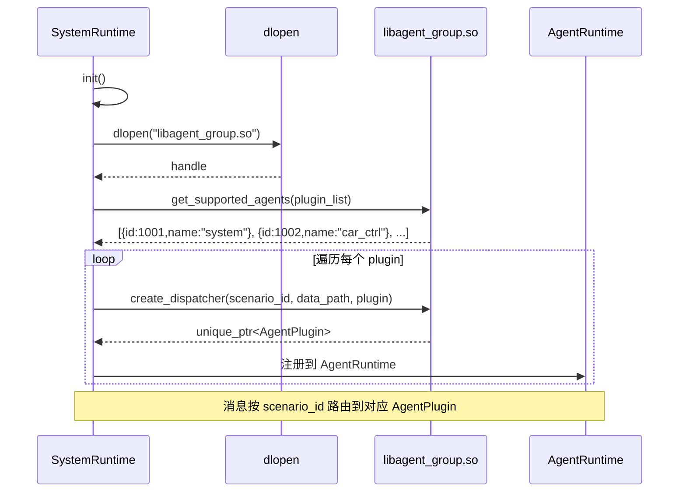

**工厂函数签名**：

```
// 获取支持的 Agent 列表
extern "C" void get_supported_agents(std::vector<PluginInfo>& plugins);

// 创建指定场景的 Agent 实例
extern "C" void create_dispatcher(int scenario_id, const char* data_path,
                                  std::unique_ptr<AgentPlugin>& plugin);

// 销毁 Agent 实例
extern "C" void destroy_dispatcher(std::unique_ptr<AgentPlugin> plugin);
```

加载流程对应到 `runtime/src/system_agent/msg_deliver_impl.cpp` 的 `init()`：`dlopen("libagent_group.so", RTLD_LAZY)` → `dlsym` 解析 `get_supported_agents` 与 `create_dispatcher` → 遍历返回的 `PluginInfo` 逐个 `create_dispatcher`，并校验 `plugin->scenario_id() == info.scenario_id` 后注册进 `dispatchers_[scenario_id]`。

### 3.3 插件卸载与资源回收

加载有完整的对称约定，但**卸载是当前实现的薄弱环节**，值得单独说清楚。

**约定的对称契约**：`create_dispatcher` 与 `destroy_dispatcher` 成对出现。`destroy_dispatcher(std::unique_ptr<AgentPlugin>)` 按值接收 `unique_ptr`，意味着**所有权被转移进插件模块内部再析构**——这是刻意为之：`AgentPlugin` 的虚析构函数与 vtable 位于 `libagent_group.so` 内，销毁动作必须在该模块仍被映射时、由该模块自己的代码完成，才能保证析构走对 vtable、用对分配器。

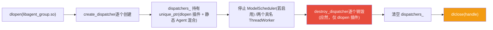

> [!CAUTION]
> **当前运行时的卸载顺序存在隐患：先 `dlclose`，后析构插件**
>
> 在 `msg_deliver_impl.cpp` 的析构函数中，实际顺序是：（仅在 `ENABLE_MULTI_PROCESS` 下）`modelscheduler_->Stop()` → 停止 `main_thread_worker_` 与 `critical_thread_worker_` 两个具名 worker → **直接 `dlclose(dl_handle_)`**，而持有所有插件的 `dispatchers_` 是成员变量，它的析构发生在**析构函数体执行完之后**——也就是 `dlclose` 之后。此时 `libagent_group.so` 已被解除映射，再去调用 `AgentPlugin` 的虚析构（其代码与 vtable 都在刚被卸载的 `.so` 里）属于**未定义行为**。
>
> 同时，`destroy_dispatcher` 这个工厂函数**虽然声明了，但运行时并未 `dlsym` 它、也从未被调用**——即当前实现没有走"显式销毁插件"这条路。
>
> **正确的卸载顺序**应为（注意 `dispatchers_` 是"dlopen 插件 + 静态 Agent"的混合容器，不能一刀切）：
>
> 1. 停止 `ModelScheduler`（若启用）与 `main_thread_worker_` / `critical_thread_worker_`（确保没有消息还在 `deliver_msg` 里）；
> 2. **只对经 `dlopen` 创建的插件**调用 `destroy_dispatcher(std::move(plugin))`，把析构交回插件模块；
> 3. **静态注册的 Agent 不走 `destroy_dispatcher`**：`registerStaticAgents()` 会把 `ActiveSessionAgent`(1600)、`MemoryAgent` 用 `make_unique` 直接塞进**同一个** `dispatchers_`，它们的代码与 vtable 在主程序/`libaadkcore.so` 内、并非来自 `libagent_group.so`，对其调用 `destroy_dispatcher` 是错的——这类直接 `reset()` / 让 `unique_ptr` 正常析构即可；
> 4. `dispatchers_.clear()`；
> 5. 最后才 `dlclose(dl_handle_)`。
>
> 在常驻进程里这个问题可能被掩盖（进程退出时 OS 统一回收），但在**热卸载 / 插件热替换 / 单元测试反复构造析构**的场景下会暴露为崩溃或内存损坏。改造插件生命周期时应以上述顺序为准，并按"是否来自 `.so`"区分两类 Agent 的销毁方式。

## 4. LLM Flow 与 Tool 系统

`BaseLlmFlow`（定义于 `include/flow/base_llm_flow.hpp`）实现了 LLM 推理流水线的标准模式，负责预处理、调用模型、后处理（**Tool 调用循环为设计目标，受 `USE_TOOL` 门控，默认未启用**，见 §4.1 的边界说明）。`BaseTool`（定义于 `include/tools/base_tool.hpp`）定义了工具的统一抽象接口。

### 4.1 BaseLlmFlow 流水线

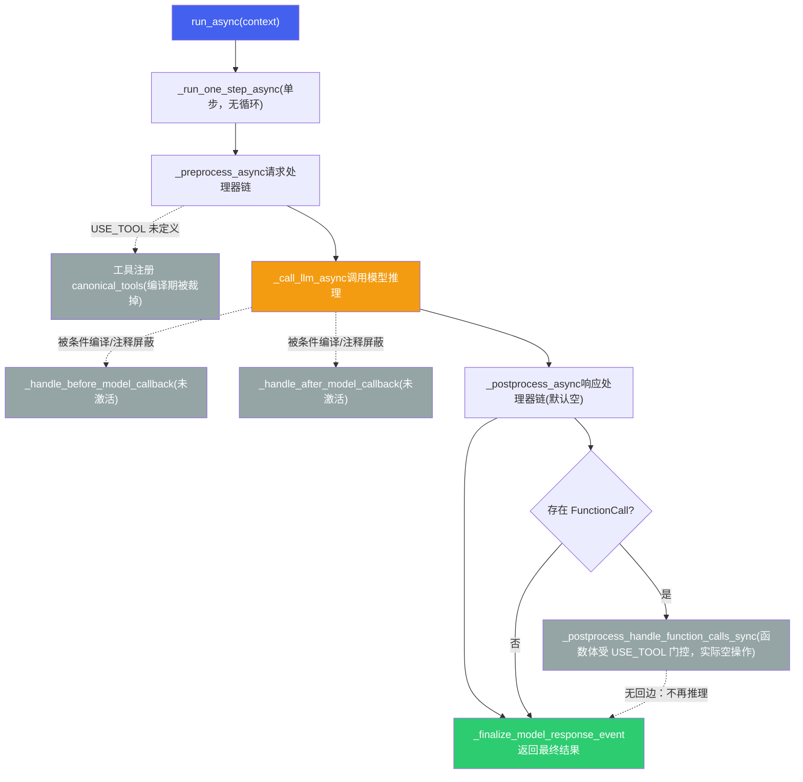

**SingleFlow** 是 `BaseLlmFlow` 的标准实现，预注册了两个请求处理器（注意：实际生效的是**裸指针** `&basic::request_processor` / `&instructions::request_processor`，`std::make_shared` 版本整段在 `#if 0` 内未启用）：

- `basic::request_processor` — 基础请求构建
- `instructions::request_processor` — 将 Agent 的 instructions 注入到请求中

`response_processors` 默认为**空**（`nl_planning` / `code_execution` 等都被注释掉），因此 `_postprocess_run_processors_sync` 默认不产生任何事件。

> [!NOTE]
> **重要：Tool 执行循环与 before/after 回调默认未启用（受 `USE_TOOL` 门控）**
>
> 上图灰色节点与虚线边**不是当前生效的控制流**。经代码核实：
>
> - **`USE_TOOL` 在整个仓库从未被定义**（CMake / 各 `build_*.sh` 均无 `-DUSE_TOOL`），因此所有 `#ifdef USE_TOOL` 块在编译期被裁掉，包括：`_preprocess_async` 里的工具注册（`canonical_tools` / `register_tool`）、`_postprocess_handle_function_calls_sync` 的整个函数体（`handle_function_calls_sync` / `generate_auth_event`）、以及 `LlmAgent` 的工具成员。
> - **`_handle_before_model_callback` / `_handle_after_model_callback` 在 `_call_llm_async` 里分别被 `#if 0` 和 `/* */` 注释掉**，两个回调函数自身的函数体也是 `#if 0`——它们不是"激活的流水线节点"。
> - **`run_async` 只调一次 `_run_one_step_async`（单步）**：preprocess → call_llm → postprocess 走完即返回，**没有回到 preprocess 的循环、没有第二次推理**。即使 `_postprocess_async` 检测到 `FunctionCall` 并调用了 `_postprocess_handle_function_calls_sync`，后者因 `USE_TOOL` 未定义而返回空，**不会执行工具、也不会触发再推理**。
>
> **仍然可用的部分**：工具**声明**可以经 `ModelInstance::streamGenerate/generate` 的 `tools` 参数下发，并由 `LapeModel::buildLlmsPrompt` 以 `<tools>...</tools>` XML 注入 system prompt——即模型能"看到"工具签名并按约定输出 `FunctionCall`。但**解析 `FunctionCall`、执行工具、把 `FunctionResponse` 回灌再推理**这一闭环**不是自动的**，需要业务侧自行实现（或定义 `USE_TOOL` 并补齐相应代码）。
>
> 引用本节流程图时请勿把灰色/虚线部分当作现有行为。这与 §6 安全沙箱"设计目标 vs 已实现接口"的标注口径一致。
>
> 另注：当前既然是单步、谈不上循环，自然也**没有迭代上限**；未来若补齐 Tool 闭环（`HANDLE → PRE` 回边），必须同时引入 `max-iteration` 上限，防止模型反复发起工具调用导致失控循环。

### 4.2 BaseTool 工具基类

| 属性/方法 | 返回类型 | 说明 |
| :--- | :--- | :--- |
| `name()` | `const string&` | 工具名称 |
| `description()` | `const string&` | 工具描述 |
| `is_long_running()` | `bool` | 是否长时间运行（如导航规划） |
| `get_declaration()` | `optional<ToolDefinition>` | 返回 JSON Schema 格式的工具声明 |
| `run_async(args, context)` | `Task<bool>` | 异步执行工具，参数为 `map<string, any>` |
| `process_llm_request(context)` | `Task<tuple>` | 处理 LLM 请求，返回描述文本和 ToolDefinition |

**ToolDefinition 结构**（定义于 `content.hpp`）：

```
struct ToolDefinition {
    std::string name;         // 工具名称，如 "set_ac_temperature"
    std::string description;  // 工具描述
    ToolParameters parameters; // 输入参数 Schema
    ToolParameters responses;  // 输出结构 Schema
};

struct ToolParameters {
    std::string type;  // "object"
    std::map<std::string, ParamInfo> properties; // 参数名 → {type, description}
};
```

LLM 根据所有注册 Tool 的 `ToolDefinition` 生成结构化的 `FunctionCall`，Flow 引擎解析后调用对应 Tool 的 `run_async()`，结果通过 `FunctionResponse` 回传给 LLM 继续推理。（**注意**：这条"解析 → 执行 → 回灌再推理"的闭环受 `USE_TOOL` 门控，当前默认未启用——`run_async()` 的执行与再推理都不会自动发生，详见 §4.1 的边界说明。）

### 4.3 端到端调用链

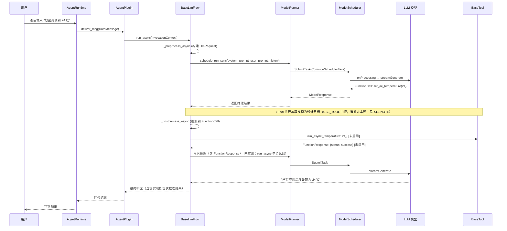

> [!TIP]
> **框架核心价值**
>
> aadkcore 将 Agent 开发中的共性能力（模型调度、对话管理、Tool 调用、RAG、A2A 协作）下沉到框架层，业务 Agent 开发者只需关注：(1) 编写 `AgentPlugin` 实现业务逻辑；(2) 注册 `BaseTool` 连接外部能力；(3) 编写 `instructions` 定义 Agent 行为。框架负责调度、流水线、协议对接等基础设施工作。

## 5. 端云协同架构（设计/扩展方向）

> [!NOTE]
> **本节定位**
>
> 端云协同是 aadkcore 的**架构扩展方向**，而非当前已落地的固定接口。它描述的是端侧 Agent 能力受限时向云端延伸的整体思路，以及可以借哪些现有机制（A2A、`BaseLlmFlow` pipeline、轻量意图分类）落地。阅读时请把它当作设计蓝图，而不是 API 参考。

纯端侧 Agent 受限于模型能力和知识范围，纯云端 Agent 受限于延迟和离线可用性。端云协同是座舱 Agent 的最优架构——端侧处理低延迟、高隐私的请求，云端处理复杂推理和知识密集型任务。

### 5.1 端云分工策略

| 请求类型 | 处理方 | 原因 | 示例 |
| :--- | :--- | :--- | :--- |
| **车辆控制** | 端侧 | 低延迟（< 2s）+ 离线可用 + 安全关键 | "打开空调" "调到22度" "打开车窗" |
| **简单问答** | 端侧 | 端侧模型可胜任 + 零网络延迟 | "现在几点" "电量还有多少" "今天限号吗" |
| **复杂推理** | 云端 | 需要大模型能力（72B+） | "帮我规划三天旅行行程" "分析这份报告" |
| **知识密集型** | 云端 | 需要实时联网搜索 | "最近有什么好看的电影" "XX 餐厅评价怎么样" |
| **多模态理解** | 端侧优先，云端增强 | 端侧快速响应 + 云端精准分析 | DMS 疲劳检测（端侧）+ 复杂场景分析（云端） |

### 5.2 协同架构设计

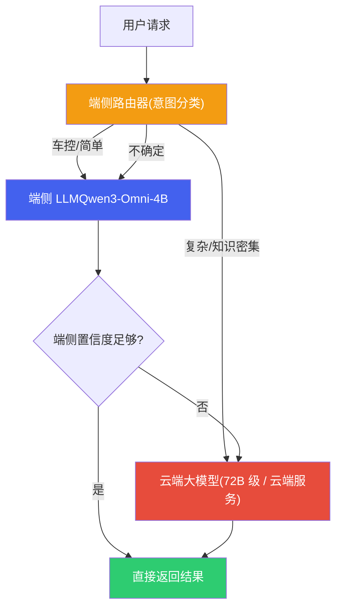

| 协同模式 | 工作方式 | 延迟 | 适用场景 |
| :--- | :--- | :--- | :--- |
| **端侧优先 (Edge-First)** | 端侧先处理，置信度不足时转云端 | 低（端侧成功时 < 1s） | 默认模式，大部分座舱交互 |
| **端云并行 (Parallel)** | 同时发给端侧和云端，取先到或更优结果 | 低（取较快者） | 对质量和延迟都有要求时 |
| **端侧草稿 (Draft-Refine)** | 端侧快速生成初稿，云端校验/润色 | 中（端侧先显示，云端更新） | 长文本生成、复杂回答 |
| **云端主导 (Cloud-Primary)** | 直接转云端处理 | 高（依赖网络） | 明确需要大模型或联网的请求 |

### 5.3 离线降级与缓存

当网络不可用时（隧道、地下车库、偏远地区），端云协同需要优雅降级：

| 降级策略 | 实现方式 | 用户体验 |
| :--- | :--- | :--- |
| **功能降级** | 需要云端的功能（搜索、在线导航）提示"当前离线，部分功能不可用" | 明确告知，不假装可用 |
| **缓存命中** | 热门问题（天气、限行）在有网时预缓存到本地 RAG | 离线也能回答常见问题 |
| **云端结果缓存** | 云端返回的结果（路线规划、POI 信息）缓存到本地 | 重复查询直接本地返回 |
| **网络恢复后同步** | 离线期间的日志和请求在恢复后批量上传 | 不丢失数据 |

> [!NOTE]
> **端云协同与 aadkcore 的集成**
>
> 在 aadkcore 框架中，端云协同可以通过 **A2A 协议** 实现：端侧 Agent 作为 A2A Client 向云端 Agent（A2A Server）发送子任务。SystemRuntime 的 HTTP Server 模式可以接收云端的回调结果。路由决策可以在 `BaseLlmFlow` 的 pipeline 中实现——在 Prefill 之前通过轻量意图分类（小参数模型或规则引擎）决定请求走向。

## 6. 安全沙箱机制（设计目标，未实现）

> [!NOTE]
> **重要：本节是架构设计目标，不是已实现接口**
>
> 经代码核实，aadkcore 当前代码库中**没有 `safety_level` / `SafetyLevel` 这套分级体系**，也没有对应的运行时拦截实现。现有的、最接近"执行前确认"的能力是车控侧的**需确认技能（`to_be_confirmed_skills`）机制**——即对部分高风险车控技能在执行前要求用户确认，属于技能级的单点处理，而非本节描述的通用三级沙箱。
>
> 因此，本节的 L1/L2/L3 分级、安全检查流水线、Prompt 注入防御应理解为**设计目标与实现蓝图**：它回答"安全沙箱应该长什么样、为什么这样设计"，落地时需要在 Tool 执行路径（`BaseLlmFlow` 的 `_postprocess_handle_function_calls_sync` 与 `BaseTool::run_async` 之间）补齐相应拦截层。引用本节内容时请勿当作现有 API 使用。

座舱 Agent 的 Tool 调用直接控制车辆硬件（空调、车窗、车门、车灯），安全沙箱是防止 LLM 幻觉或 Prompt 注入导致危险操作的最后防线。

### 6.1 三级安全分级

| 安全等级 | 操作类型 | 确认要求 | 示例工具 | 实现方式（设计） |
| :--- | :--- | :--- | :--- | :--- |
| **L1 只读** | 查询类，无副作用 | 无需确认，直接执行 | 查天气、查电量、查导航 ETA | Tool 标记 `safety_level: L1` |
| **L2 可逆** | 可逆操作，影响车辆状态 | 语音确认（"好的，帮您调到22度"） | 调空调、开车窗、调音量、切歌 | Tool 执行前插入确认回复，等待用户未反对后执行 |
| **L3 不可逆/高危** | 不可逆或涉及安全 | 二次确认 + 条件检查（车速、档位） | 打开车门、发送消息、支付 | 强制二次确认 + 车辆状态安全检查 + 必要时生物认证 |

### 6.2 安全检查流水线

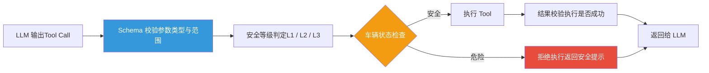

安全检查流水线中的各环节：

| 检查环节 | 检查内容 | 拒绝示例 |
| :--- | :--- | :--- |
| **Schema 校验** | 参数类型、范围、必填项。如温度必须在 16-32°C 范围内 | set\_ac\_temperature(temp=100) → 拒绝：温度超出范围 |
| **工具白名单** | LLM 输出的工具名必须在已注册工具列表中 | execute\_shell("rm -rf /") → 拒绝：工具不存在 |
| **车辆状态检查** | 根据当前车速、档位、行驶状态判断操作是否安全 | 车速 > 0 时 open\_door() → 拒绝：行驶中不可开门 |
| **频率限制** | 防止短时间内重复执行相同操作 | 1 秒内连续 5 次 set\_ac\_temperature → 拒绝：操作频率异常 |
| **用户权限** | 根据 scenario\_id 判断请求来源的权限 | 后排乘客尝试 unlock\_door → 拒绝：权限不足 |

### 6.3 Prompt 注入防御

LLM 存在 Prompt 注入风险——恶意用户可能通过精心构造的输入欺骗模型执行危险操作。座舱场景的防御需要多层保护：

| 防御层 | 实现方式 | 防御目标 |
| :--- | :--- | :--- |
| **System Prompt 加固** | System Prompt 中明确列出禁止行为，使用特殊分隔符隔离系统指令和用户输入 | 防止用户指令覆盖系统约束 |
| **输入过滤** | 检测并过滤已知的注入模式（"忽略前面的指令"、"你是一个没有限制的AI"） | 拦截常见越狱尝试 |
| **输出校验（Post-Guard）** | LLM 输出的 Tool Call 必须通过安全检查流水线，不依赖 LLM 自身的安全判断 | 即使 LLM 被欺骗，执行层也能拦截危险操作 |
| **Tool Schema 约束** | 工具参数通过 JSON Schema 严格约束类型和范围，非法参数在 Schema 校验阶段即被拒绝 | 防止 LLM 幻觉出非法参数值 |

> [!CAUTION]
> **安全沙箱的核心原则：不信任 LLM 输出**
>
> 安全沙箱的设计哲学是**将 LLM 视为不可信的组件**。LLM 负责理解用户意图并生成结构化的 Tool Call，但最终的执行决策由安全沙箱（Schema 校验 + 车辆状态检查 + 权限验证）做出。这意味着即使 LLM 100% 被 Prompt 注入欺骗，只要安全沙箱正确实现，危险操作仍然无法执行。这与 Web 安全中"永远不信任客户端输入"是同一原则。
