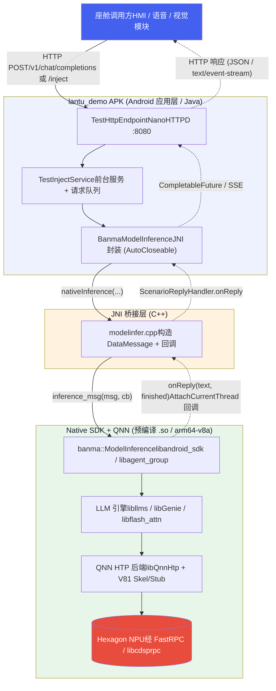
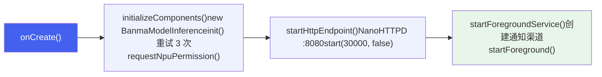
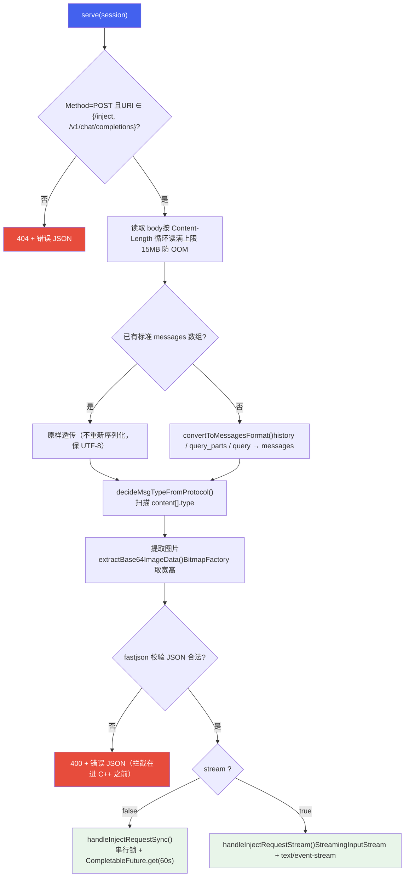
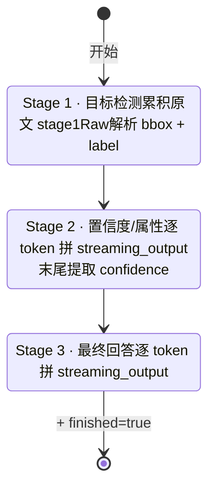
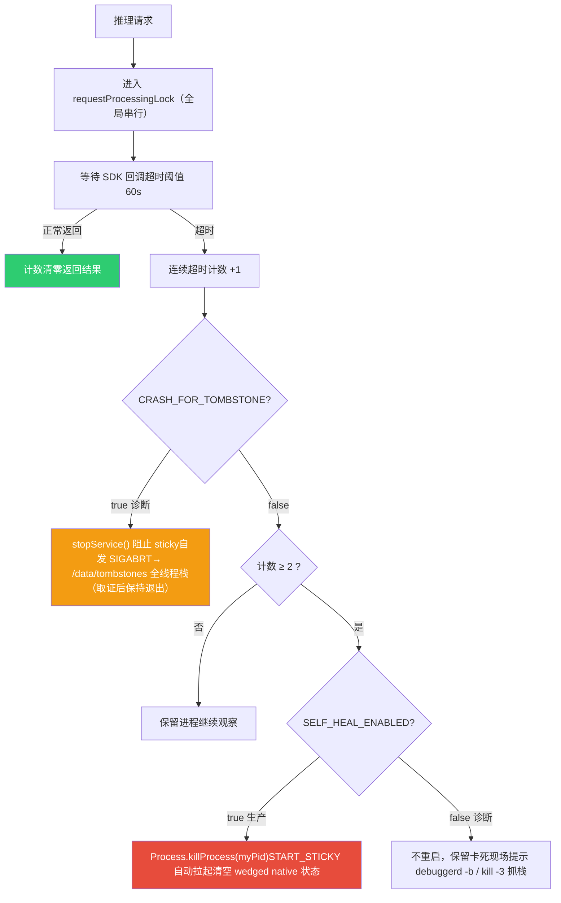

# Part G: APK 集成与端侧服务化

*lantu\_demo 宿主 APK  |  Qwen3-Omni-4B + LoRA · JNI 桥接 · 本地 HTTP 服务 · 前台服务自愈*

> [!TIP]
> **本篇讲什么**
>
> 前面的 Part D/E/F 聚焦 **native SDK 本身**（QNN 部署、aadkcore 核心框架、agent\_group 场景 Agent、调试工具链）。本篇切换到 **应用层视角**：这些 `.so` 如何被一个可安装、可常驻、可被座舱其他组件调用的 **Android APK**（`lantu_demo`，包名 `com.example.myapplication`）封装起来，并以 **本地 HTTP 服务**的形式对外提供大模型推理能力。这是从「SDK 能跑」到「产品能交付」的最后一公里。

## 1. 定位与整体架构

### 1.1 APK 的角色

`lantu_demo` 不是一个独立训练或推理引擎，而是一个 **宿主容器（host）**。它的职责是：

| 职责 | 说明 |
| :--- | :--- |
| **加载并初始化 native SDK** | 按正确顺序加载 `libcdsprpc.so`、`libmodelinfer.so` 及全部 QNN/LLM 依赖，设置 DSP 运行环境 |
| **常驻后台** | 以前台服务（`dataSync` 类型 + `START_STICKY`）形式存活，被杀后自动拉起 |
| **服务化对外** | 在设备本地 `0.0.0.0:8080` 起一个 HTTP 服务，座舱 HMI / 语音 / 视觉等模块通过 HTTP 调用大模型 |
| **协议适配** | 兼容 OpenAI 风格 `/v1/chat/completions` 与自定义 `/inject` 协议，并完成多模态消息的类型判定与格式转换 |
| **稳定性兜底** | 串行化请求、超时检测、native 卡死时进程级自愈重启 |

它承载的模型是 **Qwen3-Omni-4B**（INT4 量化 + 场景 LoRA），模型文件不打包进 APK，而是放在车机固定路径 `/AI/vllm_sdk/models` 下，由 SDK 在 init 阶段读取（见 [第 3 节](#ch3)）。

### 1.2 端到端调用链

一次完整的推理请求，从座舱组件发起到拿到结果，穿越三个层次：



> [!NOTE]
> **为什么是 HTTP 而不是 AIDL/Binder？**
>
> 座舱内跨域调用方语言/进程各异（Android 应用、Linux 服务、Python 评测脚本），HTTP + JSON 是最大公约数：无需共享接口定义、跨语言、便于用 `curl` 直接联调与自动化评测。代价是序列化开销，但相对大模型动辄数百毫秒到数秒的推理耗时，HTTP 开销可忽略。

## 2. 三层结构详解

### 2.1 Android 应用层（Java）

全部位于 `app/src/main/java/com/example/myapplication/`，各组件职责如下：

| 类 | 类型 | 职责 |
| :--- | :--- | :--- |
| `MyApplication` | Application | 进程级初始化：按序加载 native 库、设置 `ADSP_LIBRARY_PATH`（早于任何 Activity/Service） |
| `MainActivity` | Activity (Launcher) | 界面入口；初始化 `BanmaModelInference` 并拉起前台服务（UI 推理路径默认注释，仅作演示） |
| `TestInjectService` | Service (foreground) | 常驻前台服务；持有推理实例与 HTTP 端点；请求队列串行处理；`START_STICKY` 自愈 |
| `TestHttpEndpoint` | NanoHTTPD | HTTP 服务核心（约 2000 行）：协议解析/转换、类型判定、图片提取、同步/SSE 响应、超时自愈 |
| `BanmaModelInference` | JNI 封装 | `AutoCloseable`；暴露 `init / requestNpuPermission / inference / inferenceWithImage`，内部持有 native handle |
| `NativeEnv` | 工具类 | `ADSP_LIBRARY_PATH` 的**唯一构造点**，避免多处路径字面量不一致 |
| `TaskScheduler` | 单例 | 8 线程异步池 + 单线程调度池（daemon 线程） |
| `StreamingInputStream` | InputStream | 用 `BlockingQueue` 桥接生产者-消费者，支撑 SSE 流式输出 |
| `ScenarioReplyHandler` | interface | 回调契约 `onReply(String result, boolean isFinished)` |
| `AssetFolderCopier` | 工具类 | 按 App 版本号把 `assets/` 下的小模型拷贝到 `filesDir`（备用路径，主链路用 `/AI`） |

### 2.2 JNI 桥接层（C++）

位于 `app/src/main/cpp/`，由 CMake 编译为 `libmodelinfer.so`：

| 文件 | 作用 |
| :--- | :--- |
| `modelinfer.cpp` | 5 个 JNI 函数实现：`nativeCreate / nativeDestroy / nativeInit / nativeRequestNpuPermission / nativeInference`；负责 Java↔C++ 类型转换、构造 `banma::DataMessage`、注册跨线程回调 |
| `CMakeLists.txt` | 定义 `modelinfer` 共享库；include `vllm_sdk` 头文件；链接 `aadkcore`、`log`、`android_sdk` |
| `include/data_message.h` | `banma::DataMessage / ImageInfo / AudioInfo / MsgType / RequestType / ImageFormat` 等数据结构与场景 ID 宏定义 |
| `include/model_inference.h` | `banma::ModelInference` 类接口：`init / inference_msg / requestNpuAccess / registerProfilingCallback / stopInferenceTask / releaseModelResources` |
| `include/VoyahAIProxy.hpp` | NPU 资源管理与性能监控抽象接口（`requestNpuAccess / syncNpuProfileToServer / registerNpuResourceEventCallback`） |

### 2.3 Native SDK 与依赖（预编译 .so）

全部位于 `app/src/main/jniLibs/arm64-v8a/`（**仅 arm64-v8a**，由 `abiFilters` 限定）。按功能归类：

| 分类 | 关键库 | 说明 |
| :--- | :--- | :--- |
| **业务 SDK** | `libandroid_sdk.so`、`libagent_group.so`、`libvoyah_ai_client.so`、`libaadkcore.so`、`libaisa.so`、`libqualla.so` | banma/voyah 推理与 Agent 框架（对应 Part E 的 aadkcore + agent\_group） |
| **LLM 引擎** | `libllms.so`、`libGenie.so`、`libflash_attn.so` | 大模型推理内核与 FlashAttention 加速 |
| **QNN / NPU 后端** | `libQnnHtp.so`、`libQnnHtpV81Skel.so`、`libQnnHtpV81Stub.so`、`libQnnHtpV81CalculatorStub.so`、`libQnnCpu.so`、`libQnnGenAiTransformer(Model).so`、`libqnn_backend.so` | 高通 QNN 框架 + HTP（Hexagon Tensor Processor）后端；`V81Skel` 运行在 DSP 侧 |
| **系统 / FastRPC** | `libcdsprpc.so`（系统库，经 `<uses-native-library>` 声明） | FastRPC 通道，Host（APK）↔ cDSP 跨处理器调用 |
| **通用依赖** | `libopencv_*.so`、`libcurl.so`、`libssl.so`/`libcrypto.so`、`libjsoncpp.so`、`libomp.so`、`libc++_shared.so`、`libperfetto.so` | 图像处理、网络、TLS、JSON、OpenMP 并行、C++ 运行时、性能追踪 |

> [!WARNING]
> **libQnnHtpV81Skel.so 不能被 strip**
>
> `build.gradle` 中显式声明 `doNotStrip "**/libQnnHtpV81Skel.so"`。Skel（skeleton）库运行在 Hexagon DSP 侧，其符号在 Host 端「看起来没用」，但被 strip 掉会导致 DSP 侧加载失败、推理直接起不来。这是 APK 集成 QNN 时最典型的坑之一。

## 3. 进程级初始化（MyApplication）

底层库的加载与环境变量设置被刻意放在 `MyApplication.onCreate()`，而非某个 Activity。原因：进程可能由 `MainActivity`（用户点击图标）或 `TestInjectService`（`START_STICKY` 被系统单独拉起）两种方式触发——无论哪种，`Application.onCreate()` 都最先执行，保证底层环境一定就绪。

### 3.1 加载顺序

```
// MyApplication.onCreate()
System.loadLibrary("cdsprpc");     // 1. 先加载 FastRPC 底层依赖
System.loadLibrary("modelinfer");  // 2. 再加载 JNI 桥接库（依赖 cdsprpc 与全部 QNN/LLM .so）
```

> [!NOTE]
> **顺序为什么重要**
>
> `libmodelinfer.so` 链接了 `libandroid_sdk`/`aadkcore` 等，它们在初始化时会通过 FastRPC 与 cDSP 通信。若 `libcdsprpc.so` 尚未加载，DSP 通道不可用，后续 init 会失败。因此必须**先 cdsprpc，后 modelinfer**。

### 3.2 ADSP\_LIBRARY\_PATH

Hexagon DSP 侧的 Skel 库不在标准 linker 路径里，需要通过环境变量 `ADSP_LIBRARY_PATH` 告诉 FastRPC 去哪找。该路径串由 `NativeEnv.buildAdspLibraryPath()` 统一构造：

```
nativeLibDir                      // APK 自身 jniLibs 解压目录
+ ";/data/local/tmp/arm64"        // 调试/外部投放的 DSP 库
+ ";/vendor/lib/rfsa/adsp"        // 厂商 DSP 库
+ ";/vendor/dsp/cdsp"             // cDSP 专用
+ ";/system/lib/rfsa/adsp"
+ ";/dsp;"
```

设置通过 `Os.setenv("ADSP_LIBRARY_PATH", ..., true)` 完成。C++ 侧 `nativeInit` 在调用 SDK `init()` 前会**用同值再设一次**作为兜底（正常路径下 `MyApplication` 已设过），两侧字面量必须保持一致——这正是把它收敛到 `NativeEnv` 单一构造点的原因。

### 3.3 模型路径

SDK 约定模型放在固定绝对路径，APK 不做拷贝（模型体积大，随 APK 打包不现实）：

```
String modelPath = "/AI/vllm_sdk/models";   // SDK 从该目录查找 qwen3-omni-4b/model.json
infer.init(modelPath, nativeLibraryDir);
infer.requestNpuPermission("vllm");          // 向资源管理方申请 NPU 访问权限
```

## 4. 前台服务与自愈（TestInjectService）

推理能力需要常驻、且要在进程被系统回收后自动恢复，因此核心逻辑放在一个 **前台服务**里，而非 Activity。

### 4.1 前台服务声明

```
<!-- AndroidManifest.xml -->
<uses-permission android:name="android.permission.FOREGROUND_SERVICE" />
<uses-permission android:name="android.permission.FOREGROUND_SERVICE_DATA_SYNC" />  <!-- Android 14+ 必须声明具体类型 -->

<service android:name=".TestInjectService"
         android:exported="true"
         android:foregroundServiceType="dataSync" />
<uses-native-library android:name="libcdsprpc.so" android:required="false" />
```

> [!NOTE]
> **两个 manifest 细节**
>
> ① Android 14（API 34）起前台服务必须声明具体的 `foregroundServiceType` 及对应权限，这里用 `dataSync`。② `<uses-native-library>` 声明对系统库 `libcdsprpc.so` 的依赖（`required="false"` 表示缺失也不阻止安装，由运行期 `loadLibrary` 兜底报错）。

### 4.2 onCreate 三步走



**初始化重试**：native init 可能因 DSP 尚未就绪、资源竞争等偶发失败，`initializeComponents()` 用 `for (i=0;i<3;i++)` 循环重试，每次间隔 500ms，并分别捕获 `UnsatisfiedLinkError` / `Exception` / `Throwable`。三次全失败则把 `infer` 置 null（HTTP 层会惰性重建）。

**START\_STICKY**：`onStartCommand()` 返回 `START_STICKY`，服务被系统杀死后会被重新创建（重新走 `onCreate`），这是「自愈重启」能成立的系统级前提（见 [第 8 节](#ch8)）。

### 4.3 请求队列（串行化）

服务内维护 `ConcurrentLinkedQueue<RequestTask>` + `isProcessing` 标志 + `triggerLock`，保证队列处理串行触发；实际执行交给 `TaskScheduler` 线程池。每个任务用 `CompletableFuture<String>` 回传结果。（注：HTTP 层自身还有一把 `requestProcessingLock` 串行锁，二者共同确保同一时刻只有一个推理在跑——NPU 是独占资源。）

## 5. HTTP 服务层（TestHttpEndpoint）

这是整个 APK 最核心、代码量最大的类（约 2000 行），基于 `NanoHTTPD` 实现，监听 `0.0.0.0:8080`。

### 5.1 请求处理管线

只接受 `POST /inject` 与 `POST /v1/chat/completions` 两个端点，其余返回 404。`serve()` 的处理流程：



> [!WARNING]
> **两个防御性设计**
>
> ① **body 必须读满**：按 `Content-Length` 循环 `read()` 直到读满，否则抛 `Incomplete body read`——避免半截 JSON 流入 native 层导致崩溃。② **进 C++ 前先校验 JSON**：用 fastjson 试解析，非法则直接返回 400，**绝不让坏数据进入 SDK**（native 崩溃无法被 Java try/catch 捕获）。

### 5.2 协议解析与转换

调用方来源多样，payload 存在多种历史格式。`serve()` 先判定是否需要转换为标准 `messages` 数组：

| 输入格式 | 判定条件 | 处理 |
| :--- | :--- | :--- |
| 标准 OpenAI 格式 | 顶层已有非空 `messages: []` | **原样透传**，不重新序列化（避免 fastjson 重排导致 UTF-8/中文丢失） |
| 历史 + query | 含 `query` 或 `extend._overwrite_params` | `convertToMessagesFormat()`：先铺 `_overwrite_params.history`，再追加 query 为 user message |
| query\_parts | 含 `extend.query_parts` 或顶层 `query_parts` | 把每个 part（text/image）转成 content 数组元素，组装为单条 user message |

### 5.3 多模态类型判定

底层 `DataMessage.msg_type` 必须与实际模态匹配，否则会走错推理链路。`decideMsgTypeFromProtocol()` 遍历 `messages[].content`（content 可能是 string 或 array），统计是否出现 `image`/`image_url` 与 `audio` 类型，映射到枚举：

| 检测到 | MsgType | 值 |
| :--- | :--- | :--- |
| 仅文本 | `TEXT` | 0 |
| 文本 + 图像 | `TEXT_IMAGE` | 3 |
| 文本 + 音频 | `TEXT_AUDIO` | 4 |
| 文本 + 图像 + 音频 | `TEXT_IMAGE_AUDIO` | 6 |

枚举完整定义见 `data_message.h` 的 `banma::MsgType`（0~6 共 7 种组合）。

### 5.4 同步与 SSE 流式

**同步路径（stream=false）**：`handleInjectRequestSync()` 持有全局 `requestProcessingLock`，调用 `processSingleRequest()`，内部用 `CountDownLatch` 等待 SDK 回调 `finished=true`，再返回完整 JSON。

**流式路径（stream=true）**：返回 `text/event-stream`。`StreamingInputStream` 用一个 `BlockingQueue<byte[]>` 桥接「推理线程生产 chunk」与「HTTP 线程消费写出」：

```
// 推理回调线程：每个 chunk 入队（队列满则阻塞，背压防内存膨胀）
public void writeChunk(String text) { queue.put(text.getBytes(UTF_8)); }
// finished=true 时 complete()；HTTP 线程 read() 到 EOF 结束 SSE
```

每个 SSE 事件的 `data` 是一个完整协议帧 JSON（见下）。SDK 回调的文本可能是「已是协议帧」或「纯文本」两种，服务端用 `looksLikeProtocolResponse()` 判别，纯文本则由 `buildProtocolFrame()` 包装。

### 5.5 响应协议帧

```
{
  "version": "2.0",
  "request_id": "...",
  "code": 0,
  "message": "success",
  "event": "in_progress | completed",
  "data": {
    "agent_id": "",
    "frame_id": 0,
    "frame_timestamp": 1719999999999,
    "frame_text": "...",        // 本帧增量文本
    "frame_is_final": false     // 末帧为 true
  }
}
```

## 6. JNI 桥接层（modelinfer.cpp）

`BanmaModelInference` 的每个 native 方法都在 `modelinfer.cpp` 中有对应实现，核心是 `nativeInference`。

### 6.1 句柄模型

`nativeCreate()` 在堆上 `new banma::ModelInference()`，把指针 `reinterpret_cast<jlong>` 返回给 Java 作为 `nativeHandle`；后续所有调用把该 long 转回指针。`nativeDestroy()` 负责 `delete`。Java 侧 `BanmaModelInference` 实现 `AutoCloseable`，`close()` 与 `finalize()` 双保险释放。

### 6.2 构造 DataMessage

```
banma::DataMessage msg;
msg.scenario_id  = (uint16_t) scenarioId;
msg.msg_type     = (banma::MsgType) msgType;
msg.request_type = (banma::RequestType) requestType;
msg.content      = JStringToStdString(env, contentJson);
// 有图时填充 image_info：宽高/通道/resize 尺寸/格式 + 拷贝像素到 vector
if (imageData != nullptr && imageFormat >= 0) {
    msg.image_info.width = imageWidth;  msg.image_info.height = imageHeight;
    msg.image_info.channels = 3;        msg.image_info.resized_width = 448;
    msg.image_info.resized_height = 448;
    msg.image_info.image_type = (banma::ImageFormat) imageFormat;
    msg.image_info.image_data.assign(bytes, bytes + dataSize);
}
```

### 6.3 跨线程回调（关键）

SDK 推理在 native 工作线程产出结果，回调必须回到 JVM。实现要点：

```
// 1. 保存 handler 的全局引用，避免回调期间被 GC
jobject gHandler = env->NewGlobalRef(handler);
// 2. 缓存 onReply(String, boolean) 的 jmethodID
jmethodID onReplyMid = env->GetMethodID(cls, "onReply", "(Ljava/lang/String;Z)V");

banma::ScenarioReplyHandler cb = [jvm, gHandler, onReplyMid](const std::string& result, bool finished){
    JNIEnv* envCb = nullptr;
    // 3. 回调发生在非 Java 线程 → 先 AttachCurrentThread
    if (jvm->GetEnv((void**)&envCb, JNI_VERSION_1_6) == JNI_EDETACHED)
        jvm->AttachCurrentThread(&envCb, nullptr);
    // 4. 回调 Java
    jstring jres = envCb->NewStringUTF(result.c_str());
    envCb->CallVoidMethod(gHandler, onReplyMid, jres, finished);
    // 5. 末帧释放全局引用 + DetachCurrentThread
    if (finished) envCb->DeleteGlobalRef(gHandler);
    jvm->DetachCurrentThread();
};
p->inference_msg(msg, stream, cb);
```

> [!WARNING]
> **三个 JNI 易错点**
>
> ① **全局引用**：局部引用跨线程即失效，必须 `NewGlobalRef`，且记得在末帧 `DeleteGlobalRef` 防泄漏。② **AttachCurrentThread**：native 线程没有 `JNIEnv`，不 Attach 直接调用会崩。③ **GetStringUTFChars 配对 Release**：`JStringToStdString` 内取完即释放，避免内存泄漏。

## 7. 场景与三阶段流式协议

### 7.1 场景 ID

场景 ID 定义在 `data_message.h`，决定 SDK 内部走哪条 Agent 链路。HTTP 层从 payload 提取（优先级：顶层 > body > extend）并做元数据校验：

| scenario\_id | 宏 | 场景 | 所需元数据 |
| :--- | :--- | :--- | :--- |
| 0 | `OAI_INFERENCE` | 通用 OAI 推理 | — |
| 100 | `INCAR_ITEM_LEFT_DETECTION` | 车内遗留物检测 | `car_signal.seat_pressure`（座椅压力，辅助儿童检测） |
| 200 | `CLOTH_RECOGNIZE_HVAC_RECOMMEND` | 衣着识别 → 空调推荐 | `extend._overwrite_params.voice_zone`（音区，决定图像裁剪） |
| 300 | `OUTCAR_VISUAL_QA` | 舱外视觉问答 | `camera_id`（摄像头编号） |

HTTP 层在缺少关键元数据时只打 `WARNING` 日志、不阻断请求（SDK 可能用默认值），便于联调定位。

### 7.2 舱外 QA（300）的三阶段流式协议

只有 `scenario_id == 300` 走三阶段解析，其余场景直接透传 SDK 末帧。SDK 在流式输出中插入哨兵标记划分阶段：



解析逻辑（与 C++ 侧保持一致）：

- **哨兵检测**：每个 chunk 同时按「裸字符串」和「JSON 内 `data.streaming_output`」两种形式比对 `<STAGE_1_END>` / `<STAGE_2_END>` / `<STAGE_3_END>`。
- **Stage 1**：只累积原文，遇到 `STAGE_1_END` 时用 `split_jsons()`（按花括号深度拆分并列 JSON 根）找出 `event==completed && stage=="1"` 的帧，提取 `bbox` 与 `label`。
- **Stage 2/3**：逐 token 把 `streaming_output` 拼接到对应 builder；Stage2 结束时从哨兵 JSON 提取 `confidence`。
- **收尾**：`finished=true` 时把三阶段汇总为单条 `caseSummary` JSON（`{request_id, elapsed_ms, stage1:{bbox,label}, stage2, stage3, confidence}`），便于离线检索与评测对比。

## 8. 稳定性与自愈机制

端侧大模型 + NPU 是强独占资源，native 层偶发卡死时 Java 无法用 `interrupt` 打断（JNI 调用不响应中断），会永久占用 C++ 串行锁。APK 设计了一套分层兜底：



| 开关 | 默认 | 语义 |
| :--- | :--- | :--- |
| `SYNC_TIMEOUT_MS` | 60 000 | 合法长生成实测 ≤15s，取 60s 留余量；既不误杀又能识别 native 卡死 |
| `MAX_CONSECUTIVE_TIMEOUTS` | 2 | 连续超时阈值；取 2 避免单次偶发慢请求误触发重启 |
| `SELF_HEAL_ENABLED` | true | 生产自愈：达阈值即 `killProcess`，靠 `START_STICKY` 干净重启 |
| `CRASH_FOR_TOMBSTONE` | false | 诊断取证：超时即 SIGABRT 让 debuggerd 抓全线程 native 栈，**取证后不自动拉起**（优先级最高） |

> [!CAUTION]
> **crash ≠ 可靠自愈**
>
> 代码注释特别强调：SIGABRT 崩溃后的 `START_STICKY` 重启受系统**崩溃节流（crash throttling）**限制，既不保证也不干净。真正可靠的恢复是 `killProcess`（`SELF_HEAL_ENABLED` 路径）。`CRASH_FOR_TOMBSTONE` 只用于「抓一份证据后就停」的一次性诊断，不可当作恢复机制，生产环境必须关闭。

## 9. 构建与部署

### 9.1 build.gradle 关键配置

| 配置 | 值 / 说明 |
| :--- | :--- |
| `compileSdk / minSdk / targetSdk` | 33（Android 13） |
| `ndk.abiFilters` | `"arm64-v8a"`（仅 64 位 ARM，匹配车机 SoC） |
| `externalNativeBuild.cmake` | 指向 `src/main/cpp/CMakeLists.txt`，编译 `libmodelinfer.so` |
| `jniLibs.srcDirs` | `src/main/jniLibs`（预编译 .so 入库目录） |
| `packagingOptions.jniLibs` | `useLegacyPackaging true` + `doNotStrip "**/libQnnHtpV81Skel.so"` |
| `applicationVariants` | 产物自动命名为 `lantu-sdk-app-<buildType>-<yyyyMMddHHmm>.apk`（与部署脚本约定一致） |

依赖侧引入 `nanohttpd`（HTTP 服务）、`fastjson` + `gson`（JSON）、`androidx.lifecycle-service`、`material` 等；并用 `resolutionStrategy.force` 把 `androidx.activity` 锁到 1.7.2 以兼容 compileSdk 33。

### 9.2 上车部署脚本（tar\_push\_install\_apk.sh）

一键把最新 APK 装到车机，`set -euxo pipefail` 严格模式，流程：


脚本几处稳健性设计值得借鉴：归档名解析出 `buildType` 与 12 位时间戳并与 `BUILD_TYPE` 交叉校验，防止装错包；归档「先写 `.part` 再 `mv`」避免中断留下半个备份；空间检查**只报不清**（保护车机数据）；安装失败用 `&& / ||` 正确捕获退出码（某些车机 adb 即使失败也返回 0，需同时 grep `Failure`）。

## 10. 工程要点小结

> [!TIP]
> **把 SDK 装进 APK 的 8 个关键点**
>
> **① 初始化位置**：底层库加载与 `ADSP_LIBRARY_PATH` 放 `Application.onCreate()`，保证任意拉起路径都就绪。  
> **② 加载顺序**：先 `cdsprpc`（FastRPC）后 `modelinfer`（JNI）。  
> **③ Skel 不 strip**：`doNotStrip libQnnHtpV81Skel.so`，否则 DSP 侧加载失败。  
> **④ 常驻 + 自愈**：前台服务 `dataSync` + `START_STICKY`；native 卡死靠 `killProcess` 干净重启。  
> **⑤ 服务化**：NanoHTTPD :8080，兼容 OpenAI 协议，跨语言可调用。  
> **⑥ 进 C++ 前校验**：body 读满 + fastjson 校验，坏数据绝不入 native。  
> **⑦ JNI 回调**：全局引用 + AttachCurrentThread + 末帧释放，三件套缺一不可。  
> **⑧ NPU 独占**：全局串行锁保证同一时刻仅一个推理在跑。

> [!NOTE]
> **与本篇相关的其他文档**
>
> QNN 框架与 ISP 数据流见 [Part D: 设备部署](deploy.html)；aadkcore / agent\_group 内部实现见 [Part E1](agent-core.html) / [Part E2](agent-group.html)；排障工具链（mini-dm、Snapdragon Profiler、tombstone 分析）见 [Part F: 调试与工具链](debug.html)；硬件底层（SA8397P、Hexagon、FastRPC、Hypervisor）见 [硬件与系统底层](../../general/hardware.html)；想从零理解本篇涉及的 Android 四大组件与 JNI 原理，见 [Android 开发 & JNI 基础](../../general/android-jni.html)。
