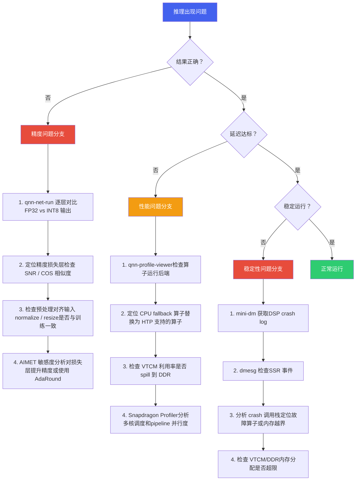
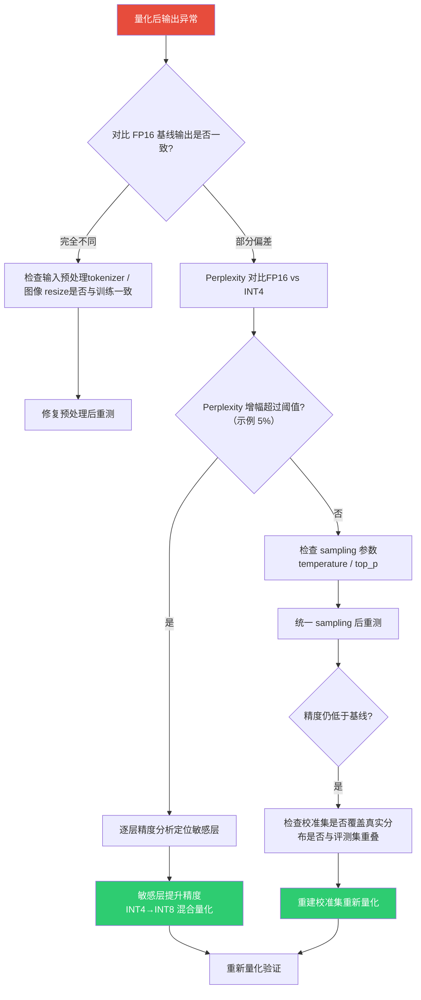

# 调试与工具链

*端侧 AI 部署调试 · 精度 / 性能 / 稳定性排查 · 工具链与方法论*

> [!TIP]
> **本篇讲什么**
>
> 端侧 AI 模型在 SA8397P 上的部署调试工具链与排障方法论：
>
> - 调试工具全景（工具总览、排障决策树、FastRPC 排障、性能优化清单）
> - LLM 精度调试（量化精度损失定位、量化敏感层分析）
> - 内存与 OOM 排障（内存构成、KV Cache OOM、内存监控预警）
> - Crash 分析与案例（常见 Crash 类型、DSP Crash 分析流程、典型案例）
> - 日志与监控体系（aadkcore 日志、aadk\_monitor 日志汇聚与数据回传、性能 Profiling）
>
> **代码基线**：aadkcore 仓库 `aadkapi/aadk_log.hpp`（日志宏与 sink）、`monitor/`（aadk\_monitor\_server 日志汇聚 + 数据回传）、`src/runtime`（ModelResponse / PERF 日志）、`runtime/src/system_agent`（`--dump`/`--upload` 入口）；工具链 mini-dm / Snapdragon Profiler / `dmabuf_dump` / `dumpsys meminfo` 等。

## 1. 调试工具全景

端侧 AI 模型在 SA8397P 上的部署调试涉及精度验证、性能调优、稳定性排查等多个环节。掌握正确的工具链和排障方法论是高效解决问题的关键。

### 1.1 调试工具总览

| 工具 | 类别 | 用途 | 典型使用场景 |
| :--- | :--- | :--- | :--- |
| **qnn-net-run** | 精度验证 | 在目标硬件上运行 QNN 模型，输入测试数据并输出推理结果，用于逐层对比精度 | 量化后模型精度下降时，对比 FP32 参考输出定位精度损失层；验证 Context Binary 输出是否与 ONNX 一致 |
| **qnn-profile-viewer** | 性能分析 | 解析 QNN profiling 数据，可视化每个算子的执行时间、运行后端和内存使用 | 延迟不达标时，检查是否有算子 fallback 到 CPU；分析 HTP 算子执行时间分布，定位性能瓶颈 |
| **Hexagon IDE / Simulator** | DSP 开发 | Hexagon DSP 集成开发环境，包含模拟器、调试器、性能分析器 | 自定义 HTP 算子开发与调试；VTCM 使用优化；HVX 向量化代码性能验证 |
| **Snapdragon Profiler** | 系统级分析 | 全系统性能分析工具，支持 CPU/GPU/DSP/NPU 多核心负载监控和时间线分析 | 多模型并发时分析各核心利用率；端到端 pipeline 延迟分解；CPU-DSP 交互时序分析 |
| **mini-dm** | 日志诊断 | 高通轻量级诊断日志工具，捕获 DSP 子系统的实时日志和 crash 信息 | DSP crash 后获取 crash dump 和调用栈；FastRPC 通信异常排查；SSR（子系统重启）事件分析 |
| **AIMET** | 量化工具 | AI Model Efficiency Toolkit，高通开源的模型量化与压缩工具，支持 PTQ/QAT | 量化敏感度分析（逐层量化精度影响）；混合精度量化策略搜索；量化后模型精度恢复（AdaRound / CLE） |

> [!NOTE]
> **工具链时效（2025-2026）**
>
> - **QNN SDK → QAIRT**：高通自 2024 年起将 AI Engine Direct（QNN）SDK 并入 **QAIRT（Qualcomm AI Runtime）** 品牌，`qnn-net-run` / `qnn-profile-viewer` / `qnn-context-binary-generator` 等命令行工具名保持不变，随 QAIRT 版本迭代。车规平台（SA8397P）实际可用的工具版本**以 Tier-1/OEM 拿到的 BSP 配套 SDK 为准**，与消费级公开发布节奏不同步。
> - **Snapdragon Profiler → Qualcomm Profiler**：2025 年起高通推出 Snapdragon Profiler 的后继工具（并入 QAIRT 工具链生态），HTP/NPU 计数器支持持续演进；新旧工具并存期以目标 BSP 支持的版本为准（**具体版本对应关系需核实**，本篇不锁定版本号）。
> - **Hexagon SDK**：v6.x 起工具链全面转向 LLVM（hexagon-clang），IDE/调试器/Profiler 形态随版本变化，DSP 侧符号解析工具名以所用 SDK 版本为准（见 §4.2）。
> - 上表工具在 aadkcore 仓库内**无直接代码依赖**（仓库脚本只设置 `ADSP_LIBRARY_PATH` 等运行环境变量），属于平台侧配套工具链——文档描述其用法方法论，不绑定具体版本。

### 1.2 排障决策树

当端侧推理出现问题时，按以下决策树系统排查，避免盲目调试：



### 1.3 FastRPC 排障指南

FastRPC 是 ARM CPU 与 Hexagon DSP 之间的远程过程调用机制。FastRPC 通信异常是端侧部署中最常见的问题之一。以下是系统排障步骤：

> [!NOTE]
> **FastRPC 排障六步法**
>
> 1. **检查 FastRPC 驱动状态**
>    运行 `dmesg | grep fastrpc` 查看 FastRPC 驱动加载日志。正常应看到驱动 probe 成功、设备节点创建相关日志；如果出现 error/timeout 字样，说明驱动未正确加载或设备节点异常。
> 2. **获取 DSP 实时日志**
>    运行 `mini-dm` 捕获 DSP 子系统日志。关注 `HAP_` 前缀的日志行，特别是 `HAP_power`、`HAP_mem` 相关错误。如果 mini-dm 无输出，说明 DSP 子系统可能未启动。DSP 侧日志不走 logcat，mini-dm 是唯一出口，用法与排障经验见 [硬件架构 · DSP 侧日志：mini-dm（§4.5）](../../general/hardware.html)。
> 3. **验证设备节点**
>    HTP 推理跑在 **cDSP** 上，对应节点是 `ls /dev/cdsprpc-smd*`（正常应看到 `/dev/cdsprpc-smd` 和 `/dev/cdsprpc-smd-secure`）；`/dev/adsprpc-smd*` 是 aDSP（音频）的节点，别查错对象（三大 DSP 子系统与 FastRPC 库对照见 [硬件架构 · CDSP vs ADSP vs SDSP（§3.2）](../../general/hardware.html)）。节点缺失说明 DSP 固件未加载或 remoteproc 异常。
> 4. **检查 remoteproc 状态**  
>    运行 `cat /sys/class/remoteproc/remoteproc*/state` 查看 DSP 子系统运行状态。正常应为 `running`。如果是 `offline` 或 `crashed`，需要检查固件路径和 SSR 日志。
> 5. **检查 SELinux 策略**  
>    运行 `getenforce` 查看 SELinux 状态。如果为 `Enforcing`，FastRPC 调用可能被 SELinux 策略拒绝。开发阶段可临时设置为 `Permissive`，生产环境需正确配置 SELinux 策略文件。
> 6. **验证 testsig 签名**  
>    检查 `testsig` 文件是否正确部署。未签名或签名不匹配的 DSP 库无法加载。testsig 是基于**目标设备 UID** 生成的临时签名（用 `elfsigner` 工具生成），与设备绑定——换设备需重新生成；它只在开发期可用，量产固件必须走 OEM 正式签名链（testsig 不可用）。签名机制、典型报错与排查顺序见 [硬件架构 · DSP 签名与 testsig（§4.4）](../../general/hardware.html)。

> [!WARNING]
> **常见陷阱**
>
> FastRPC 调用返回"模块未找到/加载失败"类错误码（具体数值以 FastRPC 头文件 `AEEStdErr.h` 为准，勿在代码/文档中写死）时，通常不是通信问题而是 DSP 侧 skeleton 库加载失败。请检查：(1) skeleton `_skel.so` 是否推送到 DSP 加载器搜索路径——搜索路径由环境变量 `ADSP_LIBRARY_PATH` 决定（变量名沿用 ADSP 历史命名，对 cDSP 同样生效），aadkcore 运行脚本中的实际配置为 `/vendor/dsp/cdsp;/vendor/lib/rfsa/adsp;/system/lib/rfsa/adsp;/dsp;<SDK库目录>`（见 `runtime/src/test/android_sdk_run.sh`）；(2) 文件权限是否可读（755）；(3) testsig 是否与当前设备 UID 匹配（见 §1.3 步 6）。

### 1.4 常见性能优化清单

本节聚焦**排障/诊断**视角：每项优化点给出"怎么检查、怎么判断"。优化手段本身的原理与推导见通识篇：量化 → [**端侧模型量化与压缩**](../../general/quantization.html)；roofline / 带宽模型 / 推理引擎 → [**LLM 推理原理与性能模型**](../../general/infer-principles.html)；投机采样、约束解码、延迟优化 → [**端侧解码与服务化优化**](../../general/infer-serving.html)。以下清单涵盖端侧推理的常见性能优化点，按优先级排序：

| 优先级 | 优化项 | 检查方法 | 预期提升 | 注意事项 |
| :--- | :--- | :--- | :--- | :--- |
| **P0** | 消除 CPU fallback 算子 | `qnn-profile-viewer` 查看每个算子的 backend 字段 | 单算子 10-100x | Fallback 到 CPU 的算子会引入 CPU-DSP 数据搬运开销，是性能杀手。替换为 HTP 原生支持的算子或拆分为可支持的算子组合。 |
| **P0** | 使用 Context Binary | 对比 `.so` 模式和 `.bin` 模式的加载时间 | 加载时间减少 50-80% | Context Binary 将图优化、内存规划等离线完成，避免运行时开销。生产环境必须使用 Context Binary。 |
| **P1** | VTCM 利用率优化 | Snapdragon Profiler 的 HTP 计数器（或 Hexagon SDK 配套 profiling 工具，工具名随 SDK 版本）查看 VTCM hit/miss、spill 情况 | 10-30% | VTCM 是 DSP 的片上高速缓存（典型 8 MB，视 HTP 架构版本而定，以 `QnnHtpDevice` 实际查询为准）。确保热点算子的权重和中间结果能放入 VTCM，避免 spill 到 DDR。存储层级与 HTP 版本对照见 [硬件架构 · Hexagon DSP 微架构（§2）](../../general/hardware.html)。 |
| **P1** | 量化精度选择 | 对比 INT8 vs INT16 精度和速度 | INT8 通常快于 INT16（幅度视具体 HTP 代际） | 优先使用 INT8；对精度敏感的层（如最后的分类头）可保持 INT16 混合精度。 |
| **P1** | 输入预处理 offload | Snapdragon Profiler 对比 CPU vs GPU 预处理耗时 | 20-40% | 将 resize/normalize/color conversion 从 CPU offload 到 GPU 或 ISP，减少 CPU 负担和数据搬运。 |
| **P2** | Batch 优化 | 测试不同 batch size 的吞吐量 | 10-30% | 在多路摄像头场景下，合并多路输入为 batch 推理可提高 NPU 利用率。但会增加单帧延迟。 |
| **P2** | Pipeline 并行 | Snapdragon Profiler 时间线分析 | 20-50% | 将预处理、推理、后处理三个阶段 pipeline 化，利用 CPU/GPU/NPU 异构并行。需仔细设计 buffer 管理。 |
| **P2** | 模型结构优化 | AIMET + qnn-net-run 对比 | 模型级别变化 | 通道剪枝、深度可分离卷积替换、激活函数替换（Swish → ReLU6）。需重新训练/微调。 |
| **P3** | 电源管理配置（频率观测 + 主动控频） | 观测：先 `ls /sys/class/devfreq/` 确认 CDSP 节点名（随 BSP 变化），再 `cat /sys/class/devfreq/<cdsp节点名>/cur_freq`。注意 `soc:qcom,cpubw` 是 CPU-DDR 带宽节点，**不是** CDSP，看它判断不了 DSP 频率 | 5-15% | 主动控频走 DCVS 频率投票：推理（尤其 prefill）前用 `QnnHtpPerfInfrastructure` 或 skel 侧 `HAP_power_request` 投票升频，空闲时撤销投票；开发阶段可锁 governor 高频，勿用于量产。机制、与热降频的联动见 [硬件架构 · DCVS 与主动频率投票（§7.4）](../../general/hardware.html)。 |
| **P3** | 内存对齐与布局 | 检查输入 tensor 的 stride 和 alignment | 5-10% | 确保输入 tensor 128 字节对齐；使用 NHWC 布局（HTP 原生格式）避免运行时 transpose。 |

> [!NOTE]
> **"预期提升"列为经验性示例量级（非本平台实测）**，仅用于排优先级；实际收益取决于模型结构、HTP 代际与瓶颈位置（compute-bound 还是 memory-bound），请以自己平台的 profiling 实测为准。

> [!TIP]
> **性能优化黄金法则**
>
> 端侧推理性能优化的投入产出比通常为：**消除 fallback > Context Binary > 量化精度 > 预处理 offload > Pipeline 并行 > 结构优化**。建议按此顺序逐项排查，先摘低垂果实。90% 的性能问题可以在前三项解决。

## 2. LLM 精度调试

端侧 LLM 量化部署后，精度问题表现为**输出质量下降**而非简单的数值偏差。与传统视觉模型的精度调试（对比 mAP/IoU）不同，LLM 精度问题往往是隐性的——模型仍然能"说话"，但 Function Calling 准确率下降、出现幻觉、或多轮对话失去连贯性。另注意：如果精度错误是**间歇性**的（同一输入偶发错误、无 crash），先别在量化里找原因，直接看 §2.3 的 DMA-BUF cache 一致性根因。

### 2.1 量化精度损失定位

端侧 LLM 量化后精度下降的系统排查流程：



> [!NOTE]
> **校准集是端侧 PTQ 掉点最隐性的根因**
>
> 如果逐层敏感度分析定位不到明显敏感层、sampling 与预处理也都对齐了，精度仍低于基线，优先怀疑**校准集**：是否覆盖真实输入分布（座舱场景的光照/领域/指令长度分布），以及是否与评测集重叠（量化参数对评测分布过拟合，线上必掉点）。校准集选择判据（代表性 / 规模 / 多样性 / 与评测集隔离）见 [端侧模型量化与压缩 · 校准集选择（§1.4）](../../general/quantization.html)。

| 问题现象 | 可能原因 | 排查方法 | 解决方案 |
| :--- | :--- | :--- | :--- |
| **Function Calling 调错工具** | 量化导致分类头精度下降 | 对比 FP16 和 INT4 在相同输入下的 logits 分布 | 最后几层（LM Head / 分类头）保持 INT8 或 FP16 |
| **参数提取错误** | 数字 token 的量化敏感 | 测试不同数字（温度、速度）的提取准确率 | Embedding 层保持高精度；增加数字相关训练数据 |
| **多轮对话失忆** | KV Cache INT8 量化导致上下文信息丢失 | 对比 FP16 KV Cache 和 INT8 KV Cache 的多轮对话质量 | KV Cache 使用 INT8 而非 INT4；关键层 KV 保持 FP16 |
| **多模态描述偏差** | 视觉编码器量化敏感 | 单独对比视觉编码器 FP16 vs INT8 的特征余弦相似度 | ViT 部分使用较高精度量化（INT8） |
| **随机输出乱码** | 量化模型加载错误或权重损坏 | MD5 校验量化模型文件完整性 | 重新转换量化模型 |

### 2.2 量化敏感层分析

LLM 的不同层对量化的敏感度差异很大。通常以下层最为敏感：

| 层类型 | 量化敏感度 | 原因 | 建议精度 |
| :--- | :--- | :--- | :--- |
| **Embedding 层** | 高 | 词表映射精度直接影响 token 表示 | INT8 或 FP16 |
| **LM Head（输出层）** | 高 | 决定最终 token 选择，微小误差可能改变输出 | INT8 或 FP16 |
| **前几层 Attention** | 中-高 | 底层特征提取对后续所有层有级联影响 | INT8 |
| **中间层 FFN** | 低 | 冗余度高，量化容忍度大 | INT4 |
| **后几层 Attention** | 中 | 接近输出，精度影响较直接 | INT8 或 INT4 |
| **Vision Encoder** | 中-高 | 图像特征编码精度影响多模态理解 | INT8 |

```
# 逐层精度敏感度分析 (AIMET 方式)
# 逐个将每层量化为 INT4，其余保持 FP16，观察 Perplexity 变化

for layer_idx in range(num_layers):
    # 仅量化第 layer_idx 层为 INT4，其余 FP16
    model = load_fp16_model()
    quantize_single_layer(model, layer_idx, bits=4)
    ppl = evaluate_perplexity(model, eval_dataset)
    print(f"Layer {layer_idx}: PPL = {ppl:.2f} (delta = {ppl - fp16_ppl:+.2f})")

# 输出示例:
# Layer 0 (Embed):   PPL = 8.95 (delta = +1.32)  ← 高敏感
# Layer 1 (Attn):    PPL = 8.12 (delta = +0.49)  ← 中敏感
# Layer 17 (FFN):    PPL = 7.68 (delta = +0.05)  ← 低敏感
# Layer 35 (LMHead): PPL = 9.21 (delta = +1.58)  ← 高敏感
```

> [!NOTE]
> **逐层定位的两条实操路线**
>
> 上面的伪代码示意"单层量化、其余高精度"的敏感度扫描思路（示例 PPL 数字非实测）。落到 QNN/QAIRT 部署时有两条互补路线：
>
> 1. **量化前（浮点侧）**：用 AIMET 做逐层敏感度分析/混合精度搜索，确定哪些层保 INT8/FP16、哪些层可压 INT4——在 PyTorch/ONNX 侧完成，再把混合精度配置带入 QNN 转换流程。
> 2. **量化后（目标硬件侧）**：用 `qnn-net-run` 的 debug 输出 dump 中间层 tensor（选项名以所用 QAIRT 版本的 `qnn-net-run --help` 为准），与浮点参考实现逐层对比余弦相似度/SNR，定位**转换与量化真正落地后**的误差放大层——浮点侧敏感度分析无法覆盖图优化（算子融合、layout 变换）引入的偏差，两侧结论可能不一致，以硬件侧为准。
>
> 两条路线的分工：浮点侧决定"该给哪层多少 bit"，硬件侧验证"实际误差在哪层放大"。

> [!TIP]
> **混合精度量化策略**
>
> 基于敏感度分析结果，推荐的混合精度策略：**Embedding + LM Head 用 INT8，前 2 层和后 2 层 Attention 用 INT8，其余全部 INT4**。相比全 INT4，Perplexity 增幅从 ~1.5% 降至 ~0.5%，而模型大小仅增加约 10%——以上增幅与体积数字均为**示例参数（非实测）**，仅示意精度-体积的权衡方向，请以自己模型的敏感度分析实测为准。这是端侧部署中精度和体积的常见平衡点。

### 2.3 间歇性精度错误（非 crash）：先怀疑 DMA-BUF cache 一致性

不是所有精度问题都出在量化。量化掉点是**稳定复现**的（同一输入总是错）；如果症状是**间歇性**的——同一输入偶发输出错误/乱码/图像识别漂移，无 crash、无 SSR、重启后无规律复现——优先排查**零拷贝路径的 cache 一致性**：CPU 与 DSP 经 DMA-BUF 共享同一块物理内存，但两侧各有 cache，不维护一致性就会读到旧数据。

| 数据流向 | 规则 | 违反后果 |
| :--- | :--- | :--- |
| **CPU 写 → DSP 读** | CPU 写完必须 **flush（clean）** cache line，把脏数据写回内存 | DSP 读到旧数据（脏数据滞留在 CPU cache） |
| **DSP 写 → CPU 读** | CPU 读前必须 **invalidate** 自己的 cache line | CPU 命中旧的缓存副本，读到 DSP 写入前的旧值 |

正确做法：用 `DMA_BUF_IOCTL_SYNC`（`START`/`END` 配对）显式声明访问窗口，由内核做 sync；或把 buffer 映射为 uncached/write-combine（省 sync 但 CPU 侧访问变慢）。这是零拷贝路径最隐蔽的 bug——表现像"精度问题"，根因在内存侧。完整规则与原理见 [硬件架构 · 零拷贝的前提：Cache 一致性（§4.3）](../../general/hardware.html)。

## 3. 内存与 OOM 排障

### 3.1 端侧 LLM 内存构成

端侧 LLM 推理的内存占用由以下部分组成，理解各部分的大小和增长模式是排障的前提：

| 内存组成 | 大小估算 (Qwen3-Omni-4B INT4) | 是否随推理增长 | 说明 |
| :--- | :--- | :--- | :--- |
| **模型权重** | ~2.5 GB | 否（常驻） | INT4 量化后的全部参数 |
| **KV Cache** | ~36 MB/512 tokens (INT8) | 是（随序列长度线性增长） | 每层 2 × n\_kv\_heads × head\_dim × seq\_len |
| **激活值** | ~200-500 MB | 是（随 batch size） | 推理过程中的中间计算结果 |
| **运行时开销** | ~100-200 MB | 否 | QNN 运行时、Context Binary 元数据、内存池 |
| **Vision Encoder** | ~300-500 MB | 否（独立模型） | ViT 权重 + 图像预处理缓冲区 |
| **总计** | ~3.5-4.0 GB（初始） | KV Cache 持续增长 | 峰值取决于最大序列长度和并发数 |

> [!NOTE]
> **估算口径**
>
> 上表以全站锚点模型 Qwen3-Omni-4B（内部定制 4B 级：36 层、32 个 Q head、8 个 KV head（GQA）、head\_dim 128）为例，数值为量级示例、非实测。实际部署请代入你自己的模型配置与平台参数推导。

### 3.2 KV Cache OOM 排障

KV Cache 是端侧 LLM 最常见的 OOM 来源。随着对话轮次增加，KV Cache 持续增长直至内存耗尽：

```
KV Cache 内存计算（以 Qwen3-4B 级典型配置为例:
n_layers=36, n_kv_heads=8 (GQA), head_dim=128, KV 用 INT8）:

  per_token = 2 × n_layers × n_kv_heads × head_dim × dtype_bytes
            = 2 × 36 × 8 × 128 × 1B (INT8)
            = 73,728 Bytes = 72 KB/token

  不同序列长度的 KV Cache 占用:
    256 tokens:   72KB × 256   ≈ 18 MB
    512 tokens:   72KB × 512   ≈ 36 MB
    1024 tokens:  72KB × 1024  ≈ 72 MB
    2048 tokens:  72KB × 2048  ≈ 144 MB
    4096 tokens:  72KB × 4096  ≈ 288 MB

  多请求并发 (Continuous Batching):
    4 个请求 × 1024 tokens/请求 ≈ 288 MB

  结合模型权重 2.5GB + 激活值 0.5GB:
    总内存 ≈ 3.0 GB + KV Cache
```

> [!NOTE]
> **端侧"batching"不一定是真 batch**
>
> 上面"多请求并发 (Continuous Batching)"只是**内存侧**的估算，不代表吞吐收益成立。多请求并发能否吃到 batch 红利取决于运行时能力：并发 2 时每请求 TPOT 基本不变 → 真 batch（吞吐 ≈ ×B）；TPOT ≈ 2× → 时分复用，每请求延迟随并发线性恶化。判据与两条分支的区分见 [端侧解码与服务化优化 · 端侧可行性（§4.5）](../../general/infer-serving.html)。

| OOM 场景 | 触发条件 | 症状 | 解决方案 |
| :--- | :--- | :--- | :--- |
| **长对话 OOM** | 单轮对话超过 max\_seq\_len | DSP crash 或 SSR | 设置 max\_seq\_len 硬限制 + Sliding Window 截断旧上下文 |
| **多请求 OOM** | 多音区同时发起长请求 | 后到达的请求分配 KV Cache 失败 | KV Cache 预算管理：按优先级淘汰低优先级请求的缓存 |
| **多模型 OOM** | ViT + LLM + ASR + TTS 同时驻留 | DDR 总用量超限 | 模型分时加载：ASR/TTS 用完卸载，仅保留 LLM 常驻 |
| **内存泄漏** | 请求完成后 KV Cache 未正确释放 | 内存使用持续上升，不随对话结束回落 | 引用计数检查；每轮对话结束后验证 KV Cache 释放 |

### 3.3 内存监控与预警

```bash
# 实时监控推理进程内存（全站标准口径：VmRSS + dma-buf 合计）

# 方法 1: CPU 侧常驻内存 (VmRSS)
cat /proc/$(pidof system_agent)/status | grep -E "VmRSS|VmSize"

# 方法 2: DSP/NPU 设备侧 dma-buf 缓冲（对持有模型的 pid 执行）
dmabuf_dump $(pidof system_agent)

# 方法 3: 合计 = VmRSS + dma-buf，即"推理进程占了多少内存"的标准口径

# 方法 4: 持续监控脚本（VmRSS 部分；dma-buf 部分按需定期 dmabuf_dump 采样）
while true; do
    RSS=$(cat /proc/$(pidof system_agent)/status | grep VmRSS | awk '{print $2}')
    echo "$(date +%H:%M:%S) RSS: ${RSS} KB"
    sleep 5
done
```

> [!NOTE]
> **框架自带测试程序用的就是这套口径**
>
> aadkcore 的运行时测试程序（`runtime/src/test/new_api_test.cpp`）在每个测试步骤前后读取 `/proc/self/status` 的 **VmRSS / VmSize** 并打印前后差值（如 `[step 2] 内存: VmRSS xxxMB -> xxxMB`），用于确认模型加载/释放的内存增量符合预期——与上面的标准口径同源。做加载/释放类排障时，可直接复用该测试程序的输出定位"哪一步内存没回落"。注意它只覆盖 CPU 侧 VmRSS，DSP 侧 dma-buf 仍需 `dmabuf_dump` 补测。

> [!WARNING]
> **两个口径，不可互比**
>
> ① CPU 侧 **PSS**（`/proc/smaps`）与 ② **VmRSS + dma-buf** 合计是两套不同口径：**PSS ≠ VmRSS + dma-buf**，二者不可直接比较。DSP/NPU 内存走设备侧 dma-buf，不计入 CPU 侧 PSS——排查"内存去哪了"时先用 `dmabuf_dump` 看设备侧，再看 CPU 侧。两口径的实测对比与踩坑记录见 [岚图项目 · 效果、性能与稳定性](../lantu/effect-perf-stability.html)。

> [!WARNING]
> **内存水位线设计**
>
> 建议设置三级内存水位线：**绿色**（< 70% 总内存）正常运行；**黄色**（70-85%）触发 KV Cache 压缩和低优先级请求淘汰；**红色**（> 85%）停止接受新请求，仅完成当前请求后释放。注意：**aadkcore 当前未内置内存水位检查**（aadk\_monitor 的实际职责是日志汇聚与数据回传，见 §5.2），水位线检查需要外部监控脚本（按本节口径采样）或框架扩展实现；进程崩溃后的兜底拉起依赖 systemd `Restart=always`（见 §5.1）。

## 4. Crash 分析与案例

### 4.1 端侧 LLM 常见 Crash 类型

| Crash 类型 | 触发场景 | 日志特征 | 排查要点 |
| :--- | :--- | :--- | :--- |
| **DSP SSR (子系统重启)** | HTP 算子执行异常 / VTCM 访问越界 | `dmesg` 中出现 `subsys-restart` 或 `ssr_event` | mini-dm 获取 DSP crash dump → 分析 crash PC 地址 → 定位算子 |
| **SIGABRT / SIGSEGV** | CPU 侧内存越界 / 空指针 | tombstone 文件中有调用栈和寄存器信息 | addr2line 解析 crash 地址到源码行 → 检查 DataMessage 生命周期 |
| **FastRPC Timeout** | CPU→DSP 调用超时（默认值为示例；超时时长可配置，以运行时配置为准） | `fastrpc: invoke timed out` | DSP 侧是否死锁；模型推理是否超长；QNN Context 是否加载失败 |
| **QNN Context 加载失败** | Context Binary 与硬件不匹配 | `QnnContext_createFromBinary failed` | 检查 Context Binary 编译目标 (SOC) 是否匹配当前硬件 |
| **OOM Kill** | 系统内存不足触发 Low Memory Killer | `lowmemorykiller: kill process` | 检查内存使用曲线，定位内存泄漏或 KV Cache 未释放 |
| **并发/竞态 Crash** | ModelScheduler 调度竞态、Tool 异步回调线程安全问题（多音区并发请求、回调与主线程共享状态未加保护） | crash 栈指向共享容器/锁内部，或对已释放地址的 use-after-free；复现率低、与并发负载正相关 | TSAN（ThreadSanitizer）检测数据竞争；核查回调线程安全与对象生命周期（释放后地址复用）；并发压测提高复现率 |

> [!NOTE]
> **SSR 与 PD 的底层机制**
>
> SSR 发生后**所有旧的 FastRPC handle 和 QNN Context 全部失效**——应用层不处理 SSR 事件，DSP 重启后推理会永久失败。事件流程、handle 清理与恢复两阶段（固件重载完成 vs 应用层推理恢复，应分别计时）见 [硬件架构 · SSR（§5.3）](../../general/hardware.html)。Crash 的隔离范围由 PD 决定：各模型跑在独立 Guest PD、内存互相隔离，单模型崩溃不必然拖垮其他模型，见同篇 §5.2。

### 4.2 DSP Crash 分析流程

> [!NOTE]
> **DSP Crash 排障四步法**
>
> 1. **获取 Crash Dump**
>    `mini-dm` 启动实时日志捕获（DSP 侧日志的唯一出口，见 [硬件架构 · mini-dm（§4.5）](../../general/hardware.html)）。Crash 发生后，DSP 会输出 crash info 包括 crash PC、LR（返回地址）、寄存器状态。同时通过 `dmesg | grep -i "ssr\|subsys\|crash\|fastrpc"` 获取内核侧日志。
> 2. **定位 Crash 地址**
>    使用 Hexagon 工具链的 addr2line / llvm-symbolizer（具体工具名随 Hexagon SDK 版本，如 `hexagon-addr2line` 或 LLVM 系 `llvm-symbolizer`）将 crash PC 地址映射到具体的源文件和行号。需要带调试符号的 DSP 库（`_skel.so` 的调试版本）。
> 3. **分析调用上下文**  
>    根据 LR（返回地址链）还原调用栈。关注：是在哪个 QNN 算子执行时 crash？输入 tensor 的 shape 和数值范围是否异常？是否在特定输入条件下才会复现？
> 4. **复现与验证**  
>    使用 `qnn-net-run` 单独运行导致 crash 的子图，尝试不同输入复现问题。定位到具体算子后，检查算子的输入约束（如 padding 要求、shape 限制）是否满足。

### 4.3 典型案例分析

#### 4.3.1 量化模型间歇性输出乱码

| 现象 | INT4 量化模型在长时间运行后（~2 小时）偶发输出乱码 token |
| :--- | :--- |
| 排查 | 1. 短时间运行正常 → 排除模型文件损坏 2. 内存监控发现 KV Cache 持续增长 → 存在未释放 3. 乱码出现时 KV Cache 已占满预分配空间，新 token 写入越界 |
| 根因 | 多轮对话清理逻辑中，当用户切换 scenario\_id 时，旧 scenario 的 KV Cache 未被释放 |
| 修复 | 在 scenario 切换时主动调用 KV Cache 清理；增加 KV Cache 使用量的边界检查 |

#### 4.3.2 特定图片输入导致 DSP Crash

| 现象 | 某张图片送入 Vision Encoder 时 DSP 立即 SSR |
| :--- | :--- |
| 排查 | 1. mini-dm 获取 crash dump，PC 地址指向 QNN Conv2D 算子 2. 分析图片：分辨率为 1920×1080（非标准输入尺寸） 3. Vision Encoder 输入要求 448×448，但预处理 resize 未执行就送入了原始分辨率 |
| 根因 | 图像预处理 pipeline 中的 resize 函数在接收 YUV420 格式时路径异常，跳过了 resize 直接送入模型 |
| 修复 | 在 model\_inference.cpp 的 image format conversion 之后增加 shape 校验断言 |

#### 4.3.3 多音区并发导致 FastRPC Timeout

| 现象 | 驾驶员和副驾同时发送语音指令时，偶发 FastRPC timeout（~10% 复现率） |
| :--- | :--- |
| 排查 | 1. Snapdragon Profiler 时间线分析：两个请求的 Prefill 同时到达 HTP 2. 单独执行每个请求均正常 → 并发争抢问题 3. HTP 在处理第一个请求的 Prefill 时，第二个请求的 FastRPC 调用排队等待超过 2s timeout |
| 根因 | ModelScheduler 未对 Prefill 阶段做分片，大 Prompt 的 Prefill 独占 HTP 时间过长 |
| 修复 | 1. Prefill 分片：将长 Prompt 分为多段，每段之间允许插入高优先级请求 2. FastRPC timeout 从 2s 调整为 5s 3. 高优先级请求（车控）可抢占低优先级（闲聊）的 Prefill |

> [!NOTE]
> **"Prefill 分片"即 chunked prefill**
>
> 把长 prompt 切成块、块间交错高优先级请求与在途 decode 步，用少量 TTFT 增加换取 TPOT 抖动与抢占等待的大幅下降；块大小是 TTFT 与 TPOT 平滑度的权衡旋钮，原理见 [LLM 推理原理与性能模型 · 混批干扰与 chunked prefill（§5.5）](../../general/infer-principles.html)。另注意：多请求并发究竟走真 batch 还是时分复用，以"并发 2 时每请求 TPOT 是否 ≈ 2×"为判据，见 [端侧解码与服务化优化 · 端侧可行性（§4.5）](../../general/infer-serving.html)——本案的排队恶化正是单 cDSP 时分复用的表现。

## 5. 日志与监控体系

### 5.1 aadkcore 日志系统

aadkcore 的日志基于 **spdlog**，核心定义在 `aadkapi/aadk_log.hpp`，提供两套宏：带日志器名的 `AADK_LOG_TRACE/DEBUG/INFO/WARN/ERROR/CRITICAL(name, ...)`，以及按平台分流的简化宏 `LOG_V/D/I/W/E/F(...)`——Android 平台走 `__android_log_print` 直接进 logcat（tag 为编译期 `TAGNAME`），YunOS 走 `YUNOS_LOG`，Linux 走 spdlog socket 日志器（默认 sink 是 unix socket `/tmp/aadk_log.sock`）。

| 日志级别 | 宏（简化 / 命名） | 典型内容 | 说明 |
| :--- | :--- | :--- | :--- |
| **CRITICAL** | `LOG_F` / `AADK_LOG_CRITICAL` | 致命错误（如日志服务 socket 创建失败） | 最严重级别 |
| **ERROR** | `LOG_E` / `AADK_LOG_ERROR` | 模型加载失败、FastRPC 错误、dump 文件写入失败 | 生产环境始终开启 |
| **WARN** | `LOG_W` / `AADK_LOG_WARN` | 可恢复异常 | 生产环境始终开启 |
| **INFO** | `LOG_I` / `AADK_LOG_INFO` | 关键流程：请求开始/结束、模型加载完成、PERF 性能行（ttft/tps） | 推荐开启 |
| **DEBUG** | `LOG_D` / `AADK_LOG_DEBUG` | 详细调试：preprocess time、first\_token\_time、duration 等 | 运行时默认级别即 debug |
| **TRACE** | `LOG_V` / `AADK_LOG_TRACE` | 最详细追踪 | 默认被编译期裁剪（`SPDLOG_ACTIVE_LEVEL` 缺省为 DEBUG） |

日志格式默认含时间戳、日志器名、线程、级别与源码位置（`[时间] [name] [tid] [level] [file:line:func] message`），编译期定义 `SPDLOG_NO_SOURCE_LOC` 可关闭源码位置。

**日志汇聚链路（Linux 形态）**：各组件 socket sink → `/tmp/aadk_log.sock` → `aadk_monitor_server`（见 §5.2）→ 滚动写入 `/data/logs/aadk.log`；`agentcore.service` 的 stdout/stderr 另进 systemd journal。

```bash
# 端侧日志查看方法

# 1. Android 平台 (logcat)——tag 为各模块编译期 TAGNAME，默认小写 "aadk"，
#    模块可覆盖（如 agent_runtime / ModelScheduler / system_agent / MediaCache）
adb logcat -s aadk:* agent_runtime:* ModelScheduler:* system_agent:*

# 2. Linux 平台：aadk_monitor_server 汇聚日志（滚动文件，默认单文件 25MB）
tail -f /data/logs/aadk.log
# 服务 stdout/stderr（journal）
journalctl -u agentcore.service -f --no-pager

# 3. 数据 dump 调试（输入图像/音频 + 输出文本落盘，DataDump 实现见 src/utils/data_dump.cpp）
# Linux 形态：system_agent 启动参数
system_agent --dump 1            # 可选 --upload 1 同时开启数据回传（§5.2）
# Android SDK 形态：系统属性（model_inference.cpp 在 init 时读取，改属性后需重启服务生效）
adb shell setprop persist.aadk.data_dump 1
# dump 目录为 <data_path>/dump（data_path 即运行时数据目录，Linux 形态如 /opt/agentcore/data/dump）
# 注意：个别分支上 dump 调用点被注释（MsgDeliverImpl::dump_data），开启无生效时先确认调用点是否启用

# 4. mini-dm DSP 日志
mini-dm  # 捕获 Hexagon DSP 实时日志
```

### 5.2 aadk\_monitor：日志汇聚与数据回传

`aadk_monitor` 是 aadkcore 的**日志汇聚 + 数据回传**组件（不是健康监控服务），由两部分组成：

| 组件 | 职责 | 入口 / 出口 |
| :--- | :--- | :--- |
| **aadk\_monitor\_server**（`monitor/src/monitor_server.cpp`，独立进程，systemd 单元 `aadk_monitor.service`，`Restart=always`） | Unix socket 日志汇聚：接收各组件 socket sink 发来的日志行，滚动写盘 | 监听 `/tmp/aadk_log.sock`（`-s` 可配）→ 写 `/data/logs/aadk.log`（`-f` 指定，单文件上限 `-m` 默认 25MB） |
| **aadk\_monitor 库**（`monitor/src/monitor.cpp` + `api_gateway`，链接进 system\_agent 进程） | 数据回传（badcase 收集）：异步上传请求/响应 JSON 及随路图像/音频到云端网关 | `system_agent --upload 1` 开启；走网关接口 `/api/v1/chat/log` 与资源上传接口（HMAC 签名） |

> [!NOTE]
> **常见误解澄清：aadkcore 未内置健康监控**
>
> 进程存活、内存水位、心跳、DSP 状态等健康检查**目前不在 aadkcore 内**：进程崩溃后的自动拉起依赖 systemd `Restart=always`（`agentcore.service`，RestartSec=5s）；内存水位线是建议的扩展方向（见 §3.3），当前需外部监控脚本按 VmRSS + dma-buf 口径采样实现。把 aadk\_monitor 当"健康监控"会找错排障入口——它的价值在于**统一日志出口**（`/data/logs/aadk.log`）与**线上 badcase 数据回传**。

### 5.3 性能数据采集 (Profiling)

aadkcore 的性能数据来自三个层次（早期厂商侧 `registerProfilingCallback` 上报链已在岚图分支停用删除，见 [岚图 · APK 侧集成](../lantu/apk-integration.html)，主线是否保留需核实）：

1. **框架层 —— `ModelResponse`**（`aadkapi/model_response.hpp`）：每次推理返回 `ttft`（ms）、`input_tokens`、`output_tokens`、`tokens_per_second` 与 `error_code`（`SUCCESS` / `MODEL_NOT_FOUND` / `MODEL_NOT_READY` / `MODEL_SUSPENDED` / `MODEL_GEN_STOPPED` / `MODEL_FAILURE`）。QNN 路径在 `StreamGenerate` 首个流式回调处计 TTFT、按 decode 时长算 TPS（`src/models/qnn/qnn_model.cpp`）。
2. **随响应回传的 `debug_info`**：`MsgDeliverImpl::get_debug_info` 把 `infer_start/infer_end/input_tokens/out_tokens/TTFT/TPS/AEG/VEG` 打进响应 JSON，调用端无需额外接口即可拿到单次请求性能数据。
3. **PERF 日志**：`model_runner.cpp` 输出 `PERF: ModelRunner::inference leave tps: ..., ttft: ..., output_tokens: ...`；`qnn_model.cpp` 另有 `preprocess time` / `first_token_time` / `duration` 等行，可直接 grep 做趋势分析。

> [!NOTE]
> **厂商 SDK 层的分段 Profiling：打开 DSP 黑盒的关键**
>
> 端侧 LLM 延迟排障最难的是"慢在 FastRPC 通信、HTP 计算还是排队等待"分不清。genai\_sdk（`third_party/genai_sdk/.../include/components/profiler.h`）提供 `ProfileEvent` 回调，可把单次推理拆成五段：`QNN_MODEL_EXECUTE`（整次推理）、`GRAPH_EXECUTE_HOST_RPC_TIME`（host 侧 RPC）、`GRAPH_EXECUTE_HTP_RPC_TIME`（HTP RPC）、`GRAPH_EXECUTE_ACCEL_TIME`（加速器执行）、`GRAPH_EXECUTE_ACCEL_EXCL_WAIT_TIME`（加速器独占等待）。**RPC 时间占比高 → 通信/调度问题；ACCEL 占比高 → 纯算力/带宽瓶颈；EXCL\_WAIT 高 → 多负载争抢 HTP**（对应 §4.3.3 的并发排队场景）。注意：aadkcore 基于它的上层上报链在岚图分支已删除，直接使用需在集成层自行注册回调（接口可用性以所用 SDK 版本为准）。

| 性能指标 | 采集方式 | 典型值（示例参数，非实测） | 异常阈值（示例） |
| :--- | :--- | :--- | :--- |
| **TTFT** | `ModelResponse.ttft` / `debug_info.TTFT` | 600-800 ms (S=350) | > 1500 ms |
| **TPOT** | 由 `tokens_per_second` 换算（TPOT ≈ 1000 / TPS） | 70-100 ms (~10-14 tok/s) | > 200 ms |
| **模型加载时间** | 框架未内置指标，用日志时间戳（load 前后 INFO 行）或外部计时 | 2-5 s (Context Binary) | > 10 s |
| **KV Cache 使用率** | 框架未暴露（由厂商 SDK 内部管理），按 §3.2 公式由序列长度估算 | 变化范围 0-100% | 持续 > 80% |
| **NPU 利用率** | aadkcore 不采集，用 Snapdragon Profiler / qnn-profile-viewer | 推理时 > 90% | < 50% (可能有 fallback) |

> [!NOTE]
> **表中数字为示例参数**
>
> "典型值"与"异常阈值"两列均为**示例参数（非实测）**，仅示意量级与告警思路。TTFT 由算力决定（prefill compute-bound）、TPOT 由带宽决定（decode memory-bound），请按自己平台的 roofline/带宽模型推导预期值，再据此设定阈值，推导方法见 [LLM 推理原理与性能模型](../../general/infer-principles.html)；阈值本身应结合产品延迟预算设定。

> [!TIP]
> **调试工具选择指南**
>
> 快速参考：**精度问题** → qnn-net-run + AIMET 逐层分析（间歇性精度错误先看 §2.3 cache 一致性）；**性能问题** → qnn-profile-viewer + Snapdragon Profiler，框架侧单请求数据看 `debug_info` / PERF 日志（§5.3），通信 vs 计算 vs 排队分段看厂商 SDK `ProfileEvent`；**稳定性问题** → mini-dm + dmesg + `/data/logs/aadk.log`（aadk\_monitor\_server 汇聚，§5.2）；**内存问题** → VmRSS + `dmabuf_dump`（标准口径见 §3.3）；**FastRPC 问题** → 排障六步法（第 1 章）。先确定问题类别，再选对应工具，避免盲目排查。
