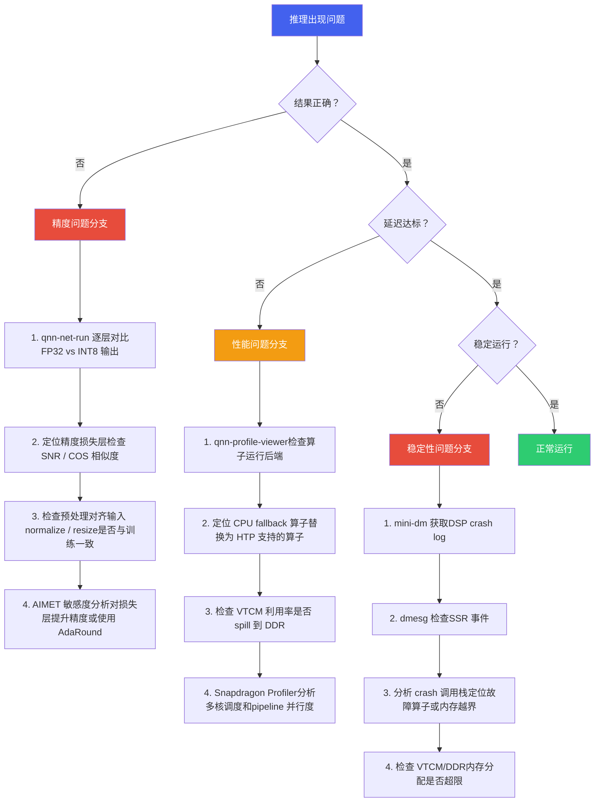
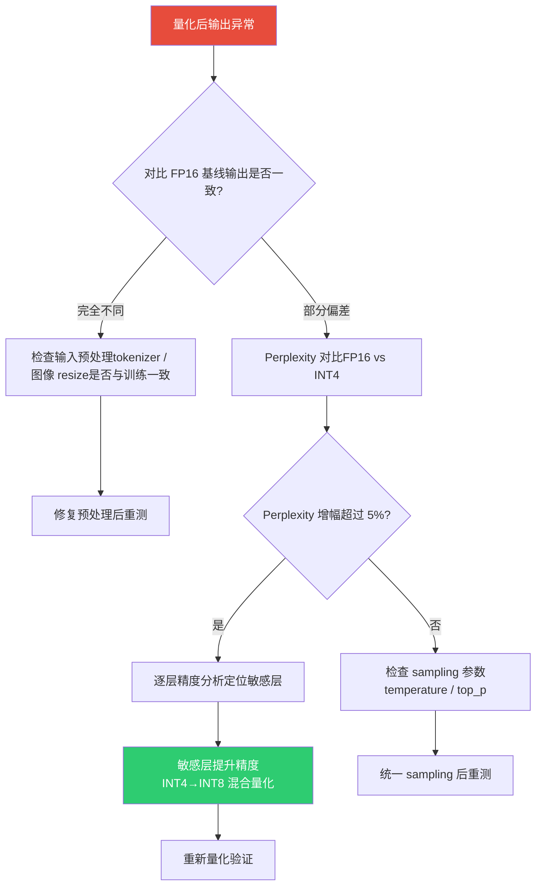

# 5. 调试与工具链

*端侧 AI 部署调试 · 精度 / 性能 / 稳定性排查 · 工具链与方法论*

> [!TIP]
> **本篇讲什么**
>
> 端侧 AI 模型在 SA8397P 上的部署调试工具链与排障方法论：
>
> - 调试工具全景（工具总览、排障决策树、FastRPC 排障、性能优化清单）
> - LLM 精度调试（量化精度损失定位、量化敏感层分析）
> - 内存与 OOM 排障（内存构成、KV Cache OOM、内存监控预警）
> - Crash 分析与案例（常见 Crash 类型、DSP Crash 分析流程、典型案例）
> - 日志与监控体系（aadkcore 日志、aadk\_monitor 健康监控、性能 Profiling）
>
> **代码基线**：aadkcore 仓库 `src/log`、`src/runtime`；工具链 mini-dm / Snapdragon Profiler / `dmabuf_dump` / `dumpsys meminfo` 等。

## 1. 调试工具全景

端侧 AI 模型在 SA8397P 上的部署调试涉及精度验证、性能调优、稳定性排查等多个环节。掌握正确的工具链和排障方法论是高效解决问题的关键。

### 1.1 调试工具总览

| 工具 | 类别 | 用途 | 典型使用场景 |
| :--- | :--- | :--- | :--- |
| **qnn-net-run** | 精度验证 | 在目标硬件上运行 QNN 模型，输入测试数据并输出推理结果，用于逐层对比精度 | 量化后模型精度下降时，对比 FP32 参考输出定位精度损失层；验证 Context Binary 输出是否与 ONNX 一致 |
| **qnn-profile-viewer** | 性能分析 | 解析 QNN profiling 数据，可视化每个算子的执行时间、运行后端和内存使用 | 延迟不达标时，检查是否有算子 fallback 到 CPU；分析 HTP 算子执行时间分布，定位性能瓶颈 |
| **Hexagon IDE / Simulator** | DSP 开发 | Hexagon DSP 集成开发环境，包含模拟器、调试器、性能分析器 | 自定义 HTP 算子开发与调试；VTCM 使用优化；HVX 向量化代码性能验证 |
| **Snapdragon Profiler** | 系统级分析 | 全系统性能分析工具，支持 CPU/GPU/DSP/NPU 多核心负载监控和时间线分析 | 多模型并发时分析各核心利用率；端到端 pipeline 延迟分解；CPU-DSP 交互时序分析 |
| **mini-dm** | 日志诊断 | 高通轻量级诊断日志工具，捕获 DSP 子系统的实时日志和 crash 信息 | DSP crash 后获取 crash dump 和调用栈；FastRPC 通信异常排查；SSR（子系统重启）事件分析 |
| **AIMET** | 量化工具 | AI Model Efficiency Toolkit，高通开源的模型量化与压缩工具，支持 PTQ/QAT | 量化敏感度分析（逐层量化精度影响）；混合精度量化策略搜索；量化后模型精度恢复（AdaRound / CLE） |

### 1.2 排障决策树

当端侧推理出现问题时，按以下决策树系统排查，避免盲目调试：



### 1.3 FastRPC 排障指南

FastRPC 是 ARM CPU 与 Hexagon DSP 之间的远程过程调用机制。FastRPC 通信异常是端侧部署中最常见的问题之一。以下是系统排障步骤：

> [!NOTE]
> **FastRPC 排障六步法**
>
> 1. **检查 FastRPC 驱动状态**  
>    运行 `dmesg | grep fastrpc` 查看 FastRPC 驱动加载日志。正常应看到 `fastrpc: device opened`。如果出现 `fastrpc: error`，说明驱动未正确加载或设备节点异常。
> 2. **获取 DSP 实时日志**  
>    运行 `mini-dm` 捕获 DSP 子系统日志。关注 `HAP_` 前缀的日志行，特别是 `HAP_power`、`HAP_mem` 相关错误。如果 mini-dm 无输出，说明 DSP 子系统可能未启动。
> 3. **验证设备节点**  
>    运行 `ls /dev/adsprpc-smd*` 检查 FastRPC 设备节点是否存在。正常应看到 `/dev/adsprpc-smd` 和 `/dev/adsprpc-smd-secure`。节点缺失说明 DSP 固件未加载或 remoteproc 异常。
> 4. **检查 remoteproc 状态**  
>    运行 `cat /sys/class/remoteproc/remoteproc*/state` 查看 DSP 子系统运行状态。正常应为 `running`。如果是 `offline` 或 `crashed`，需要检查固件路径和 SSR 日志。
> 5. **检查 SELinux 策略**  
>    运行 `getenforce` 查看 SELinux 状态。如果为 `Enforcing`，FastRPC 调用可能被 SELinux 策略拒绝。开发阶段可临时设置为 `Permissive`，生产环境需正确配置 SELinux 策略文件。
> 6. **验证 testsig 签名**  
>    检查 `testsig` 文件是否正确部署。未签名或签名不匹配的 DSP 库无法加载。开发阶段需确保 testsig 与设备序列号匹配，使用 `elfsigner` 工具签名。

> [!WARNING]
> **常见陷阱**
>
> FastRPC 调用返回 `AEE_ECONNREFUSED`（错误码 -14）时，通常不是网络问题而是 DSP 侧 skeleton 库加载失败。请检查：(1) skeleton .so 文件是否推送到 `/vendor/lib/rfsa/dsp/`；(2) 文件权限是否为 755；(3) testsig 是否匹配。

### 1.4 常见性能优化清单

以下清单涵盖端侧推理的常见性能优化点，按优先级排序：

| 优先级 | 优化项 | 检查方法 | 预期提升 | 注意事项 |
| :--- | :--- | :--- | :--- | :--- |
| **P0** | 消除 CPU fallback 算子 | `qnn-profile-viewer` 查看每个算子的 backend 字段 | 单算子 10-100x | Fallback 到 CPU 的算子会引入 CPU-DSP 数据搬运开销，是性能杀手。替换为 HTP 原生支持的算子或拆分为可支持的算子组合。 |
| **P0** | 使用 Context Binary | 对比 `.so` 模式和 `.bin` 模式的加载时间 | 加载时间减少 50-80% | Context Binary 将图优化、内存规划等离线完成，避免运行时开销。生产环境必须使用 Context Binary。 |
| **P1** | VTCM 利用率优化 | Hexagon Profiler 查看 VTCM hit/miss ratio | 10-30% | VTCM 是 DSP 的片上高速缓存（~4MB）。确保热点算子的权重和中间结果能放入 VTCM，避免 spill 到 DDR。 |
| **P1** | 量化精度选择 | 对比 INT8 vs INT16 精度和速度 | INT8 比 INT16 快 1.5-2x | 优先使用 INT8；对精度敏感的层（如最后的分类头）可保持 INT16 混合精度。 |
| **P1** | 输入预处理 offload | Snapdragon Profiler 对比 CPU vs GPU 预处理耗时 | 20-40% | 将 resize/normalize/color conversion 从 CPU offload 到 GPU 或 ISP，减少 CPU 负担和数据搬运。 |
| **P2** | Batch 优化 | 测试不同 batch size 的吞吐量 | 10-30% | 在多路摄像头场景下，合并多路输入为 batch 推理可提高 NPU 利用率。但会增加单帧延迟。 |
| **P2** | Pipeline 并行 | Snapdragon Profiler 时间线分析 | 20-50% | 将预处理、推理、后处理三个阶段 pipeline 化，利用 CPU/GPU/NPU 异构并行。需仔细设计 buffer 管理。 |
| **P2** | 模型结构优化 | AIMET + qnn-net-run 对比 | 模型级别变化 | 通道剪枝、深度可分离卷积替换、激活函数替换（Swish → ReLU6）。需重新训练/微调。 |
| **P3** | 电源管理配置 | `cat /sys/class/devfreq/soc:qcom,cpubw/cur_freq` | 5-15% | 确保 DSP 运行在最高频率档位。开发阶段可锁定高频避免动态降频影响性能基准测试结果。 |
| **P3** | 内存对齐与布局 | 检查输入 tensor 的 stride 和 alignment | 5-10% | 确保输入 tensor 128 字节对齐；使用 NHWC 布局（HTP 原生格式）避免运行时 transpose。 |

> [!TIP]
> **性能优化黄金法则**
>
> 端侧推理性能优化的投入产出比通常为：**消除 fallback > Context Binary > 量化精度 > 预处理 offload > Pipeline 并行 > 结构优化**。建议按此顺序逐项排查，先摘低垂果实。90% 的性能问题可以在前三项解决。

## 2. LLM 精度调试

端侧 LLM 量化部署后，精度问题表现为**输出质量下降**而非简单的数值偏差。与传统视觉模型的精度调试（对比 mAP/IoU）不同，LLM 精度问题往往是隐性的——模型仍然能"说话"，但 Function Calling 准确率下降、出现幻觉、或多轮对话失去连贯性。

### 2.1 量化精度损失定位

端侧 LLM 量化后精度下降的系统排查流程：



| 问题现象 | 可能原因 | 排查方法 | 解决方案 |
| :--- | :--- | :--- | :--- |
| **Function Calling 调错工具** | 量化导致分类头精度下降 | 对比 FP16 和 INT4 在相同输入下的 logits 分布 | 最后几层（LM Head / 分类头）保持 INT8 或 FP16 |
| **参数提取错误** | 数字 token 的量化敏感 | 测试不同数字（温度、速度）的提取准确率 | Embedding 层保持高精度；增加数字相关训练数据 |
| **多轮对话失忆** | KV Cache INT8 量化导致上下文信息丢失 | 对比 FP16 KV Cache 和 INT8 KV Cache 的多轮对话质量 | KV Cache 使用 INT8 而非 INT4；关键层 KV 保持 FP16 |
| **多模态描述偏差** | 视觉编码器量化敏感 | 单独对比视觉编码器 FP16 vs INT8 的特征余弦相似度 | ViT 部分使用较高精度量化（INT8） |
| **随机输出乱码** | 量化模型加载错误或权重损坏 | MD5 校验量化模型文件完整性 | 重新转换量化模型 |

### 2.2 量化敏感层分析

LLM 的不同层对量化的敏感度差异很大。通常以下层最为敏感：

| 层类型 | 量化敏感度 | 原因 | 建议精度 |
| :--- | :--- | :--- | :--- |
| **Embedding 层** | 高 | 词表映射精度直接影响 token 表示 | INT8 或 FP16 |
| **LM Head（输出层）** | 高 | 决定最终 token 选择，微小误差可能改变输出 | INT8 或 FP16 |
| **前几层 Attention** | 中-高 | 底层特征提取对后续所有层有级联影响 | INT8 |
| **中间层 FFN** | 低 | 冗余度高，量化容忍度大 | INT4 |
| **后几层 Attention** | 中 | 接近输出，精度影响较直接 | INT8 或 INT4 |
| **Vision Encoder** | 中-高 | 图像特征编码精度影响多模态理解 | INT8 |

```
# 逐层精度敏感度分析 (AIMET 方式)
# 逐个将每层量化为 INT4，其余保持 FP16，观察 Perplexity 变化

for layer_idx in range(num_layers):
    # 仅量化第 layer_idx 层为 INT4，其余 FP16
    model = load_fp16_model()
    quantize_single_layer(model, layer_idx, bits=4)
    ppl = evaluate_perplexity(model, eval_dataset)
    print(f"Layer {layer_idx}: PPL = {ppl:.2f} (delta = {ppl - fp16_ppl:+.2f})")

# 输出示例:
# Layer 0 (Embed):   PPL = 8.95 (delta = +1.32)  ← 高敏感
# Layer 1 (Attn):    PPL = 8.12 (delta = +0.49)  ← 中敏感
# Layer 17 (FFN):    PPL = 7.68 (delta = +0.05)  ← 低敏感
# Layer 35 (LMHead): PPL = 9.21 (delta = +1.58)  ← 高敏感
```

> [!TIP]
> **混合精度量化策略**
>
> 基于敏感度分析结果，推荐的混合精度策略：**Embedding + LM Head 用 INT8，前 2 层和后 2 层 Attention 用 INT8，其余全部 INT4**。相比全 INT4，Perplexity 增幅从 ~1.5% 降至 ~0.5%，而模型大小仅增加约 10%。这是端侧部署中精度和体积的最佳平衡点。

## 3. 内存与 OOM 排障

### 3.1 端侧 LLM 内存构成

端侧 LLM 推理的内存占用由以下部分组成，理解各部分的大小和增长模式是排障的前提：

| 内存组成 | 大小估算 (Qwen3-Omni-4B INT4) | 是否随推理增长 | 说明 |
| :--- | :--- | :--- | :--- |
| **模型权重** | ~2.5 GB | 否（常驻） | INT4 量化后的全部参数 |
| **KV Cache** | ~19 MB/512 tokens (INT8) | 是（随序列长度线性增长） | 每层 2 × n\_kv\_heads × head\_dim × seq\_len |
| **激活值** | ~200-500 MB | 是（随 batch size） | 推理过程中的中间计算结果 |
| **运行时开销** | ~100-200 MB | 否 | QNN 运行时、Context Binary 元数据、内存池 |
| **Vision Encoder** | ~300-500 MB | 否（独立模型） | ViT 权重 + 图像预处理缓冲区 |
| **总计** | ~3.5-4.0 GB（初始） | KV Cache 持续增长 | 峰值取决于最大序列长度和并发数 |

### 3.2 KV Cache OOM 排障

KV Cache 是端侧 LLM 最常见的 OOM 来源。随着对话轮次增加，KV Cache 持续增长直至内存耗尽：

```
KV Cache 内存计算:

  per_token = 2 × n_layers × n_kv_heads × head_dim × dtype_bytes
            = 2 × 36 × 4 × 128 × 1B (INT8)
            = 36,864 Bytes ≈ 36 KB/token

  不同序列长度的 KV Cache 占用:
    256 tokens:   36KB × 256   ≈ 9 MB
    512 tokens:   36KB × 512   ≈ 18 MB
    1024 tokens:  36KB × 1024  ≈ 36 MB
    2048 tokens:  36KB × 2048  ≈ 72 MB
    4096 tokens:  36KB × 4096  ≈ 144 MB

  多请求并发 (Continuous Batching):
    4 个请求 × 1024 tokens/请求 ≈ 144 MB

  结合模型权重 2.5GB + 激活值 0.5GB:
    总内存 ≈ 3.0 GB + KV Cache
```

| OOM 场景 | 触发条件 | 症状 | 解决方案 |
| :--- | :--- | :--- | :--- |
| **长对话 OOM** | 单轮对话超过 max\_seq\_len | DSP crash 或 SSR | 设置 max\_seq\_len 硬限制 + Sliding Window 截断旧上下文 |
| **多请求 OOM** | 多音区同时发起长请求 | 后到达的请求分配 KV Cache 失败 | KV Cache 预算管理：按优先级淘汰低优先级请求的缓存 |
| **多模型 OOM** | ViT + LLM + ASR + TTS 同时驻留 | DDR 总用量超限 | 模型分时加载：ASR/TTS 用完卸载，仅保留 LLM 常驻 |
| **内存泄漏** | 请求完成后 KV Cache 未正确释放 | 内存使用持续上升，不随对话结束回落 | 引用计数检查；每轮对话结束后验证 KV Cache 释放 |

### 3.3 内存监控与预警

```bash
# 实时监控 DSP 内存使用
# 方法 1: 查看 ION/DMA-BUF 分配
cat /sys/kernel/debug/dma_buf/bufinfo

# 方法 2: 查看进程 VSS/RSS
cat /proc/$(pidof system_agent)/status | grep -E "VmRSS|VmSize"

# 方法 3: 查看 SMMU (System MMU) 映射
cat /sys/kernel/debug/iommu/*/info  # 查看 DSP 的 IOMMU 映射大小

# 方法 4: 持续监控脚本
while true; do
    RSS=$(cat /proc/$(pidof system_agent)/status | grep VmRSS | awk '{print $2}')
    echo "$(date +%H:%M:%S) RSS: ${RSS} KB"
    sleep 5
done
```

> [!WARNING]
> **内存水位线设计**
>
> 建议设置三级内存水位线：**绿色**（< 70% 总内存）正常运行；**黄色**（70-85%）触发 KV Cache 压缩和低优先级请求淘汰；**红色**（> 85%）停止接受新请求，仅完成当前请求后释放。通过 aadk\_monitor 服务定期检查并上报内存使用。

## 4. Crash 分析与案例

### 4.1 端侧 LLM 常见 Crash 类型

| Crash 类型 | 触发场景 | 日志特征 | 排查要点 |
| :--- | :--- | :--- | :--- |
| **DSP SSR (子系统重启)** | HTP 算子执行异常 / VTCM 访问越界 | `dmesg` 中出现 `subsys-restart` 或 `ssr_event` | mini-dm 获取 DSP crash dump → 分析 crash PC 地址 → 定位算子 |
| **SIGABRT / SIGSEGV** | CPU 侧内存越界 / 空指针 | tombstone 文件中有调用栈和寄存器信息 | addr2line 解析 crash 地址到源码行 → 检查 DataMessage 生命周期 |
| **FastRPC Timeout** | CPU→DSP 调用超时（默认 ~2s） | `fastrpc: invoke timed out` | DSP 侧是否死锁；模型推理是否超长；QNN Context 是否加载失败 |
| **QNN Context 加载失败** | Context Binary 与硬件不匹配 | `QnnContext_createFromBinary failed` | 检查 Context Binary 编译目标 (SOC) 是否匹配当前硬件 |
| **OOM Kill** | 系统内存不足触发 Low Memory Killer | `lowmemorykiller: kill process` | 检查内存使用曲线，定位内存泄漏或 KV Cache 未释放 |

### 4.2 DSP Crash 分析流程

> [!NOTE]
> **DSP Crash 排障四步法**
>
> 1. **获取 Crash Dump**  
>    `mini-dm` 启动实时日志捕获。Crash 发生后，DSP 会输出 crash info 包括 crash PC、LR（返回地址）、寄存器状态。同时通过 `dmesg | grep -i "ssr\|subsys\|crash\|fastrpc"` 获取内核侧日志。
> 2. **定位 Crash 地址**  
>    使用 `hexagon-addr2line` 将 crash PC 地址映射到具体的源文件和行号。需要带调试符号的 DSP 库（`_skel.so` 的调试版本）。
> 3. **分析调用上下文**  
>    根据 LR（返回地址链）还原调用栈。关注：是在哪个 QNN 算子执行时 crash？输入 tensor 的 shape 和数值范围是否异常？是否在特定输入条件下才会复现？
> 4. **复现与验证**  
>    使用 `qnn-net-run` 单独运行导致 crash 的子图，尝试不同输入复现问题。定位到具体算子后，检查算子的输入约束（如 padding 要求、shape 限制）是否满足。

### 4.3 典型案例分析

#### 4.3.1 量化模型间歇性输出乱码

| 现象 | INT4 量化模型在长时间运行后（~2 小时）偶发输出乱码 token |
| :--- | :--- |
| 排查 | 1. 短时间运行正常 → 排除模型文件损坏 2. 内存监控发现 KV Cache 持续增长 → 存在未释放 3. 乱码出现时 KV Cache 已占满预分配空间，新 token 写入越界 |
| 根因 | 多轮对话清理逻辑中，当用户切换 scenario\_id 时，旧 scenario 的 KV Cache 未被释放 |
| 修复 | 在 scenario 切换时主动调用 KV Cache 清理；增加 KV Cache 使用量的边界检查 |

#### 4.3.2 特定图片输入导致 DSP Crash

| 现象 | 某张图片送入 Vision Encoder 时 DSP 立即 SSR |
| :--- | :--- |
| 排查 | 1. mini-dm 获取 crash dump，PC 地址指向 QNN Conv2D 算子 2. 分析图片：分辨率为 1920×1080（非标准输入尺寸） 3. Vision Encoder 输入要求 448×448，但预处理 resize 未执行就送入了原始分辨率 |
| 根因 | 图像预处理 pipeline 中的 resize 函数在接收 YUV420 格式时路径异常，跳过了 resize 直接送入模型 |
| 修复 | 在 model\_inference.cpp 的 image format conversion 之后增加 shape 校验断言 |

#### 4.3.3 多音区并发导致 FastRPC Timeout

| 现象 | 驾驶员和副驾同时发送语音指令时，偶发 FastRPC timeout（~10% 复现率） |
| :--- | :--- |
| 排查 | 1. Snapdragon Profiler 时间线分析：两个请求的 Prefill 同时到达 HTP 2. 单独执行每个请求均正常 → 并发争抢问题 3. HTP 在处理第一个请求的 Prefill 时，第二个请求的 FastRPC 调用排队等待超过 2s timeout |
| 根因 | ModelScheduler 未对 Prefill 阶段做分片，大 Prompt 的 Prefill 独占 HTP 时间过长 |
| 修复 | 1. Prefill 分片：将长 Prompt 分为多段，每段之间允许插入高优先级请求 2. FastRPC timeout 从 2s 调整为 5s 3. 高优先级请求（车控）可抢占低优先级（闲聊）的 Prefill |

## 5. 日志与监控体系

### 5.1 aadkcore 日志系统

aadkcore 框架内置了多级日志系统，用于端侧 Agent 的运行时诊断：

| 日志级别 | 用途 | 典型内容 | 生产环境开启 |
| :--- | :--- | :--- | :--- |
| **ERROR** | 不可恢复错误 | 模型加载失败、FastRPC crash、OOM | 始终开启 |
| **WARN** | 可恢复异常 | Tool 调用超时后重试、KV Cache 接近上限 | 始终开启 |
| **INFO** | 关键流程 | 请求开始/结束、模型加载完成、LoRA 切换 | 推荐开启 |
| **DEBUG** | 详细调试 | 每个 token 的生成时间、KV Cache 使用量、Prompt 内容 | 仅调试时开启 |
| **TRACE** | 算子级追踪 | QNN 每个算子的执行时间和内存分配 | 仅性能分析时开启 |

```bash
# 端侧日志查看方法

# 1. Android 平台 (logcat)
adb logcat -s AADK:* | grep -E "ERROR|WARN|ModelRunner|Scheduler"

# 2. Linux 平台 (systemd journal)
journalctl -u agentcore.service -f --no-pager

# 3. 数据 dump 调试 (通过 Android 系统属性)
# 开启输入输出 dump (model_inference.cpp 中读取此属性)
adb shell setprop persist.aadk.data_dump 1
# dump 文件保存在 /data/local/tmp/aadk_dump/

# 4. mini-dm DSP 日志
mini-dm  # 捕获 Hexagon DSP 实时日志
```

### 5.2 aadk\_monitor 健康监控

aadkcore 附带独立的监控服务 `aadk_monitor`（通过 systemd 管理），负责持续监控 Agent 进程的健康状态：

| 监控项 | 检查方式 | 告警阈值 | 自动恢复 |
| :--- | :--- | :--- | :--- |
| **进程存活** | 定期检查 system\_agent 进程是否存在 | 进程不存在 | 自动重启（systemd Restart=always） |
| **内存使用** | 读取 /proc/PID/status VmRSS | VmRSS > 配置阈值的 85% | 日志告警 + 触发 KV Cache 清理 |
| **推理延迟** | 统计最近 N 次推理的 TTFT 和 TPOT | P99 延迟 > 配置阈值 | 日志告警 + 性能数据上报 |
| **DSP 状态** | 检查 remoteproc 状态 | 状态为 crashed 或 offline | 记录 crash 信息 + 等待 SSR 恢复 |
| **心跳检测** | 向 system\_agent 发送 health check 请求 | 连续 3 次无响应 | 强制重启 system\_agent |

### 5.3 性能数据采集 (Profiling)

aadkcore 通过 `registerProfilingCallback` 接口支持实时性能数据采集，便于监控和优化：

| 性能指标 | 采集方式 | 典型值 (Qwen3-Omni-4B INT4) | 异常阈值 |
| :--- | :--- | :--- | :--- |
| **TTFT** | Prefill 开始到第一个 token 输出 | 600-800 ms (S=350) | > 1500 ms |
| **TPOT** | 相邻 token 间隔 | 70-100 ms (~10-14 tok/s) | > 200 ms |
| **模型加载时间** | Context Binary 加载到推理就绪 | 2-5 s (Context Binary) | > 10 s |
| **KV Cache 使用率** | 当前使用 / 最大分配 | 变化范围 0-100% | 持续 > 80% |
| **NPU 利用率** | HTP 忙时间 / 总时间 | 推理时 > 90% | < 50% (可能有 fallback) |

> [!TIP]
> **调试工具选择指南**
>
> 快速参考：**精度问题** → qnn-net-run + AIMET 逐层分析；**性能问题** → qnn-profile-viewer + Snapdragon Profiler；**稳定性问题** → mini-dm + dmesg + aadk\_monitor 日志；**内存问题** → /proc/PID/status + DMA-BUF 统计；**FastRPC 问题** → 排障六步法（第 1 章）。先确定问题类别，再选对应工具，避免盲目排查。
