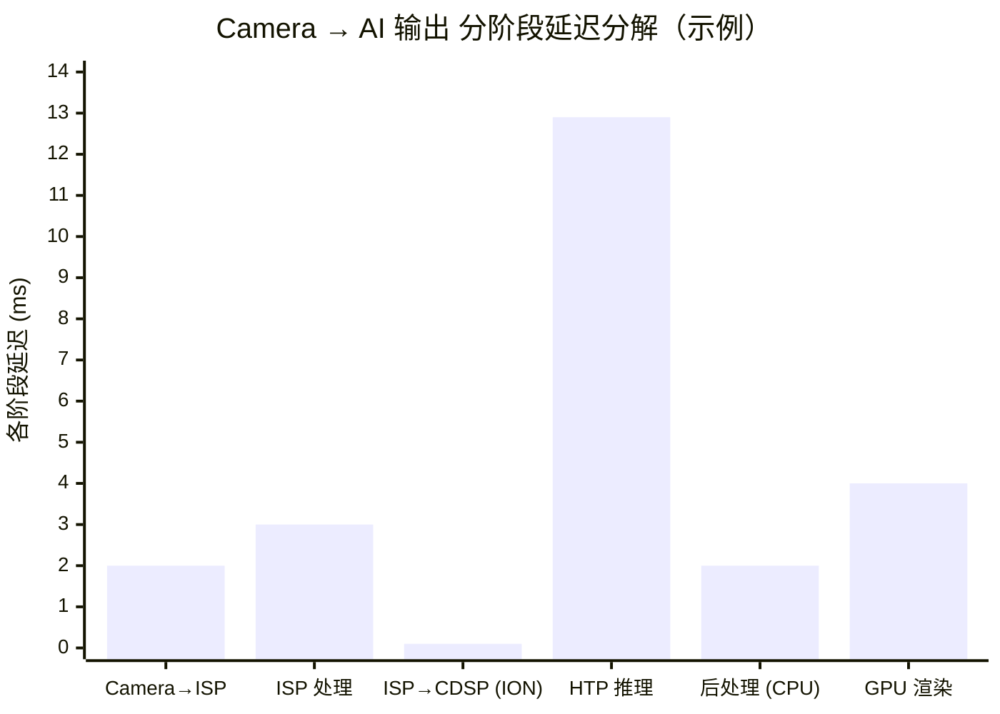
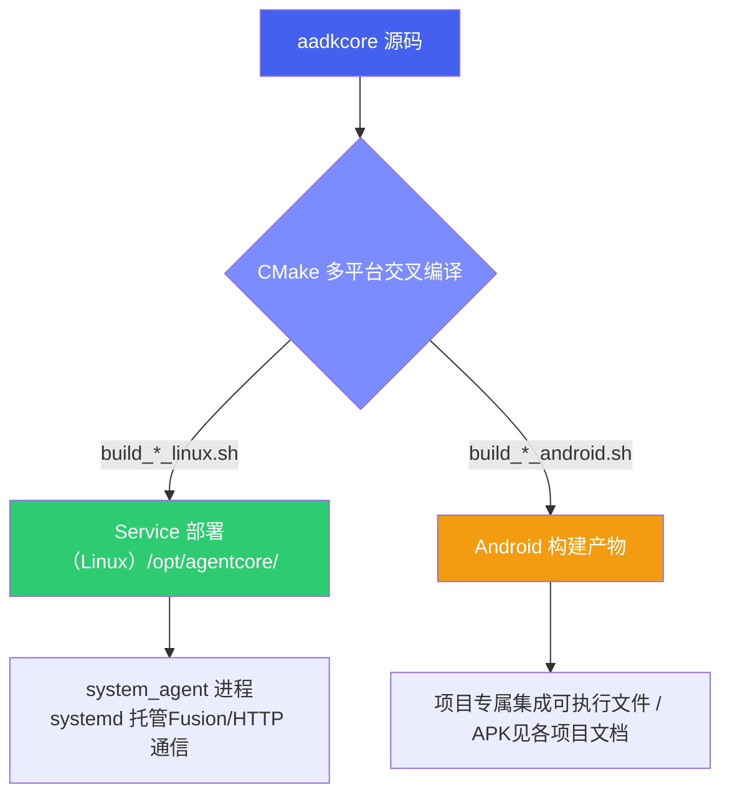
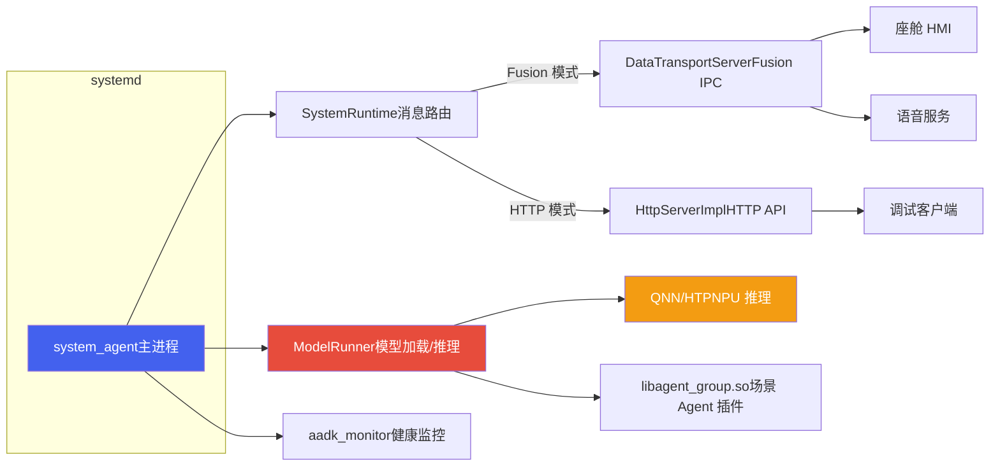
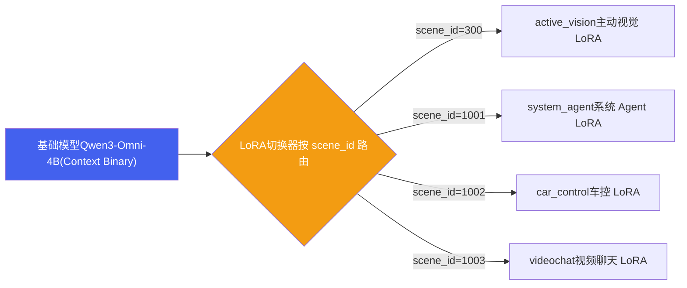
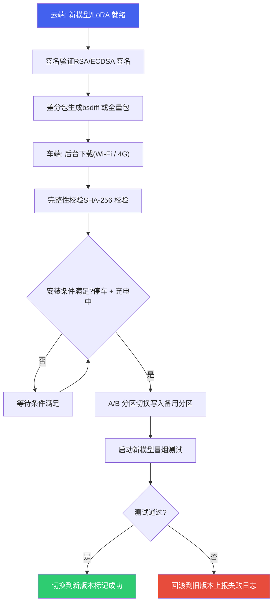

# 2. 设备部署

*基于 Qualcomm SA8397P 平台  |  QNN 框架 · ISP 数据流 · 多模型调度 · Context Binary*

> [!TIP]
> **本篇讲什么**
>
> Qwen3-Omni-4B 在 SA8397P 上的**设备部署**全链路：
>
> - QNN 推理框架：架构分层、完整部署流水线、与其他推理框架对比
> - ISP 与端到端数据流：ISP 处理流水线、延迟分解、Zero-Copy 数据通路
> - 多模型调度与优化：单帧多模型调度时序、调度策略、Context Binary 与车规要求
> - 集成部署方式：Service / 可执行文件 / APK 集成 SO / 模型配置与多 LoRA
> - OTA 模型更新、性能基准测试、ONNX→QNN 转换陷阱
>
> **代码基线**：aadkcore 仓库，构建脚本 `build_8397_android.sh` / `build_8397_linux.sh` / `build_8295_android.sh` / `build_9075_linux.sh`。

## 1. QNN 推理框架

### 1.1 QNN 架构分层

Qualcomm Neural Network (QNN) 是高通推出的下一代统一 AI 推理框架，取代早期的 SNPE。QNN 采用分层架构，上层应用通过统一 API 调用底层不同硬件加速器：


### 1.2 完整部署流水线

从训练框架到端侧运行的完整部署流水线：


> [!NOTE]
> **CNN/感知模型 vs LLM/VLM 的转换路径不同（2025+ 工具链口径）**
>
> 上图的经典链路（`qnn-onnx-converter → .cpp → qnn-model-lib-generator → .so → qnn-context-binary-generator → Context Binary`）适用于 CNN / 检测 / 分类类模型。LLM/VLM（如本篇锚点 Qwen3-Omni-4B）走的是 **Genie / QAIRT** 路径：模型量化（W4A16，见 [量化](../../general/quantization.html)）后由 Genie 编译为**序列化 Context Binary**（即 §4.3 模型配置里的 `*.serialized.bin`），运行时由 Genie/QAIRT runtime 负责 KV Cache 管理与 LoRA 热插拔，而非手写 `.cpp` 模型库。
>
> **工具链演进**：2024–2025 起高通把原 SNPE / QNN / Genie 整合进统一品牌 **QAIRT（Qualcomm AI Runtime）**，原 `qnn-*` 命令逐步归入 QAIRT 套件（具体命令改名随 SDK 版本变化，**升级时以随包文档为准 — 需核实**）。车规平台跟进该演进；无论叫 QNN 还是 QAIRT，**升级工具链后必须重刷全部 Context Binary**（§3.3 WARNING），因为 `.serialized.bin` 与工具链 / HTP 架构版本强绑定（§4.3 NOTE）。
>
> **精度格式口径**：本篇锚点模型当前产物以 **W4A16**（LLM 权重，见 [量化](../../general/quantization.html)）与 **FP16**（视觉/音频编码器 Context Binary）为主。**FP8** 等更低位宽是 2025+ 新一代 HTP 的方向，但 SA8397P（HTP arch v81）是否支持 FP8 推理**需核实**，勿想当然地写进部署方案。

### 1.3 推理框架详细对比

> [!NOTE]
> **车规 / 功能安全口径**：「车规平台适配」指框架在高通车规 SoC 上的适配与落地成熟度，**不代表框架自身持有功能安全认证**。QNN 框架本身**无独立功能安全认证**；配合高通车规平台（安全岛、ASIL 硬件基础等）可满足 ISO 26262 ASIL 相关要求，认证责任在平台 / 整机层面而非推理框架层面。

| 维度 | QNN | SNPE (旧版) | TFLite |
| :--- | :--- | :--- | :--- |
| **HTP 加速** | 原生支持，最优性能 | 支持，但 API 已冻结 | 不支持 HTP，仅 GPU delegate |
| **算子生态** | 丰富，支持自定义 Op | 中等，自定义 Op 受限 | 丰富，社区贡献多 |
| **自定义算子** | QNN OpPackage 机制 | UDL (User Defined Layer) | Custom Op 注册 |
| **离线编译** | Context Binary (推荐) | DLC 缓存 | 不支持 |
| **易用性** | 中等，学习曲线较陡 | 高，文档完善 | 高，Python API 友好 |
| **车规认证** | 框架本身无独立功能安全认证；配合高通车规平台可满足 ASIL 要求 | 部分支持 | 无车规认证 |
| **维护状态** | 活跃开发中 | 维护模式，不再新增功能 | 活跃开发中 |
| **推荐场景** | 新项目首选 | 仅限已有项目维护 | 跨平台/非高通场景 |

## 2. ISP 与端到端数据流

### 2.1 ISP 处理流水线

图像信号处理器 (ISP) 是摄像头原始数据到可用图像的桥梁。SA8397P 内置 Spectra ISP，完整处理流水线如下：


### 2.2 端到端延迟分解

从摄像头捕获到最终 GPU 渲染输出的全链路，可按阶段拆解延迟。下图为**分阶段延迟分解**示意（每段 = 该阶段在一帧内占用的耗时，各段之和 ≈ 端到端总延迟）：

**Camera → AI 输出 分阶段延迟分解（示例参数）**



> [!NOTE]
> **数据口径**：图中各段延迟为**示例参数**，仅用于演示「分阶段延迟分解」这一方法，不代表实测；请代入你自己平台的流水线实测替换（全站数据口径见 [硬件平台](../../general/hardware.html) 顶部 NOTE）。读图要点：把端到端链路拆成串行阶段后，**HTP 推理通常占大头**，是优化的首要靶点；ISP→CDSP 走 Zero-Copy（见 §2.3）时该段可压到亚毫秒级。若要画成累计曲线（瀑布），则末段值应等于各阶段之和（此例约 24ms），而非单段值。

### 2.3 Zero-Copy 数据通路

> [!TIP]
> **Zero-Copy 路径：消除 CPU 内存拷贝瓶颈**
>
> 在传统方案中，数据在 ISP、CPU、DSP、GPU 之间需要多次内存拷贝 (`memcpy`)，带来显著延迟和功耗开销。SA8397P 的 Zero-Copy 路径彻底消除了这一瓶颈：
>
> * **ISP 写入共享 Buffer**：ISP 处理完成后，直接将 NV12 图像写入共享内存缓冲区（早期 ION，新内核已演进为 dma-buf heap，见下方说明）
> * **CDSP 映射同一 Buffer**：Hexagon CDSP 通过 FastRPC 映射同一块内存，无需数据拷贝
> * **HTP 直接读取**：HTP 从映射的 Buffer 中直接读取输入张量，执行神经网络推理
> * **结果写入另一 Buffer**：推理结果写入新的共享 Buffer，供下游使用
> * **GPU 读取结果**：Adreno GPU 映射结果 Buffer，直接渲染到显示层
>
> **性能收益**：整条数据通路中 **无任何 CPU memcpy 操作**，端到端延迟与功耗均有可观下降（量级示意：延迟减少约 3~5ms、功耗降低约 15%，仅为演示收益方向的示例参数，请代入实测）。Buffer 经 **SMMU/IOMMU 映射**后供各引擎 DMA 访问——dma-buf 允许**非物理连续**的散列页经 IOMMU 拼成设备可见的连续虚拟地址，因此「Zero-Copy」依赖的是 IOMMU 映射而非物理地址连续性。
>
> **ION → dma-buf 演进**：ION 是 Android 早期的共享内存分配器，主线内核已用 **dma-buf heap**（`/dev/dma_heap/*`）取代。二者对上层都表现为「一块可跨引擎共享、可被 FastRPC/SMMU 映射的 dma-buf」，但分配接口与节点名不同；移植到新 BSP 时注意分配器 API 与 heap 名的变化。

> [!NOTE]
> **Zero-Copy 的真实约束（不是「免费」的）**
>
> Zero-Copy 能成立有前提：(1) **定长 POD 张量**——buffer 的形状/字节数在生产端（ISP）与消费端（HTP graph 输入）必须事先约定，变长数据（如文本 token、动态分辨率图）走不了这条通路；(2) **对齐与 stride**——NV12 的行 stride / scanline 对齐、以及 dma-buf 的页对齐要满足各引擎 DMA 要求，生产/消费双方必须用同一套 layout，否则「同一块内存」读出来是错位的；(3) **同一可映射 heap**——buffer 必须从所有引擎都能映射的 heap（system heap 经 SMMU/FastRPC）分配，secure/专用 heap 会破坏共享。
>
> **对 aadkcore 的 VLM 链路尤其如此**：平台级 Zero-Copy（ISP→HTP dma-buf）覆盖的是「摄像头→原始帧」这一段；而 aadkcore 收到的是经 Fusion IPC 传来的**图像字节**，先在 **CPU 做预处理**（resize / patchify / normalize 成 float 张量），再 `memcpy` 进 AISA 张量喂给 HTP 上的视觉编码器。也就是说 VLM Agent 的端到端链路**并非纯 Zero-Copy**——预处理这一段存在 CPU 拷贝。真正端到端 Zero-Copy（ISP 输出直灌视觉编码器）属于定长管线的 DMS/感知范式，与通用 VLM-Agent 的「任意分辨率 + 预处理」模式不同，做延迟预算时要分开算。

## 3. 多模型调度与优化

### 3.1 单帧多模型调度时序

在智能座舱的一帧处理中，多个 AI 模型需要协同工作。以下甘特图展示了典型的单帧处理时序（总帧周期 33ms @30fps）。注意 SA8397P 仅 **1 个 cDSP**，HTP 计算资源在多个 graph 间**时分复用**——下图「HTP 时段」内的各模型是在同一 HTP 上排队/分时执行，而非分配到不同物理核心并行：

```mermaid
gantt
    title 单帧多模型调度时序 (33ms @30fps)
    dateFormat X
    axisFormat %Lms

    section ISP
    ISP 图像处理           :done, isp, 0, 3

    section HTP (单 cDSP 时分复用)
    人脸检测 (RetinaFace)  :active, fd, 3, 8
    关键点回归 (FaceMesh)  :lm, 8, 11
    状态分类 (疲劳/分心)   :cls, 11, 13
    手势识别 (MoveNet)     :gest, 13, 18

    section CPU
    后处理 + 融合决策      :crit, post, 18, 21

    section GPU
    AR 渲染 + HUD 显示     :gpu, 21, 25
```



> [!NOTE]
> 图中模型名（RetinaFace / FaceMesh / MoveNet 等）是 DMS / 感知类管线的**示意例子**，并非 aadkcore 框架内置模型。aadkcore 是 LLM/VLM Agent 框架，它的「多模型」体现为**同一基座上的多 LoRA**（§4.3）与**请求级优先级调度**（§3.4 ModelScheduler），而非这里画的逐帧视觉流水线。本图只用来说明「单 cDSP 上多 graph 时分复用」这一通用约束；aadkcore 真实的调度粒度见 §3.4。

### 3.2 调度策略对比

| 调度策略 | 描述 | 帧延迟 | HTP 利用率 | 适用场景 |
| :--- | :--- | :--- | :--- | :--- |
| **串行执行** | 所有模型依次在同一 HTP 上运行 | 最高 (~35ms) | 低 (~40%) | 模型少、时延要求低 |
| **流水线 (Pipeline)** | 前一帧后处理与当前帧推理重叠 | 中等 (~25ms) | 中 (~65%) | 延迟可接受 1 帧 |
| **多 graph 时分复用** | 无依赖模型作为多个 graph 在同一 cDSP 上时分复用（本平台仅 1 个 cDSP，无「分配到不同 HTP 核心并行」可言） | 较低 (~20ms) | 较高 (~85%) | 多模型、低延迟要求 |
| **Context Binary 共享** | 多个模型编译为一个 Context Binary，共享中间 Buffer | 最低 (~18ms) | 最高 (~90%) | 固定模型组合、量产部署 |

> [!NOTE]
> 表中帧延迟与 HTP 利用率均为**示例参数**，仅用于演示各调度策略的相对优劣，不代表本平台实测。SA8397P 仅 1 个 cDSP，所谓「并行」实为多 graph 在同一 HTP 上的时分复用与流水重叠，而非多物理核心真并行（数据口径见 [硬件平台](../../general/hardware.html) 顶部 NOTE）。

### 3.3 Context Binary 与车规要求

> [!NOTE]
> **为什么车载量产始终选择 Context Binary？**
>
> 在汽车座舱中，**冷启动时间**是一项硬性要求：从上电到 DMS 系统就绪必须 **< 2 秒**。不同加载方式的冷启动时间对比：
>
> | 加载方式 | 首次推理延迟（量级示意） | 原因 |
> | --- | --- | --- |
> | `Model .so` 动态加载 | ~5~8 秒 | 运行时才做图优化、内存分配与算子调度（图固化 / graph finalization，**非 JIT 编译**） |
> | `Context Binary .bin` | ~200~500ms | 离线已完成编译优化，加载到系统内存（DDR），执行时按 tiling 分块调入 VTCM |
>
> 上表为**小模型（CNN 级）量级示意**：`~200~500ms` 对应数百 MB 以内的检测/分类模型。对全站锚点的 4B LLM（W4A16 权重 ~2.5GB），Context Binary 加载由 **flash 读取主导**，冷启动为**秒级**——§6.3 的「模型加载 < 5s」才是 LLM 口径。另注意 VTCM 典型仅 ~8MB，远小于权重体量，权重不可能整体「加载进 VTCM」，只能按 tiling 分块调入（数据口径见 [硬件平台](../../general/hardware.html) 顶部 NOTE）。
>
> **Context Binary 的额外优势**：
>
> * **确定性执行**：离线编译确保每次推理的执行路径完全一致，有助于满足功能安全 (ASIL) 的确定性执行要求（确定性只是 ASIL 的必要条件之一，认证在平台 / 整机层面完成，见 §1.3 口径说明）
> * **内存预分配**：所有 Tensor Buffer 在编译期确定大小和位置，运行时无动态分配
> * **防篡改**：二进制文件可加签名校验，防止模型被恶意替换
> * **多模型打包**：多个模型可编译为同一 Context Binary，共享内存池，减少碎片

> [!WARNING]
> **Context Binary 与 QNN 版本强耦合（上机高频坑）**
>
> Context Binary 不只是**硬件绑定**（见 §7.2），还是**版本绑定**：`.bin` 由特定版本的 `qnn-context-binary-generator` 生成，只能被**版本匹配**的 QNN runtime 与 DSP skel 库（`libQnnHtp*.so` / `*skel*.so` / stub `.so`）加载。若升级了 QNN SDK 却未重新生成 Context Binary，或设备上 runtime 与 skel 版本不一致，典型表现为 `QnnContext_createFromBinary failed`、图 finalize 失败或加载即崩溃。**每次升级 QNN SDK / 工具链后，必须重新生成全部 Context Binary，并确保设备上部署的 runtime 与 skel 版本一致。**

> [!NOTE]
> **推理优化与量化工具**
>
> AIMET 量化工具、W4A16 机制 → [**端侧模型量化与压缩**](../../general/quantization.html)；推理引擎对比、Genie/QAIRT 运行时 → [**LLM 推理原理与性能模型**](../../general/infer-principles.html)

### 3.4 aadkcore 请求级调度：ModelScheduler（优先级 / 抢占 / worker）

§3.1–§3.2 讲的是「一帧内多个模型如何共享 HTP」的通用时序；而 aadkcore 框架自身的调度发生在**请求级**——`ModelScheduler`（`src/runtime/model_scheduler.cpp`，单例）把各场景 Agent 提交的推理请求排成一个**优先级队列**，再交给模型实例执行。它直接消费 §4.3 `runtime_config.json` 的 `worker_count` / `capacity` / `timeout_s` 三个字段。

**优先级与出队顺序**：任务优先级取自 `PriorityBase` 枚举（`LOW=10 / NORMAL=20 / HIGH=30 / CRITICAL=40`）。出队不是单纯按优先级，而是一个加权分数（`CompareTask`）：

```
score = priority × 2.0 + wait_ms × 0.1 × 0.001
```

即**优先级为主、等待时间为辅**，低优任务等得越久分数越高，避免饿死。

**抢占（PreemptAndSubmit）**：队列已满（达到 `capacity`）时，新任务会找出队列中优先级最低者；若新任务优先级更高，就把最低优任务以 `TASK_PREEMPTED` 踢出、腾位。带 `breakTag` 的高优任务还会把**正在运行**的低优任务置 `cancel_flag`（协作式中断——运行中的解码循环会检查该标志而退出）；显式 `StopTask` 则更进一步，额外调用 `runner_->stopGenerate(scenario_id)` 主动停止生成。这就是「车控 / 主动视觉等高优场景打断闲聊等低优场景」的落地机制。

**超时提权**：`SubmitTask` 等待结果超过一个 `timeout_s` 后调用 `BoostPriority(+10)`（封顶 30）把任务往前挪，再等一个 `timeout_s`；二次超时则 `StopTask` 取消。

**worker ≠ 并行推理**：`Start()` 按 `worker_count` 起若干 worker 线程从队列取任务，但真正的推理（`onProcessing`）被一把 `generate_mutex_` **串行化**——同一时刻只有一个任务在模型实例上执行。因此调大 `worker_count` 提升的是「取任务 + 前后处理」的并发度，**不是** HTP 上的并行推理度；这与 §3.1「单 cDSP 时分复用」一致：多 worker 抢的是同一把推理锁、同一个 HTP。

> [!WARNING]
> **分支口径：本节描述的是岚图 `lantu_sdk_dev` 分支的调度行为**
>
> 本篇属框架研发层，但 §3.4/§4.3 的调度器细节是对**岚图 `lantu_sdk_dev` 分支**（当前部署形态）核实的——该分支上 `generate_mutex_` 恒串行化、`generate_concurrent`/`enable_timeslice`/`batch_count` 无读取点、`worker_count` 被钳到硬件并发数。**主线 `origin/agent_core_dev` 与此分叉**：`generate_concurrent`（默认 true）为 true 时 `SchedulerLoop` 不取 `generate_mutex_`（可并发跑 `onProcessing`）、上述字段均被读取、`worker_count` 不钳制（对应 assert 已注释）。两者是真实代码分叉而非笔误，调优前务必确认自己所在分支，分支差异对照见 [aadkcore 核心框架](agent-core.html) §3.4。

> [!NOTE]
> **端侧权衡**：请求级优先级 + 抢占保住了高优场景的 TTFT，代价是被抢占任务已生成的 token 作废、需重新排队；`generate_mutex_` 串行化避免了多请求同时压 HTP 造成 KV Cache 抖动，但也意味着**加 worker 对吞吐几乎无益**（瓶颈在单实例串行推理）。尤其要注意：`ModelScheduler` 是**单例**、`generate_mutex_` 全局只有一把——即便开 §4.3 `--dual` 建了第二个 ModelInstance，两个实例的推理仍被**同一把锁串行化**、仍时分复用同一 HTP。`--dual` 换来的是「主对话与主动视觉各持独立权重 / KV Cache、省去角色间 LoRA 切换与缓存抖动」的**隔离性**，而**不是并行度**。要在单 cDSP 上真正提吞吐，只能寄望模型引擎侧的批处理 / 时分复用（即 §4.3 那几个当前未接线的字段）；框架层加 worker 或加实例都改变不了「同一时刻只有一个任务在 HTP 上跑」这一事实。

## 4. 集成部署方式

aadkcore 框架的量产部署以 **Service 模式**（systemd 托管的 `system_agent`）为主，并支持**多平台交叉编译**。框架核心库（`libaadkcore.so` + `libagent_group.so`）**源码平台无关，但产物按平台交叉编译**——ABI 与依赖绑定到目标工具链，不可跨平台混用（插件与宿主的 ABI 约束见 [Agent 插件库](agent-group.html) §1.1）；具体项目的可执行文件 / APK 集成部署属项目专属，见各项目文档（如岚图 [设备部署与上车流程](../lantu/device-deployment.html)）。

### 4.1 部署方式总览



**多平台构建脚本**（主线 `agent_core_dev`）：

| 平台 | 构建脚本 | 部署形态 |
| :--- | :--- | :--- |
| SA8295 Android | `build_8295_android.sh` | Android |
| SA8397 Linux | `build_8397_linux.sh` | Service（systemd） |
| SA8397 Android | `build_8397_android.sh` / `build_8397_android_service.sh` | Android / Service |
| SA9075 Linux | `build_9075_linux.sh` | Service（systemd） |
| NVIDIA Orin | `build_orin.sh` / `build_cross_for_orin.sh` | Linux |
| 通用 aarch64 | `build_aarch64.sh` | Linux |

> [!NOTE]
> Service 部署是框架的**量产标准形态**（多平台 Linux 通用）；Android 侧的可执行文件调试与 APK 集成属项目专属落地，下沉到各项目文档。

### 4.2 Service 部署（systemd 服务）

Service 部署是 SA8397P Linux 平台的标准量产方案。`system_agent` 作为系统服务由 systemd 托管，开机自启、异常自动重启，通过 Fusion（DataTransport）或 HTTP 与外部客户端通信。



**设备目录结构**（`/opt/agentcore/`）：

```
/opt/agentcore/
├── bin/
│   ├── system_agent           # 主进程可执行文件
│   ├── agent_test             # 测试客户端
│   └── msg_replay             # 消息回放工具
├── lib/
│   ├── libaadkcore.so         # 核心框架库
│   ├── libagent_group.so      # Agent 插件库
│   ├── libllms.so             # GenAI 推理引擎（Genie/QAIRT，来自 genai_sdk-*.rel-linux）
│   ├── libaisa.so             # AISA 模型库
│   └── ...                    # OpenCV, curl, yaml-cpp, libjsoncpp 等依赖
├── libqnn/                    # QNN/HTP 运行时（libQnnHtp.so / libQnnSystem.so / *skel* / stub）
│                              #   ← ADSP_LIBRARY_PATH 要指到这里（见下方 WARNING 2）
├── torch/lib/                 # libtorch 等依赖（run.sh 的 LD_LIBRARY_PATH 已含此路径，见 WARNING 5）
├── data/
│   ├── config/                # 运行时配置（按平台分子目录，见 §4.3）
│   │   ├── 8397/              # 每平台一套：runtime_config.json + multi_lora_runtime_config.json + 模型配置
│   │   │   ├── runtime_config.json
│   │   │   ├── multi_lora_runtime_config.json
│   │   │   └── qwen3-omni-4b.json
│   │   └── datatransport.service.config.json   # Fusion/DataTransport 服务配置（示例文件名，实际随项目/集成方而异）
│   ├── template/              # YAML Prompt 模板
│   └── assets/                # 静态资源（RAG 知识库等）
├── agentcore.service          # systemd 单元文件
├── run.sh                     # 启动脚本
├── postInstall.sh             # 安装脚本
└── monitor/
    ├── aadk_monitor_server    # 监控进程（可执行文件；libaadk_monitor.so 在 lib/）
    ├── aadk_monitor.service   # 监控服务单元
    ├── start_aadk_monitor.sh
    └── stop_aadk_monitor.sh
```

**systemd 服务配置**（`agentcore.service`）：

```
[Unit]
Description=Agent Core Runner
After=network.target
Wants=network.target

[Service]
Type=simple
WorkingDirectory=/opt/agentcore
ExecStart=/opt/agentcore/run.sh
Restart=always
RestartSec=5s
StandardOutput=journal
StandardError=journal

[Install]
WantedBy=multi-user.target
```

**部署流程**：

- **交叉编译**：执行 `build_8397_linux.sh`，使用 8397 工具链交叉编译。产物安装到 `build_8397_linux/build/agentcore/`
- **推送到设备**：通过 OTA 或 SCP 将 `agentcore/` 目录推送到设备 `/opt/agentcore/`
- **安装服务**：执行 `postInstall.sh`，自动完成 systemd 服务注册和启动：

  ```
  sudo cp agentcore.service /etc/systemd/system/
  sudo systemctl daemon-reload
  sudo systemctl enable agentcore.service
  sudo systemctl restart agentcore.service
  ```
- **验证运行**：`systemctl status agentcore` 查看服务状态，`journalctl -u agentcore -f` 查看实时日志

**启动参数**（`system_agent` 命令行选项）：

| 参数 | 默认值 | 说明 |
| :--- | :--- | :--- |
| `--http 1` | 0 (关闭) | 启用 HTTP Server 模式替代 Fusion，用于调试场景 |
| `--dump 1` | **1 (开启)** | 推理数据录制，将请求/响应保存到文件；**默认开启**，需显式传 `--dump 0` 关闭 |
| `--upload 1` | 0 (关闭) | 启用推理数据上传到远端服务器 |
| `--dual 1` | 0 (关闭) | 启用 SA8397P **第二个模型实例**（主动视觉专用，加载 `multi_lora_runtime_config_vision.json`）。两实例仍**时分复用同一 cDSP**、常驻内存（DDR）翻倍，**并非双 NPU 核心**；机制与取舍见 §4.3 与 agent-group §3.3/§8.2 |

> [!WARNING]
> **systemd / run.sh 上机高频坑（Service 部署必读）**
>
> 1. **硬编码网口的无限 busy-wait**：示例 `run.sh` 常写死 `INTERFACE="eno1"` 并循环等待其拿到 IP。若实际接口名不是 `eno1`（或该口无 IP），循环永不退出、`system_agent` **永不启动**；而 `Type=simple` 下 systemd 只看进程是否 fork 成功，仍显示 `active (running)`，造成「服务正常但 Agent 没起来」的假象，且与 §3.3「冷启动 < 2s 就绪」直接矛盾。**量产解耦**：不要绑定具体网口名——用 `systemd-networkd-wait-online` / `NetworkManager-wait-online` 等待「任一可用网络就绪」，或干脆去掉网络等待（Agent 启动本身不依赖网络，Fusion/HTTP 监听本地即可），把网络重连交给上层服务。
> 2. **未设 `ADSP_LIBRARY_PATH`**：QNN 通过 `ADSP_LIBRARY_PATH` 定位 cDSP 侧 skel 库（`*skel*.so`）。未设置时 FastRPC 找不到 skel 或加载到错误版本，正是 §3.3 WARNING「runtime 与 skel 版本必须一致」的落地点。`run.sh` / service 单元须显式 `export ADSP_LIBRARY_PATH=<设备 skel 目录>`，并与部署的 QNN runtime 版本匹配。
> 3. **未用 `exec` 启动**：`run.sh` 若以普通子进程方式拉起 `system_agent`，SIGTERM 只送到 bash、不转发给真正的 Agent 进程，导致 systemd 停止/重启时 FastRPC/DSP 会话无法干净释放，残留会话可能触发 cDSP SSR（子系统重启）。`run.sh` 末行须用 `exec /opt/agentcore/bin/system_agent ...`，让 Agent 直接接管 PID、接收信号。
> 4. **`DDS_LOG=off` 默认关 Fusion 日志**：示例脚本常设 `DDS_LOG=off`，调试 Fusion/DataTransport 通信问题时会「无日志可看」。排查 IPC 问题前先把 `DDS_LOG` 调到 info/debug。
> 5. **依赖 `/opt/agentcore/torch/lib`**：部分构建产物运行时依赖 `torch/lib` 下的库（主线 `run.sh` 的 `LD_LIBRARY_PATH` 已含 `/opt/agentcore/torch/lib`，§4.2 目录树也已列出）。部署时确认 `torch/lib` 一并推送、且 `LD_LIBRARY_PATH` 包含它，否则 `system_agent` 启动即报缺库。

### 4.3 模型配置与多 LoRA

aadkcore 的运行时配置**按平台目录组织**：`runtime/data/config/` 下每个平台一个子目录（`8295/`、`8397/`、`9075/`、`orin/`），构建/部署时选定目标平台目录，目录内自带一套 `runtime_config.json`（调度参数）+ `multi_lora_runtime_config.json`（模型本体与多 LoRA）+ 模型配置（如 `qwen3-omni-4b.json`）。平台切换靠**选目录**，而非配置文件内的某个字段。

**runtime\_config.json**（调度参数，以 8397 为例）：

```
{
    "generate_concurrent": false,
    "enable_timeslice": false,
    "timeslice_ms": 500,
    "worker_count": 4,
    "batch_count": 4,
    "capacity": 10,
    "timeout_s": 100
}
```

| 配置项 | 说明 |
| :--- | :--- |
| `generate_concurrent` | 是否允许并发生成（多请求同时进入 decode） |
| `enable_timeslice` / `timeslice_ms` | 时间片轮转开关与片长，多请求时分复用同一模型实例 |
| `worker_count` | ModelScheduler 工作线程数（实际取 `min(配置值, 硬件并发数)`） |
| `batch_count` | 批处理大小 |
| `capacity` | 任务队列容量 |
| `timeout_s` | 单次推理超时时间（秒） |

> [!WARNING]
> **并非所有字段都被框架消费（核对代码后的口径）**
>
> `ModelScheduler` 构造函数实际只读取 **`worker_count` / `capacity` / `timeout_s`** 三个字段（见 §3.4）。`generate_concurrent`、`enable_timeslice` / `timeslice_ms`、`batch_count` 在当前 aadkcore 框架源码中**没有任何读取点**——它们随配置文件保留，但调度行为并不受其影响。这几项要么是为闭源推理引擎（`libllms.so`）侧的并发/时分复用预留、要么是历史遗留字段（**具体由谁消费需核实**）。调参时不要指望改这几个字段能改变框架的并发/批处理行为；真正生效的并发杠杆是 `--dual` 双实例（§4.3）与 `worker_count`（仅影响取任务并发，不影响 HTP 并行度，见 §3.4）。

> [!NOTE]
> **runtime\_config.json 只承载调度参数，模型本体加载走 multi\_lora\_runtime\_config.json**
>
> 主线 `runtime_config.json` **没有 `current_runtime` 字段**，也不内嵌各平台的模型路径——它只描述 ModelScheduler 的并发/队列/超时等调度行为。模型本体（基座 + 各场景 LoRA）的加载完全由同目录的 `multi_lora_runtime_config.json` 决定（见下）。早期格式曾在 `runtime_config.json` 里用 `current_runtime` + 平台子对象（`"8397": {...}` / `"orin": {...}`）做平台内切换，主线已废弃该写法、改为按平台目录拆分；若在旧分支或旧部署包中见到 `current_runtime`，按**兼容旧格式**理解即可，新配置不应再写。

> [!NOTE]
> **示例模型口径与三种角色**：aadkcore 框架本身**模型无关**——`model_name` 只是 `后端/模型名` 标识（`qnn/` 走 QNN 后端，用于 8295/8397/9075；`lape/` 走 Orin 后端），可配置任意后端支持的模型。为与全站锚点一致，本节示例统一采用内部定制型号 **Qwen3-Omni-4B**（数据口径见 [硬件平台](../../general/hardware.html) 顶部 NOTE）。配置中涉及三种模型角色，量产时常共用同一基座以节省常驻内存（DDR），也可各自独立：
>
> - **主对话模型**（`model_config`）：承载默认对话 / 问答；
> - **主动视觉模型**（`active_model_config`）：主动视觉 Agent 使用，可独立于主对话模型；
> - **多 LoRA 基座**（下方 `multi_lora_runtime_config.json` 的 `base_model`）：多 LoRA 热切换时共享的基座。
>
> 本节（`runtime_config.json` / `multi_lora_runtime_config.json`）是模型配置的**主参考**；[Agent 插件库](agent-group.html) §1.4 的运行时配置表引用本节口径。场景 Agent 与 `scene_id` 的完整映射见本节下方「scene\_id ↔ Agent ↔ LoRA 映射」表（agent-group §3.3 引用本表，不再重复）。

**multi\_lora\_runtime\_config.json**（模型本体 + 多 LoRA，以主线 8397 为例）：

```
{
    "multi_lora": {
        "base_model": {
            "model_name": "qnn/qwen3-omni-4b",
            "config_path": "config/qwen3-omni-4b.json"
        },
        "lora": [
            {"scene_id": 300,  "name": "active_vision", "lora_path": "zdsj"},
            {"scene_id": 400,  "name": "gui_agent",     "lora_path": "ai_screen"},
            {"scene_id": 900,  "name": "memory",        "lora_path": "jiyi"},
            {"scene_id": 1001, "name": "system_agent",  "lora_path": "zdyy", "ebnf_path": "zdyy"},
            {"scene_id": 1002, "name": "car_control",   "lora_path": "carcontrol"},
            {"scene_id": 1003, "name": "videochat",     "lora_path": "videochat"}
        ]
    },
    "model_name": "qnn/qwen3-omni-4b",
    "model_config": "config/qwen3-omni-4b.json",
    "active_model_config": "config/qwen3-omni-4b.json"
}
```

| 字段 | 说明 |
| :--- | :--- |
| `base_model` | 多 LoRA 共享的基座（`model_name` + `config_path`），即下方 TIP 所称「基础模型」 |
| `lora[]` | 各场景 LoRA 列表，每项含 `scene_id`（路由键）、`name`（场景名）、`lora_path`（增量权重目录），可选 `ebnf_path`（约束解码语法） |
| `model_config` | **主对话模型**配置（CarControl / Chitchat 等使用） |
| `active_model_config` | **主动视觉模型**配置（ActiveVision 使用）；与 `model_config` 指向同一文件即共用基座，指向不同文件即独立基座 |

> [!NOTE]
> **`config_path` 指向的模型部署配置（如 `qwen3-omni-4b.json`）长什么样**
>
> `base_model.config_path` / `model_config` 指向的模型 json 才是真正描述「模型怎么部署」的文件。主线 8397 的 `qwen3-omni-4b.json` 含四类内容：
>
> - **`model_path`**：基座模型目录（LoRA-capable，由 GenAI 引擎加载，非单个 Context Binary）；
> - **`veg_params[]`**：**多分辨率视觉编码器**——每个分辨率（主线为 448×448 / 1024×768 / 1088×512）对应一个**预编译序列化 Context Binary**（`*.serialized.bin`）外加 RoPE 的 `position_ids_cos/sin` `.raw`。运行时按输入图分辨率用 `get_vit_shape` 选对应 VEG。这正是 §2.3「定长 POD + 预编译」的体现：一个分辨率一个固化 graph，不支持任意分辨率零拷贝直灌；
> - **`lora_params[]`**：各 LoRA 的 `adapter_alpha`（缩放系数），按 adapter 名与 `multi_lora_runtime_config.json` 的 `lora[].lora_path` 对应；
> - **生成参数**：`temperature` / `top_k` / `top_p` / `seed` / `repetition_penalty`（由 `ModelConfig` 读取）。
>
> `*.serialized.bin` 文件名里的 `archv81`（HTP 架构版本）、`mc3`（多核编译标记）、`socid72`（SoC ID）等后缀说明 Context Binary 与**具体 HTP 架构 / 核配置 / SoC 强绑定**——换 SoC、换 QNN 工具链或换 HTP 核配置都要重新生成（呼应 §3.3 WARNING 的「版本绑定」与 §7.2 的「硬件绑定」）。

**scene\_id ↔ Agent ↔ LoRA 映射**（主线 8397 代表性子集；`scene_id` 与 `scenario_id` 为同一 ID 空间，见下方 NOTE。完整列表以 `multi_lora_runtime_config.json` 的 `lora[]` 为准，本表只列与本篇 Agent 直接相关的常用项）：

| scene\_id | LoRA `name` | 对应 Agent / Dispatcher | 说明 |
| :--- | :--- | :--- | :--- |
| 300 | active\_vision | ActiveVisionDispatcher | 主动视觉 |
| 400 | gui\_agent | GuiAgentDispatcher | GUI Agent（`ENABLE_DEVICEAI_BASE`） |
| 900 | memory | （记忆服务） | 长期记忆召回 |
| 1001 | system\_agent | SystemAgent | 系统 Agent / 默认对话 |
| 1002 | car\_control | CarControlDispatcher | 车辆控制 |
| 1003 | videochat | VideoChat | 视频聊天（主线形态） |

> [!NOTE]
> **scene\_id == scenario\_id（同一 ID 空间），且同一 ID 在不同产品形态含义不同**
>
> `multi_lora_runtime_config.json` 的 `scene_id` 与 `constant_ids.h` 的 `scenario_id` 是**同一套 ID**：消息路由（`msg_deliver_impl.cpp` 中 `next_scene_id = scenario_message.scenario_id`）与 LoRA 路由共用该键，因此「按 scenario\_id 路由到 Dispatcher」与「按 scene\_id 切换 LoRA」是同一 ID 空间上的两次查表。但**同一 ID 在不同产品形态可指向不同 LoRA/Agent**：上表为主线 8397 形态（1003=videochat）；某 OEM 形态下 1003 可能是 base\_model（默认对话）。引用本表时务必注明形态，跨形态结果不可直接对比。

> [!NOTE]
> **`--dual` 与 `multi_lora_runtime_config_vision.json`（第二个模型实例）**
>
> 默认（`--dual 0`）主对话与主动视觉**共用同一 ModelInstance**（`model_config` 与 `active_model_config` 指向同一基座）。传 `--dual 1` 时，ModelRunner 额外用 `multi_lora_runtime_config_vision.json` 建**第二个 ModelInstance**（主动视觉专用基座 + 其 LoRA），使主动视觉与主对话各自持有独立模型实例。注意：这是**双模型实例**而非双 NPU 核心——SA8397P 仅 1 个 cDSP，两实例仍时分复用同一 HTP，且常驻内存（DDR）翻倍。是否开启取决于「主动视觉高频推理是否显著抢占主对话 TTFT」与「内存预算」的权衡（见 agent-group §3.3、§8.2）。



> [!TIP]
> **多 LoRA 热切换机制**
>
> 多 LoRA 架构通过 `scene_id` 自动路由到对应的 LoRA 适配器。基础模型权重常驻**系统内存（DDR）**（执行时按 tiling 分块调入 HTP VTCM，见 §3.3），LoRA 增量权重按需加载。切换 LoRA 仅需替换增量权重（量级示意：通常 < 100MB，与 §5.1 OTA 表的「200KB–50MB」同为量级口径），无需重新加载基础模型（量级示意：~2.5GB），切换延迟在毫秒级。这使得同一个 4B 参数基础模型能同时服务多个业务场景（不同 `scene_id` 各自路由到自己的 LoRA，多个场景也可复用同一 LoRA），无需为每个场景单独部署一份完整模型。上例 `scene_id` 与 `name`/`lora_path` 取自主线 8397 配置，不同产品形态的取值与含义可能不同（见上方 NOTE）。

## 5. OTA 模型更新

### 5.1 更新策略分级

端侧模型的 OTA 更新需要根据更新内容和风险等级选择不同策略：

| 更新类型 | 更新内容 | 包大小 | 风险等级 | 更新频率 | 回归测试 |
| :--- | :--- | :--- | :--- | :--- | :--- |
| **Prompt 热更** | System Prompt / Tool Schema YAML 文件 | 数 KB | 低 | 随时 | 功能冒烟测试 |
| **LoRA 增量更新** | LoRA 适配器权重文件 | 200KB - 50MB | 低-中 | 周级 | Function Calling 准确率回归 |
| **RAG 知识更新** | 知识库向量索引 + 文档 | 10-100 MB | 低 | 按需 | 检索准确率测试 |
| **模型整体更新** | 完整 Context Binary | 2-3 GB | 高 | 月/季度级 | 全量回归测试 |
| **框架更新** | libaadkcore.so + libagent\_group.so | 50-100 MB | 高 | 版本发布 | 全量回归 + 兼容性测试 |

> [!NOTE]
> 表中「包大小」均为**量级示意**（用于区分更新类型的相对体量与风险），非实测值；LoRA 增量包与 §4.3 TIP 的「通常 < 100MB」为同一量级口径。

### 5.2 安全更新流程



> [!WARNING]
> **模型更新的安全红线**
>
> (1) **绝不在行驶中更新**：模型切换瞬间推理服务中断，必须在停车且充电状态下执行；(2) **A/B 分区保障回滚**：新模型写入备用分区，冒烟测试通过后才切换，失败自动回滚；(3) **签名校验防篡改**：防止恶意模型注入；(4) **版本兼容性**：新 LoRA 必须与当前基座模型兼容——兼容性由**模型包与配置的配对**保证（基座 `model_path` + `multi_lora_runtime_config.json` 的 `lora[]` 列表 + 模型 json 的 `lora_params[].adapter_alpha`），而**不是** `runtime_config.json` 里的某个版本号字段（该文件只承载 §3.4 的调度参数，无版本字段）。此外 Context Binary 还受 QNN 工具链 / HTP 架构版本绑定（§3.3 WARNING、§4.3 NOTE），OTA 升级 QNN runtime 时必须连同 `*.serialized.bin` 一起重刷。

> [!NOTE]
> **原子性 / 双槽 / 回滚的落地要点（资深视角）**
>
> 上图的 A/B 切换要真正安全，需满足：
>
> - **原子切换**：模型目录的「换版」必须是原子的——用「staging 目录下载校验 → 切换 current 软链/指针」而非就地覆盖，避免某次请求读到「半旧半新」的权重（基座换了、LoRA 没换）。aadkcore 侧 `model_path` / `lora_path` 都是目录引用，切换指针即可让下次加载生效。
> - **双槽（dual-slot）**：A/B 两份模型包常驻 flash，`current` 指针指向其一；新包写另一槽，冒烟通过再翻指针。flash 预算紧张时也可「单槽 + 回滚包」，但要保证回滚包不被新包覆盖。
> - **回滚判据要客观**：冒烟测试不能只看「进程没崩」，要断言**实际输出**（如固定 prompt 的 Function Calling 命中、cosine 相似度阈值），否则「加载成功但输出全错」会被误判为成功（参见 §7 转换验证 Checklist）。
> - **重启一致性**：翻指针后若下次启动冒烟仍失败，bootloader/看门狗应能自动回退到旧槽（标记 success 前不删旧槽）。
> - **与调度的交互**：换版/回滚瞬间在途请求会被打断，应借 §3.4 的 `StopTask` / 抢占机制优雅排空，而非硬切。

## 6. 性能基准测试

### 6.1 基准测试方法论

端侧 LLM 的性能基准测试必须遵循严格的方法论，否则测试结果无法反映量产环境的真实性能：

| 测试维度 | 常见错误 | 正确做法 |
| :--- | :--- | :--- |
| **系统负载** | 单独运行 LLM（无摄像头、无渲染） | 全系统负载下测试：多路摄像头 + ISP + GPU 渲染 + LLM |
| **热状态** | 冷启动后立即测量（芯片低温） | 预热 10 分钟后测量，模拟持续使用场景 |
| **频率锁定** | 锁定 DSP 最高频率 | 使用默认 DVFS 策略，测量真实频率下的性能 |
| **输入长度** | 仅测试短 Prompt（10-20 tokens） | 测试典型场景：System Prompt 300 + User 50 + 历史对话 200 |
| **统计方法** | 报告单次或平均值 | 报告 P50/P90/P99 分位数，至少 100 次测试 |
| **内存状态** | 首次推理（KV Cache 为空） | 测试多轮对话后的推理（KV Cache 累积增长后） |

### 6.2 标准测试 Checklist

```bash
# 性能基准测试标准流程

# 1. 环境准备
echo "=== 硬件信息 ==="
cat /sys/class/thermal/thermal_zone*/temp      # 初始温度
# DSP 当前频率（节点名随 BSP/内核版本变化，下例为高通常见命名，找不到时
# 用 ls /sys/class/devfreq/ 确认实际节点，或见 hardware §7.3 的 devfreq 说明）
cat /sys/class/devfreq/soc:qcom,cdsp/cur_freq  # 示例节点名，非固定

# 2. 启动全系统负载 (模拟量产环境)
# 启动摄像头 ISP 通路
# 启动 3D 仪表盘渲染
# 启动导航地图渲染

# 3. 预热 (10 分钟稳态运行)
for i in $(seq 1 20); do
  # 发送典型推理请求
  echo "Warmup request $i"
  # curl -X POST http://localhost:8080/inference -d '...'
  sleep 30
done

# 4. 正式测试 (100 次)
echo "=== 开始正式测试 ==="
for i in $(seq 1 100); do
  START=$(date +%s%N)
  # 发送标准测试请求 (System Prompt 300tok + User 50tok)
  # 记录 TTFT, TPOT, 总生成长度, 总耗时
  END=$(date +%s%N)
  echo "Test $i: $((($END-$START)/1000000))ms"
done

# 5. 采集系统状态
cat /sys/class/thermal/thermal_zone*/temp      # 测试后温度
# 内存：QNN/HTP 的权重与 KV cache 分配在 dma-buf（system heap 经 FastRPC 映射到
# cDSP），不计入进程 VmRSS；只看 VmRSS 会低估 3 倍以上。
# 总占用 ≈ VmRSS + per-process dma-buf，且需稳态采样（KV cache 填充约 12s 后才稳定）。
PID=$(pidof system_agent)
grep VmRSS /proc/$PID/status                   # 进程常驻集（不含 dma-buf）
dmabuf_dump $PID                               # 看 userspace_rss 列（勿用整机 dmabuf total）
# 无 dmabuf_dump 时，遍历 /proc/$PID/fdinfo 累加各 dma-buf fd 的 size
```

### 6.3 关键性能指标

| 指标 | 定义 | 目标值 | 测量方法 |
| :--- | :--- | :--- | :--- |
| **TTFT** | 从请求发送到收到第一个 token | < 800ms (P90) | 客户端记录请求发送和首 token 接收时间差 |
| **TPOT** | Decode 阶段相邻 token 间隔 | < 100ms (P90) | 流式回调中记录 token 间隔 |
| **E2E 延迟** | ASR 完成到 TTS 开始播放 | < 2s (P90) | 端到端录音分析 |
| **模型加载** | 冷启动到推理就绪 | < 5s (Context Binary) | 进程启动日志时间戳 |
| **吞吐量** | 单位时间处理的 token 总数 | > 10 tok/s | Profiling 回调统计 |
| **内存峰值** | 推理过程中**总占用**（VmRSS + per-process dma-buf）最大值 | < 4 GB（示例） | `dmabuf_dump <pid>` 看 userspace\_rss，或 VmRSS + 遍历 /proc/PID/fdinfo；**仅看 VmRSS 会低估 3 倍以上**（QNN/HTP 权重与 KV cache 在 dma-buf，不计入 VmRSS），见 §6.2 |

> [!NOTE]
> 表中「目标值」为**示例口径的设计参考目标**（用于演示「该量哪些指标、怎么量」），非本平台实测、也非保证值；请代入你自己平台与模型的实测替换（全站数据口径见 [硬件平台](../../general/hardware.html) 顶部 NOTE）。
>
> **持续算力 vs 峰值（热降频）**：端侧 SoC 在连续负载下会因热降频（thermal throttling）掉速，**冷态峰值吞吐往往显著高于热稳态**。基准必须同时报告「冷态峰值」与「预热后热稳态」两组数（§6.1 的「预热 10 分钟」正是为此），并以**热稳态作为量产口径**——只报冷态峰值会系统性高估体验与续航。TTFT / TPOT 同理要区分首请求（冷）与稳态（热）；DVFS 不锁频（§6.1）测出的才是真实持续性能。

## 7. ONNX → QNN 转换陷阱

从训练框架（PyTorch）到端侧部署（QNN）的模型转换链路为 `PyTorch → ONNX → QNN IR → Context Binary`，每一步都可能引入问题。以下是实际项目中遇到的常见陷阱：

### 7.1 ONNX 导出阶段

| 陷阱 | 现象 | 原因 | 解决方案 |
| :--- | :--- | :--- | :--- |
| **动态 shape 导出** | QNN 转换时报 shape 不匹配 | PyTorch 导出时未正确指定 dynamic\_axes | 明确指定所有动态维度：batch\_size、seq\_len、image\_size |
| **不支持的算子** | ONNX 导出成功但 QNN 转换失败 | 模型使用了 QNN 不支持的 ONNX Op（如自定义激活函数） | 替换为 QNN 支持的等价算子；或注册 QNN 自定义算子 |
| **opset 版本不匹配** | ONNX 模型验证通过但 QNN 转换报错 | 使用了过高的 opset\_version，QNN 不支持 | 导出时指定 opset\_version=17 或 QNN SDK 支持的版本 |
| **控制流算子** | 包含 if/loop 的模型无法转换 | QNN 不支持动态控制流 | 使用 torch.jit.trace 替代 torch.jit.script；或拆分为多个子模型 |

### 7.2 QNN 转换阶段

| 陷阱 | 现象 | 原因 | 解决方案 |
| :--- | :--- | :--- | :--- |
| **量化后精度暴跌** | INT8/INT4 推理输出全错 | CNN 与 LLM 的量化路径被混用，或校准数据不具代表性、预处理与训练不一致 | **区分两条量化路径**：CNN/检测类走 **W8A8**（qnn-onnx-converter + 校准集，见 [量化](../../general/quantization.html) §1.3/§2.3）；LLM 走 **W4A16**（AIMET/QAIRT，激活保 16bit，见 quantization §2.5/§3），二者不可互换。校准样本按 quantization §1.4 口径：CNN 数百~数千条代表性输入，LLM 几百条代表性 prompt；确保预处理与训练一致 |
| **输入格式不匹配** | 推理输出乱码或全零 | 训练用 RGB 格式，端侧摄像头输出 YUV/NV12/NV21 | 在预处理 pipeline 中增加色彩空间转换；或在模型前端添加转换层 |
| **Layout 转换遗漏** | 推理速度远低于预期 | 模型为 NCHW 格式，HTP 原生支持 NHWC，运行时隐式 transpose | 转换时指定 --input\_layout NHWC；或在 ONNX 阶段插入 transpose 节点 |
| **Context Binary 不兼容** | 加载失败 `QnnContext_createFromBinary failed` | Context Binary 是硬件绑定的——在 SA8295P 上编译的不能在 SA8397P 上运行 | 针对目标硬件重新生成 Context Binary；使用正确的 SOC 参数 |

### 7.3 LLM 特有的转换陷阱

| 陷阱 | 原因 | 解决方案 |
| :--- | :--- | :--- |
| **KV Cache 管理** | 标准 ONNX 导出不包含 KV Cache 输入/输出，导致无法增量推理 | 导出时将 KV Cache 作为模型输入输出显式定义；或使用 QNN Genie SDK 的自动 KV Cache 管理 |
| **RoPE 位置编码** | RoPE 使用复数运算，部分实现在 ONNX 导出时丢失精度 | 将 RoPE 实现为显式的 sin/cos 乘法而非复数运算 |
| **GQA 分组注意力** | Grouped Query Attention 的 KV 广播在 ONNX 中可能生成低效的 expand/repeat 算子 | 使用 QNN 原生的 GQA 支持；或手动优化 ONNX 图消除冗余算子 |
| **Tokenizer 不一致** | 端侧 Tokenizer 与训练时不完全一致（特殊 token、BOS/EOS 处理） | 导出 Tokenizer 配置并在端侧使用相同的 sentencepiece/tiktoken 模型 |

> [!TIP]
> **转换验证 Checklist**
>
> 模型转换后必须完成以下验证：(1) **数值一致性**：相同输入下 PyTorch/ONNX/QNN 的输出 cosine similarity > 0.99；(2) **功能正确性**：在标准测试集上运行 100+ 条 Function Calling 请求，准确率与 FP16 基线差距 < 2%；(3) **边界输入**：空字符串、超长输入、特殊字符（emoji、数字、标点）；(4) **性能基线**：TTFT 和生成速度符合预期范围。
