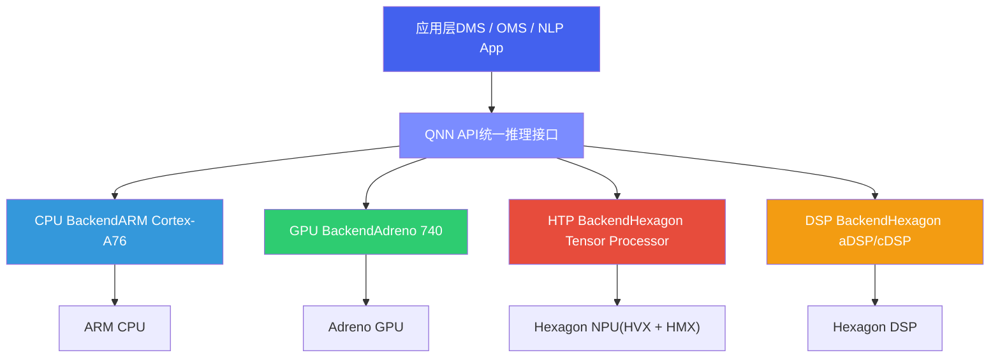
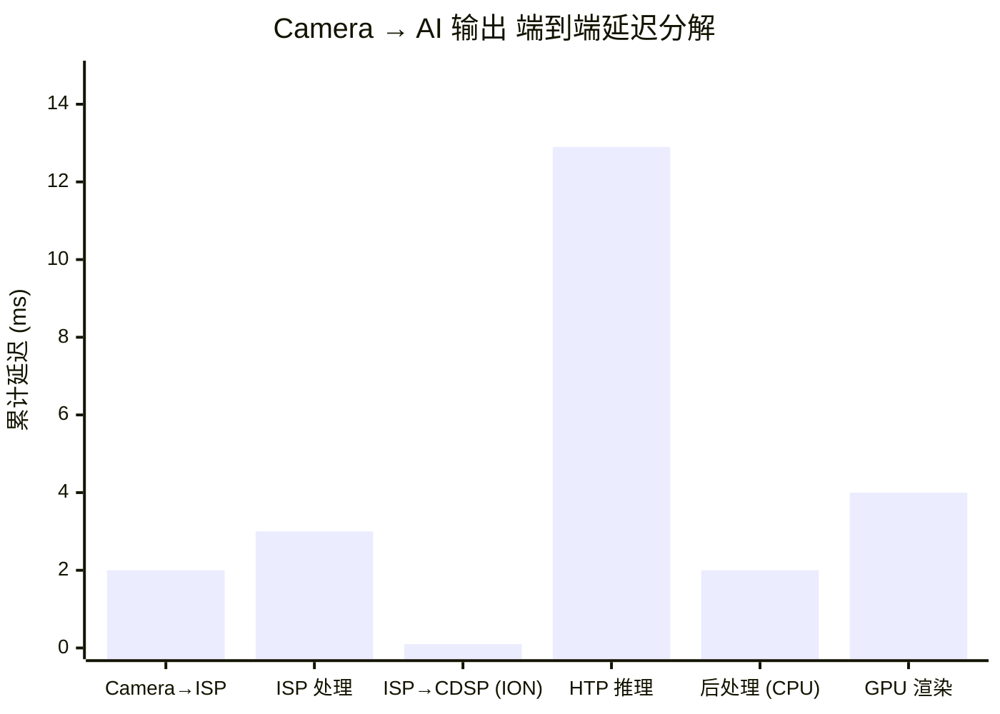
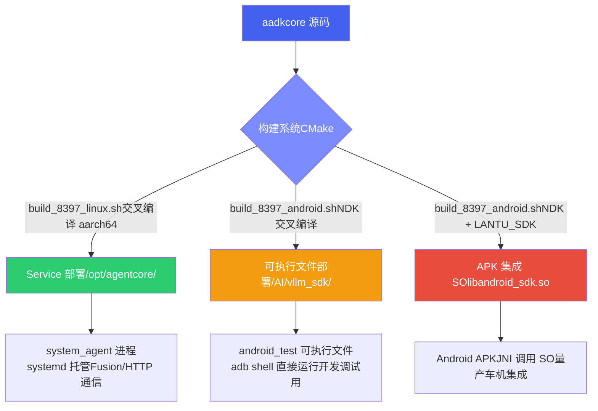
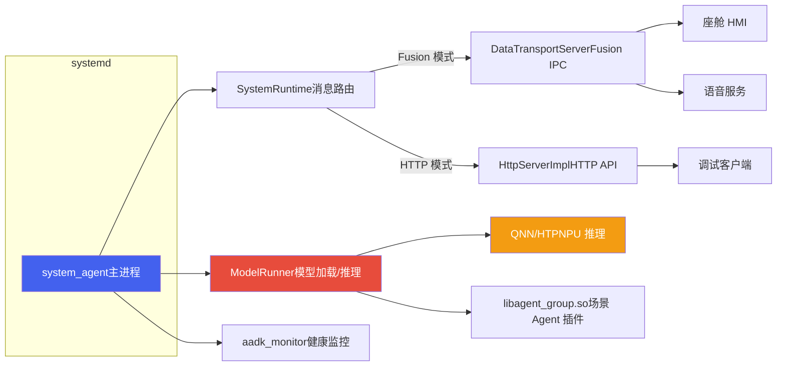
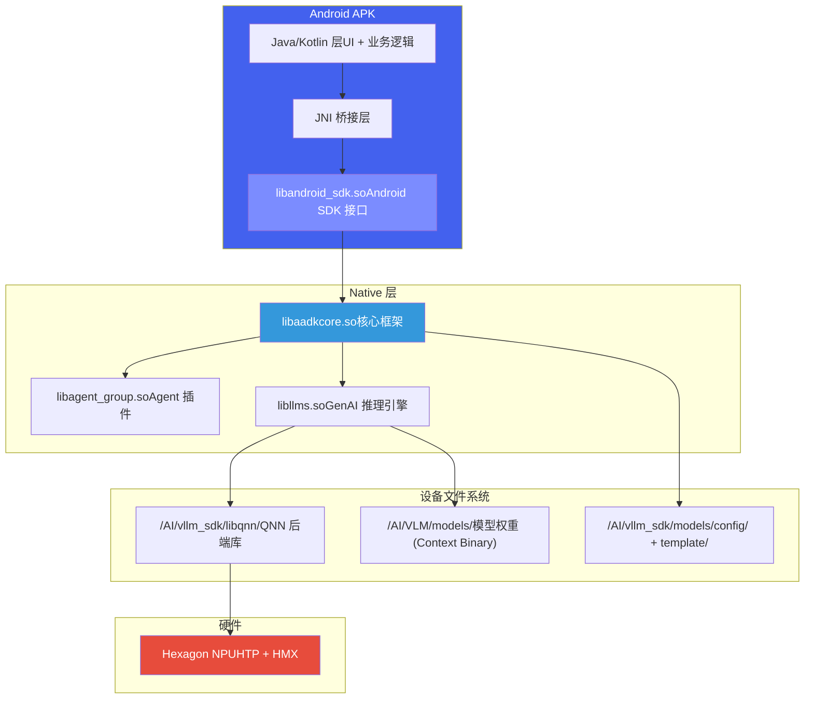
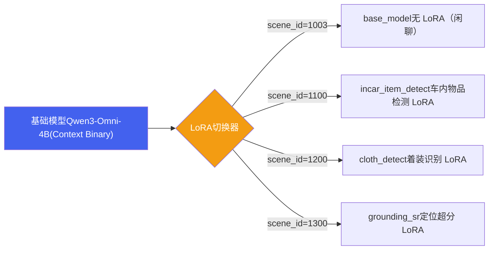
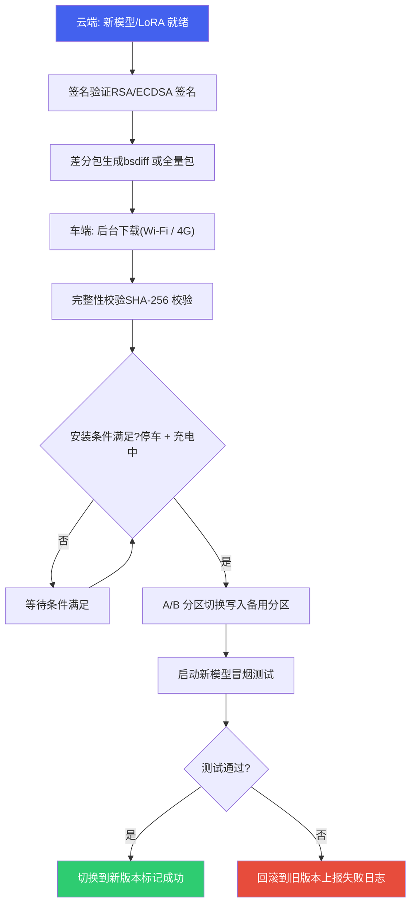

# Part 2: 设备部署

*基于 Qualcomm SA8397P 平台  |  QNN 框架 · ISP 数据流 · 多模型调度 · Context Binary*

## 1. QNN 推理框架

### 1.1 QNN 架构分层

Qualcomm Neural Network (QNN) 是高通推出的下一代统一 AI 推理框架，取代早期的 SNPE。QNN 采用分层架构，上层应用通过统一 API 调用底层不同硬件加速器：



### 1.2 完整部署流水线

从训练框架到端侧运行的完整部署流水线：

```mermaid
flowchart LR
    A["PyTorch / TF/ ONNX 模型"] --> B["qnn-onnx-converter模型转换"]
    B --> C["QNN Model(.cpp 源码)"]
    C --> D["qnn-model-lib-generator编译模型库"]
    D --> E["Model .so(动态库)"]
    E --> F["qnn-context-binary-generator离线编译"]
    F --> G["Context Binary(.bin 缓存)"]
    G --> H["QNN Runtime端侧推理"]

    style A fill:#4361ee,color:#fff
    style C fill:#f39c12,color:#fff
    style E fill:#3498db,color:#fff
    style G fill:#2ecc71,color:#fff
    style H fill:#e74c3c,color:#fff
```



### 1.3 推理框架对比

以下雷达图展示了 QNN、SNPE 和 TFLite 在六个关键维度上的对比（满分 10 分）：

**推理框架多维对比 (QNN vs SNPE vs TFLite)**

| 指标 | QNN | SNPE | TFLite |
| :--- | :--- | :--- | :--- |
| HTP 加速 | 10 | 7 | 2 |
| 算子生态 | 9 | 7 | 8 |
| 自定义 Op | 9 | 5 | 7 |
| 离线编译 | 10 | 7 | 2 |
| 易用性 | 6 | 8 | 9 |
| 车规认证 | 10 | 5 | 1 |

### 1.4 推理框架详细对比

| 维度 | QNN | SNPE (旧版) | TFLite |
| :--- | :--- | :--- | :--- |
| **HTP 加速** | 原生支持，最优性能 | 支持，但 API 已冻结 | 不支持 HTP，仅 GPU delegate |
| **算子生态** | 丰富，支持自定义 Op | 中等，自定义 Op 受限 | 丰富，社区贡献多 |
| **自定义算子** | QNN OpPackage 机制 | UDL (User Defined Layer) | Custom Op 注册 |
| **离线编译** | Context Binary (推荐) | DLC 缓存 | 不支持 |
| **易用性** | 中等，学习曲线较陡 | 高，文档完善 | 高，Python API 友好 |
| **车规认证** | 支持 ASIL-B/D | 部分支持 | 无车规认证 |
| **维护状态** | 活跃开发中 | 维护模式，不再新增功能 | 活跃开发中 |
| **推荐场景** | 新项目首选 | 仅限已有项目维护 | 跨平台/非高通场景 |

## 2. ISP 与端到端数据流

### 2.1 ISP 处理流水线

图像信号处理器 (ISP) 是摄像头原始数据到可用图像的桥梁。SA8397P 内置 Spectra ISP，完整处理流水线如下：


### 2.2 端到端延迟分解

从摄像头捕获到最终 GPU 渲染输出的全链路延迟分解（瀑布图）：

**Camera → AI 输出 端到端延迟分解**（延迟）



### 2.3 Zero-Copy 数据通路

> [!TIP]
> **Zero-Copy 路径：消除 CPU 内存拷贝瓶颈**
>
> 在传统方案中，数据在 ISP、CPU、DSP、GPU 之间需要多次内存拷贝 (`memcpy`)，带来显著延迟和功耗开销。SA8397P 的 Zero-Copy 路径彻底消除了这一瓶颈：
>
> * **ISP 写入 ION Buffer**：ISP 处理完成后，直接将 NV12 图像写入 ION (共享内存) 缓冲区
> * **CDSP 映射同一 Buffer**：Hexagon CDSP 通过 FastRPC 映射同一块物理内存，无需数据拷贝
> * **HTP 直接读取**：HTP 从映射的 ION Buffer 中直接读取输入张量，执行神经网络推理
> * **结果写入另一 ION Buffer**：推理结果写入新的 ION Buffer，供下游使用
> * **GPU 读取结果**：Adreno GPU 映射结果 Buffer，直接渲染到显示层
>
> **性能收益**：整条数据通路中 **无任何 CPU memcpy 操作**，端到端延迟减少约 3~5ms，功耗降低约 15%。ION Buffer 的物理地址连续性还确保了 DMA 传输的高效性。

## 3. 多模型调度与优化

### 3.1 单帧多模型调度时序

在智能座舱的一帧处理中，多个 AI 模型需要协同工作。以下甘特图展示了典型的单帧处理时序（总帧周期 33ms @30fps）：

```mermaid
gantt
    title 单帧多模型调度时序 (33ms @30fps)
    dateFormat X
    axisFormat %Lms

    section ISP
    ISP 图像处理           :done, isp, 0, 3

    section HTP-Core0
    人脸检测 (RetinaFace)  :active, fd, 3, 8
    关键点回归 (FaceMesh)  :lm, 8, 11
    状态分类 (疲劳/分心)   :cls, 11, 13

    section HTP-Core1
    手势识别 (MoveNet)     :active, gest, 3, 8

    section CPU
    后处理 + 融合决策      :crit, post, 13, 16

    section GPU
    AR 渲染 + HUD 显示     :gpu, 16, 20
```



### 3.2 调度策略对比

| 调度策略 | 描述 | 帧延迟 | HTP 利用率 | 适用场景 |
| :--- | :--- | :--- | :--- | :--- |
| **串行执行** | 所有模型依次在同一 HTP 核心上运行 | 最高 (~35ms) | 低 (~40%) | 模型少、时延要求低 |
| **流水线 (Pipeline)** | 前一帧后处理与当前帧推理重叠 | 中等 (~25ms) | 中 (~65%) | 延迟可接受 1 帧 |
| **并行调度** | 无依赖模型分配到不同 HTP 核心并行执行 | 最低 (~20ms) | 高 (~85%) | 多模型、低延迟要求 |
| **Context Binary 共享** | 多个模型编译为一个 Context Binary，共享中间 Buffer | 最低 (~18ms) | 最高 (~90%) | 固定模型组合、量产部署 |

### 3.3 Context Binary 与车规要求

> [!NOTE]
> **为什么车载量产始终选择 Context Binary？**
>
> 在汽车座舱中，**冷启动时间**是一项硬性要求：从上电到 DMS 系统就绪必须 **< 2 秒**。不同加载方式的冷启动时间对比：
>
> | 加载方式 | 首次推理延迟 | 原因 |
> | --- | --- | --- |
> | `Model .so` 动态加载 | ~5~8 秒 | 需要 JIT 编译图优化、内存分配、算子调度 |
> | `Context Binary .bin` | ~200~500ms | 离线已完成编译优化，直接加载二进制到 HTP VTCM |
>
> **Context Binary 的额外优势**：
>
> * **确定性执行**：离线编译确保每次推理的执行路径完全一致，满足功能安全 (ASIL) 要求
> * **内存预分配**：所有 Tensor Buffer 在编译期确定大小和位置，运行时无动态分配
> * **防篡改**：二进制文件可加签名校验，防止模型被恶意替换
> * **多模型打包**：多个模型可编译为同一 Context Binary，共享内存池，减少碎片

> [!NOTE]
> **推理优化与量化工具**
>
> AIMET 量化工具、推理引擎对比等内容已整合到独立文档 → [**Part 3: 推理优化**](../../general/infer.html)

## 4. 集成部署方式

aadkcore 框架支持三种集成部署方式，分别适用于不同平台和场景。三种方式共享同一套核心库（`libaadkcore.so` + `libagent_group.so`），差异在于运行载体、通信方式和集成深度。

### 4.1 部署方式总览



| 维度 | Service 部署 | 可执行文件部署 | APK 集成 SO |
| :--- | :--- | :--- | :--- |
| **适用平台** | SA8397P Linux / Orin | SA8397P Android | SA8397P Android |
| **运行载体** | systemd 托管的后台服务 | adb shell 直接运行的独立进程 | APK 内通过 JNI 加载 SO |
| **主要构建产物** | `system_agent` (ELF 可执行文件) | `android_test` (ELF) + `libandroid_sdk.so` | `libandroid_sdk.so` (JNI 入口) |
| **通信方式** | Fusion (DataTransport) / HTTP Server | 进程内直接调用 | JNI 函数调用 |
| **适用场景** | Linux 系统量产部署，支持多客户端并发 | 开发调试、功能验证、性能基准测试 | Android 车机量产集成 |
| **构建脚本** | `build_8397_linux.sh` | `build_8397_android.sh` | `build_8397_android.sh` |
| **设备安装路径** | `/opt/agentcore/` | `/AI/vllm_sdk/` | APK 内 + `/AI/vllm_sdk/` |

### 4.2 Service 部署（systemd 服务）

Service 部署是 SA8397P Linux 平台的标准量产方案。`system_agent` 作为系统服务由 systemd 托管，开机自启、异常自动重启，通过 Fusion（DataTransport）或 HTTP 与外部客户端通信。



**设备目录结构**（`/opt/agentcore/`）：

```
/opt/agentcore/
├── bin/
│   ├── system_agent           # 主进程可执行文件
│   ├── agent_test             # 测试客户端
│   └── msg_replay             # 消息回放工具
├── lib/
│   ├── libaadkcore.so         # 核心框架库
│   ├── libagent_group.so      # Agent 插件库
│   ├── libllms.so             # GenAI 推理引擎
│   ├── libaisa.so             # AISA 模型库
│   └── ...                    # OpenCV, curl, yaml-cpp 等依赖
├── data/
│   ├── config/                # 运行时配置
│   │   ├── runtime_config.json
│   │   └── banma.datatransport.DataTransport.service.config.json
│   ├── template/              # YAML Prompt 模板
│   └── assets/                # 静态资源（RAG 知识库等）
├── agentcore.service          # systemd 单元文件
├── run.sh                     # 启动脚本
├── postInstall.sh             # 安装脚本
└── monitor/
    ├── aadk_monitor           # 监控进程
    ├── aadk_monitor.service   # 监控服务单元
    ├── start_aadk_monitor.sh
    └── stop_aadk_monitor.sh
```

**systemd 服务配置**（`agentcore.service`）：

```
[Unit]
Description=Agent Core Runner
After=network.target
Wants=network.target

[Service]
Type=simple
WorkingDirectory=/opt/agentcore
ExecStart=/opt/agentcore/run.sh
Restart=always
RestartSec=5s
StandardOutput=journal
StandardError=journal

[Install]
WantedBy=multi-user.target
```

**部署流程**：

- **交叉编译**：执行 `build_8397_linux.sh`，使用 8397 工具链交叉编译。产物安装到 `build_8397_linux/build/agentcore/`
- **推送到设备**：通过 OTA 或 SCP 将 `agentcore/` 目录推送到设备 `/opt/agentcore/`
- **安装服务**：执行 `postInstall.sh`，自动完成 systemd 服务注册和启动：

  ```
  sudo cp agentcore.service /etc/systemd/system/
  sudo systemctl daemon-reload
  sudo systemctl enable agentcore.service
  sudo systemctl restart agentcore.service
  ```
- **验证运行**：`systemctl status agentcore` 查看服务状态，`journalctl -u agentcore -f` 查看实时日志

**启动参数**（`system_agent` 命令行选项）：

| 参数 | 默认值 | 说明 |
| :--- | :--- | :--- |
| `--http 1` | 0 (关闭) | 启用 HTTP Server 模式替代 Fusion，用于调试场景 |
| `--dump 1` | 0 (关闭) | 启用推理数据录制，将请求/响应保存到文件 |
| `--upload 1` | 0 (关闭) | 启用推理数据上传到远端服务器 |
| `--dual 1` | 0 (关闭) | 启用 SA8397P 双实例模式（双 NPU 核心） |

### 4.3 可执行文件部署（vllm\_sdk）

可执行文件部署主要用于 SA8397P Android 平台的**开发调试和功能验证**。通过 NDK 交叉编译生成 `android_test` 可执行文件，adb push 到设备后直接运行，无需 APK 集成，方便快速迭代。

**编译与安装**：

```
# NDK 交叉编译（需设置 ANDROID_NDK_HOME 环境变量）
./build_8397_android.sh

# 编译产物位于 build_8397_android/vllm_sdk/
# 推送到设备
adb push build_8397_android/vllm_sdk/ /AI/vllm_sdk/
```

**设备目录结构**（`/AI/vllm_sdk/`）：

```
/AI/vllm_sdk/
├── lib/                        # 运行时依赖库
│   ├── libaadkcore.so          # 核心框架 (~71MB)
│   ├── libagent_group.so       # Agent 插件 (~19MB)
│   ├── libandroid_sdk.so       # Android SDK 接口层 (~5.5MB)
│   ├── libllms.so              # GenAI 推理引擎 (~105MB)
│   ├── libaisa.so              # AISA 模型库 (~7MB)
│   ├── libflash_attn.so        # Flash Attention (~31MB)
│   └── ...                     # OpenCV, curl, libc++_shared 等
├── libqnn/                     # QNN 后端库
│   ├── libQnnHtp.so            # HTP 后端
│   ├── libQnnCpu.so            # CPU 后端
│   ├── libQnnGpu.so            # GPU 后端
│   ├── libGenie.so             # Genie 推理引擎
│   └── ...                     # Stub/Skel/Profiler 等
├── models/
│   ├── config/
│   │   ├── runtime_config.json         # 运行时配置（平台/模型切换）
│   │   └── multi_lora_runtime_config.json  # 多 LoRA 配置
│   └── template/               # YAML Prompt 模板
│       ├── car_control.yaml    # 车控 Agent 模板
│       ├── active_vision.yaml  # 主动视觉模板
│       ├── chitchat.yaml       # 闲聊模板
│       └── ...
├── include/                    # 对外头文件
│   ├── model_inference.h       # ModelInference 接口
│   ├── data_message.h          # DataMessage 结构定义
│   └── VoyahAIProxy.hpp        # NPU 资源管理接口
├── example/
│   ├── bin/android_test        # 测试可执行文件
│   ├── src/android_sdk_test.cpp  # 测试源码
│   └── data/                   # 测试图片和用例
├── android_sdk_run.sh          # 运行脚本
└── version.txt                 # 版本号
```

**运行方式**：

```
# adb shell 进入设备
adb shell
cd /AI/vllm_sdk

# 设置环境变量并运行（android_sdk_run.sh 内容）
export GENAI_THIRTY_LIB=/AI/vllm_sdk/libqnn
export ADSP_LIBRARY_PATH="/vendor/dsp/cdsp;/vendor/lib/rfsa/adsp;/system/lib/rfsa/adsp;/dsp;$GENAI_THIRTY_LIB;"
export LD_LIBRARY_PATH=/AI/vllm_sdk/lib:$GENAI_THIRTY_LIB

# 运行测试程序
./example/bin/android_test
```

> [!WARNING]
> **环境变量说明**
>
> `ADSP_LIBRARY_PATH` 是 Hexagon DSP 加载 skeleton 库的搜索路径，必须包含 QNN 后端库目录。`GENAI_THIRTY_LIB` 指向 QNN 库目录，用于 GenAI SDK 定位 HTP/CPU/GPU 后端。如果这两个变量配置错误，会导致 QNN 后端加载失败，模型推理报 `AEE_ECONNREFUSED` 错误。

### 4.4 APK 集成 SO

APK 集成是 SA8397P Android 平台的**量产部署方案**。Android 应用通过 JNI 加载 `libandroid_sdk.so`，调用 `ModelInference` C++ 接口完成模型推理。核心 SO 库打包在 APK 内，模型权重和 QNN 后端库部署在设备文件系统。



**ModelInference API**（`banma::ModelInference`）：

| 方法 | 参数 | 返回值 | 说明 |
| :--- | :--- | :--- | :--- |
| `requestNpuAccess` | `packageName` (string) | bool | 申请 NPU 硬件资源访问权限。通过 VoyahAIProxy 与系统 NPU 资源管理器交互，**必须在 init 之前调用** |
| `init` | `model_path` (string) | bool | 初始化模型。model\_path 指向 models 目录的绝对路径，内部加载 runtime\_config.json 并初始化 MsgDeliverImpl |
| `registerProfilingCallback` | `callback` (ProfilingCallback) | void | 注册性能监控回调，接收 QNN 模型执行的耗时数据（accelTime、hostRpcTime 等） |
| `inference_msg` | `msg`, `stream`, `replyHandler` | bool | 发送推理请求。msg 包含文本/图像/音频输入，stream 控制流式输出，replyHandler 接收推理结果 |
| `syncNpuProfile` | `info` (ProfileEventInfo) | bool | 将采集到的 NPU 性能数据同步到服务端（通过 VoyahAIProxy） |
| `registerNpuResourceEventCallback` | `callback` (NpuResourceEventCallback) | void | 注册 NPU 资源竞争事件回调，当资源竞争级别变化时通知（NONE/MILD/MODERATE/SEVERE） |

**DataMessage 结构**：

| 字段 | 类型 | 说明 |
| :--- | :--- | :--- |
| `scenario_id` | uint16 | 场景 ID：0=OAI 推理, 100=车内物品检测, 200=着装识别, 300=车外问答 |
| `content` | string | 文本内容（用户查询） |
| `image_info` | ImageInfo | 主图像数据（支持 JPEG/YUV\_NV12/RGB/BGR/RGBA 等格式） |
| `extra_images` | vector<ImageInfo> | 附加图像帧（多帧推理场景） |
| `audio_info` | AudioInfo | 音频数据（PCM 格式，含采样率/位深度） |
| `msg_type` | MsgType | 消息类型：TEXT / IMAGE / AUDIO / TEXT\_IMAGE / TEXT\_AUDIO 等组合 |
| `request_type` | RequestType | REQUEST=推理 / CONTEXT=上下文 / PREPROCESS=预处理 / CANCEL=取消 |
| `priority` | uint16 | 优先级：0=LOW, 1=NORMAL, 2=HIGH, 3=CRITICAL |
| `stream` | bool | 是否流式返回结果 |

**C++ 调用示例**：

```
#include "model_inference.h"
#include "data_message.h"

banma::ModelInference model;

// 1. 申请 NPU 权限
model.requestNpuAccess("com.voyah.ai.assistant");

// 2. 初始化模型
model.init("/AI/vllm_sdk/models");

// 3. 构造推理请求
banma::DataMessage msg;
msg.scenario_id = banma::OAI_INFERENCE;  // 通用推理
msg.content = "今天天气怎么样？";
msg.msg_type = banma::TEXT;
msg.request_type = banma::REQUEST;
msg.stream = true;

// 4. 发送推理请求
model.inference_msg(msg, true, [](const std::string& result, bool is_finished) {
    // 流式回调：result 为每次返回的文本片段
    // is_finished 为 true 时表示推理完成
    std::cout << result;
    if (is_finished) std::cout << std::endl;
});
```

**设备文件放置对照表**：

| 文件类别 | 来源 | 设备路径 | 说明 |
| :--- | :--- | :--- | :--- |
| **SDK 接口库** | vllm\_sdk/lib/libandroid\_sdk.so | APK jniLibs/arm64-v8a/ | 打包进 APK，JNI 加载 |
| **核心框架库** | vllm\_sdk/lib/libaadkcore.so 等 | /AI/vllm\_sdk/lib/ | 通过 LD\_LIBRARY\_PATH 加载 |
| **QNN 后端库** | vllm\_sdk/libqnn/ | /AI/vllm\_sdk/libqnn/ | QNN HTP/CPU/GPU 后端 |
| **DSP Skeleton 库** | vllm\_sdk/libqnn/ 中的 Skel 文件 | ADSP\_LIBRARY\_PATH 路径 | Hexagon DSP 侧加载 |
| **模型权重** | Context Binary (.bin) | /AI/VLM/models/ | 模型配置中 model\_path 指定 |
| **运行时配置** | vllm\_sdk/models/config/ | /AI/vllm\_sdk/models/config/ | runtime\_config.json 等 |
| **Prompt 模板** | vllm\_sdk/models/template/ | /AI/vllm\_sdk/models/template/ | YAML 格式的 Agent 模板 |

> [!NOTE]
> **NPU 资源管理（VoyahAIProxy）**
>
> APK 集成模式下，多个应用可能同时竞争 NPU 资源。`VoyahAIProxy` 提供统一的 NPU 资源管理：
>
> * `requestNpuAccess(packageName)` — 以应用包名申请 NPU 访问权限，由系统资源管理器统一调度
> * `registerNpuResourceEventCallback` — 监听资源竞争级别变化（NONE → MILD → MODERATE → SEVERE），应用可据此降级推理精度或推迟非关键任务
> * `syncNpuProfileToServer` — 将 QNN 推理性能数据（accelTime, hostRpcTime, htpRpcTime）上报到服务端，用于远程性能监控
>
> 调试时可通过 Android 系统属性控制数据录制：`adb shell setprop persist.aadk.data_dump 1` 开启，设为 0 关闭。

### 4.5 模型配置与多 LoRA

aadkcore 通过 `runtime_config.json` 实现多平台自动切换，通过 `multi_lora_runtime_config.json` 支持同一基础模型加载多个 LoRA 适配器。

**runtime\_config.json**（平台自动切换）：

```
{
    "current_runtime": "8397",
    "8397": {
        "model_name": "qnn/qwen2.5-vl",
        "model_config": "config/qwen2.5-vl_8397.json",
        "active_model_config": "config/qwen2.5-vl_8397_active.json"
    },
    "orin": {
        "model_name": "lape/Qwen2.5-Omni-7B",
        "model_config": "config/Qwen2.5-Omni-7B.json"
    },
    "worker_count": 4,
    "capacity": 10,
    "timeout_s": 100
}
```

| 配置项 | 说明 |
| :--- | :--- |
| `current_runtime` | 当前运行平台标识（8397 / orin / 8295\_android），决定使用哪组模型配置 |
| `model_name` | 模型标识，格式为 `后端/模型名`，如 `qnn/qwen2.5-vl`（QNN 后端加载 Qwen2.5-VL） |
| `model_config` | 主模型配置文件路径，包含 Context Binary 路径、ViT 模型路径等 |
| `active_model_config` | 主动视觉 Agent 使用的模型配置（可选，独立于主模型） |
| `worker_count` | ModelScheduler 工作线程数 |
| `capacity` | 任务队列容量 |
| `timeout_s` | 单次推理超时时间（秒） |

**multi\_lora\_runtime\_config.json**（多 LoRA 配置）：

```
{
    "current_runtime": "8397",
    "8397": {
        "multi_lora": {
            "base_model": {
                "model_name": "qnn/qwen3-omni-4b",
                "config_path": "config/qwen3-omni-4b_8397.json"
            },
            "lora": [
                {"scene_id": 1003, "name": "base_model",       "lora_path": ""},
                {"scene_id": 1100, "name": "incar_item_detect", "lora_path": "cnyb"},
                {"scene_id": 1200, "name": "cloth_detect",      "lora_path": "cnyb"},
                {"scene_id": 1300, "name": "grounding_sr",      "lora_path": "dwsr"},
                {"scene_id": 1300, "name": "visual_assistant",  "lora_path": "znzs"}
            ]
        }
    }
}
```



> [!TIP]
> **多 LoRA 热切换机制**
>
> 多 LoRA 架构通过 `scene_id` 自动路由到对应的 LoRA 适配器。基础模型权重常驻 NPU 内存，LoRA 增量权重按需加载。切换 LoRA 仅需替换增量权重（通常 < 100MB），无需重新加载基础模型（~2.5GB），切换延迟在毫秒级。这使得同一个 4B 参数基础模型能同时服务闲聊、车内物品检测、着装识别、车外问答等多个场景。

## 5. OTA 模型更新

### 5.1 更新策略分级

端侧模型的 OTA 更新需要根据更新内容和风险等级选择不同策略：

| 更新类型 | 更新内容 | 包大小 | 风险等级 | 更新频率 | 回归测试 |
| :--- | :--- | :--- | :--- | :--- | :--- |
| **Prompt 热更** | System Prompt / Tool Schema YAML 文件 | 数 KB | 低 | 随时 | 功能冒烟测试 |
| **LoRA 增量更新** | LoRA 适配器权重文件 | 200KB - 50MB | 低-中 | 周级 | Function Calling 准确率回归 |
| **RAG 知识更新** | 知识库向量索引 + 文档 | 10-100 MB | 低 | 按需 | 检索准确率测试 |
| **模型整体更新** | 完整 Context Binary | 2-3 GB | 高 | 月/季度级 | 全量回归测试 |
| **框架更新** | libaadkcore.so + libagent\_group.so | 50-100 MB | 高 | 版本发布 | 全量回归 + 兼容性测试 |

### 5.2 安全更新流程



> [!WARNING]
> **模型更新的安全红线**
>
> (1) **绝不在行驶中更新**：模型切换瞬间推理服务中断，必须在停车且充电状态下执行；(2) **A/B 分区保障回滚**：新模型写入备用分区，冒烟测试通过后才切换，失败自动回滚；(3) **签名校验防篡改**：防止恶意模型注入；(4) **版本兼容性**：新 LoRA 必须与当前基座模型版本兼容，版本号在 runtime\_config.json 中管理。

## 6. 性能基准测试

### 6.1 基准测试方法论

端侧 LLM 的性能基准测试必须遵循严格的方法论，否则测试结果无法反映量产环境的真实性能：

| 测试维度 | 常见错误 | 正确做法 |
| :--- | :--- | :--- |
| **系统负载** | 单独运行 LLM（无摄像头、无渲染） | 全系统负载下测试：多路摄像头 + ISP + GPU 渲染 + LLM |
| **热状态** | 冷启动后立即测量（芯片低温） | 预热 10 分钟后测量，模拟持续使用场景 |
| **频率锁定** | 锁定 DSP 最高频率 | 使用默认 DVFS 策略，测量真实频率下的性能 |
| **输入长度** | 仅测试短 Prompt（10-20 tokens） | 测试典型场景：System Prompt 300 + User 50 + 历史对话 200 |
| **统计方法** | 报告单次或平均值 | 报告 P50/P90/P99 分位数，至少 100 次测试 |
| **内存状态** | 首次推理（KV Cache 为空） | 测试多轮对话后的推理（KV Cache 累积增长后） |

### 6.2 标准测试 Checklist

```bash
# 性能基准测试标准流程

# 1. 环境准备
echo "=== 硬件信息 ==="
cat /sys/class/thermal/thermal_zone*/temp      # 初始温度
cat /sys/class/devfreq/soc:qcom,cdsp/cur_freq  # DSP 当前频率

# 2. 启动全系统负载 (模拟量产环境)
# 启动摄像头 ISP 通路
# 启动 3D 仪表盘渲染
# 启动导航地图渲染

# 3. 预热 (10 分钟稳态运行)
for i in $(seq 1 20); do
  # 发送典型推理请求
  echo "Warmup request $i"
  # curl -X POST http://localhost:8080/inference -d '...'
  sleep 30
done

# 4. 正式测试 (100 次)
echo "=== 开始正式测试 ==="
for i in $(seq 1 100); do
  START=$(date +%s%N)
  # 发送标准测试请求 (System Prompt 300tok + User 50tok)
  # 记录 TTFT, TPOT, 总生成长度, 总耗时
  END=$(date +%s%N)
  echo "Test $i: $((($END-$START)/1000000))ms"
done

# 5. 采集系统状态
cat /sys/class/thermal/thermal_zone*/temp      # 测试后温度
cat /proc/$(pidof system_agent)/status | grep VmRSS  # 内存
```

### 6.3 关键性能指标

| 指标 | 定义 | 目标值 | 测量方法 |
| :--- | :--- | :--- | :--- |
| **TTFT** | 从请求发送到收到第一个 token | < 800ms (P90) | 客户端记录请求发送和首 token 接收时间差 |
| **TPOT** | Decode 阶段相邻 token 间隔 | < 100ms (P90) | 流式回调中记录 token 间隔 |
| **E2E 延迟** | ASR 完成到 TTS 开始播放 | < 2s (P90) | 端到端录音分析 |
| **模型加载** | 冷启动到推理就绪 | < 5s (Context Binary) | 进程启动日志时间戳 |
| **吞吐量** | 单位时间处理的 token 总数 | > 10 tok/s | Profiling 回调统计 |
| **内存峰值** | 推理过程中 RSS 最大值 | < 4 GB | /proc/PID/status 监控 |

## 7. ONNX → QNN 转换陷阱

从训练框架（PyTorch）到端侧部署（QNN）的模型转换链路为 `PyTorch → ONNX → QNN IR → Context Binary`，每一步都可能引入问题。以下是实际项目中遇到的常见陷阱：

### 7.1 ONNX 导出阶段

| 陷阱 | 现象 | 原因 | 解决方案 |
| :--- | :--- | :--- | :--- |
| **动态 shape 导出** | QNN 转换时报 shape 不匹配 | PyTorch 导出时未正确指定 dynamic\_axes | 明确指定所有动态维度：batch\_size、seq\_len、image\_size |
| **不支持的算子** | ONNX 导出成功但 QNN 转换失败 | 模型使用了 QNN 不支持的 ONNX Op（如自定义激活函数） | 替换为 QNN 支持的等价算子；或注册 QNN 自定义算子 |
| **opset 版本不匹配** | ONNX 模型验证通过但 QNN 转换报错 | 使用了过高的 opset\_version，QNN 不支持 | 导出时指定 opset\_version=17 或 QNN SDK 支持的版本 |
| **控制流算子** | 包含 if/loop 的模型无法转换 | QNN 不支持动态控制流 | 使用 torch.jit.trace 替代 torch.jit.script；或拆分为多个子模型 |

### 7.2 QNN 转换阶段

| 陷阱 | 现象 | 原因 | 解决方案 |
| :--- | :--- | :--- | :--- |
| **量化后精度暴跌** | INT8/INT4 推理输出全错 | 量化校准数据不具代表性，或未使用正确的预处理 | 使用真实业务数据（500-1000 样本）做校准；确保预处理与训练一致 |
| **输入格式不匹配** | 推理输出乱码或全零 | 训练用 RGB 格式，端侧摄像头输出 YUV/NV12/NV21 | 在预处理 pipeline 中增加色彩空间转换；或在模型前端添加转换层 |
| **Layout 转换遗漏** | 推理速度远低于预期 | 模型为 NCHW 格式，HTP 原生支持 NHWC，运行时隐式 transpose | 转换时指定 --input\_layout NHWC；或在 ONNX 阶段插入 transpose 节点 |
| **Context Binary 不兼容** | 加载失败 `QnnContext_createFromBinary failed` | Context Binary 是硬件绑定的——在 SA8295P 上编译的不能在 SA8397P 上运行 | 针对目标硬件重新生成 Context Binary；使用正确的 SOC 参数 |

### 7.3 LLM 特有的转换陷阱

| 陷阱 | 原因 | 解决方案 |
| :--- | :--- | :--- |
| **KV Cache 管理** | 标准 ONNX 导出不包含 KV Cache 输入/输出，导致无法增量推理 | 导出时将 KV Cache 作为模型输入输出显式定义；或使用 QNN Genie SDK 的自动 KV Cache 管理 |
| **RoPE 位置编码** | RoPE 使用复数运算，部分实现在 ONNX 导出时丢失精度 | 将 RoPE 实现为显式的 sin/cos 乘法而非复数运算 |
| **GQA 分组注意力** | Grouped Query Attention 的 KV 广播在 ONNX 中可能生成低效的 expand/repeat 算子 | 使用 QNN 原生的 GQA 支持；或手动优化 ONNX 图消除冗余算子 |
| **Tokenizer 不一致** | 端侧 Tokenizer 与训练时不完全一致（特殊 token、BOS/EOS 处理） | 导出 Tokenizer 配置并在端侧使用相同的 sentencepiece/tiktoken 模型 |

> [!TIP]
> **转换验证 Checklist**
>
> 模型转换后必须完成以下验证：(1) **数值一致性**：相同输入下 PyTorch/ONNX/QNN 的输出 cosine similarity > 0.99；(2) **功能正确性**：在标准测试集上运行 100+ 条 Function Calling 请求，准确率与 FP16 基线差距 < 2%；(3) **边界输入**：空字符串、超长输入、特殊字符（emoji、数字、标点）；(4) **性能基线**：TTFT 和生成速度符合预期范围。
