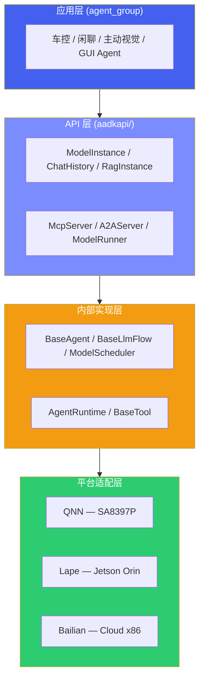
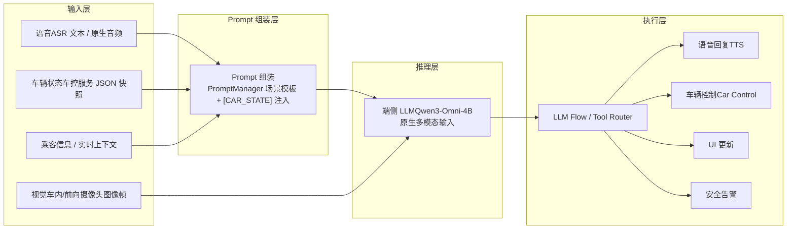
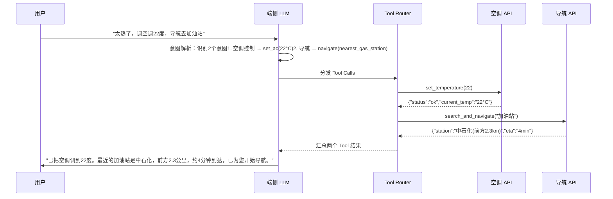

# 1. 座舱端侧 Agent 总览

*端侧大模型选型、Agent 框架设计概述与场景应用概览*

> [!TIP]
> **本篇讲什么**
>
> 座舱端侧 Agent 系统总览。系统由两个核心库组成：
>
> - **aadkcore**：提供统一模型接口、调度器、MCP/A2A 协议等基础设施（编译为 `libaadkcore.so`）
> - **agent\_group**：基于 aadkcore 的插件接口实现各场景 Agent（编译为 `libagent_group.so`，运行时动态加载）
>
> 本篇覆盖端侧大模型选型、Agent 框架设计概述与场景应用概览；aadkcore 的详解分为「运行时与模型」和「协议与运行时执行」两篇，加上场景 Agent 应用，见下方「核心模块导读」。

## 1. 核心模块导读

### 1.1 aadkcore 核心框架 · 运行时与模型

统一模型接口（ModelInstance）、模型调度器（ModelScheduler）、多音区对话管理（ChatHistory）、RAG 知识增强

`C++17` · `ModelScheduler` · `ChatHistory` · `RAG`

### 1.2 aadkcore · 协议与运行时执行

MCP 工具协议、A2A 协议、运行时与插件机制、LLM Flow 与 Tool Use、端云协同与安全沙箱（设计方向）

`MCP` · `A2A` · `插件` · `Tool Use`

### 1.3 场景 Agent 应用

车辆控制 Agent（30+ 技能）、主动视觉 Agent（迎宾/送宾/行中三模式，行中含危险行为/玩手机/睡觉/吃东西等多项视觉检测）、闲聊 Agent、GUI Agent、Prompt 模板工程、数据通路与 Fusion 通信

`车控` · `主动视觉` · `闲聊` · `GUI Agent`

## 2. 座舱大模型 Agent 架构

先看框架的实际分层：应用层的场景 Agent 构建在 aadkcore 的统一 API 之上，内部实现调度、对话与 Tool 流程，最终通过平台适配层对接不同推理后端：

> 完整分层（代码目录结构、平台支持矩阵）见 [**aadkcore 核心框架**](agent-core.html)。

### 2.1 端侧 LLM 选型对比

在 SA8397P 级别硬件上（Hexagon NPU 约 70 TOPS INT8），可运行的端侧大模型需要兼顾推理速度、模型质量和内存占用。当前座舱场景的首选是 **Qwen3-Omni-4B**——原生支持文本、图像、音频、视频四种模态输入，非常契合座舱多模态交互需求：

| 模型 | 参数量 | 量化精度 | 生成速度 (tok/s) | 内存占用 | 中文能力 | 适用场景 |
| :--- | :--- | :--- | :--- | :--- | :--- | :--- |
| **Qwen3-Omni-4B** | 4B | INT4 | ~10 | ~2.5 GB | 优秀 | 多模态座舱 Agent (语音+视觉+车控) |
| **Qwen3-4B** | 4B | INT4 | ~12 | ~2.5 GB | 优秀 | 纯文本 Function Calling、对话 |
| **Qwen3-1.7B** | 1.7B | INT4 | ~28 | ~1.2 GB | 良好 | 轻量级意图识别、低延迟场景 |
| **Llama3.2-3B** | 3B | INT4 | ~15 | ~2.0 GB | 中等 | 多语言场景、海外车型 |

表中生成速度与内存占用为 INT4 量化下的量级示例，实际取决于具体平台带宽与算力，请按自己的平台代入推导（方法见 [**LLM 推理原理与性能模型**](../../general/infer-principles.html)）。

> [!NOTE]
> **哪些模型是框架真正接好的，哪些只是选型候选**
>
> 上表是「选型对比」，不代表每一行都已在 aadkcore 里接好后端。按代码核实，框架当前**已注册并带配置**的端侧模型是：
>
> - **Qwen3-Omni-4B**：QNN（`qnn/qwen3-omni-4b`，SA8397）与 Lape（`lape/Qwen3-Omni-4B`，Orin）双后端均有，是当前主推的多模态座舱模型；
> - **Qwen2.5-Omni-7B**：Lape 后端（`lape/Qwen2.5-Omni-7B`），Orin 上以 GPTQ-Int4 权重部署；
> - **Qwen2.5-VL-3B**：Lape 后端（`lape/Qwen2.5-VL-3B`），纯视觉场景。
>
> 表中 **Qwen3-4B / Qwen3-1.7B / Llama3.2-3B 属于选型候选**，用于说明「按延迟/内存预算挑模型」的方法，框架里暂无对应的注册后端与量产配置，落地前需自行接入并实测。另外，Qwen3-Omni 模型族原生支持文本/图像/音频/视频，但 aadkcore 目前接好的预处理器是**图像（ViT）+ 音频**两路（`qwen2_vl_processor` / `qwen25_audio_processor`），视频输入尚未在框架内打通。

> [!TIP]
> **选型建议**
>
> 国内座舱场景首选 **Qwen3-Omni-4B**：原生支持音频输入/输出，省去独立 ASR+TTS 模块，系统架构更简洁；中文能力和 Function Calling 能力在同尺寸模型中领先。INT4 量化后内存约 2.5GB，SA8397P 可承载。如果延迟预算极紧，可用 Qwen3-1.7B 做意图识别前端 + Qwen3-Omni-4B 做复杂推理的级联架构——注意该前端只适用于**短 prompt 的纯意图分类**场景：端侧 TTFT 包含完整 prefill，随 prompt 长度增长，具体延迟预算应按带宽/roofline 模型推导，而非拍一个固定毫秒数。

### 2.2 多模态输入与车态注入

座舱 Agent 的输入是异构的：语音、图像、车辆状态、上下文。aadkcore 的做法是 **prompt 注入式**数据流——车辆状态与上下文以文本形式注入 prompt，图像/音频走模型的原生多模态输入，最终由 LLM Flow 分发到执行器：

具体分工：语音经 ASR 转为文本进入用户消息（或使用 Qwen3-Omni 的原生音频输入）；图像帧作为 VLM 的原生多模态内容直接送入模型；车辆状态走的是**文本注入**这条路——`CarSignalManager` 并不直接读 CAN，而是接收上游车控服务经 Fusion/DataTransport 推来的车辆状态 JSON 快照（`SystemAgentDispatcher::handle_car_signal_request` 解析后调 `setCarSignalInfo`），解析成 `VehicleState` 后按当前技能 mask 生成 `[CAR_STATE]` 文本（如"空调24度, 车窗关闭, 风速3档"）注入 system prompt；`PromptManager` 则是按场景从 YAML 加载、按 `prompt_id` 取用的 prompt 模板仓库，乘客信息随 `[CAR_STATE]` 一并注入。时间/位置/天气这类实时上下文，框架里不是由 PromptManager 自动占位符替换，而是经 Tool（如 MCP `get_weather`）或上游消息带入。

> [!NOTE]
> **为什么不是 token 级 embedding 融合**
>
> 文献中常见的"理想化多模态融合架构"是用独立的多模态编码器把各模态对齐到统一 embedding 空间、车态也编码为结构化 token。aadkcore **没有**采用这种方式，而是 prompt 注入：LLM 只看到"文本 prompt + 原生多模态内容"，车态就是 prompt 里的结构化文本。这样无需定制融合编码器、不增加训练成本，新增车态信号只需扩展 prompt 模板。
>
> 两个值得注意的工程取舍：① **车态按技能 mask 裁剪**——`to_carsignal_prompt` 只输出当前意图命中的技能对应的车态字段，而非把整车信号全量塞进 prompt，避免无谓拉长 prefill、挤占端侧本就紧张的上下文预算；② **CAN 边界在框架之外**——aadkcore 消费的是车控服务已经解析好的车辆状态 JSON 快照，不直接碰 CAN 总线，这样框架与具体车型的信号矩阵解耦，换车型只需上游适配。场景模板与技能体系详见 [**场景 Agent 应用**](agent-group.html)。

## 3. 端侧 Agent 框架设计

### 3.1 Function Calling 流程

端侧 Agent 的核心能力是 Function Calling：用户发出自然语言指令，LLM 解析意图后调用注册的 Tool 完成操作，最后将结果汇总回复用户。下面以一个典型的复合指令为例：

> [!NOTE]
> **图里的 "Tool Router" 对应到代码是什么**
>
> 框架里没有一个叫 "Tool Router" 的独立类，这一步实际由 Flow 引擎的 `FunctionHandler::handle_function_calls_async` 完成：LLM 返回的每个 function call 按名字在 `tools_dict` 里查表定位到 `BaseTool`，依次跑 before-tool 回调（`before_tool_callback`）→ 执行工具 → after-tool 回调（`after_tool_callback`）（回调可拦截或改写参数/结果，这是做安全校验和车控 shortcut 的挂点），最后把本轮所有工具结果**合并成一条 user 角色消息**回填给 LLM 生成最终回复。图里画成"并行分发"是为表达复合意图，但当前实现是**顺序执行后合并**——真正的并行 Tool 执行见 §3.2「并发调度」里的说明（设计方向）。

### 3.2 Tool Use 设计要点

端侧 Agent 的 Tool 体系需要兼顾灵活性和安全性。以下是关键设计考量：

| 设计要点 | 方案 | 说明 |
| :--- | :--- | :--- |
| **工具注册** | JSON Schema 描述 | 每个工具通过 JSON Schema 定义函数名、参数类型、必填项和描述。LLM 根据 Schema 生成结构化调用参数，无需 Few-shot 示例。 |
| **安全沙箱** | L1 / L2 / L3 三级分级 | 只读 / 可逆 / 不可逆分级确认，防止误操作与危险操作。分级定义与安全检查流水线见 [**协议与运行时执行**](agent-protocols.html)（设计方向）。 |
| **延迟预算** | < 2s 端到端（示例目标） | 从用户说完到执行完成 < 2 秒。以下数字为**预算分配示例（非实测）**：ASR ~300ms，LLM 推理 ~800ms，Tool 执行 ~500ms，TTS ~400ms。其中 LLM 项应按平台 roofline/带宽模型推导（TTFT 看算力、decode 看带宽），不要拍固定毫秒数，推导方法见 [**LLM 推理原理与性能模型**](../../general/infer-principles.html) 与 [**端侧解码与服务化优化**](../../general/infer-serving.html)。 |
| **离线能力** | 本地优先 + 云端 fallback | 核心 Tools（车控、本地音乐、导航缓存）全部本地化。联网后自动同步云端 Tools（在线搜索、实时路况）。 |
| **错误处理** | 重试 + 降级 + 告知 | Tool 调用失败时：先重试 1 次 → 尝试降级方案 → 告知用户并建议替代操作。 |
| **并发调度** | ModelScheduler 优先级/抢占（已实现）+ 场景 scenario_id 路由；A2A 为可选协议、未用于此链路 | 两层机制要分开看：**模型层**由 ModelScheduler 对并发推理请求做优先级/抢占调度——LOW/NORMAL/HIGH/CRITICAL 四级、`PreemptAndSubmit` 抢占低优任务、按「优先级+等待时长」加权出队、`BoostPriority` 动态提权，这是已实现的；**Agent 层**当前是 SystemAgent/SystemAgentDispatcher 按 `scenario_id` 经 Fusion/DataTransport IPC 把消息路由给 dlopen 进来的 agent_group 场景插件，属于**场景分发**而非 A2A 并行编排。aadkcore 里 A2A 协议本身是实现好的（与 a2a-protocol.org 规范对齐的 A2AClient/A2AServer，含多 agent 共服务示例），但 agent_group 目前没有任何 A2A 用法，因此「SystemAgent 经 A2A 把子任务并行分发给各场景 Agent」应视为**设计方向**而非现状。基于 DAG 依赖分析的 Tool 自动并行同为设计方向（未实现）。见 [**协议与运行时执行**](agent-protocols.html)。 |

### 3.3 记忆系统

端侧 Agent 的记忆分三层，对应到 aadkcore 的实现程度并不一样：

- **短期记忆（对话窗口，已实现）**：由 `ChatHistory` 承载——多音区对话历史，支持按轮数（`getHistoryByNum`）、时间段（`getHistoryByPeriod`）、token 预算（`getHistoryByTokenLimit`）和音区/关键人物裁剪取用。注意 KV/prefix cache（Lape `OmniThinker` 的 `enable_prefix_caching`）属于**推理层的复用加速**，用来省 system prompt 的重复 prefill，它不是记忆存储，别和对话窗口混为一谈。
- **长期记忆（用户画像，部分实现）**：`ChatHistory` 的关键人物识别（`detectUserInfo`/`addUserinfo`，按音区认人、以 alias 指代）+ `UserInfoExtractor` 从对话里抽取姓名/品牌等信息；持久化由 `SQLiteDataService` 落库（对话历史、带位置/时间戳的图片等，按 app/user 隔离）。
- **情景记忆（按事件检索，偏设计方向）**：`BaseMemoryService` 定义了 `add_session_to_memory`/`search_memory` 的会话级检索接口，但目前的 `InMemoryMemoryService` 实现基本是占位，真正的「行程/事件按需检索」尚未落地。

实现细节与端侧/云端记忆取舍见 [**aadkcore 核心框架**](agent-core.html)。座舱场景下驾驶习惯与个人偏好属高敏感数据，端侧记忆（零上传、零网络延迟、完全离线可用）是首选方案；也正因为落在端侧，记忆容量和检索成本都受限，所以框架把「认人」做成轻量的关键人物 alias 机制，而不是在端上维护一个重量级的向量记忆库。

## 4. 座舱场景 Agent 应用

典型座舱场景由 agent\_group 插件库中的各 Agent 落地，涵盖语音交互、主动安全、个性化推荐和多模态融合：

- **智能语音助手**：ASR → LLM 意图理解 → Function Calling → TTS 的核心对话与车控链路
- **主动安全提醒**：LLM 综合 DMS、车辆状态、驾驶时长做分级告警，而非简单阈值触发
- **个性化推荐**：长期记忆 + 实时上下文（时间/位置/车辆状态）主动推荐，无需用户发起对话
- **多模态车控**：语音与注视/手势融合消歧，消除自然语言指代歧义后精准车控

各 Agent 的技能体系、Prompt 模板与数据通路见 [**场景 Agent 应用**](agent-group.html)。

> [!NOTE]
> **LLM 推理优化**
>
> KV Cache、Roofline、推理引擎对比 → [**LLM 推理原理与性能模型**](../../general/infer-principles.html)；投机采样、约束解码、TTFT/端到端延迟优化 → [**端侧解码与服务化优化**](../../general/infer-serving.html)；量化 → [**端侧模型量化与压缩**](../../general/quantization.html)
