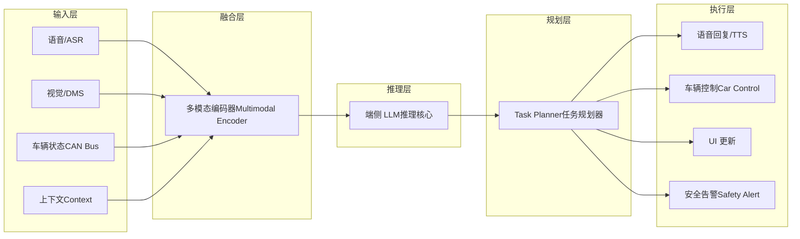
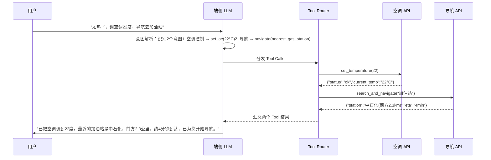
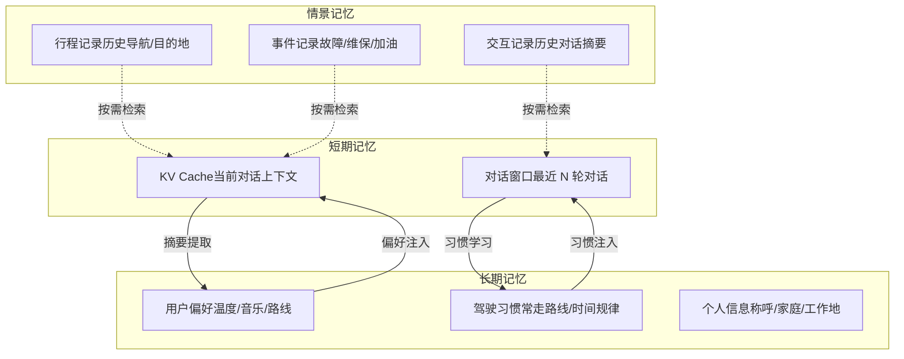

# Part 1: 座舱端侧 Agent 总览

*端侧大模型选型、Agent 框架设计概述与场景应用概览*

> [!TIP]
> **aadkcore + agent\_group 架构**
>
> 座舱端侧 Agent 系统由两个核心模块组成：**aadkcore** 提供统一模型接口、调度器、MCP/A2A 协议等基础设施（编译为 `libaadkcore.so`）；**agent\_group** 基于 aadkcore 的插件接口实现各场景 Agent（编译为 `libagent_group.so`，运行时动态加载）。详细文档请查看下方两个入口：

### E1: aadkcore 核心框架

统一模型接口（ModelInstance）、模型调度器（ModelScheduler）、多音区对话管理、RAG 知识增强、MCP 工具协议、A2A 协议、运行时与插件机制、LLM Flow

C++17MCPA2AModelScheduler

### E2: 场景 Agent 应用

车辆控制 Agent（30+ 技能）、主动视觉 Agent（6 大模式）、闲聊 Agent、GUI Agent、Prompt 模板工程、数据通路与 Fusion 通信

车控主动视觉闲聊GUI Agent

## 1. 座舱大模型 Agent 架构

### 1.1 端侧 LLM 选型对比

在 SA8397P 级别硬件上（Hexagon NPU 约 70 TOPS INT8），可运行的端侧大模型需要兼顾推理速度、模型质量和内存占用。当前座舱场景的首选是 **Qwen3-Omni-4B**——原生支持文本、图像、音频、视频四种模态输入，非常契合座舱多模态交互需求：

| 模型 | 参数量 | 量化精度 | 生成速度 (tok/s) | 内存占用 | 中文能力 | 适用场景 |
| :--- | :--- | :--- | :--- | :--- | :--- | :--- |
| **Qwen3-Omni-4B** | 4B | INT4 | ~10 | ~2.5 GB | 优秀 | 多模态座舱 Agent (语音+视觉+车控) |
| **Qwen3-4B** | 4B | INT4 | ~12 | ~2.5 GB | 优秀 | 纯文本 Function Calling、对话 |
| **Qwen3-1.7B** | 1.7B | INT4 | ~28 | ~1.2 GB | 良好 | 轻量级意图识别、低延迟场景 |
| **Llama3.2-3B** | 3B | INT4 | ~15 | ~2.0 GB | 中等 | 多语言场景、海外车型 |

> [!TIP]
> **选型建议**
>
> 国内座舱场景首选 **Qwen3-Omni-4B**：原生支持音频输入/输出，省去独立 ASR+TTS 模块，系统架构更简洁；中文能力和 Function Calling 能力在同尺寸模型中领先。INT4 量化后内存约 2.5GB，SA8397P 可承载。如果延迟预算极紧（TTFT < 200ms），可用 Qwen3-1.7B 做意图识别前端 + Qwen3-Omni-4B 做复杂推理的级联架构。

### 1.2 多模态融合架构

座舱 Agent 的核心架构是多模态融合：将语音、视觉、车辆状态等异构输入统一编码后送入端侧 LLM 进行推理决策，再通过 Task Planner 分发到不同的执行器。



多模态编码器负责将不同模态的原始数据对齐到统一的 embedding 空间。语音通过 ASR 转为文本 token；视觉通过 DMS 提取驾驶员状态特征向量；车辆状态从 CAN Bus 读取并编码为结构化 token。LLM 在统一的 token 序列上完成推理，输出结构化的 action plan。

## 2. 端侧 Agent 框架设计

### 2.1 Function Calling 流程

端侧 Agent 的核心能力是 Function Calling：用户发出自然语言指令，LLM 解析意图后调用注册的 Tool 完成操作，最后将结果汇总回复用户。下面以一个典型的复合指令为例：



### 2.2 Tool Use 设计要点

端侧 Agent 的 Tool 体系需要兼顾灵活性和安全性。以下是关键设计考量：

| 设计要点 | 方案 | 说明 |
| :--- | :--- | :--- |
| **工具注册** | JSON Schema 描述 | 每个工具通过 JSON Schema 定义函数名、参数类型、必填项和描述。LLM 根据 Schema 生成结构化调用参数，无需 Few-shot 示例。 |
| **安全沙箱** | L1 / L2 / L3 三级 | **L1 只读**：查询天气/音乐，无需确认；**L2 可逆**：调空调/开窗，需语音确认；**L3 不可逆**：发送消息/支付，需二次确认+生物认证。 |
| **延迟预算** | < 2s 端到端 | 从用户说完到执行完成 < 2 秒。其中 ASR ~300ms，LLM 推理 ~800ms，Tool 执行 ~500ms，TTS ~400ms。 |
| **离线能力** | 本地优先 + 云端 fallback | 核心 Tools（车控、本地音乐、导航缓存）全部本地化。联网后自动同步云端 Tools（在线搜索、实时路况）。 |
| **错误处理** | 重试 + 降级 + 告知 | Tool 调用失败时：先重试 1 次 → 尝试降级方案 → 告知用户并建议替代操作。 |
| **并发调度** | DAG 依赖图 | 多个 Tool 调用时分析依赖关系，无依赖的并行执行（如上例空调和导航可并行），有依赖的串行执行。 |

### 2.3 记忆系统架构

端侧 Agent 需要三层记忆系统来支撑个性化和上下文连贯性：



**短期记忆**保存在 KV Cache 和对话窗口中，随对话实时更新；**长期记忆**持久化在本地存储，通过 embedding 检索注入当前上下文；**情景记忆**记录具体事件，按需检索补充。三者协同实现了"越用越懂你"的效果。

> [!NOTE]
> **端侧记忆 vs 云端记忆**
>
> | 维度 | 端侧记忆 | 云端记忆 |
> | --- | --- | --- |
> | **隐私性** | 数据全部本地，零上传 | 需上传至云端服务器 |
> | **延迟** | 零网络延迟，本地读取 < 1ms | 依赖网络，50-500ms |
> | **离线能力** | 完全离线可用 | 断网不可用 |
> | **存储容量** | 受限于本地存储（通常 1-4 GB） | 几乎无限 |
> | **跨设备同步** | 不支持（或需加密同步） | 原生支持 |
> | **数据持久性** | 设备更换需迁移 | 云端永久保存 |
>
> 座舱场景下，端侧记忆是首选方案：驾驶习惯和个人偏好属于高敏感数据，零延迟和离线能力对驾驶安全至关重要。

## 3. 座舱场景 Agent 应用

以下展示四个典型的座舱 Agent 应用场景，涵盖语音交互、主动安全、个性化推荐和多模态融合。

智能语音助手

主动安全提醒

个性化推荐

多模态车控

### 场景一：智能语音助手

**数据流**：ASR（语音识别） → 端侧 LLM（意图理解 + 推理） → Function Calling（工具调用） → TTS（语音合成）

智能语音助手是座舱 Agent 的核心场景。用户通过自然语言发出指令，LLM 解析意图后通过 Function Calling 调用车控 API、导航 API、媒体 API 等工具完成操作，最后通过 TTS 语音回复结果。

**典型对话示例**：

```
用户: "帮我把座椅加热打开，温度调到最高"
LLM 解析: tool_call: seat_heater(position="driver", level=3)
系统执行: 座椅加热已开启，等级3（最高）
TTS 回复: "已为您打开驾驶座加热，调到最高档。"
```

**技术挑战**：

| 挑战 | 影响 | 应对方案 |
| :--- | :--- | :--- |
| **车内噪声鲁棒性** | 高速/开窗场景 ASR 识别率下降 | 多麦克风波束成形 + 降噪前处理 + 端侧 ASR 模型微调 |
| **KV Cache 管理** | 多轮对话内存持续增长 | Sliding Window Attention + KV Cache 压缩（INT8 量化 KV） |
| **TTFT 首 Token 时间** | 用户感知延迟的核心指标 | Prompt Caching + INT4 量化 + 模型预热（常驻内存） |

### 场景二：主动安全提醒

**数据流**：DMS（驾驶员监测） + 车辆状态 + 驾驶时长 → LLM 综合判断 → 分级告警

主动安全提醒是端侧 Agent 区别于传统规则引擎的关键场景。LLM 能综合多维信息做出更智能的判断，而非简单的阈值触发。

**典型场景示例**：

```
输入信号：
- DMS: 频繁眨眼(blink_rate=28/min)，眼睛闭合时间增长
- 车辆状态: 连续行驶2小时12分钟，车速105km/h
- 环境: 高速路，前方5公里有服务区

LLM 综合分析：
- 疲劳指数: 0.78 (高风险)
- 安全建议等级: L2 (强烈建议休息)
- 可行方案: 前方服务区可达

TTS 输出: "您已连续驾驶超过2小时，检测到疲劳迹象。
前方5公里是XX服务区，建议您靠边休息。
需要我导航到服务区吗？"
```

**分级告警策略**：

| 等级 | 触发条件 | 告警方式 | 示例 |
| :--- | :--- | :--- | :--- |
| **L0 提示** | 轻微疲劳迹象 | 屏幕提示 + 低音量语音 | "已驾驶1.5小时，注意休息" |
| **L1 建议** | 中度疲劳 + 可行休息点 | 语音 + 导航建议 | "前方有服务区，建议休息" |
| **L2 警告** | 高度疲劳/频繁分心 | 强语音 + 座椅振动 + 降温 | "检测到严重疲劳，请立即休息！" |
| **L3 紧急** | 闭眼 > 2s / 车道偏离 | 急促警报 + ADAS 介入 | 紧急制动辅助 + 双闪 + 减速 |

### 场景三：个性化推荐

**数据流**：长期记忆（用户偏好） + 当前上下文（时间/位置/车辆状态） → LLM 推理 → 个性化建议

个性化推荐利用端侧长期记忆，结合实时上下文做出主动推荐，无需用户发起对话。

**典型场景示例**：

```
上下文信号：
- 时间: 周一 18:05（下班时间）
- 位置: 公司停车场
- 长期记忆: 常走路线-回家，周一通常听播客
- 历史行为: 最近在听《硬地骇客》播客，上次听到第23期

LLM 推理：
- 场景识别: 下班通勤
- 推荐项: [导航回家, 播放播客, 空调设置]

主动推荐: "下班了！已为您规划回家路线，预计38分钟。
要继续播放《硬地骇客》第24期吗？
空调已自动调至您偏好的24度。"
```

**推荐系统设计**：

| 推荐类型 | 触发条件 | 数据来源 | 推荐策略 |
| :--- | :--- | :--- | :--- |
| **通勤推荐** | 上下班时间 + 固定地点 | 行程记录 + 时间规律 | 路线 + 媒体 + 环境 |
| **媒体推荐** | 行驶中 + 无音频播放 | 播放历史 + 偏好标签 | 续播 / 相似内容 |
| **环境调节** | 上车 / 时间变化 | 历史温度偏好 + 季节 | 自动调节空调/氛围灯 |
| **充电提醒** | 电量 < 30% + 回家路线 | 充电站数据 + 路线 | 推荐沿途充电站 |

### 场景四：多模态车控

**数据流**：语音 + 手势 + 注视方向 → VLM 多模态融合 → 意图消歧 → Function Calling 执行

多模态车控是端侧 Agent 的高级场景，通过融合多种输入模态来消除自然语言的歧义性。

**典型场景示例**：

```
多模态输入：
- 语音: "打开这个"（指代不明确）
- 注视方向: 头部转向副驾车窗方向
- 手势: 无明显手势
- 车辆状态: 副驾车窗当前关闭

VLM 融合分析：
- 语音意图: open(target=?)  → 目标不明确
- 注视焦点: 副驾车窗区域 (confidence=0.87)
- 消歧结果: open(target="passenger_window")

执行: window_control(position="passenger", action="open")
TTS: "好的，已为您打开副驾车窗。"
```

**多模态融合策略**：

| 模态组合 | 场景 | 融合方法 | 消歧效果 |
| :--- | :--- | :--- | :--- |
| **语音 + 注视** | "打开这个"+ 看向车窗 | 注视区域映射到车辆部件 | 解决"这个"的指代歧义 |
| **语音 + 手势** | "调大一点"+ 旋转手势 | 手势识别方向和幅度 | 确定调节目标和程度 |
| **语音 + 注视 + 手势** | "关掉那边的"+ 指向 + 看 | 多信号置信度加权融合 | 最高消歧精度 |
| **纯手势** | 手掌向下压（降低音量） | 预定义手势库直接映射 | 无需语音的快速交互 |

> [!NOTE]
> **LLM 推理优化**
>
> KV Cache 优化、TTFT 优化、投机采样、约束解码、推理引擎对比等内容已整合到独立文档 → [**Part 3: 推理优化**](cockpit/general/infer.html)
