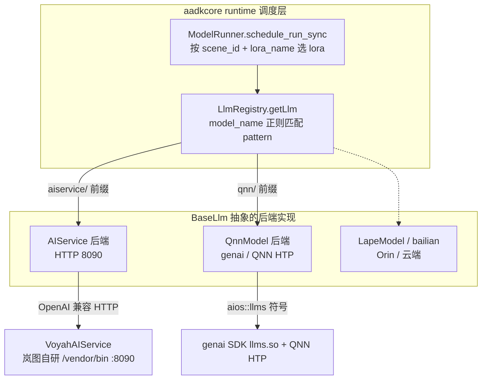
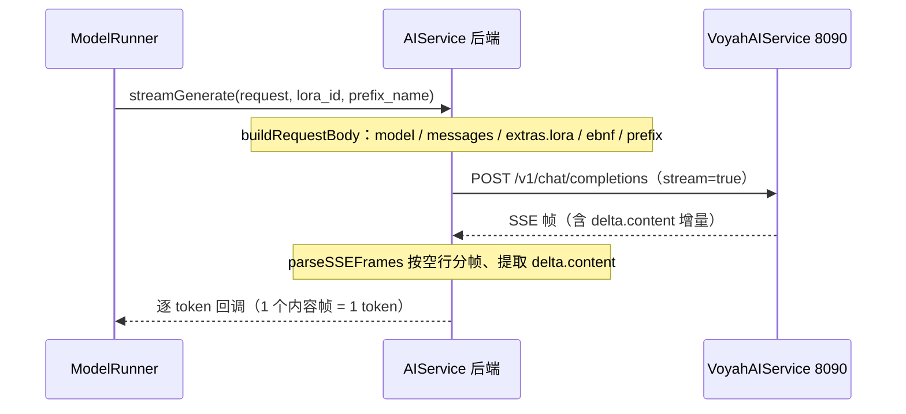

# 岚图 AI Service 后端集成与重构

*多后端兼容架构 · AIService HTTP 后端实现 · 与 genai/QNN 形态解耦 · 上机踩坑复盘*

> [!TIP]
> **本篇讲什么**
>
> 岚图 8397 座舱 VLM 原本跑在高通 GenAI（QNN / `llms.so`）推理框架上。本项目把推理后端切换为**岚图自研的 aiservice 框架**（`VoyahAIService`，本机 HTTP 8090），并把它做成 aadkcore 里一个**可插拔后端**——与 GenAI 后端并存、运行期按模型名切换。
>
> 复盘四条主线：
>
> - 多后端抽象怎么设计
> - aiservice 后端怎么实现
> - 怎么把它从 genai/QNN 形态里解耦出来
> - 一路上机踩到的坑
>
> **代码基线**：aadkcore 仓库 `lantu_aiservice_dev` 分支。核心文件：
>
> - `src/models/aiservice/aiservice.cpp`（501 行）、`include/models/aiservice/aiservice.hpp`
> - `include/models/model.hpp`（BaseLlm 抽象）、`include/models/register.hpp`（LlmRegistry）
> - `src/runtime/model_runner.cpp`（调度）、`runtime/data/config/multi_lora_runtime_config.json`（配置）

> [!IMPORTANT]
> **基线口径（钉死）**：本篇描述的是 **2026-08-11 前缀缓存路径修复之后**的状态（修复提交 `786b01efd`）。注意：本地 / `origin` 上的 `lantu_aiservice_dev` 是 **07-30 的备份快照**（tag `backup/lantu_aiservice_dev-20260730`），**不含**该修复提交——若直接读该快照代码，看到的会是**修复前**的旧逻辑（三跳查表、`prefix_cache_path` 嵌在 ebnf 分支内、`info.json` 试两路径）。本文 3.2 / 3.3 / 3.4 一律按**修复后**口径描述，修复前的旧实现移入对应 CAUTION 作历史 bug 记录，勿把两者混读。
>
> **本地复核边界**：本篇引用的**共享基础设施**已对本地树（当前为 genai 形态）复核——`BaseLlm`/`LlmRegistry` 虚接口与注册宏、`model_runner.cpp` 的两级 lora 调度与静默失败路径、`multi_lora_runtime_config.json` 的 7 条 lora 骨架（scene/lora_name/lora_path）、genai 单一消费者 `qnn_model.cpp`。**aiservice 形态特有代码**（`aiservice.cpp` 本体、`http_client.cpp` 的 `streamAsyncRaw` 与超时参数、`prefix_cache_base`/`grammar_root_rules`/`stream`/`ebnf_path` 等 aiservice 形态配置字段）位于 `lantu_aiservice_dev` 分支，本地 checkout 不是该分支，**按 08-11 状态与既有排查记录描述、未逐行本地复核**，引用时注意此边界（各节另有行内标注）。

## 1. 背景与目标

### 1.1 为什么要换后端

原方案用高通 GenAI SDK（`llms.so` + QNN HTP）在端侧直接跑 Qwen3-Omni-4B。

岚图提供了自研的 **aiservice 推理框架**：

- 模型由系统服务 `VoyahAIService`（`/vendor/bin/`，监听 `127.0.0.1:8090`）统一加载与调度
- 业务侧通过 **OpenAI 兼容的 HTTP 协议**调用

换用它的三点动因：

- **职责归位** —— 模型加载、NPU 调度、多客户端并发交给岚图系统服务，我方 SDK 不再直接持有 QNN/genai 运行时
- **解耦交付** —— 业务包不必再打包 146MB 的 `libqnn/` 与整套 genai 依赖，包体大幅瘦身（见第 4 节）
- **协议通用** —— HTTP + JSON 跨语言、可 `curl` 直接联调，评测脚本与上机排查都更顺手

### 1.2 目标与约束

**目标**：新增 aiservice 后端，而**不是替换** GenAI 后端。

- 两者并存、可切换、可回摆
- 不破坏现有 agent_group 场景链路

**约束**：

- 8397 车机资源有限
- `VoyahAIService` 的行为（扫描、装载、计量）我方不可控，只能在客户端侧适配

## 2. 总体设计：多后端兼容架构

### 2.1 一个抽象基类，多个后端实现

aadkcore 把所有推理后端抽象成 `BaseLlm`（`include/models/model.hpp`），统一虚接口（已对本地树复核，共 12 个纯虚函数）：

- 能力与配置：`supported_models` / `initFromConfig` / `addLora`
- 推理三态：`generateContentAsync`（异步 receiver）/ `streamGenerate`（流式回调）/ `generate`(同步补全回调)
- 多模态前处理：`preprocessImage` / `preprocessAudio`
- 生命周期与控制：`is_ready` / `suspend` / `resume` / `stopGenerate`

当前树里的后端实现：

| 后端 | 实现文件 | 推理路径 | 目标平台 | 岚图形态 |
| :--- | :--- | :--- | :--- | :--- |
| **AIService** | `src/models/aiservice/aiservice.cpp` | HTTP → `VoyahAIService` | 岚图自研框架 | ✅ 主用 |
| **QnnModel** | `src/models/qnn/qnn_model.cpp` | `aios::llms::*` → genai SDK + QNN HTP | 高通 8397 | 可关（解耦后剥离） |
| **LapeModel** | `src/models/lape/` | 加载 `vision_engine_path`/`audio_engine_path`（TensorRT engine） | **NVIDIA Orin** | 否 |
| **bailian** | `src/models/bailian.cpp` | 云端百炼 API | 云 | 否 |

> [!NOTE]
> **genai 在全树只有一个消费者**
>
> - `QnnModel`（`qnn_model.cpp`）是唯一 include genai 头、唯一调用 `aios::llms::*` / `aios::aisa::*` 的文件
> - `qnn_model.hpp` 是唯一 include genai 头的文件，且只被 `qnn_model.cpp` include
>
> 这条「单一消费者」事实是第 4 节解耦能干净落地的前提。
>
> **符号计数口径（勿混，已对本地树复核）**：源码层面 `qnn_model.cpp` 里 distinct 的 `aios::llms::*` / `aios::aisa::*` 限定名共 **8 个**——`aios::aisa::{Tensor, ModelFactory, Context, RetCode}` 与 `aios::llms::{Result, RetCode, Prompt, Deepstack}`（`RetCode` 在两个命名空间各一，按全限定名计为 2 个），合计出现 **27 次**。注意树里**没有**独立的 `aios::*::Model` 类型（只有 `ModelFactory::CreateModel` 方法）；`qnn_model.cpp` 另用了 `aios::components::*`（`SetLogger`/`Tensor`/`DataType`/`MemType`），属**另一个命名空间**、不计入这里的 llms/aisa 口径。这与「链接产物 `.so` 里 genai 相关**未定义符号**的计数」是**两个不同口径**：后者需 `nm -D --undefined-only libaadkcore.so` 过滤 genai 符号单独测，本地**待核**（无法构建 `.so`）。引用时请注明是「源码 distinct 名 / 出现次数」还是「.so 未定义符号」。`qnn_model.cpp` 是 genai 后端、两形态共用，上述源码计数在本地 genai 形态树核实；aiservice 分支未独立复核，但该文件不被 aiservice 后端改动，计数应一致。

### 2.2 注册与路由：model_name 前缀决定后端

后端用 `REGISTER_LLM` 宏在**静态初始化期**注册到单例 `LlmRegistry`（`include/models/register.hpp`），登记「**正则 pattern → 工厂函数**」：

```cpp
REGISTER_LLM(AIService, "aiservice/.*");   // aiservice.cpp 顶部
// 展开为一个静态 Registrar，构造时调用
// LlmRegistry::instance().registerLlm("aiservice/.*", [](name){ return make_shared<AIService>(name); });
```

运行期路由：

- `LlmRegistry::getLlm(model_name)` 用 `std::regex_match` 逐个比对 pattern
- 命中即调工厂造实例；全不命中则 `throw std::invalid_argument`
- 配置里 `model_name = "aiservice/qwen3-omni-4b"`，前缀 `aiservice/` 命中 `"aiservice/.*"` → 选 AIService
- 若写 `qnn/...` 则选 QnnModel

> [!TIP]
> **换后端 = 改一个 model_name 前缀**，业务代码零改动。

> [!NOTE]
> **路由正确性依赖 pattern 互斥（`unordered_map` 无匹配次序）**：`LlmRegistry::factories_` 是 `std::unordered_map<std::string, ModelFactory>`，`getLlm` 遍历它、返回**第一个** `std::regex_match` 命中的工厂——而 `unordered_map` 的遍历次序是未指定的。因此「前缀决定后端」的正确性**完全依赖各 pattern 互斥**：当前 `aiservice/.*`、`qnn/.*` 等以互斥前缀区分，任一 `model_name` 至多命中一个 pattern，次序无关紧要。新增后端 pattern 时必须保持前缀互斥——若两个 pattern 能同时匹配同一个名字（如 `aiservice/.*` 与 `.*omni.*`），选中哪个将随哈希表内部次序而变，不可复现。

### 2.3 调度层：scene + lora 两级选择

入口是 `ModelRunner::schedule_run_sync(data_message, request_id, lora_name, …, prefix_name)`（`src/runtime/model_runner.cpp`）。

agent_group 各场景 dispatcher 先在 `DataMessage` 上设好 `lora_name`：

- `dress_detect` → `LORA_CLOTHING`
- `incar_item_detect` → `LORA_NAME`
- `outcar_qa` → 三处分别设

调度层据此两级选择：

1. `is_base_model_name(lora_name)`（空 / `__base__` / `base` / `base_model`）→ 走 scene 默认基模，`lora_id = -1`
2. 否则 `getModelDetailsByScene(scene_id, lora_name)` 查到具体 lora 与 `lora_id`
3. 查不到 → `LOG_E` + `complete_callback("")` + 返回空 `ModelResponse`（**静默失败**，不崩，见 5.4）

选定 lora 后，请求带着 `lora_id` / `prefix_name` 落到 `BaseLlm` 实现（这里是 AIService）执行。



> [!NOTE]
> **「场景默认基模」分支（`lora_id=-1`）在岚图形态无可达调用者，别拿它当「基模路径已覆盖」的证据**
>
> 上面第 1 条 `is_base_model_name(lora_name)`（空 / `__base__` / `base` / `base_model`）→ `lora_id=-1` 这条路径，在岚图 aiservice 形态**实测从未被走到**：2026-08-26 `android_test --agents 100,200,300` 共 **66 次推理，走该分支 0 次**（判总数用 `PERF: ModelRunner::inference leave`，所有路径都打）。原因是三个 dispatcher 全都在 `DataMessage` 上设了具名 `lora_name`（dress_detect=`LORA_CLOTHING`、incar_item_detect=`LORA_NAME`、outcar_qa 三处），`use BASE model`（`__base__` 强制基模）同样 0 次。因此**任何声称「上机验证覆盖了基模路径」的结论都不成立**——该分支只能靠单测 / 构造用例覆盖，不能靠现有上机链路。

## 3. aiservice 后端实现

`AIService` 继承 `BaseLlm`，把每次推理翻译成一次对 `VoyahAIService` 的 HTTP 调用，再把流式响应解析回 token 回调。下面按「初始化 → 请求构造 → 流式解析」三段拆。

> [!NOTE]
> **本节 3.1–3.7 的核实边界**：以下 `aiservice.cpp` 内部逻辑（端点/`api_host_`、`initFromConfig`、`buildRequestBody`、`resolvePrefixCachePath`、`buildOpenAIMessages`、`parseSSEFrames`、未接能力）属 **aiservice 形态特有代码**，位于 `lantu_aiservice_dev` 分支——**需核实（aiservice 分支不在本地）**：本地 checkout 为 genai 形态、无 `src/models/aiservice/aiservice.cpp`，故本节按 08-11 修复后状态与既有上机排查记录描述，未逐行本地复核。可在本地核实的只有其依赖的共享件（`BaseLlm` 接口、`HttpClient` 类名、`multi_lora_runtime_config.json` 的 7 条 lora 骨架）。3.8 的 HTTP 超时参数另有行内标注。

### 3.1 协议与端点

| 用途 | 方法 / 端点 | 说明 |
| :--- | :--- | :--- |
| 推理 | `POST http://127.0.0.1:8090/v1/chat/completions` | OpenAI 兼容；`api_host_` 在构造函数里写死 |
| 装载模型 | `POST http://127.0.0.1:8090/models/load` | body `{"model": service_model_id}`，init 阶段调一次 |

构造与收发：

- 构造时把 `model_name` 的 `aiservice/` 前缀剥掉得到目录名（`qwen3-omni-4b`），`api_host_` 固定本机 8090
- HTTP 用 `src/utils/http_client.cpp` 的 `HttpClient`
  - 非流式：`sendAsync(url, "", body)`
  - 流式：`streamAsyncRaw(url, "", body, chunk_cb)`

> [!NOTE]
> **端点鉴权与隔离**
>
> `VoyahAIService` 绑定 `127.0.0.1`（而非 `0.0.0.0`），外网不可直达，比绑定全网卡更安全。但**车机上任意本地进程仍能打这个消耗 NPU 的端点**——demo 阶段无鉴权（`api_host_` 写死、请求不带 token）；量产靠 SELinux 域隔离：岚图 App 是 system/vendor 应用，普通 `untrusted_app` 域进程受策略限制（参见难点 5.7）。

### 3.2 初始化链路 initFromConfig

`initFromConfig(config_path)` 做三件事（**以下为 08-11 修复后口径**，修复前的 `info.json` 双路径试探见本节末 CAUTION）：

1. **读 runtime 配置** —— 从 `config_path` 父目录找 `multi_lora_runtime_config.json`，按 `current_runtime`（=`8397`）取 `multi_lora.lora` 数组（7 条），逐条收进 `lora_extra_configs_[lora_path]`：
   - `ebnf_path` / `enable_jump_forward` / `lora_alpha`
   - `grammar_root_rules` / `stream`
   - （前缀缓存路径**不再**从这里解析——旧版的 per-lora `prefix_cache_paths` 已废弃，改由 8397 层的 `prefix_cache_base` 统一拼，见 3.4）
2. **解析真实 model id** —— 读 `info.json` **只从 `model_root` 取**（`model_root` 是配置 `8397` 块里跟随的模型根目录，绝对路径；不再像旧版那样依次试 `models/{name}/info.json`、`/AI/{name}/info.json` 两条候选路径），拿 `id` 作为 `service_model_id_`（如 `qwen3_omni`）；读不到则回退用目录名并 `LOG_W`。`ebnf_path` / `prefix_cache_base` 可写**相对 `model_root` 的相对值**（随 OTA 双槽搬家只改配置），绝对值仍原样透传
3. **装载模型** —— `loadModelInService()` 向 `/models/load` POST 一次，把模型挂进服务端

**新增配置字段（08-11 修复引入）**：`8397` 层新增 **`prefix_cache_base`**——前缀缓存根目录（08-20 搬家后为相对 `model_root` 的 `prefix`）。请求侧的 `prefix_cache_path` 由 `prefix_cache_base + "/" + prefix_name` 拼出（见 3.4），不再依赖 per-lora 的 `prefix_cache_paths` 查表。

> [!NOTE]
> **`lora_extra_configs_` 按 `lora_path` 键控——同 adapter 的多条 scene 配置会合并进同一槽（跨 scene 合并语义）**
>
> 收集的键是 `lora_path`（adapter 名），**不是** scene_id。配置里 `cnyb` 被两条目复用——scene 1100（舱内遗留）与 scene 1200（衣着）的 `lora_path` 都是 `cnyb`——于是这两条的字段**合并进同一个 `lora_extra_configs_["cnyb"]`**：
>
> - `grammar_root_rules` 按 key 合并 → 合并后同时含 `cnyb-child`/`cnyb-left`（来自 1100）与 `cnyb-cloth`（来自 1200）三条规则
> - `stream` 覆盖语义：**1200（衣着）条目没写 `stream`，会继承 1100（舱内）条目的 `stream:false`**——即 `stream_override=false` 从舱内条目「串」到了衣着场景。改任一 scene 的 `stream` 时要意识到它其实作用在整个 `cnyb` adapter 上
>
> 这是「按 adapter 而非按 scene 存配置」的固有语义，新增 scene / 调整 `stream` 前先想清楚合并后果。

> [!WARNING]
> **`config_path` 是承重字符串，但缺斜杠会静默失效**
>
> `initFromConfig` 只对 `config_path` 取 `parent_path()`（纯词法）来定位配置目录：
>
> - 写 `config/`（带尾斜杠）→ `parent_path` 退回目录本身，**正常**
> - 写 `config`（少斜杠）→ 退到上一层，`multi_lora_runtime_config.json` 找不到 → 只 `LOG_W` 后 **early return**
>
> 后者症状：lora / ebnf / prefix 全部静默失效，请求照发但约束解码与前缀缓存都不生效。

> [!CAUTION]
> **历史 bug（08-11 已修）：`info.json` 曾依次试两条候选路径**
>
> 修复前 `initFromConfig` 读 `info.json` 是**依次试** `config_path` 上两层的 `models/{name}/info.json` 与硬编码的 `/AI/{name}/info.json`——把模型根目录的一半写死进了 C++，与难点 5.2「绝不把绝对路径写进 C++」的原则冲突，且 OTA 双槽搬家时会指错。08-11（`786b01efd`）改为**只从配置跟随的 `model_root` 取**，搬家从此是改一行配置。

### 3.3 请求构造 buildRequestBody

`buildRequestBody(request, stream)` 拼出 OpenAI 风格 body。字段与附加条件：

| body 字段 | 值 / 来源 | 何时附加 |
| :--- | :--- | :--- |
| `model` | `service_model_id_` | 总是 |
| `messages` | `buildOpenAIMessages(request)` | 总是 |
| `stream` | `actual_stream` | 总是 |
| `stream_options.include_usage` | `true` | `stream=true` |
| `response_format` | `{"type":"json_object"}` | **仅**无 EBNF 且 `mime=application/json` |
| `extras.lora` | `{lora_adapter, lora_alpha}` | 有合法 `lora_id` |
| `extras.ebnf_path` / `enable_jump_forward` / `grammar_root_rule` | 配置 | 有 `ebnf_path` **且** prefix 在 `grammar_root_rules` |
| `extras.prefix_cache_path` | `prefix_cache_base + "/" + prefix_name`（**与 ebnf 解耦**，08-11 修复后） | prefix_name 非空**且**本地文件存在即附加——**11 个 prefix 全部附加**，不再受 ebnf/grammar 门控（见 3.4） |
| 采样参数（`temperature`/`top_p`/`max_tokens`/`seed`/`*_penalty`） | — | **永不**（刻意注释禁用） |

两处刻意设计：

- **采样参数全部禁用** —— 对齐服务端测试脚本行为；服务端用 `config.json` 里自己的 constrained_decode 采样配置，客户端再传反而打架
- **`response_format` 仅在无 EBNF 时加** —— 有 EBNF 语法约束时若再附加 `json_object`，服务端 vendor784 compact 会超 token 预算而失败

> [!NOTE]
> **EBNF 为什么要按 prefix 门控**
>
> 同一个 lora 下不同阶段（prefix）约束需求不同：
>
> - 舱外问答的结构化阶段 → 要 grammar 约束 JSON 外壳
> - znzs caption 阶段 → 不该被约束
>
> 若不看 `prefix_name` 一律附加 EBNF，服务端会回退到文件顶层 `root` 规则去**误约束** caption 输出。所以用「prefix 是否在 `grammar_root_rules` 里」做闸门，没有的 prefix 保持无约束。

### 3.4 前缀缓存路径解析 resolvePrefixCachePath

**现行逻辑（08-11 修复后）**：前缀缓存路径直接由 `prefix_cache_base`（8397 层的前缀缓存根目录，见 3.2）与请求的 `prefix_name` 拼出，**与 ebnf / grammar 解耦**：

```
prefix_cache_path = prefix_cache_base + "/" + prefix_name
```

- 仅当 `prefix_name` 非空**且本地存在性检查通过**才附加；否则返回空（不附加 `prefix_cache_path`）
- 11 个 prefix 名与设备 `prefix/` 目录 1:1 对应 → **11 个 prefix 全部能拿到 `prefix_cache_path`**（08-11 终态实测 66/66 请求都带、0 条漏，见 6.1）
- 不再走旧版的「三跳查表」、也不再受 ebnf 门控——无 grammar 的 caption / nlg 阶段同样能拿到 prefix

> [!CAUTION]
> **历史 bug（08-11 已修）：prefix 曾是三跳查表、且写入嵌在 ebnf 分支里**
>
> 修复前 `resolvePrefixCachePath` 是**三跳查表**，任一跳缺失即返回空（不附加 `prefix_cache_path`）：
>
> ```
> lora_id → lora_extra_configs_[lora] → grammar_root_rules[prefix_name] → prefix_cache_paths[root_rule]
> ```
>
> 两处结构错误：
>
> - `prefix_cache_path` 写入嵌在 ebnf 分支内 → 无 grammar 的 caption/nlg 阶段永远拿不到
> - `prefix_cache_paths` 用 `grammar_root_rule` 做键 → dwsr/dwbs 都映射到 smgsr 无法区分
>
> 已改为 `prefix_cache_base + "/" + prefix_name`、与 ebnf 解耦、加本地存在性检查（即上方现行逻辑）。
>
> 另：`ebnf_path` 的存在性检查**只告警不清空**——清空会翻转 `has_ebnf` 从而附加 `response_format`，改变请求形状。

> [!WARNING]
> **两条已知未解决项（与 prefix / grammar 文件相关）**
>
> 1. **`stream=false` + prefix 会坏（独立问题，未复查、未解决）**：非流式路径叠加前缀缓存时结果异常，当前上机链路靠 `cnyb` 的 `stream:false`（见 3.2 合并语义）与 prefix 同存，但该组合未被系统性复查；改 stream 行为或排查非流式结果异常时须先怀疑这条。
> 2. **模型包升级会改名 / 删除 grammar 文件，配置旧文件名只告警、约束解码静默失效**：实测 260805 模型包相对 260625 把 `incabin_mm_sf_0420.txt` 改名为 `0527.txt`、并**移除了 `schema_nlg.txt`**。SDK 配置里若仍写旧文件名，`ebnf_path` 存在性检查**只 `LOG_E` 告警、不清空也不报错**（见上方 CAUTION），请求照发但**约束解码静默不生效**——症状是「输出格式突然不受约束」而非崩溃。换模型包后必须核对 grammar 文件名是否随之更新（与难点 5.5「grammar 是否真生效」是同一类排查）。

### 3.5 消息与多模态编码 buildOpenAIMessages

转换顺序：

1. 先放 system instruction
2. 再把 `history + 当前 messages` 合并逐条转换

每条消息按 content 类型分流：

| content 类型 | 编码结果 |
| :--- | :--- |
| 纯文本 | `content` 为字符串 |
| 含图 | `content = {question, image}`；**多图拆成多条 user message**（每条带同一 text prompt） |
| 含音频 | `content = {question, audio}` |

图像 / 音频统一编码成 base64 data URI：

- `encodeImageData`
  - jpeg/png → 直接 base64
  - 裸像素 → 按 `resized_width/height` 走 `qwen2_vl_processor::resize_with_padding_1024x768` letterbox 缩放
  - 编成 `data:image/{bgr|rgba};width=…;height=…;channels=…;base64,…`
- `encodeAudioData`
  - int16 PCM → `data:audio/wav;base64,…`

### 3.6 流式解析 parseSSEFrames 与 token 计量

`streamGenerate` 流式路径：

1. 按 lora 的 `stream_override` 定 `actual_stream`
2. `buildRequestBody` 后 `streamAsyncRaw` 拉流
3. 每个 chunk 进 `parseSSEFrames`，用 `tracked_cb` 累计回调次数与字节数

`parseSSEFrames` 要点：

- **按 `\n\n` 分帧** —— 用 `sse_buffer_` 累积，对 TCP 粘包/半包免疫；流结束后若 buffer 非空，补 `\n\n` flush 一次
- **多 `data:` 行拼接** —— 一帧内多个 `data:` 按 SSE 规范拼接；遇 `[DONE]` 收尾
- **取增量** —— 解析 JSON 后取 `choices[0].delta.content`（非流式取 `message.content`），非空才回调



> [!NOTE]
> **服务端无 token 计量，靠数回调次数兜底**
>
> 服务端计量的三个缺口：
>
> - 非流式 `usage` 恒 0（`input_tokens` 客户端不可得、本地也无 tokenizer）
> - `max_tokens` 被忽略
> - 无 `/metrics` 端点
>
> 但 **1 个 SSE 内容帧 = 1 个 token**，`tracked_cb` 数回调次数即 `output_tokens`——当前唯一可靠的产出计量口径。
>
> ⚠️ 这是**当前 VoyahAIService 版本的实测行为**（生产帧内容均为单个 BPE token：单个汉字 / 短 subword / 单个数字，最长 10 字节、从不含短语），**不是 SSE / OpenAI 协议的普遍保证**。服务端若升级为多 token 合帧或半 token 拆帧，此口径即失效，升级后需重新校验。

### 3.7 未接的能力

- `stopGenerate()` 恒 `return false`（空实现）
  - 服务端其实已支持打断与优先级：`POST /responses/{id}/cancel`、`extras.priority ∈ low|normal|high|critical`（仅 `critical` 抢占）
  - 要接打断就是接这套
- `generateContentAsync()` 返回一个已 close 的空 receiver，本形态不走它

### 3.8 HTTP 一跳的失败面与开销量化

aiservice 形态比 genai 进程内直调多一跳本机 HTTP。这一跳既是开销来源，也是失败面。

**失败面与已知处理**：

| 失败 | 已知行为 | 超时/重试（`src/utils/http_client.cpp`，aiservice 分支口径；本地核实边界见下 WARNING） |
| :--- | :--- | :--- |
| 连接拒绝（服务未启动 / 重启中） | init 阶段 `loadModelInService` 只向 `/models/load` POST 一次 | `CURLOPT_CONNECTTIMEOUT=10s`；**无退避重试**（只 POST 一次，失败即抛错） |
| 推理超时 | — | 非流式 `CURLOPT_TIMEOUT=120s`（总超时）；流式路径不设总超时，靠低速断流兜底 |
| 流中断 | `parseSSEFrames` 在流结束时对非空 `sse_buffer_` 补 `\n\n` flush 一次（3.6） | 流式 `CURLOPT_LOW_SPEED_LIMIT=1 B/s` + `CURLOPT_LOW_SPEED_TIME=60s`（60 秒收不到 ≥1 字节即中止）；**无自动重连/续传** |
| 空答案（prompt 过长） | 服务端回 `finish_reason:"length"` + 0 个内容 token 且无 error；`finish_reason` 目前被 `parseSSEFrames` 丢弃（免费可得、未接的诊断信号） | — |

> [!WARNING]
> 难点 5.8 的 **50ms 超时在旧 UDS/NPU 注册通道**（`/tmp/voyah_qnn_service.sock`），**不在 HTTP 推理路径上**。HTTP 路径的超时此前已对 `src/utils/http_client.cpp`（`lantu_aiservice_dev` 分支）核实：connect 10s、非流式总超时 120s、流式低速断流 1 B/s × 60s，且**两条路径均无自动重试**——连接拒绝/断流后直接失败上抛，重试与否由调用方决定。
>
> ⚠️ **需核实（aiservice 分支不在本地）**：上述超时参数与 `streamAsyncRaw` 接口是 `lantu_aiservice_dev` 分支的 `http_client.cpp` 形态，本地 checkout（genai 形态）的同名文件是**较旧变体**——只有 `sendAsync` / `streamAsync`（`streamAsync` 在 chunk 级粗暴剥 `data: ` 前缀、非按帧解析），且**未设任何 `CURLOPT_*TIMEOUT` / `LOW_SPEED_*` 选项**。故本表的超时数值无法在本地复现核对，以 aiservice 分支为准；下次能 checkout 该分支时应重新逐行核实。

**单独量化这一跳开销的方法（loopback 空载基线）**：

两形态端到端差值不能直接归因给 HTTP 一跳（见 5.3：两形态是不同模型包）。要单独量化这一跳：

1. **空载 RTT 基线**：用 `curl -w '%{time_connect} %{time_starttransfer} %{time_total}'` 打一个不触发推理的最小请求（如 `GET /v1/models`），量 loopback 上 TCP 连接 + HTTP 往返耗时——这是 HTTP 一跳固定开销的下界
2. **从端到端里减**：aiservice 形态 `infer_total` 减去该下界，剩余 ≈ 服务侧调度 + prefill + decode
3. **同模型包 A/B**（真正的纯后端对比）：两形态用同一模型版本生成的包，端到端差值才是后端架构开销（HTTP 一跳 + 服务侧调度 vs 进程内 QNN 直调）

方法 1/2 随时可做；方法 3 的前提（同一模型包）尚不具备，是跨形态对比的已知缺口（见 5.3 与 [GenAI vs AIService 选型决策与端到端对比](genai-vs-aiservice.html)）。

## 4. 重构：与 genai/QNN 形态解耦

换后端不只是加一个类，还要让「aiservice 形态」能**不背 genai/QNN 那套依赖**独立构建。做法是把两个后端各自收进一个编译开关。

### 4.1 双开关，各管四层

| 开关 | 管的后端 | 源码 | 链接 | CMakeLists |
| :--- | :--- | :--- | :--- | :--- |
| `ENABLE_AISERVICE_MODEL` | AIService | `http_client.cpp` + `aiservice/aiservice.cpp` | `curl` | L141 / L370 |
| `ENABLE_QNN_MODEL` | QnnModel（genai/QNN） | `add_subdirectory(src/models/qnn)` + 强制 `ENABLE_PREPROCESSOR=ON` | genai 库（aisa/llms/qnn_backend）+ `libqnn/` install | L29/46/167/496 |

两个开关**正交**：

- `build_8397_android.sh` 当前把两个都设 `ON`（L43 / L62）
- 默认 8397 构建两个后端都编进去，运行期靠 `model_name` 前缀二选一
- 要出「纯 aiservice 瘦身包」就把 `ENABLE_QNN_MODEL=OFF`

### 4.2 关掉 QNN 的收益

`ENABLE_QNN_MODEL=OFF` 后，genai/QNN 整条依赖被剥离（`libqnn/` 那 146MB 从来只是被 `dlopen`、真建 QNN 模型时才用）：

| 指标 | QNN=ON | QNN=OFF（aiservice 形态） |
| :--- | :--- | :--- |
| 包体 | 378 MB | **222 MB** |
| 文件数 | 121 | 74 |
| `lib/` | 18 | 10 |
| `models/template` | 20 | 4 |

> [!TIP]
> **回摆成本 = 改一个 flag**
>
> 以下都**原地保留**、没有删码：
>
> - `third_party/genai_sdk/`
> - `src/models/qnn/`、`include/models/qnn/`
> - 全部模板文件
>
> 要从 aiservice 形态切回 genai 形态，把 `ENABLE_QNN_MODEL` 改回 `ON` 重新构建即可。解耦的是「构建期是否编入」，不是「代码是否存在」。

### 4.3 一个自愈的链接细节

- 旧 `libaadkcore.so` 有 5 个未定义的 `std::__fs::filesystem` 符号，靠 `libllms → libc++_shared` 在加载期兜底
- genai 撤掉后，链接器转而从静态 libc++ 补进 18 个，未定义数归 0 → 不会 `cannot locate symbol`
- 教训：这类「靠第三方库间接兜底」的依赖是真会咬人的，解耦时必须显式核 `DT_NEEDED` 与未定义符号

## 5. 难点与踩坑

下面 8 条是上机与联调里真实卡过、且根因都在「看起来像我们的代码坏了」层面的坑。先给速览，再逐条「现象 → 根因 → 解决」。

| # | 难点 | 类别 | 一句话根因 |
| :--- | :--- | :--- | :--- |
| 5.1 | 效果对齐 | 请求格式 | 三场景请求体形状不同，判据要抄参考实现 |
| 5.2 | 模型生效陷阱 | 服务端行为 | 扫描根硬编码 + 只启动时扫，`loaded` ≠ 生效 |
| 5.3 | 跨形态对比 | 模型包 | 两形态是两个不同模型包，差异非后端数值 |
| 5.4 | 静默失败 | 运行期 | `getLlm` throw 被 catch 成 `LOG_E` + 返回空 |
| 5.5 | 舱外错乱 | 约束解码 | grammar 只约束外壳却让流式与解析错位 |
| 5.6 | TTFT 口径 | SSE | 开场帧是「已受理」非「prefill 完成」 |
| 5.7 | SELinux | 上机环境 | `/AI` 标签不允许 `untrusted_app` 域访问 |
| 5.8 | 槽位泄漏 | 服务端 bug | 断连不回收 client_id，阈值 5 |

### 5.1 效果对齐：三场景请求体形状不同

**现象**：同一套 SDK，三场景效果对不齐参考实现。

**根因**：三场景请求体形状不一致——

| 场景 | 请求体形状 | 关键差异 |
| :--- | :--- | :--- |
| Agent100（舱外车辆） | `{"body":{"request_id","timestamp","car_signal":{...}}}` | 有 `body` 包装 |
| Agent200（衣着/空调） | `{"request_id","timestamp","voice_zone":N}` | **`voice_zone` 只读顶层**、无 `body` 包装 |
| Agent300（舱外问答） | `{"body":{"request_id","camera_id","timestamp","query":...}}` | 有 `body` 包装 |

**解决**：

- 判据必须抄参考实现 `example/src/android_sdk_test.cpp` 的 `content[...]` 赋值
- **不能抄 app 校验代码读的位置**（app 那处只打日志校验，SDK dispatcher 拿不到）
- `presure` 是上游拼写（一个 s），照抄不要"纠正"

### 5.2 服务端扫描根硬编码 +「模型生效」陷阱

**现象**：模型放了、`GET /v1/models` 也返回 `loaded`，但跑出来还是旧结果。

**根因**：

- `VoyahAIService` 模型扫描根**硬编码 `/AI/VLM/models`**
- 且**只在启动时扫描**；旧目录改名后 inode 仍活着，服务端继续服务旧包
- `loaded` 不等于「新模型已生效」

**解决**：

- 上机前先 `curl /v1/models` 确认服务端能看到模型
- 换包后 `setprop ctl.restart vendor.VoyahAIService` 再 `POST /models/load`
- 唯一硬证据是 `/proc/<pid>/maps` 里那 20 个 lora `.bin` 的真实路径
- 我方靠配置 `model_root` 跟随，**绝不把绝对路径写进 C++**（服务端有 OTA 双槽 `models_new/_old`）

### 5.3 跨形态结果不可直接对比

**现象**：想拿 genai 形态输出当 aiservice 形态基线对比，差异很大。

**根因**：两形态用的是**两个不同的模型包**——版本、全部 11 个 prefix KV 缓存、LoRA 权重 md5 均不同；输出差异是**模型 build 不同**而非后端数值差异。

**解决**：

- 不要跨版本移植 prefix KV 来"对齐"——KV 是用特定权重预计算的 prefill 状态，混用等于拿可解释差异换不可解释不一致
- 对比必须锁定同一模型包

### 5.4 运行期失败是静默的

**现象**：每个场景都返回空，但不崩、没有明显报错。

**根因**：

- `LlmRegistry::getLlm` 匹配不到 pattern 会 `throw`
- 但 `model_runner.cpp` 把它 catch 成一条 `LOG_E` 就 `return false`
- 而 `init_system_agent` 不看返回值 → 症状是「每场景返回空」而非崩溃

**解决**：在构建期加配置硬闸（`runtime/CMakeLists.txt` 的 `if(NOT ENABLE_QNN_MODEL)` foreach 里要求 `model_root` 必须存在且绝对），把「运行期静默空」前移成「配置期硬失败」。

### 5.5 约束解码（stage3 grammar）缺失致舱外错乱

**现象**：舱外问答结果错乱，长期被误判为「模型幻觉」。

**根因**：

- `multi_lora_runtime_config.json` 给 `visual_assistant` 挂了 `schema_nlg.txt` + `enable_jump_forward:true`
- 该 grammar 只约束外壳 `root ::= "{\"nlg\":" basic_string "}"`、不约束内容
- 却让流式输出与 `outcar_qa_dispatcher.cpp` 的 `extract_nlg` 解析错位
- QNN 后端未实现约束解码时，缺 EBNF 仅 warn 后**静默降级**继续

**解决**：

- A/B 实测——带 grammar 只有 2/17 是完整句子，去掉后 17/17 干净
- 已从配置移除该 grammar
- 「结果不对」类问题排查要先确认 grammar 是否真正生效

### 5.6 SSE 解析与 TTFT 口径

**现象**：TTFT 统计与预期对不上。

**根因**：SSE 开场帧（`delta:{"role":"assistant"}`）标记的是「服务端已受理」**而非 prefill 完成**。

**解决**：

- TTFT 可拆成「受理 + prefill」两段分别看
- `parseSSEFrames` 按 `\n\n` 切帧，对 TCP 粘包免疫，解析层不是瓶颈

### 5.7 SELinux（APK 侧上机第一坑）

**现象**：APK 侧只有一句 Java `Model directory NOT FOUND`，极易误判成「模型没放好」。

**根因**：`/AI` 标签 `u:object_r:AI_file:s0`，策略不允许 `untrusted_app` 域 search/getattr。

**解决**：

- demo 需 `setenforce 0`（重启失效）
- 量产岚图 App 是 system/vendor 应用，不受此限

### 5.8 客户端槽位泄漏（服务端 bug）

**现象**：连开第 6 个测试进程起，服务端只 accept 不回 RegisterResponse，客户端 50ms 超时 → `Failed to request NPU access` → 启动即退只有 5 行日志。

**根因**：

- 走老通道 `/tmp/voyah_qnn_service.sock`，每个进程占一个 client_id
- **断连后服务端不 close fd、不回收槽位**（阈值 5）

**解决**：

- 需求变更要求停用 VoyahAIProxy / NPU 资源 / profile 同步四个接口
- 不再 `createProxy()` → 不连 UDS → 不占槽位
- 回归实测服务重启后连开 10 个进程 10/10 通过

## 6. 验证与结果

本节给 **aiservice 形态自身**的验证结果（效果一致性 + 性能口径）。GenAI / AIService 两形态的端到端耗时横向对比与多维选型决策，见独立篇 [GenAI vs AIService 选型决策与端到端对比](genai-vs-aiservice.html)。

### 6.1 效果验证

**三链路跑通率**（`android_test --agents 100,200,300`，11 个 prefix 全开）：

| 日期 | Agent100 | Agent200 | Agent300 | 备注 |
| :--- | :--- | :--- | :--- | :--- |
| 2026-08-07 | 7/7 | 4/4 | 17/17 | 上机首次全通 |
| 2026-08-11 | 7/7 | 4/4 | 17/17 | prefix 缓存修复后终态；66/66 请求都带 `prefix_cache_path`（0 条漏） |

**对供应商最新 BanmaExample**（16 可比例）：

- stage1 原始 `bbox_2d`：**16/16 逐字节同**
- stage2 / stage3：**各 15/16**
- 唯一分歧 `animal_0`：stage1 输出与对方完全相同，差异出在我方 `outcar_process.hpp` 对「动物」的 `min 80×80` 门限（实测 83×68px）触发 `clear_bbox` 并跳过 stage2——**已确认以我方为准，属设计差异非回归**

> [!NOTE]
> **供应商对比的覆盖边界**：上面的 BanmaExample 对比**只覆盖 Agent300（舱外问答）链路**；**Agent100 / Agent200 从未与供应商示例做过对照**，它们只有「对我方历史基线」的对比（见下）。因此「与供应商一致」这一结论**不能外推到 Agent100/200**——这两条链路目前只有我方自洽证据。

**对我方 08-07 基线**（08-11 终态）：Agent100 逐字段全同、Agent200 语义全同（仅 `*_conf` 抖动）、Agent300 16/17 全同（唯一变化「交通标志→交通标识」，且与参考实现一致）。

**确定性**：同配置 Agent300 连跑两轮，stage1/2/3 **17/17 逐字节同**，仅 `confidence` 展示值抖动。

> [!NOTE]
> stage3 grammar 的 A/B 实测（带 grammar 仅 2/17 完整句子 → 去掉后 17/17 干净）见难点 5.5；那是「结果错乱」类问题的定位证据，不计入上表的一致性跑通率。

### 6.2 性能验证

**TTFT 分解**（2026-08-18 上机实测，只改 prompt 长度；横轴为**字数**，非 token 数）：

| 段 | 15 字 | 415 字 | 2015 字 | 行为 |
| :--- | :--- | :--- | :--- | :--- |
| 请求 → 开场帧（受理） | 26–36ms | 26–36ms | 26–36ms | 与 prompt 长度无关 |
| 开场帧 → 首内容 token（prefill） | 79ms | 139ms | 539ms | 随 prompt 长度**近似线性、分段斜率**（见下 NOTE） |

即 TTFT 可拆成 `受理` + `prefill` 两段；开场帧（`delta:{"role":"assistant"}`）标记「服务端已受理」而非 prefill 完成（详见难点 5.6）。

> [!WARNING]
> **此表用「字数」而非 token 数，缺 token 数与 MFU 假设无法判断合理性**
>
> - **分段斜率（不是严格线性）**：prefill 段 15→415 字斜率 ≈ `(139−79)/(415−15) ≈ 0.15 ms/字`；415→2015 字斜率 ≈ `(539−139)/(2015−415) ≈ 0.25 ms/字`——**后段斜率变陡**，故只能说「近似线性 / 分段」，不能说「线性增长」。
> - **token 数待补**：要判断这些 prefill 时间是否合理，必须把字数换成 **tokenizer 实际 token 数**（原始测试 prompt 未在本地留存，**待补**；中文经 Qwen tokenizer 通常 <1 token/字，字数会高估 token 数）。
> - **roofline 互核（方法，链 [LLM 推理原理 · Roofline（§2）](../../general/infer-principles.html)）**：`prefill 吞吐 = token 数 ÷ prefill 时间`，`有效算力 ≈ 2N × 吞吐`（N≈4B）。若**粗暴按「字数≈token 数」、取纯 prefill 时间**折算：415 字 ÷ 139ms ≈ **3000 tok/s**、2015 字 ÷ 539ms ≈ **3700 tok/s**（即 ~3000–3700 tok/s），有效算力 ≈ 2×4×10⁹×(3000~3700) ≈ **~24–30 TFLOPS**，已逼近通识层 FP16 峰值（常见 ~35 TFLOPS、保守 ~17，见 [原理篇 §2.2](../../general/infer-principles.html)）——对应 MFU 高达 **~0.7–0.9（对常见 ~35）**，对保守 ~17 则**已 >1（物理不可能）**，远超 prefill 典型的 0.2~0.4。这说明**要么字/token 折算偏高、要么该段计时含非 prefill 成分**；在拿到实际 token 数与 MFU 假设前，不能据此表断言 prefill 效率，只能记录现象。

**prefix 缓存提速**（08-11 全开 vs 08-07）：Agent300 **−7.9%**、Agent200 **−10.8%**、Agent100 **−0.1%**（新增 prefix 的 step2 −2.2%）。

**输出 token 计量**：服务端 `usage` 恒 0、`max_tokens` 被忽略、无 `/metrics`（详见 3.6）；当前唯一可靠口径是 **1 个 SSE 内容帧 = 1 个 token，数 `tracked_cb` 回调次数**（该口径绑定当前服务端版本，升级后需重新校验）。

**逐场景端到端耗时**（`infer_total`，2026-09-16，9 场景 28 用例）：见 [GenAI vs AIService 选型决策与端到端对比](genai-vs-aiservice.html) 的 aiservice 列。

> [!WARNING]
> **逐阶段（stage1/2/3）TTFT/TPS/tokens 分解：待补**
>
> `performance_test_result.xlsx` 现有逐阶段分解只覆盖 **GenAI 形态**（见《效果及性能测试（GenAI 方案）》第四节）；**aiservice 形态**的逐场景逐阶段分解尚未整理。缺口在于：服务端不提供逐阶段计时（无 `/metrics`、响应头无计时字段），需客户端在 stage1/2/3 三个 dispatch 点分别埋点聚合后才能给出。

## 7. 经验教训

1. **「看起来是我们代码坏了」的三类问题**（扫描根硬编码、槽位泄漏、grammar 错位）各花了一轮排查——先怀疑环境/服务端行为，再怀疑自己的代码
2. **别把服务端 bug 硬编成自洽解释**：`znzs-nlg` 退化当时若硬编一个「必须加阶段间隔」的规避，就会把一个服务端 bug 变成我方永久的错误规避；交出最小复现用例（两条 curl）让上游定位才是正解
3. **静默失败比崩溃更难查**：运行期 `LOG_E + return false` 会让「每场景返回空」毫无指向性，能用构建期硬闸前移的就前移
4. **承重字符串要核到底**：`config_path` 少一个斜杠、`model_root` 写进 C++、模板读 SDK 副本还是模型包副本——这类「路径/字面量」失配是端侧集成的高发根因
5. **解耦要核依赖闭包，不能只看能不能编过**：靠第三方库间接兜底的未定义符号、纯白链的 `DT_NEEDED`、被解引用成实体的符号链接，都要在剥离后逐项核
