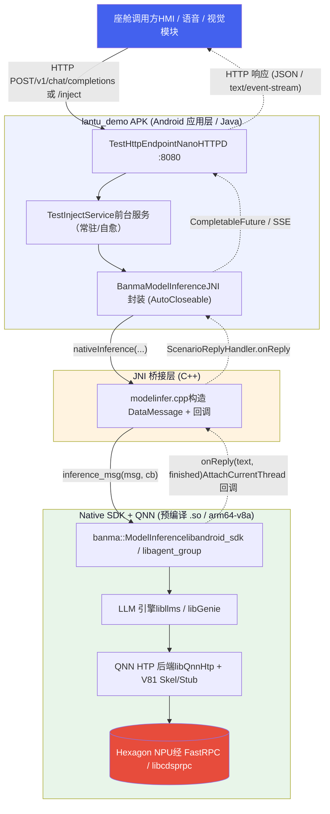
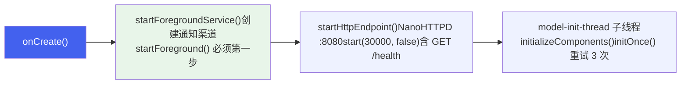
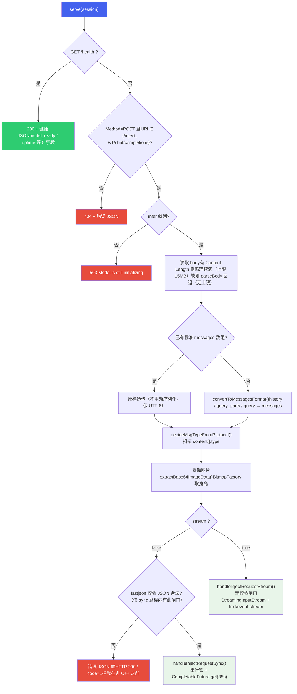
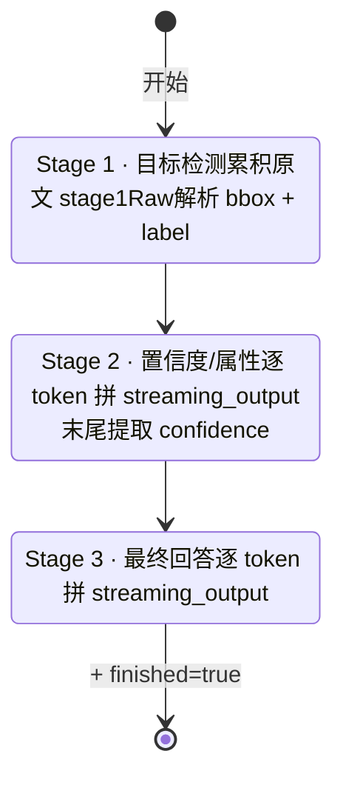
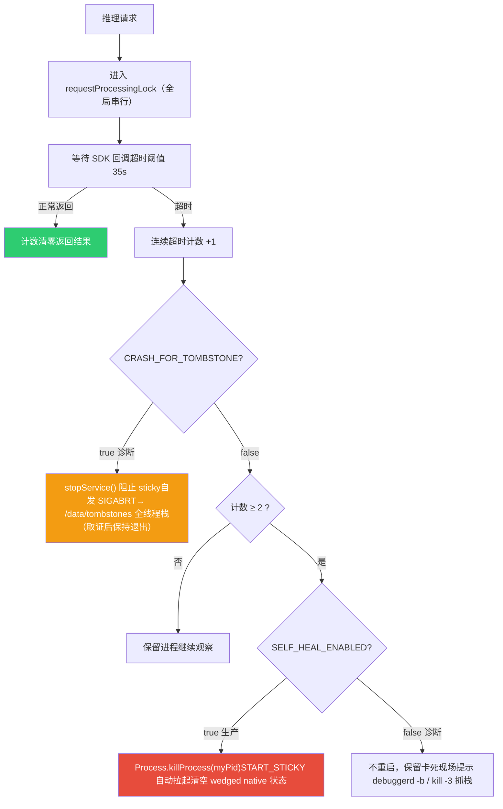
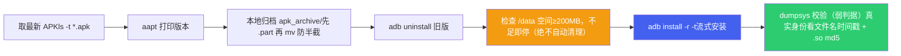

# APK 集成与端侧服务化

*lantu\_demo 宿主 APK  |  Qwen3-Omni-4B + LoRA · JNI 桥接 · 本地 HTTP 服务 · 前台服务自愈*

> [!TIP]
> **本篇讲什么**
>
> 前面两篇 [GenAI 方案架构总览](genai-architecture.html) 与 [AIService 后端集成与重构](aiservice-integration.html) 讲的是**两种并列的推理后端**。本篇切换到 **应用层视角**：这些 `.so` 如何被一个可安装、可常驻、可被座舱其他组件调用的 **Android APK**（`lantu_demo`，包名 `com.example.myapplication`）封装起来，并以 **本地 HTTP 服务**的形式对外提供大模型推理能力。**APK 是通用宿主**——GenAI / AIService 两种后端共用同一套 APK 框架，只需替换其中集成的 native `.so`（本篇以 GenAI 后端的 `.so` 为例）。这是从「SDK 能跑」到「产品能交付」的最后一公里。
>
> **代码基线**：`lantu_apk` 仓库（GenAI 形态分支 `sdk-genai-qnn246`、AIService 形态分支 `sdk-aiservice`）。核心文件：
>
> - Java：`app/src/main/java/com/example/myapplication/{MyApplication,TestInjectService,TestHttpEndpoint,BanmaModelInference,NativeEnv}.java`
> - C++：`app/src/main/cpp/modelinfer.cpp`、`include/{data_message,model_inference}.h`

## 1. 定位与整体架构

### 1.1 APK 的角色

`lantu_demo` 不是一个独立训练或推理引擎，而是一个 **宿主容器（host）**。它的职责是：

| 职责 | 说明 |
| :--- | :--- |
| **加载并初始化 native SDK** | 按正确顺序加载 `libcdsprpc.so`、`libmodelinfer.so` 及全部 QNN/LLM 依赖，设置 DSP 运行环境 |
| **常驻后台** | 以前台服务（`dataSync` 类型 + `START_STICKY`）形式存活，被杀后自动拉起 |
| **服务化对外** | 在设备本地 `0.0.0.0:8080` 起一个 HTTP 服务（demo 姿态，见下方警示），座舱 HMI / 语音 / 视觉等模块通过 HTTP 调用大模型 |
| **协议适配** | 兼容 OpenAI 风格 `/v1/chat/completions` 与自定义 `/inject` 协议，并完成多模态消息的类型判定与格式转换 |
| **稳定性兜底** | 串行化请求、超时检测、native 卡死时进程级自愈重启 |

> [!WARNING]
> **`0.0.0.0:8080` 是 demo 阶段的选择，车规安全视角是硬伤**
>
> 绑定 `0.0.0.0` 意味着**所有网络接口**——车机同网段的任意设备都能访问这个消耗 NPU、可被任意 payload（有 Content-Length 时上限 15MB，见 5.1）打、且承载舱内图像的推理端点，而端点**没有任何鉴权**。更糟的是 **SSE 响应带 `Access-Control-Allow-Origin: *`**（sync / health 路径没有）——叠加 `0.0.0.0` 无鉴权，**任何可达车机网络的网页都能跨源驱动并读取这个推理端点**（浏览器里一段 JS 就能发请求、读流式输出）。demo 期为联调方便（任意主机 curl 直连 / `adb forward`）可以接受；**量产必须收敛**：
>
> ① 绑定改回环 `127.0.0.1`（座舱调用方本就同机，回环绑定不影响 `adb forward` 联调）；② 确需跨主机访问时加鉴权（token / mTLS）；③ 用 SELinux 域策略限制可达该端口的进程；④ 去掉 SSE 的 `Access-Control-Allow-Origin: *` 通配（或收敛到白名单源）。
>
> 对比：aiservice 形态的 `VoyahAIService` 绑定 `127.0.0.1:8090`，两形态的网络安全姿态**不一致**，迁移时应以回环绑定为基线。详见 [运维、安全与功能安全](ops-security.html) 的 5.3 节。

它承载的模型是 **Qwen3-Omni-4B**（内部定制型号 `qwen3-omni-4b`，INT4 量化 + 场景 LoRA）。模型文件不打包进 APK，而是放在车机固定路径下，且**分两个根目录**：运行时配置/模板根 `/AI/vllm_sdk/models`（`init()` 的入参）与模型权重/Context Binary 根 `/AI/VLM/models/qwen3-omni-4b`。genai 形态经 `multi_lora_runtime_config.json` → `model_config` → `qwen3-omni-4b_8397.json` 的 `model_path`（**绝对路径**）定位权重，**不是** `model_root` 相对跟随（那是 aiservice 形态机制）；`veg_params` 还引用第三个根 `/AI/VLM/models/raw_src/`。谁读谁、权威目录树见 3.3 节与 [设备部署与上车流程](device-deployment.html) 的 2.2 节。

### 1.2 端到端调用链

一次完整的推理请求，从座舱组件发起到拿到结果，穿越三个层次：



> [!NOTE]
> **为什么是 HTTP 而不是 AIDL/Binder？**
>
> 座舱内跨域调用方语言/进程各异（Android 应用、Linux 服务、Python 评测脚本），HTTP + JSON 是最大公约数：无需共享接口定义、跨语言、便于用 `curl` 直接联调与自动化评测。代价是序列化开销，但相对大模型动辄数百毫秒到数秒的推理耗时，HTTP 开销可忽略。

## 2. 三层结构详解

### 2.1 Android 应用层（Java）

全部位于 `app/src/main/java/com/example/myapplication/`，各组件职责如下：

| 类 | 类型 | 职责 |
| :--- | :--- | :--- |
| `MyApplication` | Application | 进程级初始化：按序加载 native 库、设置 `ADSP_LIBRARY_PATH`（早于任何 Activity/Service） |
| `MainActivity` | Activity (Launcher) | 界面入口；只负责拉起前台服务（`startForegroundService`）。native init 统一收敛到 `TestHttpEndpoint.initOnce()` 单点（2026-08-17 修复此前 MainActivity / Service 各 init 一次、两个 handle 争抢 NPU 的问题，见 4.2）；UI 推理路径默认注释，仅作演示 |
| `TestInjectService` | Service (foreground) | 常驻前台服务；持有推理实例与 HTTP 端点；`START_STICKY` 自愈。（类内 `ConcurrentLinkedQueue`/`triggerLock`/`processQueue` 是**历史遗留死代码**，从不入队、`triggerProcessingSafely` 无调用者；真正的串行在 HTTP 层，见 4.3） |
| `TestHttpEndpoint` | NanoHTTPD | HTTP 服务核心（约 2200 行）：协议解析/转换、类型判定、图片提取、同步/SSE 响应、超时自愈；**全局 `requestProcessingLock` 串行锁**（sync 与 SSE 两路径共用，见 4.3） |
| `BanmaModelInference` | JNI 封装 | `AutoCloseable`；暴露 `init / inference / inferenceWithImage / close`，内部持有 native handle |
| `NativeEnv` | 工具类 | `ADSP_LIBRARY_PATH` 的**唯一构造点**，避免多处路径字面量不一致（仅 GenAI 形态用，见 3.2） |
| `TaskScheduler` | 单例 | 8 线程异步池 + 单线程调度池（daemon 线程） |
| `StreamingInputStream` | InputStream | 用 `BlockingQueue` 桥接生产者-消费者，支撑 SSE 流式输出 |
| `ScenarioReplyHandler` | interface | 回调契约 `onReply(String result, boolean isFinished)` |
| `AssetFolderCopier` | 工具类 | 按 App 版本号把 `assets/` 下的小模型拷贝到 `filesDir`（备用路径，主链路用 `/AI`） |

### 2.2 JNI 桥接层（C++）

位于 `app/src/main/cpp/`，由 CMake 编译为 `libmodelinfer.so`：

| 文件 | 作用 |
| :--- | :--- |
| `modelinfer.cpp` | **4 个** JNI 函数实现：`nativeCreate / nativeDestroy / nativeInit / nativeInference`；负责 Java↔C++ 类型转换、构造 `banma::DataMessage`、注册跨线程回调 |
| `CMakeLists.txt` | 定义 `modelinfer` 共享库；include 本地 `include/` 头文件；链接 `aadkcore`、`log`、`android_sdk`（从 jniLibs 目录 link） |
| `include/data_message.h` | `banma::DataMessage / ImageInfo / AudioInfo / MsgType / RequestType / ImageFormat` 等数据结构与场景 ID 宏定义 |
| `include/model_inference.h` | `banma::ModelInference` 类接口：`init / inference_msg / stopInferenceTask / releaseModelResources` |

> [!NOTE]
> **头文件是手工同步的副本，无构建期耦合——存在版本静默漂移风险**
>
> `app/src/main/cpp/include/` 下的 `data_message.h` / `model_inference.h` 需**手工从 SDK 交付包同步**（早期指向 `vllm_sdk` 的路径已删，现只 include 本地副本）。APK 的 CMake 与 SDK 的 `.so` 之间**没有构建期依赖检查**——若头文件与包内 `.so` 版本不一致（结构体字段/接口签名漂移），编译照过、运行期才崩。更新 SDK `.so` 时必须同步刷新这两个头文件。另注意两套 CMake 并存：**APK 侧 AGP 锁 CMake 3.22.1**（编 `libmodelinfer.so`），**SDK 可执行文件构建要 CMake 3.28**（见 [设备部署与上车流程](device-deployment.html) 1.1），两者要求不同、别混用。

> [!NOTE]
> **NPU 资源 / profile 接口已停用删除**
>
> 早期 SDK 有一套 NPU 资源管理与性能监控接口（`requestNpuAccess` / `syncNpuProfileToServer` / `registerProfilingCallback`，对应 `VoyahAIProxy.hpp`）。2026-08 需求变更后**全部停用删除**：
>
> - app 不再 `createProxy()`、不连 UDS `/tmp/voyah_qnn_service.sock`、不占服务端 client_id 槽位
> - `modelinfer.cpp` 因此从 5 个 JNI 函数减到 4 个，`VoyahAIProxy.hpp` 整个移除
> - 这同时根治了服务端槽位泄漏导致的第 6 次启动即退问题（背景见 [AIService 后端集成与重构](aiservice-integration.html) 的难点 5.8）

### 2.3 Native SDK 与依赖（预编译 .so）

全部位于 `app/src/main/jniLibs/arm64-v8a/`（**仅 arm64-v8a**，由 `abiFilters` 限定）。按功能归类：

| 分类 | 关键库 | 说明 |
| :--- | :--- | :--- |
| **业务 SDK** | `libandroid_sdk.so`、`libagent_group.so`、`libaadkcore.so`、`libaisa.so`、`libqualla.so` | banma/voyah 推理与 Agent 框架（即 [aadkcore](../agent-framework/agent-core.html) + [agent\_group](../agent-framework/agent-group.html)） |
| **LLM 引擎** | `libllms.so`、`libGenie.so` | 大模型推理内核与 Genie 推理引擎 |
| **QNN / NPU 后端** | `libQnnHtp.so`、`libQnnHtpV81Skel.so`、`libQnnHtpV81Stub.so`、`libQnnHtpV81CalculatorStub.so`、`libQnnCpu.so`、`libQnnGenAiTransformer(Model).so`、`libqnn_backend.so` | 高通 QNN 框架 + HTP（Hexagon Tensor Processor）后端；`V81Skel` 运行在 DSP 侧 |
| **系统 / FastRPC** | `libcdsprpc.so`（系统库，经 `<uses-native-library>` 声明，不占 jniLibs 名额） | FastRPC 通道，Host（APK）↔ cDSP 跨处理器调用 |
| **通用依赖** | `libopencv_*.so`、`libcurl.so`、`libssl.so`/`libcrypto.so`、`libjsoncpp.so`、`libomp.so`、`libc++_shared.so` | 图像处理、网络、TLS、JSON、OpenMP 并行、C++ 运行时 |

> [!NOTE]
> **jniLibs 恰 37 个 `.so`；有 3 个「看起来该有」的库其实不打包**
>
> `jniLibs/arm64-v8a` 实际恰好 **37 个** `.so`（`libcdsprpc.so` 是系统库、经 `<uses-native-library>` 声明，不计入）。其中 3 个常被误以为在包里的库**实际不在**：
>
> - `libvoyah_ai_client.so`——已随 NPU/profile 接口停用一并删除（见 2.2 NOTE），与「接口已删」自洽；
> - `libflash_attn.so` / `libperfetto.so`——它们是 aarch64-**glibc**（宿主 Linux）构建产物，**装不进 Android bionic**，SDK 侧构建用 `EXCLUDE_FILES` 排除。
>
> 一句话：`flash_attn` / `cpu_profiler` / `perfetto` 这类库是**宿主 glibc 构建、永不打包**进 APK。

> [!NOTE]
> **预编译 `.so` 需确认 16KB 页对齐**
>
> jniLibs 里全是预编译 `.so`。Android 15+ 要求 native 库按 **16KB 内存页对齐**，否则加载失败——接入/更新这些预编译库时要确认其按 16KB 对齐（`objdump -p | grep LOAD` 看 Align，或 `zipalign -c -P 16`）。背景与检查方法见 [Android 开发 & JNI 基础](../../general/android-jni.html)。

> [!WARNING]
> **libQnnHtpV81Skel.so 不能被 strip**
>
> `build.gradle` 中显式声明 `doNotStrip "**/libQnnHtpV81Skel.so"`。Skel（skeleton）库运行在 Hexagon DSP 侧，其符号在 Host 端「看起来没用」，但被 strip 掉会导致 DSP 侧加载失败、推理直接起不来。这是 APK 集成 QNN 时最典型的坑之一。
>
> **但 jniLibs 里其实有两个 DSP 侧 skel**：除 `libQnnHtpV81Skel.so` 外还有 `libCalculator_skel.so`（QNN HTP 算子级性能计算用，配 `libQnnHtpV81CalculatorStub.so`），而 `doNotStrip` 只白名单了前者。主推理链路只依赖 V81Skel，所以现网不受影响；但若后续启用 QNN 的 calculator/profiling 能力，`libCalculator_skel.so` 被 strip 同样会在 DSP 侧加载失败——届时需把它一并加进 `doNotStrip`。这是一个「现在不疼、用到才疼」的潜在坑。

## 3. 进程级初始化（MyApplication）

底层库的加载与环境变量设置被刻意放在 `MyApplication.onCreate()`，而非某个 Activity。原因：进程可能由 `MainActivity`（用户点击图标）或 `TestInjectService`（`START_STICKY` 被系统单独拉起）两种方式触发——无论哪种，`Application.onCreate()` 都最先执行，保证底层环境一定就绪。

> [!IMPORTANT]
> **本节 3.1~3.2 是 GenAI 形态专属**
>
> 本篇以 GenAI 形态为例，**GenAI 形态进程内直接跑 QNN/DSP**，所以要：
>
> - 加载 `cdsprpc`、设 `ADSP_LIBRARY_PATH`
> - 打包 QNN `.so`（jniLibs 共 37 个）
>
> **AIService 形态进程内没有 QNN/DSP**（推理走 HTTP 到 `VoyahAIService`），上述全部停用：
>
> - `MyApplication` 里 `loadLibrary("cdsprpc")` 与 `ADSP_LIBRARY_PATH` 均注释掉，标 `[DISABLED 2026-08-24] 进程内没有 QNN/DSP，ADSP_LIBRARY_PATH 无消费者`
> - jniLibs 仅 10 个 `.so`
>
> **应用层（Java 类、JNI 桥接、HTTP 服务、前台服务自愈）两形态完全一致**，差异只在 native 依赖与这段初始化。

### 3.1 加载顺序

```
// MyApplication.onCreate()
System.loadLibrary("cdsprpc");     // 1. 先加载 FastRPC 底层依赖
System.loadLibrary("modelinfer");  // 2. 再加载 JNI 桥接库（依赖 cdsprpc 与全部 QNN/LLM .so）
```

> [!NOTE]
> **顺序为什么重要**
>
> `libmodelinfer.so` 链接了 `libandroid_sdk`/`aadkcore` 等，它们在初始化时会通过 FastRPC 与 cDSP 通信。若 `libcdsprpc.so` 尚未加载，DSP 通道不可用，后续 init 会失败。因此必须**先 cdsprpc，后 modelinfer**。

### 3.2 ADSP\_LIBRARY\_PATH

Hexagon DSP 侧的 Skel 库不在标准 linker 路径里，需要通过环境变量 `ADSP_LIBRARY_PATH` 告诉 FastRPC 去哪找。该路径串由 `NativeEnv.buildAdspLibraryPath()` 统一构造：

```
nativeLibDir                      // APK 自身 jniLibs 解压目录
+ ";/data/local/tmp/arm64"        // 调试/外部投放的 DSP 库
+ ";/vendor/lib/rfsa/adsp"        // 厂商 DSP 库
+ ";/vendor/dsp/cdsp"             // cDSP 专用
+ ";/system/lib/rfsa/adsp"
+ ";/dsp;"
```

设置通过 `Os.setenv("ADSP_LIBRARY_PATH", ..., true)` 完成。C++ 侧 `nativeInit` 在调用 SDK `init()` 前会**用同值再设一次**作为兜底（正常路径下 `MyApplication` 已设过），两侧字面量必须保持一致——这正是把它收敛到 `NativeEnv` 单一构造点的原因。

### 3.3 模型路径：配置根，不是权重根

SDK 约定模型放在固定绝对路径，APK 不做拷贝（模型体积大，随 APK 打包不现实）。注意 `init()` 的入参是**运行时配置/模板根**，权重在另一个根目录下——两个根目录的权威目录树与「谁读谁」见 [设备部署与上车流程](device-deployment.html) 的 2.2 节：

```
// TestInjectService.java:81
String modelPath = "/AI/vllm_sdk/models";   // 运行时配置根：config/*.json + template/*.yaml
infer.init(modelPath, nativeLibraryDir);    // 权重/Context Binary 在 /AI/VLM/models/qwen3-omni-4b，
                                            // genai 形态经 multi_lora_runtime_config.json → model_config
                                            // → qwen3-omni-4b_8397.json 的 model_path（绝对路径）定位
```

> [!NOTE]
> - 早期的 `infer.requestNpuPermission("vllm")` 已随 NPU 接口停用一并删除（见 2.2）
> - GenAI 形态下 SDK 读配置后，经 `multi_lora_runtime_config.json` 的 `model_config` → `qwen3-omni-4b_8397.json` 的 `model_path`（**绝对路径**）到 `/AI/VLM/models/qwen3-omni-4b` 装载 Context Binary（进程内 QNN/HTP）；`veg_params` 另引用第三个根 `/AI/VLM/models/raw_src/`。**genai 形态没有 `model_root` 字段**，`model_root` 相对跟随是 aiservice 形态机制（见 [设备部署与上车流程](device-deployment.html) 2.2）
> - AIService 形态下 `init()` 只读配置、不载模型，约 **25ms** 返回；模型由 `VoyahAIService` 启动时扫描 `/AI/VLM/models` 装载（见 [AIService 后端集成与重构](aiservice-integration.html)）

## 4. 前台服务与自愈（TestInjectService）

推理能力需要常驻、且要在进程被系统回收后自动恢复，因此核心逻辑放在一个 **前台服务**里，而非 Activity。

### 4.1 前台服务声明

```
<!-- AndroidManifest.xml（节选，实际声明更多） -->
<uses-permission android:name="android.permission.FOREGROUND_SERVICE" />
<uses-permission android:name="android.permission.FOREGROUND_SERVICE_DATA_SYNC" />  <!-- 为 Android 14+ 提前声明 -->
<uses-permission android:name="android.permission.INTERNET" />                     <!-- 起本地 HTTP 服务 -->
<uses-permission android:name="android.permission.ACCESS_NETWORK_STATE" />
<uses-permission android:name="android.permission.MANAGE_EXTERNAL_STORAGE" />        <!-- 全量外部存储访问，见下警示 -->

<application android:allowBackup="true" ...>   <!-- 允许 adb backup 导出应用数据，见下警示 -->
    <service android:name=".TestInjectService"
             android:exported="true"            <!-- 任意本机 app 可 start/stop，见下警示 -->
             android:foregroundServiceType="dataSync" />
    <uses-native-library android:name="libcdsprpc.so" android:required="false" />
</application>
```

> [!WARNING]
> **manifest 的几处 demo 姿态，量产要收敛**
>
> - **`service android:exported="true"`**：`TestInjectService` 对外导出，意味着**任意本机应用**都能 `startService` / `stopService` 它——可被恶意 app 停掉推理服务，或被借道拉起。量产应改 `exported="false"`（仅同进程/同签名内调用），确需跨 app 调用则用**签名级权限**（`android:protectionLevel="signature"`）保护。
> - **`MANAGE_EXTERNAL_STORAGE`**：全量外部存储访问（「所有文件访问」），权限极大且是应用商店重点审查项。本 APK 主链路读 `/AI`（非外部存储），该权限多为调试落盘（如 `DEBUG_SAVE_INPUT_IMAGE`）而留，量产应去掉。
> - **`allowBackup="true"`**：允许 `adb backup` 导出应用数据，量产应改 `false` 防数据外泄。
>
> 这些与 1.1 的网络暴露面（`0.0.0.0` 无鉴权 + SSE CORS 通配）同属「demo 方便、量产必须收紧」的一类问题。

> [!NOTE]
> **两个 manifest 细节**
>
> ① 「前台服务必须声明具体 `foregroundServiceType` 及对应权限」这条强制是**按 targetSdk 34+ 触发**的：本 APK targetSdk 33（见 9.1），跑在 Android 14 设备上并**不**触发强制校验。这里声明 `dataSync` 类型 + `FOREGROUND_SERVICE_DATA_SYNC` 权限是**为兼容 Android 14+（targetSdk 升到 34+ 时）的提前声明**，向前兼容、无副作用。② `<uses-native-library>` 声明对系统库 `libcdsprpc.so` 的依赖（`required="false"` 表示缺失也不阻止安装，由运行期 `loadLibrary` 兜底报错）。

### 4.2 onCreate 三步走



> [!NOTE]
> **这个顺序是 2026-08-17 修出来的（commit "fix: boot order & double init"）**
>
> 最初实现把 `startForeground()` 排在 10~30s 的模型加载**之后**，超出 Android 对前台服务启动的 5 秒限制（`ForegroundServiceDidNotStartInTimeException`），进程被反复杀死，症状是 curl 8080 返回 HTTP/0.9；同时 `MainActivity` 与 `TestInjectService` 各做一次 native `init()`，两个 handle 争抢 NPU。修复后：① `startForeground()` 提到 `onCreate()` **首行**；② HTTP 端口先起来（含 `GET /health`，可立即探活）；③ 模型加载放 `model-init-thread` 子线程，避免阻塞主线程 ANR；④ native init 收敛为 `TestHttpEndpoint.initOnce()` **单次**调用。

**初始化重试**：native init 可能因 DSP 尚未就绪、资源竞争等偶发失败，`initializeComponents()` 在子线程用 `for (i=0;i<3;i++)` 循环重试，每次间隔 500ms，捕获 `Exception` / `Throwable`；`initOnce()` 内部在 init 失败时把 `infer` 置 null，支持 HTTP 层惰性重建与后续重试。

**START\_STICKY**：`onStartCommand()` 返回 `START_STICKY`，服务被系统杀死后会被重新创建（重新走 `onCreate`），这是「自愈重启」能成立的系统级前提（见 第 8 节）。

### 4.3 请求串行化（HTTP 层单锁，不是服务内队列）

NPU 是独占资源，同一时刻只能有一个推理在跑。这个串行**由 HTTP 层 `TestHttpEndpoint.requestProcessingLock` 保证**——sync 路径（`handleInjectRequestSync`）与 SSE 路径（`handleInjectRequestStream`）**共用同一把锁**，`synchronized (requestProcessingLock)` 把两条路径的推理段串起来。

> [!WARNING]
> **`TestInjectService` 里的「请求队列」是历史遗留死代码，别以为有两级排队**
>
> `TestInjectService` 内确实有 `ConcurrentLinkedQueue<RequestTask>` + `isProcessing` + `triggerLock` + `processQueue()` + `TaskScheduler` 这一整套，但它是**死代码**：
>
> - `triggerProcessingSafely()`（唯一会触发 `processQueue` 的入口）**没有任何调用者**；
> - `requestQueue` **从不入队**（全代码无 `offer`/`add`/`put`，只有 `isEmpty`/`poll`）；
> - 队列任务里用的 `TestInjectService.infer` **从未被赋值**（init 收敛到 `TestHttpEndpoint.initOnce()` 后，服务这个字段一直是 null），真走到会 NPE。
>
> 所以**只有一级串行**（HTTP 层 `requestProcessingLock`），不存在「服务内队列 + HTTP 锁」两级排队。读代码时别被这套遗留结构误导。

> [!NOTE]
> **背压 / 拒绝策略：现状与量产差距**
>
> - **现状**：串行锁本身**无界**——没有排队深度上限、没有排队超时、没有针对「等待过长」的显式拒绝。实际的背压来自两处：① 全局串行锁保证同一时刻只有一个推理；② 同步路径 35s 超时（见 第 8 节）。**SSE 路径并没有队列背压**——`StreamingInputStream` 用的是无界 `LinkedBlockingQueue`，`put()` 永不阻塞（详见 5.4 的 WARNING），所以「生产快于消费」时只会堆内存、不会反压。唯一的显式拒绝是**模型未就绪**（`infer == null`）时推理端点直接返回 503 `Model is still initializing`，不入队。
> - **量产差距**：持续高压下排队积压只表现为后续请求等待时间变长，客户端只能靠自身超时兜底。需要补：排队深度上限 + 超限快速拒绝（429/503 + `Retry-After`）、排队等待时间上限（超时即弃并回错误帧）、以及请求级优先级调度（SDK 协议已有 `priority` 字段，见 6.3 的 DataMessage 表，HTTP 层尚未映射）。

## 5. HTTP 服务层（TestHttpEndpoint）

这是整个 APK 最核心、代码量最大的类（约 2200 行），基于 `NanoHTTPD` 实现，监听 `0.0.0.0:8080`——该绑定的安全问题是 demo 姿态、量产必须收敛，见 1.1 的警示框。

### 5.1 请求处理管线

接受三个端点：`GET /health`（轻量健康检查，返回 `status / model_ready / last_inference / last_inference_time / uptime_seconds` 5 个扁平字段，不进推理链路）与 `POST /inject`、`POST /v1/chat/completions`；其余返回 404。模型未就绪（`infer == null`）时推理端点直接返回 **503**，显式拒绝、不入队。`serve()` 的处理流程：



（探活小贴士：等就绪要 `grep '"model_ready":true'`，不能只 grep `model_ready`——它在 `false` 时也命中，会误判就绪。）

> [!WARNING]
> **两个防御性设计，和一个 15MB 上限的盲区**
>
> ① **body 必须读满**：按 `Content-Length` 循环 `read()` 直到读满，否则抛 `Incomplete body read`——避免半截 JSON 流入 native 层导致崩溃。② **进 C++ 前先校验 JSON（仅 sync 路径）**：`processSingleRequest()` 在调 JNI 前用 fastjson `JSON.parse()` 试解析，非法则**不进 native**、直接回一帧错误 JSON——注意这帧是 **HTTP 200 + body `code=1`**（沿用协议帧形态），**不是 400**；且该闸门**只在 sync 路径**，SSE 路径（`handleInjectRequestStream`）没有等价校验，payload 直接进 `inferenceWithImage`（见 5.4）。设计意图「绝不让坏数据进入 SDK」是对的（native 崩溃无法被 Java try/catch 捕获），但覆盖面与状态码都值得在量产前补齐。
>
> ③ **15MB 上限只在「有 Content-Length」时生效**：超限判断 `contentLength > 15MB` 位于 Content-Length 分支内；若请求**不带 Content-Length**，会回退到 `session.parseBody()`，那条路径**没有大小上限**（防 OOM 形同虚设）。且超限/读失败统一返回 **400**（`BAD_REQUEST`）而非语义正确的 **413**（Payload Too Large）。叠加 1.1 的 `0.0.0.0` 无鉴权，这是一个可被大 payload 打穿 OOM 的暴露面，量产要补「无 Content-Length 也限长」与正确的 413。

> [!WARNING]
> **图片提取 `extractBase64ImageData()` 是一条未设防的本地文件读取通道**
>
> 该方法接受三种 `image_url.url`：`data:image/...`（base64 内联）、`file://...`、以及**裸绝对路径**（`url.startsWith("/")`）。后两种会直接 `new File(path)` + `FileInputStream` 把**该路径的原始字节**读进 `image_info.image_data` 交给 SDK——**没有任何路径白名单 / 前缀校验 / 大小上限**。叠加 1.1 的 `0.0.0.0:8080` 无鉴权，这构成一个**任意文件读取原语**：同网段任意主机 POST 一个 `{"messages":[{"content":[{"type":"image_url","image_url":{"url":"/data/data/com.example.myapplication/..."}}]}]}` 就能让 APK 进程去读它权限范围内的任意文件。字节本身不会原样回显给调用方（要经 SDK 解码，多半失败），但**读取动作已发生**，且文件尺寸/解码结果会进日志——足以做存在性探测与信息侧漏。
>
> 另有两处工程瑕疵：① 文件读取用**单次** `fis.read(fileBytes)`（非循环读满），大文件可能只读到一部分；② 该路径**不受 15MB body 上限约束**（上限只卡 HTTP body，不卡 body 里引用的本地文件大小），一个指向超大文件的 `url` 可绕过 OOM 防护。量产应收敛为「仅允许 `data:` 内联 + 固定图片目录白名单」，并对文件读取循环读满 + 限长。这与 [运维、安全与功能安全](ops-security.html) 5.3 的暴露面收敛是同一类问题。

### 5.2 协议解析与转换

调用方来源多样，payload 存在多种历史格式。`serve()` 先判定是否需要转换为标准 `messages` 数组：

| 输入格式 | 判定条件 | 处理 |
| :--- | :--- | :--- |
| 标准 OpenAI 格式 | 顶层已有非空 `messages: []` | **原样透传**，不重新序列化（避免 fastjson 重排导致 UTF-8/中文丢失） |
| 历史 + query | 含 `query` 或 `extend._overwrite_params` | `convertToMessagesFormat()`：先铺 `_overwrite_params.history`，再追加 query 为 user message |
| query\_parts | 含 `extend.query_parts` 或顶层 `query_parts` | 把每个 part（text/image）转成 content 数组元素，组装为单条 user message |

### 5.3 多模态类型判定

底层 `DataMessage.msg_type` 必须与实际模态匹配，否则会走错推理链路。`decideMsgTypeFromProtocol()` 遍历 `messages[].content`（content 可能是 string 或 array），统计是否出现 `image`/`image_url` 与 `audio` 类型，映射到枚举：

| 检测到 | MsgType | 值 |
| :--- | :--- | :--- |
| 仅文本 | `TEXT` | 0 |
| 文本 + 图像 | `TEXT_IMAGE` | 3 |
| 文本 + 音频 | `TEXT_AUDIO` | 4 |
| 文本 + 图像 + 音频 | `TEXT_IMAGE_AUDIO` | 6 |

枚举完整定义见 `data_message.h` 的 `banma::MsgType`（0~6 共 7 种组合）。

> [!WARNING]
> **音频是「判得出类型、传不进数据」的半截链路**
>
> `decideMsgTypeFromProtocol()` 会因 payload 里出现 `type=audio` 而把 `msg_type` 判成 `TEXT_AUDIO`(4) / `TEXT_IMAGE_AUDIO`(6)，但**整条 JNI 链路根本没有音频通道**：`nativeInference` 的入参只有 `imageData / imageFormat / imageWidth / imageHeight`，`modelinfer.cpp` 里**从不填充 `msg.audio_info`**（全文件无 `audio` 字样），HTTP 层也没有任何 `audio_info` 赋值。于是 SDK 收到的是「`msg_type` 声称有音频、`audio_info` 却是默认构造的空结构」。
>
> 更隐蔽的是 `data_message.h` 里 `AudioInfo` 的 `int sample_rate;` / `int bit_depth;` **没有默认初始化**（只有 `channels = 0` 有），`banma::DataMessage msg;` 默认构造后这两个字段是**未定义值**。一旦 SDK 侧按 `msg_type` 去读 `audio_info.sample_rate`，读到的就是栈/堆上的垃圾。当前业务（遗留物 / 衣着 / 舱外 QA）都是图像 + 文本，音频路径实际不会被触发，所以这是**潜伏缺陷而非现网故障**；但若后续接入语音场景，必须先补「JNI 音频入参 + `audio_info` 填充 + 结构体字段默认值」三件事，否则 `msg_type` 与数据不一致会把请求送进错误的推理链路。

### 5.4 同步与 SSE 流式

**同步路径（stream=false）**：`handleInjectRequestSync()` 持有全局 `requestProcessingLock`，调用 `processSingleRequest()`，内部用 `CountDownLatch` 等待 SDK 回调 `finished=true`，再返回完整 JSON。

**流式路径（stream=true）**：返回 `text/event-stream`。`StreamingInputStream` 用一个 `BlockingQueue<byte[]>` 桥接「推理线程生产 chunk」与「HTTP 线程消费写出」：

```
// 队列是无界 LinkedBlockingQueue（默认容量 Integer.MAX_VALUE）
private final BlockingQueue<byte[]> queue = new LinkedBlockingQueue<>();
// 推理回调线程：每个 chunk 入队
public void writeChunk(String text) { queue.put(text.getBytes(UTF_8)); }
// finished=true 时 complete()；HTTP 线程 read() 到 EOF 结束 SSE
```

每个 SSE 事件的 `data` 是一个完整协议帧 JSON（见下）。SDK 回调的文本可能是「已是协议帧」或「纯文本」两种，服务端用 `looksLikeProtocolResponse()` 判别，纯文本则由 `buildProtocolFrame()` 包装。

> [!WARNING]
> **`put()` 的「队满阻塞」背压并不存在——队列是无界的**
>
> 代码注释写「阻塞直到被消费，避免内存无限增长」，但 `StreamingInputStream` 用的是**无参构造的 `LinkedBlockingQueue`**，容量是 `Integer.MAX_VALUE`——`put()` **永远不会阻塞**，所谓「队满背压」形同虚设。真实后果：若 HTTP 消费端慢（客户端读得慢 / 网络拥塞）而 native 生产端快，chunk 会在队列里**无上限堆积**，内存随生成长度线性膨胀。对短回答无感，对长生成 + 慢客户端是实打实的 OOM 风险。要真背压，得给队列**显式容量**（`new LinkedBlockingQueue<>(N)`），让 `put()` 在队满时阻塞生产者。4.3 NOTE 的「背压现状」已据此更正——SSE 路径不计入有效背压来源。

> [!NOTE]
> **SSE 路径与 sync 路径的三处不对称（读代码易踩）**
>
> 两条路径共用 `requestProcessingLock` 串行，但其余实现并不对称：
>
> - **默认 `scenario_id` 不同**：sync 路径取不到 `scenario_id` 时默认 **0（`OAI_INFERENCE`）**；SSE 路径 `handleInjectRequestStream` 里初值是 **100（`INCAR_ITEM_LEFT_DETECTION`）**，且只有解析出非 0 值才覆盖。同一个「不带 scenario_id」的 payload，走 sync 与走 stream 会进**不同的 Agent 链路**。
> - **校验闸门缺失**：sync 路径进 JNI 前有 fastjson 合法性校验（见 5.1 ②），SSE 路径**没有**，payload 直接进 `inferenceWithImage`。
> - **场景元数据校验缺失**：`camera_id` / `voice_zone` / `seat_pressure` 的 WARNING 校验只在 sync 路径的 `processSingleRequest` 里，SSE 路径不做。
>
> 另：`StreamingInputStream.read()` 在 `queue.poll(5s)` 超时且未 `completed` 时**返回 `0`**（不是 `-1`）。`InputStream.read()` 返回 0 在语义上是「读到一个值为 0x00 的字节」，因此生产者卡顿超过 5s 时，消费端可能把 NUL 字节写进 SSE 流——表现为客户端收到夹杂 `\0` 的帧。正常推理 chunk 间隔远小于 5s，所以现网少见，但属于该实现的已知毛刺。

### 5.5 响应协议帧

```
{
  "version": "2.0",
  "request_id": "...",
  "code": 0,
  "message": "success",
  "event": "in_progress | completed",
  "data": {
    "agent_id": "",
    "frame_id": 0,
    "frame_timestamp": 1719999999999,
    "frame_text": "...",        // 本帧增量文本
    "frame_is_final": false     // 末帧为 true
  }
}
```

> [!NOTE]
> **sync 路径返回前还会改写帧：注入耗时 + 把 `frame_text` 反序列化成 JSON 对象**
>
> 同步路径的最终响应都过一道 `addProcessingTimeToDebugInfo(raw, totalTime)`，它做两件事：① 在 `data.debug_info` 里写入 `total_processing_time`（毫秒）；② **尝试把 `data.frame_text` 从字符串 `JSON.parse` 成 JSON 对象再放回**（解析失败则保留原字符串）。第 ② 点是评测侧（元启）要求——它希望 `frame_text` 直接是结构化对象而非被转义的 JSON 字符串。后果是：**同一个字段 `frame_text` 的类型不固定**，可能是 string 也可能是 object，取决于内容能否被 parse。客户端/评测脚本不能假设它一定是字符串。SSE 路径的逐帧 `buildProtocolFrame` 不做这道改写（`frame_text` 始终是 string），只有末帧汇总与 sync 响应会经过它。另注：`buildProtocolFrame` 已**移除 `complete_content` 字段**（代码里注释掉），末帧的完整文本就放在 `frame_text`，不再单独给一份。

## 6. JNI 桥接层与 SDK 接口面

`BanmaModelInference` 的每个 native 方法都在 `modelinfer.cpp` 中有对应实现，核心是 `nativeInference`。本节同时收录 SDK 接口面（`ModelInference` API）与 `DataMessage` 结构——[设备部署与上车流程](device-deployment.html) 不再重复这部分内容，只讲构建 / push / 设备目录 / 运行 / 验证。

### 6.1 句柄模型

`nativeCreate()` 在堆上 `new (std::nothrow) banma::ModelInference()`，把指针 `reinterpret_cast<jlong>` 返回给 Java 作为 `nativeHandle`；分配失败返回 **0** 作为哨兵（Java 侧构造函数检测到 0 即抛 `RuntimeException`）。后续所有调用把该 long 转回指针，且每个入口先 `ThrowIfNull` + `ExceptionCheck` 兜底空 handle。`nativeDestroy()` 负责 `delete`。Java 侧 `BanmaModelInference` 实现 `AutoCloseable`，`close()` 与 `finalize()` 双保险释放（`close()` 后把 `nativeHandle` 置 0，避免重复 `delete`）。

### 6.2 SDK 接口面（ModelInference API）

JNI 层对接 SDK 的唯一入口是 `banma::ModelInference`（`include/model_inference.h`）。2026-08 接口停用删除后（见 2.2），头文件仅剩 4 个方法（`setSTRStatus` 亦注释停用）：

| 方法 | 参数 | 返回值 | 说明 |
| :--- | :--- | :--- | :--- |
| `init` | `model_path` (string) | bool | 初始化模型。`model_path` 指向**运行时配置根** `/AI/vllm_sdk/models`（不是权重根，见 3.3），内部加载 runtime\_config.json 并初始化 MsgDeliverImpl |
| `inference_msg` | `msg`, `stream`, `replyHandler` | bool | 发送推理请求。msg 包含文本/图像/音频输入，stream 控制流式输出，replyHandler 接收推理结果 |
| `stopInferenceTask` | — | bool | 停止当前推理任务；无运行任务时返回 false |
| `releaseModelResources` | — | bool | 释放模型资源（推理进行中返回 false）；释放后需重新 `init` |

app 侧实际只调 `init` + `inference_msg`；`stopInferenceTask` / `releaseModelResources` 已实现但 app 尚未接入（打断与资源释放是后续工作）。

> [!NOTE]
> **接口状态由两个原子量守住，停止有约定哨兵串**
>
> `ModelInference` 私有成员只有 `std::atomic<bool> is_inferencing_{false}` 与 `is_stopped_{false}`——「推理进行中返回 false」「无任务可停返回 false」这些语义就是靠这两个原子量判定的。头文件还定义了一个停止哨兵 `static const std::string INFERENCETASK_STOPPED = "InferenceTask_stopped";`：被 `stopInferenceTask()` 打断的任务，其末帧回调文本约定为该串，调用方据此区分「正常完成」与「被打断」。另外 `inference_msg` 的 `msg` 形参是**非 const 引用**（`banma::DataMessage&`），SDK 可能在内部改写它（如填回处理结果），调用方不应假设调用后 `msg` 原样。

不经 JNI 的最小调用示例（`android_test` 与厂商 Example 同形）：

```
#include "model_inference.h"
#include "data_message.h"

banma::ModelInference model;

// 1. 初始化（入参是配置根；genai 形态权重经 model_config→model_path 绝对路径定位，非 model_root）
model.init("/AI/vllm_sdk/models");

// 2. 构造推理请求
banma::DataMessage msg;
msg.scenario_id = banma::OAI_INFERENCE;  // 通用推理
msg.content = "今天天气怎么样？";
msg.msg_type = banma::TEXT;
msg.request_type = banma::REQUEST;
msg.stream = true;

// 3. 发送推理请求（流式回调）
model.inference_msg(msg, true, [](const std::string& result, bool is_finished) {
    std::cout << result;                 // 每次返回的文本片段
    if (is_finished) std::cout << std::endl;
});
```

### 6.3 DataMessage 结构

`banma::DataMessage`（`include/data_message.h`）是推理请求的唯一输入契约。下表按头文件**实际声明顺序**列出全部 11 个字段（含默认值）：

| 字段 | 类型 | 默认值 | 说明 |
| :--- | :--- | :--- | :--- |
| `scenario_id` | uint16 | `-1`（即 65535） | 场景 ID：0=OAI 推理, 100=车内遗留物, 200=着装识别, 300=舱外问答（详见 7.1）。注意默认值是 `-1` 而非 0，未显式赋值时不会落到 OAI 链路 |
| `priority` | uint16 | `1` | 优先级（`Priority` 枚举）：0=LOW, 1=NORMAL, 2=HIGH, 3=CRITICAL。**HTTP 层尚未映射该字段**（见 4.3 量产差距） |
| `scenario_name` | string | 空 | 场景名（自由字符串，SDK 侧用于日志/路由辅助） |
| `content` | string | 空 | 文本内容（用户查询 / 协议 JSON） |
| `image_info` | ImageInfo | 默认构造 | 主图像数据。`ImageFormat` 共 **8 种**：JPEG=0 / YUV\_I420=1 / YUV\_NV12=2 / RGB=3 / BGR=4 / PNG=5 / RGBA=6 / YUV\_NV21=7。头文件注明 **`url` 字段优先于 `image_data`**，但 JNI 桥接只填 `image_data`、从不填 `url`（见 6.4） |
| `extra_images` | vector<ImageInfo> | 空 | 附加图像帧（多帧推理场景，frame 2..N） |
| `audio_info` | AudioInfo | 默认构造 | 音频数据（`vector<int16_t>` PCM + `audio_type` / `sample_rate` / `bit_depth` / `channels`）。**JNI 链路从不填充**，且 `sample_rate`/`bit_depth` 无默认初始化（见 5.3 WARNING） |
| `msg_type` | MsgType | `TEXT` | 消息类型：TEXT=0 / IMAGE=1 / AUDIO=2 / TEXT\_IMAGE=3 / TEXT\_AUDIO=4 / IMAGE\_AUDIO=5 / TEXT\_IMAGE\_AUDIO=6（判定规则见 5.3） |
| `request_type` | RequestType | `REQUEST` | 请求类型，共 **7 种**：REQUEST=0（推理）/ CONTEXT=1（补充上下文/历史）/ EVENT=2（事件，如 VAD start）/ CLEAR\_MEMORY=3（清历史）/ PREPROCESS=4（数据预处理）/ CAR\_SIGNAL=5（车辆信息）/ CANCEL=6（取消推理） |
| `stream` | bool | `true` | 是否流式返回结果 |
| `reply_handler` | ScenarioReplyHandler | 空 | 回调句柄（`std::function<void(const std::string&, bool)>`）。JNI 路径不用此字段，而是把回调作为 `inference_msg` 的第三参传入（见 6.2 / 6.5） |

> [!NOTE]
> **`request_type` 的 7 个取值里，APK 只用到 REQUEST(0)**
>
> `modelinfer.cpp` 把 Java 传来的 `requestType` 直接 `static_cast<banma::RequestType>`，而 HTTP 层两条路径都硬编码传 `REQUEST_TYPE_REQUEST = 0`。也就是说 CONTEXT / EVENT / CLEAR\_MEMORY / PREPROCESS / CAR\_SIGNAL / CANCEL 这 6 个语义**在 APK 侧完全没有入口**——多轮上下文靠 `content` 里的 `messages` 数组自带历史，取消靠第 8 节的超时自愈而非 `CANCEL`。这与 6.2 里「`stopInferenceTask` / `releaseModelResources` 已实现但 app 未接入」是同一类「SDK 能力面 > APK 暴露面」的差距。

### 6.4 构造 DataMessage

```
banma::DataMessage msg;
msg.scenario_id  = (uint16_t) scenarioId;
msg.msg_type     = (banma::MsgType) msgType;
msg.request_type = (banma::RequestType) requestType;
msg.content      = JStringToStdString(env, contentJson);
// 有图时填充 image_info：宽高/通道/resize 尺寸/格式 + 拷贝像素到 vector
if (imageData != nullptr && imageFormat >= 0) {
    msg.image_info.frame_index = 0;                          // 真实代码还填这两个字段
    msg.image_info.timestamp   = (uint64_t) std::time(nullptr);
    msg.image_info.width = imageWidth;  msg.image_info.height = imageHeight;
    msg.image_info.channels = 3;        msg.image_info.resized_width = 448;
    msg.image_info.resized_height = 448;
    msg.image_info.image_type = (banma::ImageFormat) imageFormat;
    msg.image_info.image_data.assign(bytes, bytes + dataSize); // 像素拷进 vector（见下方内存说明）
    // 注意：url 字段从不填（头文件里 url 优先于 image_data，但 APK 走 image_data 路线）
}
```

> [!NOTE]
> **图像字节进 native 的拷贝与释放**
>
> `bytes` 来自 `env->GetByteArrayElements(imageData, nullptr)`，拷进 `image_data` 这个 `std::vector` 后用 `env->ReleaseByteArrayElements(imageData, dataBytes, JNI_ABORT)` 释放——`JNI_ABORT` 表示「释放但不回写 Java 数组」（只读场景，省一次回写）。注意 `GetByteArrayElements` **不保证零拷贝**：GC 无法原地 pin 数组时运行时会先拷一份再给指针，所以这里对每张图实际是「JNI 拷入 + `assign` 拷进 vector」两次拷贝。对 1080p 图（约 6MB）这是实打实的开销；真零拷贝路径（`GetPrimitiveArrayCritical` / DirectByteBuffer / AHardwareBuffer）与取舍见 [Android 开发 & JNI 基础 §5.2](../../general/android-jni.html)。另：`GetObjectClass(handler)` 产生的 `jclass` 局部引用未显式 `DeleteLocalRef`，靠 native 方法返回时自动回收，单次调用无碍，但若把这段逻辑挪进循环就要手动释放（局部引用表默认上限 512）。

> [!NOTE]
> **`resized_*` 按场景 / VIT 档位而定，不是全局固定值**
>
> SDK 侧是多 VIT 两档，**按业务分档而非「舱内/舱外」**：舱内**衣着**（dress_detect）走 `veg_448_448`（448×448 小档），舱内**遗留物**（incar_item_detect）与**舱外问答 stage1** 走 `veg_1024_768`（1024×768 大档）。`modelinfer.cpp` 里硬编码的 448×448（代码注释即「默认 resize 尺寸」）只是**小档/默认值**；实际档位由 dispatcher 在 `image_info.resized_width/height` 上按业务写死、SDK 的 `get_vit_shape` 精确等值路由（见 [GenAI 方案架构总览 §3.2](genai-architecture.html)）。读这段示例时不要以为「所有图都 resize 到 448」。

### 6.5 跨线程回调（关键）

SDK 推理在 native 工作线程产出结果，回调必须回到 JVM。实现要点：

```
// 1. 保存 handler 的全局引用，避免回调期间被 GC
jobject gHandler = env->NewGlobalRef(handler);
// 2. 查 onReply(String, boolean) 的 jmethodID
//    （真实代码在每次 nativeInference 内现查，未做跨调用缓存；jmethodID 稳定、可缓存）
jmethodID onReplyMid = env->GetMethodID(cls, "onReply", "(Ljava/lang/String;Z)V");

banma::ScenarioReplyHandler cb = [jvm, gHandler, onReplyMid](const std::string& result, bool finished){
    JNIEnv* envCb = nullptr;
    bool needDetach = false;
    // 3. 取当前线程 JNIEnv；只有「本线程确实是我们 Attach 的」才需要 Detach
    jint stat = jvm->GetEnv((void**)&envCb, JNI_VERSION_1_6);
    if (stat == JNI_EDETACHED) {
        if (jvm->AttachCurrentThread(&envCb, nullptr) != JNI_OK) return;
        needDetach = true;               // ★ 守卫：只 detach 自己 attach 的线程
    } else if (stat != JNI_OK) {
        return;
    }
    // 4. 回调 Java
    jstring jres = envCb->NewStringUTF(result.c_str());
    envCb->CallVoidMethod(gHandler, onReplyMid, jres, finished);
    envCb->DeleteLocalRef(jres);
    // 5. 仅末帧释放全局引用；仅自己 attach 的线程才 Detach
    if (finished) envCb->DeleteGlobalRef(gHandler);
    if (needDetach) jvm->DetachCurrentThread();
};
p->inference_msg(msg, stream, cb);
```

> [!WARNING]
> **六个 JNI 易错点（含真实代码里踩过的）**
>
> ① **全局引用**：局部引用跨线程即失效，必须 `NewGlobalRef`，且记得在末帧 `DeleteGlobalRef` 防泄漏。② **AttachCurrentThread 要配 `needDetach` 守卫**：若回调恰好发生在**已 attach 的 Java 线程**上（`GetEnv` 返回 `JNI_OK`），对它无条件 `DetachCurrentThread()` 是经典错误（会解掉别人的 attach）。真实代码用 `needDetach` 标志，只 detach 本线程自己 attach 的情况。③ **`DeleteGlobalRef` 只在 `finished` 时做 → 超时请求会泄漏全局引用**：若一次推理被第 8 节的 35s 超时掐掉、SDK 始终没回 `finished=true`，`gHandler` 这个全局引用就永远不会被释放（每超时一次泄一个）；`inference_msg` 直接返回 false 时倒是会立即 `DeleteGlobalRef`，泄漏只发生在「调用成功但末帧不来」这一种情形。④ **GetStringUTFChars 配对 Release**：`JStringToStdString` 内取完即释放，避免内存泄漏。
>
> ⑤ **`NewStringUTF` 回传模型文本踩 Modified UTF-8 陷阱**：回调里 `envCb->NewStringUTF(result.c_str())` 把 SDK 产出的**标准 UTF-8** 文本直接喂给 `NewStringUTF`，而后者期望的是 JNI 的 **Modified UTF-8**（≈CESU-8 + NUL 编成 `0xC0 0x80`）。模型生成的对话文本几乎必然含 emoji / 增补平面字符（码点 > U+FFFF，标准 UTF-8 是 4 字节、Modified 要拆成代理对各 3 字节），开 CheckJNI 会当场 abort（`input is not valid Modified UTF-8`），未开 CheckJNI 则**静默产出错乱字符串**——不崩但结果错，比崩更难查。反方向 `JStringToStdString` 用 `GetStringUTFChars` 取到的也是 Modified UTF-8，直接塞进 `msg.content` 交给按标准 UTF-8 处理的 tokenizer 同样有风险。正解是绕开 `*StringUTF`、用 `GetStringChars`/`NewString` 自行做 UTF-16↔标准 UTF-8 转换，详见 [Android 开发 & JNI 基础 §5.2](../../general/android-jni.html)。
>
> ⑥ **回调后缺 `ExceptionCheck`**：`CallVoidMethod(gHandler, onReplyMid, ...)` 之后没有 `envCb->ExceptionCheck()`。若 Java 侧 `onReply` 抛异常，异常会**挂起在该 native 线程上**，后续 JNI 调用（包括同线程下一次回调）行为未定义；正确做法是回调后检查并 `ExceptionClear()`（或记录后清除），避免 pending exception 污染线程状态。

## 7. 场景与三阶段流式协议

### 7.1 场景 ID

场景 ID 定义在 `data_message.h`，决定 SDK 内部走哪条 Agent 链路。HTTP 层从 payload 提取（优先级：顶层 > body > extend）并做元数据校验：

| scenario\_id | 宏 | 场景 | 所需元数据 |
| :--- | :--- | :--- | :--- |
| 0 | `OAI_INFERENCE` | 通用 OAI 推理 | — |
| 100 | `INCAR_ITEM_LEFT_DETECTION` | 车内遗留物检测 | `car_signal.seat_pressure`（座椅压力，辅助儿童检测） |
| 200 | `CLOTH_RECOGNIZE_HVAC_RECOMMEND` | 衣着识别 → 空调推荐 | `extend._overwrite_params.voice_zone`（音区，决定图像裁剪） |
| 300 | `OUTCAR_VISUAL_QA` | 舱外视觉问答 | `camera_id`（摄像头编号） |

HTTP 层在缺少关键元数据时只打 `WARNING` 日志、不阻断请求（SDK 可能用默认值），便于联调定位。

### 7.2 舱外 QA（300）的三阶段流式协议

只有 `scenario_id == 300` 走三阶段解析，其余场景直接透传 SDK 末帧。SDK 在流式输出中插入哨兵标记划分阶段：



解析逻辑（与 C++ 侧保持一致）：

- **哨兵检测**：每个 chunk 同时按「裸字符串」和「JSON 内 `data.streaming_output`」两种形式比对 `<STAGE_1_END>` / `<STAGE_2_END>` / `<STAGE_3_END>`。
- **Stage 1**：只累积原文，遇到 `STAGE_1_END` 时用 `split_jsons()`（按花括号深度拆分并列 JSON 根）找出 `event==completed && stage=="1"` 的帧，提取 `bbox` 与 `label`。
- **Stage 2/3**：逐 token 把 `streaming_output` 拼接到对应 builder；Stage2 结束时从哨兵 JSON 提取 `confidence`。
- **收尾**：`finished=true` 时把三阶段汇总为单条 `caseSummary` JSON（`{request_id, elapsed_ms, stage1:{bbox,label}, stage2, stage3, confidence}`），便于离线检索与评测对比。

## 8. 稳定性与自愈机制

端侧大模型 + NPU 是强独占资源，native 层偶发卡死时 Java 无法用 `interrupt` 打断（JNI 调用不响应中断），会永久占用 C++ 串行锁。APK 设计了一套分层兜底：



| 开关 | 当前值（诊断态） | 生产态 | 语义 |
| :--- | :--- | :--- | :--- |
| `SYNC_TIMEOUT_MS` | 35 000 | — | 同步超时阈值；**不是「留余量」，是被上下界夹出来的窗口**（见下 WARNING）：必须抢在 C++ 第二段 StopTask（T+60s）与 guest VM 复位（约 T+56s）之前 |
| `MAX_CONSECUTIVE_TIMEOUTS` | 2 | 2 | 连续超时阈值；取 2 避免单次偶发慢请求误触发重启 |
| `SELF_HEAL_ENABLED` | false | **true** | 生产自愈：达阈值即 `killProcess`，靠 `START_STICKY` 干净重启 |
| `CRASH_FOR_TOMBSTONE` | **true** | false | 诊断取证：超时即 SIGABRT 让 debuggerd 抓全线程 native 栈，**取证后不自动拉起**（优先级最高） |

> [!NOTE]
> **自愈对 sync 与 SSE 两条路径都生效，但触发机制不同**
>
> 上图的 `WAIT → 超时` 画的是 sync 路径：`processSingleRequest` 用 `latch.await(SYNC_TIMEOUT_MS)` **原地等**，超时即调 `maybeSelfHealOnTimeout()`。SSE 路径**没有原地 await**（`serve()` 要立刻把 chunked 响应交回 NanoHTTPD），所以改用**看门狗**：推理线程进 `synchronized(requestProcessingLock)` 后另起一个 `banma-stream-watchdog-<rid>` 线程，对 `streamDone` 这个 `CountDownLatch` 做 `await(SYNC_TIMEOUT_MS)`；推理正常/失败/异常退出都会在 `finally` 里 `countDown()` 放行看门狗，**唯独 native 卡死时线程卡在 JNI 内、`finally` 不执行**，latch 不减 → 看门狗超时 → 同样调 `maybeSelfHealOnTimeout()`。两条路径共用 `SYNC_TIMEOUT_MS`(35s)、`sConsecutiveTimeouts` 计数与三个开关，所以「连续超时 ≥ 2 即自愈」的语义对 SSE 一样成立。看门狗**在拿到串行锁之后才启动**，等锁时间不计入 35s 预算——否则排队久的请求会被误判超时。

> [!WARNING]
> **35s 是被上下界夹出来的窗口，不是随手「留余量」**
>
> 取 35s（而非原先的 60s）的理由是必须抢在两件事**之前**触发我方取证/自愈：
>
> - **上界 ①——C++ `ModelScheduler` 第二段超时（T+60s）会调 `StopTask`**：`runtime_config.json` 里 `timeout_s=30`（见 [设备部署与上车流程](device-deployment.html) 2.2 的目录树），调度器分两段计时，第二段到 T+60s 时执行 `StopTask`；而 `suspend`/`StopGenerate` 路径有 **UAF 风险**，会把 tombstone 崩在**误导性的位置**上，污染取证。
> - **上界 ②——guest VM 约 T+56s 复位**：20260804 那次卡死，Android guest VM 在 T+56s 被复位，原先的 60s 超时差 4 秒没跑到，C++ 第二段同样没跑到（日志中 `Cancelling task` 计数为 0），导致该次取证**完全落空**。
> - **下界——T+30s 的 C++ 第一段 `BoostPriority` 刻意保留**：任务此时已 RUNNING，改队列优先级无副作用，且能在每份 tombstone 旁留下一条「调度器确实感知到超时」的交叉佐证。
>
> 所以 35s 落在「> 30s 第一段之后、< 56s VM 复位 / < 60s 第二段 StopTask 之前」的窗口里。**不误杀**的证据：20260804 浸泡实测 **5488 次**完整请求，平均 **1757ms**、最大 **2517ms**、超 3s 者 **0 次**——合法请求远够不到 35s，35s 只会命中真正的 native 卡死。

> [!WARNING]
> **当前两分支均为诊断态，发版前须切回生产组合**
>
> 代码注释明确：当前 `CRASH_FOR_TOMBSTONE=true / SELF_HEAL_ENABLED=false` 是**诊断态**（抓一份 tombstone 就停，不自动拉起）。发版前务必改回生产组合 `SELF_HEAL_ENABLED=true / CRASH_FOR_TOMBSTONE=false`。优先级：`CRASH_FOR_TOMBSTONE` > `SELF_HEAL_ENABLED` > keep-alive。

> [!CAUTION]
> **crash ≠ 可靠自愈**
>
> 代码注释特别强调：SIGABRT 崩溃后的 `START_STICKY` 重启受系统**崩溃节流（crash throttling）**限制，既不保证也不干净。真正可靠的恢复是 `killProcess`（`SELF_HEAL_ENABLED` 路径）。`CRASH_FOR_TOMBSTONE` 只用于「抓一份证据后就停」的一次性诊断，不可当作恢复机制，生产环境必须关闭。

## 9. 构建与部署

### 9.1 build.gradle 关键配置

| 配置 | 值 / 说明 |
| :--- | :--- |
| `compileSdk / minSdk / targetSdk` | 33（Android 13）。注意 4.1 的前台服务类型/权限声明是**为 Android 14+（targetSdk 34+）提前声明**——本 APK targetSdk 33，跑在 Android 14 设备上并不触发该校验 |
| `ndk.abiFilters` | `"arm64-v8a"`（仅 64 位 ARM，匹配车机 SoC） |
| `externalNativeBuild.cmake` | 指向 `src/main/cpp/CMakeLists.txt`，编译 `libmodelinfer.so` |
| `jniLibs.srcDirs` | `src/main/jniLibs`（预编译 .so 入库目录；这些预编译库需确认 **16KB 页对齐**，见 2.3 注与 [Android 开发 & JNI 基础](../../general/android-jni.html)） |
| `packagingOptions.jniLibs` | `useLegacyPackaging true` + `doNotStrip "**/libQnnHtpV81Skel.so"` |
| `applicationVariants` | 产物自动命名为 `lantu-sdk-app-<buildType>-<yyyyMMddHHmm>.apk`（与部署脚本约定一致） |

依赖侧引入 `nanohttpd`（HTTP 服务）、`fastjson` + `gson`（JSON）、`androidx.lifecycle-service`、`material` 等；并用 `resolutionStrategy.force` 把 `androidx.activity` 锁到 1.7.2 以兼容 compileSdk 33。

### 9.2 上车部署脚本（tar\_push\_install\_apk.sh）

一键把最新 APK 装到车机，`set -euxo pipefail` 严格模式，流程：



脚本几处稳健性设计值得借鉴：归档名解析出 `buildType` 与 12 位时间戳并与 `BUILD_TYPE` 交叉校验，防止装错包；归档「先写 `.part` 再 `mv`」避免中断留下半个备份；空间检查**只报不清**（保护车机数据）；安装失败用 `&& / ||` 正确捕获退出码（某些车机 adb 即使失败也返回 0，需同时 grep `Failure`）。

> [!WARNING]
> **`dumpsys` 校验是弱判据——版本号硬编码、区分不了构建**
>
> `build.gradle` 里 `versionCode 1` / `versionName "1.0"` 是**硬编码、从不递增**的，所以 `dumpsys package` 打出来的版本号对每个构建都一模一样，**根本区分不了**装的是哪一版。APK 的**真实身份**是：① 文件名里的 **12 位时间戳**（`lantu-sdk-app-<buildType>-<yyyyMMddHHmm>.apk`，由 `applicationVariants` 自动命名）；② 包内 **3 个 SDK `.so` 的 md5**（`libaadkcore` / `libagent_group` / `libandroid_sdk`，与 [设备部署与上车流程](device-deployment.html) 1.4 的「APK 侧」判据一致）。核对「装的是哪版」要认时间戳 + md5，别信 dumpsys 的 versionName/Code。

### 9.3 交付指标（实测）

| 指标 | GenAI 形态（sdk-genai-qnn246） | AIService 形态（sdk-aiservice） | 说明 |
| :--- | :--- | :--- | :--- |
| APK 包体 | 约 102.7 MB | 约 35.6 MB | NPU/profile 接口停用后（113.1→102.7 / 107.9→35.6，2026-08 实测） |
| jniLibs 数量 | 37 个 `.so` | 10 个 `.so` | 差异即进程内 QNN/LLM 栈（见 第 3 节） |
| native init 耗时 | 10~30s 量级（载模型 Context Binary） | 约 25ms（只读配置） | GenAI 形态的耗时正是 4.2 启动顺序必须 `startForeground` 先行的原因 |
| APK 冷启动时间 | 未系统测量（待补） | 未系统测量（待补） | 应覆盖「进程冷启动 → `/health` ready」与「被杀后 `START_STICKY` 拉起 → ready」两条路径 |

## 10. 工程要点小结

> [!TIP]
> **把 SDK 装进 APK 的 9 个关键点**
>
> **① 初始化位置**：底层库加载与 `ADSP_LIBRARY_PATH` 放 `Application.onCreate()`，保证任意拉起路径都就绪。
> **② 加载顺序**：先 `cdsprpc`（FastRPC）后 `modelinfer`（JNI）。
> **③ Skel 不 strip**：`doNotStrip libQnnHtpV81Skel.so`，否则 DSP 侧加载失败。
> **④ 常驻 + 自愈**：前台服务 `dataSync` + `START_STICKY`；native 卡死靠 `killProcess` 干净重启。
> **⑤ 服务化**：NanoHTTPD :8080，兼容 OpenAI 协议，跨语言可调用。
> **⑥ 进 C++ 前校验**：body 读满 + fastjson 校验（**仅 sync 路径**），坏数据绝不入 native；SSE 路径无此闸门（见 5.1 ②、5.4）。
> **⑦ JNI 回调**：全局引用 + AttachCurrentThread（配 `needDetach` 守卫）+ 末帧释放，缺一不可；超时未回末帧会泄全局引用；回传模型文本用 `NewStringUTF` 踩 Modified UTF-8 陷阱、回调后缺 `ExceptionCheck`（见 6.5）。
> **⑧ NPU 独占**：全局串行锁（HTTP 层 `requestProcessingLock`）保证同一时刻仅一个推理在跑；服务内队列是死代码（见 4.3）；SSE 的 `LinkedBlockingQueue` 无界、`put()` 不阻塞，**没有真背压**（见 5.4）。
> **⑨ 量产安全收敛**：`0.0.0.0:8080` 无鉴权 + SSE CORS 通配 + manifest `exported=true` + 图片提取 `extractBase64ImageData` 可按裸绝对路径**任意读本地文件**，都是 demo 姿态，量产改回环绑定 / 加鉴权 / SELinux 域限制 / 收敛 CORS 与导出 / 图片路径白名单（见 1.1、4.1、5.1）。

> [!NOTE]
> **与本篇相关的其他文档**
>
> SDK 构建、adb push、设备目录树（含两个模型根目录谁读谁）、部署成功判据与 SELinux 域差异见 [设备部署与上车流程](device-deployment.html)；QNN 框架与 ISP 数据流见 [设备部署](../agent-framework/deploy.html)；aadkcore / agent\_group 内部实现见 [aadkcore 核心框架](../agent-framework/agent-core.html) / [场景 Agent 应用](../agent-framework/agent-group.html)；排障工具链（mini-dm、Snapdragon Profiler、tombstone 分析）见 [调试与工具链](../agent-framework/debug.html)；硬件底层（SA8397P、Hexagon、FastRPC、Hypervisor）见 [硬件与系统底层](../../general/hardware.html)；想从零理解本篇涉及的 Android 四大组件与 JNI 原理，见 [Android 开发 & JNI 基础](../../general/android-jni.html)。
