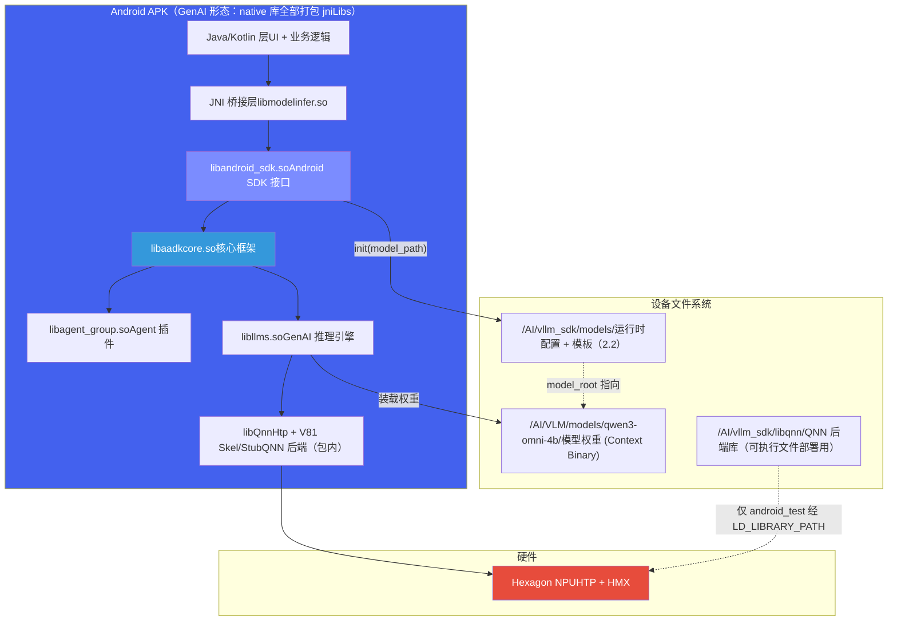

# 4. 设备部署与上车流程

*岚图 8397 · SDK 构建 → adb push → 设备目录 → android\_test / APK 运行 → 部署验证 · SELinux*

> [!TIP]
> **本篇讲什么**
>
> 岚图 8397 上 GenAI 方案 SDK 的**设备部署与上车流程**——这是从框架层 [设备部署](../agent-framework/deploy.html) 下沉的**岚图分支专属**部分（主线 agent\_core\_dev 不含 android\_sdk / android\_test）：
>
> - 可执行文件部署：`build_8397_android.sh` 构建（工具链与关键开关）→ adb push → `/AI/vllm_sdk/` 设备目录 → `android_test` 运行 → 部署成功判据
> - APK 部署：设备文件放置对照、**两个模型根目录**（`/AI/vllm_sdk/models` vs `/AI/VLM/models/qwen3-omni-4b`）的权威目录树与谁读谁、SELinux 域差异（为什么 `android_test` 能跑、APK 却撞墙）
>
> JNI 接口、`ModelInference` API、`DataMessage` 结构与 C++ 调用示例统一收敛在 [3. APK 集成与端侧服务化](apk-integration.html) 第 6 节，**本篇不再重复**；APK 应用层内部结构（MyApplication / 前台服务 / HTTP 服务化）见该篇第 3~5 节。
>
> **代码基线**：aadkcore 仓库 `lantu_sdk_dev` 分支 `runtime/src/android_sdk/`（`model_inference.cpp/h`、`MsgDeliverImpl`、`data_message.h`）；构建开关与产物判据按 2026-09 岚图分支状态核实。

## 1. 可执行文件部署（android\_test）

可执行文件部署主要用于 SA8397P Android 平台的**开发调试和功能验证**。通过 NDK 交叉编译生成 `android_test` 可执行文件，adb push 到设备后直接运行，无需 APK 集成，方便快速迭代。

### 1.1 构建工具链与关键开关

| 项 | 值 / 说明 |
| :--- | :--- |
| NDK | `android-ndk-r27c`（`ANDROID_NDK_HOME` 指向它；本仓库实测版本） |
| CMake | **3.28 必须在 PATH 上**——`build_8397_android.sh` 直接调 `cmake`；系统老版本 CMake（如 3.16）会对 Android+LTO 强加 `-fuse-ld=gold` 而构建失败 |
| ABI | `arm64-v8a`（aarch64，匹配车机 SoC；APK 侧同样用 `abiFilters` 限定此 ABI） |
| STL | `libc++_shared`（GenAI SDK 依赖，交付包 `lib/` 随附 `libc++_shared.so`） |
| 构建类型 | `-g -O3` **不 strip**（debug 产物）——这是下面目录树里 `.so` 体积偏大的原因，见 1.2 注 |

`build_8397_android.sh` 的关键开关有三个（彼此正交）：

| 开关 | 管什么 |
| :--- | :--- |
| `ENABLE_LANTU_SDK` | 岚图项目闸门：agent\_group 是否编入三个场景 dispatcher（dress\_detect / incar\_item\_detect / outcar\_qa）与岚图形态的模板安装规则（只装编入 dispatcher 实际打开的模板） |
| `ENABLE_QNN_MODEL` | GenAI/QNN 后端：**四层**——源码（`qnn_model.cpp` 是否编入）、include 路径、链接项、install 规则（`lib/` 相关库 + 整个 `libqnn/` 目录） |
| `ENABLE_AISERVICE_MODEL` | AIService HTTP 后端：源码（`http_client.cpp` / `aiservice.cpp`）+ `curl` 链接 |

两个后端开关可同时 ON（现行岚图构建脚本即两个都 ON），运行期按配置里 `model_name` 前缀路由后端（`qnn/…` → 进程内 QNN，`aiservice/…` → HTTP 8090），详见 [AIService 后端集成与重构](aiservice-integration.html)。

**编译与安装**：

```
# NDK 交叉编译（需设置 ANDROID_NDK_HOME 环境变量，CMake 3.28 在 PATH 上）
./build_8397_android.sh

# 编译产物位于 build_8397_android/vllm_sdk/
# 推送到设备
adb push build_8397_android/vllm_sdk/ /AI/vllm_sdk/
```

> [!WARNING]
> **构建是增量的，install 只拷不删**
>
> `build_8397_android.sh` 不清空构建目录，`make install` 只拷贝、从不删除——调整 install 排除规则后，旧 `build_8397_android/vllm_sdk/` 里被排除的文件**仍然在**（时间戳是很久以前的），只有 install 日志里「出现 0 次」才是真相。验证排除规则是否生效要先 `rm -rf build_8397_android/vllm_sdk && make install`（不重编，几秒）。

### 1.2 设备目录结构（/AI/vllm\_sdk/）

```
/AI/vllm_sdk/
├── lib/                        # 运行时依赖库（debug/未 strip 口径，见下注）
│   ├── libaadkcore.so          # 核心框架 (~71MB)
│   ├── libagent_group.so       # Agent 插件 (~19MB)
│   ├── libandroid_sdk.so       # Android SDK 接口层 (~5.5MB)
│   ├── libllms.so              # GenAI 推理引擎 (~105MB)
│   ├── libaisa.so              # AISA 模型库 (~7MB)
│   ├── libflash_attn.so        # Flash Attention (~31MB)
│   └── ...                     # OpenCV, curl, libc++_shared 等
├── libqnn/                     # QNN 后端库（ENABLE_QNN_MODEL=ON 才安装）
│   ├── libQnnHtp.so            # HTP 后端
│   ├── libQnnCpu.so            # CPU 后端
│   ├── libQnnGpu.so            # GPU 后端
│   ├── libGenie.so             # Genie 推理引擎
│   └── ...                     # Stub/Skel/Profiler 等
├── models/                     # ★ 运行时配置/模板根（不是权重！见 2.2）
│   ├── config/
│   │   ├── runtime_config.json         # 运行时配置（平台/模型切换）
│   │   ├── multi_lora_runtime_config.json  # 多 LoRA 主配置（model_root 指向权重根）
│   │   └── qwen3-omni-4b_8397.json     # model_path / veg_params（多 VIT 档位），仅 GenAI 形态读
│   └── template/               # YAML Prompt 模板（SDK 自带副本，PromptManager 读这份）
│       ├── car_control.yaml    # 车控 Agent 模板
│       ├── active_vision.yaml  # 主动视觉模板
│       ├── chitchat.yaml       # 闲聊模板
│       └── ...
├── include/                    # 对外头文件
│   ├── model_inference.h       # ModelInference 接口（详见 APK 篇 6.2）
│   └── data_message.h          # DataMessage 结构定义（详见 APK 篇 6.3）
├── example/
│   ├── bin/android_test        # 测试可执行文件（三场景用例）
│   ├── bin/new_api_test        # 新 API 测试程序（android_sdk_run.sh 当前入口）
│   ├── src/android_sdk_test.cpp  # 测试源码
│   └── data/                   # 测试图片和用例（test_cases.json + 全部测试图）
├── android_sdk_run.sh          # 运行脚本
└── version.txt                 # 版本号（上机后第一眼要看的，见 1.4）
```

> [!NOTE]
> **`.so` 体积是 debug（未 strip）口径**
>
> 产物为 `-g -O3` 不 strip，debug 段还嵌着构建目录与行号信息：`libaadkcore.so` ~71MB、`libllms.so` ~105MB 都是 **debug 体积**。APK 侧经 AGP 默认 strip 后 `libaadkcore.so` 约 36.5MB（唯一例外是 `libQnnHtpV81Skel.so` 不能 strip，见 APK 篇 2.3）。量产交付应明确 strip 策略与体积预算，别直接引用 debug 数字。

> [!NOTE]
> **本目录树服务可执行文件部署；APK 不读 `lib/` 与 `libqnn/`**
>
> APK GenAI 形态把核心库与 QNN 后端的**另一份**打进 jniLibs（37 个 `.so`），运行期不读 `/AI/vllm_sdk/lib*`；APK 只读 `/AI/vllm_sdk/models`（配置根）。两份库应同源同版本，核对方法见 1.4。

### 1.3 运行方式与环境变量

```
# adb shell 进入设备
adb shell
cd /AI/vllm_sdk

# 设置环境变量并运行（android_sdk_run.sh 内容）
export GENAI_THIRTY_LIB=/AI/vllm_sdk/libqnn
export ADSP_LIBRARY_PATH="/vendor/dsp/cdsp;/vendor/lib/rfsa/adsp;/system/lib/rfsa/adsp;/dsp;$GENAI_THIRTY_LIB;"
export LD_LIBRARY_PATH=/AI/vllm_sdk/lib:$GENAI_THIRTY_LIB

# 运行测试程序
./example/bin/android_test
```

> [!NOTE]
> **`GENAI_THIRTY_LIB`：疑似 `THIRD` 的笔误，但照抄上游拼写**
>
> 按命名意图它应是 `GENAI_THIRD_LIB`（third-party 库目录），`THIRTY` 疑似上游笔误。但这是 `android_sdk_run.sh` / `test_cases.json` 里的**字面变量名**（照抄上游拼写，与协议里 `presure` 字段同类），脚本按该名读写——手工 export 时**必须一字不差**，不要在自己的脚本里「顺手修正」拼写，否则变量不生效、QNN 后端加载失败。

> [!WARNING]
> **环境变量说明**
>
> `ADSP_LIBRARY_PATH` 是 Hexagon DSP 加载 skeleton 库的搜索路径，必须包含 QNN 后端库目录。`GENAI_THIRTY_LIB` 指向 QNN 库目录，用于 GenAI SDK 定位 HTP/CPU/GPU 后端。如果这两个变量配置错误，会导致 QNN 后端加载失败，模型推理报 `AEE_ECONNREFUSED` 错误。

> [!NOTE]
> **运行入口与用例控制**
>
> - `android_sdk_run.sh` 当前实际拉起的是 `new_api_test`（`android_test` 那行被注释）；要跑三场景回归用例（Agent100/200/300 = 7/4/17 例）需直接调 `./example/bin/android_test --agents 100,200,300`。
> - `--start` / `--count` 是**死参数**（只解析不使用）；限制用例数只能改 `example/data/test_cases.json` 里每条的 `enabled` 字段，测完恢复。

### 1.4 部署成功判据

「推完了」不等于「部署对了」。按强度递增的判据：

| 层级 | 判据 | 方法 / 说明 |
| :--- | :--- | :--- |
| **版本** | `version.txt` 与预期一致 | `cat /AI/vllm_sdk/version.txt`（如 `qnn246-sdk_*` / `H47A3632017DA.26081401`），上机后第一眼先看它 |
| **形态** | 目录形状与预期形态一致 | GenAI 形态有 `libqnn/`；AIService 形态没有 `libqnn/` 且 `lib/` 文件数明显更少。防「推错包」 |
| **完整性** | 产物与构建侧一致 | md5 比对**只对同一构建路径的产物可复现**——产物 `-g` 不 strip，debug 段嵌构建目录与行号，换机/换目录构建 md5 必变；跨环境比对改用 `llvm-nm -D` 动态符号（去掉地址列）、归一化后的 `strings`、`readelf -SW` 节区大小 |
| **加载** | 库与模型真实映射 | `cat /proc/<pid>/maps`：确认进程映射了哪些 `.so`、哪些模型 `.bin` 及其真实路径。aiservice 形态下 `GET /v1/models` 说 `loaded` **不等于**新模型已生效——`VoyahAIService` 只在启动时扫描，硬证据是 maps 里 lora `.bin` 的真实路径 |
| **功能** | 用例结果，而非退出码 | GenAI 形态即使三链路全部跑通，teardown 阶段也会 **SIGABRT**（`FORTIFY: pthread_mutex_lock called on a destroyed mutex`，RC=134，改动前后指纹一致的既有问题）；判据是输出里的 `ran=N` 与 `RESULT` JSON 内容，**不要看退出码** |
| **APK 侧** | 包内 3 个 `.so` 的 md5 定版 | 核对 APK 配的是哪版 SDK，比包内 `libaadkcore` / `libagent_group` / `libandroid_sdk` 的 md5，别信构建时间戳（每次构建都变） |

## 2. APK 部署与设备文件放置

APK 集成是 SA8397P Android 平台的**量产部署方案**。Android 应用通过 JNI 加载 `libandroid_sdk.so`，调用 `ModelInference` C++ 接口完成模型推理。核心 `.so` 库（含 QNN 后端）打包在 APK 内；模型权重与运行时配置部署在设备文件系统。

> [!IMPORTANT]
> **JNI 接口收敛在 APK 篇**
>
> `ModelInference` API（接口停用删除后剩 4 个方法）、`DataMessage` 结构、JNI 句柄模型 / 跨线程回调与 C++ 调用示例，统一见 [3. APK 集成与端侧服务化](apk-integration.html) 第 6 节，本篇不再重复。本节只回答部署侧的问题：**哪些文件放哪、谁读谁、SELinux 怎么过**。

### 2.1 部署拓扑



### 2.2 两个模型根目录：谁读谁

部署中最容易混淆的是把 `/AI/vllm_sdk/models` 当成「模型目录」。实际上有**两个根目录**，职责不同：

- **`/AI/vllm_sdk/models` = 运行时配置/模板根**（「怎么跑」）：是 `ModelInference::init(model_path)` 的入参，里面只有 JSON 配置与 YAML 模板，**没有权重**；
- **`/AI/VLM/models/qwen3-omni-4b` = 模型权重/Context Binary 根**（「跑什么」）：`qwen3-omni-4b` 是内部定制模型型号；该根目录同时是 `VoyahAIService` 的模型扫描根（**硬编码**）。

两者由 `multi_lora_runtime_config.json` 的 `model_root` 字段桥接——SDK 先读配置根，再按 `model_root` 找到权重根。权威目录树：

```
/AI/
├── vllm_sdk/models/                   ← 配置/模板根 = init(model_path) 入参
│   ├── config/
│   │   ├── runtime_config.json            # ModelScheduler 读 capacity / worker_count / timeout_s
│   │   ├── multi_lora_runtime_config.json # 主配置：model_name 定后端（qnn/… 或 aiservice/…）
│   │   │                                  # 8397 块的 model_root → 指向下方权重根
│   │   └── qwen3-omni-4b_8397.json        # model_path / veg_params（多 VIT：veg_448_448 舱内、
│   │                                      #   veg_1024_768 舱外），仅 GenAI 形态（QNN=ON）读
│   └── template/                          # YAML Prompt 模板（SDK 自带副本，PromptManager 读这份）
└── VLM/models/                          ← 权重根 = VoyahAIService 扫描根（硬编码）
    └── qwen3-omni-4b/                   ← 模型包
        ├── info.json                    # 模型元数据（id: qwen3_omni）
        ├── base/                        # 基模 config.json + Context Binary / KV 缓存 (.bin)
        ├── loras/                       # 场景 LoRA 权重 (.bin)
        ├── prefix/                      # 前缀缓存（与配置中 prefix_name 1:1 对应）
        ├── vlm_ebnf/                    # 约束解码 grammar
        └── template/                    # 包内模板副本（厂商 Example 读这份；与 SDK 自带副本内容实测相同）
```

**读者对照**：

| 读者 | 读什么 | 说明 |
| :--- | :--- | :--- |
| `ModelInference::init(model_path)`（APK / android\_test） | `/AI/vllm_sdk/models` | APK 侧硬编码于 `TestInjectService.java:81`；只读配置，不直接碰权重 |
| GenAI 形态（`qnn_model.cpp`） | `/AI/VLM/models/qwen3-omni-4b` 的 Context Binary / LoRA / veg\_params | 进程内 QNN/HTP 装载权重 |
| AIService 形态（`VoyahAIService`，厂商系统服务） | `/AI/VLM/models`（扫描根**硬编码**） | 只在启动时扫描；换包/搬家后必须 `setprop ctl.restart vendor.VoyahAIService` 再 `POST /models/load` |
| PromptManager（我方 SDK） | `/AI/vllm_sdk/models/template/*.yaml` | 厂商 Example 读包内 `template/`；两份内容实测逐字节相同——**改模板要认准是哪一份** |

> [!WARNING]
> **三个高频坑**
>
> ① **把权重放 `/AI/vllm_sdk/models`**——那是配置根，权重放那无效；`VoyahAIService` 扫不到模型时表现为 `GET /v1/models` 返回空 + `Model is not listed in scanned models`。
> ② **在 C++ 里写死 `/AI/VLM/models`**——服务端二进制里有 OTA 双槽（`models_new` / `_old` + `models -> models_old` 链接翻转），路径会变；我方一律用配置里的 `model_root` 跟随。
> ③ **假设模型包布局不变**——包的布局历史上变过（扫描根下扁平放置 vs 带 `qwen3-omni-4b/` 一层），上机后先 `ls` 确认实际布局再写配置。

### 2.3 设备文件放置对照表

| 文件类别 | 来源 | 部署位置 | 说明 |
| :--- | :--- | :--- | :--- |
| **SDK 接口库** | vllm\_sdk/lib/libandroid\_sdk.so | APK jniLibs/arm64-v8a/ | 打包进 APK，JNI 加载 |
| **核心框架库** | vllm\_sdk/lib/libaadkcore.so 等 | APK：jniLibs 打包；可执行文件：/AI/vllm\_sdk/lib/ | APK 用包内副本；`android_test` 经 `LD_LIBRARY_PATH` 加载 |
| **QNN 后端库** | vllm\_sdk/libqnn/ | APK：jniLibs 打包（GenAI 形态，含 V81 Skel/Stub）；可执行文件：/AI/vllm\_sdk/libqnn/ | APK 内 Skel 不可 strip（见 APK 篇 2.3） |
| **DSP Skeleton 库** | vllm\_sdk/libqnn/ 中的 Skel 文件 | APK：`ADSP_LIBRARY_PATH`（含 nativeLibDir）；可执行文件：`GENAI_THIRTY_LIB` 目录 | Hexagon DSP 侧加载 |
| **模型权重** | 模型包 qwen3-omni-4b（Context Binary .bin / loras / prefix 等） | /AI/VLM/models/qwen3-omni-4b/ | 由配置 `model_root` 定位；`VoyahAIService` 扫描根为 /AI/VLM/models（见 2.2） |
| **运行时配置** | vllm\_sdk/models/config/ | /AI/vllm\_sdk/models/config/ | runtime\_config.json / multi\_lora\_runtime\_config.json 等 |
| **Prompt 模板** | vllm\_sdk/models/template/ | /AI/vllm\_sdk/models/template/ | YAML 格式的 Agent 模板（SDK 自带副本，PromptManager 读这份） |

### 2.4 SELinux：同一份 /AI，为什么 android\_test 能跑、APK 却撞墙

同一套设备目录，两种进程访问时 SELinux 身份完全不同——这是可执行文件部署与 APK 部署最大的差异点：

| | android\_test | lantu\_demo APK |
| :--- | :--- | :--- |
| 启动方式 | `adb shell` 手工执行 | 安装应用，系统拉起 |
| 进程域 | `shell` / root（adb 守护进程） | `untrusted_app_32`（第三方应用域） |
| 访问 `/AI`（`u:object_r:AI_file:s0`） | 策略允许，**无阻碍** | 策略**不允许** search/getattr，直接拒绝 |
| 症状 | — | Java 侧只有一句 `CRITICAL: Model directory NOT FOUND: /AI/vllm_sdk/models` |

APK 侧的 avc 记录实例：

```
avc: denied { search } for comm="model-init-thre" name="/" dev="vdy" ino=2
  scontext=u:r:untrusted_app_32:s0:c131,... tcontext=u:object_r:AI_file:s0
  permissive=0 app=com.example.myapplication
```

> [!WARNING]
> **这个拒绝会伪装成「模型没放好」**
>
> `adb shell`（root）看得见目录、md5 全对，APK 却说 NOT FOUND——极易误判成部署错误或路径写错，实际是**域**的问题，不是文件的问题。两个推论：
>
> - **`run-as` 不能当判据**：`run-as` 的域是 `runas_app`，不是 app 真实的 `untrusted_app_XX`；确认现场域要读 `/proc/<pid>/attr/current` 再按 pid 找 avc 记录。
> - **demo 解法是 `setenforce 0`**（整机 permissive，**重启后失效**，是大锤不是方案）；量产岚图 App 是 system/vendor 应用，但仍需正确的 file context + 对应域的 allow 规则，并非自动免疫。策略细节与量产方向（自定义策略 / 独立域）见 [运维、安全与功能安全](ops-security.html) 第 3 节与 [AIService 后端集成与重构](aiservice-integration.html) 的 5.7 节。

> [!NOTE]
> **调试数据录制**
>
> 调试时可通过 Android 系统属性控制数据录制：`adb shell setprop persist.aadk.data_dump 1` 开启，设为 0 关闭。
