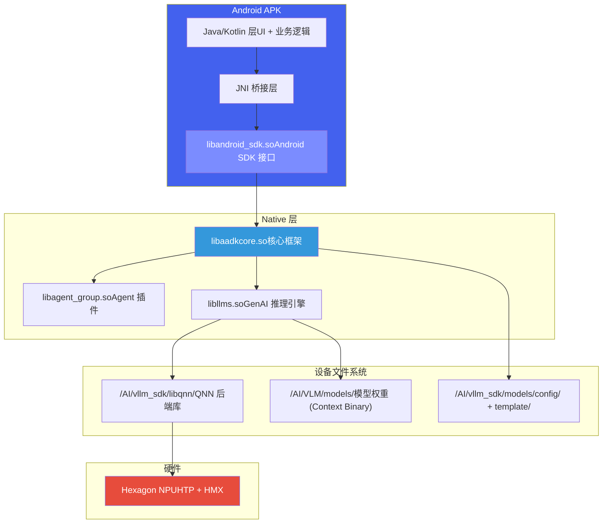

# 4. 设备部署与上车流程

*岚图 8397 · SDK 构建 → 设备目录 → adb push → android\_test / APK 运行 · JNI 接口*

> [!TIP]
> **本篇讲什么**
>
> 岚图 8397 上 GenAI 方案 SDK 的**设备部署与上车流程**——这是从框架层 [设备部署](../../agent-framework/deploy.html) 下沉的**岚图分支专属**部分（主线 agent\_core\_dev 不含 android\_sdk / android\_test）：
>
> - 可执行文件部署：`build_8397_android.sh`（带 `ENABLE_LANTU_SDK`）构建 → `/AI/vllm_sdk/` 设备目录 → adb push → `android_test` 运行
> - APK 集成 SO：`libandroid_sdk.so` 集成、JNI 接口（`model_inference.h`）
>
> APK 应用层内部结构（MyApplication / 前台服务 / HTTP 服务化）见 [3. APK 集成与端侧服务化](apk-integration.html)。
>
> **代码基线**：aadkcore 仓库 `lantu_sdk_dev` 分支 `runtime/src/android_sdk/`（`model_inference.cpp/h`、`MsgDeliverImpl`、`data_message.h`）。

## 1. 可执行文件部署（android\_test）

可执行文件部署主要用于 SA8397P Android 平台的**开发调试和功能验证**。通过 NDK 交叉编译生成 `android_test` 可执行文件，adb push 到设备后直接运行，无需 APK 集成，方便快速迭代。

**编译与安装**：

```
# NDK 交叉编译（需设置 ANDROID_NDK_HOME 环境变量）
./build_8397_android.sh

# 编译产物位于 build_8397_android/vllm_sdk/
# 推送到设备
adb push build_8397_android/vllm_sdk/ /AI/vllm_sdk/
```

**设备目录结构**（`/AI/vllm_sdk/`）：

```
/AI/vllm_sdk/
├── lib/                        # 运行时依赖库
│   ├── libaadkcore.so          # 核心框架 (~71MB)
│   ├── libagent_group.so       # Agent 插件 (~19MB)
│   ├── libandroid_sdk.so       # Android SDK 接口层 (~5.5MB)
│   ├── libllms.so              # GenAI 推理引擎 (~105MB)
│   ├── libaisa.so              # AISA 模型库 (~7MB)
│   ├── libflash_attn.so        # Flash Attention (~31MB)
│   └── ...                     # OpenCV, curl, libc++_shared 等
├── libqnn/                     # QNN 后端库
│   ├── libQnnHtp.so            # HTP 后端
│   ├── libQnnCpu.so            # CPU 后端
│   ├── libQnnGpu.so            # GPU 后端
│   ├── libGenie.so             # Genie 推理引擎
│   └── ...                     # Stub/Skel/Profiler 等
├── models/
│   ├── config/
│   │   ├── runtime_config.json         # 运行时配置（平台/模型切换）
│   │   └── multi_lora_runtime_config.json  # 多 LoRA 配置
│   └── template/               # YAML Prompt 模板
│       ├── car_control.yaml    # 车控 Agent 模板
│       ├── active_vision.yaml  # 主动视觉模板
│       ├── chitchat.yaml       # 闲聊模板
│       └── ...
├── include/                    # 对外头文件
│   ├── model_inference.h       # ModelInference 接口
│   └── data_message.h          # DataMessage 结构定义
├── example/
│   ├── bin/android_test        # 测试可执行文件
│   ├── src/android_sdk_test.cpp  # 测试源码
│   └── data/                   # 测试图片和用例
├── android_sdk_run.sh          # 运行脚本
└── version.txt                 # 版本号
```

**运行方式**：

```
# adb shell 进入设备
adb shell
cd /AI/vllm_sdk

# 设置环境变量并运行（android_sdk_run.sh 内容）
export GENAI_THIRTY_LIB=/AI/vllm_sdk/libqnn
export ADSP_LIBRARY_PATH="/vendor/dsp/cdsp;/vendor/lib/rfsa/adsp;/system/lib/rfsa/adsp;/dsp;$GENAI_THIRTY_LIB;"
export LD_LIBRARY_PATH=/AI/vllm_sdk/lib:$GENAI_THIRTY_LIB

# 运行测试程序
./example/bin/android_test
```

> [!WARNING]
> **环境变量说明**
>
> `ADSP_LIBRARY_PATH` 是 Hexagon DSP 加载 skeleton 库的搜索路径，必须包含 QNN 后端库目录。`GENAI_THIRTY_LIB` 指向 QNN 库目录，用于 GenAI SDK 定位 HTP/CPU/GPU 后端。如果这两个变量配置错误，会导致 QNN 后端加载失败，模型推理报 `AEE_ECONNREFUSED` 错误。

## 2. APK 集成 SO 与 JNI 接口

APK 集成是 SA8397P Android 平台的**量产部署方案**。Android 应用通过 JNI 加载 `libandroid_sdk.so`，调用 `ModelInference` C++ 接口完成模型推理。核心 SO 库打包在 APK 内，模型权重和 QNN 后端库部署在设备文件系统。



**ModelInference API**（`banma::ModelInference`）：

| 方法 | 参数 | 返回值 | 说明 |
| :--- | :--- | :--- | :--- |
| `init` | `model_path` (string) | bool | 初始化模型。model\_path 指向 models 目录的绝对路径，内部加载 runtime\_config.json 并初始化 MsgDeliverImpl |
| `inference_msg` | `msg`, `stream`, `replyHandler` | bool | 发送推理请求。msg 包含文本/图像/音频输入，stream 控制流式输出，replyHandler 接收推理结果 |
| `stopInferenceTask` | — | bool | 停止当前推理任务；无运行任务时返回 false |
| `releaseModelResources` | — | bool | 释放模型资源（推理进行中返回 false）；释放后需重新 `init` |

> [!NOTE]
> **NPU 资源 / profile 接口已停用删除**
>
> 早期 SDK 有 `requestNpuAccess` / `syncNpuProfile` / `registerNpuResourceEventCallback` / `registerProfilingCallback` 及 `VoyahAIProxy.hpp`（NPU 资源管理与性能上报）。2026-08 需求变更后**全部停用删除**，`model_inference.h` 现仅剩上表 4 个方法（`setSTRStatus` 亦注释停用）；app 侧实际只调 `init` + `inference_msg`。背景见 [APK 集成与端侧服务化](apk-integration.html) 的 2.2 节。

**DataMessage 结构**：

| 字段 | 类型 | 说明 |
| :--- | :--- | :--- |
| `scenario_id` | uint16 | 场景 ID：0=OAI 推理, 100=车内物品检测, 200=着装识别, 300=车外问答 |
| `content` | string | 文本内容（用户查询） |
| `image_info` | ImageInfo | 主图像数据（支持 JPEG/YUV\_NV12/RGB/BGR/RGBA 等格式） |
| `extra_images` | vector<ImageInfo> | 附加图像帧（多帧推理场景） |
| `audio_info` | AudioInfo | 音频数据（PCM 格式，含采样率/位深度） |
| `msg_type` | MsgType | 消息类型：TEXT / IMAGE / AUDIO / TEXT\_IMAGE / TEXT\_AUDIO 等组合 |
| `request_type` | RequestType | REQUEST=推理 / CONTEXT=上下文 / PREPROCESS=预处理 / CANCEL=取消 |
| `priority` | uint16 | 优先级：0=LOW, 1=NORMAL, 2=HIGH, 3=CRITICAL |
| `stream` | bool | 是否流式返回结果 |

**C++ 调用示例**：

```
#include "model_inference.h"
#include "data_message.h"

banma::ModelInference model;

// 1. 初始化模型
model.init("/AI/vllm_sdk/models");

// 2. 构造推理请求
banma::DataMessage msg;
msg.scenario_id = banma::OAI_INFERENCE;  // 通用推理
msg.content = "今天天气怎么样？";
msg.msg_type = banma::TEXT;
msg.request_type = banma::REQUEST;
msg.stream = true;

// 3. 发送推理请求
model.inference_msg(msg, true, [](const std::string& result, bool is_finished) {
    // 流式回调：result 为每次返回的文本片段
    // is_finished 为 true 时表示推理完成
    std::cout << result;
    if (is_finished) std::cout << std::endl;
});
```

**设备文件放置对照表**：

| 文件类别 | 来源 | 设备路径 | 说明 |
| :--- | :--- | :--- | :--- |
| **SDK 接口库** | vllm\_sdk/lib/libandroid\_sdk.so | APK jniLibs/arm64-v8a/ | 打包进 APK，JNI 加载 |
| **核心框架库** | vllm\_sdk/lib/libaadkcore.so 等 | /AI/vllm\_sdk/lib/ | 通过 LD\_LIBRARY\_PATH 加载 |
| **QNN 后端库** | vllm\_sdk/libqnn/ | /AI/vllm\_sdk/libqnn/ | QNN HTP/CPU/GPU 后端 |
| **DSP Skeleton 库** | vllm\_sdk/libqnn/ 中的 Skel 文件 | ADSP\_LIBRARY\_PATH 路径 | Hexagon DSP 侧加载 |
| **模型权重** | Context Binary (.bin) | /AI/VLM/models/ | 模型配置中 model\_path 指定 |
| **运行时配置** | vllm\_sdk/models/config/ | /AI/vllm\_sdk/models/config/ | runtime\_config.json 等 |
| **Prompt 模板** | vllm\_sdk/models/template/ | /AI/vllm\_sdk/models/template/ | YAML 格式的 Agent 模板 |

> [!NOTE]
> **调试数据录制**
>
> 调试时可通过 Android 系统属性控制数据录制：`adb shell setprop persist.aadk.data_dump 1` 开启，设为 0 关闭。

