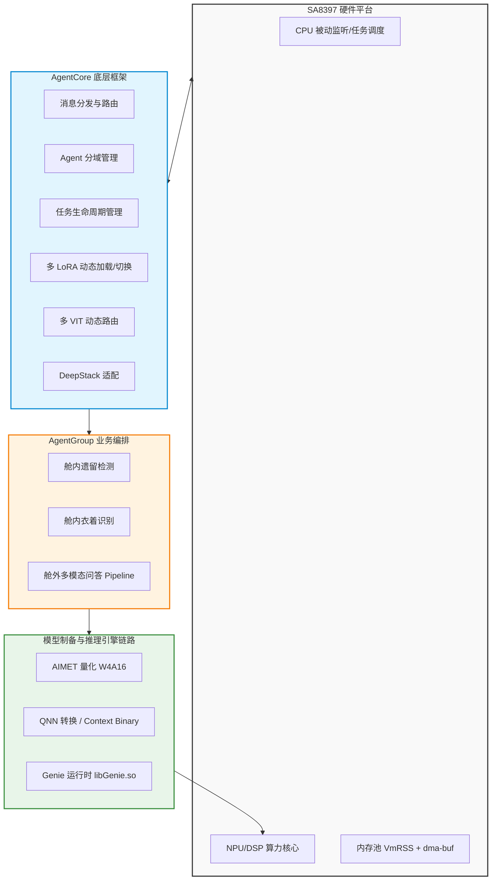
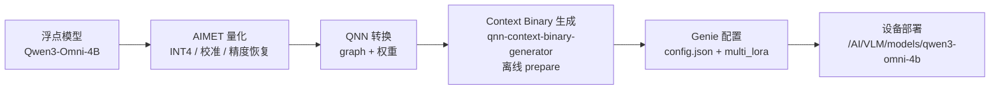
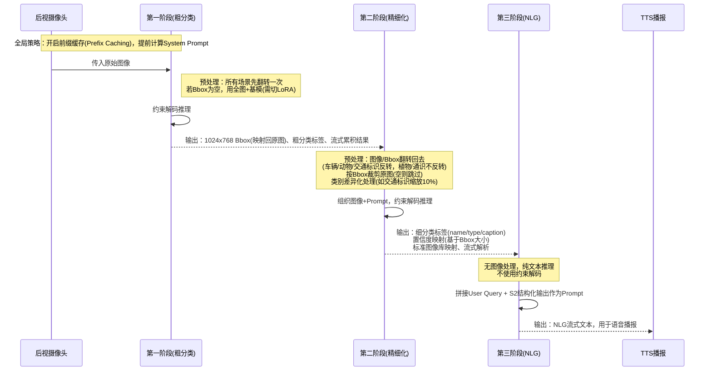
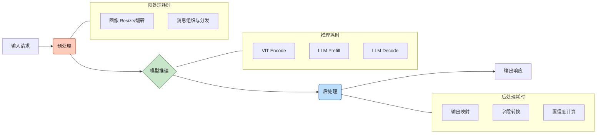

# 1. 岚图8397量产项目SDK：核心技术架构与优化总结

*GenAI 方案 · Qwen3-Omni-4B 端侧部署 · AgentCore / AgentGroup 框架 · 性能优化体系*

> [!TIP]
> **本篇讲什么**
>
> 这是岚图 8397 座舱 VLM 的 **GenAI 方案**（高通 QNN / genai 推理框架）总览，覆盖：
>
> - 系统全景与**模型制备链路**（AIMET 量化 → QNN 转换 → Context Binary 生成 → Genie 配置）
> - AgentCore 框架的**岚图分支定制点**（多 LoRA / scene / prefix 映射、多 VIT 两档路由）
> - AgentGroup 业务编排（舱内遗留 / 衣着、舱外三阶段问答）
> - 性能优化体系（量化、多 VIT、多核、前缀缓存、DeepStack）
> - 车机部署与评测链路
> - 关键数据核查记录（量化损失 / SSD 释义 / 前缀缓存 token 数）
>
> **代码基线**：aadkcore 与 agent_group 仓库 `lantu_sdk_dev` 分支。核心文件：
>
> - AgentCore：`aadkcore/src/models/qnn/qnn_model.cpp`、`src/runtime/model_runner.cpp`
> - 模型配置：`runtime/data/config/multi_lora_runtime_config.json`（**7 条** LoRA 配置）、`config/qwen3-omni-4b_8397.json`（模型路径 + 两档 VIT）
>   - ⚠️ 同目录的 `runtime/data/config/base_model.json` 是 **Orin / Lape 形态配置**（`model_name: lape/Qwen2.5-Omni-7B`、TensorRT engine 路径），其 `enable_prefix_caching` 只被 `lape_model.cpp` 消费，**不在 8397 genai 链路上**——本篇前缀缓存开关以设备侧 Genie `config.json` 为准（见 2.4 / 5.2）。
> - AgentGroup：`agent_group/src/{outcar_qa,incar_item_detect,dress_detect}_agent/*_dispatcher.cpp`

## 1. 背景简介与系统全景

### 1.1 项目概述

基于高通 SA8397 平台，主导 **Qwen3-Omni-4B** 多模态大模型的端侧部署与 Agent 框架研发：

- **落地业务**：舱内遗留检测、衣着识别、舱外多模态问答等核心量产业务
- **目标**：端侧大模型在智能座舱的低功耗、高实时运行

> [!NOTE]
> **锚点模型口径**：本篇的 Qwen3-Omni-4B 是**项目内部定制**的 4B 级全模态模型（**非**公开发布的 Qwen3-Omni 系列——公开版为 30B-A3B MoE）。结构按 4B 级稠密模型配置，平台与锚点定义详见 [硬件与系统底层](../../general/hardware.html) 顶部「全站数据口径与锚点模型」。

### 1.2 系统架构拓扑图



## 2. 模型制备链路（量化 → 转换 → Context Binary → Genie 配置）

端侧模型不是「训练完直接上车」。浮点大模型要经过一条**离线制备链路**，压成能在 SA8397P NPU（HTP）上低时延运行、上电即可加载的 **Context Binary**，再交给 Genie 运行时。这是端侧部署最核心、也最容易被架构总览漏掉的一环。

> [!NOTE]
> **本节口径（已核实 vs 方法级）**
>
> - **已核实**（来自 `lantu_sdk_dev` 配置与设备产物）：Context Binary `.bin` 名（`veg_448_448_8397.bin` / `veg_1024_768_8397.bin`）、模型根目录 `/AI/VLM/models/qwen3-omni-4b`、配置根目录 `/AI/vllm_sdk/models`、Genie `config.json` 字段（sampler / cl2560 / max_tokens / prefix_caching）。
> - **方法级**（高通端侧量化通用流程，项目具体参数以模型团队交付为准）：AIMET 校准集构成、量化算法选型、per-tensor / per-channel 粒度、精度恢复手段。文中已分别标注，不要把方法级描述当成项目实测结论。

### 2.1 链路总览



| 阶段 | 工具 / 产物 | 落点 |
| :--- | :--- | :--- |
| **AIMET 量化** | 量化后模型（权重 INT4，含校准与精度恢复） | 离线（模型团队） |
| **QNN 转换** | QNN graph（模型 `.so` / 中间表示） | 离线 |
| **Context Binary 生成** | `qnn-context-binary-generator` → 序列化 `.bin` | 离线 prepare，产物上车 |
| **Genie 配置** | `config.json` / `multi_lora_runtime_config.json` | `/AI/vllm_sdk/models/config` |

### 2.2 AIMET 量化

AIMET（AI Model Efficiency Toolkit，高通开源量化工具）把浮点权重压到 **INT4**，核心是「定标度 + 控误差」。本项目 LLM 主体走 **W4A16**（权重 INT4、激活保持 FP16）——这是 HTP 上跑 LLM 的真实主战场，位宽组合的由来与机制见 [端侧模型量化与压缩 · W4A16（§3）](../../general/quantization.html)：

- **校准集选择**（方法级）：量化需一小批代表性数据做校准，统计各层激活分布以定 scale。校准集应覆盖**实际业务分布**——舱内（遗留物 / 儿童 / 衣着）与舱外（车辆 / 动物 / 植物 / 交通标识 / 通识）各类场景图像；校准集与上线分布偏移是掉点的常见根因。另需**与评测集隔离**——校准集不要与评测集重叠，否则量化参数会对评测分布过拟合、线上必掉点（判据见 [量化 · 校准集选择（§1.4）](../../general/quantization.html)）。项目具体校准集构成以模型团队交付为准。
- **量化算法**（方法级）：AIMET 支持 TF-Enhanced / MSE / percentile 等权重量化算法，以及 **AdaRound**（自适应舍入，学习每个权重向上还是向下取整，比朴素最近舍入精度更高）。本项目 LLM 主体走 weight-only **W4A16**（激活 FP16）；**VIT 同样压到 INT4 权重**——但其**激活位宽组合（是 weight-only W4A16，还是 W4A8）本篇未拿到模型团队明确口径，以模型团队交付为准**。这是较激进的选择，精度/时延权衡与恢复策略见 5.2 的专门讨论。
- **量化粒度：per-tensor / per-channel / 分组**（方法级）：per-tensor 整个张量一个 scale，省内存但精度差；per-channel（逐输出通道）每通道一个 scale，对 INT4 权重更友好、精度更高，是常见选择。**LLM 的 W4A16 还有一层更细的分组量化（group quantization）**——每 `g` 个权重共享一个 scale，`g` 常见取 32 / 64 / 128，`g` 越小精度越好但 scale 元数据与 dequant 开销越大（取舍见 [量化 · 权重 INT4 分组打包（§3.2）](../../general/quantization.html)）。本项目 per-channel / group size 的具体取值以模型团队交付为准。
- **精度恢复**（方法级）：量化后掉点的常用恢复手段——① AdaRound / 更优校准集；② 量化感知训练（QAT）微调；③ 对敏感层（如 VIT、首尾层）回退更高精度（INT8 / FP16）做**混合精度**。本项目 0527 build 衣着描述塌至 ~0%、植物 caption −10pp（见 7.1）疑与激进量化（尤其 VIT INT4）相关，是精度恢复策略需重点覆盖的对象。

### 2.3 QNN 转换与 Context Binary 生成

- **QNN 转换**：量化后的模型经 QNN 转换器（`qnn-onnx-converter` / `qnn-pytorch-converter`）生成 QNN graph 与权重，再由 `qnn-model-lib-generator` 编成模型 `.so`。**注意转换器消费的是 AIMET 已产出的量化编码（`.encodings`），不是在转换阶段重新量化**——W4A16 的分组量化与校准在 AIMET / QAIRT 侧完成，converter 只把带量化编码的图转成 QNN 表示（链路见 [量化 · AIMET 与 LLM 的 W4A16 导出（§2.5）](../../general/quantization.html)）。
- **Context Binary 生成**：用 `qnn-context-binary-generator`，加载模型 `.so` + HTP backend（`libQnnHtp.so`）+ **HTP backend extensions**（指定 SoC 型号、DSP 架构、VTCM 大小、精度、graph 名等），在**离线**把 graph 编译 / prepare 成序列化的 **Context Binary**（`.bin`）。
- **为什么要离线 prepare**：HTP 上首次加载 graph 需在线编译（prepare），耗时且占资源；离线生成 Context Binary 后，设备端直接反序列化加载，省去上电时的图编译时延——这是车规「上电即可用」的关键。
- **HTP backend extensions 的版本约束**：`dsp_arch` 必须与 SA8397P 的 Hexagon 版本一致（本项目用 **V81** Skel，`libQnnHtpV81Skel.so`，见 [3. APK 集成](apk-integration.html) 的 `doNotStrip` 清单），否则 Context Binary 无法在设备加载。
- **产物**（已核实）：设备上的 Context Binary 包括基模、各 LoRA adapter，以及两档 VIT——`veg_448_448_8397.bin`（小档 448×448）与 `veg_1024_768_8397.bin`（大档 1024×768），统一落在 `/AI/VLM/models/qwen3-omni-4b/`（见 2.4）。各业务实际走哪一档见 3.2（**舱内遗留物走大档、衣着走小档**，非「舱内一律小档」）。

### 2.4 Genie 配置与模型根目录

**Genie**（GenAI Inference Extensions，`libGenie.so`）是高通端侧 LLM/VLM 对话运行时，负责加载 Context Binary + tokenizer + 配置并对外提供推理接口。**本项目推理引擎即 Genie（闭源）**。

关键配置（`config.json`，已核实）：

- sampler `greedy:true / type:basic`（greedy 单模型解码，**未启用**推测性采样，见 7.2）
- 上下文 `cl2560`、`max_tokens 512`
- `enable_prefix_caching=true`（前缀缓存，见 5.2 / 7.3）
- LoRA / scene 配置在 `multi_lora_runtime_config.json`（**7 条** LoRA 配置，映射关系见 3.1）

**两个模型根目录的关系**（已核实，全站统一口径）：

| 根目录 | 存什么 | 例子 |
| :--- | :--- | :--- |
| `/AI/VLM/models/qwen3-omni-4b` | **模型权重 / Context Binary**（`.bin`） | `base/omni3/veg_448_448_8397.bin`、各 LoRA adapter `.bin` |
| `/AI/vllm_sdk/models` | **运行时配置 / 模板**（JSON / EBNF / prefix） | `config/qwen3-omni-4b_8397.json`、`config/multi_lora_runtime_config.json`、`vlm_ebnf/`、`prefix/` |

两者由配置里的 `model_path` 串联：`qwen3-omni-4b_8397.json`（在 `/AI/vllm_sdk/models/config/`）的 `model_path` 字段指向 `/AI/VLM/models/qwen3-omni-4b`，运行时据此从**权重根目录**加载 Context Binary。VIT 的 `position_ids` / `pixel_values` 等 raw 模板另落在 `/AI/VLM/models/raw_src/`。

> [!NOTE]
> **关于旧版「方案 A/B（Genie 闭源 / GenieX 开源）」对比表**
>
> 旧版文档曾列「方案 A：Genie 闭源 / 方案 B：GenieX 开源」对比表。经核实：本项目推理引擎为高通 **Genie**（闭源，`libGenie.so`），而「GenieX 开源」**无法坐实为真实存在的高通 / 开源产品**，且该表与项目实际（走 `libGenie.so`）不符，故**删除**。若后续确有开源替代路线的评估记录，应以「方案 B 曾评估并放弃的原因」形式补回，而非与 Genie 并列对比。

## 3. AgentCore 框架：岚图分支定制点

AgentCore（aadkcore）的**通用机制**——分层架构、统一模型接口 ModelInstance、模型调度器 ModelScheduler、消息分发与路由、Agent 分域管理、对话历史 ChatHistory——属框架层通识，详见 [aadkcore 核心框架](../agent-framework/agent-core.html) 与 [场景 Agent 应用](../agent-framework/agent-group.html)。本节只记 **`lantu_sdk_dev` 分支针对岚图 8397 量产做的定制点**，不重复框架通识。

| 定制点 | 岚图分支的具体实现 | 代码落点 |
| :--- | :--- | :--- |
| **多 LoRA / scene 映射** | 7 条 LoRA 配置覆盖 4 个 scene、5 个 adapter；用 `LoRA ID`(scene) + `LoRA Name` 唯一定位并动态加载（见 3.1） | `model_runner.cpp` `getModelDetailsByScene(scene_id, lora_name)` |
| **多 VIT 两档路由** | 小档 448×448 / 大档 1024×768 两档 Context Binary，按业务设定的分辨率精确等值路由（见 3.2） | `qnn_model.cpp` `veg_model_small_` / `veg_model_large_` |
| **DeepStack 适配** | 适配 Qwen3-Omni 的 DeepStack 多层视觉注入，缓解深层网络遗忘图像信息 | `qnn_model.cpp` `deepstack_vit` |
| **低功耗被动监听** | CPU 轮询改事件驱动（`poll=false`），降 SDK 进程 CPU 占用（见 5.3） | 配置 `poll=false` |
| **稳定性兜底** | 各业务节点异常捕获 + 空 JSON 降级，避免进程直接 Crash | 各 dispatcher |

### 3.1 多 LoRA / scene / prefix 映射关系

这是全组此前没讲清的数量关系。配置文件 `multi_lora_runtime_config.json` 的 `multi_lora.lora` 数组共 **7 条**记录，每条是一个「scene + lora_name」组合，调度层据此唯一定位一次推理该挂哪个 LoRA adapter：

| scene_id | lora_name（配置条目） | lora_path（adapter） | 对应 prefix（system_prompt KV 缓存） |
| :--- | :--- | :--- | :--- |
| 1003 | base_model | （空，走基模） | — |
| 1100 | incar_item_detect | `cnyb` | `cnyb-left`（遗留物）、`cnyb-child`（儿童 person_desc） |
| 1200 | cloth_detect | `cnyb` | `cnyb-cloth`（dress_detect） |
| 1300 | grounding_sr | `dwsr` | `dwsr`（一阶段粗分类，约束解码） |
| 1300 | grounding_base | `dwbs` | `dwbs`（Bbox 为空时全图 + 基模） |
| 1300 | visual_assistant | `znzs` | `znzs-car/sign/animal/plant/general`（二阶段精细化）、`znzs-nlg`（三阶段 NLG） |
| 1300 | general_base | `default_adapter` | 通识兜底 |

**数量关系（务必分清四个层级，不要混为一谈）**：

- **4 个 scene_id**（业务域）：1003 基模 / 1100 舱内遗留 / 1200 衣着 / 1300 舱外
- **7 条配置条目**（scene + lora_name）：调度层唯一定位 adapter 的键；其中 1 条是 base_model（`lora_path` 空，走基模）
- **5 个不同的 LoRA adapter 权重**：`cnyb` / `dwsr` / `dwbs` / `znzs` / `default_adapter`——`cnyb` 被舱内遗留(1100)与衣着(1200)两个 scene **复用**，故 7 条配置只对应 5 份权重
- **11 个 prefix**（前缀缓存）：每个 system_prompt 一份 KV 缓存，与 adapter **不是一一对应**——一个 adapter（如 `znzs`）可挂多个 prefix（car/sign/animal/plant/general/nlg），故 prefix 数（11）> adapter 数（5）

> [!NOTE]
> **为什么旧版「基模 + 4 LoRA」是错的**
>
> 旧版写「基模 + 4 个 LoRA」，与配置实际的 **7 条**（5 个 adapter）不符，也与 [AIService 后端集成](aiservice-integration.html) 的「`multi_lora.lora` 数组 7 条」矛盾。本篇统一改为 **7 条 LoRA 配置 / 5 个 adapter 权重**。
>
> 另：设备 `/proc/<pid>/maps` 里可见的 **20 个 lora `.bin`** 是 adapter 在 HTP 上的实际加载产物（一个 adapter 在设备上可能对应多个 `.bin` 文件），与配置层的「5 个 adapter / 7 条」是**不同粒度的计数口径**，二者不矛盾；具体对应关系以设备产物为准。
>
> ⚠️ **观测来源标注（跨形态口径）**：这「20 个 lora `.bin`」是在 **aiservice 形态**的 `VoyahAIService` 进程 `/proc/<pid>/maps` 里观测到的（见 [AIService 后端集成 · 难点 5.2](aiservice-integration.html)）。两形态用的是**不同模型包**（版本、prefix KV、LoRA 权重 md5 均不同，见 aiservice 篇难点 5.3），故该计数**不能直接当作 genai 形态的加载产物口径**；genai 形态的 `.bin` 加载清单需对该形态进程单独核实，本篇暂沿用此观测值并标注来源。

### 3.2 多 VIT 两档路由

`qnn_model.cpp` 的 `get_vit_shape(width, height)` 按 `veg_param` 的宽高选 VIT Context Binary，**用的是精确等值匹配**（`width==1024 && height==768` / `width==448 && height==448`），不是按面积或区间归档：

- `1024×768` → 大 VIT（`veg_model_large_`，`veg_1024_768_8397.bin`）
- `448×448` → 小 VIT（`veg_model_small_`，`veg_448_448_8397.bin`）
- **非两档尺寸（fallback）**：两个等值条件都不命中时，`LOG_E("unsupported image size {}x{}, fallback to veg_model_small (448x448)")` 后**回退到 448 小档**并返回 `(448,448)`——即任意非法/未登记尺寸都会被静默归到小档，排查「图像尺寸不对却仍出结果」时要留意这条 fallback。

图像进 VIT 前先 Resize 到对应档位，减少冗余计算。两档 VIT 的 Context Binary 由 2.3 的链路离线生成。

> [!NOTE]
> **各业务实际走哪一档（已对 agent_group dispatcher 核实，修正旧版「舱内 448 / 舱外 1024」的粗略说法）**
>
> 档位由 dispatcher 在 `image_info.resized_width/height` 上写死，并非「舱内一律小档、舱外一律大档」：
>
> | 业务 | dispatcher 设定的 resized 尺寸 | 实际档位 |
> | :--- | :--- | :--- |
> | 舱内**衣着**（dress_detect） | `448×448`（`kTargetW/H=448`） | 小档 |
> | 舱内**遗留物**（incar_item_detect） | `1024×768` | **大档** |
> | 舱外问答 stage1（outcar_qa） | `1024×768` | 大档 |
> | 舱外问答 stage2 | 按 `Stage2ImageMode`：`USE_FULL_1024`→`1024×768`（大档）；`USE_CROP_448`/`USE_FULL_448`→`448×448`（小档） | 视模式而定 |
>
> 即**舱内遗留物走的是大档（1024×768），不是小档**——这一点是 5.2 / 7.3 前缀缓存收益因场景而异的根因之一（遗留物帧的视觉 token 多，见 7.3 的预算核算 NOTE）。

## 4. AgentGroup 业务流程

### 4.1 舱内业务处理逻辑

| 业务场景 | 预处理策略 | 推理逻辑 | 后处理策略 |
| :--- | :--- | :--- | :--- |
| **舱内遗留** | 左右翻转图像（解决 OMS 相机物理镜像） | 两次串行推理 | 输出结果映射 |
| **舱内衣着** | 左右翻转图像 | 单次推理 | 边界值处理（避免输出为空/"未知"）、置信度映射 |

代码落点：

- 翻转：`incar_item_detect_dispatcher.cpp` 里 `cv::flip(full_img, flipped, 1)`（`flipCode=1` 水平翻转，解码后以 BGR raw 写回 letterboxed_msg）
- 遗留物中英映射：`map_item_to_english`（电脑包/手提包→backpack、平板→laptop 等**粗粒度归并，是需求刻意设计，不要"修"**）

### 4.2 舱外问答业务 Pipeline（车辆/动物/植物/交通标识/其它）

三阶段流转（代码在 `outcar_qa_dispatcher.cpp`）：



#### 4.2.1 各阶段详细策略拆解表

| 推理阶段 | 图像与 Bbox 处理 | 推理策略与 Prompt 组织 | 输出与后处理 |
| :--- | :--- | :--- | :--- |
| **第一阶段** | ① 后视摄像头所有场景先翻转一次 ② Bbox 为空则用全图+基模（需调一次 LoRA 切换）③ Bbox 对应 1024×768，需映射回原图坐标 | 约束解码（Constrained Decoding） | ① 粗分类标签 ② 流式结果累积 |
| **第二阶段** | ① 图像/Bbox 翻转回去（车辆/动物/交通标识反转，植物/通识不反转）② 按一阶段 Bbox（缩放回原图）裁剪，空则跳过（如植物）③ 类别差异化预处理（如交通标识缩放 10%） | ① 组织图像+Prompt ② 约束解码 | ① 置信度映射（基于 Bbox 大小）② 标准图像库映射 ③ 细分类标签（name/type/caption），流式解析 |
| **第三阶段** | 无图像处理 | ① 拼接用户 Query + 二阶段结构化输出作为 User Prompt ② 纯文本推理，**不使用**约束解码 | NLG 流式输出，用于 TTS 播报 |

代码落点（`outcar_qa_dispatcher.cpp`）：

- 翻转：`cv::flip(src, src, 1)`（一阶段入口 + 二阶段翻回）
- 一阶段 grounding：`handle_view_request(msg, model_data, "outcar_qa.grounding_sr.system_prompt")` / `grounding_base`
- Bbox 映射：`bbox1000ToOriginal(meta.bbox, cols, rows, 1024, 768)`（模型输出 0~1000 → 原图坐标）
- 二阶段决策：`decide_stage2_by_label(label, bbox)`；二阶段走 `data_message_lora5`

## 5. 性能优化体系

### 5.1 端到端时延拆解图



### 5.2 模型速度优化细节矩阵

| 优化项 | 目的及原理 | 实现方法 / 方案 | 预期效果 / 备注 |
| :--- | :--- | :--- | :--- |
| **模型量化（W4A16）** | **降内存占用、首次加载时间与 decode TPOT**（decode memory-bound，压权重直接减每 token 读取字节）。注意：**对 compute-bound 的 prefill / TTFT 基本无收益**——W4A16 的 matmul 仍走 FP16 通路、峰值算力不变，dequant 反加开销（推导见 [解码服务化 · TTFT 优化（§5.3）](../../general/infer-serving.html)） | VIT + LLM 权重均 INT4（W4A16；基模 + **7 条 LoRA 配置 / 5 个 adapter**，见 3.1；制备方法见 2.2） | 0527 浮点 vs 端侧：多数场景差 0~6pp（nlg/儿童遗留/遗留物近乎无损），植物 caption 约 −10pp；衣着描述 0527 版异常塌至 ~0%（见 7.1）。**VIT INT4 是激进选择，权衡见下方专门讨论** |
| **模型 SSD（经核查未启用）** | 经核查为 greedy 单模型解码，非推测性采样解码 | `config.json` sampler `greedy:true/type:basic`；源码无 speculative/draft/forecast 字段 | 原"开启 SSD"笔记存疑，既非 Single Shot Detector 也无存储 Swap 证据（见 7.2） |
| **多 VIT 动态切换** | 按场景/阶段用不同大小 VIT 缩短时延 | 进 VIT 前 Resize，按业务选 `1024×768`（大档）或 `448×448`（小档）两档 Context Binary（各业务实际档位见 3.2，**舱内遗留物走大档、衣着走小档**） | 减少冗余计算 |
| **单核改多核** | 利用 SA8397 多核算力 | VIT/LLM 由单核改三核/四核（导出时配置，改 `default.json`） | 吞吐量大幅提升 |
| **前缀缓存** | 提前算 System Prompt，加速 Prefill | 框架级 Prefix Caching，开关在**设备侧 Genie `config.json: enable_prefix_caching=true`**（见 2.4；`base_model.json` 里的同名字段是 Orin/Lape 配置，不在本链路） | 11 个 prefix 的 System Prompt 约 318~959 tokens、均值 ~610，每次省去这段 prefill；上下文 cl2560、max_tokens 512（见 7.3） |
| **开启 DeepStack** | 避免深层模型遗忘图像信息（Qwen3-Omni 专属） | 将 VIT 多尺度图像特征注入 LLM Decoder 的**多个层**（DeepStack 典型为多层注入，非仅"前几层"；具体注入层位以 Qwen3-Omni 设计为准） | 提升多模态对齐 |

> [!IMPORTANT]
> **VIT INT4 是激进选择，需配套精度恢复（不要只当既定优化项罗列）**
>
> 视觉编码器（VIT）通常量化到 INT8 即止，本项目把 VIT 也压到 **INT4**，是较激进的选择，代价已在评测中显现：0527 build 植物 caption 约 **−10pp**、衣着描述异常塌至 **~0%**（见 7.1），疑与 VIT INT4 掉点相关。
>
> - **精度 / 时延权衡**：VIT INT4 主要**降显存 / 权重加载体积**；对 ViT 编码这类偏 compute-bound 的前向，W4A16 的时延收益有限（matmul 仍走 FP16 通路，见 [解码服务化 · TTFT 优化（§5.3）](../../general/infer-serving.html)）。但视觉特征的量化误差会沿 DeepStack 注入放大到 LLM 解码，对**细粒度识别**（植物种类、衣着属性）尤其敏感；收益与精度损失需按场景分别评估，不能一概而论。
> - **恢复策略**（建议覆盖，而非把 INT4 当定论）：① VIT 回退 INT8 或对首尾敏感层做混合精度；② 扩充 / 对齐校准集到实际业务分布（见 2.2）；③ AdaRound / QAT 微调；④ 分场景验证——对掉点敏感的场景（植物 / 衣着）单独评估 VIT 精度档位。具体采用哪种以模型团队交付为准。

### 5.3 系统级优化亮点

> [!TIP]
> **CPU 占用优化（降功耗）**
>
> - **手段**：模型配置文件 `poll` 参数改 `false`，由主动轮询转为被动事件监听
> - **收益**：SDK 推理进程 CPU 占用由 **40% 降至 ~5%**
> - **口径（务必标注）**：此处为 **SDK 推理进程的单进程占用**（非整机、非系统）。与 [5. 效果、性能与稳定性](effect-perf-stability.html) 的「推理进程 **~1~2%**、系统总 **~58~61%**」为**不同测量点 / 负载态**——前者是被动监听稳态下的进程级占用（与 <5% 被动监听判据一致），系统总值含车机其他进程。两篇数字口径以此为准，**勿直接混用**。

> [!NOTE]
> **内存泄漏排查（保稳定）**
>
> - **CPU 侧进程内存**：
>   - `ps -ef | grep android_test` 查 PID
>   - `pmap -x <pid> > /AI/mem_log.txt` 看 PSS 变化，`tail /AI/mem_log.txt` 观察尾部趋势
>   - 或 `cat /proc/<pid>/status | grep VmRSS` 看常驻内存
> - **DSP/HTP 侧内存（必须一并看，PSS 不体现）**：Context Binary、graph 缓冲等 HTP 侧内存以 **dma-buf** 形式存在，**不计入 CPU 侧 PSS/VmRSS**——只看 `pmap` PSS 会漏掉 NPU 侧的泄漏：
>   - `dmabuf_dump <pid>` 看该进程持有的 dma-buf 缓冲
>   - 或遍历 `/proc/<pid>/fdinfo/` 里 dma-buf 类型的 fd 做统计
> - **标准口径（与 1.2 架构图 `MEM[内存池 VmRSS + dma-buf]` 对齐）**：全站「推理进程占了多少内存」= **VmRSS + dma-buf 合计**；注意 **PSS ≠ VmRSS + dma-buf**，两套口径不可直接互比（见 [调试与工具链 · 内存监控与预警（§3.3）](../agent-framework/debug.html)）。
> - **结论**：场景切换时的内存波动属正常内存池分配/回收。**排除泄漏要两套口径都不单调递增**——CPU 侧 PSS/VmRSS 峰值（实测未单调递增）与 DSP 侧 dma-buf 持有量需分别观察；若当时排查只覆盖了 `pmap` PSS、未用 `dmabuf_dump` 采样 dma-buf，则 NPU 侧口径**待补**，不能仅凭 PSS 就宣布「排除内存泄漏」。

> [!IMPORTANT]
> **系统稳定性防线（防崩溃）**
>
> - 多处兜底逻辑，避免直接 Crash
> - 超时重试 + 进程死亡自动重启（Watchdog）
> - 规范异常处理：避免 `std::runtime_error`，日志统一 `LOG_I()`
> - 降级策略：异常时传空 JSON 兜底，而非抛 Error 阻断主线程

## 6. 车机部署测试与评测链路

### 6.1 打包部署方案

| 部署方式 | 实现路径 | 适用场景 |
| :--- | :--- | :--- |
| **SDK 打包** | 编译生成可执行文件，构建推理对象，读本地 JSON 批量推理 | 算法快速验证、离线跑测 |
| **APK 打包** | Android APK 集成 AADK 框架，JNI 调用底层 C++ 推理服务 | 实车部署、对接"元启"平台 |

> [!NOTE]
> APK 形态的宿主容器、JNI 桥接、HTTP 服务化与前台服务自愈，见 [3. APK 集成与端侧服务化](apk-integration.html)。

### 6.2 评测链路构建

详细评测方法与指标定义见 [5. 效果、性能与稳定性](effect-perf-stability.html)。

## 7. 关键数据核查记录

以下为关键数据的核查 / 核算结论（2026-09-17 更新）。

### 7.1 量化精度与损失评估

- **量化方案**：**W4A16**（权重 INT4、激活 FP16；VIT + LLM，基模 + **7 条 LoRA 配置 / 5 个 adapter**，见 3.1；VIT INT4 的激进性与恢复策略见 5.2，W4A16 位宽组合的机制见 [量化 · W4A16（§3）](../../general/quantization.html)）
- **0527 浮点 vs 端侧量化对比**：
  - 多数场景通过率差 **0~6pp**（nlg / 儿童遗留 / 遗留物近乎无损）
  - 植物 caption 约 **−10pp**
  - 交通标识 bbox 小幅下降
  - **衣着描述在 0527 版异常塌至 ~0%（浮点 51.76%），疑为该量化 build 的阶段性回归（可能与 VIT INT4 相关，见 5.2），后续版本待核**
- 明细见 `云端浮点与端侧量化模型对比测试/z_summary_0527`

### 7.2 模型 SSD 释义（澄清）

- **当前为 greedy 单模型解码**：`config.json` sampler `greedy:true / type:basic`
- **未启用推测性采样解码**：配置与 aadkcore / agent_group 源码均无 speculative / draft / forecast 字段
- 既非 Single Shot Detector，也无存储 Swap 证据
- 原"开启 SSD"笔记存疑，建议删除或向模型团队确认所指

### 7.3 前缀缓存 Token 数

用 `tokenizer_qwen3.json` 对 11 个 prefix 的 system_prompt（含 `<|fim_prefix|>system…<|fim_suffix|>` sys_tags）逐条统计：**318~959 tokens、均值 ~610**（11 项之和 6709 ÷ 11 ≈ 610）。即每次推理可省去这段 prefill（上下文预算 cl2560、max_tokens 512）。11 个 prefix 与 5 个 adapter 的对应关系见 3.1。

> [!NOTE]
> **均值复算说明（修正旧版「~634」）**：旧版正文与 5.2 写「均值 ~634」，与下表 11 个值之和不符（6709 ÷ 11 ≈ 610），现已统一为 **~610**。用 `tokenizer_qwen3.json` + 最新模板（`vllm_sdk/models/template/*.yaml`）按 system sys_tags 包裹复算，**11 项中 10 项与下表逐值精确吻合**；唯一差异是 `znzs-nlg`（复算 751，下表记 770）——该 nlg prompt 在 0811 前后改过版，不同模板包复算值在 751~772 间浮动，下表沿用项目记录的 770，不影响均值量级（~608~610）。

| prefix | 对应 system_prompt | tokens |
| :--- | :--- | :--- |
| dwsr | grounding_sr | 640 |
| dwbs | grounding_base | 623 |
| znzs-car | 舱外-车辆 | 617 |
| znzs-sign | 舱外-交通标识 | 318 |
| znzs-animal | 舱外-动物 | 543 |
| znzs-plant | 舱外-植物 | 482 |
| znzs-general | 舱外-通识 | 857 |
| znzs-nlg | assistant | 770 |
| cnyb-left | incar_item_detect | 486 |
| cnyb-cloth | dress_detect | 959 |
| cnyb-child | person_desc | 414 |

> [!IMPORTANT]
> **上下文 / KV 预算核算（cl2560 够不够、前缀缓存收益为何因场景而异）**
>
> 单次推理的 prefill token 预算由四部分构成，必须一起核算（视觉 token 的 KV 占用推导见 [LLM 推理原理 · KV Cache（§3.2）](../../general/infer-principles.html)）：
>
> ```text
> 总 prefill token ≈ 文本前缀(prefix, 可缓存) + 视觉 token(每帧, 不可被文本前缀缓存覆盖)
>                    + 用户 query + 结构化拼接(stage2/3)
> 上下文上限 cl2560，其中 max_tokens 512 预留给 decode 输出
> ```
>
> **两档 VIT 各产生多少视觉 token**（按代码常量推导：qwen3 `patch_size=16`、`merge_size=2`，视觉 token = `(H/16/2)×(W/16/2)`；最终值以设备日志 `veg_output_tensors[0].Size()` 核实为准，**待核**）：
>
> | VIT 档位 | 分辨率 | 视觉 token/帧（推导） |
> | :--- | :--- | :--- |
> | 小档 | 448×448 | `(448/32)² = 14×14 ≈ 196` |
> | 大档 | 1024×768 | `(1024/32)×(768/32) = 32×24 ≈ 768` |
>
> **关键结论**：
> - **视觉 token 不被文本前缀缓存覆盖**——前缀缓存只省 system_prompt 那段文本 prefill，视觉 token 每帧都要重算（原理见 [解码服务化 · 前缀缓存节省比例（§1.3）](../../general/infer-serving.html)）。所以**视觉 token 占比越高，前缀缓存的相对收益越低**。
> - 这正是前缀缓存收益因场景而异的根因，呼应 [AIService 后端集成 · 6.2](aiservice-integration.html) 的实测：舱内**遗留物走大档**（768 视觉 token/帧，见 3.2），视觉 token 多于其 prefix（cnyb-left 486），文本前缀缓存覆盖不到一半的 prefill，故 Agent100 端到端仅 **−0.1%**；而衣着走小档（196 视觉 token）、prefix（cnyb-cloth 959）占 prefill 大头，Agent200 达 **−10.8%**。
> - **预算是否够**：以大档单帧为例，`prefix(~610) + 视觉(~768) + query + max_tokens(512)` 已接近 cl2560；多帧或长 query 场景需按此式核算是否触顶（触顶会触发 `finish_reason:"length"` 截断，见 aiservice 篇 3.8）。
