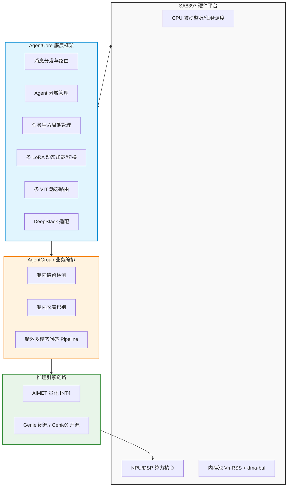
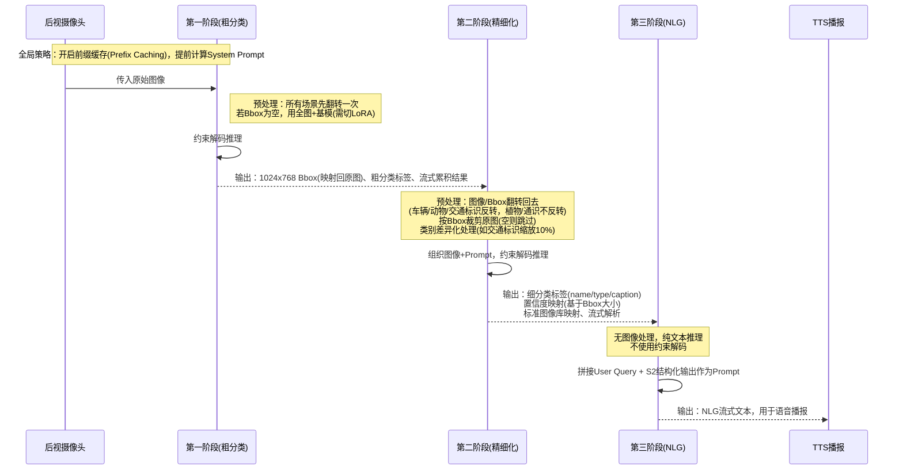
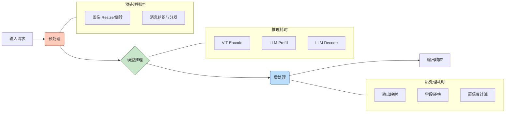

# 1. 岚图8397量产项目SDK：核心技术架构与优化总结

> **文档版本**：V2.0 (富媒体排版)
> **时间背景**：2026-09-16
> **说明**：基于上一阶段项目经历重构。为避免纯表格带来的视觉疲劳，本文档综合运用了**Mermaid流程图、架构图、对比卡片及结构化表格**，以更直观、专业的方式呈现技术细节。

---

## 1. 背景简介与系统全景

### 1.1 项目概述

基于高通 SA8397 平台，主导 Qwen3-omni-4B 多模态大模型的端侧部署与 Agent 框架研发，成功落地舱内遗留检测、衣着识别、舱外多模态问答等核心量产业务，实现端侧大模型在智能座舱的低功耗、高实时运行。

### 1.2 系统架构拓扑图



---

## 2. AgentCore 框架设计

*注：AgentCore 负责消息的分发、Agent 分域、任务管理、多推理框架集成以及模型的加载与推理。*

| 核心能力                     | 技术细节与实现方案                                                                                                                                |
| :--------------------------- | :------------------------------------------------------------------------------------------------------------------------------------------------ |
| **多 LoRA 加载与切换** | 多个场景可能复用同一 LoRA，单场景也可能调用多个 LoRA。支持通过`LoRA ID`（场景标识）+ `LoRA Name`（具体模型标识）唯一确认并动态加载目标 LoRA。 |
| **多 VIT 动态切换**    | 针对不同任务传入的图像分辨率差异，修改底层框架，支持根据输入图片大小动态路由至对应的 VIT 进行 Encode。                                            |
| **DeepStack 支持**     | 适配 Qwen3-omni 的 DeepStack 技术，用于缓解深层网络遗忘图像信息的问题，优化模型整体效果。                                                         |
| **低功耗模式**         | 实现任务打断、模型释放等生命周期管理接口；将 CPU 轮询机制调整为被动监听（Event-driven），大幅降低待机功耗。                                       |
| **稳定性兜底**         | 在各个业务节点设计具体的异常捕获与兜底逻辑，避免进程直接 Crash。                                                                                  |

---

## 3. AgentGroup 业务流程

### 3.1 舱内业务处理逻辑

| 业务场景           | 预处理策略                                | 推理逻辑     | 后处理策略                                       |
| :----------------- | :---------------------------------------- | :----------- | :----------------------------------------------- |
| **舱内遗留** | 左右翻转图像（解决 OMS 相机物理镜像问题） | 两次串行推理 | 输出结果映射                                     |
| **舱内衣着** | 左右翻转图像                              | 单次推理     | 边界值处理（避免输出为空或“未知”）、置信度映射 |

### 3.2 舱外问答业务 Pipeline（车辆/动物/植物/交通标识/其它）

为了更清晰地展示三阶段的流转关系，采用以下时序流程图：



#### 3.2.1 各阶段详细策略拆解表

| 推理阶段           | 图像与 Bbox 处理                                                                                                                                                                                 | 推理策略与 Prompt 组织                                                                          | 输出与后处理                                                                                                                                  |
| :----------------- | :----------------------------------------------------------------------------------------------------------------------------------------------------------------------------------------------- | :---------------------------------------------------------------------------------------------- | :-------------------------------------------------------------------------------------------------------------------------------------------- |
| **第一阶段** | 1. 后视摄像头所有场景先翻转一次。2. 若 Bbox 为空，使用全图和基模（需调用一次 LoRA 切换逻辑）。3. Bbox 对应 1024x768，需映射回原图坐标。                                                          | 使用约束解码（Constrained Decoding）。                                                          | 1. 输出分类标签（粗分类）。2. 流式结果累积输出。                                                                                              |
| **第二阶段** | 1. 后视摄像头图像再翻转回去（车辆/动物/交通标识反转，植物/通识不反转），Bbox 同步翻转。2. 根据一阶段 Bbox（缩放回原图）裁剪，若为空则跳过（如植物）。3. 类别差异化预处理（如交通标识缩放 10%）。 | 1. 组织图像与 Prompt 进行推理。2. 使用约束解码。                                                | 1. 置信度映射（基于 Bbox 框大小）。2. 标准图像库映射（基于输出与图片对应关系）。3. 输出细分类标签（name/type/caption 等），流式解析优化体验。 |
| **第三阶段** | 无图像处理。                                                                                                                                                                                     | 1. 拼接用户 Query + 二阶段结构化输出作为 User Prompt。2. 纯文本推理，**不使用**约束解码。 | 得到 NLG 输出，流式输出解析，用于 TTS 播报。                                                                                                  |

---

## 4. 性能优化体系

### 4.1 推理技术路线对比卡片

```text
┌─────────────────────────────────┐   ┌─────────────────────────────────┐
│          方案 A (闭源生态)         │   │          方案 B (开源生态)         │
├─────────────────────────────────┤   ├─────────────────────────────────┤
│  量化框架：AIMET (开源)            │   │  量化框架：AIMET (开源)            │
│  推理引擎：Genie (闭源)            │   │  推理引擎：GenieX (开源)           │
│  适用场景：深度定制、极致性能调优     │   │  适用场景：自主可控、灵活二次开发   │
└─────────────────────────────────┘   └─────────────────────────────────┘
```

### 4.2 端到端时延拆解图



### 4.3 模型速度优化细节矩阵

| 优化项                    | 目的及原理                                           | 实现方法 / 方案                                                                | 预期效果 / 备注                        |
| :------------------------ | :--------------------------------------------------- | :----------------------------------------------------------------------------- | :------------------------------------- |
| **模型量化**        | 降低显存占用，提升 NPU/DSP 吞吐率                    | 对 VIT 和 LLM 均进行 INT4 量化（涵盖基模及 4 个 LoRA）                         | 0527 浮点 vs 端侧量化对比：多数场景通过率差 0~6pp（nlg/儿童遗留/遗留物近乎无损），植物 caption 约 −10pp；衣着描述在 0527 版异常塌至 ~0%（详见六.1） |
| **开启模型 SSD（存疑，经核查未启用）** | 经核查 `config.json` 的 `sampler` 为 `greedy:true / type:basic`，即**贪心单模型解码**，未启用推测性采样解码 | 配置与 aadkcore/agent_group 源码均无 speculative/draft/forecast 解码字段 | 原“开启 SSD”笔记存疑：既非 Single Shot Detector，也无存储 Swap 证据；建议删除或向模型团队确认所指 |
| **多 VIT 动态切换** | 按不同业务场景和推理阶段采用不同大小的 VIT，缩短时延 | 图像输入 VIT 前进行 Resize，根据大小动态选择`1024x768` 或 `448x448` 的 VIT | 减少冗余计算量                         |
| **单核改多核**      | 充分利用 SA8397 的多核算力                           | VIT 和 LLM 均由单核改为三核/四核（导出时配置参数，修改`default.json`）       | 吞吐量大幅提升                         |
| **前缀缓存**        | 提前计算 System Prompt，加速 LLM Prefill 阶段        | 开启框架级 Prefix Caching 支持（已确认 `base_model.json: enable_prefix_caching=true`） | **已核算**（`tokenizer_qwen3.json`）：11 个 prefix 的 System Prompt 含 sys_tags 约 **318~959 tokens、均值 ~634**（grounding_sr 640 / general_caption 857 / dress_detect 959 / traffic_caption 318 等），即每次推理可省去这段 prefill；上下文预算 cl2560、max_tokens 512 |
| **开启 DeepStack**  | 避免深层模型遗忘图像信息（Qwen3-omni 专属优化）      | 将图像的 Tensor 拼接到 Decode 模型的前几层中                                   | 提升多模态对齐效果                     |

### 4.4 系统级优化亮点面板

> 🟢 **CPU 占用优化 (降功耗)**
>
> - **手段**：将模型配置文件中的 `poll` 参数修改为 `false`，由主动轮询调整为被动事件监听。
> - **收益**：CPU 占用率由 **40% 骤降至 5%**，彻底释放车机系统算力。

> 🔵 **内存泄漏排查 (保稳定)**
>
> - **手段**：
>   1. `ps -ef | grep android_test` 查看 PID
>   2. `pmap -x <pid> > /AI/mem_log.txt` 查看 PSS 变化
>   3. `tail /AI/mem_log.txt` 观察尾部趋势
> - **结论**：场景切换时的内存波动属于正常的内存池分配与回收机制，PSS 峰值未呈单调递增趋势，排除内存泄漏风险。

> 🟠 **系统稳定性防线 (防崩溃)**
>
> - 设计多处兜底逻辑，避免直接 Crash。
> - 引入超时重试机制，进程死亡自动重启 (Watchdog)。
> - 规范异常处理：避免使用 `std::runtime_error`，日志级别统一设置为 `LOG_I()`。
> - 降级策略：异常时传空 JSON 兜底，而非抛出 Error 阻断主线程。

---

## 5. 车机部署测试与评测链路

### 5.1 打包部署方案

| 部署方式           | 实现路径                                                                   | 适用场景                       |
| :----------------- | :------------------------------------------------------------------------- | :----------------------------- |
| **SDK 打包** | 编译生成可执行文件，构建推理对象，支持读取本地 JSON 数据文件进行批量推理。 | 算法快速验证、离线跑测         |
| **APK 打包** | 开发 Android APK，集成 AADK 框架，通过 JNI 调用底层 C++ 推理服务。         | 实车环境部署、对接“元启”平台 |

### 5.2 评测链路构建

*详细评测方法与指标定义见《效果及性能测试报告（GenAI方案）》章节。*

---

## 6. 细节补充说明（后续完善清单）

针对当前文档中留白的关键数据，核查/补充状态如下（2026-09-17 更新）：

| 待补充项                     | 核查/补充状态                                                                                                                                        |
| :--------------------------- | :---------------------------------------------------------------------------------------------------------------------------------------------- |
| **量化精度与损失评估** | ✅ 已补：量化方案为 **INT4**（VIT+LLM，基模+4 LoRA）。0527 浮点 vs 端侧对比——多数场景通过率差 **0~6pp**（nlg/儿童遗留/遗留物近乎无损），植物 caption 约 **−10pp**，交通标识 bbox 小幅下降；**衣着描述在 0527 版异常塌至 ~0%（浮点 51.76%），疑为该量化 build 的阶段性回归，后续版本待核**。明细见 `云端浮点与端侧量化模型对比测试/z_summary_0527`。 |
| **模型 SSD 释义**      | ✅ 已核查：当前为 **greedy 单模型解码**（`config.json` sampler `greedy:true/type:basic`），**未启用推测性采样解码**；配置与 aadkcore/agent_group 源码均无 speculative/draft/forecast 字段。既非 Single Shot Detector，也无存储 Swap 证据。原“开启 SSD”笔记存疑，建议删除或向模型团队确认所指。 |
| **前缀缓存 Token 数**  | ✅ 已核算：用 `tokenizer_qwen3.json` 对 11 个 prefix 的 system_prompt（含 `<|fim_prefix|>system…<|fim_suffix|>` sys_tags）逐条统计——**318~959 tokens、均值 ~634**。映射：dwsr=grounding_sr 640 / dwbs=grounding_base 623 / znzs-car 617 / znzs-sign 318 / znzs-animal 543 / znzs-plant 482 / znzs-general 857 / znzs-nlg=assistant 770 / cnyb-left=incar_item_detect 486 / cnyb-cloth=dress_detect 959 / cnyb-child=person_desc 414。即每次推理可省去这段 prefill（上下文预算 cl2560）。 |
