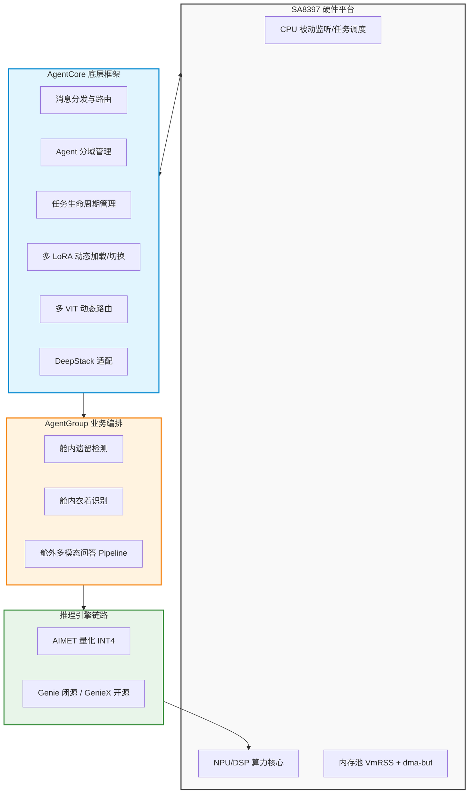
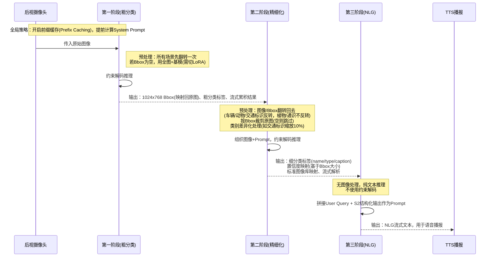
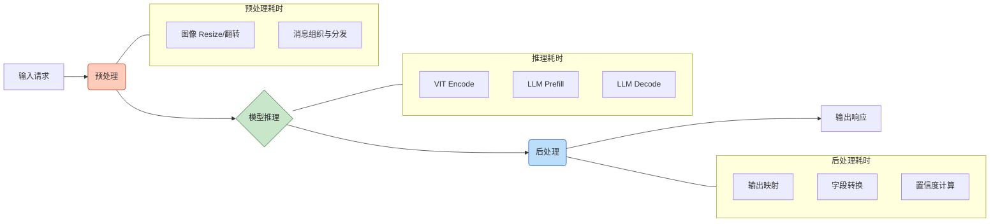

# 1. 岚图8397量产项目SDK：核心技术架构与优化总结

*GenAI 方案 · Qwen3-Omni-4B 端侧部署 · AgentCore / AgentGroup 框架 · 性能优化体系*

> [!TIP]
> **本篇讲什么**
>
> 这是岚图 8397 座舱 VLM 的 **GenAI 方案**（高通 QNN / genai 推理框架）总览，覆盖：
>
> - 系统全景与 AgentCore 底层框架设计
> - AgentGroup 业务编排（舱内遗留 / 衣着、舱外三阶段问答）
> - 性能优化体系（量化、多 VIT、多核、前缀缓存、DeepStack）
> - 车机部署与评测链路
> - 关键数据核查记录（量化损失 / SSD 释义 / 前缀缓存 token 数）
>
> **代码基线**：aadkcore 与 agent_group 仓库 `lantu_sdk_dev` 分支。核心文件：
>
> - AgentCore：`aadkcore/src/models/qnn/qnn_model.cpp`、`src/runtime/model_runner.cpp`、`runtime/data/config/base_model.json`
> - AgentGroup：`agent_group/src/{outcar_qa,incar_item_detect,dress_detect}_agent/*_dispatcher.cpp`

## 1. 背景简介与系统全景

### 1.1 项目概述

基于高通 SA8397 平台，主导 **Qwen3-Omni-4B** 多模态大模型的端侧部署与 Agent 框架研发：

- **落地业务**：舱内遗留检测、衣着识别、舱外多模态问答等核心量产业务
- **目标**：端侧大模型在智能座舱的低功耗、高实时运行

### 1.2 系统架构拓扑图

## 2. AgentCore 框架设计

AgentCore 负责消息的分发、Agent 分域、任务管理、多推理框架集成，以及模型的加载与推理。核心能力：

| 核心能力 | 技术细节与实现方案 | 代码落点 |
| :--- | :--- | :--- |
| **多 LoRA 加载与切换** | 多场景可复用同一 LoRA、单场景可调多个 LoRA；用 `LoRA ID`（场景）+ `LoRA Name`（模型）唯一定位并动态加载 | `model_runner.cpp` `getModelDetailsByScene(scene_id, lora_name)` |
| **多 VIT 动态切换** | 按输入图像分辨率动态路由到对应 VIT Encode | `qnn_model.cpp` `veg_model_small_` / `veg_model_large_`（448×448 / 1024×768） |
| **DeepStack 支持** | 适配 Qwen3-Omni 的 DeepStack，缓解深层网络遗忘图像信息 | `qnn_model.cpp` `deepstack_vit` |
| **低功耗模式** | 任务打断 / 模型释放等生命周期接口；CPU 轮询改被动监听（Event-driven） | 配置 `poll=false` |
| **稳定性兜底** | 各业务节点异常捕获与兜底，避免进程直接 Crash | 各 dispatcher |

> [!NOTE]
> **多 VIT 的两档路由**
>
> `qnn_model.cpp` 按 `veg_param` 的宽高选 VIT：
>
> - `448×448` → 小 VIT（`veg_model_small_`）
> - `1024×768` → 大 VIT（`veg_model_large_`）
>
> 图像进 VIT 前先 Resize 到对应档位，减少冗余计算。

## 3. AgentGroup 业务流程

### 3.1 舱内业务处理逻辑

| 业务场景 | 预处理策略 | 推理逻辑 | 后处理策略 |
| :--- | :--- | :--- | :--- |
| **舱内遗留** | 左右翻转图像（解决 OMS 相机物理镜像） | 两次串行推理 | 输出结果映射 |
| **舱内衣着** | 左右翻转图像 | 单次推理 | 边界值处理（避免输出为空/"未知"）、置信度映射 |

代码落点：

- 翻转：`incar_item_detect_dispatcher.cpp` 里 `cv::flip(full_img, flipped, 1)`（`flipCode=1` 水平翻转，解码后以 BGR raw 写回 letterboxed_msg）
- 遗留物中英映射：`map_item_to_english`（电脑包/手提包→backpack、平板→laptop 等**粗粒度归并，是需求刻意设计，不要"修"**）

### 3.2 舱外问答业务 Pipeline（车辆/动物/植物/交通标识/其它）

三阶段流转（代码在 `outcar_qa_dispatcher.cpp`）：

#### 3.2.1 各阶段详细策略拆解表

| 推理阶段 | 图像与 Bbox 处理 | 推理策略与 Prompt 组织 | 输出与后处理 |
| :--- | :--- | :--- | :--- |
| **第一阶段** | ① 后视摄像头所有场景先翻转一次 ② Bbox 为空则用全图+基模（需调一次 LoRA 切换）③ Bbox 对应 1024×768，需映射回原图坐标 | 约束解码（Constrained Decoding） | ① 粗分类标签 ② 流式结果累积 |
| **第二阶段** | ① 图像/Bbox 翻转回去（车辆/动物/交通标识反转，植物/通识不反转）② 按一阶段 Bbox（缩放回原图）裁剪，空则跳过（如植物）③ 类别差异化预处理（如交通标识缩放 10%） | ① 组织图像+Prompt ② 约束解码 | ① 置信度映射（基于 Bbox 大小）② 标准图像库映射 ③ 细分类标签（name/type/caption），流式解析 |
| **第三阶段** | 无图像处理 | ① 拼接用户 Query + 二阶段结构化输出作为 User Prompt ② 纯文本推理，**不使用**约束解码 | NLG 流式输出，用于 TTS 播报 |

代码落点（`outcar_qa_dispatcher.cpp`）：

- 翻转：`cv::flip(src, src, 1)`（一阶段入口 + 二阶段翻回）
- 一阶段 grounding：`handle_view_request(msg, model_data, "outcar_qa.grounding_sr.system_prompt")` / `grounding_base`
- Bbox 映射：`bbox1000ToOriginal(meta.bbox, cols, rows, 1024, 768)`（模型输出 0~1000 → 原图坐标）
- 二阶段决策：`decide_stage2_by_label(label, bbox)`；二阶段走 `data_message_lora5`

## 4. 性能优化体系

### 4.1 推理技术路线对比

| 维度 | 方案 A（闭源生态） | 方案 B（开源生态） |
| :--- | :--- | :--- |
| 量化框架 | AIMET（开源） | AIMET（开源） |
| 推理引擎 | **Genie**（闭源） | **GenieX**（开源） |
| 适用场景 | 深度定制、极致性能调优 | 自主可控、灵活二次开发 |

### 4.2 端到端时延拆解图

### 4.3 模型速度优化细节矩阵

| 优化项 | 目的及原理 | 实现方法 / 方案 | 预期效果 / 备注 |
| :--- | :--- | :--- | :--- |
| **模型量化** | 降显存、提升 NPU/DSP 吞吐 | VIT + LLM 均 INT4（基模 + 4 个 LoRA） | 0527 浮点 vs 端侧：多数场景差 0~6pp（nlg/儿童遗留/遗留物近乎无损），植物 caption 约 −10pp；衣着描述 0527 版异常塌至 ~0%（见 6.1） |
| **模型 SSD（经核查未启用）** | 经核查为 greedy 单模型解码，非推测性采样解码 | `config.json` sampler `greedy:true/type:basic`；源码无 speculative/draft/forecast 字段 | 原"开启 SSD"笔记存疑，既非 Single Shot Detector 也无存储 Swap 证据（见 6.2） |
| **多 VIT 动态切换** | 按场景/阶段用不同大小 VIT 缩短时延 | 进 VIT 前 Resize，按大小选 `1024×768` 或 `448×448` | 减少冗余计算 |
| **单核改多核** | 利用 SA8397 多核算力 | VIT/LLM 由单核改三核/四核（导出时配置，改 `default.json`） | 吞吐量大幅提升 |
| **前缀缓存** | 提前算 System Prompt，加速 Prefill | 框架级 Prefix Caching（`base_model.json: enable_prefix_caching=true`） | 11 个 prefix 的 System Prompt 约 318~959 tokens、均值 ~634，每次省去这段 prefill；上下文 cl2560、max_tokens 512（见 6.3） |
| **开启 DeepStack** | 避免深层模型遗忘图像信息（Qwen3-Omni 专属） | 图像 Tensor 拼接到 Decode 模型前几层 | 提升多模态对齐 |

### 4.4 系统级优化亮点

> [!TIP]
> **CPU 占用优化（降功耗）**
>
> - **手段**：模型配置文件 `poll` 参数改 `false`，由主动轮询转为被动事件监听
> - **收益**：CPU 占用率由 **40% 骤降至 5%**，彻底释放车机系统算力

> [!NOTE]
> **内存泄漏排查（保稳定）**
>
> - **手段**：
>   - `ps -ef | grep android_test` 查 PID
>   - `pmap -x <pid> > /AI/mem_log.txt` 看 PSS 变化
>   - `tail /AI/mem_log.txt` 观察尾部趋势
> - **结论**：场景切换时的内存波动属正常内存池分配/回收，PSS 峰值未单调递增，**排除内存泄漏**

> [!IMPORTANT]
> **系统稳定性防线（防崩溃）**
>
> - 多处兜底逻辑，避免直接 Crash
> - 超时重试 + 进程死亡自动重启（Watchdog）
> - 规范异常处理：避免 `std::runtime_error`，日志统一 `LOG_I()`
> - 降级策略：异常时传空 JSON 兜底，而非抛 Error 阻断主线程

## 5. 车机部署测试与评测链路

### 5.1 打包部署方案

| 部署方式 | 实现路径 | 适用场景 |
| :--- | :--- | :--- |
| **SDK 打包** | 编译生成可执行文件，构建推理对象，读本地 JSON 批量推理 | 算法快速验证、离线跑测 |
| **APK 打包** | Android APK 集成 AADK 框架，JNI 调用底层 C++ 推理服务 | 实车部署、对接"元启"平台 |

> [!NOTE]
> APK 形态的宿主容器、JNI 桥接、HTTP 服务化与前台服务自愈，见 [3. APK 集成与端侧服务化](apk-integration.html)。

### 5.2 评测链路构建

详细评测方法与指标定义见 [4. 效果及性能测试](effect-performance.html)。

## 6. 关键数据核查记录

以下为关键数据的核查 / 核算结论（2026-09-17 更新）。

### 6.1 量化精度与损失评估

- **量化方案**：INT4（VIT + LLM，基模 + 4 LoRA）
- **0527 浮点 vs 端侧量化对比**：
  - 多数场景通过率差 **0~6pp**（nlg / 儿童遗留 / 遗留物近乎无损）
  - 植物 caption 约 **−10pp**
  - 交通标识 bbox 小幅下降
  - **衣着描述在 0527 版异常塌至 ~0%（浮点 51.76%），疑为该量化 build 的阶段性回归，后续版本待核**
- 明细见 `云端浮点与端侧量化模型对比测试/z_summary_0527`

### 6.2 模型 SSD 释义（澄清）

- **当前为 greedy 单模型解码**：`config.json` sampler `greedy:true / type:basic`
- **未启用推测性采样解码**：配置与 aadkcore / agent_group 源码均无 speculative / draft / forecast 字段
- 既非 Single Shot Detector，也无存储 Swap 证据
- 原"开启 SSD"笔记存疑，建议删除或向模型团队确认所指

### 6.3 前缀缓存 Token 数

用 `tokenizer_qwen3.json` 对 11 个 prefix 的 system_prompt（含 `<|fim_prefix|>system…<|fim_suffix|>` sys_tags）逐条统计：**318~959 tokens、均值 ~634**。即每次推理可省去这段 prefill（上下文预算 cl2560、max_tokens 512）。

| prefix | 对应 system_prompt | tokens |
| :--- | :--- | :--- |
| dwsr | grounding_sr | 640 |
| dwbs | grounding_base | 623 |
| znzs-car | 舱外-车辆 | 617 |
| znzs-sign | 舱外-交通标识 | 318 |
| znzs-animal | 舱外-动物 | 543 |
| znzs-plant | 舱外-植物 | 482 |
| znzs-general | 舱外-通识 | 857 |
| znzs-nlg | assistant | 770 |
| cnyb-left | incar_item_detect | 486 |
| cnyb-cloth | dress_detect | 959 |
| cnyb-child | person_desc | 414 |
