# 7. GenAI方案和AIService方案端到端总耗时对比参考

*同设备（北京旧水冷）· infer_total 端到端总耗时 · 9 场景 28 用例*

> [!TIP]
> **本篇讲什么**
>
> 在同一台设备（北京旧水冷）上，对 **GenAI 方案**与 **AIService 方案**的端到端总耗时（`infer_total`）做横向对比，覆盖 9 个场景共 28 个用例。
>
> **数据来源**：2026-09-16 实测，统计字段 `infer_total`（端到端总耗时）。

> [!WARNING]
> **口径前提：这不是控制变量的纯后端对比**
>
> 两形态当时跑的是**两个不同的模型包**：
>
> - genai 用 version `…26072901`、aiservice 用 version `…26072301`（差 6 天）
> - 11 个 prefix KV 缓存与 LoRA 权重 md5 均不同
>
> 所以耗时差异**同时包含**两部分：
>
> - **后端架构开销**：aiservice 多一跳 HTTP 到 `VoyahAIService` + 服务侧调度；genai 进程内直跑 QNN
> - **模型 build 差异**：两个包不是同一模型版本
>
> 因此本表是**参考性横向对比**，不是纯后端基准。要做纯后端对比，需两形态用同一模型版本生成的包。另：跨形态的**输出效果**同样不可直接比（详见 [AIService 后端集成与重构](aiservice-integration.html) 难点 5.3）。

## 1. 对比数据

| 场景 | 用例数 | genai 均值 | aiservice 均值 | 差值 (ai−gen) | genai 中位/min/max | aiservice 中位/min/max |
| :--- | :--- | :--- | :--- | :--- | :--- | :--- |
| 物品检测 (Agent100) | 5 | 1738 | 2110 | +372 (+21.4%) | 1586 / 1472 / 2446 | 2093 / 1984 / 2205 |
| 车内儿童检测 (Agent100) | 2 | 1385 | 1943 | +558 (+40.3%) | 1385 / 1380 / 1390 | 1943 / 1925 / 1961 |
| 着装/空调温控 (Agent200) | 4 | 921 | 1303 | +382 (+41.5%) | 898 / 876 / 1011 | 1306 / 1230 / 1369 |
| 车辆识别 (Agent300) | 8 | 2675 | 3158 | +482 (+18.0%) | 2716 / 2315 / 2904 | 3297 / 2821 / 3384 |
| 植物识别 (Agent300) | 5 | 2364 | 3006 | +641 (+27.1%) | 2399 / 2131 / 2572 | 3023 / 2899 / 3126 |
| 动物识别 (Agent300) | 1 | 1559 | 1911 | +352 (+22.6%) | 1559 / 1559 / 1559 | 1911 / 1911 / 1911 |
| 通用识别 (Agent300) | 1 | 2063 | 2900 | +837 (+40.6%) | 2063 / 2063 / 2063 | 2900 / 2900 / 2900 |
| 交通标志 (Agent300) | 1 | 2509 | 3441 | +932 (+37.1%) | 2509 / 2509 / 2509 | 3441 / 3441 / 3441 |
| 域外拒答 (Agent300) | 1 | 825 | 1105 | +280 (+33.9%) | 825 / 825 / 825 | 1105 / 1105 / 1105 |
| **全部场景** | **28** | **1976** | **2475** | **+499 (+25.3%)** | **2222 / 825 / 2904** | **2860 / 1105 / 3441** |

各场景均值耗时对比（每组两根：**前=genai，后=aiservice**）：

```mermaid
xychart-beta
    title "GenAI vs AIService 端到端均值耗时 (ms)"
    x-axis ["物品", "儿童", "着装", "车辆", "植物", "动物", "通用", "交通", "拒答"]
    y-axis "端到端均值耗时 (ms)" 0 --> 3600
    bar [1738, 1385, 921, 2675, 2364, 1559, 2063, 2509, 825]
    bar [2110, 1943, 1303, 3158, 3006, 1911, 2900, 3441, 1105]
```

## 2. 结论

- **genai 方案在全部 9 个场景均快于 aiservice**，整体平均快约 20%（aiservice 慢 499ms / +25.3%）
- **绝对耗时多出最多**：交通标志（+932ms）、通用识别（+837ms）
- **相对劣化最大**：着装温控（+41.5%）、通用识别（+40.6%）、儿童检测（+40.3%）
- **主因推断**：aiservice 每次推理多一跳本机 HTTP（`127.0.0.1:8090`）+ `VoyahAIService` 服务侧调度/排队开销；genai 进程内直接调 QNN，无此中间层（注意仍受上方「口径前提」约束，非纯后端差异）
