# 6. GenAI方案和AIService方案选型决策与端到端对比

*同设备（北京旧水冷）· 多维选型决策表 · infer_total 端到端总耗时 · 9 场景 28 用例*

> [!TIP]
> **本篇讲什么**
>
> GenAI 与 AIService 两套推理后端的**选型决策参考**。在「只比时延」的基础上扩成一张多维选型决策表（包体 / 内存 / 端到端时延 / 部署复杂度 / 可维护性 / 职责归位 / 可回摆性），并保留同设备端到端总耗时（`infer_total`）横向对比。
>
> - **选型决策表** → §1（各维度数据散见于《AIService 后端集成与重构》《性能优化、存储与稳定性测试报告》等篇，此处汇聚并逐行标源）
> - **端到端耗时对比** → §2（2026-09-16 实测，9 场景 28 用例）
> - **结论（已按口径修订）** → §3
>
> **数据来源**：时延为 2026-09-16 实测（统计字段 `infer_total`，端到端总耗时）；包体 / 内存 / 部署等维度引自对应篇，逐行标注。

> [!WARNING]
> **口径前提：这不是控制变量的纯后端对比**
>
> 两形态当时跑的是**两个不同的模型包**：
>
> - genai 用 version `…26072901`、aiservice 用 version `…26072301`（差 6 天）
> - 11 个 prefix KV 缓存与 LoRA 权重 md5 均不同
>
> 所以耗时差异**同时包含**两部分：
>
> - **后端架构开销**：aiservice 多一跳 HTTP 到 `VoyahAIService` + 服务侧调度；genai 进程内直跑 QNN
> - **模型 build 差异**：两个包不是同一模型版本
>
> 因此本表是**参考性横向对比**，不是纯后端基准。要做纯后端对比，需两形态用同一模型版本生成的包。另：跨形态的**输出效果**同样不可直接比（详见 [AIService 后端集成与重构](aiservice-integration.html) 难点 5.3）。
>
> **genai 绝对时延也不可跨篇直接比**：本篇 §2 为 **2026-09-16** 实测（按 0915 调整**应为 NPU 4 核**、统计字段 `infer_total`），而 [效果·性能·稳定性篇 §2.2](effect-perf-stability.html) 的舱外 Total 为 **2026-09-02** 实测（**NPU 3 核**、统计字段 `Total`）。两次测量除模型包外还混杂：**NPU 核数（3 vs 4）**、**测量 harness 与统计字段**（`Total` 与 `infer_total` 是否同义**待澄清**）、日期与场景集。同场景对比：车辆 2675 vs 1978（+35%）、植物 2364 vs 1994（+18%）、交通 2509 vs 2001（+25%）、动物 1559 vs 1770（−12%）、通用 2063 vs 1964（+5%），**方向不一致**，且 09-16 按 0915 调整应已是 4 核、反而整体更慢——说明上述混杂因子不可忽略，**genai 绝对值不能跨篇对账**，只能在各自口径内使用。

## 1. 选型决策表

| 维度 | GenAI 形态 | AIService 形态 | 倾向 / 来源 |
| :--- | :--- | :--- | :--- |
| **包体** | 378 MB | **222 MB**（−156 MB，剥离 `libqnn/` 146 MB + 整套 genai 依赖） | AIService 优 · [集成篇 §4.2](aiservice-integration.html) |
| **内存**（VmRSS + dma-buf 稳态） | **~7.4 GB**（7531 MB） | ~10.3 GB（10501 MB，高 ~2.9 GB / **+39%**，以 genai 为基线） | GenAI 优 · [效果·性能·稳定性篇 · 内存](effect-perf-stability.html) |
| **端到端时延**（`infer_total` 均值） | **1976 ms** | 2475 ms（+499 ms / +25.3%） | 本次 GenAI 低，但**不可归因到后端**（见口径前提）· 本篇 §2 |
| **部署复杂度** | 包重、依赖多，但进程内自持、无外部服务依赖 | 包轻、业务侧仅 HTTP，但依赖厂商 `VoyahAIService` 在场，服务端行为不可控（扫描根硬编码 `/AI/VLM/models`、只启动时扫描、槽位泄漏） | 各有代价 · [集成篇 §5.2/§5.8](aiservice-integration.html) |
| **可维护性 / 联调** | 进程内 C++ API，genai 是高通黑盒、排查难；约束解码未实现（EBNF 缺失仅 warn 静默降级） | HTTP + JSON 跨语言、可 `curl` 直接联调、OpenAI 协议通用、约束解码经 `extras.ebnf_path` 生效；但服务端无计量（`usage` 恒 0 / `max_tokens` 忽略 / 无 `/metrics`） | AIService 联调优 · [集成篇 §3.6/§4.3](aiservice-integration.html) |
| **职责归位** | SDK 直接持有 QNN/genai 运行时，模型加载 / NPU 调度在我方 | 模型加载 / NPU 调度 / 多客户端并发交岚图系统服务，SDK 不再直接持有 QNN 运行时 | AIService（换后端的核心动因）· [集成篇 §1.1](aiservice-integration.html) |
| **可回摆性** | **构建期回摆**：`third_party/genai_sdk/`、`src/models/qnn/` 与全部模板原地保留、无删码；但瘦身包（QNN=OFF，222 MB）未编入 QNN 后端，回摆需把 `ENABLE_QNN_MODEL` 改回 ON **重新编译**。**运行期回摆**：默认 8397 构建双开关均 ON、两后端都编入，改 `model_name` 前缀（`qnn/` ↔ `aiservice/`）即切换，**零重编、零业务代码改动** | 同左 | 两者都强（构建期回摆成本一次重编，运行期回摆零成本）· [集成篇 §2.2/§4.1/§4.2](aiservice-integration.html) |
| **输出效果** | 不可直接比（两形态是不同模型包） | 同左 | 见口径前提 · [集成篇难点 5.3](aiservice-integration.html) |

> [!NOTE]
> **内存口径说明**：aiservice 侧测的是持模型的 `VoyahAIService` 服务进程、genai 侧测的是 `android_test` 进程，两者分别是各自形态下「持有模型的进程」，口径可比。差异主要在 CPU 侧 VmRSS（+2583 MB ≈ +2.5 GB），两侧 DSP dma-buf 基本持平（+387 MB）；合计差 **~2.9 GB（+39%，以 genai 为基线**，2970/7531；MB→GB 统一按 /1024，原「~27%」是差值占 aiservice 自身合计的比例、口径有误，详见 [效果·性能·稳定性篇 · 内存](effect-perf-stability.html)）；**根因待归因**（疑为多 LoRA 预加载 / AgentCore 框架开销 / 上下文缓存）。

> [!NOTE]
> **可回摆性依据**：双开关 `ENABLE_QNN_MODEL` / `ENABLE_AISERVICE_MODEL`（正交、各管四层）与运行期 `model_name` 前缀路由，以 [集成篇 §2.2 / §4.1](aiservice-integration.html) 为据；该双开关在远端 `lantu_aiservice_dev` 分支，本篇未逐行复核远端代码，**以该分支为准**。

**本项目怎么选**：最终以 **AIService 为主用后端、GenAI 保留可回摆**。取舍逻辑：

- **取 AIService**：职责归位（NPU 调度交系统服务）+ 包体瘦身 156 MB + HTTP/OpenAI 协议联调顺手 + 约束解码可用
- **代价**：内存更高（~2.9 GB / +39%，待归因）、本次口径下端到端时延更高（但不可归因到后端）、且依赖厂商服务端行为（扫描根 / 槽位 / 计量缺口都只能客户端侧适配）
- **兜底**：可回摆分两级——双后端均编入时**运行期回摆**只改 `model_name` 前缀（零重编）；瘦身包则需**构建期回摆**，把 `ENABLE_QNN_MODEL` 改回 ON 重新编译。两者都不改码

## 2. 端到端耗时对比

| 场景 | 用例数 | genai 均值 | aiservice 均值 | 差值 (ai−gen) | genai 中位/min/max | aiservice 中位/min/max |
| :--- | :--- | :--- | :--- | :--- | :--- | :--- |
| 物品检测 (Agent100) | 5 | 1738 | 2110 | +372 (+21.4%) | 1586 / 1472 / 2446 | 2093 / 1984 / 2205 |
| 车内儿童检测 (Agent100) | 2 | 1385 | 1943 | +558 (+40.3%) | 1385 / 1380 / 1390 | 1943 / 1925 / 1961 |
| 着装/空调温控 (Agent200) | 4 | 921 | 1303 | +382 (+41.5%) | 898 / 876 / 1011 | 1306 / 1230 / 1369 |
| 车辆识别 (Agent300) | 8 | 2675 | 3158 | +482 (+18.0%) | 2716 / 2315 / 2904 | 3297 / 2821 / 3384 |
| 植物识别 (Agent300) | 5 | 2364 | 3006 | +641 (+27.1%) | 2399 / 2131 / 2572 | 3023 / 2899 / 3126 |
| 动物识别 (Agent300) | 1 | 1559 | 1911 | +352 (+22.6%) | 1559 / 1559 / 1559 | 1911 / 1911 / 1911 |
| 通用识别 (Agent300) | 1 | 2063 | 2900 | +837 (+40.6%) | 2063 / 2063 / 2063 | 2900 / 2900 / 2900 |
| 交通标志 (Agent300) | 1 | 2509 | 3441 | +932 (+37.1%) | 2509 / 2509 / 2509 | 3441 / 3441 / 3441 |
| 域外拒答 (Agent300) | 1 | 825 | 1105 | +280 (+33.9%) | 825 / 825 / 825 | 1105 / 1105 / 1105 |
| **全部场景** | **28** | **1976** | **2475** | **+499 (+25.3%)** | **2222 / 825 / 2904** | **2860 / 1105 / 3441** |

各场景均值耗时对比（每组两根：**前=genai，后=aiservice**）：

```mermaid
xychart-beta
    title "GenAI vs AIService 端到端均值耗时 (ms)"
    x-axis ["物品", "儿童", "着装", "车辆", "植物", "动物", "通用", "交通", "拒答"]
    y-axis "端到端均值耗时 (ms)" 0 --> 3600
    bar [1738, 1385, 921, 2675, 2364, 1559, 2063, 2509, 825]
    bar [2110, 1943, 1303, 3158, 3006, 1911, 2900, 3441, 1105]
```

## 3. 结论（已按口径修订）

**本次测量事实**（28 用例，受上方口径前提约束）：

- genai 在全部 9 个场景的 `infer_total` 均值均低于 aiservice；整体 1976 vs 2475 ms，aiservice 均值高 499 ms（+25.3%）

**差异不可归因到后端**：

- 口径前提已说明，两形态跑的是**两个不同的模型包**（版本差 6 天、11 个 prefix KV 与 LoRA 权重 md5 均不同）。因此 +25.3% **同时包含模型 build 差异与后端架构开销**，现有数据无法分离二者
- 原「主因推断：aiservice 多一跳 HTTP」在此**降级为待验证假设**，不作为结论。要坐实 HTTP 开销需控制变量复测：① loopback 空载 RTT 基线；② 同模型包 A/B（方法见 [AIService 后端集成与重构 §3.8](aiservice-integration.html)）。在此之前，正确表述是「**差异不可归因到后端，需控制变量复测**」

**样本量警示（不要据单例排序）**：

- 动物 / 通用 / 交通 / 拒答四场景**各只有 1 个用例**（中位 = min = max = 均值），从单样本得出的排名——如「相对劣化最大：通用 +40.6%」「绝对多出最多：交通 +932 ms」——**统计上无意义，只记录、不排序**
- 样本量相对充分的是：车辆识别（8）、物品检测（5）、植物识别（5）、着装温控（4）、儿童检测（2），对应差值 +18.0% / +21.4% / +27.1% / +41.5% / +40.3% 更有参考意义——但**同样受口径前提约束**，不能归因到后端
