# 6. GenAI方案和AIService方案选型决策与端到端对比

*同设备（北京旧水冷）· 多维选型决策表 · infer_total 端到端总耗时 · 9 场景 28 用例*

> [!TIP]
> **本篇讲什么**
>
> GenAI 与 AIService 两套推理后端的**选型决策参考**。在「只比时延」的基础上扩成一张多维选型决策表（包体 / 内存 / 端到端时延 / 部署复杂度 / 可维护性 / 职责归位 / 可回摆性），并保留同设备端到端总耗时（`infer_total`）横向对比。
>
> - **选型决策表** → §1（各维度数据散见于《AIService 后端集成与重构》《效果、性能与稳定性》等篇，此处汇聚并逐行标源；表内无主观评分，依据分三类逐行可查，见表后 NOTE）
> - **端到端耗时对比** → §2（2026-09-16 实测，9 场景 28 用例；`infer_total` 的代码级语义见 §2 NOTE）
> - **结论（已按口径修订）** → §3
>
> **数据来源**：时延为 2026-09-16 实测（统计字段 `infer_total`，端到端总耗时）；内存为 2026-08-21 `dmabuf_dump` 稳态实测；包体 / 部署等维度引自对应篇，逐行标注。

> [!WARNING]
> **口径前提：这不是控制变量的纯后端对比**
>
> 两形态当时跑的是**两个不同的模型包**：
>
> - genai 用 version `…26072901`、aiservice 用 version `…26072301`（差 6 天）
> - 11 个 prefix 的 `kv-cache.primary.qnn-htp` **逐个 md5 不同**（`znzs-nlg` 连 `last_token` 也不同，22 个 prefix 文件中 12 个不同）；LoRA 权重**抽查**（`cnyb`/`znzs`/`dwsr` 三个 adapter 各 3 个分片文件）md5 全部不同——两个包是**不同的模型 build**，不是数值抖动
>
> 所以耗时差异**同时包含**两部分：
>
> - **后端架构开销**：aiservice 多一跳本机 HTTP 到 `VoyahAIService` + 服务侧调度；genai 进程内直跑 QNN。注意两包的 prefix 产物均为 `*.qnn-htp` 命名——**aiservice 服务端底层同样跑在 QNN/HTP 上**，故这里比的是**调用路径**（进程内 genai API 直调 vs 本机 HTTP + 服务侧调度）的差异，不是两套 NPU 软件栈的差异
> - **模型 build 差异**：两个包不是同一模型版本。prefix KV 是用特定权重预计算的 prefill 状态，KV 不同即模型条件不同——这是**一阶差异**，不能当抖动处理
>
> 另有一个**潜在第三因子（待澄清）**：两包的 **NPU 核数是否一致未在现有材料中披露**——核数在模型导出时配置（见 [GenAI 架构篇 §5.2](genai-architecture.html)），genai 侧按 0915 调整应为 4 核，而该调整是否覆盖 aiservice 的 07-23 包未知；若不一致，核数差同样混入时延差。
>
> 因此本表是**参考性横向对比**，不是纯后端基准。要做纯后端对比，需两形态用同一模型版本生成的包。另：跨形态的**输出效果**同样不可直接比（详见 [AIService 后端集成与重构](aiservice-integration.html) 难点 5.3）。
>
> **genai 绝对时延也不可跨篇直接比**：本篇 §2 为 **2026-09-16** 实测（按 0915 调整**应为 NPU 4 核**、统计字段 `infer_total`），而 [效果·性能·稳定性篇 §2.2](effect-perf-stability.html) 的舱外 Total 为 **2026-09-02** 实测（**NPU 3 核**、统计字段 `Total`）。两次测量除模型包外还混杂：**NPU 核数（3 vs 4）**、**测量 harness 与统计字段**（`infer_total` 的代码级语义已核实为 dispatcher 累计计时、见 §2 NOTE；xlsx 的 `Total` 与其是否同口径仍需原始数据澄清）、日期与场景集。同场景对比：车辆 2675 vs 1978（+35%）、植物 2364 vs 1994（+18%）、交通 2509 vs 2001（+25%）、动物 1559 vs 1770（−12%）、通用 2063 vs 1964（+5%），**方向不一致**，且 09-16 按 0915 调整应已是 4 核、反而整体更慢——说明上述混杂因子不可忽略，**genai 绝对值不能跨篇对账**，只能在各自口径内使用。

## 1. 选型决策表

| 维度 | GenAI 形态 | AIService 形态 | 倾向 / 来源 |
| :--- | :--- | :--- | :--- |
| **包体** | 378 MB | **222 MB**（−156 MB，剥离 `libqnn/` 146 MB + 整套 genai 依赖） | AIService 优 · [集成篇 §4.2](aiservice-integration.html) |
| **内存**（VmRSS + dma-buf 稳态） | **~7.4 GB**（7531 MB） | ~10.3 GB（10501 MB，高 ~2.9 GB / **+39%**，以 genai 为基线） | GenAI 优 · [效果·性能·稳定性篇 · 内存](effect-perf-stability.html) |
| **端到端时延**（`infer_total` 均值） | **1976 ms** | 2475 ms（+499 ms / +25.3%） | 本次 GenAI 低，但**不可归因到后端**（见口径前提）· 本篇 §2 |
| **部署复杂度** | 包重、依赖多，但进程内自持、无外部服务依赖 | 包轻、业务侧仅 HTTP，但依赖厂商 `VoyahAIService` 在场，服务端行为不可控（扫描根硬编码 `/AI/VLM/models`、只启动时扫描、槽位泄漏） | 各有代价 · [集成篇 §5.2/§5.8](aiservice-integration.html) |
| **可维护性 / 联调** | 进程内 C++ API，genai/Genie 是高通闭源黑盒、排查难；**约束解码整体缺位**——genai 形态配置本无 `ebnf_path` 字段，QNN 后端对 ebnf/grammar **零消费**（`src/models/qnn/` grep 0 命中），配置层即便透传也被静默忽略（连 warn 都没有） | HTTP + JSON 跨语言、可 `curl` 直接联调、OpenAI 协议通用、约束解码经 `extras.ebnf_path` 生效（文件缺失仅告警不清空，见集成篇 3.4）；`max_tokens` 被服务端忽略、无 `/metrics` 端点。**计量缺口两形态大体共有**：input tokens 均不可得（genai 硬编码 `input_tokens=0`，`qnn_model.cpp:810`；aiservice 服务端 `usage` 恒 0 且本地无 tokenizer），output tokens 均靠客户端计数（genai 数流回调并打 `tokens_per_second` 日志；aiservice 数 SSE 帧） | AIService 联调优（计量缺口非两形态区分项）· [集成篇 §3.6 / 难点 5.5](aiservice-integration.html) + genai 形态代码核实 |
| **职责归位** | SDK 直接持有 QNN/genai 运行时，模型加载 / NPU 调度在我方 | 模型加载 / NPU 调度 / 多客户端并发交岚图系统服务，SDK 不再直接持有 QNN 运行时 | AIService（换后端的核心动因）· [集成篇 §1.1](aiservice-integration.html) |
| **可回摆性** | **构建期回摆**：`third_party/genai_sdk/`、`src/models/qnn/` 与全部模板原地保留、无删码；但瘦身包（QNN=OFF，222 MB）未编入 QNN 后端，回摆需把 `ENABLE_QNN_MODEL` 改回 ON **重新编译**。**运行期回摆**：默认 8397 构建双开关均 ON、两后端都编入，改运行期配置的 `model_name` 前缀（`qnn/` ↔ `aiservice/`）即切换，**零重编、零业务代码改动**；但前缀不是唯一字段——QNN 后端还要求 `config_path` 指向含 `model_path` 的 veg 配置，**两字段须成对改**（错配的两种失败模式见表后 WARNING） | 同左 | 两者都强（构建期回摆成本一次重编；运行期回摆零重编、配置级，但非无风险单字段翻转）· [集成篇 §2.2/§4.1/§4.2](aiservice-integration.html) + genai 形态代码核实 |
| **输出效果** | 不可直接比（两形态是不同模型包） | 同左 | 见口径前提 · [集成篇难点 5.3](aiservice-integration.html) |

> [!NOTE]
> **表内依据分三类（无主观评分）**：① **实测值**——包体（构建产物对比，集成篇 §4.2）、内存（2026-08-21 `dmabuf_dump` 稳态实测）、端到端时延（2026-09-16，28 用例），各带口径与日期；② **代码事实**——双开关与 `model_name` 前缀路由、genai 约束解码缺位、两形态计量缺口、运行期回摆的失败模式，均可按文件/行号复核（genai 形态侧本轮已在本地树逐行核实，aiservice 形态侧以集成篇 / `lantu_aiservice_dev` 分支为准）；③ **工程定性**——部署复杂度 / 黑盒排查难度，来自集成篇 §5 的真实排查记录（扫描根硬编码、槽位泄漏、SELinux 等），不是印象分。

> [!NOTE]
> **内存口径说明**：aiservice 侧测的是持模型的 `VoyahAIService` 服务进程、genai 侧测的是 `android_test` 进程，两者分别是各自形态下「持有模型的进程」，口径可比。差异主要在 CPU 侧 VmRSS（+2583 MB ≈ +2.5 GB），两侧 DSP dma-buf 基本持平（+387 MB）；合计差 **~2.9 GB（+39%，以 genai 为基线**，2970/7531；MB→GB 统一按 /1024，原「~27%」是差值占 aiservice 自身合计的比例、口径有误，详见 [效果·性能·稳定性篇 · 内存](effect-perf-stability.html)）。
>
> **采样与归因口径（2026-08-21 `dmabuf_dump` 统一口径稳态复测）**：
>
> - **稳态采样**：genai 侧 dma-buf 随推理推进（KV 填充）持续增长、约 12s 才到稳态，早采样会低估 ~1 GB（早期「genai 低 38%」的数值即因此作废）；本表两侧均为稳态采样
> - **差异已定位到 CPU 匿名堆**：VmRSS 再分解，RssFile（模型/LoRA/库的 mmap）两侧基本持平（~1.4 GB vs ~1.4 GB），差异几乎全在 **RssAnon**（aiservice ~3.0 GB vs genai ~0.3–0.5 GB，含两个 ~1.5 GB 大块）——即服务进程在 CPU 堆上多持有一份 ~2.5 GB 的副本；genai 省内存的本质是**不把模型在 CPU 堆里再留一份**（省的是 CPU 内存，不是 DSP 内存）
> - **待归因收窄**：「差在哪」已定位（CPU 匿名堆）；「为什么多持一份、能否压缩」（疑为多 LoRA 预加载 / AgentCore 框架开销 / 上下文缓存）仍待归因

> [!WARNING]
> **运行期回摆的两种失败模式（genai 形态树逐行核实）——回摆不是无风险的单字段翻转**
>
> - **改一半 → 当场崩溃（非静默）**：只把 `model_name` 前缀改成 `qnn/`、而 `config_path` 仍指向不含 `model_path` 字段的配置 → `QnnModel::loadFromConfig` 抛 `std::runtime_error("配置文件中缺少model_path字段")`（`qnn_model.cpp:1123`；配置打不开时同样抛 `runtime_error`，`:1108`）。而 `init_model_instance` **只 catch `std::invalid_argument`**（`model_runner.cpp`），`runtime_error` 一路上抛无人兜底 → 进程终止，不是静默失败
> - **前缀写错 → 静默空结果**：`model_name` 两个 pattern 都不命中（genai 侧 pattern 是 `qnn/qwen.*`、aiservice 侧是 `aiservice/.*`，大小写/名字不符也算不命中）→ `LlmRegistry::getLlm` 抛 `invalid_argument`（`register.hpp`）→ 被 catch 成 `LOG_E` + `return false`，`init_system_agent` 不看返回值 → 症状是**每场景返回空**（与集成篇难点 5.4 同一根因）
>
> 因此「运行期回摆零成本」的准确表述是：**配置级操作、零重编，但 `model_name` 与 `config_path` 须成对改**；改前先核对两字段齐备，改后先空跑验证再上业务。

> [!NOTE]
> **可回摆性依据**：双开关 `ENABLE_QNN_MODEL` / `ENABLE_AISERVICE_MODEL`（正交、各管四层）与运行期 `model_name` 前缀路由，以 [集成篇 §2.2 / §4.1](aiservice-integration.html) 为据；该双开关在远端 `lantu_aiservice_dev` 分支，本篇未逐行复核远端代码，**以该分支为准**。**genai 形态侧的机制本轮已在本地树逐行核实**：`REGISTER_LLM(QnnModel, "qnn/qwen.*")`（`qnn_model.cpp:1190`）、`register.hpp` 的正则路由与 `invalid_argument` 抛出、`model_runner.cpp` 的 catch 范围、`qnn_model.cpp:1105-1123` 的 `model_path` 硬校验，以及 genai 形态配置 8397 块 `model_name: "qnn/qwen3-omni-4b"`。

**本项目怎么选**：最终以 **AIService 为主用后端、GenAI 保留可回摆**。取舍逻辑：

- **取 AIService**：职责归位（NPU 调度交系统服务）+ 包体瘦身 156 MB + HTTP/OpenAI 协议联调顺手 + 约束解码可用
- **代价**：内存更高（~2.9 GB / +39%；差异已定位到服务进程 CPU 匿名堆，为何多持一份 / 能否压缩待归因，见 §1 内存 NOTE）、本次口径下端到端时延更高（但不可归因到后端）、且依赖厂商服务端行为（扫描根 / 槽位 / 计量缺口都只能客户端侧适配）
- **兜底**：可回摆分两级——双后端均编入时**运行期回摆**只改运行期配置（`model_name` 前缀与 `config_path` 须成对改，零重编；错配的失败模式见 §1 WARNING）；瘦身包则需**构建期回摆**，把 `ENABLE_QNN_MODEL` 改回 ON 重新编译。两者都不改码

## 2. 端到端耗时对比

| 场景 | 用例数 | genai 均值 | aiservice 均值 | 差值 (ai−gen) | genai 中位/min/max | aiservice 中位/min/max |
| :--- | :--- | :--- | :--- | :--- | :--- | :--- |
| 物品检测 (Agent100) | 5 | 1738 | 2110 | +372 (+21.4%) | 1586 / 1472 / 2446 | 2093 / 1984 / 2205 |
| 车内儿童检测 (Agent100) | 2 | 1385 | 1943 | +558 (+40.3%) | 1385 / 1380 / 1390 | 1943 / 1925 / 1961 |
| 着装/空调温控 (Agent200) | 4 | 921 | 1303 | +382 (+41.5%) | 898 / 876 / 1011 | 1306 / 1230 / 1369 |
| 车辆识别 (Agent300) | 8 | 2675 | 3158 | +482 (+18.0%) | 2716 / 2315 / 2904 | 3297 / 2821 / 3384 |
| 植物识别 (Agent300) | 5 | 2364 | 3006 | +641 (+27.1%) | 2399 / 2131 / 2572 | 3023 / 2899 / 3126 |
| 动物识别 (Agent300) | 1 | 1559 | 1911 | +352 (+22.6%) | 1559 / 1559 / 1559 | 1911 / 1911 / 1911 |
| 通用识别 (Agent300) | 1 | 2063 | 2900 | +837 (+40.6%) | 2063 / 2063 / 2063 | 2900 / 2900 / 2900 |
| 交通标志 (Agent300) | 1 | 2509 | 3441 | +932 (+37.1%) | 2509 / 2509 / 2509 | 3441 / 3441 / 3441 |
| 域外拒答 (Agent300) | 1 | 825 | 1105 | +280 (+33.9%) | 825 / 825 / 825 | 1105 / 1105 / 1105 |
| **全部场景** | **28** | **1976** | **2475** | **+499 (+25.3%)** | **2222 / 825 / 2904** | **2860 / 1105 / 3441** |

各场景均值耗时对比（每组两根：**前=genai，后=aiservice**）：

```mermaid
xychart-beta
    title "GenAI vs AIService 端到端均值耗时 (ms)"
    x-axis ["物品", "儿童", "着装", "车辆", "植物", "动物", "通用", "交通", "拒答"]
    y-axis "端到端均值耗时 (ms)" 0 --> 3600
    bar [1738, 1385, 921, 2675, 2364, 1559, 2063, 2509, 825]
    bar [2110, 1943, 1303, 3158, 3006, 1911, 2900, 3441, 1105]
```

> [!NOTE]
> **`infer_total` 的代码级语义与口径控制（本轮对 agent_group dispatcher 逐行核实）**
>
> - **字段语义**：`start_time` 在用例 dispatch 入口只打一次（`outcar_qa_dispatcher.cpp:184`），各阶段响应里的 `infer_total = end_time − start_time`（stage1 `:330`、stage2 `:1012`、stage3 `:1070`；衣着 `dress_detect_dispatcher.cpp:535`、遗留物 `incar_item_detect_dispatcher.cpp:682`）——即**从用例入口到该阶段完成的累计耗时**，取末阶段值就是该用例的端到端总耗时（含预处理 + 各阶段推理 + 后处理）
> - **每用例推理调用次数不等**：衣着 1 次、遗留物/儿童 2 次串行、舱外 2~3 阶段（bbox 为空跳过裁剪则 2 阶段）——aiservice 形态下每次推理调用对应一次本机 HTTP 请求，§3 的 HTTP 开销量级估算须按此放大
> - **本表控制住了什么**：同设备、同日（2026-09-16）、同统计字段、同场景用例集（9 场景 28 用例），且计时点在 dispatcher 层、与后端无关（两形态走同一套 agent_group dispatcher）——**预处理/后处理与计时口径两段是对齐的**
> - **没控制住什么**：模型包（见口径前提 WARNING，一阶差异）、两包 NPU 核数是否一致（待澄清）；因此差值只能解读为「调用路径 + 服务侧行为 + 模型 build」的混合，不能归因到单一因子

## 3. 结论（已按口径修订）

**本次测量事实**（28 用例，受上方口径前提约束）：

- genai 在全部 9 个场景的 `infer_total` 均值均低于 aiservice；整体 1976 vs 2475 ms，aiservice 均值高 499 ms（+25.3%）

**差异不可归因到后端**：

- 口径前提已说明，两形态跑的是**两个不同的模型包**（版本差 6 天、11 个 prefix KV 逐个 md5 不同、LoRA 权重抽查 md5 全部不同）。因此 +25.3% **同时包含模型 build 差异与后端架构开销**，现有数据无法分离二者
- 原「主因推断：aiservice 多一跳 HTTP」在此**降级为待验证假设**，不作为结论——且其中**固定开销部分已可用现有实测量级排除**（见下方估算），剩余待验证的是服务侧调度部分。要坐实后端开销需控制变量复测：① loopback 空载 RTT 基线；② 同模型包 A/B（方法见 [AIService 后端集成与重构 §3.8](aiservice-integration.html)）。在此之前，正确表述是「**差异不可归因到后端，需控制变量复测**」

**HTTP 一跳固定开销的量级估算（现有数据已可排除「主因是 HTTP 一跳固定开销」）**：

- 据 [集成篇 §6.2](aiservice-integration.html) 的 TTFT 分解（2026-08-18 实测，只改 prompt 长度）：「请求 → 开场帧（受理）」段恒定 **26–36ms**、与 prompt 长度无关——该段已包含 HTTP 往返的全部**固定开销**（TCP + 请求解析 + 服务侧受理），即 HTTP 一跳固定开销的上界
- 按每用例推理调用次数放大（1~3 次，见 §2 NOTE）：HTTP 固定开销合计约 **26–108ms**，仅占 +499ms 均值差的 **~5–22%**；即便受理段翻倍也解释不了大半。注意这是**量级估算**：受理段测于 08-18、非 09-16 当轮，且未含服务侧排队
- 因此「多一跳 HTTP」的**固定开销部分不能是 +25.3% 的主因**；差值的大头只能来自**服务侧调度/排队行为**与**模型 build 差异**，前者待同包 A/B 验证、后者无法用现有数据分离

**样本量警示（不要据单例排序）**：

- 动物 / 通用 / 交通 / 拒答四场景**各只有 1 个用例**（中位 = min = max = 均值），从单样本得出的排名——如「相对劣化最大：通用 +40.6%」「绝对多出最多：交通 +932 ms」——**统计上无意义，只记录、不排序**
- 样本量相对充分的是：车辆识别（8）、物品检测（5）、植物识别（5）、着装温控（4）、儿童检测（2），对应差值 +18.0% / +21.4% / +27.1% / +41.5% / +40.3% 更有参考意义——但**同样受口径前提约束**，不能归因到后端
